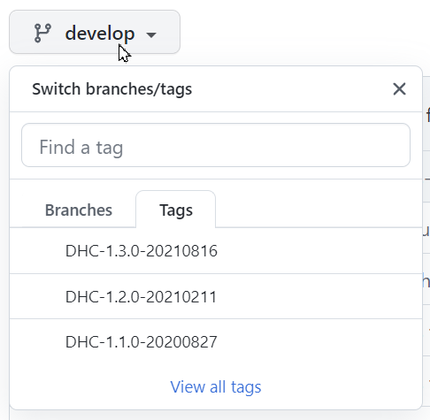

# VCS Documentation

This repository is intended to store full VCS documentation.  
Some development-only documents are stored on the VCS Documentation GitHub wiki and Confluence.

If you want to view the documentation with formatted graphs and a rendered table of contents, visit [GitHub Pages](https://sturdy-telegram-b864ffc2.pages.github.io/)

# [The intended way to read VCS Documentation is on GITHUB PAGES](https://sturdy-telegram-b864ffc2.pages.github.io/)

# Remember to switch the documentation version to correspond to your installed VCS version

LCM documentation is an exception to this.

