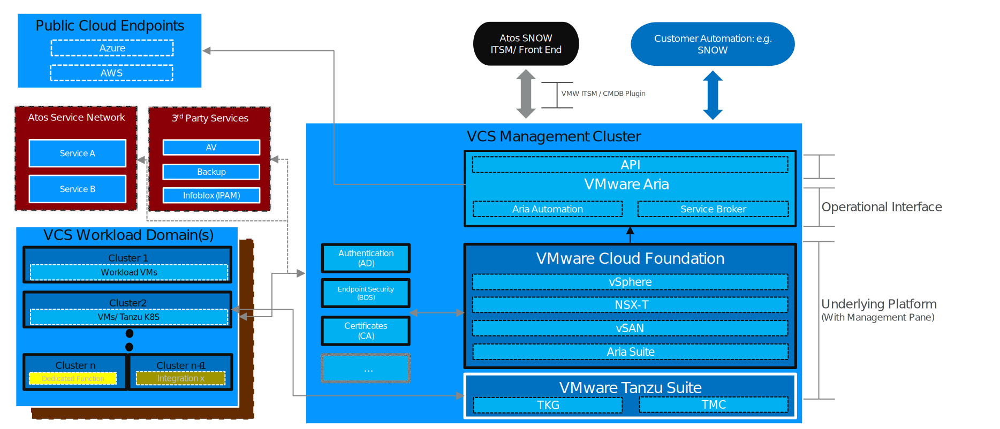
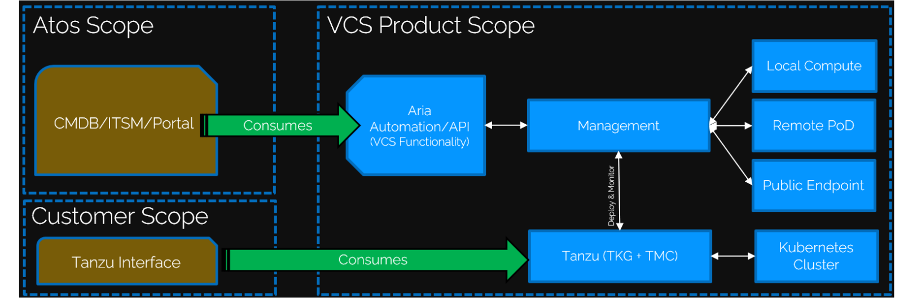
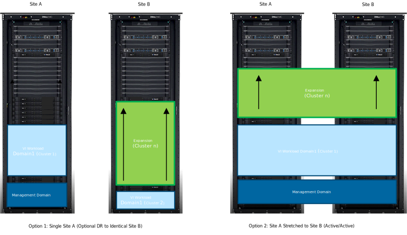
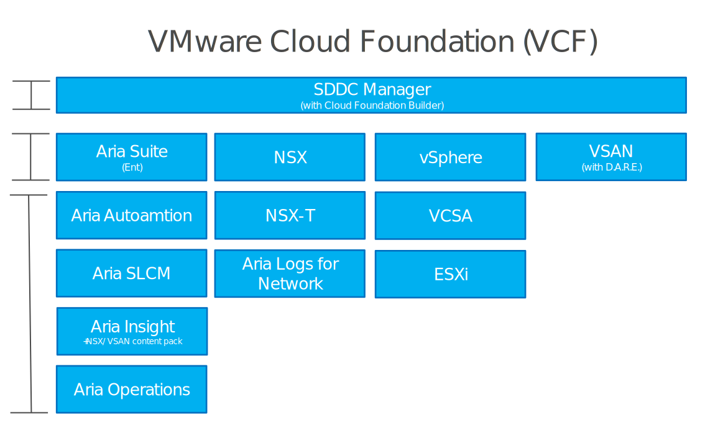
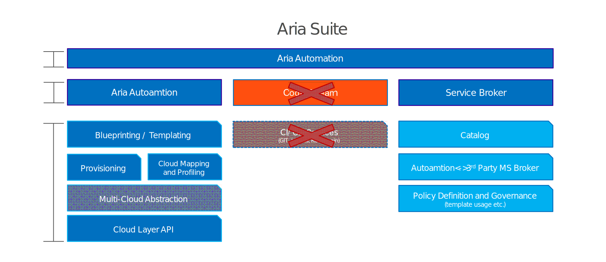
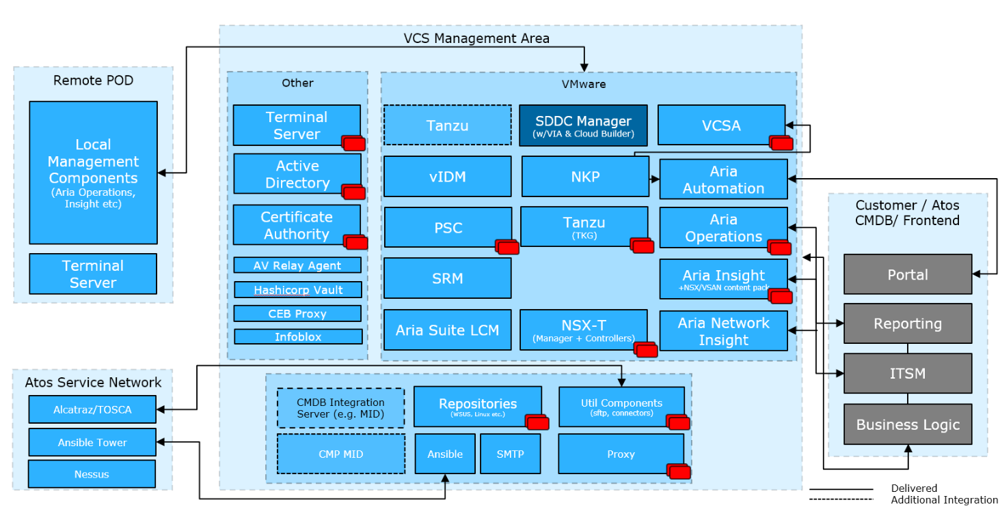
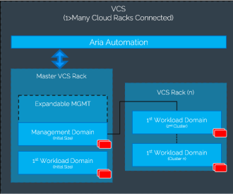
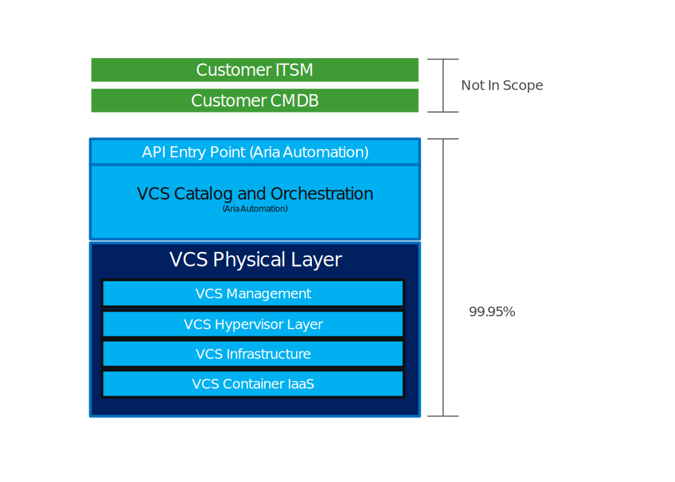

# VMware Cloud Services: High Level Design

# Contents

- [VMware Cloud Services: High Level Design](#vmware-cloud-services-high-level-design)
- [Contents](#contents)
- [List of Changes](#list-of-changes)
- [Document Conventions](#document-conventions)
- [Introduction](#introduction)
  - [Purpose](#purpose)
  - [Audience](#audience)
  - [Scope](#scope)
    - [Deliverables in Scope for VCS](#deliverables-in-scope-for-vcs)
    - [Deliverables Out of Scope for VCS](#deliverables-out-of-scope-for-vcs)
  - [Related Documents](#related-documents)
    - [Sales Documentation](#sales-documentation)
    - [Costing and Feature Request](#costing-and-feature-request)
  - [Requirement Levels](#requirement-levels)
- [Product Design Overview](#product-design-overview)
  - [Management Levels](#management-levels)
  - [Core Platform Capabilities](#core-platform-capabilities)
  - [Business and Solution Requirements](#business-and-solution-requirements)
  - [Networking Considerations](#networking-considerations)
  - [Platform Features](#platform-features)
    - [SSRs Available](#ssrs-available)
  - [Automation of Deployment and Configuration](#automation-of-deployment-and-configuration)
    - [Automation Capability Functional Requirements](#automation-capability-functional-requirements)
    - [Automation Capability Non-Functional Requirements](#automation-capability-non-functional-requirements)
- [High Level Design Overview](#high-level-design-overview)
  - [VCS Service Component Overview](#vcs-service-component-overview)
    - [Hardware Layer Components](#hardware-layer-components)
    - [VMware Cloud Foundation Components (Management Components)](#vmware-cloud-foundation-components-management-components)
    - [Aria Suite Services Components](#aria-suite-services-components)
  - [Tanzu Container Infrastructure and Services (Optional)](#tanzu-container-infrastructure-and-services-optional)
    - [Additional Tanzu Suite Components](#additional-tanzu-suite-components)
    - [Container Capability Functional Requirements](#container-capability-functional-requirements)
    - [Container Capability Non-Functional Requirements](#container-capability-non-functional-requirements)
    - [Tanzu Architectural Detail](#tanzu-architectural-detail)
  - [Fibre Connected Storage (Optional)](#fibre-connected-storage-optional)
    - [Fibre Connected Block Storage Architecture Summary](#fibre-connected-block-storage-architecture-summary)
    - [Design Principles](#design-principles)
    - [Fibre Channel Block Storage Logical Design](#fibre-channel-block-storage-logical-design)
    - [Converged Storage Deployment - Minimum Config](#converged-storage-deployment---minimum-config)
    - [Storage Pool](#storage-pool)
    - [LUN (Logical Unit Number)](#lun-logical-unit-number)
    - [Multipathing Software](#multipathing-software)
    - [Data At Rest Encryption](#data-at-rest-encryption)
    - [Compression and Deduplication](#compression-and-deduplication)
    - [Replication Support](#replication-support)
    - [Fibre Channel Switches (Cisco/Brocade)](#fibre-channel-switches-ciscobrocade)
    - [Zoning](#zoning)
    - [Hosts](#hosts)
    - [Monitoring and Reporting](#monitoring-and-reporting)
    - [Dial Home](#dial-home)
    - [Availability Design](#availability-design)
    - [Component Failure](#component-failure)
      - [SAN Components](#san-components)
    - [System Failure](#system-failure)
    - [Service Level](#service-level)
  - [Overarching VCS Design Requirements Table](#overarching-vcs-design-requirements-table)
    - [External Dependencies](#external-dependencies)
      - [Bandwidth and Latency](#bandwidth-and-latency)
  - [Management Topology](#management-topology)
    - [Management Deployment](#management-deployment)
  - [Target Platforms](#target-platforms)
    - [Management](#management)
  - [VCS Platform Toolset](#vcs-platform-toolset)
  - [Availability Management](#availability-management)
  - [Service Continuity](#service-continuity)
  - [Workload Management](#workload-management)
  - [Container Management](#container-management)
  - [Security Management](#security-management)
    - [Role Based Access Control](#role-based-access-control)
    - [Micro-Segmentation](#micro-segmentation)
    - [Scripted Hardening](#scripted-hardening)
    - [Dedicated Networks](#dedicated-networks)
    - [Firewalls](#firewalls)
    - [Patching](#patching)
    - [Certificates](#certificates)
    - [Encrypted Password Store](#encrypted-password-store)
    - [Vulnerability Scanning](#vulnerability-scanning)
    - [Endpoint Protection](#endpoint-protection)
    - [Internet Whitelisting](#internet-whitelisting)
    - [TLS Capability](#tls-capability)
  - [Monitoring](#monitoring)
    - [Monitoring of the management stack](#monitoring-of-the-management-stack)
    - [Monitoring of the network equipment (TOR switches and Firewalls)](#monitoring-of-the-network-equipment-tor-switches-and-firewalls)
    - [Monitoring of the Platform](#monitoring-of-the-platform)
  - [Availability Scalability and Service Levels](#availability-scalability-and-service-levels)
    - [Availability](#availability)
    - [Key Availability Technology](#key-availability-technology)
    - [Scalability](#scalability)
  - [Automation Capabilities of Migrated/Imported VMs](#automation-capabilities-of-migratedimported-vms)
  - [Raw Device Mapped Drives in VCS](#raw-device-mapped-drives-in-vcs)
    - [Virtual Server Clustering](#virtual-server-clustering)
  - [Recoverability](#recoverability)
    - [Data Protection Requirements](#data-protection-requirements)
    - [Data Protection Solution](#data-protection-solution)
    - [High Availability](#high-availability)
    - [Disaster Recovery](#disaster-recovery)
      - [Multi Site DR](#multi-site-dr)
  - [Reporting](#reporting)
  - [Software Versions and Licensing](#software-versions-and-licensing)
- [Lifecycle Management](#lifecycle-management)
  - [Software Stack LCM](#software-stack-lcm)
  - [Hardware LCM](#hardware-lcm)
- [Decarbonisation and Power Design](#decarbonisation-and-power-design)
  - [Decarbonisation](#decarbonisation)
  - [Power Design](#power-design)
- [Operating Model](#operating-model)
  - [Billing and Metering](#billing-and-metering)
    - [Compute and Memory Usage](#compute-and-memory-usage)
    - [Storage Usage](#storage-usage)
    - [Network and IO Usage](#network-and-io-usage)
- [Conclusions](#conclusions)
  - [General Statements](#general-statements)
  - [Open Issues](#open-issues)
  - [Low Level Designs and Build Documents](#low-level-designs-and-build-documents)
- [Next Steps](#next-steps)
- [Appendix A Configuration Maxims](#appendix-a-configuration-maxims)

# List of Changes

| Date       | Change Detail                                                                                 | Author           |
|------------|-----------------------------------------------------------------------------------------------|------------------|
| 24-03-2025 | Documentation pass for VCS 2.0 and branding change (diagrams updated)                         | Alec Dunn        |
| 16-04-2025 | Completed 1st pass of rework. Created pull request and review                                 | Alec Dunn        |
| 28-04-2025 | Changes based on Oliver S review                                                              | Alec Dunn        |
| 08-02-2026 | Updated platform features for VCS 2.1 - security, networking, operations enhancements         | Radoslaw Dabrowski  |

# Document Conventions

This document is an evolving piece of work. And the design element specified within cover the High-level deliverables for this version of VMware Cloud Services (VCS). As this is a staged development with Engineering happening via SAFe We have the following conventions:

Text in normal paragraphs relates to features or information that form the product as it is in this version.

>Text indented and lightened (Such as this) relates to a design decision or goal that is decided for VCS but is yet to be engineered as a demonstrable feature. These elements are kept in the document as they have an implied baring on the design of other elements of a VCS implementation and, therefore, should be taken in to account.  
>For example, VCS features required to be designed for Version 1.5 and 1.6 that have bearing on the basic design will be included and outlined in a text box such as this. These are 'future' deliverables but still part of the overall design.

# Introduction

## Purpose

The aim of this document is to provide a high-level design overview of the Atos VMware Cloud Services (VCS) product with the architectural specifications and guidance required to inform the design of all subsequent components used to make up the VCS service.

This document shall also translate the L4D into technical components that can inform all lower level technical documentation. This will create a relationship between portfolio artifacts and engineering delivered artifacts produced as part of the Atos Technical Lifecycle Management (ATLM) process.

The HLD provides a high-level technical view of the service from an “outside in” perspective and will outline all major technical decisions made for the service. The Low-Level Design(s) will expand on this by describing the detailed configurations and settings that are required to successfully implement these design choices.

This document is created by the Lead Technical Architect/Enterprise Architect (Cloud engineering) for the service with assistance from the Product Manager (Portfolio) and the Digital Content Architect (Engineering). An L4D is created prior to this document.

## Audience

This document is intended as a starting point for solution managers planning to provide the service for customers or other Atos personnel outside of the service who need to understand the technical definition of the service for VCS. It provides guidance and clarification of service deliverables and design principles. This document is classified as **Internal only.**  Do not re-use any element of the HLD "as-is" for customer documentation or design.

## Scope

### Deliverables in Scope for VCS

The scope of the VCS product covers the following:

- The creation of a multi-tenant, scalable, highly automated Private / Hybrid Cloud solution that can be deployed for a single customer (dedicated) or into an Atos datacenter to host multiple customers as a multi-tenant platform. It is built upon VMware’s VCF software stack.

- The ability to host containers\modernized applications either in a dedicated workload cluster or mixed with other VMs in a normal VM workload cluster using multiple container technologies (i.e. semi-agnostic, customer choice).

- The creation of a management stack integrated into the cloud product that is scalable in terms of power/capability and features. i.e. has the ability to be fit for purpose with smaller deployments with the ability to scale to larger, feature rich, high performance deployments.

- Automated build and Lifecycle Management (LCM) of the product will be built into the design allowing faster, more reliable, deployment and management than previous versions of older Atos cloud products (DPC, EPC, DDC, DHC). Lifecycle updates shall be automated as much as possible.

- A single point of consumption for all product features and functions via the presentation of capabilities and/or constructs as Application Program Instructions (APIs) or Aria automation entities published and documented for external consumption via Aria Automation (API) or Service broker (Portal). Optionally via an Atos ATF/Portal integration or direct to the customer.

- Access to the VCS product for administration purposes (e.g. Atos Data Center Hosting) is expected to be via the VCS management stack via Terminal servers.

- Capability to be compliant to numerous security standards such as Atos TSS and enhanced TSS, PCI/DSS etc. (certifications detailed separately).
  - **NOTE**: VCS ‘the product’ is not (and cannot) be certified to be PCI compliant. However, all design decisions taken here will be done with PCI and other security standards requirements in mind so that VCS can be implemented as part of an end to end, PCI compliant / Standard X complaint, private cloud design. For example, A customer PCI compliant solution will consists of a VCS in conjunction with consultation and solution design with the account team and Atos PCI experts.
  - **NOTE**: Atos TSS Standards are constantly evolving. As such, standards relevant to this are not directly called out in this or any other VCS documentation.

- The creation of a system or process to import/ migrate customers **workloads** from previous Atos cloud products and hosting services into VCS via engagement of an internal (Atos) migration team.

- The creation of basic functionality blocks within Aria Automation that can be used as the basis for Atos to create customer functionality.

- Multi-tenancy of VCS. VCS will offer Multi-Tenant capabilities. The system will allow for the separation of customers within a VCS allowing for 'distinct legal entity/department' type scenarios. VCS is still owned and operated by a single, master customer. i.e. The management area of VCS is shared by all tenants and not split/duplicated. It is not the intention of VCS to be able to provide 'service provider' type Multi-tenancy (i.e. one with self service sub-IaaS provisioning and 'reseller' type scenarios). It is, however, possible for Atos to host multiple clients as sub-tenants in a flexible way. IN this case Atos is the master customer.

- Backup and DR: VCS will be capable of Active/Active DR (Default, Stretched Cluster) and Active Passive DR (Site A > failover > Site B) or mixed mode Active Passive DR (Site A << >> failover << >> Site B) and will be designed with backup and recovery abilities for the management of the product.

- VCS will include integrated endpoint protection (via Atos security services "Trend Micro" solution) and vulnerability scanning (Via Nessus) for the management stack. This provides a high level of security and audit visibility as standard.

- The option to deploy customized "self-managed" VMs on to the VCS will be provided to allow customers to deploy and run custom OVA or internally secured OS images on the VCS.

### Deliverables Out of Scope for VCS

The Following Areas are explicitly **out of scope** of the product:

- The Creation of a direct **upgrade** path for all customers on legacy cloud products such as EPC and DDC. These should be handled via an engagement with Atos Technology Services (TS) at a local level.
  - **NOTE:** This does not mean workload can’t be *migrated* rather a feature parity and HW reuse is not implied or supported.
- The creation of a direct **upgrade** path from DPC 3.x/4.x to VCS.
  - Customers on older DPC 3.x/4.x releases will be expected to **migrate** workloads into this new platform via a one-off project.
    - Customers will be expected to be on an N-2 version of DPC 4.x for this to be a supported path. E.g. DPC 4.5.4 is current release so DPC 4.5.2 is the last supported baseline version for migration.
- The integration of VCS with Atos ATF 2.0. This is an “Atos” deliverable (i.e. not an engineering effort, rather an onboarding effort). VCS ‘The Product’ will present all functionality as an API. This is where the ‘product’ stops.
  - It is expected that integration with other Atos services will form a separate requirement and design outside of the core VCS product. Please see the related RACI matrix for information on who is responsible.
- Integration with a customer ITSM system. This is, by default, a bespoke/custom undertaking and is out of the scope of the standard product.
- Feature parity between legacy platforms (DPC, EPC, DDC) and VCS. VCS is a new product offering the functionality most used or requested by customers
- The inclusion of specific customizations for individual customers. Either in legacy products or existing VCS installs. VCS is a stand-alone product with defined capabilities.
- Features supplied by other Atos services or business lines. Integrations can be done on request but are not covered in the scope of this base design.
- Direct integration with non-Atos supplied HW or non-standard HW that deviates from **basic** vSAN ready node status.
  - **NOTE**: Some vendors will list servers as "HCI" but they have proprietary "value add" baked in (examples of this are Dells VxRail and PowerFlex systems). These are **not** compatible with VCS.
- Any standards not explicitly called out as a product feature (HIPPA CIS etc.)
- Delivery of "SSRs" in to a customer front end (such as ATF2.0) . VCS provides functionality at the Aria Automation(API)/Service broker (Portal) level (rather than the customers front end) to allow for the integrator (Atos) to create front end and functionality for customer on an individual basis (reusing any prior functionality). Delivered functionality can then be used to make end to end actions or solutions for a customer.
- Creation of any 'layed on' services. VCS is responsible for the underlying IaaS of the cloud platform. Services such as 'Managed Operating systems', 'Managed Containerized Applications' and the running/maintenance of 'Application blueprinting stacks' and not part of the standard service.

## Related Documents

VCS technical documentation and code is stored as a dynamic library in the following location. All relevant technical guidance and design is available here in a version-controlled repository. Note: This replaces the legacy ATLM/SharePoint style of documentation publishing from previous products and releases.

[VCS Documentation - GITHUB](https://sturdy-telegram-b864ffc2.pages.github.io/)

Some collateral for sales teams is available outside of the technical library this is available below:

### Sales Documentation

[VCS Offering on Portfolio Main Site](https://salesservice.myatos.net/overall/en/index.cfm?id=935547&)

### Costing and Feature Request

Features can be requested at the link below for VCS as can the current cost model be viewed. All feature requests and clarifications need to go via the product and architecture team. Currently:

- Portfolio Owner: Roxana-Ionela Grancea
- Product Owner: Oliver Scholle
- Technical Cloud Architect: Alec Dunn
- Engineering Lead: Sameer Mhatre
- Cloud CTO: Bob Seddigh Tehran

[AHA Feature request portal](https://atos-cloud.ideas.aha.io/portal_session/new)

[VCS MAIA model](https://atos365.sharepoint.com/sites/690002523/maia)

[VCS Bill of Materials](hldDigitalHybridCloudBOM.md)

## Requirement Levels

This document details many design requirements and decisions. These are categorized with the following labels.

| **Term**   | **Meaning**                                                                                                                                                                                           |
|------------|-------------------------------------------------------------------------------------------------------------------------------------------------------------------------------------------------------|
| MUST       | This definition is an absolute requirement of the VCS specification.                                                                                                                                  |
| MUST NOT   | This definition is an absolute prohibition of the VCS specification.                                                                                                                                  |
| SHOULD     | There may exist valid reasons in particular circumstances to ignore a particular item, but the full implications must be understood and carefully weighed before choosing a different course.         |
| SHOULD NOT | There may exist valid reasons when a specific behavior is not recommended. The full implications should be understood, and carefully weighed before implementing any behavior marked with this label. |
| MAY        | Any design decisions that are not classified as MUST and SHOULD or cover optional features not generally available for VCS product are tagged as ‘MAY’.                                               |

# Product Design Overview

The VCS product is a Private/Hybrid cloud solution that can be deployed in a dedicated fashion for a customer. Either into Atos datacentre or customer’s datacentre as long as there is a secure connection to the internet for consumption of connected services and updates as well as VPN access for Atos administrator personnel. The product can be deployed at small (400 VM+) or large (Multi Site) scale dependent on requirement. This allows a customer to extent or leverage various public cloud vendor endpoints whilst also retaining private cloud functionality and a single pane of glass management overview.

Additionally, the product can be deployed as a Multi-Tenant platform in an Atos datacenter allowing for multiple smaller customers to reside on the same hardware.  This is most suited to customers with less than 500 VMs but is viable for any single site customer.  The VCS product can provide multiple types of Multi-Tenant segregation. These are described later in this document.

A conceptual overview of VCS is shown below.

Figure 1 VCS Architecture Overview

A VCS solution is built around the concept of:

**“CMDB/ITSM/Portal interface”** *\<\<consumes\>\>* **Aria\API\SB Presented Features”** *\<\<via\>\>* **“VCS Management”** *\<\<to\>\>* **“Cloud PODs”**

These terms are defined as:

- **CMDB/ITSM/Portal interface**: The interface the customer connects to the VCS product to consume functionality. (For example: Atos SNOW via HTTP gateway server) or Customer SNOW via custom interface. **NOTE:** This (custom) element is outside the scope of the standard VCS ‘product’ and is considered an integration activity to be scoped and costed well in advance of any go live date.

- **Aria Automation\API Presented Features**: VCS features are consumed via the Aria Automation Service Broker or API and will be defined in the L4D and associated documentation. All VCS functionality is presented towards the customer via this method. This includes provisioning **container infrastructure** and **VMs** as well as any forward connectivity to other **landing zones** (e.g. Public cloud services)

- **VCS Management**: The control and orchestration layer of the product consisting of VMware Cloud Foundation (VCF) including VMware Aria Automation (formerly vRA) and Tanzu Kubernetes Grid at its core. This is responsible for the command and control of the service requests, provisioning and monitoring container infrastructure, cloud PODs and monitoring, reporting and logging etc.

- **Cloud PODs**: A collection of servers in racks that make up a single, physical, location. These host management and VM workload domain endpoints for VCS payload. Consisting of multiple nodes of HyperConverged compute and storage, these PODs can be used to host traditional VMs or containers (Via future implementation of Tanzu). There can be multiple PODs connected to and managed by the central VCS management cluster within a single location.

The boundaries of the product (vs a full customer solution) can be represented as below.  From this it is clear that a solution is built up from a VCS and an integration to ITSM of choice.

Figure 1a VCS Scope Overview

The solution shall be designed and built to conform to Atos Technical Security Standards (TSS) and baselines. It shall be built in such a way that other certification and compliance standards can be adhered to via specific customisations leveraging the modular nature of the platform. These will be applied as ‘plug in’ type options that don’t tie themselves to the rest of the architecture and, as a consequence, need to be specified in addition to a standard VCS design.

The solution will be built in a scalable way to enable use within small to large customers, dedicated or multi tenant. This will be achieved by leveraging a core management and orchestration capability built in a modular and automated fashion utilising:

- **VMware Cloud Foundation (VCF)**: This will provide core IaaS functionality for the platform using vSphere, NSX-T, vSAN and the Aria suite. This is considered the core of the infrastructure and is lifecycle controlled by VMware as a single entity allowing for easy customer updates and security patching via SDDC Manager, Aria Suite LCM and vSphere LCM.

- **VMware Tanzu Suite**: This will provide the provisioning and management of container infrastructure and namespaces within VCS. This will form the "route in" for customers to deploy and manage containers on the platform. This will be customer facing via Tanzu Mission control and access to Kubctrl interface. In VCS, the **Tanzu suite** is an overarching term for the collection of VMware tools that make up Tanzu.

- **Flexible HyperConverged Platform**: Using HyperConverged hardware allows simple scale out/scale up capability for the platform as a whole. i.e. Disk groups can be added to existing hosts to expand storage or entire nodes can be added to scale compute, memory and storage at the same time.

- **Optional Fibre Channel Storage**: Although VCS is primarily designed to be a HyperConverged platform it is supported and possible to attach Fibre Channel(FC) based SANs (Only FC) to the workload clusters of a VCS. This is to allow reuse of expensive assets or satisfy the demands of a heavily storage based customer. Functionality of this is limited vs that of vSAN with regards to VCS automation. The operation and configuration of any external storage is the responsibility of the storage team and is **not** intended to be covered by VCS automation or LCM. **This is by design.**

Additional features available in VCS (either as standard or as an option) are delivered into the system via the tooling interface and network zones. This allows for add on services such as Anti-Virus or adherance to various security certifications to interface with the core VCS MGMT layer without causing bloat or interoperability issues for customers.

Functionality is consumed via the Published API\Aria Automation catalog items. This is expected to be consumed via integration with an Atos ITSM offering (**Example**: ServiceNOW) or directly from a customer’s ITSM system via a transformation project. This concept allows VCS to be consumed by customers that may not want or need the full Atos End to end service. It, therefore, means that integration with ATOS SNOW is outside the scope of the core VCS ‘product’. Container functionality is consumed via TMC and Kubctrl.

Typical users of the VCS system will be either Atos administrators looking after the system as part of a managed services contract, accessing the management area directly or customers consuming VCS services via the API with Atos looking after the back-end infrastructure.

VCS is designed to run on any VCF compatible Hardware. In practice, this means any ‘VSAN ready’ certified node such as Dell R760 servers, Bull Sequana (SA series) or other manufacture conforming to vSAN Read Node standards etc. The only constraints are a minimum set of hardware requirements to enable VCS to run its management stack and provide a minimum level of performance and that the vSAN ready Nodes must be “Pure/Basic” nodes (i.e. **NOT** VxFlex, VxRail or VxRack where a vendor layers constraints on top of a vSAN node).

VCS is be built and deployed in a modular way. Add on services such as VMware Tanzu Kubernetes Grid can be leveraged and deployed via the provisioning of additional workload clusters within a VCS at customer request.
Likewise, extending a customer on premises network to a supported cloud endpoint is capable via the used of VMware HCX. In these instances care should be taken to ensure that latency sensitive applications do not need to cross the link as this is a translation layer not a local connection.

## Management Levels

The service will abide by the NIST definition of IaaS as shown below:

*Infrastructure as a Service (IaaS). The capability provided to the consumer is to provision processing, storage, networks, and other fundamental computing resources where the consumer is able to deploy and run arbitrary software, which can include operating systems and applications. The consumer does not manage or control the underlying cloud  infrastructure but has control over operating systems, storage, and deployed applications; and possibly limited control of select networking components (e.g., host firewalls).*

As such, the VCS service will provide compute, storage, container and networking capabilities as well as automation for deploying and managing workloads on top of the platform.

Management of the payload operating system can be provided by Atos DataCenter Hosting team (DCH) as part of a standard Managed Server OS service (default, Managed OS offering) or can be provided by the customer themselves (Un-Managed OS) or an alternative supplier.

Image based backups of the solution will be provided by the Canopy Enterprise Backup (CEB) service in order to allow for consistent backup services and reporting across all platforms. Restore functionality is provided out of the CEB interface in all cases.

Application aware backups will be provided as part of a workload management service, which *could* include Canopy Enterprise Backup or an alternative solution via a customer customisation. This is not an automated, out of the box, feature. Rather, an option for Managed Operating system services.

Backups of containerized applications are handled by an optional add-on provided by 3rd party software

Disaster Recovery capabilities of workloads will be provided natively by the service as an option for each workload as:

- Active/Passive (A Fails over to B)
- Active/Passive (A Fails over to B, B Fails over to A) (each site is 50% loaded)
- Active/Active (Two sites are stretched and operate as a single site with capacity to restart VMs from one site on the other in the event of a failure in an HA consistent way).

Disaster Recovery for VCS management is optional **only** when implementing VCS in a single site and provided as an active/passive setup (default) when a multi-site implementation is required.  VCS DR is available in both HCI and FC storage offerings.

Reporting, monitoring and logging functionality is provided by the inbuilt VCS toolsets and leverages VMware VCF standard toolsets (Aria Logs, Aria Operations, Aria Network Insight).

**NOTE:** Other integrations with Atos services are possible via a lockstep approval.

## Core Platform Capabilities

VCS consists of a number of component features. These are shown below.

| Capability                              | Provided by Service              | Automation Provided |
|-----------------------------------------|----------------------------------|---------------------|
| Modern SDN Capability                   | VCS (NSX-T)                      | Yes - VCS           |
| Storage Capability (vSAN)               | VCS                              | Yes – VCS           |
| Compute Capability (vSphere)            | VCS                              | Yes – VCS           |
| Virtual Server Capability               | VCS                              | Yes – VCS           |
| Network Monitoring                      | VCS - Aria Insight for Networks  | Yes – VCS           |
| Storage Monitoring                      | VCS - Aria Operations            | Yes – VCS           |
| Compute Monitoring                      | VCS - Aria Operations            | Yes – VCS           |
| Capacity Monitoring                     | VCS - Aria Operations            | Yes - VCS           |
| Virtual Server Monitoring (VM level)    | VCS - Aria Operations            | Yes – VCS           |
| Server OS Capability                    | DCH Datacentre Hosting svcs      | N/A – UNDEFINED     |
| Server OS Patching (Customer)           | DCH Managed Server/other         | N/A - UNDEFINED     |
| Server OS Patching (MGMT)               | VCS - Ansible / Python           | Yes – VCS           |
| Server OS Monitoring                    | DCH Managed Server/other         | N/A - UNDEFINED     |
| Workload Server Clustering              | VCS - Windows WSFC Only          | No                  |
| Server Image Backup                     | Canopy Enterprise Backup         | Yes - VCS           |
| Active\Passive DR                       | VCS - SRM + vSphere Replication  | Yes – VCS           |
| Active\Active DR                        | VCS - Stretched Clusters         | Yes – VCS           |
| Data at Rest Encryption                 | VCS                              | Yes                 |
| Antimalware protection (MGMT)           | BDS                              | Yes – VCS           |
| Antimalware protection (Customer)       | BDS - Optional                   | No                  |
| Multi-tenancy Support\Operation         | VCS                              | Yes - VCS           |
| Management Stack Vulnerability Scanning | VCS                              | Yes - VCS           |
| Validated Lifecycle Management Upgrade  | VCS                              | Yes - VCS           |
| Migration from DPC to VCS               | Atos                             | Yes - HCX           |
| Basic front end Portal                  | Service Broker                   | Yes                 |
| Container IaaS Capability               | VCS - Tanzu Kubernetes Grid      | Yes - VCS           |
| Container IaaS & Namespace Management   | VCS - Tanzu Mission Control      | Yes - VCS           |
| Public Cloud Landing Zone for VMs       | VMC                              | Yes - VCS           |
| External Storage Capability             | VCS                              | No                  |
| Non-vSAN Principal Storage              | Storage Team, Fibre Channel Only | No                  |
| Storage IOPS Limitations                | VCS - vSAN Only, FC - 3rd Party  | Yes - VCS           |

## Business and Solution Requirements

The table below provides known requirements that must be incorporated into design decisions of VCS described in this HLD.

| **ID**  | **Requirement description**                                                                                               | **Requirement Source**                                                                           | **Req Level** |
| ------- | ------------------------------------------------------------------------------------------------------------------------- | ------------------------------------------------------------------------------------------------ | ------------- |
| R001    | VCS requires hardware nodes to be Basic vSAN ready node certified                                                         | VCF Requirement, MGMT mandatory, WL must conform but doesn't require population                    | MUST          |
| R002    | VCS Product exposes functionality via API\Aria Automation\Service Broker\SNOW integration                                | Market driven to allow flexible consumption not tied to a particular ITSM/CMDB/Frontend          | MUST          |
| R003    | VCS install will be automated and driven by configuration files not via wizards                                           | Atos desire to make deployment and support more predictable, cheaper and easier                  | MUST          |
| R004    | The Management stack will be patched regularly in accordance with Vendor recommendations and road maps                    | Best practice / Atos operational standard                                                        | MUST          |
| R005    | All VCS workload networks  will be based around the concept of Software Defined Networking via NSX-T                      | Market Expectation. Allows for expected policy driven control and advanced network capability    | MUST          |
| R006    | VCS will provide the capability host Kubernetes workloads via Tanzu Kubernetes Grid or 3rd party integration.             | Market requirement for a private cloud solution to be capable of leveraging containers           | SHOULD        |
| R007    | VCS will provide DR capability for the management stack and  VM workload areas (per VM DR) (Failover) as an option        | Standard market expectation to be able to have DR of a cloud platform.                           | MUST          |
| R008    | VCS will be able to provide integration to Atos backup services for standard workload VMs via the use of CEB              | Market expectation and Atos requirement to be able to provide basic service                      | MUST          |
| R009    | VCS will provide the capability to let customers optionally backup containers if required.                                | Market requirement for some form of backup for stateful containers                               | SHOULD        |
| R010    | VCS will provide a method for allowing integration with 3rd party ITSM/CMDB systems (Integration out of scope).           | Requirement to allow more than just Atos owned solutions to consume VCS.                         | SHOULD        |
| R011    | VCS Will provide the Logging and reporting Data via the standard VMware toolset and make data available to other tooling  | Business requirement to provide flexible options                                                 | SHOULD        |
| R012    | VCS Will provide customer configuration as a version-controlled entity and be deployable as "VCS + Desired state".        | Driving DevOps principles into the VCS product allowing automatic customer deploy and configure  | SHOULD        |
| R013    | VCS will provide patches and upgrades as updates to the initial config. Pushed out via the DevOps pipeline                | Fast, tested, robust updates to the stack are pushed out as, essentially, configuration changes  | MUST          |
| R014    | VCS will provide the ability for customer to consume Public cloud as a VM endpoint                                        | Enables customers to transition to public cloud in environment they understand                   | SHOULD        |
| R015    | VCS will not be locked in to a particular HW vendor nor funnel the customer town a specific model / HW solution           | Customer requirement for flexibility. Engineering requirement for automation.                    | MUST          |
| R016    | VCS will provide the ability to create application blueprints for deployment within the cloud                             | Customer driven requirement. Future looking                                                      | SHOULD        |
| R017    | VCS Management networks will remain SDN based (NSX-T) unless connectivity to physical realm is required                   | At this point Networks will use vDS to communicate with physical devices                         | SHOULD        |
| R018    | VCS Will support Multi-tenancy in three basic ways but not inan ISP like "self service" way                               | Market Demand for large company, Tenant\Dedicated, Tenant\Shared, Tenant\sub-tenant\shared       | MUST          |
| R019    | VCS will support the importing of Workload from a legacy platform and allow day 2 functionality to be consumed on this VM | Accounts transition from DPC to VCS require a smooth entry ramp                                  | SHOULD        |
| R020    | VCS will Public Cloud Landing Zones for the VM workloads via integration ot other Atos offerings                          | Market demand for integration with Hyperscaller environments.                                    | MUST          |
| R021    | VCS will offer the ability for workload clusters to leverage Fibre Channel SAN storage as principal storage               | market demand                                                                                    | SHOULD        |

## Networking Considerations

VCS has a number of networking considerations that should be taken in to account when specifying/designing a VCS solution. Physical networking is taken care of by CNT and they have the following requirements for the VCS solution.

| **Item**                 | **Qty**                                        | **Notes**                                                    |
|--------------------------|------------------------------------------------|--------------------------------------------------------------|
| Top of Rack Switches     | 2 per rack                                     | Juniper QFX-5120 or **NEWER** (5100 not supported)           |
| ToR Interlink            | 1 per pair of switches                         | For HA stacking                                              |
| Physical Firewall        | 1 per VCS installed                            | Optional/Solution dependent FW for protecting L3 egress      |
| Internet connection      | 1 per VCS                                      | Via MGMT proxy or customer proxy 50Mbit or more recommended  |
| DC connectivity          | 1 x Layer 3 access to customer DC per VCS site | Layer 3 access required when exiting VCS PoD\Site            |
| Host connectivity        | 2 x physical uplinks per host                  | 25Gbps required (40Gbps possible)                            |
| Management Connectivity  | 1 x physical uplink per host                   | 1Gbps management connection                                  |
| Out of Band Management   | 1 x Cyclade + 1 x Firewall                     | Avocent AC8008 or similar, Cisco ASA or similar              |
| Stretched Clusters       | 1 x vSAN witness (external) + L3 connectivity  | witness must be hosted outside VCS and have L3 routing to it |

## Platform Features

The following VCS features are provided within VCS. This section describes the capabilities of the platform as well as any caveats. A list of functionalities that the product is able to provide can be found here:

<https://atos-ppm.aha.io/products/VCS/feature_cards>

| Feature                                                      | Description                                                                              | Caveats                                                                                                                      |
|--------------------------------------------------------------|------------------------------------------------------------------------------------------|------------------------------------------------------------------------------------------------------------------------------|
| **Automatically Deploy & run Virtual x86 workloads on prem** | The ability to deploy and run virtual server workloads within the private cloud.         | VCS supports a limited set of OS versions (see configuration maxims in Appendix                                              |
| **Functionality consumable via API\Portal**                  | VCS will present all functionality out via a consumable API or portal                    | Portal functionality created by Atos. Consumable by the customer via Service Broker or API                                   |
| **Management of Deployed Customer Workloads**                | Customer workloads are managed independently by Atos, customer or 3rd party teams.       | N/A                                                                                                                          |
| **Patching & Compliance of Customer Workloads (Managed OS)** | Customer workloads are patched and updated  by Atos when using the managed OS service.   | Applies to Atos provisioned/Managed OS Customer VMs                                                                          |
| **Patching & Compliance of VCS Management**                  | VCS Will provide automated patching and compliance scanning for all management VMs       | Aligned with Vendor recommendations, Atos TSS and VCF recommendations/schedules                                              |
| **Backup of Deployed Customer Workloads (traditional)**      | Customer backup\restore functionality at image level using Canopy Enterprise Backup      | Agent backups dependent on Avamar agent availability. Throughput governed by DataDomain interface speed.                     |
| **Ability to connect Fibre Channel based SAN storage**       | Ability to connect FC based storage SANs to VCS as primary storage in place of vSAN      | This is FC ONLY and ONLY on the workload cluster Management continues to require vSAN as primary storage.                    |
| **Backup for management domain**                             | All MGMT servers are regularly backed up as per agreed SLA via DataDomain and CEB        | Backup target MUST be physically segregated from Backed up load (i.e. differnt location)                                     |
| **VCS Management DR**                                        | Active\Active or Active\Passive DR is available as an option for VCS MGMT                | Active\Active stretched clusters has networking with a 5ms RT limit. Re-IP of MGMT not supported                             |
| **Ability to choose target cloud POD**                       | Ability to target PoD via a 'Friendly' name (e.g. "London-South") or policy (e.g. "DEV") | Tagging is a setup time activity (part of onboarding)                                                                        |
| **Data at Rest Encryption**                                  | VCS has Data At Rest Encryption on all Private Cloud PODS. (vSAN encryption)             | Makes KMS solution mandatory. Supported method is vSAN encryption                                                            |
| **Block Storage**                                            | Default storage is 'block' storage, grouped per cluster.                                 | No per VM encryption is possible. vSAN file services to be appraised in future version                                       |
| **Storage Virtualisation**                                   | Storage is virtualised via vSAN using commodity disks (No SAN, No Controllers etc.)      | External FC connected storage (e.g. DellEMC Unity) can be attached after initial setup. NOT as part of the MGMT domain       |
| **Network Virtualization**                                   | All VCS internal networking is virtualised within the stack. (NSX-T)                     | NSX-V is no longer supported VCS                                                                                             |
| **Access to workloads via Security Group**                   | SDN rules and  groups can be used to add workload to security groups (Self service)      |                                                                                                                              |
| **Capability to Micro-segment workload**                     | Ability to implement micro segmented (Secure) network in customer workload               | Via NSX-T. Refers to capability not consultancy or cookie cutter options                                                     |
| **On Demand SW Defined Load balancing and Firewalling**      | Ability to create SDN Firewalls and Load Balancers via Portal and manage rules           | Via NSX-T. Consumable optional add ons for customer workload                                                                 |
| **Capacity Management**                                      | Capacity management (realtime, trend, etc) is available via dashboards and reports       | VM WL domains only. This does not apply to individual K8s constructs                                                         |
| **Performance Management**                                   | Performance management via vROps and can integrate to ITSM to raise ticket on faults     | Management of performance is provided by CO support team, dashboards are available to the customer giving realtime overview  |
| **Migration capability into the environment**                | Migration of workloads into a VCS is via the Cloudification team                         | Capability of migrated VM is dependent on OS type and service level (Managed, un-managed, self managed etc)                  |
| **DR for Workloads**                                         | DR for workloads is on a PER VM basis and is via SRM Active\Passive                      | Inter-site latency restrictions apply. Licensing restrictions for "Standard" SRM vs "Enterprise" SRM                         |
| **Support for Network Load Balancers**                       | VCS Supports virtual load balancers (via NSX-T) within customer workload domains         | Mandatory if deploying K8S                                                                                                   |
| **Multiple vNIC Support**                                    | VCS supports Multiple vNICs per VM in a workload domain                                  | Limit of 10                                                                                                                  |
| **Vulnerability scanning of MGMT stack**                     | Regular, automated scanning and reporting of vulnerabilities for MGMT stack              | Limited to scan and report at this time. No automatic remediation.                                                           |
| **Support for Atos Alcatraz Reporting**                      | Security reporting into a central Atos instance for reporting and analysis               | Management VMs only                                                                                                          |
| **Reporting Capability**                                     | Limited service reporting is included                                                    | MGMT domain only                                                                                                             |
| **Billing Capability**                                       | On Prem billing is included  for running workload                                        | On prem only                                                                                                                 |
| **Multi-Tenancy**                                            | Logical and Physical separation of distinct legal entities within the platform           | Not suitable for ISP like resellers (i.e. Self Service Tenant creation). Creation of tenant By master customer               |
| **Windows Server Failover Clustering**                       | Support for WSFC services for customer VMs running in workload domain                    | Only supports Windows Server Failover Clustering and AlwaysOn in a workload domain                                           |
| **Tiered/Assignable IOPS per VM**                            | Support for IOPS storage profiles on workload VMs                                        | Designed around LIMITS not guaranteed minimums in all cases                                                                  |
| **Deployable Container Infrastructure**                      | Support for deployment of customer usable Kubernetes infrastructure on prem              | Utilizing VMware Tanzu                                                                                                       |
| **Management & configuration of K8s Namespaces & clusters**  | The ability to manage, monitor and configure Tranzu K8S namespaces and clusters.         | VCS supports a limited set of OS versions (see configuration maxims in Appendix A). Managed OS list limited by DCH Support   |
| **Active Directory Security Hardening** (VCS 2.1)            | Automated security hardening for Active Directory including object ownership, authentication silos, and cipher suite updates | Addresses audit findings and security compliance requirements                                                                |
| **SOXDB Compliance Integration** (VCS 2.1)                   | Automated user account scanning and compliance reporting integration with SOXDB          | Scheduled and on-demand scanning with encrypted report storage                                                               |
| **Fully Managed OS Service** (VCS 2.1)                       | Integrated managed OS service with automated monitoring, patching, and lifecycle management | Available through Service Broker portal for Windows and Linux workloads                                                      |
| **Advanced Load Balancer with WAF** (VCS 2.1)               | L4-L7 load balancing with Web Application Firewall, GSLB, and advanced analytics         | Successor to Native NSX Load Balancer with enhanced security and performance capabilities                                    |
| **Self-Service Load Balancer Management** (VCS 2.1)         | Customer self-service creation and management of AVI Load Balancers via Service Broker   | Supports HA web servers and databases with multi-tenancy isolation                                                           |
| **Dynamic VM Security Zone Assignment** (VCS 2.1)           | Self-service VM tag management for dynamic security zone reassignment                    | Enables security policy changes without VM reprovisioning                                                                    |
| **NSX-T Object Chargeback** (VCS 2.1)                       | Automated metering and billing for NSX-T network objects in multi-tenant environments    | Supports NSX 3.2.x and 4.x with intelligent tenant assignment and daily data exports                                         |
| **Centralized Reporting Layer** (VCS 2.1)                   | Unified reporting structure with RBAC, SSO, and secure external access                   | Consolidates vROps, RVTools, Nessus, and patching reports with reverse proxy integration                                    |
| **Enhanced Customer Portal** (VCS 2.1)                      | Improved Service Broker with bulk deployment, health monitoring, and remote access       | Includes automated email notifications and integrated SSR documentation                                                      |
| **IIS Web Server Automation** (VCS 2.1)                     | Automated deployment of fully managed IIS web servers on Windows                         | Extends Managed OS capabilities with pre-configured web server deployment                                                    |
| **Automated ESXi/vCenter Patching** (VCS 2.1)               | Scheduled patch readiness checks and automated patch installation with validation        | Proactive monitoring, automated bundle checks, and email reporting for VCF environments                                      |
| **Automation Telemetry & Observability** (VCS 2.1)          | Centralized telemetry collection and visualization for DHC automation workflows          | OpenTelemetry, Elasticsearch, and Kibana integration for improved troubleshooting                                            |

### SSRs Available

VCS ‘the product’ can surface its Day 1 and Day 2 functionality via the inbuilt Service Broker catalog or via an integration of an ITSM / front end (not included by default). The list of functionality that is included with default VCS installs can be found [In this document](lldServiceCatalog.md#323-standard-service-requests). It is expected that this functionality is enabled/surfaced to the customer through a front end integration at time of building the solution. This can then be extended with new functionality as it is developed and published to Aria Automation.

## Automation of Deployment and Configuration

As per requirement R003 the VCS environment will be installed, configured and upgraded in a controlled, automated fashion. This is to ensure the platform is error free, standard and easily supportable. Additionally, implementing this will allow for configuration drift checking for all customers ensuring the best possible experience. Any customisations or add ons for a customer deployment shall connect to and NOT modify this standard install.

This automation capability has the following functional and non-functional requirements

### Automation Capability Functional Requirements

| ID    | Requirement Detail                                                                                                                          | Notes                                                         |
|-------|---------------------------------------------------------------------------------------------------------------------------------------------|---------------------------------------------------------------|
| FR001 | Deployment and configuration automation will be verbose. Output/logging/reporting will be detailed for the stage or process being executed. |                                                               |
| FR002 | All errors will be reported back to the requestor via on screen text and/or error logs from the automation tool.                            |                                                               |
| FR003 | Any error will raise an issue automatically informing the requestor that the process has failed.                                            |                                                               |
| FR004 | The deployment configuration for a customer must be stored in version control and act as a change control mechanism.                        | Customer estates can / will be checked vs this configuration. |
| FR005 | All actions and scripts executed by the automation will be pulled from a specified repository.                                              | (i.e. no random folder locations. Enhances control)           |
| FR006 | All automation will utilize dynamic variables. No hard-coded settings.                                                                      | Best practice                                                 |
| FR007 | In the event of a failure, rollback should be implemented to the last complete step logs produced and resumption allowed after remediation. | Allows continuation without complete re-start                 |
| FR008 | All automation should be tagged / divided into sections to allow for any element to be skipped.                                             | To allow for restarts after remediated, mid setup. errors.    |
| FR009 | Automation should be limited to small set of standard tools to avoid issues with lifecycle of automation.                                   | e.g. Ansible, Bash and a defined, approved tool set)          |
| FR010 | Automation should allow deviation from default values where require to align product with contract.                                         | e.g. Storage IOPS limits defined as per customer requirements |
| FR011 | Automation for optional components (TKG VMC etc) should be distinct from that of the standard product deploy and setup.                     | e.g. independently triggerable or skippable                   |

### Automation Capability Non-Functional Requirements

| ID     | Requirement Detail                                                                                                                       | Notes                                              |
|--------|------------------------------------------------------------------------------------------------------------------------------------------|----------------------------------------------------|
| NFR001 | All logging and output from automation should report/log standard language to aid troubleshooting and operation. i.e. HUMAN READABLE     | As per best practice                               |
| NFR002 | All aspects of VCS Install and configuration should be automated from a single overarching toolset.                                      | lldCloudAutomationServices.md and dhcBuildGuide.md |
| NFR003 | All aspects of VCS setup / configuration should be controlled via the chosen overarching configuration management.                       |                                                    |
| NFR004 | Configuration input should be clearly documented so that all variables for a VCS setup are understood and clear for the operations team. | Adhering to defined Atos standards                 |
| NFR005 | All configuration and setup variables for a customer will be stored in a master configuration file / repository under version control.   | Mandatory requirement                              |
| NFR006 | All code should be clearly documented in line with examples given for all variables in use (format etc).                                 | Adhering to defined Atos standards                 |
| NFR007 | All code should have been peer reviewed and auto checked for quality standards prior to release.                                         | To ensure no SPOC creation                         |
| NFR008 | All code should be standardized on as few tools/ languages as possible (Ansible, Python and Aria Orchestrator) to ensure maintainability.| To ensure no knowledge silos created               |
| NFR009 | All Code should be held within a central GIT repository for ease of development, review and release.                                     | Best practice                                      |

# High Level Design Overview

## VCS Service Component Overview

VCS is conceptually broken down in to 5 layers that make up the product:

- **Hardware Layer** VCS is based upon HyperConverged Infrastructure hardware and is designed around (and requires) VMware vSAN ready. Workload clusters are able to deviate from vSAN and leverage fibre channel connected storage as primary storage.
- **Virtualisation Layer**: VCS's Virtualisation layer houses the core infrastructure for the product. Meaning VMware Cloud Foundation, Tanzu Kubernetes Grid, NSX-T and associated software components. A detailed view of these components can be found in the following sections.
- **Services Layer**: This layer of VCS houses optional, non-core components to the base infrastructure. It is the location for all tooling and additional components that are required to turn the light-weight management stack in to a fully featured private cloud integrated with a CMDB and ITSM. i.e. All components outside of the automated vendor LCM and deployment stack that is VCF + Aria Automation. This is where any additional service modules will have their management plugged in to VCS.
- **Monitoring Layer**: The monitoring layer houses all software relating to monitoring and logging within VCS. It deals with information from VCS MGMT, VCS PODs and Aria Suite and provides the route out to a customer ITSM system.
- **Automation Layer**: VCS Automation layer entry point is VMWare Aria Automation. This area is the automation and orchestration layer of the product providing provisioning, day 1 and day 2 services for VMs running on VCS. This entry point is capable of triggering other capabilities (API calls, Ansible roles  vRO workflows etc. to extend VCS capability). Detail of the contents of this area follows.
- **Public Cloud Layer**: This layer of VCS is the interface connecting VCS on prem to the supported public cloud landing zones (as offered by other parts of Atos/Eviden). This acts as a bridge between the on prem services (ITSM, CMDB etc) and the hosted services in the public cloud.

These 6 areas deliver the platform of VCS up to the Portal\API level which is presented out for consumption to a given CMDB/ITSM

Figure 2: Service Component Overview

### Hardware Layer Components

VCS is made up of HyperConverged infrastructure modules that conform to/are certified to the 'vSAN Ready Node' standard with CNT supplied physical networking within the rack providing VCS to DC and inter-rack communications and connections. These nodes are grouped into clusters that make up the Workload Domains on a VCS. These are:

- **Management Domain**: (Mandatory) There will always be a Management workload domain within a VCS. This houses the VCF components, SDDC Manager and all other VCS components and functions. This is the base unit of VCS. This is **always** a vSAN enabled cluster.
- **Workload Domain**: (Mandatory) There will always be at least one workload domain attached to a VCS management domain. This may be a vSAN enabled cluster or a cluster using fibre channel connected array as primary VM storage.

Figure 3: VCS Hardware Elements

### VMware Cloud Foundation Components (Management Components)

The core infrastructure components within VCS are based upon VMware’s VCF platform. This suite provides Hypervisor level and up functionality with deployment automation provided by SDDC Manager and Lifecycle management provided by SDDC Manager, vLCM and Aria Suite LCM. This suite delivers the required functionality and capability to meet the L4D Requirements.

Figure 4: VCF Infrastructure Components

**Note:** HCX is not shown in this diagram as it is part of the migration solution for VCS rather than a core technology. If not migrating or extending a network off prem, HCX is not used.

### Aria Suite Services Components

VCS will provide VM provisioning and Day 1/Day 2 activities via VMware’s Aria Suite component. Utilising the two main components used as below:

- **Aria Automation**: This will handle all VCS blueprints, API services and mappings between different cloud endpoints. This is the main entry point for all integrations to VCS.
- **Service Broker**: Area where operations can publish functionality towards the customer. This would replace ATF SNOW PORTAL as the portal/front end for the user. VCS 2.1 enhances the Service Broker with bulk deployment capabilities, health monitoring, remote access features, automated email notifications, and integrated SSR documentation.

Figure 5: Aria Components

## Tanzu Container Infrastructure and Services (Optional)

VCS will use the VMware Tanzu Suite for hosting and managing containerized workloads on the platform. This is an optional component of the platform and is charged as such. It can be deployed on VCS instantiation or at a later date. However, it consumes\shares the same resources as any VMs will so sizing and charging of the platform needs to reflect this. This will consist of the following components:

- **Tanzu Kubernetes Grid (TKG)**: This is the base platform for enabling the container functionality on VCS. TKG allows the creation and operation of Tanzu Kubernetes clusters within the VCF environment. It also allows basic access to the Tanzu Kubernetes CLI interface.

- **Tanzu Mission Control (TMC)**: This element enables the management of TKG clusters installed and operated from within a VCS. It is providing cluster lifecycle management, generic Tanzu cluster management, centralized policy management and compliance (adherence), IAM, CIS inspection along with basic data protection and observability of running containers.

The following diagram shows how the optional Tanzu offering fits into a standard VCS architectural view.

Tanzu on VCS provides an environment for containers by deploying a set of VMs into the VCS workload domain that are then used to run the containers. This provides a logical and physical separation between VM and container with Tanzu becoming the management plane for all container functionality. VCS will be able to report on the utilization and performance of the Tanzu infrastructure (container platform VM performance and monitoring etc.) and Tanzu on the applications running within.

### Additional Tanzu Suite Components

>Other elements of the Tanzu suite are not yet implemented in VCS. Assessments on which components to activate next are done on a customer / business demand basis. Please contact Portfolio to register demand.

### Container Capability Functional Requirements

| ID     | Requirement Detail                                                                                                 | Notes                                                            |
|--------|--------------------------------------------------------------------------------------------------------------------|------------------------------------------------------------------|
| CFR001 | Deployment and configuration of Tanzu environment will be automated and controlled from VCS.                       |                                                                  |
| CFR002 | Customers will be able to request more than a singular tanzu cluster and namespace.                                |                                                                  |
| CFR003 | Deployed container IaaS wil support container registry, networking, logging, metric collection and visualization.  | Via TKGm (Harbor, Antera Calico,Fluent-bit, Prometheus, Grafana) |
| CFR004 | Tanzu Cluster configuration and management shall be via Tanzu mission control (not VCS).                           | Vendor supported way of managing cluster.                        |
| CFR005 | It should be possible to back up containers if required                                                            | Enabled via TMC                                                  |
| CFR006 | VCS should be able to monitor and manage the container Iaas **platform** components as if it were normal workload. | Container IaaS appears in consumption and performance metrics    |

### Container Capability Non-Functional Requirements

| ID      | Requirement Detail                                                                                                                             | Notes                              |
|---------|------------------------------------------------------------------------------------------------------------------------------------------------|------------------------------------|
| CNFR001 | Performance of Container IaaS should be consumable via standard VCS methods to aid in operational normalization.                               |                                    |
| CNFR002 | All aspects of the Tanzu install and configuration should be automated.                                                                        |                                    |
| CNFR003 | Configuration input should be clearly documented so that all variables for a VCS Tanzu setup are understood and clear for the operations team. | Adhering to defined Atos standards |
| CNFR004 | All code should have been peer reviewed and auto checked for quality standards prior to release.                                               | To ensure no SPOC creation         |
| CNFR005 | All standard images should be standardized on Atos (or customer) master images to avoid image sprawl and manageability.                        |                                    |
| CNFR006 | All Code should be held within a central GIT repository for ease of development, review and release.                                           | Best practice                      |

### Tanzu Architectural Detail

The low level detail for the architecture of the Tanzu component can be found [at this location](lldvspherewithTanzu.md)

## Fibre Connected Storage (Optional)

### Fibre Connected Block Storage Architecture Summary

Fibre channel block storage will be provisioned from all flash arrays connected by independent SAN fabrics in each data centre.

### Design Principles

The Fibre channel block storage design has been created based on global designs for block data services.

- Brocade and Cisco Switches provide core SAN infrastructure in each data centre. All new fibre channel port allocations are served from them.
- All flash FC arrays serve all Gold, Silver, Bronze class block storage to open systems. Only All flash arrays has been considered here for design. Minimum Availability requirement for FC Storage array is 99.99%.
- Native FC SAN storage arrays replication feature will be used to copy data from Site A to Site B. If needed, dedicated appliance like RecoverPoint can also be used to provide dedicated replication functionality.

### Fibre Channel Block Storage Logical Design

The converged storage block data services will be provided by dual redundant SAN fabrics using Brocade fibre channel switches. These will provide connections to FC arrays from which all block services will be provisioned.
FC Storage will support native replication using FC or IP ports. Some arrays may not FC replication so care should be taken to plan for this ahead. Native replication will support Synchronous and Asynchronous replication. However, for zero RPO synchronous replication will be used.

Architecture Description

| Service           | Technology                                                | Purpose                                                                 |
|-------------------|-----------------------------------------------------------|-------------------------------------------------------------------------|
| Fabric            | Cisco or Brocade FC or multi protocol/converged switches. | Communication between storage arrays and compute.                       |
| Block Storage     | Midrange or enterprise FC Storage Array.                  | Provision of active block storage capacity.                             |
| Block Replication | Native Synchronous/Asynchronous replication.              | Provides block storage replication functionality from site A to Site B. |

 Dedicated replication appliance like RecoverPoint can also be utilized for this function but requires additional cost and management by the Atos storage team looking after the FC SAN solution for any customer.

### Converged Storage Deployment - Minimum Config

- Each site should have One Midrange or enterprise class FC Storage device.
- Each site should have at least 2 SAN switches.
- Each Host connected to FC Storage should have at least 2 HBAs.

### Storage Pool

A storage pool is a set of drives that provide specific storage characteristics for the resources that use them. It usually optimizes storage utilization and is recommended to be utilized. This is also now default configuration in most storage devices if not all.

### LUN (Logical Unit Number)

LUNs provide storage and block level access to hosts and application. Initiators can also install operating system on the LUNs that have been masked and mapped with LUN id “0”.  
The general recommendation is to use THIN LUNs and this is also in line with vendor recommendation.
It is recommended to use vVols in a VCS environment (Per VCF recomendations) but traditional LUNs can be used if needed.

### Multipathing Software

All hosts **MUST**** have multi-pathing software installed for high availability and redundancy. Host-based multi-pathing software will allow paths defined to each storage array, to ensure path failover and no-disruption to IO.  
MPIO native to each OS where supported should be used.

### Data At Rest Encryption

Data at rest encryption **MUST**** be enabled on all FC Storage arrays.

### Compression and Deduplication

Data reduction **SHOULD** be enabled on all flash FC Storage array to reduce the data foot print. This can help optimise storage utilisation and compensate for usual overhead.

### Replication Support

| Capability                                               | Req    |
|----------------------------------------------------------|--------|
| Synchronous remote replication                           | MUST   |
| A-synchronous remote replication                         | MUST   |
| n:n replication between arrays                           | SHOULD |
| Full clone within same array                             | MUST   |
| Snapshot within same array                               | MUST   |
| Replicated snapshot to remote array                      | SHOULD |
| Manage replication/snapshots via host initiated commands | MUST   |
| Manage replication/snapshots via tooling                 | SHOULD |

### Fibre Channel Switches (Cisco/Brocade)

FC SAN switches provide connectivity between hosts and storage.  
2 FC SAN switches per DC **MUST** be deployed to provide redundancy and availability to the platform in the event of a switch failure.  
16 Gbps FC SAN switches **SHOULD** be used. They are backward compatible with older standards if required. It is possibel to use faster switches if necessary.
Within a storage frbric all ports **MUST** operate at the same speed as each other.

San Fabric Port capacity can be scaled with further switch purchases for each fabric and inter switch links (ISL) between the switches. Multiple ISLs can be used to provide resilience and bandwidth between SAN switches.

| FC SAN Switches      | Vendor        | Details                                                            |
| -------------------- | ------------- | ------------------------------------------------------------------ |
| 2 FC Switches per DC | Brocade/Cisco | Provides connectivity between hosts, FC Storage, Backup Appliances |

### Zoning

As design principle hardware enforced zoning **MUST** be used. Single initiator and multiple targets can be added to same zone however care needs to be taken that multiple initiators are not part of same zone.  
When implemented in VCS, a FC connected storage solution **MUST** account for high availability and load balancing on a single SP, the host initiator should be zoned to 2 ports from SPA and 2 ports from SPB.

### Hosts

It is required that the HBA connecting to the FC SAN Switches **MUST** operate with a link speed of 16 Gbps or more.  
The HBA used in a given host **MUST** exist on the HCL list for VMware and be compatible with the storage array.

### Monitoring and Reporting

When implementing FC Storage on VCS the folowing capabilities should be implemented.

| Capability           | Detail                                       | Req Level |
| -------------------- | -------------------------------------------- | --------- |
| Performance tooling  | Monitoring and alerting on thresholds        | MUST      |
| Performance tooling  | Granular reporting IOPS/MBsec/latency        | MUST      |
| Reporting            | Usable/Allocated/Used capacity (array level) | MUST      |
| Reporting            | Allocated/Used capacity (host level)         | SHOULD    |
| Reporting            | Availability report                          | MUST      |

### Dial Home

VCS requires the vendor supported **dial home** functionality to be enabled to ensure speedy resolution of potential issues.

### Availability Design

The availability design of any SAN connected to a VCS should adhere to the following requirements. **NOTE** The design of any SAN for VCS is outside the scope of this document as this is an optional, 3rd party supported service. Usually handled by the storage team.

| Item                         | Description                                      | Req Level |
| ---------------------------- | ------------------------------------------------ | --------- |
| Add / remove disk capacity   | Non disruptive add/remove of disk capacity       | MUST      |
| Add / remove cache capacity  | Non disruptive add/remove of cache capacity      | MUST      |
| Add / remove connectivity    | Non disruptive add/remove of SAN connectivity    | MUST      |
| Update FW/SW                 | Non disruptive LCM of critical FW and SW         | MUST      |
| Hardware Maintenance         | Non Disruptive replacement of Disk, HW etc       | MUST      |
| Technology Refresh           | Major platform refreshes non disruptive          | SHOULD    |
| Automated Vendor monitoring  | Call home and standard monitoring implementation | MUST      |
| Hot-spare Capability         | Provision and use of designated host spares      | MUST      |
| Minimise disk Rebuild time   | Unprotected rebuild time must be minimised       | SHOULD    |

### Component Failure

All components of the Storage and SAN equipment **MUST** be designed by the storage team to have resiliency built in. Failure of a single component **MUST NOT** affect the functionality of the SAN array. The following components **SHOULD** have the indicated minimum level of resiliency:

#### SAN Components

- Storage processors, Controllers, Directors etc. Should be configured with redundancy.
- Power supplies should be configured with redundant spares.
- Fans must be capable of surviving multiple failures.
- SAN fabric should be designed to **dual path** best practices.

### System Failure

The Storage system (SAN) **MUST** be designed to survive several component failures. e.g. If a Storage processor fails, the load will be taken over by the remaining processor. e.g. Disk failures are protected by RAID design and Hot spare usage.

### Service Level

SAN storage performance is handled slightly differently to vSAN storage within VCS by **default**. As with vSAN, the more storage the more disks available in the system the more IOPS are available for the customer. However, whereas vSAN on VCS operates on a set of policies **limiting** the IOPS available for a VM based on storage classes, SAN storage within Atos usually operate on **guaranteed minimums** for a storage subsystem. This can be changed via the storage team but  for the purposes of this design, any IOPS limits mentioned outside of the SAN section are vSAN maximums and inside the SAN section they are Minimums and the metric used is IOPS per TB. Default VCS design assumes the designed SAN adopts the Atos STONE policies as shown below:

| Class    | Reference I/O            | IOPS/TB |
| -------- | ------------------------ | ------- |
| Diamond  | 60 % read 16 KB I/O size | 5000    |
| Platinum | 70 % read 16 KB I/O size | 1500    |
| Gold     | 70 % read 16 KB I/O size | 500     |
| Silver   | 70 % read 16 KB I/O size | 250     |
| Bronze   | 50 % read 32 KB I/O size | 25      |

## Overarching VCS Design Requirements Table

All design requirements for VCS managements are summarized in the table below

| Req ID      | Detail                                                                                                            | Reasoning                                                                                                                   | Req Level |
|-------------|-------------------------------------------------------------------------------------------------------------------|-----------------------------------------------------------------------------------------------------------------------------|-----------|
| MSD-S28-001 | VCS Management area will align with VMware VCF for its base infrastructure                                        | Vendor provides automation of deployment and validates all LCM components at regular intervals. Provides OPEX benefit.      | MUST      |
| MSD-S28-002 | VCS will use Aria Automation for all blueprinting, cloud translation and automation (Day1 and Day2)               | Provides a vendor supported, feature rich, platform to develop cloud functionality integrated with VCF.                     | MUST      |
| MSD-S28-003 | VCS ‘product’ will present all capabilities via the Aria API or Service Broker                                    | Allows flexible consumption model with consumption via API. Decouples the product from the integration with CMDB / ITSM.    | MUST      |
| MSD-S28-004 | VCS components outside of the core VCF suite will be loosely coupled to the VCS management                        | External tooling should lightly coupled to VCS. Leads to a flexible, scalable, modular service for the customer.            | SHOULD    |
| MSD-S28-005 | VCS will be built with connectivity to 3rd party ITSM/CMDB systems in mind, Not just Atos SNOW                    | VCS requires integration to Atos or customer CMDB and ITSM.                                                                 | SHOULD    |
| MSD-S28-006 | VCS deployment will be a series of automated steps leveraging vendor tools, scripting or other tooling            | Allows for reliable, error free installs. This saves Atos and the customer time and money.                                  | MUST      |
| MSD-S28-007 | VCS build documentation will be provided, detailing relevant parameters and automation steps.                     | Eliminates configuration issues, speeds up the build process. Operational confidence in the configuration of a customer VCS | MUST      |
| MSD-S28-008 | LCM is driven by vendor cadence. Additional components are updated each version cycle as and when required        | Following vendor LCM give validation and supported upgrade paths. Allows for smoother operations and  communications.       | SHOULD    |
| MSD-S28-009 | VCS Management components should use a trusted SSL certificate vs Self-Signed, via internal certificate authority | This is a security best practice and allows a higher level of confidence in the security of the product                     | SHOULD    |

### External Dependencies

| Functional Dependence                               | Owning Service                           | Functional Requirements                                                                                                                                 |
|-----------------------------------------------------|----------------------------------------- |-------------------------------------------------------------------------------------------------------------------------------------------------------- |
| OS Management for Customer Workloads                | Atos team responsible globally           | Store computer objects, administrative & user accounts. Provide name resolution and automated configuration. Provide approved templates for deployment. |
| Backup management of MGMT workloads                 | Canopy Enterprise Backup                 | Provide image and application-based backup options for hosted workloads on the VCS cloud.                                                               |
| Datacentre networking                               | Cloud Networking Team /  DC LAN services | Provide supportable resilient networking services for VCS and Customer for PHYSICAL network equipment (ToR, DC LAN etc).                                |
| Portal & ITSM toolsets (CMDB, ticketing, reporting) | Atos / Customer                          | Provide a single pane of glass for the customer to administer all workloads and clouds. NOTE: optional integration with product.                        |
| Datacentre hosting                                  | Atos / customer (customer location)      | Adequate power and cooling + space available for the product to be installed and run.                                                                   |
| Vulnerability Scanning/ MGMT Endpoint security      | BDS                                      | Scan MGMT stack for vulnerabilities (internally and from outside). Product Reports, provide AV services to MGMT stack                                   |
| Blueprint Creation & maintenance                    | Atos                                     | Creation of vRA based blueprints (Generic) to be uses as-is or extended to meet customer requirements. Presented via Service Broker.                    |
| Customer Billing and Charging                       | Cloud DB / CSI                           | Take usage data from VCS and output FIT file for customer billing purposes                                                                              |
| Container Management Service (IaaS Level)           | VCS/Atos                                 | Deployment, LCM and management of tanzu Container IaaS                                                                                                  |

#### Bandwidth and Latency

Integration into Datacentre or branch networking will be dependent on existing networks but is intended, by default, to be a layer 3 connection with **minimum** of 2x25Gb (or 2 x 40Gb) connections per VCS target into the DC in order to transport customer workload traffic. VCS inter-rack connectivity and host-ToR connectivity is 2x25Gbit uplinks per host (default, 40Gbit optional depending on solution requirements). Usually, the requirment for faster ntworkling is driven by vSAN configuration. A 2 x Disk group per host configuration (VCS default) with NVMe drives will require 25Gbit networking. 3 x DG per host would necessitate an uplift to 40Gbit and 4 x Disc Group would require 100Gbit networking.

Additional requirements are:

| Traffic Type                                     | Max Latency  (RT)                                  | Min Bandwidth Required                    | Comments                                                    |
|--------------------------------------------------|----------------------------------------------------|-------------------------------------------|-------------------------------------------------------------|
| DR Replication Traffic                           | RPO dependent. Typically, 100ms                    | See calculator below                      | Storage Replication traffic for vSphere Replication traffic |
| vROps to vCenter / vROps collector traffic       | 150ms                                              | 10Mbit (assuming 750 VMs per target)      | For collection of monitoring data                           |
| AD Replication Traffic                           | N/A                                                | 2Mbit                                     | MGMT AD/DNS replication between sites                       |
| Backup Traffic                                   | N/A                                                | Dependent on #VMs, size and backup window | Larger VMs /shorter backup windows require more bandwidth.  |
| Stretched Cluster Replication                    | 5ms                                                | Customer Dependent (Min 10Gbit+)          | Stretched vSAN limitation on latency.                       |
| Stretched Cluster to vSAN Witness Latency        | 200ms (10 hosts/site) or 100ms (11-15 hosts/ site) | 2Mbps/1000 vSAN components                | Based on VMware Requirements                                |
| HCX IMport/Migration Connection (Point to Point) | Latency must be consistent (stable)                | Depends on load to be imported            | Bandwidth required for importing VMs to VCS live or in bulk |

Note that replication traffic can be estimated using the [VMware Replication Bandwidth Calculator](https://techdocs.broadcom.com/us/en/vmware-cis/live-recovery/vsphere-replication/8-8/vr-help-plug-in-8-8/vsphere-replication-system-requirements/bandwidth-requirements-for-vsphere-replication/calculate-bandwidth-for-vsphere-replication.html)

## Management Topology

VCS as a product is controlled from a central management pane that is always installed on to the first rack deployed into a customer on a per VCS basis. It is responsible for managing all connected racks and clusters and acting as the link between external ITSM/CMDB/Catalogs and the workload infrastructure. This section shows the core technical elements of the VCS management platform and the flows/connections to additional services that make up the full product. i.e. the diagram below shows the high-level interactions between VCS product components and the wider picture.

Figure 6a Component communication map (With Aria Automation)

### Management Deployment

VCS Management is always deployed to the first cluster in the first Rack in a single customer location. There is only ever one VCS management stack deployed per VCS. All management functions (Monitoring, logging, security, orchestration etc.) are installed to this first cluster/management domain.  All VM/Container workload is in a separate VI Workload Domain. Any additional Racks connected to the VCS (or clusters) connect back to, and are managed by, the main VCS MGMT stack.

A 'VCS' is defined as a rack(s) of servers within a single location.  Note that the choice of DR (if selected) has impacts on the maximum network latency allowed between sites (5ms Active\Active and 150ms for Active\Passive SRM)

Figure 7: Management Domain Placement Overview

All VCS management domains have a minimum specification of 4 nodes(Hybrid storage configuration) and 5 nodes(All Flash storage configuration) (Due to vSAN requirements). These are designed to scale out/up when needed.

**NOTE**: When shared with a WL domain, careful sizing should be done to avoid contention and extra space in a rack should be allowed for future expansion of the MGMT components.

**NOTE**: In the event of an Active/Active VCS setup there is a single management cluster that is stretched across two sites via vSAN stretched cluster functionality. It will appear as a single entity with normal HA rules applied. This is more 'Disaster Resilient' than 'Disaster Recovery' care should be taken to ensure this meets customer requirements.

**NOTE**: Unless the final size of a VCS is known expansion areas should be left in the 1st rack for the addition of extra MGMT hosts as these need to be located in the same rack.

**NOTE**: It is not possible to have a management Domain without a vSAN (even if your workload domain is FC connected). This is a VCF requirement.

## Target Platforms

VCS supports a number of target platforms for the deployment of workload VMs or containers. Available endpoints are:

- **Private Cloud POD**: Hyper Converged based infrastructure that can host VMware VMs in a workload domain on premises (either Atos Datacentre or Customer Datacentre)
- **Tanzu/Container Endpoint**: Logical TKG area for K8S containers hosted on a VMware platform.
- **Public Cloud Endpoint**: Via the integration with Atos Public Cloud Services (such as Azure and AWS).

### Management

The intent of VCS is to ensure that a comprehensive suite of management functions is available from the base install with the ability to layer additional services on top in a modular away. Additionally, a core principle of VCS is to surface all customer functionality via an API so that VCS services can be consumed in a flexible manor regardless of whether a customer uses an Atos CMDB/frontend/ITSM or their own (via an integration project).

**IMPORTANT** ITSM/CMDB/ functionality is not part of the core VCS product and is provided as an integration project/effort but can use standard Atos services such as SNOW. VCS’s functionality and integration points are all exposed at the API level.

## VCS Platform Toolset

The table below lists the toolset components in use within VCS and their function.

| Toolset                      | Location                             | Function                                                                                                                               |
|------------------------------|--------------------------------------|----------------------------------------------------------------------------------------------------------------------------------------|
| Aria Orchestrator            | Management                           | Within the Cloud Extensibility Proxy lays a fully featured vRO instance (Version defined by VCF version)                               |
| Aria Suite Lifecycle Manager | Management                           | ASLCM performs LCM activities for Aria Operations and vRLI including Day 2 operations for managed components.                          |
| Aria Log Insight/Syslog      | Management                           | Centralized log ingestion platform for the collection of all logs from management and workload areas.                                  |
| Aria Automation              | Management                           | Automation, VM registration orchestration and API endpoint for VCS. Includes blueprinting services .                                   |
| Aria Network Insight         | Management                           | Enhanced network usage monitoring and analysis within the SDN boundary of VCS                                                          |
| Aria Operations              | Management                           | Centralized Monitoring of the platform. Provides a single pane of glass for customers across all VCS instances                         |
| NSX-T                        | Management (Controls Workload also)  | Network virtualization (full SDN) for all areas of VCS.                                                                                |
| vCenter                      | Local target platform                | vCenter is used to manage the physical ESXi hosts and uses latency sensitive network connectivity.                                     |
| vSphere Lifecycle Manager    | Local target platform                | Updates local hosts and VMware infrastructure.                                                                                         |
| vSphere Replication          | Local target platform                | Performs **per VM** replication as part of VCS DR functionality. Has network latency and bandwidth requirements                        |
| VMware SRM                   | Local target platform                | Used to automate the failover and fail-back of workloads and management area of VCS. Has a 1:1 relationship with vCenter.              |
| VMware vSAN                  | Local target platform                | Provides the storage for VCS. vSAN has a 1:1 relationship with a cluster. Each cluster has a single vSAN datastore.                    |
| VMware ESXi                  | Local target platform                | ESXi provides the core hypervisor services for VCS product.                                                                            |
| VMware vIDM                  | Local target platform                | Provides local identity management for the VCS product.                                                                                |
| Tanzu Kubernetes Grid        | Local target platform                | Provides kubernetes infrastructure and container registry, networking and logging services to VCS                                      |
| Tanzu Mission Control        | Management                           | Provides management, basic observability, policy control and data protection for the TKG environment                                   |
| Active Directory             | Management and Local target platform | A single Active Directory Forest/domain will be deployed per customer. A pair of Domain Controllers is deployed to each platform.      |
| Service Broker               | Local Target Platform                | provides portal capabilities for Atos to present VCS functionality towards the customer                                                |
| Active Directory             | Management                           | Provides authentication and security for the platform via the use of accounts, security groups and Group policy.                       |
| DNS                          | Management                           | Provides DNS lookups for the VCS platform.                                                                                             |
| NTP                          | Management/ToR                       | Provides time synchronization across all hosts and VMs. ToRs provide Time to AD, AD is authoritative time source for VCS.              |
| SDDC Manager                 | Management                           | Controls the initial setup and then LCM of the base VMware infrastructure.                                                             |
| Ubuntu Linux                 | Management                           | The NON-windows OS standard for additional tooling in MGMT such as the internet proxy etc.                                             |
| Ansible Core                 | GCP towards VCS MGMT                 | Configuration tooling for VCS as a whole. Configures and maintains the state of a VCS install. Allows upgrades via the CI/CD Pipeline. |
| Trend Micro Deep Security    | VCS management                       | Provides endpoint protection to the MGMT infrastructure                                                                                |
| Avamar                       | VCS Backup                           | Provides the backup capability for VCS management. Can be extended to customer workloads                                               |
| Infoblox  DDI                | IP Management (VCS)                  | Provides IP address assignment for customer workloads from within VCS management area.                                                 |
| Nessus                       | Vulnerability management             | Used as a vulnerability management tool for VCS management.                                                                            |
| vSphere NKP                  | Management                           | Key Management capability used to store and manage encryption keys for vSAN Data At Rest Encryption (D.A.R.E)                          |
| ABX Extensions               | Aria Automation                      | Action Based Extensibility. Use to extend the capability of Aria Automation via VMware's serverless functions in Aria Automation       |
| Hashicorp Vault              | Management                           | Password Vault for the secure store and management of VCS related passwords                                                            |

## Availability Management

VCS availability management is covered by numerous technologies and solutions to ensure the platform is highly available and resilient as standard. The Availability design revolves around the following components:

- **Backup and Recovery**: VCS is protected by default via the use of CEB (Canopy Enterprise Backup). This is an Avamar (or Networker) and DataDomain based system design to provide MGMT VM restore capability in the event of a VM failure.
- **High Availability**: VCS uses inbuilt VMware technology (VMware HA) to provide resiliency against host failures. This also includes vSAN storage resiliency of Failures To Tolerate (FTT=1) as standard. FTT=2 is recommended for Multi tenant, shared instances with high numbers of hosts and clusters (to aide LCM and remediation).
- **Disaster Recovery**: VCS is optimally protected against site failure via the use of two main technologies.
  - **vSAN Stretch Clusters + HA – Active/Active**: Multi site DR in an active/active configuration is also supported allowing for a single management domain to span two sites for resiliency. This provides a simpler recovery in the event of a failure (HA restarts) with a more complicated initial setup (network latency and bandwidth).
  - **VMware SRM in an Active/Passive configuration**: Site A/B failover protection is catered for using VMware site recovery manager and vSphere Replication to ensure in the event of a site failure the secondary site will take over management duties. In this configuration the management domain is DUPLICATED and not replicated.
- **Container Availability**: Containers are, by nature, mostly stateless and any data protection for containerized applications is covered by 3rd party tooling. However, the availability of the container platform in VCS (TKGm) is assured via the standard Tanzu implementation of multiple Kubernetes cluster VMs. This ensures the container IaaS is resilient int he same way as the VM IaaS

Reporting and monitoring the above capabilities leverage the internal VMware toolsets (Network Insight, Aria Insight and Aria Operations) to provide comprehensive reporting and monitoring to the operations team. Ticketing to ITSM is enabled via Aria Operations and HTTP Gateway server (integrated with ITSM Eventing engine).

## Service Continuity

The service as a whole is protected by the elements noted in the section above depending on customer requirement. At a minimum the management stack for VCS is protected by:

- VM Backup (VM IMage, application and File)
- VMware HA (VM level)
- Resilient HW (host level)
- Resilient multi-pathing (Storage and Networking)
- Resilient container IaaS (tanzu)

Additional levels of resiliency are able to be specified by the customer if required (DR Type, Active\Active etc).

## Workload Management

This is intended to provide optional management of guest operating systems deployed into private cloud. This functionality includes:

- Monitoring (event and performance)
- Patching and compliance (implementation and reporting)
- Anti-malware
- Configuration management

The is intended as optional for the service and run by Atos at large (Formerly DCH/AHS). Customers can provide their own workload management if required or can use the Atos Managed Server service.

## Container Management

>This is intended to provide optional management of modernized (containerized) applications within a customer deployment.  This functionality includes:

- Monitoring and Observability (applications, groups and interactions)
- Application Lifecycle management
- Application build services
- application security services
- Application aware data protection

>At this  time this service is being built up within atos and  is only included here as a way of defining 'out of scope' items for the standard Tanzu offering from within VCS.

## Security Management

The table below lists all the security policies and Technical Security Specifications Documents (TSSD) that apply to VCS.

| Policy Ref   | Policy Name                      | Related TSS                                                         | Comments                                                         |
|--------------|----------------------------------|---------------------------------------------------------------------|------------------------------------------------------------------|
| MSM-GSS-0001 | Security Management Baseline     |                                                                     | The Technical security controls are embedded in individual TSSDs |
| MSM-GSS-0002 | Logical Security Baseline        |                                                                     | The Technical security controls are embedded in individual TSSDs |
| MSM-GSS-0003 | Network Device Security Baseline | MSP-GAD-0254 Technical Security Specifications Network Juniper      |                                                                  |
| MSM-GSS-0006 | Server Security Baseline         | MSP-GAD-0242 Technical Security Specifications Server Windows,      |                                                                  |
|              |                                  | MSP-GAD-0244 Technical Security Specifications Server Unix          |                                                                  |
|              |                                  | MSP-GAD-0230 Technical Security Specifications Firewall Juniper SRX | If Juniper firewalls are used                                    |

VCS is built to comply with Atos TSS baselines. The following toolsets to conform to these standards.

| Component                        | Toolset         | Comments                                                                                                                                      |
|----------------------------------|-----------------|-----------------------------------------------------------------------------------------------------------------------------------------------|
| Management Infrastructure        | Ansible         | Deploys security patches, validates compliance to OS and virtual infrastructure baselines.                                                    |
| VCS infrastructure               | VCF             | Patches and updates to the underlying virtual infrastructure via built in tool set.                                                           |
| All                              | Aria Suite      | Forwards security events from infrastructure components. Stored for the required duration, generates security alert escalations towards ITSM  |
| Networking components (Physical) | NDCS Monitored  | Validates compliance to network component baselines, generates reports on compliance status                                                   |
| VCS vulnerability Management     | Nessus          | SCans the VCS infrastructure for known vulnerabilities and reports to enable remediation.                                                     |
| VCS Networking Security          | NSX             | NSX Firewalls and Micro-segmentation technology are used to help secure the MGMT and customer environments and keep traffic separated.        |
| Storage Encryption               | vSAN D.A.R.E    | VCS uses VMware Native Key Provider (NKP) and VMware vSAN encryption to protect all data on a VCS by default using AES 256-bit encryption     |
| VCS endpoint Protection          | Trend Micro     | VCS protects management VMs via Trend Micro endpoint protection. This gives AV/anti-malware protection to all core managements VMs            |
| Secret Database                  | Hashicorp Vault | VCS protects user secrets and passwords via integrated vault software. This is both encrypted and has strong RBAC implemented                 |

In addition to toolsets, VCS has the following security measures in place:

### Role Based Access Control

VCS operates with a comprehensive RBAC controls based upon the standards of “least privileged access” no user or service will have access to resources it should not. Nor will it have higher permission levels than absolutely necessary. These controls are valid up to the level at which Atos supports the entity (i.e. VM level for unmanaged OS or OS level for a fully managed service). Details can be found within [VCS RBAC LLD](lldDhcRoleBasedAccessControl.md) and the Atos TSS standards.

- Least Privileged Access - No user will have permissions greater than that required to perform the desired function.
- Users do not have direct permissions. Permissions are assigned to groups, users are assigned to groups.
- Expired / inactive users (Admins) of the VCS platform are automatically identified and managed by integration and implementatino of the SOXDB component see [lld SOXDB](lldSOXDB.md) document for details.

### Micro-Segmentation

All internal management VMs within VCS are micro-segmented by default. This means no traffic which is not explicitly allowed can traverse the network between individual VMs.

### Scripted Hardening

VCS deployment automation has an additional setup after initial configuration that uses a combination of scripted and manual activities to harden the entire setup (locking down built in accounts, obfuscating usernames, shutting down unused services etc).  This activity is detailed in the [Hardening Guide](lldHardening.md)

### Dedicated Networks

Each area of VCS has a separated network to enhance separation between component areas (such as MGMT, Infrastructure, tooling, workload etc.) See the [VCS Network Design](lldSoftwareDefinedNetworks.md) and [Infrastructure Design](lldInfrastructure.md) documents for more information.

### Firewalls

VCS will be protected by a multi layered Firewall approach consisting of:

- Physical Firewalls for Datacentre network to VCS connectivity protection (Atos Cloud Network Team supplied).
- NSX based firewalls within the management environment to secure all software defined networks. This includes micro-segmentation. See [Software Defined Firewalls](lldSoftwareDefinedNetworksFirewall.md) for details.

### Patching

Regular patching and lifecycle maintenance is carried out in VCS. Knowledge base patch releases from vendors are implemented as a standard operational function and the automated/LCM portion of VCS patching for version and component uplifts is detailed in: [Patching Design](lldPatching.md)

VCS 2.1 introduces semi-automated ESXi and vCenter patching with scheduled patch readiness checks, automated bundle verification, and email-based reporting. This streamlines the patch management process while maintaining change management compliance for production environments.

### Certificates

VCS is designed with traceability and security in mind. The VCS management stack will host an offline root/online issuing certificate authority to enable the avoidance/reliance on vendor self-signed certificates. It is not allowed to use self-signed certificates within the VCS infrastructure. When a certificate is required one will be generated from within the environment. These certificates will follow the specifications for validity length and such from the Atos TSS standards. Specifics are laid out in the Infrastructure LLD.

### Encrypted Password Store

VCS uses industry recognized Hashicorp Vault to provide secrets and password store and encryption (using AES 256 bit encryption). See [Vault Documentation](lldHashicorpVault.md) for details.

### Vulnerability Scanning

VCS management has automated Nessus scanning implemented with the management stack providing regular reports and remediation of any found issues within the stack via automated patching when issues are resolved. This is reported back to, and logged, to Atos centeralised tooling (where allowed/requested) such as TOSCA/ALCATRAZ.

### Endpoint Protection

VCS management is protected by Trend Micro Deep Security solution provided by BDS. Information on the specifics of this service can be found in BDS service documentation.

### Internet Whitelisting

VCS management components are protected by a whitelist policy for internet access to ensure only trusted and necessary sites are available within the platform.

### TLS Capability

VCS supports and uses Transport Layer Security (TLS) at the edge firewall level to ensure encrypted data transmission within VCS.

## Monitoring

There are three main types of monitoring relevant within VCS:

### Monitoring of the management stack

The principal tool used to monitor all platforms connected to VCS is Aria Operations. A selection of dashboards are made available to the customer as standard. These are noted in the Reporting section of [lldInfrastructure](/design/lldInfrastructure.md), [Monitoring and Logging Documentation](lldMonitoringLogging.md) and detailed further in [lldReporting](/design/lldReporting.md)

Aria Network Insight is installed in the management stack for SDN network monitoring.

Integration with Aria Insight (for log collection and alerting, including security logging retention in line with business requirements) completes the set of tools used to monitor the VCS management infrastructure.

Security monitoring is specifically handled by a combination of alerts from Aria Insight (security log events), Trend Micro Deep Security (virus-related alerts) and regular vulnerability scanning via the included Nessus scanner.

Performance of the VCS is monitored vis Aria Operations allowing for aggregated and historical analysis and recommendations on the health of the platform overall. This also extends in to the customer workload domains.

### Monitoring of the network equipment (TOR switches and Firewalls)

This equipment is monitoring using traditional network management toolsets, supplied and operated via CNT.

### Monitoring of the Platform

Workload monitoring should be separated from platform monitoring. The tools and configuration used for this purpose will be determined as part of the Managed Server service.

The following table summarizes per element:

| Service Element                                      | Monitoring Required | Toolset                               | Comments                                                                            |
|------------------------------------------------------|---------------------|---------------------------------------|-------------------------------------------------------------------------------------|
| ESXi Hypervisor                                      | Y                   | Aria Operations                       | The monitoring of the physical host including local hardware                        |
| Platform Management VM Containers (Incl. Appliances) | Y                   | Aria Operations                       | VM level monitoring (power, resource etc.) without OS specific events/performance   |
| Platform Management OS                               | Y                   | Aria Operations                       | Monitoring of guest OS for management VMs, Excludes appliances                      |
| Platform Management Applications                     | Y                   | Aria Operations                       | Monitoring of applications that reside on management VMs                            |
| Physical Network Infrastructure                      | Y                   | CNT standard tooling (OLA in place)   | Physical network monitoring handled by CNT. Tooling varies.                         |
| Virtual Network Infrastructure                       | Y                   | vAria Operations/Insight              |                                                                                     |
| Virtual Storage Infrastructure                       | Y                   | Aria Operations                       |                                                                                     |
| Workload VM Containers                               | Y                   | Aria Operations                       |                                                                                     |
| Workload OS                                          | N                   | Determined by service performing task | DCH Managed Server tool set (varies), unmanaged VM OS monitoring owned by customer. |
| Workload Application                                 | N                   | Determined by service performing task | DCH Managed Server tool set (varies), unmanaged VM OS monitoring owned by customer. |
| Physical Infrastructure                              | Y                   | Bull iCARE, Dell OMI                  | Platform dependent monitoring is used and integrated to VCS                         |
| Container Infrastructure                             | Y                   | Tanzu Mission Control                 | Platform and cluster monitoring                                                     |
| Vulnerability Monitoring                             | Y                   | Nessus                                | MGMT stack component vulnerability monitoring                                       |

Aria Operations will provide the central point of contact into any CMDB/ITSM ticketing systems from the VCS management layer (via HTTP Gateway server).

## Availability Scalability and Service Levels

### Availability

VCS is designed to target an uptime of 99.95% at the platform level (based off VMware stated availability levels). VCS is built upon VMware’s HA and clustering technology and the availability capabilities of vSAN to ensure hardware resiliency and fault tolerance. This figure is up to and including the Management / API layer of the product (i.e. does not include any connected ITSM/CMDB service).

Any SLAs in place for VCS service functionality (i.e. SSRs etc.) apply from the API layer down to the hardware and do not take in to account any interaction or delay from the instantiating service (e.g. SNOW)

Figure 10: VCS SLA levels

### Key Availability Technology

| **Area**                         | **Technology**                                                         | **Additional Info**                                                                                            |
|----------------------------------|------------------------------------------------------------------------|----------------------------------------------------------------------------------------------------------------|
| Hardware Resiliency              | Clustering of all MGMT and Workload servers. Hot spare Node (Optional) | Augmented by optional DR failover of installed components. Hot Spare used instead of node troubleshooting.     |
| Storage Resiliency               | vSAN cluster, RAID 5/6, FTT, RAID 1                                    | Supports standard vSAN resiliency options.                                                                     |
| Network Resiliency (Physical)    | Multiple NIC binding                                                   |                                                                                                                |
| Network Resiliency (Virtual)     | NSX-T SDN resiliency                                                   | Standard, built in technology                                                                                  |
| Disaster Recovery (VM)           | vSphere Replication / CEB / Stretched Cluster (MGMT)                   |                                                                                                                |
| Disaster Recovery (VCS)          | CEB / Stretched Clusters                                               | CEB for backup based single site DR. Stretched Cluster support for Active/Active DR                            |
| Backup and Recovery (Management) | Canopy Enterprise Backup                                               |                                                                                                                |
| VM Resiliency                    | VMware HA                                                              |                                                                                                                |

### Scalability

VCS is designed to scale out and up depending on customer and environment requirements. Scalability for the solution depends is bound to the resources available within the target platform for the VM. VCS Management is scalable depending on load. This is achieved by adding more nodes to the management domain. Typically, outside of a basic configuration, MGMT cluster will only need scalling in a Multi-Tenant environemnt once full. Typically 1 additional host in MGMT gives resource for 3 new Tenants.

The standard way of scaling VCS is via the addition of hosts to clusters inside VCF workload domains (i.e. scale-out) by the creation of of new clusters in a workload domain or by creating new, additional, Workload Domains (up to, and including, the maxims defined In Appendix A of this document).

## Automation Capabilities of Migrated/Imported VMs

VCS, as a platform is able to run and monitor VMs that are migrated on to the VCS platform from non-cloud infrastructure or legacy Atos products. In this scenario full automation and management of an imported VM is not implied or, indeed, guaranteed. Please see **VCS Configuration Maximums** in Appendix A for details on these capabilities.

## Raw Device Mapped Drives in VCS

Support for Physical Raw Device Mapping (RDM) on (VCS) is not provided. VMDK is the only supported file format for virtual machine hard drives on VCS and as such, all VMs hosted on VCS must be entirely VMDK based.

**Rationale**: Virtual Servers with RDM attached disks are not supported on VCS due to large functionality limitations applying to virtual servers that utilize RDM such as:

- VCS automated and ticket to order blueprints and actions are designed for VMDK and do not support RDM
- VCS Disaster Recovery service is designed for VMDK and does not support RDM
- VCS Backup service is designed for VMDK (image based) and does not support RDM volumes
- Memory over-commit is not supported for virtual servers utilizing RDM
- During matrix upgrade of the VCS infrastructure, virtual servers utilizing RDM will experience downtime
- DHC’s 99.95% uptime SLA does not apply to RDM VMs as a result of these limitations

Typically, RDM was required for legacy server clustering technology or very large drive support. VCS supports drives of up to 62TB natively and Virtualisation aware alternatives to RDM mapped disk-based clustering are now widely available (Such as SQL AlwaysON).

### Virtual Server Clustering

VCS will allow for the use of 'virtualisation aware' clustering technologies on the customer workload domain infrastructure.  Currently we support:

- Microsoft AlwaysON technology (application based clustering).
- Windows Server Failover Clustering (WSFC) in the configuration approved for use by VMware on vSAN.

## Recoverability

### Data Protection Requirements

VCS will define four separate categories of backup:

- Backup of the management infrastructure through the CEB service
- Image-based backup of customer workloads, through the CEB service
- Application-aware backup of customer workloads, through the CEB service
- Backup of containers running on Tanzu platform, through the Tanzu service (optional)

For management infrastructure, data should be backed up daily and retained for 30 days. This backup will be provided by the VCS service using CEB located either in separate rack or in a separate part of a customer’s Datacentre depending on customer requirements.

**NOTE**: NSX objects are NOT backed up via this method.

For customer workloads, the solution is more dependent on the customer’s requirements and RTO/RPO for systems tends to be decided based on the criticality of those workloads, by default an RPO of 24 hours and an RTO of 48 hours with a 30-day retention period will be offered, however this is customizable based on requirements. Backups of customer workloads will not be part of the VCS service but will be provided by CEB as default, *with the ability to use existing customer backup systems as an optional customization, with integration charged for on a T&M basis*.

### Data Protection Solution

The following table lists the backup solution for the various elements:

| Service Element                                  | Backup Required | Toolset                                       | Comments                                                                                     |
|--------------------------------------------------|-----------------|-----------------------------------------------|----------------------------------------------------------------------------------------------|
| ESXi Hypervisor                                  | Partial         | Aria for Logs (log data only)                 | ESXi Hypervisors Don't contain transient data (except logs). Aria Logs is used for retention |
| VCS Platform Management (Virtual Machine images) | Y               | CEB                                           | An image level backup by connecting to vCenter with DataDomain as the backup target          |
| Physical Network Infrastructure                  | Y               | Config backup w/standard NDCS tools (eHealth) | Configs are backed up centrally and as part of change control – no need for regular backups  |
| Virtual Network Infrastructure                   | N               |                                               | Virtual network device configuration is stored in NSX Manager, which is backed up via ftp.   |
| Workload full Virtual Machine images             | Y (Option)      | Avamar/Data Domain (CEB Service)              | Can be customer specific or provided as a service using Avamar and Data Domain               |
| Workload OS                                      | Y (option)      | Avamar/Data Domain (CEB Service)              |                                                                                              |
| Workload Application                             | Y (option)      | Avamar/Data Domain (CEB Service)              | Requires Avamar agents to be installed on servers                                            |

The VCS service will offer high availability as standard in the product and disaster recovery as an option. For the purpose of this document, high availability refers to the ability of a workload or management component to continue running or resume without manual intervention in the event of a hardware component failure. There is an assumption that this is always on the same site and within the platform where that workload is running.

### High Availability

Native HA support will be provided by the virtualization layer of the solution using vSphere High Availability. This HA will be enabled by default and ESXi clusters will always be initially sized to support 1 hardware node fail (Management and workload). All network switches, storage controllers and compute nodes will be deployed with redundancy to allow for seamless failover and a resilient HA configuration. It should be noted that the HA capability of HW Intelligent Platform Management Interface (IPMI) devices is often limited and these components cannot be deployed in an HA manor (e.g. Dell iDRAC is single NIC only).

High availability of the Tanzu IaaS element of VCS (if deployed) is maintained via a combination of TKG functionality and traditional VMware HA (looking after and operating on the VMs that make up the Tanzu clusters).

**NOTE**: This is not “N+1” HA, in the event of a failure, all Management Components should still be able to run, however, full performance is not guaranteed or expected. Admission control is default 'off' in VCS.

### Disaster Recovery

Disaster Recovery will be provided for the solution as an option on a “per target platform” basis. The DR toolset and service will be dependent on the platform being protected:

Disaster Recovery refers to the ability to recover from a complete outage of a site or VCS instance (e.g. a single cloud POD failing). A VCS is always configured with a single type of DR implementation as outlined below.

- For VCS Management:
  - vSAN stretched clusters (Active/Active). Note This is more disaster mitigation than recovery as affected VMs will restart under HA rules.
  - Backup / Recovery via CEB

- For VCS workload:
  - vSphere Replication will be used to provide RPO options from 15 mins upwards dependent on customer requirement. Options are 5, 15, 60, 180, 600 and 1440 minutes (with a **default of 180**) via asynchronous replication and an RTO of 100VMs recovered per hour with a 4-hour minimum RTO.
  - Ability to hit tight RPO targets is dependent on inter-site bandwidth and rate of change for all VMs.
  - Check [vSphere Replication Calculator](https://techdocs.broadcom.com/us/en/vmware-cis/live-recovery/vsphere-replication/8-8/vr-help-plug-in-8-8/vsphere-replication-system-requirements/bandwidth-requirements-for-vsphere-replication/calculate-bandwidth-for-vsphere-replication.html) to get an idea of required bandwidth.

For VCS Container Workload:

- There is no implied, specific container disaster recovery option in the standard offering (3rd party integrations are supported)
- The container IaaS VMs are protected in the same way as regular Workload VMs

There are two default DR options for VCS. Active/Passive and Active/Active.

**Active/Passive:** All virtual servers protected by the DR solution are running on a single site and failed over together in the event of an issue triggering the need to switch over to the DR site.

However, it is not expected that the DR site will be empty in any case. Many applications offer application-level resilience allowing workload VMs to be split over the two sites. Such scenarios would include:

- Active Directory domain controllers that serve a particular site and therefore should be available at both sites and using AD replication
- Other servers participating in an application-based DR (e.g. Exchange mailbox servers in a DAG, SQL servers in an Always On cluster, Oracle Servers in a RAC etc.) and therefore need some servers active at each site.
- Where, in order to avoid wasted compute and memory resources, test and development is run on the DR site and shut down as part of the DR failover process

**Active/Active:** All virtual servers running in a given domain are running on a stretched vSAN cluster over two physical sites acting as if they are one. These are then protected by HA and will act as a single entity. In the event of a site failure the data is already on the other site and can be restarted as normal.

#### Multi Site DR

Multi-Site backup in VCS is available in the form of **ABBA** backup schema. That is: Site A fails over to B and Site B fails over to site A.  For this to be effective each site is 50% loaded to ensure that, in the event of a DR event relevant VMs can still come back up on the secondary site.  This functionality is provided in VCS by VMware SRM and has implications for the amount of usable storage on the VCS that can be consumed as each site needs a replicated copy of the other sites protected data in addition to the usual vSAN overheads and resilience.

## Reporting

Reporting within the VCS product is dependent on the integration a customer has with SNOW/ITSM etc. This capability is not detailed in the product. Other basic reporting is available via Aria Operations and Aria Network Insight. See [lldMonitoringLogging.md](lldMonitoringLogging.md) and [lldReporting](lldReporting.md).

VCS 2.1 introduces a centralized reporting layer that consolidates reports from vROps, RVTools, Nessus, and patching systems into a unified structure with RBAC, SSO, and secure external access via reverse proxy integration. This provides customers with a single point of access for all VCS reporting needs.

| Report Name                                      | Frequency                              | Details                                                                                                                                | Created By |
|--------------------------------------------------|----------------------------------------|----------------------------------------------------------------------------------------------------------------------------------------|------------|
| Security Compliance and Patch compliance reports | Monthly patch and compliance reporting | Scanning solution offers the capability to report on compliance status of all entities against defined patch and compliance baselines. | Nessus     |
| Real-time monitoring dashboard                   | Real-time                              | Aria Operations dashboards offer comprehensive overviews of the infrastructure and VM container health                                 | Aria Ops   |
| Billing Reporting                                | Data Dump, Configurable interval       | Billing is handled externally to VCS (via CloudDB / CSI) However, the data for this function is exported (via .csv) from VCS           | Aria Ops   |

## Software Versions and Licensing

VCS is licensed as a single entity with the management stack and cloud PODs infrastructure licensing included as part of the main package. This is licenced on a subscription basis per core installed in the system. Optional components (Such as VMware Tanzu) are additional licences using the same subscription type type as VCS main. Details of all licenses required can be found in the most up to date Bill of Materials documentation available along with all other documentation linked below:

[VCS Bill of Materials](hldDigitalHybridCloudBOM.md)
[VMware Cloud Services - Git Repository](https://github.com/GLB-CES-PrivateCloud/DHC-Documentation)

VCS is designed to be regularly maintained. As such a comprehensive list what versions of all software and firmware components make up the service can be found in the following areas.

[VCS Release notes](hldReleaseNotesDHC.md)

# Lifecycle Management

VCS will take advantage of vendor supplied Lifecycle management tools as possible at the IaaS software layer to better integrate the LCM into the automated pipeline.

## Software Stack LCM

Lifecycle management for the software components of the VCS stack will be handled where possible by automated processes with each release of VCS being a bundle of components tested and released together. As VCS uses some 3rd party services that are integrated into the management stack (CEB, Trend Micro etc) the 3rd party is responsible for the LCM of these components and VCS "version X" will implement the version supported by the 3rd party at time of release. This may NOT be the latest version of the component from the manufacturer. Details of what VMs within VCS are lifecycled by whom can be found in the [VCS Bill of Materials](hldDigitalHybridCloudBOM.md) document. In the table of management VMs

The LCM toolset used to automate and implement the LCM includes:

- SDDC Manager: For VCF components
- ASLCM: for Aria components
- Ansible: For state configuration and some automation of upgrades
- VCS DevOps tooling pipeline: For validation, staging and rollout of new versions and features.
- vLCM: For other VMware components (Where necessary, currently ONLY the vSAN witness host when deployed).
- Tanzu Mission Control: For Tanzu Suite components

## Hardware LCM

The level of hardware LCM provided by the product depends on the delivery mechanism of VCS.

- For hardware supplied as part of an overall solution (such as Dell or Bullion) Atos will provide the LCM and *guidance* for all related activities such as:
  - Firmware versions
  - BIOS versions
  - Controller drivers
  - Physical Networking (via OLA with CNT)

- For hardware supplied independently by a customer (i.e. a vSAN ready node from another supplier) VCS and Atos will not do LCM of the down-level stack. This will remain the customers responsibility.

# Decarbonisation and Power Design

The following section deals with details around DHCs approach to decarbonised IT and associated power settings (and their zone of control).

## Decarbonisation

VCS is designed in such a way that it is possible to deploy a flexible configuration optimiesed for carbon reductions.  This is achieved by supporting  configurations wth the latest, most dense and most energy efficient processors as well as being built around HCI principals.  There is an Atos carbon calculator for cloud available should this be required.  This is available from within the relevent area of Atos.

**Design Recomendation**: In the event of designing a large VCS system large power savings can be made by specifying high core count AMD Processors. It should be noted that this makes migration from Intel based systems disruptive. It is advised to use these processors when designing VCS for a low carbon install.

## Power Design

VCS as a platform is engineered to be the arbitor of it's own hardware and performance. The control over processor power consumption and c-States is designed to be driven from within the platforms Hypervisor and not from the individual Guest operating systems as the platform, as a whole, has a better understanding of the load paced upon it.

**Design Decision**: The default power profile settings for VCS (Hypervisor level) will be "Balanced" as this allows for good performance for all guest VMs without large power consumption.

**Design Decision**: Operating systems should have their power profile set to "max performance" or equivilent. Essentially this pushes the performance of the VM back to the hypervisor level and allows the VCS platform to optimise VM runtime on a level playing field without mixed signals from the VM. This also allows VMs to not specifically need any extra configuratiuon for latency sensitive applications.

It should be noted that this is a recomendation as the VCS platform 'service'  stops at the VM level (not the OS level).  Altering the Operating systems (guest VM) power profile may result in unexpected issues with performance and latency.

# Operating Model

The solution will be supported by DevSecOps deliver teams out of Romania and Poland (and/or India) by default with OLAs to CEB, GDTS, CNT and DCH towers where there is a reliance on 3rd party services. It is possible to run the solution out of a local operations team for customers that require onshore staffing (government contracts etc.) but this is not in the standard cost models and must be costed and set up in addition to normal VCS service elements.

## Billing and Metering

Billing and metering in VCS is handled via automated script/Aria Operations data collection exported to FIT (Via CSI\CloudDB service).

### Compute and Memory Usage

VMs in VCS are billed on the size of the resources consumed. That is, by the amount of vCPU and Memory allocated to each VM running or provisioned in the cloud.

### Storage Usage

Unlike vCPU and vRAM, storage resources cannot be re-claimed or re-used when the machine is powered off and so consumption-based models are not valid. The reserved storage (in GB) for each VM will be reported once per month – the figure will be the maximum allocated storage within that month so removing storage will not affect the figure until the following month.

### Network and IO Usage

> Network usage will be charged for VMC based PODs **This is not currently available in this version of VCS**

Figure 11: VMware on VMC

# Conclusions

This section describes conclusions drawn from the architecture models and the activity of architecting and designing the service/solution.

## General Statements

VCS is very much intended to be a generic hybrid cloud solution able to be used in the following scenarios:

- Greenfield private cloud customers needing HyperConverged compute capabilities/scale a flexible, API driven consumption model.
- Migration of existing DHC and “classic” VMware hosting customers to an improved and modernized VMware-based platform with an API driven, flexible consumption model.
- Brownfield Private cloud customers wanting to move to the next generation of product and start exploring the capabilities of public cloud and containerization.
- Greenfield private cloud customers needing the ability to consume containerised applications via an API driven model.

**NOTE**: It is not supported to “upgrade” a legacy cloud to VCS. Migration is the only supported method.

## Open Issues

Due to the nature of the agile development process, the author has chosen to highlight open issues in the form of release notes. These are mentioned in the [VCS Release Notes document](hldReleaseNotesDHC.md).

## Low Level Designs and Build Documents

All VCS release documentation can be found within the releases area of GITHUB.

- [Documentation Releases](https://github.com/GLB-CES-PrivateCloud/DHC-Documentation/releases)
- [Code](https://github.com/GLB-CES-PrivateCloud/DHC/releases)

# Next Steps

Following this HLD there are numerous LLDs and BIG that are used to further the understanding or design of a VCS system. These are listed in the table below as the next steps to take in reading when designing a VCS environment.

These are all available in the following location: [DHC-Documentation - GitHub](https://github.com/GLB-CES-PrivateCloud/DHC-Documentation/releases)

# Appendix A Configuration Maxims

VCS has some limitations when it comes to configuration and technology. These are detailed below.

| **Category**                 | **Detail**                                                          | **Min/Max - Min where specified** | **Rationale/Notes**                                                                                                |
|------------------------------|---------------------------------------------------------------------|-----------------------------------|--------------------------------------------------------------------------------------------------------------------|
| Host                         | Max non-volatile mem installed per host (Optane Memory)             | 12TB                              | Technology Limit (vSphere)                                                                                         |
| Vi Domain                    | Min Hosts in a cluster (Hybrid)                                     | 4 (min)                           | Service quality defined minimum                                                                                    |
| VI Domain                    | Min Hosts in a cluster (All Flash)                                  | 5 (min)                           | Service quality defined minimum                                                                                    |
| VI Domain                    | Max Hosts in a VI Workload Domain                                   | 800                               | Technology Limit (VCF)                                                                                             |
| VI Domain                    | Max Workload Domains per VCS                                        | 25 (24 WL + 1 MGMT)               | VMware Technology defined maximum                                                                                  |
| PoD                          | Max Hosts Per VCS PoD                                               | 96                                | With standard ToR Networking and racks                                                                             |
| PoD                          | Max Hosts Per MGMT cluster                                          | 64                                | Technology Limit (VCF) [Max sites per SDDC Manager]                                                                |
| PoD                          | Max Hosts per Cluster                                               | 64                                | Technology Limit (vSphere)                                                                                         |
| vSAN                         | Max Hosts in Stretched Cluster                                      | 41 (20+20+1) (A/B/Witness)        | Technology Limit (vSAN)                                                                                            |
| Compute                      | Virtual CPUs per virtual machine                                    | 50% of CPU cores per host         | With standard or custom VCS building block (Dual socket). or 25% in Quad socket configuration                      |
| Memory                       | RAM per virtual machine                                             | 50% of installed RAM/Host         | With standard or custom VCS building block                                                                         |
| Storage                      | Virtual SCSI adapters per virtual machine                           | 4                                 | Limited due to CAS inability to select SCSI adapter during automation. (to be reviewed in later version)           |
| Storage                      | Virtual disk size                                                   | 4TB / 24TB / 62TB                 | Technology Limit (backup on 1Gbps/10Gbps DD connection) Largest limit is technology limit per VMDK on vSAN         |
| Storage                      | Max disks per VM                                                    | 60                                | Includes OS disk (Limit of vSCSI controller)                                                                       |
| NICS                         | Max vNICS per VM                                                    | 10                                | No Sub interfaces allowed                                                                                          |
| Physical NICs                | Ethernet ports/host (Uplinks)                                       | 4                                 | Technology Limit (VCF) (10, 25 or 40Gbps allowed)                                                                  |
| vCenter                      | Linked vCenter Servers                                              | 15                                | Technology Limit (Same limit for Workload Domains)                                                                 |
| Graphics                     | Video memory per virtual machine                                    | 4GB                               | No GPU acceleration for VMs in VCS is available without optional GPU add -n                                        |
| Storage                      | vSAN disk groups per host                                           | 3 (2 default)                     | Limit of chassis capability (Dell), DESIGNED limit (technical limit is 5)                                           |
| Storage                      | Capacity tier maximum devices per disk group                        | 7                                 | Technology limit (vSAN)                                                                                            |
| Storage                      | Number of vSAN hosts in a cluster                                   | 64                                | Technology limit (vSAN)                                                                                            |
| Storage                      | Number of datastores per cluster                                    | 1                                 | Technology limit (vSAN)                                                                                            |
| VM                           | Virtual machines per host                                           | 1024                              | Technology limit (vSphere)                                                                                         |
| VM                           | Virtual machines per cluster                                        | 2048 (on) 8000 (off)              | Technology limit (vSAN/vSphere)                                                                                    |
| DR                           | Max VMs DR protected per workload domain                            | 5000                              | Technology limit (SRM)                                                                                             |
| DR                           | Max VMs per protection group                                        | 500                               | Technology limit (SRM)                                                                                             |
| DR                           | Max number of concurrently running recovery plans                   | 10                                | Technology limit (SRM)                                                                                             |
| DR                           | Max number of recovery plans                                        | 250                               | Technology limit (SRM)                                                                                             |
| DR                           | Max vSphere Replication appliances per VC                           | 1                                 | Technology Limit (vSphere Replication)                                                                             |
| DR                           | Max Number of Additional vSphere Replication appliances             | 9                                 | Technology Limit (vSphere Replication)                                                                             |
| DR                           | Max VMs per managed Replication appliance                           | 2000                              | Technology Limit (vSphere Replication)                                                                             |
| DR                           | Max VMs assigned to a vSphere replication server                    | 200                               | Technology Limit (vSphere Replication)                                                                             |
| Compute                      | Resource pools per hos                                              | 1600                              | Technology limit (vSphere)                                                                                         |
| Edge nodes                   | Edge Clusters                                                       | 16                                | Technology limit (VCF) (Comfortably below in VCS)                                                                  |
| Edge nodes                   | Edge Nodes Per Cluster                                              | 10                                | Technology limit (VCF) (Comfortably below in VCS)                                                                  |
| Network                      | NSX Managers                                                        | 3 (max and min)                   | Technology standard. Must be placed on separate hosts. NSX Manager includes the central control plane function.   |
| Network                      | Hypervisor Hosts per NSX Management Cluster                         | 600                               | Technology limit (VCF)                                                                                             |
| Network                      | Compute Managers per NSX Management Cluster                         | 16                                | Technology Limit                                                                                                   |
| Network                      | NSX Instances per Compute Manager                                   | 1                                 | Technology limit (NSX)                                                                                             |
| Network                      | Logical Switches                                                    | 7500                              | Technology limit (NSX). **NOTE:** Multi-tenant customers may run in to limitations here.                           |
| Network                      | Tier 1 LRs with NAT Enabled                                         | 2000                              | Technology limit (NSX) (VCS uses 5-10)                                                                             |
| Network                      | Tier 0 Logical Routers                                              | 80                                | 10 in use in standard VCS. Can be a limitation to number of sub tenants as each require own T0 router.             |
| Network                      | Tier 1 Logical Routers                                              | 2000                              | Up to 2 service routers in active/ standby high availability mode per tier 1 router.                               |
| Network                      | ECMP Paths                                                          | 8                                 | Technology limit (NSX)                                                                                             |
| Network                      | Ports per Tier 1 Logical Router                                     | 1000                              | Technology limit (NSX)                                                                                             |
| Network                      | Tier 1 Routers per Tier 0 Router                                    | 400                               | Technology limit.                                                                                                  |
| Network                      | Routes Per Distributed Router                                       | 1000                              | Technology limit (NSX)                                                                                             |
| Network                      | Route-maps per Tier 0 Logical Router                                | 18                                | Technology limit (NSX)                                                                                             |
| Network                      | Route-map Rules per Route-map                                       | 1000                              | Technology limit (NSX)                                                                                             |
| Network                      | Prefx-lists                                                         | 500                               | Technology limit (NSX)                                                                                             |
| Network                      | Prefx-list Entries per Prefx-list                                   | 10                                | Technology limit (NSX)                                                                                             |
| Network                      | Uplinks per Tier 0 Service Router                                   | 16                                | Technology limit (NSX)                                                                                             |
| Network                      | Routes per Large Edge Node                                          | 250000                            | Technology limit (NSX)                                                                                             |
| Edge Firewall                | System Wide Tier 0 Firewall Rules                                   | 82000                             | Incl. Distributed Firewall rules and Edge firewall rules. Certified with a maximum of 16,000 Edge firewall rules.  |
| Identity Firewall            | VDI Virtual Machines per Host                                       | 150                               | Technology limit (NSX)                                                                                             |
| Identity Firewall            | Active Directory Domains                                            | 4                                 | Customer Domain Limit per context aware FW                                                                         |
| Identity Firewall            | Active Directory Groups                                             | 100000                            | as above                                                                                                           |
| Identity Firewall            | Total Users in all Active Directory Domains                         | 100000                            | as above                                                                                                           |
| Identity Firewall            | Active Directory Groups per Individual User                         | 600                               | as above                                                                                                           |
| Identity Firewall            | Virtual Machines per NSX Manager                                    | 5000                              | as above                                                                                                           |
| Distributed Firewall         | Logical Ports with Security Groups Applied                          | 15000                             | Technology limit (NSX)                                                                                             |
| Distributed Firewall         | System Wide Stateful Firewall Rules                                 | 82000                             | Technology limit (NSX)                                                                                             |
| Distributed Firewall         | Rules per Firewall Section                                          | 1000                              | Technology limit (NSX)                                                                                             |
| Distributed Firewall         | Rules per Security Group                                            | 512                               | Technology limit (NSX) **NOTE**: Potentially limiting for customers with very granular rules.                      |
| Distributed Firewall         | Firewall Sections                                                   | 10000                             | Technology limit (NSX)                                                                                             |
| Grouping and Tagging         | Network and Security Groups                                         | 10000                             | Technology limit (NSX)                                                                                             |
| Grouping and Tagging         | Group Based on IP Sets                                              | 10000                             | Technology limit (NSX)                                                                                             |
| Grouping and Tagging         | IP Addresses per IP Set                                             | 4000                              | Technology limit (NSX)                                                                                             |
| Grouping and Tagging         | Virtual Machines per Group                                          | 5000                              | Technology limit (NSX)                                                                                             |
| Pools                        | Pools per Small Load Balancer                                       | 60                                | Technology limit (NSX)                                                                                             |
| Pools                        | Pools per Medium Load Balancer                                      | 300                               | Technology limit (NSX)                                                                                             |
| Pools                        | Pools per Large Load Balancer                                       | 3000                              | Technology limit (NSX)                                                                                             |
| Load Balancer Instances      | Large Load Balancer Instances per Large Edge Node                   | 1                                 | Technology limit (NSX)                                                                                             |
| Load Balancer Instances      | Small Load Balancer Instances per Large Edge Node                   | 40                                | Technology limit (NSX)                                                                                             |
| VM                           | Virtual Servers per Small Load Balancer                             | 20                                | Technology limit (NSX)                                                                                             |
| VM                           | Virtual Servers per Large Load Balancer                             | 1000                              | Technology limit (NSX)                                                                                             |
| Pool Members per Edge Node   | Pool Members per Large Edge Node                                    | 7500                              | Technology limit (NSX)                                                                                             |
| Ansible                      | OS Support                                                          | Ansible Version                   | Dependent on Ansible version used.                                                                                 |
| Cloud Init (Linux)           | Supported OS List                                                   | • Ubuntu                          |                                                                                                                    |
|                              |                                                                     | • Fedora                          |                                                                                                                    |
|                              |                                                                     | • Debian                          |                                                                                                                    |
|                              |                                                                     | • RHEL                            |                                                                                                                    |
|                              |                                                                     | • CentOS                          |                                                                                                                    |
| CloudBase-Init (windows)     | Windows Server 2008 / R2  (out of VCS scope)                        | Windows Server 2008 / R2          | Need to be check by our engineering team if our Windows dist. version are supported by cloudInit and working.      |
|                              | Windows Server 2012 R2                                              | Windows Server 2012 R2            |                                                                                                                    |
|                              | Windows Server 2016                                                 | Windows Server 2016               |                                                                                                                    |
|                              | Windows Server 2019                                                 | Windows Server 2019               |                                                                                                                    |
|                              | Windows Server 2022                                                 | Windows Server 2022               |                                                                                                                    |
| Guest OS Support (RUN)       | Any SERVER OS supported by ESXi in current version                  | Various                           | VCS can 'run' any SERVER OS with basic actions (Start, Stop, Restart, Destroy). VCS does not support client OS     |
| Guest OS Support (Provision) | Any SERVER OS supported by Aria Automation + Atos Gold Image        | Various                           | VCS can 'provision' any SERVER OS that is supported with Aria Automation AND has an associated Atos Gold Image     |
| Guest OS Support (Manage)    | Any SERVER OS supported by DCH Gold Images                          | Various                           | Managed OS is supported by DCH within Atos.                                                                        |
