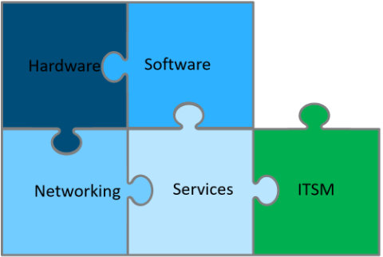

# VMware Cloud Services: Bill Of Materials

# Changelog

The following changes have been made to this document between the last version released

| Date       | Change Detail                                                                              | Author     |
|------------|--------------------------------------------------------------------------------------------|------------|
| 03-06-2021 | Added alternate Infoblox license. Clarified vIDM licensing                                 | Alec Dunn  |
| 16-06-2021 | Updated SD card recommendations based on endurance issues                                  | Alec Dunn  |
| 16-09-2021 | Removed SD card boot option as per [KB85685](https://kb.vmware.com/s/article/85685)        | Alec Dunn  |
| 01-11-2022 | Sanity checked document and alterations made for VCS 1.6 release                           | Alec Dunn  |
| 15-02-2023 | Sanity checked document and alterations made for VCS 1.7 release                           | Alec Dunn  |
| 15-02-2023 | Altered network section to specify 25Gbps only and QFX-5120 or better                      | Alec Dunn  |
| 15-02-2023 | Additional workload domain support information added. vRA on Prem Alterations added        | Alec Dunn  |
| 23-02-2023 | Reworked the storage and CPU requirements table at the end to red                          | Alec Dunn  |
| 15-03-2023 | Added an addendum to cover VMware Aria branding change                                     | Alec Dunn  |
| 15-03-2023 | Added clarification on Nessus Lic requirement                                              | Alec Dunn  |
| 02-07-2023 | change Ubuntu detail                                                                       | Alec Dunn  |
| 09-02-2024 | Removed vRA-Cloud references, Added Broardcom statement                                    | Alec Dunn  |
| 09-02-2024 | Removed CloudLink from SW BoM as replaced by NKP                                           | Alec Dunn  |
| 11-03-2024 | Removed Cloudlink                                                                          | Alec Dunn  |
| 11-03-2024 | Removed VxRail sections as not supported (again)                                           | Alec Dunn  |
| 11-03-2024 | Added new Broadcom VMWare Licensing information                                            | Alec Dunn  |
| 12-03-2024 | Removed any incorrect information from BoM                                                 | Alec Dunn  |
| 12-03-2024 | Removed VMC pricing from BoM                                                               | Alec Dunn  |
| 22-04-2025 | Updated the Licensing and Host Model Selection, VRA duplicate removed, Billing VM removed, links to Broadcom placed | Mariusz Stanek |
| 20-05-2024 | Updated the VM Bom list at end (typo fixed, Limux VM updated via Radek D)                  | Alec Dunn  |

# Introduction

 This document details how and what you will need to build up VMware Cloud Services solution.  It states the elements that make up a VCS and the minimum specifications of the components.  It is **not** a defacto standard or kit list. It is a guide for 'typical' deployments. It is expected that the specifications for each server will be altered based on customer need.

 VCS is a large product consisting of the core IaaS and various optional elements.  Some of these elements, when implemented as an end-to-end service, come from different vendors or units within Atos.

## Broadcom / VMware Acquisition

This is the firs VCS BoM that contains updated information relating to the changes brought in from the Broadcom buyout of VMware. All other versions of the BoM should be discarded.This version of the document also contains the branding changes relating to Aria.

## VMware Broardcom Acquisition

This document does not yet contain the changes to VMware licensing from the Broardcom Acquisition.  We are awaiting clarification from procurement (Feb 24).

## Purpose

This document contains brief descriptions of the elements of a VCS and a sequence of steps required to specify a VCS. This document may change over time, however, only one version of this doc will exist per VCS version. Always use the BoM included in the same location as other documentation for the version of VCS you are specifying.

## Audience

This document is designed for account teams, operations, solution architects and engineers tasked with configuring, specifying or designing a solution at the version level specified.

## Document Conventions

>Text marked with an indent/hi-light denotes a configuration or option not yet supported in the current release. However it is left in the document as  it is relevant for future decisions and is due in the near future.

# What Makes A Standard VCS (Description)

At its core, VCS is made up of the following:

## Hardware

VCS is deployed in a single configuration type.

- *Standalone Mode:*  Is deployed as a series of clusters with a minimum of **1 x Management cluster** and **1 x Workload Cluster** .  There is **always** a dedicated management stack and then one or more Workload Domain clusters per site  (i.e. Min 1 x MGMT and 1 x WL clusters).
  - General purpose configuration that can scale from small to large customers
  - One VCS MGMT cluster per solution with only VCF MGMT in additional sites
  - Expandable with additional Workload Clusters (Local) and additional Workload Domains (Local)
  - K8S capability can be deployed to a workload cluster (either dedicated for K8S or mixed VM/K8S usage)
  - Single or Multi-Tenant instances of VCS use the same basic hardware configuration

VCS is comprised of HyperConverged Infrastructure providing VM services and management. This comprises of one or more clusters. This can be expanded upon with additional Workload domains and clusters as required (For capabilities like additional VM workload domains or separated tenants).

VCS has two cluster types. These are:

- A *Management Cluster* is made up of **4** hosts running vSAN **Hybrid** or **5** Hosts running **vSAN All Flash**.  This will cater for all but the biggest, global installs of VCS (where additional hosts may be required to cope with logging and monitoring traffic).
- A *Workload Cluster* is made up of a minimum of **5** hosts running **vSAN All Flash**.  These can contain up to 64 hosts per cluster but with a limit of 64 clusters or 2500 hosts per VCS Site (whichever is smaller).

**NOTE:** Each VCS *Workload Cluster* has a dedicated function.  You cannot mix regular VMs and 3rd party (non VMware) integrations (such as Google Anthos or Red Hat Openshift) on the same Workload domain, they must be separate. Note, this means that Tanzu CAN share a workload domain with normal VMs as this is a VMware integrated offering.

VCS must be housed in dedicated racks (i.e. not shared with other infrastructure)  This implies that if empty racks are not available in the datacentre of choice they will have to be purchased as part of the hardware build.  This includes Power distribution, cables etc. VCS is connected via layer 2 interconnects within its own racks.  It only transitions to layer 3 when exiting the solution to the wider DC LAN.

## Software

VCS is built on VMware Cloud Foundation (VCF) with additional modular services from Atos, Canonical, Microsoft and other vendors. VCS uses the following components that cover **all** basic functionality.  The number of licences required is detailed in Step 2 and is dependent on your configuration.

- VMware Cloud Foundation
- VMware vCenter Server Standard
- VMware SRM (Optional, for Disaster Recovery)
- Microsoft Windows Server (with various roles enabled)
- Canonical Ubuntu Linux Server
- Hashicorp Vault (covered under Canonical licensing above)
- Infoblox DDI
- Nessus Professional
- Tanzu (TKG) (Optional)

### BIOS and Firmware versions in VCS

VCS requires all Firmware and BIOS versions for hosts, NICs and storage cards to be validated at build time against the VMware HCL. This is because it is not possible to test every version of HW and FW in a nested lab environment. **It is a requirement** of VCS that the version installed should be the newest version of the BIOS or FW that is supported/listed in the VMware HCL (Noted Below).

Below links can help during compatibility check process:

1. [ESXi 8.0 Hardware requirements](https://techdocs.broadcom.com/us/en/vmware-cis/vsphere/vsphere/8-0/esxi-upgrade-8-0/upgrading-esxi-hosts-upgrade/esxi-requirements-upgrade/esxi-hardware-requirements-upgrade.html)
2. [CPU Support Deprecation and Discontinuation In vSphere Releases](https://knowledge.broadcom.com/external/article?legacyId=82794)
3. [Using the VMware Product Interoperability Matrixes](https://knowledge.broadcom.com/external/article/343230/using-the-vmware-product-interoperabilit.html)

General Broadcom compatibility guides:

1. [Systems/Servers](https://compatibilityguide.broadcom.com/search?program=server&persona=live&column=partnerName&order=asc)
2. [CPU series](https://compatibilityguide.broadcom.com/search?program=cpu&persona=live&column=cpuSeries&order=asc)
3. [Storage/SAN](https://compatibilityguide.broadcom.com/search?program=san&persona=live&column=partnerName&order=asc)
4. [IO Devices](https://compatibilityguide.broadcom.com/search?program=io&persona=live&column=brandName&order=asc)
5. [Guest OS](https://compatibilityguide.broadcom.com/search?program=software&persona=live&column=osVendors&order=asc)

For Dell PowerEdge servers please see the specific product page for latest BIOS and Firmware availability dependent on model deployed.

## Services

VCS uses a number of 3rd party service offerings to provide basic functionality.  These are licensed in a different way to regular software (Detailed in Step 2) and are listed below.

- Deep Security (BDS Implementation of Trend Micro)
- Nessus Vulnerability Scanner (BDS Service)
- Infoblox DDI (GTS Service, Utility model)
- Canopy Enterprise Backup (Optional for Workload, Mandatory for MGMT). Default implementation is Avamar/DataDomain (with others available via additional integration work)

## Networking

**NOTE: Physical networking services and hardware for a VCS is provided by CNT/NDCS (from ToR switches to DC-LAN connectivity).**

Networking within VCS requires in-rack switches to allow L2 communication between racks and servers inside a VCS POD and to provide the breakout to the Datacentre and wider L3 connectivity. Networking capability is provided for VCS by CNT/NDCS in all cases via agreed OLA. The basic requirement is:

- 2 x CNT supported Top of Rack switches per rack (With interlink cables) (Juniper QFX-5120 or better)
- 2 x 25 Gbit networking connectivity as default per host (10Gbit **not** supported)
- External to VCS Firewall or similar access control device (e.g. ACL on core switches)
- Cables and connectors between hosts and switches
- 1 x Layer 3 link to the customer DC (per VCS)
- 1 x Internet access per VCS (via direct connect MGMT cluster proxy or via customer proxy) (50Mbit or greater recommended).
- 1 x 1Gbit OoB MGMT link per host (iDRAC, iLO etc)
- 1 x Avocent Cyclade (Model AC8008) for Switch OoB access

## ITSM Integration

VCS is able to integrate with a number of ITSM systems but this is NOT part of the VCS product. Rather, this is an integral part of an overall solution designed to customer requirements. It is expected that VCS will also be implemented with an integration towards Atos ATF2/SNOW. However, as a fail-back-default option, VCS has hooks for enabling the following integrations as standard.

- Aria Automation\Service Broker (standard)

Anything selection outside of this (Customer ITSM for example) will require integrating with the VCS API at time of solutioning.

# Building a VCS

Building or specifying a VCS can be broken down in to steps. Build in the order below to solution a VCS. VCS is flexible, the hardware shown below is a **generic** configuration and the cluster building blocks shown below are *representative examples* for a typical mid sized (500VM+) customer. You are allowed (and should) to alter the specifications of certain components to increase/reduce capacity. The notation here is:

- **Mandatory**: The specification for the component should not be altered and must be included.
- **Optional**: The specification for the component should not be altered but is not required for a VCS to function (e.g. PCI enablement options).
- **Configurable**: The specification of the element is able to be altered dependent on solution needs but is also mandatory.

## Step 1: Specifying Hardware

VCS is made up of a series of HyperConverged Clusters. Clusters are built from standard rack servers referred to as 'building blocks' In this version the standards are from Dell (PowerEdge) and Bull (Sequana and SA series).

## CPU Vendor Choice: Intel or AMD

VCS supports the use of AMD EPYC or Intel Xeon processors within compute nodes (no preference to either one). The hardware must still be *vSAN certified as a vSAN Ready Node* regardless of processor selection.  As of 2024 AMD EPYC provides the highest core count and, therefore, density per host. This is a consideration when looking at building a carbon reduced (dense) VCS.

### Migration of Workloads to VCS

It is important to note that it is **not** possible to **live** migrate workload servers between CPU vendors architectures. So, if a customer is migrating from an INTEL based platform to an AMD based VCS **all** VMs will require a reboot after migration to pick up the correct Virtual CPU type. This is a technology limitation with VMware and there s no workaround known or planned.

In **every** instance an *assessment of the workloads migrating to VCS* should be undertaken by the account team to ensure that the correct policies and profiles are assigned to the incoming VMs.  Failure to do this step could result in performance issues. Atos has the migration factory team that are capable of undertaking this work. **No workload should be migrated without understanding its impact.**

#### VCS Building Blocks

- Mandatory: 1 x MGMT Domain (4 x MGMT Building Blocks in Hybrid vSAN mode or 5 x MGMT Building Blocks in All Flash mode)
- Mandatory: 1 x Workload Domain for Virtual Infrastructure (VM, Container or other) (5 x Flash building blocks)
- Optional: 1 x Workload cluster for containers or 3rd party integrations (5 x Flash Building blocks)

### Management Building Block (Dell PowerEdge)

For the configurable items below the following Minimums apply.

**NOTE** vSphere 7 onwards no longer supports SD cards as a boot option. **No SD card should be configured or ordered for VCS hosts.**

- Cores per CPU must not be lower than 12C/24T
- RAM per host must not be lower than 256GB/Host
- Minimum HDD capacity must be 1.2TB/HDD
- Minimum SSD cache drive size is 800GB
- Minimum Nodes per cluster is 4 nodes(Hybrid), 5 nodes (Flash)
- Minimum NIC Speed is 25Gbps (10Gbps networking is no longer supported within VCS)
- Power cords specified are EU style. Ensure the correct ones for your geography are specified.

#### Tenancy (Multi-Tenant VCS Installs)

VCS Multi Tenant can support about 3 independent tenants with the default Management Cluster specifications.  After this every Tenant will require additional elements to be installed such as NSX edges and additional logging capability. For each **additional** 3 Tenants , best practice is to add an **additional host** into the MGMT domain.

#### Host Model Selection

All of our examples are based off Dell servers. VCS is configured on a per-customer basis and you should purchase the latest 7 series server that meets the customer requirements. Although not validated specifically in VCS labs these are a supported configuration. VCS is designed to run on ANY vSAN Ready node compatible HW.

Preferred server model for Management Domain is any from Dell R7xx or R6xx family with configuration which meets customer requirements and is compatible with VMware by Broadcom solutions.

### Hybrid Workload Domain Building Block (Dell PowerEdge)

This is considered the 'sub optimal' building block. Because of the features enabled and the space efficiency of all Flash we recommend Hybrid only when the customer use case specifically benefits from a non-flash configuration.

**NOTE** vSphere 7 onwards no longer supports SD cards as a boot option. No SD card should be configured or ordered for VCS hosts.

For the configurable items below the following Minimums apply

- Cores per CPU must not be lower than 8C/16T
- RAM per host must not be lower than 128GB/Host
- Minimum HDD capacity must be 1.2TB/HDD
- Minimum SSD cache drive size is 800GB
- Minimum nodes per cluster is 4
- Minimum NIC Speed is 25Gbps (10Gbps networking is no longer supported in VCS)
- Power chords specified are EU style. Ensure the correct ones for your geography are specified.

#### Host Model Selection

All of our examples are based off Dell servers. VCS is configured on a per-customer basis and you should purchase the latest 7 series server that meets the customer requirements. Although not validated specifically in VCS labs these are a supported configuration. VCS is designed to run on ANY vSAN Ready node compatible HW.

Preferred server model for Worklad Domain is any from Dell R7xxXD family with configuration which meets customer requirements and is compatible with VMware by Broadcom solutions.

### Flash workload Domain Building Block (Dell PowerEdge)

This is the standard Workload Domain building block that should be specified in most cases. It has the most features and flexibility due to the all flash specification.

**NOTE** vSphere 7 onwards no longer supports SD cards as a boot option. No SD card should be configured or ordered for VCS hosts.

 For the configurable items below the following Minimums apply

- Cores per CPU must not be lower than 8C/16T
- RAM per host must not be lower than 128GB/Host
- Minimum Capacity tier storage figure must be 960GB/SSD
- Minimum SSD cache drive size is 800GB
- Minimum nodes per cluster is 5
- Minimum NIC Speed is 25Gbps (10Gbps networking is no longer supported in VCS)
- Power chords specified are EU style. Ensure the correct ones for your geography are specified.

#### Host Model Selection

All of our examples are based off Dell servers. VCS is configured on a per-customer basis and you should purchase the latest 7 series server that meets the customer requirements. Although not validated specifically in VCS labs these are a supported configuration. VCS is designed to run on ANY vSAN Ready node compatible HW.

Preferred server model for Worklad Domain is any from Dell R7xxXD family with configuration which meets customer requirements and is compatible with VMware by Broadcom solutions.

### Management Building Block (Bullion SA10)

Bullion SA10 hardware can only be ordered in Single CPU socket configurations with AMD hardware.  

- Cores per CPU must not be lower than 10C/20T
- RAM per host must not be lower than 256GB/Host
- Minimum Capacity tier storage figure must be 960GB/SSD
- Minimum SSD cache drive size is 800GB
- Minimum nodes per cluster is 5
- Minimum NIC Speed is 25Gbps (10Gbps networking is no longer supported on VCS)
- Power chords specified are EU style. Ensure the correct ones for your geography are specified.

Preferred server model for Management Domain is Bullion SA10 family with configuration which meets customer requirements and is compatible with VMware by Broadcom solutions.

### Flash workload Domain Building Block (Bullion S200)

The standard Bullion based building block for workload is as follows. Again, recommended for medium sized customers some elements can be tuned down to accommodate smaller bids.

- Cores per CPU must not be lower than 8C/16T
- RAM per host must not be lower than 128GB/Host
- Minimum Capacity tier storage figure must be 800GB/SSD
- Minimum SSD cache drive size is 800GB
- Minimum nodes per cluster is 5
- Power chords specified are EU style. Ensure the correct ones for your geography are specified.

Preferred server model for Worklad Domain is Bullion S200 family with configuration which meets customer requirements and is compatible with VMware by Broadcom solutions.

### Flash workload Domain Building Block (Bullion SA20)

The standard Bullion based building block for workload is as follows. Again, recommended for medium sized customers some elements can be tuned down to accommodate smaller bids.

- Cores per CPU must not be lower than 8C/16T
- RAM per host must not be lower than 128GB/Host
- Minimum Capacity tier storage figure must be 800GB/SSD
- Minimum SSD cache drive size is 800GB
- Minimum nodes per cluster is 5
- Minimum NIC Speed is 25Gbps (10Gbps networking is no longer supported on VCS)
- Power chords specified are EU style. Ensure the correct ones for your geography are specified.

Preferred server model for Workload Domain is Bullion SA20 family with configuration which meets customer requirements and is compatible with VMware by Broadcom solutions.

### VxRail Building Blocks

VCS **does not support Dell VxRail nodes**.

### Racks and Cables

How VCS is configured in a rack is highly dependent on the customer datacentre infrastructure. Care should be taken to ensure that the following requirements are met.

- Power limitations per rack (usually minimum 7.4KVA through to 16 KVA peak)
- Datacentre floor weight limitations (fully populated racks not normally possible)
- Datacentre Cooling capacity (BTU/hr)
- Power capability and connector type varies by territory, ensure correct specification is ordered for your geography. This BoM is based on European standards.

**NOTE:** Server density per rack is generally limited by power not space. In single phase racks you're looking at 6-8 hosts with 10-12 for 3 phase capable racks.

VCS is required to be in it's own dedicated rack infrastructure. This uses standard 42U height racks of standard width. VCS requires all hosts and Top Of Rack (ToR) switches to be hosts within these racks. The management cluster and workload cluster can reside in the same rack as each other.

It is recommended that the standard layout of a rack fits the following profile (this is certain to fit within a customers datacentre power/weight/cooling requirements). You can deviate from this but you will require DC authorization.

#### Recommended Basic Rack Contents

- 2 x ToR switches (plus interlink cables) (Juniper QFX-5120 or better)
- 12 x 2U Hosts (for MGMT or Workload) (on 3-phase supply)
- 2 x Power distribution boards
- Cable management arms and trays
- 2 x Independent power inlets/rack

### Standard VCS Power and Heat Profiles

The current profile for VCS servers (as recommended above in the Hardware section) is shown below. It should be noted that this changes with a server specification different to the one above.  Consider this an average:

#### Dell Hardware

- PSU Load (Rated): 1100 Watts
- Efficiency: 96%
- Weight: 33.1KG/Host
- Height: 2U
- Heat Generation: 4416BTU/hr
- Typical Draw per host: 750 Watts

#### Bullion hardware

- PSU Load (Rated): 2000 Watts
- Efficiency: 96%
- Weight: 43KG/Host
- Height: 2U
- Heat Generation: 4600BTU/hr
- Typical Draw per host: 481 Watts (Average load)
- Max Draw Per Host: 946 Watts (peak Load)

## Step 2: Specifying Software

VCS requires a specific set of software to function for both the management and workload clusters. Mandatory and optional software for each domain type is specified in the sections below.
**Note:** As of january 2024 and the Broadcom acquisition of VMware all VMware licensing in VCS is subscription based on a pre pay commitment of either 1,3 or 5 years. there is **no defined discount** available to Atos so the prices below are **retail** prices. It should be noted that there is an expected discount level of about 45% on any VCS quote on Vmware SW due to default size.

### Management Domain

All software below for the management domain is mandatory. You will only need one management domain per VCS.

**NOTE on vIDM:** vIDM is usually a component licensed under Workspace One. In the case of VCS it is actually licensed as part of NSX-T Datacenter. You do **not** need to procure a license for vIDM usage in VCS. It is included.

| Part Number               | Description                                                    |QTY      |Month Cost| Year Cost| Comment                                                                 | Source      |
|---------------------------|----------------------------------------------------------------|---------|----------|----------|-------------------------------------------------------------------------|-------------|
| VCF-CLD-FND-5             | VMware Cloud Foundation 5                                      | Per core | N/A      | €157.50  | Includes D.A.R.E, HCX, Micro segmentation, Stretched Cluster, vRNI etc. | ELA6        |
| VCS7-STD-C                | VMware vCenter Server Standard for vSphere enterprise          | 1       | N/A      | N/A      | Management vCenter is included in VCF licensing                         | ELA6        |
| VC-SRM8-25E-C             | VMware SRM Enterprise                                          | Per VM  | N/A      | €35.23   | MIN 25 VMs then priced individually                                     | ELA6        |
| N/A                       | Canonical Ubuntu Support (Standard)                            | Per CPU | €20.83   | €780     | Support for management Linux VMs + vault (1 per pCPU/host MIN 3 years)  | Canonical   |
| CISSSteStdCoreALNG        | Windows Server Licensing                                       | 16      | €102.72  | €1232.64 | Licensing costs for the Windows Server                                  | SPLA        |
| N/A                       | Windows Server Microsoft Premier Support                       | 16      | N/A      | N/A      | Support costs for the Windows Server                                    | SPLA        |
| TE-1425-SWBSUB-NS1GD      | Trinzic 1425 Software Build sub DDI and Grid (VM Model option) | 1       | €1.05    | €12.60   | IPAM IP addresses for MGMT VMs  (1 required per MGMT VM, 55 Total)      | Atos (CNT)  |
| IB-MSPLA-DDI-Utility-Unit | Trinzic 1425 **(Utility Model option)**                        | 1       | PoA      | PoA      | Alternative Licensing Model for Infoblox (Check with GTS/CNT)           | Atos (CNT)  |
| N/A                       | Trend Micro Deep Security (Endpoint Protection)                | 20      | €2.21    | €530.04  | Endpoint Protection for Management VMs (20 Non appliance Total)         | Atos (BDS)  |
| N/A                       | Windows Remote Desktop Services CAL                            | 30      | €5.20    | €1872    | CAL for MS Remote Desktop services (Terminal server users)              | SPLA        |
| N/A                       | Nessus Professional 1 year Subscription                        | Per MGMT domain | N/A      |  €4000  | Per MGMT stack (1 x lic for A/A and 2 x lic for A/P)                    | Compuwave   |

VMware licensing can be reduced over the life of the contract by committing for 3 or 5 years. The table below details these SKUs. **These are all paid up front.**

| Part Number             | Description               |QTY       |Month Cost| Year Cost| Comment                                                      | Source   |
|-------------------------|---------------------------|----------|----------|----------|--------------------------------------------------------------|----------|
| VCF-TD-TL-3P-C          | VMware Cloud Foundation   | Per core | N/A      | €986     | Only one, all-inclusive VMware SKU available.                | Broadcom |
| VCF-TD-TL-5P-C          | VMware Cloud Foundation   | Per core | N/A      | €1645    | Only one, all-inclusive VMware SKU available.                | Broadcom |
| VC-SRM8-HYE-3Y-TLSS-C   | VMware SRM Enterprise     | Per VM   | N/A      | €851     | MIN 25 QTY Only Required for VMs that are to be DR protected | Broadcom |

| Part Number               | Description                                                    |QTY       |Month Cost| Year Cost| Comment                                                                | Source     |
|---------------------------|----------------------------------------------------------------|----------|----------|----------|------------------------------------------------------------------------|------------|
| VCF-CLD-FND-5             | VMware Cloud Foundation 5                                      | Per core | N/A      | €157.50  | Only one, all-inclusive VMware SKU available. Incl Tanzu               | Broadcom   |
| VC-SRM8-HYE-1Y-TLSS-C     | VMware SRM Enterprise                                          | Per VM   | N/A      | €135.23  | MIN 25 VMs then priced individually                                    | Broadcom   |
| N/A                       | Canonical Ubuntu Support (Standard)                            | Per CPU  | €20.83   | €780     | Support for management Linux VMs + vault (1 per pCPU/host MIN 3 years) | Canonical  |
| CISSSteStdCoreALNG        | Windows Server Licensing                                       | 16       | €102.72  | €1232.64 | Licensing costs for the Windows Server                                 | SPLA       |
| N/A                       | Windows Server Microsoft Premier Support                       | 16       | N/A      | N/A      | Support costs for the Windows Server                                   | SPLA       |
| TE-1425-SWBSUB-NS1GD      | Trinzic 1425 Software Build sub DDI and Grid (VM Model option) | 1        | €1.05    | €12.60   | IPAM IP addresses for MGMT VMs  (1 required per MGMT VM, 55 Total)     | Atos (CNT) |
| IB-MSPLA-DDI-Utility-Unit | Trinzic 1425 **(Utility Model option)**                        | 1        | PoA      | PoA      | Alternative Licensing Model for Infoblox (Check with GTS/CNT)          | Atos (CNT) |
| N/A                       | Trend Micro Deep Security (Endpoint Protection)                | 20       | €2.21    | €530.04  | Endpoint Protection for Management VMs (20 Non appliance Total)        | Atos (BDS) |
| N/A                       | Windows Remote Desktop Services CAL                            | 30       | €5.20    | €1872    | CAL for MS Remote Desktop services (Terminal server users)             | SPLA       |
| N/A                       | Nessus Professional 1 year Subscription                    | Per MGMT domain | N/A    | €4000   | Per MGMT stack (1 x lic for A/A and 2 x lic for A/P)                   | Compuwave  |

#### Longer Term Pricing

The table below details these SKU for Atos Discounted Price valid until June 2026. **These are all paid up front.**

| Part Number             | Description               |QTY       |Month Cost| Year Cost| Comment                                                      | Source   |
|-------------------------|---------------------------|----------|----------|----------|--------------------------------------------------------------|----------|
| VCF-CLD-FND-5          | VMware Cloud Foundation 5  | Per core | N/A      | €157.50    | Only one, all-inclusive VMware SKU available.                | Broadcom |

### Workload Domain (Standard VMs)

#### Mandatory

The following software components are mandatory for purchase in any workload domain.

| Part Number               | Description                                 |QTY       |Month Cost| Year Cost| Comment                                                             | Source     |
|---------------------------|---------------------------------------------|----------|----------|----------|---------------------------------------------------------------------|------------|
| VCF-CLD-FND-5             | VMware Cloud Foundation 5                   | Per core | N/A      | €157.50  | Only one, all-inclusive VMware SKU available.  Incl Tanzu           | Broadcom   |
| VC-SRM8-HYE-1Y-TLSS-C     | VMware SRM Enterprise                       | Per VM   | N/A      | €135.23  | MIN 25 QTY Only Required for VMs that are to be DR protected        | Broadcom   |
| IB-MSPLA-DDI-Utility-Unit | Trinzic 1425 **(Utility Model option)**     | 1        | (<$1.75) | PoA      | Alternative Licensing Model for Infoblox (Check with GTS for price) | Atos (GTS) |
| N/A                       | CEB / Data Domain Backup Capacity (Per TB)  | Per TB   | €VAR     | €VAR     | Per TB backup capacity for CEB (MGMT + VM Workloads)                | Atos       |

#### Longer Term Pricing

The table below details these SKU for Atos Discounted Price valid until June 2026. **These are all paid up front.**

| Part Number             | Description               |QTY       |Month Cost| Year Cost| Comment                                                      | Source   |
|-------------------------|---------------------------|----------|----------|----------|--------------------------------------------------------------|----------|
| VCF-CLD-FND-5          | VMware Cloud Foundation 5  | Per core | N/A      | €157.50    | Only one, all-inclusive VMware SKU available.                | Broadcom |

## Step 3: Specifying Services

VCS can be specified with additional services. These are charged by their respective service providers and any build utilizing these should be handled via contacting the relevant team.

| Component                            | Service  | Cost Unit  |
|--------------------------------------|----------|------------|
| CEB backup (Client WL)               | CEB      | Per TB     |
| Ansible Tower (For Workloads)        | GDTS     | Per VM     |
| Trend Micro AV (For Workloads)       | BDS      | Per VM     |
| Cloud Health (Multi Cloud Analytics) | GDTS     | Per VM     |
| Managed OS Service                   | AHS      | Per VM     |
| HCX Migration Services               | RS&D     | Per VM     |
| Hybrid Cloud Services  (VMC etc)     | VCS      | Variable   |

## Step 4: Specifying Networking

Networking equipment specification and procurement within VCS is all handled by CNT. They will be able to provide relevant knowledge and quotations for ToR switches, Firewalls and cabling.

### Networking Equipment

**Note:** VCS physical networking is handled by CNT and they have a series of requirements that hold true for the solution design as a whole. These are detailed in the [hldDigtialHybridCloud](hldDigitalHybridCloud.md) documentation.

**NOTE:** VCS in **all-flash** configuration does not support older generation QFX-5100 series ToR switches (plentiful through out Atos) due to a lack of buffer space to handle flash vSAN traffic in high volumes.

The high level requirements per rack are:  
As a guide for solutioning, VCS has the following requirements:

- 2 x ToS switches per Rack (Juniper QFX 5120 or better)
- 1 x Layer 3 link to the customer DC (per VCS)
- 1 x Internet access per VCS (via direct connect MGMT cluster proxy or via customer proxy) (50Mbit or greater recommended).
- 2 x 25Gbit (default) capable ports for connectivity between VCS hosts and ToRs (40Gbit is supported for heavier load customers). You should check with server vendor for validated Physical card availability.
- 2 x Full bandwidth interconnects/host (e.g. 25Gbit)
- 1 x 1Gbit cable / host (OoB Management/host)
- 1 x ToR switch interlink cable set / pair ToRs
- 1 x Avocent cyclade (Model AC8008) for Switch OoB access
- 1 x Access control device (Such as physical firewall or ACL list enablement)
- Vendor Support for the relevant HW items

## Step 5: Specifying ITSM Integration

VCS is a platform that your private cloud is built upon. This means it needs connection to an ITSM and a front end portal for the user (if not using direct API based approach).

# Additional Information

This section houses information that you may find useful when pulling together a bid for VCS but is not integral to the fundamentals of VCS pricing.

## VMC Pricing

For those wishing to use VMC pricing for Hybrid cloud functionality the pricing for this offering is constantly changing. Please contact VMware sales or Atos VMC team for a price for a VMC landing zone.

## List of Management VMs

VCS MGMT currently contains the following set of servers that are licensed for use within VCS. Note this is the 'typical configuration' of VCS MGMT VMs and is suitable for small to Medium sized deployments of VCS (up to 5 PoDs / Sites or roughly 3,000 VMs). After this number the HDD space for logging and monitoring servers will need increasing and the MGMT cluster should be sized accordingly.  From VCS 1.6 the system can be configured with vRA-On prem replacing the SaaS version of this function. This will increase the resources required in the MGMT stack but not enough to alter the standard BoM recommendations.

### Key

W = Windows, L = Linux, A = Appliance
Lifecycle = Who is responsible for LCM updates to the specific component.

| Function                               | vCPU | RAM (GB) | NICs | Space | Type | Lifecycle |
|----------------------------------------|------|----------|------|-------|------|-----------|
| Active Directory                       | 2    | 4        | 2    | 170   | W    | CES       |
| Active Directory                       | 2    | 4        | 2    | 170   | W    | CES       |
| Issuing Certificate Authority          | 2    | 4        | 1    | 65    | W    | CES       |
| Root Certificate Authority (Offline)   | 2    | 4        | 1    | 65    | W    | CES       |
| Terminal Server                        | 2    | 4        | 1    | 65    | W    | CES       |
| Terminal Server                        | 2    | 4        | 1    | 65    | W    | CES       |
| VMware WorkSpaceOne Connector          | 2    | 8        | 1    | 40    | W    | CES       |
| WSUS                                   | 2    | 4        | 1    | 315   | W    | CES       |
| Ansible                                | 1    | 2        | 1    | 165   | L    | CES       |
| Debian Patch Repo                      | 2    | 4        | 1    | 425   | L    | CES       |
| Hashicorp Vault                        | 1    | 2        | 1    | 65    | L    | CES       |
| HTTP gateway                           | 1    | 2        | 1    | 60    | L    | CES       |
| Internet Proxy                         | 1    | 2        | 1    | 65    | L    | CES       |
| Internet Proxy                         | 1    | 2        | 1    | 65    | L    | CES       |
| Nessus                                 | 2    | 4        | 1    | 110   | L    | CES       |
| Repo Server (Debian)                   | 2    | 4        | 1    | 415   | L    | CES       |
| SMTP Server (SRS)                      | 2    | 4        | 1    | 60    | L    | CES       |
| Aria Operations for Logs               | 8    | 16       | 1    | 2754  | A    | CES       |
| Aria Operations for Logs               | 8    | 16       | 1    | 2754  | A    | CES       |
| Aria Operations for Logs               | 8    | 16       | 1    | 2754  | A    | CES       |
| Aria Operations for Networks           | 8    | 32       | 1    | 1024  | A    | CES       |
| Aria Operations for Networks           | 8    | 32       | 1    | 1024  | A    | CES       |
| Aria Operations                        | 8    | 32       | 1    | 310   | A    | CES       |
| Aria Operations                        | 8    | 32       | 1    | 310   | A    | CES       |
| Aria Suite Lifecycle Manager           | 2    | 16       | 1    | 165   | A    | CES       |
| Avamar VE                              | 2    | 6        | 1    | 885   | A    | CEB       |
| Avamar VE                              | 2    | 6        | 1    | 905   | A    | CEB       |
| Avamar Proxy                           | 4    | 4        | 1    | 26    | A    | CEB       |
| Infoblox DDI                           | 4    | 32       | 1    | 250   | A    | COA1      |
| Infoblox DDI                           | 4    | 32       | 1    | 250   | A    | COA1      |
| Infoblox Reporting Server              | 4    | 16       | 1    | 250   | A    | COA1      |
| NSX Controller (NSX-T)                 | 12   | 48       | 1    | 200   | A    | CES       |
| NSX Controller (NSX-T)                 | 12   | 48       | 1    | 200   | A    | CES       |
| NSX Controller (NSX-T)                 | 12   | 48       | 1    | 200   | A    | CES       |
| NSX Edge VM                            | 1    | 0.5      | 10   | 3     | A    | CES       |
| NSX Edge VM                            | 1    | 0.5      | 10   | 3     | A    | CES       |
| NSX Manager                            | 4    | 16       | 1    | 60    | A    | CES       |
| Platform Services Controller           | 2    | 4        | 1    | 60    | A    | CES       |
| Platform Services Controller           | 2    | 4        | 1    | 60    | A    | CES       |
| SDDC Manager                           | 4    | 16       | 1    | 850   | A    | CES       |
| Site Recovery Manager (Optional)       | 4    | 8        | 1    | 26    | A    | CES       |
| vCenter Server                         | 8    | 24       | 1    | 530   | A    | CES       |
| vCenter Server                         | 8    | 24       | 1    | 530   | A    | CES       |
| VMware Workspace ONE Access            | 24   | 48       | 1    | 300   | A    | CES       |
| vSphere Replication (Optional)         | 4    | 8        | 1    | 13    | A    | CES       |
| Aria Automation On Prem Install        | 36   | 126      | 1    | 738   | A    | CES       |

### Total MGMT Stack VM

Windows VMs: 8  
Linux Servers: 8
Applicances: 31
Total vCPU: 263  
Total vRAM: 867GB  
Total Storage: 23TB (Absolute)

## Tanzu Add-on

| Function                        | vCPU | RAM (GB) | Space | Type | Lifecycle |
|---------------------------------|------|----------|-------|------|-----------|
| Supervisor Cluster VM           | 4    | 16       | 16    | A    | CES       |
| Supervisor Cluster VM           | 4    | 16       | 16    | A    | CES       |
| Supervisor Cluster VM           | 4    | 16       | 16    | A    | CES       |
| Workload Cluster Worker VM      | 4    | 8        | 40    | A    | CES       |
| Workload Cluster Worker VM      | 4    | 8        | 40    | A    | CES       |
| Workload Cluster Worker VM      | 4    | 8        | 40    | A    | CES       |
| Workload Cluster Control Plane  | 4    | 8        | 40    | A    | CES       |
| NSX ALB - Controller            | 8    | 24       | 128   | A    | CES       |
| NSX ALB - Service Engine        | 1    | 2        | 15    | A    | CES       |
| Harbor                          | 4    | 8        | 160   | A    | CES       |
| KeyCloak                        | 2    | 0.5      | 1     | A    | CES       |

### Total Tanzu

Appliances: 11
Total vCPU: 43  
Total vRAM: 114.5GB  
Total Storage: 0.5TB
