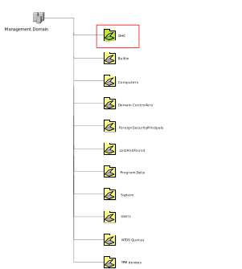
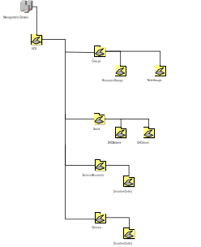
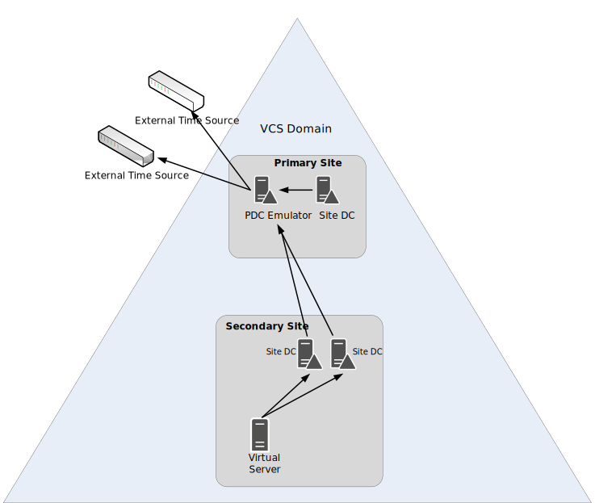
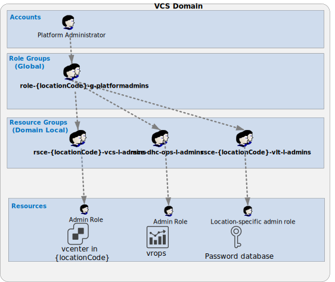
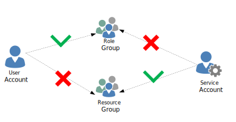

# Active Directory LLD

- Table of Contents
{:toc}

# Changelog

| Version | Date       | User              | Changes                                                                               |
|---------|------------|-------------------|---------------------------------------------------------------------------------------|
| 0.1     | 11.07.2019 | Piotr Lewandowski | Base version                                                                          |
| 0.2     | 14.01.2020 | Piotr Lewandowski | Post-review updates                                                                   |
| 0.3     | 24.02.2020 | Piotr Lewandowski | Post CO & Security review updates                                                     |
| 0.4     | 16.03.2020 | Piotr Lewandowski | Adapted for the new naming convention                                                 |
| 0.5     | 15.01.2021 | Piotr Lewandowski | Updated with the NTP improvement                                                      |
| 0.6     | 31.03.2021 | Marcin Kujawski   | Updated domain name with VCS instance number                                          |
| 0.7     | 26.10.2021 | Vani Yemula       | Updated service account naming convention for per tenant basis                        |
| 0.8     | 29.11.2021 | Vani Yemula       | Updated  service identifier in service account naming convention for per tenant basis |
| 0.9     | 21/12/2021 | Alec Dunn         | Fixed some legacy statement and diagrams showing 1 AD for all PoDs                    |
| 1.0     | 27/01/2022 | Alec Dunn         | Altered wording based on feedback                                                     |
| 1.1     | 03/02/2022 | Alec Dunn         | Altered wording based on feedback and fixed lint errors                               |

# 1 Introduction

## 1.1 Purpose

The purpose of this document is to provide detailed design and architectural guidance required to implement Active Directory Domain Services within VCS offering in accordance with Atos standards and portfolio services. The principal aim of this document is to translate the high-level design (HLD) into a technical low-level design (LLD).  
Design provides component architecture overview in Architecture Overview chapter that provides basic building blocks and main principles, followed by Detailed Logical Design and final Detailed Physical Design.  
Architecture Overview provides basic building blocks and main design principles of presented design. It covers known requirements cascaded from HLD and other LLDs.  
Detailed Logical Design presents business logic, relations and fundamental design decisions.  
Detailed Physical Design provides detailed configuration of components including POD type specifics.

## 1.2 Audience

This document is intended for Atos Cloud Services Engineers and Architects responsible for VMware Cloud Services (VCS) solution implementation and maintenance.

## 1.3 Scope

This LLD is intended to cover below components and domains:

1. Active Directory design for VCS.
This LLD is not covering:
2. Installation guides for Active Directory domain.

## 1.4 Related Documents

This document is a subset of Atos Technology Lifecycle Management (ATLM) artifacts. All documents are stored in the VCS code repository.

##### Table 1. ATLM Related Documents

| Document Number | Document Name                                        |
|:---------------:|------------------------------------------------------|
|  MSD-S28-0000   | [hldDigitalHybridCloud.md](hldDigitalHybridCloud.md) |

## 1.5 Requirement Levels

This document follows the principles below to categorize all requirements and design decisions.

##### Table 2. Requirements' Principles

|    Term    | Meaning                                                                                                                                                                                                                                                         |
|:----------:|-----------------------------------------------------------------------------------------------------------------------------------------------------------------------------------------------------------------------------------------------------------------|
|    MUST    | The definition is an absolute requirement of the specification.                                                                                                                                                                                                 |
|  MUST NOT  | The definition is an absolute prohibition of the specification                                                                                                                                                                                                  |
|   SHOULD   | There may exist valid reasons in particular circumstances to ignore a particular item, but the full implications must be understood and carefully weighed before choosing a different course                                                                    |
| SHOULD NOT | There may exist valid reasons in particular circumstances when the particular behaviour is acceptable or even useful, but the full implications should be understood and the case carefully weighed before implementing any behaviour described with this label |
|    MAY     | Any design decisions that are not classified as MUST and SHOULD or covering optional feature that is not general available for VCS product                                                                                                                      |

# 2 Architecture Overview

VCS can be deployed in two ways. Active/Active or Active/Passive. In An Active Active setup a minimum of two Domains controllers will be set up acting as a single site. There is no need to replicate any AD traffic as it is considered a single entity.

In an Active/passive deployment A minimum of two DCs will be deployed to each site to provide HA without clients having to seek AD services outside of the site boundary.
The Primary VCS POD will be referred to as Site A. The second site is site B, referred to as the Secondary site, replicating only with the primary Site to reduce latency. Changes in AD made at the primary site will replicate to secondary Sites within 15 minutes. Having Domain Controllers  deployed in each site will also provide a safety measure in case of connectivity issues between sites.

The majority of this document shows the architecture of the Active/Passive setup.

# 3 Detailed Logical Design

##### Table 3. Domain Design Decisions

| Decision ID | Design Decision                                                                                                                                                                                                                                                                                    | Design Justification                                                                                                                                                                                                 | Design Implication                                                                     |
|:-----------:|----------------------------------------------------------------------------------------------------------------------------------------------------------------------------------------------------------------------------------------------------------------------------------------------------|----------------------------------------------------------------------------------------------------------------------------------------------------------------------------------------------------------------------|----------------------------------------------------------------------------------------|
|   DD-001    | Number of AD Forests and Domains: Single domain forest architecture for all clusters within a VCS                                                                                                                                                                                                  | Per VCS architecture for modularity.                                                                                                                                                                                 |                                                                                        |
|   DD-002    | Number of Domain Controllers: 2xDCs in each POD                                                                                                                                                                                                                                                    | Provides minimum requirement  for HA and maintenance, ensures that authentication stays local to each POD                                                                                                            |                                                                                        |
|   DD-003    | Forest name suffix: ```.next```                                                                                                                                                                                                                                                                    | Suffix should emphasize that it’s an internal management domain, not registered in public DNS                                                                                                                        |                                                                                        |
|   DD-004    | Domain name prefix: ```{customerCode}```dhc```{dhcInstance}```                                                                                                                                                                                                                                     | Stands for Customer Code followed by static word dhc ending with VCS instance number. VCS instance number distinguish VCS domains to be unique.                                                                      |                                                                                        |
|   DD-005    | Forest Functional Mode: Windows Server 2022                                                                                                                                                                                                                                                        | Deployment based on 2022, with no legacy DCs                                                                                                                                                                         |                                                                                        |
|   DD-006    | Domain Functional Mode: Windows Server 2022                                                                                                                                                                                                                                                        | Deployment based on 2022, with no legacy DCs                                                                                                                                                                         |                                                                                        |
|   DD-007    | All domain FSMO roles to be applied to ADC001 in the first VCS site (initial build): PDC Emulator, RID master, Infrastructure Master                                                                                                                                                               | To avoid having all roles hosted on a single machine and to balance resource utilization                                                                                                                             |                                                                                        |
|   DD-008    | All Forest FSMO roles to be applied to ADC002 in the first VCS site (initial build): Schema Master, Domain Naming Master                                                                                                                                                                           | To avoid having all roles hosted on a single machine and to balance resource utilization                                                                                                                             |                                                                                        |
|   DD-009    | Hub and spoke AD Site and service topology will be implemented                                                                                                                                                                                                                                     | As per Atos standard. No network routing is available between Client Sites, so is a logical choice                                                                                                                   |                                                                                        |
|   DD-010    | DNS Service will be installed on DCs. The service will be used by all VCS Management machines                                                                                                                                                                                                      | DNS service running  on Domain Controllers provides HA for primary and secondary zones.                                                                                                                              |                                                                                        |
|   DD-011    | Domain controller hosting PDC Emulator FSMO role will be designated as NTP Server for the domain and will synchronize with TOR switch (Management network gateway address) When assigned a trusted time source, the PDC Emulator will provide hierarchical time for all the domain member servers. | When assigned a trusted time source, the PDC Emulator will provide hierarchical time for all the domain member servers.                                                                                              |                                                                                        |
|   DD-012    | DHCP Service will be installed on DCs. The service will be used by VCF components (i.e. NSX VTEPs)                                                                                                                                                                                                 | DHCP service running  on Domain Controllers utilizes the existing server reducing footprint. DHCP service is installed in Highly Available fashion with scopes being replicated between a pair of Domain Controllers | Additional Network Adapter is required for this purpose, connected to the DHCP network |
|   DD-013    | A dedicated top-level VCS OU will be created for all VCS objects, with a sub-OU structure to organize these objects                                                                                                                                                                                | Simplify the management.                                                                                                                                                                                             |                                                                                        |

## 3.1 AD Architecture overview

### 3.1.1 OU structure

Apart from the default OUs, a dedicated top-level VCS OU will be created for all VCS objects, with a sub-OU structure to organize these objects.

#### Figure 1. Top level OUs



##### Table 4. Top Level OU descriptions

|          OU Name          | Description                                                                                                                                                                                                                                    | Remarks                                                                                   |
|:-------------------------:|------------------------------------------------------------------------------------------------------------------------------------------------------------------------------------------------------------------------------------------------|-------------------------------------------------------------------------------------------|
|            VCS            | Dedicated OU for VCS objects managed by Atos.                                                                                                                                                                                                  |                                                                                           |
|          Builtin          | Default Active Directory container, containing “leaf objects“ that represent local security groups for the domain. It’s not allowed to remove objects from this container.                                                                     |                                                                                           |
|         Computers         | Default Active Directory container, intended to contain all computer accounts of domain members.                                                                                                                                               | VCS ➜ Servers ➜ Temp used instead (as a default temporary container for computer objects) |
|    Domain Controllers     | Default Active Directory OU, containing all domain controllers of the domain.                                                                                                                                                                  |                                                                                           |
| ForeignSecurityPrincipals | Default Active Directory container containing information about object from external domains, having trust relationship with the domain. Objects in this OU are created when an object form external domain is added to a group in the domain. |                                                                                           |
|       LostAndFound        | Default Active Directory container containing objects that are orphaned as a result of Add and Delete operations that originated on different DCs.                                                                                             |                                                                                           |
|       Program Data        | Container where Active Directory integrated applications can store data.                                                                                                                                                                       |                                                                                           |
|          System           | Default Active Directory container containing built-in system properties.                                                                                                                                                                      |                                                                                           |
|           Users           | Default Active Directory container containing user account and global security groups.                                                                                                                                                         | VCS ➜ Users used instead                                                                  |
|        NTDS Quotas        | Container for quota information about directory objects.                                                                                                                                                                                       |                                                                                           |
|        TPM devices        | Container holds TPM objects related for the newest OS.                                                                                                                                                                                         |                                                                                           |

The default containers for objects added to the domain should not be used, as the objects cannot have designated GPOs assigned to them by nature of their design. The exception is the Domain Controllers OU, which must contain all VCS domain controllers. All other objects should be placed within the VCS OU structure.
The preferred method of object creation is to create or pre-stage the object in the correct OU for the object prior to activation. This method ensures the object receives relevant GPOs when the object is used for the first time.
When a computer joins a domain, by default its account is placed in built-in Computers container, which is not an Organizational Unit and Group Policy Objects cannot be linked to it. To ensure that Baseline GPOs are applied to all computers, the default OU for new computer objects will be redirected to a Temp OU under VCS\Servers OU.
The VCS sub-OU structure is shown in the following diagram:

#### Figure 2. Sub-OU structure



##### Table 5. Sub-OUs descriptions

|              OU Name               | Description                                                                             | Remarks                                |
|:----------------------------------:|-----------------------------------------------------------------------------------------|----------------------------------------|
|                VCS                 | Top Level OU containing all VCS objects                                                 |                                        |
|             VCS\Groups             | Top level OU for Group objects.                                                         | No objects created directly in this OU |
|     VCS\Groups\ResourceGroups      | OU containing groups delegating access to VCS resources such as Applications or Servers |                                        |
|       VCS\Groups\RoleGroups        | OU containing groups that define user roles                                             |                                        |
|             VCS\Users              | Top Level OU for user objects                                                           | No objects created directly in this OU |
|        VCS\Users\DHCAdmins         | OU containing admin users managing VCS environment                                      |                                        |
|         VCS\Users\DHCUsers         | OU containing users with non-administrative access in VCS environment                   |                                        |
|            VCS\Servers             | Top Level OU for Computer objects                                                       | No objects created directly in this OU |
|     VCS\Servers\{locationCode}     | OU containing servers belonging to a given site                                         |                                        |
|          VCS\Servers\Temp          | Temporary OU for new computer objects – redirected from Built-in Computers container    |                                        |
|        VCS\ServiceAccounts         | Top Level OU for service accounts                                                       | No objects created directly in this OU |
| VCS\ServiceAccounts\{locationCode} | OU containing service accounts belonging to a given site                                |                                        |

### 3.1.2 Group Policy Objects

AD Group Policy will be used to supply the password policy and baseline security and will need to adhere to Atos TSS.  
The following guidelines will be followed:

- Inheritance blocking will not be used
- Site based GPOs will not be used
- Software Distribution via Group Policy will not be used
- Security Group Filtering will not be used unless the OU structure does not lend itself to logical filtering
- WMI Filtering will be used when OU structure does not lend itself to logical filtering
- Multipurpose GPOs will not be used, each GPO will have a dedicated purpose (for example, Internet Explorer 10 settings) and will not be used for multiple purposes (for example, Internet Explorer 10 and Internet Explorer 11 settings)
- GPO names will follow naming convention

### 3.1.3 Sites and Services

The site design is the mapping of the physical network within a VCS POD to the logical site construct within AD. A site within AD is a collection of one or more well-connected TCP/IP subnets within a single VCS POD. Sites are used to control directory replication by setting a schedule for inter-site replication. Sites are also used to direct client systems to network resources that are AD–aware, and thus can be logically placed closest to these resources.
VCS will Use Hub and Spoke design for replication between the primary site and secondary site as the logical design choice as secondary sites have no network routing between them.
Objects created in the Primary Site will be replicated to secondary sites using AD replication, where all attribute changes are replicated.

- Intra-site Replication is performed between DCs in a site is made after a 15 second wait by the updated DC. KCC creates a 2 way ring between DCs, so updates appear to be instantaneous, or basically the time taken to perform a manual console refresh.
- Inter-site Replication is performed between DCs in separate site and governed by Site Links and Replication Intervals Active directory Site and Service Design. If a change is made on a DC at a secondary site, there may be up to 30 minutes latency before the changes are visible on another site (15 minutes from Site B to Site A, then 15 minutes from Primary Site to remaining sites (if any)).
The key AD Sites and services design decisions have been summarized as follows:

##### Table 6. Design Decisions - Sites & Services

| Decision ID | Design Decision                                                                                       | Design Justification                                                                                                                                                        | Design Implication |
|:-----------:|-------------------------------------------------------------------------------------------------------|-----------------------------------------------------------------------------------------------------------------------------------------------------------------------------|--------------------|
|   SS-001    | Number of AD Sites: 1 x Site per VCS.                                                                 | A Site will host a collection of subnets that are fully routable to all IPs contained in that site. All AD services will be available locally for each physical location.   |                    |
|   SS-002    | AD Subnets will be added to the respective Sites                                                      | In case of multiple locations, each site’s subnet need to be added to respective site in AD                                                                                 |                    |
|   SS-003    | Separate Site Links will be created containing the Primary Site and a single Client site per instance | Replication will be restricted to sites defined in the Site Link. No manual Site Links will be created.                                                                     |                    |
|   SS-004    | Intersite replication interval set to 15 minutes                                                      | This is the Atos standard value and there is no requirement to change it                                                                                                    |                    |
|   SS-005    | Site Link Cost 100                                                                                    | Standard                                                                                                                                                                    |                    |
|   SS-006    | Site Link Bridges not to be used                                                                      | secondary Sites do not allow network routing between them. The created Site Links are the only logical replication links that are routable.                                 |                    |
|   SS-007    | Bridge all Site Links: Disabled                                                                       | KCC will attempt creation of Site Link bridges if the existing Site Link fails. This will not work and create event log errors and unwanted replication connection objects. |                    |
|   SS-008    | Sites will use the \<locationCode\> as their names. Default site will be name renamed                 | AD sites are strongly geographically based                                                                                                                                  |                    |
|   SS-009    | RPC/IP will be the only transport choice used in the creation of Site Links                           | SMTP can only replicate the configuration, schema and application directory partitions, and does not support the replication of domain directory partitions.                |                    |

Although replication is controlled automatically by the KCC, it bases its connections on the created Site Links. With there being a single Site Link per Site set to replicate with the Primary Site, the replication model will be maintained. If the network link is not available, KCC will attempt to create a replication connection by bridging the Site Link with another Site Link to access a secondary Site where a DC resides. With the Bridge all site links option disabled, replication will cease until the network is re-established.

#### 3.1.3.1 Site-Link Naming Conventions

The name of each Site Link will be a combination of {locationCode} of 2 given sites. Example: gre1-mec5

##### Table 7. Site Links

|     Definition      | Description                                    |
|:-------------------:|------------------------------------------------|
| \<Site1\>-\<Site2\> | Primary Site (hub) to Secondary Site 2 (spoke) |
| \<Site1\>-\<Site3\> | Primary Site (hub) to Secondary Site 3 (spoke) |

#### 3.1.3.2 Active Directory Subnets

IP subnets are assigned to sites that the DC and DNS servers provide AD and resolution services for. Each site must have unique IP subnets.
With secondary Sites being non-routable between each other, it is important to include all subnets in the site. Failure to define subnets within AD can lead to replication topology errors, increased client logon times and increased client response times for activities requiring authentication or directory access.

#### 3.1.3.3 Site Link Costs and Replication Schedule

Site links ensure all changes are replicated between DCs in different sites (inter-site replication). The default replication interval is 180 minutes (once every 3 hours). The calculation used for Site Links use a cost algorithm to influence which path replication traffic will use to flow between sites. A preferred connection would be configured at a lower cost than a less-preferred connection. The replication system prefers the link with the lowest cost. Design decisions have been summarized in the below table:

##### Table 8. Design Decisions - Site Links

| Decision ID | Design Decision                            | Design Justification                                                                                                                                                                                                                                                                                                          | Design Implication |
|:-----------:|--------------------------------------------|-------------------------------------------------------------------------------------------------------------------------------------------------------------------------------------------------------------------------------------------------------------------------------------------------------------------------------|--------------------|
|   SL-001    | All Site Link Costings will be set to 100. | Default value                                                                                                                                                                                                                                                                                                                 |                    |
|   SL-002    | 15-minute replication interval             | The Atos standard recommends changing the default replication interval from 180 minutes to 15 minutes. With AD changes made on the Primary Site only, this will allow changes to be replicated to all DCs within 15 minutes.  KCC will use this value when creating the replication objects and set replication to 15 minutes |                    |

### 3.1.4 DNS Design

DNS zones will be AD integrated to increase security and to utilise the AD replication mechanism. The DNS Server service will be installed on each DC as part of the promotion process.
Specific  DNS server settings configured on Primary DNS Server and Secondary DNS Server are provided in  sub-section 3.1.5.1.

Domain member machines should point to Domain Controllers located in their local site for name resolution.

##### Table 9. DNS Decisions

| Decision ID | Design Decision                                    | Design Justification                                    | Design Implication |
|:-----------:|----------------------------------------------------|---------------------------------------------------------|--------------------|
|   NS-001    | DNS will be hosted on DCs                          | To allow AD integration of DNS                          |                    |
|   NS-002    | Multiple AD integrated Reverse lookup zones        | Multiple networks within a single POD and multiple PODs |                    |
|   NS-003    | No stub zones defined                              | No such requirement                                     |                    |
|   NS-004    | Zone Transfers will be performed by AD replication | Atos Standard                                           |                    |
|   NS-005    | Global Name Zones not defined                      | No such requirement                                     |                    |

#### 3.1.4.1 DNS Server Configuration

Properties of the DNS Server will be configured on each instance.

##### Table 10. DNS Server Configuration

|      Tab      | Setting                                       | Value                                     | Rationale                                                 |
|:-------------:|-----------------------------------------------|-------------------------------------------|-----------------------------------------------------------|
|  Interfaces   | Only the following IP Address                 | IP address of the Production Network Card | Multi-homed DC should resolve requests via DHCP interface |
|  Forwarders   | Forwarding Servers                            | De-Selected Blank                         | Not currently defined                                     |
|  Forwarders   | Use root hints if no forwarders are available | De-Selected                               | Not used                                                  |
|   Advanced    | Disable recursion (also disables forwarders)  | De-Selected                               | Required for Forwarders                                   |
|   Advanced    | Enable BIND secondary’s                       | De-Selected                               | Atos standard                                             |
|   Advanced    | Fail on load if bad zone data                 | De-Selected                               | Atos standard                                             |
|   Advanced    | Enable round robin                            | Set                                       | Atos standard                                             |
|   Advanced    | Enable net mask ordering                      | Set                                       | Atos standard                                             |
|   Advanced    | Secure cache against pollution                | Set                                       | Atos standard                                             |
|   Advanced    | Enable DNSSEC validation for remote responses | Selected                                  | Atos standard                                             |
|   Advanced    | Name Checking                                 | Strict RFC (Ansi)                         | Atos standard                                             |
|   Advanced    | Load Data on Start-up                         | From Active Directory and registry        | Atos standard                                             |
|   Advanced    | Enable automatic scavenging of stale records  | Set (PDC only)                            | Atos standard                                             |
|   Advanced    | No-refresh interval                           | 2 days                                    | Atos standard                                             |
|   Advanced    | Refresh interval                              | 3 days                                    | Atos standard                                             |
|  Root hints   | Name Servers                                  | None (delete all from tab)                | Atos standard                                             |
| Debug logging | Log packets for debugging                     | Not Set                                   | Logging extension                                         |
| Event Logging | Log the following events                      | All events                                | Atos standard                                             |
| Trust Anchors | Trust Anchors                                 | Not Set                                   | Atos standard                                             |
|  Monitoring   | A simple query test against this DNS server   | Not Set                                   | Atos standard                                             |
|  Monitoring   | A recursive query to other DNS servers        | Not set                                   | Atos standard                                             |

#### 3.1.4.2 DNS Server Zone Configuration

##### Table 11. DNS Server Zone Configuration

|           Tab            | Setting                         | Value                          | Rationale     |
|:------------------------:|---------------------------------|--------------------------------|---------------|
|         General          | Type                            | AD Integrated                  | Atos standard |
|         General          | Replication                     | All DNS Servers in this forest | Atos standard |
|         General          | Dynamic updates                 | Secure only                    | Atos standard |
|      General Aging       | Scavenge stale resource records | Selected                       | Atos standard |
|      General Aging       | Non-refresh interval            | 2 days                         | Atos standard |
|      General Aging       | Refresh interval                | 3 days                         | Atos standard |
| Start of Authority (SOA) | Primary Server                  | DCNAME (changes per DC)        | Atos standard |
| Start of Authority (SOA) | Responsible person              | hostmaster.\<domainname\>      | Atos standard |
| Start of Authority (SOA) | Refresh Interval                | 3600 (1 hour)                  | Atos standard |
| Start of Authority (SOA) | Retry interval                  | 3600 (1 hour)                  | Atos standard |
| Start of Authority (SOA) | Expires after                   | 604800 (7 days)                | Atos standard |
| Start of Authority (SOA) | Minimum (default) TTL           | 900 (15 minutes)               | Atos standard |
| Start of Authority (SOA) | TTL for this record             | 1 hour                         | Atos standard |
|       Name Servers       | Name Servers                    | All DCs added automatically    | Atos standard |
|           WINS           | Use WINS forward lookup         | De-Selected                    | Atos standard |
|      Zone Transfers      | Allow zone transfers            | De-Selected                    | Atos standard |

### 3.1.5 DHCP Design

Due to the nature of VCF deployment, a DHCP service is required in the environment for NSX-T and NSX-V to assign VTEP IP addresses for ESXi hosts used in Workload Domains from the pool of available addresses in the DHCP network, during the initial build and every time a new Workload Domain is being deployed. Below table presents design decisions related to DHCP:

##### Table 12. Design Decisions - DHCP

| Decision ID | Design Decision                                   | Design Justification                                                                                                                                                                                                         | Design Implication |
|:-----------:|---------------------------------------------------|------------------------------------------------------------------------------------------------------------------------------------------------------------------------------------------------------------------------------|--------------------|
|   DH-001    | DHCP will be hosted on Domain Controller machines | Reducing the footprint. DHCP is a very lightweight service and separate set of VMs just for this purpose would be an overhead                                                                                                |                    |
|   DH-002    | DHCP will be installed on both Domain Controllers | Utilizing both Domain Controllers in a given site provides HA for DHCP service. DHCP Scope is replicated between two Domain Controllers. In case of a single Domain Controller failure the service is still fully functional |                    |
|   DH-003    | Domain Controller will have 2 network adapters    | 2nd NIC is required for serving DHCP requests in a non-management network                                                                                                                                                    |                    |
|   DH-004    | DHCP mode - Load Balance                          | Default and preferred mode. Both Domain Controllers will be handling DHCP requests in an active/active mode, each handling 50% of the traffic                                                                                |                    |
|   DH-005    | Scope Options are not used                        | VTEPs don't require domain suffix or dns servers, hence these DHCP options will not be used                                                                                                                                  |                    |

### 3.1.6 Time Synchronization

Time synchronization between DCs and member servers in an AD environment is critical for two major reasons:

1. Kerberos V5 authentication – tickets have to be time stamped and, by default, the time difference between clients and servers must never exceed 5 minutes
2. AD replication involves the use of timestamps as one method of managing replication conflicts

The PDC Emulator (Primary Site adc001) will be configured to synchronize time with either two external time sources or a single highly available source. The fully functional time source is a prerequisite for the automated VCS build, which will stop if the NTP test fails. The IP addresses of the external time source(s) will be provided as the input but the Integration Architect.
A second DC should be nominated as a potential PDC Emulator failover server and firewall ports readily opened for NTP from the second DC.  Should the primary PDC Emulator DC fail, the PDC role can be seized on the nominated DC and NTP configured to the authoritative time source. The automatic failover of NTP settings will be done using a GPO based on a WMI filter, which will make sure that the policy is applied to a PDC Emulator role holder.  
All other Domain Controllers and Windows VMs will be configured to use the Domain hierarchy (NT5DS).  Hypervisor based time synchronization services will not be configured or enabled.
Non-Windows Management VMs shall be configured to use NTP from both AD controllers in their local site as the primary time synchronization inside the operating system. VMware Tools for synchronization (default) is only to be used if NTP configuration is not part of the build process.
All other components integrated with Active Directory and using it as an authentication and authorization source should also point to their local Domain Controllers.

ESXi hosts will be configured with both the AD Domain Controller addresses and the external time sources to make sure the time is synchronized with the reliable time source even when Domain Controller VMs are not running.

#### Figure 4. Time synchronization hierarchy



The following registry entries will be configured on the PDC Emulator during AD build phase as per the following table.

##### Table 13. - Time synchronization settings

| Key                                                                                        | Type      | Value                                    | Rationale                                                                                                                                                                                             |
|--------------------------------------------------------------------------------------------|-----------|------------------------------------------|-------------------------------------------------------------------------------------------------------------------------------------------------------------------------------------------------------|
| HKLM\SYSTEM\CurrentControlSet\Services\W32Time\Parameters\Type                             | REG_SZ    | NTP                                      | Set server type to NTP.                                                                                                                                                                               |
| HKLM\SYSTEM\CurrentControlSet\Services\W32Time\Config\AnnounceFlags                        | REG_DWORD | 5                                        | With a value of 5 the PDC will announce itself as a reliable time source.                                                                                                                             |
| HKLM\SYSTEM\CurrentControlSet\Services\W32Time\TimeProviders\NtpServer                     | REG_DWORD | 1                                        | Enable NTP Server.                                                                                                                                                                                    |
| HKLM\SYSTEM\CurrentControlSet\Services\W32Time\Parameters\NtpServer                        | REG_SZ    | < IP Address1 >,0x8, < IP Address2 >,0x8 | Manually configures the external time source IP address or DNS name.  0x8 must be appended to the end of each IP address. Values will be provided during Prerequisite VM creation.                    |
| HKLM\SYSTEM\CurrentControlSet\Services\W32Time\TimeProviders\NtpClient\SpecialPollInterval | REG_DWORD | 300 (Decimal)                            | Time in seconds between each poll. I5.2 standard is 900 however with 100% Virtual DCs lowered to 5 minutes the critical threshold for Kerberos to minimize impact against potential CPU Ready issues. |
| HKLM\SYSTEM\CurrentControlSet\Services\W32Time\Config\MaxPosPhaseCorrection                | Reg_DWORD | 1800 (Decimal                            | Time in seconds for a reasonable value. The value will depend on the poll interval, network condition and external time source.                                                                       |
| HKLM\SYSTEM\CurrentControlSet\Services\W32Time\Config\MaxNegPhaseCorrection                | Reg_DWORD | 1800 (Decimal)                           | Time in seconds for a reasonable value. The value will depend on the poll interval, network condition and external time source.                                                                       |

All Domain Controller VMs need to be configured with the following advanced settings to prevent time sync from the VMware host:

##### Table 14. - Domain Controller VM settings

|              Name              | Value |
|:------------------------------:|-------|
|         tools.syncTime         | 0     |
|   time.synchronize.continue    | 0     |
|    time.synchronize.restore    | 0     |
|  time.synchronize.resume.disk  | 0     |
|    time.synchronize.shrink     | 0     |
| time.synchronize.tools.startup | 0     |
| time.synchronize.tools.enable  | 0     |
|  time.synchronize.resume.host  | 0     |

### 3.1.7 Logging and monitoring

To enhance security of VCS Active Directory infrastructure below audit policies will be implemented using GPO for domain controllers and member servers.

| Audit Policy Category or Subcategory  | Success | Failure |
|---------------------------------------|:-------:|:-------:|
| Account Logon                         |         |         |
| Audit Credential Validation           |   Yes   |   Yes   |
| Account Management                    |         |         |
| Audit Computer Account Management     |   Yes   |   Yes   |
| Audit Distribution Group Management   |   Yes   |   Yes   |
| Audit Other Account Management Events |   Yes   |   Yes   |
| Audit Security Group Management       |   Yes   |   Yes   |
| Audit User Account Management         |   Yes   |   Yes   |
| Detailed Tracking                     |         |         |
| Audit Process Creation                |   Yes   |   No    |
| DS Access                             |         |         |
| Audit Directory Service Access        |   Yes   |   Yes   |
| Audit Directory Service Changes       |   Yes   |   Yes   |
| Logon and Logoff                      |         |         |
| Audit Account Lockout                 |   Yes   |   No    |
| Audit Logoff                          |   Yes   |   No    |
| Audit Logon                           |   Yes   |   Yes   |
| Audit Other Logon/Logoff Events       |   Yes   |   Yes   |
| Audit Special Logon                   |   Yes   |   No    |
| Object Access                         |         |         |
| Audit Removable Storage               |   Yes   |   Yes   |
| Policy Change                         |         |         |
| Audit Audit Policy Change             |   Yes   |   Yes   |
| Audit Authentication Policy Change    |   Yes   |   No    |
| Privilege Use                         |         |         |
| Audit Sensitive Privilege Use         |   Yes   |   Yes   |
| System                                |         |         |
| Audit IPsec Driver                    |   Yes   |   Yes   |
| Audit Other System Events             |   Yes   |   Yes   |
| Audit Security State Change           |   Yes   |   Yes   |
| Audit Security System Extension       |   Yes   |   Yes   |
| Audit System Integrity                |   Yes   |   Yes   |

VCS Active Directory infrastructure will be monitored using vROPS and vRLI. Following services will be monitored on the Active Directory Server for availability:

| Service name | Display name                     |
|:------------:|----------------------------------|
|     NTDS     | Active Directory Domian Services |
|     ADWS     | Active Directory Web Services    |
|     Dfs      | DFS Namespace                    |
|     DFSR     | DFS Replication                  |
|     DNS      | DNS Server                       |
|     Kdc      | Kerberos Key Distribution Center |
|   Netlogon   | Netlogon                         |
|  DHCPServer  | DHCPServer                       |

Also, vRealize End Point Operations for Active Directory plug-in will be deployed to vRealize Operations Manager. This will provide visibility in to usage for Active Directory and it's components.
Below metrics for Active Directory Server, Active Directory LDAP Service, and Active Directory Authentication Service will be collected.

Microsoft Active Directory Server Metrics

|               Name               | Category     |
|:--------------------------------:|--------------|
|           Availability           | AVAILABILITY |
| DS Directory Searches per Minute | THROUGHPUT   |
|    DS Client Binds per Minute    | THROUGHPUT   |
|        DS Threads in Use         | UTILIZATION  |
|       DS Directory Writes        | THROUGHPUT   |
|  DS Directory Writes per minute  | THROUGHPUT   |
|        DS Directory Reads        | THROUGHPUT   |
|  DS Directory Reads per minute   | THROUGHPUT   |
|      DS Directory Searches       | THROUGHPUT   |
|         DS Client Binds          | THROUGHPUT   |
|         DS Server Binds          | THROUGHPUT   |
|    DS Server Binds per Minute    | THROUGHPUT   |

Microsoft Active Directory Authentication Service Metrics

|                Name                 | Category     |
|:-----------------------------------:|--------------|
|            Availability             | AVAILABILITY |
|     KDC TGS Requests per Minute     | THROUGHPUT   |
| Kerberos Authentications per Minute | THROUGHPUT   |
|   NTLM Authentications per Minute   | THROUGHPUT   |
|           KDC AS Requests           | THROUGHPUT   |
|     KDC AS Requests per Minute      | THROUGHPUT   |
|          KDC TGS Requests           | THROUGHPUT   |
|      Kerberos Authentications       | THROUGHPUT   |
|        NTLM Authentications         | THROUGHPUT   |

Microsoft Active Directory LDAP Service Metrics

|                Name                 | Category     |
|:-----------------------------------:|--------------|
|            Availability             | AVAILABILITY |
|      LDAP Searches per Minute       | THROUGHPUT   |
|   LDAP New Connections per Minute   | THROUGHPUT   |
|        LDAP Client Sessions         | UTILIZATION  |
|         LDAP Active Threads         | UTILIZATION  |
|             LDAP Writes             | THROUGHPUT   |
|       LDAP Writes per Minute        | THROUGHPUT   |
|            LDAP Searches            | THROUGHPUT   |
|        LDAP Successful Binds        | THROUGHPUT   |
|  LDAP Successful Binds per Minute   | THROUGHPUT   |
|        LDAP New Connections         | THROUGHPUT   |
|      LDAP New SSL Connections       | THROUGHPUT   |
| LDAP New SSL Connections per Minute | THROUGHPUT   |
|       LDAP Closed Connections       | THROUGHPUT   |
| LDAP Closed Connections per Minute  | THROUGHPUT   |

In order to monitor the health of Active Directory key components log analytics approach will be used. This means capturing log files from the Active Directory servers, querying the results for a given source, task category or event level and rising the alerts.
All Active Directory logs will be collected on vRLI. Below table includes parameters that the vRLI queries should use.

|       Log name        | Task Category                 | Source                        | Level |
|:---------------------:|-------------------------------|-------------------------------|-------|
| Directory Service Log | Replication                   | ActiveDirectory_DomainService | Error |
| Directory Service Log | Knowledge Consistency Checker | ActiveDirectory_DomainService | Error |
|    DNS Server Log     | NA                            | DNS-Server-Service            | Error |
|  DFS Replication Log  | NA                            | DFSR                          | Error |

## 3.2 VCS integration and design

Active Directory is the central and key component for VCS management stack, serving as authentication and authorization mechanism, name resolution source (DNS), time source (NTP) for all VMs and DHCP server for NSX VTEPs. It is the key component in implementing RBAC and Security Hardening, with the use of Security Groups and Group Policy Objects. Since Domain Controllers replicate all data with each other, all aforementioned services are deployed in a HA fashion, avoiding Single Point Of Failure of the crucial services.

## 3.3 Security

### 3.3.1 Role Based Access Control

Atos based solutions must guarantee proper access management. Most of the Role Based Access Control mechanisms are implemented on Active Directory level, utilizing security policies centralized and consistent across all domain members. Following design decisions are made in that area.

##### Table 15. Design Decisions - RBAC

| Decision ID | Design Decision                                                                                                    | Design Justification                                                                                                                                                                                                                                                                                                                                                                                                                                                   | Design Implication |
|:-----------:|--------------------------------------------------------------------------------------------------------------------|------------------------------------------------------------------------------------------------------------------------------------------------------------------------------------------------------------------------------------------------------------------------------------------------------------------------------------------------------------------------------------------------------------------------------------------------------------------------|--------------------|
|   RB-001    | Service Accounts will be used for non-user access, with an increased password complexity policy and limited rights | To avoid service disruption and management overhead service accounts will use non-expiring passwords, but these password will have more complexity compared to the regular user accounts. This will be achieved using Fine Grained Password Policy. All service accounts will be added to appropriate security groups making sure that they are not allowed to log in via Terminal Services and through the console. They will only be allowed to log in as a service. |                    |
|   RB-002    | Access to domain member servers will be implemented using GPO                                                      | Using Restricted Groups in GPO settings makes sure that permissions are applied globally and in a consistent way. Only groups defined in the GPO will be allowed to be members of the local Administrators group.                                                                                                                                                                                                                                                      |                    |
|   RB-003    | Two-level security group structure will be used                                                                    | In line with AGDLP strategy, which is designed to provide flexible resource management using groups. AGDLP stands for “Account, Global, Domain Local, Permission” and it means that a user account is added to a Global Role Group, which is a member of one or multiple Domain Local Resource Groups  assigned with permissions to specific resources.                                                                                                                |                    |

#### Figure 5. RBAC Overview



Details about the security groups used in the RBAC implementation are covered in the RBAC LLD document.

### 3.3.2 Firewall

This section covers all firewall related decisions influencing content of that LLD

##### Table 16. Design Decisions - Firewall

| Decision ID | Design Decision                                                                                                     | Design Justification                                                                                     | Design Implication |
|:-----------:|---------------------------------------------------------------------------------------------------------------------|----------------------------------------------------------------------------------------------------------|--------------------|
|   fd-001    | Both Domain Controllers will be placed in management network.                                                       | There is no need to create dedicated FW rules as connectivity will be allowed inside management network. |                    |
|   fd-002    | Network connectivity needs to be allowed between the Management network in the primary Site and all secondary Sites | All Domain Controllers in non-primary Sites must be able to replicate data with the Primary Site         |                    |

### 3.3.3 Certificates

##### Table 17. Design Decisions - Certificates

VCS is introducing dedicated Certificate Authority (CA). Below design decisions are taken in terms of certificate management for that LLD

| Decision ID | Design Decision                                                                        | Design Justification                                                                                                                                                                                                                                                                                                               | Design Implication |
|:-----------:|----------------------------------------------------------------------------------------|------------------------------------------------------------------------------------------------------------------------------------------------------------------------------------------------------------------------------------------------------------------------------------------------------------------------------------|--------------------|
|   cd-001    | Internal CA will be integrated with Active Directory                                   | Provides certificate auto-enrolment and populates Trusted Root Certification Authorities/Intermediate Certification Authorities stores for all domain members                                                                                                                                                                      |                    |
|   cd-002    | 2 Tier PKI architecture will be used                                                   | An architecture that can be extended as needed to meet VCS needs and will protect the Root PKI server from  being compromised.                                                                                                                                                                                                     |                    |
|   cd-003    | the Root CA server will be offline and the Enterprise Issuing CA server will be online | The Root CA will be offline and completely isolated from the network (no network card). The only method of file ingress/egress is to use a virtual floppy drive. The level of security is increased because the Root CA and Issuing CA roles are separated. The private key of the Root CA is protected when the server is offline |                    |
|   cd-004    | Single subordinate Enterprise Issuing CA (online) and Publishing role                  | Given the number of management machines in VCS a single issuing CA will be deployed in a default configuration                                                                                                                                                                                                                     |                    |
|   cd-005    | Root CA RSA# Microsoft Software key storage provider key length 2048                   | Microsoft best practice for Root CA Security                                                                                                                                                                                                                                                                                       |                    |
|   cd-006    | Root CA Hashing algorithm: SHA256                                                      | Microsoft best practice for Root CA Security                                                                                                                                                                                                                                                                                       |                    |
|   cd-007    | Issuing CA RSA# Microsoft Software key storage provider key length 2048                | Microsoft best practice for Root CA Security                                                                                                                                                                                                                                                                                       |                    |
|   cd-008    | Issuing CA Hashing algorithm: SHA256                                                   | Microsoft best practice for Root CA Security                                                                                                                                                                                                                                                                                       |                    |
|   cd-009    | Root CA Name will be < servername >-CA                                                 | Microsoft best practice                                                                                                                                                                                                                                                                                                            |                    |
|   cd-010    | Issuing CA Name will be < servername >-CA                                              | Microsoft best practice                                                                                                                                                                                                                                                                                                            |                    |

#### 3.3.3.1 CA Resources

##### Root CA

The server will be virtual, access restricted, with no network card attached to make it completely offline.
The server will reside in the Primary Site as a standalone server and be in an online state only to issue and renew subordinate CAs and to publish a new CRL once a year, using a virtual floppy drive.
This process will severely hamper any brute force attacks on the Root CA server by providing a limited uptime.

##### Enterprise Issuing CA

The Enterprise Issuing CA will be virtual and joined to the domain.
The Enterprise Issuing CA is subordinate to the Root CA and allowed to issue certificates by the Root CA for a determinable period.
The Enterprise Issuing CA will:

- Issue certificates to clients, devices and server services
- Publish Certificate Revocation Lists
- Support auto Enrolment

## 3.4 Availability and Scalability

### 3.4.1 Availability Design

The design decisions below are made to guarantee availability of VCS Management.

##### Table 18. Design Decisions - Availability

| Decision ID | Design Decision                                                                    | Design Justification                                                                                                | Design Implication |
|:-----------:|------------------------------------------------------------------------------------|---------------------------------------------------------------------------------------------------------------------|--------------------|
|   ad-001    | 2x Domain Controllers in each site, preferably with anti-affinity rule implemented | Having two domain controllers will ensure redundancy and High Availability of Directory Services, DNS, NTP and DHCP |                    |

### 3.4.2 Scalability Design

Initial build contains two Domain Controllers that become the Primary Site. Each additional POD will contain 2 new Domain Controllers replicating with the primary Site.

## 3.5 Recoverability

The chapter below provides detailed design choices to protect against data loss and backup functionality and against Datacenter failure.

### 3.5.1 Component Failure

##### Table 19. Design Decisions - Component failure

| Decision ID | Design Decision                                                                                                                   | Design Justification                                                                    | Design Implication |
|:-----------:|-----------------------------------------------------------------------------------------------------------------------------------|-----------------------------------------------------------------------------------------|--------------------|
|   CF-001    | Domain Controller can be recovered from snapshot-based backup if there are no other Domain Controllers to replicate the data from | supported by Windows Server 2022                                                        |                    |
|   CF-002    | If a single Domain Controller fails, it can be rebuilt                                                                            | Once rebuilt it will replicate the data from another Domain Controller                  |                    |
|   CF-003    | AD database will be backed up using native backup tool on the FSMO role holder DCs                                                | In case of a need to restore an individual object, it can be restored from AD backup    |                    |
|   CF-004    | AD Recycle Bin must be enabled                                                                                                    | In case an object is accidentally deleted, it can be restored using Recycle BIN feature |                    |
|   CF-005    | Backup all GPO objects on DCs in Primary Site                                                                                     | For restore of accidental delete or change of GPO object                                |                    |

### 3.5.2 Datacenter Failure

##### Table 20. Design Decisions - Datacenter failure

| Decision ID | Design Decision                                    | Design Justification                                                                                                                                                                                                                                                       | Design Implication |
|:-----------:|----------------------------------------------------|----------------------------------------------------------------------------------------------------------------------------------------------------------------------------------------------------------------------------------------------------------------------------|--------------------|
|   DF-001    | Primary and DR POD will belong to the same AD site | This will increase the amount of replication traffic but will ensure that the data replication between the Primary and DR POD happens almost immediately. This will also reduce the overhead in case of failover as it won't require any changes in the site-link topology |                    |

## 3.6 Multi-tenancy

##### Table 21. Design Decisions - Multi-tenancy

| Decision ID | Design Decision                                                          | Design Justification                                                                                                                                                                                                                                               | Design Implication |
|:-----------:|--------------------------------------------------------------------------|--------------------------------------------------------------------------------------------------------------------------------------------------------------------------------------------------------------------------------------------------------------------|--------------------|
|   MT-001    | Single Management Active Directory for all tenants within a VCS instance | In a Multi-tenant scenario, the management stack will be shared across tenants, hence a single domain. This domain however, is not used by the customer(s), it serves as the authentication source for the VCS management components and the Cloud Operations team |                    |

## 3.7 External Connection/System Requirements

The table below provides domain/components requirements for other components and domains to be taken into corresponding design decisions with requirement level in line with Chapter 1.5

##### Table 22. Design External Requirements

|  Requirement ID   | Requirement criticality | Requirement description | Requirement Justification |
|:-----------------:|-------------------------|-------------------------|---------------------------|
| MSD-S28-XXXX-R001 |                         |                         |                           |

# 4 Detailed Physical Design

## 4.1 Management Plane

### 4.1.1 Virtual Machine Configuration Table

VMs that are part of implementation and they roles are listed in following table

##### Table 23. VMs list

|        Server         | Role                                                              | CPU | RAM | Storage                                                  | Network                |
|:---------------------:|-------------------------------------------------------------------|-----|-----|----------------------------------------------------------|------------------------|
|  Primary Site adc001  | Domain level FSMO role holder                                     | 2   | 4   | 3 disks (OS, Data, backup) - see table below for details | 1x Management, 1x DHCP |
|  Primary Site adc002  | Forest level FSMO role holder                                     | 2   | 4   | 3 disks (OS, Data, backup) - see table below for details | 1x Management, 1x DHCP |
| Secondary Site adc001 | Domain controller serving local authentication within a given POD | 2   | 4   | 2 disks (OS, Data)                                       | 1x Management, 1x DHCP |
| Secondary Site adc002 | Domain controller serving local authentication within a given POD | 2   | 4   | 2 disks (OS, Data)                                       | 1x Management, 1x DHCP |

##### Table 24. VM Disk Configuration

| Disk Size | Partition Size | Partition Name | Partition Letter | Description                                                                       |
|:---------:|----------------|----------------|------------------|-----------------------------------------------------------------------------------|
|   60 GB   | 60GB           | OS             | C:               | System Drive. Atos Standard size requirement for OS. Includes system and pagefile |
|   50 GB   | 50GB           | DATA           | D:               | Separate partition to split System and AD files. Contains SYSVOL,NTDS, Logs       |
|   50 GB   | 50GB           | N/A            | N/A              | Local Windows backup storage requires unformatted disk mounted                    |

## 4.2 Security

### 4.2.1 Role Based Access Control

Users will be added to Role Groups, which aggregate permissions to resources by being a member of (in most cases) multiple Resource Groups. Users should not be added directly to Resource Groups.

This section will clarify the usage of security groups within VCS  
Resources can be:

- Applications
- Servers
- Folders/Shares
- AD objects

The naming convention for groups is as follows:

##### Table 25. Naming Conventions - Groups

| Definition | Description   | Details                                                                                                                                                                                                         |
|:----------:|---------------|-----------------------------------------------------------------------------------------------------------------------------------------------------------------------------------------------------------------|
| \<tttt\>-  | Group type    | Can either be "role" for the Role Groups or "rsce" for Resource Groups                                                                                                                                          |
| \<nnnnn\>- | Tenant Name   | (Optional) Alpha numeric value used only when creating Tenant specific service accounts. e.g - nx301,akz01                                                                                                      |
| \<lll#\>-  | Location Code | 3 characters location code followed by a number. For groups that are not location-specific, "VCS" is used instead. Examples: gre1, gre2 etc                                                                     |
|  \<rrr\>-  | Resource      | Resource abbreviation. For Resource Groups only. Examples: vcs (vcenter), svr (server)                                                                                                                          |
|   \<s\>-   | Scope         | Global (g) or Domain Local (l)                                                                                                                                                                                  |
| \<ddddd\>- | Description   | Description of the group limited to 20 alphanumeric (0-9, a-z), lower case. Incase of Tenant based Resoure group, use "\<ServiceName\>account" as description. For example- "rsce-nx301-gre32-vlt-l-vroaccount" |

The full definition with corresponding list of both the Role Groups and the Resource Groups is provided in the RBAC LLD document.

#### 4.2.1.1 Service Accounts

Service accounts will be added directly to the resource groups, since they are very specific in terms of their usage and should not be used with more than one type of resource.

#### Figure 6. Users & Service Accounts - Group membership principle



##### Table 26. Naming Convention - Service Accounts

|   Definition    | Description        | Details                                                                                                                                                                                                                                                                                                                |
|:---------------:|--------------------|------------------------------------------------------------------------------------------------------------------------------------------------------------------------------------------------------------------------------------------------------------------------------------------------------------------------|
|      svc-       | Fixed              | All service accounts begin with svc                                                                                                                                                                                                                                                                                    |
|    \<ttttt\>    | Tenant Name        | (Optional) Alpha numeric value used only when creating Tenant specific service accounts. e.g - nx301,akz01                                                                                                                                                                                                             |
|     \<lll\>     | locationCode       |                                                                                                                                                                                                                                                                                                                        |
|     \<sss\>     | Service code       | 3-character short name of the service. Example: vcs (vcenter)                                                                                                                                                                                                                                                          |
| \<##\> or \<#\> | Numeric identifier | In case more than one account for the same service type needs to be created in the same POD, they can be distinguished. 2 digits for non Tenant Accounts, and 1 digit for tenant based accounts. This is due to the pre-windows 2000 restriction of 20 characters limit for account names in Windows Active Directory. |

Example: \
  Non Tenant based Service account: svc-gre32-ans01 \
  Tenant based Service account: svc-nx301-gre32-vro1

Example: \
  Non Tenant based Service account: svc-gre32-ans01 \
  Tenant based Service account: svc-nx301-gre32-vro1

All service accounts in VCS domain are added to the following Resource Groups by default:

##### Table 27. Service Accounts - default group membership

|               Group                | Purpose                                                                                                                                                                                                   |
|:----------------------------------:|-----------------------------------------------------------------------------------------------------------------------------------------------------------------------------------------------------------|
|    rsce-dhc-ad-g-adminpwdpolicy    | Fine Grained Password Policy is configured to enforce stronger password policy on members of this group.                                                                                                  |
|    rsce-dhc-ad-l-denylogonlocal    | Delegation Group Added to the User Rights Assignments of the baseline Member server GPO and Domain Controllers GPO to deny logon locally and logon through Terminal Services to all members of the group. |
| rsce-dhc-ad-l-logonasservicerights | Delegation Group Added to the User Rights Assignments of the baseline Member server GPO and Domain Controllers GPO to allow logon as a service to all members of the group.                               |

### 4.2.2 Firewall

Firewall traffic needs to be open between subnets where Domain Controllers are located (VCS 1.0).
In VCS 1.1 Distributed Firewall will be used for filtering the Domain Controller-to-Domain Controller and Client-to-Domain Controller traffic.
The details of the firewall rules allowing traffic from each VCS Management component to Domain Controllers will be described in SDN LLD document.

The following table lists the port requirements for establishing Domain Controller-to-Domain Controller communication through firewalls. Communication is bidirectional.

##### Table 28. Firewall Rules

|                         Description                          | Port        | Protocol |
|:------------------------------------------------------------:|-------------|----------|
|                             DNS                              | 53          | TCP, UDP |
|                           Kerberos                           | 88          | TCP, UDP |
|                 Network Time Protocol (NTP)                  | 123         | UDP      |
|                     RPC Endpoint Mapper                      | 135         | TCP, UDP |
| NetBIOS Name Resolution (user comp authentication), Netlogon | 137         | UDP      |
|           NetBIOS Datagram Service, DFSN, NetLogon           | 138         | UDP      |
|            NetBIOS Session Service, NetLogon,DFSN            | 139         | UDP      |
|                             LDAP                             | 389         | TCP, UDP |
|                         SMB over IP                          | 445         | TCP, UDP |
|                             RDP                              | 3389        | TCP      |
|                           LDAP SSL                           | 636         | TCP      |
|                     Global Catalog LDAP                      | 3268        | TCP      |
|                 Global Catalog LDAP over SSL                 | 3269        | TCP      |
|                       DFS Replication                        | 5722        | TCP      |
|                    RPC dynamic assignment                    | 49152-65535 | TCP,UDP  |
|     RODC – DRSUAPI, LsaRpc, NetlogonR(From RODC to RWDC)     | 57344       | TCP      |

### 4.2.3 Group Policy Objects

The following Group Policy Objects are created as part of the initial build:

##### Table 29. List of GPOs

|                       GPO  Name                        | Description                                                                                              | Remarks                                                                        |
|:------------------------------------------------------:|----------------------------------------------------------------------------------------------------------|--------------------------------------------------------------------------------|
|         < customerCode >-AD-DomainBasic-v0007          | Configures domain-wide password policy                                                                   | Replaces the Default Domain Policy. Linked to Domain object                    |
|      < customerCode >-AD-DomControllerBasic-v0007      | Configures security compliance on Domain Controllers                                                     | Replaces the Default Domain Controller Policy. Linked to Domain Controllers OU |
|      < customerCode >-AD-MemberServerBasic-v0007       | Configures security compliance on all Domain Member servers                                              | Linked to VCS-\> Servers OU                                                    |
|  < customerCode >-{locationCode}-TerminalServer-v0001  | Implements RBAC on Terminal Servers in a specific location based on the link to OU and WMI filter        | Linked to VCS-\> Servers -\> {locationCode} OU                                 |
| < customerCode >-{locationCode}-ServerDelegation-v0005 | Implements RBAC on all servers in a given location                                                       | Linked to VCS-\> Servers -\> {locationCode} OU                                 |
|      < customerCode >-AD-CertAutoEnrolment-v0001       | Implements CA certificate auto-enrolment                                                                 | Linked to VCS-\> Servers OU                                                    |
|           < customerCode >-AD-WSUS2022-v0001           | Implements patching configuration for all domain servers (WSUS server and automatic download of patches) | Linked to Domain object                                                        |
|       < customerCode >-AD-DomControllerNTP-v0001       | Implements NTP server settings for the current PDC Emulator role holder based on WMI filtering           | Linked to Domain Controllers OU                                                |

The naming convention for GPOs is as follows:

##### Table 30. GPO Naming Conventions

|    Definition     | Description                                                   | Details                                                                                                                                  |
|:-----------------:|---------------------------------------------------------------|------------------------------------------------------------------------------------------------------------------------------------------|
| < customerCode >- | a 3-character customer name abbreviation (followed by a dash) | Example: acm - for Acme customer                                                                                                         |
| < locationCode >- | Location Code (followed by a dash)                            | 3 characters location code followed by a number. For GPOs that are not location-specific, "AD" is used instead. Examples: gre1, gre2 etc |
|    \<ddddd\>-     | Description (followed by a dash)                              | Description of the GPO limited to 20 alphanumeric characters                                                                             |
|     \<vvvvv\>     | Version                                                       | Version of the GPO. Example: v00001                                                                                                      |

## 4.3 Software Versions and Licensing

Below software and firmware versions are certified by Atos for usage.

##### Table 31. Software versions

| Name                     | Release | Comments               |
|--------------------------|---------|------------------------|
| Microsoft Windows Server | 2022    | Base OS version in VCS |

There is no additional licensing for AD required. Computer and server licenses (including DCs) procured for machines that are members of the domain are required and should be available to produce to Microsoft should this be required.

# 5. Abbreviations and Definitions

| **Abbreviation / term:** | **Translation**                               |
|--------------------------|-----------------------------------------------|
| BS 7799                  | Standard for Information Security Management  |
| AD                       | Active Directory                              |
| AHS                      | Application Hosting Services                  |
| ATF                      | Atos Technology Framework                     |
| ATLM                     | Atos Technical Lifecycle Management           |
| BIG                      | Build Installation Guide                      |
| CEB                      | Canopy Enterprise Backup                      |
| DFS                      | Distributed File System                       |
| DNS                      | Domain Name Server                            |
| VCS                      | VMware Cloud Services                          |
| DR                       | Disaster Recovery                             |
| HLD                      | High Level Design                             |
| ITIL                     | Information Technology Infrastructure Library |
| KCC                      | Knowledge Consistency Checker                 |
| LDAP                     | Lightweight Directory Access Protocol         |
| LLD                      | Low Level Design                              |
| NTP                      | Network Time Protocol                         |
| RBAC                     | Role Based Access Control                     |
| RPC                      | Remote Procedure Call                         |
| SDN                      | Software Defined Network                      |
| SLA                      | Service Level Agreement                       |
| TCP                      | Transmit Control Protocol                     |
| VM                       | Virtual Machine                               |
| vRLI                     | vRealize Log Insight                          |
| vRO                      | vRealize Orchestrator                         |
| vROps                    | vRealize Operations Manager                   |
