# AVI Load Balancer Design Document

## List of Changes

| Version | Date       | Author       | Issue | Changes           |
|---------|------------|--------------|-------|-------------------|
| 0.1     | 2024-10-7  | Adrian Baciu |       | Document creation |
| 0.2     | 2025-03-25 | Cezary Dwojak|       | Updates to fit DHC deployment |
| 0.3     | 2025-04-23 | Cezary Dwojak|       | Migration metodology added|

## Related documents

All related documents are stored in DHC Documentation/design repository

Table1. List of documents

| Document number | Document Name |
|---|---|
| 1 | [lldMicrosegmentation](lldMicrosegmentation.md) |
| 2 | [namingConvention](namingConvention.md) |

## Requirement Levels

That document is following below principles in terms of requirements and design decisions.

| Term       | Meaning                                                                                                                                                                                                                                                          |
|------------|------------------------------------------------------------------------------------------------------------------------------------------------------------------------------------------------------------------------------------------------------------------|
| MUST       | The definition is an absolute requirement of the specification.                                                                                                                                                                                                  |
| MUST NOT   | The definition is an absolute prohibition of the specification                                                                                                                                                                                                   |
| SHOULD     | There may exist valid reasons in particular circumstances to ignore a particular item, but the full implications must be understood and carefully weighed before choosing a different course                                                                     |
| SHOULD NOT | There may exist valid reasons in particular circumstances when the particular behaviour is acceptable or even useful, but the full implications should be understood, and the case carefully weighed before implementing any behaviour described with this label |
| MAY        | Any design decisions that are not classified as MUST and SHOULD or covering optional feature that is not general available for VCS product                                                                                                                       |

## Introduction

This document provides an overview of AVI Load Balancer for VMware Cloud Foundation, detailing the concepts, implementation, and best practices according to documented VMware information.

### Purpose

The aim of this document is to provide a design overview and architectural guidance required to implement AVI Load Balancer software product In Digital Hybrid Cloud (DHC) environment

### Audience

This document is intended for Atos Cloud Services Engineers and Architects responsible for Digital Hybrid Cloud (DHC) solution implementation and maintenance.

### Scope

The scope of this document is to define the high-level architecture of the AVI Load Balancer for:

- Load balancing services for both legacy and modern applications.
- Security enforcement with Web Application Firewall (WAF).

## Architectural Components

AVI Load Balancer (Formerly known as Avi Networks or Advanced Load Balancer) provides multi-cloud load balancing, web application firewall, application analytics and container ingress services from the data center to the cloud. It is built on software-defined principles which separate the data plane from the control plane. The platform provides a centrally managed, dynamic pool of load balancing resources on commodity x86 servers, VMs or containers, to deliver granular services close to individual applications. This allows network services to scale near infinitely without the added complexity of managing hundreds of disparate appliances.
AVI Load Balancer can be configured in the following editions:

- AVI Load Balancer Enterprise with Cloud Services Edition, which provides all features that AVI Load Balancer has to offer along with value added SaaS delivered Cloud Services (Available from AVI Load Balancer v21.1.3 or later).
- AVI Load Balancer Enterprise Edition, which provides enterprise feature set that VMware AVI Load Balancer has to offer including load balancer, GSLB, WAF, Container Ingress and more.
- AVI Load Balancer Basic Edition, which is a replacement edition for NSX LB with restricted features equivalent to AVI Load Balancer.

### AVI Controller

- The AVI Load Balancer Controller implements the control plane for the AVI Load Balancer. It is the single point of management and control (planes) that serves as the 'brain' for the solution and for high availability is deployed as a three-node cluster. In a DHC solution  AVI Load Balancer Controllers run as VMs in the management VI workload domain.

### Service Engines

- Service Engine (a.k.a. SE) implements the data plane for the AVI Load Balancer. SEs perform load balancing for the configured applications.

### AVI Load Balancer Admin Console

- Admin Console is web-based user interface that provides role-based access to control, manage and monitor applications. Its capabilities are likewise available via the AVI Load Balancer CLI. All services provided by the platform are available as REST API calls to enable its automation, developer self-service, and a variety of third-party integrations. The AVI Load Balancer Admin Console is hosted by default on the Controller and can be accessed via the AVI Load Balancer Controller cluster FQDN/IP address.

### Cloud Connectors

- Cloud Connectors provide ecosystem integrations to enable automated lifecycle management of the Service Engines and load-balanced applications that are configured on the AVI Load Balancer Controllers. Automation includes deploying, configuring and scaling AVI Load Balancer Service Engines, placing load-balanced applications on the right set of the Service Engines .
AVI Load Balancing for VMware Cloud Foundation solution will provide guidance to implement NSX-T Cloud Connector integration, which will enable automated lifecycle management for load-balanced applications that will be deployed on the AVI Load Balancer in the VMware Cloud Foundation on NSX-T managed networks.

## Load Balancing Architecture  

AVI Load Balancer will leverage the NSX-T Cloud Connector integration to provide fully automated load-balancing for VMware Cloud Foundation (base of DHC). AVI Load Balancer components are mapped to the specific workload domains.

Each NSX-T deployment managing virtual infrastructure (VI) workload domains will require an independent AVI Load Balancer Controller cluster to be deployed. The AVI Load Balancer Controller cluster will manage the Service Engines which will be deployed in the VI workload domains that the NSX-T manages and will provide load balancing services.

High Level Architecture is presented on picture below. Advanced Load Balancer requires to have connecitivyt to NSX, vCenter, external services (DNS, NTP) and must be allowed to be accessed for management.

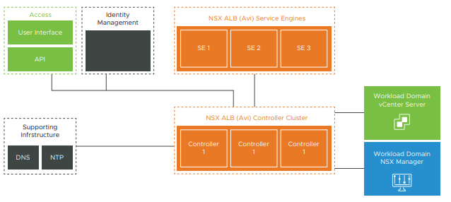  
*Picture 1. High Level architecture of AVI Load Balancer.*  

High Level Architecture defines the placement of components:  

- controllers froming a cluster in management domain
- service engines in workload domain

Service Engines follows the same approach as NSX Edges in NSX deployment, with one major difference: NSX Edges are connected to VCS Management network (vCenter managed port group), but Service Engines are connected to dedicated Overlay Workload Domain network created especially for management purposed (for Service Engines).

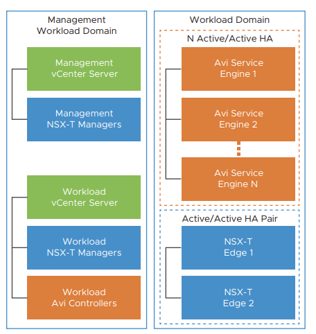  
*Picture 2. DHC and AVI Load Balancer components placement.*  

## Deployment Model for AVI Load Balancing  

Deployment model of the AVI Load Balancer validated solution for VMware Cloud Foundation will follow these rules:

1. A unique AVI Load Balancer deployment needs to be created for every unique NSX-T Data Center deployment in the DHC/VCS. This AVI Load Balancer deployment will be associated with the corresponding NSX-T Data Center deployment.  
   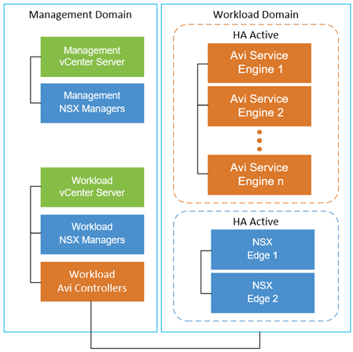  
*Picture 3. AVI Load Balancer deployment model in DHC/VCS.*

2. Multiple AVI Load Balancer deployments could be created if multiple NSX-T Data Center deployments exist within the VMware Cloud Foundation. Refer to the following image which shows that one AVI Load Balancer Controller cluster is managing one workload domain. Each deployment of AVI Load Balancer is mapped to each deplyment of a NSX, here each NSX manages a single workload domain. Although VMware Cloud Foundation support this, it is not being used in DHC currently, therefore this is just for future capabilities.
   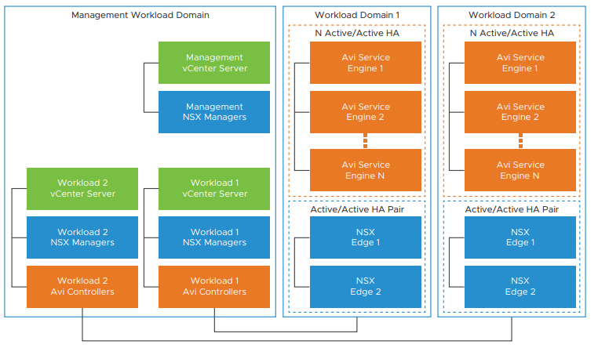  
*Picture 4. Multiple Workload domains expected deployment model of AVI Load Balancer in DHC/VCS.*

3. AVI Load Balancer Controllers will be deployed in the management domain, therefore will utilize management resources.

4. The Service Engines are deployed in the VI workload domain in which the AVI Load Balancer is providing load balancing services.

5. All SEs deployed in a VI workload domain are managed by the Controller that is part of the AVI Load Balancer deployment that is associated with the corresponding NSX-T Data Center managing the VI workload domain.

AVI Load Balancing utilize the NSX-T Cloud Connector integration. NSX-T Cloud Connector integration is an abstraction for an NSX transport zone. Each NSX-T Cloud Connector created on the AVI Load Balancer Controller provides load balancing services for all VI workload domains, i.e. vCenter Server(s) that share an NSX transport zone. You can create a new NSX-T Cloud Connector for each new NSX transport zone.

Note:

- Multiple NSX-T Cloud Connectors can be configured on the same AVI Load Balancer Controller, i.e the same AVI Load Balancer deployment
- Multiple NSX-T Cloud Connectors configured on the same AVI Load Balancer Controller can point to the same NSX Manager cluster, provided there is a unique transport zone or seperation of all components and networks.
- Each NSX-T Cloud Connector can manage multiple vCenters Servers, i.e. can span multiple VI workload domains.

 Table 1. Design Decisions for Deploying the Controller for AVI Load Balancer

 | Decision ID  | Design Decision  | Design Justification | Design Implication |
|--------------|------------------|----------------------|--------------------|
| AVI-CTLR-001 | Initial setup should be done only on one Avi Load Balancer Controller VM out of the three deployed to create an Avi Load Balancer Controller cluster. | Avi Load Balancer Controller cluster is created from an initialized Avi Load Balancer Controller which becomes the cluster leader. Follower Avi Load Balancer Controller nodes need to be uninitialized to join the cluster. | Avi Load Balancer Controller cluster creation will fail if more than one Avi Load Balancer Controller is initialized. |
| AVI-CTLR-002  | Apply vSphere DRS anti-affinity rules for the Avi Load Balancer Controller cluster nodes. **Note**: For a default management vSphere cluster that consists of four ESXi hosts, you can put in maintenance mode only a single ESXi host at a time. | Ensure that Avi Load Balancer Controller VMs are distributed across ESXi hosts. | You must perform additional configuration to set up an anti-affinity rule. |
| AVI-CTLR-003  | Protect Avi Load Balancer Controller cluster nodes using vSphere High Availability. | Supports the availability objectives for the Avi Load Balancer Controller cluster without requiring manual intervention during an ESXi host failure event. | None |
| AVI-CTLR-004  | Create an NSX-T Cloud Connector on AVI Load Balancer Controller for each NSX transport zone requiring load balancing. | A NSX-T Cloud Connector configured on the NSX AVI Load Balancer Controller will provide load balancing for workloads belonging to a Transport Zone on NSX-T. **Note**: 1. A NSX Transport Zone can be unique to a vCenter cluster, a VI Workload Domain or can be shared across VI workload domains. 2. Multiple NSX-T Cloud connectors can be configured on the AVI Load Balancer Controller if load balancing is required across multiple Transport Zones configured on NSX-T. | None |

The option of having a dedicated edge VI workload domain - workload domain created solely for the use of edge services is not taken into consideration for Digital Hybrid Cloud environment.

## Integration Design of AVI Load Balancing

AVI Load Balancer integrates with vCenter and NSX to provide a fully automated lifecycle management for load balanced applications and offers flexibility to isolate applications to cater to any business need.

The NSX-T Cloud Connector integration will be utilized on the AVI Load Balancing. NSX-T Cloud Connector integration provides automated life cycle management for load-balanced applications and the Service Engines. The Service Engines and load-balanced applications are assigned to a Cloud.

Life cycle management includes operations like Service Engine image upload, VM creation and deletion, network placement and programming, IP address assignment and management, NSGroup and NSService creation and on demand update on NSX-T Data Center.

AVI Load Balancer provides two types of NSX-T Cloud connector integrations:

1. Overlay: Provide load balancing for applications deployed on overlay transport zones. Data networks for the Service Engines are attached to logical segments connected to Tier-1 routers. The Controller automatically inject a static route for the VIP into the Tier-1 router for connectivity.

2. VLAN: Provide load balancing for applications deployed on VLAN transport zones. Data networks for the Service Engines are attached to VLAN segments. The Service Engines will Gratuitous Address Resolution Protocol (GARP) for the VIP for connectivity.

### NSX-T Cloud Connector Configuration Model

An NSX-T Cloud connector are scoped to an NSX Manager cluster endpoint and a NSX transport zone. Therefore, for every new combination of NSX Manager cluster, NSX transport zone, a new NSX-T Cloud connector will be created on the Controller. The following models demonstrate typical configurations for VMware Cloud Foundation:

Dedicated NSX Manager cluster for each VI workload domain. Each NSX-T Data Center instance is configured with a SINGLE transport zone. You need to create a single NSX-T Cloud connector on the Controller for this transport zone.

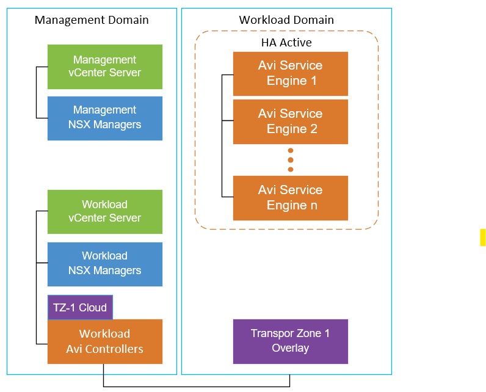  
*Picture 5. Advnced Load Balancer Cloud configuration in relation to Service Engines placement in Overlay Workload Domain Transport Zones (default type of deployment)*

Dedicated NSX Manager cluster for each VI workload domain. Each NSX-T Data Center instance is configured with TWO transport zones. You need to create a unique NSX-T Cloud connector on the Controller for each of these transport zones.

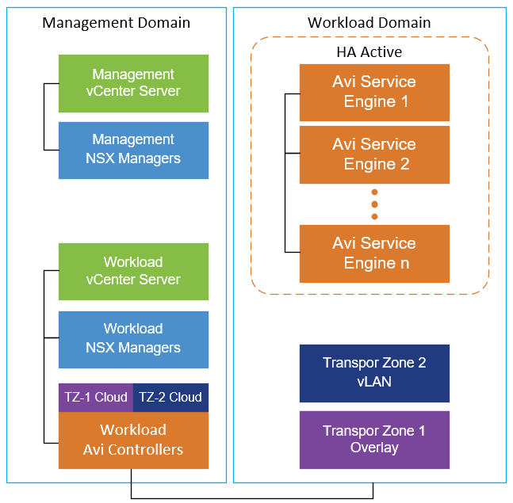  
*Picture 6. Advnced Load Balancer Cloud configuration in relation to Service Engines placement in multiple Workload Domain Transport Zones*

Note: NSX Edges have been omitted from the above figures depicting the NSX-T Cloud models.

Table 2. Design Decisions for creating an NSX-T Cloud on the Controller for the VMware Cloud Foundation

| Decision ID  | Design Decision  | Design Justification | Design Implication |
|--------------|------------------|----------------------|--------------------|
| AVI-CTLR-005 | Create one NSX-T Cloud connector object on the Controller per transport zone configured on the NSX manager cluster that requires Load Balancing services. | Provides automated deployment of load-balanced applications through NSX-T Cloud integration. Allows for maximum flexibility, control, and isolation in terms of application deployment. | Although deployment of NSX Groups is automated, all firewall rules needs to be additionaly created manually or by external automation |
| AVI-CTLR-006 | Provide either a overlay-backed NSX segment connected to a Tier-1 logical router or a VLAN-backed NSX segment for the Service Engine management for the NSX-T Cloud of specific overlay type. | This network is used for the Controller to the Service Engine connectivity. | Both Overlays can be used for management of SE, however to keep consistence in design, overlay transport zone is mainly used for better routing isolation (VRF) control |
| AVI-CTLR-007 | Provide one or more NSX managed VLAN segments as data networks for the NSX-T Cloud connector of VLAN type. **Note**: A single NSX-T Cloud connector of VLAN type can contain multiple data networks. Each data network should belong to a unique NSX managed VLAN segment. | The Service Engines are placed on NSX managed VLAN segments. |  Both Overlays can be used for data traffic of SE, however to keep consistence in design, overlay transport zone is mainly used for better routing isolation (VRF) control |
| AVI-CTLR-008 | Provide a Tier-1 router and a connected overlay-backed NSX segment as data network for the NSX-T Cloud of overlay type. **Note**: A single NSX-T Cloud connector of overlay type can contain multiple data networks. Each data network must belong to a unique Tier-1 router. | The Service Engines are placed on Overlay Segments created on these Tier-1 logical router(s). | None |
| AVI-CTLR-009 | Tier-1 router should be distributed unless requires specific services based on customer demands | Distributed Tier-1 router is enough unless services are to be placed on Tier-1 which requires edge node cluster to be assigned | Edge Node Cluster must be created with proper capacity (resources) |
| AVI-CTLR-010 | Provide an object name prefix when creating the NSX-T Cloud Connector on the Avi Load Balancer Controller. | Used for uniquely identifying NSX-T Cloud Connector created resources on NSX Manager cluster and vCenter Server. | Naming convention needs to be strictly defined here |

### Isolation Models for Load-Balanced Applications

AVI Load Balancer provides two ways of isolating load-balanced applications and the Service Engines.

1.Tenancy: Used for configuration isolation and optionally AVI Load Balancer Service Engine isolation.  

2.Service Engine Groups: Used for AVI Load Balancer Service Engine isolation.

Tenancy Configuration:

Admins can choose to deploy AVI Load Balancer in one of three levels of isolation modes with respect to tenancy.

- Provider/ Admin Tenant mode: All the Service Engines and configurations will reside in the ‘admin’ tenant. Provides least isolation.
- Config isolation Tenant mode: All the Service Engines will reside in the ‘admin’ tenant and are shared across the configured Tenants. Configurations will be scoped under each configured Tenant
- Config and Data isolation Tenant mode: The Service Engines as well as configuration will be scoped under each configured Tenant. Provides most isolation.

Table 3. Design Decisions for creating a Tenants for isolation on the AVI Load Balancer

| Decision ID  | Design Decision  | Design Justification | Design Implication |
|--------------|------------------|----------------------|--------------------|
| AVI-CTLR-011 | Create tenants to provide desired level of isolation . **Note**: Avi Load Balancer - Basic Edition does not provide tenant isolation. | Provides required level of configuration and data plane isolation for workloads. | Additional Service Engine resources might be required. |

Service Engine Group Configuration:

The Service Engine Groups provide the Service Engines isolation and thereby provide load-balanced application isolation within a tenant configured on the AVI Load Balancer.

The AVI Load Balancer Service Engine are created within a Service Engine Group, which contains the definition of how the Service Engines should be sized, placed, and made highly available. Each NSX-T Cloud connector will have at least one Service Engine Group. The Service Engines may only exist within one group and are never shared between the Service Engine Groups. Load-balanced applications are scoped to a Service Engine Group.

Table 4. Design Decisions for Service Engine Group Design for AVI Load Balancer for the VMware Cloud Foundation

| Decision ID  | Design Decision  | Design Justification | Design Implication |
|--------------|------------------|----------------------|--------------------|
| AVI-CTLR-012 | Create multiple Service Engine Groups as desired to isolate applications. **Note**: Some of the criteria for grouping applications in different Service Engine Group(s) could be based on: - Multiple line of business - Prod vs. non-Prod - Different scale and performance requirements | Allows efficient isolation of applications and allows for better capacity planning. Allows flexibility of lifecycle management. | Additional resources need for additional applications due to fact SE cannot be shared between Service Engine Groups |
| AVI-CTLR-013 | Configure Service Engine Group for Active/Active HA mode. **Note**: Legacy Active/Standby HA mode might be required for certain applications. | Provides optimum resiliency, performance, and utilization. | Certain applications might not work in Active/Active mode. For instance, applications that require preserving client IP. In such cases, use the Legacy Active/Standby HA mode. |
| AVI-CTLR-014 | Enable 'Dedicated dispatcher CPU' on Service Engine Groups that contain the Service Engine VMs of 4 or more vCPUs. **Note**: This setting should be enabled on SE Groups that are servicing applications that have high network requirements. | This will enable a dedicated core for packet processing enabling high packet pipeline on the Service Engine VMs. **Note**: By default, the packet processing core also processes load balancing flows. | None |
| AVI-CTLR-015 | Set 'Placement across the Service Engines' setting to 'distributed'. | This allows for maximum fault tolerance and even utilization of capacity. | Might require more Service Engine VMs as compared to 'compact' placement mode. |
| AVI-CTLR-016 | Enable CPU and Memory reservation on the Service Engine Group. | The Service Engines are a critical infrastructure component providing load-balancing services to mission critical applications. | Must be taken into consideration in capacity planning |
| AVI-CTLR-017 | Configure a consistent Service Engine Name Prefix that indicates the Service Engine VM, for instance, 'alb-xxxx'. **Note**: Where ‘xxxx’ could be used as an arbitrary identifier. | This allows efficient grouping and filtering. | None |
| AVI-CTLR-018 | Choose the Service Engine Group mode as Legacy HA Active/Standby if the Controller is set to use basic edition. | Avi Load Balancer Controller in Basic Edition only supports Legacy HA Active/Standby mode. | Applications will not be deployed in an Active/Active fashion, thereby losing out on elastic capacity management. Avi Load Balancer Enterprise Edition will allow Active/Active as well as Legacy Active/Standby deployments. |

## vCenter Server Design of the AVI Load Balancing

Table 5. Design Decisions for the Virtual Infrastructure to support the AVI Load Balancer

| Decision ID   | Design Decision                                                                 | Design Justification                                                                  | Design Implication                                          |
|---------------|---------------------------------------------------------------------------------|---------------------------------------------------------------------------------------|-------------------------------------------------------------|
| AVI-VI-VC-001 | Create anti-affinity 'VM/Host' rule that prevents collocation of the Controller VMs. | vSphere will take care of placing the Controller VMs in a way that ensures maximum HA for the Controller cluster. | None                                                        |
| AVI-VI-VC-002 | Create a virtual machine group for the Controller VMs.                           | Ensures that the Controller VMs can be managed as a group.                            | virtual machines must be added manually to the allocated groups. |
| AVI-VI-VC-003 | In vSphere HA, for each Controller and Service Engine VMs, set the restart priority policy to high and host isolation response to disabled. | This ensures fast recovery for the AVI Load Balancer.                        | None                                                        |
| AVI-VI-VC-004 | Create one Content Library on the management domain to store Controller OVA.                | Deploying OVA from the Content Library will be operationally easy to do.             | Might not be necessary if deploying Controller VMs using automation tools such as vRO, Ansible, etc. |
| AVI-VI-VC-005 | Create one Content Library on each of the VI workload domains to store Service Engine OVA.   | The Controller's NSX-T Cloud Connector requires a Content Library configured to create the Service Engines. | None                                                                                    |

### vCenter Server Access Control for AVI Load Balancer Controller

Create a vCenter Server Service Account (user) with a role having the following permissions. This user can be used by the AVI Load Balancer Controller to interact with the vCenter Server and provide lifecycle management for the Service Engines.

The NSX-T cloud connector interacts with vCenter for Service Engine (SE) lifecycle management, and with NSX-T manager to sync and create objects for networking and security. For this, the admin needs to configure vCenter and NSX-T user credentials which have required permissions for AVI Load Balancer to be able to perform these operations.

Table 6. Required set of operations for vCenter user for AVI Load Balancer account

| Category       | Privilege                               | Sub-Privilege              |
| ---------------| --------------------------------------- | ---------------------------|
| Content Library| Add library item                        |                            |
|                | Delete library item                     |                            |
|                | Update files                            |                            |
|                | Update library item                     |                            |
| Date Store     | Allocate space                          |                            |
|                | Remove file                             |                            |
| Folder         | Create Folder                           |                            |
| Network        | Assign network                          |                            |
|                | Remove                                  |                            |
| Resource       | Assign virtual machine to resource pool |                            |
| Tasks          | Create task                             |                            |
|                | Update task                             |                            |
| vApp           | Add virtual machine                     |                            |
|                | Assign resource pool                    |                            |
|                | Assign vApp                             |                            |
|                | Create                                  |                            |
|                | Delete                                  |                            |
|                | Export                                  |                            |
|                | Import                                  |                            |
|                | Power off                               |                            |
|                | Power on                                |                            |
|                | vApp application configuration          |                            |
|                | vApp instance configuration             |                            |
| Virtual machine| Change configuration                    | Add existing disk          |
|                |                                         | Add new disk               |
|                |                                         | Add or remove device       |
|                |                                         | Advanced configuration     |
|                |                                         | Change CPU count           |
|                |                                         | Change Memory              |
|                |                                         | Change Settings            |
|                |                                         | Change resource            |
|                |                                         | Display connection settings|
|                |                                         | Extend virtual disk        |
|                |                                         | Remove disk                |
|                | Edit inventory                          | Create new                 |
|                |                                         | Remove inventory           |
|                | Interaction                             | Connect devices            |
|                |                                         | Install VMware Tools       |
|                |                                         | Power off                  |
|                |                                         | Power on                   |
|                | Provisioning                            | Allow disk access          |
|                |                                         | Allow file access          |
|                |                                         | Allow read-only disk access|
|                |                                         | Deploy template            |
|                |                                         | Mark as virtual machine    |

**Note** Propagate to children checkbox must be checked for vCenter user having global permissions.

Additional Role must be created to fulfill below set of operations:
AviRole - Global:

Table 7. Required set of operations for vCenter role for AVI Load Balancer account

| Category       | Privilege                               | Sub-Privilege              |
| ---------------| --------------------------------------- | ---------------------------|
| Content Library| Add library item                        |                            |
|                | Delete library item                     |                            |
|                | Update files                            |                            |
|                | Update library item                     |                            |
| Date Store     | Allocate space                          |                            |
|                | Remove file                             |                            |
| Folder         | Create Folder                           |                            |
| Network        | Assign network                          |                            |
|                | Remove                                  |                            |
| Resource       | Assign virtual machine to resource pool |                            |
| Tasks          | Create task                             |                            |
|                | Update task                             |                            |
| vApp           | Add virtual machine                     |                            |
|                | Assign resource pool                    |                            |
|                | Assign vApp                             |                            |
|                | Create                                  |                            |
|                | Delete                                  |                            |
|                | Export                                  |                            |
|                | Import                                  |                            |
|                | Power off                               |                            |
|                | Power on                                |                            |
|                | vApp application configuration          |                            |
|                | vApp instance configuration             |                            |
| Virtual machine| Change configuration                    | Add existing disk          |
|                |                                         | Add new disk               |
|                |                                         | Add or remove device       |
|                |                                         | Advanced configuration     |
|                |                                         | Change CPU count           |
|                |                                         | Change Memory              |
|                |                                         | Change Settings            |
|                |                                         | Change resource            |
|                |                                         | Display connection settings|
|                |                                         | Extend virtual disk        |
|                |                                         | Remove disk                |
|                | Edit inventory                          | Create new                 |
|                |                                         | Remove inventory           |
|                | Interaction                             | Connect devices            |
|                |                                         | Install VMware Tools       |
|                |                                         | Power off                  |
|                |                                         | Power on                   |
|                | Provisioning                            | Allow disk access          |
|                |                                         | Allow file access          |
|                |                                         | Allow read-only disk access|
|                |                                         | Deploy template            |
|                |                                         | Mark as virtual machine    |

**Note** Propagate to children checkbox must be selected for vCenter user having global permissions.

Table 8. Design Decisions for vCenter Server Access Control for AVI Load Balancer Controller

| Decision ID       | Design Description                                           | Design Justification                                                                 | Design Implication                       |
|-------------------|------------------------------------------------------------|-------------------------------------------------------------------------------------|------------------------------------------|
| AVI-VI-VC-006     | Create or use a vCenter Server User/Role with the described privileges. **Note:** Do not use the local administrator or root user of vCenter Server for this purpose. | Required for AVI Load Balancer Controller to perform lifecycle management of the Service Engines. **Note:** Update the vCenter User credential on the Controller when the password for this user account is rotated. | Password rotation must include changes within AVI Load Balancer functionality |

## NSX-T Design of the AVI Load Balancing

### NSX-T Data Center Access Control for AVI Balancer Controller

Use the 'Network Engineer' role and create a Service Account user . This user is used by the Controller to interact with NSX Manager cluster and provide lifecycle management for the Service Engines.

Table 9. Design Decisions for NSX-T Data Center Access Control for AVI Load Balancer Controller

| Decision ID       | Design Decision                                                  | Design Justification                                                                | Design Implication                       |
|-------------------|-----------------------------------------------------------------|------------------------------------------------------------------------------------|------------------------------------------|
| AVI-NSX-001       | Create or use an NSX-T Manager cluster User/Role with a password with the described privileges. Note: It is recommended not to use the local ‘admin’ user of NSX-T Data Center. | Required for the Controller to perform lifecycle management of the Service Engines. Note: Update the NSX-T User Credential on the Controller when the password for this user account is rotated. | Password rotation must include changes within AVI Load Balancer functionality |

### NSX-T Data Center Distributed Firewall Rule Configuration

All details about distributed firewall rules configuration for Micro-segmentation are defined in  [lldMicrosegmentation](lldMicrosegmentation.md) under [Advanced Load Balancer implementation with Micro-segmentation](lldMicrosegmentation.md#advanced-load-balancer-implementation-with-micro-segmentation) section.

### Load-Balanced Application Connectivity to External Clients

When using overlay networks with NSX-T, to enable north-south connectivity for load-balanced applications (VS), configure the following on the NSX Manager:

- Tier 1 to advertise static routes to Tier 0.
- Tier 0 to re-distribute Tier 1 advertised static routes to external peer.

This way whenever a new VIP is created on the Controller, it will be automatically advertised to the external peer.

## NSX Advanced Load Balancer Security Implementation Guide

### 1. SSL/TLS Configuration

- Enforces only TLS 1.2 and 1.3, disables legacy protocols (TLS 1.0/1.1/SSL)
- Perfect Forward Secrecy enforced
- Strong cipher suites with Forward Secrecy enabled:
  - Priority 1 (Default)
    - TLS_ECDHE_ECDSA_WITH_AES_256_GCM_SHA384
    - TLS_ECDHE_ECDSA_WITH_AES_128_GCM_SHA256
    - TLS_ECDHE_RSA_WITH_AES_256_GCM_SHA384
    - TLS_ECDHE_RSA_WITH_AES_128_GCM_SHA256
  - Priority 2 (Compatibility Ciphers, fallback only if needed)
    - TLS_ECDHE_ECDSA_WITH_AES_256_CBC_SHA384
    - TLS_ECDHE_ECDSA_WITH_AES_256_CBC_SHA
    - TLS_ECDHE_ECDSA_WITH_AES_128_CBC_SHA256
    - TLS_ECDHE_ECDSA_WITH_AES_128_CBC_SHA
    - TLS_ECDHE_RSA_WITH_AES_256_CBC_SHA384
    - TLS_ECDHE_RSA_WITH_AES_128_CBC_SHA256
    - TLS_ECDHE_RSA_WITH_AES_128_CBC_SHA

- Certificates issued by trusted CAs, rotated annually
- SSL terminated at SE, with backend re-encryption for critical apps

Table 10. Design decisions for SSL/TLS configuration

| Decision ID | Design Decision                                                          | Design Justification                                                   | Design Implication                                     |
| ----------- | ------------------------------------------------------------------------ | ---------------------------------------------------------------------- | ------------------------------------------------------ |
| AVI-SEC-001 | Enforce only TLS 1.2 and 1.3, disable legacy protocols (TLS 1.0/1.1/SSL) | Ensures modern, secure encryption; eliminates legacy vulnerabilities.  | Legacy clients may be unable to connect.               |
| AVI-SEC-002 | Enforce Perfect Forward Secrecy (PFS)                                    | PFS protects past sessions if the key is compromised.                  | Requires compatible clients and cipher suites.         |
| AVI-SEC-003 | Use only strong cipher suites with Forward Secrecy.                      | Reduces risk of cipher-based attacks; follows industry best practices. | May require adjustment if legacy compatibility needed. |
| AVI-SEC-004 | Default ciphers: ECDHE_ECDSA/RSA with AES GCM (128/256)                 | GCM provides authenticated encryption and higher security.             | Only modern clients will negotiate these by default.   |
| AVI-SEC-005 | Allow CBC ciphers only for compatibility (fallback only if needed)       | Enables support for older clients if business requires it.             | Increased attack surface if CBC is enabled.            |
| AVI-SEC-006 | Certificates issued by trusted CAs, rotated annually                     | Mitigates risk from certificate expiry/compromise.                     | Requires certificate management process.               |
| AVI-SEC-007 | SSL terminated at SE, backend re-encryption for critical apps            | Protects sensitive data in transit across all segments.                | Slight increase in SE and backend CPU utilization.     |

### 2. Web Application Firewall (WAF)

- WAF enabled on all external-facing services (if possible)
- Based on OWASP CRS, with optional custom rules (e.g., SQLi, XSS, LFI) added based on application requirements.
- Blocking mode; incidents logged and forwarded to SysLog/SIEM (may be changed to detection, if requested)
- Alerts for critical security events

Table 11. Design decisions for WAF

| Decision ID | Design Decision                                                                   | Design Justification                                                | Design Implication                                 |
| ----------- | --------------------------------------------------------------------------------- | ------------------------------------------------------------------- | -------------------------------------------------- |
| AVI-SEC-008 | WAF enabled on all external-facing services (if possible)                         | Reduces attack surface, protects applications from common exploits. | Slight latency increase; possible false positives. |
| AVI-SEC-009 | Use OWASP CRS plus custom rules (e.g. SQLi, XSS, LFI)                             | Addresses both generic and app-specific threats.                    | Requires ongoing tuning and review.                |
| AVI-SEC-010 | Blocking mode, log incidents to SysLog/SIEM (may use detection mode if requested) | Ensures real-time mitigation and traceability.                      | May block legitimate traffic if rules too strict.  |
| AVI-SEC-011 | Alerts for critical security events                                               | Provides prompt incident response capability.                       | Requires integration with alerting systems.        |

### 3. Access Control Policies

- IP whitelisting for sensitive apps
- Rate limiting at 1000 req/min/IP
- Bot management and detection enabled

Table 12. Design decisions for Access Control Policies

| Decision ID | Design Decision                      | Design Justification                      | Design Implication                                |
| ----------- | ------------------------------------ | ----------------------------------------- | ------------------------------------------------- |
| AVI-SEC-012 | IP whitelisting for sensitive apps   | Restricts access to trusted sources only. | Users outside the whitelist cannot connect.       |
| AVI-SEC-013 | Rate limiting at 1000 req/min/IP     | Mitigates DDoS/brute-force attacks.       | May require tuning for business-critical traffic. |
| AVI-SEC-014 | Bot management and detection enabled | Reduces automated abuse and scraping.     | Possible impact on legitimate bots/scripts.       |

### 4. Secure HTTP Headers

- Enforces HSTS
- Optional headers include: X-Frame-Options, X-Content-Type-Options, Referrer-Policy, CSP, X-XSS-Protection
- All HTTP redirected to HTTPS

Table 13. Design decisions for HTTP Headers security

| Decision ID | Design Decision                                                                           | Design Justification                                                          | Design Implication                                  |
| ----------- | ----------------------------------------------------------------------------------------- | ----------------------------------------------------------------------------- | --------------------------------------------------- |
| AVI-SEC-015 | Enforce HSTS header                                                                       | Prevents protocol downgrade, enforces HTTPS.                                  | Clients will not be able to connect via HTTP.       |
| AVI-SEC-016 | Optional: X-Frame-Options, X-Content-Type-Options, Referrer-Policy, CSP, X-XSS-Protection | Increases browser-side protection against XSS, clickjacking, data leaks, etc. | May require adjustments based on app functionality. |
| AVI-SEC-017 | Redirect all HTTP to HTTPS                                                                | Prevents unencrypted access.                                                  | All clients forced to use secure channel.           |

### 5. Backend Server Security

- SE verifies backend SSL certs (if possible)
- Health checks include HTTP 200 and SSL handshake validation
- Backend servers require minimum TLS 1.2

Table 14. Design decisions for backend servers security

| Decision ID | Design Decision                                             | Design Justification                              | Design Implication                                  |
| ----------- | ----------------------------------------------------------- | ------------------------------------------------- | --------------------------------------------------- |
| AVI-SEC-018 | SE verifies backend SSL certificates (if possible)          | Ensures end-to-end encryption and authenticity.   | Backend must present valid certificates.            |
| AVI-SEC-019 | Health checks include HTTP 200 and SSL handshake validation | Ensures both connectivity and correct encryption. | Failing backend certificates may mark servers down. |
| AVI-SEC-020 | Backend servers require minimum TLS 1.2                     | Protects internal traffic with strong encryption. | Backends must support TLS 1.2+.                     |

### 6. Segregation and Network Security

- SEs deployed in dedicated VLANs/segments
- NSX microsegmentation for traffic between SE and backend

Table 15. Design decisions for networks' segregation and security

| Decision ID | Design Decision                                     | Design Justification                                   | Design Implication                                  |
| ----------- | --------------------------------------------------- | ------------------------------------------------------ | --------------------------------------------------- |
| AVI-SEC-021 | SEs deployed in dedicated VLANs/segments            | Limits blast radius of compromise, improves isolation. | Increases network configuration complexity.         |
| AVI-SEC-022 | NSX microsegmentation between SE and backend        | Restricts unnecessary traffic, enforces zero-trust.    | Requires NSX firewall/microsegmentation policies.   |

### 7. User & API Access Security

- RBAC with Admin, Operator, Auditor roles
- API access via service accounts and token authentication
- Strong password policy enforced

Table 16. Design decisions for user and API access

| Decision ID | Design Decision                                          | Design Justification                                          | Design Implication                                 |
| ----------- | -------------------------------------------------------- | ------------------------------------------------------------- | -------------------------------------------------- |
| AVI-SEC-023 | RBAC with Admin, Operator, Auditor roles                 | Principle of least privilege, easier audit/compliance.        | Users must be assigned appropriate roles.          |
| AVI-SEC-024 | API access via service accounts and token authentication | Reduces risk of credential exposure, supports automation.     | Token lifecycle and secrets management needed.     |
| AVI-SEC-025 | Strong password policy enforced                          | Mitigates risk of credential brute-force or guessing attacks. | May increase support requests for password resets. |

### 8. Additional Security Controls

- LDAP/AD integration for SSO
- Optionally DoS/DDoS protections

Table 17. Design decisions for security controlls

| Decision ID | Design Decision                        | Design Justification                        | Design Implication                             |
| ----------- | -------------------------------------- | ------------------------------------------- | ---------------------------------------------- |
| AVI-SEC-026 | LDAP/AD integration for SSO            | Centralizes identity and access management. | Requires integration with corporate directory. |
| AVI-SEC-027 | Optionally enable DoS/DDoS protections | Protects against denial-of-service attacks. | May require tuning to avoid false positives.   |

## Licensing VMware AVI Load Balancer for VMware Cloud Foundation

AVI Load Balancer is available in three editions:

- AVI Load Balancer Enterprise with Cloud Services edition, which provides all features that VMware AVI Load Balancer has to offer along with value added SaaS delivered Cloud Services (Available from AVI Load Balancer v21.1.3 or later).
- AVI Load Balancer Enterprise edition, which provides full enterprise grade load balancing including multi-cloud integration, active-active high availability, Global Server Load Balancing (GSLB), Web Application Firewall (WAF), and so on.

Table 18. Licensing breakdown:

| **Categories**              | **Feature**                      | **Enterprise**                                                                 | **Enterprise with Cloud Services Edition**                                     |
|----------------------------|----------------------------------|--------------------------------------------------------------------------------|---------------------------------------------------------------------------------|
| **Local Traffic Management** | L4 LB                             | TCP, UDP, DNS, SIP, RADIUS DSR, TLS support, PROXY protocol support           | TCP, UDP, DNS, SIP, RADIUS DSR, TLS support, PROXY protocol support            |
|                            | L7 LB                             | HTTP/2, content rewrite, compression, caching                                 | HTTP/2, content rewrite, compression, caching                                  |
|                            | L3/4 Policies                     | Full-featured, including DataScripts and live IP Reputation                   | Full-featured, including DataScripts and live IP Reputation                    |
|                            | L7 Policies                       | Match on: IP Reputation DB, string groups, etc. Actions to: Rate-limit, ICAP, etc. | Match on: IP Reputation DB, string groups, etc. Actions to: Rate-limit, ICAP, etc. |
| **Global Traffic Management** | Global Server Load Balancing     | Enterprise grade GSLB                                                         | Enterprise grade GSLB                                                          |
| **Application Security**   | SSL/TLS                           | Dynamic CRLs, OCSP stapling, TLSv1.3, HSM, cert management                    | Dynamic CRLs, OCSP stapling, TLSv1.3, HSM, cert management                     |
|                            | Application Rate Limiting        | Rate limiters for L4, L7, DNS, and WAF                                       | Rate limiters for L4, L7, DNS, and WAF                                        |
|                            | DDoS Protection                  | L3, L4, and L7 DDoS protection                                                | L3, L4, and L7 DDoS protection                                                 |
|                            | Intelligent WAF                  | CRS, learning/PSM, IPReputation, app signatures                              | CRS, learning/PSM, IPReputation, app signatures, bot detection                |
|                            |                                  |                                                                                | *See **BOT Management Service** topic in the VMware NSX ALB Cloud Services Guide* |
| **Container Ingress**      | Service Type LB                  | Yes                                                                            | Yes                                                                             |
|                            | Container Ingress                | Full Ingress DNS & GSLB integration Multi K8s cluster & multi-AZ support | Full Ingress DNS & GSLB integration Multi K8s cluster & multi-AZ support |
| **Software Defined Platform** | Administration                   | Fully multi-tenant & granular RBAC Rich alerts and events 3rd party integrations IDP integrations | Fully multi-tenant & granular RBAC Rich alerts and events 3rd party integrations IDP integrations |
|                            | Scale and HA                     | Active/Active deployments BGP & ECMP support Autoscale of load balancers | Active/Active deployments BGP & ECMP support Autoscale of load balancers |
|                            | Flexible upgrades                | Flexible LCM across tenants/clouds/se-groups                                  | Flexible LCM across tenants/clouds/se-groups                                   |
|                            | Ecosystem automation             | Native integrations with all major public & private clouds and container orchestration platforms | Native integrations with all major public & private clouds and container orchestration platforms |
|                            | Pulse                            | Enhanced case management Live Security Threat Updates                      | Enhanced case management Live Security Threat Updates Proactive case creation supported  *See **Proactive Support** topic in the VMware NSX ALB Cloud Services Guide* |
| **Advanced Analytics**     | Application Visibility/Analytics | Advanced application telemetry Log insights                                | Advanced application telemetry Log insights                                 |

Table 19. Licensing Design decision

| Decision ID | Design Decision | Design Justification | Design Implication |
|---|---|---|---|
| AVI-LIC-001 | Enterprise edition is enough for most of deployments  | Basic licensing is not sold anymore therefore enterprise version as minimum is required | |  

## Sizing Compute and Storage Resources of AVI Load Balancing for VMware Cloud Foundation

### Sizing Compute and Storage Resources for AVI Load Balancer Controllers

A three-node Controller cluster deployment is a requirement for optimum operation of the AVI Load Balancer.

#### AVI Load Balancer Controller Sizing Guidelines for CPU and Memory

The amount of CPU/memory capacity to allocate to the Controller is calculated based on the following parameters:

- The number of virtual services to support
- The number of Service Engines to support
- Analytics thresholds

CPU/ Memory Allocation based on Controller Flavor

Table 20. CPU/Memory allocation for Controllers

| CPU/ Memory Allocation | Small (6 CPUs/ 32 GB) | Large (16 CPUs/ 48GB |X-Large (16 CPUs/ 64 GB) |
|---|---|---|---|
| Base processes | 19 GB | 24 GB | 32 GB |
| Log analytics | 13 GB | 24 GB | 32 GB |
| SE Scale | 0-200 | 200-500 | 200-500 |

#### AVI Load Balancer Controller Sizing Guidelines for Disk

Allocating Disk based on Controller Flavor

Table 21. Storage allocation for Controllers

| Flavor | Minimum Recommended Disk Space |
|---|---|
| Small | 512 GB |
| Large | 1.4 TB |
| XL | 2.15 TB |

Disk drive quality impacts analytics performance and size:

- Traffic logs are deleted as the disk drive fills up.
- Metrics tables are deleted based on the archival scheme:
  - Realtime: deleted after 1 hour
  - 5-minute intervals: deleted after 1 day
  - 1-hour intervals: deleted after 1 week
  - 1-day intervals: deleted after 1 year

If the drive fills up, then current metrics tables are deleted to make room for new data.

The amount of disk capacity to allocate to the Controller is calculated based on the following parameters:

- The amount of disk capacity required by analytics components
- The number of virtual services to support

### Sizing Compute and Storage Resources for AVI Load Balancer Service Engines

AVI Load Balancer publishes minimum and recommended resource requirements for new Service Engines. However, network and application traffic may vary. This section provides guidance on sizing.

The Service Engines can be configured with a minimum of 1 vCPU core and 1 GB RAM up to a maximum of 64 vCPU cores and 256 GB RAM. In write access mode, the Service Engine resources for newly created Service Engines can be configured within the Service Engine Group properties from the Controller.

#### CPU

CPU scales very linearly as more cores are added. CPU is a primary factor in SSL handshakes (TPS), throughput, compression, and WAF inspection. For NSX-T Clouds, the default is 1 vCPU cores, not reserved. However, vCPU reservation is highly recommended.

#### Memory

Memory scales near linearly. It is used for concurrent connections and HTTP caching. Doubling the memory will double the ability of the Service Engine to perform these tasks. For NSX-T Clouds, the default is 2 GB memory, reserved within the hypervisor for NSX-T Clouds.

#### Packets Per Second (PPS)

For throughput-related metrics, the hypervisor is likely going to be the bottleneck and provides limited PPS for a virtual machine such as Service Engine.

#### HTTP Requests Per Second (RPS)

HTTP RPS is dependent on the CPU or the PPS limits. It indicates the performance of the CPU and the limit of PPS that the Service Engine can push. On vSphere, the Service Engine can provide approximately 40k RPS per core running on Intel v3 servers. Maximum RPS on the Service Engine virtual machine running on ESXi will be approximately 160k.

#### Disk

The Service Engines may store logs locally before they are sent to the Controllers for indexing. Increasing the disk will increase the log retention on the Service Engine. SSDs are highly recommended, as they can write the log data faster. The recommended minimum size for storage is 10 GB, ((2 * RAM) + 5 GB) or 15 GB, whichever is greater. 15 GB is the default for Service Engines deployed in VMware clouds.

### AVI Load Balancer Service Engine Performance Guidelines

The following table provides guidance to size an AVI Load Balancer Service Engine virtual machine with regards to performance:

**Note:** ENS stands for Enhanced Networking Stack and is high performance mode for networking (requires dedicated configuration on NSX environment)

- NSX-T Cloud with ENS Mode enabled

Table 22. NSX-T Cloud with ENS Mode enabled

| Metryka                        | 1 vCPU / 2 GB      | 2 vCPU / 2 GB      | 4 vCPU / 4 GB      | 6 vCPU / 12 GB     |
| ------------------------------ | ------------------ | ------------------ | ------------------ | ------------------ |
| SSL Transactions per sec (ECC) | 2 950              | 6 000              | 8 700              | 12 000             |
| SSL Transactions per sec (RSA) | 1 020              | 1 950              | 2 600              | 4 000              |
| L7 Requests per sec            | 64 000             | 89 000             | 166 000            | 205 000            |
| L4 Connections per sec (TCP)   | 42 000             | 54 000             | 100 000            | 132 000            |
| L4 Open Connections            | 40 000             | 80 000             | 160 000            | 320 000            |
| L4 Throughput                  | 7 Gbps*            | 8 Gbps*            | 13,1 Gbps          | 10,6 Gbps          |
| L7 Throughput                  | 5,5 Gbps           | 6,2 Gbps           | 12,2 Gbps          | 13,9 Gbps          |
| L7 SSL Throughput              | 2,6 Gbps           | 3,8 Gbps           | 7,2 Gbps           | 10 Gbps            |
| SE CPU Cores                   | 1                  | 2                  | 4                  | 6                  |
| SE Memory                      | 2 GB               | 2 GB               | 4 GB               | 12 GB              |
| SE Disk                        | 15 GB              | 20 GB              | 30 GB              | 40 GB              |

\* For L4 Throughput, the values for 1 and 2 vCPU are estimated – the available data mainly concerns the 4 and 6 vCPU configurations, with a decrease in efficiency observed at 6 vCPU (10.6 Gbps) compared to 4 vCPU (13.1 Gbps).

- NSX-T Cloud with-out ENS Mode

Table 23. NSX-T Cloud with-out ENS Mode

| Metryka                        | 1 vCPU / 2 GB      | 2 vCPU / 2 GB      | 4 vCPU / 4 GB      | 6 vCPU / 6 GB      |
| ------------------------------ | ------------------ | ------------------ | ------------------ | ------------------ |
| SSL Transactions per sec (ECC) | 2 900               | 5 800               | 8 700               | 12 000              |
| SSL Transactions per sec (RSA) | 950                | 1 800               | 2 600               | 4 000               |
| L7 Requests per sec            | 58 000              | 80 000              | 150 000             | 185 000             |
| L4 Connections per sec (TCP)   | 42 000              | 54 000              | 100 000             | 132 000             |
| L4 Open Connections            | 40 000              | 80 000              | 160 000             | 320 000             |
| L4 Throughput                  | 6 Gbps             | 6 Gbps             | 9.5 Gbps           | 13 Gbps            |
| L7 Throughput                  | 5 Gbps             | 5.6 Gbps           | 11 Gbps            | 12 Gbps            |
| L7 SSL Throughput              | 2.6 Gbps           | 3.8 Gbps           | 7.2 Gbps           | 10 Gbps            |
| SE CPU Cores                   | 1                  | 2                  | 4                  | 6                  |
| SE Memory                      | 2 GB               | 2 GB               | 4 GB               | 6 GB               |
| SE Disk                        | 15 GB              | 20 GB              | 30 GB              | 40 GB              |

## Network Design for AVI Load Balancing for VMware Cloud Foundation

### Network Segment

In the network design for the AVI Load Balancer users are required to provide three types of connectivity:

1. Management connectivity for the Controllers. Management network in Management domain is being used for multiple important components like vCenter, NSX and ESXi hosts. Mentioned servers are required for Advanced Load Balancer (ALB) to work, therefore placement of ALB is self explenatory to be placed in Management network. This leads to have direct connectivity with most important components and still being protected by physical firewall out of outside world.  
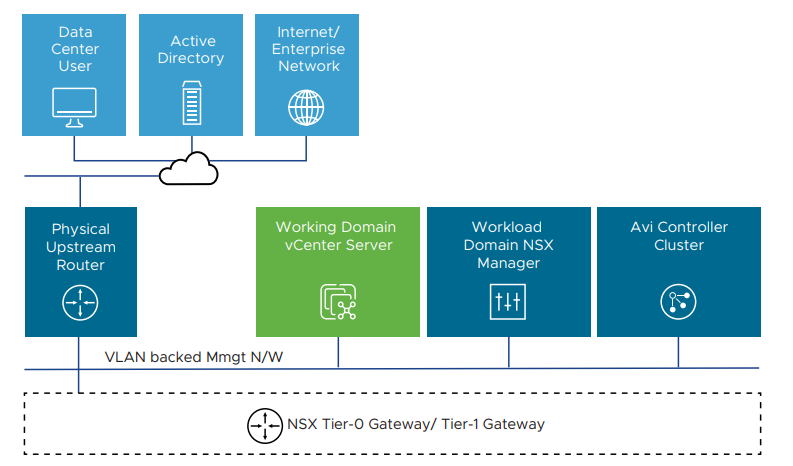  
*Picture 7. Network connectivity towards Management and Control Plane*

2. Management connectivity between the Controllers and the Service Engines and AVI Load Balancer Service Engines connected to an NSX-T Managed Overlay network. Service Engines are placed in customer workload domain, which brings additional complexity, with firewall opening. Communication from dedicated Service Egnine Management network (NSX002 overlay) for Service Engine in Workload Domain must be allowed on NSX002 Distributed Firewall, as well as on Physical Firewall. Besides of firewall routing must be configured properly on NSX002, Physical Firewall and in Data Center (by DC LAN team).
  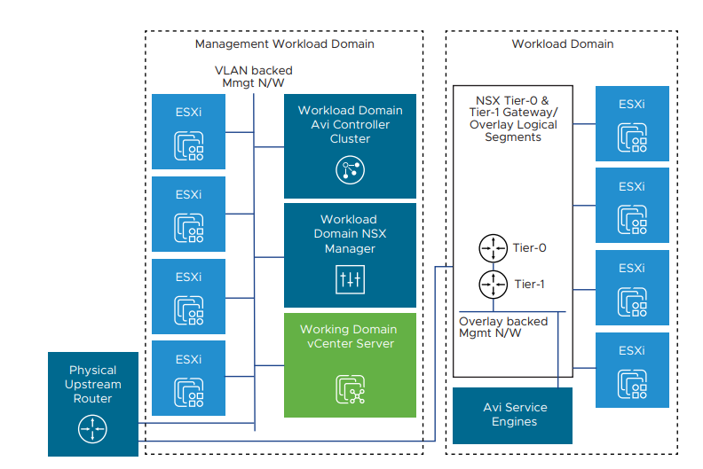  
*Picture 8. Network connectivity between Advanced Load Balancer Controllers and Service Engines*

3. Data connectivity to load-balanced application traffic from the Service Engines. Traffic between Service Engine and Backend Servers is being set up only in Workload Domain. NSX002 Distributed Firewall openings are required either in VCS 1.x version (NSX 3.x) or VSX 2+ version (NSX 4.x+) to ensure communication is allowed. Routing capabilities are easy to obtain due to fact it was designed in Multi-Tenant and Signle-Tenant environments to meet this requirement.  

Table 24. Design Decisions for the Networking Design for AVI Load Balancer

| **Decision ID**  | **Design Decision**                                                                 | **Design Justification**                                                                                    | **Design Implication** |
|------------------|-------------------------------------------------------------------------------------|-------------------------------------------------------------------------------------------------------------|------------------------|
| AVI-VI-VC-07    | Deploy the Controller cluster nodes on the DHC/VCS management network. | Allows for ease of management for the Controllers. Enables configuring a floating cluster VIP, a single IP assigned to the cluster leader. Administrative tasks, connectivity to the Service Engines, and network services will use this network. | Microsegmentation is not applicable to management network |
| AVI-NSX-004      | Configure dedicated management network to deploy the Service Engines. This network should be an Overlay-backed NSX segment connected to a Tier-1 router. **Note:** The network (and Service Engines) must have connectivity to the IP addresses of the Controllers. | Required to configure the Controller NSX-T Cloud Connector.                                                 | Workload domain  to management domain communication must be open, what is not a standard solution |
| AVI-NSX-005      | Configure one or more data networks for the Service Engines to service load-balanced applications. These networks should be NSX-T managed and could be either: 1) VLAN-backed NSX segment, or 2) Overlay-backed NSX segment connected to a Tier-1 router. **Note:** For overlay-backed NSX segments, one logical segment is required per Tier-1 router. | The Service Engines require data networks to provide access for load-balanced applications.                    | None                   |
<!--| AVI-CTLR-018     | Latency between the Controllers must be <10ms.                                        | The Controller quorum is latency sensitive. **Note:** The control plane might go down if latency is high.     | None                   |
| AVI-CTLR-019     | Latency between the Controllers and the Service Engines should be <75ms.              | Required for correct operation of the Service Engines. **Note:** May lead to issues with heartbeats and data synchronization between the Controller and the Service Engines. | None                   | -->

Table 25. Controller communication requirements

| Requirement | Value | Requirement level |
|---|---|---|
|Latency between the Controllers | \< 10 ms | MUST |
| Latency between the Controllers and the Service Engines  | \< 75 ms | SHOULD |

### IP Addressing Scheme

An IP address can be allocated to Avi using static or dynamic allocation based on the network configuration of your environment. It is recommended to reserve an IP address from the selected local network segment and statically assign it to the corresponding Controller instance.

Table 26. Design Decisions for the IP Addressing Scheme for AVI Load Balancer

| **Decision ID**   | **Design Decision**                                                                                                                                                       | **Design Justification**                                                                                                                                       | **Design Implication** |
|-------------------|---------------------------------------------------------------------------------------------------------------------------------------------------------------------------|---------------------------------------------------------------------------------------------------------------------------------------------------------------|------------------------|
| AVI-CTLR-019      | Use static IPs for the controllers.                                                                                     | The Controller cluster uses management IPs to form and maintain quorum for the control plane. **Note:** The Controller control plane might go down if the management IPs change. | None                   |
| AVI-VI-001        | Reserve an IP in the management subnet to be used as the cluster IP for the Controller cluster.                                                                             | A floating IP that will always be accessible regardless of a specific individual Avi cluster node.                                                              | None                   |
| AVI-NSX-006       | Configure DHCP on the networks/logical segments used for data traffic.                                                                                                      | Having DHCP enabled for data networks makes the Service Engine configuration simple. **Note:** Alternatively, static IPs may be used, requiring IP pools for the Service Engines and adding a static route for the data network's gateway on the Controller. | None                   |

### Name Resolution

Name resolution provides the translation between an IP address and a fully qualified domain name (FQDN), this makes it easier to remember and connect to components across the SDDC. Each IP address assigned to the Controller instance must have valid DNS forward (A) and reverse (PTR) records.

Table 27. Design Decisions for the Name Resolution for AVI Load Balancer

| **Decision ID**    | **Design Decision**                                             | **Design Justification**                                                                                 | **Design Implication**                   |
|--------------------|-----------------------------------------------------------------|-----------------------------------------------------------------------------------------------------------|------------------------------------------|
| AVI-VI-002         | Configure DNS A records for the three Controllers and cluster VIP. | The Controllers are accessible by an easy-to-remember FQDN as well as directly by IP address.               | Assumes DNS infrastructure is available. |

Details of name configuration can be found in [naming convetion document](namingConvention.md)

### Time Synchronization

Time synchronization provided by the Network Time Protocol (NTP) is important to ensure that all components within the Software-Defined Data Center are synchronized to the same time source.

Table 28. Design Decisions for the Time Synchronization for AVI Load Balancer

| **Decision ID**    | **Design Decision**                                             | **Design Justification**                                                                                 | **Design Implication**                   |
|--------------------|-----------------------------------------------------------------|-----------------------------------------------------------------------------------------------------------|------------------------------------------|
| AVI-VI-003         | Configure time synchronization by using an NTP time for the Controller. | Prevents time synchronization issues.                                                                      | An operational NTP service must be available in the environment. Ensure that NTP traffic between the Controllers, Service Engines, and NTP servers is allowed on required network ports and not firewalled. |

### Ports Requirements for AVI Load Balancer

Table 29. Port requirements for deployment

| **Port** | **Protocol** | **Source**                        | **Destination**                     | **Description**                                      |
|---------|--------------|------------------------------------|-------------------------------------|------------------------------------------------------|
| 22      | TCP          | The Controller cluster Nodes       | The Controller cluster Nodes        | Secure channel over SSH                              |
| 443     | TCP          | The Controller cluster Nodes       | The Controller cluster Nodes        | Access to portal over HTTPS (UI)                     |
| 8443    | TCP          | The Controller cluster Nodes       | The Controller cluster Nodes        | Secure key exchange portal over HTTPS                |
| **The Service Engine to the Controller cluster Node Access** |              |                                    |                                     |                                                      |
| 22      | TCP          | The Service Engine management IPs  | The Controller cluster Nodes        | Secure channel over SSH                              |
| 8443    | TCP          | The Service Engine management IPs  | The Controller cluster Nodes        | Secure key exchange over HTTPS                       |
| 123     | UDP          | The Service Engine management IPs  | The Controller cluster Nodes        | NTP time synchronization                             |
| **Administration Access**                                  |              |                                    |                                     |                                                      |
| 22      | TCP          | Admin User IPs                     | The Controller cluster Nodes        | SSH access to the Controller cluster shell/ CLI      |
| 443     | TCP          | Admin User IPs                     | The Controller cluster Nodes        | HTTPS access to the Controller cluster system portal (UI/ SDK) |
| 161     | UDP          | Admin User IPs                     | The Controller cluster Nodes        | SNMP Poll                                            |
| 5054    | TCP          | Admin User IPs                     | The Controller cluster Nodes        | (Optional) The Controller CLI through remote shell   |
| **The Controller cluster Nodes to External Services**       |              |                                    |                                     |                                                      |
| 25      | TCP          | The Controller cluster Nodes       | SMTP Servers                        | SMTP Notifications                                   |
| 49      | TCP          | The Controller cluster Nodes       | TACACS Servers                      | TACACS+                                              |
| 53      | UDP          | The Controller cluster Nodes       | DNS Servers                         | DNS                                                  |
| 123     | UDP          | The Controller cluster Nodes       | NTP Servers                         | NTP                                                  |
| 389     | TCP/UDP      | The Controller cluster Nodes       | LDAP Servers                        | LDAP                                                 |
| 636     | TCP/UDP      | The Controller cluster Nodes       | LDAP Servers                        | LDAPs                                                |
| 162     | UDP          | The Controller cluster Nodes       | SNMP Trap Collectors                | SNMP Traps                                           |
| 514     | UDP          | The Controller cluster Nodes       | Syslog Servers                      | Syslog Notifications                                 |
| **Application Connectivity**                                |              |                                    |                                     |                                                      |
| *       | *            | Application Clients                | The Service Engines                 | Open up the required TCP/UDP ports for the clients to communicate with the application |
| *       | *            | The Service Engines                | Application Servers                 | Open up the required TCP/UDP ports for the Service Engines to communicate with the backend application servers |

## Multitenancy in Advanced Load Balancer deployment

Multi-tenant environment is required once multiple customers or multiple environments are using same hardware and are split logically. Multi-tenant is achieved on different levels of logical seperation and includes defined configuration on every of this level. Multi-tenant environment involved multiple components, however only some are being used to deliver tenancy (i.e. vCenter is fully shared with no tenancy applied from ALB / NSX perspective)

To deliver Multitenancy for Advanced Load Balancer and NSX on Project level there had to be seperation applied on multiple levels:  

- RBAC (Role Based Access Control defining object to tenant affilition based on user assignement with tenant)
- Network (network logical seperation)

Multitenancy is done across entire environment and requires to align across:  

- vRA
  - used for automation and orchestration of tasks related to Advanced Load Balancer
- NSX
  - Network layer delivered solution, supporting entire environment with network and security
- Advanced Load Balancer  
  - Load Balancing solution which is not NSX native, but integrated with external management and control plane  

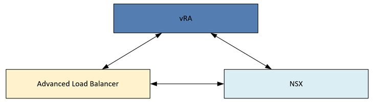  
*Picture 9. High Level View on multi-tenant environment for component relationship.*

Although relationship is defined, seperation is set on multiple and different levels.

### Requirements

Table 30. Requirements table

| Requirement | Description | Requirement Level |
|---|---|---|
| Each customer must have dedicated VRF in NSX environement | Seperation is required on every level possible | MUST |
| Each customer must have dedicated Tenant created in ALB environment | Required for proper SSR operability | MUST |
| Each Advanced Load Balancer Tenant must have dedicated user created | Tenant-admin user role can configure tenant and has RBAC limited to single tenant only | MUST |
| Tier-1 routers must advertise all static routes | /32 static routes are injected by Advanced Load Balancer to T1 routing table for VIPs | MUST |
| Tier-1 routers must advertise all connected segments | Connected segments are for management and data networks of SE | MUST |
| Tier-1 routers must advertise all LB VIP routes and all LB SNAT IP routes | ARP-Proxy is used for VIP and SNAT routes to be reached properly | MUST |
| Data networks are always created in Default Scope | Advanced Load Balancer does not have access within Projects itself | MUST |
| Management networks are always created in Default Scope |  Advanced Load Balancer does not have access within Projects itself | MUST |

### Multitenancy difference for NSX 3.x and NSX 4.x versions

Achieving seperation in Advanced Load Balancer functionality, seperation must be defined not only on single component. It must be stretch across vRA, NSX and Advanced Load Balancer and must have strict relationship based on same name on:

- Advnaced Load Balancer must have exact tenant name
- NSX must have exact project name in VCS 2.0+
- vRA must have exact project name

Table 31. Design decisions

| Decision ID  | Design Decision  | Design Justification | Design Implication |
|---|---|---|---|
| AVI-MT-001 | Name of tenant must be exactly the same in vRA project, NSX Project (if requried - in NSX 4.x+ environments - VCS 2.0+) and Advanced Load Balancer Tenant name | Such approach is required to have the SSR being capable to match tenancy | Scope wide naming convetion is required and must be fully managed |

Tenancy in Advanced Load Balancer does not end on creating tenant, in total it consumes below configuration patterns:  

- TENANT
  - creates main seperation and entry point to configure seperate logical environment
  - requires to have a dedicated user per tenant with RBAC applied and visibility only on exact tenant components
- CLOUD (NSX-T Cloud connector)
  - defines Advanced Load Balancer relationship with NSX-T and vCenter
  - requires to have configured:
    - dedicated Transport Zone
    - T1 routers on NSX environment
    - NSX segments with networks defined for Management network and Data networks
    - IPAM/DNS profiles
- VRF
  - Static routing configuration or BGP neighborship creation with BFD configuration

NSX based tenancy may be delivered in 2 different way (or solutions)

- NSX version up to 3.2 contains seperation at:
  - network level - VRF
    - VRF configuration requires preparation configuration relationship with DC

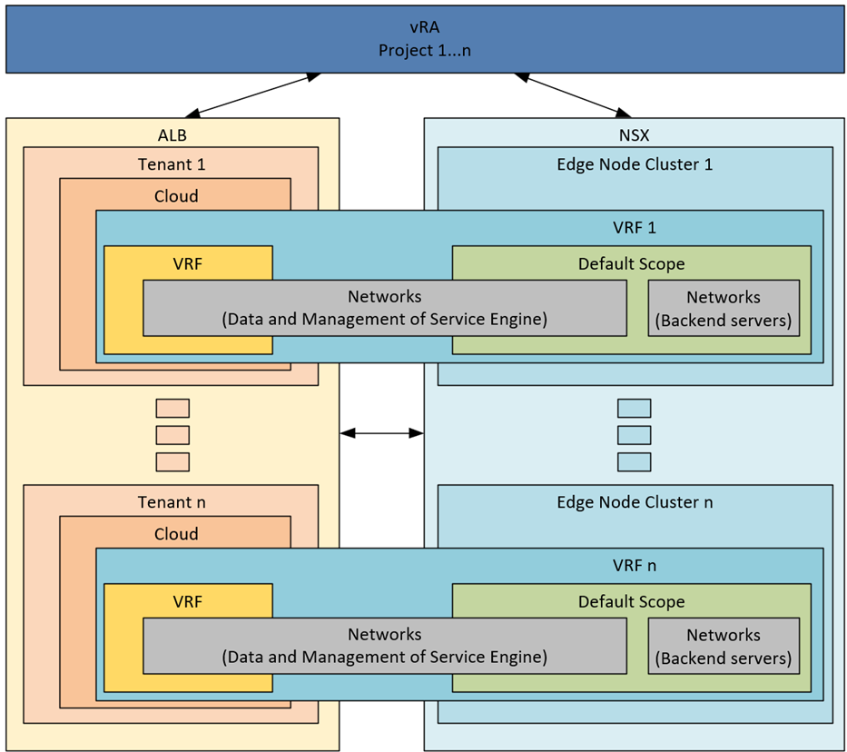  
*Picture 10. In detail multi-tenancy relationship in VCS 1.x*

NSX configured VRF is not the only layer of tenancy. To achieve complete tenancy, Cloud and VRF on Advanced Load Balancer (mentioned above) also must be set in corresponding manner with NSX configuration (show on picture x).  

- NSX version 4.x and above contains seperation at:  
  - network level - VRF on top
    - VRF configuration requires preparation configuration relationship with DC
  - RBAC level - projects
    - Role Base Access Control is defined to deliver dedicated project based environments and visibility only in this environment for logged user

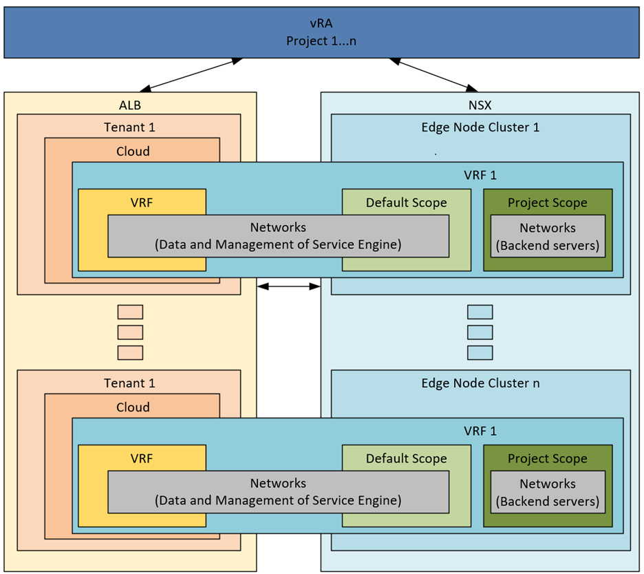  
*Picture 11. In detail multi-tenancy relationship in VCS 2.x+*

- Cloud defines which T1 routers and which networks are dedicated for:
  - management
    - management IP addressing for management communication between Service Engine and Controllers
  - data
    - Service Engines vNIC ip addressing
    - VIP ip addressing  

Data networks can be defined in 2 ways (depends on the scale of environment - bigger environment may have this split, smaller may have this limited to single network):  

- same network can be used for both SE vNIC and VIPs  
- dedicated networks may be defined for SE vNIC and dedicated for VIPs  

Table 32. Design decisions

| Decision ID  | Design Decision  | Design Justification | Design Implication |
|---|---|---|---|
| AVI-MT-002 | Dedicate NSX Edge Cluster is required for single customer VRF including Advanced Load Balancer Management and Data networks support | Seperation is required on all possible levels | Dedicated NSX Edge Cluster must be created before Advanced Load Balancer is deployed for each customer using Advanced Load Balancer functionality |
| AVI-MT-003 | Each Tenant has default components inherited from admin tenant which cannot be used | To achieve granular seperation, admin tenant (added by default) cannot be used. Components from admin tenant are visible in all tenants |  |
| AVI-MT-004 | Managemenet network must be deployed with segment in NSX Default Scope on dedicated T1 router | Advanced Load Balancer has no visibility to any other scope than default (no project is reachable) | Dedicated T1 router and dedicate segment within VRF must be defined |
| AVI-MT-005 | Data network must be deployed with segment in NSX Default Scope on dedicated T1 router | Advanced Load Balancer has no visibility to any other scope than default (no project is reachable) | Dedicated T1 router and dedicate segment within VRF must be defined |
| AVI-MT-006 | Management and first Data network are deployed on the segments which are connected to the same dedicated T1 router | LB networks are using dedicated T1 router for seperation, in fact Management and first Data network are using dedicated environment for Load Balancing mechanism | |
| AVI-MT-007 | Each Data Network requires dedicated T1 router | Technical limitation of Advanced Load Balancer defines only one Data network connected to single T1 router | Multiple T1 routers required to fulfill more complex environments |
| AVI-MT-008 | T1 router for Management Network should be Distributed only unless dedicated services are required | Distributed router is not using Edge Cluster Node resources and optimizes traffic | |  
| AVI-MT-009 | T1 routers for Data Networks should be Distributed only unless dedicated services are required | Distributed router is not using Edge Cluster Node resources and optimizes traffic | |  
| AVI-MT-010 | Define dedicated networks/segments for SE vNIC and dedicated for VIPs in large environments due to technical limitation of network size of /21 on NSX segment | Large environments may require multiple networks for SE vNICs and VIPs | Multiple networks configuration on NSX |
| AVI-MT-011 | Define shared network/segment for SE vNIC and for VIPs in small environments | Small environments may define big enough network to fill both SE vNICS and VIPs | |

Data networks are always created in Default Scope, no matter which NSX version network environment is applied on. This is due to fact Advanced Load Balancer does not have access within Projects itself.  

Management networks are always created in Default Scope, no matter which NSX version network environment is applied on. This is due to fact Advanced Load Balancer does not have access within Projects itself.  

Advanced Load Balancer version 30.x+ supports VPC within NSX Project environements, however still does not support any networks and has no visibility to any networks and objects within Project itself, therefore from VCS perspective Adnvace Load Balancer version does not require any design changes.

### Single tenant deployment details and scalability to multi tenant environment

Single tenant is defined the very same way as multi-tenant with one difference. Only one VRF on NSX is required, as well as only one Tenant in Advanced Load Balancer is required. Multi-tenant environment is basically duplication of single tenant in workload domain for every customer which requires it. This ensures extension of single tenant environment to multi tenant environment brings no issues and scalability on this level is up to configuration maximums of Advanced Load Balancer or NSX.

### Single tenant flows

Single tenant environment is similar in construction and flows definition as multi tenant, however demands to create at least one Tenant in Advanced Load Balancer and have dedicated VRF in NSX environment.

There are 3 types of required connectivity:

- Controllers to/from Service Engines (required for management purposes)
  - Service Engines using management network to communicate with Advanced Load Balancer Controllers in management domain
  - Management network is created on overlay and cannot be connected the same way as i.e. NSX Edges using vCenter port group (only NSX segments are support in NSX-T Cloud)
- Service Engines to/from backend servers
  - Service Engines using data network for SE vNIC for backend servers communication
- Clients to Service Engines
  - Service Engines using data network for VIPs for client communication

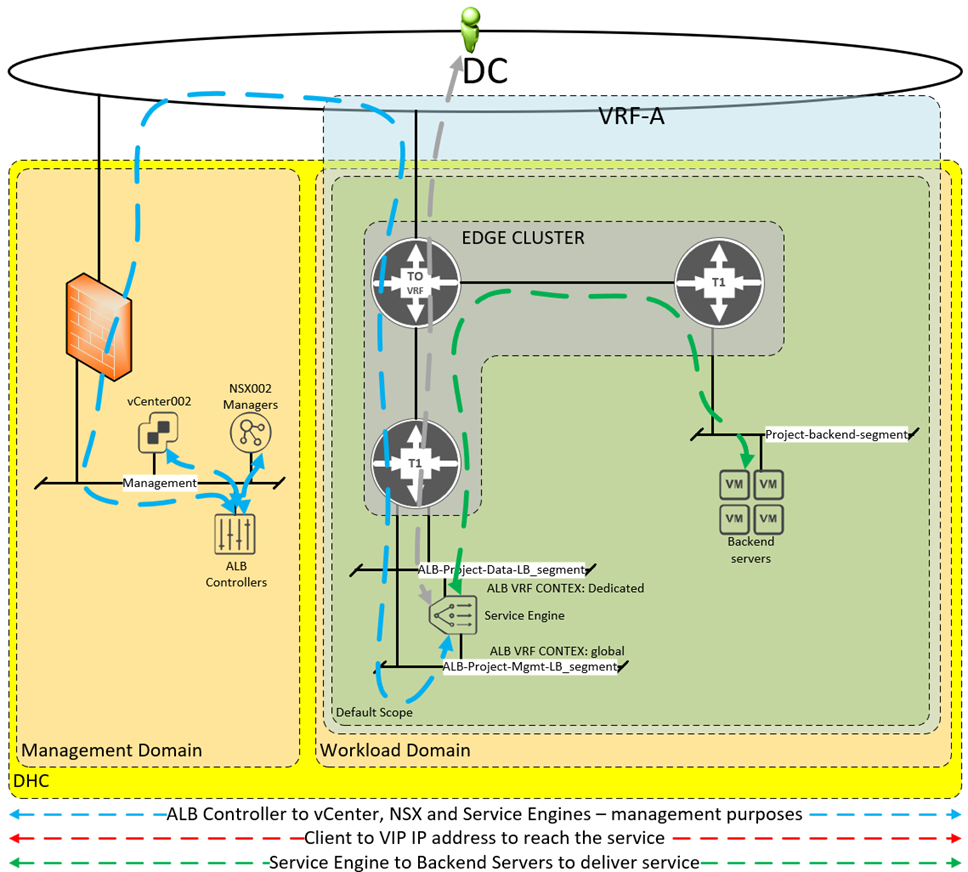  
*Picture 12. Single tenant environment for NSX 3.x version and NSX 4.x without project deployed*

Single tenant for NSX 4.x version can have project defined additionaly and below it is presented how project network backend server reachability is defined.
Communication type are the same as previously, however in this solution backend servers are deployed under project in NSX environment, this requires proper setup of Distributed firewall setup (already defined in [lldMicrosegmentation.md](https://github.com/GLB-CES-PrivateCloud/DHC-Documentation/blob/develop/design/lldMicrosegmentation.md))

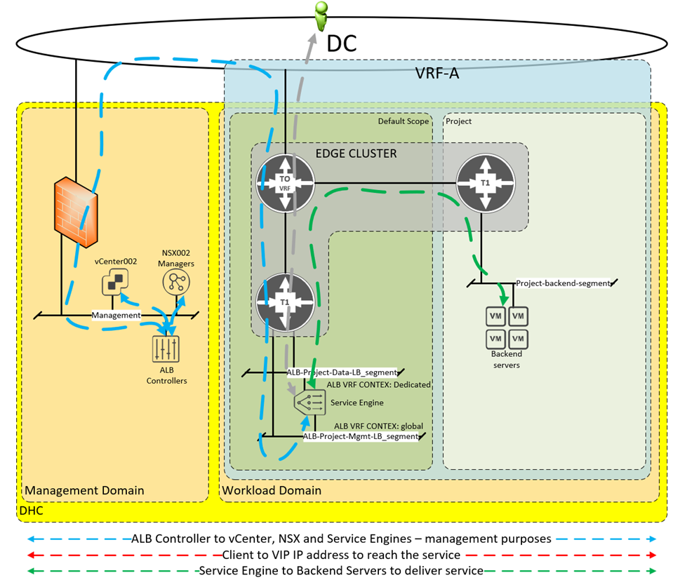  
*Picture 13. Single tenant environment for NSX 4.x version with project deployed*

### Multi tenant flows

Multi tenant environment is basically extension to single tenant and follows same principles. Limitation due to fact we are using same transport zone for all VRFs on NSX defines strict seperation on all other possible levels where this can be achieved, therefore flows are presenting as per below pictures.

Connectivity types are the same as previous however, seperate communication for each VRF must be set up. Keeping in mind T1 routers can be distributed only, Edge Cluster nodes anyway need to be created for each customer seperatelly.

Table 33. Design decisions

| Decision ID  | Design Decision  | Design Justification | Design Implication |
|---|---|---|---|
|AVI-MT-012 | Each tenant must have dedicated Edge Cluster Node on NSX Environment | Seperation must be done on every level possible | 2 edges per cluster must have capacity counted in overall performance requirement |

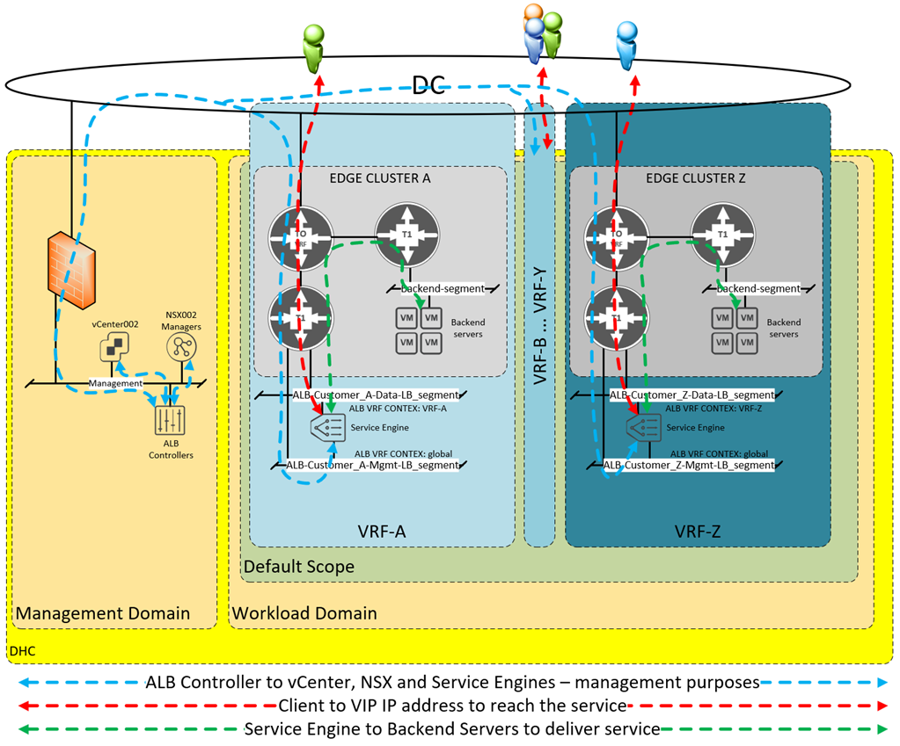  
*Picture 14. Multi tenant environment for NSX 3.x version and NSX 4.x without project deployed*

Multi tenant for NSX 4.x version can have project defined additionaly and below it is presented how project network backend server reachability is defined.
Connectivity types are the same as previous however, seperate communication for each VRF must be set up. Project T1 must connect to proper VRF T0 router to ensure routing capability is kept.

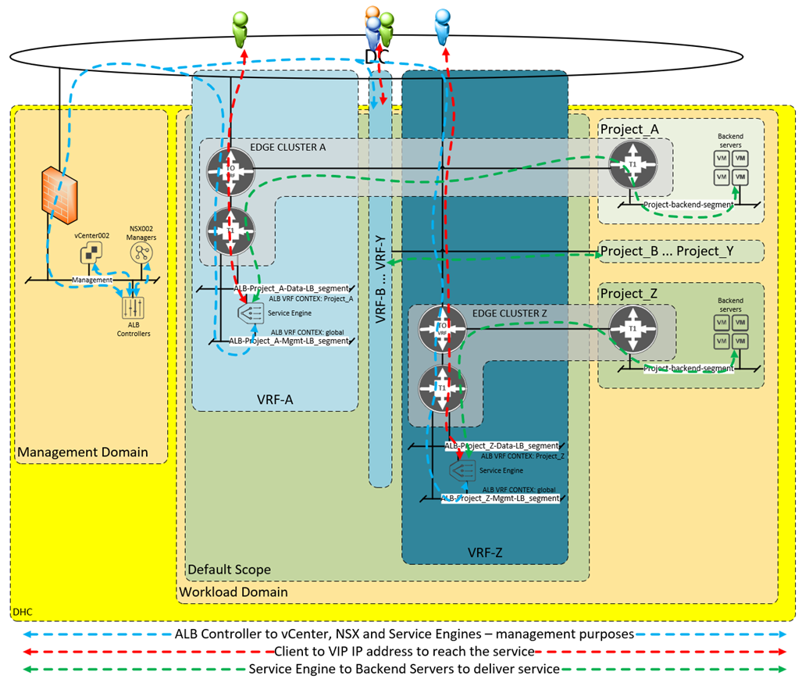  
*Picture 15. Multi tenant environment for NSX 4.x version with project deployed*

### RBAC

Advanced Load Balancer holds it's own RBAC setup locally and can use AAA external servers.  

Accounts can be assigned to dedicated tenants. Tenant-scoped components are visible only within tenant, therefore this is important to properly define users in environemnt and asign to proper tenant.  

Authentication for local users can be defined with dedicated predefined roles and with created roles.  

To connect external AAA servers Advnaced Load Balancer supports TACACS+ and LDAP authentication profiles.

Table 34. Design decisions

| Decision ID  | Design Decision  | Design Justification | Design Implication |
|---|---|---|---|
| AVI-RBAC-001 | Customer is having access to Advanced Load Balancer over SSRs | SSR are front-end for Customer to create an LB | |

### Limitations

Table 35. Limitations

| Limitation | Maximum Value | Description |
|---|---|---|
| Tenants in Advanced Load Balancer | 32 per Controller Cluster | maximum number of NSX-T Clouds per single ALB Controller Cluster |
| Tier-1 routers per NSX-T Cloud | 256 | Maximum number of NSX T1 routers per NSX-T Cloud connector - this means maximum T1 routers per single customer |
| Tier-1 routers per Controller Cluster | 300 | Maximum number of NSX T1 routers per Controller Cluster  - this means maximum T1 routers for all customers |
| Segments per NSX-T Cloud | 256 | Maximum number of NSX segments per NSX-T Cloud connector - this means maximum segments per single customer |
| Segments per Controller | 300 | Maximum number of NSX segments per Controller Cluster  - this means maximum segments for all customers |
| Virtual Service per Tier-1 | 1000 | Maximum number of Virtual Services per Tier-1. This is limitation inherited from NSX, so may vary for different NSX versions |

## Planning and Preparation of AVI Load Balancing for VMware Cloud Foundation

### Hardware Requirements

To implement the AVI Load Balancer from this design, your hardware must meet certain requirements.

Table 36. Hardware requirements for AVI Load Balancer Deployment

| Component         | Requirement per Region                                                                        |
|-------------------|-----------------------------------------------------------------------------------------------|
| Servers           | BIOS Configuration   Advanced Encryption Standard-New Instructions (AES-NI) Enabled      |
| Network Interfaces | Minimum of 10GB                                                                             |

### Software Requirements

To implement the AVI Load Balancer from this design, your software must have the requirements specified in the Solution Interoperability of AVI Load Balancing for VMware Cloud Foundation section.

### SCP Backup Target

You can choose to setup a Secure Copy Protocol (SCP) service for remote backups of AVI Load Balancer before you deploy the components of this design.Dedicate space on a remote server to save data backups for AVI Load Balancer over SCP

### VLANs and IP Subnets

For the Controllers, it is recommended to share the port-group used for core VMware Cloud Foundation management services. This means that Controller VMs should use the same portgroup as used by vCenter Server(s) and NSX Manager(s).

<!-- For the Service Engines, an overlay-backed NSX segments are used for:

- The management network for the Service Engines for  NSX-T Cloud Connector integrations with overlay-backed on the AVI Load Balancer.

- The data network(s) for the Service Engines for NSX-T Cloud Connector integration of type overlay-backed on the AVI Load Balancer.
-->
### Overlay-backed NSX Segments and IP Subnets

If an overlay-backed NSX segment is being used in the VI workload domains, this design requires that you allocate certain overlay-backed NSX segments connected to a Tier-1 logical router and IP subnets for the Service Engine(s) to service traffic.

Table 37. Overlay segments definitions

| Cluster                 | Overlay-backed NSX Segment Function                      | Logical Segment Name                          | Subnet                          |
|-------------------------|---------------------------------------------------------|-----------------------------------------------|---------------------------------|
| VI workload domain      | Management network for the Service Engines.            | Based on naming convention defined in naming convention documentation               | Subnet size must be validated upfront deployment (suggested /24) |
| VI workload domain      | Data Network for the Service Engines.   Note: More can be added as required. Data Network is consumed for VIP and SE nics addressing | Based on naming convention defined in naming convention documentation               | Subnet size must be validated upfront deployment (suggested /24) |

Note: Alternatively, a NSX VLAN segment could be used as the management network for the Service Engines.

### Host Names and IP Addresses

Before you deploy the AVI Load Balancer by following this design, you must define the host names and IP addresses for the Controller VMs and configure them in DNS with fully qualified domain names (FQDN) that map the host names to their IP addresses.

### Workload Footprint

Before you deploy the AVI Load Balancer, you must provide sufficient compute and storage resources to meet the footprint requirements of the Controller cluster and the Service Engines.

Note: It is required that the Controller VMs are created in the management workload domain of the VMware Cloud Foundation.

## IPv6 implementation of NSX Advanced Load Balancer

### Architectural overview

IPv6 Protocol is addressing protocol which is being introduced to extend IPv4 Protocol capabilities. Although IPv4 is slowly exhausting, IPv6 is being used more often internally and externally.
IPv6 is being only used for customer traffic. Management plane is still configured under IPv4 domain.

In such configuration IPv6 requires data plane only to be IPv6 capable. Service Engines are capable to have IPv4 and IPv6 configured without any specific requirements (configuration is not different than IPv4).

Possible ways of assigning IPv6

- static:
  - manual
  - IPAM assigned
  
- automatic:
  - SLAAC (StateLess Address Auto-Configuration) with DNS through RA (Router Advertisement)
  - SLAAC (StateLess Address Auto-Configuration) with DNS through DHCPv6
  - DHCPv6 with Address and DNS through DHCP
  - SLAAC (StateLess Address Auto-Configuration) with Address and DNS Through DHCPv6

Detailed explenation of options:

- SLAAC (StateLess Address Auto-Configuration) with DNS through RA (Router Advertisement)
  - the address and DNS information are generated by Router Advertisement message
  - flags configuration (not visible in NSX):
    - A-Flag = 1 : means to use the prefix to generate IP address
    - M-Flag = 0 : means not to ask DHCP server about IP address
    - O-Flag = 0 : means not to ask DHCP server about other settings
  
- SLAAC (StateLess Address Auto-Configuration) with DNS through DHCPv6
  - the address is generated by Router Advertisement message and the DNS information is generated by the DHCP server
  - flags configuration (not visible in NSX):
    - A-Flag = 1 : means to use the prefix to generate IP address
    - M-Flag = 0 : means not to ask DHCP server about IP address
    - O-Flag = 1 : means to ask DHCP server about other settings

- DHCPv6 with Address and DNS through DHCP
  - the address and DNS information is genereted by the DHCP server
  - flags configuration (not visible in NSX):
    - A-Flag = 0 : means not to use the prefix to generate IP address
    - M-Flag = 1 : means to ask DHCP server about IP address
    - O-Flag = 1 : means to ask DHCP server about other settings

- SLAAC (StateLess Address Auto-Configuration) with Address and DNS Through DHCPv6
  - the address and the DNS information is generated by the DHCP server
  - this is only supported on NSX Edges (not supported on ESXi hosts)
  - flags configuration (not visible in NSX):
    - A-Flag = 1 : means to use the prefix to generate IP address
    - M-Flag = 1 : means to ask DHCP server about IP address
    - O-Flag = 1 : means to ask DHCP server about other settings

Following architecture with NSX Projects, IPv6 must be routable and forwardable on entire NSX scope (default and projects).

Service Engines networking interfaces are supporting dual-stack (IPv6 and IPv4 simultaneosuly). Service Engines behaves like proxy and are capable to have seperate IP stacks on Frontend and Backend sides. This is important from perspective of possible configurations. VCS does support currently Native IPv6 only.

Communication patterns, as already mentioned, for Service Engines can support both IPv4 and IPv6 on the same interface, however needs to have properly configured gateways on VRF configuration level. Neighbor discovery is provided by Neighbor Discovery Protocol, fully supported by Service Engines.

IP Address Management is delivered based on IP assigning method:

- DHCPv6 is supported by DHCP servers (requires specific configuration on NSX)
- Router Advertisment is managed by T1 router which hosts IPv6 segment
- Static - may be manually inserted or by IPAM (AVI supports AVI Vintage IPAM) (requires specific configuration on NSX)

MTU is set as default and does not require changes for out of the box operations.

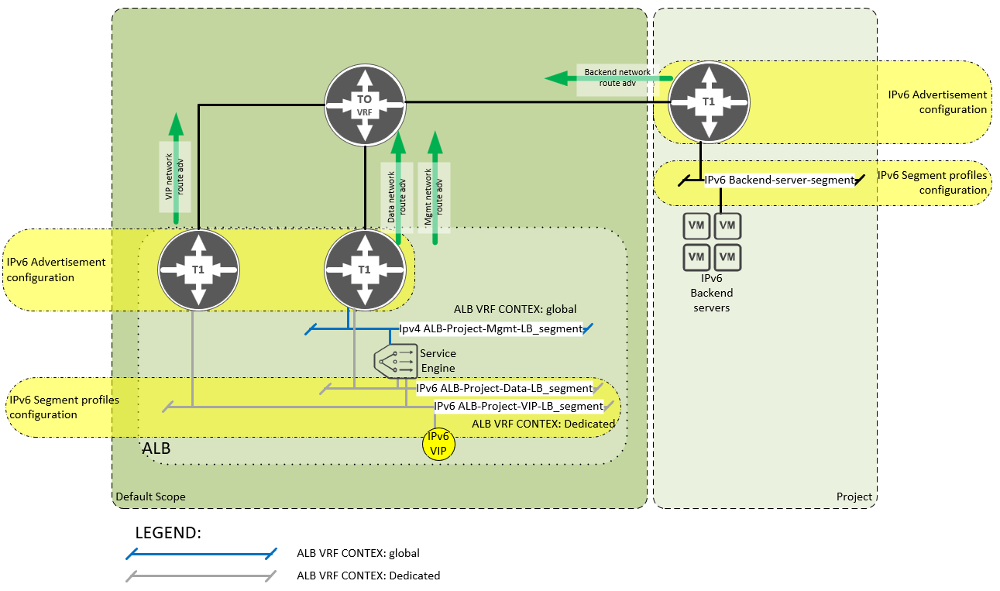

*Picture 16. IPv6 ALB Architecture*

Table 38. Design decision for IP address assignement selection

| Decision ID  | Design Decision  | Design Justification | Design Implication |
|---|---|---|---|
| AVI-IPv6-01 | SLAAC with DNS through RA as based method of assigning IP addresses | most lightweight and does not require additional components like DHCP server | does not allow to set up IP address manually|
| AVI-IPv6-02 | IPAM for static based method of assigning IP addresses for SE | allows to deploy automatically Service Engines  | does not allow to select exact IP address for exact SE |
| AVI-IPv6-03 | Dedicated interface for IPv6 | native IPv6 is not mixing IPv4 and IPv6 | backend IPv4 servers cannot be used for IPv6 VIP |
| AVI-IPv6-04 | MTU at default value | 1280 bytes is standard MTU on IPv6 and is not required to be changed | backend IPv4 servers cannot be used for IPv6 VIP |

### Project level design

Project level segments must support IPv6 and be connected to IPv6 T1 router which matches with proper VRF AVI configuration (wrong VRF configuration on AVI will not allow to create Virtual Application relation with Pools)
AVI VRF static routing must be pointing to proper T1 GW and upstream T0-VRF Gateway must have proper routing between Default Scope and Project segments/networks.

Table 39. Design decision for IP address assignement selection

| Decision ID  | Design Decision  | Design Justification | Design Implication |
|---|---|---|---|
| AVI-IPv6-05 | IPv6 forwarding must be allowed end-2-end | To achive communication with IPv6 between Default Scope and Projects, IPv6 must be allowed on both | Increase implications on network management using 2 IP stacks |

### Specific IPv6 configuration

Global configuration of Forwarding of IPv6 is required for NSX to properly process IPv6 packets, otherwise IPv6 will not work.

NSX to support IPv6 must have properly set configuration for different approaches of IPv6 advertisement/setup.
Security wise, NSX would drop any IPv6 packet which is not recognized or learnt by NSX. This is to avoid and protect agains spoofing.
Snooping mechanisms within IP Discovery Profile needs to be set for all types of advertising:

- ND Snooping - required for static IPv6 address assignement - this learns from Neighbor Advertisement and Neighbor Solicitations (size of table must be aligned to requirements, otherwise behavior will be improper)
- DHCP Snooping - required for dynamic DHCPv6, if DHCPv6 server is outside of VCS environment
- VMware Tools IPv6 - allows to update based on VMware Tools information

NSX T1 router requires to have proper ND Profile according to selected assigning method of IPv6.
Segments needs to have proper IP Discovery profile accroding to selected assigning method of IPv6.

Table 40. Design decision for IPv6 configuration

| Decision ID  | Design Decision  | Design Justification | Design Implication |
|---|---|---|---|
| AVI-IPv6-06 | IPv6 forwarding must be enabled on NSX | This is required for NSX to support IPv6 | IPv6 will not work properly without this configuration |
| AVI-IPv6-07 | Segment configuration must be properly defined | IPv6 requires to have proper configuration applied on Segment level using Segment Profiles | IPv6 will not work properly without this configuration |
| AVI-IPv6-08 | T1 router configuration must be properly defined | IPv6 requires to have proper configuration applied on T1 router level using ND Profiles | IPv6 will not work properly without this configuration |

### Security

Entire security is delivered mainly by NSX (Distributed Firewall, IDS/IPS, TLS inspection) as well as WAF on AVI.

Proper DFW configuration is required to have communication between:

- for frontend: Client (internet) and Virtual Service VIP IPv6 address
- for backend: Service Engine and Backend Servers

Table 41. Design decision for IPv6 security patterns

| Decision ID  | Design Decision  | Design Justification | Design Implication |
|---|---|---|---|
| AVI-IPv6-09 | IPv6 security patterns are the same as IPv4 | Once NSX is enabled for IPv6, there is no difference in packet processing | Bigger utilization of NSX once IPv6 will be enabled |

## Advanced Load Balancer migration strategy

NSX 5.x brings multiple changes including very important related to Load Balancers. In fact so called native Load Balancer solution will be deprecated. Solution for the situation is NSX Advanced Load Balancer. This chapter will describe how the migration should be considered valid.  

There are 2 possibilities to migrate:  

- from NSX native LB to ALB (VCS 1.x - NSX 3.x)
- from NSX native LB to ALB with backend servers migration from default scope to project (VCS 1.x to VCS 2.x and above)
- from NSX native LB to ALB (VCS 2.x - NSX 4.x)

### NSX native LB to NSX Advance Load Balancer migration

NSX native LB is built based on HA Proxy, however NSX Advanced Load Balancer is AVI prioprietary solution build from scratch. Therefore with such different mechanisms, migration must be planned in details.  
To migrate Load Balancing mechanism Advanced Load Balancer must be deployed in environement and crucial decision needs to be taken like depending on environment:  

- size of Service Engines
- amount of Service Engines Groups
- amount of Virtual Services per Service Engine
- types of migration failover

Sizing of Service Engines can be found in [lldAdvancedLoadBalancer](#sizing-compute-and-storage-resources-for-avi-load-balancer-service-engines), however other variables must be defined with customer.  

#### VCS 1.x migration (NSX 3.x to NSX 3.x)

VCS 1.x supports NSX 3.x implementation and therefore requires seperation based on VRF lite in NSX environment.  

While having 2 possible solutions in environment for Native Load Balancer, 2 migration strategies are required and are described below.  

##### Load Balancer deployed on dedicated T1 router with no T0 router connected (Service Interface extension to other T1 router)

This type of deployment requires additional T1 router dedicated for Load Balancing purposes. Such deployment is optimizied from performance perspective, however requires additional configuration.

Initial step to prepare environment for migration requires deployment of NSX Advanced Load Balancer Controllers and networks:  

- Advanced Load Balancer Management Network (NSX Segment)
- Advanced Load Balancer Data Network (NSX Segment)
- Advnaced Load Balancer VIP Network (NSX Segment)

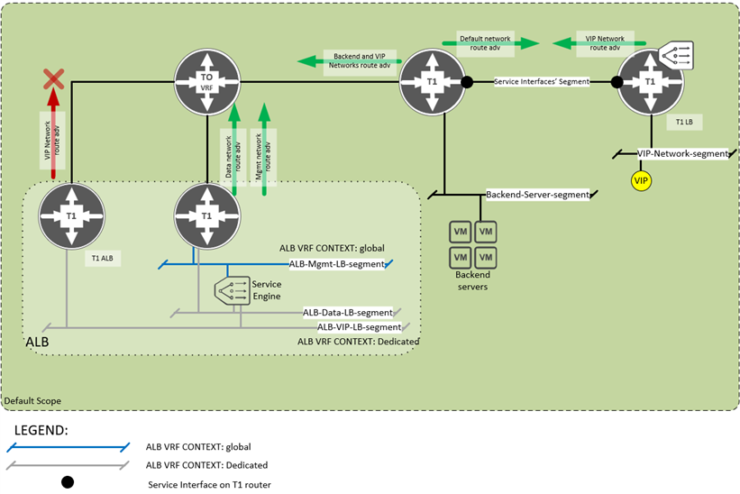  
*Picture 17. Initial state for Native Load Balancer deployment with Service Interface on T1 router*

Above picture 17 present the state of Native Load Balancer serving load balancing with Advanced Load Balancer deployed already. Traffic is being sent towards VIP (yellow circle) connected to VIP network on T1 router dedicated for Native Load Balancer (T1 with LB icon - in short T1 LB). VIP network is being advertised from T1 LB router towards rest of infrastructure. T1 LB is connected with antoher T1 router using service interface (not being directly connected to T0 router). NSX infrastructure is 2 tier topology (Spine-Leaf) with T0 router (which may be treated as Spine) and T1 router (which may be treated as Leaf), so T1 LB is extending this functionality with service interface connection.

Although Advanced Load Balancer is deployed and operational, the T1 ALB is not allowed to propagate connected networks, yet. Reason for this is ALB-VIP-LB-segment and VIP-Network-segment are exactly the same subnet. To overcome dynamic routing capabilities, some static routing configuration is required. Once VS is created in NSX ALB, static input will be added to related T1 (T1 ALB for VIP-Network-segment) however propagation will happen when proper advertisement will be set (not only static is required, more details below)

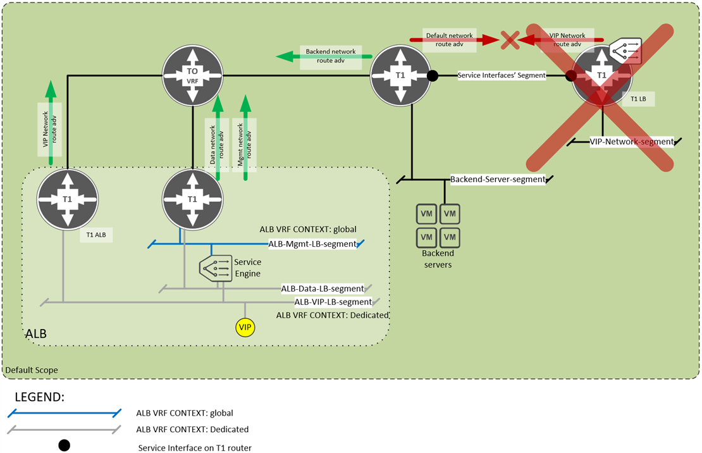  
*Picture 18. Intermediate state for Native Load Balancer deployment with Service Interface on T1 router*

Once migrating all VIPs at once, routing propagation must be stopped on T1 LB and started on T1 ALB for VIP networks. This looks a bit different for DNAT implication on VIP addresses and is described a bit later.  

Once migrating multiple VIPs one-by-one, entire network cannot be moved once the first VIP is moved. Another mechanism needs to be set up, T1 LB must have Virtual Service disconnected from LB, as this will lead to VIP not being active and not propagated by T1 LB.  
On the other hand, T1 ALB must have enabled T1 routing advertisement options:

- All Static Routes
- All LB VIP Routes
- if required All Connected Segments & Service Ports (once for any reasons network must be reachable)

T1 ALB will have static routes for /32 VIP IP address injected by Advnaced Load Balancer pointing to Data interface of Service Engine (SE vNIC).

Limitation of this solution is having SE consuming VIP network IP addresses. Depends how many Service Engines are designed to support the VIPs such many IP addresses must be saved and properly configured on NSX ALB VRF/ Network/ IPAM.  

To overcome this limitation (when there is no free IPs in VIP network to assign SE vNICs IP addresses):  

- DNAT must be configured:  
  - VIP IPs are set/configured not in VIP VRF but in DATA VRF (ALB-DATA-LB_segment)
  - VIP as SNAT must be configured for backend servers properly reply (at VS advanced configuration)
- routing must be planned with static routes to overcome wider (network size) route propagation from T1 LB

Once VIPs are moved, network changes must be applied. Shown on Picture 17, defines how routing changes and ALB-VIP-LB_segment may be propagated by T1 ALB towards upstream router.

TT1 LB does not have to be removed straight away, but may be kept for a testing period to allow for rollback if required. To avoid entire recreation of Native LB, components like Virtual Services should be disconnected from T1 LB (not just shut down - as routing to such services is still propagated).

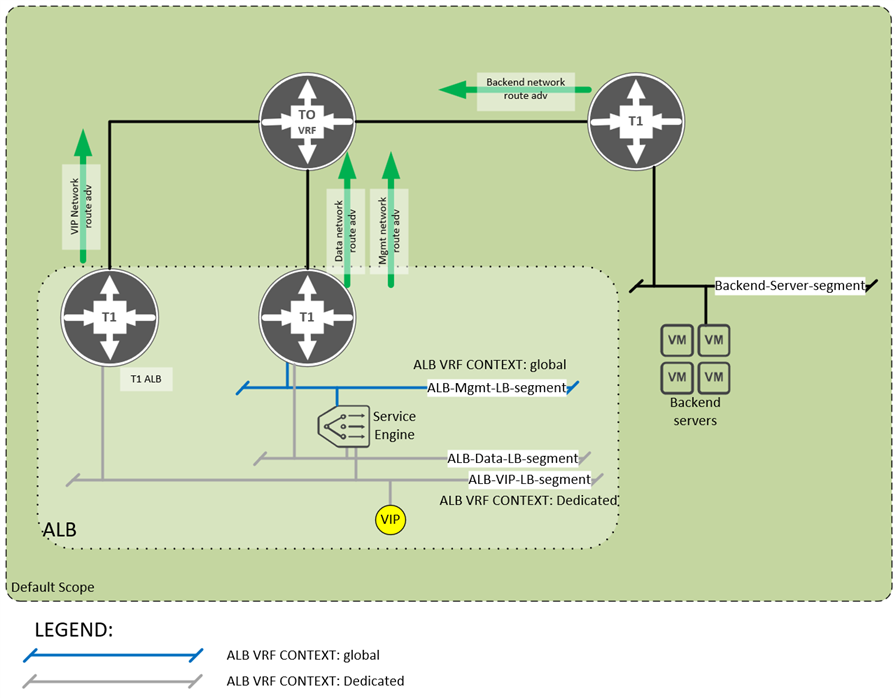  
*Picture 19. Final state for Native Load Balancer deployment with Service Interface on T1 router*  

Once migration is finished and tests results in proper load balancing on NSX ALB all not used infrastructure can be removed, which is shown on picture 19.  
This concludes migration in this case.  

Table 42. Migration decisions and recommendations

| Decision/Recommendation ID | Decision/Recommendation description | Decision/Recommendation Implication | Comment |
|---|---|---|---|
| MIG-01 | Migrate entire networks at once | Requires to define all VIPS on NSX ALB in preparation stage as all VIPs must be created upfront and be ready once routing is switched | Easiest migration of all available |
| MIG-02 | Migrate VIP one by one if all at once is not possible | More difficult, requires a lot of network routing validation and static configuration for migration perdiod | More complex than others |
| MIG-03 | Proper routing should be set and validated upfront any VIP migration | Required for migration however is quite risky and must be planned by Architect | May require some downtime |
| MIG-04 | Do not remove Virtual Services on Native LB, disconnect from LB instead| Easy up rollback procedures | Once tests are being faulty and failing, roll back is much faster then restoring from scratch |
| MIG-05 | Creating DNAT solution make design much more complicated | DNAT configuration on NSX ALB is not so straigh forward like setting DNAT rules. This requires proper preparation of the NSX ALB environment | Complexity rises quite high |  

##### Load Balancer deployed on T1 router with T0 router connected

This type of deployment, may not be optimized (Edges Pool Allocation Size is not optimal for LB - must be set to Routing), however it ease up the entire architecture of platform. Does not require to extend standard Spine - Leaf (2 tier) topology.  

Initial step to prepare environment for migration requires deployment of NSX Advanced Load Balancer Controllers and networks:  

- Advanced Load Balancer Management Network (NSX Segment)
- Advanced Load Balancer Data Network (NSX Segment)
- Advnaced Load Balancer VIP Network (NSX Segment)

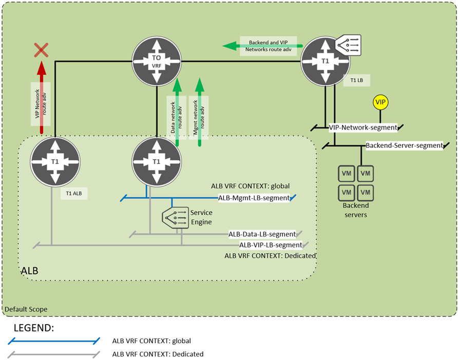  
*Picture 20. Initial state for Native Load Balancer deployment on T1 router*  

Above picture 20 present the state of Native Load Balancer serving load balancing with Advanced Load Balancer deployed already. Traffic is being sent towards VIP (yellow circle) connected to VIP network on T1 router dedicated for Native Load Balancer (T1 with LB icon - in short T1 LB). VIP network is being advertised from T1 LB router towards rest of infrastructure. T1 LB is connected directly to T0 router and has capability to perform routing and Load Balancing. NSX infrastructure is 2 tier topology (Spine-Leaf) with T0 router (which may be treated as Spine) and T1 router (which may be treated as Leaf), which is kept here.

Although Advanced Load Balancer is deployed and operational, the T1 ALB is not allowed to propagate connected networks, yet. Reason for this is ALB-VIP-LB-segment and VIP-Network-segment are exactly the same subnet. To overcome dynamic routing capabilities, some static routing configuration is required. Once VS is created in NSX ALB, static input will be added to related T1 (T1 ALB for VIP-Network-segment) however propagation will happen when proper advertisement will be set (not only static is required, more details below)

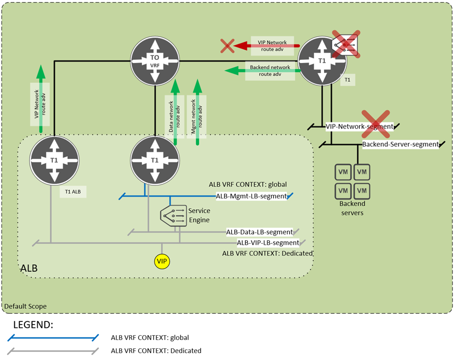  
*Picture 21. Intermidiate state for Native Load Balancer deployment on T1 router*  

Once migrating all VIPs at once, routing propagation must be stopped on T1 LB and started on T1 ALB for VIP networks. This looks a bit different for DNAT implication on VIP addresses and is described a bit later.  

Once migrating multiple VIPs, entire network cannot be moved once the first VIP is moved. Another mechanism is need to be set up. T1 LB must have Virtual Service disconnected from LB this will lead to VIP not being active and not propagated by T1 LB.  
On the other hand, T1 ALB must have enabled T1 routing advertisement options:

- All Static Routes
- All LB VIP Routes
- if required All Connected Segments & Service Ports (once for any reasons connected networks must be reachable)

T1 ALB will have static routes for /32 VIP IP address injected by Advnaced Load Balancer pointing to Data interface of Service Engine (SE vNIC).

Limitation of this solution is having SE consuming VIP network IP addresses. Depends how many Service Engines are designed to support the VIPs such many IP addresses must be saved and properly configured on NSX ALB VRF/ Network/ IPAM.  

To overcome this limitation (when there is no free IPs in VIP network to assign SE vNICs IP addresses):  

- DNAT must be configured:  
  - VIP IPs are set/configured not in VIP VRF but in DATA VRF (ALB-DATA-LB_segment)
  - VIP as SNAT must be configured for backend servers properly reply (at VS advanced configuration)
- routing must be planned with static routes to overcome wider (network size) route propagation from T1 LB  

Once VIPs are moved, network changes must be applied. Shown on Picture 21, defines how routing changes and ALB-VIP-LB_segment may be propagated by T1 ALB towards upstream router.  

T1 LB changes from LB and routing functionality to routing only, but may rollback to previous state once required. To avoid entire recreation of Native LB, components like Virtual Services should be disconnected from T1 LB (not just shut down - as routing to such services is still propagated).

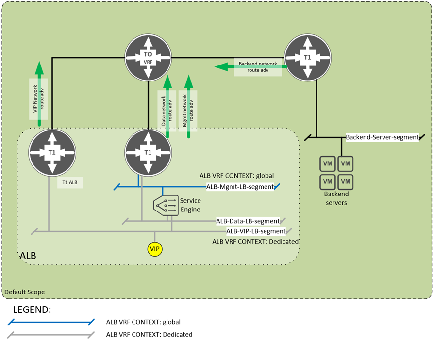  
*Picture 22. Final state state for Native Load Balancer deployment on T1 router*  

Once migration is finished and tests results in proper load balancing on NSX ALB all not used infrastructure can be removed, which is shown on picture 22.  
This concludes migration in this case.  

Table 43. Migration decisions and recommendations

| Decision/Recommendation ID | Decision/Recommendation description | Decision/Recommendation Implication | Comment |
|---|---|---|---|
| MIG-06 | T1 LB router delivers both routing and LB functionality, therefore routing capabilities must be double checked | To avoid any routing issues and network propagation additional focus must be set on T1 LB, as this is not being removed in the end | T1 LB has a routing capability and needs to be properly configured to avoid reachability issues |

#### VCS 1.x to VCS 2.x migration (NSX 3.x to NSX 4.x)

VCS 1.x supports NSX 3.x implementation and therefore requires seperation based on VRF lite in NSX environment, however VCS 2.x supports NSX 4.x implementation and delivers sepearation based on VRF lite and RBAC.

While having 2 possible solutions in environment for Native Load Balancer, 2 migration strategies are required and are described below.  

Difference while migrating from NSX 3.x to NSX 4.x instead of to 3.x, is project capability of newer NSX version. Limitation related to lack of RBAC seperation requires to put all backend servers into the same scope (default) in older NSX version, however once RBAC limitation and project were presented, it is good to have additional separation applied. Migration from NSX 3.x to NSX 4.x for NSX Advanced Load Balancer may also include migration of backend from default scope to projects (following [wiNsxtMultiTenancy][nsxProjects]) to deliver most up to date solutions.

##### Load Balancer deployed on dedicated T1 router with no T0 router connected (Service Interface extension to other T1 router in VCS 1.x environment)

Same as in NSX 3.x to NSX 3.x migration, standard 2-Tier (Spine-Leaf) is being extended by Service Interfaces connection with dedicated T1 LB.  

Initial step to prepare environment for migration requires deployment of NSX Advanced Load Balancer Controllers and networks:  

- Advanced Load Balancer Management Network (NSX Segment)
- Advanced Load Balancer Data Network (NSX Segment)
- Advnaced Load Balancer VIP Network (NSX Segment)

  
*Picture 23. Initial state for Native Load Balancer deployment with Service Interface on T1 router (VCS 1.x -> VCS 2.x)*  

Picture 23 represents implementation under NSX 3.x (VCS 1.x) version which is initial state to move to NSX 4.x. No projects are yet visible therefore, those must be created.  

To migrate backend servers dedicated Powershell [script][script] is delivered. Migration of backend server requires downtime. Below migration scenario represents migration to projects as well, however if there is no migration to projects approach, similar to VCS 1.x to VCS 1.x migration can be performed and can be found [right here](#vcs-1x-migration-nsx-3x-to-nsx-3x).

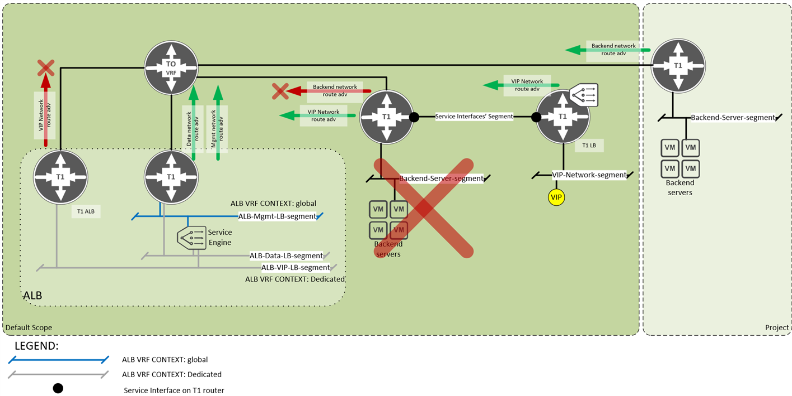  
*Picture 24. Migration of backend servers to VCS 2.x with project environment*  

Picture 24 represents situation once project is created and properly terminated within proper VRF. Migrated backend servers are operational and must be reachable by current (native) LB. Please consider validating microsegmentation and Distributed Firewall set up with [microsegmentation documentation][micro]. Unless backend server are operational, further activities cannot be processed. Load Balancing functionality must be operational before moving forward not to increase troubleshooting difficulty level.

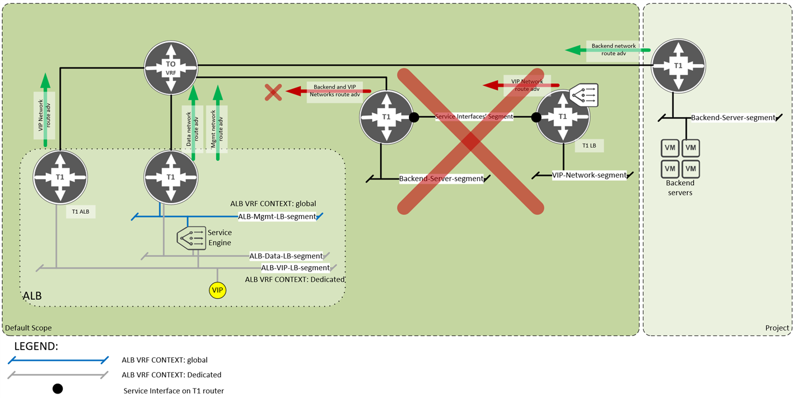  
*Picture 25. Intermidiate state for Native Load Balancer deployment with Service Interface on T1 router (VCS 2.x)*  

Once migrating all VIPs at once, routing propagation must be stopped on T1 LB and started on T1 ALB for VIP networks. This looks a bit different for DNAT implication on VIP addresses and is described a bit later.  

Once migrating multiple VIPs one-by-one, entire network cannot be moved once the first VIP is moved. Another mechanism is need to be set up. T1 LB must have Virtual Service disconnected from LB, as this will lead to VIP not being active and not propagated by T1 LB.  
On the other hand, T1 ALB must have enabled T1 routing advertisement options:

- All Static Routes
- All LB VIP Routes
- if required All Connected Segments & Service Ports (once for any reasons network must be reachable)

T1 ALB will have static routes for /32 VIP IP address injected by Advnaced Load Balancer pointing to Data interface of Service Engine (SE vNIC).

Limitation of this solution is having SE consuming VIP network IP addresses. Depends how many Service Engines are designed to support the VIPs, such many IP addresses must be saved and properly configured on NSX ALB VRF/ Network/ IPAM.  

To overcome this limitation (when there is no free IPs in VIP network to assign SE vNICs IP addresses):  

- DNAT must be configured:  
  - VIP IPs are set/configured not in VIP VRF but in DATA VRF (ALB-DATA-LB_segment)
  - VIP as SNAT must be configured for backend servers properly reply (at VS advanced configuration)
- routing must be planned with static routes to overcome wider (network size) route propagation from T1 LB

Once VIPs are moved, network changes must be applied. Shown on Picture 24, defines how routing changes and ALB-VIP-LB_segment may be propagated by T1 ALB towards upstream router.  

T1 LB does not have to be removed straigh away, but may be kept for testing period to rollback once required. To avoid entire recreation of Native LB, components like Virtual Services should be disconnected from T1 LB (not just shut down - as routing to such services is still propagated). The same is true for other components like pools and Load Balancer service itself.  

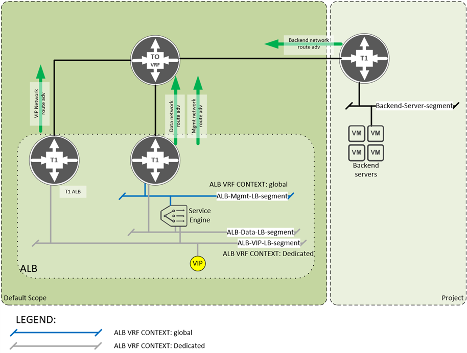  
*Picture 26. Final state for Native Load Balancer deployment with Service Interface on T1 router (VCS 2.x)*  

Final state of migration is shown on Picture 26. Backend servers are moved to project, Load Balancing functionality is moved to NSX ALB. Once this is tested and fully operational, T1 LB can be removed. What is different from VCS 1.x migration, T1 serving for backend servers segment is also removed as no longer needed.  

Table 44. Migration decisions and recommendations

| Decision/Recommendation ID | Decision/Recommendation description | Decision/Recommendation Implication | Comment |
|---|---|---|---|
| MIG-07 | In case no projects are to be used, migration can be performed the same way as VCS 1.x to VCS 1.x | Not creating projects in NSX 4.x (VCS 2.x+) is affecting multitenancy design and overall design. To project migration should not be omitted but can be postponed and performed after NSX ALB is migrated |  |
| MIG-08 | Backend server migration to project must end with 100% success | Proceeding with backend server issues will affect further steps heavily  | Once this step is faulty, engineer cannot judge what would be an issue in further steps, therefore here is hard stop unless backend servers will be fully operational |

##### Load Balancer deployed on T1 router with T0 router connected (T1 router in VCS 1.x environment)

This type of deployment, may not be optimized (Edges Pool Allocation Size is not optimal for LB - must be set to Routing), however it ease up the entire architecture of platform. Does not require to extend standard Spine - Leaf (2 tier) topology.  

Initial step to prepare environment for migration requires deployment of NSX Advanced Load Balancer Controllers and networks:  

- Advanced Load Balancer Management Network (NSX Segment)
- Advanced Load Balancer Data Network (NSX Segment)
- Advnaced Load Balancer VIP Network (NSX Segment)

  
*Picture 27. Initial state for Native Load Balancer deployment on T1 router (VCS 1.x -> VCS 2.x)*  

Picture 27 represent initial state of implementation under NSX 3.x (VCS 1.x) version. This is going to be migrated to NSX 4.x (VCS 2.x), however as no projects are yet available, those must be created.

To migrate backend servers dedicated Powershell [script][script] is delivered. Migration of backend server requires downtime. Below migration scenario represents migration to projects as well, however if there is no migration to projects approach, similar to VCS 1.x to VCS 1.x migration can be performed and can be found [right here](#vcs-1x-migration-nsx-3x-to-nsx-3x).

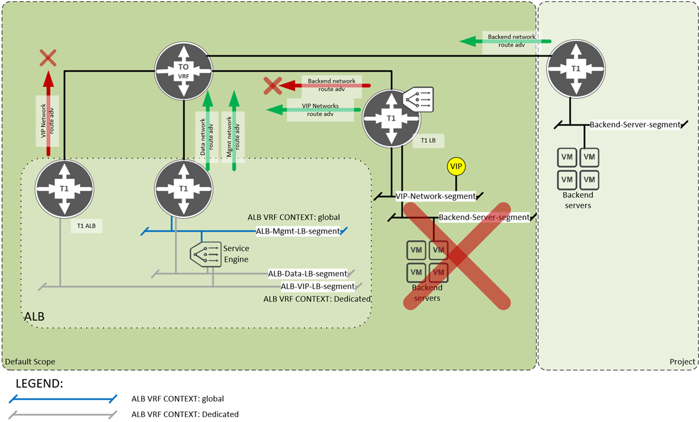  
*Picture 28. Migration of backend servers to VCS 2.x with project environment*  

Picture 28 represents situation once project is created and properly terminated within proper VRF. Migrated backend servers are operational and must be reachable by current (native) LB. Please consider validating microsegmentation and Distributed Firewall set up with [microsegmentation documentation][micro]. Unless backend server are operational, further activities cannot be processed. Load Balancing functionality must be operational before moving forward not to increase troubleshooting difficulty level.

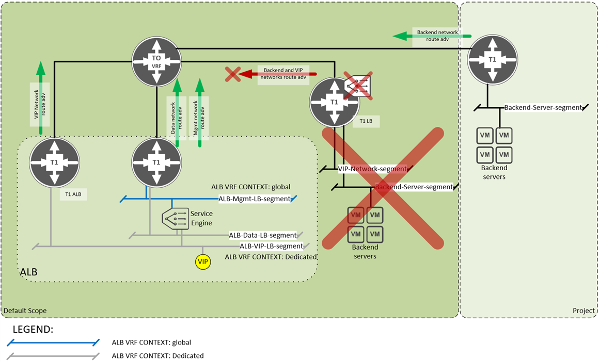  
*Picture 29. Intermidiate state for Native Load Balancer deployment on T1 router (VCS 2.x)*  

Once migrating all VIPs at once, routing propagation must be stopped on T1 LB and started on T1 ALB for VIP networks. This looks a bit different for DNAT implication on VIP addresses and is described a bit later.  

Once migrating multiple VIPs, entire network cannot be moved once the first VIP is moved. Another mechanism is need to be set up. T1 LB must have Virtual Service disconnected from LB this will lead to VIP not being active and not propagated by T1 LB.  
On the other hand, T1 ALB must have enabled T1 routing advertisement options:

- All Static Routes
- All LB VIP Routes
- if required All Connected Segments & Service Ports (once for any reasons connected networks must be reachable)

T1 ALB will have static routes for /32 VIP IP address injected by Advnaced Load Balancer pointing to Data interface of Service Engine (SE vNIC).

Limitation of this solution is having SE consuming VIP network IP addresses. Depends how many Service Engines are designed to support the VIPs such many IP addresses must be saved and properly configured on NSX ALB VRF/ Network/ IPAM.  

To overcome this limitation (when there is no free IPs in VIP network to assign SE vNICs IP addresses):  

- DNAT must be configured:  
  - VIP IPs are set/configured not in VIP VRF but in DATA VRF (ALB-DATA-LB_segment)
  - VIP as SNAT must be configured for backend servers properly reply (at VS advanced configuration)
- routing must be planned with static routes to overcome wider (network size) route propagation from T1 LB  

Once VIPs are moved, network changes must be applied. Shown on Picture 28, defines how routing changes and ALB-VIP-LB_segment may be propagated by T1 ALB towards upstream router.  

T1 LB changes from LB and routing functionality to routing only, but may rollback to previous state once required. To avoid entire recreation of Native LB, components like Virtual Services should be disconnected from T1 LB (not just shut down - as routing to such services is still propagated). The same is true for other components like pools and Load Balancer service itself.  

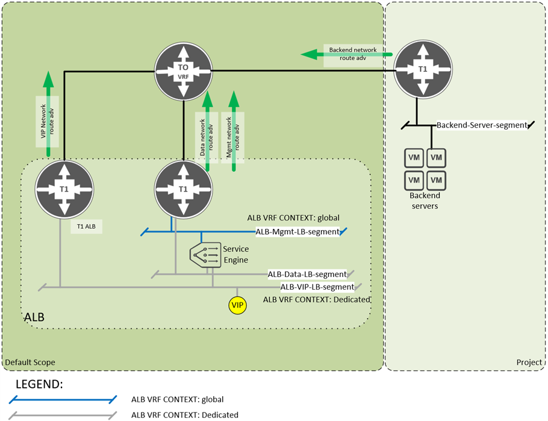  
*Picture 30. Final state for Native Load Balancer deployment  on T1 router (VCS 2.x)*  

Final state of migration is shown on Picture 29. Backend servers are moved to project, Load Balancing functionality is moved to NSX ALB. Once this is tested and fully operational, T1 LB can be removed. What is different from VCS 1.x migration, T1 serving for backend servers segment is also removed as no longer needed.  

#### VCS 2.x to VCS 2.x migration (NSX 4.x to NSX 4.x)

Migration for VCS 2.x to VCS 2.x is very similar to VCS 1.x to VCS 1.x defined [right here](#vcs-1x-migration-nsx-3x-to-nsx-3x). One exception which can be found is project set, however in VCS 2.x to VCS 2.x migration there is no need to move backend servers as those should be in the same project. Migration of backend servers between projects is not in the scope of this document.

# APPENDIX  

## Workload Footprint for Management Domain

Table 45. Workload Footprint for Management Domain

| Workload                               | vCPUs | vRAM (GB) | Storage (GB)                         |
|----------------------------------------|-------|-----------|--------------------------------------|
| AVI Load Balancer Controller cluster   |       |           |                                      |
| Total                                  |       |           |                                      |
| Total with 30% free storage capacity   |       |           |                                      |

## Workload Footprint for VI Workload Domain

Table 46. Workload Footprint for Workload Domain

| Workload                               | vCPUs | vRAM (GB) | Storage (GB)                         |
|----------------------------------------|-------|-----------|--------------------------------------|
| Service Engines                        |       |           |                                      |
| Total                                  |       |           |                                      |
| Total with 30% free storage capacity   |       |           |                                      |

[nsxProjects]: https://github.com/GLB-CES-PrivateCloud/DHC-Documentation/blob/develop/workInstructions/wiNsxtMultiTenancy.md#nsx-t-projects
[script]: https://github.com/GLB-CES-PrivateCloud/DHC-Engineering/blob/develop/scripts/PS-VC-reconnect_VMs_to_new_segment.ps1
[micro]: https://github.com/GLB-CES-PrivateCloud/DHC-Documentation/blob/develop/microsegmentation.md
