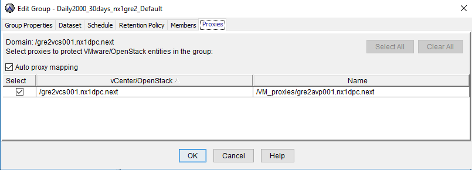

# Backup LLD

# Changelog

| Date       | Author             | Description                                                                      |
|------------|--------------------|----------------------------------------------------------------------------------|
| unknown    | Unknown            | Document creation                                                                |
| 19.07.2024 | Radoslaw Dabrowski     | Update backup tagging section                                                |

# Introduction

## Purpose

Purpose of this document is to provide detailed design and architectural guidance required to implement CEB backup service for VCS.

## Target Audience

Technical architects, deployment engineers / stakeholders responsible to deploy VCS and CEB services.

## Related Documents

| Document Number | Document / Location                             |                 |
|-----------------|-------------------------------------------------|-----------------|
|      | VCS-Avamar Integration                   | wiAvamarIntegration.md |

# Technical Requirements

- VCS will utilize Avamar / Data Domain solution provided by CEB.
- Snapshot / File / Scripted / Application backup to be enabled.
- Backup infrastructure must provide a predictable and consistent performance.
- Backup infrastructure must be reliable, flexible, scalable, secure and centrally managed.
- Backup/restore is over IP-based network (LAN/WAN).
- Backup data will be stored on EMC Data Domain storage; metadata will be stored on Avamar Server.
- Management VMs will be protected using VMware Image level backup.
- A scheduled backup will be taken once a day. Therefore, the RPO is 24h.
- Backup Window will be based on customer requirements.
- Retention period will be decided based on customer requirements and will be standardized in segments. Example 1 week 4 weeks 12 weeks ….
- Auto Proxy Mapping will be configured by CEB team.



- All backup schedules should not start at the same time. Time difference between schedules should be at least 10 minutes.
- Proxy deployment can be done only when avamar server is fully operational and configured.

## CEB Component Version

VCS design is based on the following software and hardware versions used by CEB.

| Component                          | Version             |
|------------------------------------|---------------------|
| Avamar Server Software             | 19.4.x.xxx          |
| Avamar Data Store Operating System | SLES 12 SP5         |
| Avamar Data Storage Hardware       | Gen4/Gen4s          |
| Data Domain Operating System       | 7.x.x.x             |
| Data Domain Systems                | DD890/DD7200/DD9500 |

## Authentication

Dedicated user account for Avamar is created during the VCS vCenter configuration process.  
The dhc-configureVcenter ansible role includes tasks which creates a role "backup" with required privileges and a user named as "backup" with  SSO for Avamar.
Credentials for "backup" user will be available in VCS vault. These credentials are required for Avamar->vCenter integration.

| Privilege type | Required privileges|
| --- | --- |
| System | Anonymous |
| System | View |
| System | Read |
| Global | ManageCustomFields |
| Global | SetCustomField |
| Global | LogEvent |
| Global | CancelTask |
| Global | Licenses |
| Global | Settings |
| Global | DisableMethods |
| Global | EnableMethods |
| Folder | Create |
| Datastore | Rename |
| Datastore | Move |
| Datastore | Delete |
| Datastore | Browse |
| Datastore | DeleteFile |
| Datastore | FileManagement |
| Datastore | AllocateSpace |
| Datastore | Config |
| Network | Config |
| Network | Assign |
| Host-Config | Connection |
| Host-Config | Storage |
| VirtualMachine-Inventory | Create |
| VirtualMachine-Inventory | CreateFromExisting |
| VirtualMachine-Inventory | Register |
| VirtualMachine-Inventory | Delete |
| VirtualMachine-Inventory | Unregister |
| VirtualMachine-Interact | PowerOn |
| VirtualMachine-Interact | PowerOff |
| VirtualMachine-Interact | Reset |
| VirtualMachine-Interact | ConsoleInteract |
| VirtualMachine-Interact | DeviceConnection |
| VirtualMachine-Interact | ToolsInstall |
| VirtualMachine-Interact | GuestControl |
| VirtualMachine-GuestOperations | Query |
| VirtualMachine-GuestOperations | Modify |
| VirtualMachine-GuestOperations | Execute |
| VirtualMachine-Config | Rename |
| VirtualMachine-Config | Annotation |
| VirtualMachine-Config | AddExistingDisk |
| VirtualMachine-Config | AddNewDisk |
| VirtualMachine-Config | RemoveDisk |
| VirtualMachine-Config | RawDevice |
| VirtualMachine-Config | HostUSBDevice |
| VirtualMachine-Config | CPUCount |
| VirtualMachine-Config | Memory |
| VirtualMachine-Config | AddRemoveDevice |
| VirtualMachine-Config | EditDevice |
| VirtualMachine-Config | Settings |
| VirtualMachine-Config | Resource |
| VirtualMachine-Config | UpgradeVirtualHardware |
| VirtualMachine-Config | ResetGuestInfo |
| VirtualMachine-Config | AdvancedConfig |
| VirtualMachine-Config | DiskLease |
| VirtualMachine-Config | SwapPlacement |
| VirtualMachine-Config | DiskExtend |
| VirtualMachine-Config | ChangeTracking |
| VirtualMachine-Config | ReloadFromPath |
| VirtualMachine-Config | ManagedBy |
| VirtualMachine-State | CreateSnapshot |
| VirtualMachine-State | RevertToSnapshot |
| VirtualMachine-State | RemoveSnapshot |
| VirtualMachine-State | RenameSnapshot |
| VirtualMachine-Provisioning | Clone |
| VirtualMachine-Provisioning | MarkAsTemplate |
| VirtualMachine-Provisioning | DiskRandomAccess |
| VirtualMachine-Provisioning | DiskRandomRead |
| VirtualMachine-Provisioning | GetVmFiles |
| Resource | AssignVMToPool |
| Alarm | Create |
| Alarm | Edit |
| Task | Create |
| Task | Update |
| Sessions | ValidateSession |
| Extension | Register |
| Extension | Update |
| Extension | Unregister |
| VApp | ApplicationConfig |
| VApp | Export |
| VApp | Import |
| Cryptographer | Access |
| Cryptographer | AddDisk |

## Sizing

For VCS components a minimum CEB configuration with one Avamar Virtual Edition and one DataDomain DD2200 will be used. If CEB is used to backup customer
workloads in addition to the management stack then capacity sizing is made by CEB Team.

## Network Reservation

All backup components in VCS is addressed in the IP pool (Local Region Network)
from < networkAvnLocalRegionCidr >.68 to < networkAvnLocalRegionCidr >.87 for Avamar Proxies.

### DNS

Avamar and Data Domain rely on DNS for name resolving and is required for backup and restore as all communication is on fully qualified device name.
If CEB is using VCS domain and naming convention, then DNS records for all CEB components will be created in VCS DNS.
If CEB is using customer domain for all backup infrastructure component, then DNS entried will be created in customer DNS.

DNS zone transfers MUST be allowed for name resolution from/to customer and VCS DNS services as per the need.

### NTP

Customer NTP server or VCS NTP can be used for backup infrastructure as time source. VCS uses ACD001 and ADC002 as NTP servers.

# VCS Management VM Backup

VCS management VMs rely on CEB to provide backup service.

- VCS management VMs should be backed up at Image level only. No agent level backup for management VMs.
- Avamar backs up VMs which have proper tag assigned. Management VMs should have assigned following tag daily1800_3w.
- To Add a VM to backup, simply add a tag to the VM.
- To Remove a VM from backup, tag needs to be moved from the VM.

All VMs which need to be backed up should have a backup tag assigned - daily1800_3w. VMs which do not have tag will not be backed up.
Tag assignment / removal for VCS management VMs is in scope of VCS team.

## List of the VMs and its tags for backup

All listed components of the VCS Management domain should be having given tag.

| Name                    | Role                             | Tag          | Comment                             |
|-------------------------|----------------------------------|--------------|-------------------------------------|
| < locationCode >adc001  | Active Directory                 | daily1800_3w | Avamar backup                       |
| < locationCode >adc002  | Active Directory                 | daily1800_3w | Avamar backup                       |
| < locationCode >ans001  | Ansible                          | daily1800_3w | Avamar backup                       |
| < locationCode >avpXXX  | Avamar Proxy                     | daily1800_3w | Avamar backup                       |
| < locationCode >avr001  | Antivirus                        | daily1800_3w | Avamar backup                       |
| < locationCode >bil001  | Billing                          | daily1800_3w | Avamar backup                       |
| < locationCode >cht001  | Cloud Health Appliance           | daily1800_3w | Avamar backup                       |
| < locationCode >cpx001  | Cloud Proxy                      | -            | Do not backup - easier to recreate  |
| < locationCode >ctl001  | NSX Controller                   | -            | Do not backup - backed up by config |
| < locationCode >ctl002  | NSX Controller                   | -            | Do not backup - backed up by config |
| < locationCode >ctl003  | NSX Controller                   | -            | Do not backup - backed up by config |
| < locationCode >ctl011  | NSX Controller                   | -            | Do not backup - backed up by config |
| < locationCode >ctl012  | NSX Controller                   | -            | Do not backup - backed up by config |
| < locationCode >ctl013  | NSX Controller                   | -            | Do not backup - backed up by config |
| < locationCode >deb001  | Debian Repository                | daily1800_3w | Avamar backup                       |
| < locationCode >edgXXX  | NSX Edge                         | -            | Do not backup - backed up by config |
| < locationCode >git001  | Git Server                       | daily1800_3w | Avamar backup                       |
| < locationCode >hgw001  | HTTP gateway for snow monitoring | daily1800_3w | Avamar backup                       |
| < locationCode >hsv001  | HashiVault                       | daily1800_3w | Avamar backup                       |
| < locationCode >ica001  | Interface Certificate Authority  | daily1800_3w | Avamar backup                       |
| < locationCode >idm001  | Identity manager                 | daily1800_3w | Avamar backup                       |
| < locationCode >inf002  | Infoblox IPAM                    | daily1800_3w | Avamar backup                       |
| < locationCode >inf003  | Infoblox IPAM                    | daily1800_3w | Avamar backup                       |
| < locationCode >inf006  | Infoblox IPAM                    | daily1800_3w | Avamar backup                       |
| < locationCode >kms001  | CloudLink KMS                    | daily1800_3w | Avamar backup                       |
| < locationCode >kms002  | CloudLink KMS                    | daily1800_3w | Avamar backup                       |
| < locationCode >lcm001  | Life cycle manager               | daily1800_3w | Avamar backup                       |
| < locationCode >mid001  | Service Now Proxy                | daily1800_3w | Avamar backup                       |
| < locationCode >mid002  | Service Now Proxy                | daily1800_3w | Avamar backup                       |
| < locationCode >nes001  | Nessus                           | daily1800_3w | Avamar backup                       |
| < locationCode >ops002  | vRealize Operations              | daily1800_3w | Avamar backup                       |
| < locationCode >ops003  | vRealize Operations              | daily1800_3w | Avamar backup                       |
| < locationCode >pxy002  | Squid Proxy                      | daily1800_3w | Avamar backup                       |
| < locationCode >pxy003  | Squid Proxy                      | daily1800_3w | Avamar backup                       |
| < locationCode >sdm001  | sddc manager                     | daily1800_3w | Avamar backup                       |
| < locationCode >srm001  | Site Recovery Manager            | daily1800_3w | Avamar backup                       |
| < locationCode >srs001  | SMTP relay                       | daily1800_3w | Avamar backup                       |
| < locationCode >tss001  | Terminal Server                  | daily1800_3w | Avamar backup                       |
| < locationCode >tss002  | Terminal Server                  | daily1800_3w | Avamar backup                       |
| < locationCode >vcs001  | vCenter Server                   | daily1800_3w | Avamar backup                       |
| < locationCode >vcs002  | vCenter Server                   | daily1800_3w | Avamar backup                       |
| < locationCode >vnc001  | vRNI collector                   | daily1800_3w | Avamar backup                       |
| < locationCode >vni001  | vRNI node                        | daily1800_3w | Avamar backup                       |
| < locationCode >vra002  | vRealize Automations             | daily1800_3w | Avamar backup                       |
| < locationCode >vra003  | vRealize Automations             | daily1800_3w | Avamar backup                       |
| < locationCode >vra004  | vRealize Automations             | daily1800_3w | Avamar backup                       |
| < locationCode >vrli01a | vRealize Log Insight             | daily1800_3w | Avamar backup                       |
| < locationCode >vrli01b | vRealize Log Insight             | daily1800_3w | Avamar backup                       |
| < locationCode >vrli01c | vRealize Log Insight             | daily1800_3w | Avamar backup                       |
| < locationCode >vsr001  | vSphere Replication              | daily1800_3w | Avamar backup                       |
| < locationCode >wus001  | Windows Server Update Services   | daily1800_3w | Avamar backup                       |

## VCS vCenter Integration

All vCenters in VCS management domain and all workload domains must be integrated in Avamar to enable the backups for management and workload VMs.

## Port Requirements

| Port/Protocol | Purpose                                                                  | Source                                       | Destination                        |
|---------------|--------------------------------------------------------------------------|----------------------------------------------|------------------------------------|
| 22/TCP        | SSH                                                                      | Utility Node and trusted administrator hosts | All nodes / Data Domain systems    |
| 53/UDP        | DNS name resolution                                                      | DNS resolving name servers                   | All nodes / Data Domain systems    |
| 53/UDP        | DNS name resolution                                                      | All nodes / Data Domain systems              | DNS resolving name servers         |
| 80/TCP        | Web browser                                                              | Trusted administrator hosts                  | Utility node / Data Domain systems |
| 111/TCP       | RPC protocol                                                             | Avamar client or server                      | Data Domain systems                |
| 123/UDP       | NTP                                                                      | NTP time servers                             | All nodes / Data Domain systems    |
| 123/UDP       | NTP                                                                      | All nodes / Data Domain systems              | NTP time servers                   |
| 137/UDP       | Avamar VMware File Level restore proxy communication                     | Avamar Proxy Client                          | Utility node                       |
| 138/UDP       | Avamar VMware File Level restore proxy communication                     | Avamar Proxy Client                          | Utility node                       |
| 139/TCP       | Avamar VMware File Level restore proxy communication                     | Avamar Proxy Client                          | Utility node                       |
| 161/TCP       | Getter/setter port for SNMP objects from Data Domain                     | Data Domain systems                          | Utility node                       |
| 163/TCP       | SNMP traps from Data Domain                                              | Utility node                                 | Data Domain systems                |
| 443/TCP       | HTTPS for downloads / AvInstaller HTTP communication                     | Trusted administrator hosts                  | Utility node                       |
| 443/TCP       | Avamar Proxy Client client communication                                 | Avamar Proxy Client                          | VMware ESX server (Backup VMK)     |
| 443/TCP       | Avamar Proxy Client client communication                                 | Avamar Proxy Client                          | vCenter server                     |
| 443/TCP       | Avamar Proxy Client client communication                                 | vCenter server                               | Avamar Proxy Client                |
| 443/TCP       | Avamar MCS to vCenter communication                                      | Utility node                                 | vCenter server                     |
| 443/TCP       | Avamar MCS to vCenter communication                                      | vCenter server                               | Utility node                       |
| 443/TCP       | ABX/VRO to Avamar Server communication for Backup & Restore SSRs         | ABX/VRO                              | Avamar Server                       |
| 902/TCP       | Avamar Proxy Client communication                                        | Avamar Proxy Client                          | VMware ESX server (Backup VMK)     |
| 902/TCP       | Avamar Proxy Client communication                                        | VMware ESX server (Backup VMK)               | Avamar Proxy Client                |
| 902/TCP       | Avamar Proxy Client communication                                        | Avamar Proxy Client                          | vCenter server                     |
| 1234/TCP      | HTTPS for avw_install utility                                            | Trusted administrator hosts                  | Utility node                       |
| 2049/TCP      | Collection of Data Domain systems                                        | Data Domain system                           | Utility node                       |
| 2049/TCP      | DD Boost                                                                 | Avamar clients                               | Data Domain systems                |
| 2051/TCP      | DD Boost                                                                 | Avamar clients                               | Data Domain systems                |
| 2051/TCP      | DD Boost                                                                 | Data Domain systems                          | Avamar clients                     |
| 2052/TCP      | DD Boost                                                                 | Avamar clients                               | Data Domain systems                |
| 5001/TCP      | iPerf                                                                    | All nodes / Avamar clients                   | Data Domain systems                |
| 5001/TCP      | iPerf                                                                    | Data Domain systems                          | All nodes / Avamar clients         |
| 5002/TCP      | Congestion checker                                                       | All nodes / Avamar clients                   | Data Domain system                 |
| 5002/TCP      | Congestion checker                                                       | Data Domain systems                          | All nodes / Avamar clients         |
| 7778/TCP      | RMI – Avamar Administrator server                                        | Avamar Administrator Management Console      | Utility node                       |
| 7779/TCP      | RMI – Avamar Administrator server                                        | Avamar Administrator Management Console      | Utility node                       |
| 7780/TCP      | RMI – Avamar Administrator server                                        | Avamar Administrator Management Console      | Utility node                       |
| 7781/TCP      | RMI – Avamar Administrator server                                        | Avamar Administrator Management Console      | Utility node                       |
| 8105/TCP      | Used by Avamar                                                           | Avamar clients                               | Avamar server                      |
| 8109/TCP      | Used by Avamar                                                           | Avamar clients                               | Avamar server                      |
| 8444/TCP      | Required for WebUI                                                       | Avamar clients                               | Avamar server                      |
| 27000/TCP     | Avamar client communication with Avamar server                           | Avamar client network hosts                  | All nodes                          |
| 28001/TCP     | Avamar client communication with Avamar server                           | Avamar clients                               | Utility node                       |
| 28002/TCP     | Avamar client communication with Avamar server                           | Utility node                                 | Avamar clients                     |
| 29000/TCP     | Avamar client secure socket layer (SSL) communication with Avamar server | Avamar clients                               | Utility                            |
| 30001/TCP     | MCS                                                                      | Avamar clients                               | Avamar server                      |
| 30001/TCP     | MCS                                                                      | Avamar server                                | Avamar clients                     |
| 30002/TCP     | MCS                                                                      | Avamar server                                | Avamar clients                     |
| 30003/TCP     | MCS                                                                      | Avamar clients                               | Avamar server                      |

##### VCS Communication Specific Ports

| Port        | Source                   | Destination   | Purpose                    |
|-------------|--------------------------|---------------|------------------------------|
| 22          | Avamar                   | Proxies       | SSH                          |
|             |                          |               |                              |
|             |                          |               |                              |
|             |                          |               |                              |
| 53          | Proxies                  | DNS server    | DNS                          |
| 443         | Avamar Deployment        | ESXi hosts    | vSphere API                  |
|             | Manager                  |               |                              |
| 443         | Proxies                  | ESXi hosts    | vSphere API                  |
| 443         | Proxies                  | vCenter       | vSphere API                  |
| 443         | Avamar MCS               | vCenter       | vSphere API                  |
| 902         | Proxies                  | ESX hosts     | VDDK                         |
| 5489        | Avamar Deployment        | Proxies       | CIM Service                  |
|             | Manager                  |               |                              |
| 7444        | Avamar MCS               | vCenter       | Test vCenter credentials     |
| 27000       | Proxies                  | Avamar Server | GSAN Communication           |
| 28009       | Avamar MCS               | Proxies       | Access Proxy Logs            |
| 28002       | Avamar MCS               | Proxies       | avagent paging port          |
| 29000       | Proxies                  | Avamar Server | GSAN Communication           |

## Avamar Proxies

Image backups and restores require deployment of proxy virtual machines within
the MGT vCenter. Proxies run Avamar software inside a Linux virtual machine, and are
deployed using an ansible automation role dpc-createAvamarProxy.
Once deployed, each proxy provides these capabilities:

1. Backup of Microsoft Windows and Linux virtual machines (entire images or specific drives)
2. Restore of Microsoft Windows and Linux virtual machines (entire images or specific drives)
3. Selective restore of individual folders and files to Microsoft Windows and Linux virtual machines

Each proxy can perform eight simultaneous backup or restore operations, in any
combination. Proxies are allowed in any part of the Avamar Administrator account
management tree except the vCenter Server domain or subdomains. Additionally,
you should not activate proxies into the root domain (/). Otherwise, this action
causes problems during system migration. Although it is possible to restore
across datacenters (use a proxy that is deployed in one data center to restore
files to a virtual machine in another data center), restores take noticeably
longer than if the proxy and the target virtual machine are in the same data
center.

Deployment of Avamar proxy is automated and performed by the createAvamarProxy.yml playbook.

### Image Backup Limitations

Special characters are not allowed in datacenter, datastore, folder, or
virtual machine names. Because of a known limitation in the vCenter software,
when special characters are used in the datacenter, datastore, folder, or
virtual machine names, the .vmx file is not included in the backup. This issue
is seen when special characters like %, &, \*, \$, \#, \@, !, \\, /, :, \*, ?,
", \<, \>, \|, ;, ',+,=,?,\~ are used.

### Changed Block Tracking

Change Block Tracking is enabled for all VMs in the vCenter. Enabling CBT is performed by dhc-createAvamarProxy role.

CBT is only available for virtual machines that use the following types of virtual disk formats:

1. Disks cannot be physical compatibility RDM
2. The same disk cannot be mounted by multiple virtual machines
3. Virtual machines must be in a configuration that supports snapshots

### PowerShell Script

- Ignore Certificate

```powershell
Set-PowerCLIConfiguration -InvalidCertificateAction Ignore -Confirm:$false
```

- Connect to vCenter

```powershell
Connect-VIServer -Server **vCenterIp**  -user **vCenterUser** -password **vCenterPassword**
```

- Get list of VMs and status

```powershell
Get-VM | Get-View | Sort Name | Select Name, @{N="ChangeTrackingStatus";E={$_.Config.ChangeTrackingEnabled>
$targets = Get-VM | Select Name, @{N="CBT";E={(Get-View $_).Config.ChangeTrackingEnabled> | WHERE {$_.CBT -like "False"}
ForEach ($target in $targets) {
 $vm = $target.Name
 Get-VM $vm | Get-Snapshot | Remove-Snapshot -confirm:$false
 $vmView = Get-vm $vm | get-view
 $vmConfigSpec = New-Object VMware.Vim.VirtualMachineConfigSpec
 $vmConfigSpec.changeTrackingEnabled = $true
 $vmView.reconfigVM($vmConfigSpec)
 New-Snapshot -VM (Get-VM $vm ) -Name "CBTSnap"
 Get-VM $vm | Get-Snapshot -Name "CBTSnap" | Remove-Snapshot -confirm:$false
}
```

- Show change block tracking status again

```powershell
Get-VM | Get-View | Sort Name | Select Name, @{N="ChangeTrackingStatus";E={$_.Config.ChangeTrackingEnabled>
```

## Best Practices

### High Change-rate Clients

When protecting high change rate clients, such as database hosts, use guest
backup, or store image backups on a Data Domain system.

### DRS

If the proxy is deployed to a Distributed Resource Scheduler (DRS)
enabled cluster, the cluster can move the proxy by using storage vMotion. While
the proxy is migrating to a different storage, the jobs that are managed by the
proxy are at risk. HotAdd does not work for the proxies that are located in a
DRS cluster. Therefore, disable DRS for the deployed Avamar Proxy VMs.

### Proxy Data Ingestion Rate

Proxy data ingestion rate is another parameter that directly impacts the number
of proxies required to successfully back up all required virtual machines in the
time allotted by the backup window. By default, Proxy Deployment assumes that
each proxy can run 8 concurrent backup jobs and process 500 GB of data per hour.
While an assumed proxy data ingestion rate of 500 GB per hour is a very
conservative estimate, a number of factors at each customer site directly affect
the actual proxy data ingestion rate. Some of these factors are the:

1. Avamar server architecture (physical Avamar server using a Data Domain system for back end storage versus a virtual Avamar server hosted in vCenter)
2. Type of storage media used for proxy storage
3. Network infrastructure and connectivity speed
4. SAN infrastructure and connectivity speed

If proxy data ingestion rates at your site are routinely lower or higher than
500 GB per hour, you can add or delete proxies as needed. You can also shorten
or lengthen the backup window.

### Proxy Over Commit

By default, each Avamar proxy is configured to allow 8 concurrent backup jobs.
This setting is known to work well for most customer sites. We recommend against
increasing the number of concurrent jobs to more than 8 because it can lead to a
condition in which too many backup jobs are queued for a given proxy (proxy over
commit).

# vRA Blueprints Modification

If the CEB team updates the list of backup policies, vRA blueprints have to be updated.
Otherwise the Service Broker catalog items will not present the up-to-date list of backup policies.

Instruction on how to manually modify blueprints can be found [here](../workInstructions/wiAvamarIntegration.md)

# Abbreviations

| CEB      | Central Enterprise Backup                    |
|----------|----------------------------------------------|
| VCS      | VMware Cloud Services                         |
| LAN      | Local area network                           |
| WAN      | Wide area network                            |
| RPO      | recovery point objective                     |
| AD       | Active Directory                             |
| vRA      | vRealize Automation                          |
| vRO      | vRealize Orchestrator                        |
| vRLI     | vRealize Log Insight                         |
| NSX      | Network Virtualization and Security Platform |
| Snow     | Service Now                                  |
| DD OS    | Data domain Operating system                 |
| DNS      | domain name service                          |
| NTP      | Network Time Protocol                        |
| ESRS     | EMC Secure Remote Service                    |
| ESX      | Elastic Sky X virtualization platform        |
| SSH      | secure shell  protocol                       |
| SNMP     | Simple network management Protocol           |
| HTTPS    | Hypertext Transfer Protocol Secure           |
| DD Boost | EMC Data Domain Boost software               |
