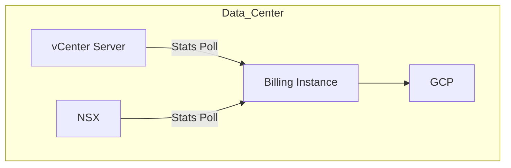
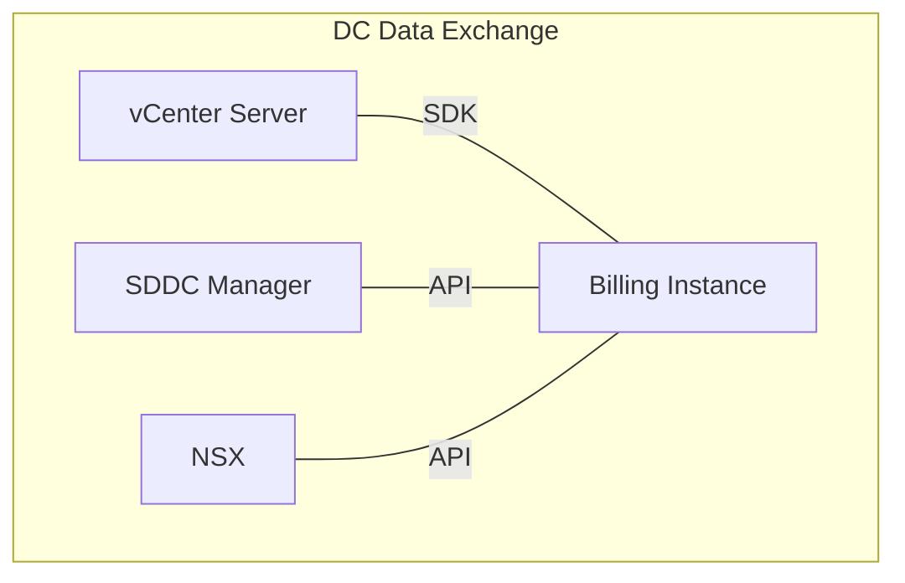
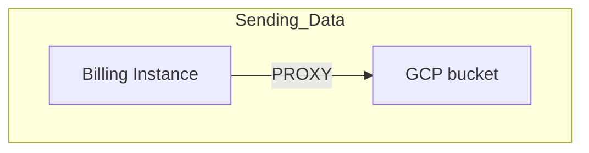
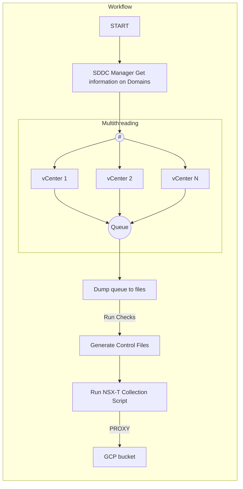

# Billing LLD

# Changelog

| Version | Date       | Description              | Author          |
| ------- | ---------- | ------------------------ | --------------- |
| 0.1     | 17/04/2020 | First version            | Pawel Wlodarczyk    |
| 0.11    | 30/11/2021 | CSI contact list update  | Piotr Gesikowski |
| 0.12    | 01/12/2021 | DHC-3520 Added missing TCP 7444 traffic to Network Port Requirements  | Marcin Gala  |
| 0.13    | 23/06/2022 | DHC-4710 Added corrections, additional fields in cvs file and updated contact data | Pawel Wlodarczyk |
| 0.14    | 03/08/2022 | CESDHC-551 added details related to VM Disk csv file | Madhavi Rane |
| 0.15    | 26/08/2022 | CESDHC-651 updated details for VM disk csv file | Madhavi Rane |
| 0.16    | 15/03/2023 | CESDHC-5800 updated details for GCP bucket as a destinations | Shilpa Arote |
| 0.17    | 01/03/2024 | VCS-12020 Added NSX-T chargeback feature | Pawel Wlodarczyk |
| 0.17    | 12/03/2024 | VCS-12193 VCS modularization changes | Marcin Kujawski|

# 1. Introduction

## 1.1. Purpose

The purpose of this document is to provide a low level design for billing in VCS

## 1.2. Audience

This document is intended for Atos Cloud Services Engineers and Architects responsible for VMware Cloud Services (VCS) solution implementation and maintenance.

## 1.3. Scope

This document is intended to cover the following topics:

- solution design
- reporting and billing

## 1.4. Related Documents

This document is a subset of Atos Technology Lifecycle Management (ATLM) artefacts. All documents are stored in the [VCS Documentation](..) repository.

##### Table 1. ATLM Related Documents

| Document Name                           |
|-----------------------------------------|
| [VCS High-Level Design](hldDigitalHybridCloud.md)              |
| [VCS SoftwareDefinedNetworks LLD](lldSoftwareDefinedNetworks.md)    |
| [VCS Cloud Automation Services LLD](lldCloudAutomationServices.md)  |
| [VCS Backup LLD](lldBackup.md) |
| [VCS DR LLD](lldDisasterRecovery.md) |
| [VCS Naming Convention](namingConvention.md) |

# 2. Architecture

## 2.1. Overview

VCS should be using a dedicated billing virtual machine for providing automated billing of customer consumed resources and workflows. Once billing information is gathered it will be sent to GCP bucket that will be managed by Cloud Services Infrastructure (CSI) team.

##### Figure 1. Architecture Overview Diagram



## 2.2. Data center data exchange

##### Figure 2. Architecture pulling data



### 2.2.1. Pulling Data from SDDC Manager

Data from SDDC Manager is pulled via public API calls available for SDDC Manager. Information pulled from SDDC Manager includes the following:

- Information regarding available Workload Domains and their vCenter Servers
- Information regarding Workload Domain type (Management etc.)

##### Table 2. Design decisions regarding data pull

| Decision ID | Design Decision | Design Justification | Implications |
| :-------: | :-------------------------------------- | :-------------------------------------------------------------- | :----------------- |
| BIL001 | Data regarding management and workload domains will be pulled from SDDC Manager | SDDC Manager provides information regarding which domain is a management or workload domain | None |
| BIL002 | Data regarding single domain will be pulled directly from vCenter Server | With metrics that need to be provided vCenter server has more complete portfolio of counters as vROPS is using the same mechanism to pull them | None |

### 2.2.2. Pulling Data from vCenter Server

Data from vCenter server is pulled using public SDKs (Software Development Kits) available which are as follows:

##### Table 3. SDK Usage table

| SDK | Description | Download Details |
|-----|:------------|:-----------------|
| **PyVmomi** | Core python SDK for interacting with vCenter server objects | Linux Distribution Repository |
| **vsphere-automation-sdk-python** | vSphere Automation SDK for interacting with vCenter and cloud objects | <https://github.com/vmware/vsphere-automation-sdk-python> |

### 2.2.3. Pulling Data from NSX-T Manager

Data from NSX-T Manager is pulled using NSX-T Manager public API

## 2.3. Sending Gathered Data

##### Figure 3. Architecture Sending Data



Data collected by the script is sent over proxy to a GCP bucket which does further processing of the data.

## 2.4. Script Overview

### 2.4.1. Script Architecture

##### Figure 4. Script Architecture Diagram

```mermaid
    graph TD;
        subgraph Config;
        conf_file["Configuration Variables"];
        log_conf["Logging Configuration"];
        end;
        subgraph Classes;
        vcf["VCF Domain"];
        wd["Workload Domain"];
        end;
        subgraph Nsx;
        nsx["NSX-T"]-->["Separate script"]
        conf_file["Configuration Variables"]-->|Import|m["Main"];
        log_conf["Logging Configuration"]-->|Import|m["Main"];
        vcf["VCF Domain"]-->|Import|m["Main"];
        wd["Workload Domain"]-->|Import|m["Main"];

```

### 2.4.2. Script Workflow

##### Figure 5. Script Workflow Diagram



## 2.5. Run Schedule

The reports are to be sent daily via a python script and a cronjob starting at 00:30 UTC time.  
Cron syntax for job listed below.

```bash
30 0 * * * /usr/bin/billing-send
```

## 2.6. Billing Virtual Machine

Collection for billing data in VCS environment will be handled by Ansible Core virtual machine performing billing function.

# 3. Output Data and Metrics

## 3.1. Output Data and Data Format

#### Table 5. Design Decisions regarding output data format

| Decision ID | Design Decision | Design Justification | Implications |
| :-------: | :-------------------------------------- | :-------------------------------------------------------------- | :----------------- |
| BIL003 | Data output format is selected to be `csv` as it is understood by CSI (Cloud Services Infrastructure) | Format is easily understood by CSI | None |
| BIL004 | Encoding of `csv` file selected as UTF-8 | Most widely used encoding | None |
| BIL005 | `csv` delimiter selected as `;` | Readability purpose | None |
| BIL006 | Three output files generated, one for physical, one for virtual resources and one for VM disk details (IopsLimit)  | Better visibility and separation on CSI side | None |

Output data that is to be sent to GCP will be formatted as `csv`. CSI team also requires a control file to be present with every send operation. The control file is essentially a confirmation that the data was gathered correctly.
Control file needs to be formatted in `XML` and has the following contents:

```xml
<collector>
<source name="<sender_name>" version="1.0" />
</collector>
```

Where `sender_name` is the name of billing instance virtual machine for single tenant deployments and `VCF_VIRTUAL2`, `VCF_PHYSICAL2` and `VCF_DISK2` for multi-tenant, shared environments respectively.

Output data is split into three files: one for physical resources, one for virtual resources and one for providing Virtual Machine disk details such as IopsLimit configured per VM disk. It was done so CSI team has better separation and visibility of data. The below chapter describes naming convention for output files.

### 3.1.1. Naming Convention

#### 3.1.1.1 VCS MT (Multi-tenant)

VCS multi-tenant filenames are used in environments where there are multiple tenants/customers sharing one environment.

Both Data and Control file names have to be properly formatted in order to be processed further. The following shows naming convention for files:

- Data Files for virtual, physical and VM disk resources

```xml
DATA_DHC_DHC_<customer-code>_<iso3166-country-code>_<data-center-code>_VCF_VIRTUAL_<hostname-of-sending-host>_<YYYYMMDD>_<HHMMSS>.csv
DATA_DHC_DHC_<customer-code>_<iso3166-country-code>_<data-center-code>_VCF_PHYSICAL<hostname-of-sending-host>_<YYYYMMDD>_<HHMMSS>.csv
DATA_DHC_DHC_<customer-code>_<iso3166-country-code>_<data-center-code>_VCF_DISK<hostname-of-sending-host>_<YYYYMMDD>_<HHMMSS>.csv
```

- Control Files for virtual and physical resources

```xml
CTRL_DHC_DHC_<customer-code>_<iso3166-country-code>_<data-center-code>_VCF_VIRTUAL_<hostname-of-sending-host>_<YYYYMMDD>_<HHMMSS>.xml
CTRL_DHC_DHC_<customer-code>_<iso3166-country-code>_<data-center-code>_VCF_PHYSICAL_<hostname-of-sending-host>_<YYYYMMDD>_<HHMMSS>.xml
CTRL_DHC_DHC_<customer-code>_<iso3166-country-code>_<data-center-code>_VCF_DISK_<hostname-of-sending-host>_<YYYYMMDD>_<HHMMSS>.xml
```

Please find the description of codes below:

##### Table 6. Naming convention codes description

| Naming Code | Description |
|-------------|:------------|
| **iso3166-country-code** | Country Code provided as iso3166 standard |
| **data-center-code** | Code of datacenter |
| **hostname-of-sending-host** | Name of host that is sending data. Billing instance in this case |
| **YYYYMMDD** | Year, month and day identifier |
| **HHMMSS** | Hour, minute and second identifier |

#### 3.1.1.1 VCS ST (Single-tenant)

VCS single-tenant file naming is used in environments dedicated solely for a specific customer and not shared between different customers.

Both Data and Control file names have to be properly formatted in order to be processed further. The following shows naming convention for files:

- Data Files for virtual and physical resources

```xml
DATA_DHC_DHC_<tenant-code>_ZZ_<data-center-code>_VCF_VIRTUAL_<hostname-of-sending-host>_<YYYYMMDD>_<HHMMSS>.csv
DATA_DHC_DHC_<tenant-code>_ZZ_<data-center-code>_VCF_PHYSICAL<hostname-of-sending-host>_<YYYYMMDD>_<HHMMSS>.csv
```

- Control Files for virtual and physical resources

```xml
CTRL_DHC_DHC_<tenant-code>_ZZ_<data-center-code>_VCF_VIRTUAL_<hostname-of-sending-host>_<YYYYMMDD>_<HHMMSS>.xml
CTRL_DHC_DHC_<tenant-code>_ZZ_<data-center-code>_VCF_PHYSICAL_<hostname-of-sending-host>_<YYYYMMDD>_<HHMMSS>.xml
```

Please find the description of codes below:

##### Table 7. Naming convention codes description

| Naming Code | Description |
|-------------|:------------|
| **tenant-code** | Tenant/Pod identifier |
| **data-center-code** | Code of datacenter |
| **hostname-of-sending-host** | Name of host that is sending data. Billing instance in this case |
| **YYYYMMDD** | Year, month and day identifier |
| **HHMMSS** | Hour, minute and second identifier |

## 3.2. Metrics

### 3.2.1 VCS MT (Multi-tenant)

##### Table 8. Billing metrics definition for virtual resources

| Metric | Description | How is it gathered |
|:------:|:-------------|:--------------------|
| **BiosUuid** | BIOS UUID of virtual machine | vCenter server |
| **Country** | Country code | Static assignment |
| **CpuTotalCores** | Total number of CPU cores | vCenter server |
| **Customer** | Customer identifier | Static assignment |
| **Date** | UTC date of running script in format ` YYYYMMDD_HHMMSS ` | System date and time |
| **ESXCluster** | Name of ESXi cluster | vCenter server |
| **ESXClusterNoOfHosts** | Number of hosts in ESXi cluster | vCenter server |
| **InstanceUuid** | Unique UUID of virtual machine instance | vCenter server |
| **isTemplate** | Whether resource is a template | vCenter server |
| **MemoryMB** | Memory in MB | vCenter server |
| **MgmtDomain** | Boolean identifier or VCF Management Domain | VCF SDDC Manager |
| **OsVersion** | Version of the operating system| vCenter server |
| **PksDomain** ( DEPRECATED ) | Boolean identifier of VCF PKS Domain ( DEPRECATED ) | VCF SDDC Manager ( DEPRECATED ) |
| **PowerState** | Power state of resource | vCenter server |
| **ResourcePool** | Name of resource pool that an object belongs to | vCenter server |
| **ServerName** | Name of resource | vCenter server |
| **ServerType** | Type of resource (Virtual or Physical) | vCenter server |
| **SolutionID** | UUID of VCF Management Domain | VCF SDDC Manager |
| **StgDiam** | Diamond storage class | vCenter server - based on actual IopsLimit configured within storage policy assigned to VM/disk |
| **StgPlat** | Platinum storage class | vCenter server - based on actual IopsLimit configured within storage policy assigned to VM/disk |
| **StgGold** | Golden storage class | vCenter server - based on actual IopsLimit configured within storage policy assigned to VM/disk |
| **StgSilv** | Silver storage class | vCenter server - based on actual IopsLimit configured within storage policy assigned to VM/disk |
| **StgBron** | Bronze storage class | vCenter server - based on actual IopsLimit configured within storage policy assigned to VM/disk |
| **StgDbTier** | Database storage class | vCenter server - based on actual IopsLimit configured within storage policy assigned to VM/disk |
| **Tags** | Tag categories and tags for resource | vCenter server |
| **TenantCode** | Tenant identifier | vCenter server - VM tags |
| **TotalStorageMB** | Total storage in bytes | vCenter server |
| **UsedStorageMB** | Used storage in bytes | vCenter server |
| **VmMoid** | Virtual machine object identifier | vCenter server |

##### Table 9. Billing metrics definition for physical resources

| Metric | Description | How is it gathered |
|:------:|:-------------|:--------------------|
| **Country** | Country code | Static assignment |
| **CpuTotalCores** | Total number of CPU cores | vCenter server |
| **CpuTotalSockets** | Total number of CPU sockets | vCenter server |
| **Customer** | Customer identifier | Static assignment |
| **Date** | UTC date of running script in format ` YYYYMMDD_HHMMSS ` | System date and time |
| **ESXCluster** | Name of ESXi cluster | vCenter server |
| **ESXClusterNoOfHosts** | Number of hosts in ESXi cluster | vCenter server |
| **HostLicense** | Name of license type for ESXi host | vCenter server |
| **MemoryMB** | Memory in MB | vCenter server |
| **MgmtDomain** | Boolean identifier or VCF Management Domain | VCF SDDC Manager |
| **OsVersion** | Version of the operating system| vCenter server |
| **PksDomain** ( DEPRECATED ) | Boolean identifier of VCF PKS Domain ( DEPRECATED ) | VCF SDDC Manager ( DEPRECATED ) |
| **PowerState** | Power state of resource | vCenter server |
| **ServerModel** | Physical server model | vCenter server |
| **ServerName** | Name of resource | vCenter server |
| **ServerType** | Type of resource (Virtual or Physical) | vCenter server |
| **SolutionID** | UUID of VCF Management Domain | VCF SDDC Manager |
| **TenantCode** | Tenant identifier | vCenter server - VM tags |

The above metrics are used to provide sufficient data to CSI (Cloud Services Infrastructure) for further processing. On CSI side metrics are translated to WU (Work Units) and pricing is applied.

### 3.2.2 VCS ST (Single-tenant)

##### Table 10. Billing metrics definition for virtual resources in VCS Single-tenant

| Metric | Description | How is it gathered |
|:------:|:-------------|:--------------------|
| **BiosUuid** | BIOS UUID of virtual machine | vCenter server |
| **Country** | Country code | Static assignment |
| **CpuTotalCores** | Total number of CPU cores | vCenter server |
| **Customer** | Customer identifier | Static assignment |
| **Date** | UTC date of running script in format ` YYYYMMDD_HHMMSS ` | System date and time |
| **ESXCluster** | Name of ESXi cluster | vCenter server |
| **ESXClusterNoOfHosts** | Number of hosts in ESXi cluster | vCenter server |
| **InstanceUuid** | Unique UUID of virtual machine instance | vCenter server |
| **isTemplate** | Whether resource is a template | vCenter server |
| **MemoryMB** | Memory in MB | vCenter server |
| **MgmtDomain** | Boolean identifier or VCF Management Domain | VCF SDDC Manager |
| **OsVersion** | Version of the operating system| vCenter server |
| **PksDomain** ( DEPRECATED ) | Boolean identifier of VCF PKS Domain ( DEPRECATED ) | VCF SDDC Manager ( DEPRECATED ) |
| **PowerState** | Power state of resource | vCenter server |
| **ResourcePool** | Name of resource pool that an object belongs to | vCenter server |
| **ServerName** | Name of resource | vCenter server |
| **ServerType** | Type of resource (Virtual or Physical) | vCenter server |
| **SolutionID** | UUID of VCF Management Domain | VCF SDDC Manager |
| **StgDiam** | Diamond storage class | vCenter server - based on actual IopsLimit configured within storage policy assigned to VM/disk |
| **StgPlat** | Platinum storage class | vCenter server - based on actual IopsLimit configured within storage policy assigned to VM/disk |
| **StgGold** | Golden storage class | vCenter server - based on actual IopsLimit configured within storage policy assigned to VM/disk |
| **StgSilv** | Silver storage class | vCenter server - based on actual IopsLimit configured within storage policy assigned to VM/disk |
| **StgBron** | Bronze storage class | vCenter server - based on actual IopsLimit configured within storage policy assigned to VM/disk |
| **StgDbTier** | Database storage class | vCenter server - based on actual IopsLimit configured within storage policy assigned to VM/disk |
| **Tags** | Tag categories and tags for resource | vCenter server |
| **TenantCode** | Tenant identifier | vCenter server - VM tags |
| **TotalStorageMB** | Total storage in bytes | vCenter server |
| **UsedStorageMB** | Used storage in bytes | vCenter server |
| **VmMoid** | Virtual machine object identifier | vCenter server |

##### Table 11. Billing metrics definition for physical resources in VCS Single-tenant

| Metric | Description | How is it gathered |
|:------:|:-------------|:--------------------|
| **Country** | Country code | Static assignment |
| **CpuTotalCores** | Total number of CPU cores | vCenter server |
| **CpuTotalSockets** | Total number of CPU sockets | vCenter server |
| **Customer** | Customer identifier | Static assignment |
| **Date** | UTC date of running script in format ` YYYYMMDD_HHMMSS ` | System date and time |
| **ESXCluster** | Name of ESXi cluster | vCenter server |
| **ESXClusterNoOfHosts** | Number of hosts in ESXi cluster | vCenter server |
| **HostLicense** | Name of license type for ESXi host | vCenter server |
| **MemoryMB** | Memory in MB | vCenter server |
| **MgmtDomain** | Boolean identifier or VCF Management Domain | VCF SDDC Manager |
| **OsVersion** | Version of the operating system| vCenter server |
| **PksDomain** ( DEPRECATED ) | Boolean identifier of VCF PKS Domain ( DEPRECATED ) | VCF SDDC Manager ( DEPRECATED ) |
| **PowerState** | Power state of resource | vCenter server |
| **ServerModel** | Physical server model | vCenter server |
| **ServerName** | Name of resource | vCenter server |
| **ServerType** | Type of resource (Virtual or Physical) | vCenter server |
| **SolutionID** | UUID of VCF Management Domain | VCF SDDC Manager |
| **TenantCode** | Tenant identifier | vCenter server - VM tags |

##### Table 12. Billing metrics definition for Virtual Machine Disk resource

| Metric | Description | How is it gathered |
|:------:|:-------------|:--------------------|
| **BiosUuid** | BIOS UUID of virtual machine | vCenter server |
| **Country** | Country code | Static assignment |
| **Customer** | Customer identifier | Static assignment |
| **Date** | UTC date of running script in format ` YYYYMMDD_HHMMSS ` | System date and time |
| **InstanceUuid** | Unique UUID of virtual machine instance | vCenter server |
| **MgmtDomain** | Boolean identifier or VCF Management Domain | VCF SDDC Manager |
| **PksDomain** ( DEPRECATED ) | Boolean identifier of VCF PKS Domain ( DEPRECATED ) | VCF SDDC Manager ( DEPRECATED ) |
| **ServerName** | Name of Virtual Machine | vCenter server |
| **SolutionID** | UUID of VCF Management Domain | VCF SDDC Manager |
| **IopsLimit** | Iops limit  | vCenter server - Actual IopsLimit configured within storage policy assigned to VM disk |
| **StoragePolicy** | Name of Storage policy assigned to disk | vCenter server |
| **DiskSize** | Virtual Machine Disk size in bytes | vCenter server |
| **DiskLabel** | Virtual Machine Disk Label | vCenter server |
| **TenantCode** | Tenant identifier | vCenter server - VM tags |
| **VmMoid** | Virtual machine object identifier | vCenter server |

##### Table 13. Additional billing metrics definition for physical and virtual resources in single tenant configurations

| Metric | Description | How is it gathered |
|:------:|:-------------|:--------------------|
| **Alcatraz** | Boolean value describing whether Alcatraz is used in the environment | Post installation configuration |
| **AntiMalware** | Boolean value describing whether Anti Malware is present in the environment | Post installation configuration |
| **AtosHosting** | Boolean value describing whether Atos is hosting the environment | Post installation configuration |
| **VmwareLicensing** | Boolean value describing whether licensing is obtained from VMware | Post installation configuration |

### 3.2.3 DHC NSX-T Single and Multi Tenant

##### Table 14. NSX-T billing metrics definitions

| Metric | Description | How is it gathered |
|:------:|:-------------|:--------------------|
| **type** | Resource type for gathered resource | NSX API |
| **name** | Display name of the resource | NSX API |
| **id** | Unique ID of the resource or external ID if unique ID is not available | NSX API |
| **parent** | Parent of resource if available | NSX API |
| **tenant** | Tenant resource if available | NSX API |

The above metrics are used to provide sufficient data to CSI (Cloud Services Infrastructure) for further processing. On CSI side metrics are translated to WU (Work Units) and pricing is applied.

# 4. Security

## 4.1. Firewall

##### Table 15. Design Decisions - Firewall

| Decision ID | Design Decision | Design Justification | Implications |
| :-------: | :-------------------------------------- | :-------------------------------------------------------------- | :----------------- |
| BIL006 | NSX-T firewall will be used for all Workload Domains | Security increase | Detailed configuration required |
| BIL007 | Traffic between Billing Instance and vCenter server is allowed by default on NSX-T firewall | There is no need for such restriction | None |
| BIL008 | Traffic between Billing Instance and SDDC Manager is allowed by default on NSX-T firewall | There is no need for such restriction | None |

### 4.1.1. Firewall Rules

The following firewall rules need to be added

##### Table 16. Firewall Rules

| Service / Traffic Name | Source | Destination | Ports | Protocol |
| :--------------------- | :------------ | :-------------------- | :---: | :----: |
| proxy | Billing Instance | GCP bucket | 3128 | TCP |

## 4.2. Network Port Requirements

##### Table 17. Network Requirements

| Service / Traffic Name | Source | Destination | Ports | Protocol |
| :--------------------- | :------------ | :-------------------- | :---: | :----: |
| HTTPS | Billing Instance | vCenter Server (Management and Workload Domains) | 443 | TCP |
| TCP7444 | Billing Instance | vCenter Server (Management and Workload Domains) | 7444| TCP |
| HTTPS | Billing Instance | SDDC Manager | 443 | TCP |
| proxy | Billing Instance | GCP bucket | 3128 | TCP |
| NTP   | Billing Instance | Active Directory | 123 | UDP |
| HTTPS | Billing Instance | NSX-T Manager | 443 | TCP |

## 4.3. Network Time synchronization

In order to provide accurate time and date values the Billing instance will have NTP protocol synchronization enabled and it will synchronize with local Active Directory servers.
The NTP solution used for this is `chrony`.

## 4.4. User access to billing instance

The following design decisions were taken to secure user access

##### Table 18. Design Decisions - User Access

| Decision ID | Design Decision | Design Justification | Implications |
| :-------: | :-------------------------------------- | :-------------------------------------------------------------- | :----------------- |
| BIL009 | Root user password is to be changed during deployment | security focus | None |
| BIL010 | Dedicated user will be created on billing instance and will be the one running the script | Privilege reduction and preventing root user usage | None |
| BIL011 | All passwords will be kept in Hashi Vault | Security focus | None |

# 5. Availability and Scalability

## 5.1. Availability

##### Table 19. Availability details

| Decision ID | Design Decision | Design Justification | Implications |
| :-------: | :-------------------------------------- | :-------------------------------------------------------------- | :----------------- |
| BIL012 | Availability of Billing Instance will be provided via HA and DRS functionality of VCS VMware vSphere Management Domain | No need for higher availability | None |
| BIL013 | Billing Instance is to be backed up by VCS backup solution | To provide another history source for billing files | None |

## 5.2. Scalability

There are no current scalability concerns regarding Billing Instance. If required or shown by monitoring that CPU or memory usage is high the billing instance can be manually scaled up.

# 6. Billing Instance Data Retention

## 6.1. Output data retention

The main purpose of output data retention is to provide an additional recovery point in case of failure, as main data retention is on CSI side.

##### Table 20. Design decisions regarding data retention details

| Decision ID | Design Decision | Design Justification | Implications |
| :-------: | :-------------------------------------- | :-------------------------------------------------------------- | :----------------- |
| BIL014 | Past 30 output data files will be kept | To provide another recovery point in the event of failure | None |

## 6.2. Logging retention

The below table provides design decisions regarding logging retention on billing instance VM

##### Table 21. Design decisions regarding data retention details

| Decision ID | Design Decision | Design Justification | Implications |
| :-------: | :-------------------------------------- | :-------------------------------------------------------------- | :----------------- |
| BIL015 | Log file name will be `billing.log` and will be located in `/var/log/` directory | Consistency | None |
| BIL016 | Log file to rotate after reaching 2MB in size | Consistency | None |
| BIL017 | 10 packed copies of `billing.log` file to be kept | Consistency | None |

# 7. Multitenancy Support

Multitenancy feature support is achieved by `TenantCode` column which contains the name of the tenant. The value for the tenant name is taken from the following virtual machine tags

| Key | Description |
|:----|:------|
| `TenantCode` | Value specifying tenant, i.e. nx301 |

So tenant VMs are marked using `TenantCode` column and csv file containing tenant resources is sent to CSI for further processing and billing.

# 8. GCP bucket Integration

In order to allow integration with GCP bucket a secret access key needs to be provided to CSI team. This process is not automated and has to be performed manually, therefore secret access key should be given CSI team and copied to billing Instance.

This secret access key will be stored to the following location:

`/home/billing-user/workunits/vault`

The contacts from CSI team that provides secret access key are as follows:

| Contact Name | Contact Email |
|:------------:|:-------------:|
| Richard Hensgens | `richard.hensgens@atos.net` |
| S, Subathra | `s.subathra@atos.net` |
| Shreya Mali | `shreya.mali@atos.net` |

The following email template is to be used:

- Platform: “DHC”
- Service: “VCF”
- Version: “1.2”, “1.3”, etc.
- Customer: < Customer code > (for version 1.2) or “SHARED” (for version 1.3 and above)
- Originator: as used in the file name (e.g. ”mec09cht002.nx5dhc.next”)
- Owner of private key in format: user@fqdn_hostname (e.g. `billing-user@mec09cht002.nx5dhc.next`)

# 9. Additional Information and Next Steps

1. Copy of secret access key to Billing instance

   After a successful deployment and configuration of billing instance, Further information can be found in the following work instruction.

   [wiConfigureBilling.md](../workInstructions/wiConfigureBilling.md)

2. Adjustment to copy VCS ST (Single-tenant) code for new financial flow

     If the environment is to be configured as a single-tenant mode where the environment is dedicated to a single customer the workunits gathering script needs to be
     replaced.Further information can be found in the following work instruction.

     [wiConfigureBilling.md](../workInstructions/wiConfigureBilling.md)

3. Entering full customer name and charging country symbol

4. Specifying multi-tenant or single-tenant environment deployment needs to be executed before considering billing deployment successful. Further information can be found in the work instruction. [wiConfigureBilling.md](../workInstructions/wiConfigureBilling.md)
