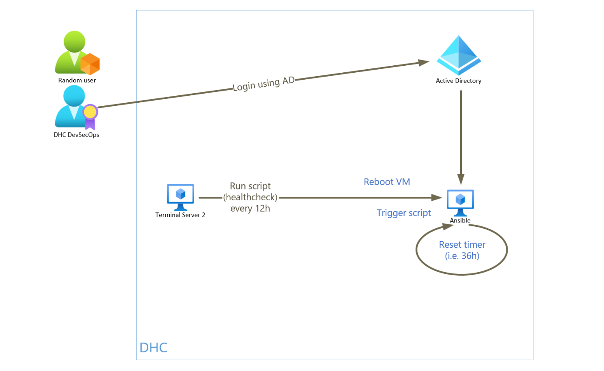
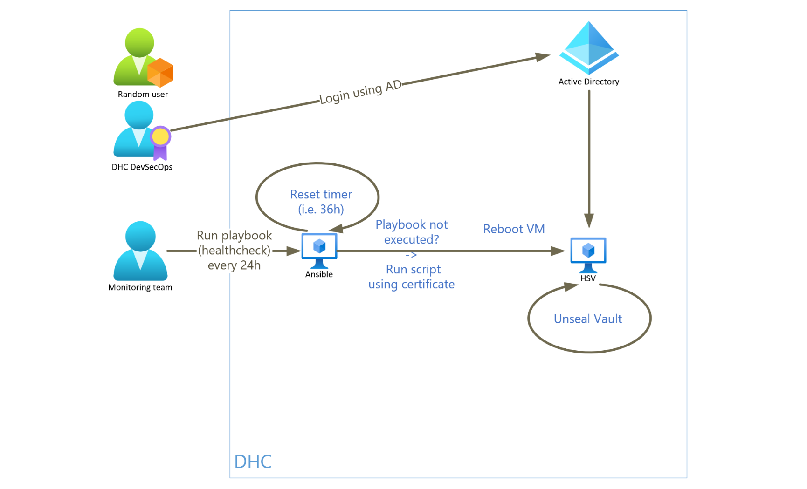
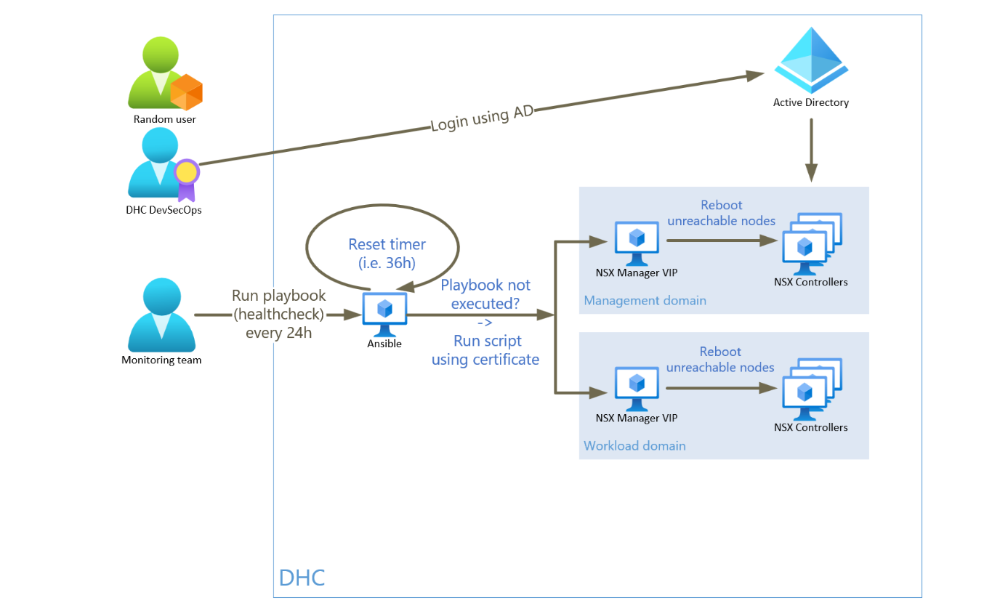
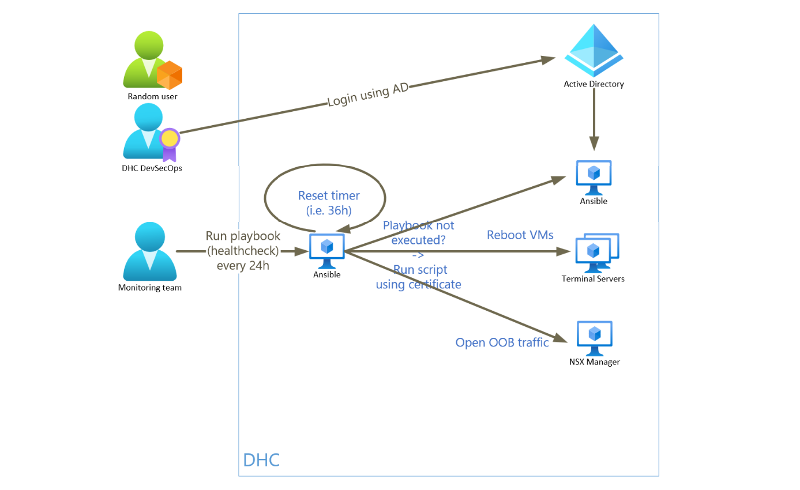
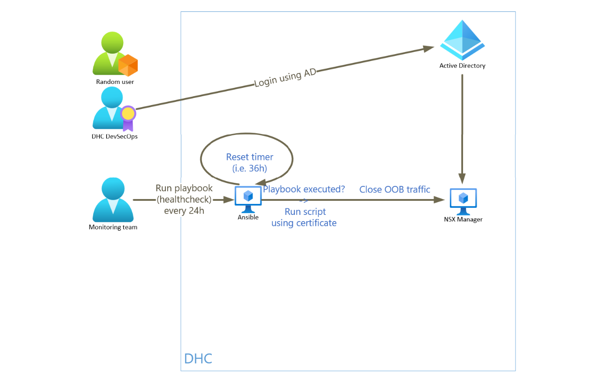
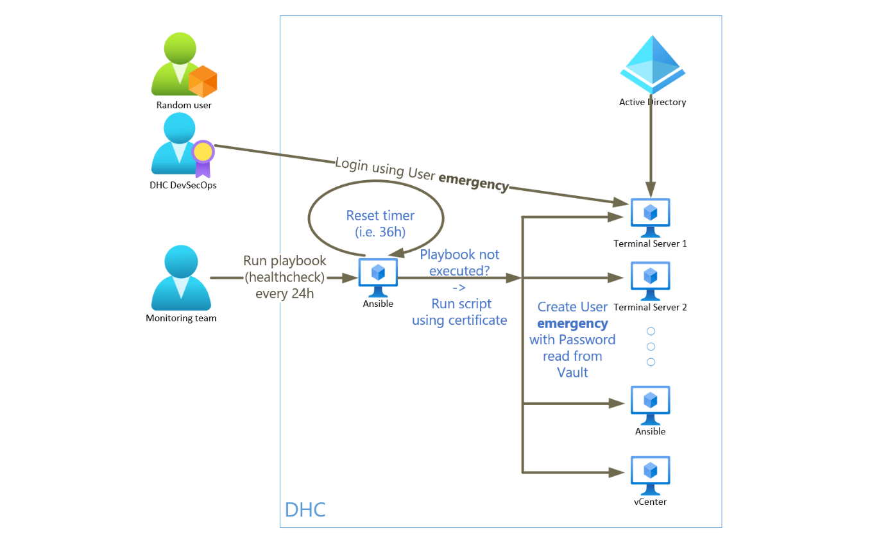
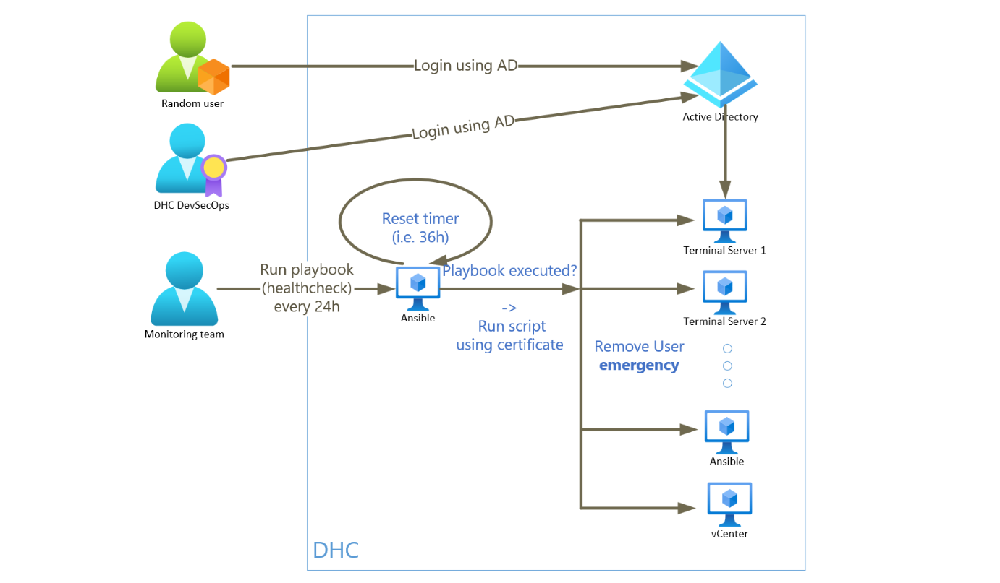
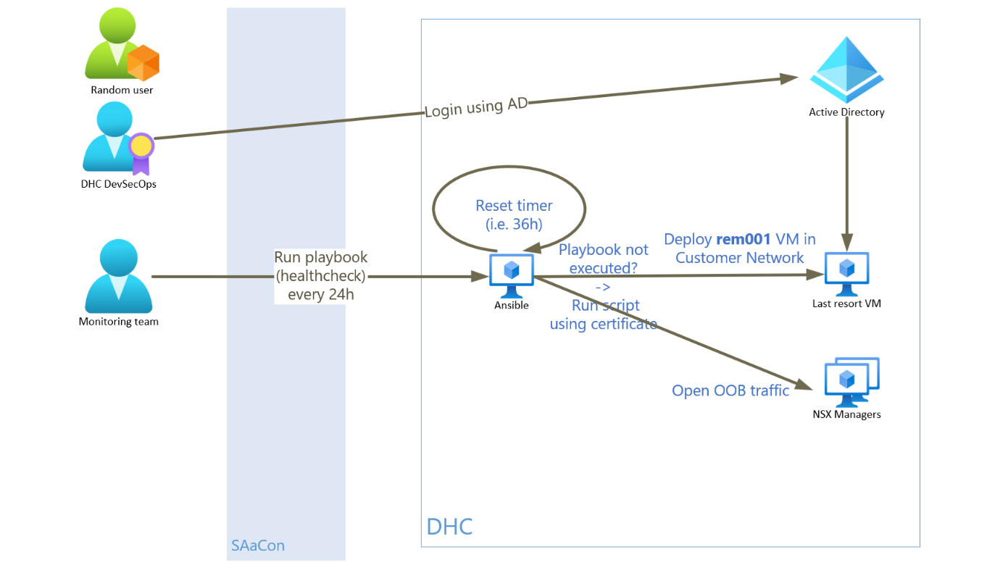
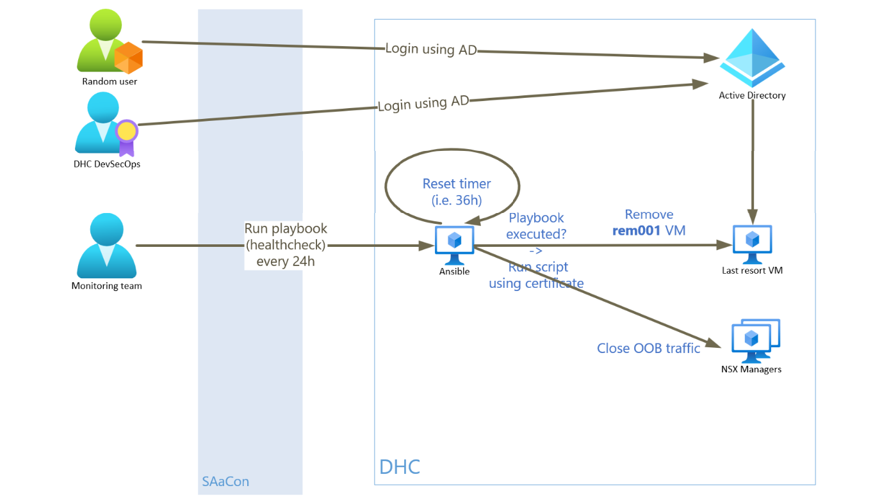

# Break the Glass LLD

## Changelog

| Date | Issue | Author | Description |
| --- | --- | --- | --- |
| 11.02.2025 | VCS-14976 | Stanisław Kilanowski | Initial draft creation |
| 27.02.2025 | VCS-15018 | Stanisław Kilanowski | Completed the document and submitted for review |
| 24.03.2025 | VCS-15538 | Przemysław Pakula | Added Security Requirements Coverage |

## Introduction

### Purpose

The purpose of this document is to describe the idea of the Break the Glass solution and explain the workflow in various scenarios.

### Audience

- VCS Engineers
- VCS Operations

### Scope

#### In Scope

- The technical steps for each scenario.
- Backup systems and how to use them in emergencies.
- Steps to restore the system after the issue is fixed.
- How to test and make sure these plans work.

#### Out of Scope

- Solution implementation steps.

### Requirement Levels

This document is following the principles below to categories all requirements and design decisions.

| Term | Meaning |
| :---: | --- |
| MUST | The definition is an absolute requirement of the specification. |
| MUST NOT | The definition is an absolute prohibition of the specification. |
| SHOULD | There may exist valid reasons in particular circumstances to ignore a particular item, but the full implications must be understood and carefully weighed before choosing a different course. |
| SHOULD NOT | There may exist valid reasons in particular circumstances when the particular behaviour is acceptable or even useful, but the full implications should be understood and the case carefully weighed before implementing any behaviour described with this label. |
| MAY | Any design decisions that are not classified as MUST and SHOULD or covering optional feature that is not generally available for VCS. |

### Related Documents

| Documentation |
| --- |
| [Naming Convention](namingConvention.md) |
| [Hashicorp Vault LLD](lldHashicorpVault.md) |
| [Software Defined Networks Firewall LLD](lldSoftwareDefinedNetworksFirewall.md) |

#### Security Requirements Coverage

| Instruction Name | Short Description |
| :----------: | ------- |
| [lldADSecurityEnhancement2024.md](lldADSecurityEnhancement2024.md) | Describes AD vulnerabilities in VCS and the remediation actions for key security findings. |
| [lldDhcRoleBasedAccessControl.md](lldDhcRoleBasedAccessControl.md) | Defines RBAC roles, mappings, and access review principles for VCS components. |
| [lldBreakTheGlass.md](lldBreakTheGlass.md) | Defines emergency access workflows for outage scenarios and recovery procedures. |
| [lldHardening.md](lldHardening.md) | Defines required hardening activities before production handover, including identity, firewall, and compliance controls. |
| [lldHashicorpVault.md](lldHashicorpVault.md) | Describes secure secret-management architecture, authentication methods, and audit logging. |
| [lldVulnerabilityManagement.md](lldVulnerabilityManagement.md) | Defines Nessus-based vulnerability scanning design, scope, and operating model. |
| [lldSecurityPosture.md](lldSecurityPosture.md) | Provides a consolidated overview of VCS security controls across encryption, scanning, RBAC, logging, and patching. |
| [SecurityMeasureExceptions.md](SecurityMeasureExceptions.md) | Lists approved Nessus/Alcatraz exceptions and false positives with rationale and mitigation context. |
| [SiemensCERTExceptions.md](SiemensCERTExceptions.md) | Lists Siemens CERT exceptions/false positives with applicability and risk/mitigation notes. |
| [lldSOXDB.md](lldSOXDB.md) | Describes SOXDB integration security controls, including credential handling, encryption, and RBAC. |
| [lldRemoteConsoleAccess.md](lldRemoteConsoleAccess.md) | Defines secure remote console access controls, including RBAC and certificate handling. |

## Architecture Overview

Break the Glass is a solution intended for VCS environments with a purpose of restoring access to critical infrastructure in the event of outages. In case of such incidents, when all known means of fixing the issues fail, users will regain control at most 36 hours later. Multiple scenarios of outages have been described.

There are two teams supporting the VCS environments, which will bear responsibilities in this solution:

- **The VCS engineers** - referred to in the LLD as "Engineers", who monitor the platforms in the BH and resolve issues,
- **The monitoring team** - who monitor the platforms outside the BH and involve the Engineers if needed.

#### Design Decisions for Outage Scenarios

| Decision ID | Design Decision | Design Justification | Design Implication |
| --- | --- | --- | --- |
| OSDD001 | An emergency user will be used in case of DNS outage | The Engineers will not be able to access the critical tooling without DNS connectivity | A local user will be created on the tools and the credentials will be stored in HSV |
| OSDD002 | An emergency VM will be used in case of ASN/SAaCon outage | SAaCon jump hosts are used to connect to the VCS infrastructure | A management VM will be deployed in the customer network |
| OSDD003 | Critical credentials will be stored in tooling external to VCS | In case of HSV access outage, Engineers will not have access to various passwords | Passwords will be exported from HSV on a regular basis |
| OSDD004 | VCS environments will be accessible via various servers | Only VCS Terminal Servers are used to connect to the VCS infrastructure | Network connectivity will be opened from SAaCon towards Ansible Core VMs |

### Software Automation

In order to discover emergencies the following software automation is configured:

- Countdown timer
- Playbook designed for health check activity
- Playbook designed for outage detection and resolution
- Script designed specifically for Ansible Core VM health check

The timer has a 36-hour countdown and triggers the playbook for outage detection and resolution when it finishes. The timer is reset with the execution of the health check playbook, which will require daily activity from the monitoring team. If such automation is not triggered in time, it will be considered as the teams having lost access to the environment, activating Break the Glass scenarios.

With that in mind, the monitoring team will send an e-mail to the Engineers with the High Importance setting to notify them about any encountered issues. It is not required to re-do the activity in case of failure on a given day. That's because the outage detection and resolution playbook makes changes only if necessary, after it performs various checks.

Additionally a script will automatically run health checks towards Ansible Core VM, where the monitoring team is supposed to perform their activity. If this automation detects loss of connectivity towards the VM, one of the Break the Glass scenarios will be triggered.

#### Design Decisions for Software Automation

| Decision ID | Design Decision | Design Justification | Design Implication |
| --- | --- | --- | --- |
| SADD001 | A timer countdown will be implemented | The timer allows to validate the teams retaining access to the environment | A countdown timer will be running 24/7 and will be reset by manually triggered automation |
| SADD002 | Health checks will be performed semi-automatically | Manual activity allows to confirm access to the tooling | Automation will be triggered daily by the monitoring team on Ansible Core VM |
| SADD003 | Outage detection and resolution will trigger based on the timer | Automation will reliably restore access to the critical tooling | Automation will be executed after there's no manual intervention for 36 hours |
| SADD004 | Health checks will be automatically performed towards the Ansible Core VM | Automation allows for quick reaction in case of an emergency | Automation will be triggered every 12 hours to ensure the server's availability |
| SADD005 | An emergency user will be prepared | When access to the critical tooling is restored, user credentials will be known | Password for the user will be rotated monthly and the same across all VCS environments and CyberArk |

### Solution requirements

The following table lists known requirements for using this solution.

| ID | Requirement description | Requirement Level |
| --- | --- | --- |
| R001 | A process is to be created for the monitoring team | MUST |
| R002 | Monitoring team is to be granted access to the Ansible automation | MUST |
| R003 | Break the Glass automation is to be created | MUST |
| R004 | Network traffic is to be allowed between the solution's components | MUST |
| R005 | Emergency user's details are to be defined and stored in HSV | MUST |
| R006 | Emergency VM design is to be defined | MUST |
| R007 | Certificates used in the solution are to be defined and created | MUST |
| R008 | VCS tooling must be interconnected using IP addresses | MUST |
| R009 | Critical passwords and unseal keys must be exported from HSV | MUST |
| R010 | IP address reservation should be performed in customer domains for OOB connectivity | SHOULD |
| R011 | Reserved IP address for OOB connectivity should be stored in Ansible environmental variables | SHOULD |
| R012 | Firewall rules to allow traffic for OOB connectivity are to be created and disabled on VCS NSX Managers | MUST |
| R013 | The timer service must be enabled on Ansible Core VM | MUST |
| R014 | Firewall rules to allow connectivity to CyberArk safe are to be created | MUST |

## Detailed Logical Design

### VCS components

All of the VCS tools are reachable through the dedicated Terminal Servers. Users can access the environment through SAaCon jump hosts, by connecting to one of the Terminal Servers and authenticating with their AD credentials. TSS 2 is specifically used for automation that has to be executed from a Windows server.

AD allows to configure a logical domain of servers (VMs) and users. VCS servers are using two ADC VMs for this purpose. Each user has unique credentials which they can use to log in to the servers in the domain.

The VCS environments are running an Ansible Core VM, designed as single point for triggering Ansible automation. The engineers and the monitoring team can access it with AD credentials or a local account.

All generic VCS automation is stored on GitHub repositories under the GLB-CES-PrivateCloud organization. It is cloned on Ansible Core VMs and regularly updated.

HSV is a VM deployed on each VCS environment and is used to store passwords to all tools. Credentials are stored in predefined paths. For the purpose of Break the Glass solution an `emergency` user is stored at `secret/<customerCode>/<locationCode>/breaktheglass/emergency`.

To ensure that critical passwords are accessible in case of HSV outage, they must be exported to an external tool after each password rotation. For this purpose VCS uses a single CyberArk safe or other VCS environments.

### Countdown timer

A timer is configured as a pair of services on the Ansible Core VM. They are activated by the native manager "systemd" and can be controlled like any service.

For this purpose, services `breaktheglass.timer` and `breaktheglass.service` are created in the directory `/etc/systemd/system/`. The former is counting down 36 hours (1,5 days). Execution of a health check playbook restarts this service. Once the timer reaches 0 the latter is automatically started, leading to the execution of the [automation for outage detection and resolution](#outage-detection-and-resolution-playbook).

The file `breaktheglass.timer` has the following configuration:

```ini
[Unit]
Description=Timer executing Break the Glass automation after 36 hours
Requires=breaktheglass.service

[Timer]
OnBootSec=36h
OnUnitActiveSec=36h
Unit=breaktheglass.service
Persistent=true

[Install]
WantedBy=timers.target
```

The file `breaktheglass.service` has the following configuration:

```ini
[Unit]
Description=Service executing Break the Glass outage detection and resolution playbook

[Service]
Type=oneshot
ExecStart=cd /opt/dhc/manage && ansible-playbook breakTheGlass.yml | tee /var/log/breakTheGlass.log
```

Such setup guarantees that the timer will be started after the server's reboot. It will continue counting down from where it stopped during the reboot.

### Health check playbook

An Ansible playbook called `breakTheGlassHealthCheck.yml` is created and stored on the VCS GitHub repository. It is required from the monitoring team to execute this playbook every day of the week, once every 24 hours. The user is required to authenticate with their AD credentials. The playbook resets the countdown timer.

For the purpose of tracking which scenario fixes are active a file `breakTheGlassStatus.json` is created at the directory `/backup/`. The file has a JSON format with the following structure:

```json
{
    "scenarioName": "scenarioStatus",
    "scenarioName": "scenarioStatus"
}
```

Each Break the Glass scenario handled by the Ansible playbooks that has rollback steps, will have a unique entry in this file, with the fields described as follows:

- `scenarioName` is a unique name of the scenario,
- `scenarioStatus` is one of: `ON` or `OFF`.

Upon the file's creation all statuses are set to `OFF`.

In the last step the playbook verifies content of this file and performs rollback of respective scenarios when applicable (when the status is `ON`). The rollback processes are described in [each scenario's section](#break-the-glass-scenarios) of this LLD. Upon rollback completion, the respective status is set to `OFF`.

The playbook registers status of every activity and presents a summary at the end. The summary lists whether each activity was successful or in case of failure, which task did it fail on. The results are saved in a log file.

### Outage detection and resolution playbook

An Ansible playbook called `breakTheGlass.yml` is created and stored on the VCS GitHub repository. It is executed by the Countdown timer and using automation05 HSV certificate it performs various tests and activities to detect and resolve outages, as described in [each scenario's section](#break-the-glass-scenarios) of this LLD, in the listed order.

This automation will maintain the file `breakTheGlassStatus.json` on Ansible Core VM at the directory `/backup/`. When respective scenario's tests fail, its status in the file will be set to `ON`.

The playbook registers status of every activity and presents a summary at the end. The summary lists whether each activity was successful or in case of failure, which task did it fail on. The results are saved in a log file.

#### Terminal Servers health check

As described in the next section, Terminal Server 2 runs automation to ensure Ansible Core VM's availability. Likewise, to ensure that Terminal Server 2 is reachable, Ansible Core VM performs health checks automatically.

For this purpose a Cron job is created that will run the outage detection and resolution playbook every 12 hours specifically for the [Terminal Servers lost](#terminal-servers-lost) scenario. The playbook is executed this way with a tag, used to limit execution to this scenario only.

### Ansible Core VM health check script

A PowerShell script called `breakTheGlassAnsibleHealthCheck.ps1` is created and uploaded to the Terminal Server 2. Automatic execution is configured with the `AnsibleHealthCheck` task on Task Scheduler. Every 12 hours it runs tests to verify if the Ansible Core VM is reachable and if needed, the script resolves issues. The steps are described in the [Access to Ansible lost](#access-to-ansible-lost) scenario.

The script registers status of the activities and the results are saved in a log file.

### Break the Glass scenarios

#### Access to Ansible lost



The script tests whether it is possible to connect to the Ansible Core VM using the SSH and ICMP protocols. When either attempt fails, it is considered as connectivity loss.

The script reads vCenter administrator credentials from HSV. If it fails, it reads them from CyberArk instead. Using this account, it gracefully shuts down and powers on the Ansible Core VM. Once it's finished, it reads credentials for the server's local user from HSV (or CyberArk if the former failed). If access to the server is not restored, the reboot is attempted again. If the server remains unreachable at this point, the script creates a high priority incident in the Engineers Team's SNOW queue using HGW VM.

Using this account, it verifies modification time of the `breaktheglass.service` log file and if it's greater than 36 hours earlier, triggers the outage detection and resolution playbook.

#### HSV lost



The outage detection and resolution playbook tests whether it is possible to connect to HSV using the TCP 8200 port. When the attempt fails, it is considered as HSV connectivity lost.

The playbook reads credentials for vCenter administrator from CyberArk. Using this account, it gracefully shuts down and powers on HSV.

#### NSX Managers lost



The outage detection and resolution playbook reads the cluster status of both NSX Managers using API. If the cluster is not stable or the API is not working, the playbook tests whether it's possible to connect to the Manager's NSX Controllers using ICMP.

If any NSX Controller is reachable, it's used to validate the cluster's master node. For this purpose, the playbook reads credentials for the NSX Manager's admin account from HSV. If it fails, it reads them from CyberArk instead. The playbook logs in to the node and registers each node's status and role.

In order to repair the cluster, the lost nodes will be rebooted. The playbook reads vCenter administrator credentials from HSV (or CyberArk if the former failed). Using this account, it gracefully shuts down and powers on the the first lost NSX Controller. Once the member's status is UP, the next lost NSX Controller can be rebooted. All of the unresponsive VMs are restored this way one by one.

#### Terminal Servers lost



The outage detection and resolution playbook tests whether it is possible to connect to both TSS VMs using the RDP and ICMP protocols. When any attempt fails to either server, it is considered as TSS connectivity loss.

The playbook reads vCenter administrator credentials from HSV. If it fails, it reads them from CyberArk instead. Using this account, it gracefully shuts down and powers on every lost TSS.

Afterwards the playbook validates again if either server is reachable. If unsuccessful, using API of the management domain NSX Manager the following firewall rule is updated and enabled:

| RuleName | SectionName | Source | Destination | Service | Action | ApplyTo |
| --- | --- | --- | --- | --- | --- | --- |
| AsnToAns | Ansible | `<customerCode>seg016` | `<customerCode>seg007` | SSH | ALLOW | `<customerCode>seg007_APPLYTO` |

#### Terminal Servers lost - rollback



The health check playbook uses the API of management domain NSX Managers is used to disable the listed firewall rule.

#### Active Directory lost



The outage detection and resolution playbook tests whether it is possible to connect to both ADC VMs using the LDAP protocol. Additionally, using `nslookup` it directly queries ADC VMs for FQDN of a VCS management server, e.g. the SDDC Manager. When either attempt fails to both servers, it is considered as AD connectivity loss.

The playbook reads entry in HSV for user `emergency`. If it fails, the same password is read from CyberArk instead. Afterwards it constructs IP addresses of the specified tools, based on Ansible group_vars - specifically using VCS `platformConfig.yml` vars (`group_vars/all` before VCS 2.0). The playbook connects to the tools using such constructed IP addresses and creates a local user `emergency` with the saved password.

Tools list:

- Terminal Servers
- Ansible Core VM
- SDDC Manager
- vCenter Servers
- NSX Managers
- ESXi hosts
- Aria Lifecycle Manager
- Aria Operations
- Aria Automation

#### Active Directory lost - rollback



The health check playbook tests whether it is possible to connect to both ADC VMs using the DNS and ICMP protocols. When everything is successful, it is considered as AD connectivity being restored.

The playbook connects to the specified tools and removes the `emergency` local user. Afterwards it checks which ADC is the primary node, logs in to it and forces sync to the other controller.

#### Access to SAaCon lost



> [!NOTE]
> Currently there's no known solution to securely access the VCS environments when SAaCon is inaccessible. As per ASN design, SAaCon must be used for such connectivity. Additionally, there's no design of using Internet to safely connect to VCS. However the following steps were described in case such solution was granted in the future.

The outage detection and resolution playbook verifies whether connectivity to SAaCon has been lost.

The playbook reads entry in HSV for user `emergency`. If it fails, the same password is read from CyberArk instead.

Using API of Aria Automation and a blueprint, it deploys a Windows VM named `<locationCode>rem001` in the customer network with the user's `emergency` credentials supplied for the local account. If an IP address was reserved and is stored in the environmental variables, it is registered as `remoteIpAddress` and passed as a parameter to the deployment. The playbook verifies the status of the request. Once it's completed, if an IP address was not reserved in advance, the playbook reads it from the deployment and registers as `remoteIpAddress`.

If deployment via Aria Automation fails, the playbook reads vCenter administrator credentials from HSV (or CyberArk if the former failed). Afterwards it identifies an template for Windows VM and uses is to deploy the server.

Next, using API of the workload domain NSX Manager the following firewall rule is updated and enabled in the Emergency category of the Distributed Firewall:

| RuleName | SectionName | Source | Destination | Service | Action | ApplyTo |
| --- | --- | --- | --- | --- | --- | --- |
| OobToLastResort | LastResort | any | `remoteIpAddress` | RDP | ALLOW | any |
| LastResortToAny | LastResort | `remoteIpAddress` | any | any | ALLOW | any |

Lastly, using API of the management domain NSX Manager the following firewall rules are updated and enabled in the Emergency category of the Distributed Firewall:

| RuleName | SectionName | Source | Destination | Service | Action | ApplyTo |
| --- | --- | --- | --- | --- | --- | --- | --- |
| LastResortToVcs | LastResort | `remoteIpAddress` | `<customerCode>seg013` | TCP7444, HTTP | ALLOW | `<customerCode>seg013_APPLYTO` |
| LastResortToNsxt | LastResort | `remoteIpAddress` | `<customerCode>seg002` | HTTPS | ALLOW | `<customerCode>seg002_APPLYTO` |
| LastResortToHsv | LastResort | `remoteIpAddress` | `<customerCode>seg009` | TCP 8200 | ALLOW | `<customerCode>seg009_APPLYTO` |
| LastResortToTss | LastResort | `remoteIpAddress` | `<customerCode>seg004` | RDP | ALLOW | `<customerCode>seg004_APPLYTO` |
| LastResortToAns | LastResort | `remoteIpAddress` | `<customerCode>seg007` | SSH | ALLOW | `<customerCode>seg007_APPLYTO` |

#### Access to SAaCon lost - rollback



The health check playbook uses the API of Aria Automation to delete the deployment of `<location code>rem001`. The playbook verifies the status of the request. Once it's completed, API of both NSX Managers is used to disable all listed firewall rules.

### Testing process

#### Countdown timer

1. Log in to the Ansible Core VM and modify the timer service at `/etc/systemd/system/breaktheglass.timer`, by replacing the `[Timer]` section as follows. Such configuration will allow to trigger it after 5 minutes from execution and disable reactivating the service.

    ```ini
    [Timer]
    OnActiveSec=5min
    Persistent=false
    ```

2. Restart the `breaktheglass.timer` service.

3. Validate if the timer is started ("active") and wait for the playbook's execution.

    ```shell
    systemctl status breaktheglass.timer
    systemctl list-timers --all
    ```

    You can use the same commands to validate if the timer finished working (status is "elapsed").

4. Verify if the playbook was successfully executed by checking its log file at `/var/log/breakTheGlass.log`.

5. Restore the original configuration of the service.

#### Countdown timer reset

1. Log in to the Ansible Core VM and execute the health check playbook:

    ```shell
    cd /opt/dhc/manage && ansible-playbook breakTheGlassHealthCheck.yml
    ```

2. After the playbook is completed, validate if the timer is restarted:

    ```shell
    systemctl status breaktheglass.timer
    systemctl list-timers --all
    ```

#### Access to Ansible lost

1. Open the vCenter Server's GUI.
2. Select `<locationCode>ans001` VM and select **ACTIONS** -> **Power** -> **Shut Down Guest OS**. Wait for the server to power off.
3. Log in to the Terminal Server 2.
4. Open the Task Scheduler, select the AnsibleHealthCheck task and **Run** it.
5. **Refresh** to see the task's status changed to "Running". Wait for the item to finish (status changed to "Ready").
6. Verify if Ansible Core VM is accessible.

#### HSV lost

1. Open the vCenter Server's GUI.
2. Select `<locationCode>hsv001` VM and select **ACTIONS** -> **Power** -> **Shut Down Guest OS**. Wait for the server to power off.
3. Log in to the Ansible Core VM and execute the outage detection and resolution playbook:

    ```shell
    cd /opt/dhc/manage && ansible-playbook breakTheGlass.yml
    ```

4. After the playbook is completed, validate if HSV GUI is accessible and if the Vault is unsealed.

#### NSX Managers lost

> [!WARNING]
> It is important that no more than one cluster node is down at any given time, as it can disrupt the service. During the testing procedure, if any connectivity issue is already observed, no more nodes can be disconnected.

1. Log in to both NSX Managers GUI and navigate to **System** -> **Configuration** -> **Appliances**. Validate if the cluster is STABLE and if any node is DOWN. If there are no disconnected NSX Controllers, note down the NSX Controller which is not the master node.
2. Open the vCenter Server's GUI.
3. Select the noted down VMs and select **ACTIONS** -> **Power** -> **Shut Down Guest OS**. Wait for the server to power off.
4. Log in to the Ansible Core VM and execute the outage detection and resolution playbook:

    ```shell
    cd /opt/dhc/manage && ansible-playbook breakTheGlass.yml
    ```

5. After the playbook is completed, log in to both NSX Managers GUI and navigate to **System** -> **Configuration** -> **Appliances**. Validate if the cluster is STABLE and if all nodes are UP.

#### Terminal Servers lost

1. Open the vCenter Server's GUI.
2. Select `<locationCode>tss002` VM and select **ACTIONS** -> **Power** -> **Shut Down Guest OS**. Wait for the server to power off.
3. Log in to the Ansible Core VM and execute the outage detection and resolution playbook:

    ```shell
    cd /opt/dhc/manage && ansible-playbook breakTheGlass.yml
    ```

4. After the playbook is completed, validate if the Terminal Server 2 is accessible. Test whether it's possible to reach the Ansible Core VM directly from SAaCon. Check if the scenario's status is `ON` in the file `/backup/breakTheGlassStatus.json`.

#### Terminal Servers lost - rollback

1. Log in to the Ansible Core VM and execute the health check playbook:

    ```shell
    cd /opt/dhc/manage && ansible-playbook breakTheGlassHealthCheck.yml
    ```

2. After the playbook is completed, test whether it's no longer possible to reach the Ansible Core VM directly from SAaCon. Check if the scenario's status is `OFF` in the file `/backup/breakTheGlassStatus.json`.
3. Log in to the management domain NSX Manager GUI and check if the "AsnToAns" firewall rule is disabled.

#### Active Directory lost

1. Verify which ADC server is the backup node.
2. Open the vCenter Server's GUI.
3. Select the backup VM and select **ACTIONS** -> **Power** -> **Shut Down Guest OS**. Wait for the server to power off.
4. Log in to the Ansible Core VM and execute the outage detection and resolution playbook:

    ```shell
    cd /opt/dhc/manage && ansible-playbook breakTheGlass.yml
    ```

5. After the playbook is completed, verify if it's possible to log in to all critical servers with the `emergency` local user. Check if the scenario's status is `ON` in the file `/backup/breakTheGlassStatus.json`.

#### Active Directory lost - rollback

1. Log in to the Ansible Core VM and execute the health check playbook:

    ```shell
    cd /opt/dhc/manage && ansible-playbook breakTheGlassHealthCheck.yml
    ```

2. After the playbook is completed, test whether it's no longer possible to log in to the servers with the `emergency` local user. Check if the scenario's status is `OFF` in the file `/backup/breakTheGlassStatus.json`.

3. Verify if both ADC servers are up in the cluster.

#### Access to SAaCon lost

> [!NOTE]
> Currently there's no known solution to securely access the VCS environments when SAaCon is inaccessible. As per ASN design, SAaCon must be used for such connectivity. Additionally, there's no design of using Internet to safely connect to VCS. However the following steps were described in case such solution was granted in the future.

1. Simulate the SAaCon lost scenario.
2. Log in to the Ansible Core VM and execute the outage detection and resolution playbook:

    ```shell
    cd /opt/dhc/manage && ansible-playbook breakTheGlass.yml
    ```

3. After the playbook is completed, open the vCenter Server's GUI and verify if the VM `<locationCode>rem001` is created. Check if the scenario's status is `ON` in the file `/backup/breakTheGlassStatus.json`.
4. Log in to the `<locationCode>rem001` outside of SAaCon. Test whether it's possible to reach the management vCenter Server, NSX Manager, HashiCorp Vault, Terminal Servers and Ansible Core VM.

#### Access to SAaCon lost - rollback

1. Log in to the Ansible Core VM and execute the health check playbook:

    ```shell
    cd /opt/dhc/manage && ansible-playbook breakTheGlassHealthCheck.yml
    ```

2. After the playbook is completed, open the vCenter Server's GUI and verify if the VM `<locationCode>rem001` no longer exists. Check if the scenario's status is `OFF` in the file `/backup/breakTheGlassStatus.json`.
3. Log in to both NSX Managers GUI and check if the rules in the "LastResort" section are disabled.

## Abbreviations and Definitions

| Abbreviation or term | Translation |
| --- | --- |
| ADC | Active Directory Controller |
| API | Application Programming Interface |
| ASN | Atos Service Network |
| BH | Business Hours |
| DNS | Domain Name System |
| ESXi host | Server hosting the VCS environment |
| FQDN | Fully Qualified Domain Name |
| GUI | Graphical User Interface |
| HGW | HTTP Gateway |
| HSV | HashiCorp Vault |
| ICMP | Internet Control Message Protocol |
| IP | Internet Protocol |
| IP address | Unique networking label assigned to a server |
| JSON | JavaScript Object Notation |
| LDAP | Lightweight Directory Access Protocol |
| OOB | Out-of-band, remote |
| SAaCon | Siemens Service Network |
| SDDC | Software Defined DataCenter |
| TCP | Transmission Control Protocol |
| TSS | Terminal Server |
| VCS | VMware Cloud Services |
| VM | Virtual Machine |
