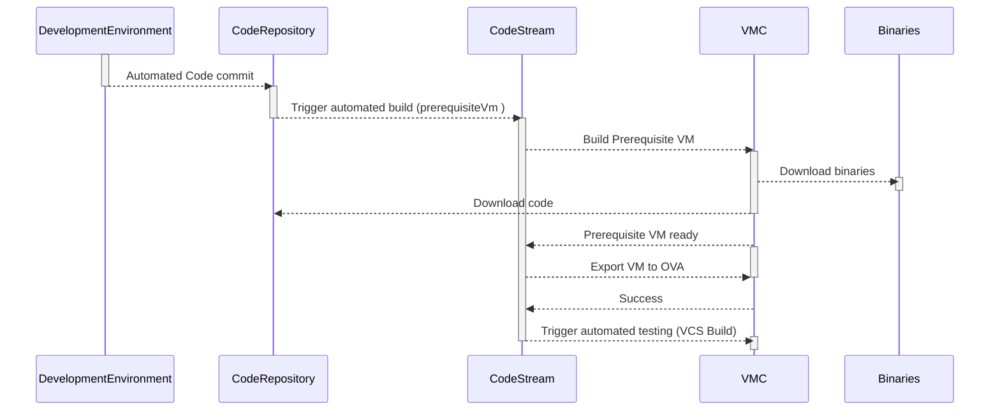
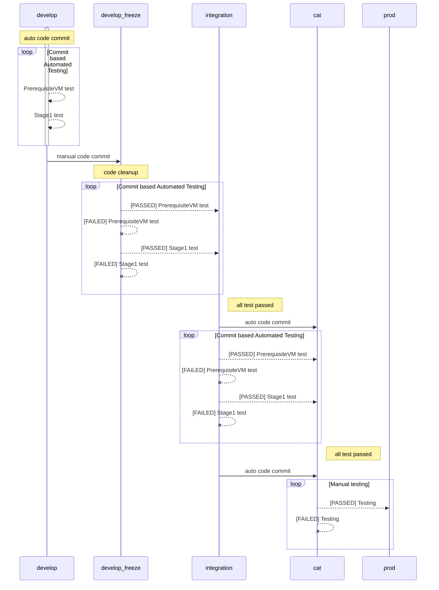
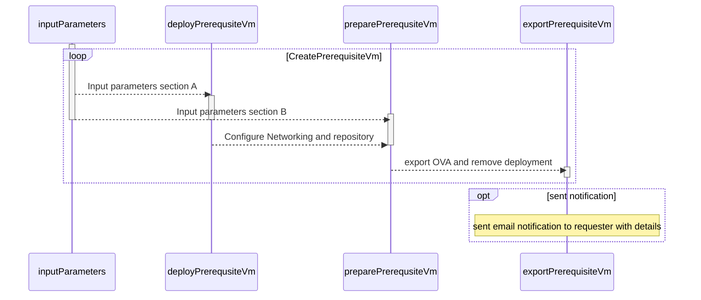
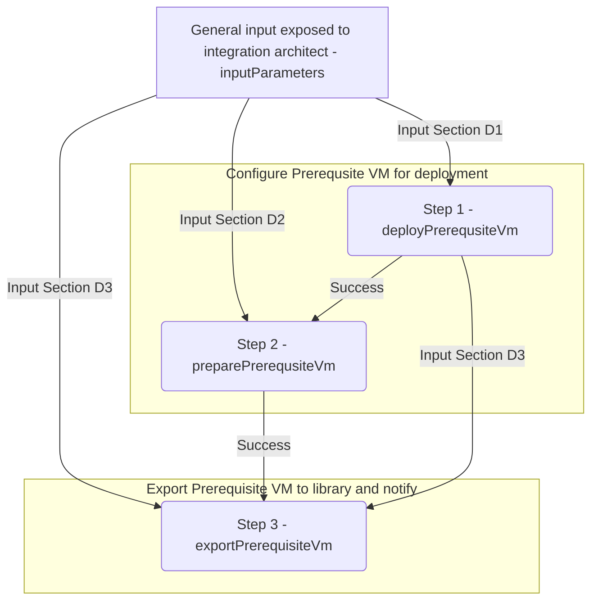
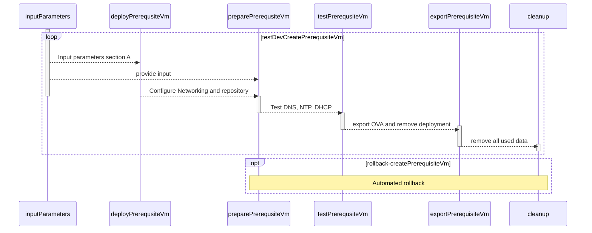
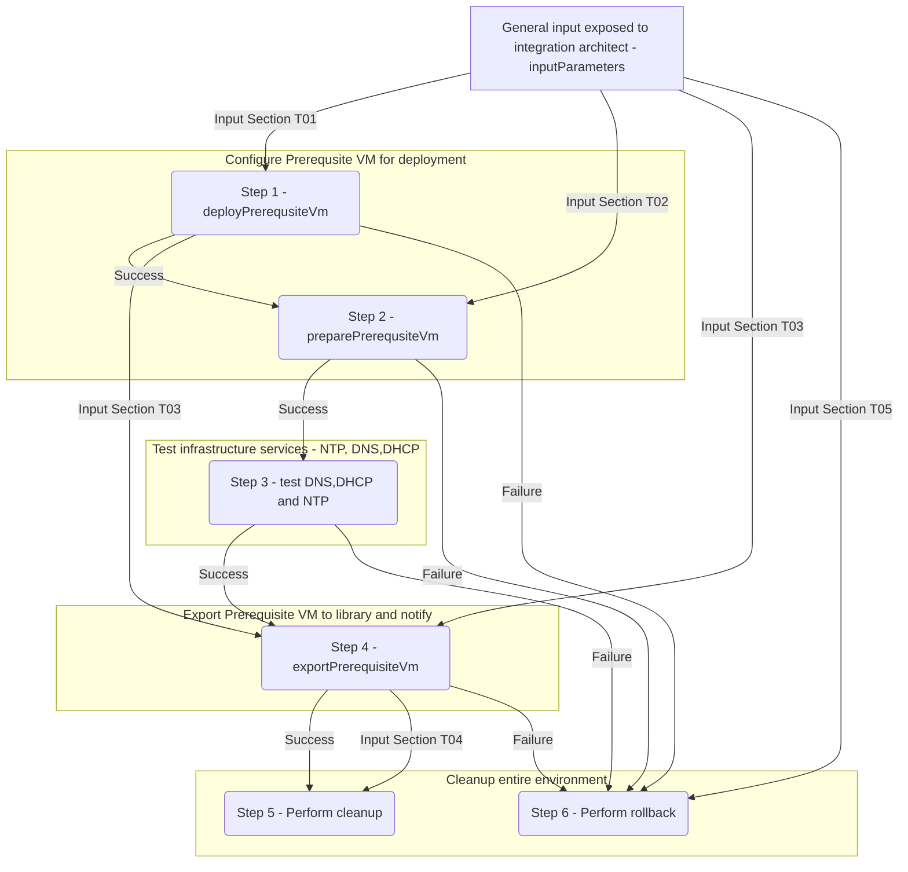
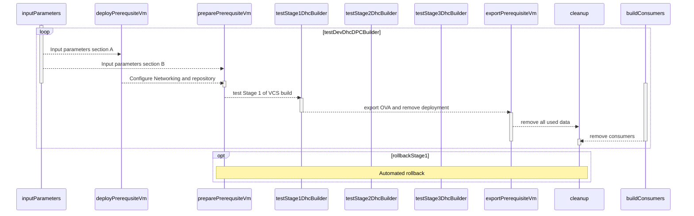
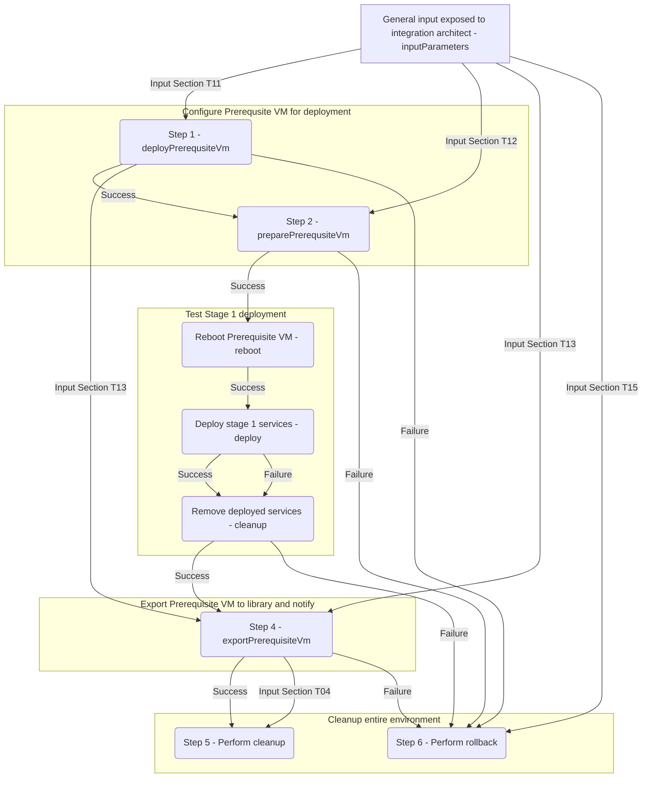

# CI/CD Pipelines LLD

- Table of Contents
{:toc}

# Introduction

## Purpose

The purpose of this document is to provide detailed design and architectural guidance required to implement validated model of a VCS CI/CD development pipelines in accordance with Atos standards and portfolio services. The principal aim of this document is to translate the high-level design (HLD) into a technical low-level design (LLD).
Design is providing component architecture overview in Architecture Overview chapter that provides basic building blocks and main principles, followed by  
Detailed Logical Design and finally Detailed Physical Design.
Architecture Overview provides basic building blocks and main design principles of presented design. It is covering known requirements cascaded from HLD and other LLDs.
Detailed Logical Design presents business logic, relations and fundamental design decisions.
Detailed Physical Design provides detailed configuration of components including POD type specifics.

## Audience

This document is intended for Atos ESO Cloud Services Engineers and Architects responsible for VMware Cloud Services (VCS) solution development and maintenance.

## Scope

This LLD is intended to cover below components and domains:

1. Development pipelines used for automated testing and escalation for tree development stages:

   - development
   - integration
   - testing (CAT)

   This LLD is not covering:

2. Production pipelines used for production customer

## Related Documents

This document is a subset of Atos Technology Lifecycle Management (ATLM) artefacts. All documents are stored in the VCS documentation repository.

##### ATLM Related Documents

| Document Name                                     |
|---------------------------------------------------|
| [hldDigitalHybridCloud](hldDigitalHybridCloud.md) |

## Requirement Levels

This document is following the principles below to categorize all requirements and design decisions.

|    Term    | Meaning                                                                                                                                                                                                                                                         |
|:----------:|-----------------------------------------------------------------------------------------------------------------------------------------------------------------------------------------------------------------------------------------------------------------|
|    MUST    | The definition is an absolute requirement of the specification                                                                                                                                                                                                  |
|  MUST NOT  | The definition is an absolute prohibition of the specification                                                                                                                                                                                                  |
|   SHOULD   | There may exist valid reasons in particular circumstances to ignore a particular item, but the full implications must be understood and carefully weighed before choosing a different course                                                                    |
| SHOULD NOT | There may exist valid reasons in particular circumstances when the particular behaviour is acceptable or even useful, but the full implications should be understood and the case carefully weighed before implementing any behaviour described with this label |
|    MAY     | Any design decisions that are not classified as MUST and SHOULD or covering optional feature that is not general available for VCS product                                                                                                                      |

# Architecture Overview

The diagrams below highlights VCS areas covered in this design. This document will cover the automated testing integration and design for VCS.

Below diagram presents communication logic for all CICD elements

Below diagram presents data transfer logic for VCS code

:warning:
Code is automatically pushed to develop branch on daily basis at 9:00 PM.  
Movement from development branch to integration is triggered by Lead Developers on Sprint basis by triggering code merge from develop to develop_freeze branch.

## Business and Solution Requirements

The table below provides known requirements mandatory to be incorporated into design decisions of VCS Secret Management described in this LLD.

##### Initial Requirements

|  ID  | Requirement description                                                                                         | Requirement Source | Requirement Level |
|:----:|-----------------------------------------------------------------------------------------------------------------|:------------------:|:-----------------:|
| R001 | Testing process is fully automated by intention and does not require human intervention for standard activities |      Business      |       MUST        |
| R002 | All test configuration elements are under version control and are reusable                                      |      Business      |       MUST        |
| R003 | Failed tests are automatically escalated to JIRA and assigned to ESO R&D                                        |      Business      |       MUST        |
| R004 | All tests are driven by simplicity and rely on out of the box functionality                                     |      Business      |      SHOULD       |

# Detailed Logical Design

## CICD Architecture overview

### Ansible driven

| Decision ID | Design Decision                                                                                                                                                         | Design Justification                                                       | Design Implication        |
|:-----------:|-------------------------------------------------------------------------------------------------------------------------------------------------------------------------|----------------------------------------------------------------------------|---------------------------|
|     001     | All ansible-based build pipelines are triggered by ansibleTrigger.py                                                                                                    | Extends standard dpc-builder capabilities for automated rollback           | code maintenance required |
|     002     | The above builder is representing build logic for several solutions and includes other playbooks in proper order of execution responsible for VCS automated deployment. | automation requirement                                                     | none                      |
|     003     | Functionality playbooks use roles to achieve expected state of service.                                                                                                 | VCS practice to organize functionality in order and allow for future reuse | none                      |
|     004     | Roles are shared and can be used by multiple playbooks.                                                                                                                 | Single source of truth and development sustainability                      | none                      |

### Cloud Automation Services driven

| Decision ID | Design Decision                                                                                                                       | Design Justification                       | Design Implication |
|:-----------:|---------------------------------------------------------------------------------------------------------------------------------------|--------------------------------------------|--------------------|
|     001     | Code stream based pipelines are used for automated generation of prerequisite Virtual Machine on demand per customer                  | Tool available out of the box in every VCS | none               |
|     002     | All details required for end to end deployment are defined by the Integration Architect and are auto-populated for the next pipelines | key automation requirement                 | none               |
|     003     | Code stream based pipelines are used for any LCM activities for the production VCS instance                                           | Tool available out of the box in every VCS | none               |

## Logical Design Security

### Logical Design Role Based Access Control

Atos based solutions must guarantee proper access management. Following design decisions are made in that area.  

##### Design Decisions RBAC

| Decision ID | Design Decision                                               | Design Justification                                                                                                | Design Implication |
|:-----------:|---------------------------------------------------------------|---------------------------------------------------------------------------------------------------------------------|--------------------|
|   rb-001    | Access to CICD environment will be separated on project level | That will allow consistency with git branches and granular access to development, integration and CAT environments. | none               |

### Logical Design Firewall

This section covers all firewall related decisions influencing content of that LLD.

##### Design Decisions Firewall

| Decision ID | Design Decision                                                        | Design Justification | Design Implication                        |
|:-----------:|------------------------------------------------------------------------|----------------------|-------------------------------------------|
|   fd-001    | pipelines and data is delivered as SaaS and are available via internet | SaaS services        | strong implementation of RBAC is required |

### Certificates

VCS is introducing dedicated Certificate Authority (CA). Below design decisions are taken in terms of certificate management for that LLD.

##### Design Decisions Certificates

| Decision ID | Design Decision                                | Design Justification                                                                                                  | Design Implication |
|:-----------:|------------------------------------------------|-----------------------------------------------------------------------------------------------------------------------|--------------------|
|   cd-001    | provider CA will be used for all SaaS services | Provider has signed CA. Product not allows to change certificate. Code repository is signed by Atos owned certificate | none               |

## Availability and Scalability

### Availability Design

The design decisions below are made to guarantee availability of VCS Management.

##### Design Decisions - Availability

| Decision ID | Design Decision                                                            | Design Justification          | Design Implication |
|:-----------:|----------------------------------------------------------------------------|-------------------------------|--------------------|
|   ad-001    | Provider SLA will be considered for vRA Cloud, Atos git and Google storage | SLA meet product requirements | none               |

### Scalability Design  

##### Design Decisions - Scalability

| Decision ID | Design Decision     | Design Justification                                                        | Design Implication |
|:-----------:|---------------------|-----------------------------------------------------------------------------|--------------------|
|   sd-001    | Use vendor defaults | inline with product requirements for vRA Cloud, Atos git and Google storage | none               |

## Recoverability

The chapter below provides detailed design choices to protect against data loose and backup functionality and against Datacenter failure.

### Component Failure  

##### Design Decisions - Component failure

| Decision ID | Design Decision                                                            | Design Justification          | Design Implication |
|:-----------:|----------------------------------------------------------------------------|-------------------------------|--------------------|
|   cf-001    | Provider SLA will be considered for vRA Cloud, Atos git and Google storage | SLA meet product requirements | none               |

## Multi-tenancy  

##### Design Decisions - Multi-tenancy

| Decision ID | Design Decision                                                     | Design Justification      | Design Implication |
|:-----------:|---------------------------------------------------------------------|---------------------------|--------------------|
|   mt-001    | Departmental segregation will be used for  for vRA Cloud            | Meet product requirements | none               |
|   mt-002    | Branch based segregation will be used for  for Atos code repository | Meet product requirements | none               |
|   mt-003    | No segregation will be used for  for binary repository              | Meet product requirements | none               |

## External Connection/System Requirements

The table below provides domain/components requirements for other components and domains to be taken into corresponding design decisions with requirement level in line with [requirements levels](#requirement-levels)

##### Design External Requirements

| Requirement ID | Requirement criticality                                                      | Requirement description                                                                                                          | Requirement Justification                                     |
|:--------------:|------------------------------------------------------------------------------|----------------------------------------------------------------------------------------------------------------------------------|---------------------------------------------------------------|
|     dr-001     | Connectivity between CICD elements must be available                         | CICD in general is maintained by 3 elements, Code stream, Google storage ane code repository.                                    | All components are mandatory for automation                   |
|     dr-002     | Connectivity to testing endpoints (VMC/vCF) via cloud proxy must be in place | Creation of prerequisite VM is done on VMC. Testing is triggered in VMC or dedicated vCF based endpoint in Atos Data Center (DC) | Endpoint must be inp place for automation build and run phase |

# Detailed Physical Design

## Pipelines

All code for pipelines is stored in dhc\pipelines repository.

### Preparation pipelines

Below pipeline is used for creation of VCS prerequisite machine

#### General variable flow D

#### Input Section D1

| Source        | key                 | value                      | Type      |
|---------------|---------------------|----------------------------|-----------|
| General Input | customerCode        | $input.customerCode        | Mandatory |
| General Input | locationCode        | $input.locationCode        | Mandatory |
| General Input | networkMgmtCidr     | $input.networkMgmtCidr     | Mandatory |
| General Input | networkMgmtGateway  | $input.networkMgmtGateway  | Mandatory |
| General Input | networkVrealizeCidr | $input.networkVrealizeCidr | Mandatory |

#### Input Section D2

| Source        | key                                   | value                                        | Type      |
|---------------|---------------------------------------|----------------------------------------------|-----------|
| General Input | customerCode                          | $input.customerCode                          | Mandatory |
| General Input | locationCode                          | $input.locationCode                          | Mandatory |
| General Input | dhcInstance                           | $input.dhcInstance                           | Mandatory |
| General Input | networkMgmtCidr                       | $input.networkMgmtCidr                       | Mandatory |
| General Input | networkMgmtGateway                    | $input.networkMgmtGateway                    | Mandatory |
| General Input | networkVrealizeCidr                   | $input.networkVrealizeCidr                   | Mandatory |
| General Input | InternetAccess                        | $input.InternetAccess                        | Mandatory |
| General Input | backupAmountofCustomerVms             | $input.backupAmountofCustomerVms             | Mandatory |
| General Input | backupAvamarServerFqdn                | $input.backupAvamarServerFqdn                | Mandatory |
| General Input | backupAvamarServerIP                  | $input.backupAvamarServerIP                  | Mandatory |
| General Input | backupDataDomainFqdn                  | $input.backupDataDomainFqdn                  | Mandatory |
| General Input | backupDataDomainIP                    | $input.backupDataDomainIP                    | Mandatory |
| General Input | backupEnableAvamarBackupofCustomerVms | $input.backupEnableAvamarBackupofCustomerVms | Mandatory |
| General Input | casAuthToken                          | $input.casAuthToken                          | Optional  |
| General Input | deepSecurityLinuxPolicyId             | $input.deepSecurityLinuxPolicyId             | Mandatory |
| General Input | deepSecurityTenantId                  | $input.deepSecurityTenantId                  | Mandatory |
| General Input | deepSecurityToken                     | $input.deepSecurityToken                     | Mandatory |
| General Input | deepSecurityWindowsPolicyId           | $input.deepSecurityWindowsPolicyId           | Mandatory |
| General Input | drType                                | $input.drType                                | Mandatory |
| General Input | enableWsusAutoPatchApproval           | $input.enableWsusAutoPatchApproval           | Mandatory |
| General Input | esxiLicense                           | $input.esxiLicense                           | Mandatory |
| General Input | externalProxyAuthMethod               | $input.externalProxyAuthMethod               | Optional  |
| General Input | externalProxyIp                       | $input.externalProxyIp                       | Optional  |
| General Input | externalProxyLogin                    | $input.externalProxyLogin                    | Optional  |
| General Input | externalProxyPassword                 | $input.externalProxyPassword                 | Optional  |
| General Input | externalProxyPort                     | $input.externalProxyPort                     | Optional  |
| General Input | infobloxLicense                       | $input.infobloxLicense                       | Mandatory |
| General Input | locationCodeDr                        | $input.locationCodeDr                        | Mandatory |
| General Input | networkEdgeCidr                       | $input.networkEdgeCidr                       | Mandatory |
| General Input | networkEdgeGateway                    | $input.networkEdgeGateway                    | Mandatory |
| General Input | networkEdgeNetmask                    | $input.networkEdgeNetmask                    | Mandatory |
| General Input | networkMgmtNetmask                    | $input.networkMgmtNetmask                    | Mandatory |
| General Input | networkMgmtVlan                       | $input.networkMgmtVlan                       | Mandatory |
| General Input | networkVmotionCidr                    | $input.networkVmotionCidr                    | Mandatory |
| General Input | networkVmotionNetmask                 | $input.networkVmotionNetmask                 | Mandatory |
| General Input | networkVmotionVlan                    | $input.networkVmotionVlan                    | Mandatory |
| General Input | networkVrealizeCidr                   | $input.networkVrealizeCidr                   | Mandatory |
| General Input | networkVrealizeVlan                   | $input.networkVrealizeVlan                   | Mandatory |
| General Input | networkVsanCidr                       | $input.networkVsanCidr                       | Mandatory |
| General Input | networkVsanGateway                    | $input.networkVsanGateway                    | Mandatory |
| General Input | networkVsanNetmask                    | $input.networkVsanNetmask                    | Mandatory |
| General Input | networkVsanVlan                       | $input.networkVsanVlan                       | Mandatory |
| General Input | networkVxlanCidr                      | $input.networkVxlanCidr                      | Mandatory |
| General Input | networkVxlanVlan                      | $input.networkVxlanVlan                      | Mandatory |
| General Input | networkVxlanNetmask                   | $input.networkVxlanNetmask                   | Mandatory |
| General Input | nsxBgpAsNumber                        | $input.nsxBgpAsNumber                        | Mandatory |
| General Input | nsxBgpOrStatic                        | $input.nsxBgpOrStatic                        | Mandatory |
| General Input | nsxEnableDefaultLogicalSwitchesBuild  | $input.nsxEnableDefaultLogicalSwitchesBuild  | Mandatory |
| General Input | nsxNeighborAsNumber                   | $input.nsxNeighborAsNumber                   | Mandatory |
| General Input | nsxNeighborIp                         | $input.nsxNeighborIp                         | Mandatory |
| General Input | nsxNeighborName                       | $input.nsxNeighborName                       | Mandatory |
| General Input | nsxStaticRouteDescription             | $input.nsxStaticRouteDescription             | Mandatory |
| General Input | nsxStaticRouteName                    | $input.nsxStaticRouteName                    | Mandatory |
| General Input | nsxStaticRouteNetwork                 | $input.nsxStaticRouteNetwork                 | Mandatory |
| General Input | nsxStaticRouteNextHopAddress          | $input.nsxStaticRouteNextHopAddress          | Mandatory |
| General Input | nsxT0uplinkIp                         | $input.nsxT0uplinkIp                         | Mandatory |
| General Input | nsxT0uplinkSubnetPrefixLenght         | $input.nsxT0uplinkSubnetPrefixLenght         | Mandatory |
| General Input | nsxVlan                               | $input.nsxVlan                               | Mandatory |
| General Input | nsxtLicense                           | $input.nsxtLicense                           | Mandatory |
| General Input | numberOfComputeHostsInWorkloadDomain  | $input.numberOfComputeHostsInWorkloadDomain  | Mandatory |
| General Input | numberOfManagementHosts               | $input.numberOfManagementHosts               | Mandatory |
| General Input | snowEvaniosArangoDb                   | $input.snowEvaniosArangoDb                   | Optional  |
| General Input | snowInstanceUrl                       | $input.snowInstanceUrl                       | Optional  |
| General Input | snowUser                              | $input.snowUser                              | Optional  |
| General Input | snowUserPassword                      | $input.snowUserPassword                      | Optional  |
| General Input | temporaryPassword                     | $input.temporaryPassword                     | Mandatory |
| General Input | vcsComputeLicense                     | $input.vcsComputeLicense                     | Mandatory |
| General Input | vidmLicense                           | $input.vidmLicense                           | Mandatory |
| General Input | vmwareUser                            | $input.vmwareUser                            | Mandatory |
| General Input | vmwareUserPassword                    | $input.vmwareUserPassword                    | Mandatory |
| General Input | vrliLicenseKeyForCmpCluster           | $input.vrliLicenseKeyForCmpCluster           | Mandatory |
| General Input | vropsLicense                          | $input.vropsLicense                          | Mandatory |
| General Input | vsanComputeLicense                    | $input.vsanComputeLicense                    | Mandatory |
| General Input | vsanEncryption                        | $input.vsanEncryption                        | Mandatory |
|               |                                       |                                              |           |
| Predefined    | applianceRootUsername                 | root                                         | Mandatory |
| Predefined    | applianceUsername                     | admin                                        | Mandatory |
| Predefined    | backupServerUsername                  | backup                                       | Mandatory |
| Predefined    | computeHostsStartCidr                 | 111                                          | Mandatory |
| Predefined    | defaultPasswordChars                  | ascii_letters,digits                         | Mandatory |
| Predefined    | dhcReports                            | /opt/nessus/var/dhcReports                   | Mandatory |
| Predefined    | dpcDomainPrefix                       | dhc01.next                                   | Mandatory |
| Predefined    | groupVarsAllName                      | all                                          | Mandatory |
| Predefined    | groupVarsPath                         | /opt/dhc/deploy/group_vars/                  | Mandatory |
| Predefined    | imagesRepositoryPath                  | /opt/binaries                                | Mandatory |
| Predefined    | linuxUsername                         | next                                         | Mandatory |
| Predefined    | managementHostsStartCidr              | 101                                          | Mandatory |
| Predefined    | networkEdgeMtu                        | 9000                                         | Mandatory |
| Predefined    | networkEdgeRangeEnd                   | 140                                          | Mandatory |
| Predefined    | networkEdgeRangeStart                 | 10                                           | Mandatory |
| Predefined    | networkEdgeVlan                       | 127                                          | Mandatory |
| Predefined    | networkMgmtGateway                    | 1                                            | Mandatory |
| Predefined    | networkMgmtMtu                        | 1500                                         | Mandatory |
| Predefined    | networkMgmtPgName                     | SDDC-DPortGroup-Mgmt                         | Mandatory |
| Predefined    | networkVmotionGateway                 | 1                                            | Mandatory |
| Predefined    | networkVmotionMtu                     | 9000                                         | Mandatory |
| Predefined    | networkVrealizeMtu                    | 9000                                         | Mandatory |
| Predefined    | networkVsanPgName                     | SDDC-DPortGroup-VSAN                         | Mandatory |
| Predefined    | networkVxlanDhcpIp                    | 1                                            | Mandatory |
| Predefined    | networkVxlanGw                        | 9000                                         | Mandatory |
| Predefined    | networkVxlanPgName                    | VXLAN (VTEP) - DHCP Network                  | Mandatory |
| Predefined    | networkVxlanRangeEnd                  | 120                                          | Mandatory |
| Predefined    | networkVxlanRangeStart                | 20                                           | Mandatory |
| Predefined    | nsxtApiBackupHourOfDay                | 23                                           | Mandatory |
| Predefined    | nsxtApiBackupMinuteOfDay              | 0                                            | Mandatory |
| Predefined    | ntpTimezone                           | Etc/UTC                                      | Mandatory |
| Predefined    | passwordLength                        | 16                                           | Mandatory |
| Predefined    | storageType                           | VSAN                                         | Mandatory |
| Predefined    | templateNameLinux                     | DPC.Next_Linux                               | Mandatory |
| Predefined    | templateNameWindows                   | GlobalImage_w2k16                            | Mandatory |
| Predefined    | vCenterTemplateFolder                 | /vm/Templates                                | Mandatory |
| Predefined    | vCenterCluster                        | ${input.locationCode}-m01-mgmt01             | Mandatory |
| Predefined    | vCenterDataCenter                     | ${input.locationCode}-m01-dc                 | Mandatory |
| Predefined    | vCenterDatastore                      | ${input.locationCode}-m01-vsan01             | Mandatory |
| Predefined    | vCenterResourcePool                   | ${input.locationCode}-m01-sddc-mgmt          | Mandatory |
| Predefined    | vCenterUser                           | `administrator@vsphere.local`                | Mandatory |
| Predefined    | vCenterVmFolder                       | /vm/Management VMs                           | Mandatory |
| Predefined    | vcs001NetworkMgmtCidr                 | $input.networkMgmtCidr                       | Mandatory |
| Predefined    | vcs001Octet                           | 20                                           | Mandatory |
| Predefined    | vcs002NetworkMgmtCidr                 | $input.networkMgmtCidr                       | Mandatory |
| Predefined    | vcs002Octet                           | 60                                           | Mandatory |
| Predefined    | vsanWitnessGateway                    |                                              | Mandatory |
| Predefined    | vsanWitnessMgmtIpAddress              |                                              | Mandatory |
| Predefined    | vsanWitnessMgmtNetworkCidr            |                                              | Mandatory |
| Predefined    | vsanWitnessName                       |                                              | Mandatory |
| Predefined    | vsanWitnessNetmask                    |                                              | Mandatory |
| Predefined    | vsanWitnessNetworkIpAddress           |                                              | Mandatory |
| Predefined    | vsanWitnessSize                       |                                              | Mandatory |
| Predefined    | vsanWitnessVsanIpAddress              |                                              | Mandatory |
| Predefined    | windowsUsername                       | administrator                                | Mandatory |

### Input Section D3

| Source        | key          | value                                           | Type      |
|---------------|--------------|-------------------------------------------------|-----------|
| General Input | customerCode | $input.customerCode                             | Mandatory |
| General Input | locationCode | $input.locationCode                             | Mandatory |
| Section #1    | vmId         | $prereqVm.deploy.output.outputProperties.vmId   | Mandatory |
| Section #1    | vmName       | $prereqVm.deploy.output.outputProperties.vmName | Mandatory |

### Testing pipelines

Currently below testing pipelines are created for HDC purpose.

### Prerequisite VM testing pipeline

#### General variable flow T0

#### Input Section T01

| Source        | key                 | value                      | Type      |
|---------------|---------------------|----------------------------|-----------|
| General Input | customerCode        | $input.customerCode        | Mandatory |
| General Input | locationCode        | $input.locationCode        | Mandatory |
| General Input | networkMgmtCidr     | $input.networkMgmtCidr     | Mandatory |
| General Input | networkMgmtGateway  | $input.networkMgmtGateway  | Mandatory |
| General Input | networkVrealizeCidr | $input.networkVrealizeCidr | Mandatory |

#### Input Section T02

| Source        | key                                   | value                                        | Type      |
|---------------|---------------------------------------|----------------------------------------------|-----------|
| General Input | customerCode                          | $input.customerCode                          | Mandatory |
| General Input | locationCode                          | $input.locationCode                          | Mandatory |
| General Input | dhcInstance                           | $input.dhcInstance                           | Mandatory |
| General Input | networkMgmtCidr                       | $input.networkMgmtCidr                       | Mandatory |
| General Input | networkMgmtGateway                    | $input.networkMgmtGateway                    | Mandatory |
| General Input | networkVrealizeCidr                   | $input.networkVrealizeCidr                   | Mandatory |
| General Input | InternetAccess                        | $input.InternetAccess                        | Mandatory |
| General Input | backupAmountofCustomerVms             | $input.backupAmountofCustomerVms             | Mandatory |
| General Input | backupAvamarServerFqdn                | $input.backupAvamarServerFqdn                | Mandatory |
| General Input | backupAvamarServerIP                  | $input.backupAvamarServerIP                  | Mandatory |
| General Input | backupDataDomainFqdn                  | $input.backupDataDomainFqdn                  | Mandatory |
| General Input | backupDataDomainIP                    | $input.backupDataDomainIP                    | Mandatory |
| General Input | backupEnableAvamarBackupofCustomerVms | $input.backupEnableAvamarBackupofCustomerVms | Mandatory |
| General Input | casAuthToken                          | $input.casAuthToken                          | Optional  |
| General Input | deepSecurityLinuxPolicyId             | $input.deepSecurityLinuxPolicyId             | Mandatory |
| General Input | deepSecurityTenantId                  | $input.deepSecurityTenantId                  | Mandatory |
| General Input | deepSecurityToken                     | $input.deepSecurityToken                     | Mandatory |
| General Input | deepSecurityWindowsPolicyId           | $input.deepSecurityWindowsPolicyId           | Mandatory |
| General Input | drType                                | $input.drType                                | Mandatory |
| General Input | enableWsusAutoPatchApproval           | $input.enableWsusAutoPatchApproval           | Mandatory |
| General Input | esxiLicense                           | $input.esxiLicense                           | Mandatory |
| General Input | externalProxyAuthMethod               | $input.externalProxyAuthMethod               | Optional  |
| General Input | externalProxyIp                       | $input.externalProxyIp                       | Optional  |
| General Input | externalProxyLogin                    | $input.externalProxyLogin                    | Optional  |
| General Input | externalProxyPassword                 | $input.externalProxyPassword                 | Optional  |
| General Input | externalProxyPort                     | $input.externalProxyPort                     | Optional  |
| General Input | infobloxLicense                       | $input.infobloxLicense                       | Mandatory |
| General Input | locationCodeDr                        | $input.locationCodeDr                        | Mandatory |
| General Input | networkEdgeCidr                       | $input.networkEdgeCidr                       | Mandatory |
| General Input | networkEdgeGateway                    | $input.networkEdgeGateway                    | Mandatory |
| General Input | networkEdgeNetmask                    | $input.networkEdgeNetmask                    | Mandatory |
| General Input | networkMgmtNetmask                    | $input.networkMgmtNetmask                    | Mandatory |
| General Input | networkMgmtVlan                       | $input.networkMgmtVlan                       | Mandatory |
| General Input | networkVmotionCidr                    | $input.networkVmotionCidr                    | Mandatory |
| General Input | networkVmotionNetmask                 | $input.networkVmotionNetmask                 | Mandatory |
| General Input | networkVmotionVlan                    | $input.networkVmotionVlan                    | Mandatory |
| General Input | networkVrealizeCidr                   | $input.networkVrealizeCidr                   | Mandatory |
| General Input | networkVrealizeVlan                   | $input.networkVrealizeVlan                   | Mandatory |
| General Input | networkVsanCidr                       | $input.networkVsanCidr                       | Mandatory |
| General Input | networkVsanGateway                    | $input.networkVsanGateway                    | Mandatory |
| General Input | networkVsanNetmask                    | $input.networkVsanNetmask                    | Mandatory |
| General Input | networkVsanVlan                       | $input.networkVsanVlan                       | Mandatory |
| General Input | networkVxlanCidr                      | $input.networkVxlanCidr                      | Mandatory |
| General Input | networkVxlanVlan                      | $input.networkVxlanVlan                      | Mandatory |
| General Input | networkVxlanNetmask                   | $input.networkVxlanNetmask                   | Mandatory |
| General Input | nsxBgpAsNumber                        | $input.nsxBgpAsNumber                        | Mandatory |
| General Input | nsxBgpOrStatic                        | $input.nsxBgpOrStatic                        | Mandatory |
| General Input | nsxEnableDefaultLogicalSwitchesBuild  | $input.nsxEnableDefaultLogicalSwitchesBuild  | Mandatory |
| General Input | nsxNeighborAsNumber                   | $input.nsxNeighborAsNumber                   | Mandatory |
| General Input | nsxNeighborIp                         | $input.nsxNeighborIp                         | Mandatory |
| General Input | nsxNeighborName                       | $input.nsxNeighborName                       | Mandatory |
| General Input | nsxStaticRouteDescription             | $input.nsxStaticRouteDescription             | Mandatory |
| General Input | nsxStaticRouteName                    | $input.nsxStaticRouteName                    | Mandatory |
| General Input | nsxStaticRouteNetwork                 | $input.nsxStaticRouteNetwork                 | Mandatory |
| General Input | nsxStaticRouteNextHopAddress          | $input.nsxStaticRouteNextHopAddress          | Mandatory |
| General Input | nsxT0uplinkIp                         | $input.nsxT0uplinkIp                         | Mandatory |
| General Input | nsxT0uplinkSubnetPrefixLenght         | $input.nsxT0uplinkSubnetPrefixLenght         | Mandatory |
| General Input | nsxVlan                               | $input.nsxVlan                               | Mandatory |
| General Input | nsxtLicense                           | $input.nsxtLicense                           | Mandatory |
| General Input | numberOfComputeHostsInWorkloadDomain  | $input.numberOfComputeHostsInWorkloadDomain  | Mandatory |
| General Input | numberOfManagementHosts               | $input.numberOfManagementHosts               | Mandatory |
| General Input | snowEvaniosArangoDb                   | $input.snowEvaniosArangoDb                   | Optional  |
| General Input | snowInstanceUrl                       | $input.snowInstanceUrl                       | Optional  |
| General Input | snowUser                              | $input.snowUser                              | Optional  |
| General Input | snowUserPassword                      | $input.snowUserPassword                      | Optional  |
| General Input | temporaryPassword                     | $input.temporaryPassword                     | Mandatory |
| General Input | vcsComputeLicense                     | $input.vcsComputeLicense                     | Mandatory |
| General Input | vidmLicense                           | $input.vidmLicense                           | Mandatory |
| General Input | vmwareUser                            | $input.vmwareUser                            | Mandatory |
| General Input | vmwareUserPassword                    | $input.vmwareUserPassword                    | Mandatory |
| General Input | vrliLicenseKeyForCmpCluster           | $input.vrliLicenseKeyForCmpCluster           | Mandatory |
| General Input | vropsLicense                          | $input.vropsLicense                          | Mandatory |
| General Input | vsanComputeLicense                    | $input.vsanComputeLicense                    | Mandatory |
| General Input | vsanEncryption                        | $input.vsanEncryption                        | Mandatory |
|               |                                       |                                              |           |
| Predefined    | applianceRootUsername                 | root                                         | Mandatory |
| Predefined    | applianceUsername                     | admin                                        | Mandatory |
| Predefined    | backupServerUsername                  | backup                                       | Mandatory |
| Predefined    | computeHostsStartCidr                 | 111                                          | Mandatory |
| Predefined    | defaultPasswordChars                  | ascii_letters,digits                         | Mandatory |
| Predefined    | dhcReports                            | /opt/nessus/var/dhcReports                   | Mandatory |
| Predefined    | dpcDomainPrefix                       | dhc01.next                                   | Mandatory |
| Predefined    | groupVarsAllName                      | all                                          | Mandatory |
| Predefined    | groupVarsPath                         | /opt/dhc/deploy/group_vars/                  | Mandatory |
| Predefined    | imagesRepositoryPath                  | /opt/binaries                                | Mandatory |
| Predefined    | linuxUsername                         | next                                         | Mandatory |
| Predefined    | managementHostsStartCidr              | 101                                          | Mandatory |
| Predefined    | networkEdgeMtu                        | 9000                                         | Mandatory |
| Predefined    | networkEdgeRangeEnd                   | 140                                          | Mandatory |
| Predefined    | networkEdgeRangeStart                 | 10                                           | Mandatory |
| Predefined    | networkEdgeVlan                       | 127                                          | Mandatory |
| Predefined    | networkMgmtGateway                    | 1                                            | Mandatory |
| Predefined    | networkMgmtMtu                        | 1500                                         | Mandatory |
| Predefined    | networkMgmtPgName                     | SDDC-DPortGroup-Mgmt                         | Mandatory |
| Predefined    | networkVmotionGateway                 | 1                                            | Mandatory |
| Predefined    | networkVmotionMtu                     | 9000                                         | Mandatory |
| Predefined    | networkVrealizeMtu                    | 9000                                         | Mandatory |
| Predefined    | networkVsanPgName                     | SDDC-DPortGroup-VSAN                         | Mandatory |
| Predefined    | networkVxlanDhcpIp                    | 1                                            | Mandatory |
| Predefined    | networkVxlanGw                        | 9000                                         | Mandatory |
| Predefined    | networkVxlanPgName                    | VXLAN (VTEP) - DHCP Network                  | Mandatory |
| Predefined    | networkVxlanRangeEnd                  | 120                                          | Mandatory |
| Predefined    | networkVxlanRangeStart                | 20                                           | Mandatory |
| Predefined    | nsxtApiBackupHourOfDay                | 23                                           | Mandatory |
| Predefined    | nsxtApiBackupMinuteOfDay              | 0                                            | Mandatory |
| Predefined    | ntpTimezone                           | Etc/UTC                                      | Mandatory |
| Predefined    | passwordLength                        | 16                                           | Mandatory |
| Predefined    | storageType                           | VSAN                                         | Mandatory |
| Predefined    | templateNameLinux                     | DPC.Next_Linux                               | Mandatory |
| Predefined    | templateNameWindows                   | GlobalImage_w2k16                            | Mandatory |
| Predefined    | vCenterCluster                        | ${input.locationCode}-m01-mgmt01             | Mandatory |
| Predefined    | vCenterDataCenter                     | ${input.locationCode}-m01-dc                 | Mandatory |
| Predefined    | vCenterDatastore                      | ${input.locationCode}-m01-vsan01             | Mandatory |
| Predefined    | vCenterResourcePool                   | ${input.locationCode}-m01-sddc-mgmt          | Mandatory |
| Predefined    | vCenterTemplateFolder                 | /vm/Templates                                | Mandatory |
| Predefined    | vCenterUser                           | `administrator@vsphere.local`                | Mandatory |
| Predefined    | vCenterVmFolder                       | /vm/Management VMs                           | Mandatory |
| Predefined    | vcs001NetworkMgmtCidr                 | $input.networkMgmtCidr                       | Mandatory |
| Predefined    | vcs001Octet                           | 20                                           | Mandatory |
| Predefined    | vcs002NetworkMgmtCidr                 | $input.networkMgmtCidr                       | Mandatory |
| Predefined    | vcs002Octet                           | 60                                           | Mandatory |
| Predefined    | vsanWitnessGateway                    |                                              | Mandatory |
| Predefined    | vsanWitnessMgmtIpAddress              |                                              | Mandatory |
| Predefined    | vsanWitnessMgmtNetworkCidr            |                                              | Mandatory |
| Predefined    | vsanWitnessName                       |                                              | Mandatory |
| Predefined    | vsanWitnessNetmask                    |                                              | Mandatory |
| Predefined    | vsanWitnessNetworkIpAddress           |                                              | Mandatory |
| Predefined    | vsanWitnessSize                       |                                              | Mandatory |
| Predefined    | vsanWitnessVsanIpAddress              |                                              | Mandatory |
| Predefined    | windowsUsername                       | administrator                                | Mandatory |

### Input Section T03

| Source        | key          | value                                           | Type      |
|---------------|--------------|-------------------------------------------------|-----------|
| General Input | customerCode | $input.customerCode                             | Mandatory |
| General Input | locationCode | $input.locationCode                             | Mandatory |
| Section #1    | vmId         | $prereqVm.deploy.output.outputProperties.vmId   | Mandatory |
| Section #1    | vmName       | $prereqVm.deploy.output.outputProperties.vmName | Mandatory |

#### Input Section T04

| Source             | key   | value                                           | Type      |
|--------------------|-------|-------------------------------------------------|-----------|
| exportPrequisiteVm | ovaId | $export.configure.output.outputProperties.ovaId | Mandatory |

### Input Section T05

| Source        | key          | value               | Type      |
|---------------|--------------|---------------------|-----------|
| General Input | customerCode | $input.customerCode | Mandatory |
| General Input | locationCode | $input.locationCode | Mandatory |

#### Deployment testing pipeline

#### General variable flow T1

#### Input Section T11

| Source        | key                 | value                      | Type      |
|---------------|---------------------|----------------------------|-----------|
| General Input | customerCode        | $input.customerCode        | Mandatory |
| General Input | locationCode        | $input.locationCode        | Mandatory |
| General Input | networkMgmtCidr     | $input.networkMgmtCidr     | Mandatory |
| General Input | networkMgmtGateway  | $input.networkMgmtGateway  | Mandatory |
| General Input | networkVrealizeCidr | $input.networkVrealizeCidr | Mandatory |

#### Input Section T12

| Source              | key                                   | value                                                       | Type      |
|---------------------|---------------------------------------|-------------------------------------------------------------|-----------|
| General Input       | customerCode                          | $input.customerCode                                         | Mandatory |
| General Input       | locationCode                          | $input.locationCode                                         | Mandatory |
| General Input       | dhcInstance                           | $input.dhcInstance                                          | Mandatory |
| General Input       | networkMgmtCidr                       | $input.networkMgmtCidr                                      | Mandatory |
| General Input       | networkMgmtGateway                    | $input.networkMgmtGateway                                   | Mandatory |
| General Input       | networkVrealizeCidr                   | $input.networkVrealizeCidr                                  | Mandatory |
| General Input       | InternetAccess                        | $input.InternetAccess                                       | Mandatory |
| General Input       | backupAmountofCustomerVms             | $input.backupAmountofCustomerVms                            | Mandatory |
| General Input       | backupAvamarServerFqdn                | $input.backupAvamarServerFqdn                               | Mandatory |
| General Input       | backupAvamarServerIP                  | $input.backupAvamarServerIP                                 | Mandatory |
| General Input       | backupDataDomainFqdn                  | $input.backupDataDomainFqdn                                 | Mandatory |
| General Input       | backupDataDomainIP                    | $input.backupDataDomainIP                                   | Mandatory |
| General Input       | backupEnableAvamarBackupofCustomerVms | $input.backupEnableAvamarBackupofCustomerVms                | Mandatory |
| General Input       | casAuthToken                          | $input.casAuthToken                                         | Optional  |
| General Input       | deepSecurityLinuxPolicyId             | $input.deepSecurityLinuxPolicyId                            | Mandatory |
| General Input       | deepSecurityTenantId                  | $input.deepSecurityTenantId                                 | Mandatory |
| General Input       | deepSecurityToken                     | $input.deepSecurityToken                                    | Mandatory |
| General Input       | deepSecurityWindowsPolicyId           | $input.deepSecurityWindowsPolicyId                          | Mandatory |
| General Input       | drType                                | $input.drType                                               | Mandatory |
| General Input       | enableWsusAutoPatchApproval           | $input.enableWsusAutoPatchApproval                          | Mandatory |
| General Input       | esxiLicense                           | $input.esxiLicense                                          | Mandatory |
| General Input       | externalProxyAuthMethod               | $input.externalProxyAuthMethod                              | Optional  |
| General Input       | externalProxyIp                       | $input.externalProxyIp                                      | Optional  |
| General Input       | externalProxyLogin                    | $input.externalProxyLogin                                   | Optional  |
| General Input       | externalProxyPassword                 | $input.externalProxyPassword                                | Optional  |
| General Input       | externalProxyPort                     | $input.externalProxyPort                                    | Optional  |
| General Input       | infobloxLicense                       | $input.infobloxLicense                                      | Mandatory |
| General Input       | locationCodeDr                        | $input.locationCodeDr                                       | Mandatory |
| General Input       | networkEdgeCidr                       | $input.networkEdgeCidr                                      | Mandatory |
| General Input       | networkEdgeGateway                    | $input.networkEdgeGateway                                   | Mandatory |
| General Input       | networkEdgeNetmask                    | $input.networkEdgeNetmask                                   | Mandatory |
| General Input       | networkMgmtNetmask                    | $input.networkMgmtNetmask                                   | Mandatory |
| General Input       | networkMgmtVlan                       | $input.networkMgmtVlan                                      | Mandatory |
| General Input       | networkVmotionCidr                    | $input.networkVmotionCidr                                   | Mandatory |
| General Input       | networkVmotionNetmask                 | $input.networkVmotionNetmask                                | Mandatory |
| General Input       | networkVmotionVlan                    | $input.networkVmotionVlan                                   | Mandatory |
| General Input       | networkVrealizeCidr                   | $input.networkVrealizeCidr                                  | Mandatory |
| General Input       | networkVrealizeVlan                   | $input.networkVrealizeVlan                                  | Mandatory |
| General Input       | networkVsanCidr                       | $input.networkVsanCidr                                      | Mandatory |
| General Input       | networkVsanGateway                    | $input.networkVsanGateway                                   | Mandatory |
| General Input       | networkVsanNetmask                    | $input.networkVsanNetmask                                   | Mandatory |
| General Input       | networkVsanVlan                       | $input.networkVsanVlan                                      | Mandatory |
| General Input       | networkVxlanCidr                      | $input.networkVxlanCidr                                     | Mandatory |
| General Input       | networkVxlanVlan                      | $input.networkVxlanVlan                                     | Mandatory |
| General Input       | networkVxlanNetmask                   | $input.networkVxlanNetmask                                  | Mandatory |
| General Input       | nsxBgpAsNumber                        | $input.nsxBgpAsNumber                                       | Mandatory |
| General Input       | nsxBgpOrStatic                        | $input.nsxBgpOrStatic                                       | Mandatory |
| General Input       | nsxEnableDefaultLogicalSwitchesBuild  | $input.nsxEnableDefaultLogicalSwitchesBuild                 | Mandatory |
| General Input       | nsxNeighborAsNumber                   | $input.nsxNeighborAsNumber                                  | Mandatory |
| General Input       | nsxNeighborIp                         | $input.nsxNeighborIp                                        | Mandatory |
| General Input       | nsxNeighborName                       | $input.nsxNeighborName                                      | Mandatory |
| General Input       | nsxStaticRouteDescription             | $input.nsxStaticRouteDescription                            | Mandatory |
| General Input       | nsxStaticRouteName                    | $input.nsxStaticRouteName                                   | Mandatory |
| General Input       | nsxStaticRouteNetwork                 | $input.nsxStaticRouteNetwork                                | Mandatory |
| General Input       | nsxStaticRouteNextHopAddress          | $input.nsxStaticRouteNextHopAddress                         | Mandatory |
| General Input       | nsxT0uplinkIp                         | $input.nsxT0uplinkIp                                        | Mandatory |
| General Input       | nsxT0uplinkSubnetPrefixLenght         | $input.nsxT0uplinkSubnetPrefixLenght                        | Mandatory |
| General Input       | nsxVlan                               | $input.nsxVlan                                              | Mandatory |
| General Input       | nsxtLicense                           | $input.nsxtLicense                                          | Mandatory |
| General Input       | numberOfComputeHostsInWorkloadDomain  | $input.numberOfComputeHostsInWorkloadDomain                 | Mandatory |
| General Input       | numberOfManagementHosts               | $input.numberOfManagementHosts                              | Mandatory |
| General Input       | snowEvaniosArangoDb                   | $input.snowEvaniosArangoDb                                  | Optional  |
| General Input       | snowInstanceUrl                       | $input.snowInstanceUrl                                      | Optional  |
| General Input       | snowUser                              | $input.snowUser                                             | Optional  |
| General Input       | snowUserPassword                      | $input.snowUserPassword                                     | Optional  |
| General Input       | temporaryPassword                     | $input.temporaryPassword                                    | Mandatory |
| General Input       | vcsComputeLicense                     | $input.vcsComputeLicense                                    | Mandatory |
| General Input       | vidmLicense                           | $input.vidmLicense                                          | Mandatory |
| General Input       | vmwareUser                            | $input.vmwareUser                                           | Mandatory |
| General Input       | vmwareUserPassword                    | $input.vmwareUserPassword                                   | Mandatory |
| General Input       | vrliLicenseKeyForCmpCluster           | $input.vrliLicenseKeyForCmpCluster                          | Mandatory |
| General Input       | vropsLicense                          | $input.vropsLicense                                         | Mandatory |
| General Input       | vsanComputeLicense                    | $input.vsanComputeLicense                                   | Mandatory |
| General Input       | vsanEncryption                        | $input.vsanEncryption                                       | Mandatory |
|                     |                                       |                                                             |           |
| Predefined          | applianceRootUsername                 | root                                                        | Mandatory |
| Predefined          | applianceUsername                     | admin                                                       | Mandatory |
| Predefined          | backupServerUsername                  | backup                                                      | Mandatory |
| Predefined          | computeHostsStartCidr                 | 111                                                         | Mandatory |
| Predefined          | defaultPasswordChars                  | ascii_letters,digits                                        | Mandatory |
| Predefined          | dhcReports                            | /opt/nessus/var/dhcReports                                  | Mandatory |
| Predefined          | dpcDomainPrefix                       | dhc01.next                                                  | Mandatory |
| Predefined          | groupVarsAllName                      | all                                                         | Mandatory |
| Predefined          | groupVarsPath                         | /opt/dhc/deploy/group_vars/                                 | Mandatory |
| Predefined          | imagesRepositoryPath                  | /opt/binaries                                               | Mandatory |
| Predefined          | linuxUsername                         | next                                                        | Mandatory |
| Predefined          | managementHostsStartCidr              | 101                                                         | Mandatory |
| Predefined          | networkEdgeMtu                        | 9000                                                        | Mandatory |
| Predefined          | networkEdgeRangeEnd                   | 140                                                         | Mandatory |
| Predefined          | networkEdgeRangeStart                 | 10                                                          | Mandatory |
| Predefined          | networkEdgeVlan                       | 127                                                         | Mandatory |
| Predefined          | networkMgmtGateway                    | 1                                                           | Mandatory |
| Predefined          | networkMgmtMtu                        | 1500                                                        | Mandatory |
| deployPrerequsiteVm | networkMgmtPgName                     | $build.create.output.outputProperties.networkMgmtPgName     | Mandatory |
| Predefined          | networkVmotionGateway                 | 1                                                           | Mandatory |
| Predefined          | networkVmotionMtu                     | 9000                                                        | Mandatory |
| Predefined          | networkVrealizeMtu                    | 9000                                                        | Mandatory |
| deployPrerequsiteVm | networkVrealizePgName                 | $build.create.output.outputProperties.networkVrealizePgName | Mandatory |
| Predefined          | networkVsanPgName                     | SDDC-DPortGroup-VSAN                                        | Mandatory |
| Predefined          | networkVxlanDhcpIp                    | 1                                                           | Mandatory |
| Predefined          | networkVxlanGw                        | 9000                                                        | Mandatory |
| deployPrerequsiteVm | networkVxlanPgName                    | $build.create.output.outputProperties.networkVxlanPgName    | Mandatory |
| Predefined          | networkVxlanRangeEnd                  | 120                                                         | Mandatory |
| Predefined          | networkVxlanRangeStart                | 20                                                          | Mandatory |
| Predefined          | nsxtApiBackupHourOfDay                | 23                                                          | Mandatory |
| Predefined          | nsxtApiBackupMinuteOfDay              | 0                                                           | Mandatory |
| Predefined          | ntpTimezone                           | Etc/UTC                                                     | Mandatory |
| Predefined          | passwordLength                        | 16                                                          | Mandatory |
| Predefined          | storageType                           | VSAN                                                        | Mandatory |
| Predefined          | templateNameLinux                     | DPC.Next_Linux                                              | Mandatory |
| Predefined          | templateNameWindows                   | GlobalImage_w2k16                                           | Mandatory |
| **Defined**         | vCenterCluster                        | Cluster-1                                                   | Mandatory |
| **Defined**         | vCenterDataCenter                     | SDDC-Datacenter                                             | Mandatory |
| **Defined**         | vCenterDatastore                      | WorkloadDatastore                                           | Mandatory |
| **Defined**         | vCenterResourcePool                   | Compute-ResourcePool                                        | Mandatory |
| Predefined          | vCenterTemplateFolder                 | /vm/Templates                                               | Mandatory |
| **Defined**         | vCenterUser                           | `cloudadmin@vmc.local`                                      | Mandatory |
| **Defined**         | vCenterVmFolder                       | /vm/Workloads                                               | Mandatory |
| Predefined          | vcs001NetworkMgmtCidr                 | $input.networkMgmtCidr                                      | Mandatory |
| Predefined          | vcs001Octet                           | 20                                                          | Mandatory |
| Predefined          | vcs002NetworkMgmtCidr                 | $input.networkMgmtCidr                                      | Mandatory |
| Predefined          | vcs002Octet                           | 60                                                          | Mandatory |
| Predefined          | vsanWitnessGateway                    |                                                             | Mandatory |
| Predefined          | vsanWitnessMgmtIpAddress              |                                                             | Mandatory |
| Predefined          | vsanWitnessMgmtNetworkCidr            |                                                             | Mandatory |
| Predefined          | vsanWitnessName                       |                                                             | Mandatory |
| Predefined          | vsanWitnessNetmask                    |                                                             | Mandatory |
| Predefined          | vsanWitnessNetworkIpAddress           |                                                             | Mandatory |
| Predefined          | vsanWitnessSize                       |                                                             | Mandatory |
| Predefined          | vsanWitnessVsanIpAddress              |                                                             | Mandatory |
| Predefined          | windowsUsername                       | administrator                                               | Mandatory |

### Input Section T13

| Source        | key          | value                                           | Type      |
|---------------|--------------|-------------------------------------------------|-----------|
| General Input | customerCode | $input.customerCode                             | Mandatory |
| General Input | locationCode | $input.locationCode                             | Mandatory |
| Section #1    | vmId         | $prereqVm.deploy.output.outputProperties.vmId   | Mandatory |
| Section #1    | vmName       | $prereqVm.deploy.output.outputProperties.vmName | Mandatory |

#### Input Section T14

| Source               | key   | value                                           | Type      |
|----------------------|-------|-------------------------------------------------|-----------|
| exportPrerequisiteVm | ovaId | $export.configure.output.outputProperties.ovaId | Mandatory |

### Input Section T15

| Source        | key          | value               | Type      |
|---------------|--------------|---------------------|-----------|
| General Input | customerCode | $input.customerCode | Mandatory |
| General Input | locationCode | $input.locationCode | Mandatory |

## Security

### Role Based Access Control

Below roles are defined for user access purpose including service accounts.  

Roles are dependent on environment type.

Production environment is always separated from Atos Organization on Code Stream, Endpoint, Code repository and binary repository level.

#### Code Stream

:warning:  <https://www.mgmt.cloud.vmware.com/codestream>

Roles assigned on organization and project  level (Identity & Access Management)

| Role Group Name                    | Organization Roles  | Service Roles                                                    | Project Roles | Comment                                                                                                                                                                             | Environments                                         |
|------------------------------------|---------------------|------------------------------------------------------------------|---------------|-------------------------------------------------------------------------------------------------------------------------------------------------------------------------------------|------------------------------------------------------|
| role-auto-g-platformviewer         | Organization Member | Code Stream Viewer                                               | N/A           | Allows pipeline review and read only access                                                                                                                                         | Development  Integration   CAT   Production |
| role-auto-g-pipelineexecutor       | Organization Member | Code Stream Executor                                             | Member        | Allows execution of existing pipelines for new customers (Prerequisite VM creation ) or testing purpose. Available for Atos personas responsible for environment preparation or LCM | Development  Integration   CAT   Production |
| role-auto-g-platformadministrators | Organization Member | Code Stream Administrator   Cloud Assembly Administrator   | Administrator | Administrative access                                                                                                                                                               | Development  Integration   CAT   Production |

#### Code Repository

:warning:  <https://github.com/GLB-CES-PrivateCloud>

| Role Group Name | Comment                                                                                                                                                                          | Environments                                  |
|-----------------|----------------------------------------------------------------------------------------------------------------------------------------------------------------------------------|-----------------------------------------------|
| Reporter        | Read-only contributors: they can't write to the repository                                                                                                                       | Develop   Integration   CAT   Master |
| Developers      | Direct contributors have full access to Develop, Integration, CAT documentation branches.   Do not have merge and push rights for VCS code due to usage of protected branches | Develop   Integration   CAT   Master |
| Maintainers     | Users allowed to merge and push into branches                                                                                                                                    | Develop   Integration   CAT   Master |
| Owners          | group-admins. They can give access to groups and have destructive capabilities.                                                                                                  | Develop   Integration   CAT   Master |

### Firewall  

##### Firewall Rules

| Service/Traffic Name             | Source                                                                     | Destination                                                                                                                                                                                      | Port(s) | Protocol |
|----------------------------------|----------------------------------------------------------------------------|--------------------------------------------------------------------------------------------------------------------------------------------------------------------------------------------------|---------|----------|
| HTTPS                            | Prerequisite VM IP   [Connection can be established via proxy as well ] | Google storage (storage.googleapis.com)   Code Repository git.atosone.com   Code Repository github.com   Microsoft packages (packages.microsoft.com)  Ubuntu packages (*.ubuntu.com) | 443     | TCP      |
| Cloud Proxy (via internet proxy) | VMware Cloud Proxy Appliance                                               | *.vmwareidentity.com                                                                                                                                                                             | 443     | TCP      |
| Cloud Proxy (via internet proxy) | VMware Cloud Proxy Appliance                                               | gaz.csp-vidm-prod.com                                                                                                                                                                            | 443     | TCP      |
| Cloud Proxy (via internet proxy) | VMware Cloud Proxy Appliance                                               | *.vmware.com                                                                                                                                                                                     | 443     | TCP      |

## Software Versions and Licensing

Below software and firmware versions are certified by Atos for usage.

##### Software versions

| Name            | Release | Comments        |
|-----------------|---------|-----------------|
| VMC             | Latest  | Covered by ELA  |
| GCP storage     | Latest  | Pay as you go   |
| Code Repository | Latest  | Atos one gitlab |

Below license models/types must be applied on corresponding elements

##### Licenses

All licenses are covered as part of vRAC used as default product. Code Stream do not require additional licensing.
