# Cloud Automation Services LLD

## Changelog

| Date       | Issue       | Author            | TOS     | Description                                                            |
|------------|-------------|-------------------|---------|------------------------------------------------------------------------|
| 2019-08-20 | N/A         | Brian Gerrard     | VCS 1.0 | Initial version                                                        |
| 2019-09-13 | N/A         | Brian Gerrard     | VCS 1.1 | Updates for PKS                                                        |
| 2020-11-13 | DPC-24296   | Brian Gerrard     | VCS 1.2 | Updates for vCF 4.0                                                    |
| 2020-12-10 | DHC-1020    | Brian Gerrard     | VCS 1.2 | Updates based on ToS 1.2 review findings from Marcin Kujawski          |
| 2021-01-15 | DHC-966     | Sathya Seela      | VCS 1.3 | Updates based on VRO Automation from Sathya Seelan                     |
| 2021-04-26 | DHC-1895    | Łukasz Stasiak    | VCS 1.3 | RBAC updates                                                           |
| 2021-05-12 | DHC-1981    | Marcin Kujawski   | VCS 1.3 | Update for TOS 1.2 and Multi-tenancy                                   |
| 2021-07-23 | DHC-2469    | Tomasz Korniluk   | VCS 1.3 | Update to add managed OS tags enablement                               |
| 2021-07-27 | DHC-2471    | Marcin Kujawski   | VCS 1.3 | Update RBAC and add custom role in vRA                                 |
| 2021-08-13 | DHC-2575    | Tomasz Korniluk   | VCS 1.3 | Adjusted chapter for VCS standard tag to cover VM manage tags          |
| 2021-08-31 | DHC-2777    | Łukasz Stasiak    | VCS 1.4 | Updates for configure VM restart priority                              |
| 2021-08-31 | DHC-2777    | Łukasz Stasiak    | VCS 1.4 | Updates for configure VM restart priority                              |
| 2021-09-03 | DHC-2691    | Tomasz Korniluk   | VCS 1.5 | Updates for Multi-tenancy enablement DR A/P                            |
| 2021-10-05 | DHC-3135    | Łukasz Stasiak    | VCS 1.5 | Updates based on DHC-3135                                              |
| 2021-10-13 | DHC-3139    | Łukasz Stasiak    | VCS 1.5 | Updates based on DHC-3139                                              |
| 2021-10-20 | DHC-2698    | Tomasz Korniluk   | VCS 1.5 | Final review and updates for Multi-tenancy enablement DR A/P           |
| 2021-11-22 | DHC-3332    | Madhavi Rane      | VCS 1.5 | Added action Change Disk Storage Class to 2nd Day request capabilities |
| 2021-11-26 | DHC-3346    | Tomasz Korniluk   | VCS 1.5 | Updates to cover cloud extensibility proxy high availability solution  |
| 2022-08-31 | CESDHC-267  | Pawel Zurawski    | VCS 1.6 | Update vRO external repository part                                    |
| 2022-09-27 | CESDHC-4164 | Adam Wieczorek    | VCS 1.5 | Added information regarding VMFS on FC storage                         |
| 2023-03-16 | CESDHC-6521 | Piotr Lewandowski | VCS 1.7 | Added information regarding Backup & Restore SSRs                      |
| 2023-06-09 | VCS-8166    | Piotr Lewandowski | VCS 1.8 | Added information regarding A/P DR SSRs                                |

## Introduction

## Purpose

The purpose of this document is to provide detailed design and architectural guidance required to implement validated model of a automation and orchestration in accordance with Atos standards and portfolio services. The principal aim of this document is to translate the high-level design (HLD) into a technical low-level design (LLD).

Design is providing component architecture overview in Architecture Overview chapter that provides basic building blocks and main principles, followed by Detailed Logical Design.

Architecture Overview provides basic building blocks and main design principles of presented design. It is covering known requirements cascaded from HLD and other LLDs.

Detailed Logical Design presents business logic, relations and fundamental design decisions.

Detailed Physical Design provides detailed configuration of components including POD type specifics.

## Audience

This document is intended for Atos Cloud Services Engineers and Architects responsible for VMware Cloud Services (VCS) solution implementation and maintenance.

## Scope

This LLD is intended to cover below components and domains:

1. vRealize Automation and vRealize Automation Cloud:

- Definition of CMDB model of vRA
- Structured data model and store (with tags for automated provisioning)
- Policy definition to use tags for intelligent workload placement
- Multi tenancy
- Lifecycle Management (LCM) and Release management planning with for consumed Software as a Service (SaaS) components
- Version control integration (planned to address in VCS 1.3 or above)
- VMware vCenter on premise
- Software Defined Network (SDN)
- Version control

This LLD is not covering:

- Management and Base Virtualization
- Network
- Monitoring
- Management Infrastructure Automation
- External services integration (e.g., ServiceNow)
- ITSM integration
- Reporting & Metering
- Customer Onboarding
- CMDB model of SNOW/CMP

## Related Documents

This document is a subset of Atos Technology Lifecycle Management (ATLM) artifacts. All documents are stored in the VCS documentation repository.

### ATLM Related Documents

 | Document Name                                                   |
 |-----------------------------------------------------------------|
 | [hldDigitalHybridCloud](hldDigitalHybridCloud.md)               |
 | [lldInfrastructure](lldInfrastructure.md)                       |
 | [lldSoftwareDefinedNetworks](lldSoftwareDefinedNetworks.md)     |
 | [lldMonitoringLogging](lldMonitoringLogging.md)                 |
 | [namingConvention](namingConvention.md)                         |
 | [lldServiceCatalog](lldServiceCatalog.md)                       |
 | [lldManageBackupRestoreSsrs](lldManageBackupRestoreSsrs.md)     |
 | [lldManageActivePassiveDrSsrs](lldManageActivePassiveDrSsrs.md) |

## Requirement Levels

This document is following the principles below to categorize all requirements and design decisions.

| Term       | Meaning                                                                                                                                                                                                                                                          |
|------------|------------------------------------------------------------------------------------------------------------------------------------------------------------------------------------------------------------------------------------------------------------------|
| MUST       | The definition is an absolute requirement of the specification.                                                                                                                                                                                                  |
| MUST NOT   | The definition is an absolute prohibition of the specification                                                                                                                                                                                                   |
| SHOULD     | There may exist valid reasons in particular circumstances to ignore a particular item, but the full implications must be understood and carefully weighed before choosing a different course                                                                     |
| SHOULD NOT | There may exist valid reasons in particular circumstances when the particular behaviour is acceptable or even useful, but the full implications should be understood, and the case carefully weighed before implementing any behaviour described with this label |
| MAY        | Any design decisions that are not classified as MUST and SHOULD or covering optional feature that is not general available for VCS product                                                                                                                       |

## Architecture Overview

VCS uses vRealize Automation Cloud (vRAC) to provide the blueprinting and orchestration functionality of the platform as well as being the presentation layer for the functions to be consumed via API. vRAC is an overarching term for Cloud Assembly, Code Stream and Service Broker. This functionality can be delivered via a SaaS offering further allowing the underlying VCS automation software stack to be as light as possible.
The diagram below highlights the areas of the VCS architecture in scope of this LLD (yellow).

## VCS Architecture Overview

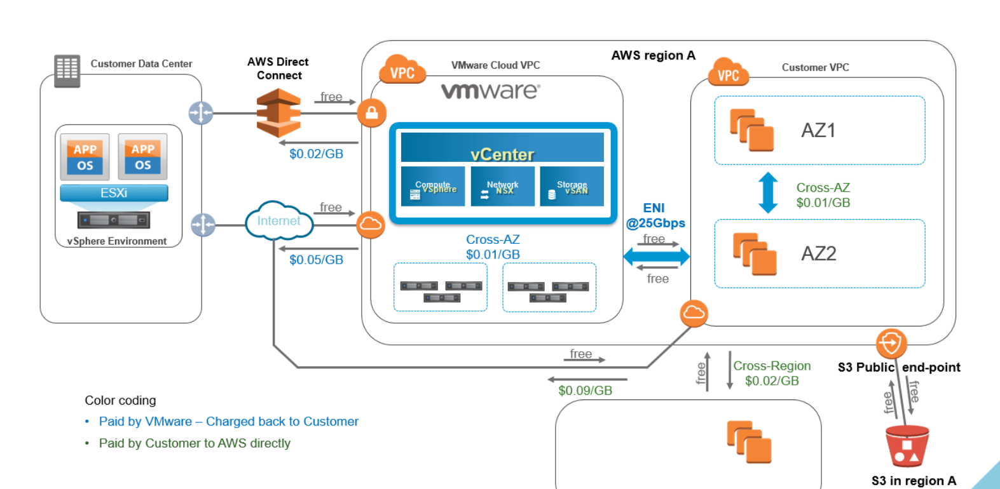

### Cloud Assembly Logical Overview

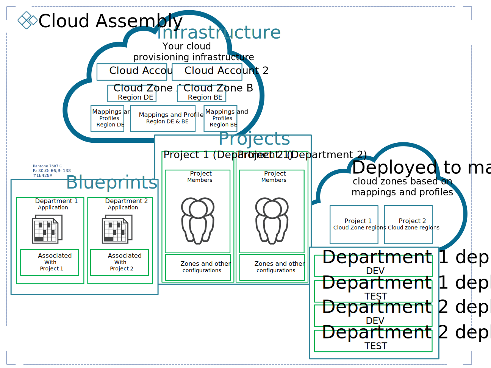

## Business and Solution Requirements

The table below provides known requirements mandatory to be incorporated into design decisions described in this LLD.

### Initial Requirements

| ID   | Requirement description                                                                                         | Requirement Source | Requirement Level |
|------|-----------------------------------------------------------------------------------------------------------------|--------------------|-------------------|
| R001 | Design frontend Automation & orchestration for customer payload                                                 | HLD                | MUST              |
| R002 | Design blueprints for VCS VM Provisioning                                                                       | HLD                | MUST              |
| R003 | Solution is using VMware Cloud Foundation SDDC and SDN workload domains / PODs as integration endpoints         | HLD                | MUST              |
| R004 | Installation and configuration of required components is automated                                              | VCS Principles     | SHOULD            |
| R005 | Automation domain must be patched in regular schedule with minimal impact into service availability             | Portfolio          | MUST              |
| R006 | Defined Role Base Access Control (RBAC) model to ensure a proper security isolation                             | Portfolio          | MUST              |
| R007 | Define Multi-Tenancy model to ensure resource segregation for the different legal entities of the same customer | HLD                | MUST              |

## Tenancy

VCS by design can either be:

- a single tenant, project separated capable solution,
- or multi-tenant, tenant separated capable solution accommodating multiple tenants that share the same physical resources.

### Multi-tenancy Schema

Multi-tenancy VCS is based on VMware Cloud Partner Navigator which contains Provider Organization (parent object) and Tenant Organization (child object, dependent and linked to Provider Organization). Depends on chosen design different configuration options can be distinguished.

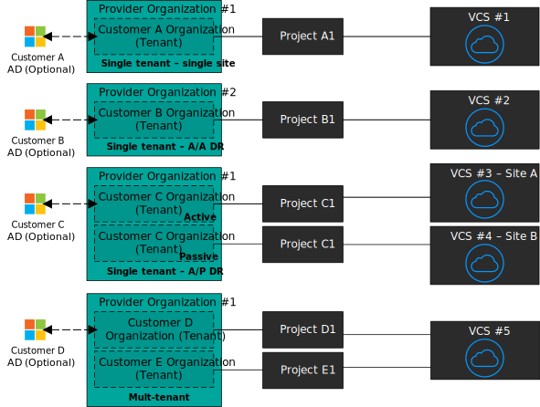

### Multi-tenancy Schema for disaster recovery

Following diagram represents multi-tenancy schema for disaster recovery (active-passive) solution:

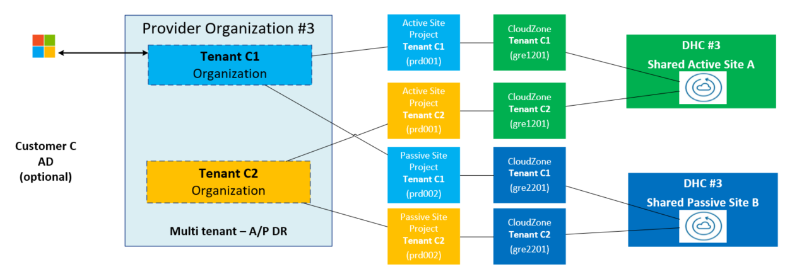

Following diagram represents multi-tenancy  for disaster recovery (active-passive) between vRA cloud and SRM components:

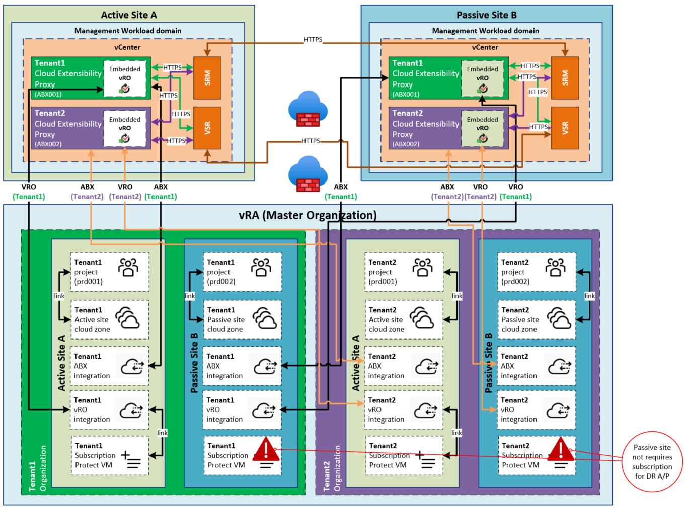

**NOTE:**
Each tenant organization use dedicated cloud extensibility proxy with embedded vRO per site.
Under the same tenant organization unique projects are used for active and passive DR sites.
Subscriptions to trigger vRO workflows (protect VM) are enabled on active DR site by default, unless the bidirectional A/P DR is configured, then on both.

**NOTE:**
Each Customer has opportunity to connect to its own Customer Active Directory using Workspace One solution provided by VMware. This feature is additional and optional as default is to use VMware accounts instead of Customer domain accounts.

#### Design Decisions Multi-tenancy

| Decision ID | Design Decision                                                                                                                                  | Design Justification                                                                                                                                       | Design Implication                                                                 |
|-------------|--------------------------------------------------------------------------------------------------------------------------------------------------|------------------------------------------------------------------------------------------------------------------------------------------------------------|------------------------------------------------------------------------------------|
| 001         | Isolation of compute and storage resources between tenants is only done logically                                                                | This will satisfy the VCS multi-tenancy requirements offered by the VCS solution                                                                           | Compute and storage resources are shared between tenants in VCS environment        |
| 002         | Single Tenant Organizations will be used to have multi-tenancy capability                                                                        | This will allow to avoid management overhead and scalability issues that would occur with multiple organizations referring to the same physical resources  | Compute and storage resources are shared between tenants in VCS environment        |
| 003         | Multiple Tenant Organizations within the Provider Organization will be used to deliver Tenant segregation capability for the same customer       | This will satisfy the Tenant segregation requirements offered by the VCS solution                                                                          | Compute and storage resources can be shared or dedicated within a  VCS environment |
| 004         | Different Customers will have dedicated Parent Organizations within VMware Cloud Partner Navigator (SaaS)                                        | VMware Cloud Partner Navigator by default not allowing to share organizations resources between different Customers                                        | This will secure resources for different Customers                                 |
| 005         | External systems integration require to be inline with tenancy decision for automation and SDDC platform                                         | Strong consistency is required in terms of data exchange and components discovery to avoid split brain condition after modification on any component level |                                                                                    |
| 006         | Each tenant organization represents a single VCS. VCS instances are separated at Provider Organization Level by VMware Cloud Provider Hub (SaaS) | VMware Cloud Provider Hub by default not allowing to share organizations resources between different Customers                                             | This will secure resources only for different Customers                            |
| 007         | Each tenant will use a dedicated set of Blueprints                                                                                               | To enable segregation of tenants, some of values populated in the Blueprint are customer-specific                                                          | Overhead in Blueprint management                                                   |
| 008         | Multiple Projects within the same Tenant Organization will be used to deliver resource segregation capability for the same Tenant                | This will satisfy the departmental segregation requirements offered by the VCS solution                                                                    | Compute and storage resources can be shared in a VCS environment                   |

#### Design Decisions Multi-tenancy with disaster recovery (active-passive)

| Decision ID | Design Decision                                                                            | Design Justification                                                                                  | Design Implication                                                                        |
|-------------|--------------------------------------------------------------------------------------------|-------------------------------------------------------------------------------------------------------|-------------------------------------------------------------------------------------------|
| 001         | Tenant organization will consist two cloud zones for active and passive dr site            | This will satisfy the VCS multi-tenancy DR A/P requirements offered by the VCS solution               | Compute resources needs to be shared under one tenant organization to protect them        |
| 002         | Tenant organization will consist unique project names to segregate active and passive site | This will satisfy the vRA cloud and VCS multi-tenancy DR A/P requirements offered by the VCS solution | vRA cloud requires unqiue projects names under same tenant organization                   |
| 003         | Tenant organization will use shared DR recovery plan                                       | This will satisfy VCS multi-tenancy DR A/P requirements offered by the VCS solution                   | Creating recovery plans per tenant, would cause the failover queue per customer           |
| 004         | Tenant organization will use dedicated DR recovery protection group                        | This will satisfy  VCS multi-tenancy DR A/P requirements offered by the VCS solution                  | Each tenant needs to have dedicated protection group                                      |
| 005         | Tenant organization protected VMs will be placed in dedicated resource pools               | This will satisfy  VCS multi-tenancy DR A/P requirements offered by the VCS solution                  | Each tenant protected VM will be placed under correct tenant resource pool after failover |

### Tenant Segregation

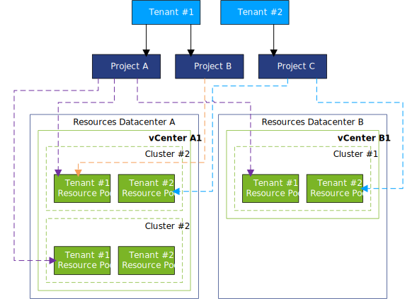

#### Design Decisions Tenant Segregation

| Decision ID | Design Decision                                                                                                                            | Design Justification                                                                                                                                        | Design Implication                                                                                                                       |
|-------------|--------------------------------------------------------------------------------------------------------------------------------------------|-------------------------------------------------------------------------------------------------------------------------------------------------------------|------------------------------------------------------------------------------------------------------------------------------------------|
| 001         | Logical isolation of compute vCenter resources for each department via dedicated resource pools                                            | This will satisfy Tenant segregation requirements offered by the VCS solution                                                                               | Resource saturation can be introduced in resource sharing model. As result single tenant can impact performance of other tenant services |
| 002         | Multiple Tenant Organizations within the Provider Organization will be used to deliver Tenant segregation capability for the same customer | This will satisfy the Tenant segregation requirements offered by the VCS solution                                                                           | Compute and storage resources can be shared or dedicated within a  VCS environment                                                       |
| 003         | Full resource and traffic isolation can be implemented between tenants                                                                     | Dedicated clusters must be deployed to guarantee explicit storage and compute power.                                                                        |                                                                                                                                          |
| 004         | External systems integration require to be inline with Tenant segregation decision for automation and SDDC platform                        | Strong consistency is required in therms of data exchange and components discovery to avoid split brain condition after modification on any component level | Monitoring needs to be aligned with this approach                                                                                        |

### Multi-tenancy objects in vRA Cloud

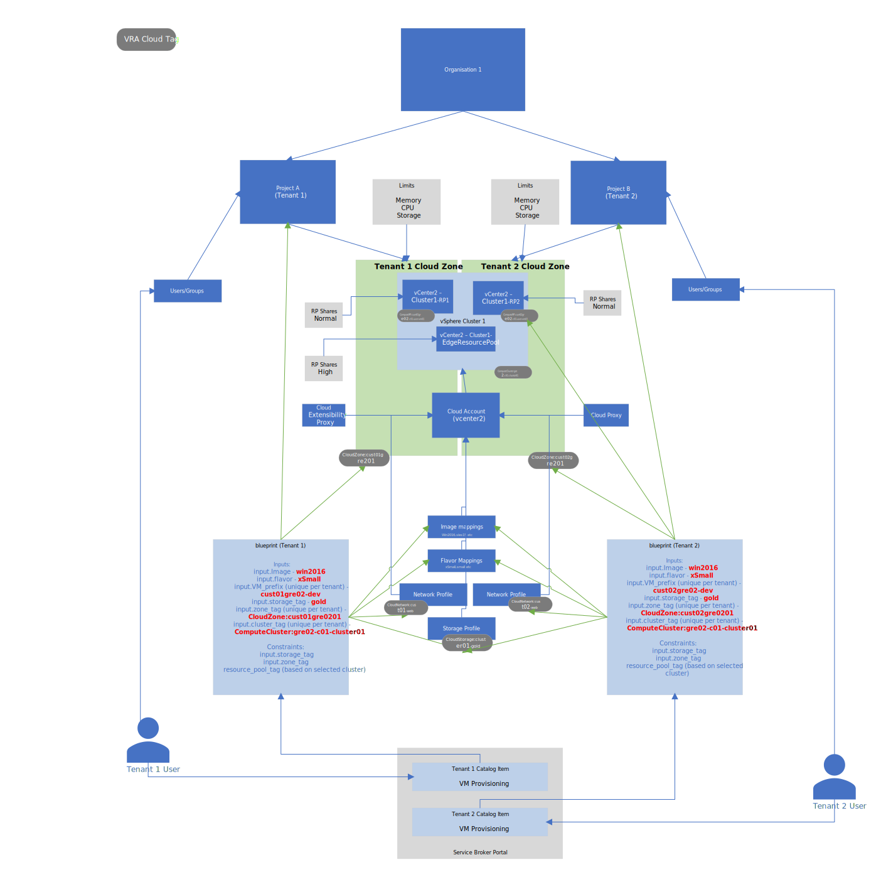

One of the main requirements of VCS Multi-tenancy feature is to share a single vSphere cluster between multiple Tenants. Tenants will share the following objects by default:

- vSphere & NSX-T Cloud Accounts pointing to the shared resources
- Cloud Proxy
- Cloud Extensibility Proxy
- Image mappings
- Flavour mappings
- Storage profiles
- A subset of tags (covered later in the document)

Each tenant will have a dedicated set of objects in VRA Cloud:

- Project
- Cloud Zone
- RBAC Group
- Network Profile
- Resource pool tag
- Tenant tag
- Cluster tag
- Project tag
- VM deployment Blueprint
- Service Broker Content Source
- Service Broker Catalog item (VM deployment)

Effectively each tenant should be able to see only objects within the context of their assigned project and deploy VMs in their dedicated vSphere Resource pool(s).
Each tenant will use a dedicated Blueprint, populated with input values specific to that tenant (i.e. VM Prefix).

In terms of limiting the consumption of resources, each tenant-dedicated Project can be customized by applying the following limits on the Cloud Zone:

- The maximum number of instances that can be provisioned in the cloud zone
- The maximum number of virtual CPUs that can be used by the cloud zone
- The maximum amount of memory that can be used by the cloud zone (in MB)
- The maximum amount of storage that the project can consume from the cloud zone (in GB)

By default these limits are not enforced in VCS. Resource Pool shares are set on vSphere level to equalize the resource consumption in case of contention.

VRA Cloud offers IOPS limitation setting per VM in each Storage Profile, however, this setting will not be used. Each VRA Cloud storage profile is associated with a VSAN storage policy (SPBM) that will be configured to have a specific IOPS limitation, depending on the storage class defined.

#### Tags in VCS Multi-tenancy

VCS will utilize Constraint tags to make sure that each tenant creates their deployments within their own boundaries.

| Tag                | Scope           | Description                                                                                                            |
|--------------------|-----------------|------------------------------------------------------------------------------------------------------------------------|
| cloudzone          | tenant-specific | Cloud Zone contain vSphere resources shared between tenants                                                            |
| cloudnetwork       | tenant-specific | Tag applied to a given Network, dedicated per tenant                                                                   |
| cloudstorage       | tenant-specific | Tag applied to Storage Policy, corresponding to a storage class. By default dedicated per tenant                       |
| computerp          | tenant-specific | Tag applied to Compute Resource Pool, which is dedicated per tenant                                                    |
| computecluster     | tenant-specific | Tag applied on Virtual Machine level to facilitate identifying resources deployed within a given cluster               |
| tenant             | tenant-specific | Resource tag applied on Virtual Machine level to facilitate identifying resources deployed within a specific tenant    |
| owner              | tenant-specific | Requestor tag (email) who trigger the deployment applied on Virtual Machine level                                      |
| project            | tenant-specific | Project tag applied on Virtual Machine level to facilitate identifying resources deployed within a given project       |
| StorageReplication | tenant-specific | Tag applied to Storage Policy (only if VMFS on FC is a principal storage in VI WD) , corresponding to a storage class. |

Tags are described in more details in the later part of this document.

### Design Decisions VMware Service Broker

VMware Service Broker provides self-service access to multi-cloud infrastructure and application resources from a single catalog, without requiring disparate tools.

| Decision ID | Design Decision                                                                                      | Design Justification                                     | Design Implication                                            |
|-------------|------------------------------------------------------------------------------------------------------|----------------------------------------------------------|---------------------------------------------------------------|
| 001         | VMware Service Broker will be used as frontend for customer and third party integrations             | Unified view for service catalog is mandatory            | proper RBAC capabilities must be included in product          |
| 002         | Catalog functionality can be consumed via GUI, API or third party plugins                            | Flexibility in delivery model                            | N/A                                                           |
| 003         | Customer Operations (CO) or integration team is responsible for service catalog view and management. | VCS R&D is not responsible by design for service catalog | CO or integration teams must be trained. R&D must define RACI |
| 004         | First and second day requests are available in Service Broker                                        | Portfolio requirement                                    | N/A                                                           |

### Design Decisions VMware Code Stream

Code Stream automates the code and application release process with a comprehensive set of capabilities for application deployment, testing, and troubleshooting.

| Decision ID | Design Decision                                                                                                                                | Design Justification                                                                 | Design Implication                      |
|-------------|------------------------------------------------------------------------------------------------------------------------------------------------|--------------------------------------------------------------------------------------|-----------------------------------------|
| 001         | VMware Code Stream will be used to automate the build process of selected VCS components for VCS deployment stage  (e.g. deployment prereq VM) | To reduce preparation time and provide CI/CD solution                                | CO or integration teams must be trained |
| 002         | VMware Code Stream will be used to perform automated tests for VCS vRA cloud components after build stage                                      | Requirement to deliver solution for vRA cloud components automated tests and control | CO or integration teams must be trained |

## Detailed Logical Design

## Management Topology

### VMware Cloud Assembly

VCS uses VMware Cloud Assembly to deliver blueprinting capabilities and unified provisioning through declarative Infrastructure as Code on all supported platforms.

| Decision ID | Design Decision                                                                                                                                      | Design Justification                                                                                                                                                                                                                                                            | Design Implication                                                          |
|-------------|------------------------------------------------------------------------------------------------------------------------------------------------------|---------------------------------------------------------------------------------------------------------------------------------------------------------------------------------------------------------------------------------------------------------------------------------|-----------------------------------------------------------------------------|
| 001         | At least two Cloud Proxy virtual appliances are deployed per workload domain                                                                         | This will facilitate the interface for integration of entire automation services with endpoints (SDDC & SDN).  That will limit fault domain to single workload domain in case of proxy failure.  That will allow tenancy segregation if required on workload domain level                                     | Additional resources are consumed   Additional VMs need to be maintained                             |
| 002         | VMware Cloud Assembly service will be used for blueprinting and orchestration                                                                        | This will facilitate the blueprinting and unified provisioning across different endpoints (SDDC, SDN Workload Domains)                                                                                                                                                          | N/A                                                                         |
| 003         | VMware Cloud Assembly Console will be operational interface for VCS Cloud Operations Team to manage the customer workload and its component mappings | This will facilitate the single console for VCS Cloud Operations team to manage SDDC and SDN Components                                                                                                                                                                         | NA                                                                          |

#### Design Decisions Management Topology

| Decision ID | Design Decision                                                                                | Design Justification                                                    | Design Implication |
|-------------|------------------------------------------------------------------------------------------------|-------------------------------------------------------------------------|--------------------|
| CS001       | VMware Code Stream is used as VCS pipeline automation tool for testing and release preparation | Simplicity and native integration into VMware SDDC and automation stack | N/A                |
| CS002       | VMware Code Stream is not exposed to customer                                                  | Not part of current VCS release                                         | N/A                |

## vRA Communication flow

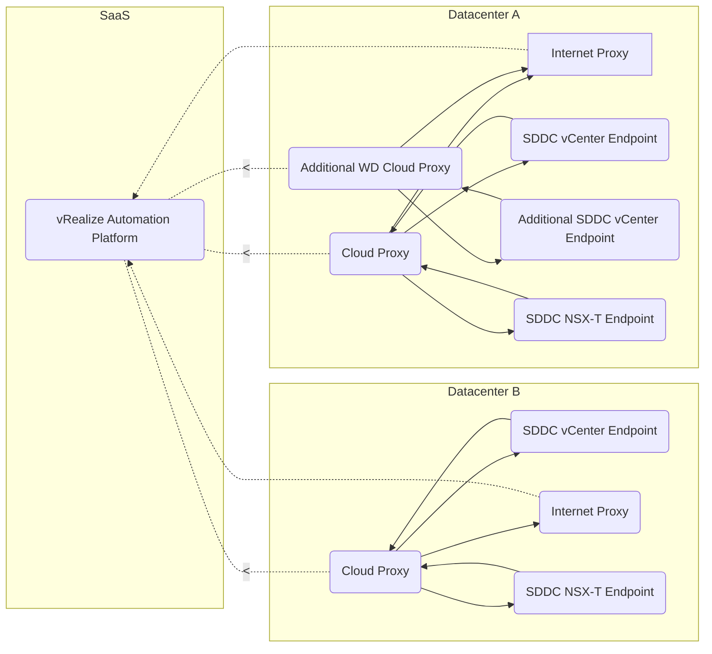

- vRealize Automation Platform - Platform managed by vendor (VMware). All the VCS Customer VM / Network objects will be discovered/managed by that platform via Cloud Proxy (Data Collector) using REST over HTTPS
- Cloud Proxy - vRA Cloud Proxy Server will be hosted on mgmt vCenter Server which will enable local communication channel (HTTPS) and mediator between vRA and WLD vCenter / SDN Endpoint
- Additional WD Cloud Proxy - proxy dedicated for additional vCenter servers deployed in single SDDC Datacenter
- SDDC vCenter Endpoint - vCenter server responsible for workload management
- Additional SDDC vCenter Endpoint - Additional vCenter server responsible for workload management
- SDDC NSX-T Endpoint - NSX-T manager responsible for workload SDN management. SDN Endpoint will be communicating with Cloud Proxy Server over HTTPS

## vRA Data model

Note:

- Data model "tags available" reflects information that each of component inside diagram supports tagging.
- Data model reflects the relationship between Objects and vSphere Objects:
  - **vRA Objects** *(Projects, Zones, Regions, Cloud Accounts, Network Profiles, Storage Profiles) are created in Portal*
  - **vSphere Objects** *(Datastores, Storage Policies, Networks, Network Domains) are discovered by  from vCenter Server and NSX-T Endpoint via Cloud Proxy*

## VMware Cloud Assembly Logical Components

### Tags

Tags drive the placement of deployments' components through matching of capabilities and constraints. VCS standard tags for e.g. Storage, Networks etc. will be used in Cloud Assembly to map the resources and for the automated provisioning placements.

#### Design Decisions Tags

| Decision ID | Design Decision                                                                     | Design Justification                                                                    | Design Implication |
|-------------|-------------------------------------------------------------------------------------|-----------------------------------------------------------------------------------------|--------------------|
| CAT001      | VCS platform is using both capabilities and constraints tags                        | Flexibility in therms of addressing future customer needs by using native functionality | N/A                |
| CAT002      | Tags are represented by **key:value** pair convention (small letters only accepted) | Simplify troubleshooting and introducing order for payload placement                    | N/A                |
| CAT003      | By default hard constraints are used                                                | Default implementation in automation platform                                           | N/A                |
| CAT004      | By default max 15 characters under key and value                                    | Simplify key name and value content for future filtering and reporting                  | N/A                |
| CAT005      | Only allowed special characters ("-") under key and value                           | Simplify tags names and values to deliver naming standard                               | N/A                |

#### Tags application flow

- **Capability Tags**
In Cloud Assembly, capability tags enable us to define placement logic for deployment of infrastructure components. They are a more powerful and succinct option to hard coding such placements.
You can create capability tags on compute resources, cloud zones, images and image maps, and networks and network profiles. Capability tags on cloud zones and network profiles affect all resources within those zones or profiles. Capability tags on storage or network components affect only the components on which they are applied.

- **Constraint Tags**
There are two main areas in Cloud Assembly where constraint tags are applicable. The first is on the configuration side in projects and images. The second is on the deployment side in blueprints. Constraints applied in both areas are merged in blueprints to form a set of deployment requirements.
If tags on the project conflict with tags on the blueprint, the project tags take precedence, thus allowing the cloud administrator to enforce governance rules
You can apply up to three constraints on projects. Project constraints can be hard or soft. By default they are hard. Hard constraints allow you to rigidly enforce deployment restrictions. If one or more hard constraints are not met, the deployment will fail. Soft constraints offer a way to express preferences that will be selected if available, but the deployment won't fail if soft constraints are not met.

- **VCS Standard Tags**
Below Cloud Assembly standard tags will be used in VCS to support analysis, monitoring, and grouping of deployed resources.

Standard tags are unique within Cloud Assembly. Unlike other tags, users do not work with them during deployment configuration, and no constraints are applied. These tags are applied automatically during provisioning deployments. These tags are stored as system custom properties, and they are added to deployments after provisioning.
The list of standard tags appears below.

#### vRA Standard Tags

| Description                                                                       | Tag                                                             |
|-----------------------------------------------------------------------------------|-----------------------------------------------------------------|
| Organization                                                                      | org:orgID                                                       |
| Project                                                                           | project:projectID                                               |
| Requester                                                                         | requester:username                                              |
| Deployment                                                                        | deployment:deploymentID                                         |
| Blueprint reference (if applicable)                                               | blueprint:blueprintID                                           |
| Component name in blueprint                                                       | blueprintResourceName:CloudMachine_1                            |
| Placement Constraints: applied in blueprint, request parameters, or via IT policy | constraints:key:value:soft                                      |
| Cloud Account                                                                     | cloudAccount:accountID                                          |
| Zone or profile, if applicable                                                    | zone:zoneID, networkProfile:profileID, storageProfile:profileID |

#### VCS Standard Tags

Following chapter list standard tags used in VCS.

| Description           | Tag (Key:Value)                                                                                                                                                                                                                | Functionality                                                                                                                                    |
|-----------------------|--------------------------------------------------------------------------------------------------------------------------------------------------------------------------------------------------------------------------------|--------------------------------------------------------------------------------------------------------------------------------------------------|
| Cloud Zone            | cloudzone:`<locationcode>` **e.g.** `cloudzone:mec09` `cloudzone:mec94`                                                                                                                                                        | Landing zone for provisioned virtual machines                                                                                                    |
| Tenant                | tenant:`<tenantName>` **e.g.:** `tenant:nx301` `tenant:nx302`                                                                                                                                                                  | Segregate tenant workloads                                                                                                                       |
| Project               | project:`<projectName>` **e.g.** `project:prd001` `project:dev001`                                                                                                                                                             | Project for provisioned virtual machines, segregate workloads across multiple projects                                                           |
| Cloud Storage         | cloudstorage:cluster`<clusternumber>`-`<typeofstorage>` **e.g.:** `cloudstorage:cluster02-gold` `cloudstorage:cluster02-silver` `cloudstorage:cluster02-bronze`                                                                | Datastore destination                                                                                                                            |
| Cloud Network         | cloudnetwork:`<typeofnetwork>` **e.g.:** `cloudnetwork:app (Application)` `cloudnetwork:web (Web)` `cloudnetwork:db (Database)` `cloudnetwork:tru (Trusted)` `cloudnetwork:dmz (Demilitarized)` `cloudnetwork:sec (Secured)`   | Network site                                                                                                                                     |
| Compute Cluster       | computecluster: `<locationCode>`-c`<workloadDomainNumber>`-cluster`<clusterNumber>-<drtype>` **e.g.:** `computecluster:gre2-c01-cluster01-na` , `computecluster:gre2-c01-cluster01-aa`, `computecluster:gre2-c01-cluster01-ap` | Defines cluster destination with DR types (active/active/passive,no dr)                                                                          |
| Compute Resource Pool | computerp: `<locationCode>`-c`<workloadDomainNumber>`-cluster`<clusterNumber>`-rp **e.g.:** `computecluster:gre2-c01-cluster01-rp`                                                                                             | Resource pool destination                                                                                                                        |
| drType                | drType: `<drType>` **e.g.:** `drType:active-active`,`drType:active-passive`,`drType:none`                                                                                                                                      | Defines dr type to use under provisioned virtual machine                                                                                         |
| Location              | location: `<locationcode>` **e.g.:** `location:mec09`,`location:mec94`                                                                                                                                                         | Defines primary location for DR functionality under cluster                                                                                      |
| Location DR           | locationdr: `<locationcodeDr>` **e.g.:** `locationdr:mec94`,`locationdr:mec09`                                                                                                                                                 | Defines secondary DR location under cluster                                                                                                      |
| VM location           | vmlocation: `<locationcode>` **e.g.:** `vmlocation:mec09`,`vmlocation:mec94`                                                                                                                                                   | Defines primary DR location for virtal machine                                                                                                   |
| VM location DR        | vmlocationdr: `<locationcode>` **e.g.:** `vmlocationdr:mec94`,`vmlocationdr:mec09`                                                                                                                                             | Defines secondary DR location for virtual machine                                                                                                |
| DR Protection Group   | drProtectionGroup:`<protectionGroupName>` **e.g.:** `drProtectionGroup:PG01`,`drProtectionGroup:PG02`                                                                                                                          | Defines SRM protection group for DR protected virtual machine                                                                                    |
| DR RPO                | drRpo:`<rpo>` **e.g.:** `drRpo:60`,`drRpo:1440`                                                                                                                                                                                | Defines DR RPO value for DR protected virtual machine                                                                                            |
| DR PriorityGroup      | drRpo:`<rpo>` **e.g.:** `drPriorityGroup:1`,`drPriorityGroup:3`                                                                                                                                                                | Defines at which SRM priority group DR protected virtual machine should be added                                                                 |
| VM backup policy      | BackupPolicy: `<policyname>` **e.g.:** `BackupPolicy:daily1800_3w`,`BackupPolicy:daily1800_2w`                                                                                                                                 | Defines backup policy assigned to virtual machine                                                                                                |
| VM owner              | owner: `<vRA cloud deployment requestor account name>` **e.g.:** `owner:firstname.lastname@domain.next`                                                                                                                        | Defines requestor and owner name of vra cloud deployment and virtual machine                                                                     |
| VM instance type      | UHC-SN-MANAGED: `Yes` **e.g.:** `UHC-SN-MANAGED:Yes`,`UHC-SN-MANAGED:No`                                                                                                                                                       | Defines the vm instance type of the provisioned virtual machine (tag value 'Yes' - VM managed by Atos, tag value 'No' - managed by the customer) |
| Storage Replication   | StorageReplication: <code>[yes&#124;no]</code> **e.g.:** `StorageReplication:yes`                                                                                                                                                  | Tag defines whether storage underpinning this Storage Profile is replicated across sites or not                      |
| Keep or cleanup VM snapshots | keepSnapshots: `No` **e.g.:** `keepSnapshots:No`, `keepSnapshots:Yes`                                                                                                                                                       | Tag makes an exception for VMs which need to keep snapshot longer than decided. By default is 'No' because, the policy to automatically cleanup snapshot is in place |
| VM creation request number   | requestNumber: `<vRA cloud deployment request number>` **e.g.:** `requestNumber:RITM`, `requestNumber:CHANGE` | Tag identifies the request number based on which VM got created. This is useful because of the security and audit policy compliance requests      |

#### VCS optional Tags

Following chapter covers list of documents defining additional tags in vRA cloud for optional functionalities.

| Document name                      | Document Source                                                                             | Functionality                                           |
|------------------------------------|---------------------------------------------------------------------------------------------|---------------------------------------------------------|
| lldMigratedVmVraCloudOnboarding.md | [Applying VM migration tags](lldMigratedVmVraCloudOnboarding.md#44-applying-migration-tags) | Migration of virtual machines to vRA cloud (onboarding) |

### Cloud Proxy

VCS is using VMware Cloud Proxy component which is an OVA supplied by VMware that contains the credentials and protocols that connect a proxy appliance on a host vCenter server to a vCenter-based cloud account. vCenter-based cloud accounts require that a cloud proxy is deployed to source vCenters for data collection and communication between the cloud account and an on-premises endpoints. This relationship within VCS is 1 proxy to 1 vCenter and NSX endpoints.
vCenter-based cloud account types include vCenter Server, NSX, and VMware Cloud on AWS. Some cloud account types, such as Amazon Web Services and Microsoft Azure, do not require a cloud proxy.

| Decision ID | Design Decision                                                                                                                                                                                                                                                                                                                                                                                | Design Justification                                                                                                                                                                 | Design Implication                                                                                  |
|-------------|------------------------------------------------------------------------------------------------------------------------------------------------------------------------------------------------------------------------------------------------------------------------------------------------------------------------------------------------------------------------------------------------|--------------------------------------------------------------------------------------------------------------------------------------------------------------------------------------|-----------------------------------------------------------------------------------------------------|
| 001         | Two Cloud Proxy virtual appliances will be deployed (primary and backup) for SDDC & SDN endpoints of one customer. (As per customer workload forecast if the Cloud Resource count would be crossing threshold of 10000 cloud resources then 1 Cloud Proxy will be deployed per WLD Domain), Cloud Proxies will be named like: `<LocationCode>cas+<3DigitNumber>` e.g. mec09cas001, mec09cas002 | One Proxy supports up to 10000 Cloud resources (All vSphere objects discovered by vRA Platform)                                                                                      | NA                                                                                                  |
| 002         | HA solution for cloud proxy services will be implemented                                                                                                                                                                                                                                                                                                                                       | On each cloud proxy VM monitoring script will run, in case of the primary cloud proxy services failure, vRA cloud account will be updated to switch into backup cloud proxy instance | In case failover happens, CO needs to manually perform a failback action at vRA Cloud account level |
| 003         | By default each Cloud Proxy will have tenant tag assigned                                                                                                                                                                                                                                                                                                                                      | Simplify identification of cloud proxy per tenant                                                                                                                                    | Identification resources per tenant is required                                                     |

### Cloud Account

In VCS a cloud account identifies a cloud account type and a VCS vSphere workload vCenter where the associated cloud account resources are hosted.
The cloud accounts in VCS project are based on the VCS region (vSphere workload data center) where that cloud account resides. While preparing profiles and mappings, we need to specify data in relation to a specific cloud account type and region in project.

| Decision ID | Design Decision                                                                                 | Design Justification                                                | Design Implication |
|-------------|-------------------------------------------------------------------------------------------------|---------------------------------------------------------------------|--------------------|
| 001         | Cloud Account will be created per Workload vCenter and NSX-T SDN Instance                       | This will minimize the resource management complexity within portal | NA                 |
| 002         | Cloud Account name will be based on LocationCode+vCenter/NSXT Number e.g. gre2vcs002 gre2nsx002 | This will simplify the resource mappings at backend                 | NA                 |

### Cloud Zone

In VCS a cloud zone defines a set of compute resources for a vSphere cloud account, in a specific account region that are used to deploy a blueprint. Cloud zones are specific to a VCS project.
Additional placement controls include placement policy options, capability tags, and compute tags.

| Decision ID | Design Decision                                                                                                                                                                          | Design Justification                                                            | Design Implication |
|-------------|------------------------------------------------------------------------------------------------------------------------------------------------------------------------------------------|---------------------------------------------------------------------------------|--------------------|
| 001         | One Cloud Zone will be created per vSphere Datacenter (One for all Compute POD Clusters within same vCenter)                                                                             | This will minimize the resource management complexity within portal             | NA                 |
| 002         | Default placement policy will be used                                                                                                                                                    | Resource load balancing within cluster will be managed on vSphere level via DRS | NA                 |
| 003         | Cloud Zone names will be based on LocationCode+2DigitNumber For e.g gre1201                                                                                                              | Flexibility and descriptive way to describe user resources                      | NA                 |
| 004         | Multiple Compute Clusters in the same vCenter will be utilized with help of different and unique tags distinguished by cluster number, for e.g. gre32-c01-cluster01, gre32-c01-cluster02 |                                                                                 | NA                 |

### Mappings and Profiles

#### Flavour Mappings

VCS is using vRA flavour mapping groups - a set of target deployment sizings for a specific cloud account/region using natural language naming. Flavour mapping lets you create a named mapping that contains similar flavour sizings across your account regions.

| Decision ID | Design Decision                                                                                                                                                                                           | Design Justification                                                                          | Design Implication |
|-------------|-----------------------------------------------------------------------------------------------------------------------------------------------------------------------------------------------------------|-----------------------------------------------------------------------------------------------|--------------------|
| 001         | VCS Standard flavour sizing will be used **XSmall** (1 vCPU, 2GB RAM) Only for Linux **Small** (2 vCPU, 4GB RAM) **Medium** (4 vCPU, 8GB RAM) **Large** (8 vCPU, 16GB RAM) **XLarge** (16 vCPU, 32GB RAM) | This will standardize the sizing of the workload with taking care of the base capacity design | NA                 |
| 002         | The same flavour can be mapped with multiple regions                                                                                                                                                      | Flexibility                                                                                   | NA                 |
| 003         | Customers can create and use Custom Sizing templates with Custom Blueprints created for that customer                                                                                                     | Flexibility                                                                                   | NA                 |
| 004         | VCS Standard flavour mappings names will be based on:   - xsmall, - small, - medium, - large, - xlarge                                                                                        | Standardization                                               | NA                                           |

#### Image Mappings

VCS will use image mapping groups - a set of pre-defined target OS specifications for a specific cloud account/region by using natural language naming. The list of Standard OSes will be used as published and as per AHS Managed Server OS [roadmap](https://sp2013.myAtos.net/ms/gd/ahs/gadp/Document%20Library/Roadmap/2019/source/Aligned%20Roadmap%20AHS%202019%20v1.2.pdf).

| Decision ID | Design Decision                                                                                                                                                                                                                                                                                                               | Design Justification                                           | Design Implication                                       |
|-------------|-------------------------------------------------------------------------------------------------------------------------------------------------------------------------------------------------------------------------------------------------------------------------------------------------------------------------------|----------------------------------------------------------------|----------------------------------------------------------|
| 001         | VCS Standard Images will be used in the Image Mappings used in Standard VCS Blueprint                                                                                                                                                                                                                                         | This will standardize the OS usage within VCS                  | NA                                                       |
| 002         | By default single image mapping name is created to aggregate templates located in different endpoints. ImageName - Image (From discovered vCenter Templates) For e.g. **SLES15** (GlobalImage_SLES15) **RHEL7** (GlobalImage_RHEL7) **RHEL8** (GlobalImage_RHEL8) **W2K16** (GlobalImage_W2K16) **W2K19** (GlobalImage_W2K19) | Cloud agnostic enablement for blueprinting and simplicity      | NA                                                       |
| 003         | Image Mappings can be created per Region (Per VCS Workload vCenter): ImageName - Image (From discovered vCenter Templates) For e.g. **SLES15** (GlobalImage_SLES15) **RHEL7** (GlobalImage_RHEL7) **RHEL8** (GlobalImage_RHEL8) **W2K16** (GlobalImage_w2K16) **W2K19** (GlobalImage_W2K19)                                   | Flexibility to address customer needs                          | NA                                                       |
| 004         | Image Mappings names can be based on managed OS templates: `Atos-<OSCode>` **For example** Atos-Win2k16, Atos-Sles12, Atos-Rhel7 and for unmanaged OS: `<CustomerCode>-<OSCode>` **For example** Acme-Win2k16, Acme-SLES12, Acme-Rhel12                                                                                       | This will help in segregation of different OS management types | NA                                                       |
| 004         | Customer can provide their own image mapping naming                                                                                                                                                                                                                                                                           | Offers flexibility and addresses customer needs                | requires automation adjustments for automated deployment |

#### Network Profiles

A network profile defines a group of networks and network settings that are available for a cloud account in a particular region or data center.
VCS will be using tag matching to identify one or more networks in one or more matched network profiles is available for use when a blueprint is deployed. The network and security settings that are defined in the matched network profile are also applied when the blueprint is deployed.
A network profile will contain the following information:

|                  |                                                                                                                                                                                                                                                                                                                                                  |
|------------------|--------------------------------------------------------------------------------------------------------------------------------------------------------------------------------------------------------------------------------------------------------------------------------------------------------------------------------------------------|
| Capabilities     | Capability tags are applied to all networks in the network profile, but only when the networks are used as part of that network profile. Capability tags are an optional grouping and naming tool for network profiles                                                                                                                           |
| Networks         | Networks, also referred to as subnets, are logical subdivisions of an IP network. A network groups a cloud account, IP address or range, and network tags to control how and where to provision a blueprint deployment. Network parameters in the profile define how machines in the deployment can communicate with one another over IP layer 3 |
| Network policies | Defines isolation policies (do not create on-demand networks or security groups, on-demand network, on-demand security group) to limit inbound or outbound network access for provisioned VM's, as well limit traffic using network firewall rules                                                                                               |
| Load balancers   | You can add load balancer settings for the networks that are used in the network profile. Available load balancers have been data-collected from the cloud account. You can also update load balancer settings in the blueprint YAML                                                                                                             |
| Security         | Security groups are applied to all the machines in the deployment that are connected to the network that matches the network profile. As there might be multiple networks in a blueprint, each matching a different network profile, you can use different security groups for different networks                                                |

Listed security groups are available based on information that is data-collected from the source cloud account.

| Decision ID | Design Decision                                                                                                                             | Design Justification                                                                                                                                              | Design Implication |
|-------------|---------------------------------------------------------------------------------------------------------------------------------------------|-------------------------------------------------------------------------------------------------------------------------------------------------------------------|--------------------|
| 001         | Network profiles will be created using existing networks, security groups and Load Balancers                                                | The network / groups / LB provisioning automation will be done using Network provisioning SSRs via NSX-T integration endpoint                                     | NA                 |
| 002         | On-demand network and On-demand security group network policies ca be used without SLA                                                      | VCS current version not providing such functionality due ot fact it was not tested and approved for production. Functionality will be introduced in next releases | NA                 |
| 003         | Network Profiles names will be based on :  CustomerCode+LocationCode+NetworkTypeFreetext (app,db,web etc.) For e.g. nx2gre2app nx2gre2db | Network profiles names needs to reflect location and role of services applied in affected network                                                                 | NA                 |
| 004         | VCS provides DHCP service from NSX-T and Atos IPAM integration with InfoBlox                                                                | IPAM is an existing Atos offering. DHCP functionality can be expected by customers                                                                                | None               |

#### Storage Profiles

VCS POD will contain different storage profiles that let the cloud administrator define VMware storage profile for the VCS region.
Storage profiles include disk customizations, and a means to identify the type of storage by capability tags. Tags are then matched against provisioning service request constraints to create the desired storage at deployment time.
Storage profiles are organized under cloud-specific regions. One cloud account might have multiple regions, with multiple storage profiles under each.

| Decision ID | Design Decision                                                                                                                                                        | Design Justification                                                                                                                                                        | Design Implication |
|-------------|------------------------------------------------------------------------------------------------------------------------------------------------------------------------|-----------------------------------------------------------------------------------------------------------------------------------------------------------------------------|--------------------|
| 001         | VCS vSphere Storage policies will be utilized in vRA Cloud Storage profiles as datastore defaults align with [VCS naming convention](namingConvention.md)              | This will avoid the issue of misconfiguration of storage policy on vRA level                                                                                                | NA                 |
| 002         | Thin provisioning type will be used in storage profile                                                                                                                 | This will be applied on Datastore level instead disk level for all automated provisioned disks                                                                              | NA                 |
| 003         | VCS Standard Storage Profiles will be created per region for each compute cluster                                                                                      | Delivers functionality to provision Customer VM's to proper datastore per storage class under affected region                                                               | NA                 |
| 004         | vSAN Storage Profile names will be based on following: clusternumber-storagetype For e.g. cluster02-gold, cluster02-silver, cluster02-bronze etc.                      | For vSAN based WD delivers segregation to provision Customer VM's into proper datastore under affected cluster.                                                             | NA                 |
| 005         | VMFS on FC Storage Profile names will be based on following: clusternumber-storagetype-storagereplication For e.g. cluster01-gold-repl, cluster02-silver-nonrepl, etc. | For VMFS on FC based WD delivers segregation to provision Customer VM's into proper datastore under affected cluster with indication if given storage is replicated or not. | NA                 |

### Projects

Projects addressing departmental segregation concept of VCS.
They control who has access to Cloud Assembly blueprints and where the blueprints are deployed.
VCS Cloud administrators will set up the projects, adding users and cloud zones. Anyone who creates and deploys blueprints must be a member of at least one project.

| Decision ID | Design Decision                                                                                                                                               | Design Justification                                                                                    | Design Implication |
|-------------|---------------------------------------------------------------------------------------------------------------------------------------------------------------|---------------------------------------------------------------------------------------------------------|--------------------|
| 001         | At least one Project will be created per Customer in Multi-Tenant and Single Tenant Scenarios  Naming convention: CustomerCode+3DigitNumber For e.g nx2001 | This will help in the resource segregation for multiple Tenants                                         | NA                 |
| 002         | Multiple Projects can be created per Tenant                                                                                                                   | This will help in the logical resource separation for same Tenant having multiple departments/divisions | NA                 |

### Integrations

#### ABX

In VCS VMware Cloud proxy appliance with ABX (Extensibility Actions on Prem) extension will be deployed under management workload domain to deliver python runtime environment for various integrations like IPAM and vRA cloud subscriptions.

| Decision ID | Design Decision                                                                                                                                                                                                                                                                                                                                                  | Design Justification                                                                                                                                             | Design Implication                                  |
|-------------|------------------------------------------------------------------------------------------------------------------------------------------------------------------------------------------------------------------------------------------------------------------------------------------------------------------------------------------------------------------|------------------------------------------------------------------------------------------------------------------------------------------------------------------|-----------------------------------------------------|
| 001         | Single ABX cloud proxy virtual appliance will be deployed for SDDC & SDN endpoints of one customer. (As per customer workload forecast if the Cloud Resource count would be crossing threshold of 10000 cloud resources then 1 Cloud Proxy will be deployed per WLD Domain), Cloud Proxy will be named like: `<LocationCode>abx+<3DigitNumber>` e.g. mec09abx001 | One Cloud Proxy supports up to 10000 Cloud resources (All vSphere objects discovered by vRA Platform)                                                            | NA                                                  |
| 002         | Single ABX cloud proxy virtual appliance will be consumed by one dedicated Ipam integration component per customer                                                                                                                                                                                                                                               | ABX Cloud proxy will be utilized always by one dedicated ipam integration (per customer) component with latest ipam package (delivered from VMware market place) | NA                                                  |
| 003         | Single ABX cloud proxy virtual appliance will be as well consumed for first and second day activities using custom abx scripts                                                                                                                                                                                                                                   | ABX cloud proxy will deliver as well runtime environment for custom abx scripts to execute first and second day activities (if required) e.g. move VM to AZ      | NA                                                  |
| 004         | ABX cloud proxy integration component always per tenant.   Naming convention: `<abx cloud proxy name>` e.g. mec09abx001                                                                                                                                                                                                                                       | This will help to reduce amount of integration under single tenant organization allowing more integrations for additional tenants if required                    | NA                                                  |
| 005         | ABX integration requires description as follows: `abx integration <customerCode>` e.g. abx integration nx5                                                                                                                                                                                                                                                       | This will allow to track abx integration points per Customer                                                                                                     | NA                                                  |
| 006         | By default each ABX cloud proxy will have tenant tag assigned                                                                                                                                                                                                                                                                                                    | Simplify identification of cloud proxy per tenant                                                                                                                | Identification resources per tenant is required     |
| 007         | Additional cloud extensibility proxy will be deployed per Cloud Account                                                                                                                                                                                                                                                                                          | Deliver High Availability functionality                                                                                                                          | Consumes more resource under management WLD cluster |
| 008         | Additional cloud extensibility proxy will be consumed for first and second day activities using custom abx scripts or vRO workflows                                                                                                                                                                                                                              | Deliver High Availability and scalablity functionality to run abx scripts or vRO workflows for day1 post provisioning tasks and custom day2 actions              | Consumes more resource under management WLD cluster |
| 009         | Each Abx integration requires defined same capability tag as follows: `abx:<projectName>` e.g. abx:prd001                                                                                                                                                                                                                                                        | Deliver High Availability and scalablity functionality to run abx scripts                                                                                        | NA                                                  |
| 010         | Each vRO integration requires defined same capability tag as follows: `abx:<projectName>` e.g. abx:prd001                                                                                                                                                                                                                                                        | Deliver High Availability and scalablity functionality to run vRO workflows                                                                                      | NA                                                  |
| 011         | Unique extensibility tag needs to be defined per Customer project as follows: `abx:<projectName>` e.g. abx:prd001                                                                                                                                                                                                                                                | To deliver high availability and scalability dedicated for each Customer project                                                                                 | NA                                                  |

#### IPAM

IP management integration using Atos Infoblox service to provide IP assignment for customer VMs.
IPAM integration mandate ABX cloud proxy, IPAM integration component and infoblox appliance (instance per customer).

| Decision ID | Design Decision                                                                                                                  | Design Justification                                                                                                                          | Design Implication |
|-------------|----------------------------------------------------------------------------------------------------------------------------------|-----------------------------------------------------------------------------------------------------------------------------------------------|--------------------|
| 001         | Single IPAM integration component always per tenant.   Naming convention: `<abx cloud proxy name>-ipam` e.g. mec09abx001-ipam | This will help to reduce amount of integration under single tenant organization allowing more integrations for additional tenants if required | NA                 |
| 002         | IPAM integration component always consume single ABX cloud proxy per tenant                                                      | This will help to reduce amount of ABX cloud proxies under organization and always consume one per tenant                                     | NA                 |
| 003         | IPAM integration requires setting up a dedicated IPAM range for each default VCS network profile                                 | This will allow to segregate subnets per cloud network types                                                                                  | NA                 |
| 004         | IPAM integration requires description as follows: `ipam integration <customerCode>` e.g. ipam integration nx5                    | This will allow to track ipam integration points per Customer                                                                                 | NA                 |

Following diagram illustrates IPAM integration components placed under Customer organization and describes traffic and mappings between them.
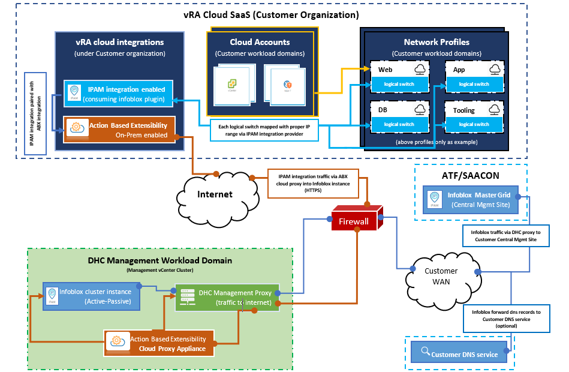

#### Cloud agents

VCS use cloud agents (Cloudinit - Linux, Cloudbaseinit - Windows) to deliver guest OS post provisioning activities.

| Decision ID | Design Decision                                                                               | Design Justification                             | Design Implication                                                                                                               |
|-------------|-----------------------------------------------------------------------------------------------|--------------------------------------------------|----------------------------------------------------------------------------------------------------------------------------------|
| 001         | Cloud agents are by default installed and configured inside compute Atos managed OS templates | Managed OS types mandate use guest OS activities | NA                                                                                                                               |
| 002         | Cloud agents can be installed on other templates if OS supports them                          | Flexibility to address customer needs            | Preparation activities must be manually incorporated into customer setup and tested in regular basis by customer operations team |

#### Kubernetes (TKG)

Tanzu family is supported as part of VCS.

## Security

### Role Based Access Control

Atos based solutions must guarantee proper access management. Following design decisions are made in that area.

#### Design Decisions RBAC

| Decision ID | Design Decision                                                                                               | Design Justification                                                                                                                                                   | Design Implication                                                                             |
|-------------|---------------------------------------------------------------------------------------------------------------|------------------------------------------------------------------------------------------------------------------------------------------------------------------------|------------------------------------------------------------------------------------------------|
| 001         | Cloud Partner Navigator and provisioned services will be only managed by VCS DevSecOps team                   | VCS administrator must have administrative rights assigned on a provider level to manage the Cloud Partner Navigator and VMware Cloud Assembly service                 | NA                                                                                             |
| 002         | My VMware account with Atos mail address is mandatory for VCS administrator                                   | This will allow only Atos authorized admins to have possibility to login into VMware Cloud Console                                                                     | Each VCS Administrator require to have MyVMware account with Atos Mail address as primary mail |
| 003         | Multi-factor authentication to be enabled for Atos users                                                      | Improved security due to dual factor authentication model                                                                                                              | User must be equipped in company mobile phone                                                  |
| 004         | Customers will have have full flexibility in consumption  model. GUI and API access is  provided to customers | Out of the box parity and portfolio requirement                                                                                                                        | None                                                                                           |
| 005         | External integrations are using separate API Service Account created for each Organization                    | VCS Service account will be used to integrate customer based entry points / Atos ServiceNow integration                                                                | None                                                                                           |
| 006         | Use dedicated service account for Cloud Proxy integration with vCenter                                        | Improved security due to usage dedicated service account per service. In line with Atos RBAC model                                                                     | Password rotation needs to be automated                                                        |
| 007         | Consumer Users are assigned Service Broker User or  Service Broker Viewer role on customer organization level | Required for consumption                                                                                                                                               | None                                                                                           |
| 008         | Member role on project level is assigned for customer users via users or enterprise groups                    | Required for consumption                                                                                                                                               | None                                                                                           |
| 009         | 2nd day activities policies are used for restrictions purpose                                                 | Flexibility for customer requirements                                                                                                                                  | No automation. Policies must be created manually. Proper training required                     |
| 010         | Groups for user accounts can be created based on vIDM directory services synchronisation                      | Flexibility for customer requirements                                                                                                                                  | No automation.                                                                                 |
| 011         | Custom role is allowed with limited level of permissions                                                      | Define more granular permissions to users to perform certain tasks. This will allow DevSecOps team to have required access to support Customer on VMware Cloud Console | Required for Customer support                                                                  |

### Role Based Access Control for multi-tenancy

VCS multitenant solution must guarantee proper tenant access management. Following design decisions are made in that area.

#### Design Decisions RBAC for multi-tenancy

| Decision ID | Design Decision                                                                 | Design Justification                                                                            | Design Implication |
|-------------|---------------------------------------------------------------------------------|-------------------------------------------------------------------------------------------------|--------------------|
| 001         | CPN customer organizations will be used to assign rights for the tenant users.  | Required for Tenant separation.                                                                 | NA                 |
| 002         | By default, My VMware account will be used for tenant users.                    | This will allow only authorized tenants users to have possibility to login into Service Broker. | NA                 |
| 003         | Optionally tenant AD federation can be used to assign access to Service Broker. | This will allow to use tenants AD users and groups to assign Service Broker rights.             | NA                 |

### Firewall

This section covers all firewall related decisions influencing content of that LLD

#### Design Decisions - Firewall

| Decision ID | Design Decision                                                                                                               | Design Justification                                                                                               | Design Implication                          |
|-------------|-------------------------------------------------------------------------------------------------------------------------------|--------------------------------------------------------------------------------------------------------------------|---------------------------------------------|
| 001         | NSX-T based firewalls will be enabled for SDDC components separation                                                          | Security requirements                                                                                              | None                                        |
| 002         | Traffic between vRA Cloud Proxy, ABX and vSphere Management Components (vCenter, NSX-T Manager) is allowed via NSX-T firewall | Required for functionality                                                                                         | NA                                          |
| 003         | Traffic between vRA portal and Cloud Proxies will be realized via Internet proxy                                              | better control over outgoing internet access. Default design decision for entire VCS on premisses management stack | Internet Proxy must be delivered in HA mode |

## Availability and Scalability

### Availability Design

The design decisions below are made to guarantee availability of cloud automation services.
SaaS services are delivered under SLA.

### Scalability Design

vRA Cloud does not have defined limitations due to modern application architecture model

## Recoverability

SaaS services are delivered under SLA of the provider (VMware), which is 99.9%.

## Detailed Physical Design

Detailed physical design is covering fixed configuration details that are fixed for solution. Any values that are customer dependent are presented in `<angle brackets red italic>` form. All configuration details are presented in table form. CAPITALS in any names should not be used as all names should be written in use of lowercase.

## Management Plane

### Virtual Machine Configuration table

VMs that are part of implementation and they roles are listed in following table

#### VMs list

| VM Name     | VM Role                    | Description                                                   |
|-------------|----------------------------|---------------------------------------------------------------|
| Cloud Proxy | VMware vRA Cloud Proxy     | Appliance delivered by VMware                                 |
| Cloud Proxy | VMware vRA Cloud ABX Proxy | Extensibility Actions on Prem - Appliance delivered by VMware |

Configuration details for VMs are represented below.

#### Configuration details VMs

| Parameter           | Value                                                                                 | Description                                                                                                                                                                                                                                                      |
|---------------------|---------------------------------------------------------------------------------------|------------------------------------------------------------------------------------------------------------------------------------------------------------------------------------------------------------------------------------------------------------------|
| VM role             | VMware vRA Cloud Proxy                                                                | Appliance delivered by VMware                                                                                                                                                                                                                                    |
| Number of instances | 2                                                                                     | A single collector VM can typically support 10,000 VMs, However, taking consideration of Customer Workload volume additional Cloud Proxy appliances required to be deployed per Workload vCenter if managed resource count is reaching the 10000 VMs threshold.  |
| Operating System    | Other 32 bit                                                                          | Appliance delivered by VMware                                                                                                                                                                                                                                    |
| vCPU                | 4                                                                                     |                                                                                                                                                                                                                                                                  |
| Memory              | 12 GB                                                                                 |                                                                                                                                                                                                                                                                  |
| Storage             | Disk 1: 60 GB  Disk 2: 20 GB                                                       |                                                                                                                                                                                                                                                                  |
|                     |                                                                                       |                                                                                                                                                                                                                                                                  |
| VM role             | VMware vRA Cloud Extensibility Proxy (abx)                                            | Appliance delivered by VMware                                                                                                                                                                                                                                    |
| Number of instances | 2                                                                                     | A single collector VM can typically support 10,000 VMs, However, taking consideration of Customer Workload volume additional Cloud Proxy appliances required to be deployed per Workload vCenter if managed resource count is reaching the 10000 VM's threshold. |
| Operating System    | Other 32 bit                                                                          | Appliance delivered by VMware                                                                                                                                                                                                                                    |
| vCPU                | 8                                                                                     |                                                                                                                                                                                                                                                                  |
| Memory              | 32 GB                                                                                 |                                                                                                                                                                                                                                                                  |
| Storage             | Disk 1: 50 GB  Disk 2: 108 GB  Disk 3: 8 GB  Disk 4: 20 GB  Disk 5: 20 GB |                                                                                                                                                                                                                                                                  |

## Detailed design Security

### Detailed design Role Based Access Control

VMware Cloud Partner Navigator will be used by VCS to create and manage provider and customer organizations. It will also be used to provision Cloud Assembly and Service Broker services for customers. There are two levels where the permissions for the services and resources can be granted. First is a provider organization that is used to manage customers (tenants). Depending on a role in the provider organization user added on that level can access some or all the resources for the provider and customer organizations. Second level where the user permissions can be assigned is the customer organization level. Users added there will have access only to the resources provided to their customer organizations. Full VCS RBAC model is covered in lldDhcRoleBasedAccessControl.md.

### Detailed design provider and customer roles

Below table lists all available provider and customer organization roles.

| Role name                              | Level    | Description                                                                                                                                                                                                                                  |
|----------------------------------------|----------|----------------------------------------------------------------------------------------------------------------------------------------------------------------------------------------------------------------------------------------------|
| Provider Administrator role            | Provider | Have complete administrative access across provider & customer organizations. Can enable services in provider organization. Can grant roles to other provider users, manage customer organizations, and access all organizational functions. |
| Provider Operations Administrator role | Provider | Can manage all services and endpoints for provider and customer organizations and access all operational functions.                                                                                                                          |
| Provider Operations User role          | Provider | Has permissions for selected cloud endpoints with an assigned level of access.                                                                                                                                                               |
| Provider Billing User role             | Provider | Can view billing information associated with services provisioned within provider & customer organizations.                                                                                                                                  |
| Provider Support User role             | Provider | Can access the support center and submit support requests to VMware.                                                                                                                                                                         |
| Provider Account Administrator role    | Provider | Access and manage specific customer organizations, and all services within them.                                                                                                                                                             |
| Provider Service Manager role          | Provider | Has permissions for selected services and cloud endpoints in your provider organization with an assigned level of access.                                                                                                                    |
| Customer Administrator role            | Customer | Have administrative access to organization. Can grant roles to other users, and access available services.                                                                                                                                   |
| Customer User role                     | Customer | Hold the default organizational role granting them access to available services.                                                                                                                                                             |
| Customer Billing User role             | Customer | These users have read-only access to usage information.                                                                                                                                                                                      |
| Customer Administrator role            | Customer | Have administrative access to organization. Can grant roles to other users, and access available services.                                                                                                                                   |
| Customer User role                     | Customer | Hold the default organizational role granting them access to available services.                                                                                                                                                             |
| Customer Billing User role             | Customer | These users have read-only access to usage information.                                                                                                                                                                                      |

### Detailed design Cloud Assembly Roles

Cloud Assembly service roles determines what user can see and do in Cloud Assembly. Currently there are three service roles for Cloud Assembly. Below table list each available role and its function.

| Role name                    | Description                                                                                                                                                                                                                            |
|------------------------------|----------------------------------------------------------------------------------------------------------------------------------------------------------------------------------------------------------------------------------------|
| Cloud Assembly Administrator | A user who has read and write access to the entire user interface and API resources. This is the only user role that can see and do everything, including add cloud accounts, create new projects, and assign a project administrator. |
| Cloud Assembly User          | A user who does not have the Cloud Assembly Administrator role.                                                                                                                                                                        |
| Cloud Assembly Viewer        | A user who has read access to see information but cannot create, update, or delete values.                                                                                                                                             |

### Detailed design Cloud Assembly Custom roles

Cloud Assembly service roles determines what user can see and do in Cloud Assembly. Besides three standard roles there is an option to define more granular user roles and then assign users to those roles. These permissions extend the privileges that are granted by the other roles and are not restricted by project membership.

During VCS deployment Cloud Assembly custom role named {tenant name}DevSecOps is created by automation. This role is dedicated and assigned for DevSecOps team supporting Customer.

Below set of permissions is assigned to DevSecOps Cloud Assembly custom role:

During VCS deployment Cloud Assembly custom role named {tenant name}DevSecOps is created by automation. This role is dedicated and assigned for DevSecOps team supporting Customer.

Below set of permissions is assigned to DevSecOps Cloud Assembly custom role:

| User Interface  | Permission                   | Description                                                                                                                                                       |
|-----------------|------------------------------|-------------------------------------------------------------------------------------------------------------------------------------------------------------------|
| Infrastructure  | View Cloud Accounts          | View cloud accounts                                                                                                                                               |
| Infrastructure  | Manage Cloud Accounts        | Create, update, or delete cloud accounts                                                                                                                          |
| Infrastructure  | View Image Mappings          | View image mappings                                                                                                                                               |
| Infrastructure  | Manage Image Mappings        | Create, update, or delete image mappings                                                                                                                          |
| Infrastructure  | View Flavor Mappings         | View flavor mappings                                                                                                                                              |
| Infrastructure  | Manage Flavor Mappings       | Create, update, or delete flavor mappings                                                                                                                         |
| Infrastructure  | View Cloud Zones             | View cloud zones, Insights, and alerts                                                                                                                            |
| Infrastructure  | View Machines                | View machines                                                                                                                                                     |
| Infrastructure  | View Requests                | View activity requests                                                                                                                                            |
| Infrastructure  | Manage Requests              | Delete requests from the list                                                                                                                                     |
| Infrastructure  | View Integrations            | View integrations                                                                                                                                                 |
| Infrastructure  | View Projects                | View projects                                                                                                                                                     |
| Catalog         | View Content                 | View Catalog                                                                                                                                                      |
| Catalog         | Manage Content               | Add, update, delete content sources Share content Customize the content, including the catalog icons and request forms                                    |
| Deployments     | View Deployments             | View all deployments, including deployment details, deployment history, alerts, and troubleshooting information                                                   |
| Deployments     | Manage Deployments           | View all deployments, respond to alerts, and run all day 2 actions that the day 2 policies allow an administrator to run on deployments and deployment components |
| Cloud Templates | View Cloud Templates         | View cloud templates                                                                                                                                              |
| Cloud Templates | Edit Cloud Templates         | Create, update, test, version, share cloud templates, and release/unrelease a cloud template version. The role does not have permission to delete cloud templates |
| Cloud Templates | Manage Cloud Templates       | Create, update, test, delete, version, share cloud templates, and release/unrelease a cloud template version                                                      |
| Cloud Templates | Deploy Cloud Templates       | Test and deploy any cloud template in any project                                                                                                                 |
| XaaS            | View Resource Actions        | View custom actions                                                                                                                                               |
| Extensibility   | View Extensibility Resources | View events, subscriptions, event topics, actions, workflows, action runs, and workflow runs                                                                      |

There is no limit to have only one custom role in VCS.

### Detailed design Service Broker Roles

Service Broker service roles determines what user can see and do in Service Broker. Currently there are three service roles for Service Broker. Below table list each available role and function.

| Role name                    | Description                                                                                                                                                                                                    |
|------------------------------|----------------------------------------------------------------------------------------------------------------------------------------------------------------------------------------------------------------|
| Service Broker Administrator | Must have read and write access to the entire user interface and API resources. This is the only user role that can perform all tasks, including creating a new project and assigning a project administrator. |
| Service Broker User          | Any user who does not have the vRealize Automation Service Broker Administrator role.                                                                                                                          |
| Service Broker Viewer        | A user who has read access to see information but cannot create, update, or delete values.                                                                                                                     |

### Detailed design Project roles

In addition to the service roles, Cloud Assembly and Service Broker have a project roles. Project roles defines what user can see and do with the project-related tasks.
Below table list each available role and function.

| Role name             | Description                                                                                                                                                                                   |
|-----------------------|-----------------------------------------------------------------------------------------------------------------------------------------------------------------------------------------------|
| Project Administrator | Project administrators leverage the infrastructure that is created by the service administrator to ensure that their project members have the resources they need for their development work. |
| Project Member        | Project members work within their projects to design and deploy cloud templates.                                                                                                              |
| Project Viewer        | Project viewers are restricted to read-only access, except in a few cases where they can do non-destructive things like download cloud templates.                                             |

### Detailed design provider and customer roles used by VCS

VCS will use below organization, service, project and custom roles to grant rights for the provider and customer organization level:

| Decision ID | Design Decision                                                                                                 | Design Justification                                                                                                                                                                                                                                                                                                                                                                                                                    | Design Implication                 |
|-------------|-----------------------------------------------------------------------------------------------------------------|-----------------------------------------------------------------------------------------------------------------------------------------------------------------------------------------------------------------------------------------------------------------------------------------------------------------------------------------------------------------------------------------------------------------------------------------|------------------------------------|
| 001         | Provider Administrator role will be used by VCS                                                                 | Security increase. Accounts with that role will be used to manage provider organization. As the organization roles are hierarchical Provider administrator will be granted Tenant admin role.                                                                                                                                                                                                                                           | Detailed configuration is required |
| 002         | Provider Operations User  Service Role: Cloud Assembly Administrator for provider level  will be used by VCS | Security increase. Will be used to manage provider organization, customer organizations and all services within them. It will give administrative rights for provider and customer organizations and will allow to create and modify VPZs, image mappings, flavour mappings, blueprints, projects, and catalog items on a both provider and customer levels. This role is intended to be used by Cloud Operations or Engineering teams. | Detailed configuration is required |
| 003         | Provider Service Manager  Service Role: Cloud Assembly Administrator for provider level will be used by VCS  | Security increase. Role will give an administrative rights for Cloud Assembly service on a provider level only. It will allow to create and modify VPZ’s, image mappings, flavour mappings on a provider level.                                                                                                                                                                                                                         | Detailed configuration is required |
| 004         | Provider Account Administrator will be used by VCS                                                              | Security increase. Role will give an administrative rights on a selected customer organizations. Users with that role will be able to create and modify blueprints, projects, and catalog items on a customer level.                                                                                                                                                                                                                    | Detailed configuration is required |
| 005         | Customer User  Service Role: Service Broker User  Service Broker Project Role:Member will be used by VCS  | Security increase. This role will allow customer users to logon to cloud console and access the Service Broker. Users will be able to consume catalog items for a given project.                                                                                                                                                                                                                                                        | Detailed configuration is required |
| 006         | Customer User  Service Role: Service Broker Viewer will be used by VCS                                       | Security increase. This role will allow customer users to have read access on Service Broker service for the whole customer organization. Users with that role will be able to see all information and configuration but without option to create, update, or delete values.                                                                                                                                                            | Detailed configuration is required |
| 007         | Service Role: Cloud Assembly Custom Role will be used by VCS                                                    | Security increase. This role will allow DevSecOps users to have more granular set of rights on Cloud Assembly service for the customer organization.                                                                                                                                                                                                                                                                                    | Detailed configuration is required |

### Detailed design VCS Project Roles

| Decision ID | Design Decision                                                                                                                                                                                | Design Justification                                                                                                | Design Implication |
|-------------|------------------------------------------------------------------------------------------------------------------------------------------------------------------------------------------------|---------------------------------------------------------------------------------------------------------------------|--------------------|
| 001         | Cloud Project Member Role will be assigned to VCS Cloud Provisioning Service Account also to the VCS Customer Provisioning Automation API Account to automate the machine provisioning process | Explicit control on the resource modifications and actions                                                          | NA                 |
| 002         | Member role on project level will be assigned for tenant users.                                                                                                                                | Required for consumption. Tenant will be able to use only Service Broker to deploy and manage VM’s for the project. | NA                 |

### Detailed design RBAC service account AD groups

It is possible to federate customer domain with VMware vIDM SaaS solution. If this option is chosen by customer group names that will be synced needs to be agreed with the customer. If possible, enterprise group name should contain the tenant and project name. Table below contains example group name with detailed role assignment.

| Group Name                                                 | Organization Roles | Service Roles         | Project Role |
|------------------------------------------------------------|--------------------|-----------------------|--------------|
| rbac-< tenant name >-< project name >-vra-l-broker-users   | Customer User      | Service Broker User   | Member       |
| rbac-< locationCode >-< project name >-vra-l-broker-viewer | Customer User      | Service Broker Viewer | NA           |

### Detailed design RBAC federation process

Federation from RBAC point of view means that customer directory service will sync via LDAPS groups and users to SaaS vIDM.This will allow to login using accounts from federated domains to Service Broker and utilise Catalog Items.

To initiate federation process Vmware Service request needs to be raised.
After that VMware support and Engeenering Team will inform about next needed steps and organise meeting to federate and properly assign domain to CPN customer organization.  

One of the prerequisites to complete federation process is to install vIDM connectors which needs LDAPS access to customer AD.

Federation process have been already documented in [wiAdIntegration.md](../workInstructions/wiAdIntegration.md) work instruction.

Below diagram represents the steps that are needed to complete the federation process.

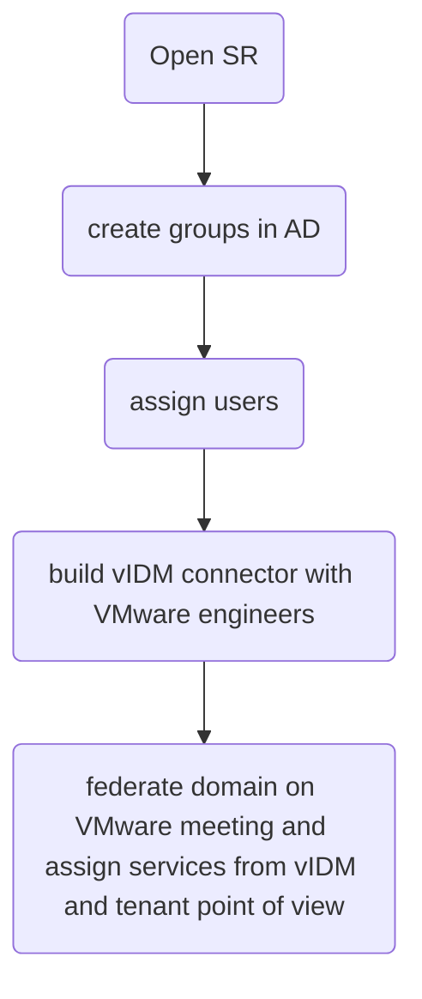

Next step is to assign synced roles as described in ##### Detailed design RBAC service account AD groups

### Detailed design Firewall

#### Detailed design firewall rules

| Service/Traffic Name                   | Source                                                                              | Destination*           | Port(s)                | Protocol |
|----------------------------------------|-------------------------------------------------------------------------------------|------------------------|------------------------|----------|
| Cloud Proxy (via VCS proxy server)     | VMware Cloud Proxy Appliance                                                        | *.vmwareidentity.com   | 443                    | TCP      |
| Cloud Proxy (via VCS proxy server)     | VMware Cloud Proxy Appliance                                                        | gaz.csp-vidm-prod.com  | 443                    | TCP      |
| Cloud Proxy (via VCS proxy server)     | VMware Cloud Proxy Appliance                                                        | *.vmware.com           | 443                    | TCP      |
| ABX Cloud Proxy (via VCS proxy server) | VMware Cloud Proxy Appliance                                                        | *.vmware.com           | 443                    | TCP      |
| ABX Cloud Proxy (via VCS proxy server) | VMware Cloud Proxy Appliance                                                        | *.vmwareidentity.com   | 443                    | TCP      |
| ABX Cloud Proxy (via VCS proxy server) | VMware Cloud Proxy Appliance                                                        | gaz.csp-vidm-prod.com  | 443                    | TCP      |
| vCenter/HTTPS                          | VMware Cloud Proxy Appliance                                                        | vCenter Server         | 443                    | TCP      |
| vCenter/ICMP                           | VMware Cloud Proxy Appliance                                                        | vCenter Server         | ALL                    | ICMP     |
| SDN                                    | VMware Cloud Proxy Appliance                                                        | NSX-T Manager          | 443                    | TCP      |
| Proxy                                  | VMware Cloud Proxy Appliance                                                        | Proxy IP               | {as defined per setup} | TCP      |
| Proxy                                  | ABX VMware Cloud Proxy Appliance                                                    | Proxy IP               | {as defined per setup} | TCP      |
| DNS                                    | VMware Cloud Proxy Appliance                                                        | VCS Domian constrolers | 53                     | TCP      |
| Avamar                                 | VMware Cloud Extensibilty Proxy Appliance / vRealize Orchestrator (for vRA On-Prem) | Avamar Server          | 443                    | TCP      |

Destination note:

- Each of Cloud proxy services (including ABX) always establish connection using VCS proxy server
- VCS proxy server always establish outside connection to particular internet network destination
- Particular destinations for cloud proxy services are defined inside VCS proxy server whitelist for security reasons

## Detailed design Availability and Scalability

### Detailed design availability details

| Component                      | Details                                                                                                |
|--------------------------------|--------------------------------------------------------------------------------------------------------|
| Cloud Proxy Appliance          | Cloud Proxy appliance VM availability is managed by vSphere HA and DR configured on the VCS Management |
| VMware Cloud Automation Portal | Public Portal availability is managed by VMware. Service Availability: 99.5                            |

### Detailed design scalability

#### Detailed design scalability details

| Parameter                 | Count         | Managed Resources | Details                                                                                                            |
|---------------------------|---------------|-------------------|--------------------------------------------------------------------------------------------------------------------|
| Number of Cloud Proxy     | 2 per vCenter | 10000             | More Cloud Proxy Appliances needs to be deployed if the managed resource count would be reaching defined threshold |
| Number of ABX Cloud Proxy | 2 per vCenter | 10000             | More Cloud Proxy Appliances needs to be deployed if the managed resource count would be reaching defined threshold |

Cloud Extensibility Proxy High Availability diagram

Following diagram describes tags assignment relations under tenant org. between project and cloud extensiblity, vRO integrations to enable redundancy.

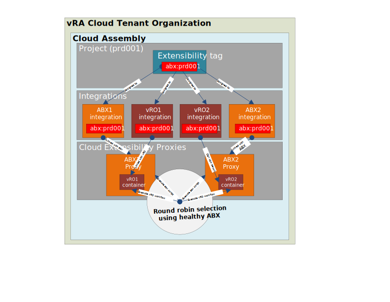

Following diagram describes redundancy flow in case one of available cloud proxies exists in state unhealthy.

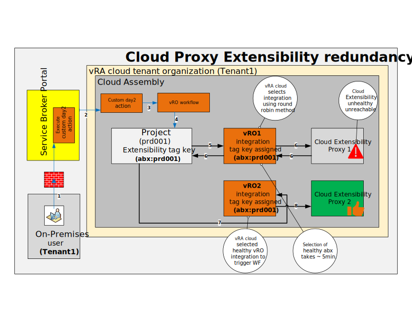

Tenant user requests via Service Broker portal day2 action, next vRA cloud based on assigned extensiblity tag (abx:prd001) inside project makes lookup to find any available healthy vRO integration using same tag. In case selected vRO integration contains unhealthy cloud extensibility proxy , selects next available healthy proxy using same tag (abx:prd001) and executes vRO workflow under docker container.

## Service Request capabilities

## First day request capabilities

Following list covers capabilties available under vra cloud via catalog service (Service Broker)

|                       Name                        | Scope      | Description                                                                                         | Additional details                                                                                                                                                                                                                              |
|:-------------------------------------------------:|:-----------|:----------------------------------------------------------------------------------------------------|:------------------------------------------------------------------------------------------------------------------------------------------------------------------------------------------------------------------------------------------------|
|                     Create VM                     | Deployment | Create new deployment that consist one or more VMs and additional resources like storage or network | Additional VM resource property vmPlacement: {value} is introduced to manage VM placement group via ABX extensibility                                                                                                                           |
|               Place VM in chosen AZ               | Deployment | Create VM extension: Place VM in AZ in line with policy                                             | In stretched cluster scenario locate VM in AZ that will be part of stretched cluster inline with location (dependent of group placement)   **Remark:** Functionality will be available in (VCS 1.1)                                          |
|           Configure VM restart priority           | Deployment | Create VM extension: Sets the VM restart priority                                                   | Restart priority is set using one of the following values: Low, Medium, High                                                                                                                                                                    |
|             Provision VM DR protected             | Deployment | Provision new deployment with VM resources DR protected (VM’s, disks)                               | Add VMs into protection groups in Site Recovery Manager (SRM). Report status of protection on VM level. Capabilities: recovery order, dependencies, shutdown and startup actions. IP customizations integrated with vRA Cloud network profiles. |
|    Dynamically query available Backup policies    | Deployment | Assign a VM backup policy dynamically retrieved from Avamar                                         | When filling in the Service Broker form a VRO action is executed to dynamically retrieve a list of available backup policies that can be selected by the user                                                                                   |
| Dynamically query available SRM Protection Groups | Deployment | Assign a VM to a Protection Group dynamically retrieved from SRM                                    | When filling in the Service Broker form a VRO action is executed to dynamically retrieve a list of available Protection Groups that can be selected by the user                                                                                 |

**More details about standard service requests described under LLD document: [lldServiceCatalog.md](lldServiceCatalog.md#333-standard-service-requests)

## Second day request capabilities

|            Name             | Scope               | Description                                                                                           | Additional details                                                                                                                                                                                                                                                                                                                                             |
|:---------------------------:|:--------------------|:------------------------------------------------------------------------------------------------------|:---------------------------------------------------------------------------------------------------------------------------------------------------------------------------------------------------------------------------------------------------------------------------------------------------------------------------------------------------------------|
| Move deployment between AZs | Deployment          | Migrate all VMs in deployment from hosts located in different AZ                                      | In stretched cluster scenario vmotion VMs from current site to new one located in same cluster. Maintain location properties for CMDB purpose. Place VMs in VM group (Compute Policies? – that is already part of VMC, not sure if that is a way vCenter concept will go forward) assigned to AZ   **Remark:** Functionality will be available in (VCS 1.1) |
|     Move VM between AZs     | Resource            | Migrate chosen VM in deployment from hosts located in different AZ                                    | In stretched cluster scenario vmotion VM from current site to new one located in same cluster. Maintain location properties for CMDB purpose. Place VMs in VM group (Compute Policies?) assigned to AZ   **Remark:** Functionality will be available in (VCS 1.1)                                                                                           |
|   Change VM DR protection   | Deployment/resource | Add VM to DR/remove VM from DR/ Change protection group. Enable and disable VM for disaster recovery. | Allow automation that will have integration with SRM for 2 day activities on protected VM. ABX only. Capabilities: recovery order, dependencies, shutdown and startup actions. IP customizations integrated with vRA Cloud network profiles.                                                                                                                   |
|       Add/remove disk       | Resource            | Add disk to DR protected VM                                                                           | Extend existing 2nd day activities for storage management for DR capabilities. Nee disk added to VM that is configured for DR should be included by default in DR as well.                                                                                                                                                                                     |
| Change VM restart priority  | Resource            | Update VM restart priority                                                                            | Custom 2nd day action for changing the HA VM restart priority released for Active-Active DR type. This action is using a vRO workflow to change the restart priority and update VM tag.                                                                                                                                                                        |
|  Change Disk Storage Class  | Resource            | Change Virtual Machine Disk's storage class                                                           | Custom 2nd Day Action for changing storage class of virtual machine disk. It uses vRO workflow to assign the storage policy mapped to selected vRA storage profile to virtual machine disk.                                                                                                                                                                    |
|   Manage VM backup policy   | Resource            | Add/Remove or change the VM backup policy                                                             | Custom 2nd Day Action for adding, removing and modifying the VM's backup policy. It uses vRO action to retrieve the available backup policies and the policy currently assigned to a given VM before sending the request. When the request is sent, a VRO workflow is used to execute the SSR                                                                  |
|      Backup On-Demand       | Resource            | Perform a VM backup on demand                                                                         | Custom 2nd Day Action for executing an on-demand backup operation using either a policy-defined or a custom retention period.                                                                                                                                                                                                                                  |
|       Backup Restore        | Resource            | Perform a VM restore from backup                                                                      | Custom 2nd Day Action for restoring a VM using one of the available restore points. The list of restore points is dynamically retrieved from Avamar using a VRO action                                                                                                                                                                                         |
| Manage VM A/P DR Protection | Resource            | Add or Remove a VM DR Protection                                                                      | Custom 2nd Day Action for Enabling/Disabling Active/Passive DR Protection on a VM (vSAN only)                                                                                                                                                                                                                                                                  |

## VRO integration with VRA

VCS using VRO actions/workflows on Service Broker Catalog Item in accordance with atos standard and portfolio services. First data request and second day request will be using VRO actions/workflows for automating certain tasks.
VRO will be integrated with Cloud Assembly during deploy phase. VRO deployment, configuration and integration with VRA will be automated using Ansible Playbook.

So far, the following is the only Day1 catalog item that uses a VRO action:

- Deploy Virtual Machine
  - Custom Form
    - Validation(VRO action mapped to validate VM Name)
    - Backup policy (VRO action mapped to retrieve available backup policies)
    - Protection Group (VRO action mapped to retrieve available Protection Groups configured on SRM in the Protected Site)
  - VRA Subscriptions
    - < CustomerCode >-assignVmName (ABX Action)
    - < CustomerCode >-cusVmNameValidation (VRO Action)

All VRO action/workflow related to automation are stored on GIT repository: `https://github.com/GLB-CES-PrivateCloud/VRO-Workflows.git`

Deployment pipeline perform in below sequence,

This execution is part of stage 2 in master deployment playbook dpc-builder.

### VRO integration with GITHUB

vRO integration with GITHUB repository is part of VCS automation. When new ABX is created, vRO will be automatically configured to use GITHUB repository, VCS release Branch will be choosen automatically. The GitHub token will be read from VCS POD Hashi Vault. Machine User (Service Account) will be used for integration, where GITHUB token needs to be generated separately for every customer.

As there is not global password manager for VCS, as temporary solution Machine User accounts with linked DAS Functional accounts and passwords will be stored on GRE2 HashiVault, connection details can be found on DEV LAB Confluence pages.

Customer GitHub shared Machine User account should use following naming convention: `ces-dhc-svc-github-vro-<customerCode>`

To create new Machine User DAS Functional Account with Office 365 need to be created from PISA portal.

Using Organization: Global Functions and following path Home >> IT >> Identity & Security DAS Order functional account - O365

No CHESS2 Device eroll is needed, no local O365 ProPlus is neeed.

DAS Functional Account need to be connected to GitHub by dl-ki-github-supportteam Team.

In Production site only RO authentication token is allowed with following GitHub permissions: read:org, read:project, repo

Any changes to vRO code are allowed only on DEV Environments where GitHub authentication tokens with the following permissions are used: read:org, read:project, repo, write:packages

On DEV Environments it is recommended to use Machine User Shared Account with GitHub Actions prepared on GitHub Repository.

To use GitHub action GitHub branch needs to be configured as `vro-shared-stepping-branch-dhc-<DHC-release-number>` for example `vro-shared-stepping-branch-dhc-1.6`.

When a commit is performed, the commit title should start with a JIRA Story number *(example of the commit message: CESDHC-13 Description)*. Based on this commit message, a new branch is created from a VCS release branch and all changes made on vRO appliances are cherry-picked into it. This allows to use the normal VCS GitHub approval process.

VRO branches do not follow the standard VCS naming convention. All release branches need to contain the VCS version (for example, DHC-1.6-latest). This is because the vRO appliance will not be aware of any changes on GitHub and this in turn can cause the wrong code to be downloaded.

GIT operations on vRO are not automatic. Push and pull operations need to be performed manually. The initial pull operation is performed when vRO is created and GitHub configuration is added.

## Service catalog

VCS will deliver to Customers service broker portal to trigger requests using catalog items.
Catalog items will consume already defined blueprints for first and second day requests.

More details about service catalog topic has been described under LLD document: [lldServiceCatalog.md](lldServiceCatalog.md)

## API capabilities

## Service Catalog

VCS has API first approach. As result all services available in service catalog can be consumed via Service Broker API.Those APIs are validated and tested as part of VCS release cycle.
API documentation is available on swagger.

|    Service     |                                             API Link                                             |
|:--------------:|:------------------------------------------------------------------------------------------------:|
| Service Broker | <https://api.mgmt.cloud.vmware.com/catalog/api/swagger/swagger-ui.html?urls.primaryName=catalog> |

## Blueprinting and Infrastructure management

VCS uses Service Broker APIs for internal purpose only. They can be exposed to 3rd party or intgrator on demand. Those APIs are validated and tested in limited scope as part of VCS release cycle.
API documentation is available on swagger.

|  Service   |                          API Link                          |
|:----------:|:----------------------------------------------------------:|
|    IaaS    |  <https://www.mgmt.cloud.vmware.com/iaas/api/swagger/ui/>  |
| Blueprints | <https://www.mgmt.cloud.vmware.com/blueprint/api/swagger/> |

## CI/CD

VCS uses CICD APIs for internal purpose only. They can be exposed to 3rd party or intgrator on demand. Those APIs are validated and tested in limited scope as part of VCS release cycle.
API documentation is available on swagger.

|   Service   |                         API Link                          |
|:-----------:|:---------------------------------------------------------:|
| Code Stream | <https://www.mgmt.cloud.vmware.com/pipeline/api/swagger/> |
