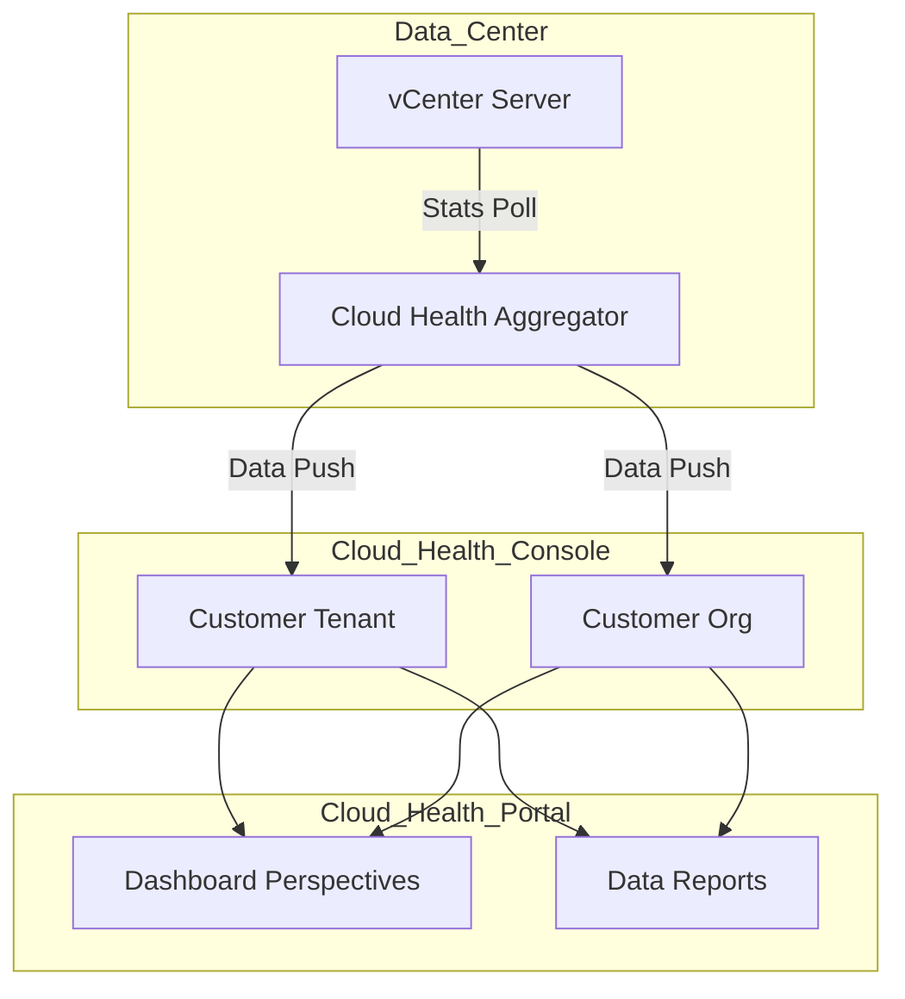
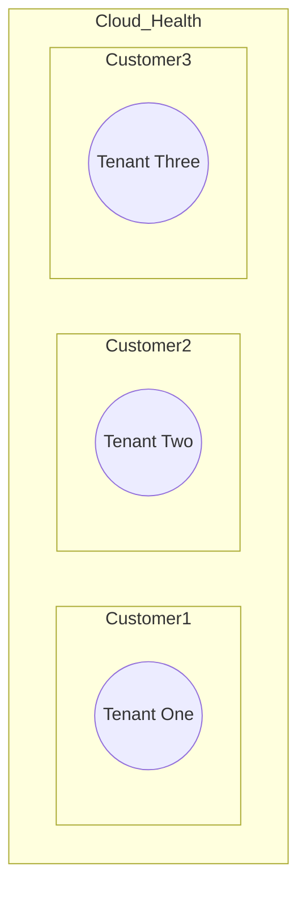
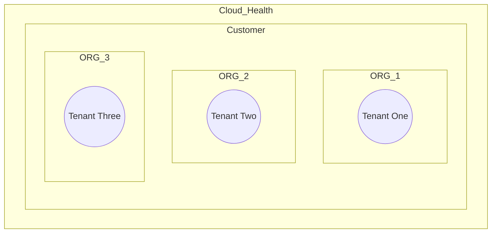
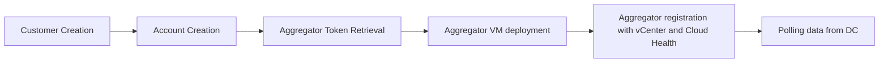
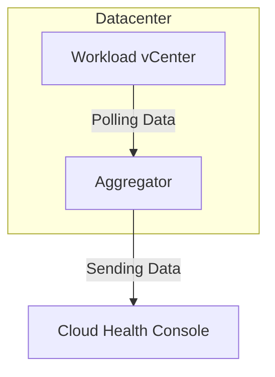
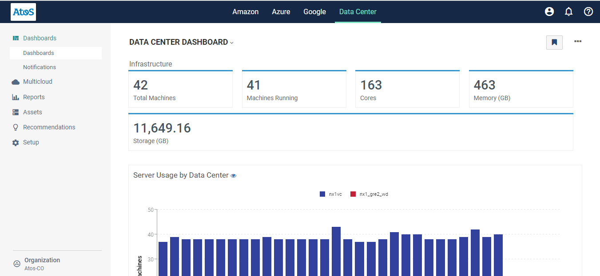

# CloudHealth LLD

# 1 Introduction

## 1.1 Author

### 1.1.1 Document owner

| Author name       | Author email               | Date  | Approver Name |
|-------------------|----------------------------|-------|---------------|
| Pawel Wlodarczyk  |  `pawel.wlodarczyk@atos.net` |       |               |

### 1.1.2 Change history

| Author name           | Author email                   | Date        | Comments                                                     |
| --------------------- | ------------------------------ | ----------- | ------------------------------------------------------------ |
| Krzysztof Hermanowski | `krzysztof.hermanowski@atos.net` |             | Security updates                                             |
| Oliver Scholle        | `oliver.scholle@atos.net`        | 22.04.2021  | Removed billing statements and linked to lldBilling          |
| Shyjin Varaprath      | `shyjin.varaprath@atos.net`      | 04-May-2021 | Added details about the Multi-tenancy structure and segmentation of tenants into "Customers" and/or "Organizations" |

### 1.2 Purpose

The purpose of this document is to provide detailed design and architectural guidance required to implement validated model of a automation and orchestration in accordance with Atos standards and portfolio services. The principal aim of this document is to translate the high-level design (HLD) into a technical low-level design (LLD).

Design is providing component architecture overview in Architecture Overview chapter that provides basic building blocks and main principles, followed by Detailed Logical Design.

Architecture Overview provides basic building blocks and main design principles of presented design. It is covering known requirements cascaded from HLD and other LLDs.
Detailed Logical Design presents business logic, relations and fundamental design decisions.
Detailed Physical Design provides detailed configuration of components including POD type specifics.

## 1.3. Audience

This document is intended for Atos Cloud Services Engineers and Architects responsible for VMware Cloud Services (VCS) solution implementation and maintenance.

## 1.4. Scope

This document is intended to cover the following topics:

- VMware Cloud Health
  - solution design
  - Capacity consumption Reporting
  - Price estimations

## 1.5. Related Documents

This document is a subset of Atos Technology Lifecycle Management (ATLM) artefacts. All documents are stored in the VCS documentation repository.

##### Table 1. ATLM Related Documents

| Document Number                                                  | Document Name                           |
|------------------------------------------------------------------|-----------------------------------------|
| MSD-S28-0000                                                     | [VCS High-Level Design](hldDigitalHybridCloud.md)              |
| MSD-S28-0000                                                     | [VCS SoftwareDefinedNetworks LLD](lldSoftwareDefinedNetworks.md)    |
| MSD-S28-0000                                                     | [VCS Cloud Automation Services LLD](lldCloudAutomationServices.md)  |
| MSD-S28-0000                                                     | [VCS Backup LLD](lldBackup.md) |
| MSD-S28-0000                                                     | [VCS DR LLD](lldDisasterRecovery.md) |
| MSD-S28-0000                                                     | [VCS Naming Convention](namingConvention.md) |

## 1.6. Requirement Levels

This document is following the principles below to categories all requirements and design decisions.

| Term       | Meaning                                                                                                                                                                                                                                                        |
| ------------- | -------------------------------------------------------------------------------------------------------------------------------------------------------------------------------------------------------------------------------------------------------------- |
| MUST       | The definition is an absolute requirement of the specification                                                                                                                                                                                                |
| MUST NOT   | The definition is an absolute prohibition of the specification                                                                                                                                                                                                 |
| SHOULD     | There may exist valid reasons in particular circumstances to ignore a particular item, but the full implications must be understood and carefully weighed before choosing a different course                                                                   |
| SHOULD NOT | There may exist valid reasons in particular circumstances when the particular behaviour is acceptable or even useful, but the full implications should be understood, and the case carefully weighed before implementing any behaviour described with this label |
| MAY        | Any design decisions that are not classified as MUST and SHOULD or covering optional feature that is not general available for VCS product |

# 2. Architecture Overview

VCS will be using Cloud Health for providing dashboards on capacity consumption and price estimations of customer consumed resources and workloads.
VMware CloudHealth is an OPTIONAL integration of VCS leveraging Atos Cloud Financial Management (CFM) Service.
Recommendation is to use CloudHealth for Hybrid customers with requirement to see capacity and pricing comparisons between VMware on-premise cloud and public Hyperscaler cloud stacks in a single portal.

##### Figure 1. Architecture Overview Diagram



## 2.1. Business and Solution Requirements

##### Table 2. Initial Requirements

| ID | Requirement Description | Requirement Source | Requirement Level | State |
| ---- | :---------------------------------------------------------------------------------- | :-: | :--: | :----: |
| R001 | Ability to import 10-20 Atos defined cost drivers and values                        | HLD | MUST | [x] |
| R002 | Report / Allocate / Distribute cost based on PODs, Clusters, Hosts, VMs, vCPUs, RAM | HLD | MUST | [x] |
| R003 | Report / Allocate / Distribute cost based upon period, tags, policies, users, accounts and projects | HLD | MUST | [x] |
| R004 | Stack VMware cost on top of public cloud cost (Multicloud report) | HLD | MUST | [x] |
| R005 | VM Rightsizing | HLD | MUST | [x] |
| R006 | POD / Cluster / Host rightsizing | HLD | MUST | [ ] |
| R007 | VM inventory showing active/stopped, CPU allocated and used, RAM allocated and used, storage allocated and used per storage policy | HLD | MUST | [x] |
| R008 | POD inventory showing capacity and usage (including network usage) per POD, Cluster and Host | HLD | MUST | [x] |
| R009 | Datastore inventory showing capacity (available and used) and usage (IOPS) per storage policy | HLD | MUST | [ ] |
| R010 | SRM aware (able to show SRM attributes, for example that a POD/Cluster/Host/VM is at a recovery site) | HLD | MUST | [ ] |
| R011 | NSX aware (able to show NSX resources like VPN and load balancer) | HLD | MUST | [ ] |
| R012 | Ability to have two different views: one with Atos internal cost levels, one with Customer commercial price level | HLD | MUST | [x] |
| R013 | ability to have different Customer commercial rates (e.g on-demand, 1yr committed, 3yr) | HLD | MUST | [ ] |
| R014 | scripted/automated deployment and configuration using API's | HLD | MUST | [ ] |
| R015 | vRA Cloud; attributes like tags, policies, users, accounts and projects retrieved from vRA (data source for 1.3) | HLD | MUST | [ ] |
| R016 | vRA Cloud users and CloudHealth users synced | HLD | MUST | [ ] |
| R017 | ServiceNow | HLD | MUST | [ ] |
| R019 | ability to schedule the reports | HLD | MUST | [x] |
| R020 | ability to export the reports to CSV | HLD | MUST | [x] |
| R021 | RBAC support, different access rights for different roles | HLD | MUST | [x] |
| R022 | Multi-tenancy, ability to grant users partial scope access (limited to a certain VMware POD, VMware cluster or vRA-project) | HLD | MUST | [x] |
| R023 | 12 month history | HLD | MUST | [x] |
| R024 | Per hour billing | HLD | MUST | [ ] |

## 2.2. Tenancy

Current deployments of Cloud Health have a limited capabilities for separating tenants. The tenants could be created as individual "Customers" in Cloud Health portal or the could be created as "Organizations" within the "Customers"

### 2.2.1. Multi-Tenancy

Cloud Health provides the ability to create individual "Customers" and "Organizations" to handle the customer assets and data.

For achieving multi-tenancy we could also leverage the "Organizations" feature of CloudHealth. Organizations allow customers to limit the visibility of the data available to users in the CloudHealth Console. Using organizations, you can grant multiple stakeholders access to CloudHealth without providing them access to data you do not wish them to see (e.g. the marketing department should see only the infrastructure running on behalf of marketing).

After creating a Customer / Organization, you associate it with one or more "accounts" containing the data you want to be visible. These "accounts" can include both  public cloud accounts (e.g., AWS) and accounts for the on-premise products (e.g. VMware Data Center).



OR



Note: For the current version of VCS we have concluded to go with the "Customer" model of Cloud Health design; in accordance with the inputs from the CFM team.

##### Figure 2. Cloud Health Multi-Tenancy

##### Table 3. Cloud Health Multi-Tenancy Design Decisions

| Decision ID | Design Decision | Design Justification | Implications |
| :-------: | :-------------------------------------- | :-------------------------------------------------------------- | :----------------- |
| CHT001 | "Customers" will be used for tenant separation | CloudHealth "Customers" provide the boundaries for individual tenants. | None |
|   CHT002    | Multiple "Organizations" will be used for a single customer if needed. | This will provide further segmentation of the assets depending upon e.g. departments, etc. | None         |
|   CHT003    | The "Customers"/"Organizations" would be created manually upfront as part of Customer readiness on CloudHealth | This would be the pre-requisite for deploying & integrating CloudHealth component on VCS | None         |

# 3. Detailed Logical Design

## 3.1. Cloud Health Deployment Flow

The following high level workflow describes Cloud Health integration with datacenter.



An account is created for user on Cloud Health Console and token for this registered user is retrieved. The account details are to be provided before deployment phase.

Along with the CloudHealth "user" account details, which has access rights on the CloudHealth Customer/Organization, the VMware DataCenter account (described above in 2.2.1) would also have to be created manually before the Cloud Health Aggregator VM is deployed. The VMware Datacenter account creation step would also provide the token required for installing the Aggregator VM.

The CloudHealth Aggregator VM would be deployed as part of the "Managed Phase" in VCS deployment stages using automation. Post deployment it would be manually integrated with the previously created CloudHealth "VMware Datacenter account" within the "Customer" using respective "service accounts".

These "service accounts" would be created on the VCS management domain controllers, and would be used to restrict access & asset discovery from the vCenter Customer workload segments (resource pools in accordance to a Multi-tenant approach).

To summarize, the following table depicts the scope and requirements for deploying & integrating CloudHealth.

| Sr. No. | Requirement                                                  | Scope             |
| ------- | ------------------------------------------------------------ | ----------------- |
| 1.      | Create "Customer" on CloudHealth Portal for the tenant / client and "user" with permissions on the Customer entity. Hand over the user information to VCS team. | CloudHealth team  |
| 2.      | Create "Organization" (optional) on CloudHealth Portal for the tenant / client | CloudHealth team  |
| 3.      | Create the VCS Active Directory service account for each customer / tenant on VCS management domain. | VCS team          |
| 4.      | Assign the read-only permissions on the vCenter server (resource pools / Cluster) to the service accounts created for the respective tenants | VCS team          |
| 5.      | Set the statistics collection level for vSphere Performance metrics as Level 2 | VCS team          |
| 6.      | Create "VMware Data Center Account" on CloudHealth Portal for discovering the assets from VMware vCenter. | CloudHealth team. |
| 7.      | Create new Aggregator VM (on Cloud Health) & capture the Aggregator Token (first time) while creating the VMware Datacenter account and handing it over to VCS team. | CloudHealth team. |
| 8.      | Deploy the aggregator VM and configure the same via VCS Manage phase playbooks | VCS team          |

Note: We need to make sure that the service account permissions on the respective resource pools in vCenter should be applied first before starting with the VMware Data Center account creation. The sequence matters for the proper discovery of the assets.

## 3.2. Cloud Health Communication Flow

The following diagram shows the communication flow for Cloud Health.



## 3.3. Cloud Health Logical Components

Cloud Health consists of multiple components listed below.

### 3.3.1. Cloud Health Console

Cloud Health console is a VMware managed component located in public web. It provides a GUI and API interface for tasks, reports and data synchronization.

##### Figure 3. Cloud Health Console



Access to Cloud Health Console works through web interface over port 443 and HTTPS protocol. Authentication is done via providing user/service account and password. User or service account is supplied and registered with Cloud Health during deployment.

### 3.3.2. Cloud Health API Interface

Cloud Health can also be accessed through external API interface in order to pull metrics.

| Argument | Value | Description |
| :------: | :----: | :----- |
| Protocol | HTTPS | Protocol that API Interface uses |
| Port | 443 | Port that is used to connect to API interface |
| Standard | REST | Standardization that the API architecture adheres to |
| Authorization | Token | Authorization method is Token, which is pulled from a registered user or service account |
| Content-Type | application/json | Content Type that is returned from API server |

The full list of available APIs is available under the following link:

[https://apidocs.cloudhealthtech.com](https://apidocs.cloudhealthtech.com)

Using the API following areas can be queried:

*Reporting
*Asset
*Account
*Metrics
*Tagging
*Perspectives
*Partner
*Partner Customer Provisioning
*Partner AWS Account Assignment
*Customer Statement

### 3.3.3. Cloud Health Aggregator

Aggregator is a VM factor appliance which is used for gathering statistical data from datacenter environment and sending it to Cloud Health console.
Aggregator is using port 443 for communication with SaaS part.

##### Table 4. Cloud Health Aggregator VM Requirements

| Specification | Value |
| :-----------: | :--------------|
| vCPU | 2 |
| RAM | 2GB |
| Storage | 10GB |

Aggregator can be deployed using a preconfigured virtual machine provided by Cloud Health or using a custom Linux virtual machine with OpenJDK 7/8, curl and OpenSSL.

##### Table 5. Cloud Health Aggregator Design Decisions

| Decision ID | Design Decision | Design Justification | Implications |
| :-------: | :-------------------------------------- | :-------------------------------------------------------------- | :----------------- |
| CHT004 | Custom, existing Linux template to be used for Cloud Health Aggregator deployment | This approach will allow to save space by reusing existing Linux templates | None |
| CHT005 | OpenJDK version 8 will be used with custom Linux template | Longer lifetime and performance improvements | None |

### 3.3.4. Cloud Health Agent

Cloud Health Agent is a binary that can be installed on a Windows or Linux guest. It is mainly used for systems for which statistics are not pulled via Cloud Health Aggregator. It serves the same purpose as the Aggregator, mainly sending statistical data to Cloud Health Console.
For the purposes of this LLD Cloud Health Agent is not used.

| Decision ID | Design Decision | Design Justification | Implications |
| :-------: | :-------------------------------------- | :-------------------------------------------------------------- | :----------------- |
| CHT006 | Cloud Health Agent is not to be used in VCS deployments | There is no need for this granularity in VCS environment | None |

### 3.3.5. Cloud Health Tags

Cloud Health product has the ability for using tags to mark virtual machines / instances. Tags that are set up within Cloud Health are not propagated to public clouds or datacenters. They are a useful asset in grouping object of a certain type to include them in reports.

##### Table 6. Cloud Health Tags Design Decisions

| Decision ID | Design Decision | Design Justification | Implications |
| :-------: | :-------------------------------------- | :-------------------------------------------------------------- | :----------------- |
| CHT007 | Tags will not be used to separate tenants | As the tenant separation is done on a per Org basis tags are not needed and would not be able to provide sufficient separation | None |
| CHT008 | Tags to be used for grouping resources within an Org | For the ease of management and visibility | None |

## 3.4. Pricing Models

Cloud Health has 2 pricing models that can be used for account cost management.

- **Benchmark Pricing** - This pricing model uses the actual VM hardware costs according to industry standards to calculate asset cost.
- **Simple Pricing Calculator** - Manual pricing for recurring and fixed costs. Allows for additional pricing fields configuration.

### 3.4.1. Cost Drivers

The following cost drivers are available for Benchmark Pricing in Cloud Health:

##### Table 7. Cloud Health Cost Drivers

| Cost Driver | Description |
| :------------ | :------------------------------------------------------ |
| Server Hardware | The amortized cost of each Server Hardware is calculated based upon depreciation years and model defined in Cost Settings |
| Storage | Price of storage calculated based on vCenter data store tags |
| License | You can view the License cost of each VM that is computed based on one of the following License type: <ul><li>Per-socket License cost</li><li>Enterprise License Agreement (ELA) cost</li><li>Desktop Licensing cost</li><li>Per-core License cost</li></ul> |
| Maintenance | The cost of maintenance |
| Labour | The total administrative cost for managing physical Servers, Operating Systems and Virtual Machines |
| Network | The total cost of physical network infrastructure that includes Internet bandwidth, which is estimated by count and type of network ports on the ESXi Servers |
| Facilities | The total real estate costs, such as rent or cost of Data Center buildings, Power, Cooling, Racks, and associated facility management cost |
| Additional Cost | Any additional costs for managing or running your Data Center that is added to selected assets |

##### Table 8. Pricing Models Design Decisions

| Decision ID | Design Decision | Design Justification | Implications |
| :-------: | :-------------------------------------- | :-------------------------------------------------------------- | :----------------- |
| CHT009 | Benchmark Pricing selected as the pricing model | Recommended by Cloud Health, well defined counters | None |

## 3.5 VCS Billing (not CloudHealth)

VCS is **not** intended to base the customer billing on the optional CloudHealth component. Instead a scheduled scripting is providing vCenter metering data to CSI and ChargeDB. See lldBilling.md for technical details.

## 3.5.1 Data Export from CloudHealth

For non-billing purposes CloudHealth data Export of cost data is available in two options:

- From Cloud Health Console by subscribing to a particular report. User is receiving daily reports with the following formats
  - json
  - csv
- Pulling report from Cloud Health Console via API which provides the following output
  - json

## 3.5.2 Billing Export to ChargeDB

The metering data exports are to be sent daily via a small python script and a cronjob starting at 00:30 UTC time.
See lldBilling.md for technical details.

Cron syntax for job listed below.

```shell
30 0 * * * /usr/bin/billing-send
```

## 3.6. Availability and Scalability

### 3.6.1. Availability Design

Cloud Health Aggregator is using vCenter server statistical data for gathering metrics information. In the event of aggregator permanent failure a new aggregator can be deployed.

##### Table 14. Cloud Health Availability Design Decisions

| Decision ID | Design Decision | Design Justification | Implications |
| :-------: | :-------------------------------------- | :-------------------------------------------------------------- | :----------------- |
| CHT019 | vSphere High Availability on the cluster level is to be used | There is no need to provide higher level of availability as statistics are pulled from vCenter and it is the one that needs to be fully available | None |

### 3.6.2. Scalability Design

##### Table 15. Cloud Health Scalability Design Decisions

| Decision ID | Design Decision | Design Justification | Implications |
| :-------: | :-------------------------------------- | :-------------------------------------------------------------- | :----------------- |
| CHT020 | Aggregator can handle up to 5000 virtual machines | Currently there is no option for scaling upwards | In larger environments containing more than 5000 VMs per vCenter this can be an issue |

## 3.7. Recoverability

This chapter provides detailed design choices to protect against data loss and datacenter failures.

##### Table 16. Cloud Health Recoverability Design Decisions

| Decision ID | Design Decision | Design Justification | Implications |
| :-------: | :-------------------------------------- | :-------------------------------------------------------------- | :----------------- |
| CHT021 | In the event of host failure vSphere High Availability will restart the virtual machine on another host | None | None |
| CHT022 | In the event of data loss on Aggregator a new Aggregator is to be deployed and registered with Cloud Health Console | There will be no impact as long as vCenter database is available | Dependence on vCenter availability |
| CHT023 | The recoverability of Cloud Health Console is provided by VMware | VMware is the maintainer of Cloud Health Console | None |

## 3.8. Monitoring

CloudHealth is a SaaS service therefore monitoring of the central components is vendor's responsibility. At the time of writing this design VMware stated that
CloudHealth SLA was at 99.9%.
CloudHealth aggregator VM is monitored using standard VMware tools.

# 4. Detailed Physical Design

Detailed physical design is covering fixed configuration detail related to Cloud Health deployment in the data center.

## 4.1. Management Plane

### 4.1.1. Virtual Machine Configuration table

The following tables list virtual machines that are part of implementation of Cloud Health in the datacenter:

##### Table 17. Virtual Machine List

| VM Name | VM Role | Description |
| :------------------: | :--------------------------------: | :---------------------------------------------------------------------------------------------: |
| Cloud Health Aggregator | Gathering statistics from workload domain | Binary installed on top of VCS Linux template |

##### Table 18. Virtual Machine Configuration Details

| Parameter | Value | Description |
| :-----------------------: | :-----: | :-------------------------------------------------------- |
| Number of Instances | 1 | Single Aggregator VM can pull statistical data from 5000 VMs. This is a soft limit |
| Operating System | Ubuntu Linux 64 bit | |
| vCPU | 2 | |
| Memory | 2GB | |
| Storage | 60GB | |

## 4.2. Security

### 4.2.1. Role Based Access Control

By default Cloud Health has the following roles defined:

##### Table 19. Default Cloud Health user roles

| Role Name | Description |
| :---- | :---- |
| Administrator | Has access to all privileges across all data |
| Power User | Has the same privileges as administrator with an exception of creating, editing or deleting organizations and users |
| Standard | Can only view data, read only permission |

##### Table 10. Design Decisions - RBAC

Users with specified roles are assigned to Organization.

| Decision ID | Design Decision | Design Justification | Implications |
| :-------: | :-------------------------------------- | :-------------------------------------------------------------- | :----------------- |
| CHT010 | Standard roles are to be used in Cloud Health for VCS deployments | Simplicity of configuration | Some project may require creation of custom roles |

### 4.2.2. Firewall

This section covers firewall design decisions influencing the content of this LLD.

##### Table 11. Design Decisions - Firewall

| Decision ID | Design Decision | Design Justification | Implications |
| :-------: | :-------------------------------------- | :-------------------------------------------------------------- | :----------------- |
| CHT011 | NSX-T firewall will be used for all Workload Domains | Security increase | Detailed configuration required |
| CHT012 | Traffic between Cloud Health Aggregator and vCenter server is allowed by default on NSX-V firewall | There is no need for such restriction | None |
| CHT013 | Traffic between Cloud Health Aggregator and Cloud Health Console will be limited and will allow only type of traffic necessary for maintaining service | Security Increase | None |
| CHT014 | Traffic originating from Cloud Health Aggregator will go through internet facing proxy server | Required for sending of data to Cloud Health Console | None |

##### Table 20. Firewall Rules

| Service / Traffic Name | Source | Destination | Ports | Protocol |
| :--------------------- | :------------ | :-------------------- | :---: | :----: |
| Aggregator | Cloud Health Aggregator | vCenter Server | 443 | TCP |
| Aggregator | Cloud Health Aggregator | *.cloudhealthtech.com | 443 | TCP |

## 4.3. Availability and Scalability

### 4.3.1. Availability

The following describes availability details for Cloud Health.

##### Table 21. Availability details

| Component | Details |
| :----------- | :--------------------------------------------------------------------------------------------- |
| Aggregator | The availability of Cloud Health Aggregator is assured by HA and DRS functionality of VCS VMware vSphere management domain |
| Cloud Health Console | Availability of Cloud Health Console is managed by VMware |

### 4.3.2. Scalability

##### Table 22. Scalability details

| Parameter | Count | Managed Resources | Details |
| :-------- | :------------- | :---------------- | :---------------------------------------------------------------- |
| Number of Cloud Health Aggregators | One per VMware account | 5000 VMs | A VMware account is linked with vCenter server on a one-to-one basis, this is the current scalability limit for Cloud Health Aggregator |

## 4.4. Security

### 4.4.1 Cloud Health API Interface security

API Key is needed in order to make authenticated requests to the CloudHealth API service.
An API Key is a globally unique identifier (GUID) that CloudHealth generates for each user in the platform. When user makes an API request, this GUID uniquely
identifies and authenticates this user as the originator of the request.
API key can be requested from My Profile in user settings.
This WoW is an industry standard used to e.g. programmatically operate AWS cloud.

### 4.4.1 Multi-factor authentication

CloudHealth console will only be managed by Atos' team. Multi-factor authentication must be enabled for Atos Super Users.
That will require company cellular phone equipped with authentication application:
*Google Authenticator
*Duo Mobile
