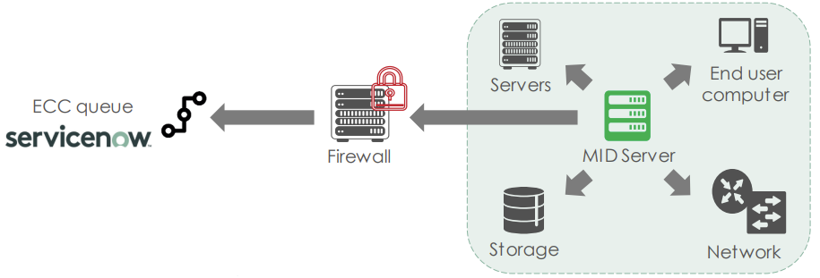

# CMDB Integration LLD

# Table of Contents

- [CMDB Integration LLD](#cmdb-integration-lld)
- [Table of Contents](#table-of-contents)
- [1. Introduction](#1-introduction)
  - [1.1. Purpose](#11-purpose)
  - [1.2. Audience](#12-audience)
  - [1.3. Scope](#13-scope)
  - [1.4. Related Documents](#14-related-documents)
        - [Table 1: ATLM Related Documents](#table-1-atlm-related-documents)
  - [1.5. List of changes](#15-list-of-changes)
  - [1.6. Requirement Levels](#16-requirement-levels)
- [2. Architecture Overview](#2-architecture-overview)
        - [Figure 1. MID Architecture](#figure-1-mid-architecture)
  - [2.1. Business and Solution Requirements](#21-business-and-solution-requirements)
        - [Table 2: Initial Requirements](#table-2-initial-requirements)
  - [2.2. Implementation options](#22-implementation-options)
  - [2.3. Network requirements](#23-network-requirements)
    - [2.3.1.  Network Port and Protocol Requirements](#231--network-port-and-protocol-requirements)
- [3. Detailed Logical Design](#3-detailed-logical-design)
  - [3.1. Security](#31-security)
    - [3.1.1. Role Based Access Control](#311-role-based-access-control)
    - [3.1.2. Network Time synchronization](#312-network-time-synchronization)
  - [3.2. Availability and Scalability](#32-availability-and-scalability)
    - [3.2.1. Availability Design](#321-availability-design)
    - [3.2.2. Scalability Design](#322-scalability-design)
  - [3.3. Recoverability](#33-recoverability)
  - [3.4. Monitoring](#34-monitoring)

# 1. Introduction

## 1.1. Purpose

The purpose of this document is to provide detailed design and architectural guidance required to implement CMDB integration in accordance with Atos standards and portfolio services. The principal aim of this document is to translate the high-level design (HLD) into a technical low-level design (LLD).

Design is providing component architecture overview in Architecture Overview chapter that provides basic building blocks and main principles, followed by Detailed Logical Design.

Architecture Overview provides basic building blocks and main design principles of presented design. It is covering known requirements cascaded from HLD and other LLDs.
Detailed Logical Design presents business logic, relations and fundamental design decisions.
Detailed Physical Design provides detailed configuration of components including POD type specifics.

## 1.2. Audience

This document is intended for Atos Cloud Services Engineers and Architects responsible for VMware Cloud Services (VCS) solution implementation and maintenance.

## 1.3. Scope

This LLD is intended to cover below components and domains:

1. MID Server design
2. Networking requirements

## 1.4. Related Documents

This document is a subset of Atos Technology Lifecycle Management (ATLM) artefacts. All documents are stored in the VCS documentation repository.

##### Table 1: ATLM Related Documents

 | Document Name                                                                 |
 |-------------------------------------------------------------------------------|
 | [VCS High-Level Design](hldDigitalHybridCloud.md)                             |
 | [Low Level Design - Software Defined Networks](lldSoftwareDefinedNetworks.md) |

## 1.5. List of changes

| Version | Date       | Description                          | Author(s)             |
|---------|------------|--------------------------------------|-----------------------|
| 1.0     | 2024-07-17 | Initial draft creation               | Marcin Kujawski       |

## 1.6. Requirement Levels

This document is following the principles below to categories all requirements and design decisions.

| Term       | Meaning                                                                                                                                                                                                                                                          |
|------------|------------------------------------------------------------------------------------------------------------------------------------------------------------------------------------------------------------------------------------------------------------------|
| MUST       | The definition is an absolute requirement of the specification.                                                                                                                                                                                                  |
| MUST NOT   | The definition is an absolute prohibition of the specification                                                                                                                                                                                                   |
| SHOULD     | There may exist valid reasons in particular circumstances to ignore a particular item, but the full implications must be understood and carefully weighed before choosing a different course                                                                     |
| SHOULD NOT | There may exist valid reasons in particular circumstances when the particular behaviour is acceptable or even useful, but the full implications should be understood, and the case carefully weighed before implementing any behaviour described with this label |
| MAY        | Any design decisions that are not classified as MUST and SHOULD or covering optional feature that is not general available for DPC product                                                                                                                       |

# 2. Architecture Overview

The Management, Instrumentation, and Discovery (MID) Server is a Java application that runs as a Windows service or UNIX daemon on a server in your local network. The ServiceNow MID Server enables communication and the movement of data between a ServiceNow instance and external applications, data sources, and services.

The MID Server initiates all communications with the ServiceNow® instance. This communication is recorded as records in the MID Server ECC Queue, which acts as the communication log between the instance and the MID Server. The MID Server picks up any work it has to do from the ECC Queue and returns the results of that work to the queue.

##### Figure 1. MID Architecture

Below components are used in above diagram:

- MID Server: This is the core instance of MID Server instance. This is virtual machine hosted on management cluster, can be either Linux or/and Windows based.
- Firewall: This is management instance of NSX-T which provides connectivity and security of MID Server traffic.
- ECC queue ServiceNow: The MID Server connects to the ServiceNow instance and subscribes to the Asynchronous Message Bus (AMB) which notifies the MID Server if there are jobs in the ECC queue.
  
## 2.1. Business and Solution Requirements

The table below provides known requirements mandatory to be incorporated into design decisions of MID Server instances described in this LLD.

##### Table 2: Initial Requirements

| Decision ID   | Design Decision                                                                                   | Design Justification | Implications      |
|---------------|---------------------------------------------------------------------------------------------------|----------------------|-------------------|
| MID001        | One MID Server (Cluster) per Country / Datacenter would be installed                              | To achive clear setup, split between datacenter and be aligned with naming convention only one MID Server can be installed in each region/datacenter  | None  |
| MID002        | MID Servers should be located on your network that has the maximum visibility to the rest of the network  | To scan all vCenter inventory and objects proper and valid network connectivity have to be delivered | None              |
| MID003        | Both Linux and Windows (mixed) MID Servers have to be deployed to provide full spectrum of infrastructure assessment and inventory scanning | In order to detect all data and perform full inventory scanning having only one - Linux or Windows - is not enough | Linux and Windows MID Servers have to be deployed in each environment |
| MID004        | In order to provide High-Availability solution at least two MID Server have to be deployed        | For better performance and availability reasons two or more MID Servers in a Cluster are required | None |
| MID005        | MID Server OS must be patched in regular schedule with minimal impact on service availability     | To guarantee high level of security, MID Server must be patched according to the best practices | None |
| MID006        | Defined Role Base Access Control (RBAC) model to ensure a proper security isolation               | To increase security level direct access to highly privileged administrative accounts is prohibited. Use of domain user accounts instead is adviced. | None |
| MID007        | Separate MID Servers for sub prod and prod instances are required                                 | Due to performance, scalability and debugging reasons there is a must to separate MID Server instances by different type of environment| None |
| MID008        | MID Server will use a unique service account for CMDB integration                                 | Dedicated service account for MID integration is ServiceNow requirement| None|

## 2.2. Implementation options

Two methods are supported for VCS implementations:

- Single MID Server instance with multiple agents installed
- Multiple MID Server instances - each having exactly one agent installed

Decision about the implementation option is taken based on Customer requirements and has to be aligned and aprpoved with DevSecOps team.

## 2.3. Network requirements

### 2.3.1.  Network Port and Protocol Requirements

The following ports must be allowed within management network:

| Source Component       | Destination Component      | Transport Protocol | Port | Purpose                      |
|------------------------|----------------------------|--------------------|------|------------------------------|
| MID Server             | vCenter Server             | TCP                | 443  | Inventory scanning           |
| MID Server             | Domain Controllers         | TCP                | 3268 | For queries targeted to the global catalog (AD) |
| MID Server             | Proxy Server               | TCP                | 3128 | Internet access              |
| Terminal Servers       | MID Server                 | TCP                | 22   | SSH access                   |
| Proxy Server           | ServiceNow instance (*.service-now.com) | TCP   | 443  | Access to ServiceNow portal  |

# 3. Detailed Logical Design

MID Server VM is deployed to the management zone, next to each site's vCenter Server, and provides a single plane for CMDB integration.

## 3.1. Security

### 3.1.1. Role Based Access Control

Atos based solutions must guarantee proper access management. MID Server will be only managed by VCS Operations team. VCS administrator must be a member of Server Administrator AD role/group to manage MID Server instances.

### 3.1.2. Network Time synchronization

In order to provide accurate time and date values the MID Server instance will have NTP protocol synchronization enabled and it will synchronize with local Active Directory servers. The NTP solution used for this is `chrony`.

## 3.2. Availability and Scalability

### 3.2.1. Availability Design

| Decision ID   | Design Decision                                                                                   | Design Justification | Implications      |
|---------------|---------------------------------------------------------------------------------------------------|----------------------|-------------------|
| MID009        | MID Server VM availability is managed by vSphere HA and DR configured on the VCS Management | No need for higher availability | None |
| MID010        | MID Server VM is to be backed up by VCS backup solution | To provide another level of availability and access to history files | None |

MID Server availability will be based on the VMware High-Availability feature. Therefore no additional availability mechanisms are required.

### 3.2.2. Scalability Design

| Object                            | Limit | Description                                                                |
|-----------------------------------|-------|----------------------------------------------------------------------------|
| MID Server VM                     | 5     | There should be no more than 5 virtual machines that host MID Server Agent |
| MID Server Agent                  | 5     | No more than 5 MID agents can run on single MID Server VM                  |

## 3.3. Recoverability

MID Server will be added to the default management backup policy. Therefore no additional recoverability mechanisms are required.

## 3.4. Monitoring

Monitoring of the MID Server will be done using vROPS functionality extended by vROPS Management Pack.
