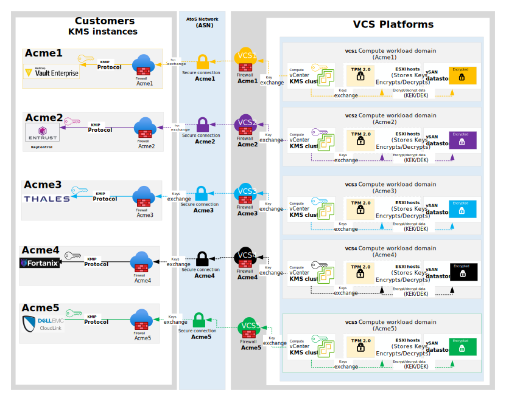
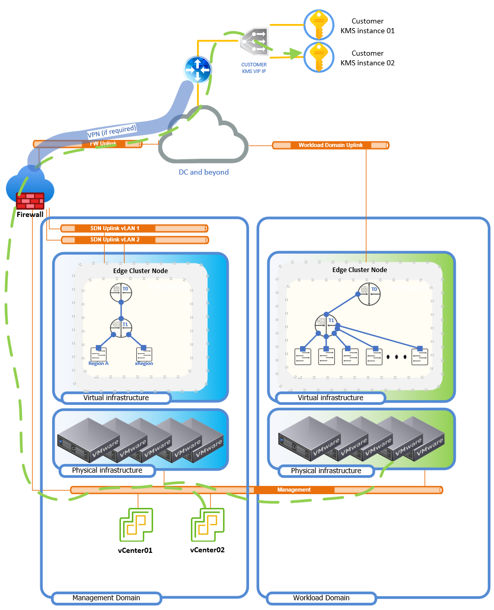

# Customer Self-Managed Encryption Keys (BYOK) – Low Level Design (LLD)

## Table of Contents

- [1. Introduction](#1-introduction)
- [2. Architecture Overview](#2-architecture-overview)
- [3. Security Design](#3-security-design)
- [4. Availability and Hosting Model](#4-availability-and-hosting-model)
- [5. Design Constraints, Limitations and Lessons Learned](#5-design-constraints-limitations-and-lessons-learned)
- [6. Monitoring and Alerting](#6-monitoring-and-alerting)
- [7. Proof of Concept Summary](#7-proof-of-concept-summary)
- [8. Abbreviations and Definitions](#8-abbreviations-and-definitions)

# 1. Introduction

## 1.1. Purpose

The purpose of this document is to provide low-level design guidance for enabling
**Customer Self-Managed Encryption Keys (BYOK)** within VMware Cloud Services (VCS),
focusing on **vSAN Data-At-Rest Encryption (DARE)** and optional **VM Encryption**,
using a **customer-provided external Key Management Service (KMS)**.

Detailed onboarding and implementation steps are intentionally excluded and
covered in a separate Work Instruction (WI).

## 1.2. Audience

This document is intended for **Atos Cloud Services Engineers, Architects, and
VCS Operations teams** responsible for designing and validating encryption
solutions for customer workloads hosted on VCS platforms.

## 1.3. Scope

This LLD covers:

- Customer Self-Managed Encryption Keys (BYOK)
- Integration of external customer-hosted KMS with VCS
- vSAN Data-At-Rest Encryption (DARE)
- Optional VM Encryption
- Security, tenancy, and operational design considerations

This LLD does **not** cover:

- Detailed KMS deployment or configuration
- Customer onboarding or implementation workflows
- Automation and operational runbooks
- Compliance key ceremonies and customer-specific processes

## 1.4. Related Documents

This document is part of Atos Technology Lifecycle Management (ATLM) artefacts and
is stored in the VCS documentation repository.

| Document Name |
|--------------|
| [VCS High-Level Design](hldDigitalHybridCloud.md) |
| [Work Instruction – BYOK Onboarding & Implementation](../workInstructions/wiCustomerSelfManagedEncryptionKeys.md) |

## 1.5. List of Changes

| Version | Date       | Description            | Author |
|--------|------------|------------------------|--------|
| 0.1    | 2025-12-15 | Initial draft creation | Mihai Radan |
| 0.2 | 2026-01-14 | Initial draft review and updates | Tomasz Korniluk |
| 0.3 | 2026-01-16 | Monitoring and alerting updates | Mihai Radan |

## 1.6. Requirement Levels

|    Term    | Meaning                                                                                                                                                                                                                                                         |
|:----------:|-----------------------------------------------------------------------------------------------------------------------------------------------------------------------------------------------------------------------------------------------------------------|
|    MUST    | The definition is an absolute requirement of the specification.                                                                                                                                                                                                 |
|  MUST NOT  | The definition is an absolute prohibition of the specification.                                                                                                                                                                                                 |
|   SHOULD   | There may exist valid reasons in particular circumstances to ignore a particular item, but the full implications must be understood and carefully weighed before choosing a different course                                                                    |
| SHOULD NOT | There may exist valid reasons in particular circumstances when the particular behaviour is acceptable or even useful, but the full implications should be understood and the case carefully weighed before implementing any behaviour described with this label |
|    MAY     | Any design decisions that are not classified as MUST and SHOULD or covering optional feature that is not general available for VCS product                                                                                                                      |

# 2. Architecture Overview

Certain governmental and regulated customers require full ownership and control
of encryption keys used to protect their data. In these scenarios, encryption keys
must not be generated, stored, or managed by the service provider.

The BYOK design enables VCS storage encryption services-specifically **vSAN DARE** and
optional **VM Encryption**-to leverage a **customer-hosted external KMS** using
supported interfaces such as **KMIP**. The design remains vendor-agnostic while
validating HashiCorp Vault Enterprise as a supported implementation.

Key architectural principles:

- Customer ownership and control of encryption keys
- Clear separation of responsibilities between VCS and customer
- Secure, authenticated KMS communication
- Tenant isolation aligned with encryption boundaries

##### Figure 1 BYOK Architecture



The diagram above illustrates a BYOK architecture leveraging top‑tier KMS solutions that use the KMIP protocol to provide vSphere vSAN DARE encryption.

##### Figure 2 BYOK Network Architecture



The diagram above illustrates a BYOK network architecture. It is based on the assumption of a customer-side build with a KMS implementation (including a Load Balancer and a minimum of 2 KMS servers). It also shows the potential use of a VPN and a likely configuration.

Traffic between components is marked with a green dotted line. This includes traffic from VCS vCenter02 and ESXi hosts in the workload domain to the KMS server over TCP port 5696. This is one-way traffic, which on modern stateful firewalls only requires opening traffic towards the destination.

## 2.1. Business and Solution Requirements

| ID   | Requirement Description | Requirement Source | Level |
|------|------------------------|-------------------|-------|
| R001 | Support vSAN DARE using customer-provided KMS | Business / Regulatory | MUST |
| R002 | Customer retains full ownership of encryption keys | Business / Regulatory | MUST |
| R003 | External KMS hosted and operated by customer | Business / Security Policy | MUST |
| R004 | Integration via supported standards (KMIP 1.1) | VMware Documentation / PoC | MUST |
| R005 | Encryption isolation per tenant | Architecture / Security | MUST |
| R006 | Dedicated encrypted datastore per tenant | Architecture / PoC | MUST |
| R007 | VM Encryption optional | Platform Capability | MAY |
| R008 | KMS availability and key lifecycle owned by customer | Operating Model / Security | MUST |
| R009 | Support key rotation without downtime | Security Best Practice / PoC | SHOULD |
| R010 | Minimum Encryption key rotation period 1 Year  | Security Best Practice | SHOULD |
| R011 | Customer KMS certificates for the vCenter trust expiration time at least 1 Year | Security Best Practice | SHOULD |
| R012 | Support ad-hoc key rotation based on customer request | Business / Security Policy | SHOULD |
| R013 | Support recovery scenarios requiring key retrieval | Business Continuity / PoC | MUST |
| R014 | Explicit network connectivity definition | PoC / Network Design | MUST |
| R015 | Trust via customer-provided TLS certificates and private keys | Security / VMware | MUST |
| R016 | Customer KMS trust certificates stored in the secure location (outsite VCS platform) | Business / Security Policy | MUST |
| R017 | VCS platform monitors availability of the Customer KMS instance| Operating Model / Security | MUST |
| R018 | VCS platform detects compute vCenter KMS errors and generate alerts | Operating Model / Security | MUST |

## 2.2. Key Management and KMS Integration Model

- Encryption keys are fully managed by the customer
- VCS integrates with external KMS via KMIP protocol
- Mutual trust between VCS vCenter and customer KMS is mandatory
- Design remains generic across VMware Compatibility Guide – supported KMS solutions
- HashiCorp Vault Enterprise validated via PoC

## 2.3. Multi-Tenant Encryption Model

- Encryption boundaries align with datastore and cluster scope
- Dedicated vSAN clusters or workload domains are required per tenant

## 2.4. Network Requirements

External KMS integration requires reliable and secure network connectivity
between **vCenter Server**, **ESXi hosts**, and the **external KMS**.

### Required Ports and Protocols

| Source | Destination | Protocol | Port | Traffic classification | Purpose |
|------|------------|----------|------|--------|-----|
| vCenter Server | External KMS | TCP | 5696 | Outgoing | KMIP communication |
| ESXi Hosts | External KMS | TCP | 5696 | Outgoing | Key retrieval and encryption operations |

All KMIP communication, including initial trust establishment, certificate
exchange, and ongoing key management operations, is performed over default TCP 5696 port.
All communication MUST be encrypted using TLS in minimum version 1.2.

The VCS platform treats loss of connectivity on this port as a critical fault and will raise an alert (see point 6).

Network interruptions may prevent encryption enablement, key rotation, or key
regeneration operations.

## 2.5. Platform Hardware Requirements

To implement vSAN Data‑At‑Rest Encryption (DARE) in the VCS compute cluster, the following minimum requirements must be met, as described in the table below.

| Component | Minimum Requirement | Source | Mandatory | Description|
|------|------------|----------|------|------|
| CPU | Must support AES‑NI | Broadcom | Yes | DARE encryption is not supported or recommended without it because performance will degrade heavily |
| Cache tier | 1× SSD/PCIe Flash per disk group| Broadcom | Yes | Delivers reasonable performance for the encryption/decryption operations under vSAN cluster |
| Capacity tier | 1× SSD/PCIe Flash per disk group| Broadcom | Yes | Delivers reasonable performance for the encryption/decryption operations under vSAN cluster |
| Networking vSAN traffic | 10GbE | Broadcom | Yes | Production clusters, especially with all‑flash + encryption, should use 25 GbE or better |
| Cluster | 4 nodes | Broadcom | Yes | For the production use case, this is the minimum required to deliver maintenance without losing redundancy. |
| Trusted Platform Module (TPM) | TPM module in version 2.0 | Broadcom | Yes | With TPM 2.0, ESXi hosts can store encryption keys securely in hardware and continue encrypted operations even if the KMS becomes unavailable |

# 3. Security Design

## 3.1. Role Based Access Control (RBAC)

**Customer**

- Owns and operates the KMS instance
- Manages key lifecycle and access policies
- Ensures KMS availability and recoverability
- Reponsible to deliver valid certificates to establish trust between KMS instance and VCS compute vCenter
- Manage lifecycle for the KMS trust certificates

**VCS Platform**

- Uses service accounts for cryptographic operations
- Has no access to key material
- Access limited to required encryption operations
- Permissions to establish trust between KMS instance and compute vCenter

## 3.2. Required Permissions

### vCenter Permissions

- Host > Inventory > Modify Cluster
- Cryptographic Operations > Manage encryption policies
- Cryptographic Operations > Manage KMS
- Cryptographic Operations > Manage keys

##### Figure 2 Table defines VCS KMS role based access control

| AD group name | vCenter role | Mandatory | KMS operations | Description |
|------|------------|----------|------|------|
|rsce-`<VcsSiteCode>`-vcs-l-admins|No crypthography administrator| Yes| Deny `Add disk,Clone,Decrypt,Direct Access Encrypt,Encrypt new,Manage KMS,Manage encryption policies,Manage keys,Migrate,Read KMS information,Recrypt,Register VM,Register host`|Deny to manage vCenter KMS settings and vSAN DARE encryption settings |
|rsce-`<VcsSiteCode>`-kms-l-admins|Administrator| Yes|Allow `Add disk,Clone,Decrypt,Direct Access Encrypt,Encrypt new,Manage KMS,Manage encryption policies,Manage keys,Migrate,Read KMS information,Recrypt,Register VM,Register host` |Allows nominated administrators to fully manage vCenter KMS settings and vSAN DARE encryption settings includes VM encryption enablement|
|rsce-`<VcsSiteCode>`-kms-l-operators|VMOperator Controller Manager|Yes|Allows KMS operator activities: `Add disk,Clone,Direct Access,Encrypt,Encrypt new,Migrate,Recrypt`|Allow baseline KMS tasks for operation teams use case|

### KMS (KMIP) Permissions

The KMIP role MUST allow:

- Server: Discover Versions
- Managed Objects: Create, Activate, Get, Locate, Rekey, Revoke, Destroy
- Object Attributes: Get Attributes
- Cryptographic Operations: Encrypt, Decrypt, Register

Incorrect permissions may prevent trust establishment or encryption enablement.

### 3.3. Firewall / ACL Policy for KMIP Traffic

| Direction | Source | Destination | Protocol | Port | Action | Comment |
| --- | --- | --- | --- | --- | --- | --- |
| Outbound | MGMT‑VCS (vCenter) | KMS‑EXTERNAL (all KMS nodes) | TCP | 5696 | ALLOW | VM Encryption key exchange |
| Outbound | ESXi‑MGMT | KMS‑EXTERNAL | TCP | 5696 | ALLOW | vSAN‑DARE key exchange |
| Outbound | TRUST‑AUTH | KMS‑EXTERNAL | TCP | 5696 | ALLOW | Trust‑Authority KMIP calls |

[!IMPORTANT] ``` ** While using TLS Inspection ensure it does not terminate the KMIP session (KMIP expects a persistent TLS channel). Either bypass the proxy for port 5696 or use end‑to‑end TLS with certificates that the proxy trusts. ** ```

Key Management Service on customer side may not be reachable via secure connection for any reason, therefore expected is IPSEC VPN or any other VPN deployment. VPN termination should be done on Management Firewall towards destination on customer side. Entire traffic towards KMS must be strongly secured below are suggested values for VPN:

| Parameter | Recommendation | Clarification |
| Protocol IKE | IKEv2 | Highly secure and stable with Dead-Peer-Detection |
| Encryption(ESP) | AES-256-GCM | Provides confidentiality and integrity, as well as high performance and low latency |
| Diffie-Hellman (DH) | Group 14 or 19 (ECP-256) | Group 19 (Elliptic Curves) provides better performance and security |
| Authentication | RSA-sig (certificates) | Mutual identity verification. RSA keys should be at least 2048-bit |
| Encapsulation Mode | Tunnel Mode | Full packet encapsulation; hides internal network topology from the public transit path |
| MTU / TCP MSS | TCP Maximum Segment Size : 1360 bytes | **CRITICAL** Prevents TLS packet fragmentation caused by the additional IPsec/ESP header overhead |

VPN required actions:

- validate all required ports for VPN between endpoints are opened ( IPSec VPN required UDP 500 and UDP 4500 )
- routing between endpoints must be set up (possible exit to internet may be required)
- identity must match in VPN (IDr/IDl) with SAN/CN in certificates RSA (VPN setup certificates)
- redundancy should be covered with Dead-Peer-Detection for automatic restart of tunnel after issues
- MSS Clamping must be set up and limited to 1360 bytes

## 3.4. Certificates, Trust and Secure Storage

- KMS endpoints MUST use RSA-based TLS certificates
- ECDSA certificates are not supported
- Trust must be established before enabling encryption

Trust establishment requires customer-provided credentials:

- KMS server certificate
- Corresponding private key
- Optional CA certificate chain

Credentials are securely stored within the VCS platform using a secure credential
store (e.g. platform HashiVault or equivalent). Certificate lifecycle management
remains the customer’s responsibility.

### 3.4.1 Certificates lifecycle

Based on the design requirements KMS trust certificates delivered by Customer should expire after 1 year.
In case delivered certificates contains longer expiration period requires additional Risk Acceptance signoff during integration.

The operations team needs to monitor the expiration time of the KMS trust certificate and obtain a new one before the old certificate expires.
If the old certificate expires, the connection between the compute vCenter and the customer’s KMS will break, and KMS key rotation operations will no longer be allowed.

# 4. Availability and Hosting Model

## 4.1. External KMS Hosting Model

- KMS is customer-hosted and outside VCS scope
- Must not run on encrypted datastores it manages
- Availability, backup, and DR are customer responsibilities

## 4.2. KMS Availability, Outage Impact and TPM Considerations

The availability of the external Key Management Service (KMS) is critical for the correct operation of vSAN Data-At-Rest Encryption (DARE) and VM Encryption. Similar to foundational services such as DNS or NTP, KMS availability directly affects encryption enablement, key management operations, and recovery scenarios.

Use of **Trusted Platform Modules (TPM)** on each ESXi host allows keys to be
persisted locally and reduces dependency on immediate KMS availability.

---

### 4.2.1. KMS Availability Design Considerations

The external KMS is customer-provided and customer-operated. As such:

- Customers MUST design the KMS for high availability and resiliency
- KMS solutions typically provide clustering or multi-node configurations
- Loss of KMS availability may impact encryption-related operations

Choosing a resilient KMS architecture is a key part of the overall vSAN
encryption design.

### 4.2.2. Impact of KMS Unavailability

Based on VMware documentation and PoC observations:

- Existing encrypted data remains accessible while keys are cached in ESXi hosts
- Provision of new vm to encrypted cluster is still possible
- New encryption operations (e.g. enabling DARE, VM encryption, key rotation) are blocked during KMS outage
- Host reboot without TPM may require KMS access to unlock disk groups

This makes KMS availability particularly critical during host reboots and
recovery scenarios.

### 4.2.3. Trusted Platform Module (TPM) Key Persistence

An additional level of resilience can be achieved by persisting encryption keys
on ESXi hosts using a **Trusted Platform Module (TPM)**.

When TPMs are present and configured:

- Encryption keys distributed to ESXi hosts can be securely persisted locally
- Hosts are able to unlock and mount encrypted disk groups even if the external
  KMS is temporarily unavailable
- Dependency on immediate KMS availability during host boot is reduced

**VMware recommends the use of TPMs on each ESXi host** participating in a
vSAN cluster with encryption enabled.

### 4.3 Network‑Level High‑Availability & Redundancy

| Decision ID | Design Decision | Design Justification | Design Implication |
| --- | --- | --- | --- |
| byok-net-01 | Deploy at least two physically separate network paths. Use ECMP if possible | Improves HA and redundancy on physical network layer | Already supported by current design |
| byok-net-02 | Limit Jitter Sensitivity | By default we have enabled TCP window scaling | N/A |
| byok-net-03 | 1500 bytes MTU size | Management network is configured with 1500 bytes MTU and this is what is being applied | N/A |
| byok-net-04 | KMS should be required to be behind Load Balancer or any clustering to avoid single point of failure | To have HA and Redundancy KMS should have redundancy applied on customer end | This must be implemented on KMS end |
| byok-net-05 | IPsec/VPN | If KMS must be reached over untrusted WAN, encapsulate TCP 5696 in an IPsec tunnel (adjust MTU with VPN overhead limitation) | Not standard communication must be created, best on Management Firewall |

# 5. Design Constraints, Limitations and Lessons Learned

## 5.1. vSAN Cluster Sizing and Capacity

Enabling or disabling vSAN Data-At-Rest Encryption (DARE) requires a disk group
format change. During this process, data from disk groups must be temporarily
evacuated and relocated elsewhere within the vSAN cluster.

To support this operation safely, the cluster must provide sufficient capacity
and placement options for evacuated data.

Key considerations:

- vSAN clusters must have enough nodes or fault domains to accommodate data
  evacuation during disk group format changes
- **3-node vSAN configurations** typically require the use of **Reduced
  Redundancy** during encryption enablement or disablement, as there is no
  additional node available to temporarily host evacuated data
- **2-node vSAN configurations** are treated identically to 3-node clusters for
  disk format change operations and also require **Reduced Redundancy**
- In **3 fault domain configurations**, Reduced Redundancy requirements depend
  on the number of hosts per fault domain and available free capacity
- Even in clusters with sufficient fault domains, Reduced Redundancy may still
  be required if there is not enough free capacity to relocate evacuated data

Insufficient cluster capacity or fault domain design may prevent encryption
operations from completing successfully.

## 5.2. KMS / KMIP Configuration Constraints

- KMIP role must allow `Discover Versions`
- Incorrect role definitions break trust with vCenter

## 5.3. TLS Certificate Constraints

- RSA certificates required
- ECDSA certificates unsupported

## 5.4. Content Library Limitations

- VM encryption not supported during OVF deployment
- Encrypted VM templates not supported in Content Library

VM encryption must be enabled post-deployment.

# 6. Monitoring and Alerting

Monitoring of **Customer Managed Encryption Keys Server** is required to
detect conditions that may impact encryption operations, data availability, or
key lifecycle management within the VCS platform.

As the external **Key Management Server (KMS)** is hosted and operated by the
customer, monitoring responsibilities are **shared** between the VCS platform
and the customer.

The VCS platform focuses on detecting **service impact** caused by KMS
unavailability or misconfiguration, rather than monitoring the internal health
of the customer-managed KMS.

## 6.1. Monitoring Scope and Responsibility

| Component | Monitoring Responsibility |
|----------|---------------------------|
| Customer KMS internal service health (OS, storage, clustering) | Customer |
| KMS availability from vCenter / ESXi | VCS platform |
| vSAN Data-At-Rest Encryption (DARE) state | VCS platform |
| VM Encryption state | VCS platform |
| KMS certificate trust and connectivity | VCS platform |
| Key lifecycle operations (e.g. rekey) | Shared |

The VCS platform **does not monitor internal KMS health**, but monitors its
availability and operational impact on VCS services.

## 6.2. Platform-Level Monitoring

### 6.2.1. vSphere and vSAN Skyline Health

The VCS platform relies on **vSphere and vSAN Skyline Health** to continuously
monitor the availability, trust, and operational state of the external
customer-managed KMS.

Skyline Health provides built-in health checks that detect conditions impacting
encryption operations and key lifecycle management.

#### KMS Connectivity and Trust Health Checks (vCenter-Level)

The following KMS-related metrics are monitored at the vCenter level:

| Metric | Description |
|------|------------|
| KMS Cluster | Logical grouping of configured KMS endpoints |
| KMS Alias | Identifier of the registered Key Provider |
| Connection Status | Connectivity state between vCenter and KMS |
| Key State | Availability of encryption keys |
| Key Expiration State | Validity of active encryption keys |
| Trust Status | Mutual trust state between vCenter and KMS |
| Certificate Status | Validity of TLS certificates |
| Server Certificate Expiration Date | Expiry date of KMS server certificate |
| Client Certificate Expiration Date | Expiry date of vCenter client certificate |
| Issue | Detected configuration or operational issues |

The Skyline Health check **“VMware vCenter and all hosts are connected to Key
Management Servers”** evaluates these metrics and raises warnings or alerts if
any condition is not compliant.

#### Host-Level KMS Connectivity Health Checks

Skyline Health also monitors KMS connectivity from the ESXi host perspective to
ensure encrypted disk groups can be accessed and managed.

The following host-level metrics are evaluated:

| Metric | Description |
|------|------------|
| Host | ESXi host identifier |
| KMS Cluster | Assigned KMS cluster |
| KMS Alias | Key Provider assigned to the host |
| Connection Status | Connectivity state between ESXi host and KMS |
| Key State | Availability of encryption keys on the host |

Loss of host-level connectivity to the KMS may impact disk group unlock
operations, particularly during host reboot scenarios.

Any degradation detected at host level is surfaced in vSAN Skyline Health and
propagated to higher-level monitoring systems.

## 6.2.2. VMware Aria Operations (vROps)

Encryption and KMS-related health events generated by vSphere and vSAN Skyline
Health are consumed by **VMware Aria Operations (vROps)**.

vROps provides:

- Centralized visibility across all compute workload domains
- Correlation of KMS connectivity, trust, and certificate-related issues
- Alert severity classification based on operational impact

vROps complements Skyline Health by aggregating and correlating health signals
rather than replacing native checks.

Alerts generated in vROps are forwarded via the **HTTP Gateway (HttpGW)**
integration to the enterprise ITSM platform (ServiceNow), enabling automated
incident creation and operational response.

## 6.3. Alert-to-Incident Flow (ServiceNow)

Any degradation detected by vSphere or vSAN Skyline Health related to the
customer-managed external KMS is propagated to **VMware Aria Operations (vROps)**.

Examples of monitored degradation conditions include, but are not limited to:

- Loss of connectivity between vCenter / ESXi hosts and the KMS
- KMS trust state errors
- Certificate validity or expiration warnings
- Encryption or key state inconsistencies

When such conditions are detected, the following high-level alert flow applies:

1. vSphere or vSAN Skyline Health generates a health warning or alert.
2. The alert is ingested and correlated by **VMware Aria Operations (vROps)**.
3. vROps forwards the alert to the **HTTP Gateway (HttpGW)**.
4. The HTTP Gateway processes and normalizes the alert payload.
5. The processed alert is forwarded to **ServiceNow (SNOW)**.
6. A ServiceNow incident is created or updated and assigned to the appropriate
   DevSecOps team.

This alert-to-incident flow ensures that any degradation impacting KMS availability
or encryption operations is **automatically detected,
correlated, and tracked** using the standard VCS incident management process.

## 6.4. Customer Responsibilities

As the external KMS is hosted and operated by the customer:

- Monitoring of KMS service health, availability, and clustering remains the
  customer’s responsibility
- Customers SHOULD implement native monitoring and alerting for their KMS
- Customers MAY integrate KMS audit and security events into a SIEM platform

Optional managed monitoring or SIEM services MAY be offered under separate
commercial agreements.

## 6.5. Design Considerations

- Platform monitoring focuses on **impact detection**, not root-cause analysis
  within the customer KMS
- Clear escalation paths between VCS operations teams and the customer are
  required
- Certificate lifecycle monitoring is critical to prevent trust expiration and
  service disruption
- Detailed operational response procedures are documented separately in
  Work Instructions

# 7. Proof of Concept Summary

PoC successfully validated:

- Vault Enterprise KMIP integration
- Two-way trust establishment
- vSAN DARE enablement
- VM encryption
- ESXi host encryption verification

# 8. Abbreviations and Definitions

| Term | Description |
|------|------------|
| BYOK | Bring Your Own Key |
| DARE | Data At Rest Encryption |
| DEK | Data Encryption Key |
| KMS | Key Management Service |
| KMIP | Key Management Interoperability Protocol |
| VCS | VMware Cloud Services |
| LLD | Low Level Design |
| TPM | Trusted Platform Module |
