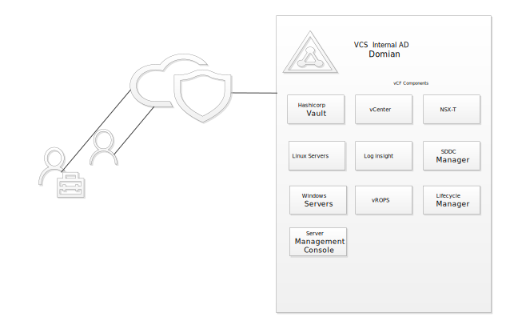
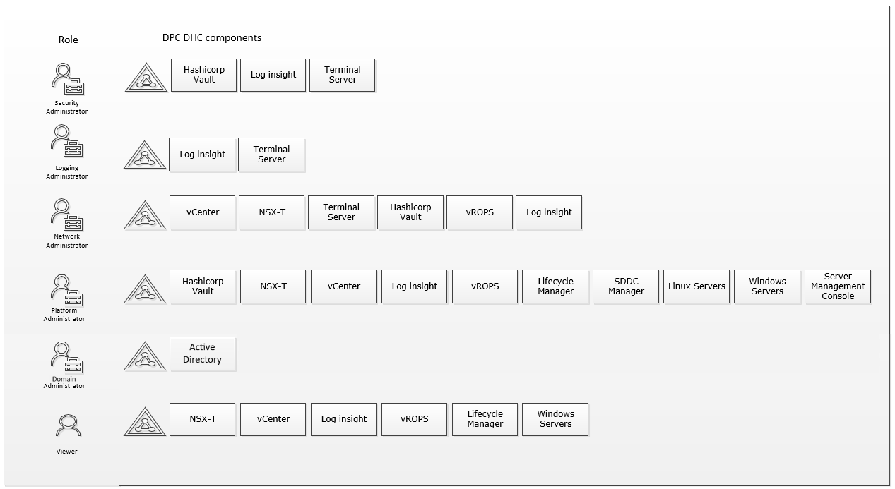
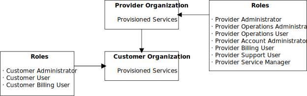
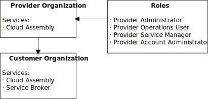
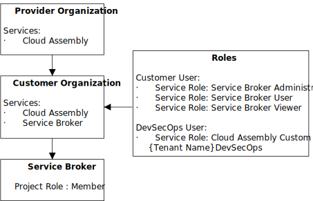
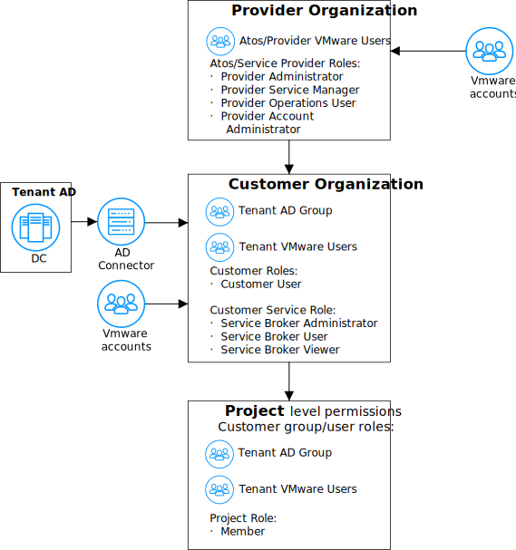
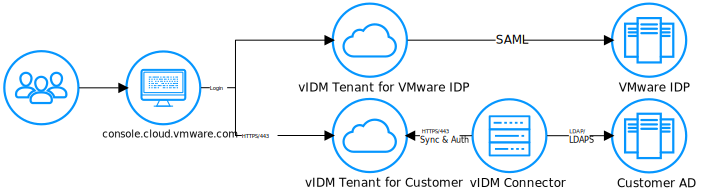
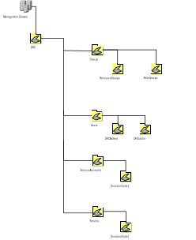
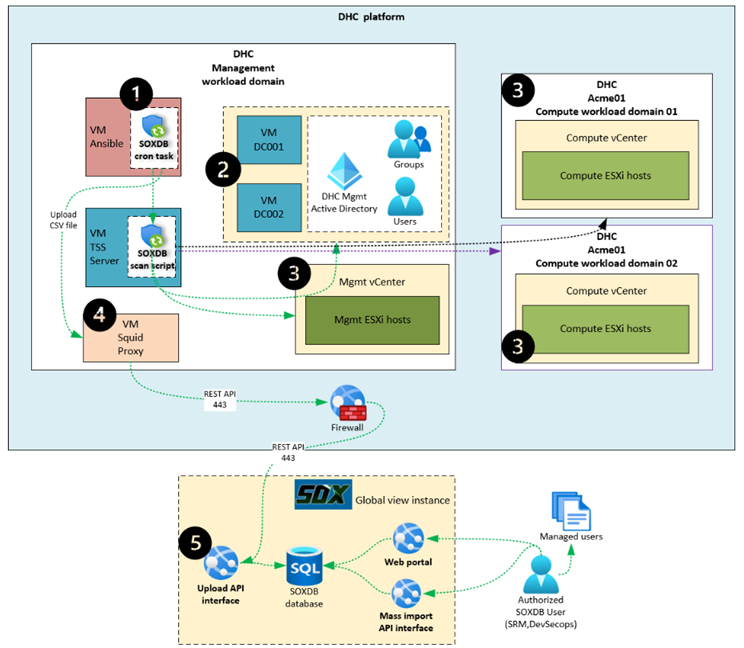

# Role Based Access Control LLD

## Table of Contents

- [Role Based Access Control LLD](#role-based-access-control-lld)
  - [Table of Contents](#table-of-contents)
  - [1. Introduction](#1-introduction)
    - [1.1.1. Change history](#111-change-history)
  - [1.2. Purpose](#12-purpose)
  - [1.3. Audience](#13-audience)
  - [1.4. Scope](#14-scope)
  - [1.5. Related Documents](#15-related-documents)
    - [1.5.1. Security Requirements Coverage](#151-security-requirements-coverage)
  - [1.6. Requirement Levels](#16-requirement-levels)
- [2. Component Description - RBAC](#2-component-description---rbac)
  - [2.1. Assumptions](#21-assumptions)
  - [2.2. Definitions](#22-definitions)
  - [2.3. Naming Convention](#23-naming-convention)
- [3. Roles](#3-roles)
  - [3.1. Role Description](#31-role-description)
    - [3.1.1.  Role: Security Administrator – (Global)](#311--role-security-administrator--global)
    - [3.1.2.  Role: Logging Administrator – (Site specific)](#312--role-logging-administrator--site-specific)
    - [3.1.3. Role: Network Administrator (Site specific)](#313-role-network-administrator-site-specific)
    - [3.1.4. Role: Platform Administrator (Site specific)](#314-role-platform-administrator-site-specific)
    - [3.1.5. Role: Viewer  (Site specific)](#315-role-viewer--site-specific)
    - [3.1.6. Role: Domain Administrator (Site specific)](#316-role-domain-administrator-site-specific)
  - [3.2. VMware Cloud Partner Navigator Roles](#32-vmware-cloud-partner-navigator-roles)
  - [3.3. vRA Cloud Assembly Roles](#33-vra-cloud-assembly-roles)
    - [3.3.1 vRA Cloud Assembly Custom Roles](#331-vra-cloud-assembly-custom-roles)
  - [3.4. vRA Service Broker Roles](#34-vra-service-broker-roles)
  - [3.5. vRA Cloud Assembly and Service Broker Project Roles](#35-vra-cloud-assembly-and-service-broker-project-roles)
  - [3.6. VCS Cloud Partner Navigator RBAC model](#36-vcs-cloud-partner-navigator-rbac-model)
    - [3.6.1. Provider organization level RBAC](#361-provider-organization-level-rbac)
    - [3.6.2. Customer organization level RBAC](#362-customer-organization-level-rbac)
  - [3.7. VCS Provider and Customer Access](#37-vcs-provider-and-customer-access)
    - [3.7.1 Provider access](#371-provider-access)
    - [3.7.1 Customer access](#371-customer-access)
  - [3.8. Customer AD federation](#38-customer-ad-federation)
- [4. VCS Operational Role mapping](#4-vcs-operational-role-mapping)
- [5. Active Directory OU Structure](#5-active-directory-ou-structure)
- [6. List of RBAC components](#6-list-of-rbac-components)
- [7. List of Resource Groups](#7-list-of-resource-groups)
- [8. List of Role Groups](#8-list-of-role-groups)
- [9. List of Service Accounts](#9-list-of-service-accounts)
- [10. List of local user built-in accounts](#10-list-of-local-user-built-in-accounts)
- [11. RBAC user accounts review solution](#11-rbac-user-accounts-review-solution)
- [12. Special User Accounts](#12-special-user-accounts)
- [13. Abbreviations and Definitions](#13-abbreviations-and-definitions)

## 1. Introduction

### 1.1.1. Change history

|    Author name     |         Author e-mail         |    Date    |                                       Comments                                        |
|:------------------:|:-----------------------------:|:----------:|:-------------------------------------------------------------------------------------:|
| Piotr Lewandowski  | <piotr.lewandowski@atos.net>  | 07/01/2019 |                                    Draft creation                                     |
|   Łukasz Stasiak   |   <lukasz.stasiak@atos.net>   | 07/17/2019 |                            Cloud Automation Services Added                            |
| Przemysław Bojczuk | <przemyslaw.bojczuk@atos.net> | 10/21/2019 |             Linux read only access removed. Abbreviations section added.              |
|   Łukasz Stasiak   |   <lukasz.stasiak@atos.net>   | 12/05/2019 |                               Added KMS resource group                                |
| Przemysław Bojczuk | <przemyslaw.bojczuk@atos.net> | 01/14/2020 |                                        docx2md                                        |
| Piotr Lewandowski  | <piotr.lewandowski@atos.net>  | 01/21/2020 |                                  Review and updates                                   |
|   Łukasz Stasiak   |   <lukasz.stasiak@atos.net>   | 03/02/2020 |                        Backup roles removal and diagram update                        |
|   Łukasz Stasiak   |   <lukasz.stasiak@atos.net>   | 10/02/2020 |                    Updated Security Administrator role privileges                     |
| Piotr Lewandowski  | <piotr.lewandowski@atos.net>  | 04/03/2020 |                       Added PKS to Platform Administrators role                       |
|   Michal Pindych   |   <michal.pindych@atos.net>   | 16/03/2020 |                  Added Ipam Infoblox to Platform Administrators role                  |
| Piotr Lewandowski  | <piotr.lewandowski@atos.net>  | 16/03/2020 |                 replaced OUs and groups with new platform name (dhc)                  |
|   Łukasz Stasiak   |   <lukasz.stasiak@atos.net>   | 10/04/2020 |                              Added service account list                               |
|   Łukasz Stasiak   |   <lukasz.stasiak@atos.net>   | 28/04/2020 |                            Added Anthos account and group                             |
| Piotr Lewandowski  | <piotr.lewandowski@atos.net>  | 03/05/2020 |                             updated with Network Insight                              |
|   Michal Pindych   |   <michal.pindych@atos.net>   | 08/05/2020 |                         Added Ipam Infoblox Rbac information                          |
|   Łukasz Stasiak   |   <lukasz.stasiak@atos.net>   | 19/05/2020 |                     Added scheduler automation accounts and group                     |
|   Łukasz Stasiak   |   <lukasz.stasiak@atos.net>   | 24/06/2020 |                     Added alcatraz automation accounts and group                      |
|   Łukasz Stasiak   |   <lukasz.stasiak@atos.net>   | 26/06/2020 |                              Added RBAC for multitenancy                              |
| Łukasz Tomaszewski | <lukasz.tomaszewski@atos.net> | 09/11/2020 |             Added RBAC for Logging Administrators, removed NSX-V entries              |
|   Łukasz Stasiak   |   <lukasz.stasiak@atos.net>   | 07/05/2021 |         Added Content Library administrators role and billing service account         |
|   Łukasz Stasiak   |   <lukasz.stasiak@atos.net>   | 14/05/2021 |                            Updates for multitenancy  RBAC                             |
|  Pawel Wlodarczyk  |  <pawel.wlodarczyk@atos.net>  | 08/06/2021 |                   Added additional role for billing service account                   |
|  Alpesh Kumbhare   |  <alpesh.kumbhare@atos.net>   | 16/06/2021 |                Added mid service account for ServiceNow CMDB discovry                 |
|  Marcin Kujawski   |  <marcin.kujawski@atos.net>   | 27/07/2021 |                               Added custom role in vRA                                |
|   Łukasz Stasiak   |   <lukasz.stasiak@atos.net>   | 05/10/2021 |                               DHC-3135 Document updates                               |
|   Łukasz Stasiak   |   <lukasz.stasiak@atos.net>   | 29/10/2021 |                               DHC-3380 Document updates                               |
|   Margo Piliukh    | <marharyta.piliukh@atos.net>  | 24/03/2022 |                       DHC-4199 vRA Cloud Tenant roles amendment                       |
|    Marcin Gala     |    <marcin.gala@atos.net>     | 09/06/2022 |              DHC-4847 Added info about bck01 and  idm01 service accounts              |
|   Margo Piliukh    | <marharyta.piliukh@atos.net>  | 10/06/2022 |                        DHC-4781 backup service account update                         |
|  Jakub Zielinski   |  <jakub.zielinski@atos.net>   | 27/09/2022 | CESDHC-4153 added information about HashiVault automation04 and automation05 accounts |
|    Marcin Gala     |    <marcin.gala@atos.net>     | 29/09/2022 |       CESDHC-4168 Added info about vROps and vRLI local user built-in accounts        |
|   Margo Piliukh    | <marharyta.piliukh@atos.net>  | 03.10.2022 |           CESDHC-4220 Added info about Cloud Bridge role access to backend            |
|    Madhavi Rane    |    <madhavi.rane@atos.net>    | 02.12.2022 |            CESDHC-4477 Added vcs02 service account to service account list            |
| Piotr Lewandowski  | <piotr.lewandowski@atos.net>  | 24/03/2023 |                        CESDHC-6675 Added vro01 service account                        |
|    Madhavi Rane    |    <madhavi.rane@atos.net>    | 06.04.2023 |          VCS-9309 Added contentLibraryAdmin access to vcs02 service account           |
|   Krystian Bibik   |   <krystian.bibik@atos.net>   | 14.05.2024 |    VCS-5856 Added information about automation06 account for remote HashiCorp Vault   |
|   Tomasz Korniluk  |   <tomasz.korniluk@atos.net>  | 29.01.2024 |            VCS-14921 Added chapter for RBAC users accounts review solution            |
|   Michał Sobieraj  |   <michal.sobieraj@atos.net>  | 10.10.2024 |       VCS-14051 Added information about adc001/adc002 snapshot restricted group       |
|   Ciprian Sferle   | <ciprian-ioan.sferle@atos.net>| 27.02.2025 |                  VCS-15305 Update membership for ans01 service account                |
|   Adam Szymczak    |    <adam.szymczak@atos.net>   | 10/04/2025 |                         VCS-15305 Add vop01 service account                           |
|Stanislaw Kilanowski|<stanislaw.kilanowski@atos.net>| 08.05.2025 |                  VCS-15725 Update membership for vro01 service account                |
|   Adam Szymczak    |    <adam.szymczak@atos.net>   | 09.05.2025 |                  VCS-15726 Update membership for nsx01 service account                |
|  Przemyslaw Pakula |  <przemyslaw.pakula@atos.net> | 24.02.2026 |                     VCS-15538 Added Security Requirements Coverage                    |

## 1.2. Purpose

The purpose of this document is to provide detailed design and architectural
guidance required to implement validated model of a VCS Role Based Access
Control in accordance with Atos standards and portfolio services. The principal
aim of this document is to translate known requirements into a technical
low-level design (LLD).

This document is describing VCS RBAC components, definition, naming
convention, roles and roles description. It is covering known requirements
cascaded from VCS HLD and other LLDs.

## 1.3. Audience

This document is intended for Atos Cloud Services Engineers and Architects
responsible for VMware Cloud Services (VCS) solution implementation and maintenance.

## 1.4. Scope

This LLD is intended to cover below components and domains:

- definition of VCS user roles for the management stack and their implementation in VCS AD (role groups)
- definition of resource groups and their implementation in AD
- definition of user roles for Cloud Partner Navigator
- definition of user roles for Cloud Assembly and Service Broker
- implementation of DHC RBAC users accounts review solution

This LLD is not covering:

- definition of access to services managed outside the VCS Management stack (i.e. Antivirus, Backup)

## 1.5. Related Documents

This document is a subset of Atos Technology Lifecycle Management (ATLM) artefacts. All documents are stored in the VCS documentation repository.

| Document Number | Document Name                                     |
|:---------------:|---------------------------------------------------|
|  MSD-S28-0000   | [VCS High-Level Design](hldDigitalHybridCloud.md) |

### 1.5.1. Security Requirements Coverage

| Instruction Name | Short Description |
| :----------: | ------- |
| [lldADSecurityEnhancement2024.md](lldADSecurityEnhancement2024.md) | Describes AD vulnerabilities in VCS and the remediation actions for key security findings. |
| [lldDhcRoleBasedAccessControl.md](lldDhcRoleBasedAccessControl.md) | Defines RBAC roles, mappings, and access review principles for VCS components. |
| [lldBreakTheGlass.md](lldBreakTheGlass.md) | Defines emergency access workflows for outage scenarios and recovery procedures. |
| [lldHardening.md](lldHardening.md) | Defines required hardening activities before production handover, including identity, firewall, and compliance controls. |
| [lldHashicorpVault.md](lldHashicorpVault.md) | Describes secure secret-management architecture, authentication methods, and audit logging. |
| [lldVulnerabilityManagement.md](lldVulnerabilityManagement.md) | Defines Nessus-based vulnerability scanning design, scope, and operating model. |
| [lldSecurityPosture.md](lldSecurityPosture.md) | Provides a consolidated overview of VCS security controls across encryption, scanning, RBAC, logging, and patching. |
| [SecurityMeasureExceptions.md](SecurityMeasureExceptions.md) | Lists approved Nessus/Alcatraz exceptions and false positives with rationale and mitigation context. |
| [SiemensCERTExceptions.md](SiemensCERTExceptions.md) | Lists Siemens CERT exceptions/false positives with applicability and risk/mitigation notes. |
| [lldSOXDB.md](lldSOXDB.md) | Describes SOXDB integration security controls, including credential handling, encryption, and RBAC. |
| [lldRemoteConsoleAccess.md](lldRemoteConsoleAccess.md) | Defines secure remote console access controls, including RBAC and certificate handling. |

## 1.6. Requirement Levels

This document is following the principles below to categories all requirements and design decisions.

|    Term    | Meaning                                                                                                                                                                                                                                                         |
|:----------:|-----------------------------------------------------------------------------------------------------------------------------------------------------------------------------------------------------------------------------------------------------------------|
|    MUST    | The definition is an absolute requirement of the specification.                                                                                                                                                                                                 |
|  MUST NOT  | The definition is an absolute prohibition of the specification                                                                                                                                                                                                  |
|   SHOULD   | There may exist valid reasons in particular circumstances to ignore a particular item, but the full implications must be understood and carefully weighed before choosing a different course                                                                    |
| SHOULD NOT | There may exist valid reasons in particular circumstances when the particular behaviour is acceptable or even useful, but the full implications should be understood and the case carefully weighed before implementing any behaviour described with this label |
|    MAY     | Any design decisions that are not classified as MUST and SHOULD or covering optional feature that is not general available for VCS product                                                                                                                      |

# 2. Component Description - RBAC

Role Based Access Control (RBAC) for VCS is essentially a framework that
provides the capabilities for granting sufficient access for managing the VCS
cloud platform and its services based on the principle of least privilege.

Microsoft Active Directory, internal domain for VCS serves as the foundation
for leveraging RBAC.

Being a global environment, an important RBAC requirement is to ensure that
the framework supports delegation of permissions in accordance with the agreed
model. Hence, it is important that access can be controlled on the basis of the
client location.

The scope of this RBAC design spans across all technical elements that are:

- VCS internal Active Directory domain
- Hashicorp Vault deployed inside VCS
- vCF components: vCenter, NSX-T, Log insight, SDDC Manager, vROPS, Lifecycle Manager
- vRealize Identity Manager (vIDM)
- Linux servers
- Windows servers
- IPAM
- Out of band server management console

Cloud Partner Navigator ,Cloud Assembly and Service Broker are not integrated with the Microsoft Active Directory internal domain for VCS. RBAC model for those components will be described in separate chapters of this document.

## 2.1. Assumptions

- Control of access towards ASN is out of scope.
- SAaCon SSL-VPN access is not part of this RBAC model. This access will need to be arranged separately.
- OS/data/AD Domain access for customer environments is out of scope.
- VCS Terminal servers/RDP servers can be accessed via Active Directory credentials from VCS internal domain.
- Network equipment such as routers, firewalls, leaf and spine switches which are managed and supported by the NDCS teams are excluded.
- It is assumed that the technical personnel, responsible for managing VCS and its services, are part of a delivery unit that represents a particular role.
- As IPAM (based on Infoblox vendor) does not support nested group AD implementation - Rbac for this solution is based on role groups.

## 2.2. Definitions

|        Term        |                                                                  Meaning                                                                   |
|:------------------:|:------------------------------------------------------------------------------------------------------------------------------------------:|
|      __User__      | Technical engineer responsible for delivering cloud services by configuring, managing and maintaining resources within the support scope.  |
| __Customer User__  |                                Person that will be consuming VCS services by using available catalog items.                                |
|   __Role group__   | AD security group that is a “member of” resource group(s) (also a security group), to access resources that fall within its support scope. |
| __Resource group__ |                              AD security group which is used to grant specific access to a technical object.                               |

## 2.3. Naming Convention

Technically, both role and resource groups are Active Directory security groups
that are distinguished using specific naming convention.

- Role Group

The naming convention for role group is __role-< locationCode >-g-desc__:

|      Part name       | Explanation                                                                               |
|:--------------------:|-------------------------------------------------------------------------------------------|
|       __role__       | Role Group                                                                                |
| __< locationCode >__ | 4 character location code where VCS is “hosted” “dhc” for non-location specific groups |
|        __g__         | Group scope -global is used for role groups                                               |
|       __desc__       | Short description representing the purpose of the role                                    |

Example - Platform Administrator role group for gre2 location:
`role-gre2-g-platformadministrators`

- Resource Group

The naming convention for resource group is __rsce-< locationCode >-svr-l-desc__:

|      Part name       | Explanation                                                                               |
|:--------------------:|-------------------------------------------------------------------------------------------|
|       __role__       | Role Group                                                                                |
| __< locationCode >__ | 4 character location code where VCS is “hosted” “dhc” for non-location specific groups |
|       __svr__        |                                                                                           |
|        __l__         | Group scope-domain local is used for resource groups                                      |
|       __desc__       | Short description representing the purpose of the role                                    |

Example - Vault Administrators group for gre2 location:
`rsce-gre2-vlt-l-admins`

- ADM user accounts

The naming convention for ADM accounts is __< DAS_ID >\_ADM__:

|      Part name       | Explanation                                                                                 |
|:--------------------:|:-------------------------------------------------------------------------------------------:|
|   __< DAS_ID >__     | 7 character DAS ID of the user for which the account is created                             |
|       __ADM__        | The suffix ADM specifies that the account has elevated priviledges as Domain Administrator  |

Example - A123456_ADM

# 3. Roles

VCS contains a total of 5 types of roles. These are:

- Security Administrator (Global)
- Network Administrator (Location-Specific)
- Logging Administrator (Location-Specific)
- Platform Administrator (Location-Specific)
- Domain Administrator (Location-Specific)
- Viewer (Location-Specific)

Access details for each role is described in the next chapter.

The diagram below highlights VCS areas covered in this LLD. This document will
  cover the vCF SDDC integration and design for VCS.

## 3.1. Role Description

Global roles grant access to central entities of VCS. Such roles are only
assigned to teams owning the responsibility for the global management of the
platform. They do not grant access to customer data.

Location-Specific roles primarily grant access to resources that are present
within a particular location. VCS architecture is setup in a way where in
order to function correctly, every site is also required to connect with the
central components. Hence, in order to manage a particular site, location-specific
roles also provide specific level of access onto certain central entities.
A user can be a member of multiple location-specific roles of the same type.

The following table provides a list of the type of roles that have been defined
currently.

| No. | Role                   | Scope             | Role Group                                   |
|:---:|------------------------|-------------------|----------------------------------------------|
|  1  | Security Administrator | Global            | role-dhc-g-securityadministrators            |
|  2  | Logging Administrator  | Location-Specific | role-{locationCode}-g-loggingadministrators  |
|  3  | Network Administrator  | Location-Specific | role-{locationCode}-g-networkadministrators  |
|  4  | Platform Administrator | Location-Specific | role-{locationCode}-g-platformadministrators |
|  5  | Viewer                 | Location-Specific | role-{locationCode}-g-viewer                 |
|  6  | Domain Administrator   | Location-Specific | role-{locationCode}-g-domainadministrators   |

Detailed description about each role can be found in the following sub chapters.

### 3.1.1.  Role: Security Administrator – (Global)

|             |                                    |
|-------------|------------------------------------|
| AD Name     | role-dhc-g-securityadministrators  |
| Description | Security Administrator global role |

This role is applicable to the technical personnel who are delegated to perform
security management and auditing tasks.

Main privileges exercised through this role include, but are not limited to the
following:

- Log onto the VCS Jump/RDP servers,
- Read-Only access to VCS Active Directory,
- Hashicorp Vault full access to secrets. No access to Vault configuration,
- Log Insight access audit logs.

### 3.1.2.  Role: Logging Administrator – (Site specific)

|             |                                             |
|-------------|---------------------------------------------|
| AD Name     | role-{locationCode}-g-loggingadministrators |
| Description | Logging Administrator site specific role    |

This role is applicable to the technical personnel who are delegated to perform
logging management and auditing tasks.

Main privileges exercised through this role include, but are not limited to the
following:

- Log onto the VCS Jump/RDP servers,
- Log Insight admin access audit logs.

### 3.1.3. Role: Network Administrator (Site specific)

|             |                                             |
|-------------|---------------------------------------------|
| AD Name     | role-{locationCode}-g-networkadministrators |
| Description | Network Administrator site specific role    |

This role is applicable to the technical personnel who are responsible for
administering VCS network infrastructure.

Main privileges exercised through this role include, but are not limited to
the following:

- Log onto the VCS Jump/RDP servers,
- Read-only access to vCenter,
- Read-Only access to LogInsight,
- Read-Only access to vROps,
- NSX-T Enterprise Administrator role assigned using AD group,
- Hashicorp Vault Read-Only access to network related secrets per location.
- vRealize Network Insight Read-Only access
- Infoblox Read-Only access

### 3.1.4. Role: Platform Administrator (Site specific)

|             |                                              |
|-------------|----------------------------------------------|
| AD Name     | role-{locationCode}-g-platformadministrators |
| Description | Platform Administrator site specific role    |

This role is applicable to the technical personnel who are responsible for administering VCS platform

Main privileges exercised through this role include, but are not limited to the following:

- Vault Read-Only access to secrets per location. Full admin access to Vault config,
- Administrator roles assigned for vCF components: vCenter, NSX-T , SDDC Manager, vROPS, Lifecycle Manager,
- Administrator role assigned for vSphere Content Library
- Administrative rights on all Windows member servers,
- Administrative rights on all Linux member servers,
- Administrative access to vIDM,
- Read-Only access to Playbooks on Ansible Mgmt  (Allowed to change RO mount point),
- SDDC manager -rollout passwords- to be verified,
- Administrative access to out of band server management console (iDRAC/SHC)
- Administrative access to KMS servers (Admin role only.)
- Infoblox Read-Only access
- Read-Only access to LogInsight,
- Administrative access to vRealize Network Insight

### 3.1.5. Role: Viewer  (Site specific)

|             |                              |
|-------------|------------------------------|
| AD Name     | role-{locationCode}-g-viewer |
| Description | Viewer site specific role    |

This role is applicable to the technical personnel who needs “view” role to perform read-only actions on VCS platform resource hosted in a particular location. As all the logs from Linux hosts are transferred to vRealize Log Insight there is no need for direct access of the viewer to these.

Main privileges exercised through this role include, but are limited to the following:

- RDP user access to Bastion hosts (Terminal Server in VCS),
- Read-Only access to vCenter,
- Read-Only access to Log Insight,
- Read-Only access to vROps,
- Read-Only access to AD,
- Read-Only access to NSX,
- RDP user access to Windows member servers.
- Read-Only access to vRealize Network Insight

### 3.1.6. Role: Domain Administrator (Site specific)

|             |                                              |
|-------------|----------------------------------------------|
| AD Name     | role-{locationCode}-g-domainadministrators   |
| Description | Domain Administrator site specific role      |

This role is applicable to a limited number of technical engineers, 3-5 user accounts, who require Domain Administrator piviledges in VCS Active Directory. The user accounts that are members of this role group have the __<DAS_ID>\_ADM__ format.

Main privileges exercised through this role include, but are limited to the following:

- VCS Active Directory Domain Administrator rights,
- RDP user access only to VCS Domain Controllers,
- No permissions to start a process or service on any Windows host in the VCS stack, except on Domain Controllers.

## 3.2. VMware Cloud Partner Navigator Roles

VMware Cloud Partner Navigator is a unified SaaS partner platform built to simplify and accelerate multicloud service delivery. VMware Cloud Partner Navigator uses construct of provider and customer organizations to distribute access to cloud resources and services. There are two levels where the permissions for the services and resources can be granted. First is a provider organization that is used to manage customers (tenants). Depending on a role in the provider organization user added on that level can access some or all the resources for the provider and customer organizations.
Second level where the user permissions can be assigned is the customer organization level. Users added there will have access only to the resources provided to their customer organizations.

Below diagram represents all the CPN roles with their scope defined on both levels provider and customer organizations.

 In Cloud Partner Navigator, organization roles are hierarchical. For example, the Provider Administrator role assigned in provider organization, will be applied in all tenant organizations managed by provider organization.  
In case providing access to one or more of the VMware Cloud services for the organization, tenant users access needs to be granted in cloud service according to the roles each cloud service provides.  
Below tables list each role and actions for both provider and customer organizations levels.

CPN Service Provider roles:

| Role name                              | Description                                                                                                                                                                                                                                  | Actions role can perform                                                                                                                                                                                                                                                                                                                                                                                                                                                                                                                                                                                                                                                                                                                                                                                                                                                                                                                                                                                                                                                                                                                                                                                                                                                                                                                                                                                                                                                                                                                                  |
|----------------------------------------|----------------------------------------------------------------------------------------------------------------------------------------------------------------------------------------------------------------------------------------------|-----------------------------------------------------------------------------------------------------------------------------------------------------------------------------------------------------------------------------------------------------------------------------------------------------------------------------------------------------------------------------------------------------------------------------------------------------------------------------------------------------------------------------------------------------------------------------------------------------------------------------------------------------------------------------------------------------------------------------------------------------------------------------------------------------------------------------------------------------------------------------------------------------------------------------------------------------------------------------------------------------------------------------------------------------------------------------------------------------------------------------------------------------------------------------------------------------------------------------------------------------------------------------------------------------------------------------------------------------------------------------------------------------------------------------------------------------------------------------------------------------------------------------------------------------------|
| Provider Administrator role            | Have complete administrative access across provider & customer organizations. Can enable services in provider organization. Can grant roles to other provider users, manage customer organizations, and access all organizational functions. | View cloud endpoints. Add, edit or remove cloud endpoint. Access cloud endpoints. View all customer resources. View all resources in provider organization. View services in provider organization. Enable services in provider organization. Access services in provider organization. View all customer organizations. Add or remove customer organizations. Edit the details of all customer organizations. Enable cloud endpoints for customer organizations. Enable services for customer organizations. View users in provider organization. Add or remove users in provider organization and edit their roles. Manage federated identity and enterprise groups in provider organization. View commit contract information. Manage automatic reporting of vCloud Usage Meter instances. View usage of provider organization. View usage of all customer organizations. View support tickets for provider organization. View support tickets for all customer organizations. View support tickets for selected customer organizations. Open new support tickets for provider organization. Open new support tickets for all customer organizations Customize portal branding for provider and customer organizations. Customize branding for selected customer organizations. Access customer organizations. View users in customer organizations. Manage users in customer organizations. View customer resources and services in customer organizations. |
| Provider Operations Administrator role | Can manage all services and endpoints for provider and customer organizations and access all operational functions.                                                                                                                          | View cloud endpoints. Add, edit or remove cloud endpoint. Access cloud endpoints. View all customer resources. View all resources in provider organization. View services in provider organization. Access services in provider organization. View all customer organizations. Add or remove customer organizations. Edit the details of all customer organizations. Enable cloud endpoints for customer organizations. Enable services for customer organizations. View commit contract information. View usage of provider organization. View usage of all customer organizations. View support tickets for provider organization. View support tickets for all customer organizations. Open new support tickets for provider organization. Open new support tickets for all customer organizations Customize portal branding for provider and customer organizations. Customize branding for selected customer organizations. Access customer organizations. View users in customer organizations. Manage users in customer organizations. View customer resources and services in customer organizations.                                                                                                                                                                                                                                                                                                                                                                     |
| Provider Operations User role          | Has permissions for selected cloud endpoints with an assigned level of access.                                                                                                                                                               | View cloud endpoints. Add, edit or remove cloud endpoint. Access cloud endpoints. View all customer resources. View all resources in provider organization. View services in provider organization. Access services in provider organization. View all customer organizations. Add or remove customer organizations. Edit the details of all customer organizations. Enable cloud endpoints for customer organizations. Enable services for customer organizations. View commit contract information. View usage of provider organization. View usage of all customer organizations. View support tickets for provider organization. View support tickets for all customer organizations. Open new support tickets for provider organization. Open new support tickets for all customer organizations Customize portal branding for provider and customer organizations. Customize branding for selected customer organizations. Access customer organizations. View users in customer organizations. Manage users in customer organizations. View customer resources and services in customer organizations.                                                                                                                                                                                                                                                                                                                                                                     |
| Provider Billing User role             | Can view billing information associated with services provisioned within provider & customer organizations.                                                                                                                                  | View all customer organizations. View commit contract information. View usage of provider organization. View usage of all customer organizations. View support tickets for provider organization. Open new support tickets for provider organization.                                                                                                                                                                                                                                                                                                                                                                                                                                                                                                                                                                                                                                                                                                                                                                                                                                                                                                                                                                                                                                                                                                                                                                                                                                                                                      |
| Provider Support User role             | Can access the support center and submit support requests to VMware.                                                                                                                                                                         | View, create, edit, and delete support tickets for service provider organizations and tenant organizations.                                                                                                                                                                                                                                                                                                                                                                                                                                                                                                                                                                                                                                                                                                                                                                                                                                                                                                                                                                                                                                                                                                                                                                                                                                                                                                                                                                                                                                               |
| Provider Account Administrator role    | Access and manage specific customer organizations, and all services within them.                                                                                                                                                             | View all resources in provider organization. View selected customer resources. View selected customer organizations. Edit the details of selected customer organizations. View commit contract information. View usage of selected customer organizations. View support tickets for selected customer organizations. Open new support tickets for selected customer organizations. Customize branding for selected customer organizations. Access customer organizations. View users in customer organizations. Manage users in customer organizations. View customer resources and services in customer organizations.                                                                                                                                                                                                                                                                                                                                                                                                                                                                                                                                                                                                                                                                                                                                                                                                                                                                                               |
| Provider Service Manager role          | Has permissions for selected services and cloud endpoints in your provider organization with an assigned level of access.                                                                                                                    | View cloud endpoints. Access cloud endpoints. View all resources in provider organization. View services in provider organization. Access services in provider organization. View all customer organizations. View commit contract information. View usage of provider organization. View support tickets for provider organization. Open new support tickets for provider organization.                                                                                                                                                                                                                                                                                                                                                                                                                                                                                                                                                                                                                                                                                                                                                                                                                                                                                                                                                                                                                                                                                                                                    |

CPN Tenant level roles:

| Role name                   | Description                                                                                                | Actions role can perform                                                                                                                                                                                                                                                         |
|-----------------------------|------------------------------------------------------------------------------------------------------------|----------------------------------------------------------------------------------------------------------------------------------------------------------------------------------------------------------------------------------------------------------------------------------|
| Customer Administrator role | Have administrative access to organization. Can grant roles to other users, and access available services. | Manage customer users and their roles. Manage enterprise groups. Grant a customer user access to a service. Access provisioned services and cloud resources with the level of access assigned to your customer organization. View the usage of provisioned services. |
| Customer User role          | Hold the default organizational role granting them access to available services.                           | Access provisioned services and cloud resources with an assigned level of access                                                                                                                                                                                                 |
| Customer Billing User role  | These users have read-only access to usage information.                                                    | View the usage of provisioned services.                                                                                                                                                                                                                                          |

## 3.3. vRA Cloud Assembly Roles

Cloud Assembly service roles determines what user can see and do in Cloud Assembly. Currently there are three service roles for Cloud Assembly. Below table list each available role and its function.

| Role name                    | Description                                                                                                                                                                                                                            |
|------------------------------|----------------------------------------------------------------------------------------------------------------------------------------------------------------------------------------------------------------------------------------|
| Cloud Assembly Administrator | A user who has read and write access to the entire user interface and API resources. This is the only user role that can see and do everything, including add cloud accounts, create new projects, and assign a project administrator. |
| Cloud Assembly User          | A user who does not have the Cloud Assembly Administrator role.                                                                                                                                                                        |
| Cloud Assembly Viewer        | A user who has read access to see information but cannot create, update, or delete values.                                                                                                                                             |

### 3.3.1 vRA Cloud Assembly Custom Roles

Cloud Assembly service roles determines what user can see and do in Cloud Assembly. Besides three standard roles there is an option to define more granular user roles and then assign users to those roles. These permissions extend the privileges that are granted by the other roles and are not restricted by project membership.

During VCS deployment Cloud Assembly custom role named {tenant name}DevSecOps is created by automation. This role is dedicated and assigned for DevSecOps team supporting Customer.

Below set of permissions is assigned to DevSecOps Cloud Assembly custom role:

| User Interface  | Permission                   | Description                                                                                                                                                       |
|-----------------|------------------------------|-------------------------------------------------------------------------------------------------------------------------------------------------------------------|
| Infrastructure  | View Cloud Accounts          | View cloud accounts                                                                                                                                               |
| Infrastructure  | Manage Cloud Accounts        | Create, update, or delete cloud accounts                                                                                                                          |
| Infrastructure  | View Image Mappings          | View image mappings                                                                                                                                               |
| Infrastructure  | Manage Image Mappings        | Create, update, or delete image mappings                                                                                                                          |
| Infrastructure  | View Flavour Mappings        | View flavour mappings                                                                                                                                             |
| Infrastructure  | Manage Flavour Mappings      | Create, update, or delete flavour mappings                                                                                                                        |
| Infrastructure  | View Cloud Zones             | View cloud zones, Insights, and alerts                                                                                                                            |
| Infrastructure  | View Machines                | View machines                                                                                                                                                     |
| Infrastructure  | View Requests                | View activity requests                                                                                                                                            |
| Infrastructure  | Manage Requests              | Delete requests from the list                                                                                                                                     |
| Infrastructure  | View Integrations            | View integrations                                                                                                                                                 |
| Infrastructure  | View Projects                | View projects                                                                                                                                                     |
| Catalog         | View Content                 | View Catalog                                                                                                                                                      |
| Catalog         | Manage Content               | Add, update, delete content sources Share content Customize the content, including the catalog icons and request forms                                      |
| Deployments     | View Deployments             | View all deployments, including deployment details, deployment history, alerts, and troubleshooting information                                                   |
| Deployments     | Manage Deployments           | View all deployments, respond to alerts, and run all day 2 actions that the day 2 policies allow an administrator to run on deployments and deployment components |
| Cloud Templates | View Cloud Templates         | View cloud templates                                                                                                                                              |
| Cloud Templates | Edit Cloud Templates         | Create, update, test, version, share cloud templates, and release/unrelease a cloud template version. The role does not have permission to delete cloud templates |
| Cloud Templates | Manage Cloud Templates       | Create, update, test, delete, version, share cloud templates, and release/unrelease a cloud template version                                                      |
| Cloud Templates | Deploy Cloud Templates       | Test and deploy any cloud template in any project                                                                                                                 |
| XaaS            | View Resource Actions        | View custom actions                                                                                                                                               |
| Extensibility   | View Extensibility Resources | View events, subscriptions, event topics, actions, workflows, action runs, and workflow runs                                                                      |

## 3.4. vRA Service Broker Roles

Service Broker service roles determines what user can see and do in Service Broker. Currently there are three service roles for Service Broker. Below table list each available role and function.

| Role name                    | Description                                                                                                                                                                                                    |
|------------------------------|----------------------------------------------------------------------------------------------------------------------------------------------------------------------------------------------------------------|
| Service Broker Administrator | Must have read and write access to the entire user interface and API resources. This is the only user role that can perform all tasks, including creating a new project and assigning a project administrator. |
| Service Broker User          | Any user who does not have the vRealize Automation Service Broker Administrator role.                                                                                                                          |
| Service Broker Viewer        | A user who has read access to see information but cannot create, update, or delete values.                                                                                                                     |

## 3.5. vRA Cloud Assembly and Service Broker Project Roles

In addition to the service roles, Cloud Assembly and Service Broker have a project roles. Project roles defines what user can see and do with the project-related tasks.
Below table list each available role and function.

| Role name             | Description                                                                                                                                                                                   |
|-----------------------|-----------------------------------------------------------------------------------------------------------------------------------------------------------------------------------------------|
| Project Administrator | Project administrators leverage the infrastructure that is created by the service administrator to ensure that their project members have the resources they need for their development work. |
| Project Member        | Project members work within their projects to design and deploy cloud templates.                                                                                                              |
| Project Viewer        | Project viewers are restricted to read-only access, except in a few cases where they can do non-destructive things like download cloud templates.                                             |

## 3.6. VCS Cloud Partner Navigator RBAC model

### 3.6.1. Provider organization level RBAC

VCS can consume below predefined roles to grant rights for the provider level organization:

| Role name                                                                                  | Description                                                                                                                                                                                                                                                                                                                 | Role assignment                                                                                                                                                                                           |
|--------------------------------------------------------------------------------------------|-----------------------------------------------------------------------------------------------------------------------------------------------------------------------------------------------------------------------------------------------------------------------------------------------------------------------------|-----------------------------------------------------------------------------------------------------------------------------------------------------------------------------------------------------------|
| Provider Administrator                                                                     | Accounts with that role will be used to manage provider organization. As the organization roles are hierarchical Provider administrator will be granted Tenant admin role.                                                                                                                                                  | Atos/Service Provider - This role should be assigned to a Customer Engagement team responsible for either on-boarding a new VCS instance or adding a new tenant to an existing multi-tenant VCS instance. |
| Provider Operations User  Service Role: Cloud Assembly Administrator for provider level | Will be used to manage provider organization, customer organizations and all services within them. It will give administrative rights for provider and customer organizations and will allow to create and modify Cloud Zones, image mappings, flavour mappings, blueprints, projects, and catalog items on customer level. | Atos/Service Provider - Currently this role is not in use by implemented operational model used for VCS.                                                                                                  |
| Provider Service Manager  Service Role: Cloud Assembly Administrator for provider level | Role will give an administrative rights for Cloud Assembly service on a provider level only.                                                                                                                                                                                                                                | Atos/Service Provider - Currently this role is not in use by implemented operational model used for VCS.                                                                                                  |
| Provider Account Administrator                                                             | Role will give an administrative rights on a selected customer organizations. Users with that role will be able to create and modify Cloud Zones, image mappings, flavour mappings, blueprints, projects, and catalog items on customer level.                                                                              | Atos/Service Provider - This role should be assigned to DevSecOps team responsible for maintaining and operating an existing VCS instance                                                                 |

Below diagram represents CPN roles used by VCS with their scope defined on provider organization level.

### 3.6.2. Customer organization level RBAC

VCS will use below roles to grant rights for the customer organization level:

| Role name                                                                                    | Description                                                                                                                                                                                                                                                                                             | Role assignment                                                         |
|----------------------------------------------------------------------------------------------|---------------------------------------------------------------------------------------------------------------------------------------------------------------------------------------------------------------------------------------------------------------------------------------------------------|-------------------------------------------------------------------------|
| Customer User  Service Role: Service Broker Admin  Service Broker Project Role: Member | Must have read and write access to the entire user interface and API resources. This is the only user role that can perform all tasks, including creating a new project and assigning a project administrator.                                                                                          | Customer Users, Third Parties who require full access to the Blueprints |
| Customer User  Service Role: Service Broker User  Service Broker Project Role: Member  | This role will allow customer users to logon to cloud console and access the Service Broker. Users will be able to consume catalog items for a given project.                                                                                                                                           | Customer Users                                                          |
| Customer User  Service Role: Service Broker Viewer                                        | This role will allow customer users to have read access on Service Broker service for the whole customer organization. Users with that role will be able to see all information and configuration but without option to create, update, or delete values.                                               | Customer Users                                                          |
| Service Role: Cloud Assembly custom role {tenant name}DevSecOps                              | This role will allow DevSecOps users to have more granular set of rights on Cloud Assembly service for the customer organization. This is an addition to the Provider Account Administrator role. Detailed set of rights is described in chapter 3.3.1 vRA Cloud Assembly Custom Roles of this document | DevSecOps                                                               |

Below diagram represents CPN roles used by VCS with their scope defined on customer organization level.

## 3.7. VCS Provider and Customer Access

### 3.7.1 Provider access

For accessing the provider organization VCS will initially utilize VMware accounts. All accounts added to the provider organization will have corresponding CPN role assigned. All VMware accounts accessing the provider organization should use an Multi Factor Authentication.

### 3.7.1 Customer access

For customer user access there will be two options:

1. Use of VMware accounts (default). In this case same as for provider organization Multi Factor Authentication needs to be enabled for each customer account granted access to customer organization.
2. Use of customer AD that will be federated with VMware Workspace ONE. Federation will allow to use client AD accounts to login to service broker. In this case group membership allowing service broker access will be managed by customer.

Below diagram represents CPN roles with user access types used by VCS for both provider and customer level.

## 3.8. Customer AD federation

VCS customers can use Enterprise Federation feature as an option to replace My VMware accounts usage. This will allow to use their own identity and MFA (Multi-factor Authentication) with VMware Cloud Services. Enterprise Federation feature enables customers to bring their corporate identities and credentials to log in to VMware Cloud Services and link their VMware ID accounts.  In addition to federation, they can manage bulk access to their services, by using their enterprise groups. Enterprise Federation setup is per domain.

Below diagram represents authentication flow for both user access types used by VCS.

# 4. VCS Operational Role mapping

As VCS RBAC is implemented on two different levels:  VCS Active Directory and Cloud Partner Navigator below table describes roles/permission for operational model used for VCS. To provide consolidate overview apart from Cloud Partner Navigator roles table includes also Cloud Assembly and Service Broker Service, Project and Custom roles. All of the used roles are described in this document in dedicated chapters. This includes permissions sets that are granted by assigning given role.

| VCS platform user group name | Description                                                                                          | AD Role assignment                                                                                                                                                               | CPN Role assignment                                                                                                                                                                                                                                                                                                                                                                                                         |
|------------------------------|------------------------------------------------------------------------------------------------------|----------------------------------------------------------------------------------------------------------------------------------------------------------------------------------|-----------------------------------------------------------------------------------------------------------------------------------------------------------------------------------------------------------------------------------------------------------------------------------------------------------------------------------------------------------------------------------------------------------------------------|
| Customer Engagement Team     | Responsible for initial build of a VCS platform for customers.                                       | __Platform Administrator__ AD role group: role-{locationCode}-g-platformadministrators   __Network Administrator__ AD role group: role-{locationCode}-g-networkadministrators | __Provider organization level__: Provider Administrator  __Service roles__: Cloud Assembly Administrator and Service Broker Administrator (for provider and tenant organizations inherited from it’s parent CPN role)                                                                                                                                                                                                    |
| DevSecOps Team               | Responsible for managing and maintaining a VCS platform.                                             | __Platform Administrator__ AD role group: role-{locationCode}-g-platformadministrators   __Network Administrator__ AD role group: role-{locationCode}-g-networkadministrators | __Provider organization level__: Provider Administrator for limited number of team members to allow new tenant creation or Provider Account Administrator with access to selected customers for   __Service roles__: Cloud Assembly Administrator and Service Broker Administrator (for provider and tenant organizations inherited from it’s parent CPN role)  __Cloud Assembly custom role__: {tenant name}DevSecOp |
| Cloud Bridge Team            | Responsible for L1 monitoring and performing selected daily tasks from VCS Production Plan           | __Viewer__ AD role group: role-{locationCode}-g-viewer  __Read-Only HashiCorp Vault__ AD resource group: rsce-{locationCode}--vlt-l-passwordreadonly                          | No CPN Role assigned                                                                                                                                                                                                                                                                                                                                                                                                        |
| Customer Users               | Group of customer users that will be consuming the VCS services.                                     | No Access to VCS management AD                                                                                                                                                   | __Customer organization level__: Customer User __Service Role__: Service Broker User  Service Broker Project Role:Member (for tenant organization)                                                                                                                                                                                                                                                                    |
| Customer Users Read Only     | Group of customer users that will  have read access for VCS services on given customer organization. | No Access to VCS management AD                                                                                                                                                   | __Customer organization level__: Customer User  __Service Role__: Service Broker Viewer (for tenant organization)                                                                                                                                                                                                                                                                                                        |

# 5. Active Directory OU Structure

A part from the default OUs, a dedicated top-level VCS OU will be created for all
VCS objects, with a sub-OU structure to organize these objects.

Here is a brief explanation about the individual OUs:

| OU name                   | Description                                                                                                                                                                                                                                    |
|---------------------------|------------------------------------------------------------------------------------------------------------------------------------------------------------------------------------------------------------------------------------------------|
| VCS                       | Dedicated OU for VCS objects managed by Atos.                                                                                                                                                                                                  |
| Builtin                   | Default Active Directory container, containing “leaf objects“ that represent local security groups for the domain. It’s not allowed to remove objects from this container.                                                                     |
| Computers                 | Default Active Directory container, intended to contain all computer accounts of domain members.                                                                                                                                               |
| Domain Controllers        | Default Active Directory OU, containing all domain controllers of the domain.                                                                                                                                                                  |
| ForeignSecurityPrincipals | Default Active Directory container containing information about object from external domains, having trust relationship with the domain. Objects in this OU are created when an object form external domain is added to a group in the domain. |
| LostAndFound              | Default Active Directory container containing objects that are orphaned as a result of Add and Delete operations that originated on different DCs.                                                                                             |
| Program Data              | Container where Active Directory integrated applications can store data.                                                                                                                                                                       |
| System                    | Default Active Directory container containing built-in system properties.                                                                                                                                                                      |
| Users                     | Default Active Directory container containing user account and global security groups.                                                                                                                                                         |
| NTDS Quotas               | Container for quota information about directory objects.                                                                                                                                                                                       |
| TPM devices               | Container holds TPM objects related for the newest OS.                                                                                                                                                                                         |

The default containers for objects added to the domain should not be used as the
objects cannot have designated GPOs assigned to them by nature of their design.
The exception is the Domain Controllers OU, which must contain all VCS domain controllers.
All other objects should be placed within the VCS OU structure.

The VCS sub-OU structure is shown in the following diagram

| OU name                               | Description                                                                          |
|---------------------------------------|--------------------------------------------------------------------------------------|
| DHC                                   | Top Level OU containing all VCS objects                                              |
| DHC\Groups                            | Placeholder OU for Group objects                                                     |
| DHC\Groups\ResourceGroups             | OU containing groups delegating access to VCS resources .                            |
| DHC\Groups\RoleGroups                 | OU containing groups that define user roles                                          |
| DHC\Users                             | Placeholder OU for user objects                                                      |
| DHC\Users\DHCAdmins                   | OU containing admin users managing VCS environment                                   |
| DHC\Users\DHCUsers                    | OU containing users with non-administrative access in VCS environment                |
| DHC\Servers                           | Placeholder OU for Computer objects                                                  |
| DHC\Servers\< location code >         | OU containing location specific servers                                              |
| DHC\Servers\Temp                      | Temporary OU for new computer objects – redirected from Built-in Computers container |
| DHC\ServiceAccounts                   | Placeholder OU for service accounts                                                  |
| DHC\ServiceAccounts\< location code > | OU containing location specific service accounts                                     |

# 6. List of RBAC components

| OU name                          | Scope         | Description |
|----------------------------------|---------------|-------------|
| Active Directory                 | Global        |             |
| vCenter                          | Site Specific |             |
| NSX-T                            | Site Specific |             |
| Log insight                      | Site Specific |             |
| SDDC Manager                     | Global        |             |
| vROPS                            | Global        |             |
| Lifecycle   Manager              | Global        |             |
| Cloud Automation Services        | Global        |             |
| Backup                           | Site Specific |             |
| Certificate Authority            | Global        |             |
| Internet Proxy                   | Site Specific |             |
| Bastion Hosts (Terminal Servers) | Site Specific |             |
| Management Ansible               | Site Specific |             |
| WSUS                             | Global        |             |
| vIDM                             | Global        |             |
| Ipam                             | Site Specific |             |
| vRNI                             | Global        |             |

# 7. List of Resource Groups

| Name                                           | Description                                                                                                                     |
|------------------------------------------------|---------------------------------------------------------------------------------------------------------------------------------|
| rsce-{locationCode}-esx-l-admins               | Location-specific Resource Group for Administrators of ESXi hosts                                                               |
| rsce-{locationCode}-vcs-l-admins               | Location-specific Resource Group for Administrators of vCenter without capability of reverting from snapshot adc001 and adc002  |
| rsce-{locationCode}-vcs-l-readonly             | Location-specific Resource Group for non-admin users of vCenter                                                                 |
| rsce-{locationCode}-nsx-l-auditors             | Location-specific Resource Group for Auditor access to NSX                                                                      |
| rsce-{locationCode}-nsx-l-enterpriseadmins     | Location-specific Resource Group for Enterprise Admin access to NSX                                                             |
| rsce-{locationCode}-svr-l-admins               | Location-specific Resource Group for Administrators of Windows & Linux Servers                                                  |
| rsce-{locationCode}-svr-l-users                | Location-specific Resource Group for users of Windows                                                                           |
| rsce-{locationCode}-tss-l-users                | Location-specific Resource Group for RDP users of Terminal Servers                                                              |
| rsce-{locationCode}-vcs-l-backupaccess         | Location-specific Resource Group for backup tool service account to access vCenter server                                       |
| rsce-dhc-vlt-l-passwordadmins                  | Resource Group for Hashicorp Vault access to all secrets but no access to configuration                                         |
| rsce-dhc-vlt-l-configurationadmins             | Resource Group for administrative access to Hashicorp Vault                                                                     |
| rsce-{locationCode}-vlt-l-networkadmins        | Location-specific Resource Group for network admins access to Hashicorp Vault (access limited to network container)             |
| rsce-{locationCode}-vlt-l-passwordreadonly     | Location-specific Resource Group for read only access to Hashicorp Vault secrets                                                |
| rsce-{locationCode}-lcm-l-admins               | Location-specific Resource Group for administrative access to VMware Lifecycle Manager                                          |
| rsce-{locationCode}-sdm-l-cloudadmins          | Location-specific Resource Group for administrative access to VMware SDDC Manager                                               |
| rsce-dhc-ad-g-adminpwdpolicy                   | Resource Group used for applying Fine Grained Password Policy in Active Directory – used for service accounts                   |
| rsce-dhc-ad-l-logonasservicerights             | Resource Group to delegate log on as a service permission in Active Directory (applied via GPO) – used for service accounts     |
| rsce-dhc-ad-l-denylogonlocal                   | Resource Group to deny logon locally and logon through Terminal Services (applied via GPO) – used for service accounts          |
| rsce-dhc-vop-l-admins                          | Resource Group for administrative access to vROPS in VCS                                                                        |
| rsce-dhc-vop-l-readonly                        | Resource Group for non-administrative access to vROPS in VCS                                                                    |
| rsce-{locationCode}-vli-l-admins               | Location-specific Resource Group for administrative access to Log Insight in VCS                                                |
| rsce-{locationCode}-vli-l-readonly             | Location-specific Resource Group for non-administrative access to Log Insight in VCS                                            |
| rsce-{locationCode}-shc-l-admins               | Location-specific Resource Group for administrative access to SHC-management console                                            |
| rsce-{locationCode}-idr-l-admins               | Location-specific Resource Group for administrative access to iDRAC-management console                                          |
| rsce-{locationCode}-idm-l-superadmins          | Resource Group for administrative access to vIDM                                                                                |
| rsce-{locationCode}-idm-l-readonly             | Resource Group for read-only access to vIDM                                                                                     |
| rsce-{locationCode}-vni-l-admins               | Resource Group for vRealize Network Insight Administrators                                                                      |
| rsce-{locationCode}-vni-l-users                | Resource Group for vRrealize Network Insight users                                                                              |
| rsce-{locationCode}-vlt-l-automation01access   | Resource Group for scheduler automation account access to Hashicorp Vault                                                       |
| rsce-{locationCode}-vlt-l-automation03access   | Resource Group for limited access to HashiVault. Dedicated to aut03 service account                                             |
| rsce-{locationCode}-vcs-l-automation02access   | Resource Group for automation account access to vCenter                                                                         |
| rsce-{locationCode}-vcs-l-contentlibraryadmins | Resource Group for Content Library admins                                                                                       |
| rsce-{locationCode}-vcs-l-privilagedadmins     | Location-specific Resource Group for Administrators of vCenter                                                                  |

# 8. List of Role Groups

| Name                     | Member of                       |
|--------------------------|---------------------------------|
| role-dhc-g-securityadmin | rsce-{locationCode}-tss-l-users |
|                          | rsce-dhc-vlt-l-passwordadmins   |

| Name                                       | Member of                        |
|--------------------------------------------|----------------------------------|
| role-{locationCode}-g-loggingadministrator | rsce-{locationCode}-tss-l-users  |
|                                            | rsce-{locationCode}-vli-l-admins |

| Name                                       | Member of                                  |
|--------------------------------------------|--------------------------------------------|
| role-{locationCode}-g-networkadministrator | rsce-{locationCode}-tss-l-users            |
|                                            | rsce-{locationCode}-nsx-l-enterpriseadmins |
|                                            | rsce-{locationCode}-vlt-l-networkadmins    |
|                                            | rsce-{locationCode}-vli-l-readonly         |
|                                            | rsce-dhc-vop-l-readonly                    |
|                                            | rsce-{locationCode}-vni-l-users            |

| Name                                        | Member of                                      |
|---------------------------------------------|------------------------------------------------|
| role-{locationCode}-g-platformadministrator | rsce-{locationCode}-esx-l-admins               |
|                                             | rsce-{locationCode}-vcs-l-admins               |
|                                             | rsce-{locationCode}-svr-l-admins               |
|                                             | rsce-{locationCode}-nsx-l-enterpriseadmins     |
|                                             | rsce-dhc-vlt-l-configurationadmins             |
|                                             | rsce-{locationCode}-vlt-l-passwordreadonly     |
|                                             | rsce-{locationCode}-lcm-l-admins               |
|                                             | rsce-{locationCode}-sdm-l-cloudadmins          |
|                                             | rsce-dhc-vop-l-admins                          |
|                                             | rsce-{locationCode}-vli-l-readonly             |
|                                             | rsce-{locationCode}-shc-l-admins               |
|                                             | rsce-{locationCode}-idr-l-admins               |
|                                             | rsce-dhc-idm-l-superadmins                     |
|                                             | rsce-{locationCode}-vni-l-admins               |
|                                             | rsce-{locationCode}-vcs-l-contentlibraryadmins |

| Name                         | Member of                          |
|------------------------------|------------------------------------|
| role-{locationCode}-g-viewer | rsce-{locationCode}-vcs-l-readonly |
|                              | rsce-{locationCode}-nsx-l-auditors |
|                              | rsce-{locationCode}-svr-l-users    |
|                              | rsce-{locationCode}-vli-l-readonly |
|                              | rsce-dhc-vop-l-readonly            |
|                              | rsce-dhc-idm-l-readonly            |
|                              | rsce-{locationCode}-vni-l-users    |

| Name                                       | Member of                          |
|--------------------------------------------|------------------------------------|
| role-{locationCode}-g-domainadministrators | Domain Admins                      |

# 9. List of Service Accounts

| Service account name | Member of |
| --- | --- |
| svc-{locationCode}-ans01 | Domain Users,rsce-dhc-ad-g-adminpwdpolicy,rsce-dhc-ad-l-logonasservicerights,rsce-{locationCode}-svr-l-admins,Administrators |
| svc-{locationCode}-ans02 | Domain Users,rsce-dhc-ad-g-adminpwdpolicy,rsce-dhc-ad-l-denylogonlocal,rsce-dhc-ad-l-logonasservicerights,rsce-{locationCode}-svr-l-admins |
| svc-{locationCode}-ans03 | Domain Users,rsce-dhc-ad-g-adminpwdpolicy,rsce-dhc-ad-l-denylogonlocal,rsce-dhc-ad-l-logonasservicerights,rsce-dhc-vlt-l-passwordadmins |
| svc-{locationCode}-kms01 | Domain Users,rsce-dhc-ad-g-adminpwdpolicy,rsce-dhc-ad-l-denylogonlocal,rsce-dhc-ad-l-logonasservicerights |
| svc-{locationCode}-lcm01 | Domain Users,rsce-dhc-ad-g-adminpwdpolicy,rsce-dhc-ad-l-denylogonlocal,rsce-dhc-ad-l-logonasservicerights |
| svc-{locationCode}-nsx01 | Domain Users,rsce-dhc-ad-g-adminpwdpolicy,rsce-dhc-ad-l-denylogonlocal,rsce-dhc-ad-l-logonasservicerights,rsce-{locationCode}-nsx-l-enterpriseadmins |
| svc-{locationCode}-vcf01 | Domain Users,rsce-dhc-ad-g-adminpwdpolicy,rsce-dhc-ad-l-denylogonlocal,rsce-dhc-ad-l-logonasservicerights |
| svc-{locationCode}-vcs01 | Domain Users,rsce-dhc-ad-g-adminpwdpolicy,rsce-dhc-ad-l-denylogonlocal,rsce-dhc-ad-l-logonasservicerights |
| svc-{locationCode}-vcs02 | Domain Users,rsce-dhc-ad-g-adminpwdpolicy,rsce-dhc-ad-l-denylogonlocal,rsce-dhc-ad-l-logonasservicerights,rsce-{locationCode}-vcs-l-admins,rsce-{locationCode}-vcs-l-contentlibraryadmins |
| svc-{locationCode}-vlt01 | Domain Users,rsce-dhc-ad-g-adminpwdpolicy,rsce-dhc-ad-l-denylogonlocal,rsce-dhc-ad-l-logonasservicerights |
| svc-{locationCode}-vni01 | Domain Users,rsce-dhc-ad-g-adminpwdpolicy,rsce-dhc-ad-l-denylogonlocal,rsce-dhc-ad-l-logonasservicerights,rsce-{locationCode}-vcs-l-readonly,rsce-{locationCode}-nsx-l-auditors,rsce-{locationCode}-vli-l-readonly |
| svc-{locationCode}-aut01 | Domain Users,rsce-dhc-ad-g-adminpwdpolicy,rsce-dhc-ad-l-denylogonlocal,rsce-dhc-ad-l-logonasservicerights,rsce-{locationCode}-vlt-l-automation01access |
| svc-{locationCode}-aut02 | Domain Users,rsce-dhc-ad-g-adminpwdpolicy,rsce-dhc-ad-l-denylogonlocal,rsce-dhc-ad-l-logonasservicerights,rsce-{locationCode}-vcs-l-automation02access,rsce-{locationCode}-vcs-l-readonly |
| svc-{locationCode}-aut03 | Domain Users,rsce-dhc-ad-g-adminpwdpolicy,rsce-dhc-ad-l-denylogonlocal,rsce-dhc-ad-l-logonasservicerights,rsce-{locationCode}-vlt-l-automation03access |
| svc-{locationCode}-bil01 | Domain Users,rsce-dhc-ad-g-adminpwdpolicy,rsce-dhc-ad-l-denylogonlocal,rsce-dhc-ad-l-logonasservicerights,rsce-{locationCode}-vcs-l-admins, rsce-{locationCode}-sdm-l-cloudadmins |
| svc-{locationCode}-mid01 | Domain Users,rsce-dhc-ad-g-adminpwdpolicy,rsce-dhc-ad-l-denylogonlocal,rsce-dhc-ad-l-logonasservicerights,rsce-{locationCode}-vcs-l-readonly |
| svc-{locationCode}-idm01 | Domain Users,rsce-dhc-ad-g-adminpwdpolicy,rsce-dhc-ad-l-denylogonlocal,rsce-dhc-ad-l-logonasservicerights |
| svc-{locationCode}-bck01 | Domain Users,rsce-dhc-ad-g-adminpwdpolicy,rsce-dhc-ad-l-denylogonlocal,rsce-dhc-ad-l-logonasservicerights,rsce-{locationCode}-vcs-l-readonly |
| svc-{locationCode}-bck02 | Domain Users,rsce-dhc-ad-g-adminpwdpolicy,rsce-dhc-ad-l-denylogonlocal,rsce-dhc-ad-l-logonasservicerights,rsce-< locationCode >-svr-l-admins |
| svc-{locationCode}-vro01 | Domain Users,rsce-dhc-ad-g-adminpwdpolicy,rsce-dhc-ad-l-denylogonlocal,rsce-dhc-ad-l-logonasservicerights,role-< locationCode >-g-platformadministrators |
| svc-{locationCode}-vop01 | Domain Users,rsce-dhc-ad-g-adminpwdpolicy,rsce-dhc-ad-l-denylogonlocal,rsce-dhc-ad-l-logonasservicerights,rsce-dhc-vop-l-admins |
| automation04 | HashiVault account with ssl certificate-based policy access to the following locations: secret/metadata/, secret/metadata/{{ customerCode }}, secret/metadata/{{ customerCode }}/{{ locationCode }}/\*, secret/data/{{ customerCode }}/{{ locationCode }}/servers/\*, secret/data/{{ customerCode }}/{{ locationCode }}/vrli/\* |
| automation05 | HashiVault account with ssl certificate-based policy access to the following locations: secret/metadata/, secret/metadata/{{ customerCode }}/, secret/metadata/{{ customerCode }}/{{ locationCode }}/\*, secret/data/{{ customerCode }}/{{ locationCode }}/activedirectory/\*, secret/data/{{ customerCode }}/{{ locationCode }}/servers/\*, secret/data/{{ customerCode }}/{{ locationCode }}/vrli/\* |
| automation06 | Remote DR site HashiVault account with ssl certificate-based policy access to the following locations: secret/metadata/, secret/metadata/{{ customerCode }}/, secret/metadata/{{ customerCode }}/{{ locationCode }}/\*, secret/data/{{ customerCode }}/{{ locationCode }}/activedirectory/\*, secret/data/{{ customerCode }}/{{ locationCode }}/servers/\*, secret/data/{{ customerCode }}/{{ locationCode }}/vrli/\* |

# 10. List of local user built-in accounts

| Platform / OS | Host | Local User Account | Description | Type of Access | Password Rotation Possible (Yes/No) | Status |
| --- | --- | --- | --- | --- | --- | --- |
| Linux | ANS001 | next | This account is a local admin and used for automation | Local Admin | Yes | Active |
| Linux | ANS001 | vcadmin | This account is a local admin and used for automation | Local Admin | Yes | Active |
| Linux | ANS001 | root | This account is a local admin and used for automation | Local Admin | Yes | Active |
| Linux | ANS001 | dhcdummy, sssd, chrony, daemon, bin, sys, sync, games, man, lp, mail, news, uucp, proxy, www-data, backup, list, irc, gnats, nobody, systemd-network, systemd-resolve, syslog, messagebus, apt, lxd, uuidd, dnsmasq, landscape, sshd, daemon | These accounts are inbuild-SystemManagedAccount. | Service Account | No | Active |
| Linux | BIL001 | vcadmin | This account is a local admin and used for automation | Local Admin | Yes | Active |
| Linux | BIL001 | next | This account is a local admin and used for automation | Local Admin | Yes | Active |
| Linux | BIL001 | root | This account is a local admin and used for automation | Local Admin | Yes | Active |
| Linux | BIL001 | dhcdummy, sssd, chrony, billing-user, daemon, bin, sys, sync, games, man, lp, mail, news, uucp, proxy, www-data, backup, list, irc, gnats, nobody, systemd-network, systemd-resolve, syslog, messagebus, apt, lxd, uuidd, dnsmasq, landscape, sshd, pollinate | These accounts are inbuild-SystemManagedAccount. | Service Account | No | Active |
| Linux | CAS001/02 | root | This account is a local admin and used for automation | Local Admin | Yes | Active |
| Linux | CAS001/02 | admin | This is used to connect Web Console to manage task that can be managed in the portal. | WebUI Access | Yes | Active |
| Linux | CAS001/02 | bin, daemon, messagebus, systemd-bus-proxy, systemd-journal-gateway, systemd-journal-remote, systemd-journal-upload, systemd-network, systemd-resolve, systemd-timesync, nobody, sshd, named, rpc, ntp | These accounts are inbuild-SystemManagedAccount. | Service Account | No | Active |
| Linux | DEB001 | vcadmin | This account is a local admin and used for automation | Local Admin | Yes | Active |
| Linux | DEB001 | next | This account is a local admin and used for automation | Local Admin | Yes | Active |
| Linux | DEB001 | root | This account is a local admin and used for automation | Local Admin | Yes | Active |
| Linux | DEB001 | dhcdummy, sssd, chrony, daemon, bin, sys, sync, games, man, lp, mail, news, uucp, proxy, www-data, backup, list, irc, gnats, nobody, systemd-network, systemd-resolve, syslog, messagebus, apt, lxd, uuidd, dnsmasq, landscape, sshd, pollinate | These accounts are inbuild-SystemManagedAccount. | Service Account | No | Active |
| Linux | GIT001 | vcadmin | This account is a local admin and used for automation | Local Admin | Yes | Active |
| Linux | GIT001 | next | This account is a local admin and used for automation | Local Admin | Yes | Active |
| Linux | GIT001 | root | This account is a local admin and used for automation | Local Admin | Yes | Active |
| Linux | GIT001 | dhcdummy, sssd, gitlab-www, git, gitlab-redis, gitlab-psql, gitlab-prometheus, chrony, daemon, bin, sys, sync, games, man, lp, mail, news, uucp, proxy, www-data, backup, list, irc, gnats, nobody, systemd-network, systemd-resolve, syslog, messagebus, apt, lxd, uuidd, dnsmasq, landscape, sshd, pollinate | These accounts are inbuild-SystemManagedAccount. | Service Account | No | Active |
| Linux | HGW001 | vcadmin | This account is a local admin and used for automation | Local Admin | Yes | Active |
| Linux | HGW001 | next | This account is a local admin and used for automation | Local Admin | Yes | Active |
| Linux | HGW001 | root | This account is a local admin and used for automation | Local Admin | Yes | Active |
| Linux | HGW001 | dhcdummy, sssd, chrony, daemon, bin, sys, sync, games, man, lp, mail, news, uucp, proxy, www-data, backup, list, irc, gnats, nobody, systemd-network, systemd-resolve, syslog, messagebus, apt, lxd, uuidd, dnsmasq, landscape, sshd, pollinate | These accounts are inbuild-SystemManagedAccount. | Service Account | No | Active |
| Linux | HSV001 | vcadmin | This account is a local admin and used for automation | Local Admin | Yes | Active |
| Linux | HSV001 | next | This account is a local admin and used for automation | Local Admin | Yes | Active |
| Linux | HSV001 | root | This account is a local admin and used for automation | Local Admin | Yes | Active |
| Linux | HSV001 | dhcdummy, sssd, vault, chrony, daemon, bin, sys, sync, games, man, lp, mail, news, uucp, proxy, www-data, backup, list, irc, gnats, nobody, systemd-network, systemd-resolve, syslog, messagebus, apt, lxd, uuidd, dnsmasq, landscape, sshd, pollinate | These accounts are inbuild-SystemManagedAccount. | Service Account | No | Active |
| Linux | PXY002/03 | vcadmin | This account is a local admin and used for automation | Local Admin | Yes | Active |
| Linux | PXY002/03 | next | This account is a local admin and used for automation | Local Admin | Yes | Active |
| Linux | PXY002/03 | root | This account is a local admin and used for automation | Local Admin | Yes | Active |
| Linux | PXY002/03 | dhcdummy, sssd, chrony, daemon, bin, sys, sync, games, man, lp, mail, news, uucp, proxy, www-data, backup, list, irc, gnats, nobody, systemd-network, systemd-resolve, syslog, messagebus, apt, lxd, uuidd, dnsmasq, landscape, sshd, pollinate | These accounts are inbuild-SystemManagedAccount. | Service Account | No | Active |
| Linux | SRS001 | vcadmin | This account is a local admin and used for automation | Local Admin | Yes | Active |
| Linux | SRS001 | next | This account is a local admin and used for automation | Local Admin | Yes | Active |
| Linux | SRS001 | root | This account is a local admin and used for automation | Local Admin | Yes | Active |
| Linux | SRS001 | dhcdummy, sssd, postfix, chrony, daemon, bin, sys, sync, games, man, lp, mail, news, uucp, proxy, www-data, backup, list, irc, gnats, nobody, systemd-network, systemd-resolve, syslog, messagebus, apt, lxd, uuidd, dnsmasq, landscape, sshd, pollinate | These accounts are inbuild-SystemManagedAccount. | Service Account | No | Active |
| Linux | NES001 | vcadmin | This account is a local admin and used for automation | Local Admin | Yes | Active |
| Linux | NES001 | next | This account is a local admin and used for automation | Local Admin | Yes | Active |
| Linux | NES001 | root | This account is a local admin and used for automation | Local Admin | Yes | Active |
| Linux | NES001 | dhcdummy, sssd, avahi, geoclue, chrony, daemon, bin, sys, sync, games, man, lp, mail, news, uucp, proxy, www-data, backup, list, irc, gnats, nobody, systemd-network, systemd-resolve, syslog, messagebus, apt, lxd, uuidd, dnsmasq, landscape, sshd, pollinate | These accounts are inbuild-SystemManagedAccount. | Service Account | No | Active |
| Linux | AVR001 | vcadmin | This account is a local admin and used for automation | Local Admin | Yes | Active |
| Linux | AVR001 | next | This account is a local admin and used for automation | Local Admin | Yes | Active |
| Linux | AVR001 | root | This account is a local admin and used for automation | Local Admin | Yes | Active |
| Linux | AVR001 | dhcdummy, sssd, chrony, daemon, bin, sys, sync, games, man, lp, mail, news, uucp, proxy, www-data, backup, list, irc, gnats, nobody, systemd-network, systemd-resolve, syslog, messagebus, apt, lxd, uuidd, dnsmasq, landscape, sshd, pollinate | These accounts are inbuild-SystemManagedAccount. | Service Account | No | Active |
| Windows | WUS001 | DefaultAccount | This is default Local Administrator account and renamed from Administrator to DefaultAccount and kept it as disabled. | Local Admin | Yes | Disabled |
| Windows | WUS001 | c-kathos | This is local administrator account created as default build-in account Disabled. | Local Admin | Yes | Active |
| Windows | WUS001 | c-gromer | This is guest user and renamed it as c-gromer and the status of this account is disabled. | Guest | Yes | Disabled |
| Windows | WUS001 | IUSR | This is IIS default build-in account. | IIS Service | No | Active |
| Windows | ADC001/02 | IUSR | This is IIS default build-in account. | IIS Service | No | Active |
| Windows | TSS001/02 | DefaultAccount | This is default Local Administrator account and renamed from Administrator to DefaultAccount and kept it as disabled. | Local Admin | Yes | Disabled |
| Windows | TSS001/02 | c-kathos | This is local administrator account created as default build-in account Disabled. | Local Admin | Yes | Active |
| Windows | TSS001/02 | c-gromer | This is guest user and renamed it as c-gromer and the status of this account is disabled. | Guest | Yes | Disabled |
| Windows | ICA001 | DefaultAccount | This is default Local Administrator account and renamed from Administrator to DefaultAccount and kept it as disabled. | Local Admin | Yes | Disabled |
| Windows | ICA001 | c-kathos | This is local administrator account created as default build-in account Disabled. | Local Admin | Yes | Active |
| Windows | ICA001 | c-gromer | This is guest user and renamed it as c-gromer and the status of this account is disabled. | Guest | Yes | Disabled |
| Windows | ICA001 | IUSR | This is IIS default build-in account. | IIS Service | No | Active |
| vSphere | IDM002/03/04 | root | This account is a local admin and used for automation | Local Admin | Yes | Active |
| vSphere | IDM002/03/04 | Admin | This is used to connect Web Console to manage task that can be managed in the portal. | WebUI Access | Yes | Active |
| vSphere | IDM002/03/04 | administrator | This is used to connect Web Console to manage task that can be managed in the portal. | Service Account | No | Due to Limitation within application |
| vSphere | IDM002/03/04 | postgres, ntp, horizon, sshuser, elasticsearch, pgpool, liagent, bin, daemon, messagebus, systemd-bus-proxy, systemd-journal-gateway, systemd-journal-remote, systemd-journal-upload, systemd-network, systemd-resolve, systemd-timesync, nobody, sshd, rabbitmq, named | These accounts are inbuild-SystemManagedAccount. | Service Account | No | Active |
| vSphere | LCM001 | sshuser | These accounts are inbuild-SystemManagedAccount. | Local Admin | Yes | Active |
| vSphere | LCM001 | root | This account is a local admin and used for automation | Local Admin | Yes | Active |
| vSphere | LCM001 | postgres, bin, daemon, messagebus, systemd-bus-proxy, systemd-journal-gateway, systemd-journal-remote, systemd-journal-upload, systemd-network, systemd-resolve, systemd-timesync, nobody, rpc, sshd, named, apache, ntp | These accounts are inbuild-SystemManagedAccount. | Service Account | No | Active |
| vSphere | OPS002/03 | admin | This is used to connect Web Console to manage task that can be managed in the portal. | Local Admin | Yes | Active |
| vSphere | OPS002/03 | root | This account is a local admin and used for automation | Local Admin | Yes | Active |
| vSphere | OPS002/03 | migrationAdmin | vRealize Operations internal account that cannot be logged in | Local Admin | Yes | Active |
| vSphere | OPS002/03 | automationAdmin | vRealize Operations internal account that cannot be logged in | Local Admin | Yes | Active |
| vSphere | OPS002/03 | maintenanceAdmin | vRealize Operations internal account that cannot be logged in | Local Admin | Yes | Active |
| vSphere | OPS002/03 | postgres, bin, daemon, messagebus, systemd-bus-proxy, systemd-journal-gateway, systemd-journal-remote, systemd-journal-upload, systemd-network, systemd-resolve, systemd-timesync, nobody, apache, sshd, named, ntp | These accounts are inbuild-SystemManagedAccount. | Service Account | No | Active |
| vSphere | SDM001 | vcf | This is used to connect Web Console to manage task that can be managed in the portal. | WebUI Access | Yes | Active |
| vSphere | SDM001 | root | This account is a local admin and used for automation | Local Admin | Yes | Active |
| vSphere | SDM001 | vcf_sddc_manager_ui_app, vcf_vip, backup, vcf_commonsvcs, postgres, vcf_domainmanager, vcf_lcm, vcf_operationsmanager, vcf_pantheon, ansible, bin, daemon, messagebus, systemd-bus-proxy, systemd-journal-gateway, systemd-journal-remote, systemd-journal-upload, systemd-network, systemd-resolve, systemd-timesync, nobody, rpc, sshd, smmsp, named, ntp | These accounts are inbuild-SystemManagedAccount. | Service Account | No | Active |
| vSphere | SRM001 | root | This account is a local admin and used for automation | Local Admin | Yes | Active |
| vSphere | SRM001 | admin | This is used to connect Web Console to manage task that can be managed in the portal. | WebUI Access | Yes | Active |
| vSphere | SRM001 | postgres, srm, srmdb, tomcat, envoy, bin, daemon, messagebus, systemd-bus-proxy, systemd-journal-gateway, systemd-journal-remote, systemd-journal-upload, systemd-network, systemd-resolve, systemd-timesync, nobody, sshd, rpc, ntp, telegraf, named | These accounts are inbuild-SystemManagedAccount. | Service Account | No | Active |
| vSphere | VCS001/02 | root | This account is a local admin and used for automation | Local Admin | Yes | Active |
| vSphere | VCS001/02 | Admin | This is used to connect Web Console to manage task that can be managed in the portal. | WebUI Access | Yes | Active |
| vSphere | VCS001/02 | vdtc, pod, envoy, vpostgres, netdumper, vapiEndpoint, eam, deploy, updatemgr, vlcm, vsan-health, vsm, vsphere-ui, vtsdbuser, vstatsuser, wcp, content-library, imagebuilder, perfcharts, vpgmonusr, vpxd, vtsdbmonusr, bin, daemon, messagebus, systemd-bus-proxy, systemd-journal-gateway, systemd-journal-remote, systemd-journal-upload, systemd-network, systemd-resolve, systemd-timesync, nobody, rpc, ntp, sshd, named, smmsp, apache, tftp, sso-user, dnsmasq | These accounts are inbuild-SystemManagedAccount. | Service Account | No | Active |
| vSphere | ESXi | root | This account is a local admin and used for automation | Local Admin | Yes | Active |
| vSphere | ESXi | dcui, vpxuser, svc-vcf-{LocationCode}mgt001, da-user, mux_user, nsx-user | These accounts are inbuild-SystemManagedAccount. | Service Account | No | Active |
| vSphere | vRealize Network Insight (VNI001) | Admin | This is used to connect Web Console to manage task that can be managed in the portal. | WebUI Access | Yes | Active |
| vSphere | vRealize Network Insight (VNI001) | Support and Consoleuser | These accounts are configured during the deployment and have local Administrator privilege. | Local Admin | Yes | Active |
| vSphere | vRealize Network Insight (VNI001) | bin, daemon, messagebus, systemd-bus-proxy, systemd-journal-gateway, systemd-journal-remote, systemd-journal-upload, systemd-network, systemd-resolve, systemd-timesync, nobody, ntp, sshd, man, named, postgres, rabbitmq | These accounts are inbuild-SystemManagedAccount. | Service Account | No | Active |
| vSphere | Log Insight (VLI001A/B/C) | root | This account is a local admin and used for automation | Local Admin | Yes | Active |
| vSphere | Log Insight (VLI001A/B/C) | Admin | This is used to connect Web Console to manage task that can be managed in the portal. | WebUI Access | Yes | Active |
| vSphere | Log Insight (VLI001A/B/C) | bin, daemon, messagebus, systemd-bus-proxy, systemd-journal-gateway, systemd-journal-remote, systemd-journal-upload, systemd-network, systemd-resolve, systemd-timesync, nobody, sshd, named, ntp, smmsp, rpc | These accounts are inbuild-SystemManagedAccount. | Service Account | No | Active |
| vSphere | vRealize Automation | root | This account is a local admin and used for automation | Local Admin | Yes | Active |
| vSphere | vRealize Automation | bin, daemon, messagebus, systemd-bus-proxy, systemd-journal-gateway, systemd-journal-remote, systemd-journal-upload, systemd-network, systemd-resolve, systemd-timesync, nobody, ntp, sshd, man, named, postgres, rabbitmq | These accounts are inbuild-SystemManagedAccount. | Service Account | No | Active |
| vSphere | Cloud Extensibility Proxy | bin, daemon, messagebus, systemd-bus-proxy, systemd-journal-gateway, systemd-journal-remote, systemd-journal-upload, systemd-network, systemd-resolve, systemd-timesync, nobody, ntp, sshd, man, named, postgres, rabbitmq | These accounts are inbuild-SystemManagedAccount. | Service Account | No | Active |
| vSphere | VMware NSX-T | root | This account is a local admin and used for automation | Local Admin | Yes | Active |
| vSphere | VMware NSX-T | Admin | This is used to connect Web Console to manage task that can be managed in the portal. | WebUI Access | Yes | Active |
| vSphere | VMware NSX-T | Audit | This account is used for audit purpose on Edge server. | Service Account | No | Active |
| vSphere | VMware NSX-T | bin, daemon, messagebus, systemd-bus-proxy, systemd-journal-gateway, systemd-journal-remote, systemd-journal-upload, systemd-network, systemd-resolve, systemd-timesync, nobody, ntp, sshd, man, named, postgres, rabbitmq | These accounts are inbuild-SystemManagedAccount. | Service Account | No | Active |

| Entity | Local Account Name | Purpose                                                                                                                                                                                     |
|--------|--------------------|---------------------------------------------------------------------------------------------------------------------------------------------------------------------------------------------|
| vROps  | migrationAdmin     | vRealize Operations internal account that cannot be logged in                                                                                                                               |
| vROps  | automationAdmin    | vRealize Operations internal account that cannot be logged in                                                                                                                               |
| vROps  | maintenanceAdmin   | vRealize Operations internal account that cannot be logged in                                                                                                                               |
| vROps  | admin              | necessary built-in account, required for administration activities in case Active Directory integration will go down, rotated during password rotation activity/process (typically monthly) |
| vROps  | admin - vIDM       | Required build-in IDM/Workspace One Access account for Active Directory integration, rotated during password rotation activity/process (typically monthly)                                  |
| vRLI   | admin              | necessary built-in account, required for administration activities in case Active Directory integration will go down, rotated during password rotation activity/process (typically monthly) |

# 11. RBAC user accounts review solution

To address security requirements and replace legacy product (N3view) has been implemented SOXDB solution to track and review user accounts (includes service accounts) inside DHC management, compute workloadomains.
Solution relays on SOXDB application hosted outside DHC platform and allows to analyze user account, review and validate.
SoxDB, with a focus on identifying and disabling inactive users. Authorized users (DevSecOps Leader, SRM) can log in to check permissions, and if they find an inactive employee listed, they can mark that user as disabled and submit a request for review. The concerned team receives an email notification to take action, and the next report generation confirms whether the user's access has been successfully removed or if further investigation is needed.

Below diagram represents SOXDB auto scan workflow for Esxi / vmware user accounts and DHC Management active directory:

The table explains diagram workflows:

| Task order | Task name | Outcome |
| --- | --- | --- |
| 1 | SOXDB cron task | Triggers every week scan script from ans001 node |
| 2 | SOXDB scan script | Script scans user accounts data from Management Active Directory |
| 3 | SOXDB scan script | Script scans DHC mgmt and compute vCenter instances and ESXi host and capture user accounts |  
| 4 | SOXDB script generate csv report | Script generates csv report and stores as encrypted file inside ans001 node |
| 5 | SOXDB script uploads csv report | Script uploads csv report using upload API call into dedicated space inside SOXDB instance |

> - SOXDB cron job and Ansible playbooks uses vCenter and automation services accounts.

# 12. Special User Accounts

| User Account      | Member of                                  | Purpose                                                                                                                         |
|-------------------|--------------------------------------------|---------------------------------------------------------------------------------------------------------------------------------|
| __<DAS_ID>\_ADM__ | role-{locationCode}-g-domainadministrators | Privileged user accounts (Domain Administrators) assigned to a limited number of users (3-5 accounts), only for ATOS employees  |

# 13. Abbreviations and Definitions

| Abbreviation / term: | Explanation                                   |
|----------------------|-----------------------------------------------|
| BS 7799              | Standard for Information Security Management  |
| ITIL                 | Information Technology Infrastructure Library |
| OOB                  | Out of Band Manager (iLO, iDrac, LOM, etc)    |
| SoX                  | The Sarbanes-Oxley Act (SOX)                  |
