# Disaster Recovery LLD

# Table of Contents

- [Disaster Recovery LLD](#disaster-recovery-lld)
- [Table of Contents](#table-of-contents)
- [Introduction](#introduction)
  - [ChangeLog](#changelog)
  - [Purpose](#purpose)
  - [Audience](#audience)
  - [Scope](#scope)
  - [Related Documents](#related-documents)
  - [Requirement Levels](#requirement-levels)
- [Architecture Overview](#architecture-overview)
  - [VCS Active/Passive Disaster Recovery Architecture Overview](#vcs-activepassive-disaster-recovery-architecture-overview)
  - [VCS Active/Passive Disaster Recovery with multitenant organizations implementation Architecture Overview](#vcs-activepassive-disaster-recovery-with-multitenant-organizations-implementation-architecture-overview)
  - [Business and Solution Requirements](#business-and-solution-requirements)
    - [Initial Requirements](#initial-requirements)
- [Active Detailed Logical Design](#active-detailed-logical-design)
  - [Active/Passive DR Architecture overview](#activepassive-dr-architecture-overview)
  - [Design Decisions for Active/Passive DR Architecture overview](#design-decisions-for-activepassive-dr-architecture-overview)
    - [Logical build for vSR and SRM appliances](#logical-build-for-vsr-and-srm-appliances)
    - [vSR and SRM appliances flows - logical view](#vsr-and-srm-appliances-flows---logical-view)
  - [Integrating the Active/Passive Service](#integrating-the-activepassive-service)
    - [Roles used for A/P DR integration ansible playbooks](#roles-used-for-ap-dr-integration-ansible-playbooks)
    - [Manual Tasks after deployment phase](#manual-tasks-after-deployment-phase)
    - [Disaster Recovery Variables](#disaster-recovery-variables)
      - [drVars variables](#drvars-variables)
      - [Tags](#tags)
    - [vRealize Orchestrator](#vrealize-orchestrator)
      - [Active/Passive DR protected VM traffic flow under single vRA cloud organization](#activepassive-dr-protected-vm-traffic-flow-under-single-vra-cloud-organization)
      - [Active/Passive DR protected VM traffic flow under multitenant vRA cloud organization](#activepassive-dr-protected-vm-traffic-flow-under-multitenant-vra-cloud-organization)
      - [vRO Workflows](#vro-workflows)
  - [Security](#security)
    - [Role Based Access Control](#role-based-access-control)
      - [Role Groups - SRM RBAC](#role-groups---srm-rbac)
      - [Service Accounts - SRM RBAC](#service-accounts---srm-rbac)
    - [Firewall](#firewall)
    - [Certificates](#certificates)
      - [Design Decisions - Certificates](#design-decisions---certificates)
  - [Availability and Scalability](#availability-and-scalability)
    - [Availability Design](#availability-design)
      - [Design Decisions - Availability Design](#design-decisions---availability-design)
    - [Scalability Design](#scalability-design)
      - [Design Decisions - Scalability Design](#design-decisions---scalability-design)
  - [Recoverability](#recoverability)
    - [Component Failure](#component-failure)
      - [vSphere Replication Failure](#vsphere-replication-failure)
      - [Site Recovery Manager Failure](#site-recovery-manager-failure)
      - [vRO Failure](#vro-failure)
      - [Storage Array Failure](#storage-array-failure)
      - [Datacenter Failure](#datacenter-failure)
  - [External Connection/System Requirements](#external-connectionsystem-requirements)
- [Detailed Active/Passive Physical Design](#detailed-activepassive-physical-design)
  - [Compute Workload - principal storage type](#compute-workload---principal-storage-type)
  - [Site Recovery Manager and vSphere Replication](#site-recovery-manager-and-vsphere-replication)
  - [Maximums](#maximums)
    - [SRM Maximums](#srm-maximums)
    - [vSphere Replication Maximums](#vsphere-replication-maximums)
    - [vRO Maximums](#vro-maximums)
  - [Virtual Machine Configuration Table](#virtual-machine-configuration-table)
    - [ABX Appliance specification](#abx-appliance-specification)
    - [SRM Appliance specification](#srm-appliance-specification)
    - [VSR Appliance specification (VSAN only)](#vsr-appliance-specification-vsan-only)
    - [SRA](#sra)
  - [SRM Inventory Mappings](#srm-inventory-mappings)
    - [Placeholder Datastore](#placeholder-datastore)
  - [SRM Protection Groups](#srm-protection-groups)
  - [SRM Recovery Plans](#srm-recovery-plans)
  - [RPOs and RTOs on VSAN](#rpos-and-rtos-on-vsan)
  - [RPOs and RTOs on VMFS](#rpos-and-rtos-on-vmfs)
  - [vSphere Storage policies](#vsphere-storage-policies)
  - [VMFS - array based storage - LUNs](#vmfs---array-based-storage---luns)
  - [Datastores](#datastores)
    - [VSAN datastore](#vsan-datastore)
    - [VMFS datastores](#vmfs-datastores)
  - [Datastore Clusters (VMFS)](#datastore-clusters-vmfs)
  - [Datastore \& Datastore Cluster tags (VMFS)](#datastore--datastore-cluster-tags-vmfs)
  - [vRA - day1 overview](#vra---day1-overview)
  - [Licensing and Versions](#licensing-and-versions)
    - [Versions table](#versions-table)
  - [API](#api)
  - [Log Insight forwarding](#log-insight-forwarding)
  - [Impact on Management Components](#impact-on-management-components)
    - [vROPs](#vrops)
      - [vROPs Federation](#vrops-federation)
      - [Application Virtual Networks](#application-virtual-networks)
    - [vRSLCM](#vrslcm)
    - [CAS](#cas)
    - [Certificate](#certificate)
      - [Manual steps - Site Recovery Manager](#manual-steps---site-recovery-manager)
      - [Manual Steps - vSphere Replication](#manual-steps---vsphere-replication)
    - [IPAM/Infoblox](#ipaminfoblox)
      - [DR procedure for IPAM](#dr-procedure-for-ipam)
  - [Active Directory](#active-directory)
    - [DNS](#dns)
  - [Networking](#networking)
- [Integration guidelines and limitation](#integration-guidelines-and-limitation)
- [Failover](#failover)

# Introduction

## ChangeLog

| Date       | Issue      | Author             | TOS     | Description                                                                                                                         |
|------------|------------|--------------------|---------|-------------------------------------------------------------------------------------------------------------------------------------|
| 05/06/2020 |            | Brian Gerrard      |         | Initial Draft. Active/Active design removed from Infrastructure LLD                                                                 |
| 16/06/2020 |            | Piotr Gesikowski   |         | Added Chapter 4.3 Active Directory                                                                                                  |
| 02/07/2020 |            | Jakub Zielinski    |         | Modified chapter 3.1 active-passive SRM DR                                                                                          |
| 03/08/2020 |            | Brian Gerrard      |         | Modified chapter 3, added some diagrams and moved protection group and recovery plans to chapter 4.                                 |
| 04/08/2020 |            | Brian Gerrard      |         | Modified chapter 3, removed references to JIRA stories and DPC LLDs                                                                 |
| 14/08/2020 |            | Brian Gerrard      |         | Removed Active/Active. A/A will remain in infra design                                                                              |
| 28/08/2020 |            | Brian Gerrard      |         | Updated Design based on architectural changes                                                                                       |
| 19/11/2020 | DHC-24295  | Radoslaw Dabrowski | VCS 1.2 | Update sections 3.3.2, 3.4.1, 3.4.2, 3.5.1, 4.9.1, 4.2, 4.3                                                                         |
| 08/12/2020 |            | Alec Dunn          |         | Added Requested clarification on NON SYNC'd, Separate AD domains in A/P DR From ToS Review in section 4.6                           |
| 09/06/2021 | DHC-2207   | Tomasz Korniluk    |         | Updated overall document content to cover dr a/p test results using ABX embedded vRO                                                |
| 03/09/2021 | DHC-2691   | Tomasz Korniluk    |         | Updated overall document to cover initial design of DR Active-Passive solution for multitenant org.                                 |
| 22/12/2021 | DHC-2862   | Robert Kaminski    |         | Review and doc linting, adopted to bi-directional A/P DR starting from VCS 1.5, added integration guidelines and limitation chapter |
| 22/12/2022 | CESDHC-637 | Robert Kaminski    | VCS 1.6 | Added integration guidelines and design decisions for VMFS on FC as a principal compute storage                                     |
| 02/2023    | CESDHC-637 | Robert Kaminski    |         | Adjustments related to VMFS on FC as principal storage                                                                              |
| 02/05/2023 | VCS-9442   | Robert Kaminski    |         | Review, added DR related vRO workflows                                                                                              |
| 09/2023    | VCS-10473  | Robert Kaminski    |         | Updates of Aviva customizations                                                                                                     |
| 10/2023    | VCS-9820   | Robert Kaminski    |         | SRM and vSR update to v8.7 (SPPG out of support)                                                                                    |

## Purpose

The purpose of this document is to provide detailed design and architectural guidance required to implement validated model of a VCS Disaster Recovery solution in accordance with Atos standards and portfolio services. The principal aim of this document is to translate the high-level requirements from the JIRA epic into a technical low-level design (LLD).  
The design provides the component architecture overview and basic building blocks and main principles, followed by Detailed Logical Design and final Detailed Physical Design.  
Architecture Overview provides basic building blocks and main design principles of presented design. It is covering known requirements cascaded from HLD and other LLDs.  
Detailed Logical Design presents business logic, relations and fundamental design decisions. Detailed Physical Design provides detailed configuration of components required for the deployment, for example infrastructure components.

## Audience

This document is intended for Atos Cloud Services Engineers and Architects responsible for the implementation and maintenance of the VMware Cloud Services (VCS) solution.

## Scope

This LLD is intended to cover below components and domains:

1. Active/Passive Recovery Scenarios
2. Automation required for Active/Passive Disaster Recovery Scenarios for Management and Workload Domains
3. Protection of Management VMs in Active/Passive Disaster Recovery Scenarios

This LLD does not cover:

1. Any SSRs which will add workload VMs into protection groups
2. Automated DR testing (A separate Work Instruction will be created to perform DR testing)
3. Active/Active DR. This can be found in the VCS Infrastructure LLD

## Related Documents

This document is a subset of Atos Technology Lifecycle Management (ATLM) artifact. All documents are stored in the VCS documentation repository.

| Document Name                                                                                                                                                                                         |
|-------------------------------------------------------------------------------------------------------------------------------------------------------------------------------------------------------|
| [VMware Cloud Services: High Level Design](hldDigitalHybridCloud.md)                                                                                                                                   |
| [Integration of A/P DR: Work Instruction](../workInstructions/wiIntegrateActivePassiveDr.md)                                                                                                          |
| [Disaster Recovery Failover: Work Instruction](../workInstructions/wiFailoverActivePassiveDr.md)                                                                                                      |
| [Software Defined Network: Low Level Design](lldSoftwareDefinedNetworks.md)                                                                                                                           |
| [Array based storage - EMC Unity: Low Level Design](lldUnity.md)                                                                                                                                      |
| [vSphere Replication Calculator](https://storagehub.vmware.com/t/vsphere-replication-calculators/vsphere-replication-calculator)                                                                      |
| [vRealize Orchestrator Scalability Maximums](https://docs.vmware.com/en/vRealize-Orchestrator/8.3/com.vmware.vrealize.orchestrator-install-config.doc/GUID-3C200055-DCDE-4BD8-86F1-B67A8BB0ABBA.html) |
| [Naming convention](namingConvention.md)                                                                                                                                                              |

## Requirement Levels

This document is following the principles below to categories all requirements and design decisions.

| Term       | Meaning                                                                                                                                                                                                                                                         |
|------------|-----------------------------------------------------------------------------------------------------------------------------------------------------------------------------------------------------------------------------------------------------------------|
| MUST       | The definition is an absolute requirement of the specification.                                                                                                                                                                                                 |
| MUST NOT   | The definition is an absolute prohibition of the specification                                                                                                                                                                                                  |
| SHOULD     | There may exist valid reasons in particular circumstances to ignore a particular item, but the full implications must be understood and carefully weighed before choosing a different course                                                                    |
| SHOULD NOT | There may exist valid reasons in particular circumstances when the particular behaviour is acceptable or even useful, but the full implications should be understood and the case carefully weighed before implementing any behaviour described with this label |
| MAY        | Any design decisions that are not classified as MUST and SHOULD or covering optional feature that is not general available for VCS product                                                                                                                      |

# Architecture Overview

The diagram below highlights VCS areas covered in this LLD. This document will cover the vCF SDDC integration and design for VCS. Components which are mentioned in diagram are actively taking part in Disaster Recovery process, other components are skipped. Both Sites (Active and Passive) are talking to each other using Underlay network which can be reachable via Physical Firewall used by VCS. Appliances are using either Management Network or Replication Network to interact with each other. VRA Cloud as a SaaS solution can be reachable via Internet connection provided by Underlay network. Further sections will cover detailed information about configuration of components mentioned on a drawing, as well as communication paths.

## VCS Active/Passive Disaster Recovery Architecture Overview

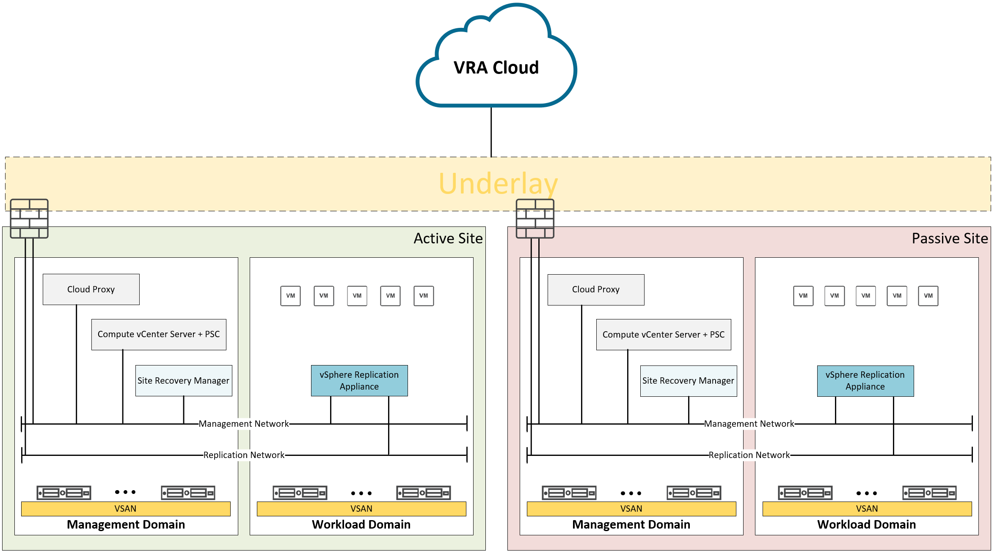

Default principal storage type for workload domain is VSAN. VCS 1.5 introduced VMFS on FC for stand alone deployment. Starting from VCS 1.6 A/P DR can be integrated with Array-Based Replication for Customer Workload Domain.

Below diagram taken from VMware documentation, presents SRM Architecture with Array-Based Replication

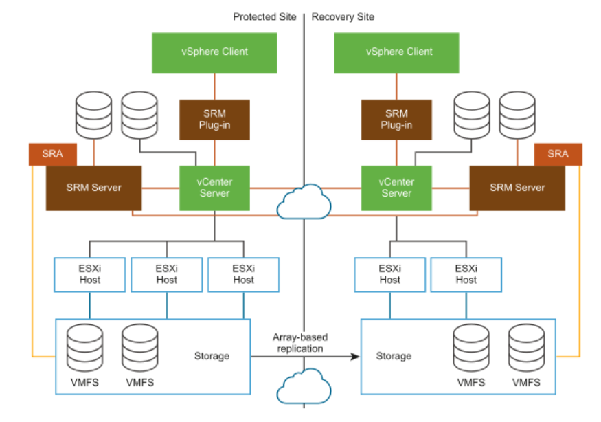

## VCS Active/Passive Disaster Recovery with multitenant organizations implementation Architecture Overview


## Business and Solution Requirements

The table below provides known requirements mandatory to be incorporated into design decisions of VCS Secret Management described in this LLD.

---

### Initial Requirements

| ID   | Requirement description                                                                                                                                                                                                                                                             | Requirement Source | Requirement Level |
|------|-------------------------------------------------------------------------------------------------------------------------------------------------------------------------------------------------------------------------------------------------------------------------------------|--------------------|-------------------|
| R001 | Active/Passive DR will use latest VMware products - SRM and vSphere Replication                                                                                                                                                                                                     | HLD                | MUST              |
| R002 | SRM and vSR will be deployed in an automated fashion via Ansible playbooks.                                                                                                                                                                                                         | HLD                | MUST              |
| R003 | As much as possible, SRM and vSR will be configured in an automated fashion via Ansible playbooks                                                                                                                                                                                   | HLD                | MUST              |
| R004 | Pre-requisites will be configured in an automated fashion via Ansible playbooks                                                                                                                                                                                                     | HLD                | MUST              |
| R005 | Management Protection should be considered and designed as required                                                                                                                                                                                                                 | Epic               | MUST              |
| R006 | Failover and Re-protect functionality                                                                                                                                                                                                                                               | Epic               | MUST              |
| R007 | Customer will be offered multiple RPO, based on link speed between sites                                                                                                                                                                                                            | Epic               | MUST              |
| R008 | Cloud Extensibility Proxy with embedded orchestrator will be used for workload orchestration to protect deployed VMs                                                                                                                                                                | Epic               | MUST              |
| R009 | Dedicated Cloud Extensibility Proxy with embedded orchestrator will be used for workload orchestration to protect compute VMs for each vRA cloud tenant org.                                                                                                                        | Epic               | MUST              |
| R010 | Active/Passive DR for vRA cloud multitenant organizations deployments will use additional SRM appliance (under management vCenter) and vSphere replication appliance (under compute vCenter) when amount of protected VMs reach maximums (defined in chapter [Maximums](#maximums)) | Epic               | MUST              |
| R011 | Active/Passive DR for vRA cloud multitenant organizations deployments will use shared recovery plan for tenants                                                                                                                                                                     | Epic               | MUST              |
| R012 | Active/Passive DR for vRA cloud multitenant organizations deployments will use dedicated protection group per tenant organization                                                                                                                                                   | Epic               | MUST              |
| R013 | Network traffic will be opened on physical firewalls, to ensure connectivity between sites for DR and its components                                                                                                                                                                | HLD                | MUST              |
| R014 | VCS 1.5 introduces `VSAN` and `VMFS` on FC as a principal storage for compute workload domain, DR integration with VMFS available from VCS 1.6                                                                                                                                      | Epic               | MUST              |
| R015 | SRM upgrade to v8.7 eliminates support of storage policy protection groups (SPPG). Before upgrading to Site Recovery Manger 8.7, all storage policy protection groups must be migrated to regular array-based replication protection groups.                                        | Epic               | MUST              |

# Active Detailed Logical Design

## Active/Passive DR Architecture overview

Active/Passive architecture represents a design where primary site which has production workloads running is protected and objects from this site are being replicated to a disaster recovery site which in this case is a Passive side. VCS utilized vCloud Foundation to assist in the automation of infrastructure deployment. A single vCF instance controls a management domain which hosts all VCS management components and also controls multiple workload domains which host the customer objects. During investigation and discussions, it was decided that in order to keep a simplistic approach, the passive site would be deployed as a standard active site and DR integration would be layered on top. There where a number of reasons for this decision:

- Active and Passive sites are rarely deployed at the same time. Customers will generally want to focus on the active site first,
- Automating the DR integration during the deployment phase would introduce prerequisites which could stall the active deployment, causing frustration to a customer,
- This gives flexibility for the customer to "convert" an active deployment into a passive deployment at a later stage,
- This allows customers to deploy Virtual Machines onto the passive site and have full VCS experience,
- This allows us to enhance the design to become "Active/Passive - Passive/Active" at a later VCS release, thus future proofing the design,
- Full deployment of the management stack simplifies the DR design and allows the focus to shift away from the management stack and onto the customer stack.

In summary to the above statements, it was concluded that the management stack on each site would be stand alone with no synchronization between the management stack. This means no unnecessary management footprint with regards to DR infrastructure is introduced.

From an operational perspective, the DR integration will be as automated as possible with the use of Ansible Orchestration. This chapter will detail the Ansible roles used for the automated tasks.

The below table shows the design decisions made for Active/Passive Logical Design.

## Design Decisions for Active/Passive DR Architecture overview

| Decision ID | Design Decision                                                                                                                                                                | Design Justification                                                                                                                                            | Design Implication                                                                                                                                                   |
|:-----------:|--------------------------------------------------------------------------------------------------------------------------------------------------------------------------------|-----------------------------------------------------------------------------------------------------------------------------------------------------------------|----------------------------------------------------------------------------------------------------------------------------------------------------------------------|
|   dr-001    | vSphere Replication traffic would be isolated.                                                                                                                                 | Based on VMware Validated designs to separate Management and replication traffic.                                                                               | There is a need to have additional network to the VCS design.                                                                                                        |
|   dr-002    | Dedicated port group for vSphere replication.                                                                                                                                  | Based on dr-001 this is needed to prevent large traffic passing the Management VLAN.                                                                            | None                                                                                                                                                                 |
|   dr-003    | Dedicated VMKernel adapter on each Compute ESXi Host.                                                                                                                          | Ensure that replication traffic is redirected to vSphere replication VLAN.                                                                                      | None                                                                                                                                                                 |
|   dr-004    | vSphere Replication appliance will be given 2nd NIC.                                                                                                                           | Ensures that VMs can communicate on the correct VLAN.                                                                                                           | None                                                                                                                                                                 |
|   dr-005    | There is no requirement for SRM or replication of Management VMs.                                                                                                              | Separate management stack will be deployed on passive site.                                                                                                     | None                                                                                                                                                                 |
|   dr-006    | 1 MGT SRM appliance will be deployed in the MGT domain and 1 vSR appliance will be deployed in each protected WLD domain per site.                                             | vSR servers must sit in the vCenter which they will be protecting - this is by design.                                                                          | This is an exception to dr-005, with no workaround.                                                                                                                  |
|   dr-007    | As much of the deployment will be automated as possible using Ansible.                                                                                                         | This allows for less errors during deployment and configuration. Ansible is the tool of choice for automating VCS.                                              | None                                                                                                                                                                 |
|   dr-008    | A DR active site will be deployed as per process of a full active site. It will have separate management domain and no sync is needed between each site at a management layer. | Many of the management components would need to be local to the passive site and this will simplify. The main focus should always be the customer workload VMs. | No SRM or vSR dedicated to the management stack.                                                                                                                     |
|   dr-009    | vRO will be used to orchestrate protection of workload deployments.                                                                                                            | In order to meet R008 in the quickest way due to PowerCLI compatibility issues, vRO will be introduced into the VCS management stack.                           | Additional application to manage under existing Cloud Extensibility Proxy appliance.                                                                                 |
|   dr-010    | SRM recovery default plan and protection groups are mandatory                                                                                                                  | In order to enable DR a/p protection for compute VMs                                                                                                            |                                                                                                                                                                      |
|   dr-011    | SRM recovery RPO settings are same for each tenant organization                                                                                                                | In order to deliver for each tenant organization same recovery time for protected VMs                                                                           |                                                                                                                                                                      |
|   dr-012    | SRM recovery recovery plan should be shared for all tenant org. protection groups                                                                                              | In order to deliver same recovery settings across multiple tenants protection groups                                                                            |                                                                                                                                                                      |
|   dr-013    | SRM protection group name for each tenant organization must be unique                                                                                                          | In order to deliver unique protection group names for multitenancy environment                                                                                  |                                                                                                                                                                      |
|   dr-014    | SRM active and passive sites compute resource mappings for multitenant environment should always map tenant organization vCenter dedicated resource pools                      | In order to place in correct resource pool protected VMs for each tenant organization                                                                           |                                                                                                                                                                      |
|   dr-015    | VCS 1.5 introduces VMFS as a principal storage for compute workload domain, DR integration available from VCS 1.6                                                              | Customer willing to use Array based storage                                                                                                                     | Changes in DR integration, makes usage of VSR irrelevant, no replication networks, different approach to some SRM configurations like protection groups and mappings |

---

### Logical build for vSR and SRM appliances

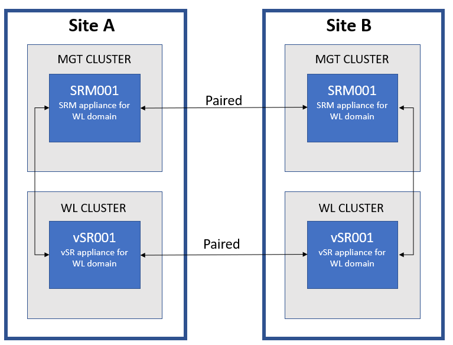

SRM is used for DR automation and orchestration while vSR is used to provide data replication on a VM vmdk level. Breaking down this logical view, it can be seen that Site A - which is the protected site - will have SRM001 deployed in the management domain in accordance to dr-006. In this scenario only 1 WLD cluster is protected. If an additional Workload domain require protection, a separate SRM appliance would be deployed into the MGT domain. If an additional cluster within the same WLD domain is required, no additional SRM is needed.
vSphere replication appliances reside in the workload domains. This is because each workload domain has a separate vCenter controlling the objects and vSphere replication requires to register against the vCenter extension service in which it is protecting. This is in accordance to dr-006. SRM001 in Site A is paired with SRM001 in site B and also connected to vSR001 in Site A. vSR001 in Site A is paired with vSR001 in Site B.

Once SRM and vSR appliances are deployed and configured into both Active and Passive Sites, the Site Recovery UI is used for configuring VMs for protection. As shown in the following logical diagram each paired site will require separate Replications, Protection Groups and Recovery Plans.

---

### vSR and SRM appliances flows - logical view

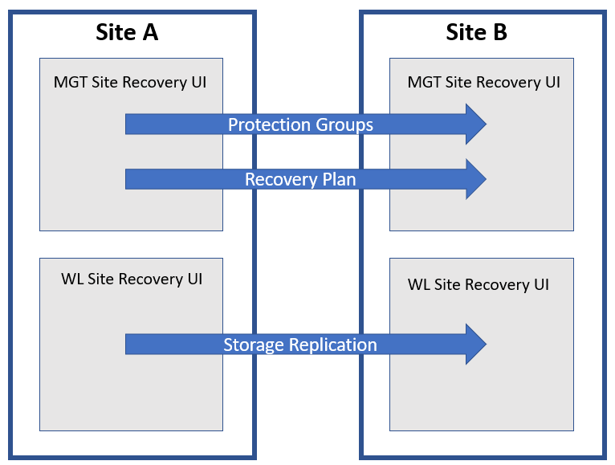

## Integrating the Active/Passive Service

*Active* site is alternately named *protected* site.

*Passive* site is alternately named *recovery* site.

Two types of active-passive setup is possible:

1. A/P one-direction - passive site resources are are not used for active workload, standby for the failover.
2. A/P bi-direction - Customer workload runs on both sites, each site has active area and passive area on the other site.

As mentioned previously, VCS offers the option for Active/Passive DR to be layered on top of 2 existing vCF deployments. Ansible playbooks have been developed to assist in the velocity and consistency of A/P DR integration. In order to integrate the following Ansible roles should be used. These playbooks are all executed as part of the managed phase of VCS.

---

### Roles used for A/P DR integration ansible playbooks

| Role Name                     | Role Task                                            | Description                                                                                                |
|:------------------------------|:-----------------------------------------------------|:-----------------------------------------------------------------------------------------------------------|
| dhc-createDr                  | Create dr variables                                  | Creates specific DR variables used during DR integration automation.                                       |
| dhc-configureNsxtSDN          | Create nsx-t ruleset                                 | Creates specific nsx-t ruleset top open traffic between SRM and VSR components for DR integration          |
| dhc-createDr                  | Prepare AD config                                    | Creates the pre-requisites AD configuration for the DR infrastructure                                      |
| dhc-createDr                  | Implement SRM AD RBAC                                | AD RBAC implementation on compute vCenter to grant sufficient permissions into SRM                         |
| dhc-createDr                  | Create VSR and SRM network port groups and vmkernels | Creates the pre-requisites required by vSphere replication and SRM (VMKernels and replication PortGroups)  |
| dhc-deactivateVraCloudAccount | Deactivate cloud account                             | Deactivates vsphere vRA cloud account for dr passive site only                                             |
| dhc-createDr                  | Deploy SRM appliance                                 | Deploys SRM OVA file in the Management Domain                                                              |
| dhc-createDr                  | Generate SSL certificate SRM                         | Generates certificate chain for SRM                                                                        |
| dhc-createDr                  | Configure VSR appliance                              | Configures vSphere Replication appliance (adds 2nd NIC on Replication Portgroup and sets ip configuration) |
| dhc-createDr                  | Store SRM credentials                                | Adds SRM credentials for the remote DR site to Vault                                                       |
| dhc-createDr                  | Generate SSL certificate VSR                         | Generates certificate chain for VSR                                                                        |
| dhc-createVroSubscription     | Create vRO subscription                              | Creates DR vRO subscription under active site vRA cloud organization                                       |
| dhc-drImportBrokerForm        | Import DR custom form                                | Creates the vRA Service Broker form to include DR options                                                  |
| dhc-configureVrops            | Add SRM and VSR adapters to vROps                    | Configures SRM and VSR monitoring in vROps.                                                                |

>**Note:** All mentioned manual tasks are reflected in the A/P DR integration work instruction, that can be found in [related document paragraph](#related-documents)

In addition to these automated process, there is also limited manual tasks which need to be performed. These are:

---

### Manual Tasks after deployment phase

| Manual Task                                                   | Why is this not automated?                                                                       |
|:--------------------------------------------------------------|:-------------------------------------------------------------------------------------------------|
| Install SSL certificate in Site Recovery Manager appliance    | There is a lack of API.                                                                          |
| Deploy vSphere replication appliance in the Management Domain | There is a lack of API.                                                                          |
| Install SSL certificate in vSphere replication appliance      | There is a lack of API.                                                                          |
| Register vSphere replication appliance under vCenter          | There is a lack of API.                                                                          |
| Register SRM under vCenter and pair sites                     | There is a lack of API.                                                                          |
| Create SRM resource mappings                                  | Complex and very time consuming to invest in automation, configuration differs by Customer needs |
| Create Customer Protection Group and Recovery Plan            | Complex and very time consuming to invest in automation, configuration differs by Customer needs |
| Configure vRO with SRM and VSR                                | Easy to execute manually, complex and very time consuming to invest in automation                |
| Validate vRA and vRO integration                              | Easy to execute manually, complex and very time consuming to invest in automation                |
| Manual update of blueprint to enable DR options               | Easy to execute manually, complex and very time consuming to invest in automation                |
| Manual validation of vRA Service Broker Catalog Item          | Easy to execute manually, complex and very time consuming to invest in automation                |

>**Note:** All mentioned manual tasks are reflected in the A/P DR integration work instruction, that can be found in [related document paragraph](#related-documents)

---

### Disaster Recovery Variables

As mentioned, specific variables will be required for use with Ansible playbooks. These vars will be stored in the /manage/group_vars folder on the Ansible core VM and named as drVars. The variables required are shown in the below table:

---

#### drVars variables

Following table describes basic variables used by DR integration automation playbooks. The variables are stored in */opt/dhc/manage/group_vars/drVars.yml* file. Some parameters will be automatically skipped depending on the chosen principal storage type or vRA type.

| Var Name                      | Description                                                                                                        |
|:------------------------------|:-------------------------------------------------------------------------------------------------------------------|
| *locationCodeDr*              | Remote DR location name which is Customer specific variable represented by 3 letters and 2 digits - always visible |
| *workloadDomainNumber*        | workload domain number                                                                                             |
| *clusterNumber*               | cluster number                                                                                                     |
| *networkVreplication.vlan*    | vSphere Replication VLAN - `visible when: principalStorageTypeCmp == 'vsan'`                                       |
| *networkVreplication.pgName*  | vSphere Replication Port Group Name - visible when: `principalStorageTypeCmp == 'vsan'`                            |
| *networkVreplication.gw*      | vSphere Replication default gateway - last octet only - `visible when: principalStorageTypeCmp == 'vsan'`          |
| *networkVreplication.cidr*    | vSphere Replication network - first 3 octets only - `visible when: principalStorageTypeCmp == 'vsan'`              |
| *networkVreplication.netmask* | vSphere Replication subnet mask - `visible when: principalStorageTypeCmp == 'vsan'`                                |
| *networkVreplication.mtu*     | vSphere Replication network MTU size - `visible when: principalStorageTypeCmp == 'vsan'`                           |
| *remoteReplicationNetwork*    | Remote DR Replication Network (x.x.x.x/x format) - `visible when: principalStorageTypeCmp == 'vsan'`               |
| *remoteManagementNetwork*     | Remote DR Management Network (x.x.x.x/x format) - `visible when: principalStorageTypeCmp == 'vsan'`                |
| *remoteLocalRegionNetwork*    | Remote DR local region network (x.x.x.x/x format) - `always visible`                                               |
| *remoteAbx1IpLastOctet*       | IP address of remote site first ABX (last octet only) - `visible when: vraType == 'saas'`                          |
| *remoteAbx2IpLastOctet*       | IP address of remote site second ABX (last octet only) - `visible when: vraType == 'saas'`                         |

>**Note:** Above variables are used by automation playbooks mentioned in the A/P DR integration work instruction, that can be found in [related document paragraph](#related-documents)

---

#### Tags

VCS uses tagging to support DR integration, VM deployment and the failover activities.

| Tag Name                   |      Example value       |     Associated entities      | Description                                                                                                                                                                                                          |
|:---------------------------|:------------------------:|:----------------------------:|:---------------------------------------------------------------------------------------------------------------------------------------------------------------------------------------------------------------------|
| UHC-SN-DR-PROTECTION-GROUP | *`ProtectionGroupName1`* |       Virtual Machine        | Site Recovery protection group name assigned to the VM during deployment (static, no auto refreshment, update possible via playbook (wiUpdateVraVmTags.md)). Tag used during DR failover procedure - VRA onboarding. |
| UHC-SN-DR-PRIORITY-GROUP   |           `3`            |       Virtual Machine        | Site Recovery VM startup priority group after the failover - five levels, from 1-highest to 5-lowest                                                                                                                 |
| UHC-SN-DR-RPO              |          `180`           |       Virtual Machine        | RPO refers to the recovery point objective. Valid for VSAN principal storage type only, where replication is arranged via vSphere Replication appliance.                                                             |
| UHC-SN-DISASTER_RECOVERY   |      *`true/false`*      |       Virtual Machine        | Indicates if the VM is DR enabled (static, no auto refreshment). Tag used during DR failover procedure - VRA onboarding.                                                                                             |
| StorageClass               |         *`gold`*         | Datastore Cluster, Datastore | Indicates datastore storage class type. Tag used in VM Storage Policy as tag based placement rule.                                                                                                                   |
| StorageReplication         |        *`yes/no`*        | Datastore Cluster, Datastore | Indicates if storage replication is enabled on the array level. Tag used in VM Storage Policy as tag based placement rule.                                                                                           |
| StorageProtectedSite       |    *`<locationCode>`*    | Datastore Cluster, Datastore | Tag used in VM Storage Policy as tag based placement rule.                                                                                                                                                           |
| storagePG                  | `<ProtectionGroupName>`  | Datastore Cluster, Datastore | Optional. Customization tag used in VM Storage Policy as tag based placement rule. Created to satisfy Aviva requirements.                                                                                            |

---

### vRealize Orchestrator

When A/P DR is introduced, one of the main requirements is to automatically protect a virtual machine - either during deployment or a day 2 activity (Requirement R008). The initial thought was to use PowerCLI to automate the protection of VMs, however at the time of designing the solution, there where compatibility issues whereby PowerCLI is not compatible with the current version of SRM. Therefore, with plugins for vSR and SRM already available and previous development experience of vRO workflows within the VCS development team, vRO allow to easily meet this requirement.

vRO is solely used for DR within VCS for VSAN as a principal storage type. Specifically, it is used to protect customer VMs in an automated fashion. In order to achieve this, the following logical flow has been developed:

- Customer Requests Virtual machine with information the VM is to be protected against a specific RPO and protection group,
- vRA Cloud subscription triggers vRO integration based on Active/Passive tag,
- vRO Workflow receives payload from vRA Cloud detailing resource to be protected and the protection group to add it too as well as RPO for protection,
- vRO extracts these variables and executes protection.

The following diagram illustrates the traffic flow when an Active/Passive DR protected VM is requested:

---

#### Active/Passive DR protected VM traffic flow under single vRA cloud organization

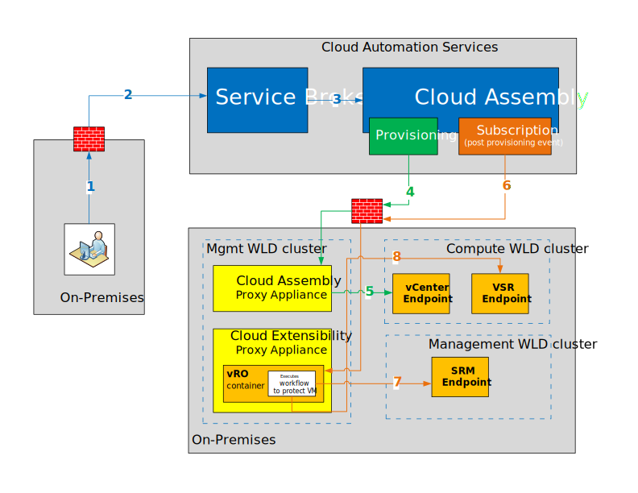

#### Active/Passive DR protected VM traffic flow under multitenant vRA cloud organization

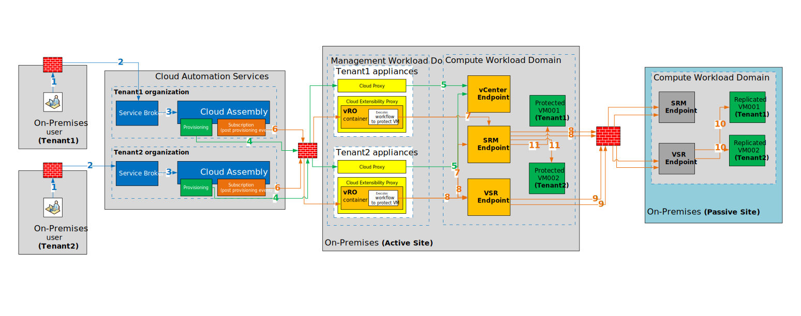

 >**Note:** Above diagram represents VM protection flow for multitenant organizations as example Tenant1 and Tenant2 which are using shared workload domain compute in active and passive site.

---

#### vRO Workflows

List of vRO workflows DR related:

- `Day1ProtectVirtualMachine` - Day1 workflow enables VM protections, sets Protection Group, Restart Priority Group and RPO (Recovery Point Object) on the Site Recovery Manager. It's used for VSAN based principal storage only.
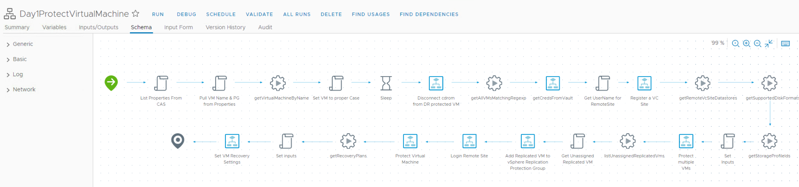

- `dhcProtectVmDrActivePassive` - 2nd Day workflow. Valid for VSAN based principal storage only. Enables DR protection on the existing VM, sets Protection Group, Restart Priority Group and RPO (Recovery Point Object) on the Site Recovery Manager. Refer to lldManageActivePassiveDrSsrs.md for more info.
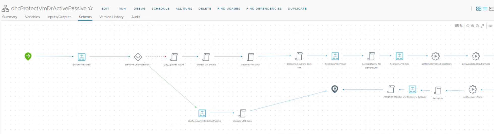

- `dhcRemoveVmDrActivePassive` - 2nd Day workflow. Valid for VSAN based principal storage only. Removes DR protection on the existing VM. Refer to lldManageActivePassiveDrSsrs.md for more info.
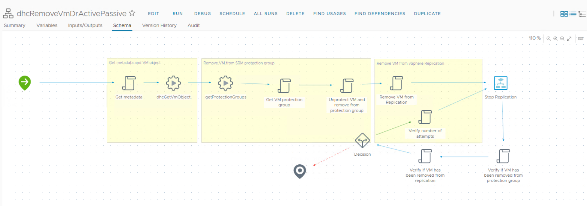

- `dhcChangeDiskStorageClass` - 2nd Day workflow. Valid for VMFS on FC based principal storage only. for non DR protected VMs allows to migrate selected VM disk to another non-replicated storage class profile (replicated storage profiles are hidden to prevent disk split between non and replicated datastores). When *Change Storage Profile of entire VM* is chosen then *dhcChangeVmStorageClass* workflow is triggered.

  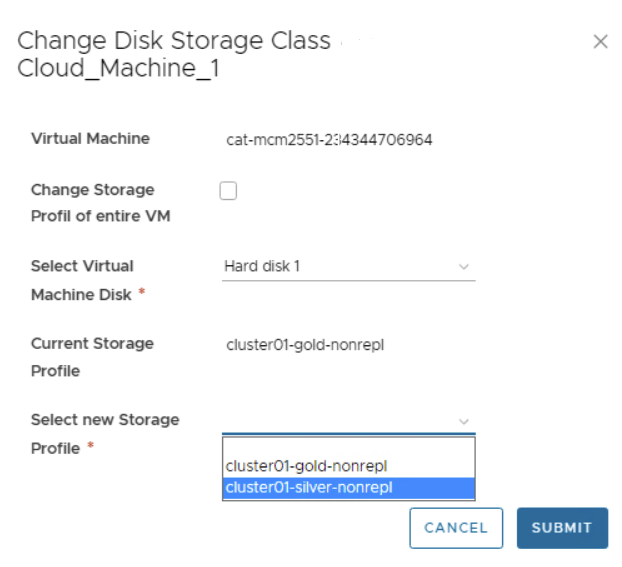

  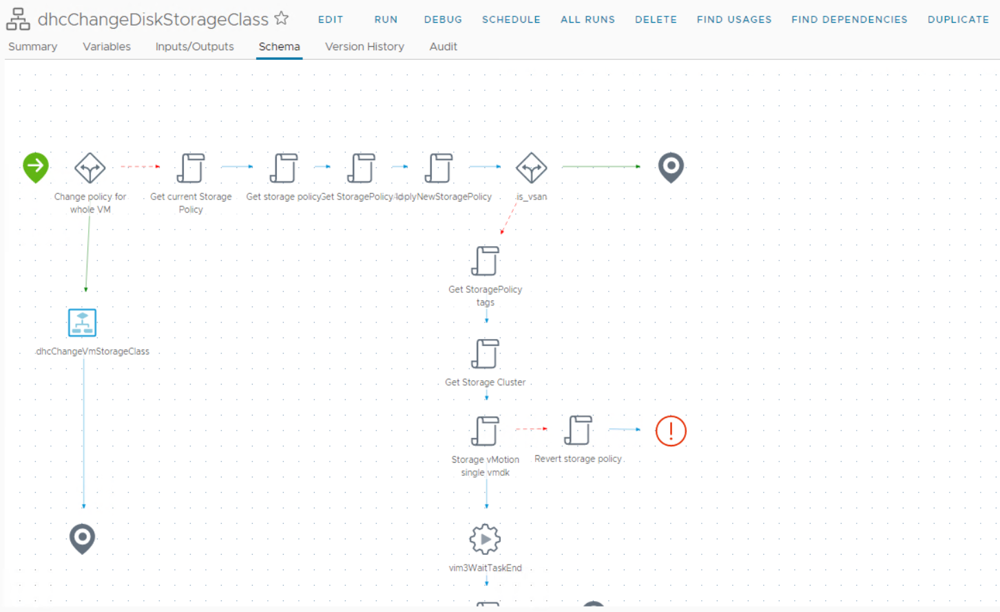

- `dhcChangeVmStorageClass` - 2nd Day workflow. Valid for VMFS on FC based principal storage only. Triggered via *dhcChangeDiskStorageClass* workflow. Changes storage class profile of the entire VM. Allows to move between non-replicated and replicated datastores and effectively enables/disables DR protection. Protection Group assignment on the Site Recovery Manager is handled automatically via tag based storage policies (array based replication).

  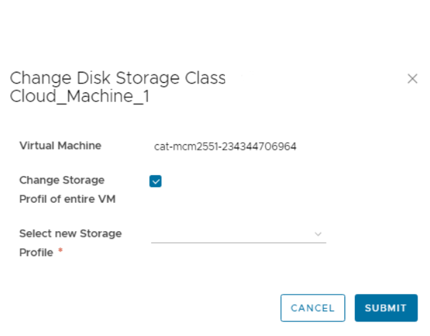

  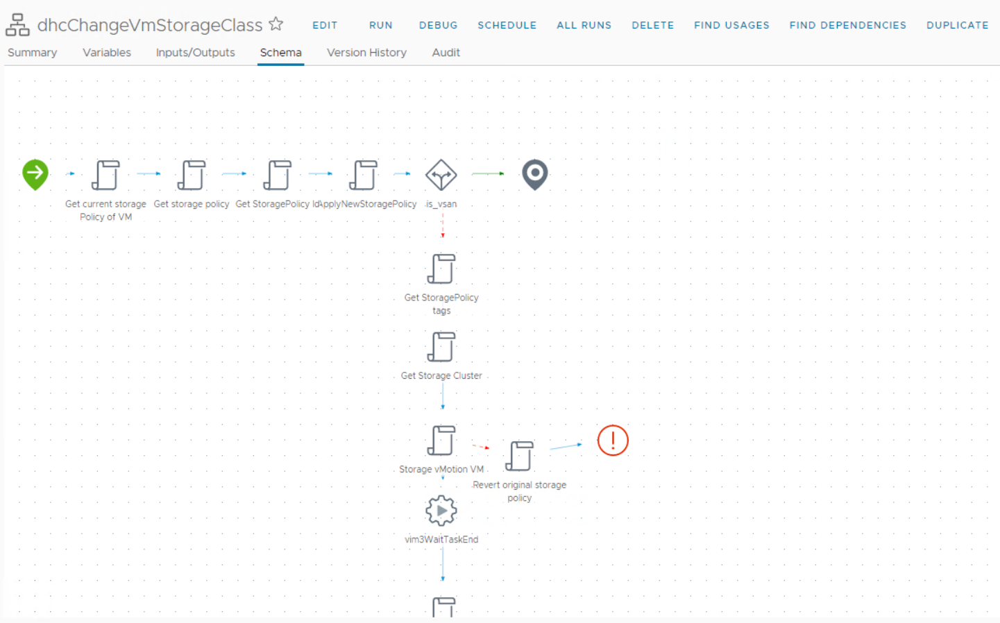

## Security

---

### Role Based Access Control

Below roles are defined for user access purpose including service accounts.

---

#### Role Groups - SRM RBAC

| Role Group Name                     | Comment                                                                                                                            |
|-------------------------------------|------------------------------------------------------------------------------------------------------------------------------------|
| rsce-< location code >-srm-l-admins | Example might be "rsce-mec94-srm-l-admins" if location is named mec94. This group is added "administrator" permissions on vCenter. |

---

#### Service Accounts - SRM RBAC

| Service Account Name        | Comment                                                                                                               |
|-----------------------------|-----------------------------------------------------------------------------------------------------------------------|
| svc-< location code >-srm01 | Example might be "svc-mec94-srm01" if location is named mec94. This service account is added to the role group above. |

---

### Firewall

Refer to SDN Network for Firewall rules and decisions for Networking for Active/Passive DR.

---

### Certificates

VCS introduces a dedicated Certificate Authority (CA). Below design decisions are taken in terms of certificate management for that LLD.

---

#### Design Decisions - Certificates

| Decision ID | Design Decision                                                                                                            | Design Justification                                                                                                         | Design Implication                                         |
|:-----------:|----------------------------------------------------------------------------------------------------------------------------|------------------------------------------------------------------------------------------------------------------------------|------------------------------------------------------------|
|   cd-001    | Internal CA certificate must be used.                                                                                      | There is no build-in certificate store.                                                                                      | None                                                       |
|   cd-002    | SHA256 or stronger signature algorithm to be used in SRM and vSphere Replication.                                          | It is an SRM requirement.                                                                                                    | None                                                       |
|   cd-003    | Separate SRM CA signed certificate is to be used despite vCenter having custom certificate.                                | If vCenter custom certificate is used, SRM custom certificate is not mandatory but will be implemented for greater security. | None                                                       |
|   cd-004    | Private key will be in PKCS#12 format.                                                                                     | Requirement from SRM side.                                                                                                   | None                                                       |
|   cd-005    | Private key length will be 4096 bits.                                                                                      | Requirement from SRM side as minimum key length is 2048.                                                                     | None                                                       |
|   cd-006    | SRM certificate password shorter than 31 characters.                                                                       | Requirement from SRM side.                                                                                                   | None                                                       |
|   cd-007    | ```extendedKeyUsage``` variable present and set to ```serverAuth```.                                                       | Requirement from SRM side.                                                                                                   | None                                                       |
|   cd-008    | ```clientAuth``` variable and value not present.                                                                           | Not mandatory                                                                                                                | None                                                       |
|   cd-009    | x509v3 Extended Key Usage server certificate.                                                                              | Not mandatory                                                                                                                | None                                                       |
|   cd-010    | Subject Name value will be different for protection and recovery site.                                                     | For consistency purposes and allowed in this version of SRM.                                                                 | None                                                       |
|   cd-011    | Subject Name value will contain fewer than 4096 characters.                                                                | For consistency purposes                                                                                                     | None                                                       |
|   cd-012    | Subject Alternative Name (SAN) value will be set to FQDN of the host.                                                      | Requirement for host identification.                                                                                         | None                                                       |
|   cd-013    | vSphere Replication server name in the certificate will match host name in Virtual  Appliance Management Interface (VAMI). |                                                                                                                              | None                                                       |
|   cd-013    | Certificates for SRM and vSphere replication to have 365 days of validity.                                                 | Increases security                                                                                                           | Either automatic or manual rotation needs to be performed. |

## Availability and Scalability

---

### Availability Design

The design decisions below are made to guarantee availability of VCS Management.

---

#### Design Decisions - Availability Design

| Decision ID | Design Decision                                                                                                                     | Design Justification                                                                                                                                                                                                                                               | Design Implication                                                                                                                   |
|:-----------:|-------------------------------------------------------------------------------------------------------------------------------------|--------------------------------------------------------------------------------------------------------------------------------------------------------------------------------------------------------------------------------------------------------------------|--------------------------------------------------------------------------------------------------------------------------------------|
|   ad-001    | Single SRM and vSphere Replication Appliances for each WL domain.                                                                   | vSphere replication can now handle 2000 VMs. Availability will be provided by vSphere HA.                                                                                                                                                                          | Bigger deployments will require more addresses to address SRM and VSR devices, maybe bigger Management network should be considered. |
|   ad-002    | Single ABX with embedded vRO for each site [valid for vRA Cloud]                                                                    | vRO embedded into ABX cannot be clustered. Availability will be provided by vSphere HA.                                                                                                                                                                            | vRO can be used in various situations to help automate topics which are currently unavailable in vRA Cloud.                          |
|   ad-002    | vRA on-prem must be installed in clustered mode on each site. There is no protection/data replication enabled on vRA between sites. | VRA services on the site are redundant thanks to cluster functionality. Separate vRA instances per site simplify using bi-directional DR. The failover process focuses on the compute workload only, similarly to vRA Cloud. vRA on-prem makes ABX usage obsolete. | Failed over workload VMs will have to be onboarded to vRA on the recovery site                                                       |

---

### Scalability Design

The design decisions below are made to provide Scalability of VCS Management

---

#### Design Decisions - Scalability Design

| Decision ID | Design Decision                                                                             | Design Justification                                                                                             | Design Implication                                                                                                                                                                                                                                                                                                                                                                                     |
|:-----------:|---------------------------------------------------------------------------------------------|------------------------------------------------------------------------------------------------------------------|--------------------------------------------------------------------------------------------------------------------------------------------------------------------------------------------------------------------------------------------------------------------------------------------------------------------------------------------------------------------------------------------------------|
|   sd-001    | Additional vSphere replication appliance would be deployed.                                 | If more than 2000 VSR VMs are required additional appliances can be deployed.                                    | More VMs require more IP addresses reserved for this purpose which might be problematic in the end.                                                                                                                                                                                                                                                                                                    |
|   sd-002    | Additional ABX appliance with embedded vRO would be deployed.                               | If under vRO are queued more than 300 running workflows per node or greater than 100 preserved running workflows | More ABX appliances requires additional esxi hosts under management cluster to cover vCPU and vMemory demands                                                                                                                                                                                                                                                                                          |
|   sd-003    | To satisfy multi-tenancy, ABX appliance with embedded vRO will be deployed per each tenant. | If Active-Passive deployment done for vRA cloud multitenant organizations                                        |                                                                                                                                                                                                                                                                                                                                                                                                        |
|   sd-004    | vRA on-prem will be installed in cluster mode - medium profile - with NSX load balancer     | vRealize Automation can be scale up via vRealize Suite Lifecycle Manager.                                        | Scaling the heap memory of the vRealize Orchestrator Appliance is only applicable for standalone vRealize Orchestrator instances and is not supported for embedded vRealize Orchestrator instances in vRealize Automation. To modify the heap memory of an embedded vRealize Orchestrator instance, the vRealize Automation profile size through the vRealize Suite Lifecycle Manager must be changed. |

## Recoverability

The chapter below provides detailed design choices to protect against data loose and backup functionality and against Datacenter failure.

---

### Component Failure

This Active/Passive DR includes a number of infrastructure appliances, therefore this also means there are a number of possible failure scenarios.

---

#### vSphere Replication Failure

In the event of a failure to a replication appliance then initial troubleshooting should take place. If this is not possible, the vSphere Replication appliance should be brought back up from the latest backup and replication should be re-enabled as quickly as possible to provide expected RPO time.

---

#### Site Recovery Manager Failure

In the event of a failure to an SRM appliance then initial troubleshooting should take place. If this is not possible, the SRM appliance should be brought back up from the latest backup. Troubleshooting and repair should be prioritized at the recovery site rather than the primary site.

---

#### vRO Failure

In the event of a failure to a ABX appliance with embedded vRO then initial troubleshooting should take place. If this is not possible, then ABX appliance should be brought back up from the latest backup. Troubleshooting and repair should be prioritized at the recovery site rather than the primary site.

VCS 1.5 introduced two ABXex installation, which are not working as a cluster however traffic is balanced via VRA SaaS based on capability tag *`abx:projectName`*.

For vRA on-prem ABX usage is obsolete, vRO are embedded into vRA.

---

#### Storage Array Failure

In the event of storage failure or the data replication failure troubleshooting must have place by the responsible team.

---

#### Datacenter Failure

In case of a datacenter failure, SRM can failover all protected workload virtual machines to the recovery site.

When a recovery plan is executed, site recovery manager will follow the startup sequence defined in the recovery plan and startup the virtual machines in the recovery site. Site Recovery Manager attempts to shut down the corresponding virtual machines on the protected site, if the protected site is unavailable forced recovery option can be selected. Forced recovery starts the virtual machines on the recovery site without performing any operations on the protected site.

From a management stack perspective, the full integrated stack will now being working as it is the active site. Refer to [related document section](#related-documents) ans search for A/P DR Failover work instruction.

## External Connection/System Requirements

External networking connection requirements can be found in [Software Defined Networks LLD](lldSoftwareDefinedNetworks.md).

# Detailed Active/Passive Physical Design

Active-Passive DR is integrated on top of two stand-alone VCS sites.

Starting from VCS 1.5, two types of active-passive setup is possible:

1. A/P one-direction - passive site resources are are not used for active workload, recovery/passive site is a standby for the failover.
2. A/P bi-direction - Customer workload runs on both sites, each site has active area (protected area) and passive area (recovery area) on the other site.

This chapter will detail the physical building blocks for the DR design. An SRM environment consists of two sites: Protected (or active) and Recovery (or passive). In the event of a disaster, protected VMs can be recovered by executing recovery plans on the recovery site. Execution of a recovery plan activate the replica storage and placeholder VMs on the recovery site.

All VMs in the protected and recovery site are managed by their local vCenter Server in that site. VCS uses vCF which offers a split between management and workload domains which means that each domain will have its own instances of SRM and vSphere replication (with VSAN as a principal storage), per site.

SRM cross site communication

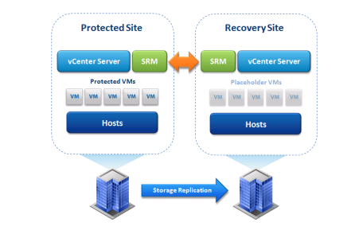

## Compute Workload - principal storage type

VCS 1.5 introduces ability to choose principal storage type for compute workload domain between VSAN and VMFS.

- VSAN - uses vSphere Replication appliance to replicate the data.
- VMFS - uses array-based replication mechanism.

## Site Recovery Manager and vSphere Replication

SRM and vSphere Replication both are packaged by VMware as an appliance running VMware Photon OS.

SRM is used to pair sites and synchronize configuration information. This allows the recovery site to execute a failover in the event that the primary site appliance has experienced a disaster.

vSphere Replication is used to replicate storage between the primary and secondary site when the principal storage is VSAN. For VMFS on FC the replication is handled via array-based mechanism.

The vSphere Replication appliance will use a separate port group for replication traffic in order to avoid collision with the management traffic.

Both SRM and vSphere Replication will use their embedded Database.

## Maximums

SRM, vSphere Replication and vRO are the key components in the design but come with some operational maximums.

These are noted below:

### SRM Maximums

| Item                                                                                 | Maximum |
|--------------------------------------------------------------------------------------|---------|
| Protected virtual machines per protection group                                      | 500     |
| Total number of virtual machines configured for protection using vSphere Replication | 2000    |
| Total number of Recovery plans                                                       | 250     |
| Total number of Concurrent recovery plans                                            | 10      |
| Total number of protection groups per recovery plan                                  | 250     |
| Total number of VMs per recovery plan                                                | 2000    |

### vSphere Replication Maximums

| Item                                                                                       | Maximum |
|--------------------------------------------------------------------------------------------|---------|
| Appliances per vCenter Server instance                                                     | 1       |
| Maximum number of additional vSphere Replication servers per vSphere Replication appliance | 9       |
| Maximum number of virtual machines managed per vSphere Replication appliance               | 2000    |
| Maximum number of protected virtual machines per vSphere Replication server                | 200     |
| Maximum number of protected virtual machines per vSphere Replication server                | 200     |
| Maximum number of virtual machines configured for replication at a time                    | 20      |

### vRO Maximums

| Item                                           | Maximum        |
|------------------------------------------------|----------------|
| Maximum number of target virtual machines      | 35000          |
| Maximum number of vCenter connections          | 10             |
| Maximum number of concurrent running workflows | 300 per node   |
| Maximum number of queued running workflows     | 10000 per node |
| Maximum number of preserved workflow runs      | 100 per node   |

## Virtual Machine Configuration Table

The management domain will consist of SRM and vSphere replication appliances. The resources are detailed below:

---

### ABX Appliance specification

**Note:** VMware changed approach and vRO is available as docker container inside existing Cloud Extensibility Proxy (ABX) appliance. ABX is deployed with tenant builder procedure while integrating with vRA Cloud. When vRA on-prem integration is chosen the ABX is not deployed, not needed. vRO is embedded in vRA on-prem.

| ABX Appliance parameter | Value            |
|-------------------------|------------------|
| Number of instances     | 1                |
| Operating System        | VMware Photon OS |
| vCPU                    | 8                |
| Memory                  | 32               |
| Total Storage           | 206 GB           |

---

### SRM Appliance specification

| SRM Appliance parameter | Value            |
|-------------------------|------------------|
| Number of instances     | 1                |
| Operating System        | VMware Photon OS |
| vCPU                    | 4                |
| Memory                  | 12               |
| Total Storage           | 16 GB + 17 GB    |

SRM appliance is hosted on the management cluster.

---

### VSR Appliance specification (VSAN only)

| vSphere Replication Appliance  parameter | Value            |
|------------------------------------------|------------------|
| Number of instances                      | 1                |
| Operating System                         | VMware Photon OS |
| vCPU                                     | 4                |
| Memory                                   | 8 GB             |
| Total Storage                            | 16 GB + 17 GB    |

vSR appliance is hosted on the compute cluster.

---

### SRA

Storage Replication Adapter (SRA) for VMware vCenter Site Recovery Manager (SRM) is a storage vendor-specific or plugin for VMware vCenter server. The adapter enables SRM to work with a specific kind of array. SRA is installed on SRM.

Some vendors requires additional appliances for example NetApp uses SRA for ONTAP. It is recommended to use IP reserved for vSR if necessary.

| NetApp SRA for ONTAP parameter | Value                        |
|--------------------------------|------------------------------|
| Number of instances            | 1                            |
| vCPU                           | 2                            |
| Memory                         | 12 GB                        |
| Total Storage                  | 15 GB + 8 GB + 20 GB + 10 GB |

ONTAP appliance is hosted on the management cluster.

## SRM Inventory Mappings

Each virtual machine has several properties within the vSphere layer that must be mapped between the protected and the recovery site. If you do not specify inventory mappings, you must configure them individually for each member of a protection group.

Each virtual machine needs a mapping in the recovery site for:

- A resource pool (cluster),
- All connected networks,
- Folders,
- Storage policies - it is recommended to do not map any storage policies.
- Placeholder datastores.

When a VM is protected and a failover is executed SRM will use these mapping to configure the virtual machine in the recovery site.

---

### Placeholder Datastore

All protected virtual machines require a placeholder configuration on a placeholder datastore.

The placeholder virtual machine is created by SRM on the assigned placeholder datastore. The virtual machine placeholder is managed by SRM and cannot be modified. It remains in a powered off state until a failover is executed.

Depending on the principal storage type:

- **VSAN**

  VSAN datastores shall be chosen as a placeholder datastore.

- **VMFS**

  **Placeholder datastore must be set on non-replicated datastore**, shared for all hosts. The protected VM that is running on siteA will have a virtual machine placeholder created by Site Recovery Manager on the recovery site B on non-replicated datastore.

---

## SRM Protection Groups

Protection groups allow to group VMs that will be recovered together.

The logic of handling SRM protection groups differs depending on VSAN vs VMFS as a principal storage.

- **VSAN**

  Protection groups contain virtual machines that vSphere Replication protects. Once Protection Group is created, individual VMs from inventory can be added to it. vSphere Replication replicates data on per Virtual Machine basis and each Virtual Machine can be configured with different RPO levels.

  A protection group can be recovered only by one recovery plan at a time. If multiple recovery plans contain the same protection group are started simultaneously, only one will be able to failover given protection group.

  Create as many protection groups you need to satisfy Customer requirements, especially in the area of possible planned periodical failover for the specific application and its components.

  **VCS assumes every defined protection group is assigned to at least one recovery plan.**
  Due to limitation in vRO SRM workflows, Day1 new VM creation will fail when assigned protection group would not be a member of at least one recovery plan. It is strongly  recommended to create *AllProtectedVMs* recovery plan that would include all existing protection groups as a member to avoid the problem.

- **VMFS**

  VMFS is array-based storage. VCS uses datastore clusters that combine datastores of the same storage class, therefore workload is balanced via enabled *fully automated* storage DRS. It is a must to create a single *Storage policy protection group* per each datastore cluster. Linking protection group with tag based storage policy allows to add any VM located on the specific datastore cluster automatically, keeping DRS functionality enabled even when more new datastores will be added to it.

---

## SRM Recovery Plans

Recovery Plans are created at the recovery site so that they are accessible and can be run from the recovery site when there is a disaster at the protected site. A Recovery Plan is executed to Failover the virtual machine workload, based on protection groups, that was running at the protected site to the recovery site. In the Recovery plan five layers of boot priority will be used: from 1-highest to 5-lowest. The customer will decide which boot priority will be assigned to a Virtual Machine at the VM deployment phase.

Make sure to include one or more protection groups in a recovery plan. A recovery plan specifies how Site Recovery Manager recovers the virtual machines in the protection groups that it contains. Make sure to define a least one that would include all existing protection groups. It is strongly  recommended to create *AllProtectedVMs* recovery plan that would include all existing protection groups as a member.

A recovery plan can be executed as a planned migration, test failover and disaster recovery.

---

## RPOs and RTOs on VSAN

RPO refers to the recovery point objective. In other words the point in time when a VM can be recovered after a DR situation. If the RPO is 1 hour then this means a VM can be recovered up to 60 minutes prior to the disaster. However we should note that these are subject to bandwidth restrictions. It is not possible to say if every customer can have a 15min RPO. The amount of VMs being replicated also has an impact on the RPOs that can be offered.

To determine the bandwidth that vSphere Replication requires to replicate efficiently, we should calculate the average data change rate within an RPO period and divide by the link speed. Then following 3 steps should can be performed:

- Identify the average data change rate within the RPO by calculating the average change rate over a longer period, then dividing it by the RPO,
- Calculate how much traffic the data change rate generate in each RPO period,
- Measure the traffic against the link speed.

To take an example, a data change rate of 1TB requires approximately 2 hours and 15 minutes to replicate on a 1Gbps network, 15 minutes to replicate on a 10Gbps network, approximately 6 minutes on 25Gbps network and approximately 4 minutes on 40Gbps network.

Additionally, to gain a rough idea we can use the following [vSphere Replication Calculator](https://storagehub.vmware.com/t/vsphere-replication-calculators/vsphere-replication-calculator) when we find out bandwidth expectations between sites.

RTO refers to the recovery time objective. In other words, how long it will take for the business to be back running after a disaster scenario. Again this has many variables which the customer requirements dictates and every organization can be different depending on the amount of VMs being protected. As a rule of thumb, Atos private cloud offerings suggest RTO of 30 minutes per 100 VMs.

Atos statement is, the bandwidth of 1Gbps is a very minimum.

VCS will offer 6 default RPOs for customer virtual machines **bandwidth dependent**:

- 5 Minutes,
- 15 Minutes,
- 1 Hour (60 Minutes),
- 3 Hours (180 Minutes),
- 10 Hours (600 Minutes) ,
- 24 Hours (1440 Minutes).

It is difficult to advise on an RTO for the customer without specific requirements, please follow [VMware vSphere Replication Calculator](https://storagehub.vmware.com/t/vsphere-replication-calculators/vsphere-replication-calculator/).

>**Note:** Atos Private Cloud offerings suggest RTO of 30 minutes per 100 VMs.

## RPOs and RTOs on VMFS

There are again two basic data recovery metrics to consider for array based storage: recovery point objective (RPO) and recovery time objective (RTO). The RPO metric determines how much data can be lost. It is based on how far back the last backup occurred or the point where data are in a usable state. The RTO metric determines how long you can be down until your systems are recovered.

Smaller RPO requires continuous data protection and mandates usage of synchronous replication and smaller RTO mandates clustering and hot standby systems.

Depending on the site network bandwidth and Customer RPO requirements asynchronous replication may be used.

Please refer to [EMC Unity: Low Level Design](lldUnity.md) for build recommedations designed by Atos Storage team.

For any other type of storage it is strongly recommended to follow array manufacturer best practices to build and configure DR solutions.

---

## vSphere Storage policies

VCS creates storage policies and maps it to [vRA SaaS](../workInstructions/wiTenantBuilder.md) or to [vRA on-prem](../workInstructions/wiTenantBuilderVraOnPrem.md) during tenant builder procedure. Refer to [naming convention](namingConvention.md) document how the storage policy naming is addressed.

VCS uses different approach to storage policies depending on the principal storage type:

- **VSAN**
  - single datastore, storage policy defines parameters like FTT - failures to tolerate, STR - number of disk stripes per object, FTM - failure tolerance method, IOPS limit and others that are assigned to the VM disk object. Storage policies are created during VRA integration process.

- **VFMS**
  - multiple datastores gathered in the VMware Datastore Cluster identified with storage class. Datastores are tagged. Storage policies uses tag based placement rules checking the storage class type, if the storage replication is enabled to protect VM against disaster recovery and finally what the origin protection site is. IOPS limits when required are not set on the policy level but on the array level.

## VMFS - array based storage - LUNs

VMFS principal storage type uses array based storage and a logical unit number (LUN), a block volumes which are presented to vSphere hosts as a logical datastores.

Unlike VSAN which is managed by VCS DevSecOps team, array based storage is operated and managed by dedicated storage team, either Atos CEB or Customer. A number of replicated LUNs must be requested to fulfil DR initial requirements.

**One LUN is one Datastore on the vSphere**. Number of LUNs and their size depends on the Application(s) requirements that is reflected logically by SRM Protection Group and mapped datastores.

**It is strongly recommended to group LUNs of the same storage class in consistency groups**. Consistency Group (CG) prohibits spreading datastores/LUNs to multiple SRM Protection Groups and ensures that the read/write control policies of the multiple LUNs on a storage system are consistent.

**SRM Protection Group may contain multiple CGs**. For example *ProtectionGroup1* may include *ConsistencyGroup-Gold* and *ConsistencyGroup-Silver* to allow using disks of different storage class via VMs placed in that PG. **Treat this functionality with caution**. For example in a large size databases, the user data and logs are usually stored on different disks. If those disks are spread across datastores of different storage classes, which effectively will be stored on LUNs from different consistency groups the database, then this data vs logs might be inconsistent after failover.

>`NetApp storage warning`: It occurred *consistency groups* are not available for asynchronous replication (planned in the future releases), hence to mitigate the issue, storage team is going to create LUNS for the particular storage class on a bigger volume block. The volume block is being replicated as one, which simulates - is a like - consistency group functionality. Volume block may be extended on the fly not affecting existing data.

## Datastores

Depending on the principal storage type for the compute workload there is a different approach to datastore creation:

---

### VSAN datastore

VSAN datastore is created during workload domain creation procedure and does not require any adjustments to work with DR.

---

### VMFS datastores

After VCS build there are certainly no replicated datastores created on a stand alone VCS. It is an action for DR integration to add all requested replicated LUNs as datastores on a vCenter.

This is a manual task:

- Use *`New Datastore`* action on vCenter:
- Choose "VMFS" datastore type,
- Provide datastore name `< locationCode >-< type >-< storageType>< lunNumber >` (validate with standard [VCS naming convention](../design/namingConvention.md) document),
- Choose ESXi host to scan accessible LUNs. Make sure you select a proper FC disk by validating the WWN/NAA number and a size, assign full space, leave default block size.

>Note: [Datastore naming convention](../design/namingConvention.md) must remain intact, however you may add more information as suffix if required without harming VCS automation.

---

## Datastore Clusters (VMFS)

`Invalid for VSAN which is represented as a single datastore in vCenter.`

Standard VCS design groups datastores of the same storage class (in particular speaking about IOPS value) into datastore cluster with Storage DRS enabled. DRS allows to manage the aggregated resources allocation. This addresses the initial disk placement as well as later space load and I/O load balance among datastores within the datastore cluster.

Adding datastores to the datastore clusters can be achieved in two ways:

- One way to go is to use *`createVmfsDatastoresClusters.yml`* playbook from [On-Prem Tenant Builder](wiTenantBuilderVraOnPrem.md#create-datastore-clusters-and-storage-tags) work instruction, by filling the *`storagePoliciesVmfs`* section as described in the [wiCustomerInfraVars.md](wiCustomerInfraVars.md) document. This procedure creates datastore clusters, assigns to them provided datastores and creates DR tags categories and tags values (all except optional - [refer to tags category names table](#datastore--datastore-cluster-tags-vmfs))
- Another way to go is fully manual. This job contains datastore cluster creation, datastore assignment.
  
  - Use *New Datastore Cluster* action on vCenter.
  - Provide name.
  - Turn ON Storage DRS.
  - Set DRS automation to fully automated and leave to use cluster settings for all.
  - Enable I/O metrics for SDRS with defaults if not specified differently per application requirements. Select datastores and complete.

>Note: [Datastore cluster naming convention](../design/namingConvention.md) must remain intact, however you may add more information as suffix if required without harming VCS automation.

## Datastore & Datastore Cluster tags (VMFS)

Each datastore and every datastore cluster must have a set of DR related tags assigned from the expected categories.

Datastore tags category names table.

  | Category name                                                                                                         | Description                                                        | Associable Entities   | Expected/Example value              |
  |-----------------------------------------------------------------------------------------------------------------------|--------------------------------------------------------------------|-----------------------|-------------------------------------|
  | StorageProtectedSite                                                                                                  | Indicates what is the origin protected site location               | StoragePod, Datastore | `<locationSite>`                    |
  | StorageReplication                                                                                                    | Indicates if storage replication is enabled on storage array level | StoragePod, Datastore | yes/no                              |
  | StorageClass                                                                                                          | Indicates which storage class is used                              | StoragePod, Datastore | platinum/diamond/gold/silver/bronze |
  | storagePG <BR> [optional, introduced for Aviva custom requirements](../workInstructions/wiDrCustomizationForAviva.md) | Indicates to which SRM protection group datastore is assigned to   | StoragePod, Datastore | Protection Group name               |

  > **Note**:
  >
  > `StoragePod` entity reflects to `Datastore Cluster` associable object type.
  >
  > `Multiple Cardinality` *false* value means `One tag` per object is set. We need to prevent assigning many tags of the same category here.
  >
  > 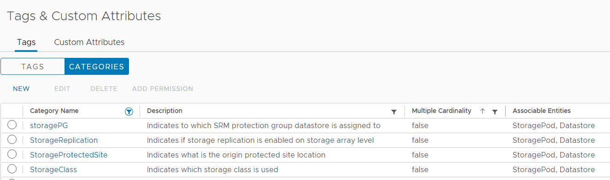
  > 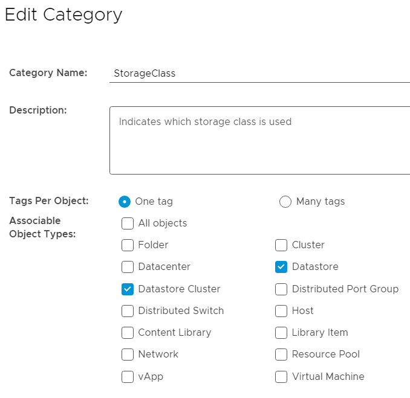

## vRA - day1 overview

There are dedicated [LLD for Automation](lldCloudAutomationServices.md) and [LLD for VM deployment](lldVmDeployment.md) documents with detailed information, nevertheless lets have a closer look on some important relations used to deal with DR topic.

In general, to create a new VM a Day1 SSR `Deploy Virtual Machine` catalog item is requested via vRA Service Broker. The request collects all necessary inputs which are next combined with parameters stored/automated in vRA blueprint. Service broker form and the blueprint are being updated with [DR integration procedure](../workInstructions/wiIntegrateActivePassiveDr.md). This is however one time job, hence whenever new configuration values are introduced later i.e. networks, SRM protection groups, storage classes, storage profiles, image profiles, OS flavour etc, these have to be reflected in vRA.

Lets see the relations between vRA Service Broker form values, vRA Cloud Assembly blueprints, vRA Cloud Assembly Profiles and underlying VCS vmware resources for the **chosen components**. Please note, print screens are illustrative only, used to make day1 component logic easier to mindmap.

1. Network Profiles

    Day1 SSR - `Deploy virtual machine` catalog item has four default `network profiles` available (unless blueprint were adopted differently during DR integration procedure).

    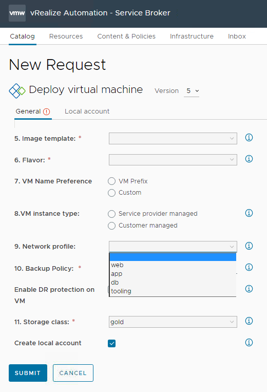

    These networks profiles are statically defined in Service Broker custom form and refer to *Field ID* named `net_tag`

    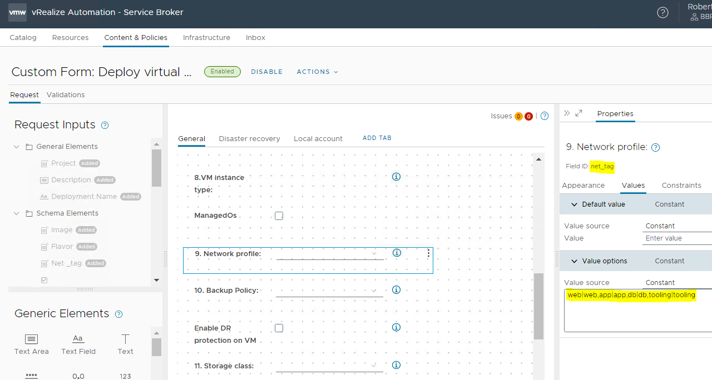

    `net_tag` field ID is defined in blueprint *input* section and must match with Service Broker custom form values (in our case: *web, app, db, tooling*).

    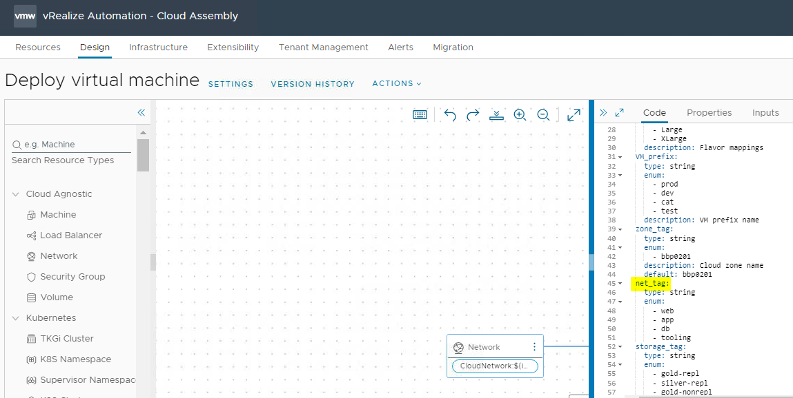

    Blueprint determines what network is going to be assigned to new virtual machine based on capability tag named `CloudNetwork`.

    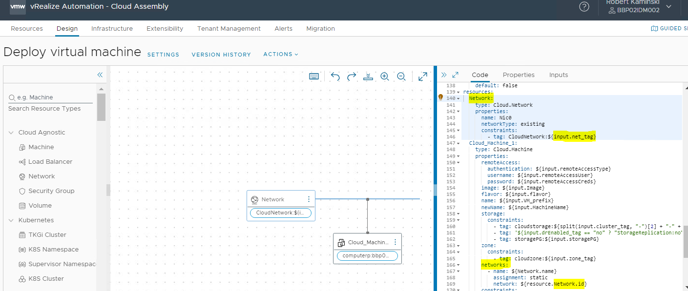

    `net_tag` value is assigned to capability tag named `CloudNetwork` which determines exact vRA network profile. The profile contains a chosen network subnet which are automatically discovered on VCS infra. It is strongly recommended to map NSX segments only.

    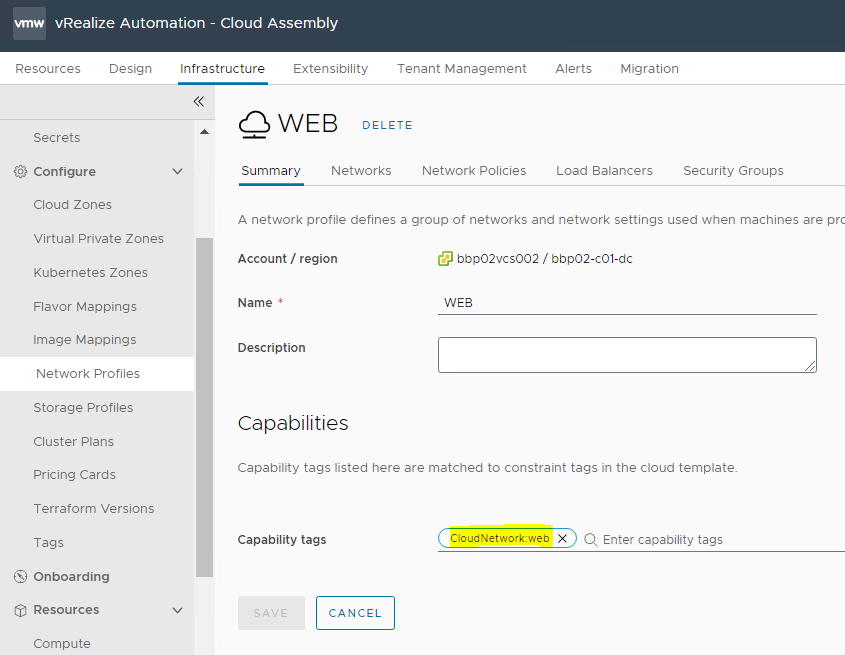

    Last relation to validate is a network mapping on SRM: `Site Pair -> Configure -> Network Mappings`.

    >To sum up, network profile inputs on day1 SSR form must match `net_tag` values in blueprint, which via capability tag named `CloudNetwork` maps vRA network profile and underneath attached to it discovered networks and defined IP ranges.

2. Storage Class

    Atos by default distinguishes the following storage classes: *bronze, silver, gold, platinum, diamond*. It reflects to amount of IOPS available for Virtual Machine disk. There is dedicated [LLD for Storage Classes with IOPS limits](lldStorageClassesIOPSLimits.md). Briefly, depending on principal storage type, for VSAN storage classes are set via storage policies, for VMFS the effective IOPS limits are to be set on the array level.

    It is up to Customer requirements, what storage classes will be visible on the Day1 SSR form.

    Storage classes definitions are statically defined in Service Broker custom form and refer to *Field ID* named `storage_tag`.

    For VSAN principal storage the `storage_tag` will be constant values like: *bronze, silver, gold, platinum, diamond*.

    For VMFS principal storage, the logic for `storage_tag` value is more sophisticated. In the below example you may observe that there will be *Silver* and *Gold* storages replicated, plus one *Gold* non replicated class. The `repl` and `non-repl` suffixes are strict to allow vRO action named `filterStorageClasses` properly filter, match datastore.

    | VSAN example                                                                   | VMFS example                                                               |
    |--------------------------------------------------------------------------------|----------------------------------------------------------------------------|
    | 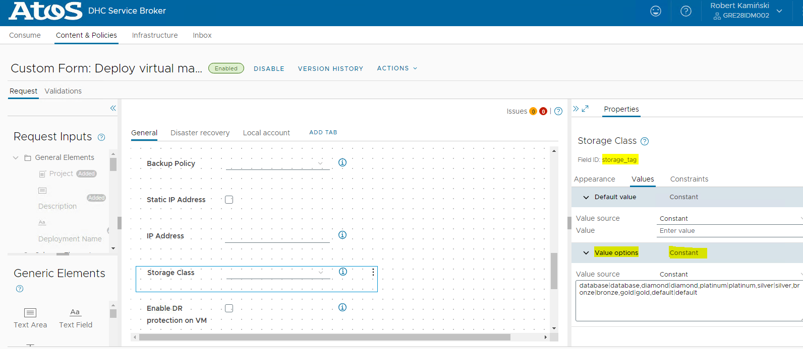 | 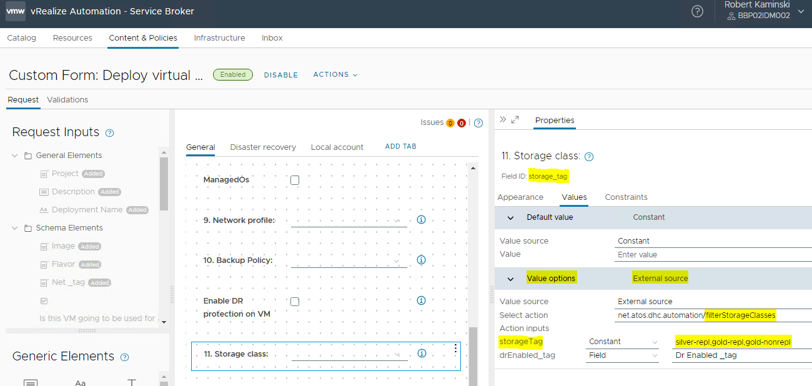 |

    `Storage tag` values on service broker form must reflect `storage_tag` values from `Deploy virtual machine` blueprint.

    | VSAN example                                                                   | VMFS example                                                               |
    |--------------------------------------------------------------------------------|----------------------------------------------------------------------------|
    | 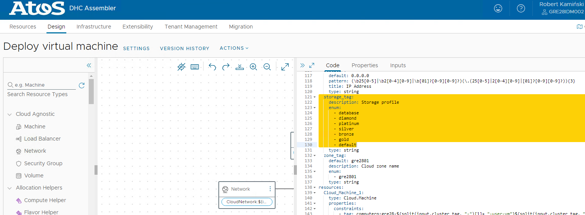 | 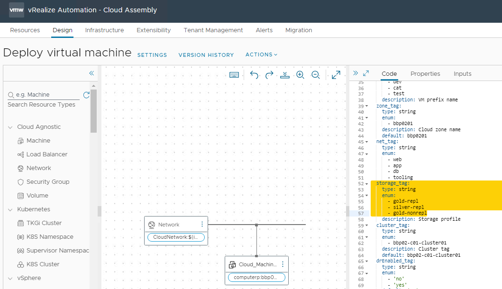 |

    >Note: Storage tag suffix `repl` and `non-repl` are used for VMFS principal storage only.

    Blueprint determines what capability tags will be assigned to virtual machine in order to chose proper vRA storage profile. For VSAN it is a single `cloudstorage` compatibility tag. For VMFS there are `cloudstorage` and `StorageReplication`. On our example there is third capability tag `storagePG` which is an example of possible customization prepared for Aviva Customer.

    | VSAN example                                                                   | VMFS example                                                               |
    |--------------------------------------------------------------------------------|----------------------------------------------------------------------------|
    | 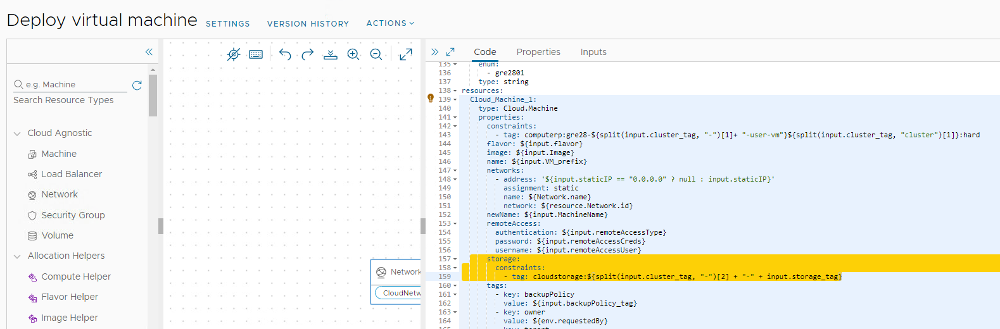 | 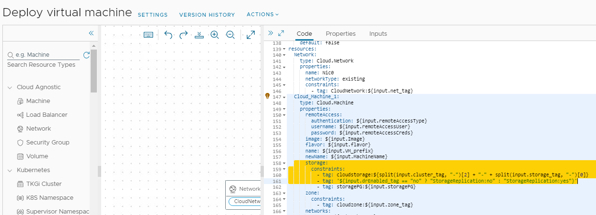 |
    | 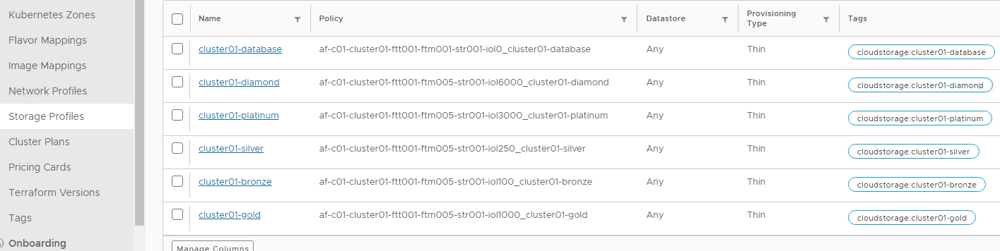 | 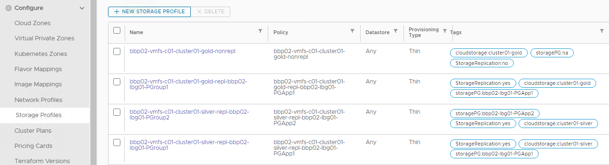 |

    Last part, vRA Storage Policies are mapped to vSphere Storage Policies to determine proper storage class location.

    >To sum up, storage class input on day1 SSR form must match `storage_tag` values in blueprint, which via vRA capability tags named `cloudstorage` and `StorageReplication` (depending on principal storage type) maps vRA storage profile and underneath attached to it discovered datastore/datastore cluster.

3. SRM Protection Group

    Protection groups allow to group VMs that will be recovered together.

    The logic of handling DR protected virtual machine differs depending on VSAN vs VMFS as a principal storage.

    **Lets focus on VSAN first.**

    DR integration procedure for VSAN enables `Enable DR protection on VM` checkbox. The checkbox when being checked activates additional tab named `Disaster recovery` for Day1 SSR - `Deploy virtual machine`. The DR tab queries for inputs like: *protection group name*, *recovery point objectives* value in minutes and finally *SRM priority group* value (1 - highest 5 - lowest). RPO value is set per virtual machine as vmdks are replicated via vSphere Replication.

    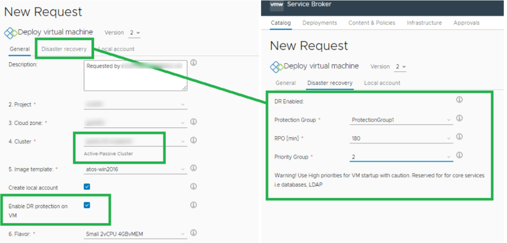

    DR inputs are passed to [vRO workflow](#vro-workflows) named `Day1ProtectVirtualMachine` where DR enablement for provisioned VM takes place. The values provided in the vRA Service Broker form must match the values in blueprint.

    **Let's switch to VFMS part now.**

    DR integration procedure for VSAN enables `Enable DR protection on VM` checkbox, however in contrast to VSAN, the tab `Disaster recovery` is NOT activated. RPO with VMFS principal storage is immutable. Replication sync time is set on the array level. SRM priority group is set by default with 3 value and is not changeable in Day1 SSR. Priority can be changed manually on the SRM level by Operational team when needed. By default VCS design SRM Protection group is assigned to VM automatically based on the storage location. This is addressed via StorageClass parameter. The logic of storage class is described in previous point 2.

    In case storage class location is not sufficient and the protection group name is required as input parameters there is a customization option. Such a solution was crated for Aviva Customer, implementation details can be read [here](../workInstructions/wiDrCustomizationForAviva.md) as guidance.

## Licensing and Versions

SRM licensing is not covered under vCloud Foundation. These are optional extras which Customers must pay for. It is likely that Customers would need to go for "Enterprise" licensing. It should be noted that vSR and SRM versions should be the same on both primary and recovery sites. Any LCM to version on one site should be reflected on the other.

---

### Versions table

List of certified versions for below components are mentioned inside [VCS version matrix](https://github.com/GLB-CES-PrivateCloud/DHC-Documentation/wiki/LCM-Version-Matrix)

| Name | Release        |
|------|----------------|
| vSR  | See VCS matrix |
| SRM  | See VCS matrix |
| vRO  | N/A            |

>**Note:**
>
> - When VCS is integrated with vRA Cloud, VMware automatically controls upgrade process of vRO inside cloud extensibility proxy (ABX) docker container and prevents to lockdown release version.
> - When VCS is integrated with vRA on-prem, vRO is embedded in vRA and the upgrade is controlled by VMware Life Cycle Management component as part of VCS LCM process.

## API

The Site Recovery Manager Appliance Management API and Site Recovery Manager API provides language‐neutral interfaces to the Site Recovery Manager Appliance Management and Site Recovery Manager Server management framework.
Interfaces are provided for configuring Site Recovery Manager Server or OS-specific settings, managing protection groups and recovery plans. Array-based replication, vSphere Replication, and vVols are supported.

SOAP method is used to access SRM API (SDK). The Site Recovery Manager API is located at the following endpoints:

Site Recovery Manager Appliance Management API

```text
https://<FQDN_Server_or_IP_Address>:5480/configureserver/sdk
```

Site Recovery Manager APIs for Photon Virtual Appliance (VA)

```text
https://<FQDN_Server_or_IP_Address>:443/drserver/vcdr/extapi/sdk
```

## Log Insight forwarding

Log insight can be used to monitor the logs from SRM, however VCS uses vROPs to monitor vSphere Replication and Site Recovery Manager servers.

## Impact on Management Components

### vROPs

VCS uses VROPs to monitor vSphere Replication and Site Recovery Manager servers.

As we will run two separate VCF instances in primary and secondary site, each vCF instances will have its own vROPs instance.

As vROPs is getting information from vCenter about VMs and we will not failover vCenter and SDDC Manager, there’s no need to protect or failover vROPs instance. As the client workload VM will failover to secondary location (using SRM and vSphere Replication), they will be added to inventory of vCenter Server in secondary site.

In the Secondary site (DR location) the vROPs will be deployed in the same way as for the Primary location. During the failover protected VMs will be added to the inventory of vCenter Server in Secondary location.

---

#### vROPs Federation

vROPs federation functionality can't be used for protecting vROPs instances because it is only “single pane of glass” for all the plugged in vROPs instances into the federation. It’s useful for creating global dashboards for management - to have common view on the infrastructure. However it doesn’t provide protection of vROPs appliances in any way.

---

#### Application Virtual Networks

As AVNs are designed for protecting vRealize Suite appliances and SDDC management VMs, we won't take advantage of them (as we don't need to protect vRealize VMs and SDDC Manager). We're running full VCF instances in primary and secondary (DR) location.

---

### vRSLCM

VRSLCM is configured as standalone component in both sites, with no additional configuration required.

---

### CAS

vRA Cloud is responsible for the blueprinting of VMs in VCS. As this is a SaaS solution, proxy connector appliances are situated in the management cluster to ensure communications between the Internet and the on-premises endpoints.

vRA Cloud proxies connect via cloud accounts which are attached to vCenter and NSX instance endpoints. Therefore, each site requires a separate cloud account. This, of course, means the passive site will have its own cloud account connected to the passive vCenter and NSX endpoints. Each site will also have its own proxy for data collection between the SaaS platform and on-premises endpoints.

CAS communication overview

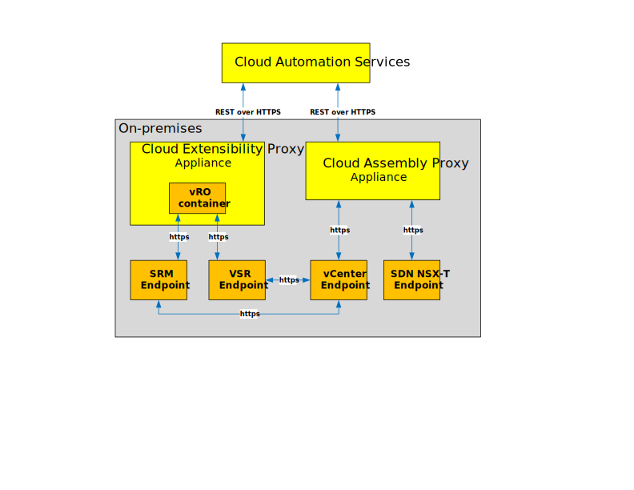

When the DR recovery plan is started, the VMs are moved from protected to recovery site. vRA Cloud will discover the VMs, however they won't be manageable until VRA onboarding plan is executed. Refer to Failover procedure for details.

Once the VMs are on-boarded it should be noted that VMs from failed site are registered in vRA Cloud under different project and unique deployment names ( with DR suffix).

---

### Certificate

Although setting up custom certificates for SRM will be automated if one would like to perform manual change, the below steps need to be followed and they need to be performed for protection and recovery sites:

---

#### Manual steps - Site Recovery Manager

- Generate CSR by logging into SRM VAMI and clicking on `Certificates -> Generate CSR`,
- Sign CSR in your Certificate Authority,
- Convert certificate to proper format PKCS#12,
- Replace certificate on SRM by:
  a. Logging into SRM VAMI,
  b. Click `Certificates`,
  c. Click `Intermediate -> Add` and paste contents of signed certificate,
  d. Click `Root -> Add`, and paste contents of root certificate of your Windows CA entity.

---

#### Manual Steps - vSphere Replication

- Use a supported browser to log in to the vSphere Replication VAMI,
- The URL for the VAMI is <https://vr-appliance-address:5480>,
- Enter the root user name and password for the appliance,
- You configured the root password during the OVF deployment of the vSphere Replication appliance,
- (Optional) Click the `VR` tab and click `Security` to review the current SSL certificate,
- Click `Configuration`,
- (Optional) To enforce verification of a certificate validity, select the `Accept only SSL certificates signed by a trusted Certificate Authority` check box,
- Generate or install a new SSL certificate following full procedure available via link under section 1.5.

Rely on Vmware documents for proper version, i.e. [Change the SSL Certificate of the vSphere Replication Appliance](https://docs.vmware.com/en/vSphere-Replication/8.4/com.vmware.vsphere.replication-admin.doc/GUID-C960E9B0-BFF5-4A56-9CBD-7142DA6FB5C6.html)

---

### IPAM/Infoblox

Within VCS, Infoblox is used as an IPAM solution to assign and manage IP leases to Customer workload VMs. Stand alone VCS uses two independent Infoblox HA pairs on each site. When DR integration is executed, both the Active and Passive sites will have a dedicated IPAM infrastructure. This means even the passive site will have a dedicated IPAM cluster and a dedicated extensibility proxy in order to talk to the vRA Cloud SaaS platform. A mechanism called Grid Master/Grid Master Candidate will be used to offer full synchronization between the IPAM databases on the Active and Passive sites. Therefore, when a VM is failed over to the passive site, it will retain its IP address and be managed fully by the IPAM cluster in this site. If the VM is deleted whilst managed by this site, it will also be removed from the database and in the event that the original site is recovery, the deleted IP will be synchronized.

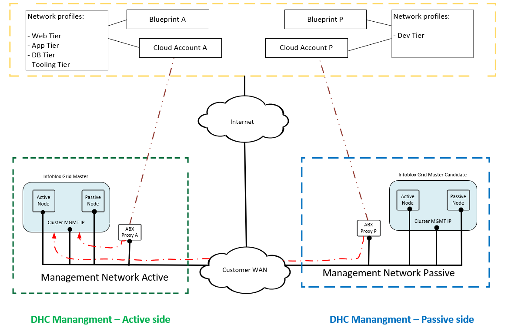

Please refer to these dedicated components for IPAM DR.

Active/Protected site:

- Infoblox Grid Master - one central IPAM and DNS database for active and passive side, all API calls are processed by this cluster,
- ABX Proxy A - dedicated extensibility proxy for Active side,
- Cloud Account A - dedicated cloud account for Active side related to Network profiles and blueprints.

Passive/Recovery site:

- Infoblox Grid Master Candidate - this cluster provides read-only API access - the only role it has is to synchronize all information with Infoblox Grid Master,
- ABX Proxy P - dedicated extensibility proxy for Passive side,
- Cloud Account P - dedicated cloud account for the Passive side related to Network profiles and blueprints.

> NOTE: Both extensibility proxies are using the same Infoblox Grid Master as an endpoint.

---

#### DR procedure for IPAM

IPs for Customer workload VMs are managed in VCS via Infoblox. Stand alone VCS uses two independent Infoblox HA pairs on each site which are next - during A/P DR integration - set in the Grid. Master Grid syncs the data between the sites.

Disaster recovery for IPAM is described in [Infoblox Master Grid failover (IPAM)](../workInstructions/wiFailoverActivePassiveDr.md#infoblox-master-grid-failover-ipam) chapter.

## Active Directory

VCS hosts two domain controllers on the management stack of each vCF deployment. As explained earlier, a full standalone vCF instance will be deployed on the passive site. No AD synchronization is required and DNS and NTP will be configured as per a normal deployment of VCS. This decision introduces a risk of having 2 separate domains to be managed and operated by CO. In future we may consider a trust between the sites, however this in itself brings overhead for operations to ensure the trust is managed. At this stage the simplicity of distinct domains for DR outweighs the small operational overhead of 2 accounts.

During creation of SRM pairing, and subsequent changes to replications, Protection Groups and Recovery Plans, the site recovery GUI will prompt for credentials to the opposite site. For example, if you login to Site Recovery on the Active Site to protect a VM, you will first be prompted for credentials to authenticate to the passive site vCenter. In the event for a full Site failover, access to the passive site recovery UI can still be granted using local vCenter credentials.

>**Important:** To be clear, the above statements mean that, in an Active/Passive DR setup the two Active Directory domains (one on protected and one on the recovery site) are not in any way connected. There is no trust, there is no sync. The roles operate independently of each other. Therefore and post-setup changes on protected site AD MUST be manually replicated to the recovery site if they are relevant to DR operation.

---

### DNS

Protected site must resolve names and IPs of "SRM" related components of the recovery site. It's recommended to establish a Stub-Zone or create Primary DNS zone to satisfy vCenters, SRM and VSR hostA forward and reverse lookup resolution.

## Networking

In this section only customer workload DR failover would be described due to fact that overall SDN design is covered in SDN LLD.
Following section will cover only one scenario just to bring understanding to the overall solution. If there is a need, please take a look into SDN LLD for further scenarios. Following examples are showing networks "Web", "App" and "Db" which might be different for different customers.

Inside each customer workload infrastructure (Workload Domain) there would be two instances created - Active and Passive. Both Active and Passive parts would have their own corresponding components (Edges, Logical Routers, Logical Switches). Active will contain objects which would be actively used on this site. Passive will contain only infrastructure but no workload (no VMs attached). This allows to react in case of disaster without thinking about preparation of the infrastructure for Customer Workload. Second site (DR) even if it might be not be in active use before disaster, it should contain the same construct as primary site with corresponding components (just those constructs which are intend to be DR protected).
Based on example drawing we can define how DR network infrastructure would be created. So that, Primary site is having active part with "Web1", "App1" and "Db1" Logical Switches which are terminated at Logical Router T1, and another Logical Router T1 is terminating "Web2", "App2" and Db2" Logical Switches. Apart of active part, Primary site is containing Passive part (this cannot connect any customer workload) which is terminating "Web3", "App3", "Db3" Logical Switches on one T1 Logical Router and "Web4", "App4", "Db4" Logical Switches on another T1.
DR site though, is having everything in opposite way. So Active part of this site is containing "Web3", "App3" and "Db3" connected to first T1 Logical Router as well as "Web4", "App4" and "Db4" on second T1 Logical Router, while Passive contain "Web1", "App1", "Db1" as well as "Web2", "App2", "Db2".
This way of configuration in standard Active - Passive environments where Passive is not containing any Workload is making build little bit more complex, but will allow to upgrade to future scenarios without additional configuration on networking side.

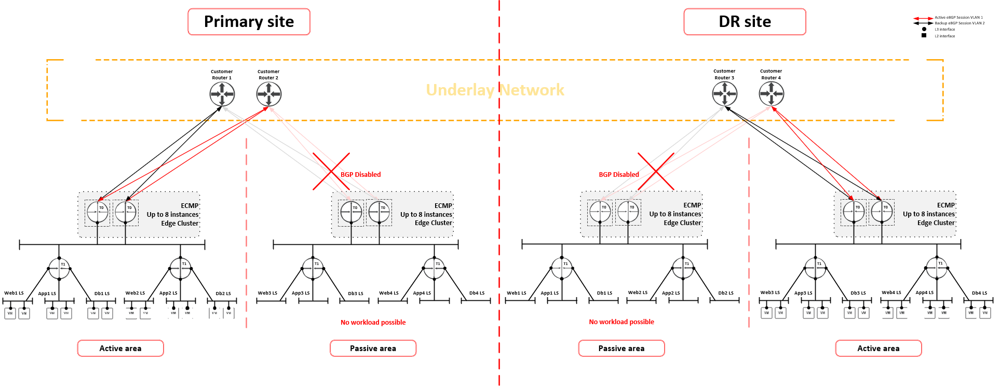

This design assumes that if we are considering one subnet (i.e. App2) it can be only available at one site at the same time in active state. Which means that there is no scenario when two VMs would be hosted separately by Primary and DR environment while using same network.

In addition to what was described above, each Passive part of the environment is having BGP protocol disabled to block announcements of the networks (via dynamic routing protocol - BGP) to the customer infrastructure and avoid network loops. This allow to configure Passive site with same IP addresses as active part in second site without possibility to redirect traffic unintentionally. Uplink interfaces on T0 Logical Routers should have unique IP address scheme across all areas. This design decision has been made based on simplicity of the solution.
In case of failure of the primary site, manual actions are needed. Those manual actions requires re-enabling Logical Routers BGP on passive part of the remaining site. This cause BGP form adjacencies with passive components and announce BGP prefixes.

Above explanation is assuming that environment is based on only two instances created, but there are circumstances where there might be more than two on single site. It is possible to create multiple parts even those which would not be reflected to second site (won't be DR protected).

Refer to [related document section](#related-documents) for further and more detailed information about SDN and DR designs.

# Integration guidelines and limitation

A quick summary of guidelines and limitation for A/P DR integration that might not be obvious on the first read, but worth to be emphasize:

- A/P does not use stretched networks between sites. This solution brings a lot of limitation, no GO for long distance and actually is reserved for VCS active-active solution, not active-passive.
- SRM network mappings are done to the same network segments between sites, otherwise after failover servers should have IPs adjustments from the new segments or would need to use dynamic IPs instead of static. Obviously the DNS renewal would need to work dynamically as well (including VIPs), quite time consuming and potentially error prone solution.
- Since by default SRM network mapping is configured to the same network segment on the passive site, the routing to passive site must be disabled. VCS manages this by disabling BGP on NSX-T T0 router.
- Disabling BGP on T0 router disables routing to all networks and switches linked to that T0 over all T1 routers. Active area on the other VCS site must have its own T0 and T1 routers with unique networks. Active networks on siteA have to be configured respectively on siteB through a dedicated T0 router with BGP disabled, and vice versa. Active networks on siteB must be respectively configured on siteA but through a dedicated T0 router with BGP disabled. This way we manage routing to both active areas on both sites.
- There is a solution to filter exact networks on the BGP layer, however VCS Engineering finds that way very error prone, fragile to human mistakes. Additionally BGP configuration is often out of responsibility for VCS hence we recommend to be secure and disabling routing via BGP on the passive area.
- SRM failover is triggered manually via Recovery Plans. Recovery plan contains a single protection group or multiple protection groups.
You may run a single recovery plan at once.
- Taking into account all the customer network routing dependencies, the simplest is to plan the failover of all protected workload at once. This is actually the main purpose of A/P disaster recovery to move all protected workload from the failed/protected site to passive/recovery.
- Business might tend to enforce the partial failover of the workload for frequent tests of the application functionality after failover. This is however possible, but really complicated and requires definitely advance planning, detailed DR design and configuration in networks, SRM network mappings, protection groups/recovery plans and detailed analysis of the application dependencies.
- The final disaster recovery configuration is very much Customer oriented. It is strongly recommended to discuss the requirements with business. Solution architects shall lead this conversation. VCS Engineering is testing quite generic configuration, not possible to fulfil all options.
- VCS has no mechanism implemented to sync the FW rules between protected and recovery site network segments. The rules validation must be handled via production plan frequent actions.
- For Bidirectional A/P DR, on vRA Cloud, there are two *Deploy virtual machine* SSRs available, one per project. Project reflects to siteA or siteB. VM blueprints contains site configuration values corresponding to each site, like: OS flavours, networks segments, protection groups names and many others. After the DR failover, 2nd day activities on the **onboarded VMs** are possible, however the ability to provision fresh VMs that uses the networks from the failovered site is not sustained. It requires manual actions on the Service Broker form and blueprints.
- For Bidirectional A/P DR, on vRA on-prem, each site is independent. After the DR failover, 2nd day activities on the **onboarded VMs** are possible, however the ability to provision fresh VMs that uses the networks from the failovered site is not sustained. It requires manual actions on the Service Broker form and blueprints.
- VM disk IOPS limits are addressed via VSAN storage policies.
  
Array-based replication related guidances:

- VMware vSphere Replication appliance is not used. Data replication is handled via array mechanism, hence setting a Recovery Point Object RPO per virtual machine used on VSAN is not an option any more. Site Recovery Manager requires Storage Replication Adapters (SRA) installed. Refer to VMware document on how to [Add Storage Replication Adapters to the Site Recovery Manager Appliance](https://docs.vmware.com/en/Site-Recovery-Manager/8.5/com.vmware.srm.admin.doc/GUID-A16E7F4D-8C63-4E4A-8300-3244F41C53DD.html). Storage team is obliged to provide users with sufficient privileges.
- For some vendors like NetApp, SRA requires additional ONTAP appliance. This can be installed with `<locationCode>ont001` name and an IP taken from vSphere Replication appliance (`<mgmt_cidr>.48`), which is not used for array based replication.
- VCS uses Datastore Cluster to group datastores of the same class. Storage DRS is enabled to fully automate resource usage. Datastores are tagged. Storage policies use tag based placement rules checking the storage class type, if the storage replication is enabled to protect VM against disaster recovery and finally what the origin protection site is.
- SiteA protected datastores are replicated via array-based mechanism and are not available for `Read/Write` on the recovery SiteB. The same applies for protected datastores on SiteB and recovery SiteA in the bi-directional DR configuration. After the SRM failover, datastores on the recovery site are mounted with prefix *`snap-<generated_number>-origin_datastore_name`*. Datastores tags might be gone and datastore cluster functionality is no longer preserved.
- IOPS limits are not set on the storage policy level but on the array level.
- One LUN is one Datastore on the vSphere. Number of LUNs and their size depends on the Application(s) requirements that is reflected logically by SRM Protection Group and mapped datastores.
- It is strongly recommended to group LUNs of the same storage class in consistency groups. Consistency Group (CG) prohibits spreading datastores/LUNs to multiple SRM Protection Groups and ensures that the read/write control policies of the multiple LUNs on a storage system are consistent.
- **(Aviva customization)** - SRM Protection Group may contain multiple CGs. For example *ProtectionGroup1* may include *ConsistencyGroup-Gold* and *ConsistencyGroup-Silver* to allow using disks of different storage class via VMs placed in that PG. Treat this functionality with caution! For example in a large size databases, the user data and logs are usually stored on different disks. If those disks are spread across datastores of different storage classes, which effectively will be stored on LUNs from different consistency groups the database, then ths data vs logs might be inconsistent after failover.
- Any new datastore added to the Datastore Cluster must be properly tagged.
- Site Recovery Manager 8.5.x is the last general version to support storage policy protection groups (SPPG). Before upgrading to Site Recovery Manger 8.7, all storage policy protection groups must be migrated to regular array-based replication protection groups.
- VM assignment to SRM protection group is automatic based on the datastore placements.
- vSphere Storage Policy uses *Tag Based placement* . It relies on 3 rules, the following tag categories are involved:
  - `StorageClass` - type of the storage class i.e gold/diamond
  - `StorageReplication` - yes/no is datastore replication enabled
  - `StorageProtectedSite` - origin *`<locationCode>`* of the protected workload to prevent adding and mixing failovered workloads from protected siteA to existing workloads on recovery siteB (tag extremely valid for SRM v8.5 and when storage policy protection group are used).
- **Note valid for SRM v8.5 and when storage policy protection group is used.** Create single mappings `one Storage Policy` <> `one SRM Protection Group` <> `one Datastore Cluster` per protected `siteA`. Create dedicated storage policies for the recovery siteB to prevent automatic reassignment of the failovered VM to other protection group. In other words you must secure the failovered VMs will not change protection groups assignment by wrong mappings in the `SRM Storage Policy Mappings`.

# Failover

As mentioned, the management stack will not "failover". There are distinct standalone instances of VCS which are integrated to support DR. As such in the event of the primary site enter a DR scenario a fully functional management stack is already available.

Two types of DR failover scenarios are available for protected Customer workload: planned and forced.

Refer to [Active/passive Disaster Recovery Failover procedure](../workInstructions/wiFailoverActivePassiveDr.md) for detailed information.
