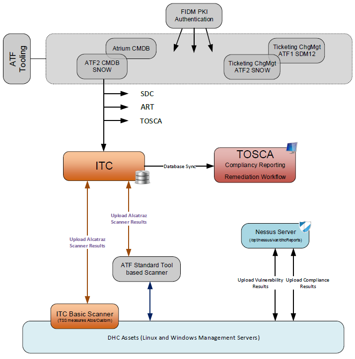
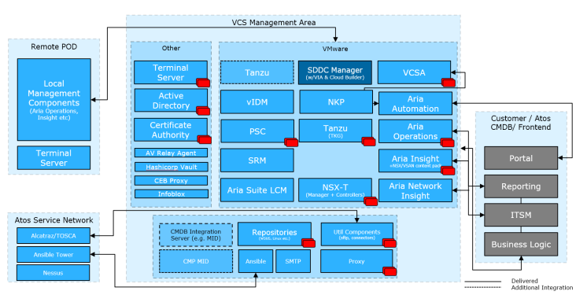
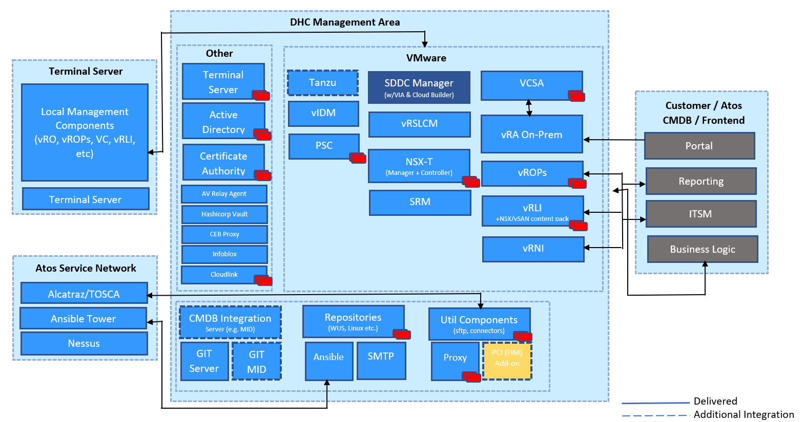

# Hardening LLD

### List of changes

| Version | Date       | Description                                                                                     | Author(s)             |
|---------|------------|-------------------------------------------------------------------------------------------------|-----------------------|
| 0.1     | 2020-01-10 | Initial draft creation                                                                          | Marcin Kujawski       |
| 0.2     | 2020-01-14 | Adding Alcatraz and Nessus chapters                                                             | Marcin Kujawski       |
| 0.3     | 2020-01-28 | Compiler access management added                                                                | Przemyslaw Bojczuk    |
| 0.4     | 2020-02-XX | Added hardening decisions                                                                       | Robert Kaminski       |
| 0.5     | 2020-02-07 | review                                                                                          | Robert Kaminski       |
| 0.6     | 2020-04-21 | Added section about Edge Transport Nodes plus updated section about NSX                         | Radoslaw Dabrowski    |
| 0.7     | 2020-04-22 | Removed code from dpc-hardening.yml playbook. Added reference to Work Instruction.              | Radoslaw Dabrowski    |
| 0.8     | 2021-06-24 | DHC-2238 Local Region network amendment                                                         | Lukasz Tomaszewski    |
| 0.9     | 2021-10-27 | Adding vROps Alcatraz chapter                                                                   | Marcin Kujawski       |
| 1.0     | 2022-07-15 | CESDHC-447 fixed references to dpc-harden and dpc-builder instead of dhc-harded and dhc-builder |                       |
| 1.1     | 2022-10-12 | Added diagram for On-Prem vRA in section 3.1 Management Topology                                | Kathirvel Krishnasamy |
| 1.2     | 2026-02-24 | VCS-15538 Added Security Requirements Coverage                                                  | Przemyslaw Pakula     |

# 1 Introduction

## 1.1 Purpose

The purpose of this document is to provide the description of hardening decision that have to be performed on VCS before turn over to production.
Document contains information about Compliance and Vulnerability in accordance with Atos standards.

## 1.2 Audience

This document is intended for Atos Cloud Services Engineers and Architects responsible for VMware Cloud Services (VCS) solution implementation and maintenance.

## 1.3 Scope

Hardening steps before Turn over to Production

- Patching of the management servers
- Admin account creation in the management domain
- Active Directory Group Policy adjustments
- Enable Kerberos WinRM transport mode
- NSX Distributed Firewall rules implementation
- SDDC Manager reset VCF components credentials
- Management Servers credentials
- ESXi hosts domain join
- Alcatraz Compliance management
- Nessus Vulnerability scanning
- Out of band management - remote controller card credentials
- hardening of VCS Password Manager
- Ansible vars and inventory cleanup
- Prerequisite Virtual Machine log files transfer

This LLD does not cover:

- Compliance and vulnerability scanning for physical infrastructure
- Compliance and vulnerability scanning for virtual part of VCS platform

__DISCLAIMER: The hardening LLD does not include all security settings integrated onto VCS infrastructure. It cannot be treated as a full list of security settings implemented on VCS. It addresses only the actions not implemented via automation pipe line that are necessary to prepare VCS before turning to production phase.__

## 1.4 Related Documents

This document is a subset of Atos Technology Lifecycle Management (ATLM) artefacts. All documents are stored in the VCS documentation repository.

### Security Requirements Coverage

| Instruction Name | Short Description |
| :----------: | ------- |
| [lldADSecurityEnhancement2024.md](lldADSecurityEnhancement2024.md) | Describes AD vulnerabilities in VCS and the remediation actions for key security findings. |
| [lldDhcRoleBasedAccessControl.md](lldDhcRoleBasedAccessControl.md) | Defines RBAC roles, mappings, and access review principles for VCS components. |
| [lldBreakTheGlass.md](lldBreakTheGlass.md) | Defines emergency access workflows for outage scenarios and recovery procedures. |
| [lldHardening.md](lldHardening.md) | Defines required hardening activities before production handover, including identity, firewall, and compliance controls. |
| [lldHashicorpVault.md](lldHashicorpVault.md) | Describes secure secret-management architecture, authentication methods, and audit logging. |
| [lldVulnerabilityManagement.md](lldVulnerabilityManagement.md) | Defines Nessus-based vulnerability scanning design, scope, and operating model. |
| [lldSecurityPosture.md](lldSecurityPosture.md) | Provides a consolidated overview of VCS security controls across encryption, scanning, RBAC, logging, and patching. |
| [SecurityMeasureExceptions.md](SecurityMeasureExceptions.md) | Lists approved Nessus/Alcatraz exceptions and false positives with rationale and mitigation context. |
| [SiemensCERTExceptions.md](SiemensCERTExceptions.md) | Lists Siemens CERT exceptions/false positives with applicability and risk/mitigation notes. |
| [lldSOXDB.md](lldSOXDB.md) | Describes SOXDB integration security controls, including credential handling, encryption, and RBAC. |
| [lldRemoteConsoleAccess.md](lldRemoteConsoleAccess.md) | Defines secure remote console access controls, including RBAC and certificate handling. |

## 1.6 Requirement Levels

This document is following the principles below to categories all requirements and design decisions.

|    Term    | Meaning                                                                                                                                                                                                                                                         |
|:----------:|-----------------------------------------------------------------------------------------------------------------------------------------------------------------------------------------------------------------------------------------------------------------|
|    MUST    | The definition is an absolute requirement of the specification.                                                                                                                                                                                                 |
|  MUST NOT  | The definition is an absolute prohibition of the specification                                                                                                                                                                                                  |
|   SHOULD   | There may exist valid reasons in particular circumstances to ignore a particular item, but the full implications must be understood and carefully weighed before choosing a different course                                                                    |
| SHOULD NOT | There may exist valid reasons in particular circumstances when the particular behaviour is acceptable or even useful, but the full implications should be understood and the case carefully weighed before implementing any behaviour described with this label |
|    MAY     | Any design decisions that are not classified as MUST and SHOULD or covering optional feature that is not general available for VCS product                                                                                                                      |

# 2 Architecture Overview

The diagram below highlights VCS areas covered in this LLD. This document will cover the Vulnerability and Compliance integration and design for VCS.

Figure 1. VCS Architecture - Compliance and Vulnerability Overview

## 2.1 Business and Solution Requirements

The table below provides known requirements mandatory to be incorporated into design decisions of VCS Secret Management described in this LLD.

|  ID  | Requirement description                                                                                               | Requirement Source | Requirement Level |
|:----:|-----------------------------------------------------------------------------------------------------------------------|:------------------:|:-----------------:|
| R001 | Integration of VCS management machines into Alcatraz Compliance management                                            |     DHC-18638      |       MUST        |
| R002 | Compliance scan on management machines on weekly basis                                                                |     DHC-18638      |       MUST        |
| R003 | Automated scan and upload mechanism for compliance reports                                                            |     DHC-18638      |       MUST        |
| R004 | Allow traffic on port 443 from Export server to ITC production server (ASN)                                           |     DHC-18638      |       MUST        |
| R005 | Integration of VCS management machines into Nessus Vulnerability scanning                                             |     DHC-18638      |       MUST        |
| R006 | All built-in and service accounts of the management servers and appliances are stored in VCS secret password manager. |                    |       MUST        |
| R007 | Every password used for VCS is unique and meets Atos strong password policy requirements                              |                    |       MUST        |
| R008 | VCS management windows and linux servers are up to date with patches before TOP                                       |                    |       MUST        |
| R009 | Microsegmentation, the firewall rules on NSX are implemented before TOP                                               |                    |       MUST        |

Table 2. Initial Requirements

# 3 Detailed Logical Design

__DISCLAIMER: The hardening LLD does not include all the security settings integrated on to VCS infrastructure. It cannot be treated as a full list of security settings implemented on VCS. It addresses only the actions not implemented via automation pipe line that are necessary to prepare VCS before turning to production phase.__

## 3.1 Management Topology

Figure 2. Management Topology

Figure 2.1 Management Topology for vRA On-prem

## 3.2 Hardening activities

VCS deploy phase pipe line playbook *dhc-builder.yml* includes two stages. First one is creating non vCF core infrastructure components, second automates the workload domain creation and vRA Cloud integration.

After deploy phase, there is bunch of activities preparing VCS to turn over to production (TOP).

The *dhc-harden.yml* playbook automates hardening tasks. Detailed information about the code is placed in wiHardening.md documentation. The tasks are described below. Please refer to the hardening work instruction in order to execute the hardening properly.

### 3.2.1 Patching of the management servers

Refer to patching LLD and patching work instruction to understand the automation and reporting capabilities delivered by VCS.

| Decision ID | Design Decision                                              | Design Justification                                  | Design Implication                                                                                                                                                                                                                                                                                                                                                           |
|:-----------:|--------------------------------------------------------------|-------------------------------------------------------|------------------------------------------------------------------------------------------------------------------------------------------------------------------------------------------------------------------------------------------------------------------------------------------------------------------------------------------------------------------------------|
|   DD-030    | Linux and Windows management VMs must be patched before TOP. | Servers shall be patched before running Nessus scans. | VCS repositories require a couple of hours to download patches from the vendor automatically. __Windows repositories are approved under condition *enableWsusAutoPatchApproval* parameter is set to *True*__ (default) by Integration Architect while the prerequisite VM is created. __If set to *False*, deployment team must accept patches manually on the WSUS server__ |

### 3.2.2 Admin account creation in the management domain

| Decision ID | Design Decision                                                                                                                                          | Design Justification                                                                                       | Design Implication                                                                                                                                                                                                                                       |
|:-----------:|----------------------------------------------------------------------------------------------------------------------------------------------------------|------------------------------------------------------------------------------------------------------------|----------------------------------------------------------------------------------------------------------------------------------------------------------------------------------------------------------------------------------------------------------|
|   DD-031    | Deployment team creates for Cloud Operation at leat one admin personal account                                                                           | Hardening activities reset all built-in and services account password and stores them in password manager. | Personal user/password must be passed to Cloud Operational. __Having no administrative account in VCS management domain may result loosing ability to authenticate against any VCS component which is effectively equal to VCS is LOCKED/notACCESSIBLE__ |
|   DD-032    | Admin account creation playbook must store the user account in a proper Organization Unit with proper Group Membership in line with Active Directory LLD | VCS Active Directory design principles and RBAC must be met                                                | none                                                                                                                                                                                                                                                     |

### 3.2.3 Active Directory Group Policy

Refer to Active Directory LLD for group policy settings.

| Decision ID | Design Decision                                                                            | Design Justification                                                                                                                                                                                        | Design Implication |
|:-----------:|--------------------------------------------------------------------------------------------|-------------------------------------------------------------------------------------------------------------------------------------------------------------------------------------------------------------|--------------------|
|   DD-033    | Force on all windows management servers renaming built-in administrator name to "c-kathos" | Atos security police states the built-in administrator account must be renamed. To simplify deployment phase VCS uses unchanged administrator name. Thus the rename must be done after the VCS build phase. | none               |

### 3.2.4 WinRM transport mode

| Decision ID | Design Decision                                                | Design Justification                                                                                                                        | Design Implication |
|:-----------:|----------------------------------------------------------------|---------------------------------------------------------------------------------------------------------------------------------------------|--------------------|
|   DD-034    | Install and configure kerberos transport on VCS Ansible server | Switching WinRM transport from Basic to Kerberos is a must to allow Ansible domain/active directory authentication to windows managed hosts | none               |

### 3.2.5 NSX

#### 3.2.5.1 Distributed Firewall rules implementation

Refer to Software Defined Networks LLD, specifically to the microsegmentation paragraph to understand Firewall rules design.
Refer to microsegmentation work instruction to prepare accurate DFW for customer workload domain. Consulting with the Integration Architect is strongly recommended.

| Decision ID | Design Decision                                                                                                                                                                         | Design Justification                                                                                  | Design Implication                                                       |
|:-----------:|-----------------------------------------------------------------------------------------------------------------------------------------------------------------------------------------|-------------------------------------------------------------------------------------------------------|--------------------------------------------------------------------------|
|   DD-028    | Secure management domain with NSX Distributed Firewall. Deny all traffic except those defined and approved in the network design. Mandatory before TOP                                  | VCS standard                                                                                          | Any traffic not defined by DFW permit rule will be terminated            |
|   DD-029    | Secure management components on compute workload domain with NSX-T Distributed Firewall. Deny all traffic except those defined and approved in the network design. Mandatory before TOP | VCS Standard.                                                                                         | Any traffic not defined by DFW permit rule will be terminated            |
|   DD-039    | Secure Customer workload on compute workload domain with NSX-T Distributed Firewall. All ruleset created in front of migration/creation of Customer workload.                           | By default VCS workload domain prohibits all traffic, therefore permit rules must be created up front | Customer ruleset gathered before migration/creation of Customer workload |

#### 3.2.5.2 NSX-T Edge Transport Node hardening

Due to fact that Edge Transport Nodes are not managed as NSX-T manager and controllers by SDDC Manager, there is a need to change passwords on those machines.

| Decision ID | Design Decision                                                                                                             | Design Justification   | Design Implication                 |
|:-----------:|-----------------------------------------------------------------------------------------------------------------------------|------------------------|------------------------------------|
|   DD-040    | Edge Transport Nodes admin account should have the password changed due to fact that nodes are not managed by SDDC Manager. | Technology limitation. | Above script should be executed to |

### 3.2.6 SDDC Manager

By design VMware Cloud Foundation components passwords are managed by SDDC Manager.

| Decision ID | Design Decision                                                                                                                                                                                                                                                                        | Design Justification         | Design Implication                                                                                                |
|:-----------:|----------------------------------------------------------------------------------------------------------------------------------------------------------------------------------------------------------------------------------------------------------------------------------------|------------------------------|-------------------------------------------------------------------------------------------------------------------|
|   DD-035    | Reset vCF components passwords managed by SDDC Manager. Components are:   - VROPS   - ESXi   - vCenter   - PSC   - NSX_Manager   - NSXT_Manager   - NSX_Controller   - VRLI   - VRSLCM   - BACKUP   Store them in the VCS password manager | R006, R007                   | By VMware design  __LCM will fail in case vCF components passwords changed NOT trough SDDC manager__          |
|   DD-036    | Reset built-in account on the SDDC Manager and store them in the VCS password manager   - admin   - vcf   - root   - ansible ( refer to dhc-resetSddcManagerUsersPasswords ansible role README file for description)                                                   |                              | none                                                                                                              |
|   DD-037    | SDDC manager components password reset playbooks shall be available for frequent usage in the production phase                                                                                                                                                                         | Atos default password policy | In case vCF components password will be reset on the component and not trough the SDDC Manager the LCM will fail. |

### 3.2.7 Management Servers

| Decision ID | Design Decision                                                                                                         | Design Justification                                                                                                                | Design Implication |
|:-----------:|-------------------------------------------------------------------------------------------------------------------------|-------------------------------------------------------------------------------------------------------------------------------------|--------------------|
|   DD-038    | Reset built in Active Directory administrator account before TOP, store it in the VCS password manager                  |                                                                                                                                     | none               |
|   DD-020    | Reset built in administrator account on all windows management servers before TOP, store it in the VCS password manager | Administrator account was used for automation over the deploy phase. Automation in the manage phase handled by AD Service accounts. | none               |
|   DD-021    | Reset automation user password (named "next") on all linux management servers, store it in the VCS password manager     | Next user account was used for automation over the deploy phase. Automation in the manage phase handled by AD Service accounts      | none               |

### 3.2.8 ESXi hosts domain join

Refer to RBAC and Active Directory design documents for detailed definition of Role Based Access Control.

| Decision ID | Design Decision                                                                                                            | Design Justification                                       | Design Implication |
|:-----------:|----------------------------------------------------------------------------------------------------------------------------|------------------------------------------------------------|--------------------|
|   DD-022    | All the management and compute ESXi host must be added to management Active Directory in line with RBAC design before TOP. | Access to ESXi host must be given trough personal accounts | none               |

### 3.2.9 Alcatraz Compliance management

| Decision ID | Design Decision                                                                                   | Design Justification                                                                                                              | Design Implication                                                                                             |
|:-----------:|---------------------------------------------------------------------------------------------------|-----------------------------------------------------------------------------------------------------------------------------------|----------------------------------------------------------------------------------------------------------------|
|   DD-001    | Alcatraz compliance scanner will be installed only on Windows and Linux Management servers        | Customer workload is not in scope of VCS, only Management servers are                                                             | None                                                                                                           |
|   DD-002    | Alcatraz is not responsible for compliance scan of customer workload machines                     | Alcatraz compliance scan will be used to manage only VCS management Servers                                                       | None                                                                                                           |
|   DD-003    | Central report server will be used to collect compliance scan reports from all management servers | VCS standard                                                                                                                      | Nessus server needs to be available during report creation process                                             |
|   DD-004    | Compliance scanner won’t be installed in virtual appliances                                       | Compliance scanner tool is designed for implementation in Windows and Linux machines only                                         | Virtual appliances will be out of scope for compliance scan                                                    |
|   DD-005    | Compliance scan will be done on weekly basis                                                      | It is recommended by Alcatraz team to run compliance scan once in a week                                                          | None                                                                                                           |
|   DD-006    | Compliance reports are uploaded to ITC Prod (ASN) on weekly basis                                 | It is mandatory to upload compliance reports to ITC at least once in 30 days                                                      | By tosca design,  Customer compliance reports will disappear from TOSCA portal when no date sent over 30 days. |
|   DD-007    | Compliance of VMware components will be measured by vROps                                         | vROps Mapper tool is designed to be used to gather data about VMware components and transform output to be read by TOSCA properly | None                                                                                                           |

### 3.2.10 Nessus Vulnerability scanning

| Decision ID | Design Decision                                                                                                           | Design Justification                                                        | Design Implication                                                 |
|:-----------:|---------------------------------------------------------------------------------------------------------------------------|-----------------------------------------------------------------------------|--------------------------------------------------------------------|
|   DD-007    | Nessus vulnerability scan runs against all VCS servers that resides on Management, Cross Region anf Local Region networks | Customer workload is not in scope, only VCS Management servers are included | None                                                               |
|   DD-008    | Nessus is not responsible for vulnerability scan of customer workload machines                                            | Nessus will be used to scan only VCS management Servers                     | None                                                               |
|   DD-009    | Nessus scan reports are stored on Central report server (nes001)                                                          | VCS standard                                                                | Nessus server needs to be available during report creation process |
|   DD-010    | Vulnerability scan will run on demand during hardening                                                                    | VCS Standard                                                                | None                                                               |
|   DD-023    | Nessus scans are executed during hardening stage before TOP for the reference                                             | VCS must be checked against vulnerability before turn to production         | none                                                               |

### 3.2.11 Out of band management - remote controller card

| Decision ID | Design Decision                                                                                                                                      | Design Justification                                                                                                                         | Design Implication |
|:-----------:|------------------------------------------------------------------------------------------------------------------------------------------------------|----------------------------------------------------------------------------------------------------------------------------------------------|--------------------|
|   DD-026    | Reset user of all out-of-band management platforms, the Dell Remote Access Controller for Dell hardware and Server Hardware Console for Bull servers | Hardware is shipped with default user and password from vendor. It is mandatory to reset it and store in the VCS password manager before TOP | none               |

### 3.2.12 VCS Password Manager

Refer to Hashi Corp Vault LLD to understand the design of VCS Password Manager

| Decision ID | Design Decision                                          | Design Justification                                                                                                                                                                          | Design Implication |
|:-----------:|----------------------------------------------------------|-----------------------------------------------------------------------------------------------------------------------------------------------------------------------------------------------|--------------------|
|   DD-024    | Delete initial Hashi Vault automation account before TOP | Initial highly privileged automation account used during the deploy phase with static password must be removed. Access to password manager is managed by Active Directory in the manage phase | none               |

### 3.2.13 Ansible vars and inventory cleanup

| Decision ID | Design Decision                                                                                                   | Design Justification                                                                                                                                                                                         | Design Implication                                                                                                                                                                             |
|:-----------:|-------------------------------------------------------------------------------------------------------------------|--------------------------------------------------------------------------------------------------------------------------------------------------------------------------------------------------------------|------------------------------------------------------------------------------------------------------------------------------------------------------------------------------------------------|
|   DD-025    | Remove temporary authentication variables and all the sensitive data from ansible group vars and hosts before TOP | Sensitive data stored in the yml file are acceptable only during the deployment phase. The Manage phase requires authentication of the personal accounts while getting credentials from VCS password manager | Effectively after hardening activities the /opt/dhc/deploy playbooks and roles become obsolete. Playbooks for the manage phase are available on Ansible Mgmt server in /opt/dhc/manage folder. |

### 3.2.14 Prerequisite Virtual Machine log files transfer

| Decision ID | Design Decision                                                                                                   | Design Justification                                                                                                                                               | Design Implication |
|:-----------:|-------------------------------------------------------------------------------------------------------------------|--------------------------------------------------------------------------------------------------------------------------------------------------------------------|--------------------|
|   DD-025    | Transfer the ansible log gathered during VCS stages from prerequisite VM to ansible mgmt server for the reference | VCS stores logs from pipe line execution. The logs must be secured and transferred to Ansible Mgmt servers as the prerequisite VM is detached from VCS after build | none               |

## 3.3 Security

### 3.3.1 Role Based Access Control

Atos based solutions must guarantee proper access management. Following design decisions are made in that area.

| Decision ID | Design Decision                                                 | Design Justification                      | Design Implication |
|:-----------:|-----------------------------------------------------------------|-------------------------------------------|--------------------|
|   DD-011    | Access control to management target hosts will be based on RBAC | VCS standard for using AD service account | None               |

### 3.3.2 Firewall

This section covers all firewall related decisions influencing content of that LLD

| Decision ID | Design Decision                                              | Design Justification                                       | Design Implication |
|:-----------:|--------------------------------------------------------------|------------------------------------------------------------|--------------------|
|   DD-012    | Port 443 must be opened from Nessus server to ITC Prod (ASN) | This port is required to upload scan reports to ITC server | None               |

## 3.4 Availability and Scalability

### 3.4.1 Availability Design

Design decisions are made separately for each component used during hardening. Please refer to corresponding LLDs for details.

### 3.4.2 Scalability Design

Design decisions are made separately for each component used during hardening. Please refer to corresponding LLDs for details.

## 3.5 Recoverability

The chapter below provides detailed design choices to protect against data loose and backup functionality and against Datacenter failure.

### 3.5.1 Component Failure

Design decisions are made separately for each component used during hardening. Please refer to corresponding LLDs for details.

## 3.6 Multi-tenancy

| Decision ID | Design Decision                                                                  | Design Justification | Design Implication                                       |
|:-----------:|----------------------------------------------------------------------------------|----------------------|----------------------------------------------------------|
|   DD-017    | Alcatraz Compliance Scanner of the management servers is providing multitenancy  | VCS Standard         | Multi-tenancy cost factors rely on management layer only |
|   DD-018    | Nessus Vulnerability Scanner of the management servers is providing multitenancy | VCS Standard         | Multi-tenancy cost factors rely on management layer only |

Table 10. Design Decisions - Multi-tenancy

## 3.7 External Connection/System Requirements

The table below provides domain/components requirements for other components and domains to be taken into corresponding design decisions with requirement level in line with Chapter 1.5

| Requirement ID | Requirement criticality | Requirement description                                                | Requirement Justification                       |
|:--------------:|-------------------------|------------------------------------------------------------------------|-------------------------------------------------|
|   DHC-18638    | MUST                    | High Availability (vCenter, MGT Cluster) and Host Monitoring turned on | VM HA                                           |
|   DHC-18638    | MUST                    | Connectivity over port 443 from report server to ITC Prod server       | Required to upload scan reports to Alcatraz ITC |

Table 11. Design External Requirements

# 4 Detailed Physical Design

VCS components are already described in the dedicated design documents. Refer to Infrastructure, Software Defined Networks, Hashi Corp Vault, Vulnerability Management for details.

## 4.1 Management Plane

### 4.1.1 Virtual Machine Configuration Table

### 4.1.2 Element Configuration Table

## 4.2 Security

### 4.2.1 Role Based Access Control

Below users are defined to access Nessus.

| User Name | Member Group Name | Comment                                                                                                          |
|-----------|-------------------|------------------------------------------------------------------------------------------------------------------|
| nessus    | Admin             | For Nessus only one local account is created on application level. There are no domain roles and groups defined. |

### 4.2.2 Firewall

| Service/Traffic Name          | Source               | Destination                | Port(s) | Protocol |
|-------------------------------|----------------------|----------------------------|---------|----------|
| Web Service of Nessus Scanner | Local Region Network | Nessus Professional Server | 8834    | TCP      |

Table 16. Firewall Rules

## 4.3 Software Versions and Licensing
