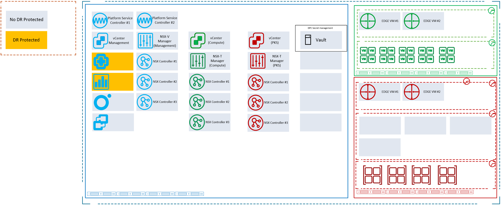
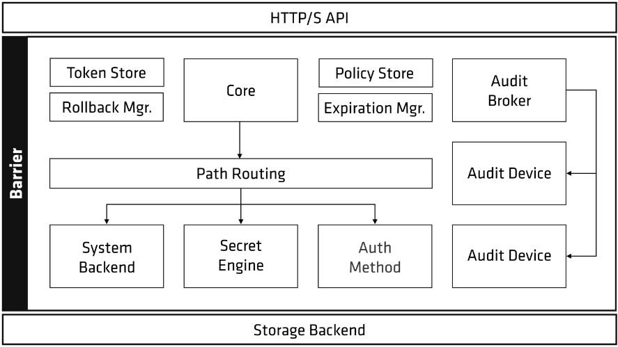
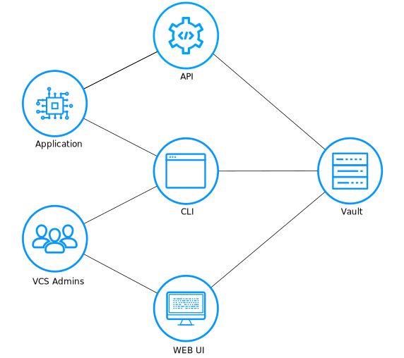

# Hashicorp Vault LLD

- Table of Contents
{:toc}

# 1 Introduction

## 1.1 Purpose

The purpose of this document is to provide detailed design and architectural guidance required to implement validated model of a VCS Secret Management in accordance with Atos standards and portfolio services. The principal aim of this document is to translate the high-level design (HLD) into a technical low-level design (LLD).  
Design is providing component architecture overview in Architecture Overview chapter that provides basic building blocks and main principles, followed by Detailed Logical Design and finally Detailed Physical Design.  
Architecture Overview provides basic building blocks and main design principles of presented design. It is covering known requirements cascaded from HLD and other LLDs.
Detailed Logical Design presents business logic, relations and fundamental design decisions.  
Detailed Physical Design provides detailed configuration of components including POD type specifics.

## 1.2 Audience

This document is intended for Atos Cloud Services Engineers and Architects responsible for VMware Cloud Services (VCS) solution implementation and maintenance.

## 1.3 Scope

This LLD is intended to cover below components and domains:

1. HashiCorp Vault Integration and design for VCS.

This LLD does not cover:

1. Installation guides for HashiCorp Vault.

## 1.4 Related Documents

This document is a subset of Atos Technology Lifecycle Management (ATLM) artefacts. All documents are stored in the VCS documentation repository.

##### Table 1. ATLM Related Documents

| Document Name                                     |
|---------------------------------------------------|
| [VCS High-Level Design](hldDigitalHybridCloud.md) |

### Security Requirements Coverage

| Instruction Name | Short Description |
| :----------: | ------- |
| [lldADSecurityEnhancement2024.md](lldADSecurityEnhancement2024.md) | Describes AD vulnerabilities in VCS and the remediation actions for key security findings. |
| [lldDhcRoleBasedAccessControl.md](lldDhcRoleBasedAccessControl.md) | Defines RBAC roles, mappings, and access review principles for VCS components. |
| [lldBreakTheGlass.md](lldBreakTheGlass.md) | Defines emergency access workflows for outage scenarios and recovery procedures. |
| [lldHardening.md](lldHardening.md) | Defines required hardening activities before production handover, including identity, firewall, and compliance controls. |
| [lldHashicorpVault.md](lldHashicorpVault.md) | Describes secure secret-management architecture, authentication methods, and audit logging. |
| [lldVulnerabilityManagement.md](lldVulnerabilityManagement.md) | Defines Nessus-based vulnerability scanning design, scope, and operating model. |
| [lldSecurityPosture.md](lldSecurityPosture.md) | Provides a consolidated overview of VCS security controls across encryption, scanning, RBAC, logging, and patching. |
| [SecurityMeasureExceptions.md](SecurityMeasureExceptions.md) | Lists approved Nessus/Alcatraz exceptions and false positives with rationale and mitigation context. |
| [SiemensCERTExceptions.md](SiemensCERTExceptions.md) | Lists Siemens CERT exceptions/false positives with applicability and risk/mitigation notes. |
| [lldSOXDB.md](lldSOXDB.md) | Describes SOXDB integration security controls, including credential handling, encryption, and RBAC. |
| [lldRemoteConsoleAccess.md](lldRemoteConsoleAccess.md) | Defines secure remote console access controls, including RBAC and certificate handling. |

## 1.5 Requirement Levels

This document is following the principles below to categories all requirements and design decisions.

|    Term    | Meaning                                                                                                                                                                                                                                                         |
|:----------:|-----------------------------------------------------------------------------------------------------------------------------------------------------------------------------------------------------------------------------------------------------------------|
|    MUST    | The definition is an absolute requirement of the specification.                                                                                                                                                                                                 |
|  MUST NOT  | The definition is an absolute prohibition of the specification                                                                                                                                                                                                  |
|   SHOULD   | There may exist valid reasons in particular circumstances to ignore a particular item, but the full implications must be understood and carefully weighed before choosing a different course                                                                    |
| SHOULD NOT | There may exist valid reasons in particular circumstances when the particular behaviour is acceptable or even useful, but the full implications should be understood and the case carefully weighed before implementing any behaviour described with this label |
|    MAY     | Any design decisions that are not classified as MUST and SHOULD or covering optional feature that is not general available for VCS product                                                                                                                      |

# 2 Architecture Overview

The diagram below highlights VCS areas covered in this LLD. This document will cover the HashiCorp Vault integration and design for VCS.

##### Figure 1. VCS Architecture Overview



## 2.1 Business and Solution Requirements

The table below provides known requirements mandatory to be incorporated into design decisions of VCS Secret Management described in this LLD.

##### Table 2. Initial Requirements

|  ID  | Requirement description                                                       | Requirement Source | Requirement Level |
|:----:|-------------------------------------------------------------------------------|:------------------:|:-----------------:|
| R001 | VCS account/password information stored in central protected location.        |        HLD         |       MUST        |
| R002 | Account/Password data needs to be encrypted.                                  |        HLD         |       MUST        |
| R003 | Stored secrets need to be accessible and fully managed using API, CLI and UI. |        HLD         |       MUST        |

# 3 Detailed Logical Design

| Decision ID | Design Decision                                                                                                          | Design Justification                                                                                                                                                                                           | Design Implication                                                                                            |
|:-----------:|--------------------------------------------------------------------------------------------------------------------------|----------------------------------------------------------------------------------------------------------------------------------------------------------------------------------------------------------------|---------------------------------------------------------------------------------------------------------------|
|   DD-001    | HashiCorp Vault will be used as a tool for storing and managing secrets for VCS.                                         | HashiCorp Vault allows to store the secrets such as API keys, passwords or certificates in a central secure location. Single tool with full API and CLI access will be used for secret management.             |                                                                                                               |
|   DD-002    | As Vault needs to have backend storage configured local storage will be used to store secret data.                       | As the content stored in Vault will be static local storage will be used to persist Vault's data.                                                                                                              |                                                                                                               |
|   DD-003    | Vault will use K/V and Active Directory secret engines.                                                                  | To address the need to store the credentials for VCS Management Infrastructure Key-Value secret engine will be used. For all Active Directory credentials dedicated AD secret engine will be enabled and used. | Only Key-Value engine is enabled by default. Active Directory engine will be enabled during Vault deployment. |
|   DD-004    | KV secret engine version 2 will be used to keep the VCS secretes.                                                        | Version 2 is the Secret Engine that allows storing of a static key-value pairs. It also supports versioning and undelete option.                                                                               |                                                                                                               |
|   DD-005    | To support VCS secret management Vault will use following Authentication methods: Token,Username&Password,Cert and LDAP. | Token,Username&Password,Cert authentication methods will be used by automation. LDAP authentication method will be used by VCS administrators.                                                                 |                                                                                                               |
|   DD-006    | A detailed log of all requests and response sent to syslog.                                                              | To address the need to store detailed log of all requests syslog will be used.                                                                                                                                 | All log will be sent and stored on VCS vRLI.                                                                  |

## 3.1 Vault architecture overview

Vault is a complex system that has many different pieces. Before describing the architecture, a glossary of terms will be described to clarify Vaults components.

**Storage Backend** - A storage backend is responsible for durable storage of encrypted data. Backends are not trusted by Vault and are only expected to provide durability. The storage backend is configured when starting the Vault server.

**Barrier** - The barrier is cryptographic steel and concrete around the Vault. All data that flows between Vault and the storage backend passes through the barrier. The barrier ensures that only encrypted data is written out, and that data is verified and decrypted on the way in.

**Secrets Engine** - A secrets engine is responsible for managing secrets. Simple secrets engines like the "kv" secrets engine simply return the same secret when queried. Some secrets engines support using policies to dynamically generate a secret each time they are queried.

**Audit Device** - An audit device is responsible for managing audit logs. Every request to Vault and response from Vault goes through the configured audit devices.

**Auth Method** - An auth method is used to authenticate users or applications which are connecting to Vault. Once authenticated, the auth method returns the list of applicable policies which should be applied. Vault takes an authenticated user and returns a client token that can be used for future requests.

**Client Token** - A client token (aka "Vault Token") is a conceptually similar to a session cookie on a web site. Once a user authenticates, Vault returns a client token which is used for future requests. The token is used by Vault to verify the identity of the client and to enforce the applicable ACL policies.

**Secret** - A secret is the term for anything returned by Vault which contains confidential or cryptographic material.

**Server** - Vault depends on a long-running instance which operates as a server. The Vault server provides an API which clients interact with and manages the interaction between all the secrets engines, ACL enforcement, and secret lease revocation.

##### Figure 2. High level overview of Vault architecture



There is a clear separation of components that are inside or outside of the security barrier. Only the storage backend and the HTTP API are outside, all other components are inside the barrier.

The storage backend is untrusted and is used to durably store encrypted data. When the Vault server is started, it must be provided with a storage backend so that data is available across restarts. The HTTP API similarly must be started by the Vault server on start so that clients can interact with it.

Once started, the Vault is in a sealed state. Before any operation can be performed on the Vault it must be unsealed. This is done by providing the unseal keys. When the Vault is initialized it generates an encryption key which is used to protect all the data. That key is protected by a master key. By default, Vault uses a technique known as Shamir's secret sharing algorithm to split the master key into 5 shares, any 3 of which are required to reconstruct the master key.

Once Vault retrieves the encryption key, it is able to decrypt the data in the storage backend, and enters the unsealed state. Once unsealed, Vault loads all of the configured audit devices, auth methods, and secrets engines.

The configuration of those audit devices, auth methods, and secrets engines must be stored in Vault since they are security sensitive. Only users with the correct permissions should be able to modify them, meaning they cannot be specified outside of the barrier. By storing them in Vault, any changes to them are protected by the ACL system and tracked by audit logs.

After the Vault is unsealed, requests can be processed from the HTTP API to the Core. The core is used to manage the flow of requests through the system, enforce ACLs, and ensure audit logging is done.

When a client first connects to Vault, it needs to authenticate. Vault provides configurable auth methods providing flexibility in the authentication mechanism used. An authentication request flows through core and into an auth method, which determines if the request is valid and returns a list of associated policies. Policies are just a named ACL rule. For example, the "root" policy is built-in and permits access to all resources. Vault operates exclusively in a whitelist mode, meaning that unless access is explicitly granted via a policy, the action is not allowed. Since a user may have multiple policies associated, an action is allowed if any policy permits it. Policies are stored and managed by an internal policy store.
Once authentication takes place and an auth method provides a set of applicable policies, a new client token is generated and managed by the token store. This client token is sent back to the client and is used to make future requests. This is similar to a cookie sent by a website after a user logs in.

Once authenticated, requests are made providing the client token. The token is used to verify the client is authorized and to load the relevant policies. The policies are used to authorize the client request. The request is then routed to the secrets engine, which is processed depending on its type. The core handles logging of requests and responses to the audit broker, which fans the request out to all the configured audit devices.

## 3.2 VCS integration and design

Vault will be integrated in VCS as a secret management tool. Initially it will be used to store and mange credentials for the VCS management infrastructure. All user/password information will be kept in Vault. Access and management of the stored credentials will be possible using following methods: API, CLI, Vault web UI. Application\Automation will mainly use a API and CLI. VCS Administrators can use Vault web UI and CLI to access and manage secrets inside the Vault.
Vault requires configured storage backend for the durable storage of Vault's information. In order to store the encrypted secrets local file will be used as a storage backend. This will allow to persist Vault's data. All content stored for persistence in Vault is encrypted by Vault and written to the storage backend at rest. This data is written to the key-value store section.

##### Figure 3. Overview of VCS Vault implementation and flow



## 3.3 Vaults path structure

To store and organize the secrets Vault uses a path. The path prefix tells Vault which secrets engine it should route traffic. Vault presents secrets engines similar to a filesystem. A secrets engine is enabled at a path. Vault itself performs prefix routing on incoming requests and routes the request to the correct secrets engine based on the path at which they were enabled.
When a request comes to Vault, it matches the initial path part using a longest prefix match and then passes the request to the corresponding secrets engine enabled at that path.

By default, Vault enables a secrets engine called kv at the path secret/. The kv secrets engine reads and writes raw data to the backend storage.

##### Figure 4 Example of a path used for KV engine

```shell
`[storepath]/[keyname] key=value` 
`secret/administrator password=[value]`
```

VCS will use below path structure to organize the secretes inside the Vault. Dedicated paths will be used to store secrets for activedirectory, servers, templates, vracloud, antivirus and backup.

##### Figure 5 Path structure used in VCS for KV engine

```text
secret/<customerCode>/<locationCode>/
                     |___/activedirectory/
                     |   |___/account_name/ (i.e. svc-gre2-vcs01)
                     |       |___[key:value] (i.e. svc-gre2-vcs01/password)
                     |___/servers/
                     |   |___/host_name/ (i.e. gre2tss01)
                     |       |___/account_name/ (i.e. administrator)
                     |           |___[key:value] (i.e. administrator/password)
                     |___/templates/
                     |   |___/template_name/ (i.e. GlobalImage_w2k19)
                     |       |___/account_name/ (i.e. administrator)
                     |           |___[key:value] (i.e. administrator/password)
                     |___/vracloud/
                     |   |___/account_name/ (i.e. authorizationToken)
                     |       |___[key:value] (i.e. authorizationToken/value)
                     |   |___/tenant_name/ (i.e. ten01, ten02)
                     |       |___/account_name/ (i.e. authorizationToken-username)
                     |           |___[key:value] (i.e. authorizationToken-username/value)
                     |___/antivirus/
                     |   |___/account_name/ (i.e. token,tenantId,windowsPolicyId,linuxPolicyId)
                     |       |___[key:value] (i.e. token/value)
                     |___/backup/
                     |   |___/account_name/ (i.e. APIuser)
                     |       |___[key:value] (i.e. APIuser/password)
                     |___/alcatraz/
                     |   |___/account_name/ (i.e. alcatrazuser)
                     |       |___[key:value] (i.e. alcatrazuser/password)
```

The secrets in the 'vracloud' path will contain API tokens dedicated for individual users, with the username of each user appended to the entry. A policy will be applied during the secret creation procedure to:

- make each entry vibile only to a given user
- automatically remove the entry after 1 day

>Note: `/vracloud/authorizationToken` is used only during the initial deployment and is replaced by `/vracloud/tenant_name/authorizationToken-username` in the managed phase

## 3.4 Vault Seal/Unseal

The data stored by Vault is stored encrypted. Vault needs the encryption key in order to decrypt the data. The encryption key is also stored with the data but encrypted with another encryption key known as the master key. The master key isn't stored anywhere. To decrypt the data, Vault must decrypt the encryption key which requires the master key. Unsealing is the process of reconstructing this master key. Instead of distributing this master key as a single key to an operator, Vault uses an algorithm known as Shamir's Secret Sharing to split the key into shards. A certain threshold of shards is required to reconstruct the master key.

When a Vault server is started, it starts in a sealed state. In sealed state Vault knows how to access the physical storage but doesn't know how to decrypt the data. Unsealing is the process of constructing the master key necessary to read the decryption key to decrypt the data, allowing access to the Vault. The shards are added one at a time (in any order) until enough shards are present to reconstruct the key and decrypt the data.

VCS will use five shards with the threshold of three that will be required to unseal the Vault. During the deployment keys and root token are saved in JSON file. Generated file needs to be moved outside of VCS and stored according to defined security procedures.

For the VCS auto unseal mechanism was developed to aid in reducing the operational complexity of keeping the master key secure. Auto unseal is performed by two scripts `encryptkeys.sh` and `unseal.sh`. During the deployment both scripts are copied to Vault.

First script `encryptkeys.sh` will encrypt the `unsealKeys.json`. Second script `unseal.sh` is added to the crontab and will be started on every Vault reboot. It’s decrypts the key shards stored there and automatically unseal the Vault.

## 3.5 Vault logging and monitoring

Vault is using audit devices to keep a detailed log of all requests and response to Vault. As every operation with Vault is an API request/response, the audit log contains every authenticated interaction with Vault, including errors.  
The request and response can be matched utilizing a unique identifier assigned to each request. With a few specific exceptions, all strings (including authentication tokens and lease information) contained within requests and responses are hashed with a salt using HMAC-SHA256. The purpose of the hash is so that secrets aren't in plaintext in audit logs.

VCS implementation will use syslog AUTH facility to store the audit logs. All logs related to Vault will be tagged as "HASHIVAULT". Single audit device will be in use. All audit logs will be sent and stored on vRLI.

Vault monitoring will use log analytics approach. This means capturing log files from the system and the application, querying the results for a given severity or defined message and rising the alerts.
In VCS implementation vault service will log messages to syslog. All service states that should be monitored are listed in design decision table below.

| Decision ID | Design Decision                                                                                                                                        | Design Justification                                                                                                                                                                                                                                                                                                                                                                       | Design Implication |
|:-----------:|--------------------------------------------------------------------------------------------------------------------------------------------------------|--------------------------------------------------------------------------------------------------------------------------------------------------------------------------------------------------------------------------------------------------------------------------------------------------------------------------------------------------------------------------------------------|--------------------|
|  l&md-001   | HashiCorp Vault will use single audit device for VCS.                                                                                                  | As logs will be stored locally and sent to vRLI there is no need to create second local audit device.                                                                                                                                                                                                                                                                                      |                    |
|  l&md-002   | Following application states should be monitored: <br/>-Vault service stop/failure<br/> -Vault service messages with severity Alert, Critical or Error | To address the need to monitor the Vault availability and health mentioned states needs to be added to monitoring. This will be done by capturing log files from the system and the application, querying the results for a given severity or defined message and rising the alerts. Basic vault availability will be monitored on vROPS by setting the monitor process for vault service. |                    |

## 3.6 Security

### 3.6.1 Role Based Access Control

Atos based solutions must guarantee proper access management. Following design decisions are made in that area.

##### Table 3 Design Decisions - RBAC

| Decision ID | Design Decision                                                                                                                                                                                                                                                                       | Design Justification                                                                                                                                                                                                                                                                                                                                                                                                                                                                                                                                                                                                                                                                                                                                                                                                                                                                       | Design Implication                                                                                                                                                                                                                                                                                                                                                                                                                                |
|:-----------:|---------------------------------------------------------------------------------------------------------------------------------------------------------------------------------------------------------------------------------------------------------------------------------------|--------------------------------------------------------------------------------------------------------------------------------------------------------------------------------------------------------------------------------------------------------------------------------------------------------------------------------------------------------------------------------------------------------------------------------------------------------------------------------------------------------------------------------------------------------------------------------------------------------------------------------------------------------------------------------------------------------------------------------------------------------------------------------------------------------------------------------------------------------------------------------------------|---------------------------------------------------------------------------------------------------------------------------------------------------------------------------------------------------------------------------------------------------------------------------------------------------------------------------------------------------------------------------------------------------------------------------------------------------|
|   RB-001    | Apart for the built-in token authentication Username&Password and LDAP authentication method will be enabled.                                                                                                                                                                         | User and Password authentication will need to be enabled for automatic build before AD will be deployed. Administrators will use LDAP authentication to access the Vault.                                                                                                                                                                                                                                                                                                                                                                                                                                                                                                                                                                                                                                                                                                                  | Username&Password and LDAP authentication are disabled by default and will need to be enabled during deployment.                                                                                                                                                                                                                                                                                                                                  |
|   RB-002    | There will be a dedicated AD groups used for the LDAP authentication method.                                                                                                                                                                                                          | To control the access to Vault dedicated AD group will be created.                                                                                                                                                                                                                                                                                                                                                                                                                                                                                                                                                                                                                                                                                                                                                                                                                         |                                                                                                                                                                                                                                                                                                                                                                                                                                                   |
|   RB-003    | User called automation will be created.                                                                                                                                                                                                                                               | To allow automated deployment of a VCS a user called automation will be created. This user will be used by Ansible playbooks to access the Vault. When the automated environment build will be completed this user will be disabled.                                                                                                                                                                                                                                                                                                                                                                                                                                                                                                                                                                                                                                                       | Account will be created during deployment.                                                                                                                                                                                                                                                                                                                                                                                                        |
|   RB-004    | Below additional Vault ACL policies will be created for VCS implementation:<br><br> -Configurationadmins<br>-Networkadmins<br>-Passwordadmins<br>-Passwordreadonly<br>-Automation01access<br>-Automation02access<br>-Automation03access<br>-Automation04access<br>-Automation05access | <br>-Configurationadmins ACL will have administrative access to Hashicorp Vault configuration.<br> <br>-Networkadmins ACL will have Hashicorp Vault read-only access to network related secrets per location.<br><br>-Passwordadmins ACL will have read-write access to Vault secrets per location.<br><br>-Passwordreadonly ACL will have Vault read-only access to secrets per location.<br><br>-Automation01access will have Vault read-only access to vRA Cloud related scheduled accounts secrets<br><br>- Automation02access will have Vault read-only access to cron scheduled accounts secrets<br><br>- Automation03access will have Vault read-only access to alcatraz accounts secrets.<br><br>- Automation04access will have Vault read-only access to server secrets<br><br>- Automation05access will have Vault read-only access to servers, activedirectory and vrli secrets | automation##access type policies are meant to be used by automation, e.g. ansible-playbook ran periodically by crontab, therefore a certificate login is assigned to each one of them with name Automation##, where ## is the number of the respective policy. The certificate is also stored in root/.ssl directory on ans001 and is used to authenticate with a REST API request to fetch the credentials utilized by the play from HashiVault. |
|   RB-005    | Each secret in the 'vracloud' path will be visible only to its owner and will expire automatically after 1 day                                                                                                                                                                        | Tenant Administrator token grants extensive permissions to the Customer Organization in VRA Cloud and should be generated on a per-user basis for proper traceability and should have a limited lifespan                                                                                                                                                                                                                                                                                                                                                                                                                                                                                                                                                                                                                                                                                   | The policies applied in Hashivault will make sure that the token is not going to be used by another user and that the expired tokens will be removed automatically.                                                                                                                                                                                                                                                                               |

### 3.6.2 Firewall

This section covers all firewall related decisions influencing content of that LLD.

##### Table 4 Design Decisions - Firewall

| Decision ID | Design Decision                                                     | Design Justification                                                                                       | Design Implication |
|:-----------:|---------------------------------------------------------------------|------------------------------------------------------------------------------------------------------------|--------------------|
|   FD-001    | Vault will be placed in management domain and Local Region network. | There is no need to create dedicated FW rules as connectivity will be allowed inside Local Region network. |                    |

### 3.6.3 Certificates

VCS is introducing dedicated Certificate Authority (CA). Below design decisions are taken in terms of certificate management for that LLD.

##### Table 5 Design Decisions - Certificates

| Decision ID | Design Decision                                  | Design Justification                                                                                      | Design Implication |
|:-----------:|--------------------------------------------------|-----------------------------------------------------------------------------------------------------------|--------------------|
|   CD-001    | Internal CA certificate should be used by Vault. | As the communication to vault needs to be encrypted internal CA certificate should be generated and used. |                    |

## 3.7 Availability and Scalability

### 3.7.1 Availability Design

The design decisions below are made to guarantee availability of VCS Secret Management.

##### Table 6 Design Decisions - Availability

| Decision ID | Design Decision                            | Design Justification                                                                                                              | Design Implication |
|:-----------:|--------------------------------------------|-----------------------------------------------------------------------------------------------------------------------------------|--------------------|
|   AD-001    | Vault will be deployed as a single server. | Vault initially will be used to store the credentials for the management infrastructure. There is no requirement to implement HA. |                    |

### 3.7.2 Scalability Design

##### Table 7 Design Decisions - Scalability

| Decision ID | Design Decision                                                                | Design Justification                                                                                                                                 | Design Implication |
|:-----------:|--------------------------------------------------------------------------------|------------------------------------------------------------------------------------------------------------------------------------------------------|--------------------|
|   SD-001    | Single server deployment configuration will be used for VCS secret management. | Single server deployment configuration is sufficient to handle secret management for the management infrastructure. The are no plans to scale Vault. |                    |

## 3.8 Recoverability

The chapter below provides detailed design choices to protect against data lost and backup functionality and against Datacenter failure.

### 3.8.1 Component Failure

##### Table 8 Design Decisions - Component failure

| Decision ID | Design Decision                                                         | Design Justification                                                           | Design Implication |
|:-----------:|-------------------------------------------------------------------------|--------------------------------------------------------------------------------|--------------------|
|   CF-001    | VCS backup will be used to protect the Vault VM and the stored secrets. | To protect against data lost Vault VM will be added to VCS implemented backup. |                    |

## 3.9 Multi-tenancy

##### Table 9 Design Decisions - Multi-tenancy

| Decision ID | Design Decision                                                 | Design Justification                                                                                                                                                                                                                                         | Design Implication |
|:-----------:|-----------------------------------------------------------------|--------------------------------------------------------------------------------------------------------------------------------------------------------------------------------------------------------------------------------------------------------------|--------------------|
|   MT-001    | Vault supports either a single-tenant or a shared VCS instance. | Most of the secrets stored in the Vault are related to the management infrastructure, which is shared between tenants. The only exception is VRA Cloud and its API tokens, which are stored in a tenant-dedicated path based on the tenant organization name | N/A                |

## 3.10 External Connection/System Requirements

The table below provides domain/components requirements for other components and domains to be taken into corresponding design decisions with requirement level in line with Chapter 1.5

##### Table 10 Design External Requirements

| Requirement ID | Requirement criticality | Requirement description | Requirement Justification |
|:--------------:|-------------------------|-------------------------|---------------------------|
|      N/A       | N/A                     | N/A                     | N/A                       |

# 4 Detailed Physical Design

## 4.1 Management Plane

### 4.1.1 Virtual Machine Configuration Table

VMs that are part of implementation and they roles are listed in following table.

##### Table 12 VMs list

| VM Name             | VM Role                            | Description                     |
|---------------------|------------------------------------|---------------------------------|
| Number of instances | 1                                  | Initial deployment covers 1 VM. |
| Operating System    | Ubuntu 18                          |                                 |
| vCPU                | 2                                  |                                 |
| Memory              | 4 GB                               |                                 |
| Storage             | Disk 1: 60 GB (OS and Application) |                                 |

### 4.1.2 Element Configuration Table

That chapter contains configuration details for HCL file used to configure Vault.

##### Table 13 HCL Configuration

| Component                  | Value                                      | Description (optional) |
|----------------------------|--------------------------------------------|------------------------|
| Vault UI                   | ui=true                                    |                        |
| Listener protocol and port | TCP and port 8200                          |                        |
| Storage                    | File with path set /opt/hsvault            |                        |
| API_addr                   | Will be set to `https://< Vault IP >:8200` |                        |
| Cluster_addr               | Will be set to `https://< Vault IP >:8201` |                        |

## 4.2 Security

### 4.2.1 Role Based Access Control

Below roles are defined for user access purpose including service accounts.

##### Table 14 RBAC Roles

| Role Group Name                                | Member Group Name | Comment                                                                            |
|------------------------------------------------|-------------------|------------------------------------------------------------------------------------|
| role-< platformName >-g-securityadministrators | N/A               | Hashicorp Vault full access to secrets. No access to Vault configuration.          |
| role-< locationCode >-g-networkadministrators  | N/A               | Hashicorp Vault Read-Only access to network related secrets per location.          |
| role-< locationCode >-g-platformadministrators | N/A               | Vault Read-Only access to secrets per location. Full admin access to Vault config. |

Below groups are created as part of design implementation.

##### Table 15 RBAC Groups

| AD Group Name                                  | Member Name                                    | Member Type (local, Active Directory) |
|------------------------------------------------|------------------------------------------------|---------------------------------------|
| rsce-dpc-vlt-l-passwordadmins                  | role-dpc-g-securityadministrators              | Active Directory                      |
| rsce-dpc-vlt-l-configurationadmins             | role-< locationCode >-g-platformadministrators | Active Directory                      |
| rsce-< locationCode >-vlt-l-networkadmins      | role-< locationCode >-g-networkadministrators  | Active Directory                      |
| rsce-< locationCode >-vlt-l-passwordreadonly   | role-< locationCode >-g-platformadministrators | Active Directory                      |
| rsce-< locationCode >-vlt-l-automation01access | N/A                                            | Active Directory                      |
| rsce-< locationCode >-vlt-l-automation02access | N/A                                            | Active Directory                      |
| rsce-< locationCode >-vlt-l-automation03access | N/A                                            | Active Directory                      |

### 4.2.2 Ports and protocols

##### Table 16 Ports and protocols

| Service/Traffic Name                                       | Source                                                           | Destination          | Port(s) | Protocol |
|------------------------------------------------------------|------------------------------------------------------------------|----------------------|---------|----------|
| Listen port for UI and API connectivity.                   | Vault                                                            | Local Region network | 8200    | TCP      |
| Listen port for server to server requests within a cluster | Vault (required for server to server requests within a cluster). | Local Region network | 8201    | TCP      |

## 4.3 Software Versions and Licensing

Below software and firmware versions are certified by Atos for usage.

##### Table 18 Software versions

| Name            | Release       | Comments |
|-----------------|---------------|----------|
| HashiCorp Vault | Version 1.3.2 |          |

Below license models/types must be applied on corresponding elements.

##### Table 19 Licenses

| Component Name | License Name / Type | License count | Comments |
|----------------|---------------------|---------------|----------|
| Vault          | Open Source         | N/A           | N/A      |
