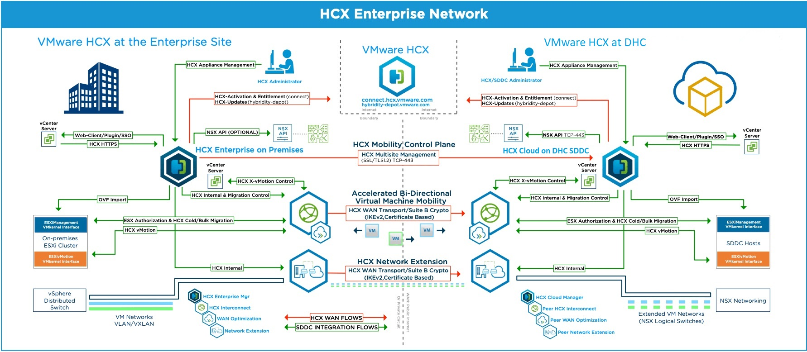

# HCX LLD

- Table of Contents
{:toc}

# 1. Introduction

## 1.1. Purpose

The purpose of this document is to provide detailed design and architectural guidance required to implement HCX in accordance with Atos standards and portfolio services. The principal aim of this document is to translate the high-level design (HLD) into a technical low-level design (LLD).

Design is providing component architecture overview in Architecture Overview chapter that provides basic building blocks and main principles, followed by Detailed Logical Design.

Architecture Overview provides basic building blocks and main design principles of presented design. It is covering known requirements cascaded from HLD and other LLDs.
Detailed Logical Design presents business logic, relations and fundamental design decisions.
Detailed Physical Design provides detailed configuration of components including POD type specifics.

## 1.2. Audience

This document is intended for Atos Cloud Services Engineers and Architects responsible for VMware Cloud Services (VCS) solution implementation and maintenance.

## 1.3. Scope

This LLD is intended to cover below components and domains:

1. VMware HCX
2. Networking requirements

This LLD does not cover:

1. Management and Base Virtualization
2. Network configuration
3. Detailed monitoring

## 1.4. Related Documents

This document is a subset of Atos Technology Lifecycle Management (ATLM) artefacts. All documents are stored in the VCS documentation repository.

##### Table 1: ATLM Related Documents

 | Document Name                                                                 |
 |-------------------------------------------------------------------------------|
 | [VCS High-Level Design](hldDigitalHybridCloud.md)                             |
 | [Low Level Design - Software Defined Networks](lldSoftwareDefinedNetworks.md) |

## 1.5. List of changes

| Version | Date       | Description                          | Author(s)             |
|---------|------------|--------------------------------------|-----------------------|
| 0.1     | 2019-11-13 | Initial draft creation               | Krzysztof Hermanowski |
| 0.2     | 2020-11-13 | Review                               | Marcin Gala           |
| 1.1     | 2021-04-23 | Updated the document on Radek review | Bhalchandra Gavhane   |

## 1.6. Requirement Levels

This document is following the principles below to categories all requirements and design decisions.

| Term       | Meaning                                                                                                                                                                                                                                                          |
|------------|------------------------------------------------------------------------------------------------------------------------------------------------------------------------------------------------------------------------------------------------------------------|
| MUST       | The definition is an absolute requirement of the specification.                                                                                                                                                                                                  |
| MUST NOT   | The definition is an absolute prohibition of the specification                                                                                                                                                                                                   |
| SHOULD     | There may exist valid reasons in particular circumstances to ignore a particular item, but the full implications must be understood and carefully weighed before choosing a different course                                                                     |
| SHOULD NOT | There may exist valid reasons in particular circumstances when the particular behaviour is acceptable or even useful, but the full implications should be understood, and the case carefully weighed before implementing any behaviour described with this label |
| MAY        | Any design decisions that are not classified as MUST and SHOULD or covering optional feature that is not general available for DPC product                                                                                                                       |

# 2. Architecture Overview

HCX is an application mobility platform designed for simplifying workload migration across data centers.

The left side of the diagram below highlights the areas of the customer on-premise location, which is a source (HCX Connector). The right side is a destination (HCX Cloud Manager), where the customer workload will get migrate on cloud platform.

##### Figure 1 HCX Architecture

Below components are used in above diagram:

- HCX Manager: This is the brain of the HCX environment of site. HCX Manager talks with all the component at site like AD/NTP/DNS/Log server, vCenter, NSX Manager, vmware.com, HCX interconnect, HCX network extension etc.
- HCX Interconnect (HCX-IX): It provides the migration capabilities over wan link.
- HCX WAN optimizer (HCX-WAN-OPT): It improves the WAN link performance by compressing the data.
- HCX Network Extension (HCX-NE): It extends the L2 network to the remote HCX enabled site.

## 2.1. Business and Solution Requirements

The table below provides known requirements mandatory to be incorporated into design decisions of VMware HCX described in this LLD.

##### Table 2: Initial Requirements

| ID   | Requirement description                                                                           | Requirement Source | Requirement Level |
|------|---------------------------------------------------------------------------------------------------|--------------------|-------------------|
| R001 | Allow migration of VMs connected to NSX logical switches                                          | Design Architect   | MUST              |
| R002 | Allow migration of VMs connected to distributed switches                                          | Design Architect   | MUST              |
| R003 | Solution is using VMware Cloud Foundation SDDC and SDN workload domains / PODs as endpoints       | HLD                | MUST              |
| R004 | Installation and configuration of required components is automated                                | Atos Management    | SHOULD            |
| R005 | Automation domain must be patched in regular schedule with minimal impact on service availability | Portfolio          | MUST              |
| R006 | Defined Role Base Access Control (RBAC) model to ensure a proper security isolation               | Portfolio          | MUST              |

## 2.2. Migration options

VMware HCX Bulk Migration – This migration method uses the VMware vSphere Replication to move the virtual machines to a remote site.

- The Bulk migration option is designed for moving virtual machines in parallel.
- This migration type can set to complete on a pre-defined schedule.
- The virtual machine runs at the source site until the failover begins. The service interruption with the bulk migration is equivalent to a reboot.
- The migration limit with VMware HCX Bulk Migration is 200 VMs max at a time.

VMware HCX vMotion – This migration method uses the VMware vMotion to move a virtual machine to a remote site.

- The vMotion migration option is designed for moving single virtual machine at a time.
- Virtual machine state is migrated. There is no service interruption during the VMware HCX vMotion migration.

VMware HCX Cold Migration -

- This migration method uses the VMware NFC (Network File Copy) protocol.
- It is automatically selected when the source virtual machine is powered off.

VMware HCX Replication Assisted vMotion (RAV) – Combines advantages from VMware HCX Bulk Migration (parallel operations, resiliency, and scheduling) with VMware HCX vMotion (zero downtime virtual machine state migration).

- The migration begins with the replication of the virtual machine's disks. As with Bulk migration, virtual machines can be migrated in parallel and the switchover is configurable on a schedule.
- During the RAV switchover phase, vMotion is engaged for migrating the disk delta data and virtual machine state.
- Enabling this service requires additional HCX licensing i.e. HCX Enterprise.

VMware HCX OS Assisted Migration –

- This migration method provides for the bulk migration of guest (non-vSphere) virtual machines using OS Assisted Migration to VMware vSphere on-premise or cloud-based data centers.
- Enabling this service requires additional HCX licensing i.e. HCX Enterprise.

##### Table 3: Migration Options

| **Migration type**                           | **Migration Limit** | **Description**                                                                                                                                            | **License**    |
|----------------------------------------------|---------------------|------------------------------------------------------------------------------------------------------------------------------------------------------------|----------------|
| Concurrent HCX Bulk Migrations               | 200                 | This migration method  uses the VMware vSphere Replication protocols to move the virtual machines to  a remote site. Service interruption equal to reboot. | HCX Advanced   |
| Concurrent HCX vMotions                      | 1                   | This migration method  uses the VMware vMotion protocol to move a virtual machine to a remote site.  One VM at a time and no service interruption.         | HCX Advanced   |
| Concurrent HCX Cold Migrations               | 1                   | Uses NFC protocol. automatic migration when the  VM is switched off.                                                                                       | HCX Advanced   |
| Concurrent HCX Replication Assisted vMotions | 200                 | It is a combination of Bulk and vMotion migration                                                                                                          | HCX Enterprise |
| Concurrent HCX OS Assisted Migrations        | 50                  | Use for bulk migration of  guest (non-vSphere) VMs.                                                                                                        | HCX Enterprise |

## 2.3. Licensing

The HCX service features are available based on the installed license.

HCX Advanced - HCX Advanced is packaged into NSX Data Center Enterprise Plus, VMware Cloud on AWS, VCF Enterprise and from VMware Cloud Provider Partners.

HCX Enterprise - HCX Enterprise licenses are available for purchase to NSX Enterprise Plus customers. Access to the HCX Enterprise services requires an additional license.

| HCX  License | Description                                                                                                                                                                                               |
|--------------|-----------------------------------------------------------------------------------------------------------------------------------------------------------------------------------------------------------|
| Advanced     | Activates  standard HCX services:  - Interconnect      - WAN Optimization      - Network Extension      - Bulk Migration      - vMotion Migration      - Disaster Recovery. |
| Enterprise   | Activates  premium HCX services:  - OS Assisted Migration(OSAM)      - ReplicationAssisted vMotion(RAV)      - Site Recovery Manager (SRM) Integration                                     |

## 2.4. Network requirements

### 2.4.1.  Bandwidth requirement between source site and destination site

Minimum 100 Mbps of the WAN link bandwidth should be available for the VMware HCX WAN Interconnect migration services between source and destination site.
It is possible to extend the Virtual Machine L2 network to a VMware HCX-enabled remote site with the help of VMware HCX Network Extension (HCX-NET-EXT), a High-Performance (4–6 Gbps) service.
HCX help to migrate the virtual machine on extended network or to the desired folder in remote site vCenter.

### 2.4.2.  NSX Requirements for HCX Appliance Deployments – Destination Environment

- NSX must be installed and configured, including integration with the target vCenter Server, before deploying the HCX appliance.
- In the destination environment, NSX Manager must be installed and integrated with the target vCenter Server. Minimum supported NSX version is NSX-T 2.4 and higher.
- An NSX Data Center Enterprise plus license is required. This license is used to activate the HCX systems and provides access to HCX Enterprise features.
- The NSX Manager must be registered during the HCX install with the admin user.
- If the NSX Manager IP or FQDN uses self-signed certificates, it may be necessary to trust the NSX system manually using the Import Cert by URL interface in the HCX Manager's appliance management interface.
- The HCX Deployment on compute cluster (selected during the installation) must be NSX Prepared
- Overlay Transport Zone should be used in NSX.

### 2.4.3.  NSX Requirements in the Source Environment

NSX is not required for HCX appliance deployments, but requirements do apply if NSX overlay networks are used at the source site.
When HCX Network Extension is used with NSX overlay networks at the source site, the NSX requirements for Network Extension apply (NSX Requirements for HCX Appliance Deployments)

### 2.4.4.  Network Port and Protocol Requirements

Following requirements should be met:

- The perimeter firewall controlling outbound connections to HCX SaaS systems must be configured to allow connections from the HCX Manager.
- Connections initiated from the source HCX to the destination HCX.
- Connections within a single HCX site, either at the source or destination environment. These connections never traverse from source to destination or from destination to source.
- Connections made when the HCX is added as a solution in a vRealize Operations installation.

HCX deployments require setting various ports for communication between services on the HCX appliance itself and between HCX pairs at the source and destination sites.
The following ports must be allowed in HCX deployments:

##### Table 4: To the Internet (vmware.com domain)

| Source Component       | Destination Component      | Transport Protocol | Port | Purpose                      |
|------------------------|----------------------------|--------------------|------|------------------------------|
| HCX Enterprise Manager | connect.hcx.vmware.com     | TCP                | 443  | HCX Activation & Entitlement |
| HCX Enterprise Manager | hybridity-depot.vmware.com | TCP                | 443  | HCX Updates                  |

##### Table 5: Between sites (f.e. DPC.Classic <-> VCS) - Internet or dedicated link (MPLS-like) between sites

| Source Component                           | Destination Component                       | Transport Protocol | Port      | Purpose                                                |
|--------------------------------------------|---------------------------------------------|--------------------|-----------|--------------------------------------------------------|
| HCX Enterprise Manager                     | Remote HCX Manager (Cloud)                  | TCP                | 443       | HCX Multisite Management (SSL / TLS1.2)                |
| Local HCX Hybrid Interconnect (HCX-WAN-IX) | Remote HCX Hybrid Interconnect (HCX-WAN-IX) | UDP                | 500, 4500 | HCX WAN Transport / Suite B Crypto; IKEv2 (Cert Based) |
| Local HCX Network Extension (HCX-NET-EXT)  | Remote HCX Network Extension (HCX-NET-EXT)  | UDP                | 500, 4500 | HCX WAN Transport / Suite B Crypto; IKEv2 (Cert Based) |

##### Table 6: Inside environment (f.e. DPC.Classic, VCS)

| Source Component                           | Destination Component                      | Transport Protocol | Port         | Purpose                                       |
|--------------------------------------------|--------------------------------------------|--------------------|--------------|-----------------------------------------------|
| HCX Enterprise Manager                     | Local HCX Hybrid Interconnect (HCX-WAN-IX) | TCP                | 8123         | HCX Bulk Migration Control Traffic            |
| HCX Enterprise Manager                     | Local HCX Network Extension (HCX-NET-EXT)  | TCP                | 9443         | HCX Internal Control                          |
| HCX Enterprise Manager                     | Local HCX Hybrid Interconnect (HCX-WAN-IX) | TCP                | 443          | HCX Cross-Cloud Control                       |
| HCX Enterprise Manager                     | vCenter Server                             | TCP                | 443          | vSphere API / vSphere 6.0+ SSO Lookup Service |
| HCX Enterprise Manager                     | vCenter Server                             | TCP                | 9443         | Web-client/Plugin                             |
| HCX Enterprise Manager                     | vCenter Server                             | TCP                | 7444         | vSphere 5.5 SSO Lookup Service                |
| vCenter Server                             | HCX Enterprise Manager                     | TCP                | 443          | HCX HTTPS                                     |
| HCX Enterprise Manager                     | ESXi Management VMkernel                   | TCP                | 80, 443, 902 | OVF Import                                    |
| HCX Enterprise Manager                     | NSX Manager                                | TCP                | 443          | (Optional) NSX API                            |
| Local HCX Hybrid Interconnect (HCX-WAN-IX) | vCenter Server                             | UDP                | 902          | HCX Cross-Cloud Control                       |
| Local HCX Hybrid Interconnect (HCX-WAN-IX) | ESXi Management VMkernel                   | TCP                | 80           | ESX Authentication                            |
| Local HCX Hybrid Interconnect (HCX-WAN-IX) | ESXi Management VMkernel                   | TCP                | 902          | HCX Cold Migration (Bi-Directional Flow)      |
| ESXi Management VMkernel                   | Local HCX Hybrid Interconnect (HCX-WAN-IX) | TCP                | 902          | HCX Cold Migration (Bi-Directional Flow)      |
| Local HCX Hybrid Interconnect (HCX-WAN-IX) | ESXi Management VMkernel                   | TCP                | 8000         | HCX Cross-Cloud vMotion (Bi-Directional Flow) |
| ESXi Management VMkernel                   | Local HCX Hybrid Interconnect (HCX-WAN-IX) | TCP                | 8000         | HCX Cross-Cloud vMotion (Bi-Directional Flow) |
| ESXi Management VMkernel                   | Local HCX Hybrid Interconnect (HCX-WAN-IX) | TCP                | 31031, 44046 | HCX Bulk Migration                            |
| HCX Hybridity/Mobility Admins              | HCX Enterprise Manager                     | TCP                | 9443         | HCX Appliance Management                      |

##### Table 7: Management traffic

| Source Component                           | Destination Component                      | Transport Protocol | Port | Purpose                |
|--------------------------------------------|--------------------------------------------|--------------------|------|------------------------|
| HCX Enterprise Manager                     | DNS Server                                 | TCP/UDP            | 53   | Name Services          |
| HCX Enterprise Manager                     | NTP Server                                 | UDP                | 123  | Synchronized Time      |
| HCX Enterprise Manager                     | Syslog Collector Server                    | TCP/UDP            | 514  | Remote/Central Syslogs |
| Local HCX Hybrid Interconnect (HCX-WAN-IX) | Syslog Collector Server                    | TCP/UDP            | 514  | Remote/Central Syslogs |
| Local HCX Network Extension (HCX-NET-EXT)  | Syslog Collector Server                    | TCP/UDP            | 514  | Remote/Central Syslogs |
| HCX Hybridity/Mobility Admins              | HCX Enterprise Manager                     | TCP                | 22   | SSH                    |
| HCX Hybridity/Mobility Admins              | Local HCX Hybrid Interconnect (HCX-WAN-IX) | TCP                | 22   | SSH                    |
| HCX Hybridity/Mobility Admins              | Local HCX Network Extension (HCX-NET-EXT)  | TCP                | 22   | SSH                    |

##### The below diagram depicts the HCX port requirement for its various components

##### Figure 2 HCX ports and components

### 2.4.5. HCX components placement table

Use Table 8 or table 9:

##### Table 8: Using Management Vlan as a Uplink profile

| VM Type                                 | Configured Networks                               |
|-----------------------------------------|---------------------------------------------------|
| HCX Enterprise Manager                  | Management Network                                |
| HCX-IX Interconnect Appliance           | Management Network                                |
| ESXi                                    | vMotion Network                                   |
| HCX                                     | Interconnect Network                              |
| HCX Network Extension Virtual Appliance | HCX Interconnect Network                          |
| HCX-WAN-Optimization Appliance          | Management Network or Platform Management Network |

##### Table 9: Using dedicated Uplink profile

| VM Type                                 | Configured Networks                               |
|-----------------------------------------|---------------------------------------------------|
| HCX Enterprise Manager                  | Management Network                                |
| HCX-IX Interconnect Appliance           | Uplink Network                                    |
| ESXi                                    | vMotion Network                                   |
| HCX                                     | Interconnect Network                              |
| HCX Network Extension Virtual Appliance | Uplink Network                                    |
| HCX-WAN-Optimization Appliance          | Management Network or Platform Management Network |

### 2.4.6.  HCX Routing consideration

Routing is required to allow migration traffic to go through HCX Interconnect network. Static routes will be used to allow HCX Interconnect traffic across both Source and Destination Sites.

##### Table 10: Design Decisions - HCX

| Decision ID | Design Decision                                                                            | Design Justification                                                                                                                                           | Design Implication                                                                                                                            |
|-------------|--------------------------------------------------------------------------------------------|----------------------------------------------------------------------------------------------------------------------------------------------------------------|-----------------------------------------------------------------------------------------------------------------------------------------------|
| HCX001      | HCX-WAN-OPT would be used for large scale migration.                                       | It will reduce the WAN link utilization by compressing the data with methods like data deduplication and line conditioning                                     | It will create a HCX-WAN-OPT VM.                                                                                                              |
| HCX002      | HCX Enterprise license would be used to get the advantages of RAV                          | Replication Assisted vMotions assist to migrate the VM without any downtime.                                                                                   | Additional cost need to pay for Enterprise license.                                                                                           |
| HCX003      | Uplink profile will be used in Compute Profile and Service Mesh.                           | Uplink VLAN (profile) will be dedicated for migration.                                                                                                         | Additional Uplink vlan (with all routing) need to create.                                                                                     |
| HCX004      | HCX-NET-EXT will be used to extend the L2 network                                          | Easy way to migrate the VMs to HCX enabled remote site. The gateway will be shift to the remote site, once all VM in the network get shift to the remote site. | The traffic will get routed through the source gateway and thus WAN link between source and destination site will get utilized.               |
| HCX005      | Minimum 100 Mbps WAN link is require for VM migration from source site to destination site | It is possible to migrate max 200 VMs with the help of Bulk migration and RAV, which will require good capacity wan link.                                      | Need to monitor the WAN link utilization and take a decision to upgrade / downgrade the WAN link, which will impact the cost of the WAN link. |

# 3. Detailed Logical Design

## 3.1. Management Topology and service mesh components

VMware HCX Manager platform is deployed to the management zone, next to each site's vCenter Server,
and provides a single plane for administering VMware HCX.

##### HCX-IX Interconnect Appliance

The HCX-IX service appliance provides replication and vMotion-based migration capabilities over the
Internet and private lines to the target site whereas providing strong encryption, traffic engineering, and
virtual machine mobility.

##### HCX-WAN-Optimization Appliance

The VMware HCX WAN Optimization service improves performance characteristics of the private lines or
Internet paths by applying WAN optimization techniques like the data deduplication and line conditioning.
It makes performance closer to a LAN environment. It accelerates onboarding to the cloud using Internet/
VPN- without waiting for Direct Connect/MPLS circuits.

##### HCX Network Extension Virtual Appliance

The VMware HCX Network Extension service provides a late Performance (4–6 Gbps) Layer 2 extension
capability. The extension service permits keeping the same IP and MAC addresses during a Virtual
Machine migration. Network Extension with Proximity Routing enabled ensures that forwarding between
virtual machines connected to extended and routed networks, both on-premises and in the cloud, is
symmetrical.

## 3.2. Security

### 3.2.1. Role Based Access Control

Atos based solutions must guarantee proper access management. VMware HCX will be only managed by VCS Operations and migration teams. VCS administrator must be a member of HCX roles AD group do manage HCX Solutions.
When HCX is installed it requires an account with full vCenter Admin rights - similar to <administrator@vsphere.local>, however this can be a service account.

**HCX User Roles:**

The HCX roles is a group of users that can use HCX, either via the vCenter plugin or the HCX Standalone UI. HCX Users AD group does not need to have any permissions on vCenter Server - in that way they can use HCX using standalone UI.
This means not every vCenter user can do HCX operations

**<administrator@vsphere.local>** is a default user from the target's site SSO that will be used to do the pairing

**Global roles:**

Global roles are defined in the organization and might be applied across multiple services.
Below roles are defined for user access purpose including service accounts.

<administrator@vsphere.local> or equivalent service account - required for HCX installation
HCX role AD group - specifies the groups of users that can access HCX

### 3.2.2. Certificates

HCX will be using certificates generated by CA. Even it is short-term use of HCX environments, additional steps in the deployment are necessary because the traffic goes through the Internet. The following certificates will be loaded onto HCX manager VM:

- Local VMware vCenter
- Local HCX manager certificate
- ServiceMesh certificate / remote HCX Manager
- Local NSX manager certificate

Import of the remote HCX manager certificate is required in order to enable site pairing. Since the deployment relies on the self-signed certificates they will have to be manually trusted by the administrator.

## 3.3. Availability and Scalability

### 3.3.1. Availability Design

##### Table 11: Availability details

| Component               | Details                                                                                                                                                       |
|-------------------------|---------------------------------------------------------------------------------------------------------------------------------------------------------------|
| HCX manager             | HCX manager appliance VM availability is managed by vSphere HA and DR configured on the VCS Management                                                        |
| Service Mesh appliances | Service Mesh appliances VM availability is managed by vSphere HA and DR configured on the VCS Management, their lifecycle is managed through the HCX managers |

HCX availability will be based on the VMware High-Availability feature. HCX is intended to be used only for one-way migration and can be disposed after the work is done. Therefore no additional availability mechanisms are required.

### 3.3.2. Scalability Design

Recommended  Configuration Limits

##### Table 12: Sites and HCX Service Components

| Object                            | Limit | Description                                                  |
|-----------------------------------|-------|--------------------------------------------------------------|
| Site  Pairs                       | 25    | Registered  destination HCX Managers per source HCX Manager. |
| Service  Mesh                     | 25    | Per  HCX Manager.                                            |
| HCX  Interconnect (IX) Appliances | 1     | One  per Service Mesh.                                       |
| HCX  WAN Optimization Appliances  | 1     | One  per Service Mesh.                                       |
| HCX  Network Extension Appliances | 100   | Per  HCX Manager.                                            |
| HCX  Service Appliances           | 125   | HCX  service appliances of all types.                        |

##### Table 13: Migrations

| **Object**                                        | **Limit** | **Description**                                                                           |
|---------------------------------------------------|-----------|-------------------------------------------------------------------------------------------|
| Concurrent  HCX Bulk Migrations                   | 200       | Per  Service Mesh.                                                                        |
| Concurrent  HCX vMotions                          | 1         | Per  Service Mesh. Subsequent HCX vMotion migrations are queued.                          |
| Concurrent  HCX Cold Migrations                   | 1         | Per  Service Mesh. HCX Cold Migration operations are queued until HCX vMotions  complete. |
| Concurrent  HCX Replication     Assisted vMotions | 200       | Per  Service Mesh. 200 concurrent transfers with serial switchovers.                      |
| Concurrent  HCX OS Assisted     Migrations        | 50        | 50  Virtual Machine Disk Replications.                                                    |

##### Table 14: Disaster Recovery and Site Recovery Manager

| **Object**                 | **Limit** | **Description**   |
|----------------------------|-----------|-------------------|
| Concurrent  VM Protections | 500       | Per  HCX Manager. |

##### Table 15: Network Extension

| **Object**                                                           | **Limit**                           | **Description**                                                                                                                                                                                                                                                     |
|----------------------------------------------------------------------|-------------------------------------|---------------------------------------------------------------------------------------------------------------------------------------------------------------------------------------------------------------------------------------------------------------------|
| Network  Extensions with NSX for     vSphere at the Destination Site | 200                                 | Maximum  number of source networks that can be extended to per Network Extension  appliance.                                                                                                                                                                        |
| Network  Extensions with NSX-T at     the Destination Site           | 8                                   | 10  Network Extension appliance interfaces minus uplink/management.                                                                                                                                                                                                 |
| Network  Extension Throughput per Appliance                          | Approx  4-6+ Gbits/sec for 10G pNic | 4-6+  Gbps per HCX Network Extension Appliance.                                                      Observed performance in similar environments can vary depending on  factors like MTU, Latency, Environment Traffic, Network Bandwidth, CPU,  Memory resources. |
| Network  Extension Throughput per Network Flow                       | Approx.  1 Gbits/sec for 10G pNic.  | 1  Gbps per Network Flow. The observed performance in similar environments can  vary depending on factors like MTU, Latency, Environment Traffic, Network  Bandwidth, CPU, Memory resources.                                                                        |

##### Table 16: Migration Centric Virtual Machine Limits

| **Object**                                                        | **Limit** | **Description**                                                                                                                                                    |
|-------------------------------------------------------------------|-----------|--------------------------------------------------------------------------------------------------------------------------------------------------------------------|
| VM  Disk size for HCX Bulk Migrations                             | 62  TB    | Virtual  Machine Disk limit for HCX Bulk migrations.                                                                                                               |
| VM  Disk size for HCX vMotion Migrations                          | 30  TB    | Virtual  Machine Disk limit for HCX vMotion migrations.                                                                                                            |
| Minimum  VM Hardware Version for      HCX Bulk Migration          | 7         | The  VM Hardware can be upgraded during the migration operation using Extended  Options.                                                                           |
| Minimum  VM Hardware Version for HCX vMotion                      | 9         | The  VM Hardware can be flagged for upgrade during the migration operation using  Extended Options. The VM Hardware will be upgraded when during the next  reboot. |
| Minimum  VM Hardware Version for HCX Replication Assisted vMotion | 9         | The  VM Hardware can be flagged for upgrade during the migration operation using  Extended Options. The VM Hardware will be upgraded when during the next  reboot. |
| Minimum  VM Hardware Version for HCX Cold Migration               | 9         |                                                                                                                                                                    |

## 3.4. Recoverability

HCX appliances will be added to the default management backup policy. HCX is intended to be used only for one-way migration and can be disposed after the work is done. Therefore no additional recoverability mechanisms are required.

# 3.5 Service mesh

## 3.5.1 Network profile

HCX Manager needs information about management and vMotion networks of the ESXi hosts. It must be done in source and destination environment. Therefore, it is necessary to create network profiles for management network, vMotion network and Uplink profile (optional) along with IP pools, Gateway and name of the network profile at respective site.

| Parameter       | Value                                                       |
|-----------------|-------------------------------------------------------------|
| Name            | < LocationCode >Compute< VMotion/Management >NetworkProfile |
| IP Pools        | IP address range available for the HCX appliances           |
| Prefix Length   | parameter for the network containing the IP ranges provided |
| Default Gateway | Address for the network provided                            |

## 3.5.2 Compute profile

Compute profile used for defining the respective site resources like cluster, network profiles etc. It must be done in source and destination environment. Create the compute profile by accessing Interconnect - Compute Profile.
It contains the respective (source / destination) site information like cluster, datastores, Network profiles (Management, Uplink, vMotion, vSphere Replication), network container  (vDS) etc.

Use Table 17 or Table 18:

##### Table 17: Using Management Network as a Uplink Profile

| Parameter                   | Value                                                       |
|-----------------------------|-------------------------------------------------------------|
| Name                        | < LocationCode >Compute< VMotion/Management >ComputeProfile |
| Cluster                     | Target compute cluster                                      |
| Resource pool               | VM resource pool                                            |
| Storage                     | VSAN datastore                                              |
| Uplink network profile      | Same as management network profile                          |
| Replication network profile | Same as management network profile                          |

##### Table 18: Using dedicated Uplink Network as Uplink Profile

| Parameter                   | Value                                                       |
|-----------------------------|-------------------------------------------------------------|
| Name                        | < LocationCode >Compute< VMotion/Management >ComputeProfile |
| Cluster                     | Target compute cluster                                      |
| Resource pool               | VM resource pool                                            |
| Storage                     | VSAN datastore                                              |
| Uplink network profile      | Uplink Network                                              |
| Replication network profile | Uplink Network                                              |

#### 3.5.3 Service Mesh

Service Mesh is require to connect two sites to each other. It must be done in source environment.
Configure Service Mesh by connecting both site – HCX, enabling services, select Compute Profile, Uplink Profile etc.

| Parameter        | Value                                 |
|------------------|---------------------------------------|
| Name             | < SourceLocation >< TargetLocation >  |
| Enabled Services | Please refer to the licensing section |

The installation and configuration is explained in hcxWI.

# 4. Monitoring

Monitoring of the HCX appliances will be done using vCenter/HCX Dashboard functionality and vROPS functionality extended by HCX vROPS Management Pack.

##### Table 19: List of possible HCX Alerts and their severity

| Possible  HCX alert                                                                                                                                  | Severity  |
|------------------------------------------------------------------------------------------------------------------------------------------------------|-----------|
| Hybrid  Interconnect Service status is degraded.                                                                                                     | Info      |
| Hybrid  Interconnect Service Pipeline Status is degraded.                                                                                            | Info      |
| Hybrid  Interconnect Service Transport Status is degraded.                                                                                           | Info      |
| Hybrid  Interconnect Service Encryption Tunnel Status is degraded.                                                                                   | Info      |
| Network  Extension Service status is degraded.                                                                                                       | Info      |
| Network  Extension Service Pipeline Status is degraded.                                                                                              | Info      |
| Network  Extension Service Transport Status is degraded.                                                                                             | Info      |
| Network  Extension Service Encryption Tunnel Status is degraded.                                                                                     | Info      |
| Hybrid  Interconnect Service Tunnel status is degraded.                                                                                              | Info      |
| Network  Extension Service Tunnel status is degraded.                                                                                                | Info      |
| WAN  Optimization Service is degraded.                                                                                                               | Info      |
| The HCX  Manager is unable to reach <https://connect.hcx.vmware.com>. This connection is  required for authorization, critical updates, and support. | Warning   |
| Hybrid  Interconnect Service Tunnel is down.                                                                                                         | Warning   |
| High  Throughput Network Extension Tunnel is down.                                                                                                   | Warning   |
| Hybrid  Interconnect Service status is unknown.                                                                                                      | Warning   |
| Hybrid  Interconnect Service Pipeline Status is unknown.                                                                                             | Warning   |
| Hybrid  Interconnect Service Transport Status is unknown.                                                                                            | Warning   |
| Hybrid  Interconnect Service Encryption Tunnel Status is unknown.                                                                                    | Warning   |
| High  Throughput Network Extension service status is unknown.                                                                                        | Warning   |
| Network  Extension Service Pipeline Status is unknown.                                                                                               | Warning   |
| Network  Extension Service Transport Status is unknown.                                                                                              | Warning   |
| Network  Extension Service Encryption Tunnel Status is unknown.                                                                                      | Warning   |
| Hybrid  Interconnect Service Tunnel status is unknown.                                                                                               | Warning   |
| High  Throughput Network Extension Tunnel status is unknown.                                                                                         | Warning   |
| WAN  Optimization Service status is unknown.                                                                                                         | Warning   |
| Incoming  Replication has an RPO violation.                                                                                                          | Warning   |
| Outgoing  Replication has an RPO violation.                                                                                                          | Warning   |
| HCX services  are using trial period limits. To remove the limits, activate HCX.                                                                     | Warning   |
| The HCX trial  period has ended. To continue using services, activate HCX.                                                                           | Critical  |
| The HCX  Manager has failed to reach <https://connect.hcx.vmware.com> beyond the grace  period. To resume HCX services, restore this connection .    | Critical  |
| Interconnect  Service Status is Down.                                                                                                                | Critical  |
| vMotion  Service Status is Down.                                                                                                                     | Critical  |
| Disaster  Recovery Service Status is Down.                                                                                                           | Critical  |
| Bulk Migration  Service Status is Down.                                                                                                              | Critical  |
| Network  Extension Service Status is Down.                                                                                                           | Critical  |
| WANOPT Service  Status is Down.                                                                                                                      | Critical  |
| Hybrid  Interconnect Service Pipeline Status is down.                                                                                                | Critical  |
| Hybrid  Interconnect Service Transport Status is down.                                                                                               | Critical  |
| Hybrid  Interconnect Service Encryption Tunnel Status is down.                                                                                       | Critical  |
| Hybrid  Interconnect Service service is not running.                                                                                                 | Critical  |
| Hybrid  Interconnect Service System State is Fatal.                                                                                                  | Critical  |
| Hybrid  Interconnect Service System State is Critical.                                                                                               | Critical  |
| High  Throughput Network Extension service is not running.                                                                                           | Critical  |
| Network  Extension Service System State is Fatal.                                                                                                    | Critical  |
| Network  Extension Service System State is Critical.                                                                                                 | Critical  |
| Network  Extension Service Pipeline Status is down.                                                                                                  | Critical  |
| Network  Extension Service Transport Status is down.                                                                                                 | Critical  |
| Network  Extension Service Encryption Tunnel Status is down.                                                                                         | Critical  |
| WAN  Optimization Service is not running.                                                                                                            | Critical  |
| All tunnels on  Hybrid Interconnect Service are down.                                                                                                | Critical  |
| All tunnels on  High Throughput Network Extension are down.                                                                                          | Critical  |
| Incoming  replication is in error state.                                                                                                             | Critical  |
| Outgoing  Replication is in error state.                                                                                                             | Critical  |
| Site Pair Link  Status is not OK.                                                                                                                    | Immediate |
| Site Pair  Remote Status is not OK.                                                                                                                  | Immediate |
| VM Migration  status is Failed.                                                                                                                      | Immediate |

# 5. Abbreviations and definitions

| Abbreviation / Term | Explanation                  |
|---------------------|------------------------------|
| HCX                 | Hybrid Cloud Extension       |
| NFC                 | Network File Copy            |
| vDS                 | Virtual distributed Switch   |
| UI                  | User Interface               |
| FQDN                | Fully Qualified Domain Name  |
| CA                  | Certification Authority      |
| VCS                 | VMware Cloud Services         |
| NAT                 | Network Address Translation  |
| LB                  | Load Balancer                |
| DNS                 | Domain Name System           |
| NTP                 | Network Time Protocol        |
| SDDC                | Software-Defined Data Center |
