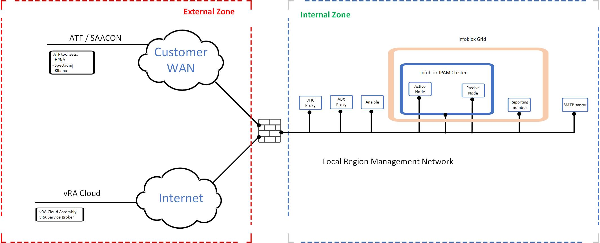
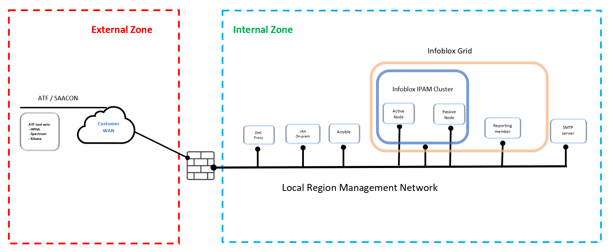
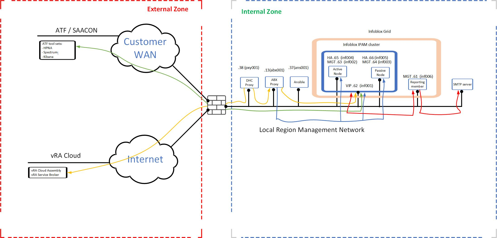
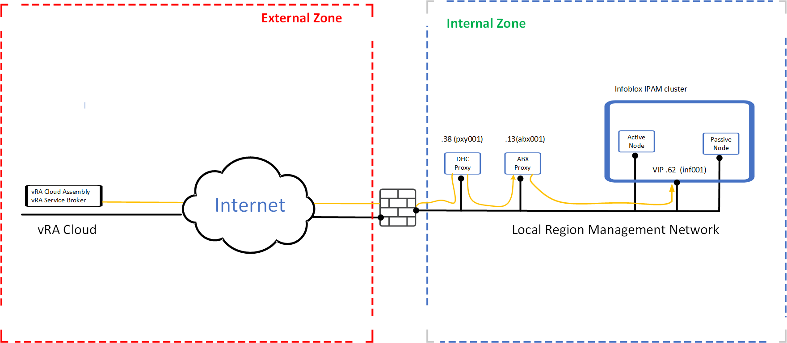
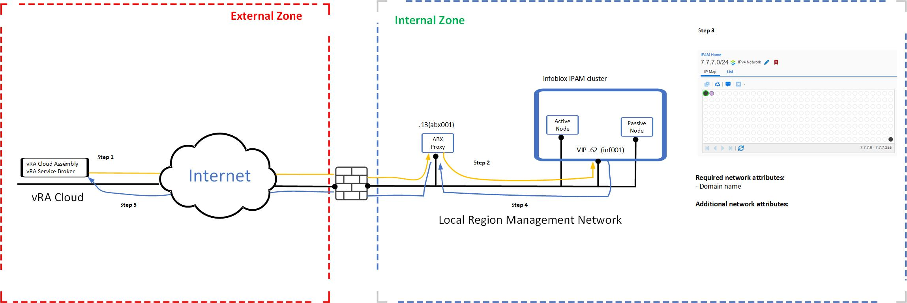
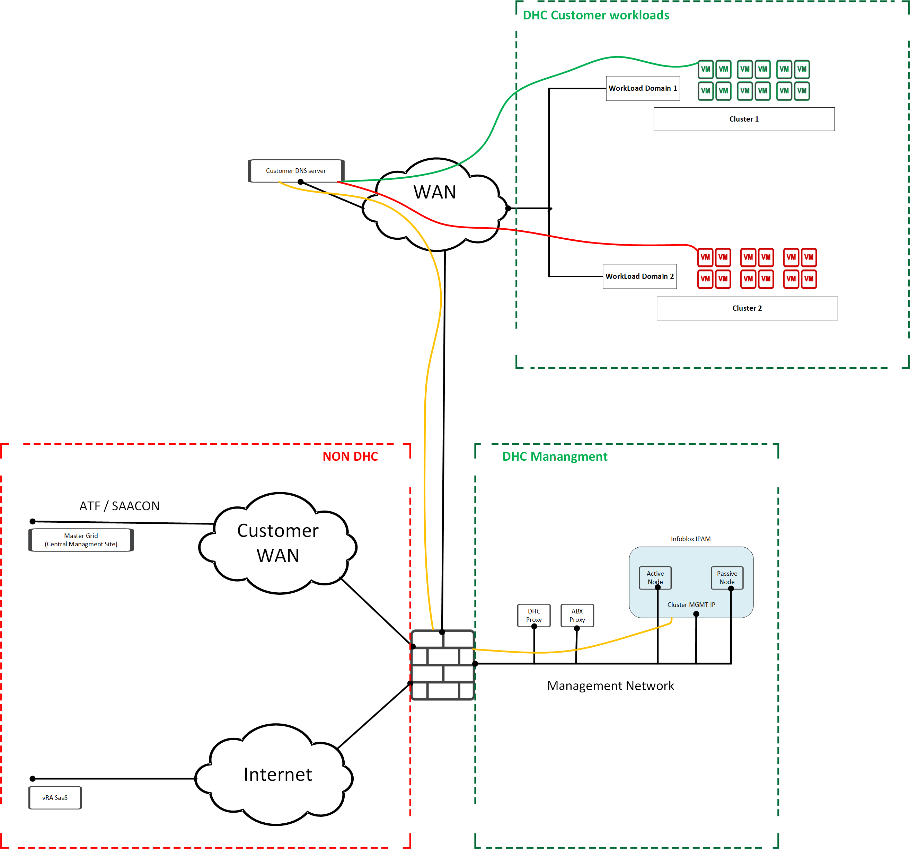
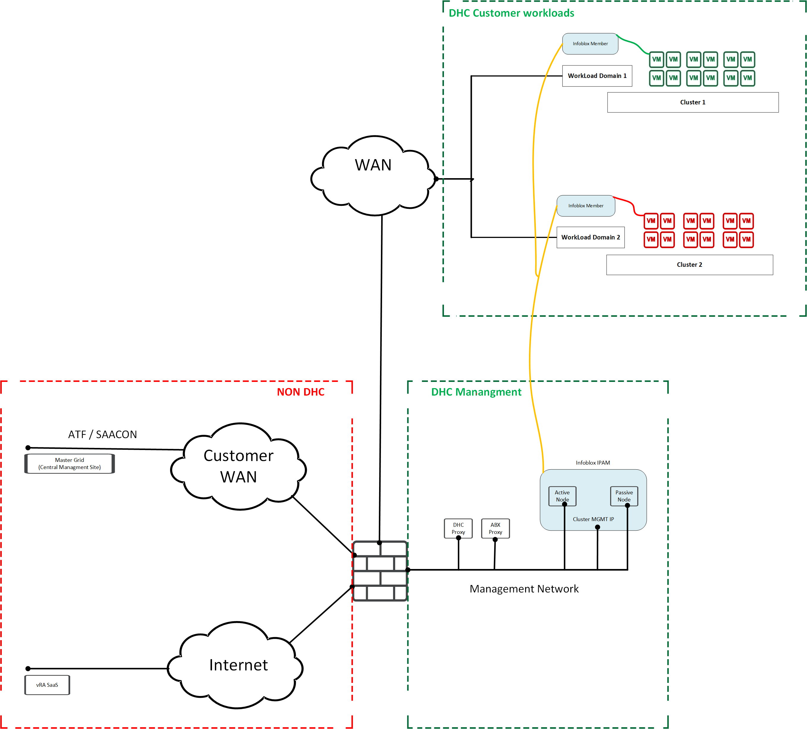
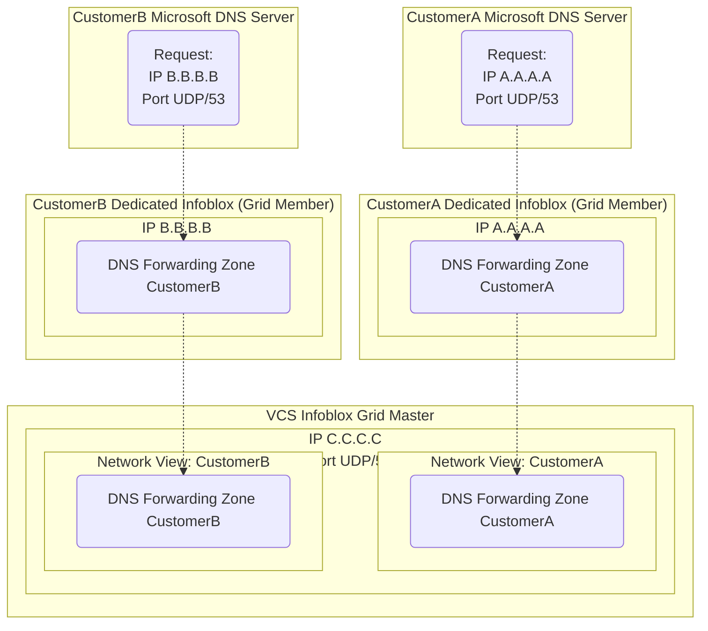

# IPAM LLD

- Table of Contents
{:toc}

## 1 Introduction

## 1.1 Author

### 1.1.1 Inital Document Author

| Author name | Author e-mail | Date |
| :---------: |  :---------: |:----:|
| Michal Pindych | `michal.pindych@atos.net` | 19.12.2019 |

### 1.1.2 Change history

| Author name | Author e-mail | Date | Comments | Version |
| :---------: |  :---------: |:----:|:--------:| :--------:|
|Michal Pindych | `michal.pindych@atos.net` | 19.12.2019 | Initial version  | 0.1 |
|Piotr Lewandowski| `piotr.lewandowski@atos.net` | 03.01.2020 | Initial review and updates | 0.2 |
|Michal Pindych | `michal.pindych@atos.net` | 24.03.2020 | Update and correction of documentation based on the previous review | 0.3 |
|Pawel Zurawski | `pawel.zurawski@atos.net` | 31.07.2020 | Multi-tenant section creation | 0.3 |
|Michal Pindych | `michal.pindych@atos.net` | 04.08.2020 | Update after CO review | 0.4 |
|Michal Pindych | `michal.pindych@atos.net` | 17.06.2021 | Review and update reporting server section  | 0.5 |
|Michal Pindych | `michal.pindych@atos.net` | 22.06.2021 | Updating information about new management network in Local Region   | 0.6 |
|Kathirvel Krishnasamy | `kathirvel.krishnasamy@atos.net` | 12.10.2022 | Updated On-Prem vRA diagram   | 0.7 |

### 1.2 Purpose

The purpose of this document is to provide detailed design and architectural guidance required to implement validated model of a VCS IP Address Management (IPAM) in accordance with Atos standards and portfolio services. The principal aim of this document is to translate the high-level design (HLD) into a technical low-level design (LLD).
Design is providing component architecture overview in Architecture Overview chapter that provides basic building blocks and main principles, followed by Detailed Logical Design and final Detailed Physical Design.
Architecture Overview provides basic building blocks and main design principles of presented design. It is covering known requirements cascaded from HLD and other LLDs.  
Detailed Logical Design presents business logic, relations and fundamental design decisions.  
Detailed Physical Design provides detailed configuration of components including POD type specifics.  

### 1.3 Audience

This document is intended for Atos Cloud Services Engineers and Architects responsible for VMware Cloud Services (VCS) solution implementation and maintenance.

### 1.4 Scope

This LLD is intended to cover below components and domains:

1. IP address management solution presentation based on Infoblox vendor
2. IPAM Infrastructure (including vRA integration)
3. IPAM functionality and management

This LLD is not covering:

1. vRA Cloud Assembly IPAM related configuration  

### 1.5 Related Documents

This document is a subset of Atos Technology Lifecycle Management (ATLM) artefacts. All documents are stored in the VCS documentation repository.

| Document Name              |
| -------------------------- |
| [hldDigitalHybridCloud.md](hldDigitalHybridCloud.md)|
| [lldSoftwareDefinedNetworks.md](lldSoftwareDefinedNetworks.md)|
| [lldCloudAutomationServices.md](lldCloudAutomationServices.md)|

Table 1 ATLM Related Documents

### 1.6 Requirement Levels

This document is following the principles below to categories all requirements and design decisions.

|    Term    | Meaning                                                                                                                                                                                                                                                       |
| :--------: | ------------------------------------------------------------------------------------------------------------------------------------------------------------------------------------------------------------------------------------------------------------- |
|    MUST    | The definition is an absolute requirement of the specification.                                                                                                                                                                                               |
|  MUST NOT  | The definition is an absolute prohibition of the specification                                                                                                                                                                                                |
|   SHOULD   | There may exist valid reasons in particular circumstances to ignore a particular item, but the full implications must be understood and carefully weighed before choosing a different course                                                                  |
| SHOULD NOT | There may exist valid reasons in particular circumstances when the particular behaviour is acceptable or even useful, but the full implications should be understood and the case carefully weighed before implementing any behaviour described with this label |
|    MAY     | Any design decisions that are not classified as MUST and SHOULD or covering optional feature that is not general available for VCS product                                                                                                                    |

## 2 Architecture Overview

Diagram below present desirable IPAM infrastructure for VCS environment (vRA SaaS).

Infoblox architecture in VCS will be based on Virtual Machines deployed inside VCS POD, at least 2 dedicated Virtual Machines will be deployed on each VCS POD.
A number of Infoblox VMs can be higher as Infoblox architecture is scale-out solution and in case of heave greater utilization, additional Virtual Machines will be added to an existing Cluster (or a Grid).
Infoblox IPAM solution will work in the cluster high availability active/passive cluster. Infoblox introduces the concept of Grid - a group of devices that shares the same distributed IPAM, DNS and DHCP database.  In the current deploy, Infoblox Grid consists of 2 virtual appliances in the cluster -  but we can scale this solution be adding more clusters if needed.
vRealize Automation will communicate with Infoblox IPAM VMs to obtain used IP addresses, this connection will use ABX Extensibility Proxy VM and Internet Proxy VM inside VCS infrastructure.

Diagram below present desirable IPAM infrastructure for On-Prem vRA VCS environment. The changes are, ABX proxy removed and deployed vRA in the Internal Zone.

### 2.1 Business and Solution Requirements

The table below provides known requirements mandatory to be incorporated into design decisions of VCS described in this LLD.

|  ID   | Requirement description                                                       | Requirement Source | Requirement Level |
| :---: | ----------------------------------------------------------------------------- | :----------------: | :---------------: |
| R001  | IPAM solution based on Infoblox vendor  |     HLD         |       MUST     |
| R002  | High Availability provided on application level in order to become independent of the platform   |     HLD           |      SHOULD         |
| R003  | Uninterrupted solution operation in case of ATF access lost   |     {HLD/other LLD/other}            |          MUST        |
| R004  | Scalability and extensibility of solution, the possibility of adding new functions and expand infrastructure without any additional cost related (Ipam utility model license)  |     {HLD/other LLD/other}            |       MUST      |
| R005  | Integration with vRealize Automation through the  ABX Extensibility proxy.   |     HLD            |       MUST      |

Table 2 Initial Requirements

## 3 Detailed Logical Design

### 3.1 Infoblox infrastructure

Infoblox IPAM infrastructure consists of the following building blocks described below ( presented also on architecture overview diagram in section 2 )

- **Infoblox cluster** - Infoblox HA pair in VCS environment
- **Grid**  - All Infoblox components located in VCS (Infoblox central cluster and members )
- **Infoblox Reporting Server**  - All Infoblox components located in VCS (Infoblox central cluster and members )
- **vRA SaaS** - VMware Realize Automation implemented as Software as a Service
- **ABX Extensibility Proxy** - provide communication between vRA and IPAM
- **VCS Internet Proxy** - Squid proxy for VCS internal networks
- **Ansible server** - automation server

- **Infoblox IPAM cluster**  

*Infoblox cluster* - provides IP address management (optionally  DNS ) functionality in VCS environment for customers workloads. IPAM database is consumed by vRealize Automation during the virtual machines provisioning/de-provisioning process.

Below mechanisms can be used  to scale up the solution if needed:

- Increase memory and CPU for virtual appliances (recommended to scale up vm)
- Add a new device to Infoblox Grid  (recommended for new functionalities - for example, DNS)
- Increase the number of existing nodes in the cluster (not supported by automation at this moment)

*Infoblox High Availability* - HA provides redundancy for core network services in an active/passive scenario. The active node receives, processes, and responds to all service requests.
The passive node constantly keeps its database synchronized with that of the active node, so it can take over services if a failover occurs.
Specific anti-affinity rules should be implemented in order to avoid a situation where both nodes will reside on the same resource.

| IP address (Local Region)         | DNS Name                       | Node                   | Description |
| ----------------------------------| -----------------------------  | -----------------------| ---- |
| X.Y.Z.**62**                          | inf001                         | Active (Cluster IP)    | The cluster IP address used to manage the device (HTTPS and SSH) and support API calls      |
| X.Y.Z.**63**                          | inf002                         | Active                 | Management IP providing SSH connection for Active Node      |
| X.Y.Z.**64**                          | inf003                         | Passive                | Management IP providing SSH connection for Passive Node     |
| X.Y.Z.**65**                          | inf004                         | Active                 | High Availability IP used by Active Node         |
| X.Y.Z.**66**                          | inf005                         | Passive                | High Availability IP used by Passive Node        |

- **Grid** -  The Grid architecture provides a highly scalable, reliable, and fault-tolerant solution unique to Infoblox. At the heart of the Grid architecture is the Grid Master, an Infoblox appliance that holds and maintains the central database of the Grid. The Grid Master pushes global configuration data and needed information out to Grid Members,monitors member operations, synchronizes member changes back into the central database, and distributes updates. A key function of the Grid Master is the prevention—through an interconnected chain of failovers—of a single point of failure. The Grid Master is commonly deployed as a high-availability (HA) pair. If one of the pair fails, the HA-paired device automatically takes over. If a catastrophic failure wipes out the pair, a Grid Master candidate in a disaster-recovery location replaces it with a single click and syncs up with the remaining Grid members. If a link between a Grid member and a Grid Master fails, all the data at the Grid member is queued until the connection is restored, and then the data is synced to the Grid Master.

- **Infoblox Reporting Server**
to be updated

- **vRA SaaS**

vRealize Automation -   cloud automation tool and management platform provided in Software as a Service model.
vRA is multi-cloud provisioning service. For VMware SDDC-based virtual infrastructure, it offers the ability to create a private cloud.
The user can create provider constructs such as cloud zones that provide compute, storage, network, load balancing and security services for a specific set of purposes.
These zones can cover different compliance and security needs, provide location or workload segregation and be used for multi-tenancy. These constructs also map to equivalent constructs on public clouds.

- **ABX Extensibility Proxy**

Action-based extensibility provides a lightweight and flexible run-time engine interface where you can define small scriptable actions and configure them to initiate on particular events provided by the Event Broker Service (EBS). Similarly to workflows, the extensibility action script triggers when an event included in an extensibility subscription occurs. Extensibility action scripts are used for more lightweight and simple automation of tasks and steps. They are also hosted on the cloud as opposed workflows which are hosted on-premises by using a vRealize Orchestrator server.

- **VCS Internet Proxy**

Internet proxy used to provide access to Internet for servers located in local VCS networks (management, local region, cross region, etc). Traffic is limited only to resources specified in white list.

- **Ansible server**

This server provides ansible playbooks used to deploy Infoblox IPAM infrastructure.

#### 3.1.1 Infoblox traffic flows

Please refer to below diagram which represent traffic flows for Infoblox IPAM infrastructure.  

Notes:
> It is important to emphasize that all vRA traffic is initialized from the VCS environment. To put it in another way every time vRA needs to communicate with a given
> component inside of VCS, we are using pre-established sessions from the VCS environment. For On-Prem vRA, Refer the Section 2.Architecture Overview diagram where ABX proxy removed and deployed vRA in the Internal Zone.

| Service/Traffic Name                               | Source                     | Destination                    | Port(s) | Protocol |
| -------------------------------------------------- | -------------------------- | ------------------------------ | ------- | -------- |
| **Traffic between IPAM and Management Netowrk**    |                            |                                |         |          |
| *Ansible API access to Infoblox*                   | Ansible server             | Infoblox IPAM cluster          | PING    | ICMP     |
|                                                    |                            | Infoblox IPAM Active Node      | 443     | HTTPS    |
|                                                    |                            | Infoblox IPAM Passive Node     |         |          |
| *Infoblox HA traffic*                              | Infoblox IPAM Active Node  | Infoblox IPAM Passive Node     | ALL     | TCP/UDP  |
|                                                    | Infoblox IPAM Passive Node | Infoblox IPAM Active Node      |         |          |
| *Infoblox management access from TS*               | TS server                  | Infoblox IPAM cluster          | PING    | ICMP     |
|                                                    |                            | Infoblox IPAM Active Node      | 22      | SSH      |
|                                                    |                            | Infoblox IPAM Passive Node     | 443     | HTTPS    |
| **Traffic between Infoblox/ABX proxy to Internet** |                            |                                |         |          |
| *ABX Proxy to Infoblox IPAM*                       | ABX Extensibility Proxy    | Infoblox IPAM cluster          | 443     | HTTPS    |
|                                                    |                            |                                | PING    | ICMP     |
| *ABX Proxy to VCS Internet proxy*                  | ABX Extensibility Proxy    | VCS Internet Proxy             | 3128    | HTTPS    |
|                                                    |                            |                                | PING    | ICMP     |

#### 3.1.2 Virtual appliance requirements

All requirements for IPAM meets this specific virtual appliance provided by Infoblox vendor.

| Virtual Appliances                | Overall Disk (GB)              | # of CPU Cores | Memory | CPU | Supported as Grid Master |
| ----------------------------------| -----------------------------  | ---------------| ----   | --- | -------------------------|
| IB-V1425                          | 250                            | 4              | 32 GB  |  1800 MHz   |  Yes             |

It is required to use IB-V1425 virtual appliance in order to support Master Grid functionality but most of the time memory utilization will be significantly lower in the VCS environment - that is why during the deploy we provide only 4GB of memory. If necessary, this value should be increased to ensure sufficient resources for the virtual machine.

#### 3.1.3 Integration with vRA

Integration with vRA is realized through Action Based Extensibility Proxy - Function as a Service capability.
ABX is VMware’s serverless function capability built into Cloud Assembly which allow bring serverless capabilities on-premise.
In order to run ABX functions on-premise you will need to download and install the new ABX appliance. This is a small Photon based appliance which hosts the services which execute the functions you run as a part of your deployment extensibility.

Note:
> For On-Prem vRA, Refer the Section 2.Architecture Overview diagram where ABX proxy removed and deployed vRA in the Internal Zone.

### 3.2 Infoblox functions

#### 3.2.1 Ipam

With Infoblox IPAM  we can automate and centralize all aspects of IP address provisioning and  DHCP attributes management in conjunction with DNS. Infoblox IPAM provides to vRA elastic, consistent and scalable mechanism which provides the required information for newly created virtual machines.

Process of provisioning IP information to the newly created virtual machine we can divide into these steps:

- **Step 1:** Every time there is a need for a new IP address  from a specific customer network vRA communicate with local VCS ABX Extensibility proxy
- **Step 2:** Request is processed by ABX Extensibility proxy and appropriate API call is sent directly to Infoblox cluster
- **Step 3:** Infoblox is checking if there is any free IP for a given range and if any additional attributes are configured for a specific network ( routers, domain name, DNS servers or any custom DHCP options)
- **Step 4:** Infoblox responds to API call with required information back to ABX proxy
- **Step 5:**  ABX proxy forward response to the vRA

Note:
> For On-Prem vRA, Refer the Section 2.Architecture Overview diagram where ABX proxy removed and deployed vRA in the Internal Zone.

#### 3.2.2 Dns

In VCS environment every time the virtual machine is provisioned in vRA Cloud - appropriate DNS entry is created in IPAM. Therefore Infoblox provides one consistent database of all DNS entries for all resources. From a design perspective, we have many options to provide DNS service for the customer, below we described the developed solutions:

##### **VCS integration with customer DNS infrastructure**

VM's DNS server: pointed to customer DNS  
Infoblox zone transfer: to customer DNS  

| Service/Traffic Name                                  | Source                          | Destination                   | Port(s) | Protocol      |
| ----------------------------------------------------- | -----------------------------   | ----------------------------- | ------- | ------------- |
| **Traffic between Central Infoblox and Customer DNS** |                                 |                               |         |               |
| Infoblox Grid to Customer DNS                         | Infoblox Grid                   | Customer DNS                  | 53      | TCP/UDP - DNS |
| Customer DNS  to Infoblox Grid                        | Customer DNS                    | Infoblox Grid                 | 53      | TCP/UDP - DNS |
| **Traffic from customers VM's to DNS**                |                                 |                               |         |               |
| Customers VM's to DNS                                 | Customers VMs                   | Customer DNS server           | 53      | TCP/UDP - DNS |

##### **VCS independent from customer DNS infrastructure**

VM's DNS server: pointed to local DNS (for example Infoblox)  
Infoblox zone transfer: to local DNS  

| Service/Traffic Name                             | Source                          | Destination                   | Port(s) | Protocol         |
| -------------------------------------------      | -----------------------------   | ----------------------------- | ------- | ---------------- |
| **Traffic between Central Infoblox and members** |                                 |                               |         |                  |
| Infoblox Grid to Members                         | Infoblox Grid Master            |  Infoblox Members             |  443    | HTTPS            |
|                                                  |                                 |                               |  1194   | UDP - VPN port 1 |
|                                                  |                                 |                               |  2114   | UDP - VPN port 2 |
| Members to Infoblox Grid                         | Infoblox Members                |  Infoblox Grid Master         |  443    | HTTPS            |
|                                                  |                                 |                               |  1194   | UDP - VPN port 1 |
|                                                  |                                 |                               |  2114   | UDP - VPN port 2 |
| **Traffic from customers VM's to DNS**           |                                 |                               |         |                  |
| Customers VM's to DNS                            |  Customers VM's                 |  Infoblox Member              |   53    | TCP/UDP - DNS    |

Please refer to related work instruction which describes DNS configuration and integration with the customer environment -  **dhcDeployDns**

Notes:  
> During the customer network creation (as a second-day activity) we must specify DNS zone configured for this network.  Please refer to chapter  - 3.1 Infoblox infrastructure  
> Infoblox has the role of the master DNS server ( authoritative server for all zones ) and the role of the secondary DNS server has been assigned to an external entity.  The secondary external DNS server has a read-only database of authoritative zones from Infoblox,  also it is worth mentioning that only secondary DNS can initiate a connection to master DNS ( this can be a problem with multi-tenant configuration). For On-Prem vRA, Refer the Section 2.Architecture Overview diagram where ABX proxy removed and deployed vRA in the Internal Zone.

#### 3.2.3 Dhcp

Infoblox can support the following DHCP options:

| IPv4 DHCP option                  | Description                    |
| ----------------------------------| ------------------------------ |
| Routers                           | IP address of default gateway  |
| Domain Name                       | Customer specific domain name  |
| DNS Server                        | IP addresses of customer specific DNS servers |
| Custom DHCP Options               | DHCP options sets supported by Infoblox (please refer to related documentation) |

It is important to note that there is no need to set up a DHCP server from Infoblox perspective, all DHCP information can be added to the network during its definition.
If the network will be updated by DHCP options configuration - appropriate information would be propagated to provision given virtual machine.

#### 3.2.4 IP addresses utilization reporting

As a prerequisite to use Infoblox "utility model" license - an additional component should be deployed in the VCS management network called  Reporting server. There is a mandatory monthly active IP address utilization report which should be generated and provided to the DDI team ("Managed DDI IP Peak Usage Trend").

### 3.3 Infoblox management

#### 3.3.1 Backup

Backup for IPAM infrastructure is realized by 2 different mechanisms which provide robust solution for storing a copy of Infoblox configuration and database data both in CEB and in SFTP server.

**Avamar** - this type of backup is performed by CEB team on a daily basis for the Infoblox appliance and includes all settings for the virtual machine.

[Backup Design LLD](lldBackup.md)

**SFTP server** -

| Backup type | Full backup                       | Backup location | Frequency | Restore | Responsibility |
| :----------:| :-------------------------------: |:---------------:|:---------:|:-------:|:--------------:|
| Avamar      | yes (configuration and database ) | CEB network     | daily     | manual  | CEB team       |
| SFTP        | yes (configuration and database ) |                 |           |         |                |

Notes:  
Please note that Infoblox virtual appliances are not in scope of standard backup and recovery ATF2.0  
Infoblox High Availability active/passive mechanism provides automated backup recovery after one node failure.

#### 3.3.2 Monitoring

**Infoblox services monitoring**

Monitoring of Infoblox servers is managed by GDTS team and realized via ATF Spectrum  tool. The Self Monitoring of Infoblox appliances are handled by both SNMP polling and Traps.
The appliances are automatically added to Spectrum monitoring once the Spectrum alerting is Selected on the ServiceNow CMDB import process.

Spectrum Alerting is handled by the list of events that has been already Certified by GDTS team.
Below link has the list of Certified Event List. Traps which match the criteria on the list  will be alerted on priority designated on the matrix.

[NDCS Documentation Certified Monitoring Events](https://sp2013.myatos.net/ms/gd/gdts/ATF/NDCS/Shared%20Documents/Monitoring%20Tools/Certified_Monitoring_Events.xlsx)

| AlarmClass          | Alarm Title                                 | Event-Type | SNMP-TRAP-OID                | Detail |
| :-----------------: |  :----------------------------------------: |:----------:|:----------------------------:|:------------:|
| HARDWARE_FAILURE    | IB EQUIPMENT FAILURE (HARDWARE_FAILURE)     |PERFORMANCE |1.3.6.1.4.1.7779.3.1.1.1.1.6.1|Equipment failure|
| PROCESS_FAILURE     | IB PROCESSING FAILURE (PROCESS_FAILURE)     |PERFORMANCE |1.3.6.1.4.1.7779.3.1.1.1.1.6.2|Software failure is detected.|
| TIME_OVER_THRESHOLD | IB THRESHOLD CROSSING (TIME_OVER_THRESHOLD) |PERFORMANCE |1.3.6.1.4.1.7779.3.1.1.1.1.6.3|Threshold crossing has occurred for the first time|

**Infoblox VM monitoring**

As there is no possibility to use vROps Endpoint Operations Manager agent to monitor IPAM solution - only standard alerts from vCenter will be generated for Infoblox VM.  
Please refer to dedicated Monitoring LLD:

- [VCS Monitoring Design LLD](lldMonitoringLogging.md)

#### 3.3.3 Reporting

Reporting functionality is provided by DDI team and described in related documentation:

- Operational Level Agreement
- Global DDI Service Onboarding Guide

#### 3.3.4 Life cycle management

Life cycle management functionality is provided by DDI team and described in related documentation:

- Operational Level Agreement
- Global DDI Service Onboarding Guide

#### 3.3.5 Role-based access control

Role-based access control for Infoblox has been implemented in this way that every user who belongs to the role "**role-< customerCode >-g-platformadministrators**" has read-only access.  
It is important to note that Infoblox doesn't support nested AD groups - that is why we don't use a specific resource group but role - this is an exception that we must be considered.

### 3.4 Multi-tenant

Multi-tenant design must allow to creation overlapping IPAM and DNS  pools for different Customers. To allow it, "Network Views" function will be used.  
Each Customer IPAM/DNS database will be configured under dedicated Network View, that will allow overlapping pools, that is especially important for IPAM pool, as IP addresses can overlap in different Customers.

No other changes for design required, to achieve Multi-tenant design.

#### 3.4.1 Network View

Each Customer will be configured under dedicated Network View. With relation one Customer to one Network View.  
Network Views will allow of logical separation between pools configured for different Customers, allowing overlapping of IP addresses and DNS names.

Using Network Views implications:

**Scenario 1**

- Not recommended option
- Infoblox implementation: one central Infoblox in management network
- Active Directory DNS support: lack of support

In Scenario 1 VCS provides DNS authoritative server with forwarding zone configured on it. Clients VM do not have access to that server, instead using zone transfer all records for particular zone replicated to secondary zone server that serves Clients request. What is important that zone transfer is periodically initiated by secondary server that sends DNS SOA query to obtain changes in forwarding zone. Primary server is specified by IP address only and optionally TSIG key. TSIG is not supported by Microsoft DNS servers, only by Bind servers. As such it is not possible to use DNS Views if Zone Transfer is configured.  
As the Forwarding zone is a "name to IP" mapping, it is identified by the zone name (domain name) therefore the zone name needs to be unique. The IP addresses used in 'A' records can overlap with a different zone. In order to have two zones with the same name, DNS Views need to be configured.  
As the Reverse zone is an "IP to name" mapping, it is identified by the IP addresses, and as such it is not possible to request have overlapping IP addresses in a single DNS View. To have Reverse Zones answering PTR queries for two or more Customers with overlapping IP address spaces, DNS Views are needed.

**Scenario 2**

- Recommended option
- Infoblox implementation: one central Infoblox in management network and dedicated Infoblox members for every customer
- Active Directory DNS support: supported

In Scenario 2 Each Customer will have dedicated pair of Infoblox Members that will serve as DNS servers, allowing name resolution inside VCS POD.  
Also it is possible to perform Zone Transfer between Infoblox Member and External DNS server that is not supporting TSIG keys.  
Only limitation is that Infoblox Member can response only to DNS zones configured under single Network View.

Document side notes:

1. As it seems that we don't generate SNMP trap when IP pool is full, we need to provide reports with corresponding data about IP pool usage
2. VM monitoring for vendor-specific OS - CPU/MEMORY from vCenter ( should be described in LLD vROPS and LLD LogInsight), if we want to use vROps monitoring we need to install EPOps agent - not case for Infoblox
