# Infrastructure LLD

## Changelog

| Date       | Author              |  Description                                                                     |
|------------|---------------------|----------------------------------------------------------------------------------|
| 13.07.2020 | Łukasz Stasiak      | Updated Tenancy and Multi-tenancy chapters                                       |
| 30.10.2020 | Maciej Losek        | Doc updated to be allign with VCF 4.0                                            |
| 10.12.2020 | Pawel Zurawski      | Added Time Synchronization information                                           |
| 14.12.2020 | Tomasz Korniluk     | Updates based on ToS 1.2 review findings from Marcin Kujawski (DHC-1020)         |
| 15.12.2020 | Maciej Losek        | Updates based on ToS 1.2 review findings from Cezary Dwojak (DHC-1020)           |
| 31.12.2020 | Pawel Zurawski      | Updated Time Synchronization information                                         |
| 10.02.2021 | Alec Dunn           | 1St pass Audit for 1.3  Changes to Min spec areas, and structure of doc          |
| 10.02.2021 | Alec Dunn           | Removed major issues with 'imported from Word' formatting                        |
| 15.02.2021 | Alec Dunn           | Continued review and removed HW sizing and "sizes" Moved to BoM                  |
| 15.02.2021 | Alec Dunn           | FLAG to review Region and AZ statements against implemented multi tenancy design |
| 15.02.2021 | Alec Dunn           | Replaced references to other docs with links/relative links                      |
| 15.02.2021 | Alec Dunn           | total 600+ lines removed by formatting or duplication. Ready for Peer Review     |
| 22.02.2021 | Alec Dunn           | Edited based on 1st part of Oliver Scholle Feedback                              |
| 23.02.2021 | Alec Dunn           | Moved SQUID config settings to Monitoring LLD (Squid section)                    |
| 23.02.2021 | Alec Dunn           | edited based on Olivers 2nd set of feedback (Various typos and clarifications)   |
| 04.03.2021 | Pawel Zurawski      | updated vSAN Witness sizes                                                       |
| 08.03.2021 | Alec Dunn           | Corrected vROPS (DPC ref) Removed POD References. Updated MGMT Diagram           |
| 16.04.2021 | Alec Dunn           | Removed References to Additional WL domains (as no longer in design)             |
| 16.04.2021 | Alec Dunn           | altered links to be relative vs absolute                                         |
| 26.04.2021 | Marcin Kujawski     | Update document for TOS 1.3                                                      |
| 01.06.2021 | Piotr Gesikowski    | Updated for TOS 1.3 (info on multiple clusters in single WLD, fixed typos)       |
| 05.10.2021 | Marcin Kujawski     | Update multi-tenancy related chapters                                            |
| 21.06.2022 | Lukasz Tomaszewski  | VM Restart Priority list updated                                                 |
| 11.07.2022 | Lukasz Tomaszewski  | CESDHC-484 Active-Active VM Placement list updated                               |
| 28.07.2022 | Marcin Gala         | CESDHC-585 Added info about AV ports required - new AV console deployed in ASN   |
| 27.09.2022 | Adam Wieczorek      | CESDHC-4164 Added information regarding VMFS on FC storage                       |
| 14.12.2022 | Michał Sobieraj     | CESDHC-4949 Added information regarding EVC Mode                                 |
| 03.03.2023 | Arun Sompura        | CESDHC-5876 Added information regarding additional VI Workload Domain            |
| 27.07.2023 | Alec Dunn           | Added Design decision DPD018 on Host power setting default                       |
| 09.02.2024 | Adam Wieczorek      | VCS-12032 Replacing CloudLink KMS with Native Key Provider in vSAN encryption    |
| 12.03.2024 | Marcin Kuajwski     | VCS-12193 DHC modularization changes                                             |
| 08.03.2024 | Kanchan Pardeshi    | Update CPU oversubscription ratio                                                |
| 12.03.2024 | Marcin Kuajwski     | VCS-12193 VCS modularization changes                                             |
| 28.02.2025 | Mariusz Stanek      | VCS-15268 document adapted to VCS-2.0                                            |
| 22.04.2025 | Alec Dunn           | Bug fixed a few errors in doc about "future" features that are now reeality      |
| 31.07.2025 | Rachel Beulah       | VCS-15875 vIDM integration for customer landing page and SSO                     |
| 18.09.2025 | Stanislaw Kilanowski| VCS-16216 Updated diagram in the Proxy High Availability section                 |
| 05.03.2026 | Radoslaw Dabrowski  | VCS-17865 Added Witness Traffic Resilience section for stretched clusters        |
| 16.03.2026 | Radoslaw Dabrowski  | VCS-17858 Added VMware Preferred Fault Domain configuration details              |

## Introduction

### Purpose

The purpose of this document is to provide detailed design and architectural guidance required to implement validated model of the VCS base virtualization and Management components in accordance with Atos standards and portfolio services. The principal aim is to translate the high-level design (HLD) into a technical low-level design (LLD). This will provide an architectural overview of base virtualisation components (building blocks, principals etc.) and detailed known requirements and restrictions cascaded from the HLD  and relevant to this design.  Additionally, a detailed logical design is provided to show business relationships and logical flow. A Physical design is presented to show configuration of VCS PoD components.

### Audience

This document is intended for Atos Cloud Services Engineers and Architects responsible for VMware Cloud Services (VCS) solution implementation and maintenance.

### Scope

The following is **in scope** of this document:

- The VCS Management infrastructure
  1. Hardware make up and requirements
  2. Software make up and requirements

- VMware Cloud Foundation
  1. Design and architecture

The following is **out of scope** of this document:

1. Hardware and software BoM: Please see [hldDigitalHybridCloudBOM.md](hldDigitalHybridCloudBOM.md)
2. Customer specific configuration (Solution dependent)
3. Networking: Physical, see NDCS. Virtual see [lldSoftwareDefinedNetworks.md](lldSoftwareDefinedNetworks.md)
4. Detailed automation design
5. SaaS service offerings
6. CMP 2.0 integration
7. ITSM integration (of any kind)
8. Hardware utility configuration for out of band/management purposes (e.g. Dell iDRAC, Bull BMC)
9. Specification for customer workload clusters (customer requirement dependent)

The document is split in to two sections. The first detailing the VCS Management structure and the second detailing the configuration of the VMware Cloud Foundation elements.

### Related Documents

This document is a subset of Atos Technology Lifecycle Management (ATLM) artefacts.

##### Table 1. ATLM Related Documents

| File Name                         | Document Name                                                                |
|-----------------------------------|------------------------------------------------------------------------------|
| VCS High-Level Design             | [VMware Cloud Services: High Level Design](hldDigitalHybridCloud.md)          |
| VCS SoftwareDefinedNetworks LLD   | [Software Defined Network: Low Level Design](lldSoftwareDefinedNetworks.md)  |
| VCS Cloud Automation Services LLD | [Cloud Automation Services: Low Level Design](lldCloudAutomationServices.md) |
| VCS Monitoring LLD                | [Monitoring & Logging: Low level Design](lldMonitoringLogging.md)            |
| VCS Backup LLD                    | [Backup: Low Level Design](lldBackup.md)                                     |
| VCS DR LLD                        | [Disaster Recovery: Low Level Design](lldDisasterRecovery.md)                |
| VCS Naming Convention             | [Naming Convention: Low Level Design](namingConvention.md)                   |

### Requirement Levels

This document is following the principles below to categories all requirements  and design decisions.

| **Term**   | **Meaning**                                                                                                                                                              |
|------------|--------------------------------------------------------------------------------------------------------------------------------------------------------------------------|
| MUST       | The definition is an absolute requirement of the specification.                                                                                                          |
| MUST NOT   | The definition is an absolute prohibition of the specification.                                                                                                          |
| SHOULD     | There may exist valid reasons to ignore a particular item. The full implications must be understood before choosing a different course.                                  |
| SHOULD NOT | There may exist valid reasons when the particular behaviour is acceptable/useful. The full implications should be understood before implementing any behaviour described |
| MAY        | Any design decisions that are not classified as MUST and SHOULD or covering optional feature that is not general available for VCS product                               |

# Architecture Overview

The diagram below highlights the areas of the VCS architecture in scope of this LLD.

##### Figure 1. VCS Architecture Overview

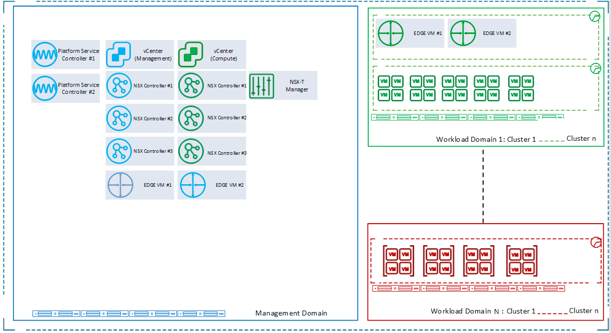

Above figure is showing architecture and placement of core VMware Cloud Foundation components within VCS.

## Business and Solution Requirements

Below table provides known requirements mandatory to be incorporated into design decisions of the VCS Management and Base Virtualization design described in this LLD.

##### Table 2. Initial Requirements

| **ID** | **Requirement description**                                                                                                                                                                                                                                        | **Source**      | **Level** |
|--------|--------------------------------------------------------------------------------------------------------------------------------------------------------------------------------------------------------------------------------------------------------------------|-----------------|-----------|
| R001   | VCS requires hardware hosts to be vSAN ready nodes.                                                                                                                                                                                                                | HLD             | MUST      |
| R002   | The underlying platform should follow vendor standards and roadmap for enhanced LCM and ease of setup                                                                                                                                                              | Portfolio       | SHOULD    |
| R003   | Setup and configuration of VCS management and base Virtualization will be automated and kept under version control                                                                                                                                                 | Atos Management | SHOULD    |
| R004   | The Management stack will be patched regularly in line with vendor recommendations                                                                                                                                                                                 | HLD             | MUST      |
| R005   | The VCS Will have the ability to provision multiple Workload Domains for Differing functions separate to the management hardware also, The VCS Will have the ability to provision multiple clusters for differing performance separate to the management hardware. | HLD/Portfolio   | MUST      |
| R006   | VCS runs on Software Defined Networking throughout the stack                                                                                                                                                                                                       | HLD             | MUST      |
| R007   | VCS Management should be resilient to hardware failure by design                                                                                                                                                                                                   | HLD / Portfolio | MUST      |
| R008   | VCS must be installable in a wide range of vendor hardware / be relatively vendor agnostic.                                                                                                                                                                        | Portfolio       | MUST      |
| R009   | The Virtualization solution must be capable of providing virtualization services and virtual machines to the agreed service levels and specifications                                                                                                              | Portfolio       | MUST      |

## Tenancy

VCS, by design, can either be:

- A single tenant, project separated capable solution. It accommodates single tenant organization and has ability to multi-tenant extension.
- A multi-tenant, tenant separated capable solution. It accommodates multiple tenant organizations that share the same physical resources.
A single Customer who ‘owns’ the VCS instance can have many tenants below them separated as different entities with the appropriate security controls enabled to prevent cross tenant access.  

##### Figure 2. VCS Tenancy Overview

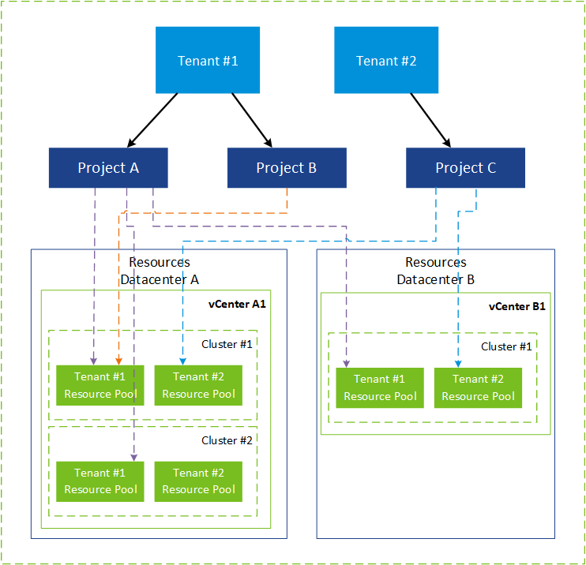

A multi-tenant solution will be owned by a single (parent) entity (VMware Cloud Partner Navigator) and will allow to accommodate multiple customers (as separated Tenants) that share the same physical/virtual resources within the same VCS instance.

Architecture of Tenancy is based on one Provider Organization that will manage underlying resources including Provider Organization and Customer Tenant Organization that will consume assigned assets.


### Multi-tenancy cost factors components

|      Component      | Name   |        Single tenant         |              Multi tenant               |                                                                                                                                                Description                                                                                                                                                 |
|-------------------|--------|----------------------------|---------------------------------------|----------------------------------------------------------------------------------------------------------------------------------------------------------------------------------------------------------------------------------------------------------------------------------------------------------|
| Infoblox Satellite  | infXXX |    One Satellite Infoblox    | Dedicated Satellite Infoblox per tenant | Satellite Infobloxes will be used to provide DNS functionality to the customer WLD. This is optional and applicable only once DNS function for tenant is a design choice. There is a possibility to transfer DNS zones to external hosts. No need for additional license as Infoblox utility model is used |

## Management Platform Requirements

This section describes the basic hardware requirements that need to be fulfilled in order for a VCS to be installed and configured.

### Overview

VCS is designed to be scalable from small (150+ VM) to very large (\>50,000 VM) deployments. It will be built upon a standardized HyperConverged hardware platform. The product does **not** support non-HyperConverged style hardware such as Vblock (Converged) or commodity hardware + stand alone SAN type setups.

A key requirement of VCS is one of flexibility with regards to hardware vendor yet a standardized set of HW features that enable full stack automation for deployment, configuration and lifecycle. Therefore, the following hardware related design decisions have been made.

| **ID** | **Design Decision**                             | **Design Justification**                                                        | **Design Implication**                                                   |
|--------|-------------------------------------------------|---------------------------------------------------------------------------------|--------------------------------------------------------------------------|
| D001   | VCS will VCF as it's IaaS Base                  | VCF is VMware's standard platform, supported, modern, up to date, feature rich. | Has specific requirements at HW level                                    |
| D002   | VCS will use vSAN ready node certified HW       | Ensures standards, requirement of VCF, allows commodity HW use                  | precludes use of Converged HW                                            |
| D003   | Architecture shall follow VCF+VVD best Practice | Allows easier upgrades, VMware validated design cuts out work.                  | Design is less flexible to customisations                                |
| D004   | ALL flash vSAN will be the default standard     | Flexible, fast, secure, long life, no bottlenecks                               | Requirement of more minimum nodes (Hybrid allowed for MGMT by exception) |
| D005   | VCS MGMT is the central product MGMT pane       | centralized logging, monitoring and administration                              | No RoBo capability in this version                                       |
| D007   | LCM will follow VMware release Schedule N-1     | Keep Up to date with patch and feature releases whilst staying bug free/mature  | Requires robust LCM process for rapid rollout of 4+ updates per year     |
| D008   | All storage  shall be software defined.         | Reduces integration work, standardizes automation and capability                | Limited storage functionality to that provided by vSAN                   |
| D009   | All internal networking shall be based on NSX-T | Modern, software defined                                                        | Limited by NSX-T feature set                                             |

### Hardware Sizing

VCS is designed to be scalable to enable usage within a large range of customers. It has the ability to scale up and out as required if a customer grows beyond the initially expected load. For that reason, there is now "cookie cutter" hardware makeup or design  for a VCS system.  The BoM contains guidelines on some general purpose HW building blocks but it is intended for each customer implementation to be sized according to its requirements.  A VCS with a management cluster specified at the size in the BoM should be viable for all customers up to at least 5 sites and 3500 VMs.

### Hardware Building Block Minimum Specifications

VCS is built and scaled using standard building blocks for the initial management cluster. These are VCF capable vSAN ready nodes that adhere to a minimum specification. Detailed information on the makeup of the blocks and guidance on sizing is found in the [VCS Bill Of Materials](hldDigitalHybridCloudBOM.md)

## Sizing Workload Domains: CPU, Memory and Storage Considerations

VCS has the following guidelines that should be taken in to account when sizing  the hardware for a customer workload domain.

### CPU Over commit

VCS is designed around a standard VM pCPU to vCPU over-commit ratio of 4:1 for all the performance tuned applications (Databases, Web servers, analytics etc.)

### Memory Over-commit

**NO** over allocation of memory is allowed.  All Workload VMs should be allocated RAM to vRAM in a 1:1 ratio.  This is due to the severe performance penalties incurred when memory runs out in a virtualised environment.

### Storage Space

VCS performance guarantees and SLAs are built around the vSAN storage always having 20-25% free space "slack space" (from VCS 1.3/ vSAN 7.0U1) available to allow re-balancing and other housekeeping to occur. All VMs are, by default set to be thin provisioned and the standard "Failure to Tolerate" value for VCS is FTT=1 regardless of vSAN configuration (Hybrid or Flash). IF FTT=2 or greater is required then VCS should be configured as an all-flash storage option with Raid 5/6 + erasure coding enabled.  Systems configured in R5/^ AFA mode benefit from de-duplication and compression within vSAN (rate dependent on VM load and make up)

### Hardware patching

It is required that all the hardware supporting VCS platform is running on supported and patched firmware. Firmware upgrades of the networking equipment is out of scope of this document. The following are in scope:

- Physical host BIOS
- Physical host Lifecycle controller
- Network Interfaces of the physical host
- Storage controller of the physical host
- Cache disk drives
- Capacity disk drives

| **ID** | **Design Decision**                                                     | **Design Justification**                                   | **Design Implication**                                            |
|--------|-------------------------------------------------------------------------|------------------------------------------------------------|-------------------------------------------------------------------|
| HDW001 | VCS MUST use only supported firmware                                    | Ensures operational stability and performance              | Firmware update checked every version increment                   |
| HDW002 | Selected vendor of ready nodes SHOULD offer firmware management tools   | H/W management tools offload version checking and upgrades | Resources in management domain and internet connectivity required |
| HDW003 | Firmware management tools SHOULD integrate with vRLI and vROPS          | Integration with included toolset of VCS                   | Reliance on plugins and management packs from 3rd party           |
| HDW004 | Firmware management tools SHOULD integrate with vCenter or SDDC manager | vCenter and SDDC manager are the host manager platforms.   | Reliance on plugins and management packs from 3rd party           |

## VCS Management Networking Minimum Requirements

The VCS platform has the following networking related requirements that must be followed to ensure correct functionality

| **Requirement ID** | **Requirement**                                                                                                                          | **Justification**                                                                                |
|--------------------|------------------------------------------------------------------------------------------------------------------------------------------|--------------------------------------------------------------------------------------------------|
| N001               | VCS requires network latency between the management stack and all other instances of VCS regions to be lower than **150ms** PEAK latency | This is a requirement specified under VCF. Breaching this will break basic vendor functionality. |
| N002               | Internal routing between VCS management and other workload Domains in the same site must be less than **5ms**                            | vROps requirement. Required for robust performance and data collection.                          |
| N003               | Maximum latency RTT between Availability Zones should be **5ms**                                                                         | Requirement from VMware for Stretched Clusters configuration                                     |
| N004               | Min bandwidth between Availability Zones should be **10Gbps**/**25Gbit** (Dependent on pNICS installed)                                  | Requirement from VMware for Stretched Clusters configuration                                     |
| N005               | Maximum latency RTT between an Availability Zone and Witness Host should be **200ms**                                                    | Requirement from VMware for Stretched Clusters configuration                                     |
| N006               | Min bandwidth between an Availability Zone and Witness Host should be **20Mbps** per 1000 VMs                                            | Requirement from VMware for Stretched Clusters configuration                                     |

## VCS Management Storage Minimum Requirements

VCS management requires a minimum amount of usable storage for all management components (including ample space for logs and reporting over a year period). This storage needs to be of a performance level of at least 1000 IOPS (Read/Write) per VM object. This requirement is fully satisfied by default by the use of vSAN and the defined minimum specification building blocks (Above). The exact amount of storage required for a given version of VCS is available at the end of the [Bill of Materials](hldDigitalHybridCloudBOM.md) document. In a solution, the storage IOPS requirement is derived from an analysis of the customer expected workload and the matching this to appropriately fast vSAN flash and capacity tier disks). e.g. tuning for read/write intensive workloads via specification of different SSDs.

All storage consumed by a VCS (both management and workload) is, by default, to be provisioned and managed via Software Defined Storage policies and pools. There is the capability to attach and consume Fibre channel SAN storage in the **workload** cluster but this is maintained and managed by agreement with the Atos storage team. Connecting FC storage to a VCS does **not** imply the same featureset is available.

# Virtualization Platform Logical Element Overview

VCS’s Virtualization platform will follow the approach of using vendor standards where viable and layering on additional functionality in a modular/pluggable  way. The following table summarizes the various design decisions relating to the  logical design of the management platform for VCS.

| Decision ID | Design Decision                                                                                                                 | Design Justification                                                                                | Design Implication                                                                |
|-------------|---------------------------------------------------------------------------------------------------------------------------------|-----------------------------------------------------------------------------------------------------|-----------------------------------------------------------------------------------|
| VP001       | VMware Cloud Foundation will form the base IaaS  functionality layer of VCS                                                     | Using a vendor standard, aligns with global architecture and Atos strategy                          | Any changes in default configuration from vendor can impact product functionality |
| VP002       | Will align to VMare VVD where VCF                                                                                               | Allows extending capabilities of basic VCF functionality whilst still following best practice       | Design and implementation must be kept up to date with both VCF and VVD changes   |
| VP003       | Aria Automation will be the basis of orchestration and cloud functionality                                            | Aria Automation is feature rich, lightweight and vendor updated.                                          | Customers with compliance issues may been Aria Automation On Prem custom install             |
| VP004       | All physical hosts within a cluster will have uniform configuration                                                             | Simplicity of design and operation. Guarantees level performance within cluster                     | N/A                                                                               |
| VP005       | Host specifications may differ between workload domains (i.e. can use low and High power servers dependent on need per domain). | Flexible VM placement, greater value through cost management (no over specified HW)                 | Performance and resiliency capabilities must be known to the provisioning engine. |
| VP006       | VCS management (and VCS) will be deployed using the VVD ‘Layer 2’ Network configuration                                         | Allows workload domain and cluster to span racks                                                    | Layer 3 routing needs to be addressed outside ToR in DC LAN                       |
| VP007       | A single Virtual Infrastructure Workload Domain will be deployed.                                                               | Allows to create multiple workload clusters inside a single Virtual Infrastructure Workload Domain. | One vCenter and NSX instance per Workload Domain                                  |

## Workload Domains

VCS is built around the concept of VCF ‘Workload Domains’, which are defined as a set of ESXi hosts managed by one vCenter server and connected to the datacenter via standard networking equipment. Please refer to the VMware Cloud Foundation documentation for details.

Within VCS there are two types of Workload Domains used.

- **Management Workload Domains**: a cluster of hosts (with associated compute, networking and storage) that are hosting the core management components of VCF and VCS. One per VCS site

- **Virtual Infrastructure Workload Domains**: A cluster or clusters of hosts (with associated compute, networking and storage) that contains workload VMs or services. A workload domain may span more than one rack within VCS. Please refer to VCS Network LLD for configuration details.

## Physical Cluster Types

VCS uses three types of compute clusters in line with VCF and the VMware VVD. Management clusters, edge clusters and shared edge and compute clusters.

- **Management Cluster**: This cluster is installed in the VCS *Management Workload Domain* and hosts the VMs that run the VCS cloud itself. i.e. all components of VCF and additional tooling. This cluster is not accessible by the customer.
- **Compute Cluster**: This is a standard target for customer workload VMs. Each can be part of a standard *Virtual Infrastructure Workload Domain*. Multiple Compute Clusters can exist within a VCS to cater for differing compute, performance or resiliency requirements. Minimum set of ESXi hosts per single cluster is four. Maximum number of hosts and clusters depends on the current Maximum for the particular vSphere version, described in the VMware documentation.
- **Shared Edge and Compute Cluster:** This is the first cluster in a VCS Virtual Infrastructure Workload Domain. In addition to running customer compute loads this also hoses the NSX virtual infrastructure to allow for North-South and East-West routing between the VCS and the external networks.
  - **NOTE:** VCS does not allow a dedicated cluster for this function (even though VC supports it) at this time as the HW specified is considered

##### Figure 4. Example Cluster Layout

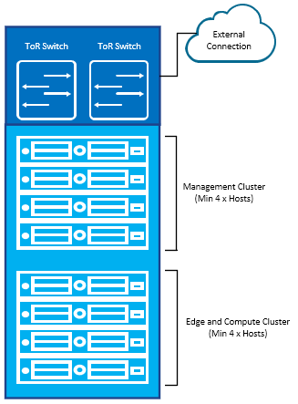

## Physical Network Architecture

DHC’s network architecture detail can be found in the [Software Defined Networks](lldSoftwareDefinedNetworks.md) document.

VCS and its management platform will implement a Layer 2 based transport design allowing for the use of VLANS that span racks. This allows greater flexibility for VCS WL Domain and cluster configuration. VCS follows "bring your own network" principle. TOR to Upstream switch connect is outside of scope of this design.

##### Figure 5. Network Layout Overview

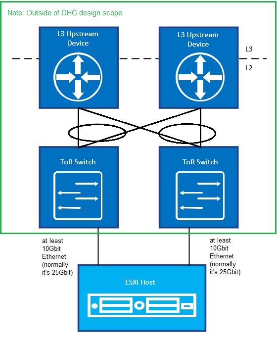

Each VCS host will have at least two physical 10Gbit network ports to allow for high bandwidth, high resiliency and traffic separation. Specification are shown in the building block requirements (above) and configuration details are found in the logical design later in this document. **NOTE:** The default design is for 25Gbit connectivity.  10Gbit is a minimum for smaller customers.

# Management Platform Logical Element Overview

VCS management platform will follow the approach of using vendor standards where viable and layering on additional functionality in a modular/pluggable way. The concepts of Availability Zones and Regions will be introduced in this version for resiliency design and multi-site implementations.

## Availability Zones and Regions

VCS will follow the terminology used in VMware VCF to describe different locations for the management stack and cloud PODS. These are described below.

### Availability Zone

In VCS an ‘Availability Zone’ is defined as an isolated area with its own individual compute, memory, storage, network, rack, power and upstream connectivity. This is to separate it from other DHCs/PODS/Hardware elements to prevent propagation of failure across the datacenter. This could, for example, mean a different datacenter within the same region or simply an area in a share datacenter separated by a fire break with separate power etc. to guard against failure.

This construct allows for the building of more resilient customer implementations using multiple Availability Zones whilst retaining flexibility of cost and deployment time via built in redundancy.  An availability zone within a region (see below) must remain within **5ms** and have bandwidth of **10Gbps** or more of another availability zone to be considered in the same region.

**Example**: Data Center A (London, Staines DC1) and Data Center B (London, Staines DC2)

##### Figure 6. Two AZs, 1 Region

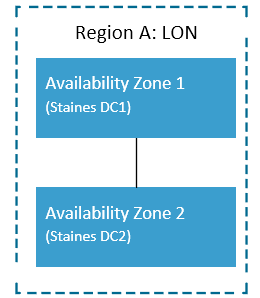

### Regions

Regions are geographically distinct areas outside of the Availability Zone limits of 5ms network latency and at least 10Gbit interconnect speed specification.  Regions can be used for DR purposes (e.g. London/Paris) and also to put time sensitive or compliance bound workload nearer to the customer or legal jurisdiction.
Although the distance between regions can be very large there is still a network latency requirement of at most 150ms in between regions.

**Example**: London and Paris regions.

##### Figure 7. Multi Region Concept

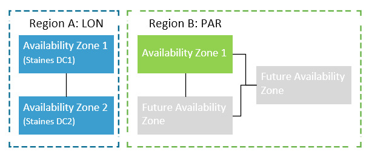

## Virtual Infrastructure

This section details the logical design of the virtual infrastructure that will underpin the VCS product. This initial VCS design is centered around a single VCS POD within a single availability zone. The following applies to the layout of the VCS in each case:

### Logical Infrastructure Design for ‘Regular’ Deployment

For all regular VCS deployments the standard topology is shown below. This separates the management from the compute and edge functions with separate compute, memory, storage and networking for each. A larger install of VCS will simply have more management hosts than a ‘regular’ one.

##### Figure 8.VCS Deployment Topology (Infra)

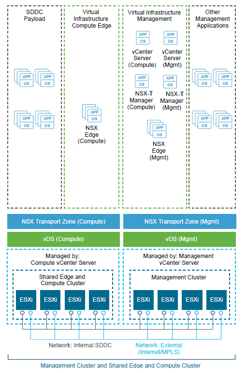

Multi site DR in an active/active configuration (vSAN Stretched Cluster) is also supported allowing for a single Workload Domain to span two sites for resiliency. This provides a simpler recovery in the event of a failure (HA restarts) with a more complicated initial setup (network latency and bandwidth). In this Active/Active DR option VCS uses Stretched Clusters that span 2 Availability Zones.

The topology shown below applies to a VCS with a Stretched Clusters scenario, containing two availability Zones.

##### Figure 9.VCS Deployment Topology (Infra) - Stretched Clusters

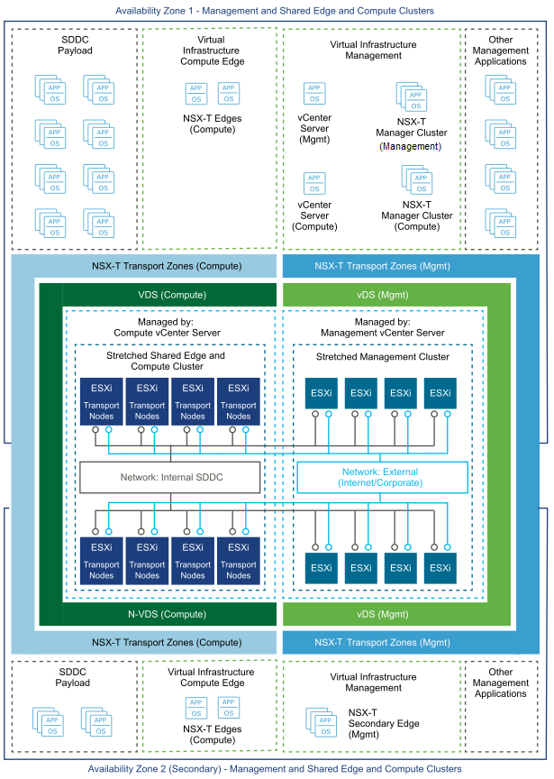

### Witness Traffic Resilience in Stretched Clusters

#### Background and Problem Statement

In Active-Active stretched cluster deployments spanning two availability zones, the vSAN witness host plays a critical role in maintaining cluster quorum during site failures. The witness host must be reachable from both Site A and Site B to ensure proper cluster operation and failover capability within the required Recovery Time Objective (RTO) of less than 5 seconds.

##### Legacy Design - Single Point of Failure

In the legacy stretched cluster network design, witness host communication from both availability zones shared a common network infrastructure, creating a critical single point of failure through **asymmetric routing** and **return traffic path dependency**:

**Network Architecture Problem:**

- Both Site A and Site B used a **shared network segment** (common VLAN/subnet) for witness communication
- The default gateway for this shared network was located on the **Site A data center firewall**
- **Both Site A and Site B ESXi hosts used the same default gateway** (Site A firewall) for witness communication
- While origin traffic from Site B could reach the witness host directly in some network configurations, **return traffic from the witness always routed back through Site A's firewall gateway**
- This created asymmetric routing: `Site B → Witness → Site A firewall gateway → Inter-DC Link → Site B`

**Root Cause - Return Traffic Dependency:**

The fundamental issue was not merely that origin traffic traversed the Inter-DC Link, but that **return traffic had no independent path back to Site B**:

1. Site B ESXi hosts sent witness traffic from the shared subnet
2. Witness host received the traffic and generated return packets
3. Return packets were routed to the subnet's default gateway (located on Site A firewall)
4. Return traffic traversed the Inter-DC Link from Site A firewall back to Site B
5. **Upon Site A failure**:
   - Site A's firewall (serving as default gateway) became unreachable
   - Witness return traffic had no valid gateway to reach Site B
   - Even though Site B could send packets to witness, **replies never arrived**
   - Network path reconvergence (routing updates and failover) required >10 seconds
   - During reconvergence, Site B lost witness connectivity, causing cluster quorum loss

##### Figure 9a. Witness Traffic SPOF - Legacy Design with Asymmetric Routing

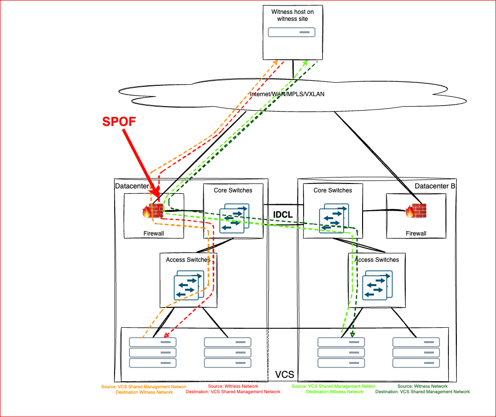

*Note: Shows legacy SPOF design - shared subnet with gateway located on Site A firewall, illustrating asymmetric routing path and return traffic dependency*

**Business Impact:**

During primary site failures (Site A), the RTO exceeded customer SLA requirements (>10 seconds vs. required <5 seconds), causing extended outages for business-critical applications. The asymmetric routing dependency meant that even though Site B infrastructure remained operational, it could not maintain witness quorum due to return traffic path failure. This issue was identified during Siemens IRV/CAR Texas US cluster deployment and subsequent root cause analysis.

#### Solution - Witness Traffic Separation with Symmetric Routing

To eliminate the witness communication single point of failure and asymmetric routing dependency, VCS implements **vSAN Witness Traffic Separation** using VMware's Preferred Fault Domain feature. This design provides each availability zone with an **independent, symmetric routing path** to the witness host.

##### Architecture Overview

The witness traffic separation solution is based on the following design principles:

1. **Dedicated VMkernel Interfaces per Site**: Each availability zone has a dedicated VMkernel adapter exclusively for witness host communication
2. **Independent Network Segments**: Site A uses **Network A** (dedicated VLAN/subnet), Site B uses **Network B** (dedicated VLAN/subnet) - **no shared subnets**
3. **Independent Firewall Gateways**: Site A uses its own data center firewall as gateway, Site B uses its own data center firewall as gateway
4. **Symmetric Routing**: Origin and return traffic for each site follows the same path through site-local infrastructure
5. **Static Routes on ESXi Hosts**: Static routes configured on ESXi hosts ensure witness traffic uses the correct firewall gateway as next-hop
6. **Route Persistence**: Static routes are configured to survive ESXi host reboots

##### Figure 9b. Witness Traffic Separation - Symmetric Routing Design

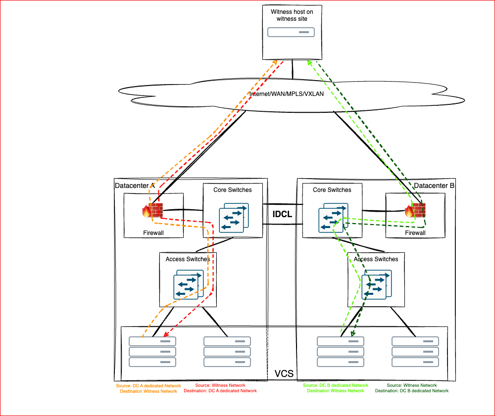

*Note: Shows symmetric routing design - Site A → Network A → Site A Firewall → Witness → Site A Firewall → Site A (symmetric), Site B → Network B → Site B Firewall → Witness → Site B Firewall → Site B (symmetric)*

##### Technical Implementation

The implementation consists of the following components:

**VMkernel Interface Configuration:**

- Site A Hosts: VMkernel adapter (e.g., `vmk10`) in **VLAN/subnet specific to Site A** (Network A)
- Site B Hosts: VMkernel adapter (e.g., `vmk10`) in **VLAN/subnet specific to Site B** (Network B)
- **Critical Requirement**: VMkernel adapters on both sites must use identical VMkernel ID numbers (e.g., both sites use `vmk10`)
- VMkernel adapters are tagged for witness traffic using vSphere Preferred Fault Domain configuration

**Network Addressing and Isolation:**

- **Site A VMkernel range**: Allocated from Site A local network address space
  - Default gateway: **Site A data center firewall**
- **Site B VMkernel range**: Allocated from Site B local network address space
  - Default gateway: **Site B data center firewall**
- **No shared subnets**: Each site operates in its own isolated network segment for witness traffic
- Each site's addressing is routed via its local data center uplink, completely bypassing the Inter-DC Link

**Static Routing Configuration:**

ESXi hosts in each site are configured with persistent static routes to ensure symmetric routing:

```bash
Site A hosts: route to witness network via Site A data center firewall (next-hop in Network A)
  Command: esxcli network ip route ipv4 add -n <witness_network_cidr> -g <site_a_gateway_ip>

Site B hosts: route to witness network via Site B data center firewall (next-hop in Network B)
  Command: esxcli network ip route ipv4 add -n <witness_network_cidr> -g <site_b_gateway_ip>
```

Routes are configured to persist across ESXi reboots using ESXi local configuration files (`/etc/rc.local.d/` or equivalent persistence mechanisms).

**vSphere Configuration:**

- vSAN Witness Traffic Separation feature enabled via vCenter UI
- Preferred Fault Domain setting configured to use dedicated VMkernel interfaces for witness communication
- Each ESXi host's witness VMkernel interface is explicitly designated for witness traffic
- vSAN storage policies remain configured for "Dual site mirroring (stretched cluster)"

##### VMware Preferred Fault Domain Feature - Configuration

**Feature Overview:**

VMware vSAN Witness Traffic Separation leverages the Preferred Fault Domain feature to enable stretched clusters to designate specific VMkernel adapters exclusively for witness host communication. This feature allows each availability zone (site) to use independent network paths for witness traffic, eliminating the dependency on shared network infrastructure and ensuring symmetric routing for both origin and return traffic.

The Preferred Fault Domain configuration is implemented through ESXi host-level tagging of VMkernel interfaces using the vSAN network subsystem. When a VMkernel adapter is tagged with the `witness` traffic type, vSAN routing logic prioritizes that interface for all witness host communication, bypassing the default management or vSAN network paths.

**Version Requirements:**

| Component           | Minimum Version                | Notes                                                                 |
|---------------------|--------------------------------|-----------------------------------------------------------------------|
| vSphere ESXi        | 7.0 Update 3 or later          | Required for vSAN witness traffic separation support                 |
| vCenter Server      | 7.0 Update 3 or later          | vCenter UI configuration available in vSphere 7.0 U3+                |
| vSAN                | 7.0 Update 3 or later          | Witness traffic tagging feature introduced in vSAN 7.0 U3            |
| Recommended         | vSphere 8.0 or later           | Enhanced stability and additional vSAN stretched cluster features    |

**Important**: Verify VMware compatibility matrices and release notes for the specific vSphere and vSAN versions deployed in your environment. Version requirements may vary based on hardware platform and additional features in use.

**Configuration Procedures:**

The witness traffic separation configuration involves three main phases:

1. **Phase 1**: Create dedicated VMkernel adapters on all ESXi hosts via vCenter UI
2. **Phase 2**: Tag VMkernel adapters for witness traffic using ESXi CLI (`esxcli vsan network ip add`)
3. **Phase 3**: Configure persistent static routes on all ESXi hosts for symmetric routing

For detailed step-by-step configuration procedures, validation steps, rollback procedures, and troubleshooting guidance, refer to the comprehensive Work Instruction:

**→ [Stretched Cluster Witness Traffic Separation Configuration](../workInstructions/dhcStretchedClusterWitnessTrafficSeparation.md)**

The Work Instruction provides:

- Complete prerequisites and version requirements validation
- Phase-by-phase configuration procedures (vCenter UI + ESXi CLI)
- Six validation procedures to verify proper implementation
- Rollback procedures for safe removal if needed
- Troubleshooting guide for common issues

**VMware Documentation References:**

For additional technical details and troubleshooting guidance, refer to the following VMware documentation:

- **VMware vSAN Administration Guide**: Configure the VMkernel Adapters for Witness Traffic
  - Last Updated: July 7, 2025
  - Link: [VMware Documentation Portal](https://docs.vmware.com/en/VMware-vSphere/index.html)

- **VMware Knowledge Base**: vSAN Stretched Cluster Witness Traffic Separation
  - KB Article: [Search VMware KB for latest articles on "vSAN witness traffic separation"]

- **VMware vSphere Release Notes**: Compatibility matrices for vSphere, vCenter, and vSAN versions

- **VMware Best Practices**: vSAN Stretched Cluster Design and Implementation Guide

**Important Notes:**

- VMkernel adapter IDs **MUST** be identical across all hosts in both availability zones for proper vSAN failover behavior
- Static routes must be configured to persist across ESXi reboots (see "Static Routing Configuration" section)
- After configuration changes, monitor vSAN health status in vCenter UI: **Menu** > **vSAN** > **Health**
- Test failover scenarios in non-production environment before production deployment
- Document VMkernel IDs, IP addressing, and VLAN assignments for operational reference

##### Operational Benefits

The witness traffic separation design with symmetric routing delivers the following operational improvements:

- **Eliminates Asymmetric Routing**: Each site's traffic follows a symmetric path (origin and return via same site infrastructure)
- **Eliminates Return Traffic SPOF**: Return traffic from witness does not depend on remote site gateway availability
- **Achieves <5s RTO**: No dependency on Inter-DC Link, HSRP failover, or network reconvergence during site failures
- **Maintains Cluster Quorum**: Surviving site maintains uninterrupted bidirectional witness connectivity during site outages
- **True Site Independence**: Each site can communicate with witness regardless of other site's operational status
- **Enhanced Security Posture**: Each site's witness traffic traverses independent firewall infrastructure, providing defense-in-depth
- **Maintains Zero RPO and achieves <5s RTO**: Enables true Active-Active stretched cluster operation within SLA requirements by ensuring cluster quorum is preserved during site failures
- **Post-Deployment Compatible**: Can be implemented on existing stretched clusters without cluster rebuild
- **Simplified Troubleshooting**: Symmetric routing paths are easier to validate and debug than asymmetric configurations

##### Traffic Flow Examples

**Site A Traffic Flow (Symmetric):**

```text
Origin:  Site A ESXi vmk10 → Site A Firewall (Gateway) → Site A Uplink → Witness Host
Return:  Witness Host → Site A Uplink → Site A Firewall (Gateway) → Site A ESXi vmk10
```

**Site B Traffic Flow (Symmetric):**

```text
Origin:  Site B ESXi vmk10 → Site B Firewall (Gateway) → Site B Uplink → Witness Host
Return:  Witness Host → Site B Uplink → Site B Firewall (Gateway) → Site B ESXi vmk10
```

**Site A Failure Scenario:**

- Site A infrastructure (including Site A firewall gateway) becomes unavailable
- Site B traffic flow remains unchanged: `Site B ESXi ↔ Site B Firewall ↔ Witness Host`
- Site B maintains full bidirectional connectivity to witness
- Cluster quorum preserved, failover time <5 seconds

##### Security Considerations

The witness traffic separation design enhances security architecture through independent security enforcement:

- **Dual Independent Firewall Paths**: Witness traffic from Site A and Site B traverse separate firewall infrastructures
- **No Security Bypass**: Each site maintains full firewall inspection and control of witness traffic
- **Improved Segmentation**: Site-local routing with dedicated subnets provides better network segmentation and isolation
- **Defense in Depth**: Failure of one site's security infrastructure does not impact the other site's witness connectivity
- **Symmetric Security Controls**: Security policies can be enforced consistently on both origin and return traffic paths
- **Compliance**: Design aligns with defense-in-depth and redundant security controls best practices

##### Design Decisions - Witness Traffic Separation

The following design decisions apply specifically to witness traffic separation in stretched clusters:

| ID     | Decision                                                                                              | Justification                                                                                                  | Implications                                                                                              |
|--------|-------------------------------------------------------------------------------------------------------|----------------------------------------------------------------------------------------------------------------|-----------------------------------------------------------------------------------------------------------|
| WTS001 | Stretched clusters MUST use dedicated VMkernel interfaces for witness traffic separation             | Eliminates asymmetric routing and return traffic SPOF, ensures <5s RTO, maintains cluster quorum during site failures | Requires additional VMkernel interfaces, static routing configuration, increased deployment complexity |
| WTS002 | VMkernel interface IDs for witness traffic MUST be identical across both availability zones          | Required by VMware vSAN Witness Traffic Separation feature for proper failover behavior                        | Deployment automation must ensure consistent VMkernel numbering across all hosts                          |
| WTS003 | Each site MUST have independent IP addressing (separate subnets) for witness traffic                 | Ensures symmetric routing and eliminates shared subnet/gateway dependency                                      | Requires coordination with network team for VLAN/subnet allocation per site                               |
| WTS004 | Each site MUST have independent firewall serving as gateway for its witness traffic network          | Eliminates return traffic dependency on remote site firewall, enables true site independence                   | Firewall infrastructure must be available and operational in both sites                                   |
| WTS005 | Static routes to witness host MUST be configured on all ESXi hosts and MUST persist across reboots   | Ensures correct next-hop selection for symmetric routing, prevents loss of witness connectivity after maintenance | Requires configuration of ESXi persistent routes via automation or manual configuration                   |
| WTS006 | Witness traffic MUST NOT traverse the Inter-DC Link under normal operation for either origin or return traffic | Primary objective is to eliminate dependency on shared Inter-DC Link and achieve symmetric routing per site     | Network validation required to confirm bidirectional traffic path uses site-local uplinks                 |
| WTS007 | Each site's witness traffic MUST traverse independent firewall infrastructure for both origin and return paths | Maintains security controls while achieving network resilience and symmetric routing objectives                 | Firewall rules must be configured on both Site A and Site B firewalls for bidirectional witness traffic   |
| WTS008 | Witness traffic separation feature MUST be validated in non-production before production deployment  | Ensures solution works as designed, achieves symmetric routing, and meets <5s failover requirement before customer impact | Requires test stretched cluster environment and comprehensive failover testing procedures                 |

##### Network Requirements - Witness Traffic Separation

The witness traffic separation design adds the following network requirements to the base stretched cluster requirements:

| ID     | Requirement                                                                                                                               | Justification                                                          |
|--------|-------------------------------------------------------------------------------------------------------------------------------------------|------------------------------------------------------------------------|
| WTN001 | Site A witness traffic VLAN/subnet MUST be routed via Site A data center firewall (gateway) and uplink to witness location               | Ensures Site A has independent symmetric path to witness               |
| WTN002 | Site B witness traffic VLAN/subnet MUST be routed via Site B data center firewall (gateway) and uplink to witness location               | Ensures Site B has independent symmetric path to witness               |
| WTN003 | Site A and Site B witness traffic networks MUST use separate, non-overlapping IP subnets                                                 | Required for symmetric routing and elimination of shared gateway dependency |
| WTN004 | Both Site A and Site B routing paths to witness MUST be operational simultaneously                                                       | Required for proper vSAN stretched cluster quorum operation            |
| WTN005 | Return traffic from witness MUST route back through the originating site's firewall (no asymmetric routing)                              | Core requirement to eliminate return traffic SPOF                      |
| WTN006 | Firewall rules for vSAN witness traffic (e.g., UDP 12321) MUST be configured on both Site A and Site B firewall infrastructure for bidirectional traffic | Enables symmetric witness communication through independent firewall paths |
| WTN007 | Maximum latency RTT between each availability zone and witness host SHOULD remain **<200ms** via independent symmetric paths             | Maintains VMware vSAN stretched cluster witness latency requirements   |

### The Management Cluster

The VCS Management cluster hosts all component applications required to administer and control a VCS instance.

- **SDDC Manager**: Management stack management. This controls the base infrastructure components and is responsible for driving the upgrade and patching of the core platform.
- **vCenter Server with external Platform Service Controller**: Responsible for registering and controlling all VMs existing on the cluster and SSO authentication services, etc.
- **NSX Managers (NSX-T)**: Software defined networking management for the VCF infrastructure, payload infrastructure and non-management workload domains.
- **Aria Operations for Logs**: Comprehensive logging functionality for the VCS platform
- **Aria Operations**: Comprehensive reporting, monitoring and metric visualization for the VCS platform.
- **Bastion host**: Security-hardened machine used for administrative purposes (Terminal server)
- **Active Directory**: Directory service, DHCP service
- **Hashi Corp. Vault**: Secret Management system
- **Lifecycle Manager**: Required component deployed via vCF for lifecycle management of vROPS.
- **Workspace ONE Access**: Identity provider for VMware components
- **WSUS**: Windows Patch Repo
- **Linux Patch Repo** : Patching repository
- **Antivirus**: Antimalware components
- **Backup**: Data security components
- **Certificate Authorities (RCA and ICA)**: Two CA servers providing Certificate Authority services for VCS
- **Infoblox**: IPAM services for vRealize Cloud
- **Internet Proxy**: Squid web proxy servers.
- **Ansible**: Linux VM with ansible for day-two automation scripts and billing reporting.
- **Nessus** : Linux VM to perform security scans and reporting
- **Smtp relay server** : Linux VM to deliver SMTP relay server functionality
- **Aria Operations for Networks** : Linux VM to deliver network insight operations

### Placement of Management VMs in a Stretched Cluster

In a multi-availability zone implementation, all components of the vCF reside in Availability Zone 1 within Region A. If this zone becomes compromised, all nodes are brought up in the Availability Zone 2.

| VM                            | Availability Zone | Design Justification             |
|-------------------------------|-------------------|----------------------------------|
| SDDC Manager                  | AZ1               | VMware recommendation            |
| vCenter Server                | AZ1               | VMware recommendation            |
| Platform Services Controller  | AZ1               | VMware recommendation            |
| NSX Manager (NSX-T) for MGMT  | AZ1               | VMware recommendation            |
| NSX Manager (NSX-T) for WL    | AZ1               | VMware recommendation            |
| Aria Operations for Logs      | AZ1               | VMware recommendation            |
| Aria Operations               | AZ1               | VMware Default                   |
| Bastion host                  | AZ1 & AZ2         | 2 nodes distributed across zones |
| Active Directory              | AZ1 & AZ2         | 2 nodes distributed across zones |
| Hashi Corp. Vault             | AZ1               | Placed in the primary site       |
| Aria Suite Lifecycle Manager  | AZ1               | VMware recommendation            |
| Workspace ONE Access          | AZ1               | VMware recommendation            |
| WSUS                          | AZ1               | Placed in the primary site       |
| Linux Patch Repo              | AZ1               | Placed in the primary site       |
| Backup                        | AZ1               | Placed in the primary site       |
| Internet Proxy                | AZ1 & AZ2         | 2 nodes distributed across zones |
| vSAN Encryption KMS           | AZ1 & AZ2         | 2 nodes distributed across zones |
| Ansible                       | AZ1               | Placed in the primary site       |
| Certificate Authorities       | AZ1               | Placed in the primary site       |
| Infoblox                      | AZ1 & AZ2         | 2 nodes distributed across zones |
| Aria Operations for Networks  | AZ1               | VMware recommendation            |
| Linux Mid                     | AZ1               | Placed in the primary site       |
| SMTP relay server             | AZ1               | Placed in the primary site       |
| Nessus                        | AZ1               | Placed in the primary site       |
| CloudHealth Aggregator (Opt)  | AZ1               | Placed in the primary site (Opt) |

### The Edge and Compute Cluster

Some infrastructure functions not related to customer workload are required to be run on the Edge and compute cluster within a VCS. These components provide east-west routing within the VCS SDDC and the North-South routing for tenant workloads and the SDDC are housed in this cluster.

More specific information ON the VCS network design can be found in the [VCS Network LLD](lldSoftwareDefinedNetworks.md)

### Networking Infrastructure

VCS is based around Software Defined Networking throughout the stack. For this all networking within VCS will take advantage of VMware NSX-T. The design of this is network is detailed in a separate LLD see the related documents table for information.

### Patching and Management Infrastructure

VCS as a product is designed to be updated and patched as smoothly as possible following the recommended vendor approved update schedules that come as part of the VCF offering. These revolve around two key applications within the stack that split the upgrade and patching duties between them.
Both the components below operate by fetching and applying vendor approved bundles to the VCS infrastructure. This allows VCS to push updates to customers without intervention allowing for far easier LCM and general VCS management.

#### SDDC Manager

SDDC Manager is responsible for the LCM of the VCF and the base vSphere components. It does not cover any of the vRealize suite components. SDDC manager offers public REST API resources and can be programmatically controlled with VCS automation toolset.

#### Aria Suite Lifecycle Manager

Aria Suite Lifecycle Manager picks up from where SDDC manager leaves off and is responsible for the LCM of all Aria Suite components within a VCS deployment. Additionally, it can be used to deploy components within its control and is leveraged during VCS setup to configure the VCS pas the basic level of the VCF install.
LCM is a single VM that controls the above product suite and can be accessed via REST API fitting in with the automation and control via code requirements of VCS.

##### Figure 10. Aria Suite Lifecycle Manager Architecture

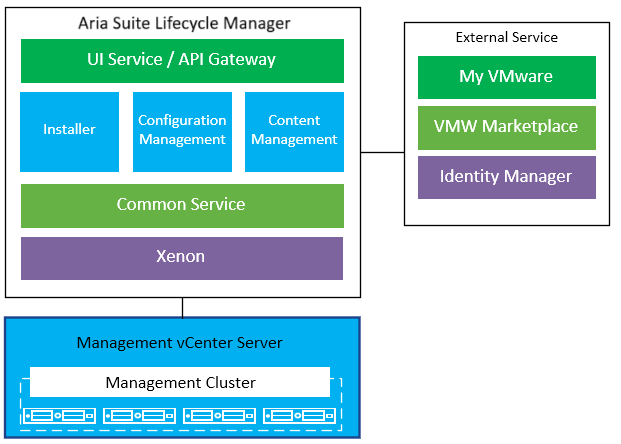

### Monitoring Infrastructure

Monitoring (and logging) for VCS is provided by Aria Operations for Logs, Aria Operations for Networks and Aria Operations. For Monitoring, Aria Operations will be deployed as a cluster. This is to provide a level of resiliency in the design and to allow for easy scale out if required if the environment grows. The full design and implementation of the Aria Operations configuration in VCS can be found in the Monitoring and logging LLD however, the diagram below gives a high-level overview of basic architecture that exists on the VCS management stack.

Aria Operations Manager as a virtual appliance will be deployed in cluster of one master and at least one data node, and optionally a group of remote collector nodes configuration as shown on Figure 11.

##### Figure 11. Aria Operations Manager Architecture

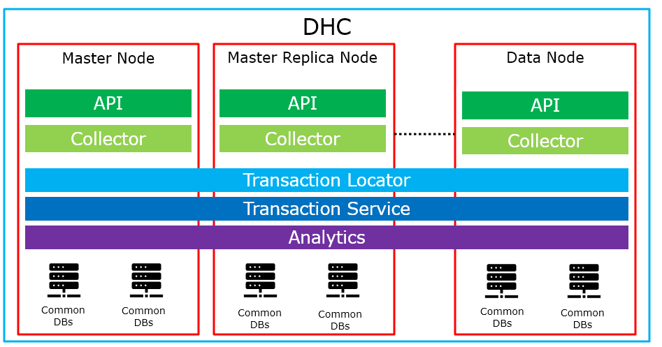

The full design for DHC’s logging system can also be found in the [Monitoring and Logging LLD](lldMonitoringLogging.md). However, the basic design overview is show below. Within VCS Aria Operations for Logs will act as the single point of log collection and analysis for VMware and non-VMware components. Aria Operations for Logs will be installed as a cluster of nodes.

##### Figure 12. Aria Operations for Logs Basic Architecture

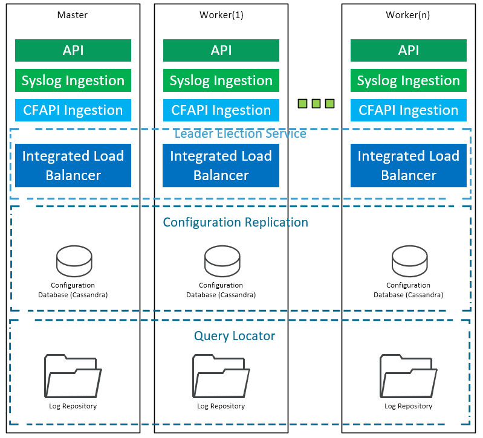

Aria Operations for Logs and Aria Operations are closely integrated, with Aria Operations being able to provide the inventory map of any vSphere object to Aria Operations for Logs for analytics and issue pinpointing functionality. Likewise, Aria Operations for Logs UI is embedded within Aria Operations for the checking of log information on VM objects.

## Availability and Scalability

This section details the high level concepts of how VCS is designed to be scaled and resilient to failure.

### Availability Design

VCS is designed to continue to run within the context of a host failure within the hardware stack or, in case of Stretched Cluster, a set of hosts in a single Availability Zone. Availability at this time is designed to keep the product functioning at a management level with the potential of reduced performance whilst running in this failure state.

VCS will leverage standard vSphere features to help withstand a host failure.
These are:

- **vSphere HA:** in the event of a host failure VCS management VMs will restart on an available host. All VCS deployments will have this enabled and configured with defaults.
- **vSphere DRS:** In the event of an HA event DRS will help re-balance the remaining hosts in the cluster to optimize performance in this failed state. All VCS deployments will have this enabled and configured to defaults.
- **vSAN FTT:** vSAN Failure To Tolerate is a storage resiliency allowing a total host to fail within the vSAN (or a disk group) and allow full operation to continue. All vSAN datastores in VCS will have this setting enabled.
- In case of failure of one of site/availability zone in vSan stretched cluster, to make sure that all dependencies are met, mgmt vms should be restarted in order (restart priority):

| VM Restart Priority | VM name |
|---------------------|---------|
| HIGHEST             | adc001  |
|                     | adc002  |
|                     | ctl001  |
|                     | ctl002  |
|                     | ctl003  |
|                     | ctl011  |
|                     | ctl012  |
|                     | ctl013  |
|                     | edg101  |
| HIGH                | pxy002  |
|                     | idm001  |
|                     | tss001  |
|                     | ans001  |
|                     | inf001  |
|                     | vcs001  |
|                     | vcs002  |
| MEDIUM              | hsv001  |
|                     | ops002  |
|                     | inf003  |
|                     | vli001a |
|                     | vli001b |
|                     | vli001c |
|                     | mid001  |
|                     | mid002  |
|                     | mid003  |
|                     | ave001  |
|                     | nes001  |
| LOW                 | pxy003  |
|                     | ops003  |
|                     | sdm001  |
|                     | lcm001  |
|                     | avp001  |
|                     | wus001  |
|                     | deb001  |
|                     | tss002  |
|                     | ica001  |
|                     | rca001  |
|                     | inf003  |
|                     | inf004  |
|                     | inf005  |
|                     | hgw001  |
|                     | rac001  |
|                     | srs001  |
|                     | srm001  |
|                     | vsr001  |
|                     | edg102  |
|                     | vni001  |
|                     | vnc001  |

The table below shows design decisions that affect the availability design of VCS

##### Table 3. Design Decisions - Availability

| ID    | Design Decision                                                                                    | Design Justification                                                                                               | Design Implication                                                                             |
|-------|----------------------------------------------------------------------------------------------------|--------------------------------------------------------------------------------------------------------------------|------------------------------------------------------------------------------------------------|
| AD001 | Hybrid vSAN min 4 nodes                                                                            | 4 Nodes allows normal operation in even of failure. Minimum is VMware min+1 (i.e. 4 not 3).                        |                                                                                                |
| AD002 | Flash vSAN min 5 nodes (if RAID 5/6 is selected, Default)                                          | 5 Nodes allows normal operation in even of failure when using RAID 5. Minimum is VMware min+1 (i.e. 5 not 4).      | Check required, if AFA and RAID 1 4 is fine. If RAID5/6 then 5 nodes are required              |
| AD003 | VCS MGMT is not built as "N-1" resilient (no spare host, failure = reduce MGMT performance)        | VCS needs to be as cost effective as possible. Some performance impact in a failure condition is acceptable.       | MGMT VMs to be sized appropriately for continued operation in the event of a host failure.     |
| AD004 | Active/Active vSAN Stretched Cluster-based DR is available                                         | Initial Customer requirement to deliver a near-zero RTO and zero RPO DR                                            | Amount of hardware is doubled, vSAN Enterprise license required, stricter network requirements |
| AD005 | VCS management can withstand a single host failure                                                 | Most cost effective / most common failure condition.                                                               | DR should be considered. Software will run with reduced performance after a host failure       |
| AD006 | vSAN will be configured with a default Failure To Tolerate value of 1                              | This offers a balance of failure tolerance and cost                                                                | Usable disk space within the vSAN will be reduced.                                             |
| AD007 | vSphere High Availability host isolation response set to power off VMs.                            | To avoid split-brain scenarios                                                                                     |                                                                                                |
| AD008 | Stretched Cluster Availability Zones require min 8 hosts                                           | 8 hosts addresses availability/sizing requirements. Allows AZ to be offline without cluster health being affected. | Min Requirement of 4 Hosts per site. May result in underutilised HW.                           |
| AD009 | With 2 Availability Zones, Secondary Failures to Tolerate = 1                                      | Provides the necessary protection for virtual machines in each AZ, with the ability to recover from an AZ outage.  |                                                                                                |
| AD010 | With 2 Availability Zones, Admission Control for percentage-based failover = 50% hosts in cluster. | Only half of a stretched cluster should be used to ensure that all VMs have enough resources in an AZ outage.      | Possible underutilization of the cluster's hosts. Hosts must be added to the cluster in pairs  |

### Scalability Design

VCS is designed to scale in many ways. The architecture is flexible, modular and resilient allowing small or large-scale increases. Based on HyperConverged infrastructure, VCS workload clusters scale via the addition of hosts to the system. Units of compute, memory and storage are added to a given cluster / workload domain to provide more resource when necessary.
Additionally, a VI Workload domains are designed to be flexible and can scale down as well as up. This enables a customer to reallocate resource in a planned manner dependent on their needs. For example, removing resource from traditional Virtual Infrastructure workload domains and increasing the resource for additional workload domains focusing on a particular workload (e.g. ORacle) as part of a transformation effort.

##### Table 4. Design Decisions - Scalability

| Decision ID | Design Decision                                                                 | Design Justification                                               | Design Implication                                                                                     |
|-------------|---------------------------------------------------------------------------------|--------------------------------------------------------------------|--------------------------------------------------------------------------------------------------------|
| SD001       | VCS Workload domains are designed to be scaled out                              | Simplicity of maintenance and procurement. Fits the HC model       | Nodes should be ordered with this in mind (no scale up per node)                                       |
| SD002       | VCS MGMT can be scaled out, not UP                                              | vSAN ready nodes come pre-filled based on their model number       | Management cluster should be sized with HDD space in mind as this is the most limiting factor          |
| SD003       | Hosts use any of the pre configured vSAN ready Nodes when being specified       | Adherence to standards and allows a long term view of HW lifecycle | vSAN ready node specification are potentially less flexible. Customer design needs to account for this |
| SD004       | WL domain is always All Flash vSAN                                              | Compliant with VCF, guarantees performance                         | Care should be taken to ensure correct performance profile for customer implementation                 |
| SD005       | HOSTS require discovery and commissioning via VCF to be added/removed to domain | VCF Requirement standard practice                                  | There is process to adding, removing or moving hosts between WL domains and clusters                   |

##### Table 4a. Scalability - Limitations

| Feature                | Limitation                                                                  |
|------------------------|-----------------------------------------------------------------------------|
| vSAN Stretched Cluster | Up to 30 ESXi Data Nodes supported (15 on each site x 2) + 1 Witness host   |
| vSAN Stretched Cluster | Max 5ms RTT latency between primary stretched clusters/sites                |
| vSAN Stretched Cluster | vSAN stretched clusters should ALWAYS be balanced per AZ (e.g. 8+8 AZ1/AZ2) |

## Recoverability

The following chapter will describe recoverability options for the specific elements in the virtual infrastructure and whole VCS deployment.

### Component Failure

##### Table 5. Protection mechanisms

| Component                                      | Failure protection               |
|------------------------------------------------|----------------------------------|
| vSphere Hosts                                  | vSphere High Availability        |
| NSX-T Manager  & Controllers                   | Built-in clustering capabilities |
| Active directory                               | Built-in replication mechanisms  |
| DNS                                            | Built-in replication mechanisms  |
| DHCP                                           | Clustered service                |
| Aria Operations for Logs                       | Internal clustering              |
| Aria Operations Manager                        | Internal clustering              |
| Aria Suite Lifecycle Manager                   | vSphere High Availability        |
| vCenter Servers                                | vSphere High Availability        |
| SDDC Manager                                   | vSphere High Availability        |
| Workspace One Access                           | vSphere High Availability        |
| Hashicorp Vault                                | vSphere High Availability        |
| Avamar VE                                      | Clustered service + HA           |
| Infoblox DDI                                   | Clustered service + HA           |
| Cloudlink                                      | Clustered service + HA           |
| Platform Services Controller                   | Clustered service + HA           |
| Bastion host                                   | Servers distributed across zones |
| Identity Manager                               | vSphere High Availability        |
| WSUS                                           | vSphere High Availability        |
| Linux Patch Repo                               | vSphere High Availability        |
| Antivirus                                      | Multiple Agents, Offsite service |
| Backup                                         | Multiple Proxy + VMware HA       |
| Internet Proxy                                 | Dual proxy + HA                  |
| Ansible                                        | vSphere High Availability        |
| Certificate Authorities                        | vSphere High Availability        |
| Aria Operations for Networks                   | Internal clustering              |
| SMTP relay server                              | vSphere High Availability        |
| Nessus                                         | vSphere High Availability        |
| CloudHealth Aggregator (Opt)                   | vSphere High Availability        |

### Datacenter failure

When VCS is deployed with vSAN stretched clusters setup with each Availability Zone being a separate Datacenter, In case of the whole datacenter failure customer workloads and management components will be recovered by restarting the VMs on the remaining ESXi hosts in the secondary Availability Zone using native vSphere HA and vSAN replication mechanism.

#### vSAN Witness host

In a stretched cluster configuration, a vSAN stretched cluster witness host must be deployed. This ESXi host must be configured in a third location that is not local to the ESXi hosts on either side of the stretched cluster.This vSAN witness can be configured as a physical ESXi host or a virtual appliance.

For a vSAN Witness Appliance Size will depend on the number of components and expected customer load, please look below for details.

Default VCS vSAN Witness Appliance Size for Management Cluster is **Medium**
vSAN Witness Appliance Size for Compute Cluster depends on the expected size of a Compute Workload Domain -  please choose the size that best fits the expected workload size.

**Medium** - Supports up to 500 VMs/21,000 Witness Components:

- Compute - 2 vCPUs
- Memory - 16GB vRAM
- ESXi Boot Disk - 12GB Virtual HDD
- Cache Device - 10GB Virtual SSD
- Capacity Device - 350GB Virtual HDD

**Large** - Supports over 500 VMs/45,000 Witness Components:

- Compute: 2 vCPUs
- Memory - 32 GB vRAM
- ESXi Boot Disk - 12GB Virtual HDD
- Cache Device - 10GB Virtual SSD
- Capacity Devices - 3x350GB Virtual HDD
- 8GB ESXi Boot Disk*, one 10GB SSD, three 350GB HDDs

#### Table 6. Design Decisions on the vSAN Witness Appliance

| **ID** | **Design Decision**                           | **Design Justification**                                                                                                                                                                         |
|--------|-----------------------------------------------|--------------------------------------------------------------------------------------------------------------------------------------------------------------------------------------------------|
| W001   | vSAN witness appliance is located in Region B | Region B is isolated from both availability zones in Region A and can function as quorum location. A third, physically separate, location is required when implementing a vSAN stretched cluster |
| W002   | A virtual vSAN witness appliance is used      | Less footprint/reduces costs, more flexibility in terms of placement (i.e. can be places in VMC on AWS)                                                                                          |

#### vSphere DRS

When using two availability zones, DRS VM/Host group affinity rules will be created for initial placement of VMs and impacting read locality. In this way, unnecessary vSphere vMotion migration of VMs between availability zones can be avoided. Because the vSAN stretched cluster is still a single cluster, vSphere DRS is unaware that it stretches across different physical locations. As result, it might decide to move virtual machines between them. By using VM/Host group affinity rules, VMs can be constrained to an availability zone. Otherwise, if a virtual machine VM1, that resides in Availability Zone 1, moves across availability zones, VM1 could eventually be running on Availability Zone 2. Because vSAN stretched clusters implement read locality, the cache for the virtual machine in Availability Zone 1 is warm whereas the cache in Availability Zone 2 is cold. This situation might impact the performance of VM1 until the cache for it in Availability Zone 2 is warmed up.

In the Management cluster the DRS affinity rules will make sure that Management components are placed as defined in the [Placement of Management VMs in a Stretched Cluster](#placement-of-management-vms-in-a-stretched-cluster) section. This ensures that redundant components such as AD or Internet Proxy are distributed across Availability Zones.

In the Customer Workload Cluster, the rules will allow assigning VMs to a selected Availability Zone during deployment  of the VM by the Customer through Aria Automation. **NOTE** This is an 'at deployment' time activity.  Currently there is no 'Day 2' option to change it after the provisioning.

#### Table 7. Design Decisions on DRS

| **ID** | **Design Decision**                                                       | **Design Justification**                                                                                                                        |
|--------|---------------------------------------------------------------------------|-------------------------------------------------------------------------------------------------------------------------------------------------|
| DRS001 | 2 host groups are created. Hosts in each AZ will be in separate groups    | Easier to manage which virtual machines should run in which availability zone.                                                                  |
| DRS002 | 2 VM groups, each for one AZ, are created VMs placed in specific AZ Group | Ensures that virtual machines are located only in the assigned availability zone, not powered-on in or migrated to the wrong availability zone. |
| DRS003 | DRS affinity rules will be created in the Management cluster              | Ensures management components are assigned to an appropriate zone as specified (i.e. redundant components are spread across AZs)                |
| DRS004 | DRS affinity rules will be created in the Customer Workload Cluster       | 1. Performance (explained above) 2. To allow Customers placing VMs in the selected Availability Zone during deployment                          |

### RPO & RTO

Refer to below table for RPO and RTO defined for the documented scenario.

| **DR Scenario**                                    | **RTO**             | **RPO**                |
|----------------------------------------------------|---------------------|------------------------|
| Twin site Active-Active (vSAN Stretched clusters)  | RTO - 100VMs/30mins | RPO - zero             |
| Dual site Active-Passive (SRM+vSphere Replication) | RTO - 100VMs/30mins | RPO - 5 mins to 24 hrs |

## Multi-tenancy

This section covers the infrastructure design of a VCS Multi-tenancy in details. Below design decisions are applicable for all Multi-tenancy scenarios.

| **ID** | **Design Decision**                                                | **Design Justification**                                                                                           |
|--------|--------------------------------------------------------------------|--------------------------------------------------------------------------------------------------------------------|
| MT001  | Dedicated resource pools will be used for each tenant              | Logically separate VCS multitenancy customers workloads                                                            |
| MT002  | VCS Multitenancy will use resource pools shares only               | Distribute physical resources to virtual machines, ensures fairness of consumption                                 |
| MT003  | Shares of tenants resource pools will be set to Normal             | Divide the resources evenly in case of resource contention                                                         |
| MT004  | Reservations and Limits are not used/enabled                       | Configuring too many or too high reservations may negatively affect performance by limiting the resource scheduler |
| MT005  | Shared management resource pool will be created in each WL cluster | Logically separate Edge and Infoblox management VM’s                                                               |
| MT006  | Shares of management resource pool will be set to high             | Prioritize Edge and Infoblox management VM's in case of resource contention                                        |

# Management Platform Modularization

VCS management platform supports modularization and is ready to build and manage components more efficiently. That means breaking down a rigid, standard VCS deployment path and enable reusable components (modules) to be deployed independently.

VCS version 2.0 and higher enables modularization for below components:

- Nessus
- Aria Operations for Networks
- SMTP

# Detailed Virtual Infrastructure Design

This section covers the physical design of a VCS in more detail.

| **ID** | **Design Decision**                                                                               | **Design Justification**                                                                       | **Design Implication**                                                |
|--------|---------------------------------------------------------------------------------------------------|------------------------------------------------------------------------------------------------|-----------------------------------------------------------------------|
| VCS001 | All DHCs will follow naming conventions (Sites, servers, clusters etc.)                           | Standardised operational understanding of VCS topology                                         | Automation must adhere to this decision                               |
| VCS002 | In a DR capable install of VCS a minimum of 2 Availability Zones or regions must be used          | Geographically distinct failure domains support a DR strategy                                  | Solution is more costly and complex                                   |
| VCS003 | In each availability zone the Management and shared edge/compute cluster must be in the same rack | Min requirements don't justify separate rack. Placement in the same rack minimises vLAN spread | Sufficient power and cooling required to cope with this demand.       |
| VCS004 | Dual power feeds must be used for each rack                                                       | Guards against single line power loss                                                          | Datacenter must have ability to provide two independent feeds.        |
| VCS005 | MGMT and shared edge and compute clusters should NOT span multiple racks within an AZ             | Less complexity for physical design. Simpler.                                                  | N/A                                                                   |
| VCS006 | VCS will always utilize dual ToR switches for resiliency to HW failure                            | Avoids service interruption in the event of a device failure                                   | Cost increase, rack space used.                                       |
| VCS007 | VCS supports BGP as its routing protocol                                                          | NSX-T requirement                                                                              | OSPF is not supported                                                 |
| VCS008 | VLANS are used to separate physical functions                                                     | Isolation of various functions so traffic types can be prioritized                             | Uniform configuration required.                                       |
| VCS009 | All VCS Management components will have Static IP addresses assigned. NOTE: excludes NSX VTEPs    | Aids troubleshooting and understanding of the environments.                                    | IPAM required                                                         |
| VCS010 | All Management components must have FWD and REV DNS records created                               | vSphere requirement for correct operation                                                      | Additional setup required                                             |
| VCS011 | NTP services will be configured on ToR switches (or any L3 Device outside of VCS)                 | Default Time Source. Allows all VCS components to have a single, Resilient source of time      | All components must sync to ToRs                                      |
| VCS012 | VCS supports vSAN as the underlying storage platform **only** in MGMT and as default in workload  | Simplifying operations, deployment and LCM. Easy to automate.                                  | HC only storage type for MGMT with optional FC storage for WL cluster |
| VCS013 | VCS Requires all vSAN nodes to have cache tiers at least 5% of total per node storage             | Vendor recommendation inline with VVD                                                          |                                                                       |
| VCS014 | VCS Requires environments be sized to have 20-25% vSAN slack space                                | Aids rebalancing and performance of vSAN  (Updated requirement for vSAN 7.01U1)                | Potentially more complex customer designs.                            |
| VCS015 | ESXi will run from dedicated dual SD or dedicated dual HDD storage (Min 16GB with 4GB Swap)       | Allows cheap install of ESXi and OoB support logs to be available in the event of issue.       | Dell typically SD card, Bull Typically Dual HDD                       |
| VCS016 | ESXi hosts will be added to VCS Active directory                                                  | Allows RBAC and granular control                                                               | Requires Active Directory                                             |
| VCS017 | Default ESXi Admins group will be changed to AD group                                             | Allows RBAC and granular control for group access                                              | Require AD                                                            |
| VCS018 | Default Host Power Management Policy is set to Balanced                                           | Best setting for performant system and reasonable power consumption                            | Guest OS settings to be set at 'max power' to ensure host has control |
| VCS019 | Workload clusters may have Fibre Channel SAN storage as Primary storage                           | Supported by VCF, increased flexability, allows for cost effective, storage dense customers    | Storage policy and Storage SSRs will not apply to FC storage          |

## Management Plane

The first hardware in any VCS deployment is always the management plane for VCS (please note it will be called a "management domain" interchangeably). This follows the standard deployment of VCF and the VVD.

The management domain hosts the VMs that run the SDDC. This includes VMware management software, monitoring and event management software, AD services, backup management software and DR management stack. The physical configuration of the cluster provides HA for these components. The sizes of the corresponding VMs depend on the selected options in the vCF input XLS file:

| **Entry in vCF input file**                | **Setting**        | **Additional information**           |
|--------------------------------------------|--------------------|--------------------------------------|
| vCenter Server Appliance Size              | Medium             | Up to 400 ESXi hosts, up to 4000 VMs |
| Physical NIC to Assign to vDS: MGMT (DELL) | vmnic0 and vmnic1) | Specified in VCF excel spreadsheet   |
| Physical NIC to Assign to vDS: MGMT (BULL) | vmnic2 and vmnic4) | Specified in VCF excel spreadsheet   |
| VMKernel Adapter for Management            | vmk0               | Default in vCF                       |
| vSphere Standard Switch - Management       | vSwitch0           | Default in vCF                       |
| vmnic Allocated to vSS - Management        | vmnic0             | Default in vCF                       |
| Aria Operations for Logs Node Size         | medium             | Max Log Ingest Rate: 75GB/day        |
| vSphere Distributed Switch MTU             | 9000 B             | selected for performance             |
| Management cluster EVC setting             | Variable           | Set at CPU level initially purchased |
| SDDC-DPortGroup-Mgmt MTU                   | 1500 B             | default in vCF                       |
| SDDC-DPortGroup-vMotion MTU                | 9000 B             | default in vCF                       |
| SDDC-DPortGroup-VSAN MTU                   | 9000 B             | default in vCF                       |
| Host Transport VLAN MTU                    | 9000 B             | default in vCF                       |
| Edge Transport VLAN MTU                    | 9000 B             | default in vCF                       |
| Backup MTU                                 | 9000 B             | default in vCF                       |

### ESXi Host Settings

Most of the host settings will be left as default. Please refer to the VMware Validated Design for reference of default values.

**Logs** - In all install types of VCS ESXi is installed on to dedicated local drives in each host. Standard scratch partition will be located on those SD cards. Furthermore all logs will be forwarded to vRLI cluster for keeping and processing.

**User Access** – ESXi hosts in VCS are added to an internal active Directory domain to enable the use of a defined RBAC model. Additionally the default ESXi Admin group will become an Active directory group.

**Security** – ESXi hosts in VCS have the troubleshooting option "local console" disabled by default. There is also timeout mechanism implemented to block these access channels after 60 minutes of inactivity. SSH on the ESXi hosts will be enabled as vCF requires it.

### Regions and Availability Zone Design

DHCs will adhere to standard naming conventions with regard to the regions and availability zones. Please refer to the separate naming conventions document for details.

### Clusters and Racks

VCS supports multiple cluster and rack deployments. All versions of VCS supports clusters spanning multiple racks.

##### Figure 13. Example Clusters and Racks, Single AZ

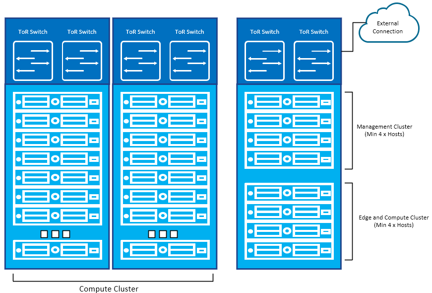

VCS supports clusters stretched across two availability zones as an Active/Active (vSAN Stretched Cluster) DR option with fast RTO and zero RPO.

##### Figure 14. Example Clusters and Racks, Two AZs

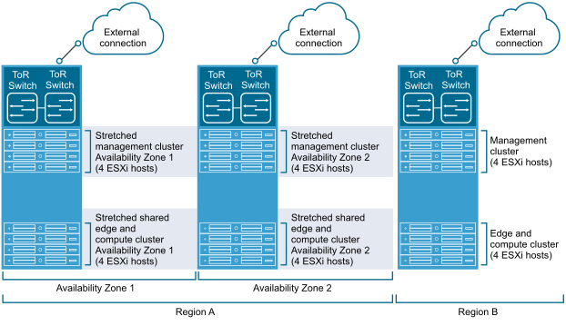

### Time Synchronization

Each components of VCS will use both Active Directory Domain Controllers as a Time Source. These will get their time from the sources specified below, therefore provide unified, reliable time across the SW layer in VCS. Further details about external Time Sources requirements can be found in [Software Defined Networks](lldSoftwareDefinedNetworks.md) document.

| Component       | Time Source                          |
|-----------------|--------------------------------------|
| ESXi            | External NTP Server + VCS AD Servers |
| AD              | External NTP Servers (ToR)           |
| Everything else | VCS AD Servers                       |

## Physical Network

The VCS management platform requires the use of Top of Rack Switches to communicate between racks (carrying SDN traffic) and as an exit point to the outside world (upstream routing exit point)
All network ports on the VCS hosts should be of 10Gbit transfer speed minimum. See the min specification in [VCS Bill Of Materials](hldDigitalHybridCloudBOM.md) for details.

All ToR switches must be configured for 802.1Q to enable vLAN trunking

VCS supports BGP as the dynamic routing protocol between it's Logical Routers into physical infrastructure. This is an requirement for NSX-T.

In a Stretched Cluster scenario with 2 Availability Zones, both zones are connected with each other via a stretched L2 network and connected to a Witness Host via L3. The details of this implementation are described in the [Software Defined Networks](lldSoftwareDefinedNetworks.md) document.

### Physical Port Settings

VCS requires the following port settings on all physical NICS and corresponding ToR switch ports

| **Setting** | **Value**                                            | **Justification**                               |
|-------------|------------------------------------------------------|-------------------------------------------------|
| MTU         | 9000 (Jumbo Frames enabled)                          | Requirement for VCF                             |
| Trunking    | All vLANS configured in 802.1Q Trunk                 |                                                 |
| STP         | Trunk PortFast                                       | STP is configured by default so enable setting. |
| DHCP Helper | VIF of MGMT and VXLAN subnet as a DHCP Proxy         | VCF recommendation                              |
| MultiCast   | IGMP Snooping ON ToR, IGMP Querier on all VXLAN VLAN | VCF recommendation.                             |

Note on Regional VCS installs: VCS MGMT networks, VXLAN Kernel ports and the shared edge and compute VXLAN Kernel ports for all VCS regions are required to be connected. This connection is flexible is dependent on customer requirement (e.g.MPLS, VPN etc).

## Physical Storage Design

VCS supports two storage architectures in the form of HyperConverged storage using vSAN and converged storage using Storage Area Network, SAN.

### vSAN

VCS supports HyperConverged storage using the vSAN technology included within VCF and the base vSphere stack. vSAN supports Flash and Hybrid storage types so can meet requirements for all customer deployment types and will be implemented with storage policies for more granular control over VCS storage.

As VCS requires the use of vSAN ready nodes configuration options are limited to Hybrid or All Flash types and the capacity of the drives specified. This is decided on a customer by customer basis with the minimum storage required defined in the minimum specifications area of this document.

| **ID** | **Design Decision**                       | **Design Justification**                                                                                              | **Design Implication**                                                                 |
|--------|-------------------------------------------|-----------------------------------------------------------------------------------------------------------------------|----------------------------------------------------------------------------------------|
| PSD001 | Allow Hybrid and All-Flash modes          | VCS will offer flexible CAPEX dependent on customers needs                                                            | Complicated BoM and licensing options                                                  |
| PSD002 | Use RAID-1 as default (Hybrid)            | Easy setup and maintenance. High data security due to fact that single disk group will not fail on single drive fault | More expensive to install                                                              |
| PSD003 | Allow optional erasure coding (AFA)       | Lowers VCS's total cost of ownership of the All-Flash storage                                                         | Turn on erasure coding, deduplication and compression. Min cluster size increases by 1 |
| PSD004 | Allow deduplication and compression (AFA) | Better storage utilisation on cluster                                                                                 | Single disk group cannot be expanded. On drive failure disk group must be recreated.   |
| PSD005 | Allow advanced storage policies           | Delivers flexibility to the customers                                                                                 | Storage policies must be configured separately and automated                           |
| PSD006 | AFA Arrays default to RAID 5              | Allows to take advantage of space efficient technology (use of RAID 1 allowed if needed)                              | Storage capacity specification must be checked against R1 or R5 implementation         |

### SAN

As per VCF requirements the management domain requires vSAN for the principal storage. VMFS on FC can be used for the principal storage with VI workload domains in VCS.

### HBAs, LUNs and datastores

FC HBAs used in ESXi host work correctly with the default configuration
settings but configuration guidelines provided by storage array vendor should be followed first. Please follow the bellow guidelines

- Do not mix FC HBAs from different vendors in a single host.  
- Ensure that the firmware level on each HBA is the same.
- For multipathing to work properly, each LUN must present the same LUN ID number to all ESXi hosts.
- A minimum of three ESXi hosts in single availability zone.  
- All hosts must be in the SDDC Manager inventory.  
- A Network Pool in SDDC Manager must be created for the vMotion network only that will be used for the WD cluster.  
- Provision several LUNs with different storage characteristics.
- Create a VMFS datastore on each LUN. Add notes/descriptions to each datastore according to its characteristics. Each LUN must have the correct RAID level and storage characteristic for the applications running in virtual machines that use the LUN.

> A minimum datastore size for Workload Domain creation should be 1TB as two egde cluster nodes are placed on that datastore.

### Space reclamation priority

During VMFS6 datastore creation, the default parameters for automatic space reclamation can be modified.  
At the VMFS6 datastore creation time, the only available method for the space reclamation is priority. This parameter defines the rate at which the space reclamation operation is performed when priority reclamation method is used. Typically, VMFS6 can send the unmap commands either in bursts or sporadically depending on the workload and configuration.
> In VCS, `LOW priority` which sends the unmap command at a less frequent rate, 25–50 MB per second should be used as a default space reclamation priority.

### Multipathing and Failover

VMware provides native multipathing support for a variety of storage arrays.

With multipathing, ESXi host uses more than one physical path that transfers data between the host and an external storage device. If a failure of any element in the SAN network, such as an adapter, switch, or cable, occurs, ESXi can switch to another viable physical path (path failover).

In addition to path failover, multipathing provides load balancing. Load balancing is the process of distributing I/O loads across multiple physical paths. Load balancing reduces or removes potential bottlenecks.

According to [hldDigitalHybridCloud.md](https://github.com/GLB-CES-PrivateCloud/DHC-Documentation/blob/develop/design/hldDigitalHybridCloud.md):

- each site should have One Midrange or Enterprise class FC Storage device.
- each site should have at least 2 SAN switches.
- each Host connected to FC Storage should have at least 2 HBA’s.
- all hosts must have multi-pathing software installed for high availability and redundancy.

For more details please read [hldDigitalHybridCloud.md](https://github.com/GLB-CES-PrivateCloud/DHC-Documentation/blob/develop/design/hldDigitalHybridCloud.md).

When ESXi host rescans storage adapter, the host discovers all physical paths to storage devices available to the host and the host determines which multipathing module, the `NMP` (Native Multipathing Plug-in), `HPP` (VMware High-Performance Plug-in), or an `MPP` (Multipathing Plug-ins), owns the paths to a particular device.
More details [here](https://docs.vmware.com/en/VMware-vSphere/7.0/com.vmware.vsphere.storage.doc/GUID-C1C4A725-8BE4-4875-919E-693812961366.html).

> In VCS, by default, ESXi provides an extensible multipathing module `NMP`. The VMware NMP supports all storage arrays listed on the VMware storage HCL and provides a default path selection algorithm based on the array type. The NMP associates a set of physical paths with a specific storage device, or LUN.
> Alternative to VMware’s NMP can be third party MPP (as third parties can plugin their own software rather than use the default NMP). **Please check storage vendor recomendations.**

For additional multipathing operations, the `NMP` uses submodules, called `SATPs` and `PSPs`. The `NMP` delegates to the `SATP` the specific details of handling path failover for the device.

> **ESXi automatically installs an appropriate SATP for an array that is in use. You do not need to obtain or download any SATPs.**

Block storage presented to vSphere hosts from Dell EMC Unity has the native `Path Selection Policy (PSP)` of round robin (`RR`) applied by default. In VCS, Round Robin (`RR`) is the recommended `PSP` for such kind of storage array

### Mixing of Storage Types

VCS supports the mixing of storage types within a VCS but types must remain consistent within a cluster.

### Overhead and Slack Space

As per VMware recommendations VCS vSAN clusters should have SSD caches specified at 10% of the total storage size (per host) and should be specified to retain 20-25% free space under full loading to maintain performance and the ability to rebuild and rebalance.

## Software Versions and Licensing

Specific version information for each component can be found in the VCS version matrix here: [VCS Version Control Matrix](https://github.com/GLB-CES-PrivateCloud/DHC-Documentation/wiki/LCM-Version-Matrix)

Licences (types and number) for VCS are detailed in the [VCS Bill of materials](hldDigitalHybridCloudBOM.md)

## Availability

The following chapter describes availability options for VCS and the cluster level and availability of the proxy configuration.

### Example: vSphere cluster Configuration

| **Parameter**    | **Value** | **Additional Info**                                                   |
|------------------|-----------|-----------------------------------------------------------------------|
| DRS              | ON        | Leave defaults from vCF                                               |
| vSphere HA       | ON        | Leave defaults from vCF                                               |
| Proactive HA     | OFF       | Can be turned ON if the proactive HA provider is available.           |
| VM compatibility | Yes       | Use datacenter setting and host version                               |
| EVC Mode         | ON        | Every new cluster should have EVC mode enabled at level of oldest CPU |
| DPM              | OFF       | Leave defaults from vCF                                               |

### Proxy High Availability

Internet Proxy is a critical element of VCS and has to be protected against service outage. Internet Proxy is responsible for management traffic and does not offer any customer-relating services.

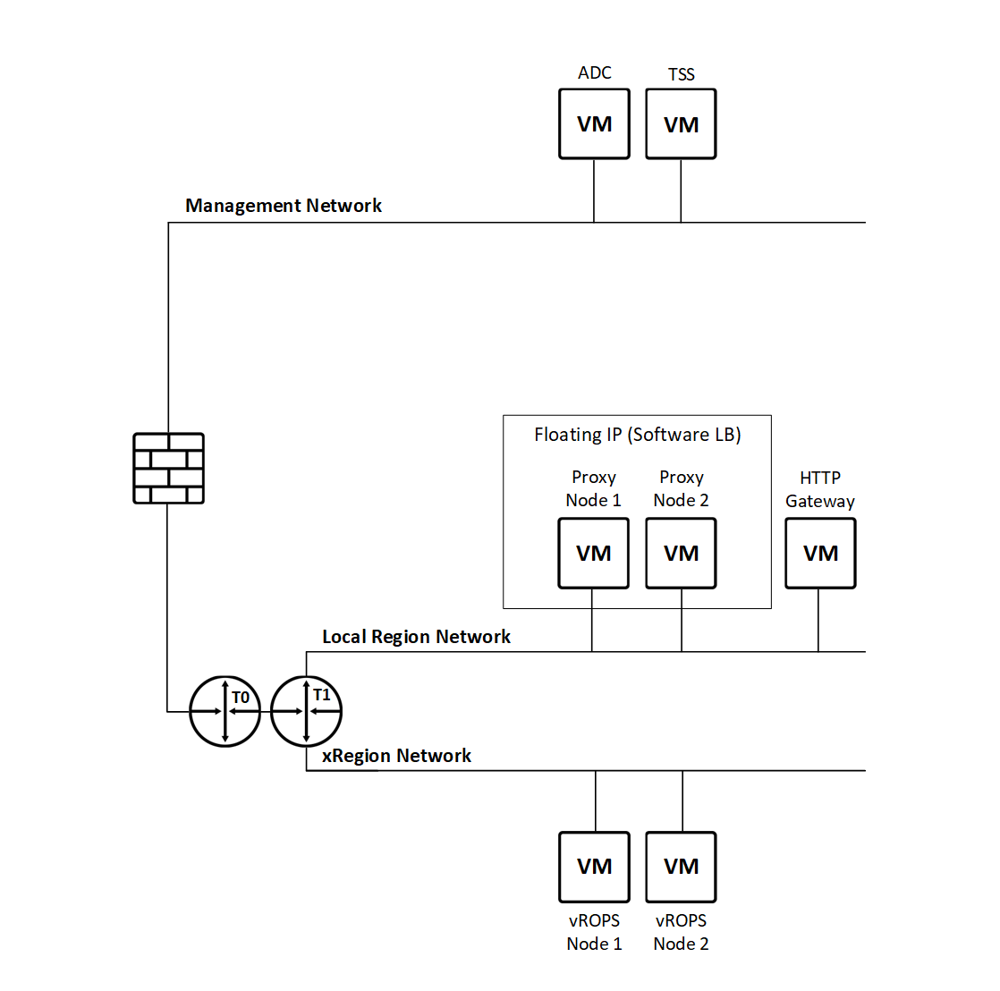

| **ID** | **Design Decision**                      | **Design Justification**                         | **Design Implication**                                  |
|--------|------------------------------------------|--------------------------------------------------|---------------------------------------------------------|
| PHA001 | Deploy internet proxy HA                 | HA config secures MGMT to Internet connectivity  | Additional resources needed in management cluster       |
| PHA002 | Use Squid as proxy server on Ubuntu      | Squid well known and reliable + secure machines. | Requires additional Ubuntu VMs in the management domain |
| PHA003 | Use active-passive proxy configuration   | Single squid is performant enough                | Easier setup and maintenance                            |
| PHA004 | Scale-up if more performance is needed   | Can alter VM HW spec if more performance needed  | Easier setup and maintenance                            |
| PHA005 | Load balance using floating IP via UCarp | No requirement for extra NSX Edge device         | Different monitoring needs                              |
| PHA006 | Enable Proxy whitelisting                | Limits outside access (Security)                 | Whitelist needs to be created and maintained            |
| PHA007 | Use port 3128                            | None                                             | None                                                    |

## Scalability

The table below shows minimum or maximum values of a given component in the compute and VCF area.

##### Table 13. Scalability details and maximums

| **Type**                     | **Detail**                                | **Min/Max Value**  | **Additional Info**                                                    |
|------------------------------|-------------------------------------------|--------------------|------------------------------------------------------------------------|
| Host                         | Number of hosts in management domain      | 4(min) 32 (max)    | Can be increased in steps of 1 Host                                    |
| Host                         | Number of hosts in compute domain         | 5(min) 64 (max)    | Can be increased in steps of 1 Host                                    |
| Host                         | Max non-volatile mem per host             | 6TB                | vSphere 7.0 host limit (Optane)                                        |
| Cluster/Workload Domain      | Min Hosts in a cluster (Hybrid)           | 4 (min)            |                                                                        |
| Cluster/Workload Domain      | Min Hosts in a  cluster (All Flash)       | 5 (min)            | If R5/6 Erasure coding is used requirement is min 4 safe 5             |
| Compute                      | Virtual CPUs per virtual machine          | 50% CPU cores/host | Using standard building block or custom                                |
| Memory                       | RAM per virtual machine                   | 50% RAM per host   | Using standard building block or custom                                |
| Storage Adapters and Devices | Virtual SCSI adapters per virtual machine | 1                  | Limited as vRA inability to select SCSI adapter during automation.     |
| Storage Adapters and Devices | Virtual disk size                         | 4TB / 24TB         | CEB limit based on 1Gbps / 10Gbps Datadomain uplink. Should be tested. |
| Physical NICs (uplinks)      | 25Gb Ethernet ports                       | 2                  | CF limit (Either 10, 25 or 40Gbps allowed) 25Git is default            |
| vCenter Server Scalability   | Linked vCenter Servers                    | 15                 | Same limit for Workload Domains                                        |
| Graphics video device        | Video memory per virtual machine          | 4GB                | No GPU acceleration for VMs in VCS is available                        |
| vSAN ESXi host               | vSAN disk groups per host                 | 3 (2 default)      | Limit of chassis capability (Dell) Default based on Bullion limit (2)  |
| vSAN ESXi host               | Capacity tier max devices per diskgroup   | 7                  | Technology limit                                                       |
| vSAN/vSphere Cluster         | Number of vSAN hosts in a cluster         | 64                 | Technology limit                                                       |
| vSAN Stretched Cluster       | Number of ESXi hosts in Cluster           | 30                 | Technology limit                                                       |
| vSAN Cluster                 | Number of datastores per cluster          | 1                  | Technology limit                                                       |
| vSAN virtual machines        | Virtual machines per host                 | 200                | Technology limit                                                       |
| vSAN virtual machines        | Virtual machines per cluster              | 6400               | Technology limit                                                       |

# 6 Security

## Role Based Access Control

Role Based Access Control groups and permissions are described in a separate document available here: [VCS RBAC](lldDhcRoleBasedAccessControl.md)

## Firewall

Please refer to the [Software Defined Networking](lldSoftwareDefinedNetworks.md)

## Certificates

VCS includes a dedicated Certificate Authority (CA). Microsoft CA is the requirement taken directly from vCF. The only supported method of acquiring certificates is web enrolment. The following components will get their certificates through SDDC Manager:

- vCenter Server
- NSX-T Managers
- SDDC Manager
- Aria Suite Lifecycle Manager

The following components will get their certificates through Aria Suite Lifecycle Manager:

- Aria Automation (if necessary in the future)
- Aria Operations for Logs
- Aria Operations
- Workspace One Access

## vSAN Encryption

Data At Rest Encryption (DARE) is enabled by default in VCS. It takes advantage of features available in vSAN 7.0+ to provide ‘per datastore’ level encryption. ‘At Rest’ implies that the data is decrypted on access meaning this feature does NOT (and is not intended to) protect in-flight data. It requires:

- The use of vSAN enterprise licencing ‘vSAN Enterprise’.
- Configuration of vSphere Native Key Provider instance on Compute vCenter Server

Data at rest encrypts both all the cache and capacity devices making up the vSAN. Additionally, vSAN host core dumps are also encrypted.

### vSphere Native Key Provider

vSphere Native Key Provider (NKP) is a vCenter build-in featura available from vSphere 7 Update 2 onwards. It can be used instead of fully functional KMS deployment to support features like vSAN DARE, VM encryption and vTPM.
NKP design ensures that there are no dependency loops. NKP stores Key Derivation Key on each ESXi hosts indvidually and the key persists over hosts reboots. This ensures that even if vCenter Server which contains NKP instance is not available, data can be encrypted/decrypted also after host reboot.
Due to fact that encyrption keys are stored on ESXi hosts it is strongly recommended that Compute hosts are equipped with TPM2.0. KDK is stored individually on each ESXi hosts in TPM if the host has one, or as part of the ESXi encrypted configuration if the host does not have a TPM module.  
vSphere Native Key Provider uses AES256 to generate keys.

vSAN encryption with vSphere Native Key Provider uses a number of encryption keys. These are:

- Key Derivation Key (KDK) - Native Key Provider uses a key derivation function to generate the equivalent of a Key Encryption Key (KEK) with the KDK as the seed for that function. From a functional perspective it’s the same as a KEK stored in a standard key provider/KMS, but the underlying technology is different.
- Data Encryption Key (DEK) - This is the key used in the I/O path to encrypt/decrypt data. Each disk in a vSAN disk group will have a DEK.

##### Figure 15. vSAN Encryption with NKP overview

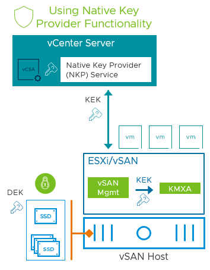

### Backup and Disaster Recovery considerations

DR Active/Active Scenario (vSAN Stretched cluster): Since Native Key Provider instance is configured on a vCenter level and KDK is stored on ESXi hosts there are no special considerations reagrding vSAN Stretched Clutser (Active/Active setup). Computer vCenter holding NKP instance will serve keys to all hosts participating in vSAN Stretched cluster.

vSpere Natve Key Provider backup is a crucial aspect of configuration. Backup process consists of two elemets - initial configuration backup and ongoing vCenter Server file based backup.
After NKP is configured it requires to be backed up before it is ready to use. This backup process exports Native Key Provider configuration as .p12 file which can additionally be password protected. Export file contains configuration information like NKP instance name and KDK key. Such export file can be imported back into vCenter server allowing to restore NKP.
It is also highly recommended to configure vCenter Server file based backup with password protection. vCenter Server file based backup contains NKP configuration along with KDK hence using password for encryting backup is recommended.

### vSAN Encryption Design Decisions

| **ID** | **Design Decision**                                               | **Design Justification**                                                                                       | **Design Implication**                                                                        |
|--------|-------------------------------------------------------------------|----------------------------------------------------------------------------------------------------------------|-----------------------------------------------------------------------------------------------|
| ENC001 | vSpere Native Key Provider will be used as key provider           | NKP is a vSphere built-in, free and easy to implement key provider designed for services like vSAN DARE        | Compute ESXi hosts should be equipped with TPM2.0                                             |
| ENC002 | Native Key Provoder will be configured on Compute vCenter         | NKP must be configured on vCenter Server managing vSAN cluster which will be encrypted                         | None                                                                                          |
| ENC003 | NKP configuration backup will be stored in HashiVault             | NKP cannot be used until it is backed up after initial setup                                                   | None                                                                                          |
| ENC004 | Compute vCenter Server file based backup will be used             | vCenter file based backup contains NKP configurartion and KDK                                                  | None                                                                                          |
| ENC005 | Compute vCenter Server file based backup will password protected  | Backup files contain KDK which can be used to decrypt data                                                     | None                                                                                          |
| ENC006 | NKP instance name will be unique                                  | Allows for clear NKP identification mitigating risk of wrong key provider usage                                | None                                                                                          |
| ENC007 | AES-NI needs to be enabled in BIOS                                | Encryption is CPU intensive. AES-NI significantly improves encryption performance                              | VSAN Nodes with CPUs not supporting AES-NI should not be used                                 |
| ENC008 | Rotation of encryption keys will not be used on a regular basis   | Time consuming, used for emergency situation only (key exposure etc).                                          | Manual Trigger                                                                                |

## Antivirus

VCS integrates with Trend Micro Deep Security service managed by BDS. Deep Security infrastructure design document is available od BDS share point [Here:](https://sp2013.myatos.net/sites/BDS/cys/GCS/Pages/HomePage.aspx) with restricted access. **NOTE:** This service is for the Management workload domain.  Customer Workload Domains will require a separate integration.

For small to medium cloud agent-based integrations (< 500-1000 VMs), the Deep Security Shared infrastructure can be used. Instead of the direct connection line through a customer dedicated firewall, the connection will be done through the Atos ASN Public firewall as encrypted VPN over the Internet.

The figure below describe the cloud deployment for the Atos VMware Cloud Services Product.
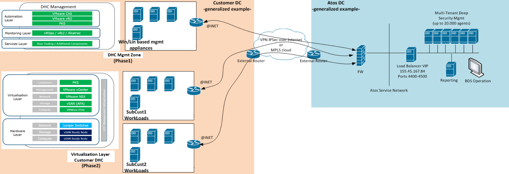

Each cloud deployment has a management zone and multiple workload zones. Agents need to be deployed in all zones together with the local DS Relay in order to secure the entire environment. Each zone needs to be integrated as an individual tenant for individual policy customization and individual reporting.

Only Basic Anti Malware Protection is in scope (i.e. smart scan firewall is disabled).

VCS automates Antivirus Relay and the AV Agent installation on all windows and linux **management virtual machines** during the VCS deployment stages.

Communication Deep Security framework throughout AV proxy is made over ports 4430, 4431, 4432, 4433, 4434 and 4445.

# Monitoring

This chapter describes monitoring of SDDC elements.

## Base Virtualization components

vCenter Server and ESXi hosts are monitored by Aria Operations using vSphere Management Pack and the health of the base virtualization objects is visualized using SDDC management health Management Pack. Hardware failures like Fan outage, Power Supply Unit outage and generic sensor issues are monitored by vSphere for all ESXi servers regardless of the hardware vendor. In the time of writing this document NSX-T based workload domains could not be connected directly to Aria Operations. It was decided that separate vCenter adapter will be created for NSX-T based workload domains.
In Aria Operations 8+ alert definitions are a combination of symptoms and recommendations that identify problem areas and generate alerts on which you act for those areas. Out-of-the-box vROPS deployment contains over 1000 pre-configured alerts that will be used to monitor VCS system.

## Storage

vSAN is monitored using the Aria Operations Integrated vSAN management pack in combination with the SDDC Management Health management pack. Several Dashboards are available in vROps to give an overview of vSAN Health, Capacity and Performance.

## Workspace ONE Access

The Management Pack for Workspace ONE Access collects metrics for objects within its plug-in.
The alerts (column Alert and Description) are triggered when any of the monitoring resources in VMware Identity Manager displays an unexpected behaviour.

| **ID** | **Resource**                | **Metric Key**                                                                                                                                                                                                                                                                                                                                                                                                                                                                                                                    | **Alert**                                                               | **Description**                                                                               |
|--------|-----------------------------|-----------------------------------------------------------------------------------------------------------------------------------------------------------------------------------------------------------------------------------------------------------------------------------------------------------------------------------------------------------------------------------------------------------------------------------------------------------------------------------------------------------------------------------|-------------------------------------------------------------------------|-----------------------------------------------------------------------------------------------|
| ID001  | Connector                   | Status<br/>Summary                                                                                                                                                                                                                                                                                                                                                                                                                                                                                                                |                                                                         | Component of Workspace ONE Access that provides directory integration, user authentication |
| ID002  | Configurator                | Status<br/>Summary                                                                                                                                                                                                                                                                                                                                                                                                                                                                                                                |                                                                         | Application deployment                                                                        |
| ID003  | Access Control Service(ACS) | Status<br/>Summary                                                                                                                                                                                                                                                                                                                                                                                                                                                                                                                | Health of ACSHealth-ApplicationDeployment is Low.                       | Triggered when the Workspace ONE Access ACSHealth-ApplicationDeployment service is down.                      |
| ID004  | Workspace ONE Acess FQDN       | Status<br/>Summary                                                                                                                                                                                                                                                                                                                                                                                                                                                                                                                | Health of FQDN Workspace ONE Acess Server is critically low.                           | Triggered when the FQDN service is down.                                                      |
| ID005  | Database Connection         | Status                                                                                                                                                                                                                                                                                                                                                                                                                                                                                                                            | Database Test connection failed.                                        | Triggered when the Database service is down.                                                  |
| ID006  | Application Manager         | Status<br/>Summary                                                                                                                                                                                                                                                                                                                                                                                                                                                                                                                | Health of Application Manager-Application Deployment is Critically Low. | Triggered when the Application Manager-Application Deployment service is down.                |
| ID007  | Directory System            | Number of Synced Users<br/>Domain<br/>Number of Synced Groups<br/>Health<br/>UUID<br/>Name<br/>Type<br/>Number of Alerts<br/>Last Sync Time<br/>Sync<br/>Status                                                                                                                                                                                                                                                                                                                                                                   |                                                                         | Component of Workspace ONE Acess that provides directory integration, user authentication |
| ID008  | Workspace ONE Acess Adapter Instance       | Health<br/>Total Users<br/>Total Groups<br/>Total Apps<br/>Total Devices<br/>All Activity<br/>Number of Unique User Logins<br/>Total Logins<br/>Users Added<br/>Users Removed<br/>Users Updated<br/>Groups Added<br/>Groups Removed<br/>Groups Updated<br/>Number <br/>Number Running Directories<br/>Version<br/>Number IDAP Directories<br/>Number Active <br/>Directories<br/>Number Local Directories<br/>Workspace ONE Acess UUID<br/>Workspace ONE Acess Full Name<br/>Workspace ONE Acess IP<br/>Name<br/>UUID<br/>Version<br/>Status<br/>IP Address<br/>Time Zone<br/> |                                                                         | Component of Workspace ONE Acess that provides directory integration, user authentication |
| ID009  | Certificate                 | Issuer<br/>Subject<br/>Start Date<br/>End Date<br/>Port<br/>                                                                                                                                                                                                                                                                                                                                                                                                                                                                      | Health of Workspace ONE Acess Certificate is not good , look like it is Expired.       | Triggered when Workspace ONE Acess Certificate has expired or deleted.                                       |
| ID010  | Connector                   | Status<br/>Summary                                                                                                                                                                                                                                                                                                                                                                                                                                                                                                                |                                                                         | Component of Workspace ONE Acess that provides directory integration, user authentication |
| ID011  | Connector                   | Status<br/>Summary                                                                                                                                                                                                                                                                                                                                                                                                                                                                                                                |                                                                         | Component of Workspace ONE Acess that provides directory integration, user authentication |

As a design decision, vIDM will not be clustered. Therefore below Aria Operations metrics can be disabled:

- Port Connectivity
- Analytics Connection
- Messaging Connection
- Elasticsearch Health
- RabbitMQ

## Proxy: Squid

The proxy service of a choice is Squid. In the current VCS setup Squid performs only the redirect function and no cache is gathered. For this reason the events gathered by the service are quite limited. The access.log file is expected to store *TCP_TUNNEL* and *TCP_DENIED* events like below:

```shell
1568097656.170 310000 192.168.220.43 TCP_TUNNEL/200 21241 CONNECT api.mgmt.cloud.vmware.com:443 - FIRSTUP_PARENT/192.168.255.12 -
1568097781.632      0 172.20.101.22 TCP_DENIED/403 4062 GET http://detectportal.firefox.com/success.txt - HIER_NONE/- text/html
```

Hence the monitoring focus is placed on the squid service availability. Refer to [Monitoring and Logging lld](lldMonitoringLogging.md) for details.

## Aria Operations for Logs

Aria Operations for Logs Management pack installed by vCF in Aria Operations does not provide any alerts or symptoms. There's only one alert that is available in other service packs

- Aria Operations for Logs Server Host is Down that MUST be in enabled state
- Telegraf agent MUST be deployed on Aria Operations for Logs nodes
- Aria Operations for Logs website url MUST be monitored from Aria Operations.

## SDDC Manager

Whilst the general monitoring of the virtual machine and operating system is included in standard Aria Operations monitoring, additional monitoring of below components/processes of SDDC Manager should be in place as well. Currently VMware doesn't provide any vROPS Management Pack for SDDC Manager.

|             | Name                  | Notes                                                                   |
|-------------|-----------------------|-------------------------------------------------------------------------|
| Components: |                       |                                                                         |
|             | Health of API Server  |                                                                         |
|             | Certificate           |                                                                         |
|             | Port connectivity     | requires ports for product and integration communications               |
|             | FQDN                  |                                                                         |
|             | Database              |                                                                         |
|             | Workflow tasks status | Running; Failed                                                         |
| Services:   |                       |                                                                         |
|             | domainmanager         | Domain Manager                                                          |
|             | domainmanager-db      | VCF Domain Manager Database Initialization                              |
|             | commonsvcs            | Platform Services                                                       |
|             | lcm                   | Life Cycle Management Service                                           |
|             | lcm-db                | LCM Database Initialization                                             |
|             | operationsmanager     | VMware Cloud Foundation Operations Manager                              |
|             | operationsmanager-db  | VMware Cloud Foundation Solutions Manager Database Initialization       |
|             | solutionsmanager      | VMware Cloud Foundation Solutions Manager                               |
|             | solutionsmanager-db   | VMware Cloud Foundation Solutions Manager Database Initialization       |
|             | postgres              |                                                                         |
|             | vcf-firewall          | VCF Firewall configuration service                                      |
|             | sddc-manager-ui-app   | SDDC Manager UI APP                                                     |
|             | sosrest               | VMware Cloud Foundation Supportability and Serviceability (SoS) Service |

## Aria Suite Lifecycle Manager

Whilst the general monitoring of the virtual machine and operating system is included in standard Aria Operations monitoring, additional monitoring of below components/processes of Aria Suite Lifecycle Manager should be in place as well. Currently VMware doesn't provide any Aria Operations Management Pack for Aria Suite Lifecycle Manager.

|             | Name                           | Notes                                                     |
|-------------|--------------------------------|-----------------------------------------------------------|
| Components: |                                |                                                           |
|             | Health of API Server           |                                                           |
|             | Certificate                    |                                                           |
|             | Port connectivity              | requires ports for product and integration communications |
|             | FQDN                           |                                                           |
|             | Database                       |                                                           |
|             | Requests status                |                                                           |
|             | Environments health status     |                                                           |
|             | Environment - datacenter count |                                                           |
|             | My VMware - connection status  |                                                           |
|             | My VMware - Proxy settings     |                                                           |
|             | Authenticate Source - IDM      | added/ not added                                          |
|             | Active Directory Over IWA      | configured/not configured                                 |
| Services:   |                                |                                                           |
|             | vpostgres                      |                                                           |

## vSAN Stretched Cluster

Required vSAN capabilities are provided natively in the Aria Operations product. Integration between VMware vSAN and Aria Operations comes from a collection of APIs that provide a method for the systems to communicate with each other.  Monitoring of vSAN Stretched Cluster data nodes and witness node are in place as well. Dashboards for vSAN Stretched Cluster are already built directly into vRealize Operations.

All HA components (VMs) that should be kept on both Availability Zones (domain controllers, bastion hosts, internet proxy, KMS) need anti affinity rules to keep them in two Availability zones (AZ) and need to be monitored. Monitoring of a vm movement between two availability zones and triggering the alerts when the vm moved to a different availability zone is not defined as an alert or symptom definition in Aria Operations by default. Custom alerts have to be created manually based on event info (configure alerts via Aria Operations for Logs and forward them to Aria Operations).

# Integration of VMware Identity Manager (vIDM) for Customer Login and SSO

## Overview

VMware Identity Manager (vIDM) is chosen as the centralized Single Sign-On (SSO) platform and landing page for customer access. Customers authenticate to vIDM and then can seamlessly access multiple applications such as vRealize Operations (vROps), NSX-T, and others from the vIDM catalog page. All these applications are protected behind a reverse proxy to ensure secure access.

## Architectural Considerations

- **vIDM as SSO Portal:**
vIDM acts as the Single Sign-On (SSO) portal for customers. It provides users with a unified entry point (catalog page) to access entitled applications without repeated logins.

- **Reverse Proxy Placement:**
vIDM and target applications (e.g., vROps, NSX-T) reside behind a dedicated reverse proxy that manages inbound requests, enforces security policies, and routes traffic to appropriate endpoints. The reverse proxy ensures secure external access and protects back-end services.

## Operational Considerations

- **Directory Integration:**
vIDM is connected to Active Directory or LDAP to validate user credentials. Directory synchronization and user data mapping are configured to ensure proper role and group entitlements.

- **Authentication Adapters:**
Authentication adapters such as LDAP, Kerberos, or certificate authentication can be enabled in vIDM. Ensure the correct adapter is configured to support the domain credentials scenario.

- **User Entitlement and Catalog Management:**
Applications are added to vIDM catalog and entitled to specific user groups or roles to control access.

- **Monitoring and Logging:**
Enable monitoring on vIDM health, authentication successes/failures, and reverse proxy status to proactively manage availability and troubleshoot issues.

- **Failure Handling:**
Deploy vIDM in a highly available mode and distribute instances across availability zones to ensure failover capability.

## Configuring vIDM Catalog Page

The vIDM catalog page acts as a central access point where users can launch their entitled applications using Single Sign-On (SSO). For each application added to the catalog, configuration involves setting metadata, defining access control, and ensuring seamless integration with the authentication infrastructure.

- **Application Addition and Metadata Setup:**
Applications are added to the catalog using OpenID Connect (OIDC), where only the Redirect URI associated with each application's Client ID is configured. This simplifies integration by allowing the remote application to handle authentication without requiring traditional SAML configurations such as metadata exchange, ACS URLs, or RelayState parameters.

- **Entitlements and Access Control:**
Access to cataloged applications is governed through entitlements. These entitlements are linked to user groups or individual users within the enterprise directory. Only users with appropriate entitlements can view and launch the app from the vIDM catalog.

- **Authentication Configuration:**
vIDM integrates with authentication sources like Active Directory (AD) or LDAP. Authentication policies determine which methods are used (e.g., password-based login, Kerberos, RSA tokens), and how users from different domains are authenticated. It is important that the login domains and authentication adapters are aligned with user directory settings.

- **Reverse Proxy Considerations:**
In deployments using reverse proxies, it’s essential that routing and SSL termination are configured correctly. This includes forwarding headers such as X-Forwarded-For and X-Forwarded-Proto, enabling consistent handling of authentication tokens and redirects. Proxy configurations must ensure compatibility with SAML/OIDC-based flows and avoid breaking session continuity.

- **User Experience and SSO Behavior:**
Once properly configured, users accessing the vIDM portal are presented with a catalog of their entitled applications. Upon launching an application, SSO facilitates seamless redirection without additional credential prompts. Application visibility, branding, and post-login redirection can be customized to improve the overall user experience.

## Authentication Flow

1. Customer accesses vIDM landing page via reverse proxy URL.
2. vIDM authenticates the user, usually against Active Directory or another configured directory.
3. Upon successful login, the user sees the app catalog page listing entitled applications.
4. Customer selects an application; vIDM issues a SAML or OIDC token.
5. Token is sent to the selected application, which validates the token and establishes the user session without any additional login prompt.

#### vIDM Single Sign-On Authentication Flow

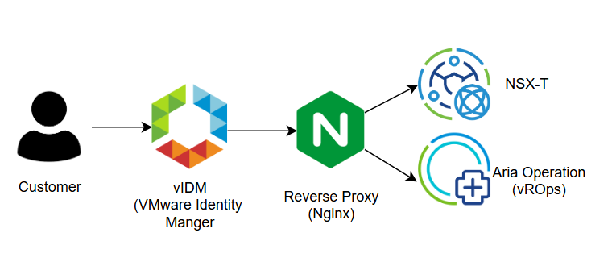

## Dependencies

The following components must be in place for successful vIDM-based SSO integration.

##### Table: Dependencies for vIDM-based SSO

| **Component**             | **Requirements**                                                                                                                            |
| ------------------------- | ------------------------------------------------------------------------------------------------------------------------------------------- |
| vIDM & Connector      | vIDM must be installed and accessible via the correct URL, and the Connector must be joined to Active Directory and remain active.             |
| Active Directory      | The Connector should be able to read users and groups, and appropriate AD groups must be created for application access control.               |
| Reverse Proxy (NGINX) | The reverse proxy must correctly forward requests to vIDM and applications, handle required headers and cookies, and manage SSL termination.   |
| DNS & Network         | All service URLs including vIDM, vROps, and NSX-T must be resolvable via DNS, and the network must allow communication between all components. |
| Applications          | All integrated applications must support SSO protocols such as SAML or OIDC and be added to the vIDM application catalog.                      |
| Certificates          | All systems must present valid SSL certificates, and mutual trust should be established between relevant components.                           |

## Benefits of SSO Implementation

vIDM-based SSO improves security, user experience, and application manageability.

##### Table: Benefits of vIDM-based SSO

| **Benefit**                       | **Description**                                                                                   |
| --------------------------------- | ------------------------------------------------------------------------------------------------- |
| Centralized Authentication    | Customers use a single portal to log in and access multiple apps, improving user experience.      |
| Improved Security             | Centralized enforcement of authentication policies and user entitlements across all applications. |
| Simplified Access Management  | Application access is managed centrally through the vIDM catalog, reducing administrative effort. |
| Scalability and Extensibility | New apps can be added to the vIDM catalog without disrupting the existing login process.          |

##### Table: Design decision

| ID    | Design Decision                                                                     | Design Justification                                                                                  | Design Implications                                                                                                      |
| ----- | ----------------------------------------------------------------------------------- | ----------------------------------------------------------------------------------------------------- | ------------------------------------------------------------------------------------------------------------------------ |
| ID001 | Expose vIDM via Reverse Proxy as the customer-facing landing page                   | Enables branded URL, central access, and simplified routing through a single public endpoint          | Requires correct reverse proxy configuration (NGINX), SSL setup, and handling of headers and cookies for SSO to function |
| ID002 | Customize login domain and branding on reverse proxy instead of default vIDM screen | Maintains customer branding and seamless integration with customer environment                       | Requires changes in NGINX templates and ongoing maintenance to reflect future branding or layout changes                 |

# Infrastructure Reporting Dashboards

VCS utilize Aria Operations for its live reporting capability for capacity, health etc.  This provides a number of standard dashboards available to operations.

See [LLDReporting](https://github.com/GLB-CES-PrivateCloud/DHC-Documentation/blob/develop/design/lldReporting.md) document for further information and to view the pre-defined dashboards in VROPS that are available in VCS.
