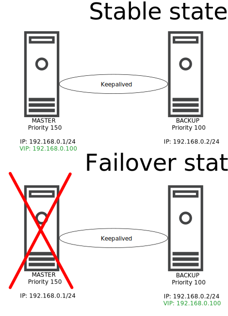

# IP failover service based on Keepalived package for Linux hosts

# Table of Contents

- [IP failover service based on Keepalived package for Linux hosts](#ip-failover-service-based-on-keepalived-package-for-linux-hosts)
- [Table of Contents](#table-of-contents)
- [Changelog](#changelog)
- [Purpose](#purpose)
- [Audience](#audience)
- [Scope](#scope)
- [IP failover mechanism description](#ip-failover-mechanism-description)
- [Design decisions for proxy nodes](#design-decisions-for-proxy-nodes)
- [Example configuration files - based on VX7 addressing](#example-configuration-files---based-on-vx7-addressing)
  - [Master - pxy002](#master---pxy002)
  - [Backup - pxy003](#backup---pxy003)

# Changelog

| Date | TOS | Issue | Author | Description |
|------|-----|-------|--------|-------------|
| 21.07.2022 | | N/A | Lukasz Bienkowski | Document creation |

# Purpose

The purpose of this document is to describe the design of IP failover mechanism used in VCS for proxy components.

# Audience

This document is intended for Atos Cloud Services Engineers and Architects responsible for VMware Cloud Services (VCS) solution implementation and maintenance

# Scope

This LLD is intended to cover below components and domains:

- IP failover description based on Keepalived package
- Design decisions for proxy nodes
- Configuration files

# IP failover mechanism description

The IP failover mechanism is deployed on the desired Linux components using the Keepalived package. Keepalived is an implementation designed to implement a networking feature called VRRP (Virtual Router Redundancy Protocol), which is an open standard. During its deployment, a virtual IP is being defined in configuration. Clients can use this IP as a destination, so it is transparent to them which node actually responds to a request. The virtual IP is dynamically assigned to one of the nodes as an outcome of a MASTER/BACKUP election process algorithm, so a node with higher priority becomes a MASTER and the secondary becomes a BACKUP. The nodes contact each other by registering into a VRRP multicast group 224.0.0.18. Nodes are as well members of a group with unique ID specified in configuration which prevents conflicts with other nodes. Keepalived does not provide any loadbalancing, it is just an active/passive solution.



# Design decisions for proxy nodes

- Keepalived is direct replacement of the legacy UCARP package
- At initial state pxy002 is the MASTER node with priority of 150
- At initial state pxy003 is the BACKUP node with priority of 100
- VRRP group ID is set as 10 - currently used group IDs are stored on Confluence documentation in General VCS IPAM section
- Keepalived has a tracking script implemented (check_squid) which checks squid service status every 3 seconds. If service is not running it fails over to secondary node (virtual IP is moved to secondary node)
- Preemption is disabled. This means if node is failed over from MASTER to BACKUP, the virtual IP **DOES NOT** come back to node where a higher priority is set when previous MASTER node is available again. Manual switchover can be done by disabling squid service on current MASTER node.

# Example configuration files - based on VX7 addressing

## Master - pxy002

```yaml
global_defs {
        enable_script_security
        script_user next
}
vrrp_script check_squid {
 script "/usr/sbin/squid -k check"
 interval 3
}
vrrp_instance PROXY {
        state MASTER
        interface ens160
        virtual_router_id 10
        priority 150
        advert_int 1
        nopreempt
        authentication {
              auth_type PASS
              auth_pass <clipped>
        }
        virtual_ipaddress {
              172.23.101.38/24
        }
        track_script {
              check_squid
        }
}
```

## Backup - pxy003

```yaml
global_defs {
        enable_script_security
        script_user next
}
vrrp_script check_squid {
 script "/usr/sbin/squid -k check"
 interval 3
}
vrrp_instance PROXY {
        state BACKUP
        interface ens160
        virtual_router_id 10
        priority 100
        advert_int 1
        nopreempt
        authentication {
              auth_type PASS
              auth_pass <clipped>
        }
        virtual_ipaddress {
              172.23.101.38/24
        }
        track_script {
              check_squid
        }
}
```
