# Managed OS LLD

# Table of Contents

- [Managed OS LLD](#managed-os-lld)
- [Table of Contents](#table-of-contents)
- [1. Introduction](#1-introduction)
  - [1.1. Purpose](#11-purpose)
  - [1.2. Audience](#12-audience)
  - [1.3. Scope](#13-scope)
  - [1.4. Related Documents](#14-related-documents)
  - [1.5. List of changes](#15-list-of-changes)
  - [1.6. Requirement Levels](#16-requirement-levels)
- [2. Architecture Overview](#2-architecture-overview)
  - [2.1. Business and Solution Requirements](#21-business-and-solution-requirements)
  - [2.2. Network requirements](#22-network-requirements)
    - [2.2.1. Network Port and Protocol Requirements](#221-network-port-and-protocol-requirements)
    - [2.2.2. Firewall Rules](#222-firewall-rules)
- [3. Detailed Logical Design](#3-detailed-logical-design)
  - [3.1. Security](#31-security)
    - [3.1.1. Role Based Access Control](#311-role-based-access-control)
    - [3.1.2. Network Time synchronization](#312-network-time-synchronization)
  - [3.2. Availability and Scalability](#32-availability-and-scalability)
    - [3.2.1. Availability Design](#321-availability-design)
    - [3.2.2. Scalability Design](#322-scalability-design)
  - [3.3. Recoverability](#33-recoverability)
  - [3.4. Monitoring](#34-monitoring)
  - [3.5. DHC Managed OS Offering](#35-dhc-managed-os-offering)
    - [3.5.1. Supported OS Types](#351-supported-os-types)
    - [3.5.2. Patching](#352-patching)
    - [3.5.3. Monitoring](#353-monitoring)
    - [3.5.4. Reporting](#354-reporting)
  - [3.6. ServiceNow Integration](#36-servicenow-integration)
    - [3.6.1 Integration Account](#361-integration-account)
    - [3.6.2 CMDB Discovery](#362-cmdb-discovery)
    - [3.6.3 CMDB Cloud Event Handler](#363-cmdb-cloud-event-handler)
  - [3.7 Automation](#37-automation)
    - [3.7.1 Orchestration Flow](#371-orchestration-flow)
- [4. Software distribution](#4-software-distribution)
  - [4.1. IaaS Web Services](#41-iaas-web-services)
    - [4.1.1. Windows](#411-windows)
      - [Technical Implementation](#technical-implementation)
      - [Security Specifications implemented into IIS](#security-specifications-implemented-into-iis)
    - [4.1.2. Linux](#412-linux)
      - [Technical Implementation](#technical-implementation)
- [5. Operational Level Agreement](#5-operational-level-agreement)
  - [5.1 Global Policies](#51-global-policies)

# 1. Introduction

## 1.1. Purpose

The purpose of this document is to provide detailed design and architectural guidance required to implement Managed OS offering in accordance with Atos standards and portfolio services. The principal aim of this document is to translate the high-level design (HLD) into a technical low-level design (LLD).

Design is providing component architecture overview in Architecture Overview chapter that provides basic building blocks and main principles, followed by Detailed Logical Design.

Architecture Overview provides basic building blocks and main design principles of presented design. It is covering known requirements cascaded from HLD and other LLDs.
Detailed Logical Design presents business logic, relations and fundamental design decisions.
Detailed Physical Design provides detailed configuration of components including POD type specifics.

## 1.2. Audience

This document is intended for Atos Cloud Services Engineers and Architects responsible for Digital Hybrid Cloud (DHC) solution implementation and maintenance.

## 1.3. Scope

This LLD is intended to cover below components and domains:

1. Managed OS integrations and requirements
2. Networking requirements

## 1.4. Related Documents

This document is a subset of Atos Technology Lifecycle Management (ATLM) artefacts. All documents are stored in the DHC documentation repository.

Table 1: ATLM Related Documents

 | Document Name                    |
 | --------------------------------------------------------------------------------------------------------------------------------------------------------------------------------------------------------------------------------------------------------------------------------------------------------------------------------------------------------------------------------------------------------------------------------------------------------------------------- |
 | [DHC High-Level Design](hldDigitalHybridCloud.md) |
 | [Global Compute Operational Policies](https://atos365.sharepoint.com/sites/100000409/DCH%20Techartifacts/Forms/AllItems.aspx?id=%2Fsites%2F100000409%2FDCH%20Techartifacts%2FGLOBAL%20COMPUTE%20OPERATIONAL%20POLICIES%2FGLOBAL%20COMPUTE%20OPERATIONAL%20POLICIES%2Epdf&parent=%2Fsites%2F100000409%2FDCH%20Techartifacts%2FGLOBAL%20COMPUTE%20OPERATIONAL%20POLICIES&isSPOFile=1&xsdata=MDV8MDJ8fGFiMTEyNTFhMDljNzRmMzc1NjhmMDhkZDg3MTI1MTg1fDMzNDQwZmM2YjdjNzQxMmNiYjczMGU3MGIwMTk4ZDVhfDB8MHw2Mzg4MTUyMzQ5MDMzMzI0OTV8VW5rbm93bnxWR1ZoYlhOVFpXTjFjbWwwZVZObGNuWnBZMlY4ZXlKV0lqb2lNQzR3TGpBd01EQWlMQ0pRSWpvaVYybHVNeklpTENKQlRpSTZJazkwYUdWeUlpd2lWMVFpT2pFeGZRPT18MXxMMk5vWVhSekx6RTVPbVE0TTJVM1ptSXlMVGMwTTJNdE5EazNaUzFpTkRBd0xXVTBaalJrT0dReE1XVmtaRjlsTjJSaVptRTJaQzAwTlRFeUxUUTNOell0WVRJM01pMWtaRFl4TnpNME9EbGpOV1ZBZFc1eExtZGliQzV6Y0dGalpYTXZiV1Z6YzJGblpYTXZNVGMwTlRreU5qWTRPVFV5TVE9PXxkMWVkYzQ1MDg1YTA0MzJiNTY4ZjA4ZGQ4NzEyNTE4NXw3ZWRjMDc3MjFiYTk0NDVhYjNmZmZlNDViM2Y0YzQ2ZQ%3D%3D&sdata=YVJ4VWhYSmpSY2tCM1N0SmIwUUgxSVk3Rk1VeTFUU3FhVjRXTFpwZXRZST0%3D&ovuser=33440fc6%2Db7c7%2D412c%2Dbb73%2D0e70b0198d5a%2Cmarcin%2Ekujawski%2Eexternal%40atos%2Enet&OR=Teams%2DHL&CT=1746477192297&clickparams=eyJBcHBOYW1lIjoiVGVhbXMtRGVza3RvcCIsIkFwcFZlcnNpb24iOiI0OS8yNTA0MDMxOTExMyIsIkhhc0ZlZGVyYXRlZFVzZXIiOmZhbHNlfQ%3D%3D) |
 | [TSSA - High Level Design](https://atos365.sharepoint.com/:w:/r/sites/690001424/ATF/ServerMgt/BBSA/Shared%20Documents/01.%20Design%20and%20Release%20Management/TSSA%20Global%20(Replica)/Replica%20TSSA%20instance-HLD%20v1.1.docx?d=w6571ceff975e49069b887dd5e1bdaf3a&csf=1&web=1&e=u1Zcpj) |
 | [TSO - Low Level Design](https://atos365.sharepoint.com/:w:/r/sites/690001424/ATF/ServerMgt/BBSA/Shared%20Documents/01.%20Design%20and%20Release%20Management/TSO/LOW%20LEVEL%20DESIGN%20-%20TSO-MultiGrid_1.0.docx?d=w52dcf4b7d5d54e778d1a60f68a257d78&csf=1&web=1&e=8Oe2Sk) |
 | [BladeLogic Server Automation - Patching](https://atos365.sharepoint.com/sites/690001424/ATF/ServerMgt/BBSA/Shared%20Documents/Forms/Shared.aspx?id=%2Fsites%2F690001424%2FATF%2FServerMgt%2FBBSA%2FShared%20Documents%2F03%2E%20User%20documentation%2FPLW%2DTSE%2D0023%20BladeLogic%20Server%20Automation%20%2D%20Patching%2Epdf&parent=%2Fsites%2F690001424%2FATF%2FServerMgt%2FBBSA%2FShared%20Documents%2F03%2E%20User%20documentation)  |
 | [BladeLogic Server Automation - Reporting](https://atos365.sharepoint.com/sites/690001424/ATF/ServerMgt/BBSA/Shared%20Documents/Forms/Shared.aspx?id=%2Fsites%2F690001424%2FATF%2FServerMgt%2FBBSA%2FShared%20Documents%2F03%2E%20User%20documentation%2FPLW%2DTSE%2D0012%5FTrueSight%20Smart%20Reporting%20%2D%20Access%20and%20Usage%20Reporting%20System%2Epdf&parent=%2Fsites%2F690001424%2FATF%2FServerMgt%2FBBSA%2FShared%20Documents%2F03%2E%20User%20documentation) |
 | [Onboarding to CMF (Tools Setup and Agent Rollout)](https://atos365.sharepoint.com/sites/690001424/tools/cmf/SitePages/cmf-onboarding.aspx)  |
 | [CMF user guide — CMF documentation](https://docs.cmf.myatos.net/)  |

## 1.5. List of changes

| Version | Date       | Description                    | Author(s)           |
| ------- | ---------- | ------------------------------ | ------------------- |
| 1.0     | 2024-10-16 | Initial draft creation         | Marcin Kujawski     |
| 1.1     | 2024-10-21 | Add patching and monitoring    | Krzysztof Olszewski |
| 1.2     | 2024-11-12 | Update patching and monitoring | Krzysztof Olszewski |
| 1.3     | 2025-03-14 | Add Web server installation    | Krzysztof Olszewski |
| 1.4     | 2025-03-15 | Update solution requirements and software distribution chapters | Marcin Kujawski |
| 1.5     | 2025-05-05 | Added OLA and Global Policies chapters | Marcin Kujawski |
| 1.6     | 2025-06-04 | Added SNOW integration chapters | Marcin Kujawski |

## 1.6. Requirement Levels

This document is following the principles below to categories all requirements and design decisions.

| Term       | Meaning     |
| ---------- | -------------------------------------------------------------------------- |
| MUST       | The definition is an absolute requirement of the specification. |
| MUST NOT   | The definition is an absolute prohibition of the specification  |
| SHOULD     | There may exist valid reasons in particular circumstances to ignore a particular item, but the full implications must be understood and carefully weighed before choosing a different course  |
| SHOULD NOT | There may exist valid reasons in particular circumstances when the particular behaviour is acceptable or even useful, but the full implications should be understood, and the case carefully weighed before implementing any behaviour described with this label |
| MAY        | Any design decisions that are not classified as MUST and SHOULD or covering optional feature that is not general available for DPC product |

# 2. Architecture Overview

TrueSight Automation for Servers (TSSA) is the industry-leading solution for automated vulnerability management, patching, compliance, configuration changes, software deployments, and provisioning in the data center and cloud.

TrueSight Automation for Servers provides a policy-based approach for managing data centers with greater speed, security, quality, and consistency. Broad support for all major operating systems on physical servers and leading virtualization and cloud platforms lets IT install and configure server changes with ease. Rich, out-of-the-box content helps IT automate continuous compliance checks and remediation for security or regulatory requirements. Now IT staff can build, configure, and enforce compliance faster and more reliably. With a simplified web portal, the IT operations team can increase the server to admin ratio, gain productivity, complete audits swiftly, and quickly respond to increasing business demands.

For DHC Managed OS offering Internal Atos Tooling Services are consumed to provide such services.

Atos TSSA team provides cross-platform server automation. The key features that are covered under the platform are:

1. **Threat remediation**: Automate vulnerability management to rapidly analyze security vulnerabilities, obtain necessary patches, and take corrective action.
2. **Patching**: Automate maintenance windows and change management processes with real-time visibility into patch compliance.
3. **Compliance**: Integrate role-based access control, pre-configured policies for CIS, DISA, HIPAA, PCI, SOX documentation and remediation.
4. **Configuration**: Harden deployments at time of provisioning and in production, detect and remediate drift, and manage change activities to ensure stability and performance.
5. **Service provisioning**: Automate build-out of service or application from VM provisioning to fully operational.
6. **Reporting**: Assess change impact, get real-time job status, or complete an audit.

Figure 1. TSSA Architecture

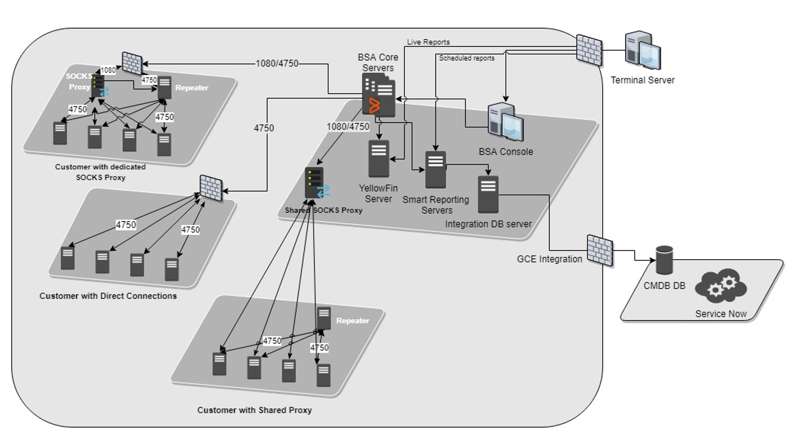

Following components are used in above diagram:

- Client Layer: The client tier access can be achieved by the BMC Bladelogic console, a command line interface and network shell component. BSA Consoles will be deplyoed in the designated Termal servers with an internal load balancing mechanisam through HA proxy.
- Middle Tier: The middle tier is where the application server, which controls how the BMC BladeLogic console communicates with remote servers. The application server manages communication between consoles and remotes servers it also controls the interaction with the database and file servers. From a reporting perspective, the Reporting and analytics service will function out of this tier also. The reporting server reads data from the core BMC BladeLogic database as well as the reporting data warehouse.
- Server Tier: Those are the target endpoints (managed OS servers), called also agents or server estates. The server tier consists of the RSCD agents on remote servers.
  
## 2.1. Business and Solution Requirements

The table below provides known requirements mandatory to be incorporated into design decisions of Managed OS offering described in this LLD.

Table 2: Initial Requirements

| Decision ID | Design Decision                                                                                                               | Design Justification                                                                                                                                                | Implications |
| ----------- | ----------------------------------------------------------------------------------------------------------------------------- | ------------------------------------------------------------------------------------------------------------------------------------------------------------------- | ------------ |
| MOS001      | Communication to Managed OS servers will be realised by TSSA Gateway Server (SOCKS Proxy)                                     | To achive clear setup, TSSA Gateway Server (SOCKS Proxy) will be installed in each datacenter                                                                       | None         |
| MOS002      | TSSA Gateway Server (SOCKS Proxy) will be deployed in Workload Domain vCenter                                                 | To scan all agents deployed in customer network, connectivity have to be delivered                                                                                  | None         |
| MOS003      | TSSA Gateway Server (SOCKS Proxy) deployment is performed by DHC team                                                         | As a part of onboarding DHC will deploy TSSA Gateway Server (SOCKS Proxy) in a proper network and perform initial VM setup only                                     | None         |
| MOS004      | TSSA team is responsible for BAU tasks as well as all activities related with monitoring of TSSA Gateway Server (SOCKS Proxy) | Due to fact that TSSA Gateway Server (SOCKS Proxy) belongs to TSSA infrastructure day2 operations will not be handled by DHC team                                   | None         |
| MOS005      | TSSA Gateway Server (SOCKS Proxy) requires proper network connectivity (access to customer networks)                          | TSSA Gateway Server (SOCKS Proxy) need to be able to communicate with Managed OS servers                                                                            | None         |
| MOS006      | Dedicated service account with proper permissions in customer domain is a requirement                                         | Managed OS integration requires domain account created in customer domain in order to add computers to AD and manage DNS entries during the Managed OS provisioning | None         |
| MOS007      | Proxy server accessible from customer network need to be guaranteed                                                           | To download the TSSA agent installation files customer proxy service need to be provided                                                                            | None         |
| MOS008      | WinRM communication enabled on customer domain servers                                                                        | To allow proper vRO integration (powershell host configuration) WinRM has to be configured on customer AD server(s)                                                 | None         |
| MOS009      | Monitoring of Managed OS servers will be realised by ATF CMF Gateway Server                                                   | To achive clear setup, ATF CMF Gateway Server will be installed in each datacenter to allow server monitoring                                                       | None         |
| MOS010      | ATF CMF Gateway Server will be deployed in Workload Domain vCenter                                                            | To provide monitoring feature of all agents deployed in customer network, connectivity have to be delivered                                                         | None         |
| MOS011      | ATF CMF agent will be installed via TSSA automated software distribution                                                      | To provide monitoring feature agent need to be installed on each Managed OS server                                                                                  | None         |
| MOS012      | ATF CMF Gateway Server deployment is performed by DHC team as well as full responsibility for operational tasks               | As a part of onboarding DHC will deploy ATF CMF Gateway Server in a proper network and perform initial VM setup only                                                | None         |
| MOS013      | Repository server is required to store agents for Managed OS (TSSA/Itrion) | To be able to connect OS to Atos managed platform agent need to be installed, as it is not part of the template it need to be dowloaded from secure location (Internet is not allowed) | None |
| MOS014       | Repository server should be available at HTTPS protocol and should be protected with username and password |Installation packages have to be protected and should be accessed only in secure way | None |
| MOS015       | Local user account is required (mos_adm) to install and configure TSSA agent | To successfully connect server to TSSA platform administrative account is required | None |
| MOS016       | Local user account (mos_adm) requires sudo/administrative permissions within operating system | Regular account is not having enough permissions and cannot be used for TSSA agent installation | None |
| MOS017       | Staging directory is always set to path `/temp/stage` | Hard requirement from TSSA | None |
| MOS018       | Monitoring agents for CMF are installed by the Atos managed platform itself (TTSA/Itrion) | All additional agents/packages/software need to be install from Atos managed platform | None |
| MOS019       | CMDB discovery is required to enable CMF monitoring dynamically and allow complete CMDB integration | To allow CMDB integration SNOW Discovery process is used to dynamically create vm instance CIs based on vCenter events (created/deleted) | None |
| MOS020       | Local linux account and windows domain account are required for discovery process to create OS CIs | To create server CI (linux_server or windows_server) SNOW requires Linux and Windows MID servers to be deployed on DHC for CMDB Discovery purpose | None |

## 2.2. Network requirements

### 2.2.1. Network Port and Protocol Requirements

The following ports must be allowed within management network:

| Source Component                  | Destination Component             | Transport Protocol | Port         | Purpose                                                                 |
| --------------------------------- | --------------------------------- | ------------------ | ------------ | ----------------------------------------------------------------------- |
| TSSA Core Application Servers     | TSSA Gateway Server (SOCKS Proxy) | TCP                | 1080<br>4750 | Communication from TSSA Core Application Servers to TSSA Gateway Server |
| TSSA Gateway Server (SOCKS Proxy) | ATF CMF Nagios NaNo Gateway       | TCP                | 443          | Monitoring of TSSA Gateway Server (SOCKS Proxy)                         |
| Aria Automation Servers           | TSO Server                        | TCP                | 38080        | Access from vRA to TSO to execute API calls                             |
| Aria Automation Servers           | Customer AD                       | TCP                | 5986         | Communication from DHC to Customer AD (WinRM over HTTPS)                |
| CMF Nagios NaNo Gateway           | TMDX1                             | TCP                | 443          | Communication from DHC CMF NaNo Gateway to CMF ASN infrastructure       |
| CMF Nagios NaNo Gateway           | TMDX2                             | TCP                | 443          | Communication from DHC CMF NaNo Gateway to CMF ASN infrastructure       |
| CMF Nagios NaNo Gateway           | TMDX3                             | TCP                | 443          | Communication from DHC CMF NaNo Gateway to CMF ASN infrastructure       |
| CMF Nagios NaNo Gateway           | TMDX LoadBalancer                 | TCP                | 443          | Communication from DHC CMF NaNo Gateway to CMF ASN infrastructure       |
| TMDX1                             | CMF Nagios NaNo Gateway           | TCP                | 22           | Access via SSH from TMDX servers to CMF Nagios Nano Gateway             |
| TMDX2                             | CMF Nagios NaNo Gateway           | TCP                | 22           | Access via SSH from TMDX servers to CMF Nagios Nano Gateway             |
| TMDX3                             | CMF Nagios NaNo Gateway           | TCP                | 22           | Access via SSH from TMDX servers to CMF Nagios Nano Gateway             |
| TMDX LoadBalancer                 | CMF Nagios NaNo Gateway           | TCP                | 22           | Access via SSH from TMDX servers to CMF Nagios Nano Gateway             |

Please note that for Aria Automation required also communicate to SNOW CMDB, however no specific network traffic need to be opened as proxy servers are used to guarantee this traffic flow.

### 2.2.2. Firewall Rules

| Source Component                                                             | Destination Component                                                      | Transport Protocol | Port         | Purpose                                                                 |
| ---------------------------------------------------------------------------- | -------------------------------------------------------------------------- | ------------------ | ------------ | ----------------------------------------------------------------------- |
| `161.89.115.172`<br>`161.89.115.177`<br>`161.89.176.136`<br>`161.89.176.137` | `TSSA Gateway NAT IP`                                                      | TCP                | 1080<br>4750 | Communication from TSSA Core Application Servers to TSSA Gateway Server |
| `vRA LB NAT IP`              | `<Customer Domain Controller Servers IP>` | TCP | 5986 | Adding Customer OS into domain, manage DNS entries for computers |
| `TSSA Gateway NAT IP`                                                        | `161.89.112.32`                                                            | TCP                | 443          | Monitoring of TSSA Gateway Server (SOCKS Proxy)                         |
| `vRA LB NAT IP`                                                              | `161.89.115.217`                                                           | TCP                | 38080        | Access from vRA to TSO to execute API calls                             |
| `CMF Nagios NaNo Gateway NAT IP`                                             | `161.89.118.99`<br>`161.89.112.88`<br>`161.89.177.69`<br>`161.89.182.0/28` | TCP                | 443          | Communication from DHC CMF NaNo Gateway to CMF ASN infrastructure       |
| `161.89.118.99`<br>`161.89.112.88`<br>`161.89.177.69`<br>`161.89.182.0/28`   | `CMF NaNo Gateway NAT IP`                                                  | TCP                | 22           | Access via SSH from TMDX servers to CMF Nagios Nano Gateway             |

# 3. Detailed Logical Design

TSSA Gateway Server (SOCKS Proxy) VM is deployed to the customer network on Workload Domain vCenter, and provides a single plane for Managed OS integration.

Figure 2. Managed OS Server Provisionig Flow

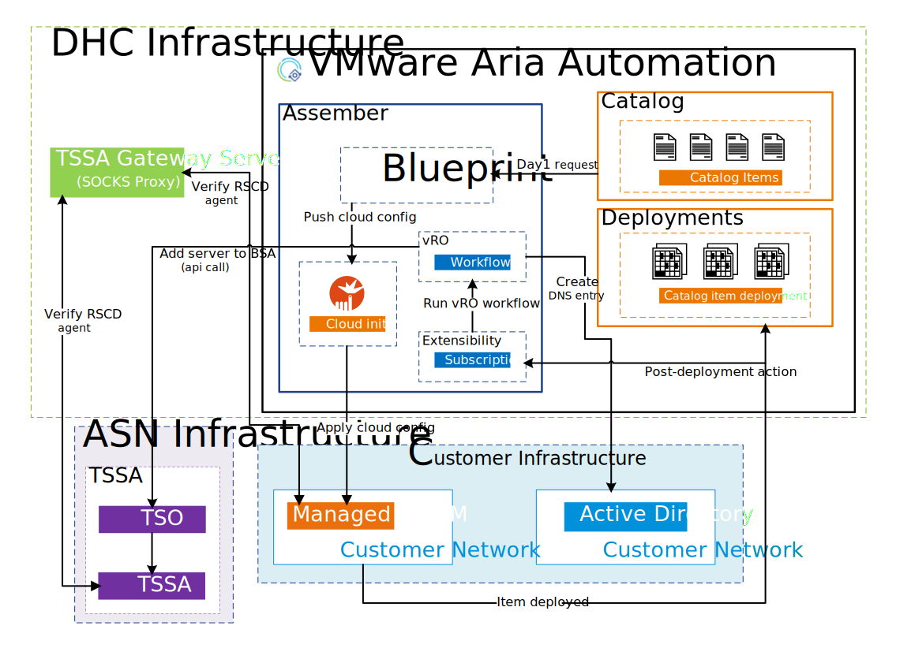

Managed OS Server provisionig process consist of following steps:

1. Managed OS server request is submitted from Service Broker catalog.
2. Server is deployed and cloud init configuration is pushed into server.
3. Once VM deployment is finished, vRA Subscription triggers vRO workflow to add server into TSSA.
   - new DNS entry is created in customer domain
   - API call is sent to TSO to add server to TSSA
4. TSO executes request.
5. TSSA verifies the server and adds agent into BSA console (if connection from Gateway server is fine and server FQDN is found in domain, TSSA add server successfully).
6. Additional jobs are triggered on TSSA to install all required agents (monitoring etc.).
7. Optionally, if IIS installation is selected, then software distribution worklfow is triggered and executed on TSSA. If Managed OS only is requested, that step is skipped in automation.
8. Cloud Event Handler is triggered to create Server CI in CMDB.
9. Notification email is sent to confirm Managed OS server creation.
10. vRO worklow is finished.

Managed OS Server decommissionning process consist of following steps:

1. Managed OS server request is submitted from Service Broker catalog.
2. vRA Subscription triggers vRO workflow to delete server from TSSA (before Vm deletion).
3. Cloud Event Handler is triggered to retire the Server CI.
4. Notification email is sent to confirm Managed OS server was deleted.
5. Once vRO workflow is finished, VM is beeing deleted from Aria Automation.

## 3.1. Security

### 3.1.1. Role Based Access Control

Atos based solutions must guarantee proper access management.

TSSA Gateway Server (SOCKS Proxy) **will not** be only managed by DHC Operations team. DHC administrator is responsible only for initial deployment and VM configuration. Further support and operational tasks are provided by TSSA team which is fully responsible for keeping server alive.

ATF CMF Gateway Server **will** be managed by DHC Operations team. DHC administrator is responsible to guarantee same level of support as for standard DHC management VMs.

### 3.1.2. Network Time synchronization

In order to provide accurate time and date values the TSSA Gateway Server (SOCKS Proxy) and ATF CMF Gateway Server instances will have NTP protocol synchronization enabled and it will synchronize with local DHC Active Directory servers. The NTP solution used for this is `chrony`.

## 3.2. Availability and Scalability

### 3.2.1. Availability Design

| Decision ID | Design Decision                                                                                                                         | Design Justification                                                 | Implications |
| ----------- | --------------------------------------------------------------------------------------------------------------------------------------- | -------------------------------------------------------------------- | ------------ |
| MOS021      | TSSA Gateway Server (SOCKS Proxy) and ATF CMF Gateway VMs availability is managed by vSphere HA and DR configured on the DHC Management | No need for higher availability                                      | None         |
| MOS022      | TSSA Gateway Server (SOCKS Proxy) and ATF CMF Gateway VMs are to be backed up by DHC backup solution                                    | To provide another level of availability and access to history files | None         |

TSSA Gateway Server (SOCKS Proxy) and ATF CMF Gateway Server availability will be based on the VMware High-Availability feature. Therefore no additional availability mechanisms are required.

### 3.2.2. Scalability Design

| Object                            | Limit | Description                                                                                 |
| --------------------------------- | ----- | ------------------------------------------------------------------------------------------- |
| TSSA Gateway Server (SOCKS Proxy) | 1     | There should be no more than 1 virtual machines that host TSSA Gateway Server (SOCKS Proxy) |
| ATF CMF Gateway Server            | 1     | There should be no more than 1 virtual machines that host ATF CMF Gateway Server            |

## 3.3. Recoverability

TSSA Gateway Server (SOCKS Proxy) and ATF CMF Gateway Server will be added to the default management backup policy. Therefore no additional recoverability mechanisms are required.

## 3.4. Monitoring

Effective monitoring of compute infrastructure is essential for ensuring best performance, availability, and security. Key performance indicators (KPIs) such as CPU use, memory usage, network traffic, and disk I/O should be defined to track system health. Alerts should be configured for critical thresholds to promptly notify administrators of potential problems. Monitoring practices should be continuously evaluated and adjusted to meet evolving requirements.

Monitoring of the TSSA Gateway Server (SOCKS Proxy) will be done using ATF CMF Nagios functionality outside DHC infrastructure. TSSA team cannot finalize the onboarding of new customer without having that task completed.

Monitoring of ATF CMF Gateway Server is done within standard DHC vROPS monitoring and alerting mechanisms.

## 3.5. DHC Managed OS Offering

OS templates are to be provided by Global Product Practice Server OS and kept up to date according to customer security requirements. Global images are in line with TSS security settings. Global images **DO not** contain any tooling agents. Tooling is installed as part of deployment activities.

### 3.5.1. Supported OS Types

Following OS types are supported in DHC Managed OS service offering:

| Vendor    | Product        | Release Version |
| --------- | -------------- | --------------- |
| Microsoft | Windows Server | 2019, 2022      |
| Red Rat   | RHEL           | 8.x, 9.x        |

### 3.5.2. Patching

Effective server patching is crucial for keeping system security and preventing vulnerabilities. Critical vulnerabilities should be patched promptly to mitigate immediate risks. Patches should be evaluated in a non-production environment to find and address potential compatibility issues. A regular patching schedule should be set up to ensure consistent updates. Patching practices should be continuously evaluated and refined to address evolving security threats.

Patching Window is selected during the provisioning process of Managed Server within DHC Service Broker form. It can be adjusted as per Client requirements. By default DHC implements following patching windows:

- 1st Saturday
- 2nd Saturday
- 3rd Saturday
- 4th Saturday

Patching Window is the time when server applies missing patches and reboot the server, it means that during that time there is pre-approved outage of the server. Patch window parameter is passed in payload using ``description`` field during execution ``Add Server to BSA`` API call to TSO.  
Example:

```json
{
"bsa_actions":[
    {
      "action":"add_server",
      "name":"test-bsa07.nx1dhc01.next",
      "description":"DHC Managed OS Server, Patching Window: 1st_Saturday",
      "customer":"DHC",
      "datacenter":"DHC_Les_Clayes",
      "admin_account":"root",
      "staging_dir":"/var/tmp",
      "alcatraz_ready":"True"
    }
  ]
}
```

On the TSSA end, patching configuration is implemented based on smart groups definition that correlates with the patch window assigned to a server and based on that includes server to specific patching window.  

Figure 3. Custom SmartGroups (patching windows)

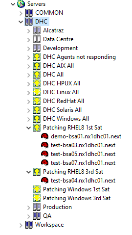

Figure 4. Patch update process


In TSSA patching process relays on patching jobs. They collect information which patch catalogues and/or patch smart groups (customized
collections of patches) will be used (including all patches or making some exclusion), target machines and schedule.  
There are two main types of patching jobs – analyze without remediation and analyze with remediation. First one checks which patches are missing on the servers and needed remediation to be run manually later (for all or only chosen patches). The second one automatically applies all patches defined in the job.  
Patching job examples/templates are created in the customer folder (they can be customized/deleted if needed): Jobs/Customer/Patch Management.  
The patch catalogues are provided as part of the BladeLogic core infrastructure. They can be found at: /Depot/COMMON/Patch Management/Patch Catalogues. Patch catalogues are created either as ONLINE (automatically updated on regular basis) or FROZEN state (created once per month and never updated). AHS GPP team is responsible for the content of patch catalogues.  
Patch smart groups are collection of patches grouped by their properties (i.e. bulletin number, date of publishing, name etc.) that can be included or excluded from patching activity. Users are allowed to create their own customized smart groups (visible only in scope of their customer) within existing patch catalogues.

## 3.5.3. Monitoring

As a monitoring solution **ATF CMF** tool is used to provide monitoring functionality for Managed OS.

Each Customer need to be onboarded into ATF CMF and this step is required to use and enable Managed OS Monitoring feature. Onboarding consist of deployment of ATF CMF Gateway Server that requires proper connectivity to Global ATF CMF infrastructure as well as installation of CMF Gateway Application to provide monitoring of the endpoint servers. Also firewall request is necessary to open dedicated ports in ASN network to have proper communication between CMF Gateway Server placed in DHC and CMF server (TMDX).
DHC team needs to arrange access for the ATF CMF support team.

CI needs to be defined in ServiceNow CMDB with following conditions:

> Name: hostname (device name)  
> Support Group L2 (warning! every change in this parameter has to be announced to CMF team prior to changing it)  
> IP address  
> OS Family + Operating System + OS Version  
> Company  
> Location (ISO Country Code)  
> Operation status: Live  
> Status: installed  
> Is Monitored: set to true/yes  
> Monitoring Tool: ATF-NAGIOS
> Monitoring object ID: <server-name>

To proper handle incident tickets there is also additional requirements:

- categories must be defined for the customer in ticketing system (SNOW)
- support groups must be available for the customer in ticketing system (SNOW)

To manage the Customer monitoring configuration (thresholds, setting monitoring details, etc.) access to CMF Self-Service portal is provided by Global ATF CMF team. CMF Self-Service portal is not exposed to the Customer itself.

By default installation of the Nano and CMF binaries is done within TSSA deploy jobs. Job is installing both NaCl and CMF agent packages and is triggere within a Managed OS provisioning process.

## 3.5.4. Reporting

**T**rue**S**ight **S**mart **R**eporting are the reporting solutions. TSSR is a web-based reporting application that provides extensive reporting capabilities related to customer servers that are managed by TrueSight Server Automation (TSSA). Both the solutions provide a dynamic platform to display reports from the data that is stored in the Reporting database.  
Set of standard reports templates available in the inventory may be run once on scheduled for regular mail delivery. Reports show data restricted to the role that is used (customer and OS). Reports can be generated as xls, csv, pdf and html formats (with automated email delivery).
GTS TSSA support team can schedule reports on a single customer level. No-standard reports can be ordered via RFS/Tickets. Categories of standard reports:

- Patch
- Audit
- Job Activity
- Inventory

Figure 5. New report requests  

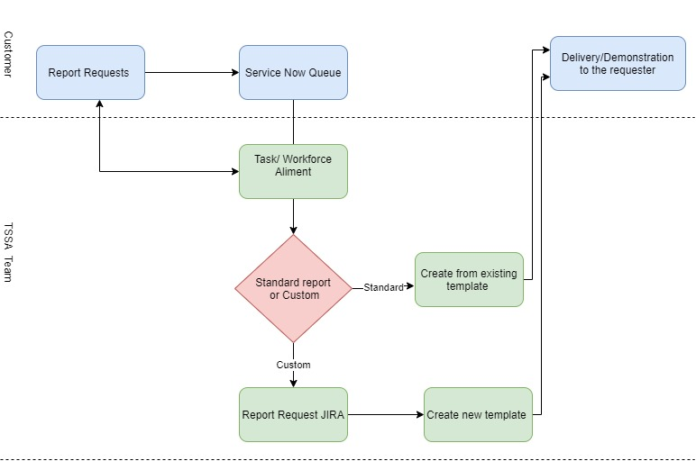

# 3.6 ServiceNow Integration

## 3.6.1 Integration Account

An integration user must be created to enable callbacks and API-based communication with ServiceNow. Integration account need to have necessary privileges (`RunbookCallback Job Family` role) to send HTTP callbacks as this user is used in orchestration flows to notify ServiceNow upon completion or failure of a task and later on trigger the further automation scripts located in SNOW to complete CMDB integration for Managed OS.

| Decision ID | Design Decision                                                                                                                         | Design Justification                                                 | Implications |
| ----------- | --------------------------------------------------------------------------------------------------------------------------------------- | -------------------------------------------------------------------- | ------------ |
| MOS023      | CMDB integration user account need to be created in order to send callback information back to SNOW | Callback is required to trigger SNOW related handlers to fully complete Managed OS provisioning process and to notify SNOW upon completion or failure of backend tasks | None         |
| MOS024      | `RunbookCallback Job Family` need to be assigned to CMDB integration user account | Without this permissions user will not be able to send API calls via REST API. Proper ACL need to be assigned | None |

## 3.6.2 CMDB Discovery

To enable full integration between the backend infrastructure and ServiceNow (SNOW) Configuration Management Database (CMDB) for Managed OS offering, the CMDB Discovery module must be properly configured. This process allows ServiceNow to identify and catalog infrastructure components such as servers, applications, and virtual machines from systems like vCenter and operating systems. Below are the design decisions made to achieve a successful CMDB Discovery configuration.

| Decision ID | Design Decision                                                                                                                         | Design Justification                                                 | Implications |
| ----------- | --------------------------------------------------------------------------------------------------------------------------------------- | -------------------------------------------------------------------- | ------------ |
| MOS025      | Windows MID Server will be used to provide full CMDB Discovery implementation | Windows MID is requirement to inspect both Linux and Windows flavors for Customer OS's                                        | None         |
| MOS026      | Dedicated domain or/and local accounts will be used to provide OS access (Windows & Linux)| The MID Server requires appropriate credentials to log in to target machines and collect data for creating Server CIs in the CMDB hence that need to be provided| None |
| MOS027      | IP ranges need to be configured as range filters to limit the discovery scope | To scan only particular Customer workload subnets, IP ranges need to be strictly specified as this ensures that only servers in approved networks are scanned, optimizing performance and limiting scope | None         |
| MOS028      | Business rule will be used to create server CI in CMDB | SNOW callback is triggering the business rule to con | None |
| MOS029      | Application CI detection will be enabled for SQL Server and IIS | To enrich discovered server CIs with application-level components, it is required to enable Application CIs within CMDB discovery settings | None |
| MOS030      | CMDB Discovery process will be scheduled as daily task| Provide regular discovery schedule ensures that CMDB stays up to date | None |
| MOS031      | CMDB Discovery will run on following events generated by vCenter: `VmDeployedEvent`, `VmRemovedEvent`, `VmReconfiguredEvent` | To keep CMDB state as much up to date as possible discovery process need to run every time new VM will be deployed, deleted or reconfigured.| None |

## 3.6.3 CMDB Cloud Event Handler

| Decision ID | Design Decision                                                                                                                         | Design Justification                                                 | Implications |
| ----------- | --------------------------------------------------------------------------------------------------------------------------------------- | -------------------------------------------------------------------- | ------------ |
| MOS032      | Cloud Event Handler - DHC Event Handler is used to create and decommission server CI in CMDB                                            | Required to enable CMF monitoring   | Specific number of properties need to be properly set in order to automatically enable monitoring for new provisioned CI and update CI status to while decommissioning process|

# 3.7 Automation

## 3.7.1 Orchestration Flow

Orchestration flow presents all steps required to provide Managed OS server on DHC platform.

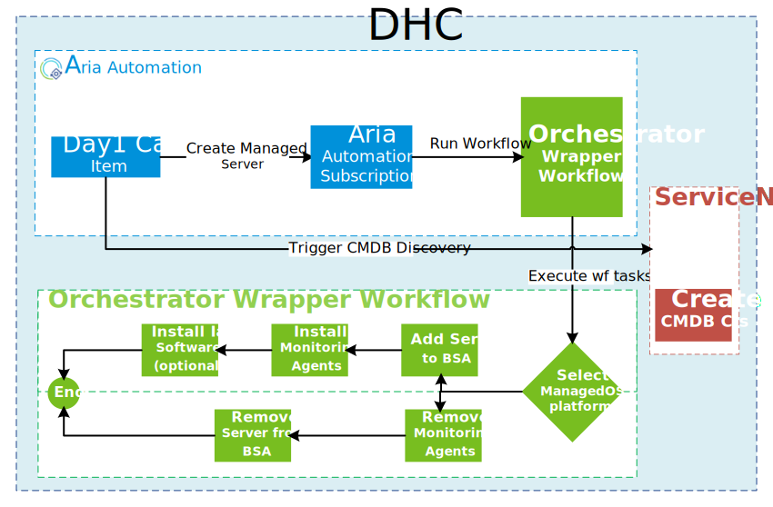

# 4. Software distribution

The TSSA software distribution process is designed to ensure that software is delivered efficiently, securely, and reliably. TSO (TrueSight Orchestration) is an automation and orchestration solution that integrates with TSSA to streamline IT processes, automate workflows, and improve operational efficiency. It helps in automating complex tasks such as software distribution. A software deployment request is initiated through vRO workflow via API. TSO processes the request and determines the necessary actions.

TSSA is fully responsible for software distribution for Managed OS for both Linux and Windows. There are dedicated custom TSO actions defined with respective configuration to install particular piece of software.

Figure 6. DHC Integration with TSSA and TSO

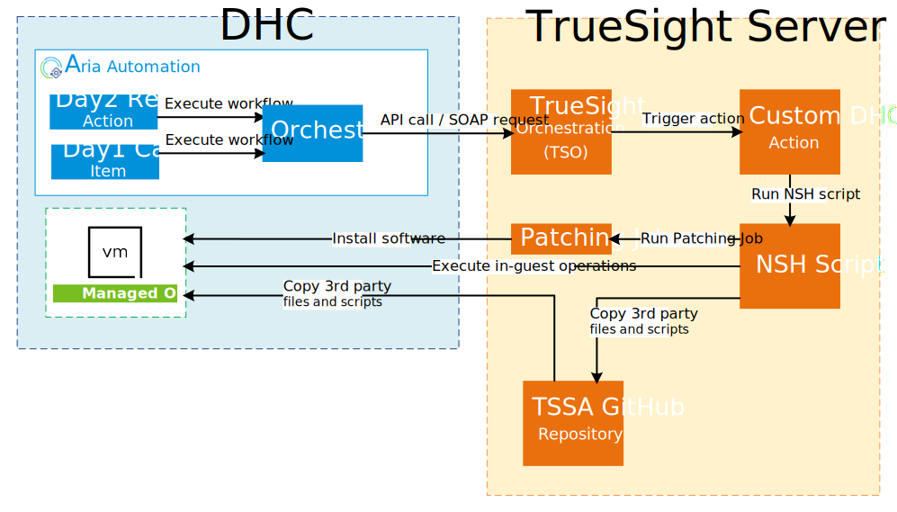

In TSO, there are specific SSRs created to allow software distribution on TSSA managed endpoints:

| OS Family | OS Type      | SSR Name / NSH Script                    | Software     | Package Name | Job Name / Script                     | Example |
| --------- | ------------ | ---------------------------------------- | ------------ | ------------ | ------------------------------------- | ------- |
| Linux     | RHEL         | `COMMON_SSR_dhc_manage_software_lin.nsh` | Web Server   | httpd, vsftpd, nginx | DHC_<os-type>_install_<package-name>  | DHC_rhel8_install_httpd|
| Windows   | W2K19/W2K22  | `COMMON_SSR_dhc_manage_software_win.nsh` | Web Server   | IIS          | N/A                                   | N/A |

The software installation/uninstallation is initiated by user, from VMware Aria Automation. It is Day2 action named `Software Distribution - TSSA`.

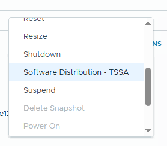

Figure 7. Software distribution TSSA - vRO worfklow

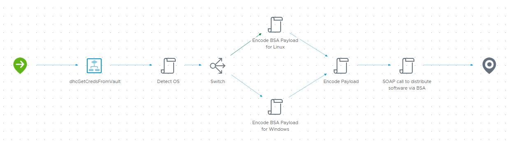

The whole process is based on API call to TSO. Orchestrator server prepare the correct values to be sent, encode the payload in Base64 format and initiate the request based on operating system type:

- for Windows `dhc_manage_software_win`
- for Linux `dhc_manage_software_lin`

Payload (not encoded):

```json
{
   "bsa_actions":[
      {
         "action":"dhc_manage_software_lin",
         "targetserver":"test-bsa01.nx1dhc01.next",
         "operation":"install",
         "software":"httpd"
      }
   ]
}
```

- **action**: `dhc_manage_software_lin` or `dhc_manage_software_win`
- **targetserver**: it is FQDN of the Managed OS
- **operation**: `install` or `remove`
- **software**: name of the package to be installed, i.e.: iis, vsftpd, httpd etc. (lowercase only)

 Example SOAP payload:

```xml
'<?xml version="1.0" encoding="UTF-8"?>' + 
'<soapenv:Envelope xmlns:soapenv="http://schemas.xmlsoap.org/soap/envelope/" xmlns:soa="http://bmc.com/ao/xsd/2008/09/soa">' +
   '<soapenv:Header> ' +
   '<wsse:Security soapenv:mustUnderstand="1" xmlns:wsse="http://docs.oasis-open.org/wss/2004/01/oasis-200401-wss-wssecurity-secext-1.0.xsd">' +
        '<wsse:UsernameToken>' +
            '<wsse:Username>'+tsoUsername+'</wsse:Username>' +
            '<wsse:Password Type="http://docs.oasis-open.org/wss/2004/01/oasis-200401-wss-username-token-profile-1.0#PasswordText">'+tsoPassword+'</wsse:Password>'+
         '</wsse:UsernameToken>' +
      '</wsse:Security>' +
   '</soapenv:Header>' +
    '<soapenv:Body>' +
      '<soa:executeProcess>' +
         '<soa:gridName>'+gridName+'</soa:gridName>' +
          '<soa:processName>:SSR:Interface</soa:processName>' +
          '<soa:parameters>' +
            '<soa:Input>' +
               '<soa:Parameter>' +
                  '<soa:Name required="true">PAYLOAD</soa:Name>' +
                    '<soa:Value soa:type="xs:string"><soa:Text>' + encodedString + '</soa:Text>' + 
                     '</soa:Value>' +
               '</soa:Parameter>' +
              '<soa:Parameter>' +
                  '<soa:Name required="true">INSTANCE</soa:Name>' +
                   '<soa:Value soa:type="xs:string">' +
                     '<soa:Text>'+bsaInstance+'</soa:Text>' +
                  '</soa:Value>' +
               '</soa:Parameter>' +
                  '<soa:Parameter>' +
                  '<soa:Name required="true">RITM</soa:Name>' +
                  '<soa:Value soa:type="xs:string">' +
                     '<soa:Text>RITM001234567</soa:Text>' +
                  '</soa:Value>' +
               '</soa:Parameter>' +
              '<soa:Parameter>' +
                  '<soa:Name required="true">CUSTOMER</soa:Name>' +
                  '<soa:Value soa:type="xs:string">' +
                     '<soa:Text>'+customer+'</soa:Text>' +
                  '</soa:Value>' +
               '</soa:Parameter>' +
              '<soa:Parameter>' +
                  '<soa:Name required="true">ROLENAME</soa:Name>' +
                  '<soa:Value soa:type="xs:string">'+
                     '<soa:Text>'+roleName+'</soa:Text>' +
                  '</soa:Value>' +
               '</soa:Parameter>' +
             '<soa:Parameter>' +
                  '<soa:Name required="true">CALLBACKURL</soa:Name>' +
                  '<soa:Value soa:type="xs:string">' +
                     '<soa:Text>https://atosglobal.service-now.com/RunbookCallback</soa:Text>' +
                  '</soa:Value>' +
               '</soa:Parameter>' +
           '</soa:Input>' +
         '</soa:parameters>' +
      '</soa:executeProcess>' +
   '</soapenv:Body>' +
'</soapenv:Envelope>'
```

The request is processed by TSO and NSH script is triggered to execute software distribution activities.

The NSH scripts for TSO custom actions are stored in `SSR_internal` folder wchich is placed at <https://github.gsissc.myatos.net/PL-BYD-GTS-TSO/Standard-Service-Requests/blob/main/SSR_internal>

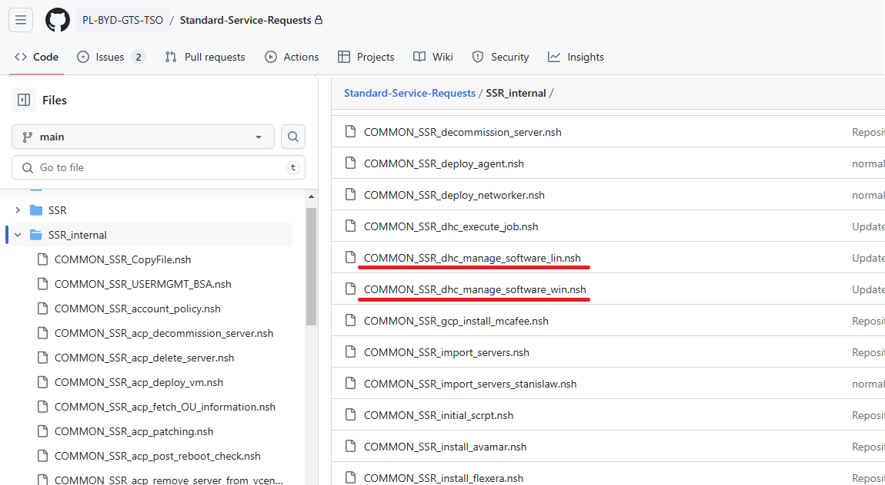

NSH script uses additional powershell or bash scripts or configuration files, which are stored in GitHub at <https://github.gsissc.myatos.net/PL-BYD-GTS-TSO/Standard-Service-Requests/tree/main/repo/DHC>

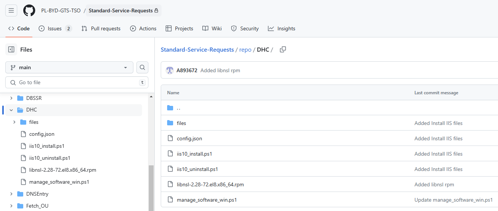

All NSH scripts as well as related scripts are executed locally on AtoS managed OS. TSSA Gateway server acts as an intermediary component which is used to execute all NSH scripts.

For operational purpose, TSO stores files at `glbsalap01.stn.nl.ao-srv.com/opt/bmc/BAO/baoscripts/ServiceNow/repo/DHC`

## 4.1. IaaS Web Services

One of the main feature of Managed OS is opportunity to install IaaS Web Server fully automaticly from DHC Service Broker portal. Web Server service is a flexible, feature-rich platform for hosting web applications and services, supporting technologies like ASP.NET and PHP. It serve static and dynamic content, offering extensive configuration options and support for many modules required for application.

Web Services can be installed on top of the following OS families:

- Windows: Web Service is IIS implementation
- Redhat Linux 8 & 9: Web Service is Apache2 implementation

### 4.1.1. Windows

For Windows machines, Microsoft IIS is used to serve the Web Server service. IIS (Internet Information Services) is a high-performance, secure, and scalable web server platform developed by Microsoft that allows organizations to host and manage web applications. It is important for customer applications because it offers built-in security features like authentication, encryption, and access control, ensuring the safety and reliability of web applications. Additionally, IIS integrates smoothly with other Microsoft technologies, such as .NET, making it an ideal choice for businesses leveraging a Windows-based infrastructure to deliver optimized, high-performance customer applications.

#### Technical Implementation

Windows Web Server can be installed either by Day1 catalog item or Day2 resource action.

>Recommended way is to use Day1 Catalg item as standard way of requesting Managed OS with Web Services.

##### Day1 Catalog Item

Catalog item is named: **Windows Server + IIS"** and it is available in Service Broker Catalog.

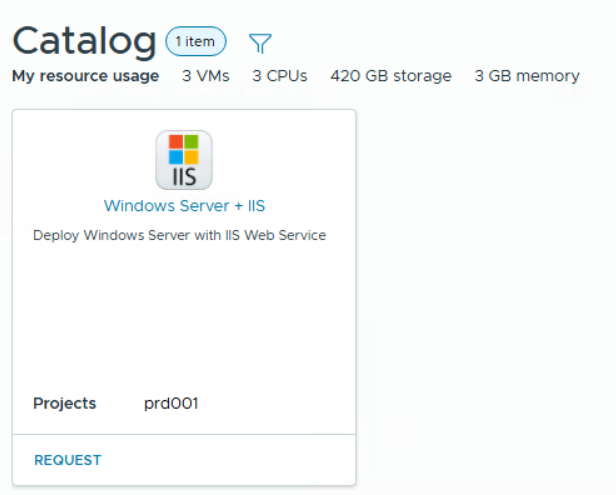

##### Day2 Resource Action

Web Services can be installed on the existing VM - there is a Day2 resource action named `Software Distribution - TSSA` that can be triggered on VM level.

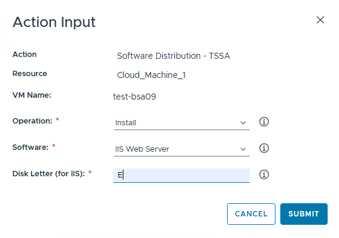

As a requirement resulting from the use of Atos "**T**echnical **S**ecurity **S**pecifications for Web IIS", it is necessary to specify the disk on which the web server is to be installed, other then `C:\` drive.

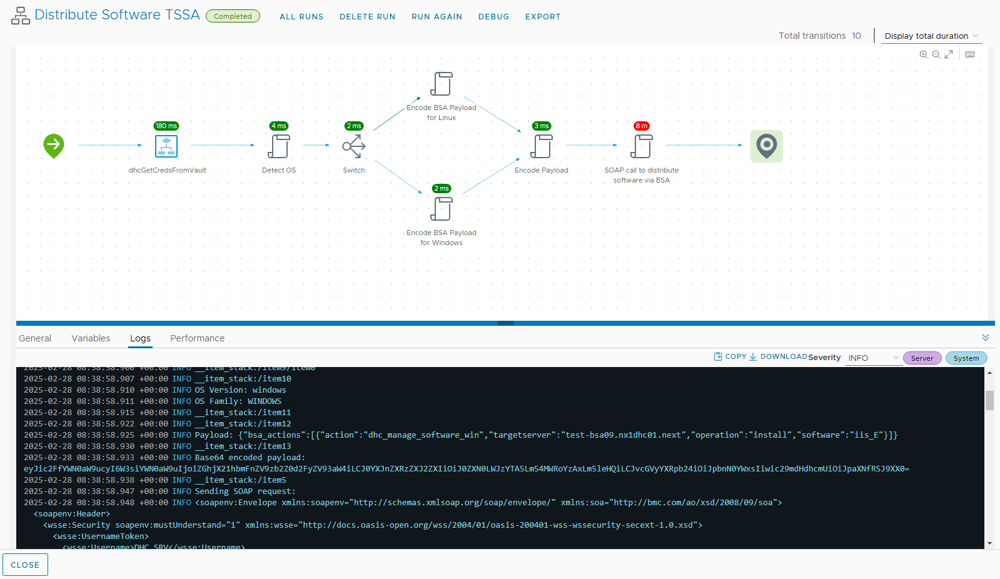

After all required files are copied to given server into `C:\Temp` folder, the installation starts automatically. Powershell script `C:\Temp\manage_software_win.ps1` is executed by TSO. This script calls another script `C:\Temp\iis10_install.ps1`, which is doing the full installation. After succesfully executed, IIS service is installed and ready to use. Installation log file can be found at `C:\iis_10.0.0.log`.

##### Decommission Process

Web Services can be uninstalled without requirement to delete whole VM. It can be achieved by using Day2 resource action with proper inputs.

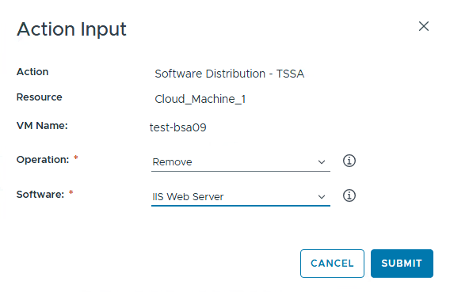

After the action has been initiated correctly, dedicated Workflow in Orchestrator server is triggered - `Distribute Software TSSA`. All process looks exactly the same as for installation, till execution of `C:\Temp\manage_software_win.ps1`. It calls script `C:\Temp\iis10_install.ps1` which finally calls script `C:\Temp\iis10_uninstall.ps1`, to uninstall the IIS feature and roll back all security items implemented during the installation process. After succesfully executed, IIS service is uninstalled and removed from server. Uninstallation log file can be found at `C:\iis10_uninstall.log`.

#### Security Specifications implemented into IIS

- CERT Measure BL115-5716/2WI00003 - Copy all content to new location with ACL and subdirs
- CERT Measure BL115-5716/2WI00003 - Moving AppPool isolation directory
- CERT Measure BL115-5441/BL115-1957/2WI00003 - Moving logfile directories
- CERT Measure BL115-5716/2WI00003 - Moving config history location
- CERT Measure BL115-5716/2WI00003 - Moving location for temporary files
- CERT Measure BL115-5716/2WI00003 - Moving custom error locations
- CERT Measure BL115-5716/2WI00003 - Registering new location for Service Pack and Hotfix Installers
- CERT Measure BL115-0725/2WI00007 - Configure a unique binding for Default Web Site
- CERT Measure BL115-0621 - Configure https for Default Web Site
- CERT Measure BL115-4471/WI00022 - Configure HSTS
- CERT Measure BL115-0846/3WI00009 - Set NTFS file system permissions to wwwroot
- CERT Measure BL115-5956/2WI00010 - Disable SSL 2.0
- CERT Measure BL115-2561/2WI00010 - Disable SSL 3.0
- CERT Measure BL115-2691/2WI00019 - Disable TLS 1.0
- CERT Measure BL115-3386/2WI00019 - Disable TLS 1.1
- CERT Measure BL115-1156/2WI00019 - Enable TLS 1.2
- CERT Measure BL115-4921/BL115-5881/BL115-4837/BL115-4836/BL115-1386/BL115-2886/2WI00020 - Disable all weak ciphers:
- CERT Measure BL115-4481/2WI00020 - Enable all strong ciphers:
- CERT Measure BL115-2563/BL115-2544/2WI00021 - Disable weak hash algorithms:
- CERT Measure 2WI00022 - Enable HTTP Strict Transport Security (HSTS)
- CERT Measure BL115-0800/2WI00024 - MIME-Handling Security
- CERT Measure 2WI00025 - Content-Security-Policy
- CERT Measure BL115-0928/2WI00026 - Set X-Frame-Options
- CERT Measure 2WI00027 - Set X-XSS-Protection
- CERT Measure BL115-2731/2WI00015 - Limit .NET Trust Level
- CERT Measure BL115-4911/BL115-8201/BL115-2596 - Remove unwanted Headers
- CERT Measure BL115-0987/2WI00016 - Configure Windows server logging and configuration auditing
- CERT Measure BL115-4386/BL115-3441/2WI00023 - Configure IIS logging
- CERT Measure BL115-0192/2WI00017 - NTFS Audit Settings

### 4.1.2. Linux

For Linux machines, Apache/httpd service is used to serve the Web Server service. Apache HTTP Server (httpd) is an open-source, highly flexible, and widely used web server that enables organizations to host and manage their web applications efficiently. It is important for customer applications because it provides a stable and secure platform, supporting features like URL rewriting, SSL encryption, and various authentication methods. Additionally, Apache’s extensive support for modules and configurations allows businesses to tailor their web server setup, making it a popular choice for Linux-based infrastructures to deliver scalable and reliable web services for customer applications.

#### Technical Implementation

Linux Web Server can be installed either by Day1 catalog item or Day2 resource action.

>Recommended way is to use Day1 Catalg item as standard way of requesting Managed OS with Web Services.

##### Day1 Catalog Item

Catalog item is named: **RHEL Server + Apache2"** and it is available in Service Broker Catalog.

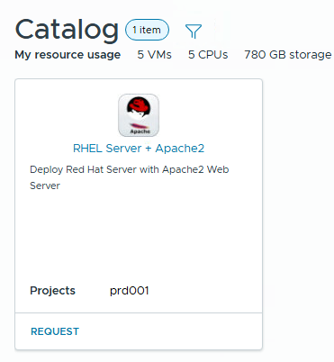

##### Day2 Resource Action

Web Services can be installed on the existing VM - there is a Day2 resource action named `Software Distribution - TSSA` that can be triggered on VM level.

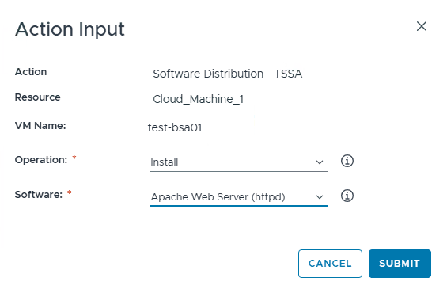

After successfully submitted, vRO workflow is being executed.

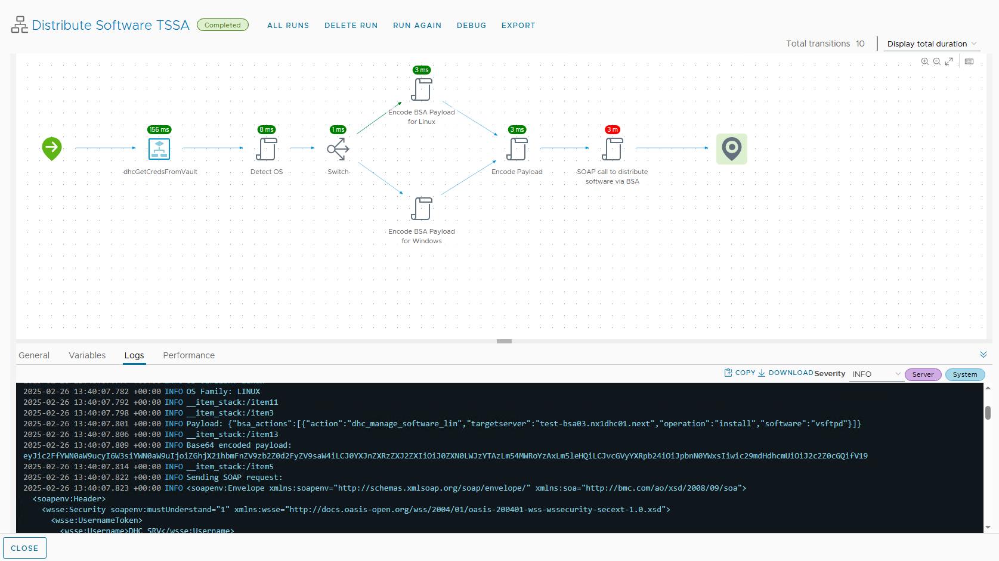

All required files are copied to given server into `/opt/stage/ssr/` folder, the installation starts automatically and is managed by job in TSSA.

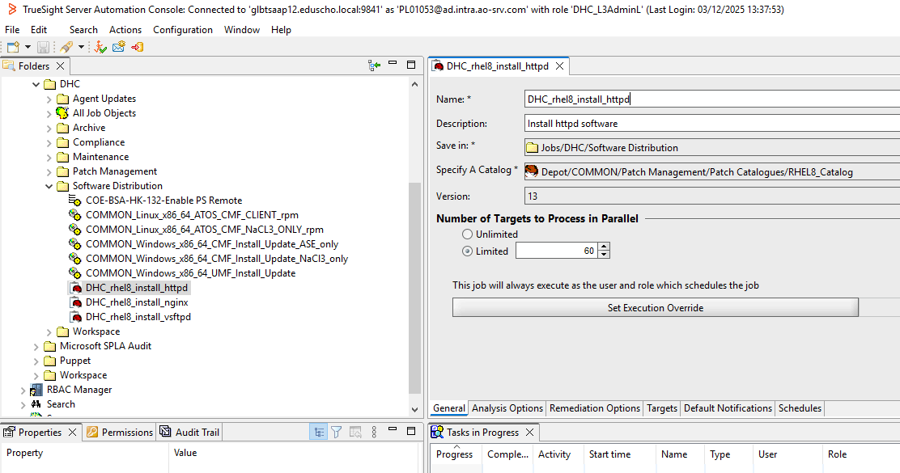

Once the installation is complete, the `secureApache.sh` script is run to prepare the web server for compliance with AtoS security standards.

##### Decommission Process

Web Services can be uninstalled without requirement to delete whole VM. It can be achieved by using Day2 resource action with proper inputs.

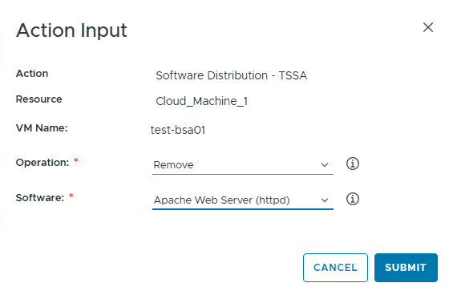

When the action has been initiated correctly, dedicated Workflow in VMware Cloud Services Orchestrator is being triggered - `Distribute Software TSSA`. File `removeApache.sh` is being copied into given server by TSO and executed to uninstall the application.

# 5. Operational Level Agreement

An Operational Level Agreement (OLA) is an internal agreement within Atos that defines the responsibilities and expectations between different teams or departments to ensure they can fulfill the commitments outlined in a Service Level Agreement (SLA) with related, internal customers. It's essential to provide internal service delivery details, clarifying how teams work together to meet the SLA.

For Managed OS offering there is **no specific OLA agreement signed and required**. The main rule is to be aligned with the global policies that quarantee Atos operational best practices, as well as outline the global policies, procedures, tools, organizational structure, and governance necessary to ensure standardized processes globally. Above covers following:

- Standard approach to define the procurement strategies.
- A standardized approach in defining global activities and processes.
- A structured approach for executing identified processes to minimize risks associated with operational changes.
- The identification of key performance indicators (KPI) and later measurement and reporting thereafter as part of on-going continuous improvements program.
- A baseline to benchmark existing GBU practices to ensure compliance.

## 5.1 Global Policies

In order to meet the global policies standards and way of working, Managed OS meet the following standard policies and rules.

| Global Policy Standard | Managed OS implementation |
| --- | --- |
| Server Commissioning and Decommissioning Standard| Centralized Customer Service Broker portal and blueprints are used to satisfy user requests.|
| Operational Standard| Keeping global rules to ensure the efficient, secure, and compliant operation for Linux and Windows operating systems.|
| Patching Standard| Global TSSA tool is used to keep systems security at secure level and prevent vulnerabilities.|
| Automation Standard| Using Aria Automation and Orchestrator toolset is used to streamline repetitive tasks, reduce human error, and improve operational efficiency.|
| Security Standard| Global TSS rules are applied to Managed OS templates as well as regular scanning from Itrion platform.|
| Backup and Recovery Standard| Not yet implemented at initial offering.|
