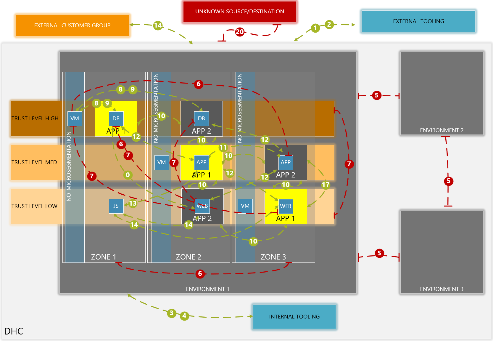
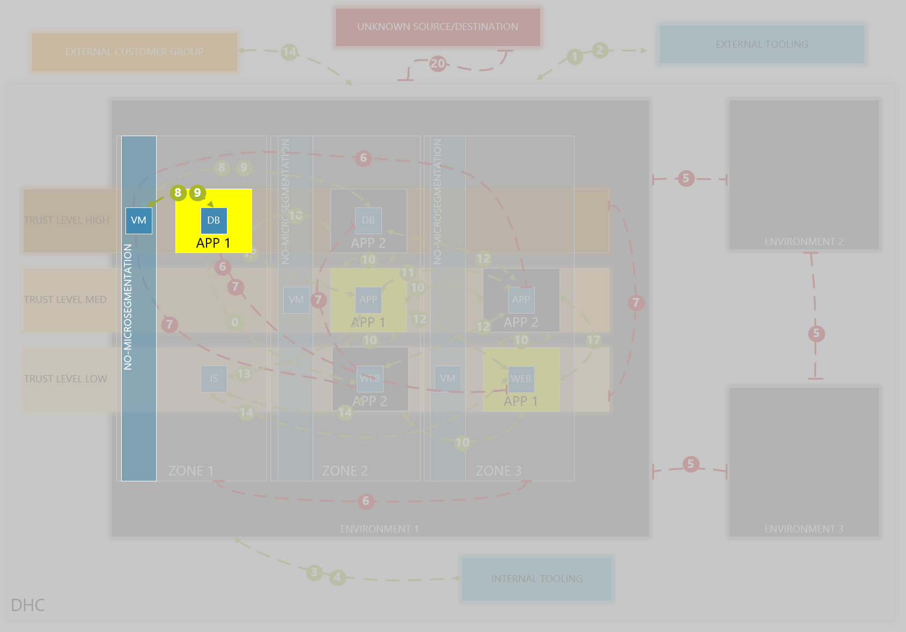
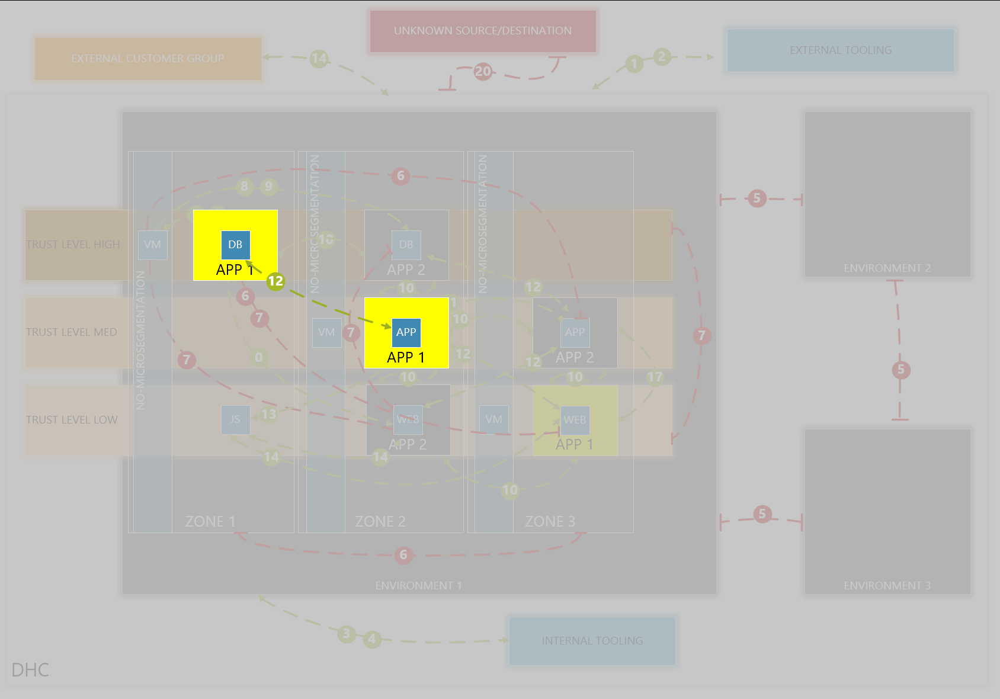
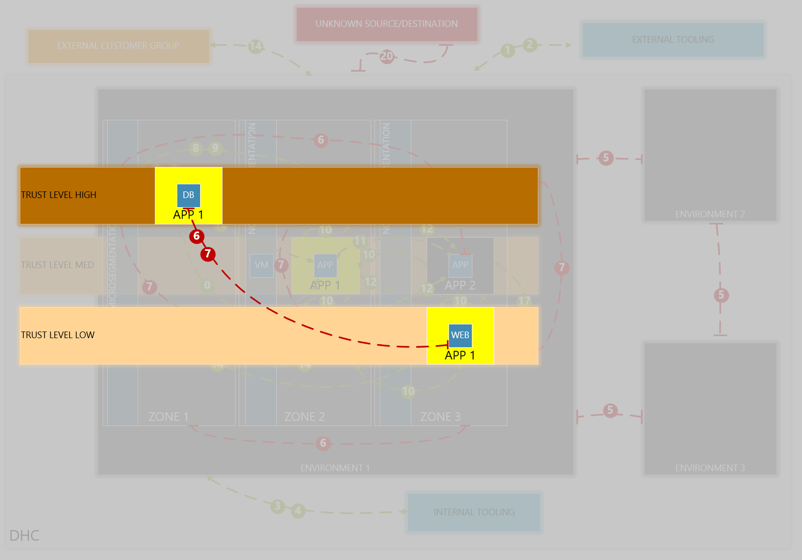
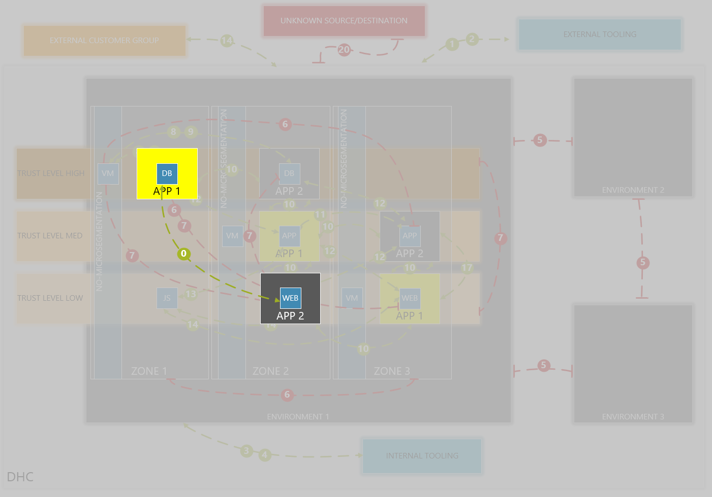
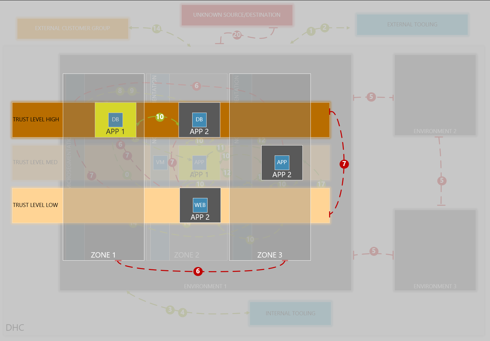
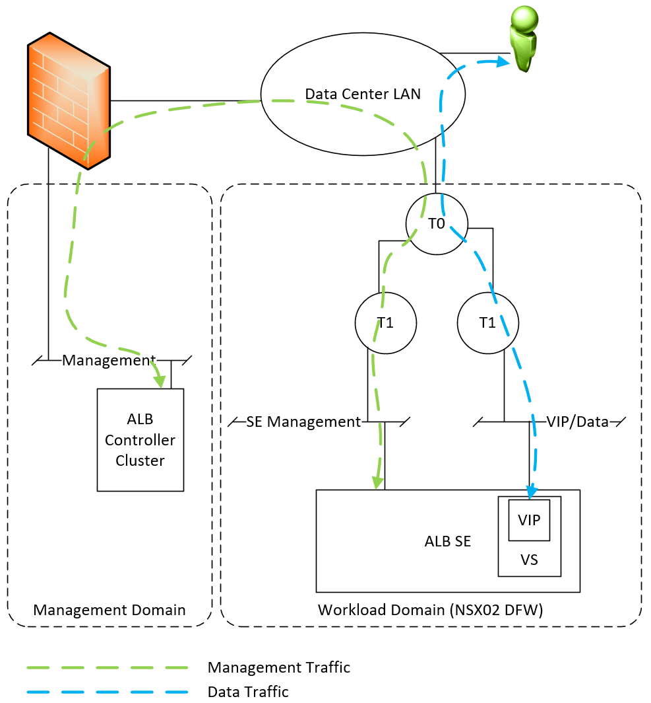

# VCS – Micro-segmentation Design NSX Data Center based

# Changelog

| Version | Date       | Description                        | Author(s)     |
| ------- | ---------- | ---------------------------------- | ------------- |
| 0.1     | 2024-10-10 | Initial version                    | Cezary Dwojak |
| 0.2     | 2025-02-14 | Add ALB details for single tenant  | Cezary Dwojak |

# General Information

## Purpose

The purpose of this document is to deliver comprehensive guide to understand, plan, implement and maintain micro-segmentation in VMware Cloud Services environment. Isolation of workloads using micro-segmentation enhances security and minimizes attack surface and potential breaches.

## Scope

This document covers micro-segmentation in VMware Cloud Services environment with use of Distributed Firewall functionality of NSX Data Center security solution. It is intended to use by network administrators, security engineers and responsible staff for network security and management under dedicated tenant.

## Requirement Levels

This document is following the principles below to categorize all requirements and design decisions.

| Term | Meaning |
| --- | --- |
| MUST | The definition is an absolute requirement of the specification. |
| MUST NOT | The definition is an absolute prohibition of the specification |
| SHOULD | There may exist valid reasons in particular circumstances to ignore a particular item, but the full implications must be understood and carefully weighed before choosing a different course |
| SHOULD NOT | There may exist valid reasons in particular circumstances when the particular behaviour is acceptable or even useful, but the full implications should be understood, and the case carefully weighed before implementing any behaviour described with this label |
| MAY | Any design decisions that are not classified as MUST and SHOULD or covering optional feature that is not general available for VCS product |

Table 1. Requirement terms

## Audience

Network architects, network and security engineers and staff responsible for network security are the main audience of this document. This documentation assumes knowledge of basic networking and security concepts/principles.

# Architecture of micro-segmentation

Architecture of micro-segmentation must be flexible enough to not be limited by any of the security components available in NSX Data Center of VMware Cloud Services. Constantly evolving and expanding set of security features in VCS is demanded by the architecture of security. Alignment of micro-segmentation with other features is needed to avoid any way of limiting functionality and allowing the expand of security within VCS environment.

## Design

Micro-segmentation as is, relies on traffic limitation on VM level. Explicit deny on firewall ruleset, defines the whitelisting approach, and allows only traffic that is defined. However, to that, some rules are being set to reject/deny ensuring general approach (i.e. environment communication, trust level limitations) is applied. Strict policies allowing governing inter-segment communication. Overall, environment can be flat from network perspective, micro-segmentation allows it to segment however is needed.

### Naming Convention

#### Security Groups

| Decision ID | Design Decision | Design Justification | Design Implication |
|---|---|---|---|
| 001 | Security Groups are created per Tenant | On multitenant VCS deployments, different Tenants VMs cannot be mixed | Tenant TAG must be mandatory for every VM and SG (both TAGs and Dynamic Criteria) |
| 002 | Only required TAGs are added | Not all TAGs needs to be added to VM - i.e. if 'Location' for VCS is single site, no need to add this TAG | TAGs are classified as per 'Field Type' and once Optional does not have to be used |
| 003 | Names are create only from active TAGs | Some TAGs are optional, therefore in formula for 'Security Groups' only actively used TAGs are taken into consideration.   Not used TAGs are omitted in Naming Convention Formula | N/A |

Table 2. Design decision for Security Groups Naming Convnetion

| Field Name | Field Short Name | From TAG | Field Type | Possible Value | Value Description |
|---|---|---|---|---|---|
|Region|\<RGN\>|YES|OPTIONAL|EMEA, NAM, APAC|Region where SG is configured on|
|Location|\<LOC\>|YES|OPTIONAL|Best, Mechelen|Location where SG is configured on|
|Tenant Name|\<TNT\>|YES|MANDATORY|customer_name (AtoS), customer_name-department (AtoS-HR)|Customer Name owning Security Group|
|Context|\<CTX\>|NO|MANDATORY|int, ext|Describes if internal or external devices are defined in security group|
|Type|\<TYP\>|NO|MANDATORY|net, grp, vmgrp|Defines which type of objects are used in Security Group|
|Environment|\<ENV\>|YES|OPTIONAL|PROD,TEST,DEV|Environment which contains the VMs from Security Group|
|Zone|\<ZON\>|YES|OPTIONAL|DMZ,HSZ,PCI|Zone which contains the VMs from Security Group|
|App Tier|\<APT\>|YES|OPTIONAL|DB,WEB,APP|Applicaton Tier for the Security Group's VMs|
|App|\<APP\>|YES|OPTIONAL|SAP|Application owning VMs from Security Group|
|Trust Level|\<TRL\>|YES|OPTIONAL|High,Medium,Low|Trust Level for Security Group|
|Customer Defined|\<CMD\>|YES|OPTIONAL|Free name based on customer created TAG i.e. HTTPS|Customer defined TAG to allow freely define services|
|Text|\<TXT\>|NO|MANDATORY|Description of the object (i.e.name of server, server group or network type)|Meaningful description of object or group of objects, which is defined by name creator|
|Numbering|\<NO3\>|NO|MANDATORY - Automated|format: [0-9]{3} - 3 digits|Numbering allows differentiate similar groups - added programatically to every group|

 Table 3. Security Groups naming convention

 Additional fields details:

 | Field Name | Values | Description |
 | --- | --- | --- |
 | Context | int | Internal devices are in Security Group |
 |   | ext | External devices are in Security Group |
 | Type | net | Security Group contains only VCS segments |
 |   | grp | Security Group contains VM and/or IP - networks or servers Ips |
 |   | vmgrp | Security Group contains only VCS VMs |

 Table 4. Security Groups naming convention extension

Formula for security group name:

Security Group Formula:
    \<REGION\>\-\<LOCATION\>\-\<CUSTOMER\>\-\<CONTEXT\>\-\<TYPE\>\-\<ENVIRONMENT\>\-\<ZONE\>\-\<TRUST\-LEVEL\>\-\<APP\>\-\<APT\>\-\<CMD\>\-\<TEXT\>\<NUMBERING\>

Selected Field is used only, if exact SCOPE\-TAG pair is used in Security Group Dynamic Criteria definition (otherwise, OPTIONAL fields are omitted).

#### Firewall rules’ names

| Decision ID | Design Decision | Design Justification | Design Implication |
|---|---|---|---|
| 004 | Firewall Rules' names are reflecting traffic within rules and change number its committed | Defining firewall rules, naming is based on security groups used in source and destination,  and change number which is approved and commiting the changes on envirionment | There is a risk when more multiple security groups are used to make a rule name unreadable |
| 005 | Multiple security groups in source and\or destination forces custom name for source and\or destination respectively in 'Firewall Rule' naming convention | To avoid to long security group name custom names are presented | Custom may not always reflect properly what is within the rule |
| 006 | Each rule has an automated numbering | Automated numbering is defined to avoid repeating rule names (allowed by NSX Data Center) | Would increase readability and limit the sizes of exact naming convention for 'Firewall Rules' |

Table 5. Design decision for Firewall Rules Naming Convnetion

| Field Name | Field Short Name | Field Type | Possible Values | Value Description |
|---|---|---|---|---|
|\<SOURCE\>|\<SRC\>|Optional|Source Group name|Source Group name which is used in rule|
|\<SOURCE_CUSTOM\>|\<SRC_C\>|Optional|Custom Name|Source for Custom set of Security Groups, when multiple source groups are in source field|
|\<DESTINATION\>|\<DST\>|Optional|Destination Group name|Destination Group name which is used in rule|
|\<DESTINATION_CUSTOM\>|\<DST_C\>|Optional|Custom Name|Destination for Custom set of Security Groups, when multiple source groups are in source field|
|\<CHANGE_NUMBER\>|\<CHG_NO\>|Mandatory|Change number under which rule was created|Change number or SSR ID, which was used to create rule|
|\<NUMBERING\>|\<FRNO3\>|Mandatory|format: [0-9]{3} - 3 digits|Numbering allows differentiate similar rule names - added|

Table 6. Firewall rules' naming convention

Firewall Rule name formula:
    [\<SRC\>|\<SRC_C\>]-TO-[\<DST\>|\<DST_C\>]-\<CHG_NO\>-\<FRNO3\>

#### Policies’ names

| Decision ID | Design Decision | Design Justification | Design Implication |
|---|---|---|---|
| 007 | Predefined Policy names are present | There are list of predefined mandatory 'Policies' which are defined for specific rules.  Those 'Policies' are defined to react on dedicated roles like tooling or removing from microsegmentation | Predefined 'Policies' are in fact static policies for all the tenants in VCS environment |
| 008 | 'Policies' will have priority defined | More demanding (more traffic) rules should be in higher priority 'Policies' due to fact how firewall processing rules.  Although Distributed Firewall installs firewall rules on every interface of affected VM (by FW rule), performance increase may not be so big, therefore this is best practise and improves performance for sure | Improve of performance in smaller environments will be not visible for most of the rules |
| 009 | 'Policies' will have numbering | Due to limit of 1000 rules per policy, there must be mechanism which will allow to create multiple policies of same priority | No new policy should be created for the same priority unless previous is filled with the rules to maximum |

Table 7. Design decision for Policies Naming Convnetion

|Field name|Field Short Name|Field Type|Field Scope|Possible value|Example Value|Description|
|---|---|---|---|---|---|---|
|EXCEPTION|N/A|Primary - Predefined|Optional|N/A|N/A|Exception approved by CLA/CLO|
|NO-MICROSEGMENTATION|N/A|Primary - Predefined|Mandatory|N/A|N/A|Predefined policy name for no microsegmentation rules |
|TOOLING-EXTERNAL|N/A|Primary - Predefined|Mandatory|N/A|N/A|Predefined policy name for tooling rules for servers which are outside of this VCS environment|
|TOOLING-INTERNAL|N/A|Primary - Predefined|Mandatory|N/A|N/A|Predefined policy name for tooling rules for servers which are within this VCS environment|
|\<TENANT\>|\<TNT\>|Primary| Mandatory |Name of Customer (i.e. AtoS)|AtoS|Tenant name based on customer/tenant short name|
|ENVIRONMENT CONNECTIONS|N/A|Primary - Predefined|Optional|N/A|N/A|Predefined policy name for environmental related rules|
|SECURITY ENHANCEMENT|N/A|Primary - Predefined|Optional|N/A|N/A|Predefined policy name for security enhancement related rules|
|\<PRIORITY\>|\<PRIO\>|Primary|Mandatory|LOWEST \| LOW \| MEDIUM \| HIGH \| HIGHEST|LOW|Policy priority defines how high rule is being placed on firewall ruleset (highest -\> lowest)|
|\<NUMBER\>|\<NO3\>|Primary|Mandatory|format: [0-9]{3} - 3 digits|001|Number to distuinguish the policy by number|

Table 8. Policies naming convention

Formula for Policy name:

| Policy Name formula| Purpose | Example |
|---|---|---|
|EXCEPTION FOR <TNT>|Exception long term rules|EXCEPTION FOR ATOS|
|NO-MICROSEGMENTATION|Emergency no microsegmentation|NO-MICROSEGMENTATION|
|TOOLING-EXTERNAL|Outside of VCS tooling provider|TOOLING-EXTERNAL|
|TOOLING-INTERNAL|Inside of VCS tooling provider|TOOLING-INTERNAL|
|ENVIRONMENT CONNECTIONS FOR \<TNT\>|High level environment connections relationships|ENVIRONMENT CONNECTIONS FOR ATOS|
|SECURITY ENHANCEMENT FOR \<TNT\>|Security enhancements which defined in requirements i.e. communication between trust-levels or zones|SECURITY ENHANCEMENT FOR ATOS|
|RULES FOR \<TNT\>-\<PRIO\>-\<NO3\>|Tenant firewall rules created by customer; Prio defines level of policy (highest -\> lowest) and number defines level within priority level|RULES FOR ATOS-HIGHEST-001|
|DEFAULT RULES FOR \<TNT\>|Default firewall rules containing DHCP (v4 / v6) and implicit deny|DEFAULT RULES FOR ATOS|

Table 9. Formulas for policies naming

### Security Groups (Predefined and Private)

| Decision ID | Design Decision | Design Justification | Design Implication |
|---|---|---|---|
| 010 | Each VM should have TAGs applied | To properly define 'Security Groups' and include whatever in those whatever is expected to be, all VMs should have TAGs.   Once VM have no TAG it will not be considered to be added to security group with specific Dynamic Criteria definition  | TAGs once defined should not be changed |
| 011 | Each Security Group must have 3 TAGs defined (nsxTenant;nsxSecurity;nsxCustomerManaged) | Those TAGs ensures 'Security Group' is being properly defined and presented to portal, have proper usability | Missing of those TAGs will lead to improper behavior in environment |
| 012 | Each Security Group will have 2 Criterions defined:   - First - dedicated, unique TAG created with TAG: <UUID> and SCOPE: nsxSecurity  - Second - list of criteria for TAGs to be matched | This definition allows to create `Security Groups` based on 2 approaches  - selecting exact VM using nsxSecurity TAG  - matching multiple VMs of the same type at the same time (i.e. all WEB servers from DEV Environment) and   | As those 2 types can be mixed, there may be naming convention broken once being used improper way|
| 013 | Specific security group is used, called : Private Security Group | This group is used to contain only selected VMs and allows to not TAG those VMs with TAGs to avoid those being used in any multi matching capability (Decisin 012 - second possibility) | This gives more privacy, however VMs in such security groups must be properly protected to avoid being TAGged if such approach is selected (VMs in Private Security Groups may be also TAGged) |
| 014 | Security Groups Dynamic Criteria may be created by group owner as he wish | There is no strict limitation on what is used in Dynamic Criteria as long as properly defined | Such approach gives flexibility to tenant administrator, however brings more complexity and required addtional documentation |
| 015 | Dynamic Criteria limitation is 5 per Criterion | This is technology limitation from NSX Data Center | Due to fact there may be more TAGs in VCS Environment, limit of 5 TAGs in Security Group Dynamic Criteria may be sometimes problematic |

Table 10. Design decision for Security Groups creation

Predefined Security Groups are guidelines to define Customer Environment and Security Groups used for dedicated servers purpose (i.e. Tooling, Environment connectivity, Application connectivity).
Security Groups are used in Firewall Ruleset in different categories (check "Flows" for more information).
Except of Predefined Security Groups there is specific Private Security Group which is being defined on different way.

General types of defined flows by customer requirements (i.e. tooling, environments, trust-level, zones) have already predefined security groups.
Those Security Groups will be affected by TAGs and will change over time however, customer itself will never be capable to modify firewall rules related to those Security Groups. Utility of such approach is to ensure, expected type of VM (tagged or connected to tagged segment) will be delivered all required connections (for managed server) and will respect all general defined connections (i.e. limitation on connections from trust-level low to trust-level high VMs).
Specific Security Group called for emergency no-microsegmentation, allows to set emergency communication with all general rules applied.

Defining Security Groups by TAGs is utilizing its Dynamic Criteria Definition to set members. Dynamic assignment allows to define members on Segment or VM side. Customer-managed Security Groups are marked with dedicated tag, whenever it is applied, Security Group can be managed by Customer. In addition each Security Group will have NSX Security (nsxSecurity) and tenant (tenant) TAGs.

Selection of VMs to match security groups can happen in 2 different ways. To fully understand logic behind the functionality, it is show on the picture below:

Picture 1. Logic behind security grup matching

Criterion 1 is based on "exist" Logical function. Once TAG defined in Criterion 1 is added to VM, then Exist is matching as true.
Criterion 2 is based on multiple TAGs. TAGs relationship is based on Logical AND function, so all requirements must be meet to make a successful match.
Final decision (between Criterion 1 and Criterion 2) for assigning VM is based on Logical OR function and once outcome is TRUE (so one of the Criterion is TRUE), VM is added to Security Group.

Mentioned functionality is very strictly connected with next steps. Defining which VMs are being added to Security Group is visulalised below:

Pictrure 2. Assign VM to Security Group

Number in circle is assigned to acivity named below:

1. Once Security Group is created, TAG: UUID within SCOPE: nsxSecurity is added to CRITERION 1.
2. Predefined Criterion 2 is being checked against VM1 TAGs - All TAGs matching from CRITERION 2 are being found on VM1 TAGs (it contains more than required, but this is still a match)
3. Predefined Criterion 2 is being checked against VM2 TAGs - There is TAG : \<TAG_VALUE_7\> | SCOPE : \<SCOPE_VALUE_7\> is missing on VM, therefore Logic function AND is not matching
4. For VM1 Criterion 2 is matching all TAGs against VM TAGs, so VM1 is being added to Security Group members as entire Dynamic Criteria resulting in Logical OR Function equals TRUE
5. VM2 is selected to be added to Security Group using "SSR - MANAGE VIRTUAL MACHINE SECURITY GROUP".
6. Performing "SSR - MANAGE VIRTUAL MACHINE SECURITY GROUP" results with ADDING TAG to VM2 TAG List which is matching TAG : \<UUID\> | SCOPE : nsxSecurity
7. Once TAG : \<UUID\> | SCOPE : nsxSecurity is added to VM TAGs List Criterion 1 is a match and Dynamic Criteria OR Function resulting with adding VM2 to Security Group members.

Security Group Criteria Definition is defined by fields "Object" and "Definition" in table below:

|Purpose | Name | Effective Name | Object | Definition|Criteria Defintion Description | Security Group TAGs | Security Group TAGs Description | Comment |
|---|---|---|---|---|---|---|---|---|
|All Customer VMs  |\<TNT\>-int-vmgrp-all  |cst-int-vmgrp-all  |SEGMENT or VM  |TAG:\<PSG\> \| SCOPE: nsxSecurity  |  |TAG:\<TNT\> \| SCOPE: nsxTenant  |Mandatory only for NSX 3.x, for NSX 4.x this will be filtered by Project scope  |All customer VMs applied using Segment to improve performance|
|  |  |  |  |OR  |  |TAG:FALSE \| SCOPE: customerManaged  |  | |
|  |  |  |  |TAG:\<TNT\> \| SCOPE: nsxTenant  |  |TAG:\<PSG\> \| SCOPE: nsxSecurity  |  | |
|Emergency group  |\<TNT\>-int-vmgrp-no_microsegmentation  |cst-int-vmgrp-no_microsegmentation  |VM  |TAG:\<PSG\> \| SCOPE: nsxSecurity  |Always required  |TAG:\<TNT\> \| SCOPE: nsxTenant  |Mandatory only for NSX 3.x, for NSX 4.x this will be filtered by Project scope  |Emergency group in case not all traffic is open for VM and requires additional validation. This group will have any-2-any allow.|
|  |  |  |  |OR  |  |TAG:FALSE \| SCOPE: customerManaged  |  | |
|  |  |  |VM  |TAG:\<TNT\> \| SCOPE: nsxTenant  |Mandatory only for NSX 3.x, for NSX 4.x this will be filtered by Project scope  |TAG:\<PSG\> \| SCOPE: nsxSecurity  |  | |
|  |  |  |VM  |TAG:TRUE/FALSE \| SCOPE: noMicrosegmentation  |  |  |  | |
|Tooling services  |\<TNT\>-ext-grp-tooling-\<TXT\>\<NO3\>  |cst-ext-grp-tooling  |None  |IP list of tooling outside of VCS  |  |TAG:\<TNT\> \| SCOPE: nsxTenant  |Mandatory only for NSX 3.x, for NSX 4.x this will be filtered by Project scope  |Tooling external to VCS servers required for "managed server" service|
|  |  |  |  |  |  |TAG:FALSE \| SCOPE: customerManaged  |  | |
|  |  |  |  |  |  |TAG:\<PSG\> \| SCOPE: nsxSecurity  |  | |
|Internal Toooling services  |\<TNT\>-int-grp-tooling-\<TXT\>\<NO3\>  |cst-int-grp-tooling  |None  |TAG:\<PSG\> \| SCOPE: nsxSecurity  |Always required (VMs or IP addresses added manually to SG )  |TAG:\<TNT\> \| SCOPE: nsxTenant  |Mandatory only for NSX 3.x, for NSX 4.x this will be filtered by Project scope  |Tooling internal to VCS servers required for "managed server" service|
|  |  |  |  |OR  |  |TAG:FALSE \| SCOPE: customerManaged  |  | |
|  |  |  |  |TAG based approach with customer defined TAGs  |  |TAG:\<PSG\> \| SCOPE: nsxSecurity  |  ||
|Environment SG  |\<TNT\>-int-vmgrp-\<ENV\>  |cst-env-int-vmgrp  |VM  |TAG:\<PSG\> \| SCOPE: nsxSecurity  |Always required  |TAG:\<TNT\> \| SCOPE: nsxTenant  |Mandatory only for NSX 3.x, for NSX 4.x this will be filtered by Project scope  |Requirements for block traffic between Environments |
|  |  |  |  |OR  |  |TAG:FALSE \| SCOPE: customerManaged  |  ||
|  |  |  |SEGMENT or VM  |TAG:\<TNT\> \| SCOPE: nsxTenant  |Mandatory only for NSX 3.x, for NSX 4.x this will be filtered by Project scope  |TAG:\<PSG\> \| SCOPE: nsxSecurity  |  ||
|  |  |  |SEGMENT or VM  |TAG:\<ENV\> \| SCOPE: nsxEnvironment  |  |  |  ||
|Trust Level   |\<TNT\>-int-vmgrp-\<TRL\>-trust_level  |cst-int-vmgrp-high-trust_level  |VM  |TAG:\<PSG\> \| SCOPE: nsxSecurity  |Always required  |TAG:\<TNT\> \| SCOPE: nsxTenant  |Mandatory only for NSX 3.x, for NSX 4.x this will be filtered by Project scope  |Ensure Trust Levels are kept (High -\> Mid -\> Low)|
|  |  |  |  |OR  |  |TAG:FALSE \| SCOPE: customerManaged  |  ||
|  |  |  |SEGMENT or VM  |TAG:\<TNT\> \| SCOPE: nsxTenant  |Mandatory only for NSX 3.x, for NSX 4.x this will be filtered by Project scope  |TAG:\<PSG\> \| SCOPE: nsxSecurity  |  ||
|  |  |  |SEGMENT or VM  |TAG:\<TRL\> \| SCOPE: trustLevel  |  |  |  ||
|Zone SG  |\<TNT\>-int-vmgrp-\<ENV\>-\<ZON\>  |cst-int-vmgrp-dev-ssn  |VM  |TAG:\<PSG\> \| SCOPE: nsxSecurity  |Always required  |TAG:\<TNT\> \| SCOPE: nsxTenant  |Mandatory only for NSX 3.x, for NSX 4.x this will be filtered by Project scope  ||
|  |  |  |  |OR  |  |TAG:FALSE \| SCOPE: customerManaged  |  ||
|  |  |  |SEGMENT or VM  |TAG:\<TNT\> \| SCOPE: nsxTenant  |Mandatory only for NSX 3.x, for NSX 4.x this will be filtered by Project scope  |TAG:\<PSG\> \| SCOPE: nsxSecurity  |  ||
|  |  |  |SEGMENT or VM  |TAG:\<ENV\> \| SCOPE: nsxEnvironment  |  |  |  ||
|  |  |  |SEGMENT or VM  |TAG:\<ZON\> \| SCOPE: nsxZone  |  |  |  ||
|Customer Internal APP Security Group  |\<TNT\>-int-vmgrp-\<ENV\>-\<ZON\>-\<APP\>-\<TXT\>\<NO3\>  |cst-int-vmgrp-prod-ssn-sap-access001  |VM  |TAG:\<PSG\> \| SCOPE: nsxSecurity  |Always required  |TAG:\<TNT\> \| SCOPE: nsxTenant  |Mandatory only for NSX 3.x, for NSX 4.x this will be filtered by Project scope  ||
|  |  |  |  |OR  |Logical function will take effect once user will select at least one from VM based TAGs  |TAG:TRUE \| SCOPE: customerManaged  |  ||
|  |  |  |VM  |TAG:\<TNT\> \| SCOPE: nsxTenant  |Mandatory only for NSX 3.x, for NSX 4.x this will be filtered by Project scope  |TAG:\<PSG\> \| SCOPE: nsxSecurity  |  ||
|  |  |  |VM  |TAG:\<ENV\> \| SCOPE: nsxEnvironment  |Required if all tagging set on VMs, not required if tagging set on segments  |  |  ||
|  |  |  |VM  |TAG:\<ZON\> \| SCOPE: nsxZone  |Required if all tagging set on VMs, not required if tagging set on segments  |  |  ||
|  |  |  |VM  |TAG:\<APP\> \| SCOPE: nsxApplication  |  |  |  ||
|Customer Interal APP-TIER Security Group  |\<TNT\>-int-vmgrp-\<ENV\>-\<ZON\>-\<APT\>-\<TXT\>\<NO3\>  |  |VM  |TAG:\<PSG\> \| SCOPE: nsxSecurity  |Always required  |TAG:\<TNT\> \| SCOPE: nsxTenant  |Mandatory only for NSX 3.x, for NSX 4.x this will be filtered by Project scope  ||
|  |  |  |  |OR  |Logical function will take effect once user will select at least one from VM based TAGs  |TAG:TRUE \| SCOPE: customerManaged  |  ||
|  |  |  |VM  |TAG:\<TNT\> \| SCOPE: nsxTenant  |Mandatory only for NSX 3.x, for NSX 4.x this will be filtered by Project scope  |TAG:\<PSG\> \| SCOPE: nsxSecurity  |  ||
|  |  |  |VM  |TAG:\<ENV\> \| SCOPE: nsxEnvironment  |Required if all tagging set on VMs, not required if tagging set on segments  |  |  ||
|  |  |  |VM  |TAG:\<ZON\> \| SCOPE: nsxZone  |Required if all tagging set on VMs, not required if tagging set on segments  |  |  ||
|  |  |  |VM  |TAG:\<APT\> \| SCOPE: nsxAppTier  |  |  |  ||
|Customer Internal APP, APP-TIER Security Group  |\<TNT\>-int-vmgrp-\<ENV\>-\<ZON\>-\<APP\>-\<APT\>-\<TXT\>\<NO3\>  |cst-int-vmgrp-prod-hsz-sap-db-sql001  |VM  |TAG:\<PSG\> \| SCOPE: nsxSecurity  |Always required  |TAG:\<TNT\> \| SCOPE: nsxTenant  |Mandatory only for NSX 3.x, for NSX 4.x this will be filtered by Project scope  ||
|  |  |  |  |OR  |Logical function will take effect once user will select at least one from VM based TAGs  |TAG:TRUE \| SCOPE: customerManaged  |  ||
|  |  |  |VM  |TAG:\<TNT\> \| SCOPE: nsxTenant  |Mandatory only for NSX 3.x, for NSX 4.x this will be filtered by Project scope  |TAG:\<PSG\> \| SCOPE: nsxSecurity  |  ||
|  |  |  |VM  |TAG:\<ENV\> \| SCOPE: nsxEnvironment  |Required if all tagging set on VMs, not required if tagging set on segments  |  |  ||
|  |  |  |VM  |TAG:\<ZON\> \| SCOPE: nsxZone  |Required if all tagging set on VMs, not required if tagging set on segments  |  |  ||
|  |  |  |VM  |TAG:\<APP\> \| SCOPE: nsxApplication  |  |  |  ||
|  |  |  |VM  |TAG:\<APT\> \| SCOPE: nsxAppTier  |  |  |  ||
|Customer Defined Internal Security Group  |\<TNT\>-int-vmgrp-\<ENV\>-\<ZON\>-\<CMD\>-\<TXT\>\<NO3\>  |cst-int-vmgrp-prod-hsz-bridge-con001  |VM  |TAG:\<PSG\> \| SCOPE: nsxSecurity  |Always required  |TAG:\<TNT\> \| SCOPE: nsxTenant  |Mandatory only for NSX 3.x, for NSX 4.x this will be filtered by Project scope  ||
|  |  |  |  |OR  |Logical function will take effect once user will select at least one from VM based TAGs  |TAG:TRUE \| SCOPE: customerManaged  |  ||
|  |  |  |VM  |TAG:\<TNT\> \| SCOPE: nsxTenant  |Mandatory only for NSX 3.x, for NSX 4.x this will be filtered by Project scope  |TAG:\<PSG\> \| SCOPE: nsxSecurity  |  ||
|  |  |  |VM  |TAG:\<ENV\> \| SCOPE: nsxEnvironment  |Required if all tagging set on VMs, not required if tagging set on segments  |  |  ||
|  |  |  |VM  |TAG:\<ZON\> \| SCOPE: nsxZone  |Required if all tagging set on VMs, not required if tagging set on segments  |  |  ||
|  |  |  |VM  |TAG:\<CMD\> \| SCOPE: \<customer defined\>  |  |  |  ||
|Customer External Security Group  |\<TNT\>-ext-grp-\<TXT\>\<NO3\>  |cst-ext-grp-sapout001  |None  |IP list of servers outside of VCS  |  |TAG:TRUE \| SCOPE: customerManaged  |Customer security groups for external servers  ||
|Private Security Group  |\<TNT\>-int-vmgrp-\<TXT\>\<NO3\>  |cst-int-vmgrp-sap001  |SG and VM  |TAG:\<PSG\> \| SCOPE: nsxSecurity  |Must be always there   |TAG:\<TNT\> \| SCOPE: nsxTenant  |Mandatory only for NSX 3.x, for NSX 4.x this will be filtered by Project scope  ||
|  |  |  |  |  |  |TAG:TRUE \| SCOPE: customerManaged  |  ||
|  |  |  |  |  |  |TAG:\<PSG\> \| SCOPE: nsxSecurity  |  ||

Table 11. Predefined Security Groups

### TAGs

| Decision ID | Design Decision | Design Justification | Design Implication |
|---|---|---|---|
| 016 | nsxTenant is mandatory TAG\|SCOPE pair in NSX 3.x version deployments| nsxTenant is to seperate tenants and ensure only dedicated tenant VMs/Security Groups will be matched| Once this is required to be it limits amount of other TAGs in dynamic criteria to 4 criterias only |
| 017 | nsxTenant is not mandatory under NSX Data Center 4.x projects and VPCs | NSX Data Center 4.x multitenancy is built on RBAC level and will ensure VMs are not being within 2 seperate projects if properly configured | Brings a bit of complexity during migration, however gives a better flexibility in the end |
| 018 | All NSX DATA CENTER TAGs start with 'nsx' | This is required for filtering capabilities and better understanding in VCS Environment | N/A |

Table 12. Design decision for TAGs definitions

TAGs are used to mark component with desired functionality. Well known TAGs are made of 2 parts: TAG and SCOPE. TAG defines the value of the SCOPE it is placed in. All predefined TAGs are listed below:

|Field Name|Field Short Name|TAG|Scope|Type|Usabilty|Possible Values|Description|
|---|---|---|---|---|---|---|---|
|Region|\<RGN\>|\<RGN\>|nsxRegion|Optional|VM, SG Criteria|EMEA,NAM|Defines region for VM|
|Location|\<LOC\>|\<LOC\>|nsxLocation|Optional|VM, SG Criteria|Best, Hurk|Defines exact location for VM|
|Tenant|\<TNT\>|\<TNT\>|nsxTenant|Mandatory|VM, SG Criteria, Segment, SG|AtoS, AtoS-IT|Defines customer which owns the VM|
|Environment|\<ENV\>|\<ENV\>|nsxEnvironment|Optional|VM, SG Criteria, Segment|PROD, DEV,CAT|Defines environment where VM is used|
|Zone|\<ZON\>|\<ZON\>|nsxZone|Optional|VM, SG Criteria, Segment|DMZ, PCI, HSZ|Defines landing zone for VM|
|App Tier|\<APT\>|\<APT\>|nsxAppTier|Optional|VM, SG Criteria|DB, WEB, APP|Defines type of VM|
|App|\<APP\>|\<APP\>|nsxApplication|Optional|VM, SG Criteria|SAP|Defines application using VM|
|Trust Level|\<TRL\>|\<TRL\>|nsxTrustLevel|Optional|VM, SG Criteria, Segment|LOW, MID, HIGH|Defines trust level of the VM|
|Customer Managed|\<MGT\>|TRUE/FALSE|nsxCustomerManaged|Mandatory|SG|TRUE|Defines if security group can be hidden from customer using external portal|
|No Microsegmentation|\<NMS\>|TRUE/FALSE|nsxNoMicrosegmentation|Mandatory|VM, SG Criteria|TRUE|Emergency to enable all traffic for VM - once communcation is broken|
|Customer defined|\<CMD\>|\<CMD\>|nsx\<customer defined\>|Optional|VM, SG Criteria|\<ANY\>|Name of customer created set: TAG \| SCOPE to define custom services|
|Private Security Group|\<PSG\>|\<PSG\>|nsxSecurity|Mandatory on SG Criteria and SG; Optional on VM|VM,SG Criteria, SG|\<UUID\>|This is dedicated for private security group assignement - supported by SSRs|

Table 13. Predefined TAGs

### Flows

| Decision ID | Design Decision | Design Justification | Design Implication |
|---|---|---|---|
| 019 | Exact Flows are placed in exact categories | Distributed Firewall has seperate categories like:  - ETHERNET  - EMERGENCY  - INFRASTRACTURE  - ENVIRONMENT  - APPLICATION  Every Flow is defined to be in exact category by design| This gives a bit less flexibility, but ensures standard and best practises being implemented |
| 020 | Exception based Flows are defined to be in Emergency category.  Exception based flows are to be implemented only once will be approved by Customer Landscepe Architect/Customer Landscape Owner.  Exceptional rules can break all security policy based rules and cannot be implemented without further approval | Exceptions are to be in place in case of non-specific requirements are found and meet | Exception Flows break rules, therefore must be strcitly secured by proper process |
| 021 | Tooling based Flows are defined to be in INFRASTRUCTURE category. Those Flows are required to be working for every machine in VCS environment per Tenant and nothing can break those | Tooling based Flows are being defined for Tooling purposes and needs to be covered to support managed server solutions | Limited flexibility, but ensures there are no rules to limit tooling traffic |
| 022 | Environment (DEV,CAT,PROD etc.) limitations, Security enhancements (i.e. Trust levels) and no-microsegmentation are placed in ENVIRONMENT Category | Strict company policies defines the way how communcation between General components of Customer/Tenant environemnt works | Company Security Policies are defined here and cannot be broken by specific rules (i.e. DEV to PROD connections will always be broken with no exceptions) |
| 023 | No-Microsegmentation is implemented in respect to General Security Policies for Tenant (Customer) | No-Microsegmentation will not break any limitation from Company Security Policy, therefore must be installed at very bottom in Environment category | No-microsegmentation still does not resolve issues when Environment and Security Enhancements take place, so to achieve that, exceptions must be called and approved |
| 024 | Customer/Tenant operational rules are placed in Application cateogory | As last category, Application takes over rules which are requested by SSRs and does not have to be heavilly inspected | As no dedicated inspection happening, there may be limitation on proper assignement and communication between VMs / outside components |

Table 14. Design decision for Flows

Flows describe which traffic is allowed or prohibited in VCS environment defined for micro-segmentation.
Different level of categories defines how traffic is propagating, categories are also used to consume predefined rules.

NO-MICROSEGMENTATION rule is type of emergency to allow connectivity required for server/VM to work. This solution is presented to help in case server is deployed but missing proper communication setup for application. However, NO-MICROSEGMENTATION is allowing all traffic, this is affected by GENERAL RULES (i.e. environment inter-connectivity, trust-level limitations). Approach defined is to disallow usage of this rule to break policy limited communication.

Infrastructure category is used for TOOLING purposes and all rules related to TOOLS and INFRASTRUCTURE (i.e. DNS, AD, NTP) needs to be applied in mentioned category.

Environment category is used for GENERAL RULES and SECURITY ENHACEMENTS. This category is chosen to not block capability of defined TOOLs by limitation of GENERAL RULES. NO-MICROSEGMENTATION is also placed in this category at the very bottom.

Application category is most heavily used and most of the firewall rules will be placed in here.
In case additional services are required Custom rules needs to be created for this. Custom Firewall Rules are also defined in Application category and contain internal or external servers which are allowed to communicate with internal servers on desired services.
Request for traffic inside of Security Group is also placed in Application category (by default it is prohibited). Default rules for <CST> is last policy for dedicated customer and contains DHCP IPv4 and IPv6 required rules, as well as implicit deny.

Flows table is shown below:

|Rule ID|CATEGORY PRIORITY|CATEGORY NAME|POLICY NAME|RULE NAME|RULE TYPE|SOURCE|DESTINATION|SERVICE|APPLIED TO|ACTION|DIRECTION|
|---|---|---|---|---|---|---|---|---|---|---|---|
|0|2|EMERGENCY| EXCEPTIONS FOR \<TNT\>| EXCEPTION-CUSTOM-SOURCE-TO-EXCEPTION-CUSTOM-DESTINATION-\<CHANGE_NO\>-\<FRNO3\> | TEMPORARY | \<TNT\>-int-vmgrp-\<TXT\>\<NO3\> AND/OR \<TNT\>-ext-grp-\<TXT\>\<NO3\> | \<TNT\>-int-vmgrp-\<TXT\>\<NO3\>[2] AND/OR \<TNT\>-ext-grp-\<TXT\>\<NO3\>[2]|DEDICATED|\<TNT\>-int-vmgrp-\<TXT\>\<NO3\> \<TNT\>-int-vmgrp-\<TXT\>\<NO3\>[2]|ALLOW|IN/OUT|
|1|3|INFRASTRUCTURE|TOOLING-EXTERNAL|\<TNT\>-int-vmgrp-all-TO-\<TNT\>-ext-grp-tooling-\<TXT\>\<NO3\>-\<CHANGE_NO\>-\<FRNO3\>|PERMANENT|\<TNT\>-int-vmgrp-all|\<TNT\>-ext-grp-tooling-\<TXT\>\<NO3\>|DEDICATED|\<TNT\>-int-vmgrp-all|ALLOW|OUT|
|2|3|INFRASTRUCTURE|TOOLING-EXTERNAL|\<TNT\>-ext-grp-tooling-\<TXT\>\<NO3\>-TO-\<TNT\>-int-vmgrp-all-\<CHANGE_NO\>-\<FRNO3\>|PERMANENT|\<TNT\>-ext-grp-tooling-\<TXT\>\<NO3\>|\<TNT\>-int-vmgrp-all|DEDICATED|\<TNT\>-int-vmgrp-all|ALLOW|IN|
|3|3|INFRASTRUCTURE|TOOLING-INTERNAL|\<TNT\>-int-grp-tooling-\<TXT\>\<NO3\>-TO-\<TNT\>-int-vmgrp-all-\<CHANGE_NO\>-\<FRNO3\>|PERMANENT|\<TNT\>-int-grp-tooling-\<TXT\>\<NO3\>|\<TNT\>-int-vmgrp-all|DEDICATED|\<TNT\>-int-grp-tooling-\<TXT\>\<NO3\> \<TNT\>-int-vmgrp-all|ALLOW|IN/OUT|
|4|3|INFRASTRUCTURE|TOOLING-INTERNAL|\<TNT\>-int-vmgrp-all-TO-\<TNT\>-int-grp-tooling-\<TXT\>\<NO3\>-\<CHANGE_NO\>-\<FRNO3\>|PERMANENT|\<TNT\>-int-vmgrp-all|\<TNT\>-int-grp-tooling-\<TXT\>\<NO3\>|DEDICATED|\<TNT\>-int-vmgrp-all \<TNT\>-int-grp-tooling-\<TXT\>\<NO3\>|ALLOW|IN/OUT|
|5|4|ENVIRONMENT|ENVIRONMENT CONNECTIONS|\<TNT\>-int-vmgrp-\<ENV\>-TO-\<TNT\>-int-vmgrp-\<ENV\>[2]-\<CHANGE_NO\>-\<FRNO3\>|PERMANENT|\<TNT\>-int-vmgrp-\<ENV\>|\<TNT\>-int-vmgrp-\<ENV\>[2]|ANY|\<TNT\>-int-vmgrp-\<ENV\> \<TNT\>-int-vmgrp-\<ENV\>[2]|REJECT/BLOCK|IN/OUT|
|6|4|ENVIRONMENT|SECURITY ENHANCEMENT|\<TNT\>-int-vmgrp-\<ENV\>-\<ZON\>-TO-\<TNT\>-int-vmgrp-\<ENV\>-\<ZON\>[2]-\<CHANGE_NO\>-\<FRNO3\>|PERMANENT|\<TNT\>-int-vmgrp-\<ENV\>-\<ZON\>|\<TNT\>-int-vmgrp-\<ENV\>-\<ZON\>[2]|ANY|\<TNT\>-int-vmgrp-\<ENV\>-\<ZON\> \<TNT\>-int-vmgrp-\<ENV\>-\<ZON\>[2]|REJECT/BLOCK|IN/OUT|
|7|4|ENVIRONMENT|SECURITY ENHANCEMENT|\<TNT\>-int-vmgrp-\<TRL\>-trust_level-TO-\<TNT\>-int-vmgrp-\<TRL\>-trust_level[2]-\<CHANGE_NO\>-\<FRNO3\>|PERMANENT|\<TNT\>-int-vmgrp-\<TRL\>-trust_level|\<TNT\>-int-vmgrp-\<TRL\>-trust_level[2]|ANY|\<TNT\>-int-vmgrp-\<TRL\>-trust_level \<TNT\>-int-vmgrp-\<TRL\>-trust_level[2]|REJECT/BLOCK|IN/OUT|
|8|4|ENVIRONMENT|NO-MICROSEGMENTATION|\<TNT\>-int-vmgrp-no_microsegmentation-TO-any-\<CHANGE_NO\>-\<FRNO3\>|PERMANENT|\<TNT\>-int-vmgrp-no_microsegmentation|any|any|DFW|ALLOW|IN/OUT|
|9|4|ENVIRONMENT|NO-MICROSEGMENTATION|any-TO-\<TNT\>-int-vmgrp-no_microsegmentation-\<CHANGE_NO\>-\<FRNO3\>|PERMANENT|any|\<TNT\>-int-vmgrp-no_microsegmentation|any|DFW|ALLOW|IN/OUT|
|10|5|APPLICATION|RULES FOR \<TNT\>-\<PRIO\>-\<NO3\>|\<TNT\>-int-vmgrp-\<ENV\>-\<ZON\>-\<APP\>-\<TXT\>\<NO3\>-TO-\<TNT\>-int-vmgrp-\<ENV\>-\<ZON\>-\<APP\>-\<TXT\>\<NO3\>[2]-\<CHANGE_NO\>-\<FRNO3\>|TEMPORARY|\<TNT\>-int-vmgrp-\<ENV\>-\<ZON\>-\<APP\>-\<TXT\>\<NO3\>|\<TNT\>-int-vmgrp-\<ENV\>-\<ZON\>-\<APP\>-\<TXT\>\<NO3\>[2]|DEDICATED|\<TNT\>-int-vmgrp-\<ENV\>-\<ZON\>-\<APP\>-\<TXT\>\<NO3\> \<TNT\>-int-vmgrp-\<ENV\>-\<ZON\>-\<APP\>-\<TXT\>\<NO3\>[2]|ALLOW|IN/OUT|
|11|5|APPLICATION|RULES FOR \<TNT\>-\<PRIO\>-\<NO3\>|\<TNT\>-int-vmgrp-\<ENV\>-\<ZON\>-\<APP\>-\<APT\>-\<TXT\>\<NO3\>-TO-\<TNT\>-int-vmgrp-\<ENV\>-\<ZON\>-\<APP\>-\<APT\>-\<TXT\>\<NO3\>[2]-\<CHANGE_NO\>-\<FRNO3\>|TEMPORARY|\<TNT\>-int-vmgrp-\<ENV\>-\<ZON\>-\<APP\>-\<APT\>-\<TXT\>\<NO3\>|\<TNT\>-int-vmgrp-\<ENV\>-\<ZON\>-\<APP\>-\<APT\>-\<TXT\>\<NO3\>[2]|DEDICATED|\<TNT\>-int-vmgrp-\<ENV\>-\<ZON\>-\<APP\>-\<APT\>-\<TXT\>\<NO3\> \<TNT\>-int-vmgrp-\<ENV\>-\<ZON\>-\<APP\>-\<APT\>-\<TXT\>\<NO3\>[2]|ALLOW|IN/OUT|
|12|5|APPLICATION|RULES FOR \<TNT\>-\<PRIO\>-\<NO3\>|\<TNT\>-int-vmgrp-\<ENV\>-\<ZON\>-\<APP\>-\<TXT\>\<NO3\>-TO-\<TNT\>-int-vmgrp-\<ENV\>-\<ZON\>-\<APP\>-\<TXT\>\<NO3\>-\<CHANGE_NO\>-\<FRNO3\>|TEMPORARY|\<TNT\>-int-vmgrp-\<ENV\>-\<ZON\>-\<APP\>-\<TXT\>\<NO3\>|\<TNT\>-int-vmgrp-\<ENV\>-\<ZON\>-\<APP\>-\<TXT\>\<NO3\>|DEDICATED|\<TNT\>-int-vmgrp-\<ENV\>-\<ZON\>-\<APP\>-\<TXT\>\<NO3\> \<TNT\>-int-vmgrp-\<ENV\>-\<ZON\>-\<APP\>-\<TXT\>\<NO3\>|ALLOW|IN/OUT|
|13|5|APPLICATION|RULES FOR \<TNT\>-\<PRIO\>-\<NO3\>|\<TNT\>-int-vmgrp-\<ENV\>-\<ZON\>-\<CMD\>-\<TXT\>\<NO3\>-TO-\<TNT\>-int-vmgrp-\<ENV\>-\<ZON\>-\<APP\>-\<APT\>-\<TXT\>\<NO3\>[2]-\<CHANGE_NO\>-\<FRNO3\>|TEMPORARY|\<TNT\>-int-vmgrp-\<ENV\>-\<ZON\>-\<CMD\>-\<TXT\>\<NO3\>|\<TNT\>-int-vmgrp-\<ENV\>-\<ZON\>-\<APP\>-\<APT\>-\<TXT\>\<NO3\>[2]|DEDICATED|\<TNT\>-int-vmgrp-\<ENV\>-\<ZON\>-\<CMD\>-\<TXT\>\<NO3\> \<TNT\>-int-vmgrp-\<ENV\>-\<ZON\>-\<APP\>-\<APT\>-\<TXT\>\<NO3\>[2]|ALLOW|IN/OUT|
|14|5|APPLICATION|RULES FOR \<TNT\>-\<PRIO\>-\<NO3\>|\<TNT\>-int-vmgrp-\<ENV\>-\<ZON\>-\<CMD\>-\<TXT\>\<NO3\>-TO-\<TNT\>-int-vmgrp-\<ENV\>-\<ZON\>-\<APT\>-\<TXT\>\<NO3\>-\<CHANGE_NO\>-\<FRNO3\>|TEMPORARY|\<TNT\>-int-vmgrp-\<ENV\>-\<ZON\>-\<CMD\>-\<TXT\>\<NO3\>|\<TNT\>-int-vmgrp-\<ENV\>-\<ZON\>-\<APT\>-\<TXT\>\<NO3\>|DEDICATED|\<TNT\>-int-vmgrp-\<ENV\>-\<ZON\>-\<CMD\>-\<TXT\>\<NO3\> \<TNT\>-int-vmgrp-\<ENV\>-\<ZON\>-\<APT\>-\<TXT\>\<NO3\>|ALLOW|IN/OUT|
|15|5|APPLICATION|RULES FOR \<TNT\>-\<PRIO\>-\<NO3\>|\<TNT\>-int-vmgrp-\<ENV\>-\<ZON\>-\<APP\>-\<TXT\>\<NO3\>-TO-\<TNT\>-ext-grp-\<TXT\>\<NO3\>-\<CHANGE_NO\>-\<FRNO3\>|TEMPORARY|\<TNT\>-int-vmgrp-\<ENV\>-\<ZON\>-\<APP\>-\<TXT\>\<NO3\>|\<TNT\>-ext-grp-\<TXT\>\<NO3\>|DEDICATED|\<TNT\>-int-vmgrp-\<ENV\>-\<ZON\>-\<APP\>-\<TXT\>\<NO3\> \<TNT\>-ext-grp-\<TXT\>\<NO3\>|ALLOW|IN/OUT|
|16|5|APPLICATION|RULES FOR \<TNT\>-\<PRIO\>-\<NO3\>|\<TNT\>-ext-grp-\<TXT\>\<NO3\>-TO-\<TNT\>-int-vmgrp-\<ENV\>-\<ZON\>-\<APP\>-\<TXT\>\<NO3\>-\<CHANGE_NO\>-\<FRNO3\>|TEMPORARY|\<TNT\>-ext-grp-\<TXT\>\<NO3\>|\<TNT\>-int-vmgrp-\<ENV\>-\<ZON\>-\<APP\>-\<TXT\>\<NO3\>|DEDICATED|\<TNT\>-int-vmgrp-\<ENV\>-\<ZON\>-\<APP\>-\<TXT\>\<NO3\>|ALLOW|IN/OUT|
|17|5|APPLICATION|RULES FOR \<TNT\>-\<PRIO\>-\<NO3\>|\<TNT\>-int-vmgrp-\<TXT\>\<NO3\>-TO-\<TNT\>-int-vmgrp-\<TXT\>\<NO3\>[2]-\<CHANGE_NO\>-\<FRNO3\>|TEMPORARY|\<TNT\>-int-vmgrp-\<TXT\>\<NO3\>|\<TNT\>-int-vmgrp-\<TXT\>\<NO3\>[2]|DEDICATED|\<TNT\>-int-vmgrp-\<TXT\>\<NO3\> \<TNT\>-int-vmgrp-\<TXT\>\<NO3\>[2]|ALLOW|IN/OUT|
|18|5|APPLICATION|DEFAULT RULES FOR \<TNT\>|IPv6 NDP FOR \<TNT\>|PERMANENT|ANY|ANY|ICMPv6 (Neighbor Advertisement) ICMPv6 (Neighbor Solicitation)|\<TNT\>-int-vmgrp-all|ALLOW|IN/OUT|
|19|5|APPLICATION|DEFAULT RULES FOR \<TNT\>|DHCP FOR \<TNT\>|PERMANENT|ANY|ANY|DHCP Server  DHCP Client|\<TNT\>-int-vmgrp-all|ALLOW|IN/OUT|
|20|5|APPLICATION|DEFAULT RULES FOR \<TNT\>|IMPLICIT DENY FOR \<TNT\>|PERMANENT|ANY|ANY|ANY|\<TNT\>-int-vmgrp-all|DENY LOG|IN/OUT|

Table 15. Template for Flows

Visual presentation of dedicated Flows is presented below.
Visual presentation is not presentation of all possible flows, but example scenario which can be used in real life approach.

Important information regarding below drawing:

- green lines with arrows representing "ALLOW" action
- red lines with line ending representing "DENY/REJECT" action
- number in circle represents corresponding flow from Flow Table (Table: X) above.
- The lower the number, higher the priority
- Higher priority is being executed erlier

Picture 3. Traffic Flows visualization

Example for validating the Flows design is shown below. This example defines only traffic for one VM perspective and describes template in accordance to real life scenario.

Picture 4. Traffic Flows visualisation example

Exmaple will be described from perspective of DB server in 'APP 1' - communcation is described as per below:

1. to and from VM in no-microsegmentation field (same zone), rules 8 and 9 takes place so :

    

    Picture 5. Rules 8 and 9 from and to DB Server in APP 1 for example flow

    |Rule ID|CATEGORY PRIORITY|CATEGORY NAME|POLICY NAME|RULE NAME|RULE TYPE|SOURCE|DESTINATION|SERVICE|APPLIED TO|ACTION|DIRECTION|
    |---|---|---|---|---|---|---|---|---|---|---|---|
    |8|4|ENVIRONMENT|NO-MICROSEGMENTATION|\<TNT\>-int-vmgrp-no_microsegmentation-TO-any-\<CHANGE_NO\>-\<FRNO3\>|PERMANENT|\<TNT\>-int-vmgrp-no_microsegmentation|any|any|DFW|ALLOW|IN/OUT|
    |9|4|ENVIRONMENT|NO-MICROSEGMENTATION|any-TO-\<TNT\>-int-vmgrp-no_microsegmentation-\<CHANGE_NO\>-\<FRNO3\>|PERMANENT|any|\<TNT\>-int-vmgrp-no_microsegmentation|any|DFW|ALLOW|IN/OUT|
    |||||||||||||

    Table 16. Flow Templates for example rules 8 and 9

    Above rule template will look as below, once TAGs are defined:

    |Rule ID|CATEGORY PRIORITY|CATEGORY NAME|POLICY NAME|RULE NAME|RULE TYPE|SOURCE|DESTINATION|SERVICE|APPLIED TO|ACTION|DIRECTION|
    |---|---|---|---|---|---|---|---|---|---|---|---|
    |8|4|ENVIRONMENT|NO-MICROSEGMENTATION|ATOS-int-vmgrp-no_microsegmentation-TO-any-12345-001|PERMANENT|ATOS-int-vmgrp-no_microsegmentation|any|any|DFW|ALLOW|IN/OUT|
    |9|4|ENVIRONMENT|NO-MICROSEGMENTATION|any-TO-ATOS-int-vmgrp-no_microsegmentation-12345-001|PERMANENT|any|ATOS-int-vmgrp-no_microsegmentation|any|DFW|ALLOW|IN/OUT|
    |||||||||||||

    Table 17. Flows for example rules 8 and 9

    TAGs used to achieve it:

    - \<nsxTNT\> = ATOS
    - \<nsxNoMicrsegmentation\> = "TRUE"

2. to and from APP server in 'APP 1':  

      

    Picture 6. Rules 12 from and to DB Server in APP 1 for example flow

    - DB in 'APP 1'
      - \<TNT\> = ATOS
      - \<ENV\> = ENVIRONMENT_1
      - \<ZON\> = ZONE_1
      - \<APP\> = APP_1
      - \<TXT\> = MSSQL
      - \<NO3\> = 001
  
      \<TNT\>-int-vmgrp-\<ENV\>-\<ZON\>-\<APP\>-\<TXT\>\<NO3\> = `ATOS-int-vmgrp-ENVIRONMENT_1-ZONE_1-APP_1-MSQL001`

    - APP in 'APP 1'
      - \<TNT\> = ATOS
      - \<ENV\> = ENVIRONMENT_1
      - \<ZON\> = ZONE_2
      - \<APP\> = APP_1
      - \<TXT\> = APP
      - \<NO3\> = 001
  
      \<TNT\>-int-vmgrp-\<ENV\>-\<ZON\>-\<APP\>-\<TXT\>\<NO3\> = `ATOS-int-vmgrp-ENVIRONMENT_1-ZONE_2-APP_1-MSQL001`

      - in fact communication is between any server within the application in Rule number 12 (in fact this is true when there is no rule number 6 (limitation between zones) is applied for communication between zone 1 and zone 2)

    |Rule ID|CATEGORY PRIORITY|CATEGORY NAME|POLICY NAME|RULE NAME|RULE TYPE|SOURCE|DESTINATION|SERVICE|APPLIED TO|ACTION|DIRECTION|
    |---|---|---|---|---|---|---|---|---|---|---|---|
    |12|5|APPLICATION|RULES FOR \<TNT\>-\<PRIO\>-\<NO3\>|\<TNT\>-int-vmgrp-\<ENV\>-\<ZON\>-\<APP\>-\<TXT\>\<NO3\>-TO-\<TNT\>-int-vmgrp-\<ENV\>-\<ZON\>-\<APP\>-\<TXT\>\<NO3\>-\<CHANGE_NO\>-\<FRNO3\>|TEMPORARY|\<TNT\>-int-vmgrp-\<ENV\>-\<ZON\>-\<APP\>-\<TXT\>\<NO3\>|\<TNT\>-int-vmgrp-\<ENV\>-\<ZON\>-\<APP\>-\<TXT\>\<NO3\>|DEDICATED|\<TNT\>-int-vmgrp-\<ENV\>-\<ZON\>-\<APP\>-\<TXT\>\<NO3\> \<TNT\>-int-vmgrp-\<ENV\>-\<ZON\>-\<APP\>-\<TXT\>\<NO3\>|ALLOW|IN/OUT|
    |||||||||||||

    Table 18. Flow Templates for example rule 12

    Above rule template will look as below, once TAGs are defined:

    |Rule ID|CATEGORY PRIORITY|CATEGORY NAME|POLICY NAME|RULE NAME|RULE TYPE|SOURCE|DESTINATION|SERVICE|APPLIED TO|ACTION|DIRECTION|
    |---|---|---|---|---|---|---|---|---|---|---|---|
    |12|5|APPLICATION|RULES FOR ATOS-HIGH-001|ATOS-int-vmgrp-ENVIRONMENT_1-ZONE_1-APP_1-MSSQL001-TO-ATOS-int-vmgrp-ENVIRONMENT_1-ZONE_2-APP_1-APP001-12345-001|TEMPORARY|ATOS-int-vmgrp-ENVIRONMENT_1-ZONE_1-APP_1-MSSQL001|ATOS-int-vmgrp-ENVIRONMENT_1-ZONE_2-APP_1-APP001|DEDICATED|ATOS-int-vmgrp-ENVIRONMENT_1-ZONE_1-APP_1-MSSQL001 ATOS-int-vmgrp-ENVIRONMENT_1-ZONE_2-APP_1-APP001|ALLOW|IN/OUT|
    |12|5|APPLICATION|RULES FOR ATOS-HIGH-001|ATOS-int-vmgrp-ENVIRONMENT_1-ZONE_2-APP_1-APP001-TO-ATOS-int-vmgrp-ENVIRONMENT_1-ZONE_1-APP_1-MSSQL001-12345-001|TEMPORARY|ATOS-int-vmgrp-ENVIRONMENT_1-ZONE_2-APP_1-APP001|ATOS-int-vmgrp-ENVIRONMENT_1-ZONE_1-APP_1-MSSQL001|DEDICATED|ATOS-int-vmgrp-ENVIRONMENT_1-ZONE_1-APP_1-MSSQL001 ATOS-int-vmgrp-ENVIRONMENT_1-ZONE_2-APP_1-APP001|ALLOW|IN/OUT|
    |||||||||||||

    Table 19. Flow for example rule 12

3. To and from WEB server in 'APP 1':  

    

    Picture 7. Rules 6 and 7 from and to DB Server in APP 1 for example Flow

    - Two rules are in place here which are 6 and 7
      - rule 6 consist communication between zones - this would be first to validate - where 'Zone 1' to 'Zone 3' is prohibited
      - rule 7 consist communication betwen trust_levels from High \<-\> Low is prohibited

    |Rule ID|CATEGORY PRIORITY|CATEGORY NAME|POLICY NAME|RULE NAME|RULE TYPE|SOURCE|DESTINATION|SERVICE|APPLIED TO|ACTION|DIRECTION|
    |---|---|---|---|---|---|---|---|---|---|---|---|
    |6|4|ENVIRONMENT|SECURITY ENHANCEMENT|\<TNT\>-int-vmgrp-\<ENV\>-\<ZON\>-TO-\<TNT\>-int-vmgrp-\<ENV\>-\<ZON\>[2]-\<CHANGE_NO\>-\<FRNO3\>|PERMANENT|\<TNT\>-int-vmgrp-\<ENV\>-\<ZON\>|\<TNT\>-int-vmgrp-\<ENV\>-\<ZON\>[2]|ANY|\<TNT\>-int-vmgrp-\<ENV\>-\<ZON\> \<TNT\>-int-vmgrp-\<ENV\>-\<ZON\>[2]|REJECT/BLOCK|IN/OUT|
    |7|4|ENVIRONMENT|SECURITY ENHANCEMENT|\<TNT\>-int-vmgrp-\<TRL\>-trust_level-TO-\<TNT\>-int-vmgrp-\<TRL\>-trust_level[2]-\<CHANGE_NO\>-\<FRNO3\>|PERMANENT|\<TNT\>-int-vmgrp-\<TRL\>-trust_level|\<TNT\>-int-vmgrp-\<TRL\>-trust_level[2]|ANY|\<TNT\>-int-vmgrp-\<TRL\>-trust_level \<TNT\>-int-vmgrp-\<TRL\>-trust_level[2]|REJECT/BLOCK|IN/OUT|
    |||||||||||||

    Table 20. Flow Templates for example rules 6 and 7

    Above rule template will look as below, once TAGs are defined:

    |Rule ID|CATEGORY PRIORITY|CATEGORY NAME|POLICY NAME|RULE NAME|RULE TYPE|SOURCE|DESTINATION|SERVICE|APPLIED TO|ACTION|DIRECTION|
    |---|---|---|---|---|---|---|---|---|---|---|---|
    |6|4|ENVIRONMENT|SECURITY ENHANCEMENT|ATOS-int-vmgrp-ENVIRONMENT_1-ZONE_1-TO-ATOS-int-vmgrp-ENVIRONMENT_1-ZONE_3-12345-001|PERMANENT|ATOS-int-vmgrp-ENVIRONMENT_1-ZONE_1|ATOS-int-vmgrp-ENVIRONMENT_1-ZONE_3|ANY|ATOS-int-vmgrp-ENVIRONMENT_1-ZONE_1 ATOS-int-vmgrp-ENVIRONMENT_1-ZONE_3|REJECT/BLOCK|IN/OUT|
    |6|4|ENVIRONMENT|SECURITY ENHANCEMENT|ATOS-int-vmgrp-ENVIRONMENT_1-ZONE_3-TO-ATOS-int-vmgrp-ENVIRONMENT_1-ZONE_1-12345-001|PERMANENT|ATOS-int-vmgrp-ENVIRONMENT_1-ZONE_3|ATOS-int-vmgrp-ENVIRONMENT_1-ZONE_1|ANY|ATOS-int-vmgrp-ENVIRONMENT_1-ZONE_1 ATOS-int-vmgrp-ENVIRONMENT_1-ZONE_3|REJECT/BLOCK|IN/OUT|
    |7|4|ENVIRONMENT|SECURITY ENHANCEMENT|ATOS-int-vmgrp-LOW-trust_level-TO-ATOS-int-vmgrp-HIGH-trust_level-12345-001|PERMANENT|ATOS-int-vmgrp-LOW-trust_level|ATOS-int-vmgrp-HIGH-trust_level|ANY|ATOS-int-vmgrp-LOW-trust_level ATOS-int-vmgrp-HIGH-trust_level|REJECT/BLOCK|IN/OUT|
    |7|4|ENVIRONMENT|SECURITY ENHANCEMENT|ATOS-int-vmgrp-HIGHT-trust_level-TO-ATOS-int-vmgrp-LOW-trust_level-12345-001|PERMANENT|ATOS-int-vmgrp-HIGH-trust_level|ATOS-int-vmgrp-LOW-trust_level|ANY|ATOS-int-vmgrp-LOW-trust_level ATOS-int-vmgrp-HIGH-trust_level|REJECT/BLOCK|IN/OUT|
    |||||||||||||

    Table 21. Flows for example rules 6 and 7

4. to and from WEB in 'APP 2' server, rule 0 (exception takes place):  

    

    Picture 8. Rules 0 from and to DB Server in APP 1 for example Flow

    - rule can break some General Security Principle rule for trust_levels (rule 7) - rule is described above.
    - Rule 0 is described as an example:
      - sources:
        - <TNT>-int-vmgrp-<TXT><NO3> (`ATOS-int-vmgrp-MSQL001`):
          - \<TNT\> = ATOS
          - \<TXT\> = MSQL
          - \<NO3\> = 001
        - <TNT>-ext-grp-<TXT><NO3> (`ATOS-ext-grp-POSTGRE001`):
          - \<TNT\> = ATOS
          - \<TXT\> = POSTGRE
          - \<NO3\> = 001
      - destinations:
        - <TNT>-int-vmgrp-<TXT><NO3>[2] (`ATOS-int-vmgrp-DB_Tool001`):
          - \<TNT\> = ATOS
          - \<TXT\> = DB_Tool
          - \<NO3\> = 001
        - <TNT>-ext-grp-<TXT><NO3>[2] (`ATOS-ext-grp-DB_WATCH001`):
          - \<TNT\> = ATOS
          - \<TXT\> = DB_WATCH
          - \<NO3\> = 001
    - Sources and destintaion are Private Security Groups with exactly defined servers and allows dedicated traffic between sources and destinations
  
    |Rule ID|CATEGORY PRIORITY|CATEGORY NAME|POLICY NAME|RULE NAME|RULE TYPE|SOURCE|DESTINATION|SERVICE|APPLIED TO|ACTION|DIRECTION|
    |---|---|---|---|---|---|---|---|---|---|---|---|
    |0|2|EMERGENCY| EXCEPTIONS FOR \<TNT\>| EXCEPTION-CUSTOM-SOURCE-TO-EXCEPTION-CUSTOM-DESTINATION-\<CHANGE_NO\>-\<FRNO3\> | TEMPORARY | \<TNT\>-int-vmgrp-\<TXT\>\<NO3\> AND/OR \<TNT\>-ext-grp-\<TXT\>\<NO3\> | \<TNT\>-int-vmgrp-\<TXT\>\<NO3\>[2] AND/OR \<TNT\>-ext-grp-\<TXT\>\<NO3\>[2]|DEDICATED|\<TNT\>-int-vmgrp-\<TXT\>\<NO3\> \<TNT\>-int-vmgrp-\<TXT\>\<NO3\>[2]|ALLOW|IN/OUT|
    |||||||||||||

    Table 22. Flow Templates for example rule 0

    Above rule template will look as below, once TAGs are defined:

    |Rule ID|CATEGORY PRIORITY|CATEGORY NAME|POLICY NAME|RULE NAME|RULE TYPE|SOURCE|DESTINATION|SERVICE|APPLIED TO|ACTION|DIRECTION|
    |---|---|---|---|---|---|---|---|---|---|---|---|
    |0|2|EMERGENCY|EXCEPTION FOR ATOS|EXCEPTION-CUSTOM-SOURCE-TO-EXCEPTION-CUSTOM-DESTINATION-CH12345-001|TEMPORARY|ATOS-ext-grp-MSSQL001 AND/OR ATOS-int-vmgrp-POSTGRE001|ATOS-int-vmgrp-DB_TOOL001 AND/OR ATOS-ext-grp-DB_WATCH001|DEDICATED|ATOS-int-vmgrp-POSTGRE001 ATOS-int-vmgrp-DB_TOOL001|ALLOW|IN/OUT|
    |||||||||||||

    Table 23. Flow for example rule 0

5. to and from DB in 'APP 2' based on intra application rule:  

    

    Picture 9. Rules 10 from and to DB Server in APP 1 for example Flow

    This example is quite specific, showing also blocking communication towards other APP 2 servers:

    - in Zone 3 there is a APP server from APP 2 application which is being blocked by rule number 6 (already discussed in point no 3 of this example)
    - in Trust Level Low there is a WEB server from APP 2 whoch is being blocked by rule number 7 (already discussed in point no 3 of this example)

    |Rule ID|CATEGORY PRIORITY|CATEGORY NAME|POLICY NAME|RULE NAME|RULE TYPE|SOURCE|DESTINATION|SERVICE|APPLIED TO|ACTION|DIRECTION|
    |---|---|---|---|---|---|---|---|---|---|---|---|
    |10|5|APPLICATION|RULES FOR \<TNT\>-\<PRIO\>-\<NO3\>|\<TNT\>-int-vmgrp-\<ENV\>-\<ZON\>-\<APP\>-\<TXT\>\<NO3\>-TO-\<TNT\>-int-vmgrp-\<ENV\>-\<ZON\>-\<APP\>-\<TXT\>\<NO3\>[2]-\<CHANGE_NO\>-\<FRNO3\>|TEMPORARY|\<TNT\>-int-vmgrp-\<ENV\>-\<ZON\>-\<APP\>-\<TXT\>\<NO3\>|\<TNT\>-int-vmgrp-\<ENV\>-\<ZON\>-\<APP\>-\<TXT\>\<NO3\>[2]|DEDICATED|\<TNT\>-int-vmgrp-\<ENV\>-\<ZON\>-\<APP\>-\<TXT\>\<NO3\> \<TNT\>-int-vmgrp-\<ENV\>-\<ZON\>-\<APP\>-\<TXT\>\<NO3\>[2]|ALLOW|IN/OUT|
    |||||||||||||

    Table 24. Flow Templates for example rule 10

    Source:

    - \<TNT\>-int-vmgrp-\<ENV\>-\<ZON\>-\<APP\>-\<TXT\>\<NO3\> (`ATOS-int-vmgrp-ENVIRONMENT_1-ZONE_1-APP_1-MSQL001`):
      - \<TNT\> = ATOS
      - \<ENV\> = ENVIRONMENT_1
      - \<ZON\> = ZONE_1
      - \<APP\> = APP_1
      - \<TXT\> = MSSQL
      - \<NO3\> = 001

    Destination:

    - \<TNT\>-int-vmgrp-\<ENV\>-\<ZON\>-\<APP\>-\<TXT\>\<NO3\>[2] (`ATOS-int-vmgrp-ENVIRONMENT_1-ZONE_2-APP_2-MSQL001`)::
      - \<TNT\> = ATOS
      - \<ENV\> = ENVIRONMENT_1
      - \<ZON\> = ZONE_2
      - \<APP\> = APP_2
      - \<TXT\> = MSSQL
      - \<NO3\> = 001

    Above rule template will look as below, once TAGs are defined:

    |Rule ID|CATEGORY PRIORITY|CATEGORY NAME|POLICY NAME|RULE NAME|RULE TYPE|SOURCE|DESTINATION|SERVICE|APPLIED TO|ACTION|DIRECTION|
    |---|---|---|---|---|---|---|---|---|---|---|---|
    |10|5|APPLICATION|RULES FOR ATOS-MED-001|ATOS-int-vmgrp-ENVIRONMENT_1-ZONE_1-APP_1-MSSQL001-TO-ATOS-int-vmgrp-ENVIRONMENT_1-ZONE_2-APP_2-MSSQL001-12345-001|TEMPORARY|ATOS-int-vmgrp-ENVIRONMENT_1-ZONE_1-APP_1-MSSQL001|ATOS-int-vmgrp-ENVIRONMENT_1-ZONE_2-APP_2-MSSQL001|DEDICATED|ATOS-int-vmgrp-ENVIRONMENT_1-ZONE_1-APP_1-MSSQL001 ATOS-int-vmgrp-ENVIRONMENT_1-ZONE_2-APP_1-MSSQL001|ALLOW|IN/OUT|
    |10|5|APPLICATION|RULES FOR ATOS-MED-001|ATOS-int-vmgrp-ENVIRONMENT_1-ZONE_2-APP_2-MSSQL001-TO-ATOS-int-vmgrp-ENVIRONMENT_1-ZONE_1-APP_1-MSSQL001-12345-001|TEMPORARY|ATOS-int-vmgrp-ENVIRONMENT_1-ZONE_2-APP_2-MSSQL001|ATOS-int-vmgrp-ENVIRONMENT_1-ZONE_1-APP_1-MSSQL001|DEDICATED|ATOS-int-vmgrp-ENVIRONMENT_1-ZONE_1-APP_1-MSSQL001 ATOS-int-vmgrp-ENVIRONMENT_1-ZONE_2-APP_1-MSSQL001|ALLOW|IN/OUT|
    |||||||||||||

    Table 25. Flow for example rule 10

# Advanced Load Balancer implementation with Micro-segmentation

## Advanced Load Balancer components

Advanced Load Balancer is built from multiple components correlating and working together. It's modern, distributed architecture is made of key components mentioned

- `Management and Control Plane` which is `Controller`
- `Data Plane` which is `Service Engine` (SE)
- `Analytics Engine`
- `Virtual Service` (VS) which is configured and placed on `Service Engine`
- `Virtual Service VIP` (VS-VIP) which is Virtual IP address of `Virtual Service` placed on `Service Engine`
- `Pool` which is a set of servers grouped as a backend pool (servers are also known as pool members)

## Advanced Load Balancer required connections and rules

ALB (Advanced Load Balancer) controller is deployed on Management Network in Management Domain (same way as NSX Managers). Service Engines however are deployed in Workload Domain delivering i.e. Load Balancing services to Customer workloads. To preserve communication is being established on micro-segmented environment some decisions and actions must be taken.

ALB creates automatically NSX Groups and fills those groups based on below definitions

| Group name                             | Group definition                                                  | Group members                      | Group creation and state updates                                                |
|----------------------------------------|-------------------------------------------------------------------|------------------------------------|---------------------------------------------------------------------------------|
| \<prefix\>-ControllerCluster           | contains all Controllers IP addresses added automatically by ALB  | All ALB Controllers IP Addresses   | Created during NSX Cloud creation on ALB                                        |
| \<prefix\>-ServiceEngineMgmtIPs        | contains all Service Engines management IPs added as IP addresses | All Service Engines Management IPs | Created during NSX Cloud creation   Updated during SE creation and placement |
| \<prefix\>-ServiceEngines              | contains all Service Engines added as VMs                         | All Service Engines VMs            | Created during NSX Cloud creation on ALB                                        |
| \<prefix\>-\<VS Name\>                 | contains all Data NIC IPs of the SE                               | IPs of Data NICs of SE             | Created during VS placement on SE                                               |
| \<prefix\>-\<VS Name\>VSServiceEngines | contains the list of SE related to VS added as VMs                | VMs of SEs                         | Created during VS placement on SE                                               |

Table 26. Advanced Load Balancer's automatically created objects in NSX Group inventory

\<prefix\> is defined during creation of NSX-T Cloud in Advanced Load Balancer and is used to created corresponding names.

Groups which are required to be created manually or with SSR functionality:

| Group name                                                                                                                                       | Group definition                                                                       | Group members               | Group creation and state updates |
|--------------------------------------------------------------------------------------------------------------------------------------------------|----------------------------------------------------------------------------------------|-----------------------------|----------------------------------|
| \<CUSTOMER\>-INT-GRP-AVI-\<TXT\>-\<NO3\>   example: ATOS-INT-GRP-AVI-VSNAME001                                                                | List of IPs which are defined as VIPs for exact VS. \<TXT\> must be defined as VS name | VIP IP of VS                | Manually or by SSR               |
| \<REGION\>-\<LOCATION\>-\<CUSTOMER\>-\<CONTEXT\>-\<TYPE\>-\<ENVIRONMENT\>-\<ZONE\>-\<TRUST-LEVEL\>-\<APP\>-\<APT\>-\<CMD\>-\<TEXT\>\<NUMBERING\> | Security Group which may be already created and used serving as backend pool           | application backend servers | Manually or by SSR               |

Table 27. Manually created security groups which are required for ALB functioanlity

ALB creates automatically NSX Services and fills those based on below definitions:

| Service Name                 | Service Defitnion                                       | Services included                                                            | Service creation and state updates           |
|------------------------------|---------------------------------------------------------|------------------------------------------------------------------------------|----------------------------------------------|
| \<prefix\>-ControllerCluster | Defined protocols and ports for Controller communication | TCP/22   TCP/8443   UDP/123                                            | Created during NSX Cloud creation on ALB     |
| \<prefix\>-\<VS Name\>       | Defined for all ports of VS                             | Defined based on configured ports for incoming traffic on VS                | Created during Virtual Service configuration |
| \<prefix\>-\<Pool Name\>     | Defined for all ports of backend server pool            | Defined based on configured ports required by application on backend servers | Created when pool is attached to VS          |

Table 28. Advanced Load Balancer's automatically created objects in NSX Service inventory

ALB delivers automated Groups and Services which should be used and set up on management and data traffic:

Picture 10. Connectivity paterns for management and data traffic

In above picture there is high level view on communication patterns:

- `ALB Controller Cluster` must communicate with `ALB Service Engines (ALB SE)` for controll and management plane over Management networks
-- **Management network in Management Domain is different than Management Network for `ALB Service Engine`**
-- Management network utilized by `ALB Controller Cluster` in Management Domain is VDS based pure vLAN network with no Distributed Firewall
-- Management network for `ALB Service Engine (ALB SE)` is NSX based on overlay network in Workload Domain, which is fully protected by Distributed Firewall of NSX002
- application consumer (green buddy) connects to `ALB Service Engine (ALB SE)` VIP/Data network which is:
-- placed in overlay Transport Zone of NSX002
-- delivers `VIP-Virtual Services` IP addresses which represent application to outside world
-- is used by `ALB Service Engine (ALB SE)` to deliver **Load Balancing and Application Delivery functionalities**

Definition of firewall ruleset containing above traffic and matching all what is required for ALB:

### ALB Controller

| Source         | Source Security Group         | Destination          | Destination Security Group   | Port | Protocol | Service Description | Apply on Firewalls                   | Purpose                                       |
|----------------|-------------------------------|----------------------|------------------------------|------|----------|---------------------|--------------------------------------|-----------------------------------------------|
| ALB Controller | \<prefix\>-ControllerCluster  | Syslog server        | \< customerCode \>seg005     | 514  | UDP      | Syslog              | MGMT Physical Firewall NSX001-DFW | Log export                                    |
| ALB Controller | \<prefix\>-ControllerCluster  | Secure LDAP server   | \< customerCode \>seg006     | 636  | TCP/UDP  | LDAPS               | No FW implementation required        | Authentication                                |
| ALB Controller | \<prefix\>-ControllerCluster  | LDAP server          | \< customerCode \>seg006     | 389  | TCP/UDP  | LDAP                | No FW implementation required        | Authentication                                |
| ALB Controller | \<prefix\>-ControllerCluster  | SMTP server          | \< customerCode \>seg054     | 25   | TCP      | SMTP                | MGMT Physical Firewall NSX001-DFW | Email                                         |
| ALB Controller | \<prefix\>-ControllerCluster  | NTP Server           | \< customerCode \>seg006     | 123  | UDP      | NTP                 | No FW implementation required        | Time sync                                     |
| ALB Controller | \<prefix\>-ControllerCluster  | DNS Server           | \< customerCode \>seg006     | 53   | UDP      | DNS                 | No FW implementation required        | DNS requests                                  |
| ALB Controller | \<prefix\>-ControllerCluster  | ESXi Host            | \< customerCode \>seg035     | 443  | TCP      | HTTPs               | No FW implementation required        | Management access for Service Engine creation |
| ALB Controller | \<prefix\>-ControllerCluster  | vCenter Server       | \< customerCode \>seg013     | 443  | TCP      | HTTPs               | No FW implementation required        | APIs for vCenter Integration                  |
| ALB Controller | \<prefix\>-ControllerCluster  | ALB Controller       | \<prefix\>-ControllerCluster | 8443 | TCP      | HTTPs               | No FW implementation required        | Secure channel key exchange                   |
| ALB Controller | \<prefix\>-ControllerCluster  | ALB Controller       | \<prefix\>-ControllerCluster | 443  | TCP      | HTTPs               | No FW implementation required        | API server                                    |
| ALB Controller | \<prefix\>-ControllerCluster  | ALB Controller       | \<prefix\>-ControllerCluster | 22   | TCP      | SSH                 | No FW implementation required        | Secure channel                                |
| ALB Controller | \<prefix\>-ControllerCluster  | SNMP traps (vROPs)   | \< customerCode \>seg020     | 162  | UDP      | SNMP traps          | MGMT Physical Firewall NSX001-DFW | Optional. Required of using SNMP              |

Table 29. `ALB Controller` defined communication (with definition of application on FW)

`\< customerCode \>segxxx` is related to security groups in Management Domain and can be found described with details in [lldSoftwareDefinedNetworksFirewall](https://github.com/GLB-CES-PrivateCloud/DHC-Documentation/blob/develop/design/lldSoftwareDefinedNetworksFirewall.md)

### Management Client (TSS)

| Source                  | Source Security Group    | Destination      | Destination Security Group   | Port | Protocol | Service Description | Apply on Firewalls            | Purpose                          |
|-------------------------|--------------------------|------------------|------------------------------|------|----------|---------------------|-------------------------------|----------------------------------|
| Management Client (TSS) | \< customerCode \>seg004 | ALB Controller   | \<prefix\>-ControllerCluster | 161  | UDP      | SNMP                | No FW implementation required | Optional. Required of using SNMP |
| Management Client (TSS) | \< customerCode \>seg004 | ALB Controller   | \<prefix\>-ControllerCluster | 22   | TCP      | SSH                 | No FW implementation required | Secure shell login               |
| Management Client (TSS) | \< customerCode \>seg004 | ALB Controller   | \<prefix\>-ControllerCluster | 443  | TCP      | HTTPs               | No FW implementation required | UI/ REST API                     |
| Management Client (TSS) | \< customerCode \>seg004 | ALB Controller   | \<prefix\>-ControllerCluster | 80   | TCP      | HTTP                | No FW implementation required | UI                               |

Table 29. Management Client (TSS) defined communication (with definition of application on FW)

### ALB Service Engine

| Source             | Source Security Group           | Destination         | Destination Security Group      | Port | Protocol | Service Description | Apply on Firewalls                   | Purpose                                                                                 |
|--------------------|---------------------------------|---------------------|---------------------------------|------|----------|---------------------|--------------------------------------|-----------------------------------------------------------------------------------------|
| ALB Service Engine | \<prefix\>-ServiceEngineMgmtIPs | ALB Controller      | \<prefix\>-ControllerCluster    | 123  | UDP      | NTP                 | NSX002-DFW MGMT Physical Firewall | Time sync                                                                               |
| ALB Service Engine | \<prefix\>-ServiceEngineMgmtIPs | ALB Controller      | \<prefix\>-ControllerCluster    | 8443 | TCP      | HTTPs               | NSX002-DFW MGMT Physical Firewall | Secure channel key exchange                                                             |
| ALB Service Engine | \<prefix\>-ServiceEngineMgmtIPs | ALB Controller      | \<prefix\>-ControllerCluster    | 22   | TCP      | SSH                 | NSX002-DFW MGMT Physical Firewall | Secure channel                                                                          |
| ALB Service Engine | \<prefix\>-ServiceEngineMgmtIPs | ALB Service Engine  | \<prefix\>-ServiceEngineMgmtIPs | 9001 | TCP      | SE Object Store     | NSX002-DFW                           | Inter-SE distributed object store for vCenter/NSX-T/No Orchestrator/Linux server clouds |

Table 30. `ALB Service Engine` defined communication (with definition of application on FW)

### Backend pool

| Source                        | Source Security Group     | Destination              | Destination Security Group   | Port | Protocol | Service Description  | Apply on Firewalls | Purpose                                                                                |
|-------------------------------|---------------------------|--------------------------|------------------------------|------|----------|----------------------|--------------------|----------------------------------------------------------------------------------------|
| Service Engine Data interface | \<prefix\>-ServiceEngines | Pool application servers | \<backend customer servers\> | Any  | TCP/UDP  | Load blanced traffic | NSX002-DFW         | Backend pool traffic. Can be from any port on SE to the listening port on pool servers |

Table 31. Backend pool servers defined communication (with definition of application on FW)

### Application Client

| Source             | Source Security Group  | Destination                           | Destination Security Group                       | Port | Protocol | Service Description | Apply on Firewalls | Purpose                                                                                                                                           |
|--------------------|------------------------|---------------------------------------|--------------------------------------------------|------|----------|---------------------|--------------------|---------------------------------------------------------------------------------------------------------------------------------------------------|
| Application Client | \<application client\> | VIP on Service Engine Data interface  | \<CUSTOMER\>-INT-GRP-AVI-\<TXT=VS-NAME\>-\<NO3\> | Any  | TCP/UDP  | Client Requests     | NSX002-DFW         | Virtual service front end traffic from Client to VIP. Can be any protocol/port or be encrypted/not depending on the virtual service configuration |

Table 32. Front end VS-VIP defined communication (with definition of application on FW)

Above firewall ruleset contains all rules required for ALB, however some of the rules are not having effect and capability to be implemented because source and destination are placed in the same (Management) network (Port Group managed by VDS) with no Distributed Firewall applied. Dedicated list of rules is listed in following chapter.

## Advanced Load Balancer micro-segmentation required ruleset

Ruleset for ALB is defined with multiple connections, however only few are required to be implemented. Implementation must be performed on required firewall:

- Management DHC Physical Firewall (MGMT Physical Firewall)
- NSX001 Distributed FW (NSX001-DFW)
- NSX002 Distributed FW (NSX002-DFW)

### NSX001

Firewall rules required to be implemented on NSX001 to cover Advanced Load Balancer required traffic and functionality

| Category    | Policy Name | Rule Name           | Source         | Source Security Group        | Destination    | Destination Security Group | Port | Protocol | Service Description | Apply on Firewalls                   | NSX Apply to              | Purpose    |
|-------------|-------------|-------------------- |----------------|------------------------------|----------------|----------------------------|------|----------|---------------------|--------------------------------------|---------------------------|------------|
| Application | ALB         | Syslog              | ALB Controller | \<prefix\>-ControllerCluster | Syslog server  | \< customerCode \>seg005   | 514  | UDP      | Syslog              | MGMT Physical Firewall NSX001-DFW | \< customerCode \>seg005 | Log export |
| Application | ALB         | ALBControllerToSmtp | ALB Controller | \<prefix\>-ControllerCluster | SMTP server    | \< customerCode \>seg054   | 25   | TCP      | SMTP                | MGMT Physical Firewall NSX001-DFW | \< customerCode \>seg054  | Email      |

Table 33. Required firewall rules for communication from ALB Controller Cluster to services in DHC to be implemented on NSX001

### NSX002

Firewall rules required to be implemented on NSX002 to cover Advanced Load Balancer required traffic and functionality

| Category       | Policy Name | Rule Name                                                              | Source                        | Source Security Group           | Destination                          | Destination Security Group                    | Service \/ Port              | Protocol | Service Description                      | Apply on Firewalls                   | NSX Apply to                                                     | Purpose                                                                                 |
|----------------|-------------|------------------------------------------------------------------------|-------------------------------|---------------------------------|--------------------------------------|-----------------------------------------------|------------------------------|----------|------------------------------------------|--------------------------------------|------------------------------------------------------------------|-----------------------------------------------------------------------------------------|
| Infrastructure | ALB-<TNT\>  | \<prefix\>-ServiceEngineMgmtIPs-TO-\<prefix\>-ControllerCluster        | Avi Service Engine            | \<prefix\>-ServiceEngineMgmtIPs | Avi Controller                       | \<prefix\>-ControllerCluster                  | \<prefix\>-ControllerCluster |          | Controller communication                 | NSX002-DFW MGMT Physical Firewall | \<prefix\>-ServiceEngines                                        | Controller communication                                                                |
| Infrastructure | ALB-<TNT\>  | \<prefix\>-ServiceEngineMgmtIPs-TO-\<prefix\>-ServiceEngineMgmtIPs     | Avi Service Engine            | \<prefix\>-ServiceEngineMgmtIPs | Avi Service Engine                   | \<prefix\>-ServiceEngineMgmtIPs               | 9001                         | TCP      | SE Object Store                          | NSX002-DFW                           | \<prefix\>-ServiceEngines                                        | Inter-SE distributed object store for vCenter/NSX-T/No Orchestrator/Linux server clouds |
| Infrastructure | ALB-<TNT\>  | \<application client>-TO-\<CUSTOMER\>-INT-GRP-AVI-<TXT=VS-NAME>-<NO3\> | Application Client            | \<application client\>          | VIP on Service Engine Data interface | \<CUSTOMER\>-INT-GRP-AVI-<TXT=VS-NAME>-<NO3\> | \<prefix\>-\<VS Name\>       |          | Communication from client to VS-VIP      | NSX002-DFW                           | \<application client\> \<prefix\>-\<VS Name\>VSServiceEngines | Communication from client to VS-VIP                                                     |
| Infrastructure | ALB-<TNT\>  | \<prefix\>-ServiceEngines-TO-<backend customer servers\>               | Service Engine Data interface | \<prefix\>-ServiceEngines       | Pool application servers             | \<backend customer servers\>                  | \<prefix\>-<Pool Name\>      |          | Communication from SE VS to backend pool | NSX002-DFW                           | \<prefix\>-ServiceEngines                                        | Communication from SE VS to backend pool                                                |

Table 34. Firewall rules required to be implemented on NSX002

Definition of not defined variables:

- `\<application client\>` is source IP address for communication with VS-VIP, it can be set as ANY - this can be also understood as consumer of application

### NSX002 Policy structure with Advanced Load Balancer Micro-segmentation implementation

ALB-<TNT\> policy should be applied on very top of Infrastructure category. Policy structure in Infrastructure category will change and entire Policy list will look as follows:

|POLICY ID|CATEGORY PRIORITY|CATEGORY NAME|POLICY NAME|ACTION|DIRECTION|
|---|---|---|---|---|---|
|0|1|EMERGENCY|EXCEPTION|ALLOW|IN/OUT|
|1|2|INFRASTRUCTURE|ALB-\<TNT\>|ALLOW|IN/OUT|
|2|2|INFRASTRUCTURE|TOOLING-EXTERNAL|ALLOW|OUT|
|3|2|INFRASTRUCTURE|TOOLING-INTERNAL|ALLOW|IN/OUT|
|4|3|ENVIRONMENT|ENVIRONMENT CONNECTIONS|REJECT/DENY|IN/OUT|
|5|3|ENVIRONMENT|SECURITY ENHANCEMENT|REJECT/DENY|IN/OUT|
|6|3|ENVIRONMENT|NO-MICROSEGMENTATION|ALLOW|IN/OUT|
|7|4|APPLICATION|GENERAL RULES|ALLOW|IN/OUT|
|8|4|APPLICATION|DEFAULT RULES|DENY   LOG|IN/OUT|
|||||||

Table 35. NSX Policy structure with Advanced Load Balancer micro-segmentation implementation

Above Policies structure is specific for ALB related implementation. To ensure ALB traffic will be allowed and defined proper way, it should be added to Infrastrcuture category, where it cannot be overwritten with cusotmer SSR's (landing in Application category with lower priority)

| Decision ID | Design Decision                                                                        | Design Justification                                                                                                                                                                                                                                                                                                                                                               | Design Implication                                                                                                                         |
|-------------|----------------------------------------------------------------------------------------|------------------------------------------------------------------------------------------------------------------------------------------------------------------------------------------------------------------------------------------------------------------------------------------------------------------------------------------------------------------------------------|--------------------------------------------------------------------------------------------------------------------------------------------|
| ALB001      | VIP Security Groups must be added by SSR or manually                                   | ALB does not deliver this functionality, which in fact is drawback from other security groups                                                                                                                                                                                                                                                                                      | Technical limitation of ALB                                                                                                                |
| ALB002      | Backend server pools may be existing Security Group or created during LB configuration | There may be security group created with all required and matching backend servers, therefore there is no need to create new security group                                                                                                                                                                                                                                        | Customer awareness is required, otherwise there will be duplications in environment (same set of servers in multiple security groups)      |
| ALB003      | Not all required rules are being implemented                                           | In fact some required communication patterns are allowed by default on Management network, which is not protected by any firewall internally - traffic withing Management network is allowed freely                                                                                                                                                                                | In case Management network will be protected in future by micro-segmentation additional rules will need to be updated, therefore kept here |
| ALB004      | ALB-\<TNT\> policy is applied on top of Infrastructure category                        | ALB communication must be allowed and is defined as secure as created either by ALB or SSR (eventually manually by engineers). This type of communication must be granted to deliver functionality of Load Balancing and not to be forced by different mechanisms applied on segregation of environment. Load Balancing service should not be affected by this type of segregation | ALB ruleset can be only extended once ALB is installed, therefore it cannot be standard solution                                           |

Table 36. Design decisions for Advanced Load Balancer micro-segmentation implementation

# NSX Data Center Micro-segmentation in Multi-Tenant environment (NSX 4.x)

## Architecture of Micro-Segmentation in Multi-Tenant environement

There are some changes in Architecture of Micro-segmentation once move to Multi-tenant environment, however if not touched here, defintions should be taken from non-multi-tenant design/architecture.
Multi-Tenant documentation: \<link here\>

### Inheritance and reachability of Firewall Rules

| Decision ID | Design Decision | Design Justification | Design Implication |
|---|---|---|---|
| MT01 | Intra-VPC Traffic must be changed to blocked | By default entire traffic within VPC is allowed | Unless this is done Micro-Segmentation in VPC will not take effect|
| MT02 | Intra-Project Traffic must be changed to blocked |By default entire traffic within Project is allowed | Unless this is done Micro-Segmentation in Project will not take effect|
|||||

Table 37. Design decision for Multi-Tenant Micro-Segmentation overall

NSX Data Center Multi-Tenancy is presenting RBAC based multi-tenant environment (more on this under mentioned link for Multi-Tenancy). This has an effect how Distributed Firewall Rules are being processed in entire NSX Data Center Environement.
Newly presented PROJECTS and VPCS are having impact on firewall ruleset and inheritance of rules presented on below drawing:

Picture 11. Inheritance in NSX Data Center from firewall rules perspecitve

Inheritance is built the way where all Default Scope firewall rules would affect the PROJECT and the VPC, the PROJECT would affect the the VPC, VPC itself would affect only VPC traffic.
Following this type of inheritance, the higher role (Enterprise admin > Project admin > VPC admin) more control is over environement.
Precedence list:

1. Distributed Firewall Rules in Default scope (space)
2. Distributed Firewall Rules in Project
3. Distributed Firewall Rules in VPC

`Important note : Distributed Firewall Rules in the Default Space (scope) apply to every VM in NSX environment (deployment) - including VMs in Projects. This can be limited using desired security groups in Applied to field.`

Inheritance (precedence) define how firewall rules are being set in Distributed Firewall, show belon on drawing:

Picture 12. General View on firewall rule placement

VPC is placed under Project, Project is placed under Defualt Scope.
Entire traffic in Project is allowed by default. To ensure microsegmentation take effect this must be changed to deny/reject traffic within Project.
Entire traffic in VPC is allowed by default. To ensure microsegmentation take effect this must be changed to deny/reject traffic within VPC.

Moving with definition of Firewall Rules placement, below diagram shows this with category definition:

Picture 13. Detailed view on Firewall Rules placement

Final view is presented and clarifies:

- Emergency category is available only in Default space (scope)
- VPC is available only under Applicataion category
- Category is read as for non multi-tenant, higher priority on category indicates category is read first. This indicates i.e. Project Environment category rules have higher precedence than Default Scope (space) Application category rules

### TAGs

| Decision ID | Design Decision | Design Justification | Design Implication |
|---|---|---|---|
| MT03 | Tenant TAG is no longer mandatory | Tenant is now inherited from project, therefore no need to keep this TAG as mandatory | Technical limitation for amount of TAG\|Scope pairs in Dynamic Criteria is 5,  limiting amount of necessary TAG\|Scope pairs give more flexibility |
|||||

Table 38. Design decision for Multi-Tenant TAGs

TAG table is presented below for Multi-Tenant environment:

|Field Name|Field Short Name|TAG|Scope|Type|Usabilty|Possible Values|Description|
|---|---|---|---|---|---|---|---|
|Region|\<RGN\>|\<RGN\>|nsxRegion|Optional|VM, SG Criteria|EMEA,NAM|Defines region for VM|
|Location|\<LOC\>|\<LOC\>|nsxLocation|Optional|VM, SG Criteria|Best, Hurk|Defines exact location for VM|
|Tenant|\<TNT\>|\<TNT\>|nsxTenant|Optional|VM, SG Criteria, Segment, SG|VGZ, OMI|Defines customer which owns the VM|
|Environment|\<ENV\>|\<ENV\>|nsxEnvironment|Optional|VM, SG Criteria, Segment|PROD, DEV,CAT|Defines environment where VM is used|
|Zone|\<ZON\>|\<ZON\>|nsxZone|Optional|VM, SG Criteria, Segment|DMZ, PCI, HSZ|Defines landing zone for VM|
|App Tier|\<APT\>|\<APT\>|nsxAppTier|Optional|VM, SG Criteria|DB, WEB, APP|Defines type of VM|
|App|\<APP\>|\<APP\>|nsxApplication|Optional|VM, SG Criteria|SAP|Defines application using VM|
|Trust Level|\<TRL\>|\<TRL\>|trustLevel|Optional|VM, SG Criteria, Segment|LOW, MID, HIGH|Defines trust level of the VM|
|Customer Managed|\<MGT\>|TRUE/FALSE|customerManaged|Mandatory|SG|TRUE|Defines if security group can be hidden from customer using external portal|
|No Microsegmentation|\<NMS\>|TRUE/FALSE|noMicrosegmentation|Mandatory|VM, SG Criteria|TRUE|Emergency to enable all traffic for VM - once communcation is broken|
|Customer defined|\<CMD\>|\<CMD\>|\<customer defined\>|Optional|VM, SG Criteria|\<ANY\>|Name of customer created set: TAG \| SCOPE to define custom services|
|Private Security Group|\<PSG\>|\<PSG\>|nsxSecurity|Mandatory on SG Criteria and SG;  Optional on VM|VM,SG Criteria, SG|\<UUID\>|This is dedicated for private security group assignement - supported by SSRs.|
|||||||||

Table 39. Multi-Tenant TAGs

### FLOWS

| Decision ID | Design Decision | Design Justification | Design Implication |
|---|---|---|---|
| MT04 | Exceptions for projects are moved from Emergency category to Infrastructure category on very top within Projects | This is dicatated by Project Distribute Firewall Ruleset configuraiton \(missing Emergency category under Project) | Important is, to keep the rule on top in Infrastructure category, otherwise this will not be properly processed |
|||||

Table 40. Design decision for Multi-Tenant FLOWs

Already noticed above, precendense is very important in defining Flows. Until clearly stated, improper validation and implementation may lead to unexpected behavior. Therefore simplified Flows Table is shown below:

|POLICY ID|PLACEMENT|CATEGORY PRIORITY|CATEGORY NAME|POLICY NAME|ACTION|DIRECTION|
|---|---|---|---|---|---|---|
|0|Default|2|EMERGENCY|EXCEPTION|ALLOW|IN/OUT|
|1|Default|3|INFRASTRUCTURE|TOOLING-EXTERNAL|ALLOW|OUT|
|2|Default|3|INFRASTRUCTURE|TOOLING-INTERNAL|ALLOW|IN/OUT|
|3|Project|3|INFRASTRUCTURE|EXCEPTION|ALLOW|IN/OUT|
|4|Project|3|INFRASTRUCTURE|TOOLING-EXTERNAL|ALLOW|OUT|
|5|Project|3|INFRASTRUCTURE|TOOLING-INTERNAL|ALLOW|IN/OUT|
|6|Default|4|ENVIRONMENT|ENVIRONMENT CONNECTIONS|REJECT/DENY|IN/OUT|
|7|Default|4|ENVIRONMENT|SECURITY ENHANCEMENT|REJECT/DENY|IN/OUT|
|8|Default|4|ENVIRONMENT|NO-MICROSEGMENTATION|ALLOW|IN/OUT|
|9|Project|4|ENVIRONMENT|ENVIRONMENT CONNECTIONS|REJECT/DENY|IN/OUT|
|10|Project|4|ENVIRONMENT|SECURITY ENHANCEMENT|REJECT/DENY|IN/OUT|
|11|Project|4|ENVIRONMENT|NO-MICROSEGMENTATION|ALLOW|IN/OUT|
|12|Default|5|APPLICATION|GENERAL RULES|ALLOW|IN/OUT|
|13|Project|5|APPLICATION|RULES FOR \<TNT\>-\<PRIO\>-\<NO3\>|ALLOW|IN/OUT|
|14|VPC|5|APPLICATION|RULES FOR \<TNT\>-\<PRIO\>-\<NO3\>|ALLOW|IN/OUT|
|15|VPC|5|APPLICATION|DEFAULT RULES|DENY   LOG|IN/OUT|
|16|Project|5|APPLICATION|DEFAULT RULES|DENY LOG|IN/OUT|
|17|Default|5|APPLICATION|DEFAULT RULES|DENY   LOG|IN/OUT|
||||||||

Table 41. Multi-Tenant FLOWs

Above the entire view on Distributed firewall configuraiton is applied, however in GUI:

- From Default level only Default Space (scope) configuration is visible
- From Project level, only Project and once additionaly allowed all VPCs under project is visible
- From VPC level only VPC is visible
- From All Project view only Default scope (space) and all Projects are visible

What is need to be remembered default scope will always has a precednece to project and VPC traffic definition.

# APPENDIX - A

## Micro-Segmentation

### Definition

Micro-segmentation by itself is understood as a security technique which divides network into smaller parts. Those parts are isolated and can be narrowed down up to individual Virtual Machine. Unlike physical level of firewalling, stateful Distributed Firewall allows to scale and enhance protections more precisely, and limiting lateral movement of attacker over the network. Protection is defined regardless of underlying network topology, both L2 and L3 topologies are supported. Centric firewall approach is shown below, with it weak and disability to control traffic within vLAN/Segment between VMs (servers):

Picture 14. Physical firewall level of workload protection

Unlikely centric firewall, stateful NSX Data Center Distributed Firewall allows to control traffic between VMs (servers) with dedicated firewall ruleset narrowing it down to VM interface, what is shown below:

Picture 15. Stateful NSX Data Center Distributed Firewall level of workload protection

### Benefits

- Enhanced security

  - decrease level of risk and increase level of security by limiting the spread of threats by isolating workloads

- Reduced Attack Surface:
  - minimizes the number of systems that can be compromised in the breach
- Topology agnostic segmentation:
  - L2 and L3 networks are supported by stateful distributed firewall
- Scalability:
  - increasing amount of compute hosts allows scale out Distributed Firewall reachability
- Granular unit-level controls:
  - utilizing grouping mechanism for object-based policy allows to focus on application policing regardless of placement of VMs (servers) in network topology
- Network based isolation:
  - overlay based network support through network virtualization (GENEVE) allows to span networks over racks, data center rooms or different data centers while being independent of underlay network hardware and still support stateful Distributed Firewall security policy

### Use cases

- Zero Trust Implementation:
  - Zero Trust security model ensures workload is verified and validated before granting access
- Workload vMotion or migration security:
  - Distributed Firewall is designed to follow the VM inside of NSX Data Center environment, therefore any move of VM within environment is monitored and related firewall rules are applied regardless of physical VM placement (i.e., different hosts due to DRS)
- Secure Multi-Tenant environments:
  - In private multi-tenant environment Distributed Firewall security policy ensures each tenant’s resources are isolated from each other, although capable to be reachable over physical network only
- Enhanced compliance and data protection:
  - Micro-segmentation helps meet regulatory compliance by enforcing strict access controls and providing detailed audit trails (i.e., by enforcing higher security for dedicated secure systems)
- Protection of legacy applications:
  - Legacy applications which cannot be patched or updated, can be easily isolated reducing risk of being exploited
- Different environments isolation:
  - Micro-segmentation allows of strict separation between different environments (i.e., development and production)
- Dynamic workload security
  - Using dynamic criteria of security groups dedicated machines can be dynamically added or removed from it, ensuring exact ruleset is applied to exact VMs (servers)
- Mitigation of insider threats:
  - Micro-segmentation limits access and damage which can be triggered by insider threat; allowing access only to necessary resources using required services

### Components of Micro-Segmentation

- Distributed Firewall:
  - Virtualized firewall enabled in the hypervisor kernel level as a VIB package on all hosts supported with NSX Data Center. It offers near line rate performance, virtualization, automated policy creation and security network features native to network virtualization. DFW is not limited by any mean of FW performance, as it scales out with every added host to environment
- Security Groups:
  - Security group is an object in NSX Data Center environment having other objects or IP Sets. Security groups can be used in source, destination and filter field “apply to”. There are some limitations for Security Group with defined IP sets, as those will not have an effect once defined as “apply to” in firewall ruleset. Groups can be created statically and dynamically using i.e., tags
- Segments
  - Segment is virtualized representation of network. It has assigned VNI (VxLAN Network Identifier) if created in Overlay Transport Zone or vLAN ID if created in vLAN Transport Zone. Single segment may have only single IPv4 and/or single IPv6 network
- Tags:
  - Tags are marks applied on VMs which are used to identify VM object assignment to security group. Once Tags defined in Security Group criteria matches Tags assigned to VM, such VM is automatically part of mentioned Security Group and all firewall rules which are taking effect on Security Group are taking effect on VM itself
- Firewall Rules:
  - Part of Distributed Firewall which defines the flows allowed (or blocked) in NSX Data Center environment
- Firewall Policy:
  - Set of Firewall Rules
- Standard Service Request (SSR) (more details [here](https://github.com/GLB-CES-PrivateCloud/DHC-Documentation/blob/FEATURE/DHC-2.0/design/lldServiceCatalog.md#63-software-defined-network-nsx-t-ssrs)):
  - SSR is automated or manual way of implementing changes:
    - Manage Security Groups
    - Add or Remove Security Policy – Automated
    - Manage Virtual Machine Security Groups
    - Manage Security Policy Firewall Rule
    - Create NSX Services
