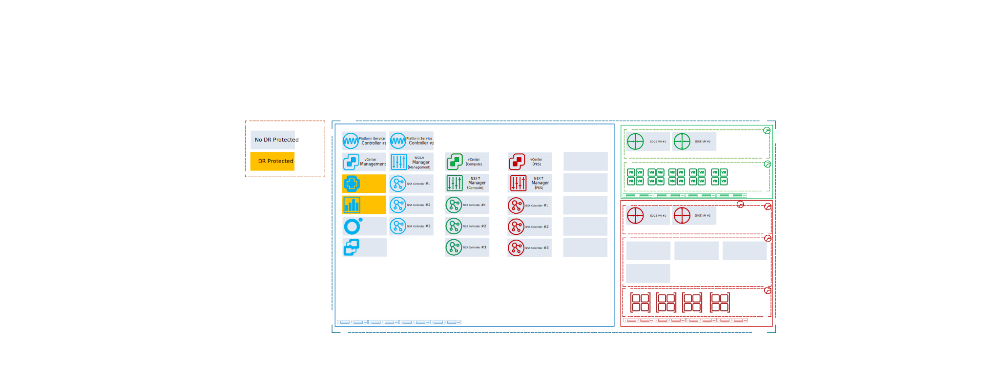
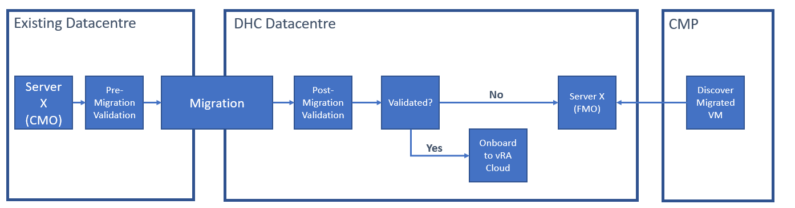
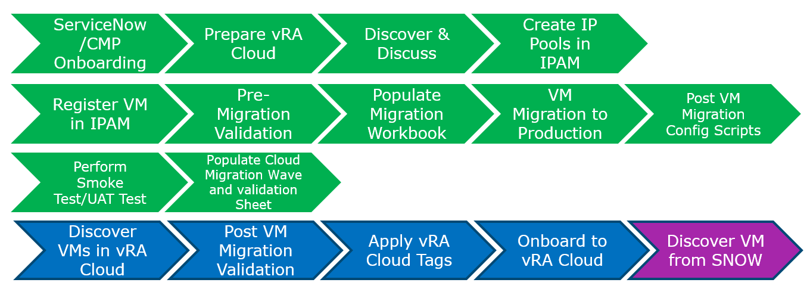
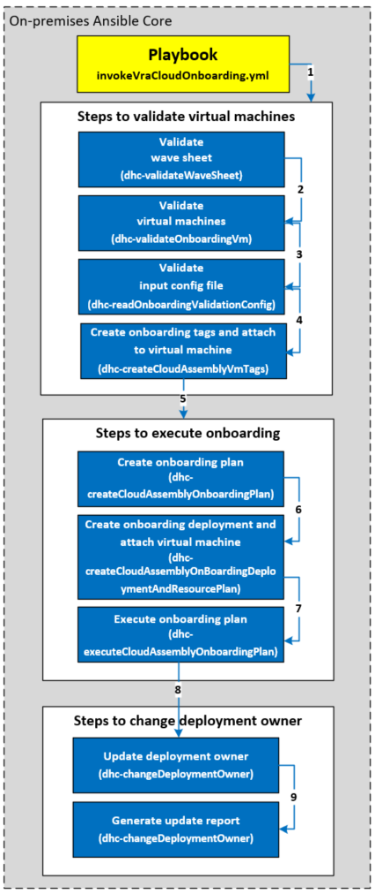
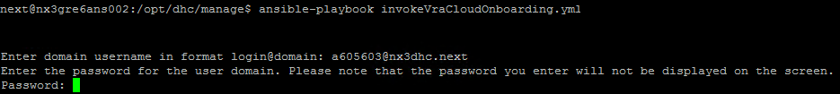

# Migrated vm vRA cloud Onboarding : Low Level Design

- Table of Contents
{:toc}

# Changelog

| Date    | TOS | Issue    | Author(s)       | Description                                                                                                                             |
|---------|-----|----------|-----------------|-----------------------------------------------------------------------------------------------------------------------------------------|
| 03.2020 |     |          | Brian Gerrard   | Initial draft                                                                                                                           |
| 04.2020 |     |          | Robert Kaminski | Adjusted design decision to be inline with vmDeployment LLD, added CMP tagging for DR and backup                                        |
| 06.2021 |     | DHC-2244 | Tomasz Korniluk | Adjusted design decision, onboarding diagram and other chapters related with onboarding tags to address deployment owner tag (DHC-2244) |
| 07.2021 |     | DHC-2326 | Tomasz Korniluk | Adjusted chapter manual onboarding (DHC-2326)                                                                                           |
| 08.2021 |     | DHC-2601 | Tomasz Korniluk | Adjusted chapters requirements, security (added onboarding token part) and updated manual onboarding                                    |

## 1 Introduction

### 1.1 Purpose

The purpose of this document is to provide detailed design and architectural guidance required to implement vRA Cloud Onboarding for migrated Virtual Machines as part of the Workload Migration service in accordance with Atos Global Delivery standards and portfolio services.

### 1.2 Audience

This document is intended for employees from the Workload Migration Services Center of Excellence who will be tasked with Onboarding migrated VMs onto vRA Cloud. The blueprint assumes that the reader has reasonable grasp of VMware cloud technologies, virtualization, hyperconverged infrastructure, VCS, and ServiceNow as well as familiarity with architecture principles including single and multi-tenancy.

### 1.3 Scope

This LLD is intended to cover below components and domains:

1. Description of the vRA Cloud Onboarding process
2. Detailed design of the used technical automation and orchestration platform
3. Description of orchestration workflows

This LLD does not cover:

1. VCS platform design
2. ServiceNOW architecture
3. ServiceNOW portal

### 1.4 Related Documents

This document is a subset of Atos Technology Lifecycle Management (ATLM) artefacts. All documents are stored in the VCS documentation repository.

### 1.5 Requirement Levels

This document is following the principles below to categories all requirements and design decisions.

|    Term    | Meaning                                                                                                                                                                                                                                                         |
|:----------:|-----------------------------------------------------------------------------------------------------------------------------------------------------------------------------------------------------------------------------------------------------------------|
|    MUST    | The definition is an absolute requirement of the specification.                                                                                                                                                                                                 |
|  MUST NOT  | The definition is an absolute prohibition of the specification                                                                                                                                                                                                  |
|   SHOULD   | There may exist valid reasons in particular circumstances to ignore a particular item, but the full implications must be understood and carefully weighed before choosing a different course                                                                    |
| SHOULD NOT | There may exist valid reasons in particular circumstances when the particular behaviour is acceptable or even useful, but the full implications should be understood and the case carefully weighed before implementing any behaviour described with this label |
|    MAY     | Any design decisions that are not classified as MUST and SHOULD or covering optional feature that is not general available for VCS product                                                                                                                      |

## 2 Architecture Overview

Workload Migration uses the existing architecture and platform of VCS. It also uses existing connections, plugins, etc. Below is the global architecture. It introduces no new architecture elements.



Figure 1 Architecture Overview

### 2.1 Business and Solution Requirements

The table below provides known requirements mandatory to be incorporated into design decisions of vRA Cloud Onboarding in this LLD.

|  ID  | Requirement description                     |  Requirement Source   | Requirement Level |
|:----:|---------------------------------------------|:---------------------:|:-----------------:|
| R001 | VCS platform is fully setup and operational | {HLD/other LLD/other} |       MUST        |

Table 2 Initial Requirements

**Pre-Reqs**

- VMs to be Powered on (for automated validation)
- VMs to be pre-migrated to vCenter Production Cluster
- VMs VMware tools up to date (for automated validation)
- Active vRA cloud customer accounts to assign correct deployments owners
- Credentials for the AD domain where the onboarding Ansible playbook will be run
- Active vRA cloud account with assigned roles (cloud assembly administrator and migration administrator)
- Active vRA cloud API token for onboarding automation stored in vault

## 3 Detailed Logical Design

Below is a representation of the steps involved in the onboarding of a customer workload / VM. The vRA Cloud Onboarding component is responsible for the Add Step 1 and Add Step 2.



Figure 2 Onboarding Steps Overview

Add Step 1 – Is responsible for moving the customer workload from the staging environment onto the production environment. The staging environment consists of production blades that have been repurposed into a separate ESX cluster with some staging datastores attached. The staging datastores are shared between the staging and production ESX hosts as to permit a storage vMotion and host migration. This is the default way of onboarding although other solutions have also been used in the past.

Add Step 2- Is responsible for adding the required management tooling and registering the customer workload in the corresponding management backends like ServiceNOW, vRA, Nagios, etc. It also includes modifying system settings inside the VM if needed.

After the Add phase is complete the customer workload is manageable through the ServiceNOW portal.

### 3.1 Security

#### 3.1.1 Role Based Access Control

Atos based solutions must guarantee proper access management. Following design decisions are made in that area.

| Decision ID | Design Decision                                                        | Design Justification                                       | Design Implication                                                                                                                                                 |
|:-----------:|------------------------------------------------------------------------|------------------------------------------------------------|--------------------------------------------------------------------------------------------------------------------------------------------------------------------|
|  rbac-001   | WMS Engineers will have access to source and target vCenter            | Access needed to assist in migrations                      | Standard operator roles will be applied                                                                                                                            |
|  rbac-002   | WMS Engineers will have access to Ansible Core VM                      | Needed for executing onboarding playbook                   | Standard operator roles will be applied, VMS Engineers must have account in VCS mgmt domain in order to run playbooks on Ansible Core VM in a hardened environment |
|  rbac-003   | WMS Engineers will have access to vRA cloud onboarding functionalities | Needed to execute onboarding from vRA cloud web GUI        | VMS Engineers must have active account in vRA cloud with assigned roles (cloud assembly administrator,migration )                                                  |
|  rbac-004   | WMS Engineers will have generated vRA cloud API token                  | Dedicated token required for onboarding automation process | VMS Engineers must obtain onboarding token and store in vault location                                                                                             |

Table 3 Design Decisions

#### 3.1.2 Firewall

This section covers all firewall related decisions influencing content of that LLD

| Decision ID | Design Decision                                                | Design Justification      | Design Implication |
|:-----------:|----------------------------------------------------------------|---------------------------|--------------------|
|   fw-001    | Networking between source and target vCenters will be required | Required for VM migration | N/A                |

Table 4 Design Decisions

#### 3.1.3 Certificates

VCS is introducing dedicated Certificate Authority (CA). Below design decisions are taken in terms of certificate management for that LLD

| Decision ID | Design Decision                                                                                                               | Design Justification | Design Implication |
|:-----------:|-------------------------------------------------------------------------------------------------------------------------------|----------------------|--------------------|
|   cd-001    | Internal CA certificate must be used for applicable Management Stack VMs. This document does not introduce any infrastructure |                      |                    |

Table 5 Design Decisions - Certificates

### 3.2 Availability and Scalability

#### 3.2.1 Availability Design

N/A

#### 3.2.2 Scalability Design

N/A

### 3.3 Recoverability

The chapter below provides detailed design choices to protect against data loose and backup functionality and against Datacenter failure.

#### 3.3.1 Component Failure

| Decision ID | Design Decision                                     | Design Justification                              | Design Implication |
|:-----------:|-----------------------------------------------------|---------------------------------------------------|--------------------|
|   cf-001    | Ansible Mgmt Core VM will be redeployed if required | Playbooks held in git therefore easily redeployed |                    |

Table 8 Design Decisions - Component failure

### 3.4 Multi-tenancy

N/A

### 3.5 Automation Integration Framework for Managed Virtual Machines

In-guest authentication is not a requirement for vRA Cloud Onboarding. Any direct connection to customer VMs will be initiated from the Atos ASN or local Ansible installation on the customer workload domain. In-guest executions will be performed during the Post VM Migration OS Config Scripts step of the migration workflow, shown below.

### 3.6 Virtual Machine Onboarding

This section provides a visual overview of the onboarding process as well as detailed design choices for Virtual Machine Onboarding.

The following chart shows the steps used by the Workload Migration Services Center of Excellence.



The following chart shows a more detailed list of steps used for the onboarding. This also includes the playbooks and roles executed in Ansible.



| Decision ID | Design Decision                                                                                                                                                         | Design Justification                                                                                                                         | Design Implication |
|:-----------:|-------------------------------------------------------------------------------------------------------------------------------------------------------------------------|----------------------------------------------------------------------------------------------------------------------------------------------|--------------------|
|   vmo-001   | Use preferred migration tool, for example VMware HCX, to facilitate the migration of virtual machines from the customer datacenter                                      | This will be based on customer preference and available customer budget.                                                                     |                    |
|   vmo-002   | Use a wave sheet to provide customer virtual machine data                                                                                                               | Proven method based on previous Atos VCS migrations                                                                                          |                    |
|   vmo-003   | Validation will include all items listed in the validation config file, detailed in section 4.2                                                                         | Validation items based on previous VCS migrations and agreed on by Atos migration team and VCS Product Owner                                 |                    |
|   vmo-004   | All successfully validated virtual machines must be in vRA Cloud onboarded status to be eligible for day 2 activities                                                   | Deployment ID is required for vRA Cloud day 2 activities                                                                                     |                    |
|   vmo-005   | Use out of the box API calls for vRA Cloud                                                                                                                              | VMware recommended approach for automated vRA Cloud Onboarding                                                                               |                    |
|   vmo-006   | To apply migration tagging we will use the /iaas/api/machines API URL from vRA Cloud                                                                                    | Design Authority imposed decision                                                                                                            |                    |
|   vmo-007   | Migration tags applied to vRA Cloud will be updated in vCenter.                                                                                                         | vRA Cloud imposes 1 way synchronization                                                                                                      |                    |
|   vmo-008   | Migration tags will be applied to onboarded VMs for Management Type, Eligibility for day 2 operations and Onboarding validity status                                    | Agreed in alignment with Design Authority to permit structured VM management                                                                 |                    |
|   vmo-009   | Migration tags will consist of a key:value pair                                                                                                                         | Proven method based on previous Atos VCS migrations                                                                                          |                    |
|   vmo-010   | Migration tags will be applied after validation but before onboarding                                                                                                   | There may be cases when VMs will not be onboarded due to validation issues but still need to be tagged to reflect this                       |                    |
|   vmo-011   | Migration tags should not be edited in vCenter. New tags or updates should only be executed from vRA Cloud API calls                                                    | Investigation shows that editing tags in vCenter results in incorrect tag status in vRA Cloud                                                |                    |
|   vmo-012   | Any risks must be highlighted in the project risk register                                                                                                              | Proven method based on previous Atos VCS migrations                                                                                          |                    |
|   vmo-013   | Create a single vRA Cloud Onboarding Plan per wave sheet. Create an Onboarding Resource, within the single Onboarding Plan, for every virtual machine in the wave sheet | POC import testing experience highlighted this would provide the simplest management of deployments post import.                             |                    |
|   vmo-014   | vRA Cloud Onboarding Deployment Name must match the name of the virtual machine.                                                                                        | This name will be used as the name of the vRA Cloud Deployment in the UI, so makes it straightforward for the customer to locate and manage. |                    |
|   vmo-015   | vRA Cloud Onboarding Deployment Owner Name must be defined and corresponds with account name                                                                            | This owner name will be assigned to affected deployment to allow customer managed their own machines                                         |                    |

Table 11 Virtual Machine Onboarding

### 3.7 Tagging

Tagging will be applied to migrated virtual machines in order to facilitate ongoing management as well as assisting in the CMDB model. The following table will explain the function of each tag and the defined tag name

Whilst vRAC can handle tags with only a key or value, there is a hard requirement from ServiceNOW to provide a key/value pair.

|   Source   | Tag Name                        | Tag  Value                                          | Purpose                                                                                                                                                                                                                                                                                                                                                                                                                      |
|:----------:|---------------------------------|-----------------------------------------------------|------------------------------------------------------------------------------------------------------------------------------------------------------------------------------------------------------------------------------------------------------------------------------------------------------------------------------------------------------------------------------------------------------------------------------|
| Wave Sheet | Management Type                 | atosManaged / customerManaged                       | Tag will be applied per virtual machine, based on the management type agreed prior to migration. It simplify defining OS support ownership: Atos vs others. Customer OSs managed by 3rd parties are marked as Customer Managed                                                                                                                                                                                               |
| Validation | Oversized virtual machines      | cpuOversized / ramOversized / diskOversized         | Tag will be applied to virtual machines which exceed maximum CPU, RAM and disk criteria                                                                                                                                                                                                                                                                                                                                      |
| Validation | Non-Supported Operating Systems | osNotSupported                                      | Tag will be applied to managed virtual machines which have operating systems below the agreed criteria                                                                                                                                                                                                                                                                                                                       |
| Validation | Eligible for Day 2 operations   | day2Full / day2Restricted                           | Tags will be applied based on management type, operating system version, PowerShell version and Bash version                                                                                                                                                                                                                                                                                                                 |
| Validation | Validation status               | validated / notValidated                            | Tags will be applied based on outcome of validation checks. Non Validated VMs will not be onboarded to vRA Cloud but will still be visible in CMDB for accountability. Only validated VMs will be offered Day 2 operations in the Service Catalog                                                                                                                                                                            |
| Validation | Manual Onboarding               | manualOnboard                                       | Tag will be applied to virtual machines which are Powered Off                                                                                                                                                                                                                                                                                                                                                                |
| Wave Sheet | UHC-SN-LOCATION                 | locationCode / locationCodeDR                       | The UHC-SN-LOCATION tag defines VM location placement for stand alone cluster (_locationCode_); defines VM assignment to primary availability zone on stretched cluster (_locationCode_ or _locationCodeDr_)                                                                                                                                                                                                                 |
| Wave Sheet | UHC-SN-DR\_LOCATION             | none / locationCode / locationCodeDR                | VCS assigns tree tags related to Disaster Recovery on the Compute Cluster level: _drType_, _locationCode_ and _locationCodeDr_. drType tag values is _none_ for standalone clusters and _active-active_ for stretched clusters. <BR> The UHC-SN\_DRLOCATION tag defines VM assignment to stretched cluster failover availability zone. Availability zones reflects to cluster _locationCode_ and _locationCodeDr_ tag values |
| Wave Sheet | UHC-SN-DISASTER_RECOVERY        | yes / no                                            | Reflect the DR Protection status of the migrated Virtual Machine in CMDB                                                                                                                                                                                                                                                                                                                                                     |
| Wave Sheet | UHC-SN-BACKUP_POLICY            | daily1900_3w / any defined in the integration phase | Backup policy tag must reflect the Backup Policies agreed and defined by integration Architects with Customer and integrated on CMP and CEB framework.                                                                                                                                                                                                                                                                       |
| Wave Sheet | UHC-SN-OWNER                    | `username@domain.com`                               | Reflect the Virtual Machine owner of the migrated Virtual Machine in CMDB                                                                                                                                                                                                                                                                                                                                                    |
| Wave Sheet | vmOwner                         | `username@domain.com`                               | Reflect the deployment owner of the migrated Virtual Machine under vRA cloud                                                                                                                                                                                                                                                                                                                                                 |
| Wave Sheet | Tenant                          | tenant1                                             | Reflect the tenant of the migrated Virtual Machine in CMDB                                                                                                                                                                                                                                                                                                                                                                   |
| Wave Sheet | mfo                             | yes/no                                              | Reflect Multi Functional Organization status of the migrated Virtual Machine in CMDB                                                                                                                                                                                                                                                                                                                                         |
| Wave Sheet | tshirt size                     | small/medium/large/unclassified                     | Reflect the tshirt size of the migrated Virtual Machine in CMDB                                                                                                                                                                                                                                                                                                                                                              |

Table 12 Virtual Machine Tagging

### 3.8 VCS Management Type Overview

The section below provides detailed design choices for VCS Management Types

| Decision ID | Design Decision                                                                     | Design Justification             | Design Implication |
|:-----------:|-------------------------------------------------------------------------------------|----------------------------------|--------------------|
|   mt-001    | Import VMs of Management Types Atos Managed and Customer Managed                    | Design Authority agreed decision |                    |
|   mt-002    | Definitions of each Management Type should be clearly defined in the Deployment LLD | Design Authority agreed decision |                    |

Table 13 Management Types

Below definitions are taken from the [Deployment LLD](lldVmDeployment.md)

#### 3.8.1 Atos Managed Server

Atos Managed Server properties:

- Relies on Atos Global Images only
- Images Must include cloud-init agents

#### 3.8.2 Customer Managed Server

Customer Managed Server properties:

- Relies on Atos Global Images without Atos tooling installed
- VCS allows to include Customer servers not Atos image based under condition they meet design maxims and are listed on vRealize Automation Support Matrix guest OS list
- Images Must include cloud-init agents

## 4 Detailed Onboarding Process

### 4.1 Introduction

The vRA Cloud Onboarding process uses a .CSV input file, known as the Wave Sheet, that contains information about the customer workloads that need to be onboarded. The Wave Sheet is prepared several days before the onboarding activities by the project responsible for the customer migration in total.

vRA Cloud contains an onboarding process, known as Onboarding Plans, to add existing unmanaged machines to a vRA Cloud project. Unmanaged machines are those machines that were created outside of the typical vRA Cloud deployment process, for example existing machines owned by a customer that are now desired to be managed within vRA Cloud and consequently VCS.

The onboarding process is executed by the top-level Ansible playbook

- invokeVraCloudOnboarding

This playbook contains the execution of Ansible roles developed for each of the stages of the onboarding process. When prompted, supply credentials for the AD domain where the playbook is being run:



The following sections detail the stages involved with a customer workload onboarding:

### 4.2 Wave Sheet and Virtual Machine Validation Configuration File

#### 4.2.1 Background

The Wave Sheet and a Virtual Machine validation configuration file are critical components of the validation stage during the migration process. Essential information is provided as input parameters for automated onboarding.

The Wave Sheet is in CSV format and contains dynamic information specific to each Virtual Machine migrated into VCS. Once completed with customer input data, it should be stored in the /opt/binaries directory of the Ansible core VM.

The validation configuration file is in YAML format and contains dynamic information specific to the customer and VCS. Once completed with customer input data, it should be stored in the /opt/binaries directory of the Ansible core VM. The configuration file will be used in the initial Wave Sheet validation and also in the Virtual Machine validation process.

The automated onboarding process will refer to the Wave Sheet which will be cross referenced with the validation file and provide a safety net to ensure required information is correctly populated.

The following table shows what is required in the Wave Sheet and provides some example content.

|        Field Name        | Example Value                 | Mandatory? | Comment                                                                                                                                                                                                                                          |
|:------------------------:|-------------------------------|------------|--------------------------------------------------------------------------------------------------------------------------------------------------------------------------------------------------------------------------------------------------|
|    virtualmachinename    | testvm001                     | Yes        | name of the virtual machine to be migrated                                                                                                                                                                                                       |
|          tenant          | tenant1                       | Yes        | name of the tenant in ServiceNOW                                                                                                                                                                                                                 |
|           mfo            | finance                       | No         | MFO relates to tenancy. This should include any special MFO setup for ServiceNOW                                                                                                                                                                 |
|       UHC-SN-OWNER       | a508240                       | Yes        | Owner of the VM in ServiceNOW                                                                                                                                                                                                                    |
|         vmOwner          | `firstname.lastname@atos.net` | Yes        | Deployment owner of the VM in vRA cloud                                                                                                                                                                                                          |
|      managementType      | atosManaged                   | Yes        | Can be atosManaged or customerManaged. Decides if a Virtual Machine is eligible for day 2 operations                                                                                                                                             |
|     UHC-SN-LOCATION      | mec9                          | No         | Defines VM location placement for stand alone cluster; defines VM assignment to primary availability zone on stretched cluster                                                                                                                   |
|   UHC-SN-BACKUP_POLICY   | default                       | No         | Name of a valid backup policy. This can be customer specific                                                                                                                                                                                     |
| UHC-SN-DISASTER_RECOVERY | Yes                           | Yes        | Yes or No answer regarding the DR status of the migrated Virtual Machine                                                                                                                                                                         |
|    UHC-SN-DR_LOCATION    | mec9                          | No         | Identifier of DR protected migrated Virtual Machine. Only required if drProtection is Yes                                                                                                                                                        |
|    powershellVersion     | 5.1                           | Yes        | Current version of powershell installed on the migrated Virtual Machine. Required only if machine has Windows OS. If Linux based machine, then it should be tagged as na                                                                         |
|       bashVersion        | 5                             | Yes        | Current version of bash installed on the migrated Virtual Machine. Required only if machine has Linux based OS. If Windows based machine, then it should be tagged as na                                                                         |
|        clustered         | Yes                           | Yes        | Yes or No answer regarding the cluster status of the migrated Virtual Machine                                                                                                                                                                    |
|        tshirtSize        | small                         | Yes        | Tshirt Size of migrated Virtual Machine. Should be mapped to Small, Medium or Large as per VCS agreed sizes. If CPU/RAM combination of the migrated Virtual Machine falls outside the VCS parameters, then it should be tagged with unclassified |

Table 14 Wave Sheet Inputs

Below shows an example of how this will look in csv format:

```csv
virtualmachinename,tenant,mfo,UHC-SN-OWNER,vmOwner,managementType,UHC-SN-LOCATION,UHC-SN-BACKUP_POLICY,UHC-SN-DISASTER_RECOVERY,UHC-SN-DR_LOCATION,powershellVersion,bashVersion,clustered,tshirtSize
testmigration108,tenant1,no,a508240,firstname.lastname@atos.net,atosManaged,,monthly,yes,mec9,na,5,no,small
testmigration109,tenant2,yes,a503440,firstname.lastname@atos.net,customerManaged,mec9,,no,,5.1,na,yes,unclassified
testmigration110,tenant2,yes,a503440,firstname.lastname@atos.net,atosManaged,,,no,,5.1,na,yes,medium
```

The following table shows what is required in the validation configuration file and provides some example content.

|    Field Name     | Example Value                                                                        | Comment                                                                                                                                                         | Where is it validated?                       |
|:-----------------:|--------------------------------------------------------------------------------------|-----------------------------------------------------------------------------------------------------------------------------------------------------------------|----------------------------------------------|
|  operatingSystem  | Microsoft Windows Server 2016 or later (64-bit), Red Hat Enterprise Linux 8 (64-bit) | Lists the approved VCS Operating Systems. Validation will fail if migrated VM OS does not meet requirements. Use the name displayed in vCenter by VMware tools. | During VM validation                         |
|   locationCodes   | mec9                                                                                 | Lists the available deployment endpoints as named in ServiceNOW CMDB                                                                                            | During initial wavesheet validation          |
| powershellVersion | 5.1                                                                                  | Minimum PowerShell version required for Day 2 automation tasks                                                                                                  | During VM validation                         |
|    bashVersion    | 4.2                                                                                  | Minimum Bash version required for Day 2 automation tasks                                                                                                        | During VM validation                         |
|  backupPolicies   | default                                                                              | Lists the relevant Backup policies which are used by the specific customer                                                                                      | During inital wavesheet validation           |
|      tenants      | tenant1, tenant 2                                                                    | Lists the tenants belonging to the customer                                                                                                                     | During initial wavesheet validation          |
|  managementTypes  | atosManaged, customerManaged                                                         | Lists the valid management types for a VM                                                                                                                       | During initial wavesheet validation          |
| vmHardwareVersion | vmx-14                                                                               | vCenter VM Hardware Version                                                                                                                                     | During VM validation                         |
|    casProject     | nx2001                                                                               | Name of the project in CAS to assign all migrated VMs to                                                                                                        | Used as an input for the vRA Onboarding task |
| casOnboardingPlan | OnboardingPlan01                                                                     | Name of the Onboarding Plan in CAS to assign all migrated VMs to                                                                                                | Used as an input for the vRA Onboarding task |

Table 15 Validation Configuration File Entries

Below shows an example of how this will look in YAML format:

```yaml
operatingSystems:
  - Microsoft Windows Server 2016 or later (64-bit)
  - Microsoft Windows Server 2012 (64-bit)
  - Microsoft Windows Server 2008 R2 (64-bit)
  - Microsoft Windows Server 2008 (64-bit)
  - Microsoft Windows Server 2008 (32-bit)
  - Red Hat Enterprise Linux 8 (64-bit)
  - Red Hat Enterprise Linux 7 (64-bit)
  - SUSE Linux Enterprise 15 (64-bit)
  - SUSE Linux Enterprise 12 (64-bit)

locationCodes:
  - mec9
  - mec10

powershellVersion: 5.1
bashVersion: 4.2

backupPolicies:
  - monthly
  - yearly

tenants:
  - tenant1
  - tenant2

managementTypes:
  - atosManaged
  - customerManaged

vmHardwareVersion: 
  - vmx-14
  - vmx-11

casProject:
  name: "nx2001"

casOnboardingPlan:
  name: "TestOnboarding002"
```

**Note**: Make sure to correctly fill vmHardwareVersion of migrated virtual machines and operatingSystems - incorrect inputs will results that validation steps fails.

#### 4.2.2 Processing

The Wave Sheet is validated for empty information and against information in the validation configuration file via the following Ansible role:

- dhc-validateWaveSheet

### 4.3 Virtual Machine Validation

#### 4.3.1 Background

Validates the status of the customer workload to be onboarded by checking criteria defined in the below table. A CSV report is produced detailing which tags will be applied to each VM based on the results of validation against these criteria and if a VM is not validated the reasons for that decision are listed.

|                       Criteria                        | Value                                                                                                    | Tag                       | Comment                                                         |
|:-----------------------------------------------------:|----------------------------------------------------------------------------------------------------------|---------------------------|-----------------------------------------------------------------|
|       Maximum Virtual CPUs per virtual machine        | Tag if exceeds 50% of CPU cores per host                                                                 | cpuOversized              | Find CPU cores in destination host cluster                      |
|            Maximum RAM per virtual machine            | Tag if exceeds 50% of hosts installed RAM                                                                | ramOversized              | Find RAM in destination host cluster                            |
|   Maximum virtual SCSI adapters per virtual machine   | Fail if greater than 1                                                                                   | notValidated              |                                                                 |
|           Maximum disks per virtual machine           | Fail if greater than 15                                                                                  | notValidated              | Includes OS disk (Limited due to vSphere maximums)              |
|     Maximum virtual disk size per virtual machine     | Tag if sum of all disks is 40TB. Fail if individual disks are greater than 62TB                          | diskOversized             | Backup limitations                                              |
|           Maximum NICs per virtual machine            | Fail if greater than 10                                                                                  | notValidated              | No sub interfaces allowed                                       |
|       Maximum video memory per virtual machine        | Fail if greater than 2GB                                                                                 | notValidated              |                                                                 |
|   Validate power status of migrated virtual machine   | Fail if virtual machine power state = off                                                                | manualOnboard             | Powered off VMs will be handled using manual work instructions. |
|             Validate VMware Tools Status              | Fail if not installed or not running                                                                     | notValidated              |                                                                 |
|   Validate if installed VMware Tools are up to date   | Fail if not current                                                                                      | notValidated              |                                                                 |
| Validate Virtual hardware version of virtual machine  | Fail if not current                                                                                      | notValidated              |                                                                 |
|   Validate no RDMs are attached to virtual machine    | Fail if any type of RDM is found                                                                         | notValidated              |                                                                 |
|             Validate OS supported version             | Applicable only if management type = managed. Tag if below agreed minimum OS version.                    | osNotSupported            | Supported OS to be supplied by AHS at time of migration         |
|              Validate PowerShell version              | Applicable only if management type = managed. Tag for full day 2 activities if version is 5.1 or greater | day2full / day2restricted |                                                                 |
|                 Validate Bash version                 | Applicable only if management type = managed. Tag for full day 2 activities if version is 5 or greater   | day2full / day2restricted |                                                                 |
| Validate virtual machine is not part of an OS cluster | Fail if part of an OS cluster                                                                            | notValidated              |                                                                 |

Table 16 Virtual Machine Validation Criteria

#### 4.3.2 Processing

Virtual machines are validated against the above criteria via the following Ansible role:

- dpc-validateOnboardingVm

An output report file, vmValidationOutput.csv, is produced and can be located in /opt/binaries. Example content is below:

```csv
"virtualmachinename","brownfield","UHC-SN-OWNER","vmOwner","managementType","tenant","UHC-SN-DR_LOCATION","mfo","backupPolicy","UHC-DN-DISASTER_RECOVERY","cpuOversized","ramOversized","diskOversized","osNotSupported","manualOnboard","tshirtSize","notValidated","notValidatedReasons","day2Full","day2Restricted"
"testmigration108","True","a508240","firstname.lastname@atos.net","atosManaged","tenant1","mec9","no","monthly","yes","False","False","False","False","False","small","True","Validate virtual machine is not part of an OS cluster","False","False"
"testmigration109","True","a503440","firstname.lastname@atos.net","customerManaged","tenant2","","yes","","no","False","False","False","False","False","unclassified","False","","False","False"
"testmigration110","True","a503440","firstname.lastname@atos.net","atosManaged","tenant2","mec10","yes","","no","False","False","False","False","False","medium","True","Validate VMware Tools Status,Validate if installed VMware Tools are up to date,Validate virtual machine is not part of an OS cluster","False","False"
```

### 4.4 Applying Migration Tags

#### 4.4.1 Background

Tags are applied to migrated VMs to identify the following features:

- Management Type
- Oversized Virtual Machines
- Non-Supported Operating Systems
- Onboarding validity status
- Eligibility for day 2 operations
- Manual Onboarding
- Snow Owner
- Deployment Owner
- Tenant of Virtual Machines
- TShirt Size of Virtual Machines
- drProtection (if applicable)
- drPolicy (if applicable)
- osNotSupported (if applicable)
- Backup Policy (if applicable)

Tags will be applied to vRA Cloud via out of the box API functionality and automatically updated on vCenter. ServiceNOW CMP discovery will be used to align the migration tags in ServiceNOW CMDB.

It is important to note that tags should not be directly edited or applied in vCenter. This will result in incorrect tag status in vRA Cloud.

#### 4.4.2 Processing

Migration tags are applied to Virtual Machines in vRA Cloud via the following Ansible role:

- dhc-createCloudAssemblyVmTags

### 4.5 vRA Cloud Onboarding

#### 4.5.1  Manual Onboarding

Although VCS will provide automation for onboarding, it is important to understand the manual process to develop understanding of what we are achieving. There are very few steps needed to perform the onboarding of a VM into Cloud Assembly.
Manual steps has been described in work instruction document [onboardingVraOnPremCustomerVms.md](../workInstructions/onboardingVraOnPremCustomerVms.md) inside chapter 3.

#### 4.5.2  Automated Onboarding

Automated onboarding steps has been described in work instruction document [onboardingVraOnPremCustomerVms.md](../workInstructions/onboardingVraOnPremCustomerVms.md) inside chapter 2.

##### 4.5.2.1 Background

It is possible to use the vRA Cloud API to automate the manual virtual machine onboarding process described in section 4.3. The following section lists the API calls required to carry out this process.

| Description                   | URL                                                           | Method | Example Body                                                                                                                                                                                                                      | Captured Output            |
|-------------------------------|---------------------------------------------------------------|--------|-----------------------------------------------------------------------------------------------------------------------------------------------------------------------------------------------------------------------------------|----------------------------|
| Login                         | /iaas/login                                                   | POST   | { "refreshToken": "< refreshToken >" }                                                                                                                                                                                            | Bearer Token               |
| Get Cloud Account By Name     | /iaas/api/cloud-accounts?$filter=name eq < cloudAccountName > | GET    |                                                                                                                                                                                                                                   | Cloud Account Id           |
| Get Project by Name           | /iaas/projects?$filter=name eq '< projectName >'              | GET    |                                                                                                                                                                                                                                   | Project Id                 |
| Create Onboarding Plan        | /relocation/onboarding/plan                                   | POST   | { "endpointId": < cloudAccountId >, "name": < newOnboardingPlanName >, "projectId": < projectId > }                                                                                                                               | Onboarding Plan Link       |
| Create Onboarding Deployment  | /relocation/onboarding/deployment                             | POST   | { "name": < newOnboardingDeploymentName >, "planLink": "< onboardingPlanLink >" }                                                                                                                                                 | Onboarding Deployment Link |
| Get Iaas Machine By Name      | /iaas/api/machines?$filter=name eq '< vmName >'               | GET    |                                                                                                                                                                                                                                   | VM Id                      |
| Create Onboarding Resource    | /relocation/onboarding/resource                               | POST   | { "deploymentLink": "< onboardingDeploymentLink >", "planLink": "< onboardingPlanLink >", "resourceLink": "/resources/compute/< vmId >",   "resourceName": "< vmName >", "ruleLinks": [ "/relocation/onboarding/rule/include" ] } |                            |
| Execute Onboarding Plan       | /relocation/api/wo/execute-plan                               | POST   | { "planLink": "< onboardingPlanLink >" }                                                                                                                                                                                          | Execute Plan Link          |
| Get Onboarding Plan Execution | /relocation/api/wo/execute-plan/{id}                          | GET    |                                                                                                                                                                                                                                   |                            |

Table 17 vRA Cloud Onboarding API Calls

##### 4.5.2.2 Processing

Virtual machines are onboarded to vRA Cloud using the above API calls to automate the onboarding process via the following Ansible roles:

- dhc-createCloudAssemblyOnboardingPlan
- dhc-createCloudAssemblyOnboardingDeploymentAndResource
- dhc-executeCloudAssemblyOnboardingPlan

We should note at the time of writing, the maximum number of VMs safely supported by VMware in a single plan is 3,500.

##### 4.5.2.3 Reporting

vRA cloud onboarding process generates report json file called "onboardingReport.json".

Reporting file holds core data like:

- onBoardingPlanName
- vmTenant
- vmName
- vmOwner
- project
- tagsAssigned
- vmNotValid
- notValidReason
.. and much more optional fields to help track results of onboarding process

Generated report gives migration engineer overview about results of onboarding process and helps to track not valid virtual machines.

Following example of report:

```json
{
    "vmTshirtSize": "unclassified",
    "vmOwner": "firstname.lastname@atos.net",
    "notValidReason": [
      "Validate if installed VMware Tools are up to date",
      "Validate Virtual hardware version of virtual machine"
    ],
    "vmTenant": "nx7001",
    "vmClustered": "no",
    "vmOsNotSupported": false,
    "vmNotValid": true,
    "managementType": "customerManaged",
    "vmName": "hcxmigrationvm2"
  },
  {
    "vmTshirtSize": "unclassified",
    "vmOwner": "firstname.lastname@atos.net",
    "tagsAssigned": "{\"tags\":[{\"key\":\"brownfield\"},{\"key\":\"customerManaged\"},{\"key\":\"UHC-SN-OWNER\",\"value\":\"a123456\"},{\"key\":\"vmOwner\",\"value\":\"firstname.lastname@atos.net\"},{\"key\":\"tenant\",\"value\":\"nx7001\"},{\"key\":\"mfo\"},{\"key\":\"UHC-SN-LOCATION\",\"value\":\"mec9\"},{\"key\":\"UHC-SN-DISASTER_RECOVERY\",\"value\":\"no\"},{\"key\":\"validated\"},{\"key\":\"tshirtSize\",\"value\":\"unclassified\"}]}",
    "vmTenant": "nx7001",
    "onBoardingPlanName": "TestOnboardingDemoShow",
    "vmClustered": "no",
    "project": "nx7001",
    "vmOsNotSupported": false,
    "onBoardingDeploymentName": "hcxmigrationvmDemo9",
    "onBoardDeploymentLink": "/relocation/onboarding/plan/0ba3146e-ca67-4a34-90fd-b3dd9c9b1988",
    "vmNotValid": false,
    "managementType": "customerManaged",
    "vmName": "hcxmigrationvmDemo9"
  }

    ]
  }
```

Additionally reporting tasks generates summary report as following example:

```json
  {
    "summaryReport": [
      {
        "validVmsList": [
          {
            "Name": "hcxmigrationvmDemo9"
          }
        ],
        "invalidVms": 1,
        "validVms": 1,
        "onBoardingPlanExecutionStatus": "FINISHED",
        "onBoardingPlanName": "TestOnboardingDemoShow",
        "onBoardDeploymentLink": "/relocation/onboarding/plan/0ba3146e-ca67-4a34-90fd-b3dd9c9b1988",
        "OverallOnboardingResult": "PARTIAL SUCCESS",
        "invalidVmsList": [
          {
            "Name": "hcxmigrationvm2"
          }
        ]
      }
```

### 4.6 CMP

For Migration Workloads requiring a presence of the Virtual Machine within the CMDB, the following applies:

- For customers able to use the CMP plugin for vRA Cloud, ServiceNow is able to scan vRA Cloud for applicable Virtual Machines (determined via the use of tags) and create CMDB entries for them.
- For customers able to use the CMP plugin for vRA Cloud, the process is still to be determined.

## 5 Detailed Physical Design

Since the Workload Migration component leverages the existing physical design there is no need to again show the physical design of VCS. Please refer to the [Infrastructure LLD](lldInfrastructure.md) for more information.
