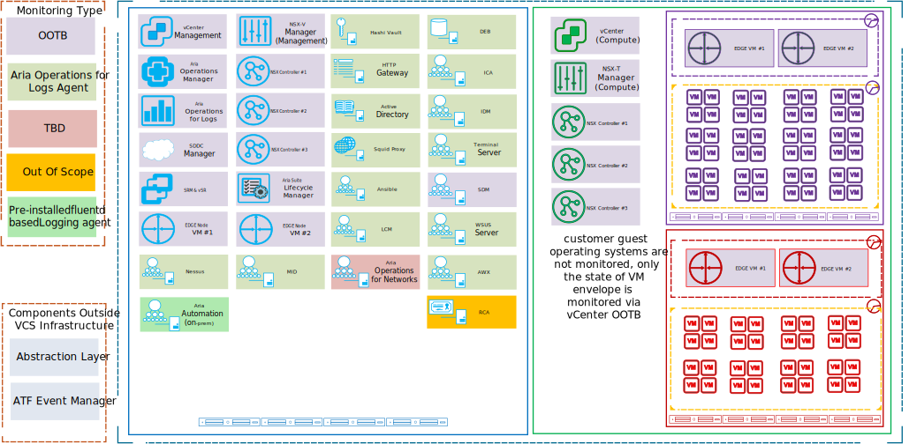
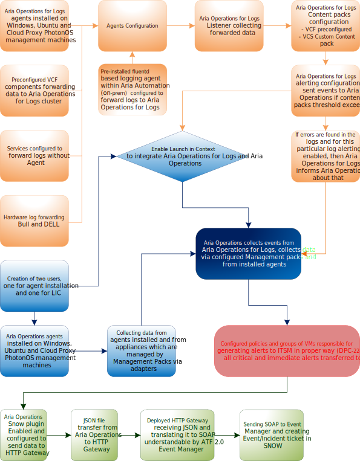
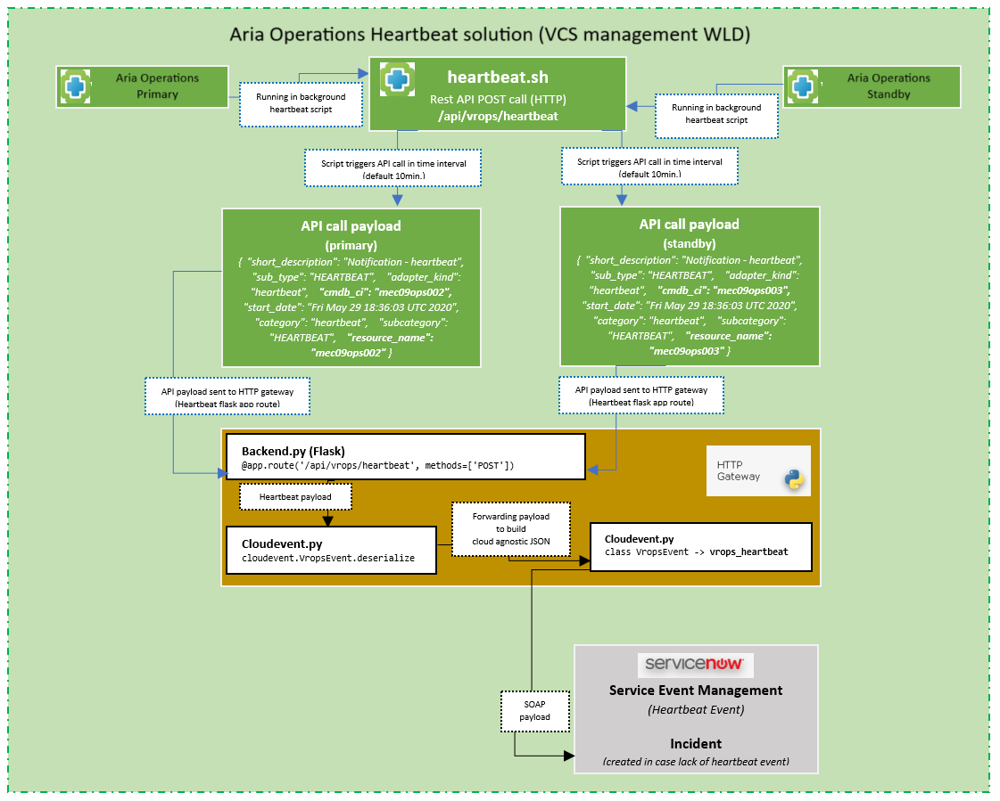
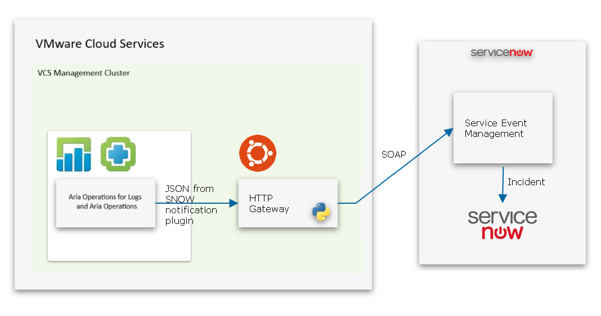
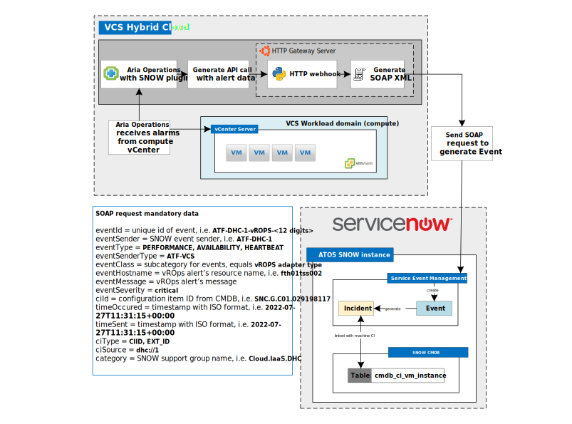
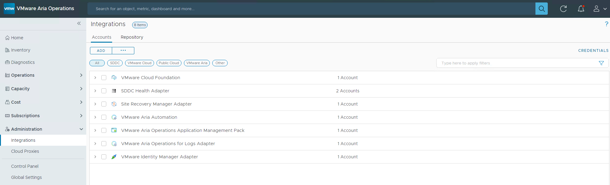
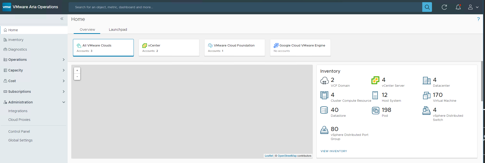

# Monitoring and Logging LLD

- Table of Contents
{:toc}

# 1 Introduction

## 1.1 Author

|    Author name     |         Author email          |    Date    |
|:------------------:|:-----------------------------:|:----------:|
| Tomasz Jasionowski | `tomasz.jasionowski@atos.net` | 16.03.2020 |

### 1.1.2 Changelog

|    Date    | Issue | Author | TOS | Description |
|------------|-------|--------|-----|-------------|
| 16.03.2020 || Tomasz Jasionowski || initial draft of document, monitoring and logging information moved as was from other LLDs |
| 25.03.2020 || Tomasz Jasionowski ||Chapter 1, 2, 3 4.1, 4.2, 4.3, finished.  |
| 27.03.2020 || Tomasz Jasionowski || final draft version  |
| 17.04.2020 || Marcin Gala || added subchapter 3.8 about external access to Aria Operations by Client, info about wildcard certificate need and additional firewall rules necessary to allow that access |
| 17.04.2020 || Tomasz Jasionowski || Content packs configuration chapters added, review findings resolved |
| 25.05.2020 || Tomasz Jasionowski || last changes before DA review |
| 15.07.2020 || Jakub Zielinski || updates to SRM logging and monitoring chapters 3.2 , 4.4.2 , 4.4.6.22 and 4.4.6|
| 30.10.2020 || Piotr Lewandowski |VCS 1.2| Initial updates for VCS 1.2 |
| 17.03.2021 || Jakub Zielinski || chapter 4.4.8 maintenance configuration |
| 01.06.2021 || Tomasz Korniluk || chapter 4.4.5 http gateway heartbeat solution configuration |
| 14.06.2021 || Tomasz Korniluk || chapter 4.4.6 Aria Operations monitoring workflow with abstraction layer and servicenow |
| 22.07.2021 |DHC-2464| Tomasz Korniluk || updated chapter 4.4.4 to cover new cmdb tables and vcenter variables |
| 16.08.2022 | CESDHC-619 | Marcin Kujawski || Removed Abstraction Layer content|
| 23.09.2022 | CESDHC-4164 | Adam Wieczorek || Added monitoring information for SAN storage |
| 03.10.2022 | CESDHC-3864 | Madhavi Rane || Added monitoring information for vRA on-prem |
| 2023.02.08 |CESDHC-5861 | Adrian Ilea        || Aria Operations for Logs log data retention update |
| 2023.03.02 |CESDHC-5867 | Adam Szymczak        || Update for SNOW ticket autoresolvement |
| 17.03.2023 | CESDHC-6593 | Madhavi Rane | | Added details for Aria Operations Telegraf agent based monitoring |
| 2023.03.31 |VCS-9193 | Michał Sobieraj        || Aria Operations log data retention update |
| 2024.02.09 |VCS-12032 | Adam Wieczorek        | VCS 2.0| Removed KMS references. KMS has been replaced with Native Key Provider |
| 2025.03.21 | VCS-14131 | Mariusz Stanek        | VCS 2.0| Old naming vRealize convetion changed to Aria products, new integration presented |

## 1.2 Purpose

The purpose of this document is to provide detailed design and architectural guidance required to implement validated model of VCS log forwarding, monitoring and event management
in accordance with Atos standards and portfolio services. The principal aim of this document is to translate the high-level design (HLD) into a technical low-level design (LLD).  
Design provides component architecture overview in Architecture Overview chapter that provides basic building blocks and main principles, followed by Detailed Logical Design  and final Detailed Physical Design.  
Architecture Overview provides basic building blocks and main design principles of presented design. It covers known requirements cascaded from HLD and other LLDs.  
Detailed Logical Design presents business logic, relations and fundamental design decisions.  
Detailed Physical Design provides detailed configuration of components including POD type specifics.  

## 1.3 Audience

This document is intended for Atos Cloud Services Engineers and Architects responsible for VMware Cloud Services (VCS) solution implementation and maintenance.

## 1.4 Scope

This LLD is intended to cover below components and domains:

1. Aria Operations monitoring
2. Aria Operations for Logs logs management and monitoring
3. HTTP Gateway application
4. All monitoring components integration

This LLD is not covering:

1. OS logging and monitoring for Customer Workload

## 1.5 Related Documents

This document is a subset of Atos Technology life cycle Management (ATLM) artefact. All documents are stored in the VCS documentation repository.

|        File name         | Document Name                                                       |
|:------------------------:|---------------------------------------------------------------------|
| hldDigitalHybridCloud.md | [VMware Cloud Services: High Level Design](hldDigitalHybridCloud.md) |

Table 1 ATLM Related Documents

## 1.6 Requirement Levels

This document is following the principles below to categorize all requirements and design decisions.

|    Term    | Meaning                                                                                                                                                                                                                                                         |
|:----------:|-----------------------------------------------------------------------------------------------------------------------------------------------------------------------------------------------------------------------------------------------------------------|
|    MUST    | The definition is an absolute requirement of the specification.                                                                                                                                                                                                 |
|  MUST NOT  | The definition is an absolute prohibition of the specification                                                                                                                                                                                                  |
|   SHOULD   | There may exist valid reasons in particular circumstances to ignore a particular item, but the full implications must be understood and carefully weighed before choosing a different course                                                                    |
| SHOULD NOT | There may exist valid reasons in particular circumstances when the particular behaviour is acceptable or even useful, but the full implications should be understood and the case carefully weighed before implementing any behaviour described with this label |
|    MAY     | Any design decisions that are not classified as MUST and SHOULD or covering optional feature that is not general available for VCS product                                                                                                                      |

Table 2 Requirement Levels

# 2 Architecture Overview

The diagram below highlights VCS areas covered in this LLD. This document will cover the logging and monitoring design for VCS.

## Figure 1. VCS Architecture Overview



## 2.1 Business and Solution Requirements

The table below provides known requirements mandatory to be incorporated into design decisions of VCS Logging and Monitoring described in this LLD.

|  ID  | Requirement description                                                                                               | Requirement Source | Requirement Level |
|:----:|-----------------------------------------------------------------------------------------------------------------------|:------------------:|:-----------------:|
| R001 | VCS management components have to be monitored                                                                        |        HLD         |       MUST        |
| R002 | Application logs and security logs have to be collected, analysed, and stored for future needs                        |        HLD         |       MUST        |
| R003 | There is a need to integrate VCS Monitoring solution with ITSM to provide real time monitoring with incident solution |        HLD         |       MUST        |

Table 3 Initial Requirements

# 3 Detailed Logical Design

## 3.1 Logging and Monitoring Architecture overview

The diagram below shows Logging and Monitoring Architecture overview.

### Figure 2. Logging and Monitoring Architecture overview



## 3.2 Logging and Monitoring integration and design

This chapter provides design decisions for logging and monitoring used in VCS to provide functional and integrated solution. Aria Operations for Logs and Aria Operations will be integrated including Launch in context functionality.

| Decision ID | Design Decision                                                                                                                                                                                                                   | Design Justification                                                                                                                                                                                                                                                                | Design Implication                                                                                               |
|:-----------:|-----------------------------------------------------------------------------------------------------------------------------------------------------------------------------------------------------------------------------------|-------------------------------------------------------------------------------------------------------------------------------------------------------------------------------------------------------------------------------------------------------------------------------------|------------------------------------------------------------------------------------------------------------------|
|   lm-001    | Aria Operations for Logs and Aria Operations will be integrated including Launch in Context functionality                                                                                                                                                       | Launch in Context provides possibility for Aria Operations to launch checks on Aria Operations for Logs cluster in context of Aria Operations for Logs local user, You can configure Aria Operations Manager to display menu items related to Aria Operations for Logs and launch Aria Operations for Logs with an object-specific query. |                                                                                                                  |
|   lm-002    | All available alerts from Aria Operations for Logs will be forwarded to Aria Operations, but only Immediate and critical alerts to be transferred to ITSM. Along with this CO would be able to decide if some additional warnings should be transferred to ITSM | Hundreds of warning alerts have been suppressed inline with other platform approaches. This will be fine tuned in the next release in collaboration with Operations otherwise enabling these will result in too many incidents to manage.                                           |                                                                                                                  |
|   lm-003    | Aria Operations default out-of-the-box alert definitions used                                                                                                                                                                               | Hundreds of alert definitions are provided out of the box by each Aria Operations solution adapter.                                                                                                                                                                                           |                                                                                                                  |
|   lm-004    | VCS Custom Content Pack, which contains all missing/required alerts, will be used. If any other alert has to be used, it should be created in VCS Custom Content Pack                                                             | This will be the easiest way to manage enabled alerts in Aria Operations for Logs and manage needed automation                                                                                                                                                                                          |                                                                                                                  |
|   lm-005    | Aria Operations for Logs log retention is 1 month                                                                                                                                                                                                     | As required for compliance with Atos security policy for logging.                                                                                                                                                                                                                   |                                                                                                                  |
|   lm-006    | Aria Operations alerts retention will stay as a default 45 days                                                                                                                                                                             | That 45 days is a sufficient period for alert retention                                                                                                                                                                                                                             |                                                                                                                  |
|   lm-007    | Remote forwarder can be enabled                                                                                                                                                                                                   | Aria Operations for Logs cluster provides an option to forward all or some of the logs to external syslog server                                                                                                                                                                                        | VCS provides possibility to forward logs to external syslog but as a default VCS Aria Operations for Logs cluster is a syslog server |

Table 4 Design Decisions Logging and Monitoring integration

### 3.2.1 Agents configuration design

| Decision ID | Design Decision                                                                                     | Design Justification                                                                                                                    | Design Implication                                                                                                                                                                                    |
|:-----------:|-----------------------------------------------------------------------------------------------------|-----------------------------------------------------------------------------------------------------------------------------------------|-------------------------------------------------------------------------------------------------------------------------------------------------------------------------------------------------------|
|   ac-001    | Aria Operations for Logs and Aria Operations agents will be installed on all Windows and Ubuntu machines                          | VMware best practices and it is the easiest way to manage                                                                               |                                                                                                                                                                                                       |
|   ac-002    | Aria Operations for Logs agents will be configured via liagent.ini file                                                 | It is the easiest way to manage changes with ansible automation                                                                         | Agents and automation upgrade process have to be created for LCM purposes, default update for Aria Operations for Logs agents will be unavailable                                                                         |
|   ac-003    | Aria Operations agents will be used with default configuration                                                | There is no need to use additional configuration                                                                                        |                                                                                                                                                                                                       |
|   ac-004    | Aria Operations agents will use additional local user account created on Aria Operations cluster                        | AD user is not supported for agent connection                                                                                           | It is not in line with security policy                                                                                                                                                                |
|   ac-005    | Aria Operations for Logs and Aria Operations agent will be installed on Aria Automation Cloud Proxy machines                                  | Cloud Proxy cluster have to be monitored via agents because Management Pack does not exist for this component                           | additional tasks exist for PhotonOS agent installation, but are used only on those two machines, any other PhotonOS machines are monitored via Management Packs and log forwarding is configured OOTB |
|   ac-006    | Aria Operations for Logs agent will be installed on Workspace ONE Access SLES OS                                                        | Workspace ONE Access machine is an VMware appliance but is not installed via SDDC manager and because of that the Aria Operations for Logs is not configured out of the box | additional task exist for SLES agent installation but is used only for this one machine, any other SLES appliances are configured OOTB                                                                |
|   ac-007    | For Aria Automation (on-prem), pre-installed fluentd based logging agent will be configured to send logs to Aria Operations for Logs | As per VMware recommendation                                                                                                            |                                                                                                                                                                                                       |

Table 5 Design Decisions agents configuration

#### 3.2.1.1 Aria Operations Telegraf Agent

Aria Operations 8.6 onwards epops agents are no longer supported. For monitoring operating systems, windows services and Linux processes we can use Application monitoring feature of Aria Operations. For Application monitoring, we need to deploy Aria Operations Cloud Proxy and install telegraf agent on target vms.

### 3.2.2 Management packs configuration design

Aria Operations Management packs are used to collect data from the components using adapters. Aria Operations operating systems and Active Directory plugins will be used to collect the metrics. To use MPs to monitor VCS components there is a need to create an adapter with proper credentials.

| Decision ID | Design Decision                                                                     | Design Justification                                                                                                                                                                                     | Design Implication                                                                            |
|:-----------:|-------------------------------------------------------------------------------------|----------------------------------------------------------------------------------------------------------------------------------------------------------------------------------------------------------|-----------------------------------------------------------------------------------------------|
|   mp-001    | Out of the box (OOTB) VCF Management packs will be used                             | VMware best practices                                                                                                                                                                                    |                                                                                               |
|   mp-002    | Additional management packs will be installed                                       | OOTB Management packs installed on Aria Operations are not enough to monitor the whole stack                                                                                                                       |                                                                                               |
|   mp-003    | Additional management packs will be installed via Aria Suite Life Cycle manager | This is only one way to install MPs in automated fashion                                                                                                                                                 |                                                                                               |
|   mp-004    | Additional Aria Operations plugins will be enabled and activated                              | When MPs do not exist, monitoring can be provided by using Aria Operations plugins. Plugins give an opportunity to configure additional OS monitoring like service status, process health, URL accessibility, etc. | Services, URL and other configurations, which have to be monitored need additional automation |

Table 6 Design Decisions management packs

### 3.2.3 Content packs configuration design

Aria Operations for Logs delivers automated log management through aggregation, analytics and search, enabling operational intelligence and enterprise-wide visibility in dynamic hybrid cloud environments. Content Packs are plugins that provide pre-defined knowledge about specific types of events such as log messages. A content pack is made up of information that can be saved from either the Dashboards or Interactive Analytics pages.

| Decision ID | Design Decision                                  | Design Justification                                                                    | Design Implication |
|:-----------:|--------------------------------------------------|-----------------------------------------------------------------------------------------|--------------------|
|   cp-001    | OOTB VCF Content packs will be used              | VMware best practices                                                                   |                    |
|   cp-002    | Additional custom Content packs will be imported | OOTB Content packs installed on Aria Operations for Logs are not enough to find error logs from whole stack |                    |

Table 7 Design Decisions management packs

### 3.2.4 HTTP Gateway configuration design

| Decision ID | Design Decision                                                          | Design Justification                                                                                   | Design Implication                                                                                                                                                       |
|:-----------:|--------------------------------------------------------------------------|--------------------------------------------------------------------------------------------------------|--------------------------------------------------------------------------------------------------------------------------------------------------------------------------|
|   hg-001    | HTTP Gateway will be deployed in Management Workload Domain              | Translation between Aria Operations and ITSM is required                                                         | The additional component requires extra configuration steps, backup and AV protection as well as hardening, however, all these are covered by the VCS deployment process |
|   hg-002    | Aria SNOW notification plugin will be enabled and used in VCS        | Integration between Aria Operations and HTTP Gateway is required                                                 |                                                                                                                                                                          |
|   hg-003    | Custom JSON configuration file will be used for SNOW notification plugin | A change to the default configuration is required for proper integration                               | plugin might be changed in the future by vendor which can impact the LCM                                                                                                 |
|   hg-004    | HTTP Gateway server will create/resolve Event/Incident via SOAP request  | JSON from Aria Operations needs to be translated to SOAP XML format that can be understood by SNOW Event Manager | HTTP Gateway application python scripts are part of VCS and the code is available in VCS binaries                                                                        |

Table 8 Design Decisions HTTP Gateway

## 3.3 Security

### 3.3.1 Role Based Access Control

Atos based solutions must guarantee proper access management. Following design decisions are made in that area.

| Decision ID | Design Decision                                                              | Design Justification                                                                                            | Design Implication |
|:-----------:|------------------------------------------------------------------------------|-----------------------------------------------------------------------------------------------------------------|--------------------|
|   rb-001    | There will be a dedicated AD groups used for the LDAP authentication method. | AD Groups are required to control access to logging and monitoring stack                                        |                    |
|   rb-002    | Local Aria Operations user for agent installation will be created                      | as a AD user is not supported to manage agent installation local user will be created and added to proper group |                    |
|   rb-003    | Local Aria Operations user for Aria Operations for Logs integration via Launch in context will be created  | as a AD user is not supported to manage integration, local user will be created and added to proper group       |                    |
|   rb-004    | authentication token for AL will be provided by AL Team                      | HTTP Gateway need to be authenticated on AL instance and for that the token will be provided by AL Team         |                    |
|   rb-005    | Dedicated http gateway AD service account will be created                    | HTTP Gateway needs dedicated AD service account to query Management and Compute vCenter servers                 |                    |

Table 9 Design Decisions RBAC

### 3.3.2 Firewall

This section covers all firewall related decisions influencing content of that LLD

| Decision ID | Design Decision                                                                                                                                                             | Design Justification                                                                                               | Design Implication                          |
|:-----------:|-----------------------------------------------------------------------------------------------------------------------------------------------------------------------------|--------------------------------------------------------------------------------------------------------------------|---------------------------------------------|
|   fd-001    | NSX-T based firewalls will be enabled for SDDC components separation                                                                                                        | Security requirements                                                                                              | None                                        |
|   fd-002    | Traffic between Aria Operations for Logs, Aria Operations, Aria Operations Cloud Proxy, HTTP Gateway, SNOW and all monitored Components is allowed via NSX-T firewall                                               | Required for functionality                                                                                         | NA                                          |
|   fd-003    | Traffic between HTTP Gateway and SNOW will be realized via Internet proxy                                                                                                   | better control over outgoing internet access. Default design decision for entire VCS on premisses management stack | Internet Proxy must be delivered in HA mode |
|   fd-004    | Traffic between Customer subnet (from which Aria Operations will be accessed), Client Active Directory controllers and Aria Operations VIP in Management Cluster is  allowed via NSX-T firewall | Required for functionality                                                                                         | NA                                          |

Table 10 Design Decisions Firewall

### 3.3.3 Certificates

VCS is introducing dedicated Certificate Authority (CA). Below design decisions are taken in terms of certificate management for that LLD

| Decision ID | Design Decision                                                                 | Design Justification                                                                                                            | Design Implication |
|:-----------:|---------------------------------------------------------------------------------|---------------------------------------------------------------------------------------------------------------------------------|--------------------|
|   cd-001    | Certificate Authority will provide the certificates for the Aria Operations for Logs cluster | Security requirements                                                                                                           |                    |
|   cd-002    | Certificate Authority will provide the certificates for the Aria Operations cluster       | Security requirements                                                                                                           |                    |
|   cd-003    | only VCS CA will be used as a trusted CA                                        | Customer access for Aria Operations Dashboards will be provided and customer will have to accept and trust for VCS certificates authority |                    |

Table 11 Design Decisions - Certificates

## 3.4 Availability and Scalability

### 3.4.1 Availability Design

The design decisions below are made to guarantee availability of VCS Management.

| Decision ID | Design Decision                                                             | Design Justification                                                                                    | Design Implication                                                                                      |
|:-----------:|-----------------------------------------------------------------------------|---------------------------------------------------------------------------------------------------------|---------------------------------------------------------------------------------------------------------|
|   av-001    | Place Aria Operations nad Aria Operations for Logs cluster nodes on different hosts (anti affinity rules) | It is best practice with regards to CPU/Memory contention and availability                              |                                                                                                         |
|   av-002    | HTTP Gateway will be protected only via vSphere HA                          | HTTP Gateway application cluster or Load Balancer for it is not ready                                   | HTTP Gateway VM deployment will be redesigned in next releases to provide better availability           |
|   av-003    | SNOW Availability is out of VCS scope                                       | Availability for this component is designed by an external Team                                         | OLA with the team still not in place, for now the support is provided as a Best Effort work             |
|   av-004    | Aria Operations and Aria Operations for Logs deployments are clustered OOTB and this is a must            | To provide High Availability for components they should be deployed in clustered fashion                |                                                                                                         |
|   av-005    | All components in management VCS cluster will be protected via vSphere HA   | As a default on VCF stack the vSphere HA is enabled, this will be not changed                           |                                                                                                         |
|   av-006    | Aria Operations Cloud Proxy will be protected via vsphere HA                          | Aria Operations version 8.6 does not provide HA support for Aria Operations Cloud proxy for Telegraf agent based monitoring | HA support for Aria Operations Cloud proxy for Telegraf agent based monitoring is available in Aria Operations version 8.10 |

Table 12 Design Decisions - Availability

### 3.4.2 Scalability Design

| Decision ID | Design Decision                                                              | Design Justification                                         | Design Implication                                                                                                                                   |
|:-----------:|------------------------------------------------------------------------------|--------------------------------------------------------------|------------------------------------------------------------------------------------------------------------------------------------------------------|
|   sd-001    | Cluster size for Aria Operations for Logs will be medium                                         | Cluster size can be scaled up when and if required           | If there is a need to use large clusters for bigger VCS deployment, integration architect should consider that in the cloud builder input EXCEL file |
|   sd-002    | Aria Operations will be installed in a VCF default configuration as a two node cluster | Cluster size can be scaled up when and if required           |                                                                                                                                                      |
|   sd-003    | HTTP Gateway VM will be deployed with default ubuntu template                | VM capacity can be extended                                  |                                                                                                                                                      |
|   sd-004    | SNOW Scalability is out of VCS scope                                         | Scalability for this component is designed by external Team  | OLA with the team still not in place, for now the support is provided as a Best Effort work                                                          |
|   sd-005    | Aria Operations Cloud proxy will be installed with small size                          | Aria Operations Cloud Proxy Size can be scaled up when and if required |                                                                                                                                                      |

Table 13 Design Decisions - Scalability

## 3.5 Recoverability

The chapter below provides detailed design choices to protect against data loss and backup functionality and against Datacenter failure.

### 3.5.1 Component Failure

| Decision ID | Design Decision                                                     | Design Justification                                                                                                                     | Design Implication |
|:-----------:|---------------------------------------------------------------------|------------------------------------------------------------------------------------------------------------------------------------------|--------------------|
|   cf-001    | VCS backup will be used to protect the logging and monitoring stack | To protect against data lost Aria Operations for Logs, Aria Operations and HTTP Gateway VMs will be added to VCS implemented backup.                                    |                    |
|   cf-002    | VCS management stack can be protected via stretched clusters        | To provide disaster recovery and High Availability for all VCS management components there is an option to configure stretched clusters. |                    |

Table 14 Design Decisions - Component failure

## 3.6 Multi-tenancy

| Decision ID | Design Decision                                                             | Design Justification                                                                                                                  | Design Implication                                                                                                        |
|:-----------:|-----------------------------------------------------------------------------|---------------------------------------------------------------------------------------------------------------------------------------|---------------------------------------------------------------------------------------------------------------------------|
|   mt-001    | Logging and Monitoring will be implemented for a single customer in VCS 1.2 | As the event management will be done per customer VCS instance there is no need to introduce multi tenancy in this implementation.    |                                                                                                                           |
|   mt-002    | VCS Aria Operations will allow departmental segregation for customer                  | Aria Operations gives an opportunity to connect to many authentication sources and this will be used to cut access for the customer departments | There is a need to connect Aria Operations to the authentication sources or sources to implement RBAC authentication for Dashboards |

Table 15 Design Decisions - Multi-tenancy

## 3.7 External Connection/System Requirements

The table below provides domain/components requirements for other components and domains to be taken into corresponding design decisions with requirement level in line with Chapter 1.5

| Requirement ID | Requirement criticality | Requirement description                                                 | Requirement Justification                                                                                                                                              |
|:--------------:|-------------------------|-------------------------------------------------------------------------|------------------------------------------------------------------------------------------------------------------------------------------------------------------------|
|     ec-001     | High                    | VCS must be able to connect to SNOW                                     | There is a need to integrate VCS with ITSM. Default ITSM in Atos is ATF 2.0 Event Manager with SNOW. There is a need to implement an orchestrator between VCS and ITSM |
|     ec-002     | High                    | Aria Operations cluster must be able to connect to customer authentication source | Aria Operations Dashboards will be shared with customers                                                                                                                         |

Table 16 Design External Requirements

## 3.8 External access to Aria Operations by Client

### 3.8.1 Firewall requirements

To allow access from the customer Intranet, the following ports has to be opened on the DC firewall and NSX-V Distributed Firewall (Management Cluster inside VCS):

| Source                      | Protocol | Ports | Target          | Purpose                                                       |
|-----------------------------|----------|-------|-----------------|---------------------------------------------------------------|
| Customer Intranet (Browser) | TCP      | 80    | NSX-T Aria Operations VIP | HTTP server port that unconditionally redirects to HTTPS port |
| Customer Intranet (Browser) | TCP      | 443   | NSX-T Aria Operations VIP | HTTPS server port for Aria Operations                                   |
| NSX-T Aria Operations VIP             | LDAPS    | 636   | Customer AD     | LDAPS server port required for integration with customer AD   |

Table 17 Firewall Rules rules to access Aria Operations by external customer

The communication with customer AD will be established using LDAPS protocol to allow LDAP traffic encryption.

# 4 Detailed Physical Design

## 4.1 Management Plane

### 4.1.1 Virtual Machine Configuration Table

VMs that are part of implementation and their roles are listed in following table. There is a need to deploy HTTPS Gateway VM. HTTP gateway application deployment will be covered in another chapter. Aria Operations, Aria Operations Cloud Proxy and Aria Operations for Logs sizing details can be found in VMWare documentation.

| VM Name:               | VM Role                            | Description                                     |
|------------------------|------------------------------------|-------------------------------------------------|
| < locationCode >hgw001 | HTTP Gateway                       | HTTPS gateway with pubsub application installed |
| Number of instances    | 1                                  | Initial deployment covers 1 VM.                 |
| Operating System       | Ubuntu 18                          |                                                 |
| vCPU                   | 2                                  |                                                 |
| Memory                 | 4 GB                               |                                                 |
| Storage                | Disk 1: 60 GB (OS and Application) |                                                 |

Table 18 VMs list

### 4.1.2 Element Configuration Table

That chapter contains configuration details for Event Management stack. Aria Operations and Aria Operations for Logs are configured out of the box, and the initial configuration will be not changed. Below table list all the ansible roles and playbooks needed to implement VCS designed configuration.

| Component                  | Value                                    | Description (optional) |
| -------------------------- | ---------------------------------------- | ---------------------- |
| HTTP Gateway               | createHttpGatewayvROps.yml               | VM deployment and pubsub configuration playbook |
| Aria Operations installation         | createVrops.yml                          | Playbook sends API call to Aria Suite LCM to deploy OOTB Aria Operations cluster |
| Management packs           | configureVrslcmvROpsMarketplace.yml      | Playbook configures LCM Marketplace and installs needed MPs on Aria Operations cluster and CPs on Aria Operations for Logs cluster |
| Aria Operations for Logs                       | createVrli.yml                           | Initial deployment of Aria Operations for Logs |
| Aria Operations for Logs                       | configureVrli.yml  configureRbacVrli.yml configureDataRetentionVrli.yml | Playbooks configure Aria Operations for Logs cluster |
| Aria Operations for Logs                       | configureVrliVsphere.yml                 | Integrate vCenter servers with Aria Operations for Logs |
| Aria Operations agents               | installVropsTelegrafAgents.yml           | Playbook installs Aria Operations telegraf agents on Windows and Linux vms |
| Aria Operations configuration        | configurevROps.yml                       | Playbook makes several API calls and runs a few selenium scripts to configure Aria Operations cluster and enable additional monitoring |
| Aria Operations Cloud Proxy          | createVropsCloudProxy.yml                | Playbook deploys Aria Operations Cloud Proxy which is used for Aria Operations Telegraf agent based monitoring |
| SNOW plugin                | configureSnowPluginvROps.yml             | Playbook enables SNOW plugin in Aria Operations to integrate it with HTTP Gateway, and creating notification rules for Critical and Immediate transfer to ITSM |
| Aria Operations RBAC                 | configureRbacvROps.yml                   | Playbook configures Aria Operations RBAC |
| Aria Operations for Logs agents                | installVrliAgents.yml                    | Playbook installs and configures Windows and Linux agents |
| Aria Operations for Logs Content pack          | installVrliContentPack.yml               | Playbook installs VCS custom content pack critical, used role is ready to add additional content packs like warnings in the future |
| Aria Operations for Logs Alerts                | configureVrliAlerts.yml                  | Playbook enables all available alerts in Aria Operations for Logs |
| Workspace ONE Access agent configuration   | dhc-configureVidm.yml                    | Tasks in the role installVrliAgent.yml configureSyslogNg.yml installing and configuring custom agent for idm001 |
| Aria Automation On-prem monitoring configuration | dhc-configureVraOnPremMonitoring.yml | Playbook configures pre-installed fluentd based logging agent within Aria Automation to send logs to Aria Operations for Logs, installs VMware Aria Automation content pack, enables Aria Automation alerts in Aria Operations for Logs and configures Aria Automation adapter within Aria Operations |

Table 19 Event Management Elements Configuration

## 4.2 Security

### 4.2.1 Role Based Access Control

Below roles are defined for user access purpose including service accounts.

| Role Group Name                                | Member Group Name | Components                 | Comment         |
|------------------------------------------------|-------------------|----------------------------|-----------------|
| role-dhc-g-securityadministrators              | N/A               | Aria Operations, Aria Operations for Logs | readonly access |
| role-< locationCode >-g-platformadministrators | N/A               | Aria Operations, Aria Operations for Logs | readonly access |
| role-< locationCode >-g-viewer                 | N/A               | Aria Operations for Logs readonly access  | readonly access |
| role-< locationCode >-g-loggingadministrators  | N/A               |Aria Operations for Logs administrative access | admin access    |

Table 20 RBAC Roles

Below groups are created as part of design implementation.

| Group Name                           | Member Name                                                                   | Member Type (local, Active Directory) |
|--------------------------------------|-------------------------------------------------------------------------------|---------------------------------------|
| rsce-< locationCode >-vli-l-admins   | role-< locationCode >-g-platformadministrators                                | Active Directory                      |
| rsce-< locationCode >-vli-l-readonly | role-< locationCode >-g-networkadministrators  role-< locationCode >-g-viewer | Active Directory                      |
| rsce-dhc-vop-l-admins                | role-< locationCode >-g-platformadministrators                                | Active Directory                      |
| rsce-dhc-vop-l-readonly              | role-< locationCode >-g-networkadministrators  role-< locationCode >-g-viewer | Active Directory                      |
| loc-vop-content                      | ContentAdmins                                                                 | local                                 |
| loc-vop-telegraf                     | TelegrafAgentManager                                                          | local                                 |

Table 21 RBAC Groups

### 4.2.2 Firewall

Please refer to the networking LLD (lldSoftwareDefinedNetworks.md) for details about firewall rules needed.

## 4.3 Software Versions and Licensing

Please refer to the actually used VCF version release notes for Aria Operations and Aria Operations for Logs versions and licensing details.

## 4.4 Monitoring and logging on VCS components

This chapter will describe monitoring and logging of SDDC elements in the details.

### 4.4.1 Agents installation and configuration

As decided Aria Operations and Aria Operations for Logs agents will be installed as described in the table "Detailed components configuration". Aria Operations and Aria Operations for Logs agent binaries will be available in binaries directory of ansible VM.
As decided configuration will be done via .ini file for Aria Operations for Logs and default for Aria Operations. Two default Aria Operations for Logs ini templates exist - one for the Windows and one for the Linux. Some of VMs need additional log forwarding. Template names are available in the table "Detailed components configuration".

### 4.4.2 Management packs installation and configuration

Except OOTB installed Management packs, some custom packs still require to be installed on Aria Operations cluster. Table below ( Table 16 ) shows in details which MPs will be installed via VCS automation. For more information about what are Management Packs please refer to vendor documentation.

| Management pack name                                                                         | Source                   |
|----------------------------------------------------------------------------------------------|--------------------------|
| MANAGEMENT PACK FOR ACTIVE DIRECTORY                                    | Marketplace installation |
| MANAGEMENT PACK FOR NSX-T                                         | Marketplace installation |
| MANAGEMENT PACK FOR VMWARE IDENTITY MANAGER                              | Marketplace installation |
| VMWARE SDDC HEALTH MONITORING SOLUTION                                                       | Marketplace installation |
| MANAGEMENT PACK FOR VSAN                                                 | OOTB                     |
| VMWARE - VSPHERE CONTENT PACK                                                                | OOTB                     |
| MANAGEMENT PACK FOR Aria Operations for Logs                                 | OOTB                     |
| MANAGEMENT PACK FOR VMWARE SITE RECOVERY MANAGER AND VSPHERE REPLICATION | Marketplace installation |
| MANAGEMENT PACK FOR VSPHERE REPLICATION                                  | Marketplace installation |
| MANAGEMENT PACK FOR STORAGE DEVICES                                                          | Marketplace installation |

Table 22 Management packs list

### 4.4.3 Content packs installation and configuration

Except OOTB installed Content packs, some custom packs still require to be installed on Aria Operations for Logs cluster. Table below shows in details which CPs will be installed via VCS automation or OOTB. As designed all alerts from VCS Custom Content pack are critical and will be forwarded via Aria Operations, HTTP Gateway to ITSM solution. All other alerts will be only forwarded to Aria Operations to have one pane glass with actual status and VCS environment healthy. List of alerts available in chapter "Alerts Configuration"

| Content pack name                | Source                                                              | Alerts Available |
|----------------------------------|---------------------------------------------------------------------|------------------|
| VCS Custom Content Pack Critical | Custom Content pack created by Atos imported via ansible automation | YES              |
| General                          | OOTB                                                                | NO               |
| Linux                            | OOTB                                                                | NO               |
| VMware - NSX-T                   | OOTB                                                                | YES              |
| VMware - VSAN                    | OOTB                                                                | YES              |
| VMware - Aria Operations 6.7+    | OOTB                                                                | YES              |
| VMware - vSphere                 | OOTB                                                                | YES              |
| iDRAC                            | Marketplace installation                                            | NO               |
| Active Directory                 | Marketplace installation                                            | YES              |
| vIDM                             | Marketplace installation                                            | YES              |
| Windows                          | Marketplace installation                                            | YES              |
| VMware - AriaAutomation 8.3+ (on-prem)      | Downloaded from marketplace,imported via ansible automation         | YES              |

Table 23 Content packs list

#### 4.4.3.1 Custom Content Pack LCM

The role dhc-configureVrliAlerts enabling two kind of alerts transfer to Aria Operations - "Critical" and "Warning".

By default only additional custom alerts configured in "VCS Custom Content Pack" generating Critical alerts which will be sent by Aria Operations to ITSM.

There are few steps to add next alert to custom critical content pack.

- add proper alert to custom critical content pack on actual dev environment Aria Operations for Logs cluster
- export content pack
- follow the instructions for branch creation
- copy content pack to binaries
- merge changes

#### 4.4.3.2 Marketplace and OOTB Content Packs LCM

If the version of content packs changes between VCF version the files need to be  replaced in the role directory (dhc-configureVrslcmMarketplace).
As shown in table 17 not all installed content packs have alerts available. Because of that only CPs which alerts are in scope for LCM. Detailed list of files available in configureVrliAlerts defaults.

There are few steps to update content pack list in proper way.

- export all content packs which are in the role scope
- in the file name, replace all spaces with underline " " >> "_" - for example "VMware  Identity Manager  v2.0.vlcp" >> "VMware_Identity_Manager_v2.0.vlcp"
- follow the instructions for branch creation
- copy content pack to the role folder /files/warningContentPacks/
- update defaults if needed and remove old CPs files

### 4.4.4 HTTP Gateway installation and configuration

The main purpose of installing HTTP Gateway is to provide the proxy and the translator for the Aria Operations JSON event file. The whole configuration of pubsub - the translating application will be provided from binaries directory on prereqVM, and is written in Python. The playbook used for HTTP Gateway deployment is called "createHttpGatewayvROps.yml". The most important step is copying the sources from binaries to HGW VM. For now all parameters for the configuration are gathered during the SNOW onboarding process.
OOTB pubsub configuration has to be changed for VCS utilization, the table below shows the list of custom files for VCS.

|   File name   | file location       | Configuration name                        | Value                                                                                                 |
|:-------------:|---------------------|-------------------------------------------|-------------------------------------------------------------------------------------------------------|
| cloudevent.py | /pubsubhttpgateway/ | class vROpsEvent(AtosCloudAgnosticEvent): | Is a class written by VCS Team to provide a translator for Aria Operations JSON event file                      |
| entrypoint.sh | /pubsubhttpgateway/ | export https_proxy                        | "http://< proxyHost >:< proxyPort >"                                                                  |
|               |                     | export http_proxy                         | "http://< proxyHost >:< proxyPort >"                                                                  |
|               |                     | export no_proxy                           | "< networkMgmt.cidr >.< mgmtDns.hgw001.octet >,.< activeDirectory.domainName >"                       |
|               |                     | export SNOW_CMDB                          | "< snowCmdb >"                                                                                        |
|               |                     | export SNOW_CMDB_ESX                      | "< snowCmdbEsx >"                                                                                     |
|               |                     | export SNOW_URL                           | "< snowUrl >"                                                                                         |
|               |                     | export SNOW_USER                          | "< snowUser >"                                                                                        |
|               |                     | export SNOW_CRED                          | "< snowCred >"                                                                                        |
|               |                     | export SNOW_EVENT_USER                    | "< snowEventUser >"                                                                                   |
|               |                     | export SNOW_EVENT_CRED                    | "< snowEventCred >"                                                                                   |
|               |                     | export VCENTER_USER                       | "svc-< locationCode >-hgw01"                                                                          |
|               |                     | export VCENTER_CRED                       | "<{ hgwCreds >"                                                                                       |
|               |                     | export VCENTER                            | "< mgmtDns.vcs001 >.< activeDirectory.domainName >,< mgmtDns.vcs002 >.< activeDirectory.domainName >" |
|  backend.py   | /pubsubhttpgateway/ | def notification_vROps():                 | is a definition of API prepared to handle APIs from SNOW plugin on Aria Operations                              |

Table 24 HGW important vars

As Figure 3 shows HTTP Gateway is placed in VCS management cluster.

### 4.4.5 HTTP Gateway heartbeat solution configuration

HTTP gateway application functionality has been extended of heartbeat solution to make sure that monitoring is working without any disruption.
Main aim was to implement heartbeat solution for VCS monitoring stack to report high priority incidents under Service Now instance in case any disruption occurs like : network connection broken between VCS stack and SNOW instance, http gateway application downtime, Aria Operations stack downtime , backend site environment crashed etc.

Heartbeat solution relays on SNOW event manager configuration (defined during VCS onboarding) as follows:

- heartbeat CI (Aria Operations node name which generates heartbeat events)
- heartbeat time interval (expected time when new heartbeat event should arrive)

Heartbeat solution monitors availability of following core VCS backend monitoring components:

- Aria Operations stack
- HTTP gateway application
- HTTP gateway connection with SNOW instances

Following diagram describes heartbeat solution components and their relations.



Following table describes core components used to build heartbeat solution:

|                   Component name                    | Location                                                 | Functionality                                                                                                                        | Description                                                                                      |
|:---------------------------------------------------:|----------------------------------------------------------|--------------------------------------------------------------------------------------------------------------------------------------|--------------------------------------------------------------------------------------------------|
|                    heartbeat.sh                     | placed on Aria Operations primary node and standby                 | sent heartbeat rest API calls to http gateway application                                                                            | Generates heartbeat API calls (by default for every 10min.)                                      |
|                     backend.py                      | http gateway python script                               | Listener for heartbeat API calls                                                                                                     | Receives heartbeat REST API calls                                                                |
| cloudevent.py (class vropsEvent -> vrops_heartbeat) | http gateway python script class with dedicated function | Dedicated function (vrops_heartbeat) to deserialize received heartbeat payload                                                       | Deserialized heartbeat payload is sent to abstraction layer stack and next to SNOW event manager |
|    cloudevent.py (class vropsEvent -> send_soap)    | http gateway python script class with dedicated function | Dedicated function (send_soap) to translate Aria Operations JSON to SOAP XML format and sent payload to SNOW event manager using SOAP protocol | Takes care to create snow heartbeat events and incidents                                         |

## Figure 3. VCS Architecture Overview



## Figure 4. VCS Aria Operations monitoring integration with servicenow Overview



### 4.4.6 SNOW ticket auto closure

When alert is resolved in Aria Operations the SNOW plugin will send out GET request with short description including the alert ID. This request is picked up by HTTP Gateway Server which extracts alert ID and prepares Event resolvement SOAP request. Then the request is sent to SNOW and processed. The Event is resolved which triggers the Incident resolvement with code *Monitoring* -> *Alert Cleared Automatically*. The process follows steps described on Figure 4 but instead of creating the Event it`s resolved on the SNOW side. In addition the SOAP request mandatory data is following:

    ```
    eventId = unique id of event, i.e. ATF-DHC-1-vROPS-<12 digits>
    eventSender = SNOW event sender, i.e. ATF-DHC-1
    timeOccured = timestamp with ISO format, i.e. 2022-07-27T11:31:15+00:00
    timeSent = timestamp with ISO format, i.e. 2022-07-27T11:31:15+00:00
    ```

### 4.4.7 Detailed components configuration

Bellow table shows the list of components in VCS logging and monitoring scope. The Logging Setup Type column shows what kind of configuration is in place, Monitoring Type that shows basic Aria Operations agent configuration and the Actions In Progress column which tracks the progress of automation of the logging and monitoring configuration for each component.
This table is a shortcut for the next subchapters where the logging and monitoring for the components is explained in greater detail.

|           Component name            | Logging Setup Type                               | Monitoring Type                                          | Actions In Progress                               |
|:-----------------------------------:|--------------------------------------------------|----------------------------------------------------------|---------------------------------------------------|
|               vcs001                | OOTB VCF configuration                           | OOTB VCF configuration                                   | fully automated configuration                     |
|               vcs002                | OOTB VCF configuration                           | OOTB VCF configuration + automated adapter creation      | fully automated configuration                     |
|           MGT ESXi Hosts            | OOTB VCF configuration + hardware log forwarding | OOTB VCF configuration                                   | fully automated configuration                     |
|           CMP ESXi Hosts            | OOTB VCF configuration + hardware log forwarding | OOTB VCF configuration                                   | fully automated configuration                     |
|          NSX-T Components           | OOTB VCF configuration                           | OOTB VCF configuration + automated adapter creation      | fully automated configuration                     |
|               lcm001                | OOTB VCF configuration                           | OOTB VCF configuration                                   | fully automated configuration                     |
|       Aria Operations cluster       | OOTB VCF configuration                           | OOTB VCF configuration                                   | heartbeat done but auto resolving in progress     |
|  Aria Operations for Logs cluster   | OOTB VCF configuration                           | OOTB VCF configuration                                   | fully automated configuration                     |
|               adc001                | agent + default-windows-liagent.ini              | agent + services                                         | fully automated configuration                     |
|               adc002                | agent + default-windows-liagent.ini              | agent + services                                         | fully automated configuration                     |
|               ans001                | agent + ANS-liagent.ini                          | agent default                                            | fully automated configuration                     |
|               deb001                | agent + DEB-liagent.ini                          | agent + service                                          |                                                   |
|               hsv001                | agent default-linux-liagent.ini                  | agent + services                                         |                                                   |
|               ica001                | agent + default-windows-liagent.ini              | agent default                                            | fully automated configuration                     |
|               rca001                | out of scope                                     |                                                          | RCA VM will be disabled as a best practice shows. |
|               idm001                | appliance forwarding                             | Management pack                                          | fully automated configuration                     |
|               pxy002                | agent + PXY-liagent.ini                          | agent + services                                         | fully automated configuration                     |
|               pxy003                | agent + PXY-liagent.ini                          | agent + services                                         | fully automated configuration                     |
|               sdm001                | OOTB VCF configuration                           | OOTB VCF configuration                                   | fully automated configuration                     |
|               tss001                | agent + default-windows-liagent.ini              | agent default                                            | fully automated configuration                     |
|               tss002                | agent + default-windows-liagent.ini              | agent default                                            | fully automated configuration                     |
|               wus001                | agent + default-windows-liagent.ini              | agent default                                            | fully automated configuration                     |
|               awx001                | agent + default-linux-liagent.ini                | agent default                                            | for future investigation if needed                |
|               srm001                | TBD                                              | OOTB vCenter alerts monitoring and Aria Operations management pack | automation of mgmt pack adapters configuration    |
|               vsr001                | TBD                                              | OOTB vCenter alerts monitoring and Aria Operations management pack | automation of mgmt pack adapters configuration    |
|              Infoblox               | out of scope                                     | out of scope                                             | out of scope                                      |
|               mid001                | agent + default-linux-liagent.ini                | agent default                                            |                                                   |
|               nes001                | agent + NES-liagent.ini                          | agent default                                            | fully automated configuration                     |
|               hgw001                | agent + default-linux-liagent.ini                | agent + services                                         |                                                   |
|               abx001                | agent default-linux-liagent.ini                  | agent + services                                         | fully automated configuration                     |
|               vro001                | TBD                                              | TBD                                                      | TBD                                               |
| Aria Operations for Networks components | TBD                                              | TBD                                                      | TBD                                               |
|    Aria Automation (on-prem)    | pre-intsalled fluentd based logging agent        | automated Aria Automation adapter configuration                      | fully automated configuration                     |

Table 25 Components list and basic configuration information

#### 4.4.7.1 VCF components

vCenter Server and ESXi hosts are monitored by Aria Operations using vSphere Management Pack and the health of the base virtualization objects is visualized using SDDC management health Management Pack. Hardware failures like Fan outage, Power Supply Unit outage and generic sensor issues are monitored by vSphere for all ESXi servers regardless of the hardware vendor.
In current Aria Operations version used in VCS alert definitions are a combination of symptoms and recommendations that identify problem areas and generate alerts on which you act for those areas. Out-of-the-box Aria Operations deployment contains over 1000 pre-configured alerts that will be used to monitor VCS system.

The whole VCF stack is configured OOTB to forward logs to Aria Operations for Logs cluster. There is no need to add any configuration for log forwarding for VCF components.
Next subchapters show detailed monitoring and logging customizations if they exist for a given component.

##### 4.4.7.1.1 Aria Operations for Logs

Aria Operations for Logs cluster is monitored via Aria Operations for Logs Management pack and SDDC Health Management Pack as Out of the box default configuration but to have full Aria Operations monitoring this MP has to be installed via SDDC LCM.
Launch in context integration between Aria Operations and Aria Operations for Logs is enable via ansible role. This is needed to have full integration between those solutions.

##### 4.4.7.1.2 Aria Suite Lifecycle Manager

Aria Life Cycle Manager deployed via SDDC Manager is monitored via SDDC Health Management Pack.

##### 4.4.7.1.3 SDDC Manager

SDDC Manager is monitored via SDDC Health Management Pack.

##### 4.4.7.1.4 Storage

**vSAN** <br>
vSAN is monitored using the Aria Operations Integrated vSAN management pack in combination with the SDDC Management Health management pack. Several Dashboards are available in Aria Operations to give an overview of vSAN Health, Capacity and Performance.

**SAN** <br>

There is no out-of-the-box monitoring for SAN storage. Monitoring of SAN array, which is 3rd party responsibility, is out of scope.<br>
To check HBA cards health three following events need to be monitored:

- Path redundancy to storage device degraded,
- APD (all paths down),
- PDL (permanent device lost)

To acomplish that below requirements need to be met:

1. Aria Operations Management Pack for Storage Devices' must be installed as an additional management pack for Aria Operations. It adds preconfigured dashboards and alert definitions to monitor and troubleshoot the components in Storage Area Network. It provides a view of statistics and events of the SAN, enables to isolate problems caused by HBA and captures and analyzes information for throughput and latency on the HBA.
2. Alert definition for `Host Adapter Permanent Device Loss` must be created manually as it's not a part of the latest version of mgmt pack for the time of writing this document.
3. Additional 'Alarm definition' on vcs002 for `Path redundancy to storage device degraded` must be created

No additional content packs needed for Aria Operations for Logs.

##### 4.4.7.1.5 Aria Operations

Aria Operations monitors it self, and the logs will be forwarded in default configuration to Aria Operations for Logs cluster.

##### 4.4.7.1.6 Aria Operations Cloud Proxy

Aria Operations monitors the Aria Operations Cloud Proxy health. Aria Operations Cloud Proxy's status, health,alerts and metrics can viewed in Aria Operations using the Aria Operations Cloud Proxy object.

#### 4.4.7.2 Active Directory

To enhance security of VCS Active Directory infrastructure below audit policies will be implemented using GPO for domain controllers and member servers.

| Audit Policy Category or Subcategory  | VCS settings  Success | VCS settings Failure |
|:-------------------------------------:|-----------------------|----------------------|
|      Audit Credential Validation      | Yes                   | Yes                  |
|   Audit Computer Account Management   | Yes                   | Yes                  |
|  Audit Distribution Group Management  | Yes                   | Yes                  |
| Audit Other Account Management Events | Yes                   | Yes                  |
|    Audit Security Group Management    | Yes                   | Yes                  |
|     Audit User Account Management     | Yes                   | Yes                  |
|        Audit Process Creation         | Yes                   | No                   |
|    Audit Directory Service Access     | Yes                   | Yes                  |
|    Audit Directory Service Changes    | Yes                   | Yes                  |
|         Audit Account Lockout         | Yes                   | No                   |
|             Audit Logoff              | Yes                   | No                   |
|              Audit Logon              | Yes                   | Yes                  |
|    Audit Other Logon/Logoff Events    | Yes                   | Yes                  |
|          Audit Special Logon          | Yes                   | No                   |
|        Audit Removable Storage        | Yes                   | Yes                  |
|       Audit Audit Policy Change       | Yes                   | Yes                  |
|  Audit Authentication Policy Change   | Yes                   | No                   |
|     Audit Sensitive Privilege Use     | Yes                   | Yes                  |
|          Audit IPsec Driver           | Yes                   | Yes                  |
|       Audit Other System Events       | Yes                   | Yes                  |
|      Audit Security State Change      | Yes                   | Yes                  |
|    Audit Security System Extension    | Yes                   | Yes                  |
|        Audit System Integrity         | Yes                   | Yes                  |

Table 26 Audit Policy Categories and Subcategories

VCS Active Directory infrastructure will be monitored using Aria Operations and Aria Operations for Logs. Following services will be monitored on the Active Directory Server for availability:

| Service name | Display name                     |
|:------------:|----------------------------------|
|     NTDS     | Active Directory Domain Services |
|     ADWS     | Active Directory Web Services    |
|     Dfs      | DFS Namespace                    |
|     DFSR     | DFS Replication                  |
|     DNS      | DNS Server                       |
|     Kdc      | Kerberos Key Distribution Center |
|   Netlogon   | Netlogon                         |
|  DHCPServer  | DHCPServer                       |

Table 27 AD Monitored services

Also, Aria Operations Telegraf agent based application monitoring supports Active Directory application out of the box. This provides visibility in to Active Directory and its components.

#### 4.4.7.3 Ansible Core VM

Default Aria Operations monitoring will be in place provided via installed agent.
Custom Aria Operations for Logs forwarding will be in place using ANS-liagent.ini template.

#### 4.4.7.4 Cloud Proxy

Custom Aria Operations monitoring will be in place

| Check name | Source    |
|:----------:|-----------|
|  Process   | rdc-proxy |

Table 28 Cloud Proxy Monitored services

VCS default Aria Operations for Logs log forwarding will be in place via default-linux-liagent template.

#### 4.4.7.5 Patch repository

Custom Aria Operations monitoring will be in place

| Check name | Source  |
|:----------:|---------|
|  Process   | apache2 |

Table 29 Patch repository Monitored services

Custom Aria Operations for Logs forwarding will be in place using DEB-liagent.ini template.

#### 4.4.7.6 Hashi Vault

Custom Aria Operations monitoring will be in place

| Check name | Source |
|:----------:|--------|
|  Process   | vault  |

Table 31 Hashi Vault Monitored services

VCS default Aria Operations for Logs log forwarding will be in place via default-linux-liagent template.

#### 4.4.7.7 Certificate Authority

Default Aria Operations monitoring will be in place provided via installed agent.
VCS default Aria Operations for Logs log forwarding will be in place via default-windows-liagent template

#### 4.4.7.8 VMware Workspace ONE Access

The Management Pack for VMware Workspace ONE Access collects metrics for objects within its plug-in.

As a design decision, Workspace ONE Access will not be clustered. Therefore below Aria Operations metrics can be disabled:  
-Port Connectivity  
-Analytics Connection  
-Messaging Connection  
-Elasticsearch Health  
-RabbitMQ

Logs will be forwarded to Aria Operations for Logs cluster as is defined in syslog-ng.conf template file in configureVidm role.

#### 4.4.7.9 Proxy Squid

### Squid sources of events

| **ID** | **Design Decision**                                                                     | **Design Justification**                                                                                       | **Design Implication**                                                                                                                                                                                                                                                                                                                                                                                                                           |
|--------|-----------------------------------------------------------------------------------------|----------------------------------------------------------------------------------------------------------------|--------------------------------------------------------------------------------------------------------------------------------------------------------------------------------------------------------------------------------------------------------------------------------------------------------------------------------------------------------------------------------------------------------------------------------------------------|
| SL001  | */var/log/squid/access.log* is to be forwarded to Aria Operations for Logs in full extent | The main squid log file.                                                                                       |                                                                                                                                                                                                                                                                                                                                                                                                                                                  |
| SL002  | */var/log/squid/cache.log*  **is not** to be forwarded to Aria Operations for Logs          | The cache.log file contains the debug and error messages                                                       | N/A                                                                                                                                                                                                                                                                                                                                                                                                                                              |
| SL003  | */var/log/squid/netdb.state*  **is not** to be forwarded to Aria Operations for Logs        | The journal keeping netdb state between restarts.                                                              | N/A                                                                                                                                                                                                                                                                                                                                                                                                                                              |
| SL004  | */var/log/syslog*  to be forwarded to Aria Operations for Logs                            | The main system log, Stores events for the *squid* process and *proxy* user and **Customized syslog messages** | *Aria Operations for Logs Agent* and *syslog service (rsyslog)* are capable of sending logs to remote destinations. It is expected that both are going to access */var/log/squid* directory content. The *Aria Operations for Logs Agent* can reduce the *rsyslog* service performance as it is expected to search for not only squid but other services as well. Sending logs to *Aria Operations for Logs* directly from *rsyslog* should be considered when configuring the *Aria Operations for Logs Agent*. |

### System resources to be monitored

| **ID** | **Design Decision**                                                   | **Design Justification**                                                       | **Design Implication**                               |
|--------|-----------------------------------------------------------------------|--------------------------------------------------------------------------------|------------------------------------------------------|
| LL001  | Overall CPU usage to be monitored in *Aria Operations*                          | Resources must be available for squid service                                  | Monitored at Aria Operations                                   |
| LL002  | Overall memory usage to be monitored in *Aria Operations*                       | Resources must be available for squid service                                  | Monitored at Aria Operations                                   |
| LL003  | Size of /var/log/squid  (/*dev/mapper/VG0-varlogLV*) to be monitored. | Resources must be available for squid service                                  | **Customized syslog event**, cron check each 15 min. |
| LL004  | Available space at /var (*/dev/mapper/VG0-varLV*) to be monitored.    | Resources must be available for squid service                                  | **Customized syslog event**, cron check each 15 min. |
| LL005  | Squid process memory and CPU usage to be monitored.                   | Increased demand for resources may suggest potential problems with the service | **Customized syslog event**, cron check each 15 min. |

### Customized syslog events

*logger* is a standard system components which can be used to log customized events, generate heartbeats for the syslog facility.
The following checks for *logger* are to be added to *cron* to be checked each 15 minutes:

Checking the port availability - **Error**: service is not available when TCP connection to the port is not available:

    ```shell
    telnet localhost 3128 </dev/null 2>&1 | grep -q Connected && echo "Port 3128 is available" || echo "Port 3128 is not available"

    ```

Checking the remote resources availability listed in the */etc/squid/whitelist.txt* file - **Error**: all the listed resources are not available; **Success**: at least one resource is available.

    ```shell
    curl -x http://localhost:3128 -Lk < whitelisted resource > >/dev/null 2>&1 && echo "< whitelisted resource > is available" || echo "< whitelisted resource > is not available"
    ```

Squid process CPU and memory usage:

    ```shell
    ps axuhm | grep ^proxy.*squid.*YC
    ```

The size of the squid logs:

    ```shell
    du -s /var/log/squid
    ```

### access.log Format

Logformat is the following (default) as the parsing is expected to be handled on *Aria Operations for Logs* level:

    ```shell
    "%9d.%03d %6d %s %s/%03d %d %s %s %s %s%s/%s %s"
    ```

### Logrotate Definition

Logrotate is the tool which manages automatic rotation, compression, removal, and mailing of the log files. The definition for the squid logs is the following:

    ```shell
    /var/log/squid/*.log {
      daily
      compress
      delaycompress
      rotate 2
      missingok
      nocreate
      sharedscripts
      prerotate
        test ! -x /usr/sbin/sarg-reports || /usr/sbin/sarg-reports daily
      endscript
      postrotate
        test ! -e /var/run/squid.pid || test ! -x /usr/sbin/squid || /usr/sbin/squid -k rotate
    }
      endscript
    ```

Custom Aria Operations monitoring will be in place

| Check name | Source |
|:----------:|--------|
|  Process   | monit  |
|  Process   | squid  |

Table 32 Proxy Squid Monitored services

Custom Aria Operations for Logs forwarding will be in place using PXY-liagent.ini template.

#### 4.4.7.10 vSAN Stretched Cluster

Required vSAN capabilities are provided natively in the Aria Operations product. Integration between VMware vSAN and Aria Operations comes from a collection of APIs that provide a method for the systems to communicate with each other.  Monitoring of vSAN Stretched CLuster nodes and witness node are in place as well. Dashboards for vSAN Stretched Cluster are already built directly into Aria Operations.

All HA components listed in section 4.2.3.1 as vms that should be kept on both Availability Zones (domain controllers, bastion hosts, internet proxy) need anti-affinity rules to keep them in two Availability zones (AZ) and need to be monitored. Monitoring of a vm movement between two availability zones and triggering the alerts when the vm moved to a different availability zone is not defined as an alert or symptom definition in Aria Operations by default. Custom alerts have to be created manually based on event info (configure alerts via Aria Operations for Logs and forward them to Aria Operations). (TBD)

#### 4.4.7.11 vSAN Encryption

vSAN Encryption monitoring:

- Aria Operations - in case of vSAN encryption component failure, Aria Operations alert is generated by vSAN Management Pack which is added out-of-the-box to the Aria Operations.

#### 4.4.7.12 Terminal Servers

Default Aria Operations monitoring will be in place provided via installed agent.
VCS default Aria Operations for Logs log forwarding will be in place via default-windows-liagent template

#### 4.4.7.13 Windows Update Server

Custom Aria Operations monitoring will be in place

| Check name | Source      |
|:----------:|-------------|
|  Process   | WsusService |

Table 33 Windows Update Server Monitored services

VCS default Aria Operations for Logs log forwarding will be in place via default-windows-liagent template

#### 4.4.7.14 AWX

Default Aria Operations monitoring will be in place provided via installed agent.
VCS default Aria Operations for Logs log forwarding will be in place via default-linux-liagent template

#### 4.4.7.15 iDrac, Bull BMC

Aria Operations monitoring will be not in place.

iDRAC and Bull BMC Event logs are forwarded to the Aria Operations for Logs cluster.

By default, all events are being forwarded.
This can be changed in the `idrac` script in the dhc-configureOobManagementLogForwarding role.

#### 4.4.7.16 Nessus

Default Aria Operations monitoring will be in place provided via installed agent.
VCS default Aria Operations for Logs log forwarding will be in place via default-linux-liagent template.

#### 4.4.7.17 Http Gateway

Custom Aria Operations monitoring will be in place

| Check name | Source |
|:----------:|--------|
|  Process   | monit  |

Table 34 Http Gateway Monitored services

VCS default Aria Operations for Logs log forwarding will be in place via default-linux-liagent template.

#### 4.4.7.18 SNOW MID

If VCS will be integrated with CMP SNOW there is a need to install MID servers. If those two MID servers exist then the monitoring will be implemented
Default Aria Operations monitoring will be in place provided via installed agent.
VCS default Aria Operations for Logs log forwarding will be in place via default-linux-liagent template.

#### 4.4.7.19 SRM and vSphere Replication

With VMware Aria Operations Management Pack for VMware Site Recovery Manager 8.8, VMware administrators can monitor the connectivity between Site Recovery Manager instances, the availability of a remote Site Recovery Manager instance, and the status of Protection Groups and Recovery Plans in Site Recovery Manager.

Download pack from following source, change tab to `Drivers & Tools`: <https://support.broadcom.com/group/ecx/productfiles?subFamily=VMware%20Site%20Recovery%20Manager&displayGroup=VMware%20Site%20Recovery%20Manager&release=8.8.0.1&os=&servicePk=203090&language=EN>

Additionally, for monitoring of vSphere Replication, we utilize according management pack. The VMware Aria Operations Management Pack for VMware vSphere Replication 8.8 allows VMware administrators to monitor the health and current status of their underlying vSphere Replication environment in VMware Aria Operations Manager.

Download pack from following source, change tab to `Drivers & Tools`: <https://support.broadcom.com/group/ecx/productfiles?displayGroup=VMware%20vSphere%20-%20Essentials%20Plus&release=8.0&os=&servicePk=202630&language=EN&groupId=204423>

#### 4.4.7.20 Aria Automation (on-prem)

Aria Operations monitoring will be in place by configuring Aria Automation Adapter within Aria Operations.
Aria Operations for Logs log forwarding is achieved by configuring pre-existing fluentd based logging agent within Aria Automation to send logs to Aria Operations for Logs. Also Aria Automation content pack for Aria Operations for Logs will be installed. All Aria Automation content pack alerts will be enabled in Aria Operations for Logs and will be configured to be transferred to Aria Operations. As designed Aria Operations will send only Critical and Immediate to ITSM

#### 4.4.8 Alerts Configuration

As designed Aria Operations for Logs will send alerts to Aria Operations. Aria Operations will send only Critical and Immediate to ITSM.

List of alerts from Aria Operations for Logs Content pack:

| Component | Category              | Criticality | Description                                                                                                        |
|:---------:|-----------------------|-------------|--------------------------------------------------------------------------------------------------------------------|
|    AD     | Security-Availability | Critical    | A service account was locked out.                                                                                  |
|    AD     | Security-Availability | Critical    | More than one user account was locked out in the past 6 hours                                                      |
|    AD     | Security-Availability | Critical    | Role separation was enabled                                                                                        |
|    AD     | Security-Integrity    | Critical    | A member was added to a security-enabled global group.                                                             |
|    AD     | Security-Integrity    | Critical    | A member was removed from a security-enabled global group.                                                         |
|    AD     | Security-Integrity    | Critical    | A monitored security event pattern has occurred                                                                    |
|    AD     | Security-Integrity    | Critical    | A replay attack was detected                                                                                       |
|    AD     | Security-Integrity    | Critical    | A security setting was updated on the OCSP Responder Service                                                       |
|    AD     | Security-Integrity    | Critical    | An attempt to add SID History to an account failed                                                                 |
|    AD     | Security-Integrity    | Critical    | An attempt was made to set the Directory Services Restore Mode                                                     |
|    AD     | Security-Integrity    | Critical    | SID History was added to an account                                                                                |
|    AD     | Security-Integrity    | Critical    | Special groups have been assigned to a new logon                                                                   |
|    AD     | Security-Integrity    | Critical    | System audit policy was changed                                                                                    |
|   ESXi    | Security-Integrity    | Critical    | Use of local unauthorized root login has been detected                                                             |
|    KMS    | Configuration         | Critical    | CloudLink KMIP License is about to expire                                                                          |
|    KMS    | Configuration         | Critical    | Available disk space is below safe threshold                                                                       |
|    KMS    | Configuration         | Critical    | Capacity-based license violation                                                                                   |
|    KMS    | Configuration         | Critical    | CloudLink Vault is locked                                                                                          |
|    KMS    | Configuration         | Critical    | CloudLink Vault unlock codes are not configured Watched                                                            |
|    KMS    | Configuration         | Critical    | Cluster member state error                                                                                         |
|    KMS    | Configuration         | Critical    | Domain Controller isn't accessible                                                                                 |
|    KMS    | Configuration         | Critical    | Failed to create new backup file                                                                                   |
|    KMS    | Configuration         | Critical    | Failed to upload backup file to store                                                                              |
|    KMS    | Configuration         | Critical    | Instance-based license violation                                                                                   |
|    KMS    | Configuration         | Critical    | KMIP Client Certificate is invalid                                                                                 |
|    KMS    | Configuration         | Critical    | KMIP license violation                                                                                             |
|    KMS    | Configuration         | Critical    | One or more keys are not found                                                                                     |
|    KMS    | Configuration         | Critical    | SED-Instance-based license violation                                                                               |
|    KMS    | Configuration         | Critical    | Socket-based license violation                                                                                     |
|    KMS    | Configuration         | Critical    | System database exceeds warning threshold                                                                          |
|    KMS    | Configuration         | Critical    | System does not meet requirements                                                                                  |
|    KMS    | Configuration         | Critical    | The cloud provider is not accessible                                                                               |
|    KMS    | Configuration         | Critical    | The keystore is not accessible                                                                                     |
|    KMS    | Security-Integrity    | Critical    | More than 5 failed login attempts have been detected                                                               |
|   Linux   | Security-Integrity    | Critical    | Use of local unauthorized root login has been detected                                                             |
|   Linux   | Security-Integrity    | Critical    | More than 5 failed login attempts have been detected                                                               |
|    NSX    | Availability          | Critical    | BGP Neighbor Down                                                                                                  |
|    NSX    | Availability          | Critical    | DHCP server has no more free IP addresses                                                                          |
|    NSX    | Availability          | Critical    | DHCP service is down                                                                                               |
|    NSX    | Availability          | Critical    | Guest Introspection VM connection failure On Host                                                                  |
|    NSX    | Availability          | Critical    | Guest Introspection VM Health Status Failed                                                                        |
|    NSX    | Availability          | Critical    | Guest Introspection VM heartbeat failure                                                                           |
|    NSX    | Availability          | Critical    | Load Balancer Pool Is Down                                                                                         |
|    NSX    | Availability          | Critical    | Load Balancer Pool Member Is Down                                                                                  |
|    NSX    | Availability          | Critical    | Load Balancer Pool Service Is Down                                                                                 |
|    NSX    | Availability          | Critical    | Manager - Controller Communication Errors                                                                          |
|    NSX    | Availability          | Critical    | Manager - Host Communication Errors                                                                                |
|    NSX    | Availability          | Critical    | OSPF Neighbor Down                                                                                                 |
|    NSX    | Configuration         | Critical    | Attempt to a add bridge LIF failed                                                                                 |
|    NSX    | Configuration         | Critical    | Bridge Communication Errors                                                                                        |
|    NSX    | Configuration         | Critical    | Bridge Create Errors                                                                                               |
|    NSX    | Configuration         | Critical    | Bridge Data Path errors                                                                                            |
|    NSX    | Configuration         | Critical    | Bridge DVS errors                                                                                                  |
|    NSX    | Configuration         | Critical    | Bridge System Level errors                                                                                         |
|    NSX    | Configuration         | Critical    | Dataplane incompatible with ESX version                                                                            |
|    NSX    | Configuration         | Critical    | Failed to create control plane socket                                                                              |
|    NSX    | Configuration         | Critical    | Failed to create VXLAN trunk or teaming error                                                                      |
|    NSX    | Configuration         | Critical    | Firewall critical errors                                                                                           |
|    NSX    | Configuration         | Critical    | Firewall Service Profile errors                                                                                    |
|    NSX    | Configuration         | Critical    | Guest Introspection Host Module Report Missed From Host                                                            |
|    NSX    | Configuration         | Critical    | Guest Introspection VIB Installation Failure By Host                                                               |
|    NSX    | Configuration         | Critical    | NSX is removing VTEPs from it's database                                                                           |
|    NSX    | Configuration         | Critical    | VTEP does not have valid IP address                                                                                |
|    NSX    | Configuration         | Immediate   | Attempt to add a bridge LIF to a non-existing Logical Router                                                       |
|    NSX    | Configuration         | Immediate   | Bridge Delete Errors                                                                                               |
|    NSX    | Configuration         | Immediate   | Failed to create VTEP interface                                                                                    |
|    NSX    | Configuration         | Immediate   | Failed to delete a bridge instance                                                                                 |
|    NSX    | Configuration         | Immediate   | Filter Config errors                                                                                               |
|    NSX    | Configuration         | Immediate   | Guest Introspection / Partner Service VM Deployment Failed                                                         |
|    NSX    | Configuration         | Immediate   | Guest Introspection Agency Issue on Host                                                                           |
|    NSX    | Configuration         | Immediate   | Logical Router LIF problem                                                                                         |
|    NSX    | Configuration         | Immediate   | NSX_Failed to create/delete a routing related object                                                               |
|    NSX    | Configuration         | Immediate   | Partner Service VM connected to Guest Introspection Module                                                         |
|    NSX    | Configuration         | Immediate   | Spoofguard errors by severity                                                                                      |
|    NSX    | Configuration         | Immediate   | VMW_NSX_Bridge Config Errors                                                                                       |
|    NSX    | Configuration         | Immediate   | VXLAN configuration issue                                                                                          |
|    NSX    | Configuration         | Immediate   | VXLAN tcp/ip stack not created                                                                                     |
|    NSX    | Security-Integrity    | Critical    | More than 5 failed login attempts have been detected                                                               |
|    NSX    | Security-Integrity    | Critical    | More than 5 failed login attempts have been detected                                                               |
|    NSX    | Security-Integrity    | Critical    | Use of local unauthorized root login has been detected                                                             |
|    NSX    | Security-Integrity    | Critical    | Use of local unauthorized root login has been detected                                                             |
|    SSO    | Security-Integrity    | Critical    | More than 5 failed login attempts have been detected                                                               |
|  vCenter  | Security-Integrity    | Critical    | More than 5 failed login attempts have been detected                                                               |
|  vCenter  | Security-Integrity    | Critical    | Use of local unauthorized admin login has been detected                                                            |
| Aria Operations for Logs | Availability          | Critical    | an operation of archiving Aria Operations for Logs data to the NFS server has failed. Check NFS Connectivity.          |
| Aria Operations for Logs | Availability          | Critical    | Master failed or disconnected from worker node. Check status of Aria Operations for Logs Master.                                       |
| Aria Operations for Logs | Availability          | Critical    | Aria Operations for Logs License is expired                                                                                            |
| Aria Operations for Logs | Availability          | Critical    | Cannot take over High Availability IP address as it is already held by another machine                             |
| Aria Operations for Logs | Availability          | Critical    | High Availability IP address is unavailable due to too many node failures                                          |
| Aria Operations for Logs | Availability          | Critical    | vCenter collection failed. Validate vCenter settings inside Aria Operations for Logs.                                                  |
| Aria Operations for Logs | Availability          | Critical    | Worker node disconnected.Check Cluster status.                                                                     |
| Aria Operations for Logs | Capacity              | Immediate   | Oldest Data Will Be Unsearchable Soon. Check Aria Operations for Logs Allocated storage and free space.                                |
| Aria Operations for Logs | Capacity              | Immediate   | the disk space on the NFS server used for archiving Aria Operations for Logs data will be used up soon.                |
| Aria Operations for Logs | Capacity              | Immediate   | Aria Operations for Logs is running out of allocated disk space. Add more capacity or data will start rotating.        |
| Aria Operations for Logs | Configuration         | Critical    | A worker node revoked by admin, removed from cluster.                                                              |
| Aria Operations for Logs | Configuration         | Immediate   | SSL Certificate Error. Check client to server connectivity and SSL trusts.                                         |
| Aria Operations for Logs | Configuration         | Immediate   | Aria Operations for Logs is unable to connect to AD server. Check Aria Operations for Logs Authentication Settings.                                        |
| Aria Operations for Logs | Configuration         | Immediate   | Aria Operations for Logs License is about to be expired                                                                                |
| Aria Operations for Logs | Configuration         | Immediate   | Maximum supported nodes exceeded due to worker node                                                                |
| Aria Operations for Logs | Performance           | Critical    | Connection is overloaded, forwarder is dropping events. Check bandwidth\ queue or capacity.                        |
| Aria Operations for Logs | Performance           | Immediate   | Corrupt Index Buckets Has been Detected Inside Aria Operations for Logs Database                                                       |
| Aria Operations for Logs | Performance           | Immediate   | tal size of the partition for Aria Operations for Logs data storage has decreased.                                     |
| Aria Operations for Logs | Performance           | Immediate   | Aria Operations for Logs cannot archive data as expected. Check NFS Storage.                                                           |
| Aria Operations for Logs | Performance           | Immediate   | Too many migrations of High Availability IP address between Aria Operations for Logs nodes. Check NTP Synchronization. |
| Aria Operations for Logs | Security-Integrity    | Critical    | UI More than 5 failed login attempts have been detected                                                            |
| Aria Operations for Logs | Security-Integrity    | Critical    | Use of local unauthorized admin login has been detected                                                            |
| Aria Operations for Logs | Security-Integrity    | Critical    | UI More than 5 failed login attempts have been detected                                                            |
| Aria Operations for Logs | Security-Integrity    | Critical    | UI Use of local unauthorized admin login has been detected                                                         |
|  Windows  | Security-Integrity    | Critical    | A member was added to a security-enabled local group                                                               |
|  Windows  | Security-Integrity    | Critical    | A member was removed from a security-enabled local group.                                                          |
|  Windows  | Security-Integrity    | Critical    | The audit log was cleared                                                                                          |
|  Windows  | Security-Integrity    | Critical    | Use of local unauthorized administrator login has been detected                                                    |

Table 35 List of alerts in custom content pack

#### 4.4.9 Aria Automation (on-prem) Alerts Configuration

All Aria Automation content pack alerts will be enabled in Aria Operations for Logs and will be configured to be sent to Aria Operations. Aria Operations will send only Critical and Immediate to ITSM.

List of Aria Automation alerts which are marked as critical in Aria Operations for Logs and will be sent to ITSM via Aria Operations.

|                    Name                    | Criticality | Description                                                                           |
|:------------------------------------------:|-------------|---------------------------------------------------------------------------------------|
|     CRITICAL: Capacity Limit Exceeded      | Critical    | Capacity limit exceed in the cloud zone that is trying to provision the deployment    |
|         CRITICAL: DB Not Reachable         | Critical    | Postgres db seems to be down                                                          |
|      CRITICAL: ESXI Host Unreachable       | Critical    | ESXI host could be down or vCenter could be down                                      |
| CRITICAL: Failed to established connection | Critical    | This error can occur when vRA service failed to establish connection with environment |
|     CRITICAL: HTTP Connection Failure      | Critical    | Network issues could be causing the connections to fail                               |
|      CRITICAL: JDBC Connection Issue       | Critical    | High load or DB could be down leading to jdbc connection issues                       |
|      CRITICAL: Network Route Problems      | Critical    | Network issues                                                                        |
|       CRITICAL: vCentre Unreachable        | Critical    | Vcenter is not reachable or powered down                                              |
|          Aria Automation 8 - License expired           | Critical    | License has expired                                                                   |

Table 36 List of critical alerts in Aria Automation content pack

#### 4.4.10 Maintenance Configuration

Stopping Aria Operations collectors to configure maintenance is facilitated by the ansible role dhc-configurevROpsMaintenance, which automates this task for all resources in Aria Operations as well as a specified one. The role is used mainly for LCM activities, however it can also facilitate manage phase operations. Please refer to [wiLifeCycleManagement.md](../workInstructions/wiLifeCycleManagement.md) for detailed instruction how to enable/disable maintenance on Aria Operations monitoring.

## 4.5 Integrations and Home Overview

VCF 5.2 and Aria Operations 8.18 introduced new way of integration for vCenters and NSX-T. One integration called VMware Cloud Foundation is used now to see all related components. It uses SDDC Manger credentials to integrate with vCenters and NSX-T:



It gives visibility of components from `Home` > `Overview` tab:


