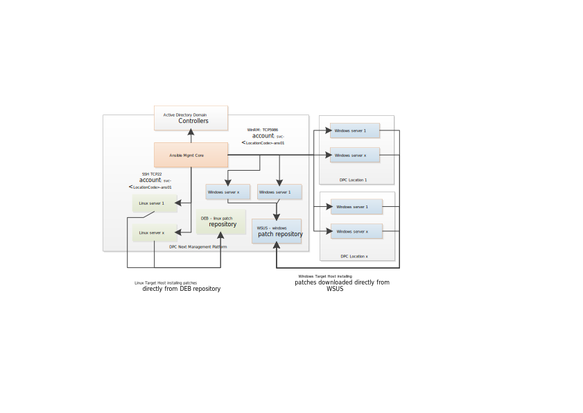

# Patching LLD

# Changelog

| Version | Date       | Description                                                                                                                                                                                                 | Author(s)          |
|---------|------------|-------------------------------------------------------------------------------------------------------------------------------------------------------------------------------------------------------------|--------------------|
| 0.1     | 2019-08-20 | Initial draft `creation`                                                                                                                                                                                    | Robert Kaminski    |
| 0.2     | 2019-09-13 | Define deb definitions of patch repositories in the element configuration table                                                                                                                             | Robert Kaminski    |
| 0.3     | 2019-09-26 | Ubuntu patching updated                                                                                                                                                                                     | Przemyslaw Bojczuk |
| 0.4     | 2019-10-11 | Repository list updated                                                                                                                                                                                     | Przemyslaw Bojczuk |
| 0.4     | 2019-12-02 | Mirroring and publishing snapshots timing info added                                                                                                                                                        | Przemyslaw Bojczuk |
| 0.5     | 2020-01-24 | Adjustments based on TOS review comments                                                                                                                                                                    | Robert Kaminski    |
| 0.6     | 2020-02-19 | Adjustments based on TOS review comments 2                                                                                                                                                                  | Robert Kaminski    |
| 0.6.1   | 2020-02-21 | Restored the proper IDs of Jira epics and stories. DEB explanation added to DEB001 info. Typos in Ubuntu repository list fixed, the list restructured. Patch selection info updated, firewall info removed. | Przemyslaw Bojczuk |
| 0.6.2   | 2021-07-01 | Adjustments based on TOS review comments 2                                                                                                                                                                  | Robert Kaminski    |
| 0.6.3   | 2022-06-06 | DHC-2715 added section about patching scope                                                                                                                                                                 | Piotr Gesikowski   |
| 0.6.4   | 2022-07-31 | CESDC-550 added bil001 - Billing Server - to the patched servers list                                                                                                                                       |                    |
| 0.7     | 2026-02-24 | VCS-15538 Added Security Requirements Coverage, removed bil001 from patched servers list as it has been removed since VCS 2.0                                                                               | Przemyslaw Pakula  |

## 1 Introduction

### 1.1 Purpose

The purpose of this document is to provide the detailed design and architectural guidance required to implement patching of Linux and Windows management servers within VCS offering according to Atos standards and portfolio services. The principal aim of this document is to translate the high-level design (HLD) into a technical low-level design (LLD).
Design is providing component architecture overview in Architecture Overview chapter that provides basic building blocks and main principles, followed by
Detailed Logical Design  and final Detailed Physical Design.
Architecture Overview provides basic building blocks and main design principles of presented design. It is covering known requirements cascaded from HLD and other LLDs.
Detailed Logical Design presents business logic, relations and fundamental design decisions.
Detailed Physical Design provides detailed configuration of components including POD type specifics.

### 1.2 Audience

This document is intended for Atos Cloud Services Engineers and Architects responsible for VMware Cloud Services (VCS) solution implementation and maintenance.

### 1.3 Scope

This LLD is intended to cover below components and domains:

1. Windows patches repository (WSUS)
2. Linux patches repository
3. Patch level reporting

### 1.4 Related Documents

This document is a subset of Atos Technology Lifecycle Management (ATLM) artefacts. All documents are stored in the VCS documentation repository.

#### Security Requirements Coverage

| Instruction Name | Short Description |
| :----------: | ------- |
| [lldADSecurityEnhancement2024.md](lldADSecurityEnhancement2024.md) | Describes AD vulnerabilities in VCS and the remediation actions for key security findings. |
| [lldDhcRoleBasedAccessControl.md](lldDhcRoleBasedAccessControl.md) | Defines RBAC roles, mappings, and access review principles for VCS components. |
| [lldBreakTheGlass.md](lldBreakTheGlass.md) | Defines emergency access workflows for outage scenarios and recovery procedures. |
| [lldHardening.md](lldHardening.md) | Defines required hardening activities before production handover, including identity, firewall, and compliance controls. |
| [lldHashicorpVault.md](lldHashicorpVault.md) | Describes secure secret-management architecture, authentication methods, and audit logging. |
| [lldVulnerabilityManagement.md](lldVulnerabilityManagement.md) | Defines Nessus-based vulnerability scanning design, scope, and operating model. |
| [lldSecurityPosture.md](lldSecurityPosture.md) | Provides a consolidated overview of VCS security controls across encryption, scanning, RBAC, logging, and patching. |
| [SecurityMeasureExceptions.md](SecurityMeasureExceptions.md) | Lists approved Nessus/Alcatraz exceptions and false positives with rationale and mitigation context. |
| [SiemensCERTExceptions.md](SiemensCERTExceptions.md) | Lists Siemens CERT exceptions/false positives with applicability and risk/mitigation notes. |
| [lldSOXDB.md](lldSOXDB.md) | Describes SOXDB integration security controls, including credential handling, encryption, and RBAC. |
| [lldRemoteConsoleAccess.md](lldRemoteConsoleAccess.md) | Defines secure remote console access controls, including RBAC and certificate handling. |

### 1.5 Requirement Levels

This document is following the principles below to categorize all requirements and design decisions.

##### Table Requirements Principles

|    Term    | Meaning                                                                                                                                                                                                                                                         |
|:----------:|-----------------------------------------------------------------------------------------------------------------------------------------------------------------------------------------------------------------------------------------------------------------|
|    MUST    | The definition is an absolute requirement of the specification.                                                                                                                                                                                                 |
|  MUST NOT  | The definition is an absolute prohibition of the specification.                                                                                                                                                                                                 |
|   SHOULD   | There may exist valid reasons in particular circumstances to ignore a particular item, but the full implications must be understood and carefully weighed before choosing a different course                                                                    |
| SHOULD NOT | There may exist valid reasons in particular circumstances when the particular behaviour is acceptable or even useful, but the full implications should be understood and the case carefully weighed before implementing any behaviour described with this label |
|    MAY     | Any design decisions that are not classified as MUST and SHOULD or covering optional feature that is not general available for VCS product                                                                                                                      |

## 2 Architecture Overview

VCS uses local patch repositories, which sync and download windows and linux patches from vendors through VCS proxy.

The repositories are dedicated to patch VCS management linux and windows servers ONLY. The solution is not intended for customer workload virtual machines.

## 2.1 Business and Solution Requirement

##### Table Initial requirements

|  ID  | Requirement description                                                                                                                                                                                                                                                                                                                                                                                                                                                             | Requirement Source | Requirement Level |
|:----:|-------------------------------------------------------------------------------------------------------------------------------------------------------------------------------------------------------------------------------------------------------------------------------------------------------------------------------------------------------------------------------------------------------------------------------------------------------------------------------------|--------------------|-------------------|
| R001 | Automated workflow to patch Windows and Linux management VMs inside VCS management cluster for operations to ensure right security level.                                                                                                                                                                                                                                                                                                                                           | DPC-18624          | MUST              |
| R002 | Windows and Linux repositories for management servers will be placed in VCS Management cluster                                                                                                                                                                                                                                                                                                                                                                                      | DPC-18624          | MUST              |
| R003 | Patch selection: VCS automation and repositories are built to provide possibility to state which patches are allowed or excluded from being available for installation on the target hosts. However either exclusion or whitelisting of patches is manual and requires an agreement with the security officers. Additionally, Linux repository provides snapshot functionality securing the installation of patches form the same set of packages during a given patching campaign. | DPC-18624          | MUST              |
| R004 | Patch reporting - reuse VCS classic Ansible based patch deployment and reporting if possible                                                                                                                                                                                                                                                                                                                                                                                        | DPC-18624          | MUST              |
| R005 | Authentication to target Linux and windows VMs will be provided by VCS Management Active Directory                                                                                                                                                                                                                                                                                                                                                                                  | DPC-18624          | MUST              |
| R006 | Traffic between all component must be encrypted                                                                                                                                                                                                                                                                                                                                                                                                                                     | DPC-18624          | MUST              |
| R007 | SDDC Manager is used to update VMware components and address VCS LCM                                                                                                                                                                                                                                                                                                                                                                                                                |                    | MUST              |

## 3 Detailed Logical Design

### 3.1 Management Topology

### 3.1.1 Ansible Host

##### Table Ansible host

| Decision ID | Design Decision                                                       | Design Justification                                        | Design Implication |
|:-----------:|-----------------------------------------------------------------------|-------------------------------------------------------------|--------------------|
|   DD-001    | Ansible Mgmt Core server will be located in VCS Management Cluster    | Ansible orchestrate patching activities                     |                    |
|   DD-002    | Ansible Mgmt Core server will run on Ubuntu                           | Ubuntu has been chosen as default linux distribution on VCS |                    |
|   DD-003    | Ansible Mgmt Core Server will be connected to standard VCS monitoring | VCS standard                                                |                    |

### 3.1.2 Target Hosts - Management Virtual Machines

##### Table Target hosts

| Decision ID | Design Decision                                                                                    | Design Justification                                              | Design Implication |
|:-----------:|----------------------------------------------------------------------------------------------------|-------------------------------------------------------------------|--------------------|
|   DD-004    | Windows target host will use WinRM over HTTPS                                                      | Communication with target hosts must be encrypted.                |                    |
|   DD-005    | Authentication to target Linux and windows VMs will be provided by VCS Management Active Directory | By design all management servers are joined to VCS management  AD |                    |
|   DD-006    | Root CA is offline by design and will be excluded from standard patch maintenances                 | VCS standard                                                      |                    |

### 3.1.3 Patch repositories

##### Table Patch repositories

| Decision ID | Design Decision                                                                                                                                                                                                                                 | Design Justification                                                                                                                                                                                                                                                                                                   | Design Implication                                                                                                                                                                                       |
|:-----------:|-------------------------------------------------------------------------------------------------------------------------------------------------------------------------------------------------------------------------------------------------|------------------------------------------------------------------------------------------------------------------------------------------------------------------------------------------------------------------------------------------------------------------------------------------------------------------------|----------------------------------------------------------------------------------------------------------------------------------------------------------------------------------------------------------|
|   DD-007    | Patch repositories will be located internally in VCS                                                                                                                                                                                            | Patch repositories should be located possibly closest to target VMs                                                                                                                                                                                                                                                    | Patch repositories are NOT to be used by Customer workload VMs at any time                                                                                                                               |
|   DD-008    | Windows Update Service (WSUS) will be used as patch repository for Windows VMs.  WSUS will use embedded database                                                                                                                                | Easy to install and use as part of Windows standard feature. Integrated with MGT Active Directory, configured by AD group policy.                                                                                                                                                                                      |                                                                                                                                                                                                          |
|   DD-009    | Integration architect decides in early stage (prereqVM creation) either Auto Patch Approval is set to enabled during VCS WSUS deployment or disabled.                                                                                           | Functionality requested via Cloud Operation team to meet various requirements of Customer Accounts                                                                                                                                                                                                                     | Disabled auto approval increases control over patch repository, however slightly increases maintenance overhead at the same time, as all patches have to be approved manually in Windows Update Services |
|   DD-010    | Apache2 service running on Ubuntu OS serves Linux deb package repository with patches included. Repo synchronization is handled via aptly app.                                                                                                  | Key benefits of using Apache2 with aptly service are:  - lack of authorization mechanism to access the vendors repository - faster initial repository sync  - ability to create own (customized) repository sets based on symbolic links - ability to create repositories with customized deb packages |                                                                                                                                                                                                          |
|   DD-035    | To stick to Atos security policy, linux patches installation must allow:   - to install all patches available in the repository  - to install the list of specified packages  - to keep a set of patches in the "frozen" repository |                                                                                                                                                                                                                                                                                                                        |                                                                                                                                                                                                          |

### 3.1.4 SDDC Manager

##### Table Patch repositories

| Decision ID | Design Decision                                                                             | Design Justification                     | Design Implication |
|:-----------:|---------------------------------------------------------------------------------------------|------------------------------------------|--------------------|
|   DD-011    | SDDC Manager is an integral part of vCF and will be used to patch VMware vSphere components | vCF is introduced in VCS as the LCM tool |                    |

### 3.2 Security

#### 3.2.1 Role Based Access control

Atos based solutions must guarantee proper access management. Following design decisions are made in that area.

##### Table RBAC

| Decision ID | Design Decision                                                  | Design Justification                       | Design Implication |
|:-----------:|------------------------------------------------------------------|--------------------------------------------|--------------------|
|   DD-012    | Access control to management target hosts will be based on RBAC. | VCS standard for using AD service account. |                    |

#### 3.2.2 Firewall

That section covers all firewall related decisions influencing content of that LLD.

##### Table Firewall rules

| Decision ID | Design Decision                                                                                                                         | Design Justification                                                                                                                                 | Design Implication |
|:-----------:|-----------------------------------------------------------------------------------------------------------------------------------------|------------------------------------------------------------------------------------------------------------------------------------------------------|--------------------|
|   DD-013    | Use proxy to download windows and Linux patches to VCS repositories                                                                     | Required to download patches from vendor                                                                                                             |                    |
|   DD-014    | Windows management servers must have flows open to WSUS server. Linux management server must have flows opened to DEB repository server | Management servers must have ability to reach respective VCS patch repository. See detailed flows described in SDN LLD in microsegmentation section. |                    |

#### 3.2.3 Certificates

VCS is introducing dedicated Certificate Authority (CA). Below design decisions are taken in terms of certificate management for this LLD.

##### Table Certificates

| Decision ID | Design Decision                                                                                                 | Design Justification | Design Implication |
|:-----------:|-----------------------------------------------------------------------------------------------------------------|----------------------|--------------------|
|   DD-015    | Windows target hosts will use VCS certificate authority to encrypt WinRM connectivity.                          | DPC-18624            |                    |
|   DD-016    | Certificate auto-enrolment will be enabled on VCS certificate authority for the specific WinRM related template | DPC-18624            |                    |

#### 3.2.4 Playbook execution

Patching and reporting related tasks will be run via playbooks located on the Ansible Mgmt Core server.
Refer to Work Instructions to understand patching concept of windows and linux management servers in VCS.
*windowsPatching.md*
*linuxPatching.md*

### 3.3 Availability and Scalability

#### 3.3.1 Availability Design

| Decision ID | Design Decision                                                                                           | Design Justification                                                | Design Implication |
|:-----------:|-----------------------------------------------------------------------------------------------------------|---------------------------------------------------------------------|--------------------|
|   DD-017    | Linux Software Repository is integrated with vCenter server and relies on it's availability design (HA)   | High availability                                                   |                    |
|   DD-018    | Windows Update Service is integrated with vCenter server and relies on it's availability design (HA)      | High availability                                                   |                    |
|   DD-019    | SDDC Manager relies on vCenter Server HA configuration and additionally is protected by DR (if available) | High availability plus DR protection is sufficient for this service |                    |

#### 3.3.2 Scalability Design

| Decision ID | Design Decision                                               | Design Justification          | Design Implication |
|:-----------:|---------------------------------------------------------------|-------------------------------|--------------------|
|   DD-020    | Space for Linux and windows patch repositories fully scalable | Easily extendable via vCenter |                    |

### 3.4 Recoverability

Below chapter provides detailed design choices to protect against data lost and backup functionality and against Data Center failure.

#### 3.4.1 Components failure

| Decision ID | Design Decision                                          | Design Justification | Design Implication |
|:-----------:|----------------------------------------------------------|----------------------|--------------------|
|   DD-021    | Ansible Mgmt Core server must be part of VCS backup      | VCS standard         |                    |
|   DD-022    | Software repositories servers must be part of VCS backup | VCS standard         |                    |

#### 3.4.2 Datacenter failure

| Decision ID | Design Decision                                                                                         | Design Justification | Design Implication |
|:-----------:|---------------------------------------------------------------------------------------------------------|----------------------|--------------------|
|   DD-023    | Ansible Mgmt Core servers and Software repositories to be placed in VCS Cluster and part of DR solution | VCS standard DR      |                    |

### 3.5 Multi-tenancy

| Decision ID | Design Decision                                                  | Design Justification | Design Implication |
|:-----------:|------------------------------------------------------------------|----------------------|--------------------|
|   DD-024    | Patching of the management servers is not providing multitenancy |                      |                    |

### 3.6 External Connection/System Requirements

Below table provides domain/components requirements for other components and domains to be taken into corresponding design decisions with requirement level in line with Chapter 1.3

| Decision ID | Requirement criticality | Requirement description                                                | Requirement Justification         |
|:-----------:|-------------------------|------------------------------------------------------------------------|-----------------------------------|
|   DD-025    | MUST                    | Certificate Authority service must be available                        | Required to encrypt WinRM traffic |
|   DD-026    | MUST                    | RBAC based on Active Directory must be available                       | Required for playbook execution   |
|   DD-027    | MUST                    | High Availability (vCenter, MGT Cluster) and Host Monitoring turned on | VM HA                             |

### 3.7 Patch reporting

| Decision ID | Design Decision                                                                                                                                                                                                                                                                                                                                                                                                                                                                                                                                                                                                                                                                                                                                                                                                                                                                                                                                                                                                                                 | Design Justification                                                                                                                                                                                                                             | Design Implication                                          |
|:-----------:|-------------------------------------------------------------------------------------------------------------------------------------------------------------------------------------------------------------------------------------------------------------------------------------------------------------------------------------------------------------------------------------------------------------------------------------------------------------------------------------------------------------------------------------------------------------------------------------------------------------------------------------------------------------------------------------------------------------------------------------------------------------------------------------------------------------------------------------------------------------------------------------------------------------------------------------------------------------------------------------------------------------------------------------------------|--------------------------------------------------------------------------------------------------------------------------------------------------------------------------------------------------------------------------------------------------|-------------------------------------------------------------|
|   DD-028    | **Windows "Post-Patching summary report"** shall contain columns:  "host name", "OS name", "number of available patches", "nb of successfully installed patches", "nb of failed patches", "status"  Report additional requirements:  - Report must be stored for the future reference (audits) in an easily readable format (HTML) with unique names on WSUS server in the dedicated folder (i.e d:\AnsiblePatchReport\post_patching), available to CO users only (direct access required only, no shares, NFS etc)  - sent via mail (via VCS SMTP server)  - report name must be unique, preferably with maintenance group name and run timestamp                                                                                                                                                                                                                                                                                                                                                                      | Post patching report is mandatory to allow CO fast patching validation to repeat patching on the failed servers  Report must be stored for the future reference (audits) in easy readable format (HTML) with unique names under.             | HTML format will be stored on VCS and sent to CO via mails. |
|   DD-029    | **Linux "Post-Patching summary report"** shall contain columns: "host name", "number of available DEBs", "nb of successfully installed DEBs", "nb of failed DEBs", "installation date"  Report additional requirements:  - Report must be stored for the future reference (audits) in easy readable format (HTML) with unique names on DEB server in the dedicated folder (i.e /data/ansiblepatchreport/post_patching), available to CO users only (direct access required only, no shares, NFS etc)  - sent via mail (via VCS SMTP server)  - report name must be unique, preferably with the target group name or hostname and run timestamp                                                                                                                                                                                                                                                                                                                                                                          | Post patching report is mandatory to allow CO fast patching validation to repeat patching on the failed servers  Report must be stored for the future reference (audits) in an easily readable format (HTML) with unique names.              | HTML format will be stored on VCS and sent to CO via mails. |
|   DD-030    | **On Demand Patch summary report** for **Windows** Management Servers contain columns:  "Host name", "OS name", "Available patches", "Installed patches", "Complete number of patches" (complete number of patches is a sum of available and installed patches), "Host status" Report must meet the following requirements:  -  stored on WSUS server in the dedicated folder (i.e d:\AnsiblePatchReport\summary_reports), available to CO users only (direct access required only, no shares, NFS etc) - is sent via mail (via VCS SMTP server)  - report name must be unique, preferably with phrase "On_Demand_Patch_Summary_Report" and run timestamp - HTML format  -  report contains a single target host or group of hosts (based on Ansible group definitions, i.e windows) - report is limited to a single Customer - report is a single file                                                                                                                                                     | VCS must be ready to scan the target host(s) on demand with exact installed and missing patch list against VCS repositories.  Report must be stored for the future reference (audits) in an easily readable format (HTML) with unique names. | HTML format will be stored on VCS and sent to CO via mails. |
|   DD-031    | **On Demand Patch summary report** for **Linux** Management Servers contain columns: "host name", "number of available DEBs", "nb of successfully installed DEBs", "nb of failed DEBs", "installation date" .  Report must meet the following requirements:   - is stored on server in the dedicated directory (i.e. DEB repository server /data/ansiblepatchreport/summary_reports/), available to CO users only (direct access required only, no shares, NFS etc) - is sent via mail (via VCS SMTP server) - HTML format - report contains a single target host or group of hosts (based on ansible group definitions, i.e linux) - report is limited to single Customer                                                                                                                                                                                                                                                                                                                                      | Address it by scheduling playbook execution from Ansible Mgmt Core server.                                                                                                                                                                       |                                                             |
|   DD-032    | **On demand summary report** described in DD-030 and DD-031, must be scheduled monthly.                                                                                                                                                                                                                                                                                                                                                                                                                                                                                                                                                                                                                                                                                                                                                                                                                                                                                                                                                         | VCS needs a summary report that can be shared with Customer showing updates compliance against the **baseline** in the patch repository.                                                                                                         |                                                             |
|   DD-033    | **On Demand Patch detailed report**. Report must meet the fallowing requirements:  - is stored on server in the dedicated folder (i.e for windows WSUS server d:\AnsiblePatchReport\on_demand\, for Linux DEB server /data/ansiblepatchreport/on_demand), available to CO users only (direct access required only, no shares, NFS etc)  - is sent via mail (via VCS SMTP server)  - report name must be unique  - HTML format  - on demand patch report is very detailed, therefore single report file must include information per single server - report can be executed against a single target host or group of host (based on ansible group definitions).   - report is limited to single Customer  - For linux, report must contain list of all missing DEBs, list of installed DEBs, Ubuntu Security Notices (USNs) addressed in available DEBs. Installed DEBs must include installation date  - For windows report contain list of all missing and installed patches with exact installation date. | VCS needs a summary report that can be shared with Customer showing updates compliance against the **baseline** in the patch repository.                                                                                                         |                                                             |
|   DD-034    | **On demand patch detailed report** described in DD-033, must be scheduled monthly.                                                                                                                                                                                                                                                                                                                                                                                                                                                                                                                                                                                                                                                                                                                                                                                                                                                                                                                                                             | Address it by scheduling playbook execution from Ansible Mgmt Core server.                                                                                                                                                                       |                                                             |

## 4  Detailed Physical Design

Detailed physical design is covering fixed configuration details that are fixed for solution. Any values that are customer dependent are presented in < angle brackets red italic > form. All configuration details are presented in table form. All the names are lowercased.

### 4.1 Management Plan

#### 4.1.1  Virtual Machine Configuration table

VMs that are part of implementation and they roles are listed in following table.

##### Table VMs list

| VM Name | VM role                   | Description                                                                                                                                                                                          |
|:-------:|---------------------------|------------------------------------------------------------------------------------------------------------------------------------------------------------------------------------------------------|
| ANS001  | Ansible Mgmt Core server  | Ansible server used for patching orchestration                                                                                                                                                       |
| ANS002  | Ansible PrereqVm server   | Ansible server used for initial creation and configuration of all Patching Components                                                                                                                |
| WUS001  | Windows Update Service    | Repository for Windows VMs                                                                                                                                                                           |
| DEB001  | Linux Software Repository | Repository for Ubuntu VMs. Ubuntu is build of **deb** packages and they are the source of software for Ubuntu. DEB001 provides deb packages, which are source of main packages, patches and updates. |

Configuration details for VMs are represented below.

###### Table Configuration details of VM ANS001

|      Parameter      | Value                    | Description              |
|:-------------------:|--------------------------|--------------------------|
| Number of Instances | 1                        | Ansible Mgmt Core Server |
|  Operating System   | Ubuntu 18.04 LTS         | VCS Ubuntu template      |
|      vCPU MHz       | 2                        |                          |
|      Memory GB      | 4                        |                          |
|       Storage       | Disk1: 60GB (OS)         |                          |
|       Storage       | Disk2: 100GB             |                          |
|  Network Placement  | AVN Local Region Network |                          |

###### Table Configuration details of VM DEB001

|      Parameter      | Value                    | Description                                            |
|:-------------------:|--------------------------|--------------------------------------------------------|
| Number of Instances | 1                        | Linux Software Repository                              |
|  Operating System   | Ubuntu 18.04 LTS         | VCS Ubuntu template                                    |
|      vCPU MHz       | 2                        |                                                        |
|      Memory GB      | 4                        |                                                        |
|       Storage       | Disk1: 60GB (OS)         |                                                        |
|       Storage       | Disk2: 350 (data)        | no partitions. LVM setup directly on the block device, |
|  Network Placement  | AVN Local Region Network |                                                        |

###### Table Configuration details of VM WUS001

|      Parameter      | Value                    | Description               |
|:-------------------:|--------------------------|---------------------------|
| Number of Instances | 1                        | Windows Update Service    |
|  Operating System   | Windows 2016             | VCS global w2k16 template |
|      vCPU MHz       | 2                        |                           |
|      Memory GB      | 4                        |                           |
|       Storage       | Disk1: 60GB (OS)         |                           |
|       Storage       | Disk2: 350 (data)        |                           |
|  Network Placement  | AVN Local Region Network |                           |

#### 4.1.2  Element Configuration Table

|             Component             | Value                                                                                                                                                                                                                                                                                                                                                                                                                                                                                                                                                                                                                                                                                                                                                                                                                                                                                                                                                                                                                                                                                                                                                       | Description (optional)                                                                                                                                                                                                                                                                                                                                                                                       |
|:---------------------------------:|-------------------------------------------------------------------------------------------------------------------------------------------------------------------------------------------------------------------------------------------------------------------------------------------------------------------------------------------------------------------------------------------------------------------------------------------------------------------------------------------------------------------------------------------------------------------------------------------------------------------------------------------------------------------------------------------------------------------------------------------------------------------------------------------------------------------------------------------------------------------------------------------------------------------------------------------------------------------------------------------------------------------------------------------------------------------------------------------------------------------------------------------------------------|--------------------------------------------------------------------------------------------------------------------------------------------------------------------------------------------------------------------------------------------------------------------------------------------------------------------------------------------------------------------------------------------------------------|
|        Linux Target Hosts         | Enable *sudo* setup for Ansible service account. Create a file /etc/sudoers.d/`svc-<LocationCode>-ans01` with content:  `svc-<LocationCode>-ans01 ALL=(ALL) NOPASSWD: ALL`                                                                                                                                                                                                                                                                                                                                                                                                                                                                                                                                                                                                                                                                                                                                                                                                                                                                                                                                                                                  | `svc-<LocationCode>-ans01` service account used for authentication to target hosts, during ansible playbook execution                                                                                                                                                                                                                                                                                        |
|               WSUS                | Mandatory classification:  Critical updates  Definition Updates  Security Updates  Update Rollups                                                                                                                                                                                                                                                                                                                                                                                                                                                                                                                                                                                                                                                                                                                                                                                                                                                                                                                                                                                                                                                           |                                                                                                                                                                                                                                                                                                                                                                                                              |
|               WSUS                | Mandatory products:  Microsoft Windows Server 2016                                                                                                                                                                                                                                                                                                                                                                                                                                                                                                                                                                                                                                                                                                                                                                                                                                                                                                                                                                                                                                                                                                          |                                                                                                                                                                                                                                                                                                                                                                                                              |
|  Certificate Authority Template   | VA separate template for WinRM with auto enrollment enabled for domain computers and domain controllers                                                                                                                                                                                                                                                                                                                                                                                                                                                                                                                                                                                                                                                                                                                                                                                                                                                                                                                                                                                                                                                     |                                                                                                                                                                                                                                                                                                                                                                                                              |
|  Certificate Authority Template   | Certificate expiry date: 5 years                                                                                                                                                                                                                                                                                                                                                                                                                                                                                                                                                                                                                                                                                                                                                                                                                                                                                                                                                                                                                                                                                                                            |                                                                                                                                                                                                                                                                                                                                                                                                              |
|    enableWsusAutoPatchApproval    | true/false                                                                                                                                                                                                                                                                                                                                                                                                                                                                                                                                                                                                                                                                                                                                                                                                                                                                                                                                                                                                                                                                                                                                                  | Input parameter requested from integration architect while creating the PrereqVM to decide whether "Patch Auto-approval" will be enabled on WSUS server during deployment or patches will require manual approval action before being published to target hosts                                                                                                                                              |
| Linux Software Repository Mirrors | **List of mirrors**  -[ubuntu-bionic-main](http://archive.ubuntu.com/ubuntu/) bionic  -[ubuntu-bionic-multiverse](http://archive.ubuntu.com/ubuntu/) bionic  -[ubuntu-bionic-restricted](http://archive.ubuntu.com/ubuntu/) bionic  -[ubuntu-bionic-security-main](http://archive.ubuntu.com/ubuntu/) bionic-security  -[ubuntu-bionic-security-multiverse](http://archive.ubuntu.com/ubuntu/) bionic-security  -[ubuntu-bionic-security-restricted](http://archive.ubuntu.com/ubuntu/) bionic-security  -[ubuntu-bionic-security-universe](http://archive.ubuntu.com/ubuntu/) bionic-security  -[ubuntu-bionic-universe](http://archive.ubuntu.com/ubuntu/) bionic  -[ubuntu-bionic-updates-main](http://archive.ubuntu.com/ubuntu/) bionic-updates  -[ubuntu-bionic-updates-multiverse](http://archive.ubuntu.com/ubuntu/) bionic-updates  -[ubuntu-bionic-updates-restricted](http://archive.ubuntu.com/ubuntu/) bionic-updates  -[ubuntu-bionic-updates-universe](http://archive.ubuntu.com/ubuntu/) bionic-updates  -[bionic-ansible-2.8-main](http://ppa.launchpad.net/ansible/ansible-2.8/ubuntu/) bionic  | Initial mirror of packages takes 4 up to 6 hours. Initial calculation of the metadata, populating it into to the aptly configuration files, creating symbolic links to all the packages takes 4 up to 8 hours, which means it is not going to be operational on the first day of deb001 deployment. Aptly is operating in `$HOME/.aptly` location, where it stores all the files and configuration database. |

#### 4.1.3 Patching Scope

The following VCS Management VMs will be patched:

| Group Name | Hosts |
| :----------: | ------- |
| MMgroup1 | *tss002* (second Bastion Host)   *adc002* (second Active Directory Domain Controller) |
| MMgroup2 | *tss001* (first Bastion Host)   *adc001* (first Active Directory Domain Controller)   *ica001* (ICA Server / Certificate Issuer Server) |
| MMgroup3 | *wus001* (Windows Update Service server) |
| MMgroupL1 | *ans001* (Ansible Mgmt Core server) |
| MMgroupL2 | *pxy002* (Squid Proxy)   *nes001* (Nessus scanner) |
| MMgroupL3 | *pxy003* (Squid Proxy)   *hsv001* (HashiCorp Vault)   *hgw001* (HTTP Gateway)   *srs001* (SMTP relay)   *mid001* (MID server) |
| MMgroupL4 | *deb001* (Linux Software Repository / Ubuntu package repository) |

Vendor's predefinied appliances (i.e. vCenter, NSX-T, SDDC Manager or ABX) are out of the scope of patching.

### 4.2 Security

#### 4.2.1 Role Based Access Control

Refer to [VCS Role Based Access Control LLD](lldDhcRoleBasedAccessControl.md) document for detailed information.
