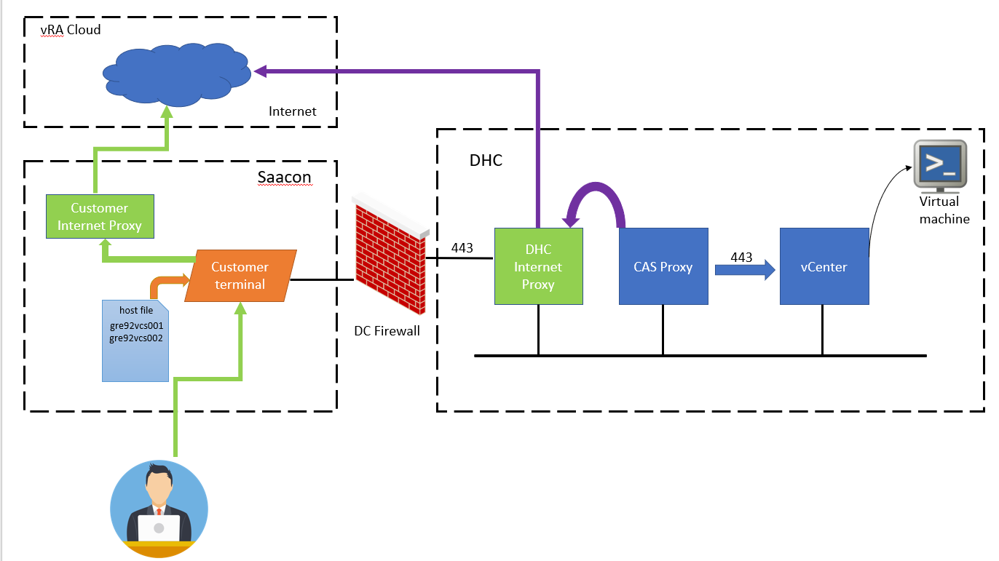
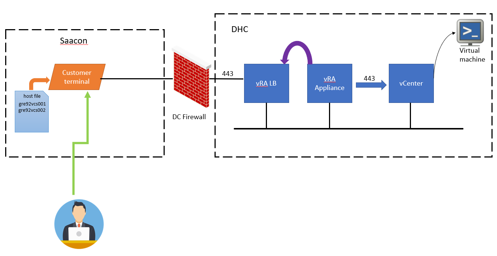

# Remote Console Access LLD

## Table of Contents

- [Remote Console Access LLD](#remote-console-access-lld)
  - [Table of Contents](#table-of-contents)
- [Changelog](#changelog)
- [Introduction](#introduction)
  - [Purpose](#purpose)
  - [Audience](#audience)
  - [Scope](#scope)
  - [Related Documents](#related-documents)
    - [Security Requirements Coverage](#security-requirements-coverage)
  - [Requirement Level](#requirement-level)
  - [Solution Requirements](#solution-requirements)
  - [Design Decisions](#design-decisions)
- [vRA Cloud SaaS](#vra-cloud-saas)
  - [Overview](#overview)
  - [Port Requirements](#port-requirements)
  - [Logical Design](#logical-design)
- [vRA On-prem](#vra-on-prem)
  - [Overview](#overview-1)
  - [Port Requirements](#port-requirements-1)
  - [Logical Design](#logical-design-1)
- [RBAC](#rbac)
  - [Policy Type](#policy-type)
  - [Policy Name](#policy-name)
  - [Scope](#scope-1)
  - [Organization](#organization)
  - [Project](#project)
  - [Enforcement Type](#enforcement-type)
  - [Role](#role)
  - [Actions](#actions)
- [Security](#security)
  - [Security Findings](#security-findings)
  - [Certificate Handling](#certificate-handling)
  - [Risk And Security Impact](#risk-and-security-impact)
  - [Limitations](#limitations)
- [Enabling Remote Console Access](#enabling-remote-console-access)
  - [vRA Cloud (SaaS)](#vra-cloud-saas-1)
  - [vRA On-prem](#vra-on-prem-1)

# Changelog

| Date | TOS | Issue | Author | Description |
| --- | --- | --- | --- | --- |
| 21.11.2022 | VCS 1.7 | | Vishnu Panchal | Draft version |
| 02.12.2022 | VCS 1.7 | DHC-4525 | Vishnu Panchal | First release version |
| 14.03.2023 | VCS 1.7 | DHC-6571 | Mohit Bilakhia | Second release version (vmrc) |
| 24.02.2026 | VCS 2.2 | VCS-15538 | Przemyslaw Pakula | Added Security Requirements Coverage |

# Introduction

## Purpose

The purpose of this document is to provide detailed design and guidelines required to implement remote console access to customer VMs from vRA Cloud and vRA on prem.

## Audience

This document is intended for Atos Cloud Services Engineers and Architects responsible for VMware Cloud Services (VCS) solution implementation and maintenance.

## Scope

This document covers detailed design and requirements for remote console access day 2 action in VCS.

## Related Documents

| Document Name | Link                                                                         |
| ------------- | ---------------------------------------------------------------------------- |
| VCS HLD       | [VMware Cloud Services: High Level Design](hldDigitalHybridCloud.md)         |
| VCS SDN LLD   | [Software Defined Networks: Low Level Design](lldSoftwareDefinedNetworks.md) |
| VCS CAS LLD   | [Cloud Automation Services: Low Level Design](lldCloudAutomationServices.md) |

### Security Requirements Coverage

| Instruction Name | Short Description |
| :----------: | ------- |
| [lldADSecurityEnhancement2024.md](lldADSecurityEnhancement2024.md) | Describes AD vulnerabilities in VCS and the remediation actions for key security findings. |
| [lldDhcRoleBasedAccessControl.md](lldDhcRoleBasedAccessControl.md) | Defines RBAC roles, mappings, and access review principles for VCS components. |
| [lldBreakTheGlass.md](lldBreakTheGlass.md) | Defines emergency access workflows for outage scenarios and recovery procedures. |
| [lldHardening.md](lldHardening.md) | Defines required hardening activities before production handover, including identity, firewall, and compliance controls. |
| [lldHashicorpVault.md](lldHashicorpVault.md) | Describes secure secret-management architecture, authentication methods, and audit logging. |
| [lldVulnerabilityManagement.md](lldVulnerabilityManagement.md) | Defines Nessus-based vulnerability scanning design, scope, and operating model. |
| [lldSecurityPosture.md](lldSecurityPosture.md) | Provides a consolidated overview of VCS security controls across encryption, scanning, RBAC, logging, and patching. |
| [SecurityMeasureExceptions.md](SecurityMeasureExceptions.md) | Lists approved Nessus/Alcatraz exceptions and false positives with rationale and mitigation context. |
| [SiemensCERTExceptions.md](SiemensCERTExceptions.md) | Lists Siemens CERT exceptions/false positives with applicability and risk/mitigation notes. |
| [lldSOXDB.md](lldSOXDB.md) | Describes SOXDB integration security controls, including credential handling, encryption, and RBAC. |
| [lldRemoteConsoleAccess.md](lldRemoteConsoleAccess.md) | Defines secure remote console access controls, including RBAC and certificate handling. |

## Requirement Level

This document is following the principles below in order to categorize all the requirements and the design decisions.

| **Term**   | **Meaning**                                                                                                                                                              |
| ---------- | ------------------------------------------------------------------------------------------------------------------------------------------------------------------------ |
| MUST       | The definition is an absolute requirement of the specification.                                                                                                          |
| MUST NOT   | The definition is an absolute prohibition of the specification.                                                                                                          |
| SHOULD     | There may exist valid reasons to ignore a particular item. The full implications must be understood before choosing a different course.                                  |
| SHOULD NOT | There may exist valid reasons when the particular behaviour is acceptable/useful. The full implications should be understood before implementing any behaviour described |
| MAY        | Any design decisions that are not classified as MUST and SHOULD or covering optional feature that is not general available for VCS product                               |

## Solution Requirements

| **ID** | **Requirement description**                                        | **Source** | **Level** |
| ------ | ------------------------------------------------------------------ | ---------- | --------- |
| R001   | Customer able to access their VM from vRA remote console           | FEATURE    | MUST      |
| R002   | A day2 action available in vRA for launching remote console access | FEATURE    | MUST      |
| R003   | Automation for enabling day2 policy for remote console             | FEATURE    | MUST      |
| R003   | Connection to VM and VCS management components are secured         | FEATURE    | MUST      |
| R003   | Risks and security impact if any, analysed and documented.         | FEATURE    | MUST      |

## Design Decisions

| **ID** | **Design Decision**                                                           | **Design Justification**                                                   |
| ------ | ----------------------------------------------------------------------------- | -------------------------------------------------------------------------- |
| D001   | Remote Console policy definition will be enabled at Organization/tenant level | Single policy definition is used for enabling remote console               |
| D002   | Policy definition enabled to "member" roles                                   | Any vRA user of the tenant will have remote console day 2 action available |
| D003   | Policy enforcement will be "soft"                                             | To avoid any conflict with existing and any new policy definitions         |

# vRA Cloud SaaS

## Overview

User will login to a terminal server (customer TS) in saacon via admingate. From terminal server, user will access VMWare vRA cloud portal, it requires connectivity to internet using an internet proxy. Host file entries of only vCenter server should be added in the customer terminal for name resolution of vCenter server.

When user invokes "Connect to Remote Console" day 2 action on a deployment. A new browser window or tab will be launched. CAS proxy detects new requests from vRA cloud and it initiates a console session for target VM through vCenter connection over proxy configuration enabled on vCenter.
An TCP SSL session from user browser to vCenter host on port 443 is initiated along with remote console requests via CAS proxy.
User will accept the vCenter certificates if prompted, close certificate acceptance page, refresh the remote console page, then Remote console session will be presented to user browser window.

## Port Requirements

Below communication flow needs to open to enable remote console access.

| Source      | Destination      | Port | Protocol |
| ----------- | ---------------- | ---- | -------- |
| Customer TS | vRA Cloud (SaaS) | 443  | TCP      |
| Customer TS | vCenter          | 443  | TCP      |

## Logical Design

Below is logical design depicting connectivity and components for remote console access.

# vRA On-prem

## Overview

User connects to admingate and will login to a terminal server (customer TS) in saacon. From saacon terminal, user can initiate connection to vRA by opening the vra url. After login to vRA, navigate to deployment. Use "Connect to Remote Console" day 2 action to launch remote console for desired VM.

vRA will connect to vCenter server over proxy configuration enabled on vCenter for accessing remote console session. SSL communication from customer terminal server to vCenter server will happen on port 443 which will be used for accepting vCenter certificates. After accepting the certificate (if prompted), remote console session for VM will be launched and presented in the browser window.
Host file entries of only vCenter server should be added in the customer terminal for name resolution of vCenter server.

## Port Requirements

Below communication flow needs to open to enable remote console access.

| Source      | Destination    | Port | Protocol |
| ----------- | -------------- | ---- | -------- |
| Customer TS | vRA On-Prem LB | 443  | TCP      |
| Customer TS | vCenter        | 443  | TCP      |

## Logical Design

Below is logical design depicting connectivity and components for remote console access.

# RBAC

A new day 2 action policy definition will be created to enable the remote console action for users.

## Policy Type

A Day 2 action policy definition type will be used.

## Policy Name

Policy name will be auto generated which should include tenant name and role in the name.

## Scope

Scope determines if the policy is applied to one, multiple, or all projects in this organization.

## Organization

As per feature requirement day2 policy definition will be applied at organization/multiple projects level.

## Project

Individual project level policy assignment will be not be done. Policy definition will be applied at organization level.

## Enforcement Type

Enforcement type used will be "soft" to avoid conflict with any other day 2 policy definitions.

## Role

Remote console day 2 policy definition will be applied for "member" roles. This will enable the remote console policy for all vRA project members.

## Actions

Below action will be used in days 2 action policy definition.

Cloud.vSphere.Machine.Remote.Console

This policy definition will not contain any additional day2 actions as it may conflict with customer requirements.

# Security

## Security Findings

Users will access the vRA Portal using their Own TSS where they will be only allowed to have session using Port 443 towards vRA to access the Service Broker Portal. However, customer end users wont have any access or possibility to reach any VCS Management Stack due to strict and distributed firewall rules implemented in VCS & DC Design.

## Certificate Handling

VCS uses VCS Internal CA certificates. VCF within VCS uses vCenter Internal CA Certificates for ESXi hosts. For enabling a SSL session to vCenter server from customer terminal server, vCenter Internal CA certificates and VCS RCA/ICS Certificates should be installed on customer TS and Browser.

## Risk And Security Impact

SSL connection to vCenter server will happen over trusted network so risk of exposing vCenter to unsecured internet is eliminated.

## Limitations

Remote console action will only be available within intranet/trusted network from where there's SSL connection towards vCenter server and host name can be resolved.
User has to use a terminal server within trusted network(Saacon/ workload domain) to reach to vCenter server.

# Enabling Remote Console Access

## vRA Cloud (SaaS)

Use manage phase playbook "enableRemoteConsoleVraSaas.yml to enable day 2 action for the target VCS /tenant.

## vRA On-prem

Use manage phase playbook "enableRemoteConsoleVraOnPrem.yml" to enable day 2 action for the target VCS /tenant.
