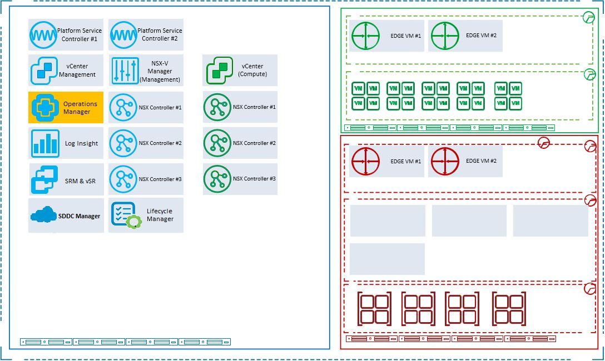
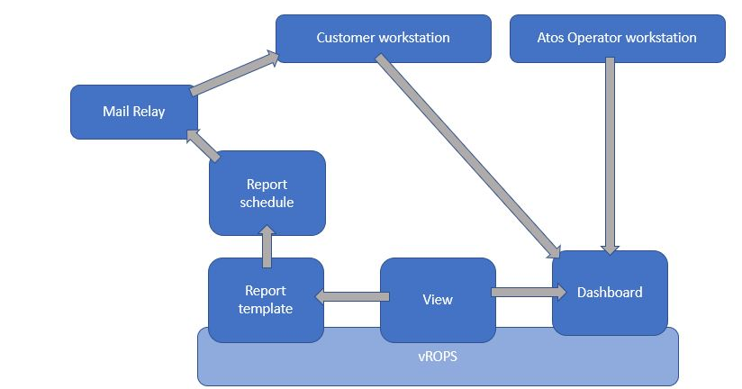

# Reporting LLD

# 1 Introduction

## 1.1 Author

| Author name | Author email                       | Date   |
| :---------: | :--------------------------------: | :----: |
| Krzysztof Hermanowski |  `krzysztof.hermanowski@atos.net` | 04.05.2020 |

### 1.1.2 Changelog

| Author name | Author email | Date | Comments |
| :---------: |  :---------: |:----:|:--------:|
| Krzysztof Hermanowski |  `krzysztof.hermanowski@atos.net` | 04.05.2020 | initial draft of document |
| Marcin Kujawski |  `marcin.kujawski@atos.net` | 28.10.2021 | update information about vROps and Alcatraz reports |
| Alpesh Kumbhare |  `alpesh.kumbhare@atos.net` | 14.12.2021 | Added Capacity Managment report section |
| Michał Sobieraj |  `michal.sobieraj@atos.net` | 14.11.2024 | Added Siemens Oval report note |
| Rachel Beulah |  `rachel.packiaraj@atos.net` | 06.03.2025 | Added Dashboard list and updated RBAC details |
| Rachel Beulah |  `rachel.packiaraj@atos.net` | 11.04.2025 | Dashboard guide with description, scopes/roles, and screenshots for single and multi-tenant |

## 1.2 Purpose

The purpose of this document is to provide detailed design and architectural guidance required to implement validated model of a VCS vROps & TOP (turn-over to production) reporting
in accordance with Atos standards and portfolio services. The principal aim of this document is to translate the high-level design (HLD) into a technical low-level design (LLD).
Design provides component architecture overview in the "Architecture Overview" chapter that provides basic building blocks and main principles, followed by
"Detailed Logical Design" and finally "Detailed Physical Design".
"Architecture Overview" provides basic building blocks and main design principles of presented design. It covers known requirements cascaded from HLD and other LLDs.
"Detailed Logical Design" presents business logic, relations and fundamental design decisions.
"Detailed Physical Design" provides detailed configuration of components including POD type specifics.

## 1.3 Audience

This document is intended for Atos Cloud Services Engineers and Architects responsible for VMware Cloud Services (VCS) solution implementation and maintenance.

## 1.4 Scope

This LLD is intended to cover below components and domains:

1. vRealize Operations views
2. vRealize Operations dashboards
3. vRealize Operations reports
4. TOP Security report
5. TOP Compliance report
6. TOP Patching report

This LLD is not covering:

1. vROps deployment and configuration

## 1.5 Related Documents

This document is a subset of Atos Technology Lifecycle Management (ATLM) artefacts. All documents are stored in the VCS documentation repository.

| File name | Document Name              |
| :-------------: | -------------------------- |
| hldDigitalHybridCloud.md | [VMware Cloud Services: High Level Design](hldDigitalHybridCloud.md) |

Table 7 ATLM Related Documents

## 1.6 Requirement Levels

This document follows the principles below to categories all requirements and design decisions.

|    Term    | Meaning                                                                                     |
| :----------------------: | ----------------------------------------------------------------------------- |
|    MUST    | The definition is an absolute requirement of the specification.                             |
|  MUST NOT  | The definition is an absolute prohibition of the specification                              |
|   SHOULD   | There may exist valid reasons in particular circumstances to ignore a particular item, but the full implications must be understood and carefully weighed before choosing a different course  |
| SHOULD NOT | There may exist valid reasons in particular circumstances when the particular behaviour is acceptable or even useful, but the full implications should be understood and the case carefully weighed before implementing any behaviour described with this label |
|    MAY     | Any design decisions that are not classified as MUST and SHOULD or covering optional feature that is not general available for VCS product                     |

Table 7 Requirement Levels

# 2 Architecture Overview

The diagram below highlights VCS areas covered in this LLD. This document will cover the logging and monitoring design for VCS.



### Figure 1. VCS Architecture Overview

## 2.1 Business and Solution Requirements

The table below provides known requirements mandatory to be incorporated into design decisions of VCS Logging and Monitoring described in this LLD.

|  ID   | Requirement description                                                       | Requirement Source | Requirement Level |
| :---: | ----------------------------------------------------------------------------- | :----------------: | :---------------: |
| R001  | VCS vROps reporting must provide custom dashboards                                |     HLD            |       MUST        |
| R002  | VCS vROps must allow external access for customers to dashboards |     HLD            |       MUST        |
| R003  | VCS vROps must allow sending email with reports to customers |     HLD            |       MUST        |
| R004  | VCS vROps must allow integration with external authentication sources |     HLD            |       MUST        |
| R005  | VCS vROps reporting must provide custom reports                                |     HLD            |       MUST        |
| R006  | VCS must support automation of reports required for TOP process                                |     HLD            |       MUST        |

Table 8 Initial Requirements

# 3 Detailed Logical Design

## 3.1 Reporting Architecture overview

The diagram below shows vROps reporting architecture overview.

### Figure 2. Logging and Monitoring Architecture overview



## 3.2 Reporting integration and design

This chapter provides design decisions for vROps reporting used in VCS to provide functional and integrated solution.

| Decision ID | Design Decision | Design Justification |
| :---------: | ---------------- | ---------------- |
|   rep-001    | vROps will be configured with imported reports  | Same use and feel experience as in DPC Classic |
|   rep-002    | Nessus scanner will be used to provide vulnerability scan for TOP  | Atos standard |
|   rep-003    | Alcatraz scanner will be used to provide compliance scan for TOP  | Atos standard |

Table 9 Design Decisions reporting

### 3.2.1 TOP Report automation design

All reports required for TOP process will be automated using ansible roles/playbooks. Please refer to the WorkInstruction wiReportingOverview for details. on how to use those playbooks.

| TOP Report | Role/playbook name |
| :---------: | ---------------- |
|   Nessus scan    | createNessus.yml |
|   Alcatraz scan    | generateAlcatrazReports.yml |
|   Expiring CA certificates  | createCertificateReport.yml |
|   Windows patching    | windowsPatchingPlaybook.yml |
|   Linux patching | managePatchingLinux.yml |
| License report | generateLicensesReport.yml |

Table 10 TOP reports

### 3.2.2 Design of TOP report distribution

Output format of TOP reports is HTML. Reports are stored locally on the Tooling VM or local scanning server after being generated.

| TOP Report | Report location folder | Report location VM |
| :---------: | ---------------- | ----- |
|   Nessus scan    | /opt/nessus/var/dhcReports/nessus | nes001 |
|   Alcatraz scan    | /backup/reports | ans001 |
|   Alcatraz scan    | C:\shares\vROps_Compliance |  tss002 |
|   Expiring CA certificates  | C:\Reports | ica001 |
|   Windows patching    | D:\AnsiblePatchReport\post_patching | wus001 |
|   Linux patching | /data/ansiblepatchreport/postPatchingReport | deb001 |
| License report | /opt/dhc/manage/roles/dhc-generateLicensesReport/files | ans001 |

Table 11 Report locations

## 3.3 Security

### 3.3.1 Role Based Access Control

Atos based solutions must guarantee proper access management. Following design decisions are made in that area.

| Decision ID | Design Decision | Design Justification | Design Implication |
| :---------: | ---------------- | ---------------- | ---------------- |
|   rb-001    | There will be a dedicated AD groups used for the LDAP authentication method. | To control the access to monitoring stack, AD groups will be created.|  |
|   rb-002    | Customers will have access only to vROps reporting |TOP reporting will be available for Atos parties only |  |
|   rb-003    | User group in Customer AD will be required for integration purposes | vROps requirement | Name of that group will have to be agreed between Atos and the Customer |

Table 12 Design Decisions RBAC

### 3.3.2 Firewall

This section covers all firewall related decisions influencing content of that LLD

| Decision ID | Design Decision | Design Justification |
| --- | --- | --- |
| fd-001 | NSX based firewalls will be enabled for SDDC components separation | Security requirements |
| fd-002 | Reverse proxy will be used to allow dashboard access to the customers  | Required for functionality |

Table 13 Design Decisions Firewall

### 3.3.3 Certificates

VCS deployment has its own certificate authority and certificates generated by this CA will be used to connect to CA. That includes also customer connections. VMware does not update the certificates for specific components of vRealize Operations Manager.  
Please refer to the following article for details:

<https://docs.vmware.com/en/vRealize-Operations-Manager/7.5/com.vmware.vcom.core.doc/GUID-D476DD8F-0CCA-460D-BE94-9AC3F677B1EA.html>

## 3.4 Availability and Scalability

### 3.4.1 Availability Design

vROps reporting availability design is identical to the one described in Monitoring and Logging LLD. Other components as Windows/Linux repository, Ansible VM, scanning VM are made highly available using built-in vCenter HA options.

### 3.4.2 Scalability Design

vROps reporting scalability design is identical to the one described in Monitoring and Logging LLD. Other components as Windows/Linux repository, Ansible VM, scanning VM are not planned to scale outside one single VM.

## 3.5 Recoverability

VCS backup will be used to protect the reporting stack including vROps and reporting VMs.

## 3.6 Multi-tenancy

| Decision ID | Design Decision                                | Design Justification                                                                                                             | Design Implication                                                                                                         |
| :---------: | ---------------------------------------------- | -------------------------------------------------------------------------------------------------------------------------------- | -------------------------------------------------------------------------------------------------------------------------- |
|   mt-001    | vROps reporting will be provided for multiple customers | Multitenant access to vROps is available by default when multiple authentication sources are available  |  |

Table 14 Design Decisions - Multi-tenancy

## 3.7 External Connection/System Requirements

The table below provides domain/components requirements for other components and domains to be taken into corresponding design decisions with requirement level in line with Chapter 1.5

|  Requirement ID   | Requirement criticality | Requirement description                                           | Requirement Justification    |
| :---------------: | ----------------------- | ----------------------------------------------------------------- | ---------------------------- |
| ec-001 | High | VCS must be able to connect to email server | VCS implements only SMTP relay and requires external SMTP server to provide report sending functionality |

Table 15 Design External Requirements

Every report that will be sent to customer or operations team must have the "Email report" option enabled. Afterwards recipients' email addresses and SMTP relay configuration must be specified.

SMTP relay must be also configured in vROps. It will be done automatically via Ansible role. It will configure SMTP email notification under Outbound settings in the administration blade. Instance will use "SMTP e-mail notifications" and "Standard email Plugin".
Sender account will be set to a standard "`noreply@atos.net`" and sender name will be "vROps".

# 4 Detailed Physical Design

## 4.1 Views

vRealize Operations Manager provides several types of views. Each type of view helps you to interpret metrics, properties, policies of various monitored objects including alerts, symptoms, and so on, from a different perspective. vRealize Operations Manager Views also show information that the adapters in the environment provide.
vRealize Operations Manager views can be configured to show transformation, forecast, and trend calculations.
In VCS all of the custom views will be automatically imported as a pre-created bundle using Ansible roles. These views will be used in imported dashboards and reports and also can be utilized in custom dashboards and reports created on customer demand.

| Views                  |
| -------------------------- |
|VCS Appliances |
|VCS Capacity List Weekly - Custom |
|VCS Cluster Performance |
|VCS CPU Capacity Trend Weekly - Custom |
|VCS Hosts |
|VCS Hosts performance |
|VCS MEM Capacity Trend Weekly - Custom |
|VCS VM Performance |
|VCS VMs |
|AtoS TSS vSphere: Non-compliance View for Host System |
|AtoS TSS vSphere: Non-compliance View for vCenter |

Table 16 OOTB views list

## 4.2 Reports

A report is a scheduled snapshot of views and/or dashboards. It can be created to represent objects and metrics. It can contain table of contents, cover page, and footer.

### 4.2.1 Reports scheduling

With the vRealize Operations Manager reporting functions, a report can be generated to capture details related to current or predicted resource needs. It can be downloaded/distributed in a PDF or CSV file format for future and offline needs.
In VCS all of the custom reports will be automatically imported as a pre-created bundle using Ansible roles. These reports will be scheduled to run once a week and sent out to predefined set of email recipients.

| Report                     | Schedule |
| -------------------------- | -------- |
| VCS Cluster Uptime         |  Every week on Monday at 8:00 AM |
| VCS Capacity Recommendations | Every week on Monday at 8:00 AM |
| VCS Resize Recommendations   | Every week on Monday at 8:00 AM |
| AtoS vSphere TSS Compliance Report  | Every week on Sunday at 8:00 AM |
| AtoS Inventory Report - ESXi Hosts  | Every week on Sunday at 8:00 AM |
| AtoS Inventory Report - Port Groups | Every week on Sunday at 8:00 AM |
| Custom - Cluster Network Report-daily | Every day at 8:00 AM |
| Custom - Cluster Resources Report-daily | Every day at 1:15 AM |
| SnapshotReport | Every day at 8:00 AM |
| vROPsComputeCapReport | Every week on Monday at 6:30 AM |
| Workload VMs Latency | Every day at 8:00 AM |
| Power consumption per cluster | Day 1 of every month at 8:00 AM |

Table 17 OOTB report list

### 4.2.2 Custom reports

Additional custom reports that can be delivered based on the request from customers. Here is a list of custom reports that are currently being offered.

- User password rotation report
- RVTOOLS
- Nessus reports
- Access reports
  - AD based
  - VRA based
- Scheduled reports
  - VSAN Capacity Report
  - vCenter based report every 5 minutes report (270-280 reports per day)
- Billing reports
- Zombie files reports
- Storage policies list with VMs on it (List of VMs with Storage policy assigned to them)
- Oval reports

#### 4.2.2.1 Oval Report

Additionally, to the default VCS, reporting has available Oval report for Ubuntu systems. The Oval is an security assessment language for checking the security configuration of the machines. Report files will be saved on ans001 machine in the "/backup/reports/oval" directory. The report can be sent via email using manageOvalReporting.yml playbook.

For the Oval installation process look into [instruction](https://github.com/GLB-CES-PrivateCloud/DHC-Documentation/blob/develop/workInstructions/wiConfigureOvalUbuntu.md#introduction).

## 4.3 Dashboards

vRealize Operations Manager collects performance data from monitored software and hardware resources in your enterprise and provides predictive analysis and real-time information about problems. The data and analysis are presented through alerts, in configurable dashboards, on predefined pages, and in several predefined dashboards.
In VCS all of the custom dashboards will be automatically imported as a pre-created bundle using Ansible roles. Dashboards will be then assigned to the pre-created customer groups in vROps. Different customers will only have access to the objects that are assigned to them.

The list of dashboards that has been finalized to expose to customers.

| Dashboard                        | Details                                                                                                                           | Widget                                                                                                                                                                                                                                                 | Category                 | Applicable for Customer         |
| -------------------------------- | --------------------------------------------------------------------------------------------------------------------------------- | ------------------------------------------------------------------------------------------------------------------------------------------------------------------------------------------------------------------------------------------------------- | ------------------------ | ------------------------------- |
| Cluster Capacity                 | Includes the ESXi host and resource pools as they impact cluster capacity.                                                       | Overall Analysis(Clusters by Capacity Remaining, Clusters by Time Remaining, Clusters by VM Remaining), Cluster Analysis(Clusters Capacity, ESXi Analysis, VM Analysis)                                                                        | Capacity                 | Dedicated cluster             |
| Cluster Contention               | Dashboard for vSphere cluster performance, used for both, monitoring and troubleshooting.                                       | Average Cluster Performance (%)., Clusters Performance., Select a cluster from the table all the health charts show the KPI of the selected cluster                                                                                                   | Performance              | Dedicated cluster             |
| Cluster Performance              | Combines the functionality of the Cluster Contention, Cluster Utilization, ESXi Contention, and ESXi Utilization dashboards.       | Overall Analysis(Average Cluster Performance health chart), Multi-Cloud Analysis, Per-Cluster Analysis, VM Shares, Resource Pool Analysis, ESXi Analysis, VM Analysis, Datastore Analysis                                                              | Performance              | Dedicated cluster             |
| Cluster Utilization              | Cluster Utilization dashboard with the Cluster Contention dashboard for performance management.                                 | CPU(%) and Memory (%), Clusters Utilization, select a cluster - All the utilization charts show the key utilization metrics of the selected cluster.                                                                                             | Performance              | Dedicated cluster             |
| Consumer \\ Correct it?         | VM configuration dashboards by displaying the VMs relevant information                                                            | Tools Widgets(tools not installed, tools not running), CPU Limits and Memory Widgets, Guest OS Counters Missing Widget, Old Snapshot Widget                                                                                                     | Environment health       | Dedicated cluster, shared cluster |
| Consumer \\ Optimize it?        | VM configuration dashboards by displaying the VMs relevant information                                                            | VM Reservation(CPU and Memory Reservation), Snapshot(larger snapshot), VM with no Process visibility                                                                                                                                               | Environment health       | Dedicated cluster, shared cluster |
| Consumer \\ Simplify It?        | VM configuration dashboards by displaying the VMs relevant information                                                            | Large VMs (CPU, Memory, and Disk), VMs with many virtual disks, VM with many IP addresses or NICs                                                                                                                                                    | Environment health       | Dedicated cluster, shared cluster |
| Consumer \\ Update it?          | Provide regarding outdated details- VM configuration dashboards by displaying the VMs relevant information                         | Outdated Tools Widget, Outdated VM Hardware Widget, Outdated Windows and Red Hat Widgets                                                                                                                                                       | Environment health       | Dedicated cluster, shared cluster |
| Datastore Capacity               | Focuses on storage, provides an overall picture, and highlights the datastores that need attention                               | Overall Analysis(Shared Datastores by Capacity Remaining and Shared Datastores by Time Remaining), Datastore Analysis, VM Analysis, Local Datastores                                                                                              | Capacity                 | Dedicated cluster             |
| Datastore Performance            | To view performance problems related to storage such as high latency, high outstanding IO, and low utilization.                 | Overall Analysis(VM Performance, Read Performance, and Write Performance ), Datastore Analysis, VM Analysis, Relationship()                                                                                                                     | Performance              | Dedicated cluster             |
| ESXi Capacity                    | Supports the Cluster Capacity dashboard and is also required for the non-clustered ESXi.                                          | Summary heat map provides an overall view of the ESXi Host capacity & ESXi Hosts Capacity widget lists all the ESXi hosts in your environment.                                                                                                | Capacity                 | Dedicated cluster             |
| ESXi Configuration               | To view the overall configuration of the ESXi hosts                                                                               | 1) six pie-charts - ESXi version, the ESXi build, and the BIOS must be identical across all ESXi hosts in a cluster. Keep the variations of the hardware model, NIC speed, and storage path minimal. 2) 3 charts for size dimensions of the ESXi hosts. 3) six bar-charts focus on security, availability, and capacity settings. 4) displays all the ESXi hosts in the environment | Environment configuration | Dedicated cluster             |
| ESXi Contention                  | For managing ESXi host performance                                                                                                | ESXi CPU Performance and ESXi Memory Performance, ESXi Hosts Performance, Select an ESXi host - all the health charts show the KPI of the selected cluster                                                                                           | Environment configuration | Dedicated cluster             |
| ESXi Host Availability           | Monitors ESXi host status, identifying unresponsive hosts, those in maintenance mode, and powered-off or unknown states, along with their parent clusters for quick issue resolution. | Unresponsive ESXi, ESXi on Maintenance Mode, Powered Off or Unknown Power State ESXi, Parent Cluster of selected ESXi, ESXi Hosts in the selected cluster                                                                 | Performance              | Dedicated cluster             |
| ESXi Utilization                 | ESXi Utilization dashboard with the ESXi Contention dashboard to manage performance.                                            | ESXi Hosts Utilization, Select an ESXi host - all the utilization charts display the key utilization metrics of the selected cluster.                                                                                                          | Performance              | Dedicated cluster             |
| Guest OS Performance Profiling | To know the actual performance of the environment.                                                                                 | CPU table widget, Memory list widget, Disk list widget                                                                                                                                                                                       | Environment configuration | Dedicated cluster, Shared cluster |
| Inventory Summary                | "Works together with the Capacity Summary dashboard, provides details on the remaining capacity and time."                          | Summary, Datacenters (select), eight charts in the dashboard provide details of the inventory.                                                                                                                                          | Environment configuration | Dedicated cluster             |
| Live! Cluster Performance        | Provides live information on whether the requests of the VMs are met by their underlying compute clusters.                         | Review the heat maps (Memory Contention, CPU Ready, CPU Co-Stop) for non-green colors, indicating resource imbalances or early warnings, and drill down for detailed insights and proactive actions.                                        | Performance              | Dedicated cluster             |
| Live! Cluster Utilization        | To view the clusters that are working excessively and are close to their physical limit.                                          | Heat maps, focusing on memory utilization, ballooning, and potential wastage, with a light gray indicating no utilization from hosts.                                                                                                         | Performance              | Dedicated cluster             |
| Live! Heavy Hitters              | Displays details of VMs misusing shared infrastructure and if that has caused performance problems to the other VMs.              | Heat maps-Disk IOPS, Disk Throughput, Network Throughput, and CPU Demand, with thresholds for each metric to identify excessive load, allowing drill-down into VMs for a detailed view.                                                            | Performance              | Dedicated cluster             |
| Live! vSphere VM Changes         | Provides real-time insights into VM inventory, location, and state changes, along with detailed breakdowns of each modification.   | Overview, Changes in VM Inventory, Details of VM Inventory Changes, Changes in VM Location, Details of VM Location Changes, Changes in VM State, Details of VM State Changes, About this dashboard                                               | Performance              | Dedicated Platform            |
| Network Performance              | To view performance problems related to network such as high latency, frequent retransmit, and many dropped packets.               | Distributed Switches, Select a switch from the distributed switches table - The health chart shows the dropped packet trend over time, Port Groups and ESXi Hosts in the selected switch.                                                               | Performance              | Dedicated cluster             |
| Network Top Talkers              | To monitor network demand in the IaaS                                                                                              | Displays total network workload across vSphere environments, with data center metrics, total demand trends, and top-demanding VMs ("Top Talkers") for performance insights                                                                    | Performance              | Dedicated cluster             |
| NSX Load Balancer Services Performance | Offers detailed insights into the performance of NSX Load Balancer services.                                                    | CPU Usage of the Load Balancer, Memory Usage of the Load Balancer, Session Statistics                                                                                                                                                     | Performance              | Dedicated platform            |
| NSX Logical Router Inventory     | Provides visibility into NSX logical routers, their relationships, and traffic data, helping monitor Rx/Tx data flow and associated VMs for better network management.   | NSX Logical Routers, Advanced Object Relationship (for selected Logical Router), NSX Logical Routers Rx Data, NSX Logical Routers Tx Data, VMs (for selected Logical Router)                                                                 | Landscape                | Dedicated platform            |
| NSX Logical Router Performance   | Provides real-time insights into traffic flow, packet transmission, and dropped packets for selected logical routers, along with interface statistics to optimize network performance and troubleshoot issues. | NSX Logical Routers, Rx MB per Second (for selected Logical Router), Rx Packets per Second (for selected Logical Router), Rx Packets Dropped per Second (for selected Logical Router), Tx MB per second (for selected Logical Router), Tx Packets per Second (for selected Logical Router), Tx Packets Dropped per Second (for selected Logical Router), Router Link Interface Statistics (for selected Logical Router), Up Link Interface Statistics (for selected Logical Router), Down Link Interface Statistics (for selected Logical Router) | Performance              | Dedicated platform            |
| NSX Logical Switch Inventory     | Provides insights into NSX logical switches, their relationships, inbound and outbound throughput, and associated VMs, helping monitor and manage network connectivity efficiently. | NSX Logical Switches, Advanced Object Relationship (for selected Logical Switch), NSX Logical Switches Inbound Throughput (Bytes), NSX Logical Switches Outbound Throughput (Bytes), VMs (using selected Logical Switch)                               | Landscape                | Dedicated platform            |
| NSX Logical Switch Performance   | Focuses on the performance of logical switches of the NSX environment.                                                              | List of NSX Logical Switches, Advanced Object Relationships, Performance Statistics (Inbound and Outbound Throughput)                                                                                                                     | Performance              | Dedicated platform            |
| NSX Main                         | Provides a high-level overview of NSX instances, top alerts, object relationships, and topology, helping monitor the environment and identify potential issues efficiently.      | NSX Instances, Top Alerts, Object Relationship, Environment Overview, Topology Graph                                                                                                                                        | Environment configuration | Dedicated Platform            |
| NSX Mangement cluster Inventory  | Provides insights into NSX management clusters, their relationships, summary details, and active alerts, helping ensure stability and efficient troubleshooting.               | NSX Management Clusters, Advanced Object Relationship (for selected NSX Management Cluster), Summary (for selected NSX Management Cluster), Alerts (for selected NSX Management Cluster)                                                | Environment configuration | Dedicated platform            |
| NSX Transport Node Performance   | Provides an extensive view of performance metrics related to NSX Transport Nodes.                                                    | DPDK CPU Core Average Usage, Non-DPDK CPU Core Average Usage, Memory used for Transport Node, Transport Node Interface Statistics                                                                                                      | Performance              | Dedicated platform            |
| Reclamation                      | Helps to manage various types of reclamation that can be carried out on VMs and datastore                                            | Overall Analysis(Powered-off VMs Distribution Size, Idle VMs Distribution by Memory Footprint, and Snapshots Distribution by Size), VM Analysis                                                                                           | Monitoring               | Dedicated cluster             |
| Skyline Operational Overview     | Provides a comprehensive view of the virtual infrastructure, including inventory details, cluster DRS and HA status, ESXi host configurations, and insights into VM sizes, guest OS distribution, and VMware Tools status. | Inventory, Cluster DRS Status, Cluster HA Status, Cluster HA Admission Control Enabled, ESXi Host Hardware Models, ESXi Host BIOS Versions, ESXi Host Versions, Large VMs (CPU), Large VMs (RAM), Large VMs (Disk), VM Guest OS Distribution, VM Guest Tools Version Status, VM Guest Tools Operational Status | Landscape                | Dedicated cluster*            |
| VM Availability                  | Calculate the availability of the VM(covers the Consumer layer)                                                                     | Can view VMs in the selected data center, uptime trend for a selected cluster, uptime trend & Powered ON status for selected VM                                                                                                     | Monitoring               | Dedicated cluster, shared cluster |
| VM Capacity                      | Helps you analyze the capacity of all the VMs with the ability to analyze each VM.                                                    | Overall Analysis, VM Analysis(VMs Capacity in the Selected Datacenter), Relevant Configuration                                                                                                                                        | Capacity                 | Dedicated cluster, Shared cluster |
| VM Configuration                 | To view the overall configuration of virtual machines                                                                                | 1) first section covers limits, shares, and reservations. 2) second section covers VMware Tools. 3) third section covers other key VM configurations. 4) other configuration - CPU hot add, Memory hot add, CPU hot remove, VM hardware, Guest OS (VM Tool).                                                                | Environment configuration | Dedicated cluster, Shared cluster |
| VM Contention                    | Used for both, monitoring, and troubleshooting                                                                                     | Provides insights into CPU and memory readiness, performance issues, and VM KPI breaches within data centers, highlighting potential IaaS performance problems, with color-coded thresholds and health charts for proactive monitoring | Performance              | Dedicated cluster, shared cluster |
| VM Rightsizing Details           | Provides an overview of the rightsizing recommendations for Undersized VMs and Oversized VMs. Rightsizing is defined as changing the amount of resources allocated to a VM based on the Recommended Size for a VM. | Select clusters, datacenters, or VMs to view undersized or oversized VM recommendations or search for specific VM recommendations.                                                                             | Environment configuration | Dedicated cluster, Shared cluster |
| VM Utilization                   | Uses this dashboard with the VM Contention dashboard for managing performance.                                                       | Select datacenter, it display VM Peak CPU Usage (%)., VM Peak Utilization., select a VM it show, all the health charts show the KPI of that VM                                                                                           | Performance              | Dedicated cluster, shared cluster |
| vSAN Health                      | To monitor the status of the cluster components, diagnose issues, and troubleshoot problems.                                      | Shows properties and alerts for selected vSAN cluster                                                                                                                                                                                | Monitoring               | Dedicated cluster             |
| vSAN Stretched Clusters          | Can monitor the resource consumption at the site level for Preferred Sites and Secondary Sites                                       | CPU Capacity, Cores, Memory Capacity, and Disk Capacity for the Preferred Site and the Secondary Site                                                                                                                                      | Capacity                 | Dedicated cluster             |
| vSphere Daily Check Dashboard    | Provides a comprehensive health check of the vSphere environment, monitoring alerts, VM performance metrics, resource usage, configuration issues, and recent inventory changes to ensure optimal performance and stability. | Red Alerts, Orange Alerts, Yellow Alerts, vSphere Clusters, VM CPU Contention, VM Memory Contention, VM Disk Latency, VM CPU Ready Distribution, VM Memory Contention Distribution, VM Disk Latency Distribution, # VM with CPU Limit, # VM with Memory Limit, # VM with Old Snapshots, # VM with Tools Not Running, # VM with Balloon, #VM with Zipped Memory, VM Location Changes, VM Inventory Change, VM State Change, Total CPU Usage, Total Memory Allocated, Total Disk IOPS, Total Network Throughput, About this dashboard | Monitoring               | Dedicated cluster             |
| vSphere Performance Profiling  | Displays the performance of all vSphere clusters and their shared datastores.                                                       | World + Datacenters, Summary of VM Performance SLA, CPU Performance, Memory Performance, Storage Performance, Performance of all vSphere Clusters, Performance of all Shared Datastores, Selected Cluster Performance, Selected Datastore Performance, About this dashboard                                             | Performance              | Dedicated cluster             |
| vSphere VM Inventory             | Provides an overview of VM status, inventory changes, resource allocation, and configuration details, helping track VM lifecycle and environment trends.     | Number of VMs, Powered On vs Powered Off, Changes in VM Inventory, Changes in VM Location, Changes in VM States, List of VMs by Environment, VM State Change, VM Location Changes, VM Inventory Change, Popular CPU Size, Popular Memory Size, Operating Systems, VM by Virtual Disks Count, VM in the selected environment, Virtual Disks of selected VM, Guest OS Partitions of selected VM, Network Cards of selected VM,   | Environment configuration | Dedicated cluster, Shared cluster |

Table 18 Overview of vROps Dashboards with Widgets details, Categories, and Applicability

**Dedicated Cluster**: Provides exclusive compute resources (CPU, memory) for a single tenant, application, or project. It ensures consistent performance, strong isolation, and guaranteed resource availability.

**Shared Cluster**: A cost-effective, multi-tenant compute environment where resources are shared among multiple users or workloads. It relies on robust isolation mechanisms (such as resource quotas and network segmentation) to prevent interference and ensure fair resource allocation.

**Dedicated Platform**: A fully dedicated infrastructure environment that includes compute, storage, network, and specialized software, provisioned exclusively for a single customer or specific use case. It offers maximum control, customization, and isolation, often required for compliance or specialized application needs.

| **Dashboard**                          | **Description**       | **Screenshot**                                                                                   |
|---------------------------------------|---------------------------------------------------------------------------------------------------------------------------------------------------------------------------------------------------------------------------------------------------------------------------------------------------------------------------------------------------------------------------------------------------------------------|--------------------------------------------------------------------------------------------------|
| Cluster Capacity                      | This dashboard provides insights into the capacity of ESXi hosts and resource pools within a cluster. It includes widgets like "Clusters by Capacity Remaining," "Clusters by Time Remaining," and "Clusters by VM Remaining," offering a comprehensive view of current capacity and projections. By analyzing these metrics, administrators can proactively manage resources, ensuring optimal performance and planning for future growth. | [Cluster Capacity](./images/lldReporting/Cluster%20Capacity.png)                               |
| Cluster Contention                   | Designed for monitoring and troubleshooting vSphere cluster performance, this dashboard highlights areas where resource contention may be occurring. It features widgets such as "Average Cluster Performance (%)" and "Clusters Performance," allowing users to identify clusters experiencing performance issues and take corrective actions promptly.                                                                         | [Cluster Contention](./images/lldReporting/Cluster%20Contention.png)                           |
| Cluster Performance                  | This comprehensive dashboard combines functionalities from Cluster Contention, Cluster Utilization, ESXi Contention, and ESXi Utilization dashboards. It offers an overall analysis of cluster health, including multi-cloud analysis, per-cluster analysis, and insights into VM shares, resource pools, ESXi hosts, and datastores. This holistic view aids in ensuring balanced performance across the infrastructure.             | [Cluster Performance](./images/lldReporting/Cluster%20Performance.png)                         |
| Cluster Utilization                  | Focusing on the utilization aspects of clusters, this dashboard works in tandem with the Cluster Contention dashboard for effective performance management. It displays metrics like CPU and Memory utilization percentages, helping administrators assess how efficiently cluster resources are being used and identify potential areas for optimization.                                  | [Cluster Utilization](./images/lldReporting/Cluster%20Utilization.png)                         |
| Consumer \\ Correct it?              | This dashboard emphasizes VM configuration by presenting relevant information to identify and rectify issues. It includes widgets for tools not installed or running, CPU limits, memory configurations, and outdated snapshots. By addressing these areas, administrators can enhance VM performance and maintain a healthy environment.                                            | [Consumer Correct it](./images/lldReporting/Consumer%20Correct%20it.png)                       |
| Consumer \\ Optimize it?             | Aimed at optimizing VM configurations, this dashboard highlights areas where resource reservations can be adjusted. It features widgets for CPU and Memory reservations, large snapshots, and VMs lacking process visibility, guiding administrators to reclaim resources and improve overall efficiency.                                 | [Consumer Optimize it](./images/lldReporting/Consumer%20Optimize%20it.png)                     |
| Consumer \\ Simplify It?             | This dashboard assists in simplifying VM configurations by identifying complex setups. It showcases large VMs in terms of CPU, Memory, and Disk, as well as VMs with numerous virtual disks, IP addresses, or NICs. Simplifying these configurations can lead to better manageability and performance.                                    | [Consumer Simplify It](./images/lldReporting/Consumer%20Simplify%20It.png)                     |
| Consumer \\ Update it?               | Focusing on outdated VM configurations, this dashboard provides insights into areas requiring updates. It includes widgets for outdated VMware Tools, VM hardware versions, and outdated Windows and Red Hat operating systems, ensuring that VMs are up-to-date and compliant with current standards.                                     | [Consumer Update it](./images/lldReporting/Consumer%20Update%20it.png)                         |
| Datastore Capacity                   | This dashboard offers a comprehensive view of storage capacity, highlighting datastores that need attention. It presents overall analysis through widgets like "Shared Datastores by Capacity Remaining" and "Shared Datastores by Time Remaining," enabling proactive storage management and planning.                                      | [Datastore Capacity](./images/lldReporting/Datastore%20Capacity.png)                           |
| Datastore Performance                | Aimed at identifying performance issues related to storage, this dashboard focuses on metrics such as high latency, high outstanding IO, and low utilization. It provides an overall analysis of VM performance, read and write performance, and offers detailed datastore and VM analysis to pinpoint and address storage performance bottlenecks. | [Datastore Performance](./images/lldReporting/Datastore%20Performance.png)                     |
| ESXi Capacity                        | This dashboard supports the Cluster Capacity dashboard and is essential for monitoring non-clustered ESXi hosts. It provides a summary heat map offering an overall view of ESXi host capacity and includes a widget listing all ESXi hosts in the environment. By analyzing these metrics, administrators can effectively manage and plan for ESXi host resource utilization.              | [ESXi Capacity](./images/lldReporting/ESXi%20Capacity.png)                                     |
| ESXi Configuration                   | This dashboard offers a comprehensive view of ESXi host configurations. It features six pie charts detailing ESXi versions, builds, BIOS versions, hardware models, NIC speeds, and storage paths, emphasizing the importance of uniformity across hosts in a cluster. Additionally, it includes charts focusing on security, availability, and capacity settings, aiding in maintaining consistent and secure configurations. | [ESXi Configuration](./images/lldReporting/ESXi%20Configuration.png)                           |
| ESXi Contention                      | Designed for managing ESXi host performance, this dashboard allows administrators to monitor and troubleshoot performance issues. It includes widgets for ESXi CPU and Memory Performance, providing insights into contention and helping identify areas where resources may be constrained.                                                   | [ESXi Contention](./images/lldReporting/ESXi%20Contention.png)                                 |
| ESXi Host Availability               | This dashboard monitors the status of ESXi hosts, identifying unresponsive hosts, those in maintenance mode, and those powered off or in unknown states. It also displays the parent clusters of these hosts, facilitating quick issue resolution and ensuring high availability within the environment.                              | [ESXi Host Availability](./images/lldReporting/ESXi%20Host%20Availability.png)                 |
| ESXi Utilization                     | Complementing the ESXi Contention dashboard, this dashboard focuses on utilization metrics of ESXi hosts. It displays CPU and Memory utilization percentages, helping administrators assess resource usage and identify hosts that may be under or over-utilized.                                       | [ESXi Utilization](./images/lldReporting/ESXi%20Utilization.png)                               |
| Guest OS Performance Profiling      | This dashboard provides insights into the actual performance of guest operating systems running within virtual machines. It includes widgets displaying CPU, Memory, and Disk performance metrics, offering a detailed view of resource usage from the guest OS perspective.                                    | [Guest OS Performance Profiling](./images/lldReporting/Guest%20OS%20Performance%20Profiling.png)|
| Inventory Summary                   | Working in conjunction with the Capacity Summary dashboard, this dashboard offers details on the remaining capacity and time. It includes sections like Summary and Datacenters, providing eight charts that detail the inventory, aiding in resource planning and management.                              | [Inventory Summary](./images/lldReporting/Inventory%20Summary.png)                             |
| Live! Cluster Performance           | This dashboard provides real-time information on whether the requests of virtual machines are being met by their underlying compute clusters. By reviewing heat maps for metrics like Memory Contention, CPU Ready, and CPU Co-Stop, administrators can identify resource imbalances or early warnings and drill down for detailed insights and proactive actions. | [Live! Cluster Performance](./images/lldReporting/Live!%20Cluster%20Performance.png)           |
| Live! Cluster Utilization           | Designed to view clusters that are working excessively and are close to their physical limits, this dashboard uses heat maps focusing on memory utilization, ballooning, and potential wastage. Light gray indicators highlight hosts with no utilization, assisting in balancing workloads effectively.           | [Live! Cluster Utilization](./images/lldReporting/Live!%20Cluster%20Utilization.png)           |
| Live! Heavy Hitters                 | This dashboard displays details of virtual machines that are heavily utilizing shared infrastructure resources, potentially causing performance issues for other VMs. It includes heat maps for Disk IOPS, Disk Throughput, Network Throughput, and CPU Demand, with thresholds to identify excessive load, allowing administrators to drill down into specific VMs for a detailed view.              | [Live! Heavy Hitters](./images/lldReporting/Live!%20Heavy%20Hitters.png)                       |
| Live! vSphere VM Changes            | This dashboard provides real-time insights into virtual machine (VM) inventory, location, and state changes. It offers detailed breakdowns of each modification, allowing administrators to monitor and track VM lifecycle events effectively. By understanding these changes, potential issues can be identified and addressed promptly, ensuring a stable virtual environment.                       | [Live! vSphere VM Changes](./images/lldReporting/Live!%20vSphere%20VM%20Changes.png)           |
| Network Performance                 | Designed to identify and troubleshoot network-related performance issues, this dashboard focuses on metrics such as high latency, frequent retransmissions, and packet drops. It provides visibility into distributed switches, port groups, and ESXi hosts, enabling administrators to pinpoint and resolve network bottlenecks efficiently. | [Network Performance](./images/lldReporting/Network%20Performance.png)                         |
| Network Top Talkers                 | This dashboard monitors network demand within the Infrastructure as a Service (IaaS) environment. It displays total network workload across vSphere environments, highlighting data center metrics, total demand trends, and top-demanding VMs, known as "Top Talkers." This information aids in understanding network usage patterns and managing bandwidth allocation effectively.                 | [Network Top Talkers](./images/lldReporting/Network%20Top%20Talkers.png)                       |
| NSX Load Balancer Services Performance | Offering detailed insights into the performance of NSX Load Balancer services, this dashboard includes metrics such as CPU and memory usage of the load balancer, as well as session statistics. Monitoring these parameters helps ensure that load balancing services are operating optimally and can handle the required traffic loads. | [NSX Load Balancer Services Performance](./images/lldReporting/NSX%20Load%20Balancer%20Services%20Performance.png) |
| NSX Logical Router Inventory | This dashboard provides visibility into NSX logical routers, their relationships, and traffic data. It assists in monitoring receive (Rx) and transmit (Tx) data flow and associated VMs, facilitating better network management and ensuring efficient data routing within the virtual environment. | [NSX Logical Router Inventory](./images/lldReporting/NSX%20Logical%20Router%20Inventory.png) |
| NSX Logical Router Performance | Focusing on the performance of NSX logical routers, this dashboard offers real-time insights into traffic flow, packet transmission, and dropped packets for selected logical routers. It also includes interface statistics, aiding in optimizing network performance and troubleshooting issues effectively. | [NSX Logical Router Performance](./images/lldReporting/NSX%20Logical%20Router%20Performance.png) |
| NSX Logical Switch Inventory | Providing insights into NSX logical switches, this dashboard details their relationships, inbound and outbound throughput, and associated VMs. It helps monitor and manage network connectivity efficiently, ensuring that virtual networks are configured and operating as intended. | [NSX Logical Switch Inventory](./images/lldReporting/NSX%20Logical%20Switch%20Inventory.png) |
| NSX Logical Switch Performance | This dashboard focuses on the performance of logical switches within the NSX environment. It includes performance statistics such as inbound and outbound throughput, enabling administrators to assess switch performance and identify potential issues affecting network traffic. | [NSX Logical Switch Performance](./images/lldReporting/NSX%20Logical%20Switch%20Performance.png) |
| NSX Main | Offering a high-level overview of NSX instances, this dashboard displays top alerts, object relationships, and topology. It assists in monitoring the NSX environment and efficiently identifying potential issues, providing a comprehensive view of the network virtualization landscape. | [NSX Main](./images/lldReporting/NSX%20Main.png) |
| NSX Mangement cluster Inventory | This dashboard provides insights into NSX management clusters, detailing their relationships, summary information, and active alerts. It helps ensure the stability of management clusters and facilitates efficient troubleshooting by offering a clear view of the management infrastructure. | [NSX Mangement cluster Inventory](./images/lldReporting/NSX%20Mangement%20cluster%20Inventory.png) |
| NSX Transport Node Performance | This dashboard offers a comprehensive view of performance metrics related to NSX Transport Nodes. It includes metrics such as DPDK CPU Core Average Usage, Non-DPDK CPU Core Average Usage, Memory used for Transport Node, and Transport Node Interface Statistics. Monitoring these metrics helps ensure that transport nodes are operating efficiently and can handle network traffic as expected. | [NSX Transport Node Performance](./images/lldReporting/NSX%20Transport%20Node%20Performance.png) |
| Reclamation | This dashboard assists in identifying opportunities to reclaim resources within the virtual environment. It provides an overall analysis of powered-off VMs distribution by size, idle VMs distribution by memory footprint, and snapshots distribution by size. By addressing these areas, administrators can optimize resource utilization and free up capacity for other workloads. | [Reclamation](./images/lldReporting/Reclamation.png) |
| Skyline Operational Overview | Providing a comprehensive view of the virtual infrastructure, this dashboard includes inventory details, cluster DRS and HA status, ESXi host configurations, and insights into VM sizes, guest OS distribution, and VMware Tools status. It aids in monitoring the overall health and configuration of the environment, ensuring that all components are functioning optimally. | [Skyline Operational Overview](./images/lldReporting/Skyline%20Operational%20Overview.png) |
| VM Availability | This dashboard calculates the availability of virtual machines, focusing on the consumer layer. It allows administrators to view VMs in the selected data center, monitor uptime trends for selected clusters, and assess the powered-on status for selected VMs. This information is crucial for ensuring that critical applications remain accessible and operational. | [VM Availability](./images/lldReporting/VM%20Availability.png) |
| VM Capacity | Assisting in analyzing the capacity of all virtual machines, this dashboard provides an overall analysis and detailed VM analysis within the selected data center. It includes relevant configuration details, helping administrators understand current resource allocations and plan for future capacity needs effectively. | [VM Capacity](./images/lldReporting/VM%20Capacity.png) |
| VM Configuration | Offering a detailed view of virtual machine configurations, this dashboard covers aspects such as limits, shares, reservations, VMware Tools status, and other key VM configurations. It provides insights into CPU and memory settings, hardware versions, and guest OS details, enabling administrators to ensure that VMs are configured according to best practices. | [VM Configuration](./images/lldReporting/VM%20Configuration.png) |
| VM Contention | Used for both monitoring and troubleshooting, this dashboard provides insights into CPU and memory readiness, performance issues, and VM KPI breaches within data centers. It highlights potential IaaS performance problems, with color-coded thresholds and health charts for proactive monitoring, allowing administrators to address contention issues before they impact performance. | [VM Contention](./images/lldReporting/VM%20Contention.png) |
| VM Rightsizing Details | This dashboard provides an overview of rightsizing recommendations for undersized and oversized VMs. Rightsizing involves adjusting the amount of resources allocated to a VM based on its recommended size. Administrators can select clusters, data centers, or VMs to view recommendations, ensuring that resources are allocated efficiently and performance is optimized. | [VM Rightsizing Details](./images/lldReporting/VM%20Rightsizing%20Details.png) |
| VM Utilization | Complementing the VM Contention dashboard, this dashboard focuses on managing performance by displaying metrics such as VM Peak CPU Usage (%), VM Peak Utilization, and detailed health charts for selected VMs. It helps administrators assess how effectively VMs are utilizing allocated resources and identify opportunities for optimization. | [VM Utilization](./images/lldReporting/VM%20Utilization.png) |
| vSAN Health | This dashboard is designed to monitor the status of vSAN cluster components, diagnose issues, and troubleshoot problems. It displays properties and alerts for selected vSAN clusters, providing a comprehensive view of cluster health and facilitating prompt resolution of any detected issues. | [vSAN Health](./images/lldReporting/vSAN%20Health.png) |
| vSAN Stretched Clusters | This dashboard monitors resource consumption at the site level for vSAN stretched clusters, specifically focusing on Preferred and Secondary Sites. It displays metrics such as CPU Capacity, Cores, Memory Capacity, and Disk Capacity for both sites, aiding administrators in balancing workloads and ensuring high availability across geographically dispersed data centers. | [vSAN Stretched Clusters](./images/lldReporting/vSAN%20Stretched%20Clusters.png) |
| vSphere Daily Check Dashboard | Designed for comprehensive health checks of the vSphere environment, this dashboard monitors alerts, VM performance metrics, resource usage, configuration issues, and recent inventory changes. It includes widgets for Red, Orange, and Yellow Alerts, vSphere Clusters, VM CPU Contention, VM Memory Contention, and more, enabling administrators to proactively identify and address potential issues to maintain optimal performance and stability. | [vSphere Daily Check Dashboard](./images/lldReporting/vSphere%20Daily%20Check%20Dashboard.png) |
| vSphere Performance Profiling | This dashboard displays the performance of all vSphere clusters and their shared datastores. It includes sections like Summary of VM Performance SLA, CPU Performance, Memory Performance, Storage Performance, and detailed performance metrics for all vSphere Clusters and Shared Datastores. This comprehensive view assists in identifying performance bottlenecks and optimizing resource allocation. | [vSphere Performance Profiling](./images/lldReporting/vSphere%20Performance%20Profiling.png) |
| vSphere VM Inventory | Providing an overview of VM status, inventory changes, resource allocation, and configuration details, this dashboard helps track VM lifecycle and environment trends. It includes widgets displaying the Number of VMs, Powered On vs. Powered Off states, Changes in VM Inventory, VM State Changes, Popular CPU and Memory Sizes, Operating Systems, and more, facilitating efficient management and planning of virtual machine resources. | [vSphere VM Inventory](./images/lldReporting/vSphere%20VM%20Inventory.png) |

Table 19 Dashboard Summary with Description and Screenshot

**Note:** Due to layout constraints, some dashboard screenshots may not display the full content. For complete visibility and a better understanding of dashboard elements, please refer directly to the Aria Operations Dashboard UI.

### 4.3.1 Scope and Role in Aria Operations

**Scope**: A scope defines the boundaries of visibility for a user or a user group within dashboards. It determines which resources (clusters, hosts, VMs, etc.) a user can see data for. Scopes can be created to isolate visibility to specific tenants, business units, environments (e.g., prod/non-prod), or specific clusters.

**Role**: A role defines what actions a user can perform (read, write, manage, etc.). Roles control permissions such as viewing dashboards, managing alerts, or changing configurations.

>**Scope = what you see, Role = what you can do**

#### Example scenarios with scope & role

**Scenario 1:** highlights how vROps dashboard access to **vCenter objects** is controlled through user roles and scoped permissions—**User A** and **User B** are granted **restricted**, **non-overlapping access** to their designated **Customer Cluster resources** within vCenter, whereas the **Admin User** enjoys **full visibility** and **control** across both **Management** and **Customer Clusters**. This approach ensures **secure tenant isolation** and access aligned with each user’s **operational responsibilities**.

**User A – Limited Access to Customer Cluster**

- **Scope**
  - No access to the Management Cluster, which is dedicated to internal services, core infrastructure, and administrative operations.
  - Restricted access within the Customer Clusters, with visibility limited to:
    - Specific virtual machines (VMs)
    - Selected compute resources
    - Particular folders or subfolders aligned to their operational or tenant scope
  - User A cannot view or interact with any resources outside this defined scope, ensuring tenant isolation and operational boundaries.
- **Role**
  - The user is given access to the Dashboards and Reports menus under Visualize, with permissions to View → Render, access Custom Groups & Datacenters, and browse the vCenter inventory tree.

>**For example, refer to the images below from the vSphere Compute Inventory and vSphere VM Inventory dashboards.**
>
>##### Figure 3: Sample Visuals from vROps Dashboards Assigned to User A: vSphere Compute and VM Inventory
>
>
>

**User B – Similar Scope with Different Resource Set**

- **Scope**
  - Like User A, User B is also excluded from the Management Cluster.
  - However, User B's access within the Customer Clusters pertains to a different set of VMs, folders, and compute resources.
  - This ensures both users operate within their respective segments without overlapping access or visibility into each other’s environments.
- **Role**
  - The user is given access to the Dashboards and Reports menus under Visualize, with permissions to View → Render, access Custom Groups & Datacenters, and browse the vCenter inventory tree.

>**For example, refer to the images below from the vSphere Compute Inventory and vSphere VM Inventory dashboards.**
>
>##### Figure 4: Sample Visuals from vROps Dashboards Assigned to User B: vSphere Compute and VM Inventory
>
>


**Admin User – Full Access**

- **Scope**
  - The Admin user has unrestricted visibility and control across both Management and Customer Clusters.
  - Can access all VMs, hosts, folders, and compute resources within the environment.
  - This role is typically reserved for system administrators responsible for managing the entire infrastructure.
- **Role**
  - Admin has full access to all menus, object types, and permissions across the entire environment.

>**For example, refer to the images below from the vSphere Compute Inventory and vSphere VM Inventory dashboards.**
>
>##### Figure 5: Sample Visuals from vROps Dashboards Assigned to Admin: vSphere Compute and VM Inventory
>
>
>

**Scenario 2:** illustrates how vROps dashboard access to **NSX-T objects** is enforced through scoped permissions and user roles—**User A** and **User B** have limited, mutually exclusive access to NSX-T components tied to **Cluster 1** and **Cluster 2** respectively, ensuring tenant-level isolation. In contrast, the **Admin User** has unrestricted visibility across all NSX-T resources, enabling centralized management and oversight of the entire network virtualization environment.

**User A – Limited Access to Cluster 1**

- **Scope:**
  - Granted access to Cluster 1 and only its associated NSX-T objects.
  - Limited visibility to specific NSX-T components such as:
    - Tier-1 Gateways assigned to their tenant or application scope
    - Logical Switches (Segments) mapped to isolated network domains within the tenant environment
    - Edge Nodes deployed for routing and service insertion related to the tenant’s workloads
    - Load Balancers configured within the NSX-T environment to serve tenant-specific applications or services
    - Distributed Firewall Rules and Security Groups only relevant to the scoped virtual machines and segments
  - No access to Cluster 2 or any other NSX-T resources outside their defined scope, ensuring strict separation and tenant isolation.
- **Role**
  - The user is given access to the Dashboards and Reports menus under Visualize, with permissions to View → Render, access Custom Groups & Datacenters, and browse the NSX-T inventory tree.

>**For example, refer to the images below from the NSX Inventory dashboards.**
>
>##### Figure 6: Sample Visuals from vROps Dashboards Assigned to User A: NSX Inventory
>
>

**User B – Limited Access to Cluster 2**

- **Scope**
  - Granted access to Cluster 2 and only its associated NSX-T objects.
  - Visibility is limited to a distinct set of NSX-T components, ensuring clear separation from other user scopes, such as:
    - Tier-1 Gateways relevant to their assigned tenant or environment
    - Segments aligned with their specific operational domain
    - Edge Nodes supporting their designated cluster's networking framework
    - Logical Switches and Load Balancers configured specifically for their scope
  - No access to Cluster 1 or any NSX-T components not explicitly part of their defined access, ensuring strict isolation and security boundaries.
- **Role**
  - The user is given access to the Dashboards and Reports menus under Visualize, with permissions to View → Render, access Custom Groups & Datacenters, and browse the NSX-T inventory tree.

>**For example, refer to the images below from the NSX Inventory dashboards.**
>
>##### Figure 7: Sample Visuals from vROps Dashboards Assigned to User B: NSX Inventory
>
>

**Admin User – Full Access**

- **Scope:**
  - Full, unrestricted access to all clusters, including both Cluster 1 and Cluster 2.
  - Complete visibility and control over all NSX-T objects within the environment.
- **Role**
  - Admin has full access to all menus, object types, and permissions across the entire environment.

>**For example, refer to the images below from the NSX Inventory dashboards.**
>
>##### Figure 8: Sample Visuals from vROps Dashboards Assigned to Admin: NSX Inventory
>
>

### 4.3.2 Default Build Configurations

This section outlines the default configurations for single-tenant and multi-tenant Virtual Cloud System (VCS) builds, detailing the predefined scopes and roles designed to provide comprehensive visibility and access within each environment.

**1. Single-Tenant Default Build**

**Description:**
The single-tenant VCS build is tailored for environments where one customer or organization has dedicated access to the entire infrastructure. This default configuration provides administrators with comprehensive visibility and full control across all components within the environment.

**Scope:**

- Predefined Scope: ```AllObjects```
  - The default scope is set to include all resources and objects across the vRealize Operations (vROps) environment.
- There are no visibility or access restrictions, ensuring total oversight across the infrastructure.

**Role:**

- Predefined Roles: ```Administrator```
  - Full access to all menus, dashboards, and resources, with permissions to create, modify, or delete objects and manage access control policies.
- Complete authority to define and enforce access control and user policies across the platform.

**2. Multi-Tenant Default Build**

**Description:**
A multi-tenant VCS build is designed to support multiple customers or organizations, each with their isolated environment within the same infrastructure.

**Scope:**

- To ensure a user sees nothing, simply do not assign any scope or assign a custom scope that contains no objects.
- By default, no scope = no visibility in vROps.

**Role:**

- Predefined Role: ```ReadOnly```
  - The ReadOnly role is the safest predefined option in this scenario. While it grants view-only permissions, it does not display any data if no scope is assigned.

**To set Scope/Role for Multi-Tenant:**

- To adjust Scope manually refer the VMWare documentation: [VMware Aria Operations Scope Configuration Guide](https://techdocs.broadcom.com/us/en/vmware-cis/aria/aria-operations/8-12/vmware-aria-operations-configuration-guide-8-12/-configuring-administration-settings/managing-user-access-control/access-control-overview/access-control-scopes-tab/modify-scopes-and-assign-member-objects.html).
- To adjust Role manually refer the VMWare documentation: [VMware Aria Operations Role Configuration Guide](https://techdocs.broadcom.com/us/en/vmware-cis/aria/aria-operations/8-12/vmware-aria-operations-configuration-guide-8-12/-configuring-administration-settings/managing-user-access-control/access-control-overview/access-control-roles-tab/add-or-edit-roles-and-assign-permissions.html).
- To automatically adjust scope and role for a user in vRealize Operations (vROps), follow the procedure outlined in the work instruction file ```wiSetvRopsDashboardRbac.md```.

**Design Decision:**

| **Tenant Type** | **Scope**                                                  | **Role**       | **Consequence**                                                                 | **Justification**                                                                                                                |
|-----------------|-------------------------------------------------------------|----------------|----------------------------------------------------------------------------------|----------------------------------------------------------------------------------------------------------------------------------|
| Single-Tenant   | Predefined Scope: ```AllObjects```  <br>Full visibility across all resources | ```Administrator``` | Full access to dashboards, resources, and settings. Can create, modify, or delete any object. | Designed for environments where complete oversight and control is required. Suitable for centralized administration.             |
| Multi-Tenant    | ```No scope``` assigned or custom scope with no objects           | ```ReadOnly```       | User sees no data; vROps UI appears blank for them                              | Ensures strict isolation between tenants. Prevents accidental exposure of resources. Safe default for onboarding new tenants.    |

Table 20 Default Access Configuration for Single-Tenant vs Multi-Tenant vROps Builds

## 4.4 Vulnerability scanning

Nessus scanner will be deployed in its on VM with the following configuration.

| VM Name:               | VM Role                            | Description                     |
| ---------------------- | ---------------------------------- | ------------------------------- |
| < locationCode >nes001 | Nessus Scanner                     |  |
| Number of instances    | 1                                  | Initial deployment covers 1 VM. |
| Operating System       | Ubuntu 18                          | VCS standard |
| vCPU                   | 2                                  |  |
| Memory                 | 4 GB                               |  |
| Storage                | Disk 1: 60 GB (OS and Application) |  |

Table 21 Nessus VM

## 4.5 Security

### 4.5.1 Role Based Access Control

Please refer to the monitoring and logging LLD for management roles used in VCS. Customer AD is integrated with vROps in order to provide access to dashboards. Ansible role that execute Customer AD integration into vROps is named: dhc-integrateVropsCustomerAd.  
Below roles are defined for customer access purpose.

| Role Group Name                     | Member Group Name | Components | Comment       |
| ----------------------------------- | ----------------- | ---------- | ------------- |
| rsce-{{ locationCode }}-vop-customer-group | N/A | vROps  vRLI | readonly access |
| rsce-{{ locationCode }}-vop-poweruser-group | N/A | vROps  vRLI | readonly access |

Table 21 RBAC Customer Role

User groups are assigned a role with a specific scope, ensuring they can only interact with allowed resources. For more details on role-based access control (RBAC) in vROps, including how scopes and roles are assigned, please refer to ```wiSetvRopsDashboardRbac.md```

Group name can be changed according to Customer needs to be aligned with Customer naming convention if required.

### 4.5.2 Firewall

Please refer to the [networking LLD](lldSoftwareDefinedNetworks.md) for details about firewall rules needed.

## 4.6 Software Versions and Licensing

About vROps and vRLI Please refer to the VCS Bill of Materials.

## 4.7 Monitoring and logging of VCS reporting components

VCS implemented heartbeating solution in order to report health of reporting components. Please refer to the monitoring and billing LLD for the details.

## 4.8 Capacity Management Thresholds

VCS will use below thresholds for Capacity Management Report.

Note: Thresholds mentioned below are indicative and shall be adjusted as per best practices/vendor/customer recommendations.

| Capacity Parameter | KPI                          | Description                                       | Threshold                                | Monitoring Tool                                     |
| ------------------ | ---------------------------- | ------------------------------------------------- | ---------------------------------------- | --------------------------------------------------- |
| Compute            | Total Available vCPU (Count) | Total installed vCPU in cluster (count)           | Max available pcpu * 6 (As per L4D)     | Capacity Report                                     |
| Compute            | % Allocation on vCPU         | Total allocation of vCPU in %                     | 85% - warning  /  95% - critical           | Capacity Report                                     |
| Compute            | Cluster CPU performance      | ESXi cluster average performance for CPU usage    | 80% - warning / 90% - critical           | vRealize Orchestrator                               |
| Compute            | Host CPU % Usage             | Host CPU usage in %                               | 80% - warning / 90% - critical           | vRealize Orchestrator                               |
| Compute            | Total Available Memory (GB)  | Total installed memory in GB                      | Max Available Memory (As per L4D)        | Capacity Report                                     |
| Compute            | Allocated MEM (GB)           | Total allocated memory in GB                      | 85% - warning / 95% - critical           | Capacity Report                                     |
| Compute            | Cluster Memory performance   | ESXi cluster average performance for Memory usage | 80% - warning / 90% - critical           | vRealize Orchestrator                               |
| Compute            | Host Memory % Usage          | Host usage on memory in %                         | 80% - warning / 90% - critical           | vRealize Orchestrator                               |
| Compute            | Offline vCPU (Count)         | Total vCPU assigned to offline virtual machines   | To be kept at minimal count              | Capacity Report                                     |
| Compute            | Offline Memory (GB)          | Total Memory assigned to offline virtual machines | To be kept at minimal count              | Capacity Report                                     |
| Storage            | Datastores                   | Total Datastores usage in %                       | 75% - warning / 85% - critical           | vRealize Orchestrator (Not in Scope untill VCS 1.4) |
| Storage            |  vSAN Storage                | Total vSAN Storage usage in %                     | 60% - warning / 70% - critical           | Capacity Report                                     |
| Network            |  Network IP Profile         | Total IP address usage Count                      |  <=  #20 - warning  /  <= #10 - critical | Capacity Report                                     |
