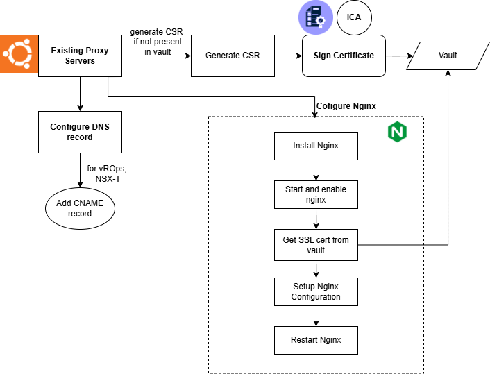

# Reverse Proxy Setup for Hosting Multiple Appliances

## Table of Contents

- [Reverse Proxy Setup for Hosting Multiple Appliances](#reverse-proxy-setup-for-hosting-multiple-appliances)
  - [Table of Contents](#table-of-contents)
  - [List of Changes](#list-of-changes)
  - [Introduction](#introduction)
    - [Purpose](#purpose)
    - [Audience](#audience)
    - [Scope](#scope)
  - [Overview](#overview)
    - [Purpose of the reverse proxy](#purpose-of-the-reverse-proxy)
  - [Architecture Overview](#architecture-overview)
    - [Components](#components)
    - [Architecture Diagram](#architecture-diagram)
    - [Workflow](#workflow)
  - [Technology Stack](#technology-stack)
  - [Network and Ports](#network-and-ports)
  - [Configuration Management](#configuration-management)
  - [Design Considerations](#design-considerations)
    - [Authentication Design Limitation](#authentication-design-limitation)
    - [DNS and Certificate Compatibility](#dns-and-certificate-compatibility)
    - [Multi-Tenancy Support](#multi-tenancy-support)

## List of Changes

| Version | Date       | Author       | Issue    | Changes           |
|---------|------------|--------------|----------|-------------------|
| 0.1     | 09-05-2025 | Rachel Beulah | VCS-15873| Draft design |
| 0.2     | 22-05-2025 | Rachel Beulah | VCS-15674| Adjust document - firewall rules, config details |
| 0.3     | 05-06-2025 | Rachel Beulah | VCS-15864| Adjust document - to align with VCS-16242  |

## Introduction

### Purpose

The Purpose of the document is to provide a detailed, technical blueprint for implementing the reverse proxy in a specific environment.

### Audience

This document is intended for Atos Cloud Services Engineers and Architects responsible for setting up and hosting the below appliances to the external customers in DHC.

1. Aria Operations(vRops)
2. NSX-T Application Platform (NSX-T)
3. vIDM (Identity Manager)

### Scope

This document covers Reverse Proxy setup using Nginx application in linux servers for hosting Aria Operation, NSX Application Platform & Identity Manager.

## Overview

### Purpose of the reverse proxy

The reverse proxy sits between external users and internal DHC portals like Aria Operations, NSX & vIDM, acting as a secure gateway. It hides internal systems from direct exposure, helping protect them from security scans and potential vulnerabilities. It takes care of SSL (HTTPS) connections at the edge, making things simpler for backend systems. It also manages who can access which portal, directs traffic to the right service, balances the load, and helps keep the internal network isolated and secure.

## Architecture Overview

### Components

**Ubuntu Linux Server:**
The reverse proxy setup is hosted on Ubuntu, a robust and secure Linux distribution. It provides a stable environment for running Nginx and integrating with automation and monitoring tools. Ubuntu’s package management system (apt) simplifies software installation and maintenance.

**Nginx:**
Nginx functions as the core reverse proxy, forwarding incoming client requests to internal services. It handles SSL termination, request routing, and can be configured for load balancing and caching. Its high performance and modular configuration make it ideal for reverse proxy roles.

**Internal Certificate Authority (ICA):**
SSL certificates used by Nginx are issued and signed by an Internal Certificate Authority, ensuring secure HTTPS communication. This avoids reliance on external public CAs and supports internal trust models and automation for certificate lifecycle management.

### Architecture Diagram

This architecture diagram outlines an automated workflow for deploying and configuring Nginx as an incoming reverse proxy on existing proxy servers that already host an outgoing Squid proxy, along with configuring DNS and setting up SSL certificates for secure connections.

##### Figure 1 Reverse Proxy Architecture



### Workflow

**1. Utilizing Existing Proxy Servers**

Instead of deploying new virtual machines, the existing dedicated proxy servers, will be utilized for this configuration. This leverages existing infrastructure and streamlines the deployment process. These servers, which already have Squid configured, will now also host Nginx and will be configured for redundant operation using keepalived to manage shared virtual IPs and ensure continuous availability for both outgoing (Squid) and incoming (Nginx) proxy services.

**2. DNS CNAME Record Creation**

CNAME (Canonical Name) records will be created in the DNS for the services that will be accessed through the Nginx reverse proxy. For example, CNAME records are created in DNS for services such as vROps, NSX-T, etc., pointing to the Virtual IP (VIP) managed by the proxy servers. These CNAMEs provide user-friendly and consistent access points for services.

**3. Installing Nginx:**

- Nginx is installed on the Proxy servers using the ```apt install nginx``` command. This sets up the Nginx software on the servers.
- These servers are now extended to handle incoming reverse proxy traffic in addition to their existing functionality.

**4. Generating SSL Certificates:**

For secure communication, SSL certificates are essential.

- Certificate Signing Request (CSR) Generation: A CSR is generated for the Nginx servers.
- Subject Alternative Names (SANs): The CSR will include the Virtual IP (VIP), the server hostnames, and the CNAMEs (e.g., vrops, nsxt) as Subject Alternative Names (SANs). This allows the single certificate to be valid for the VIP, the individual server names, and all specified service CNAMEs.
- CA Signing: The generated CSR is then signed by a trusted Certificate Authority (CA), resulting in the final SSL certificate and its associated private key.

**5. Configuring Nginx:**

- Nginx is configured to act as a reverse proxy.
- SSL Configuration:
  - The Nginx configuration is updated to enable only port 443 (HTTPS), ensuring all traffic is encrypted.
  - The SSL certificate and private key obtained in the previous step are configured in Nginx.
- Reverse Proxy Setup:
  - A virtual host configuration file is created to define the reverse proxy rules.
  - proxy_pass: This directive will specify the backend application servers to which Nginx will forward client requests.
  - proxy_set_header: This directive sets various HTTP headers in the forwarded request. This is crucial for passing information about the original request to the backend servers, such as the client's IP address or the requested hostname.
  - Multiple location blocks: These blocks can be defined to handle different types of requests or URLs. This allows for flexible routing and handling of various application components.
- After all configurations are applied, the Nginx services on proxy servers will be restarted ```sudo systemctl restart nginx``` to load the new settings.

##### Table 1: Nginx reverse proxy deployment decision

| Decision ID | Design Decision                                                                                         | Design Justification                                                                                                                                                         |
|-------------|-------------------------------------------------------------------------------------------------------|------------------------------------------------------------------------------------------------------------------------------------------------------------------------------|
| DD001    | Nginx reverse proxy will be deployed on existing dedicated proxy servers.             | To leverage existing infrastructure, optimize resource utilization, and streamline the deployment process by consolidating proxy functionalities. This also aligns with the decision to run both outgoing (Squid) and incoming (Nginx) proxy services on the same high-availability server pair. |

## Technology Stack

**Reverse Proxy Software: Nginx**

Nginx offers high performance and scalability with a lightweight footprint, making it easy to configure and deploy. It comes with built-in reverse proxy and load balancing capabilities, robust SSL/TLS support, and handles multiple protocols including HTTP, HTTPS, TCP, and UDP. Its widespread adoption and enterprise readiness make it a reliable choice for production environments.

The reverse proxy setup is automated using Ansible playbooks. The ```configureReverseProxy.yml``` playbook includes the ```dhc-configureReverseProxy``` role, which installs and configures the Nginx reverse proxy with all necessary settings.

Ongoing maintenance is handled by the ```reverseProxyPatching.yml``` playbook, which ensures the Nginx installation remains up to date with the latest security patches.

##### Table 2: Nginx reverse proxy deployment decision

| Decision ID | Design Decision                         | Design Justification                                                                                                                         |
|-------------|---------------------------------------|---------------------------------------------------------------------------------------------------------------------------------------------|
| DD002    | Nginx was selected as the reverse proxy solution. | Nginx provides high performance, scalability, and robust SSL/TLS support, making it suitable for secure and efficient reverse proxying in the existing infrastructure. |

## Network and Ports

To enable secure access and proper communication, the following ports must be configured on the firewall and NSX-V Distributed Firewall (Management Cluster inside DHC):

##### Table 3: Network port and protocol details for Nginx reverse proxy

| Source                      | Protocol | Ports | Target                 | Purpose                                                    |
|-----------------------------|----------|-------|------------------------|------------------------------------------------------------|
| External Customers (Browser) | TCP      | 443   | Nginx Reverse Proxy VIP | HTTPS listener port enforcing secure, encrypted communication |

**Disabled Ports: Port 80 (HTTP)** is disabled to prevent unencrypted access.

## Configuration Management

The Nginx reverse proxy configuration defines multiple server blocks, each listening on port 443 with SSL enabled. Each server block handles requests for different services based on the hostname. Within each server block, path-based routing is used to forward incoming requests to appropriate backend services. Specific URL paths are matched and proxied to corresponding backend endpoints, with some locations including custom headers to maintain correct host information.

### Key aspects

- **SSL Setup:** Each server block is configured with SSL certificates and keys to enable encrypted HTTPS connections.
- **Server Names:** Multiple server names or aliases can be configured to serve the same backend service.
- **Path-Based Routing:** Inside each server block, several location directives define URL path patterns to route incoming requests to corresponding backend servers or services.
- **Proxy Pass:** Requests matching specific paths are forwarded to backend endpoints using proxy_pass. This enables the reverse proxy to act as an intermediary between clients and internal services.
- **Header Management:** Custom headers such as Host, X-Real-IP, and X-Forwarded-For are set to preserve client information and ensure proper backend processing, including support for WebSocket upgrades where necessary.
- **Routing Examples:** This approach allows for proxying requests for specific API paths to backend API services, forwarding root or login requests to appropriate backend servers, and handling exact URL matches and path prefixes distinctly for finer control. This enables secure, centralized access to multiple internal services through a single reverse proxy, simplifying management and improving security.

The reverse proxy configuration is defined in the file:
```/etc/nginx/conf.d/virtual.conf```
This file contains multiple server blocks that listen on port 443 with SSL enabled, handling requests for different services based on hostnames and path-based routing.

##### Example Nginx reverse proxy configuration for two backend services with SSL and path-based routing

```bash
server {
    listen 443 ssl;
    server_name service1.example.com;

    ssl_certificate /etc/nginx/ssl/cert/example.crt;
    ssl_certificate_key /etc/nginx/ssl/cert/example.key;

    location /api/ {
        proxy_pass https://backend1.example.com/api/;
        proxy_set_header Host $host;
        proxy_set_header X-Real-IP $remote_addr;
        proxy_set_header X-Forwarded-For $proxy_add_x_forwarded_for;
    }

    location / {
        proxy_pass https://backend1.example.com/;
        proxy_set_header Host $host;
    }
}

server {
    listen 443 ssl;
    server_name service2.example.com;

    ssl_certificate /etc/nginx/ssl/cert/example.crt;
    ssl_certificate_key /etc/nginx/ssl/cert/example.key;

    location /app/ {
        proxy_pass https://backend2.example.com/app/;
        proxy_set_header Host $host;
        proxy_set_header X-Real-IP $remote_addr;
    }

    location / {
        proxy_pass https://backend2.example.com/;
    }
}
```

## Design Considerations

### Authentication Design Limitation

The reverse proxy setup does not support **vIDM-based** authentication for vRealize Operations (vROps). Therefore, native **Active Directory (AD) LDAP** authentication must be used directly in vROps.
To integrate the customer’s AD:

- Configure the AD as an identity source directly in vROps.
- Ensure correct Base DN, Bind DN, and domain controller IPs are configured.
- Validate LDAP over SSL (LDAPS) if used, and ensure the AD certificate is trusted by vROps.

### DNS and Certificate Compatibility

**1. Certificates:**

- If the customer provides SSL certificates, they are imported via an Ansible role which can be stored in vault and referenced in Nginx config.
- If not provided, a CSR is generated, signed by the internal Certificate Authority (ICA), and the cert/key is stored securely (e.g., in Vault).

**Nginx configuration** references these certs under /etc/nginx/ssl/ using:

##### Example Nginx SSL certificate and key file paths

```bash
ssl_certificate /etc/nginx/ssl/server.crt;
ssl_certificate_key /etc/nginx/ssl/server.key;
```

**NSX-T VIP Configuration:**
The same certificate used by Nginx must also be uploaded and attached to the NSX-T VIP configuration to ensure TLS termination at the VIP if NSX is terminating SSL, or for certificate passthrough to Nginx if it's doing the termination.

**2. DNS Registration:**

- DNS records (A or CNAME) are created for reverse proxy and backend portals during deployment using:
  - Role: atos.dhc.manageDns
  - Tasks: addARecord, addCnameRecord
- If customer DNS access is available, this is automated. Otherwise, customers must manually add the records.
Example mappings:
  - A record: rpx001.customer.local → 10.10.10.1
  - CNAME: vrops.customer.local → rpx001.customer.local

### Multi-Tenancy Support

A single reverse proxy instance can serve multiple customers using different DNS entries in their respective DNS zones.

- Nginx is configured with multiple server blocks, each with a unique server_name and associated SSL certificate:

##### Example Nginx server block configuration demonstrating multi-tenancy support with separate SSL certificates and server names for different customers

```bash
server {
  server_name portal.customerA.com;
  ssl_certificate /etc/nginx/certs/customerA.crt;
}

server {
  server_name service.customerB.net;
  ssl_certificate /etc/nginx/certs/customerB.crt;
}
```

- Customers configure DNS records (A or CNAME) in their zones, all pointing to the shared IP of the reverse proxy:
  - portal.customerA.com → 203.0.113.10
  - service.customerB.net → 203.0.113.10
- The shared IP may be public or reachable via VPN, depending on network design.
