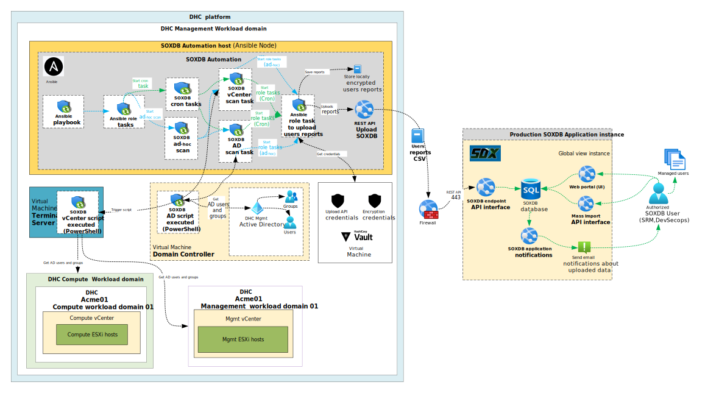
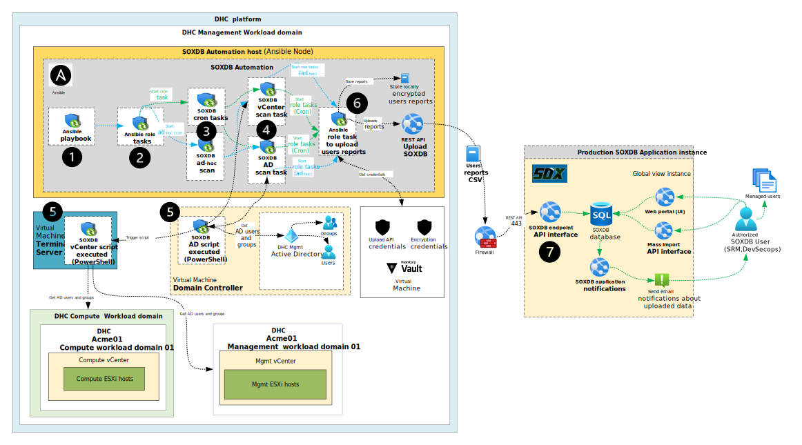

# SOXDB LLD

- [SOXDB LLD](#soxdb-lld)
- [1. Introduction](#1-introduction)
  - [1.1. Purpose](#11-purpose)
  - [1.2. Audience](#12-audience)
  - [1.3. Scope](#13-scope)
  - [1.4. Related Documents](#14-related-documents)
    - [Table 1: ATLM Related Documents](#table-1-atlm-related-documents)
    - [Table 2: Security Requirements Coverage](#table-2-security-requirements-coverage)
  - [1.5. List of changes](#15-list-of-changes)
  - [1.6. Requirement Levels](#16-requirement-levels)
- [2. Architecture Overview](#2-architecture-overview)
        - [Figure 1 SOXDB Architecture](#figure-1-soxdb-architecture)
  - [2.1. Business and Solution Requirements](#21-business-and-solution-requirements)
    - [Table 2: Initial Requirements](#table-2-initial-requirements)
  - [2.2. Integration options](#22-integration-options)
    - [Table 3: Integration Options](#table-3-integration-options)
  - [2.3. Licensing](#23-licensing)
  - [2.4. Network requirements](#24-network-requirements)
    - [2.4.1.  Connection traffic requirements](#241--connection-traffic-requirements)
    - [Table 4: Production SOXDB endpoint instances](#table-4-production-soxdb-endpoint-instances)
    - [Table 5: Development SOXDB endpoint instances](#table-5-development-soxdb-endpoint-instances)
    - [2.4.2.  Network Port and Protocol Requirements](#242--network-port-and-protocol-requirements)
    - [Table 6: List of ports and protocols](#table-6-list-of-ports-and-protocols)
    - [2.4.3.  Firewall requirements](#243--firewall-requirements)
    - [Table 7: Firewall rules requirements](#table-7-firewall-rules-requirements)
    - [2.4.4.  DHC routing requirements](#244--dhc-routing-requirements)
  - [2.5 Security requirements](#25-security-requirements)
    - [2.5.1. Credentials](#251-credentials)
    - [2.5.2. Notifications](#252-notifications)
    - [2.5.3. User reports encryption](#253-user-reports-encryption)
    - [2.5.4. Scan frequency](#254-scan-frequency)
- [3. Detailed Logical Design](#3-detailed-logical-design)
  - [3.1. SOXDB components](#31-soxdb-components)
    - [3.1.1 SOXDB automation host](#311-soxdb-automation-host)
    - [3.1.2 SOXDB automation](#312-soxdb-automation)
    - [Table 6: SOXDB automation components](#table-6-soxdb-automation-components)
    - [3.1.3 SOXDB application instance](#313-soxdb-application-instance)
    - [3.1.4 SOXDB application API](#314-soxdb-application-api)
    - [3.1.5 SOXDB credentials](#315-soxdb-credentials)
    - [3.1.6 SOXDB database](#316-soxdb-database)
    - [3.1.7 SOXDB webportal](#317-soxdb-webportal)
    - [3.1.8 SOXDB application exports](#318-soxdb-application-exports)
    - [3.1.9 SOXDB application notifications](#319-soxdb-application-notifications)
  - [3.2. Automation scripts](#32-automation-scripts)
    - [3.2.1 Ansible playbook](#321-ansible-playbook)
    - [3.2.2 Ansible role and tasks](#322-ansible-role-and-tasks)
    - [Table 8: Ansible role tasks (dhc-exportOfDataAndImportToSoxDB)](#table-8-ansible-role-tasks-dhc-exportofdataandimporttosoxdb)
    - [3.2.3 PowerShell scripts](#323-powershell-scripts)
    - [Table 9: List of PowerShell scripts](#table-9-list-of-powershell-scripts)
  - [3.3. Automation workflow](#33-automation-workflow)
    - [Table 10: Workflow steps](#table-10-workflow-steps)
    - [Table 11: Automation supported tags](#table-11-automation-supported-tags)
  - [3.4. Security](#34-security)
    - [3.4.1. Role Based Access Control](#341-role-based-access-control)
    - [Table 12: DHC service accounts required by SOXDB automation](#table-12-dhc-service-accounts-required-by-soxdb-automation)
    - [3.4.2. Certificates](#342-certificates)
  - [3.5. Availability and Scalability](#35-availability-and-scalability)
    - [3.5.1. Availability Design](#351-availability-design)
  - [3.6. Recoverability](#36-recoverability)
- [4. SOXDB data](#4-soxdb-data)
  - [Table 13: SOXDB scan input data](#table-13-soxdb-scan-input-data)
  - [4.1. VMware vCenter ESXI](#41-vmware-vcenter-esxi)
    - [Table 14: Table with example data fetched from VMware ESXi](#table-14-table-with-example-data-fetched-from-vmware-esxi)
  - [4.2. AD Users and groups](#42-ad-users-and-groups)
    - [Table 15: Table with example data fetched from DHC Active Directory](#table-15-table-with-example-data-fetched-from-dhc-active-directory)
- [5. Abbreviations and definitions](#5-abbreviations-and-definitions)

# 1. Introduction

## 1.1. Purpose

The purpose of this document is to provide detailed design and architectural guidance required to implement SOXDB integration in accordance with Atos standards and portfolio services. The principal architecture aim of this document is to translate the high-level design (HLD) into a technical low-level design (LLD).

The design provides a component architecture overview in the Architecture Overview chapter.
The Architecture Overview chapter provides basic building blocks and main principles, followed by Detailed Logical Design.

Architecture Overview provides basic building blocks and main design principles of presented design. It covers known requirements cascaded from HLD and other LLDs.
Detailed Logical Design presents business logic, relations and fundamental design decisions.
Detailed Physical Design provides detailed configuration of components to integrate with the SOXDB solution.

## 1.2. Audience

This document is intended for Atos Cloud Services Engineers and Architects responsible for Digital Hybrid Cloud (DHC) solution implementation and maintenance.

## 1.3. Scope

This LLD is intended to cover below components and domains:

1. SOXDB requirements
2. SOXDB integration and components
3. SOXDB data

This LLD does not cover:

1. Detailed monitoring
2. SOXDB AD users account scan for 3rd and more DHC Computer Vcenter instances

## 1.4. Related Documents

This document is a subset of Atos Technology Lifecycle Management (ATLM) artifacts. All documents are stored in the DHC documentation repository.

### Table 1: ATLM Related Documents

| Document Name |
| --- |
| [DHC High-Level Design](hldDigitalHybridCloud.md) |
| [WI SOXDB Integration](../workinstructions/wiSoxDBIntegration.md) |
| [WI DHC Onboard SOXDB](../workinstructions/dhcOnboardSOXDB.md) |

### Table 2: Security Requirements Coverage

| Instruction Name | Short Description |
| :----------: | ------- |
| [lldADSecurityEnhancement2024.md](lldADSecurityEnhancement2024.md) | Describes AD vulnerabilities in VCS and the remediation actions for key security findings. |
| [lldDhcRoleBasedAccessControl.md](lldDhcRoleBasedAccessControl.md) | Defines RBAC roles, mappings, and access review principles for VCS components. |
| [lldBreakTheGlass.md](lldBreakTheGlass.md) | Defines emergency access workflows for outage scenarios and recovery procedures. |
| [lldHardening.md](lldHardening.md) | Defines required hardening activities before production handover, including identity, firewall, and compliance controls. |
| [lldHashicorpVault.md](lldHashicorpVault.md) | Describes secure secret-management architecture, authentication methods, and audit logging. |
| [lldVulnerabilityManagement.md](lldVulnerabilityManagement.md) | Defines Nessus-based vulnerability scanning design, scope, and operating model. |
| [lldSecurityPosture.md](lldSecurityPosture.md) | Provides a consolidated overview of VCS security controls across encryption, scanning, RBAC, logging, and patching. |
| [SecurityMeasureExceptions.md](SecurityMeasureExceptions.md) | Lists approved Nessus/Alcatraz exceptions and false positives with rationale and mitigation context. |
| [SiemensCERTExceptions.md](SiemensCERTExceptions.md) | Lists Siemens CERT exceptions/false positives with applicability and risk/mitigation notes. |
| [lldSOXDB.md](lldSOXDB.md) | Describes SOXDB integration security controls, including credential handling, encryption, and RBAC. |
| [lldRemoteConsoleAccess.md](lldRemoteConsoleAccess.md) | Defines secure remote console access controls, including RBAC and certificate handling. |

## 1.5. List of changes

| Version | Date | Description | Author(s) |
| --- | --- | --- | --- |
| 0.1 | 2025-03-05 | Initial draft creation | Tomasz Korniluk |
| 0.2 | 2025-03-12 | Final version after DA approvall | Tomasz Korniluk |
| 0.3 | 2026-02-24 | VCS-15538 Added Security Requirements Coverage | Przemyslaw Pakula |

## 1.6. Requirement Levels

This chapter describes the principles and all requirements with design decisions.

| Term | Meaning |
| --- | --- |
| MUST | The definition is an absolute requirement of the specification. |
| MUST NOT | The definition is an absolute prohibition of the specification |
| SHOULD | There may exist valid reasons in particular circumstances to ignore a particular item, but the full implications must be understood and carefully weighed before choosing a different course |
| SHOULD NOT | There may exist valid reasons in particular circumstances when the particular behaviour is acceptable or even useful, but the full implications should be understood, and the case carefully weighed before implementing any behaviour described with this label |
| MAY | Any design decisions that are not classified as MUST and SHOULD or covering optional feature that is not general available for DHC product |

# 2. Architecture Overview

SOXDB is an Atos application to manage users permissions with focus on identifying and disabling inactive users. Authorized users can log in to SOXDB web portal to check users permissions and perform users quarter review.

SOXDB delivers emails notifications based on the latest uploaded user reports for the respective teams (DevSecops,SRM). The concerned teams based on received email notifications can take actions to acknowledge user's access that has been successfully removed or requires further investigation and reviews.

The below diagram describes SOXDB architecture used inside DHC platform.

##### Figure 1 SOXDB Architecture

The below components used to implement SOXDB integration inside DHC:

- **SOXDB automation host**

- **SOXDB automation**

- **Virtual Machine Terminal Server**

- **Virtual Machine Domain Controller**

- **Virtual Machine Hashi Vault**

- **SOXDB application instance**

- **SOXDB application API**

- **SOXDB application exports**

- **SOXDB application notifications**

- **SOXDB credentials**

- **SOXDB database**

- **SOXDB Webportal**

- **SOXDB mass import API interface**

## 2.1. Business and Solution Requirements

The table below provides known requirements mandatory to be incorporated into design decisions for the SOXDB integration.

### Table 2: Initial Requirements

| ID | Requirement description | Requirement Source | Requirement Level |
| --- | --- | --- | --- |
| R001 | Scan AD users accounts with respective security groups membership from Management and single Compute workload domain vCenter instances and ESXi hosts | Design Architect | MUST |
| R002 | Scan AD users accounts with respective security groups membership from DHC Management Active Directory | Design Architect | MUST |
| R003 | Generated AD users reports that contains mandatory data described for SOXDB AD users and vCenter(Esxi) scan | Atos SOXDB design | MUST |
| R004 | SOXDB integration implemented in manual or automated fashion | Design architect | SHOULD |
| R005 | SOXDB automation scripts delivers weekly or daily scan for users reports and uploads data into respective SOXDB instance | Design Architect | MUST |
| R006 | SOXDB API upload reports interface requires dedicated credentials and URLs | Atos SOXDB design | MUST |
| R007 | SOXDB API upload credentials stored inside secured DHC Vault | Design Architect | MUST |
| R008 | SOXDB automation scripts allows to define DHC vCenter instances for AD users scan | Design Architect | SHOULD |
| R009 | SOXDB automation scripts allows to schedule daily or weekly scan for AD users or vCenter AD users | Design Architect | MUST |
| R010 | SOXDB application delivers email notifications based on the uploaded users reports | Atos SOXDB design | SHOULD |
| R011 | SOXDB application maps users accounts with Customer ServiceNow Functional Organization Name | Atos SOXDB design | MUST |
| R012 | Scan AD users accounts with respective security groups membership from multiple Compute workload domain vCenter instances and ESXi hosts | Design Architect | MUST NOT |

## 2.2. Integration options

Atos SOXDB supports the following types of integration:

- DHC Management Workload domain vCenter and ESXi hosts for the AD users scan report
- DHC Management, single compute Workload domain vCenter instance and ESXi hosts for AD users scan report
- DHC Management AD users accounts scan report

**Note:** In case Customer contains multiple DHC Compute Workload domains SOXDB automation requires customization to enable scan accross multiple vCenter instances.

### Table 3: Integration Options

| **Integration type** | **Description** | **Scope** |
| --- | --- | --- |
| vCenter and ESXI hosts AD users scan (Mgmt. workload domain) | Delivers results of AD users scan from vCenter and ESXi hosts placed under Management Workload domain in DHC platform | DHC AD users accounts added inside Mgmt. vCenter and ESXi hosts with AD groups membership |
| vCenter and ESXI hosts AD users scan (Compute workload domain) | Delivers results of AD users scan from vCenter and ESXi hosts placed under Compute Workload domain in DHC platform | DHC AD users accounts added inside Compute vCenter and ESXi hosts with AD groups membershi |
| DHC Active Directory users accounts scan | Delivers results of DHC AD all users accounts | DHC AD users accounts (active/disabled) with AD groups membership |

## 2.3. Licensing

The SOXDB application is hosted and maintained by an Atos dedicated Team and doesn't require any extra license purchase or subscriptions.

## 2.4. Network requirements

SOXDB application is hosted outside of DHC platform which requires opening extra traffic between the DHC Management Workload domain platform and SOXDB endpoints.

### 2.4.1.  Connection traffic requirements

SOXDB application uses TCP SSL port 443 to deliver access into webportal (UI) and to upload users scan reports using REST API.

### Table 4: Production SOXDB endpoint instances

| **Url name** | **Role** | **Scope** | **Port** |
| --- | --- | --- | --- |
| ``https://globalview.it-solutions.atos.net/sox/api/_rest/upload/esxi/dhc/`` | Dedicated URL to upload DHC VMware vCenter ESXi users reports | Production DHC Customers | TCP 443 |
| ``https://globalview.it-solutions.atos.net/sox/api/_rest/upload/ad/dhc/`` | Dedicated URL to upload DHC AD users and groups reports | Production DHC Customers | TCP 443 |
| ``https://globalview.it-solutions.atos.net/sox/api/_rest/upload/esxi/btn/`` | Dedicated URL to upload DHC VMware vCenter ESXi users reports | Production DHC BTN Customers | TCP 443 |
| ``https://globalview.it-solutions.atos.net/sox/api/_rest/upload/ad/btn/`` | Dedicated URL to upload DHC AD users and groups reports | Production DHC BTN Customers | TCP 443 |

### Table 5: Development SOXDB endpoint instances

| **Url name** | **Role** | **Scope** | **Port** |
| --- | --- | --- | --- |
| ``https://tools-dev.it-solutions.myatos.net/sox/api/_rest/upload/esxi/dhc/`` | Dedicated URL to upload DHC VMware vCenter ESXi users reports | Development DHC | TCP 443 |
| ``https://tools-dev.it-solutions.myatos.net/sox/api/_rest/upload/ad/dhc/`` | Dedicated URL to upload DHC AD users and groups reports | Development DHC | TCP 443 |
| ``https://tools-dev.it-solutions.atos.net/sox/api/_rest/upload/esxi/btn/`` | Dedicated URL to upload DHC VMware vCenter ESXi users reports | Development DHC BTN | TCP 443 |
| ``https://tools-dev.it-solutions.atos.net/sox/api/_rest/upload/ad/btn/`` | Dedicated URL to upload DHC AD users and groups reports | Development DHC BTN | TCP 443 |

**Note:** Above SOXDB endpoints are only used for development to test upload of users reports.

### 2.4.2.  Network Port and Protocol Requirements

### Table 6: List of ports and protocols

| Source Component | Destination Component | Transport Protocol | Port | Purpose |
| --- | --- | --- | --- | --- |
| DHC Management Ansible node | ``https://globalview.it-solutions.atos.net/sox/api/_rest/upload/esxi/dhc/`` | TCP | 443 | Upload DHC vCenter ESXI users reports |
| DHC Management Ansible node | ``https://globalview.it-solutions.atos.net/sox/api/_rest/upload/ad/dhc/`` | TCP | 443 | Upload DHC AD users and groups reports |

### 2.4.3.  Firewall requirements

To satisfy requirements, appropriate firewall rules need to be implemented inside DHC platform under SDN firewall and DHC edge physical network devices (if exists).

Additionally, appropriate ASN firewall requests need to created to open traffic between DHC network edge devices and affected SOXDB endpoint instance.

| ID | Requirement description | Requirement Source | Requirement Level |
| --- | --- | --- | --- |
| FR001 | TCP traffic opened from Ansible node to DHC SDN firewall (SSL/TLS) | Design Architect | MUST |
| FR002 | TCP traffic opened from DHC SDN firewall to Edge network devices (SSL/TLS) | Design Architect | MUST |
| FR003 | TCP traffic opened from DHC Edge network devices to ASN network devices  (SSL/TLS) | Design Architect | MUST |
| FR004 | TCP traffic opened from ASN network devices to SOXDB endpoint (SSL/TLS) | SOXDB design | MUST |
| FR005 | TCP traffic opened from Ansible to Windows Terminal Server  (WINRM) | Design Architect | MUST |
| FR006 | TCP traffic opened from Windows Terminal Server to DHC vCenter instances (SSL/TLS) | Design Architect | MUST |
| FR007 | TCP traffic opened from Ansible node to DHC Active Directory Server (WINRM) | Design Architect | MUST |

### Table 7: Firewall rules requirements

| Source Component | Destination Component | Transport Protocol | Destination Port | Purpose |
| --- | --- | --- | --- | --- |
| DHC local platform Ansible node | DHC NSXT Management instance | TCP | 443 | Traffic to deliver SOXDB scan reports |
| DHC NSXT Management firewall instance | DHC network edge device (NAT IP) | TCP | 443 | Traffic to deliver SOXDB scan reports |
| DHC Edge firewall | ASN Firewall devices | TCP | 443 | Traffic to deliver SOXDB scan reports |
| ASN Firewall devices | SOXDB endpoint instance (Dev/Prod) | TCP | 443 | Traffic to deliver SOXDB scan reports |
| DHC local platform Ansible node | DHC Terminal Server | TCP | 5985/5986 | WINRM traffic for SOXDB automation scripts |
| DHC local platform Ansible node | DHC Active Directory Server | TCP | 5985/5986 | WINRM traffic for SOXDB automation AD users scan script |
| DHC local platform Terminal Server | DHC vCenter instances (Mgmt/Compute) | TCP | 443 | SSL/TLS traffic for SOXDB automation vCenter scan script |

### 2.4.4.  DHC routing requirements

To satisfy routing requirements the following routings should be implemented inside DHC platform.

| ID | Requirement description | Requirement Source | Requirement Level |
| --- | --- | --- | --- |
| RR001 | Dedicated NAT IP address to route traffic from DHC platform into SOXDB endpoint | Design Architect | MUST |
| RR002 | Route TCP traffic from Ansible local node into DHC SDN gateway | Design Architect | MUST |
| RR003 | Route TCP traffic from DHC SDN firewall to Edge network devices (use NAT IP) | Design Architect | MUST |
| RR004 | Route TCP traffic from Edge network devices using NAT IP to ASN network devices | Design Architect | MUST |

## 2.5 Security requirements

### 2.5.1. Credentials

| ID | Requirement description | Requirement Source | Requirement Level |
| --- | --- | --- | --- |
| SC01 | Dedicated credentials to upload scan reports for each SOXDB endpoint type | Atos SOXDB design | MUST |
| SC02 | Credentials for scan reports uploads stored inside DHC Vault | Design architect | MUST |
| SC03 | Credentials for scan report uploads should be rotated once a Year with SOXDB owner | Design architect | SHOULD |
| SC04 | DHC Automation service accounts to run SOXDB scan scripts                               ` | Design architect | MUST |

### 2.5.2. Notifications

| ID | Requirement description | Requirement Source | Requirement Level |
| --- | --- | --- | --- |
| SN01 | SOXDB user reports notifications sent using email to dedicated recipients only | Design architect | MUST |

### 2.5.3. User reports encryption

| ID | Requirement description | Requirement Source | Requirement Level |
| --- | --- | --- | --- |
| SCR01 | SOXDB Users reports stored locally inside Ansible node and encrypted | Design architect | MUST |

### 2.5.4. Scan frequency

| ID | Requirement description | Requirement Source | Requirement Level |
| --- | --- | --- | --- |
| SF01 | To secure delivery of users reports to SOXDB scans triggered at least once a day per week | Design architect | MUST |

# 3. Detailed Logical Design

## 3.1. SOXDB components

The following chapter explains the details about components used to build SOXDB integration inside DHC.

### 3.1.1 SOXDB automation host

DHC Management Ansible local host which stores DHC Manage playbooks and roles for SOXDB automation scripts.

### 3.1.2 SOXDB automation

DHC Manage Ansible playbook and role allows to execute SOXDB automation scripts which generate users reports and upload into respective SOXDB endpoint instance.

### Table 6: SOXDB automation components

| **Component name** | **Role** | **Repository** |
| --- | --- | --- |
| exportAndImportToSoxDB.yml | Main Ansible playbook to trigger SOXDB automation | DHC-Manage |
| dhc-exportOfDataAndImportToSoxDB | Ansible role to trigger various SOXDB automation tasks | DHC-Manage |

### 3.1.3 SOXDB application instance

Hosted outside DHC platform inside Atos data center, stores generated users reports inside a relation database and delivers web portal (UI) to identify disabled / inactive users and validate if exists any inactive employees accounts.

### 3.1.4 SOXDB application API

Delivers API interface to upload generated users reports for each affected Customer.

### 3.1.5 SOXDB credentials

Dedicated credentials for the API interface to upload generated users reports, stored inside secured DHC HashiVault instance.

### 3.1.6 SOXDB database

Stores uploaded users data reports and maintain users accounts.

### 3.1.7 SOXDB webportal

Allows to access into user interface to manage SOXDB application and review users accounts.

### 3.1.8 SOXDB application exports

Allows to generate users reports for the review using SOXDB webportal.

### 3.1.9 SOXDB application notifications

Delivers notification mechanism via emails to send data exports based on uploaded users reports (in the daily or weekly basis).

## 3.2. Automation scripts

Chapter describes in details automation scripts used for SOXDB automation tasks.

### 3.2.1 Ansible playbook

SOXDB automation use the main Ansible playbook (exportAndImportToSoxDB.yml) that allows executing the following tasks:

- Run ad-hoc task to perform VMware ESXi/vCenter AD users and groups scan and generate CSV report
- Schedule cron job task to run VMware ESXi/vCenter AD users and groups scan and generate CSV report
- Run ad-hoc task to perform DHC AD users and groups scan and generate CSV report
- Schedule cron job task to run DHC AD users and groups scan and generate CSV report

### 3.2.2 Ansible role and tasks

SOXDB automation use Ansible role (dhc-exportOfDataAndImportToSoxDB) to execute automation tasks which generates CSV user accounts reports and uploads into respective SOXDB endpoint.

### Table 8: Ansible role tasks (dhc-exportOfDataAndImportToSoxDB)

| **Ansible role task name** | **Role** | **Repository** |
| --- | --- | --- |
| credentials.yml | Collects service accounts, SOXDB upload API and encryption credentials | DHC-Manage |
| storecredentials.yml | Stores inside HashiVault provided SOXDB credentials | DHC-Manage |
| scheduled.yml | Schedule crontab jobs to run various task which generates CSV user accounts reports and uploads into SOXDB endpoint | DHC-Manage |
| runscriptadusers.yml | Run tasks and scripts to collect DHC AD user accounts with groups and generates CSV report | DHC-Manage |
| runscriptvcenter.yml | Run tasks and scripts to collect vCenter AD user accounts with groups and generates CSV report | DHC-Manage |
| upload.yml | Run task to upload generated user accounts CSV report into respective SOXDB endpoint | DHC-Manage |

### 3.2.3 PowerShell scripts

Ansible role tasks use PowerShell scripts to perform AD user accounts scan using Windows Domain Controller to fetch data, as well scans vCenter instances for AD user accounts and groups using Windows Terminal Server.

### Table 9: List of PowerShell scripts

| **Script name** | **Role** | **Repository** |
| --- | --- | --- |
| collectUsersFromAd.ps1 | Collects AD user accounts with respective groups and generates CSV report | DHC-Manage |
| collectUsersFromVcenter.ps1 | Collects AD user accounts with respective groups from vCenter instances, generates CSV report | DHC-Manage |
| collectVcenterUsersFromAd.ps1 | Based on generated CSV report from collectUsersFromVcenter.ps1 fetch user accounts data from DHC Active Directory | DHC-Manage |

## 3.3. Automation workflow

The following diagram describes SOXDB automation workflow executed under Ansible node.

### Table 10: Workflow steps

| Step number | Step name | Step details | Step result |
| --- | --- | --- | --- |
| 1 | Ansible playbook execution | SOXDB automation playbook executed in DHC Manage | Playbook executed with respective tags |
| 2 | Ansible role tasks initiated | Depending on used input tags Ansible role task started | Role tasks started based on used tags |
| 3 | Ansible cron task or adhoc scan task start | Depending on used input tags Ansible role task started to schedule crontab job or adhoc scan | Scheduled scan crontab job / adhoc task to run AD scan task or vCenter scan task |
| 4 | Ansible task to scan AD user accounts | Depending on used input tags started tasks to scan DHC AD user account or vCenter user accounts | Triggers PowerShell scripts to collect user accounts data from DHC AD or vCenter instances |
| 5 | PowerShell scripts executed | Depending on Ansible role tasks started respective PowerShell scripts triggered (vCenter script or DHC AD script) | Scripts collect user accounts data from DHC AD or vCenter instances and generated CSV reports |
| 6 | Ansible upload task | Initiate upload task (API call) to store generated CSV reports | Stores generated CSV reports file inside respective SOXDB endpoint and as well inside Ansibe local folder |
| 7 | SOXDB API interface acknowledge data import | SOXDB API interface received CSV report file | Stores generated CSV reports file inside SOXDB database instance |

### Table 11: Automation supported tags

| Tag name | Role | Result |
| --- | --- | --- |
| 1a | Run adhoc vCenter user accounts scan with AD groups | Generates CSV report with vCenter user accounts data (includes AD groups) and uploads into SOXDB endpoint |
| 1b | Schedule crontab job to run vCenter user account scan with AD groups | Generates CSV report with vCenter user accounts data (includes AD groups) and uploads into SOXDB endpoint |
| 2a | Run adhoc DHC AD user accounts scan with AD groups | Generates CSV report with DHC AD user accounts data (includes AD groups) and uploads into SOXDB endpoint |
| 2b | Schedule crontab job to run DHC AD user accounts scan with AD groups | Generates CSV report with DHC AD user accounts data (includes AD groups) and uploads into SOXDB endpoint |

## 3.4. Security

### 3.4.1. Role Based Access Control

SOXDB solution must be compliant with DHC Role Based Access Control.
To satisfy DHC RBAC the following service accounts needs to be used for automation scripts.

### Table 12: DHC service accounts required by SOXDB automation

| Account name | Role |
| --- | --- |
| svc-`<locationCode>`-auto01 | Grants access to execute SOXDB scan users script inside Terminal Server and fetch user data from vCenter instances |
| svc-`<locationCode>`-ans01 | Grants access to execute remotely SOXDB AD users scan script in Active Directory Server and fetch user accounts data |

### 3.4.2. Certificates

Currently SOXDB API interface doesn't support SSL certificates, only webportal offers SSL certificates.

## 3.5. Availability and Scalability

### 3.5.1. Availability Design

Atos SOXDB endpoints are hosted outside of DHC platform. Endpoints availability based on SOXDB design is 99.9% , application is available for 365 days.

## 3.6. Recoverability

SOXDB application endpoints are maintained by Atos SOXDB Team and delivers recoverability in case any unexpected outages, based on SOXDB design application SLA is 99%.

# 4. SOXDB data

SOXDB application receives user accounts reports which are fetched from various DHC components.
Based on SOXDB requirements DHC automation scripts gather mandatory user accounts data and creates CSV reports.

The below table with related SOXDB docs. explaining input data requirements for each scan type:

## Table 13: SOXDB scan input data

| Scan type | File format | File name | Documentation link |
| --- | --- | --- | --- |
| VMware vCenter / ESXi account users scan and groups | CSV | `<CompanyName>`.csv | [vmware_esxi_account.html](https://globalview.it-solutions.atos.net/sox/doc/scanner_interface/vmware_esxi_account.html) |
| Active Directory accounts and groups scan | CSV | `<DHCFullDomainName>`.csv | [ad_account.html](https://globalview.it-solutions.atos.net/sox/doc/scanner_interface/ad_account.html) |

## 4.1. VMware vCenter ESXI

SOXDB automation script scans DHC Management and Computer vCenter instances with ESXi hosts to collect active directory users with security groups.

### Table 14: Table with example data fetched from VMware ESXi

| sAMAccountname | AccountCreationDate | AssignedGroups | FQDN | FullName | IPAddress | isDisabled | lastLogon | localadmin | PwAge | ScanDate | OS | SID | company | NT-Name | Group | ParentGroup |
| --- | --- | --- | --- | --- | --- | --- | --- | --- | --- | --- | --- | --- | --- | --- | --- | --- |
| svc-gre82-vcs01 | 10/12/2022 | Domain Users,rsce-dhc-ad-l-denylogonlocal,rsce-dhc-ad-g-adminpwdpolicy,rsce-dhc-ad-g-svcpwdpolicy,rsce-gre82-vcs-l-admins,rsce-dhc-ad-l-logonasservicerights | gre82cmp002.nx8dhc01.next | svc-gre82-vcs01 - svc-gre82-vcs01 svc-gre82-vcs01 | 172.22.128.112 | FALSE | 3/3/2025 | 0 | 10/12/2022 | 3/7/2025 | ESXi | S-1-5-21-2173394526-3357839922-3478179026-1140 | Atos DHC CIs | NX8DHC01\svc-gre82-vcs01 | Administrators | rsce-gre82-vcs-l-admins |
| svc-gre82-vcs01 | 10/12/2022 | Domain Users,rsce-dhc-ad-l-denylogonlocal,rsce-dhc-ad-g-adminpwdpolicy,rsce-dhc-ad-g-svcpwdpolicy,rsce-gre82-vcs-l-admins,rsce-dhc-ad-l-logonasservicerights | gre82mgt005.nx8dhc01.next | svc-gre82-vcs01 - svc-gre82-vcs01 svc-gre82-vcs01 | 172.22.128.105 | FALSE | 3/3/2025 | 0 | 10/12/2022 | 3/7/2025 | ESXi | S-1-5-21-2173394526-3357839922-3478179026-1140 | Atos DHC CIs | NX8DHC01\svc-gre82-vcs01 | Administrators | rsce-gre82-vcs-l-admins |

## 4.2. AD Users and groups

SOXDB automation script scans DHC Active Directory to collect user accounts with security groups.

### Table 15: Table with example data fetched from DHC Active Directory

| sAMAccountname | CANONICALNAME | MAIL | EMPLOYEEID | HOMEDIRECTORY | COMPANY | DEPARTMENT | C | DESCRIPTION | PWDLASTSE | LASTLOGONTIMESTAMP | CREATETIMESTAMP | WHENCHANGED | ACCOUNTEXPIRES | DISABLED | DISTINGUISCHEDNAME | SN | GIVENNAME | SHORTDOMAINNAME | GROUPS | FO |
| --- | --- | --- | --- | --- | --- | --- | --- | --- | --- | --- | --- | --- | --- | --- | --- | --- | --- | --- | --- | --- |
| A00000 | nx8dhc01.next/DHC/Users/DHCAdmins/Sample user | - | - | - | - | - | - | Domain account for A00000 in gre82 | 8/11/2024 6:28 | - | 8/11/2024 6:28 | 27/11/2024 13:15:24 | - | no | CN=Sample user,OU=DHCAdmins,OU=Users,OU=DHC,DC=nx8dhc01,DC=next | user | Sample | nx8dhc01 | Domain Users,role-gre82-g-platformadministrators | Atos DHC CIs |

# 5. Abbreviations and definitions

| Abbreviation / Term | Explanation |
| --- | --- |
| SOX | The Sarbanes-Oxley Act (SOX) is a U.S. federal law |
| SOXDB | Atos SOX application with DB instances |
| UI | User Interface |
| FQDN | Fully Qualified Domain Name |
| DHC | Digital Hybrid Cloud |
