# Service Catalog LLD

# 1 Introduction

## 1.1 Author

| Author name | Author email                       | Date   |
| :---------: | :--------------------------------: | :----: |
| Tomasz Korniluk |  `tomasz.korniluk@atos.net` | 16.07.2020 |

### 1.1.1 Changelog

| Author name | Author email | Date | Comments |
| :---------: |  :---------: |:----:|:--------:|
| Tomasz Korniluk | `tomasz.korniluk@atos.net` | 16.07.2020 | initial draft of document, |
| Tomasz Jasionowski | `tomasz.jasionowski@atos.net` | 17.07.2020 | first review, RBAC design update |
| Tomasz Jasionowski | `tomasz.jasionowski@atos.net` | 30.07.2020 | federated RBAC design update |
| Oliver Scholle | `oliver.scholle@atos.net` | 22.04.2021 | fix duplicated SSRs and SSR chapters, removed not released items |
| Łukasz Stasiak | `lukasz.stasiak@atos.net` | 23.04.2021 | CPN RBAC design updates |
| Marcin Kujawski | `marcin.kujawski@atos.net` | 12.05.2021 | adding TOS 1.3 and multitenancy content |
| Marcin Kujawski | `marcin.kujawski@atos.net` | 09.06.2021 | update blueprint naming according to new vRA object naming convention |
| Abhijeet Janwalkar | `abhijeet.janwalkar@atos.net` | 30.08.2021 | update "Released second day activities" table for storage class activities|
| Łukasz Stasiak | `lukasz.stasiak@atos.net` | 05.10.2021 | Updates based on DHC-3135 |
| Łukasz Stasiak | `lukasz.stasiak@atos.net` | 13.10.2021 | Updates based on DHC-3139 |
| Madhavi Rane | `madhavi.rane@atos.net` | 22.11.2021 | DHC-3332 Update Change Disk Storage Class 2nd Day action details |
| Shalu Devi | `shalu.devi@atos.net` | 08.12.2022 | CESDHC-4676 Service Broker - Prepare Document catalog item improvements |
| Piotr Lewandowski | `piotr.lewandowski@atos.net` | 14.03.2023 | CESDHC-6521 Update with Avamar SSRs |
| Piotr Lewandowski | `piotr.lewandowski@atos.net` | 09.06.2023 | VCS-8166 Update with DR Active/Passive SSRs |
| Marcin Kujawski | `marcin.kujawski.external@atos.net` | 14.08.2024 | VCS-13167 Updates for new catalog items, look and feel and latest design updates |
| Marcin Kujawski | `marcin.kujawski.external@atos.net` | 25.09.2024 | VCS-13902 Add chapter with VCS SSRs |
| Lukasz Tworek | `lukasz.tworek.external@atos.net` | 24.10.2024 | VCS-13871 NSXT SSR LLD documentation update |
| Marcin Kujawski | `marcin.kujawski.external@atos.net` | 29.10.2024 | VCS-14239 Day2 resource action updates |
| Lukasz Tworek | `lukasz.tworek.external@atos.net` | 28.01.2025 | VCS-14900 NSXT SSR LLD documentation update, add Manage Tags |
| Lukasz Tworek | `lukasz.tworek.external@atos.net` | 20.12.2024 | VCS-14542 AVI ALB SSR LLD documentation update |

## 1.2 Purpose

The purpose of this document is to provide detailed design and architectural guidance required to implement service catalog for Customers under VMware Service Broker in accordance with Atos standards and portfolio services.
The principal aim of this document is to translate the high-level design (HLD) into a technical low-level design (LLD).
Design is providing component architecture overview in Architecture Overview chapter that provides basic building blocks and main principles, followed by Detailed Logical Design.
Architecture Overview provides basic building blocks and main design principles of presented design. It is covering known requirements cascaded from HLD and other LLDs documents. Detailed Logical Design presents business logic, relations and fundamental design decisions.
Detailed Physical Design provides detailed configuration of components including POD type specifics.

## 1.3 Audience

This document is intended for Atos Cloud Services Engineers and Architects responsible for VMware Cloud Services (VCS) solution implementation and maintenance.

## 1.4 Scope

This LLD is intended to cover below components and domains:

1. Service broker

- catalog items sources (blueprints, abx scripts, code stream pipelines)
- catalog items custom forms
- catalog items look and feel
- default catalog items published for Customers
- second day activities
- day 2 actions policies
- approval policies
- RBAC

This LLD is not covering:

- deployment of service broker custom forms
- deployment of catalog items (source blueprints)
- configuration of day 2 action policies via automation
- configuration of approvals policies via automation
- deployment and configuration of blueprints (source for catalog items)
- deployment of custom forms for default catalog items
- abx catalog items
- code stream catalog items

## 1.5 Related Documents

This document is a subset of Atos Technology Lifecycle Management (ATLM) artifacts. All documents are stored in the VCS documentation repository.

| Document Name |
| ------------- |
| [VMware Cloud Services: High Level Design](hldDigitalHybridCloud.md) |
| [Naming Convention principles](namingConvention.md) |
| [Manage Backup and Restore SSRs LLD](lldManageBackupRestoreSsrs.md)|
| [Manage VM Active-Passive DR SSRs LLD](lldManageActivePassiveDrSsrs.md)|

Table 1 ATLM Related Documents

## 1.6 Requirement Levels

This document is following the principles below to categorize all requirements and design decisions.

| Term | Meaning |
| --- | --- |
| MUST | The definition is an absolute requirement of the specification. |
| MUST NOT | The definition is an absolute prohibition of the specification |
| SHOULD | There may exist valid reasons in particular circumstances to ignore a particular item, but the full implications must be understood and carefully weighed before choosing a different course |
| SHOULD NOT | There may exist valid reasons in particular circumstances when the particular behaviour is acceptable or even useful, but the full implications should be understood, and the case carefully weighed before implementing any behaviour described with this label |
| MAY | Any design decisions that are not classified as MUST and SHOULD or covering optional feature that is not general available for VCS product |

# 2 Architecture Overview

VCS is using VMware Aria Automation Service called Service Broker (part of vRA On-Prem) to provide Customer portal functionality.
This functionality can be delivered via an On-Prem offering further allowing the underlying VCS automation software stack to be as light as possible.
The diagram below highlights the areas of the VCS architecture in scope of this LLD (yellow).

## VCS Architecture Overview

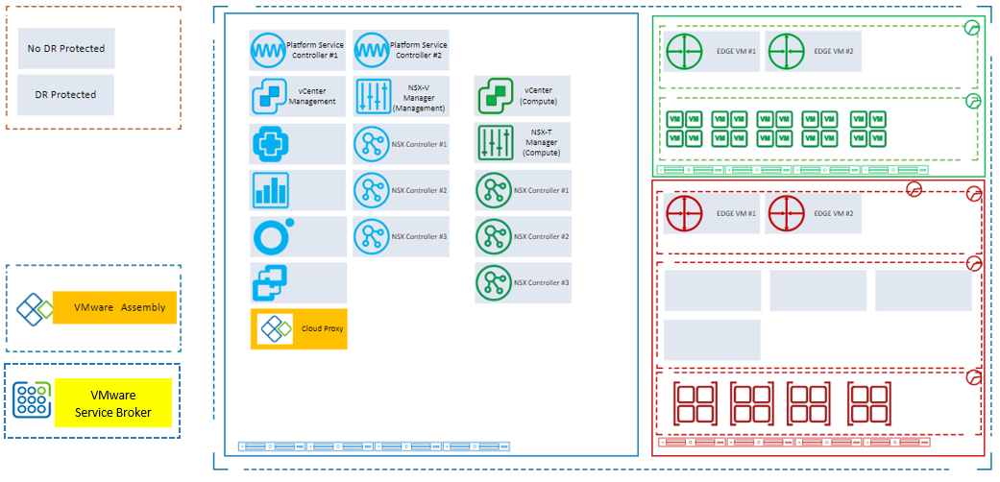

## Service Broker Logical Overview

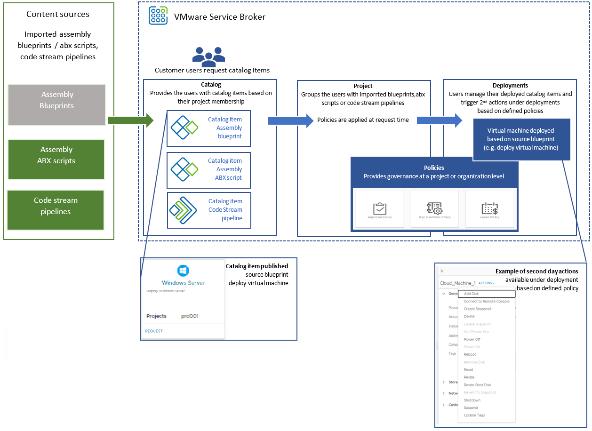

## 2.1 Business and Solution Requirements

The table below provides known requirements mandatory to be incorporated into design decisions described in this LLD.

| ID | Requirement description | Requirement Source | Requirement Level |
| --- | --- | --- | --- |
| R001 | Design blueprints for default catalog items | HLD | MUST |
| R002 | Design custom forms under default catalog items | Portfolio requirement | MUST |
| R003 | Design look and feel standard under custom forms for first and second day catalog items | Portfolio requirement | MUST |
| R004 | Defined list of mandatory 2nd day activities (SSRs) to publish for Customers | Portfolio requirement | MUST |
| R005 | Defined mandatory day two actions policies for Customers | Portfolio requirement | MUST |
| R006 | Defined approvals polices | HLD | SHOULD |
| R007 | Defined RBAC to separate access to Service Broker portal (per Customers) based on project membership | HLD | MUST |
| R008 | Defined list of allowed catalog item source types for Customers | HLD | MUST |
| R009 | Defined list of capabilities under first day catalog items | Portfolio requirement | MUST |
| R010 | Defined list of SSRs capabilities published for Customers | Portfolio requirement | MUST |
| R011 | Defined RBAC using federated Customer directory services | HLD | MUST |
| R012 | Defined requirements to support multitenancy design with multiple projects and tenant organizations | Portfolio requirement | MUST |

Table 2 Initial Requirements

### 2.1.1 SLA Requirements

As the Service Broker Catalog service is part of VMware Aria Automation On-Prem installation SLA is according to particular Customer contract agreements.

vRA platform availability is clustered and designed to be High-Available itself.

### 2.1.2 SLA standard service requests

As the Service Broker Catalog service is part of VMware Aria Automation On-Prem installation SLA is according to particular Customer contract agreements.

### 2.1.3 Second day activities

# 3 Detailed logical design

## 3.1 Service Catalog Architecture overview

### 3.1.1 VMware Service Broker

The VMware Service Broker provides a single point where you can request and manage catalog items. Catalog items are imported and released from VMware Aria Automation Assembler templates and users use them to deploy virtual machines into specific regions, zones and projects.

Service Broker user can request and monitor the provisioning process. After deployment, can also manage the deployed catalog items throughout the deployment lifecycle.

By default deployed catalog items are accessible and visible only to that user who trigger the provisioning.

### 3.1.2 Service Broker Communication flow

To provide the templates, configuration of content sources is required. The content sources can include Assembler templates and others like for example Amazon CloudFormation templates.
The imported templates become catalog items. The content sources are entitled to projects. Projects link a set of users/groups with one or more target cloud zone regions.

For example, UserA is a member of ProjectA and ProjectB, but not ProjectC and can see only the imported templates that were entitled to ProjectA and ProjectB.
When users requests a catalog item, where it deployed depends on the project selected. Projects might have one or more cloud zones.

If UserA and UserB are members of ProjectA, they see the imported templates as catalog items and at deployment time they can deploy to ProjectA, which determines which cloud zone the catalog item is deployed to.
The availability of the catalog items is determined by project membership. Projects link users, catalog items, and cloud resources where the items are deployed.

After a successful request, users can then manage their deployments by running actions, including dismiss or delete.

For VCS two content sources are configured:

- blueprints content source - containing all Day1 catalog items
- vro workflows - containing Orchestrator workflows catalog items

Resources are shared across users/groups assigned on project level.

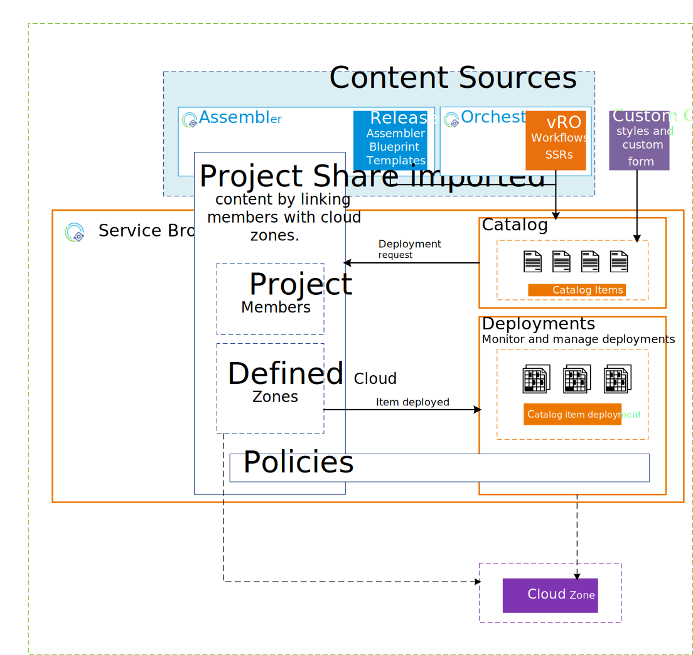

## 3.2 VMware Service Broker Logical Components

### 3.2.1 Catalog items

Following chapter describes catalog items requirements and design decisions

| Decision ID | Design Decision | Design Justification | Design Implication |
| --- | --- | --- | --- |
| 001 | Catalog items published with custom forms  | This will satisfy look and feel requirements for VCS service catalog |  Implement customized form for each catalog item using proper fields and conditionals |
| 002 | Blueprints as catalog item source for first day service requests | This will satisfy look and feel requirements for VCS service catalog |  Implement customized form for each catalog item using custom fields and conditionals |
| 003 | ABX scripts, Code Stream pipelines and vRO workflows as catalog item sources for second day service requests  | This will satisfy look and feel requirements for VCS service catalog |  Implement customized form for each catalog item using custom fields and conditionals |
| 004 | Catalog items custom and extra form fields always with order number | This will deliver order for provided values under input fields |  Implement customized form fields with numbering for each catalog item fields |
| 005 | Catalog items published always for each project | This will deliver department or Customers segregation for each publish catalog item |  Create and publish blueprints for each project  |
| 006 | Catalog items name always reflects exact name of source item (blueprint,abx script,code stream pipeline) | This will satisfy look and feel requirements |  Create and publish blueprints,abx scripts, code stream pipelines using simple naming defined under requirements  |
| 007 | Catalog items with source type blueprint should always use latest released version | Service broker under custom form reflects only latest released version of blueprint | During creation of blueprint is required to always release latest version, old versions should stay unreleased |
| 008 | Approved catalog items required separate specification documents | Document will deliver details about catalog item source components, custom and extra form details and catalog item functionalities delivered | Requires additional effort to build documentation and store on repo |
| 009 | Catalog items adjusted by custom CSS style file and icons| This will satisfy look and feel requirements for VCS service catalog |  Implement customized form with logo, colouring and icons indicating the request kind |

#### 3.2.1.1 Catalog items content sources

| ID | Requirement description | Requirement Source | Requirement Level |
| --- | --- | --- | --- |
| R001 | Catalog item source blueprint name should contain 1st letter capital and no extra characters| HLD | MUST |
| R002 | Catalog item source blueprint name contains max. 32 characters | HLD | MUST |
| R003 | Catalog items have customized and common look and feel | HLD | MUST |
| R004 | Code stream pipelines need to be used as catalog item sources only for second day activities | HLD | MUST |
| R005 | ABX scripts and vRO workflows need to be used as catalog item sources only for second day activities | HLD | MUST |
| R006 | Code stream pipelines need to be used as catalog item sources only for second day activities | HLD | MUST |
| R007 | Catalog item source is a unique instance created on project basis only | HLD | MUST |
| R008 | Multiple content sources within one Tenant organization are allowed | HLD | MUST |

#### 3.2.1.2 Catalog items look and feel

| ID | Requirement description | Requirement Source | Requirement Level |
| --- | --- | --- | --- |
| R001 | Catalog item names follow blueprint naming convention for standard service requests| HLD | MUST |
| R002 | Catalog item names follow abx scripts naming convention for second day service requests | HLD | MUST |
| R003 | Catalog item names contain first letter capital | HLD | MUST |
| R004 | Catalog item name fields allow max. 15 characters | HLD | MUST |
| R005 | Catalog items has customized and common look and feel | HLD | MUST |
| R006 | Catalog item contains a simple description explaining item functionality | HLD | MUST |
| R007 | Catalog item description allows max. 200 characters | HLD | MUST |
| R008 | Catalog item description allows only following special characters: ("(),.-/\")| HLD | MUST |
| R009 | Catalog item request form contains custom icon as Atos logo  | HLD | MUST |
| R010 | Catalog item name fields allow max. 15 characters | HLD | MUST |
| R011 | Catalog item name fields allowed special characters: (":,-/\") | HLD | MUST |
| R012 | Catalog item input fields tooltips contain simple description what kind of input value is expected | HLD | MUST |
| R013 | Catalog item input fields tooltips allow only max.200 characters | HLD | MUST |
| R014 | Catalog item input fields tooltips are mandatory | HLD | MUST |
| R015 | Catalog item extra form name first letter always capital | HLD | MUST |
| R016 | Catalog item extra form name allowed special characters: ("/-\") | HLD | MUST |
| R017 | Catalog item extra form name max. 20 characters | HLD | MUST |
| R018 | Catalog item input fields allowed special characters: ("-") | HLD | MUST |
| R019 | Catalog item input fields allowed special characters: ("-") | HLD | MUST |
| R020 | Catalog item input fields max. 50 characters | HLD | MUST |
| R021 | Catalog item input field deployment name allows max. 15 characters  | HLD | MUST |
| R022 | Catalog item input field deployment name allowed extra characters ("-")  | HLD | MUST |
| R023 | Catalog item input field type password min. 7 characters | HLD | MUST |
| R024 | Catalog item input field type password max. 12 characters | HLD | MUST |
| R025 | Catalog item input field OS version is selected from dropdown menu (differentiated by OS flavour) | HLD | MUST |
| R026 | Day1 Catalog item contains separate tabs for Network and Disk configuration | HLD | MUST |
| R027 | Day1 Catalog item contains Additional information tab with optional, not mandatory fields | HLD | MUST |
| R028 | Day1 Catalog item contains optional, not mandatory additional NIC enablers | HLD | MUST |
| R029 | Day1 Catalog item contains custom VM name is validated dynamically on the fly viw vRO action to avoid creating VMs with duplicate names | HLD | MUST |
| R030 | Day2 Catalog item deployment name is automatically generated by vRO action and read-only for user | HLD | MUST |

##### Figure 1. Default VCS catalog item listed in Service broker

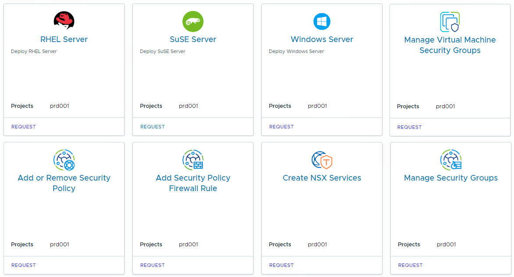

#### 3.2.1.3 Catalog items custom and extra forms

Following chapter covers design requirements for custom and extra forms

| ID | Requirement description | Requirement Source | Requirement Level |
| --- | --- | --- | --- |
| R001 | Custom forms should contain visibility conditionals | HLD | SHOULD |
| R002 | Custom extra forms names max. 20 characters, first letter capital, only allowed special characters: ("/-\") | HLD | MUST |
| R003 | Custom forms should contain tooltips under input fields | HLD | MUST |

##### Figure 2. Default VCS blueprint custom form

Default VCS blueprint custom form has 4 main sections - General, Networks, Disks, Additional Information.

- **General** tab

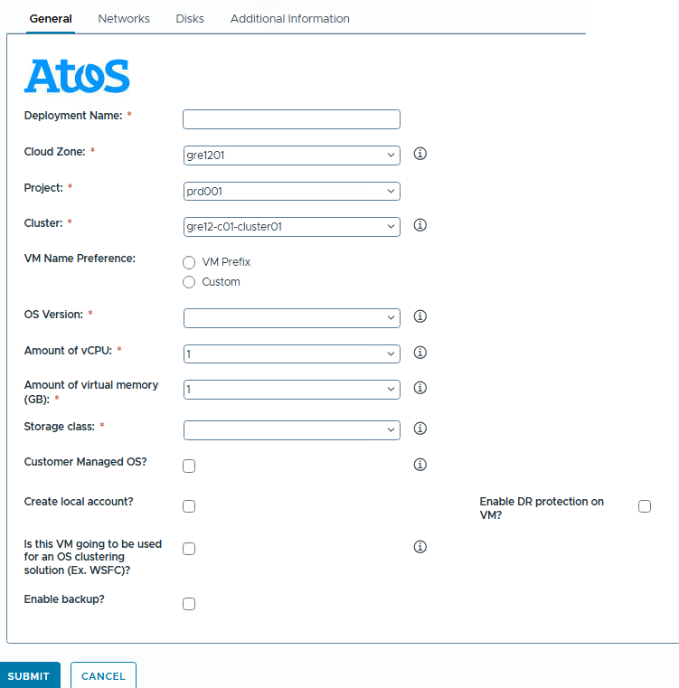

- **Networks** tab

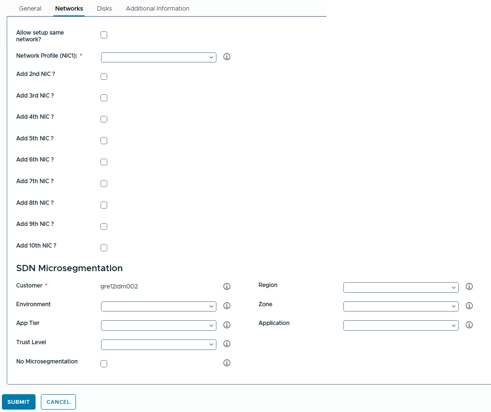

- **Disks** tab

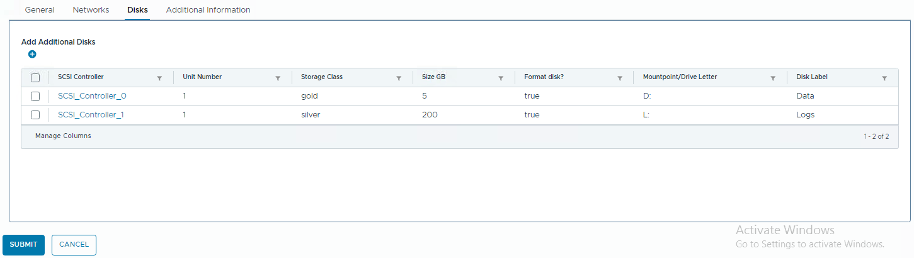

- **Additional Information** tab

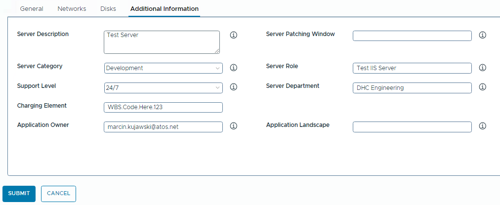

There are also optional sections that are enabled based on configuration selected:

- **Disaster Recovery**: Disaster recovery input fields required to enable DR protection for deployed VM. This option will be enabled only if user selects "Enable DR protection on VM" check box. It contains settings according to DR type setup (Active/Active or Active/Passive).
  
- **Local Account**: Local administrative input field required to have the local user created to login to VM.

#### 3.2.1.4 Default catalog items published

Following list defines approved default catalog items that will be published for Customers in VCS

| No. | Service Broker Portal Catalog Item name | Catalog service | Functionality |
| --- | --- | --- | --- |
| 1 | Windows Server | First day activity | Create Windows virtual machine |
| 1 | RHEL Server | First day activity | Create RHEL virtual machine |
| 1 | SuSE Server | First day activity | Create SuSE virtual machine |
| 2 | Add or Remove Security Policy | Second day activity | Add or remove the NSX-T security policy |
| 2 | Manage Security Policy Firewall Rule | Second day activity | Manage security policy for NSX-T firewall rule |
| 2 | Create NSX Services| Second day activity | Create a new NSX-T service |
| 2 | Manage Security Groups | Second day activity | Add or remove the NSX-T security group |
| 2 | Manage Virtual Machine Security Groups | Second day activity | Manage NSX-T security group for VM  |

The Catalog can be easily extended with further items based on Cloud templates containing e.g. multi machine, disk and network landscapes that will be ordered quite often by the respective customer. The default single VM template is deployed as initial example.

### 3.2.2 Policies

Service broker polices deliver an access policy mechanism for all activities available under the service broker catalog.
Using policies we can define to which type of requests (standard services requests) the Customer will get access (per project) and validate service requests using approval policies.  

|Decision ID | Design Decision | Design Justification | Design Implication |
| --- | --- | --- | --- |
| 001 | Policies must be defined per project  | Separates scope of defined policy per project |  Additional effort to implement configuration of policy per project |
| 002 | Policy names must contain the tenant name | Separates scope of defined policy per Tenant |  Additional effort to implement configuration of policy per tenant |
| 003 | Customer policies enforcement type always Hard  | Customer policy always applied |  Additional effort to implement configuration of policy per project |
| 004 | Customer policies always use role Members | Customer policy applied for Cloud Assembly member only | Additional effort to implement configuration of policy per project |

#### 3.2.2.1 Day two actions policies

Day two action policies delivers solution to filter access to first or second day activities per Customer project.

|Decision ID | Design Decision | Design Justification | Design Implication |
| --- | --- | --- | --- |
| 001 | Approval policy must be defined for standard service requests per project  | Delivers to Customers control of requested actions |  Implement and configure approval policies for each standard services requests (per Customer project) |
| 002 | Day two action policies must contain deployment criteria using catalog items filter  | Limit access to day two action service requests per Customer projects |  Additional effort to implement configuration of policy per project |
| 003 | Policies name should contain functional role of policy and is separated by hyphens e.g. `day2actions-users-clusteredVm` | Provides naming standard for day2action policies  |  Additional effort to implement configuration of policy per project |
| 004 | Content sharing policies must be created separately for blueprints and workflows items | Provides standard for sharing content within the Service Catalog | To implement separation for configuration of policy per item type |

#### 3.2.2.2 Approval policies

Delivers control mechanism (approve or denied) of requested activities using catalog items or day two actions (under deployments).

|Decision ID | Design Decision | Design Justification | Design Implication |
| --- | --- | --- | --- |
| 001 | Approval policy must be defined for standard service requests per project  | Delivers to Customers control of requested actions |  Implement and configure approval policies for each standard services requests (per Customer project) |
| 002 | Auto expiry decision always auto reject in case no respond from Customer approver | Delivers to Customer mechanism to automatically reject requests | Configure auto expiry decision under approval policy (per Customer project) |
| 003 | Auto expiry trigger setup max. to 7 days | Give Customer time buffer to respond for each request | Configure auto expiry trigger  under approval policy (per Customer project) |
| 004 | Approval polices needs to be divided per type of catalog service | Better control and overview of defined polices per catalog service types (first day / second day activity) | Required to create dedicated polices per catalog service types |

| ID | Requirement description | Requirement Source | Requirement Level |
| --- | --- | --- | --- |
| R001 | Name of approval policy max. 20 characters, first letter capital, only allowed characters ("/-\") | HLD | MUST |

### 3.2.3 Standard service requests

VCS allowing to request below standard services requests using Service Broker portal and execute second day activities under provisioned deployments.
The vRA Actions (SSRs) visible and available to end users are dependent on which Service Request entry point is solutioned for the customer. VCS's default Portal and Catalog is vRA Service Broker.
Deviating Portal solutions or/and other Portal using the vRA API for integration will most likely result in a different set of SSRs available.

| Decision ID | Design Decision | Design Justification | Design Implication |
| --- | --- | --- | --- |
| 001 | Approval polices should be defined for standard service requests  | This will allows Customers to control requested actions under portal  |  Required additional effort to implement approval polices per Customer project |
| 002 | Filter native vRA Day2 Actions with day 2 action policies  | Not all natively supported vRA actions are considered mature or secure enough to be exposed to regular end users  |  There is a difference between vendor provided out of the box capabilities in vRA and VCS available actions on customer cloud deployments |

#### 3.2.3.1 Released first day activities

Following list covers applicable first day activities that are published on customer Portal by default.

| No. | Service Broker Portal Catalog Item name | Catalog service | Functionality |
| --- | --------------------------------------- | --------------- | ------------- |
| 1 | Windows Server | First day activity | Create Windows virtual machine |
| 1 | RHEL Server | First day activity | Create RHEL virtual machine |
| 1 | SuSE Server | First day activity | Create SuSE virtual machine |
| 2 | Add or Remove Security Policy | Second day activity | Add or remove the NSX-T security policy |
| 2 | Manage Security Policy Firewall Rule | Second day activity | Manage security policy for NSX-T firewall rule |
| 2 | Create NSX Services| Second day activity | Create a new NSX-T service |
| 2 | Manage Security Groups | Second day activity | Add or remove the NSX-T security group |
| 2 | Manage Virtual Machine Security Groups | Second day activity | Manage NSX-T security group for VM  |

#### 3.2.3.2 Released second day activities

Following list covers applicable second day activities tested and released in VCS. Granting access to them requires day two action policy definition.

| No. | Service Broker Portal Catalog Item name | Catalog service | Functionality |
| --- | --- | --- | --- |
| 1 | Resize virtual machine | Second day activity | Resize virtual machine |
| 2 | Reboot virtual machine | Second day activity | Reboot virtual machine |
| 3 | Resume virtual machine | Second day activity | Start virtual machine |
| 4 | Power off virtual machine | Second day activity | Power off virtual machine or entire deployment |
| 5 | Power on virtual machine / deployment | Second day activity | Power on virtual machine or entire deployment |
| 6 | Delete virtual machine / deployment | Second day activity | Delete virtual machine or entire deployment  |
| 7 | Suspend virtual machine | Second day activity | Suspend virtual machine |
| 8 | Add disk virtual machine | Second day activity | Creates and add disk to virtual machine |
| 9 | Remove disk virtual machine | Second day activity | Remove disk attached to virtual machine |
| 10 | Extend disk size of virtual machine | Second day activity | Extend disk size attached to virtual machine |
| 11 | Revert snapshot - virtual machine | Second day activity | Revert snapshot of virtual machine |
| 12 | Create snapshot - virtual machine | Second day activity | Creates snapshot of virtual machine |
| 13 | Delete snapshot - virtual machine | Second day activity | Delete existing snapshot of virtual machine |
| 14 | Create - storage volume | Second day activity | Creates new vmdk file under datastore (without partition change) |
| 15 | Deprovision - storage volume | Second day activity | Deletes vmdk file under datastore |
| 16 | Resize - storage volume | Second day activity | Resize of existing vmdk file under datastore (without partition change) |
| 17 | Change lease deployment | Second day activity | Change lease time under deployment. When a lease expires, the deployment is destroyed and the resources are reclaimed.|
| 18 | Change Disk Storage Class | Second day activity |Change storage class of Virtual Machine disk. This action is available for resource type "Cloud.vSphere.Machine"|
| 19 | Change VM restart priority | Second day activity |Change VM restart priority released for Active-Active DR type. This action is using a vRO workflow to change the restart priority and update VM tag. It is available for "Cloud.vSphere.Machine" resource type.  |
| 20 | Manage Avamar VM Backup Policy | Second day activity | Add/Remove or Modify the backup policy for a given VM within Avamar backup solution. This action is using a vRO workflow to manage the policy and a VRO action to dynamically retrieve input data. |
| 21 | Avamar Backup On-Demand | Second day activity | Perform an on-demand backup on Avamar backup solution using either a policy-defined or a custom retention period |
| 22 | Avamar Backup Restore | Second day activity |Perform a VM restore to a selected restore point on Avamar backup solution. The list of restore points is retrieved dynamically by VRO action |
| 23 | Manage VM A/P DR Protection | Second day activity | Add or remote a VM from vSphere Replication and SRM Protection Group (vSAN only). When adding DR protection, the user can specify RPO, Priority and a Protection Group |
| 24 | Networker Backup On-Demand | Second day activity | Perform an on-demand backup on Networker backup solution using a policy-defined period |
| 25 | Networker Backup Restore | Second day activity |Perform a VM restore to a selected restore point on Networker backup solution. The list of restore points is retrieved dynamically by VRO action |

#### 3.2.3.3 Optional second day activities

Following list covers optional second day activities that requires day two action policy definition.

| No. | Service Broker Portal Catalog Item name | Catalog service | Functionality |
| --- | --- | --- | --- |
| 1 | Resize Boot Disk | Second day activity | Resize virtual machine boot OS disk |
| 2 | Change Owner | Second day activity | Changes to deployment owner to the selected user. The selected user must be a member of the same project that deployed the request.) |
| 3 | Connect to Remote Console | Second day activity | Open a remote session on the selected machine. Not exposed to regular end users due to direct ESX connectivity requirement and security concerns |

#### 3.2.3.4 Disabled second day activities

Following list covers second day activities explicitly excluded from default customer Portal content due to security or stability impact via day two action policy definition.

| No. | Service Broker Portal Catalog Item name | Catalog service | Functionality |
| --- | --- | --- | --- |
| 1 | Update Tags | Second day activity | Add, modify, or delete a tag that is applied to an individual resource. Not exposed to regular end users due to some tags are used to manage automation behaviour (e.g. Disaster Recovery operations) and must not be altered manually |

## 3.3 Security

### 3.3.1 Role Based Access Control

Atos based solutions must guarantee proper access management. VCS will use a VMware Aria Automation Identity & Access Management to provide the resources and services to the customers.
Full RBAC for those two levels is already described in [lldDhcRoleBasedAccessControl.md](lldDhcRoleBasedAccessControl.md).

Below diagram represents RBAC model with roles used by VCS on provider and customer organization level.

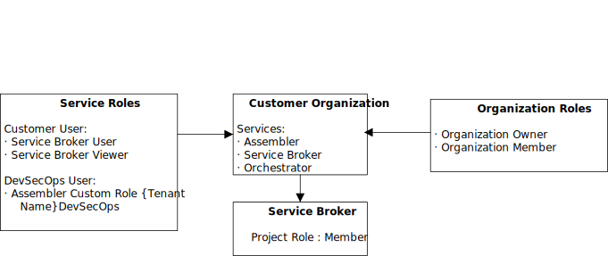

Information and design decisions below are dedicated only for the Service Catalog part. VCS supports for now two methods of access for customer users. First and the default one is access using the VMware accounts. Second is the use of the federated AD accounts. Following design decisions are made in that area.

| Decision ID | Design Decision | Design Justification | Design Implication |
| :---------: | --------------- | -------------------- | ------------------ |
|   rb-001    | Access will be given based on username | All usernames should be mapped with Active Directory domain account |  |
|   rb-002    | Users or enterprise groups will be assigned to defined roles | There is a need to properly manage access to resources, to have clear view access will be given for users or enterprise groups | Grant access to required vRA resources based on RBAC model |
|   rb-003    | Predefined roles will be used to grant access to the services | Service Broker provides built-in roles which can be attached to the users or enterprise groups. | Atos Teams will be not able to customize defined roles or to create new ones |
|   rb-004    | Users must follow Active Directory user access policies | User access based on AD accounts is managed by VCS, hence users have to respect security rules for example password length |  |
|   rb-005    | Defined enterprise groups or users needs to be assigned to dedicated customer projects | IAM for customer organization (or Tenant) is not delivering access to the projects, there is a need to assigned proper user or enterprise groups for customer projects in Assembler | Even if only one project exists under customer organization, users have to be assigned to it |
|   rb-006    | At least two VMware vIDM connectors must be installed in customer domain network | vIDM connectors is a prerequisite to federate customer domain. At least two connectors are required to have the High Availability | Atos will not have access to Windows machine with the installed connector services this will be customer responsibility to provide outbound traffic for synchronization to vRA vIDM |
|   rb-007    | Groups for sync to vRA vIDM will need to be agreed with the customer. | There is possibility to sync any AD group to vRA vIDM because of that customer is not forced to use Atos VCS naming convention in his own AD | Custom RBAC configuration will be needed if customer decided to use its own naming |

Table XXX Design Decisions RBAC

# 4 Detailed physical design

## 4.1 Security

As Service Broker is an On-Prem solution delivered by VMware we need to use the existing access management solution. VMWare provides two types of access:

1. Built-In authentication, based on username. In that case users will be attached to the customer organization with predefined roles based on Active Directory accounts.
2. Customer LDAP/AD authentication, based on username. Integration with Customer authentication sources that will federate access assigned to customer organization based on Customer authentication.

As a design decision both types will be supported by VCS.

### 4.1.1 Role Based Access Control Roles

In Service Broker we could assign to the user one of three roles:

| ID | Role name |
| --- | --- |
| 1. | Service Broker Administrator |
| 2. | Service Broker User |
| 3. | Service Broker Viewer |

The Service Broker Viewer has the least privileges - It is a read only user. It can see all projects for a customer organization.  
The Service Broker User - It is a normal user which can see more options than the viewer.  
The Service Broker Administrator - Has the highest privileges.  

As a design decision VCS will use a Service Broker User and Service Broker Viewer roles for customer users access.

**Service Broker User** - will be able to consume catalog items for a given project.

**Service Broker Viewer** -will have read only access to Service Broker configuration.

Below table list all available Service Broker roles with it's assignment in VCS.

| Role name | Role assignment |
| --------- | --- |
| Service Broker Administrator | Not in use as a administrators are assigned on the provider level |
| Service Broker User | Used for customer access. |
| Service Broker Viewer | Used for customer access.|

VMware documentation provides more details about the user roles.

<https://docs.vmware.com/en/VMware-Service-Broker/services/using-and-managing-vmware-service-broker.pdf>

### 4.1.2 Role Based Access Control Groups

Service Broker allows grant access to services and allow to consume catalog items based on enterprise groups.

| Object type | Organization Roles | Service Roles | Project Role |
| ----------- | ------------------ | ------------- | ------------ |
| AD group | Customer User | Service Broker User   | Member |
| AD group | Customer User | Service Broker Viewer | NA |

### 4.1.3 Access policies

Access policies will deliver segregation per Customer projects to limit access to service requests.

Below access policies will be defined per Customer project as mandatory to grant access to standard services requests.

| Policy name  | Policy role | Affected catalog items |
| --------- | --------------- | -------------------- |
| Day2actions | Grant access to Day2 standard service requests*** for Customers | Standard and custom Day2 actions for vRA deployment |

*** Based on standard service requests defined under chapter "3. Default second day activities".

### 4.1.4 Approval policies

Approval policies will deliver optional solution for Customer to approve all requests generated using default catalog items and day2 actions.

> Note: Approval policy is optional and can be skipped during implementation.

| Policy name  | Policy role | Affected catalog items |
| ------------ | ----------- | -------------------- |
| Day2 approval | Required approval for standard service requests*** | Standard and custom Day2 actions |
| Catalog items approval  | Required approval for default catalog items for Customers | Day1 catalog items |

*** Based on standard service requests defined under chapter "3. Default second day activities".

### 4.1.5 Detailed design firewall

#### 4.1.5.1 Detailed design firewall rules

Service Broker relays on secure HTTPS (443/tcp) traffic.
More information about traffic rules for entire VMware Aria Automation is provided in [This Link](https://ports.esp.vmware.com/home/vRealize-Automation).

# 5 Detailed design Availability and Scalability

## 5.1 Detailed design availability details

As the Service Broker Catalog service is part of VMware Aria Automation platform high availability is provided by VMware for all components.

3 node cluster setup is deplyoed behind a load balancer to enable high availability. Content is replicated in a VMware Aria Automation nodes within whole cluster.

## 5.2 Detailed design scalability

The scalability and concurrency limit tables outline on VMware Aria Automation HA multi-tenant (clustered) deployments is provided in following [link](https://docs.vmware.com/en/VMware-Aria-Automation/8.17/automation-reference-architecture/GUID-9DD443EA-0F7A-43B3-AD0A-8370B56109BE.html).

# 6 VCS Standard Service Requests

## 6.1 Backup & Restore SSRs

Backup & Restore SSRs in VCS consist of 3 requests:

1. Manage backup policy - depending on the user selection the SSR adds/removes a given VM from a backup policy or assigns a new backup policy
2. Backup on demand (Avamar and Networker are supported) - performs an on-demand backup either using the assigned backup policy or a custom retention period defined by the user
3. Restore a VM from the backup (Avamar and Networker are supported) - restores a VM from backup using a restore point selected by the user.

These 2nd day standard service requests are implemented as custom resource actions for existing deployments in Service Broker. Each custom resource action has an input form which uses VRO action to dynamically populate required fields and once the request is submitted, it triggers a VRO workflow to execute the SSR. The workflow uses REST API to communicate with backend backup system. The only supported backup solutions at the time of writing this document is Avamar and Networker.

### 6.1.1 High Level Description

High Level Process Flow is illustrated by below diagram:

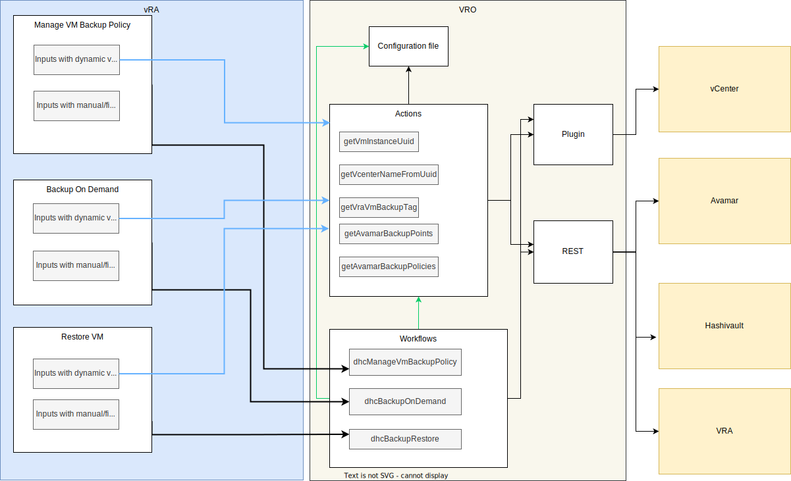

The following request types are possible:

- Add VM to a selected backup policy
- Remove VM from a backup policy
- Change the backup policy to a new one

### 6.1.2 Prerequisities and dependencies

#### Assumptions

- Backup backend solution is implemented on VCS site with:
  - Avamar version 19.x or higher
  - Networker version 19.x or higher
- During the transaction execution the actual backup policy for server is always gathered (stored) in the CMDB
- Backup membership for servers is mandatory (forced by default backup policy)
- There is no need to create any maintenance window for transaction because no downtime is required for backup request
- Above transaction is not applicable for database (SQL/MySQL/Oracle) servers

#### VCS prerequisities

- VCS is after hardening state with vRO/vRA integration in place
- Healthy Orchestrator
- SSRConfig configuration element and REST Hosts created in VRO

#### License requirements

No additional licensing is required as long as vRA, vRO and all endpoints are licensed.

#### vRO requirements and dependencies

- Imported latest version of the SSR package from github repository
- vRO configuration file created and filled in
- Healthy vRO integration under vRA tenant organization
- vRA rest host configuration
- Avamar/Networker rest host configuration
- Enabled vCenter plugin for compute
- Imported related workflows that are consumed by SSR workflow

### 6.1.3 Detailed logical design

#### Manage Avamar VM Backup Policy SSR

##### Service request overview

The service request has 3 possible operation types:

- Add
- Modify
- Remove

When the Add or Modify operation is selected by the user, Backup Policy field is displayed and populated dynamically with the list of policies defined in Avamar.

The following fields are read-only and populated automatically:

- Machine Name
- Current Backup Policy
- VM vCenter

Add operation:

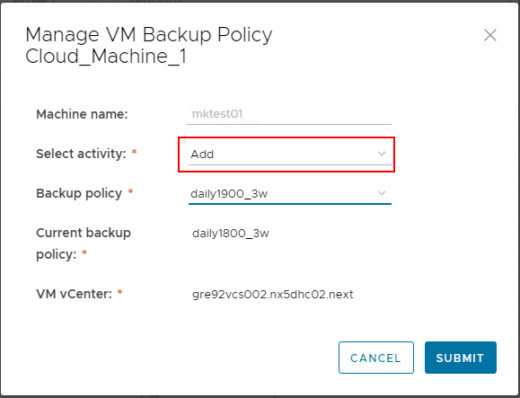

Modify operation:

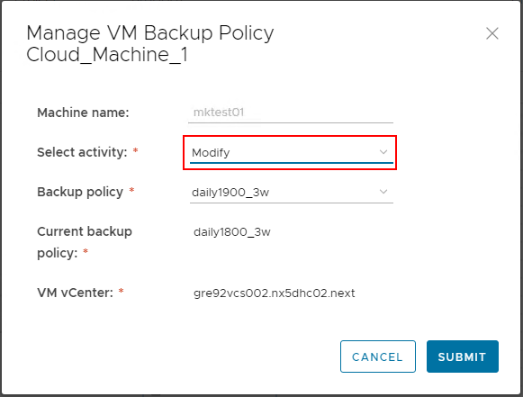

Remove operation:

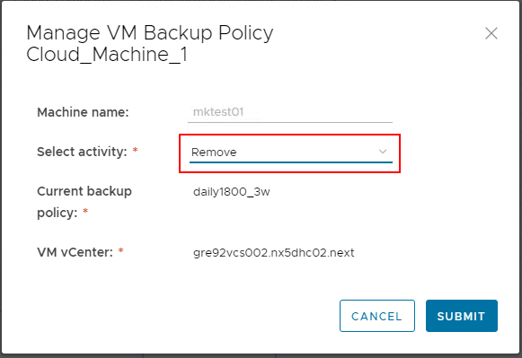

##### Service request inputs

Service Broker form for this 2nd day action has 2 inputs that need to be provided by the user:

| value   | Type       | Description              |Mandatory        |
| ------- | ---------- | ------------------------ | --------------- |
| operation| String | Operation type (Add/Modify/Remove)| YES |
| backupPolicy| String| Backup policy name that will be used to trigger VM backup on. The list of values is pulled from Avamar dynamically.|for Add/Modify operation|

##### vRO workflow steps

Main steps for the **dhcManageVmBackupPolicy** workflow are:

- Get vRA refresh token from the password store (Hashivault) and generate bearer token
- Get Avamar credentials from the password store (HashiVault) and obtain the bearer token
- Get the Domain ID from Avamar using vCenter UUID
- Verify if the operation type is Add/Modify or Remove

For Add/Modify:

- Validate backup policy and rule on Avamar
- Verify if the new backup policy is different than the current one
- Update tags on vRA and vCenter
- Get VM object based on unique VM instance ID and vCenter UUID
- Add client to backup
- Sync all clients on Avamar
- Validate if VM was successfully added into requested backup policy

For Remove:

- Change the VM tag in VRA to **noBackup**
- Sync all clients on Avamar

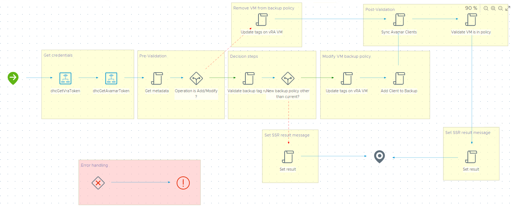

##### Inputs

There are 7 inputs that are required for this workflow. All of them are passed from the Service Broker request, however not all of them are presented to the user on the form.

| value   | Type       | Description              |Mandatory        |
| ------- | ---------- | ------------------------ | --------------- |
| backupPolicy| String| Backup policy name that will be used to trigger VM backup on. The list of values is pulled from Avamar prior to running the workflow|YES|
| virtualMachine| VC:VirtualMachine| Virtual Machine object |YES|
| vmInstanceUuid | String | Unique ID of requested virtual machine from vCenter. Not shown in the input form | YES|
| vCenterUuid | String | Unique ID of vCenter instance of requested virtual machine. Not shown in the input form| YES|
| vcenterName | String | FQDN of VM vCenter server| YES|
| currentBackupPolicy| String | Current VM backup policy | YES |
| operation| String | Operation type (Add/Modify/Remove)| YES |

#### Avamar Backup On-Demand SSR

##### Service request overview

The service request has 2 possible backup types:

- By Policy
- Custom Retention

When the **Custom Retention** backup type is selected by the user, additional **Custom Retention** field is displayed and needs to be filled in by the user with a number of days for the retention period.

The following fields are read-only and populated automatically:

- Machine Name
- VM vCenter
- Current Backup Policy

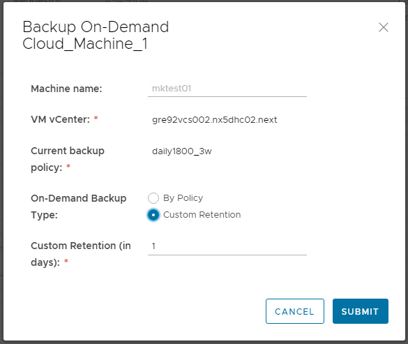

##### Service request inputs

| value   | Type       | Description              |Mandatory        |
| ------- | ---------- | ------------------------ | --------------- |
| backupType | String| Type of On-Demand Backup - value can either be **By Policy** or **Custom Retention**|YES|
| customRetention | String | if the backupType is custom, this value determines the retention period |Only if the backupType is **Custom Retention**|

##### vRO workflow steps

Main steps for the **dhcBackupOnDemandAvamar** workflow are:

- Get Avamar credentials from the password store (HashiVault)
- Get Avamar bearer token
- Prepare backup details (get vcenter id, client id, etc.)
- Validate if client is present in Avamar - if not, Add client to backup
- Validate if client OS is supported - if not, fail the workflow
- Verify if the backup is to be done by Policy or with custom retention
- Execute backup on-demand for requested VM with proper settings
- Get backup job id and monitor once finished

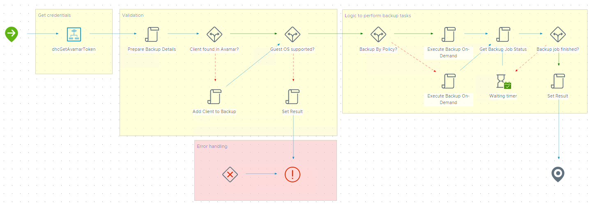

##### Inputs

There are 7 inputs that are required for this workflow. All of them are passed from the Service Broker request, however not all of them are presented to the user on the form.

| value   | Type       | Description              |Mandatory        |
| ------- | ---------- | ------------------------ | --------------- |
| backupPolicy| String| Backup policy name that will be used to trigger VM backup on. The list of values is pulled from Avamar prior to running the workflow|YES|
| virtualMachine| VC:VirtualMachine| Virtual Machine object |YES|
| vmInstanceUuid | String | Unique ID of requested virtual machine from vCenter. Not shown in the input form| YES|
| vCenterUuid | String | Unique ID of vCenter instance of requested virtual machine. Not shown in the input form| YES|
| vcenterName | String | FQDN of VM vCenter server| YES|
| backupType | String| Type of On-Demand Backup - value can either be **byPolicy** or **customRetention**|YES|
| customRetention | String | if the backupType is custom, this value determines the retention period |NO|

#### Avamar Backup Restore SSR

##### Service request overview

The service request restores a VM from a selected restore point. The **Restore backup point** field is dynamically populated with a list of restore points obtained from Avamar via a VRO action.

**Note:** Restore SSR supports only option to restore to original (existing) VM (no restore to new VM is supported now)

The following fields are read-only and populated automatically:

- Machine Name
- VM vCenter

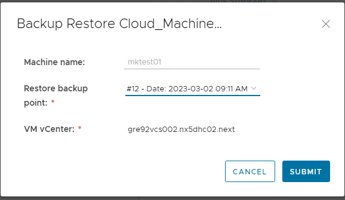

##### Service request inputs

| value   | Type       | Description              |Mandatory        |
| ------- | ---------- | ------------------------ | --------------- |
| Backup Restore Point | String| Restore point selected by the user |YES|

##### vRO workflow

Main steps for the **dhcBackupRestore** workflow are:

- Get Avamar credentials from password store (HashiVault)
- Get Avamar bearer token
- Get request metadata
- Verify if the client is found in Avamar
- Fetch the Guest OS information
- Verify that the Guest OS is supported - if not, fail the workflow
- Get all VM disks
- Verify if the VM is powered off - if not, force the shutdown
- Execute Backup Restore
- Verify the Restore job status
- Verify if the VM is powered on, - if not, power it on
- Wait until the VM Tools are started before ending the workflow

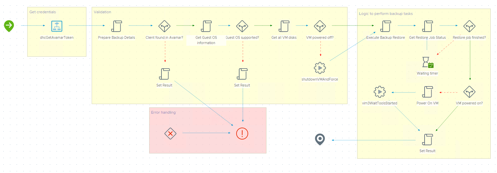

##### Inputs

There are 5 inputs that are required for this workflow. All of them are passed from the Service Broker request, however not all of them are presented to the user on the form.

| value   | Type       | Description              |Mandatory        |
| ------- | ---------- | ------------------------ | --------------- |
| backupPoint| String| Avamar Restore backup point|YES|
| virtualMachine| VC:VirtualMachine| Virtual Machine object |YES|
| vmInstanceUuid | String | Unique ID of requested virtual machine from vCenter. Not shown in the input form| YES|
| vCenterUuid | String | Unique ID of vCenter instance of requested virtual machine. Not shown in the input form| YES|
| vcenterName | String | FQDN of VM vCenter server| YES|

##### VRO Resources

The VRO resources in the following sections are used across all 3 Standard Service Requests.

##### Actions

Following table describes vRO actions implemented in this standard service request:

| Name  |  Package name | Description and Purpose            |     Workflow      |
| ----------- | ------------- | ------------------------ | ------------------------|
| getVraVmBackupTag | net.atos.dhc.automation | Obtains the Backup Policy Tag assigned to a given VM. Used by the SSR input form| dhcManageVmBackupPolicy, dhcBackupOnDemand |
| getVmInstanceUuid | net.atos.dhc.automation | Obtains the VM instance UUID of a given VM. Used by the SSR input form| dhcManageVmBackupPolicy, dhcBackupOnDemand, dhcBackupRestore |
| getVcenterNameFromUuid | net.atos.dhc.automation | Obtains the vCenter Name from vCenter plugin using vCenter UUID from vRA. Used by the SSR input form| dhcManageVmBackupPolicy, dhcBackupOnDemand, dhcBackupRestore |
| getAvamarBackupPolicies | net.atos.dhc.automation | Obtains the list of avaialable backup policies from Avamar. The same action is used both by the day2 Manage Avamar VM Backup Policy SSR and Day1 Deploy virtual machine SSR. Used by the SSR input form| dhcManageVmBackupPolicy |
| getAvamarBackupPoints | net.atos.dhc.automation | Obtains the list of avaialble backup restore points from Avamar. Used by the Restore SSR input form| dhcBackupRestore |
| getVaultToken| net.atos.dhc.automation | Obtains the Hashivault token using a service account credentials stored in the Configuration file (SSRConfig)| dhcGetAvamarToken, dhcGetVraToken |
| getVaultSecretData| net.atos.dhc.automation | Obtains the secret stored in Hashivault | dhcGetAvamarToken, dhcGetVraToken |
| getBearerTokenVra | net.atos.dhc.automation | Obtains API bearer token from vRA cloud | dhcGetVraToken |
| getAvamarBearer | net.atos.dhc.automation | Obtains API bearer token from Avamar | dhcGetAvamarToken |
| shutdownVMandForce| com.vmware.library.vc.vm.power | Powers off the VM during backup restore, it is a default action available within the package | dhcBackupRestore |
| vim3WaitToolsStarted| com.vmware.library.vc.vm.tools | Waits for vmware tools to be running for the VM that was powered on after restore - it is a default action available within the package | dhcBackupRestore |

##### Workflows

All workflows are stored in the VRO-Workflows GIT repository. The Following table describes each workflow which is used by the Avamar Backup Restore standard service request:

| Item name  |  Path | Description and Purpose           |
| ----------- | ------------- | ------------------------ |
| dhcManageVmBackupPolicy | /DHC/2Day Actions/ | Main workflow to start the Manage Avamar VM Backup Policy service request |
| dhcBackupOnDemandAvamar | /DHC/2Day Actions/ | Main workflow to start the Avamar Backup On-Demand service request |
| dhcBackupRestoreAvamar | /DHC/2Day Actions/ | Main workflow to start the Avamar Backup Restore service request |
| dhcGetAvamarToken  | /DHC/2Day Actions | Workflow to gather Avamar credentials from Vault and generate a bearer token |
| dhcGetVraToken   | /DHC/2Day Actions | Workflow to gather vRA refresh token from Vault and generate a bearer token |

##### Configurations

Following table describes configuration items used by the service request:

| Name  |  Path | Description and Purpose            |
| ----------- | ------------- | ------------------------ |
| proxyHost| /DHC/SSRConfig | VCS Proxy server IP address or hostname |
| proxyPort| /DHC/SSRConfig | VCS Proxy server port |
| vaultUsername | /DHC/SSRConfig | Service account username used for accessing Hashi vault |
| vaultPassword | /DHC/SSRConfig | Service account password used for accessing Hashi Vault|
| vaultServer | /DHC/SSRConfig | FQDN of the Hashivault server |
| vaultPort | /DHC/SSRConfig | Hashivault server port  |
| vaultVraTokenPath | /DHC/SSRConfig | Hashivault path to the VRA refresh token  |
| vaultAvamarBackupPath | /DHC/SSRConfig | Hashivault path to Avamar username & password  |
| vraRestHost | /DHC/SSRConfig | vRA rest host configuration  |
| avamarRestHost | /DHC/SSRConfig | Avamar rest host configuration  |
| backupType | /DHC/SSRConfig | Backup Solution - by default it's Avamar  |
| vraType | /DHC/SSRConfig | VRA Type: saas or on-prem  |

##### Permissions

Following permission are required to configure and enable service request in vRA

- vRA authorization token
- Assembler Administrator role
- Service Broker Administrator role
- Service Broker day2 policy is defined to enable service request as custom day2 resource action under vRA Assembler

For the SSRs to function a service account is required in order to generate a dedicated API refresh token. The token will be used to handle VRA API calls within the vRO workflows. It's as per design an internal domain account.

**The gollowing table lists required service accounts**

| Account name                  | Description                                  |
| ----------------------------- | ------------------------------------------ |
| `svc-{{locationCode}}-{{tenant}}-vro01@atos.net`     | VMware service account to handle vRA API requests from VRO for vRA. To order the account please follow the document: [VCS build guide chapter for Vmware service account](../workInstructions/dhcBuildGuide.md#vmware-service-account)  |
| svc-{locationCode}-vro01@{vcs domain name} | Internal VCS Management Active Directory domain service account to handle vRA API requests from VRO to On-Prem vRA. |

### 6.1.4 Installation

Installation of standard service request is performed during execution of the below work instruction as part of the VCS build. The procedure is automated with Ansible playbooks, which:

- configure REST Hosts in VRO
- create a Configuration file (SSRCOnfig)
- create day2 custom resource actions in vRA
- update Service Broker form and day2 policy
- create VRO service account, assign permissions in vRA and store its refresh token in Hashivault

Installaton of service request should take no more then 4 hours.

| Document name | Document location       |
| ------- | ---------- |
| vRA On-Prem: wiTenantBuilderVraOnPrem | [GLB-CES-PrivateCloud/DHC-Documentation](../workInstructions/wiTenantBuilderVraOnPrem.md) |

## 6.2 Manage DR Protection SSRs

Manage DR Protection SSRs in VCS is a single request that contains 2 action types:

1. Protect - when this action type is selected, the user is presented with a choice of Recovery Plan, Protection Group, RPO and Priority and the DR protection is enabled with parameters selected by the user. The Recovery Plan and Protection Group fields are populated dynamically using a VRO action.
2. Remove - when this option is selected the user can submit a request to remove DR protection from a given VM.

These 2nd day standard service requests are implemented as custom resource actions for existing deployments in Service Broker. Each custom resource action has an input form which uses VRO action to dynamically populate required fields and once the request is submitted, it triggers a VRO workflow to execute the SSR. The workflow uses REST API to communicate back with vRA as well as vRO plugins to communicate with SRM and vSphere Replication. The only supported DR solution at the time of writing this document is Active/Passive.

### 6.2.1 High Level Description

High Level Process Flow is illustrated by below diagram:

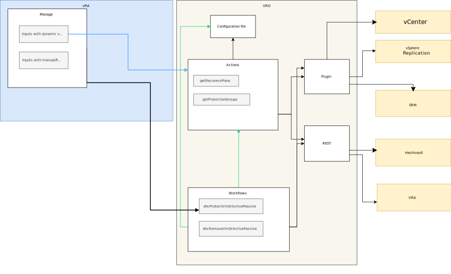

### 6.2.2 Prerequisities and dependencies

#### VCS prerequisities

- VCS is after hardening state with vRO/vRA integration in place
- Healthy Orchestrator
- Fully configured and healthy SRM and vSphere Replication

#### License requirements

No additional licensing is required as long as vRA, vRO and all endpoints are licensed.

#### vRO requirements and dependencies

- Imported latest version of the SSR package from github repository
- vRO configuration file created and filled in (SSRConfig)
- vRO DR configuration file filled in with required values (drConfigurationFile)
- Healthy vRO integration under vRA cloud tenant organization
- vRA rest host configuration
- Enabled vCenter plugin for compute
- Enabled SRM plugin
- Enabled vSphere Replication Plugin
- Imported related workflows that are consumed by SSR workflow
- For vRA SaaS a VMware service account needs to be created as described in the [Permissions](#permissions) chapter

### 6.2.3. Detailed logical design

#### Manage VM DR Active-Passive Protection SSR

##### Service request overview

The service request has 2 possible operation types:

- Protect
- Remove

When the Protect operation is selected by the user, Recovery Plan and Protection Group field is displayed and populated dynamically. Protection Groups are filtered based on the Recovery Plan selection.

Protect operation:

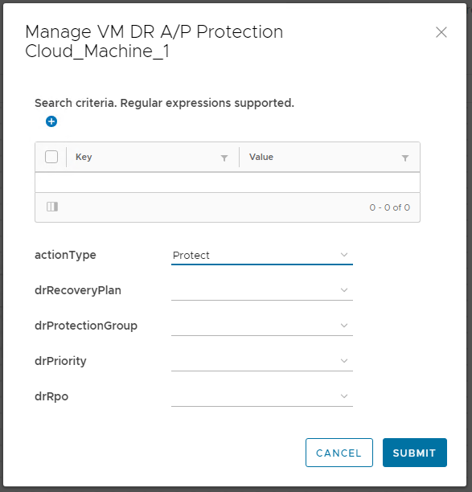

Remove operation:

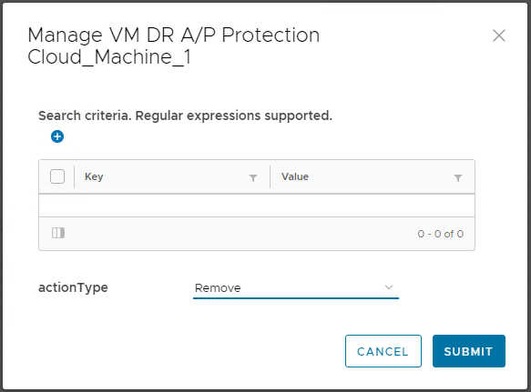

##### Service request inputs

Service Broker form for this 2nd day action has 5 inputs that need to be provided by the user:

| value             | Type   | Description                                                                                                          | Mandatory                   |
|-------------------|--------|----------------------------------------------------------------------------------------------------------------------|-----------------------------|
| actionType        | String | Operation type (Protect/Remove)                                                                                      | YES                         |
| drRecoveryPlan    | String | List of recovery plans defined in SRM for a given protected site. The list of values is pulled from SRM dynamically. | for Protect operation - Yes |
| drProtectionGroup | String | List of Protection Groups assigned to a selected Recovery Plan. The list of values is pulled from SRM dynamically.   | for Protect operation - Yes |
| drPriority        | String | Startup Priority for the VM in a Recovery Plan. Presented as a drop-down list                                        | for Protect operation - Yes |
| drRpo             | String | Recovery Point Objective value for vSphere Replication. Presented as a drop-down list                                | for Protect operation - Yes |

##### vRO workflow steps

Main steps for the **dhcProtectVmDrActivePassive** workflow are:

- Get vRA refresh token from the password store (Hashivault) and generate bearer token
- Verify if the operation type is Protect or Remove.

For Protect:

- Gather inputs
- Extract VM details from vRA
- Validate VM UUID in vCenter
- Disconnect CD-ROM from the VM
- Get SRM service account credentials from Hashivault
- Register login credentials for a vCenter Server site that is paired with a local site
- Set inputs for the built-in vSphere Replication Workflow (Protect Multiple VMs) - such as the datastore name, disk type, virtual machine object
- Run the out-of-the-box workflow to configure vSphere replication for the VM
- Run the out-of-the-box SRM Workflow to add the VM to a given Protection Group
- Run the out-of-the-box SRM Workflow to configure the VM settings in the Recovery Plan (Priority Group)
- Update the VM tags in vRA

For Remove:

- Trigger **dhcRemoveVmDrActivePassive** workflow
- Update VM tags in vRA

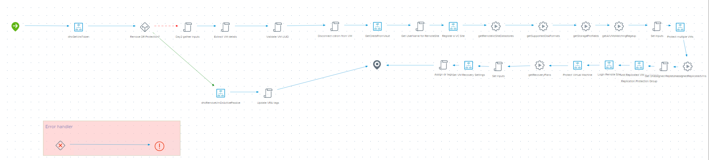

Main steps for the **dhcRemoveVmDrActivePassive** workflow are:

- Get metadata and get VM object
- Get Protection Groups
- Get Protection Group the VM is assigned to
- Remove the VM from vSphere Replication and the Protection Group
- Verify if the VM has been removed from vSphere Replication and the Protection Group. If not, try again (up to 3 times)

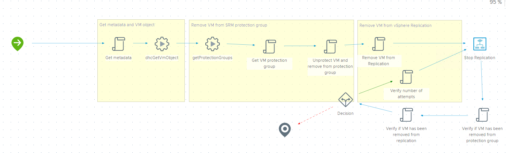

This workflow doesn't have any inputs.

##### vRO workflow inputs

There are 4 inputs that are required for this workflow. All of them are passed from the Service Broker request.

| value             | Type   | Description                                   | Mandatory                   |
|-------------------|--------|-----------------------------------------------|-----------------------------|
| drRpo             | String | RPO selected in the input form                | YES - for Protect operation |
| drProtectionGroup | String | Protection Group selected in the input form   | YES - for Protect operation |
| drPriority        | String | Priority Group for the Recovery Plan settings | YES - for Protect operation |
| actionType        | String | Protect/Remove                                | YES                         |

#### VRO Resources

The VRO resources in the following sections are used across all Workflows.

##### Actions

Following table describes vRO actions implemented in this standard service request:

| Name                        | Package name                 | Description and Purpose                                                      | Workflow                                 |
|-----------------------------|------------------------------|------------------------------------------------------------------------------|------------------------------------------|
| getRemoteVcSiteDatastores   | com.vmware.library.vr        | Get the available target datastores on a remote vCenter Server site pairing. | dhcProtectVmDrActivePassive              |
| getSupportedDiskFormats     | com.vmware.library.vr        | Get supported disk types from vSphere Replication                            | dhcProtectVmDrActivePassive              |
| getStorageProfileIds        | com.vmware.library.vr        | Get the list of VSAN storage policies from the remote site                   | dhcProtectVmDrActivePassive              |
| getAllVMsMatchingRegexp     | com.vmware.library.vc.vm     | Get the list of VMs matching a defined regular expression                    | dhcProtectVmDrActivePassive              |
| listUnassignedReplicatedVms | com.vmware.library.srm       | Obtains the list of all replicated VMs without assigned Protection Group     | dhcProtectVmDrActivePassive              |
| getRecoveryPlans            | com.vmware.library.srm.plan  | Obtains the list of Recovery Plans from SRM  (built-in action)               | dhcProtectVmDrActivePassive              |
| dhcGetVmObject              | net.atos.dhc.automation      | Obtains the VM object from vCenter based on the UUID                         | dhcRemoveVmDrActivePassive               |
| getProtectionGroups         | com.vmware.library.srm.group | Obtains the list of Protection Groups                                        | dhcRemoveVmDrActivePassive               |
| getSRMProtectionGroup       | net.atos.dhc.automation      | Obtains the list of Protection Groups based on the selected Recovery Plan    | dhcProtectVmDrActivePassive - input form |
| getSRMRecoveryPlan          | net.atos.dhc.automation      | Obtains the list of Recovery Plans for a site matching the location code     | dhcProtectVmDrActivePassive - input form |

##### Workflows

All workflows are stored in the VRO-Workflows GIT repository. The Following table describes each workflow which is used by the Manage VM DR Active/Passive Protection standard service request:

| Item name                   | Path                       | Description and Purpose                                                |
|-----------------------------|----------------------------|------------------------------------------------------------------------|
| dhcProtectVmDrActivePassive | /dhcDisasterRecovery/Day2/ | Main workflow to start the Manage VM DR A/P Protection service request |
| dhcRemoveVmDrActivePassive  | /dhcDisasterRecovery/Day2/ | Sub-workflow triggered when the action type is set to Remove           |

##### Configurations

Following table describes configuration items used by the service request:

| Name                     | Path                            | Description and Purpose                                                                                                                                          |
|--------------------------|---------------------------------|------------------------------------------------------------------------------------------------------------------------------------------------------------------|
| remoteLsUrl              | /Library/DR/drConfigurationFile | Path to PSC lookup service - e.g, gre22vcs002.nx2dhc.next/lookupservice/sdk                                                                                      |
| remoteSite               | /Library/DR/drConfigurationFile | Remote vSphere Replication Site                                                                                                                                  |
| srmSite                  | /Library/DR/drConfigurationFile | Local SRM Site                                                                                                                                                   |
| remoteSiteCode           | /Library/DR/drConfigurationFile | Remote site location code                                                                                                                                        |
| remoteDomain             | /Library/DR/drConfigurationFile | Remote Domain name, e.g. nx2dhc.next                                                                                                                             |
| vaultPort                | /Library/DR/drConfigurationFile | Port used on vault server in Local and Remote sites (default 8200)                                                                                               |
| vaultServer              | /Library/DR/drConfigurationFile | IP of vault server in Local site                                                                                                                                 |
| vaultUser                | /Library/DR/drConfigurationFile | Username to logon to vault e.g. svc-<locationCode>-ans03@<customerCode>dhc.next                                                                                  |
| vaultPassword            | /Library/DR/drConfigurationFile | Password to logon to vault in Local site                                                                                                                         |
| vaultSecretPathRemoteSrm | /Library/DR/drConfigurationFile | Path to REMOTE SRM credentials which are stored on local vault e.g. secret/data/<customerCode>/<locationCode>/activedirectory/svc-<RemoteSiteLocationCode>-srm01 |
| vraRestHost              | /DHC/SSRConfig                  | vRA rest host configuration                                                                                                                                      |
| site                     | /Library/DR/drConfigurationFile | Local vSphere Replicaton Site                                                                                                                                    |

##### Permissions

Following permission are required to configure and enable service request in vRA

- vRA cloud authorization token
- Cloud Assembly Administrator role
- Service Broker Administrator role
- Service Broker day2 policy is defined to enable service request as custom day2 resource action under vRA cloud assembly

For the SSRs to function a service account is required in order to generate a dedicated API refresh token. The token will be used to handle VRA API calls within the vRO workflows. Depending on the vRA type it's either an internal domain account or a VMware account.

**The following table lists required service accounts**

| Account name                                 | Description                                                                                                                                                                                                                                     |
|----------------------------------------------|-------------------------------------------------------------------------------------------------------------------------------------------------------------------------------------------------------------------------------------------------|
| `svc-{locationCode}-{tenant}-vro01@atos.net` | VMware service account to handle vRA API requests from ABX/VRO for vRA SaaS. To order the account please follow the document: [VCS build guide chapter for Vmware service account](../workInstructions/dhcBuildGuide.md#vmware-service-account) |
| svc-{locationCode}-vro01@{vcs domain name}   | Internal VCS Management Active Directory domain service account to handle vRA API requests from VRO to On-Prem vRA                                                                                                                              |

Permissions required in vRA for the above Service Accounts:

- Organization member

- Cloud Assembly Administrator
- Service Broker Administrator
- Project Member

### 6.2.4. Installation

Installation of standard service request is performed during execution of the below work instruction as part of the VCS build. The procedure is automated with Ansible playbooks, which:

- configure REST Hosts in VRO
- create a Configuration file (SSRCOnfig)
- create day2 custom resource actions in vRA
- update Service Broker form and day2 policy
- create VRO service account, assign permissions in vRA and store its refresh token in Hashivault

Installation of service request should take no more then 4 hours.

| Document name                         | Document location                                                                         |
|---------------------------------------|-------------------------------------------------------------------------------------------|
| vRA Cloud: wiTenantBuilder            | [GLB-CES-PrivateCloud/DHC-Documentation](../workInstructions/wiTenantBuilder.md)          |
| vRA On-Prem: wiTenantBuilderVraOnPrem | [GLB-CES-PrivateCloud/DHC-Documentation](../workInstructions/wiTenantBuilderVraOnPrem.md) |

## 6.3 Software Defined Network NSX-T SSRs

### 6.3.1 High-Level Description

The Software Defined Network (SDN) SSRs in the VCS platform provide five types of requests for managing various aspects of NSX-T. These SSRs facilitate the creation, modification, and management of security groups, policies, and services, which are essential for maintaining security and micro-segmentation.

The five types of SSR requests are:

1. **Manage Security Groups**  
   This request allows users to turn on/off micro-segmentation for a specific VM, while preserving firewall rules. It can be used for troubleshooting connection issues by allowing all traffic to a specific VM in case of a communication problem.

2. **Add or Remove Security Policy**  
   Enables the creation or removal of security policies in NSX-T, which are used in firewall rule sets.

3. **Manage Virtual Machine Security Groups**  
   Manages the placement of a VM in a specific security group based on its NSX-T tags.

4. **Manage Security Policy Firewall Rule**  
   Allows the creation, modification, or removal of firewall rules within security policies in an automated fashion.

5. **Create NSX Services**  
   Facilitates the creation of a new service in NSX-T by defining its name, protocol, and port details. The service can then be used in firewall rules and security policies.

#### RBAC

All NSX-T SSRs are available to users assigned to following AD group `rsce-{{ locationCode }}-nsx-l-ssrusers`.

AD group is created and assigned to vRA Content Sharing policy automatically during NSX-T SSRs enablement. All users that need to have access to those SSRs have to be added to that group.

#### Micro-segmentation Based on VM Tags

Micro-segmentation based on VM tags includes the following categories:

1. **customer** (mandatory) - Customer name who owns the VM.
2. **nsxRegion** - Defines the region for the VM (optional).
3. **nsxLocation** - Exact location for the VM (optional).
4. **nsxEnvironment** - The environment type for the VM (optional).
5. **nsxZone** - The landing zone for the VM (optional).
6. **nsxAppTier** - Defines the type of VM (optional).
7. **nsxApplication** - The application using the VM (optional).
8. **nsxTrustLevel** - Defines the trust level of the VM.
9. **nsxCcustomerManaged** (optional) - Defines whether the security group can be hidden from the customer in external portals.
10. **nsxNoMicrosegmentation** - True or False flag to enable all traffic for the VM in case of an emergency.
11. **tenant** (mandatory) - The tenant name for the specific VM.

### 6.3.2 Prerequisites and Dependencies

#### VCS Prerequisites

- VCS platform must be hardened and have vRO/vRA integration.
- A healthy cloud extensibility proxy and vRO must be available (for VRA Cloud).
- A healthy VCS proxy is required (for VRA Cloud).

#### License Requirements

No additional licensing is required as long as vRA, vRO, and all endpoints are licensed.

#### vRO Prerequisites and Dependencies

- Latest version of the SSR package must be imported from the repository.
- A vRO configuration file (`SSRConfig`) must be created and filled out.
- Healthy vRO integration within the vRA cloud tenant organization.
- vRA REST host configuration must be completed.
- vCenter plugin must be enabled for compute.
- Related workflows and actions consumed by SDN SSR workflows must be imported.

### 6.3.3 Detailed Logical Design

Each SSR is described in detail below, with steps, input requirements, actions, and workflows involved.

#### 6.3.3.1 Manage Security Groups

##### Service Request Overview

The **"Manage Security Groups"** SSR allows users to add, remove, or modify security groups used in firewall rules. Security groups created by this SSR are marked with a `"managed"=true` tag, ensuring that SSR automation only applies to these groups.

- Select the specific service catalog item: **Manage Security Groups**.
- Run the catalog item with the required inputs.

##### vRO Workflow Steps

Main steps for the **Manage Security Groups** workflow:

1. Input validation for action type (`ADD`, `MODIFY`, `REMOVE`).
2. Setup variables for authentication.
3. Based on the action type, perform additional validation for `ADD`, `MODIFY`, and `REMOVE`.
4. For `ADD`, generate a UUID for the new security group.
5. Retrieve all security groups from NSX-T.
6. For `ADD`, check if the security group already exists.
7. Depending on the action:
   - **ADD**: Create the new security group in NSX-T.
   - **MODIFY**: Modify the name and/or description of the group.
   - **REMOVE**: Check if the security group is empty and marked as `managed=true`, then remove it if applicable.

##### Inputs

| **Input**           | **Type**  | **Description**                                               | **Mandatory**  |
|---------------------|-----------|---------------------------------------------------------------|----------------|
| `actionType`        | String    | Action type for the security group (`ADD`, `MODIFY`, `REMOVE`) | Yes            |
| `sgName`            | String    | Name for the security group                                    | Yes            |
| `sgDescription`     | String    | Description of the security group                              | Yes            |
| `sgUuid`            | String    | UUID for the security group (auto-generated for `ADD`)         | No             |
| `deleteSecurityGroup`| String   | The security group to delete (for `REMOVE` action)             | Yes (REMOVE)   |
| `modifySecurityGroup`| String   | The security group to modify (for `MODIFY` action)             | Yes (MODIFY)   |
| `environment`       | String    | Environment tag to filter VMs for security group membership     | No             |
| `zone`              | String    | Zone tag to filter VMs for security group membership           | No             |
| `appTier`           | String    | Application tier tag to filter VMs for security group membership | No           |
| `application`       | String    | Application tag to filter VMs for security group membership    | No             |
| `tenant`            | String    | Tenant under which the security group will be created          | Yes            |

##### Workflow Schema

Here is a representation of the workflow's logic:

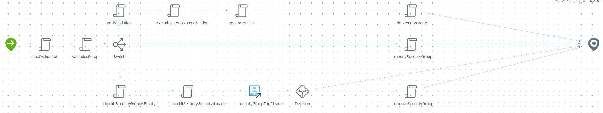

##### vRO Actions

| **Action Name**           | **Package Name**            | **Description**                                           |
|---------------------------|-----------------------------|-----------------------------------------------------------|
| `configElement`            | net.atos.dhc.automation     | Sets up required variables based on SSR configuration      |
| `getVaultToken`            | net.atos.dhc.automation     | Retrieves Vault token for authentication                   |
| `getVaultSecretData`       | net.atos.dhc.automation     | Retrieves secret data from Vault                           |
| `base64PassEncode`         | net.atos.dhc.automation     | Encodes user credentials using Base64 encryption           |
| `getNSXSecurityGroups`     | net.atos.dhc.automation     | Retrieves security groups from NSX-T                       |

##### Key Workflow Logic

###### ADD Action

1. **Validation**: Ensures that the `sgName` and `sgDescription` are provided and within character limits.
2. **UUID Generation**: A new unique identifier is generated for the security group.
3. **Security Group Creation**: NSX-T API is called to create the security group with membership criteria defined by VM tags.

###### MODIFY Action

1. **Security Group Lookup**: The workflow fetches details of the security group to be modified.
2. **Modify Attributes**: The name, description, and membership criteria of the group are updated based on input.

###### REMOVE Action

1. **Validation**: The workflow checks if the security group is empty and has the `"managed"=true` tag.
2. **Deletion**: If valid, the group is removed from NSX-T.

##### Custom Form Structure

The form used in the **Manage Security Groups** service request is dynamic, changing its fields based on the selected action. Below is an outline of the form layout and fields:

- **Page**: General
  - **Section 1: Customer**
    - **Field**: `tenant` (TextField) – Prepopulated with the tenant's details. (Read-only)
  - **Section 2: Type of Action**
    - **Field**: `actionType` (DropDown) – Select the action type (`ADD`, `MODIFY`, `REMOVE`).
  - **Section 3: Security Group Details**
    - **Field**: `sgName` (TextField) – Visible only for `ADD`. Enter the name of the security group.
      - **Field**: `sgDescription` (TextField) – Visible only for `ADD`. Enter a description for the security group.
  - **Section 4: Environment & Tags**
    - **Fields**: `environment`, `zone`, `appTier`, `application` (TextFields) – Enter filtering criteria for VMs.
  - **Section 5: Modify Security Group**
    - **Field**: `modifySecurityGroup` (DropDown) – Select the security group to modify (visible for `MODIFY`).
  - **Section 6: Remove Security Group**
    - **Field**: `deleteSecurityGroup` (DropDown) – Select the security group to remove (visible for `REMOVE`).

#### 6.3.3.2 Manage Virtual Machine Security Groups

##### Service Request Overview

The **"Manage Virtual Machine Security Groups"** SSR allows users to manage security group assignments for a VM based on its NSX-T tags. Only security groups marked as `"managed=true"` are listed for selection.

- Select the specific service catalog item: **Manage Virtual Machine Security Groups**.
- Choose the security groups you want to add or remove from the selected VM.

##### vRO Workflow Steps

Main steps for the **Manage Virtual Machine Security Groups** workflow:

1. Setup variables for authentication.
2. Retrieve the VM UUID based on the VM name.
3. Fetch all VM tags from NSX-T.
4. Prepare payloads for adding and removing security groups.
5. Retrieve all NSX-T security groups.
6. Validate that the security groups provided in the request match existing NSX-T groups.
7. For adding security groups:
   - Add all security group tags to the VM.
   - Validate that the VM has been added to the correct groups.
   - If validation fails, rollback changes.
8. For removing security groups:
   - Remove all security group tags from the VM.
   - Validate that the VM has been removed from the correct groups.
   - If validation fails, rollback changes.

##### Inputs

| **Input**             | **Type**       | **Description**                                       | **Mandatory** |
|-----------------------|----------------|-------------------------------------------------------|---------------|
| `securityGroupAdd`     | Array/String   | List of security groups to add                        | Yes           |
| `securityGroupDel`     | Array/String   | List of security groups to remove                     | Yes           |
| `vmName`              | String         | Name of the VM                                        | Yes           |
| `vmID`                | String         | UUID of the VM (not required for `ADD`)               | No            |

##### Workflow Schema

Here is a representation of the workflow's logic:

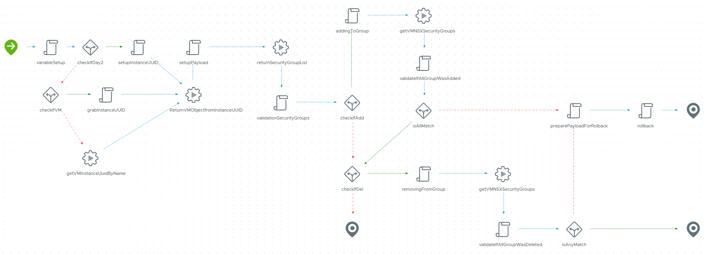

##### vRO Actions

| **Action Name**            | **Package Name**            | **Description**                                           |
|----------------------------|-----------------------------|-----------------------------------------------------------|
| `getVMInstanceUuidByName`   | net.atos.dhc.automation     | Retrieves VM instance UUID based on its name               |
| `getVMNSXExternalID`        | net.atos.dhc.automation     | Retrieves NSX-T external ID for the VM                     |
| `getVMNSXTags`              | net.atos.dhc.automation     | Retrieves all NSX-T tags for a VM                          |
| `getNSXSecurityGroups`      | net.atos.dhc.automation     | Retrieves all security groups from NSX-T                   |

---

##### Key Workflow Logic

###### Add Security Groups

1. **Authentication**: The system sets up authentication variables and retrieves the NSX-T credentials.
2. **Retrieve VM UUID**: If the VM name is provided, the workflow fetches its UUID from NSX-T.
3. **Tag Validation**: The workflow checks if the security groups being added exist in NSX-T.
4. **Add Security Groups**: The system sends an API request to add the VM to the specified security groups based on NSX-T tags.
5. **Validation**: It validates that the VM has been successfully added to the correct groups. If the validation fails, the system triggers a rollback process to undo any changes made.

###### Remove Security Groups

1. **Tag Validation**: The workflow verifies that the security groups specified for removal exist in NSX-T.
2. **Remove Security Groups**: The system removes the VM from the specified groups.
3. **Validation**: It checks if the VM was successfully removed from the security groups. If the validation fails, a rollback process is initiated.

---

##### Custom Form Structure

The form used in the **Manage Virtual Machine Security Groups** service request is dynamic, allowing users to select virtual machines and security groups for adding or removing. Below is an outline of the form layout and fields:

- **Page**: General
  - **Section 1: Virtual Machine Selection**
    - **Field**: `vmName` (TextField) – Enter the name of the virtual machine.
    - **Field**: `vm` (DropDown) – A dropdown list that allows selection from available virtual machines.
  - **Section 2: Security Groups**
    - **Field**: `securityGroupAdd` (DualList) – Select the security groups to add to the VM.
    - **Field**: `securityGroupDel` (DualList) – Select the security groups to remove from the VM.
  - **Section 3: VM Details**
    - **Field**: `vmID` (TextField) – The UUID of the selected VM (read-only).

#### 6.3.3.3 Add or Remove Security Policy

##### Service Request Overview

The **"Add or Remove Security Policy"** SSR allows users to create or remove security policies in NSX-T. These policies can be used in firewall configurations.

- **ADD**: Creates a new security policy in NSX-T with the provided name and priority.
- **REMOVE**: Removes an existing security policy from NSX-T.

##### vRO Workflow Steps

Main steps for the **Add or Remove Security Policy** workflow:

1. Retrieve Vault credentials for NSX-T API authentication.
2. Determine the action (`ADD` or `REMOVE`).
3. For **ADD**:
   - Generate the security policy name based on priority and tenant details.
   - Authenticate with NSX-T API and create the security policy.
4. For **REMOVE**:
   - Retrieve the list of security policies.
   - Validate that the selected policy is empty before removing it.
   - Authenticate with NSX-T API and remove the security policy.

##### Inputs

| **Input**                | **Type**           | **Description**                                          | **Mandatory** |
|--------------------------|--------------------|----------------------------------------------------------|---------------|
| `action`                 | String             | Type of action (`ADD` or `REMOVE`)                       | Yes           |
| `newPolicyName`          | String             | Name of the security policy (for `ADD` only)             | Yes           |
| `priority`               | String             | Priority level of the policy (e.g., High, Low)           | Yes           |
| `securityPolicy`         | String             | Name of the security policy (for `REMOVE` only)          | Yes           |
| `securityPolicyDetails`  | Array/Properties    | List of security policies available in NSX-T             | No            |

##### Workflow Schema

Here is a representation of the workflow's logic:

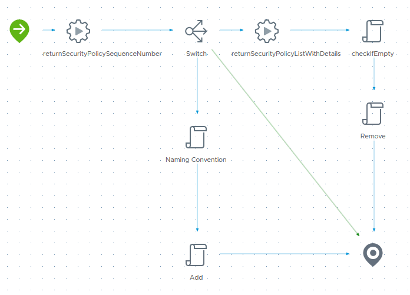

##### vRO Actions

| **Action Name**                     | **Package Name**              | **Description**                                             |
|-------------------------------------|-------------------------------|-------------------------------------------------------------|
| `returnSecurityPolicySequenceNumber`| net.atos.dhc.firewall.manage   | Returns the sequence number for the security policy          |
| `returnSecurityPolicyListWithDetails`| net.atos.dhc.firewall.manage  | Returns the list of security policies with details           |
| `getVaultToken`                     | net.atos.dhc.automation        | Retrieves Vault token for API authentication                 |
| `getVaultSecretData`                | net.atos.dhc.automation        | Retrieves NSX-T credentials from Vault                       |
| `base64PassEncode`                  | net.atos.dhc.automation        | Encodes credentials for REST API requests                    |

---

##### Key Workflow Logic

###### ADD Action

1. **Authentication**: The system retrieves Vault credentials for NSX-T API authentication.
2. **Policy Name Generation**: The workflow generates the security policy name based on tenant details and priority level.
3. **REST API Call**: A REST API call is made to NSX-T to create the new security policy.
4. **Validation**: The system checks if the policy was successfully created. If any issues arise, the error is logged, and no further action is taken.

###### REMOVE Action

1. **Security Policy List**: The workflow retrieves the list of available security policies from NSX-T.
2. **Validation**: It checks if the selected policy is empty (i.e., has no active rules) before proceeding.
3. **REST API Call**: If validation passes, a REST API call is made to remove the selected security policy from NSX-T.
4. **Final Check**: The system validates that the policy has been successfully removed.

---

##### Custom Form Structure

The form used in the **Add or Remove Security Policy** service request is dynamic, changing its fields based on the action selected (`ADD` or `REMOVE`). Below is an outline of the form layout and fields:

- **Page**: Manage
  - **Section 1: Action Selection**
    - **Field**: `action` (DropDown) – Select the action type (`ADD` or `REMOVE`).
  - **Section 2: Priority**
    - **Field**: `priority` (DropDown) – Visible only for `ADD`. Choose the priority level for the new security policy.
  - **Section 3: Security Policy Selection**
    - **Field**: `securityPolicy` (DropDown) – Visible only for `REMOVE`. Choose an existing security policy from the list to remove.
  - **Section 4: Security Policy Details**
    - **Field**: `securityPolicyDetails` (DataGrid) – Displays the details of the available security policies in NSX-T, including ID, name, sequence number, and creation details.

#### 6.3.3.4 Manage Security Policy Firewall Rule

##### Service Request Overview

The **"Manage Security Policy Firewall Rule"** SSR allows users to create, modify, or remove firewall rules within a security policy in NSX-T. This feature enables control over traffic flow by specifying sources, destinations, services, and the action taken when a rule is triggered.

- **ADD**: Create a new firewall rule within a security policy.
- **MODIFY**: Modify an existing firewall rule within a security policy.
- **REMOVE**: Remove a firewall rule from an existing security policy.

##### vRO Workflow Steps

Main steps for the **Manage Security Policy Firewall Rule** workflow:

1. Retrieve Vault credentials for NSX-T API authentication.
2. Determine the action (`ADD`, `MODIFY`, or `REMOVE`).
3. For **ADD**:
   - Create a new firewall rule with the specified name, source, destination, and services.
   - Authenticate with NSX-T API and apply the new rule to the security policy.
4. For **MODIFY**:
   - Retrieve existing rule details.
   - Modify the source, destination, services, or action of the rule.
   - Update the firewall rule in the NSX-T policy.
5. For **REMOVE**:
   - Validate the selected rule.
   - Authenticate with NSX-T API and remove the specified rule from the security policy.

##### Inputs

| **Input**                     | **Type**          | **Description**                                           | **Mandatory** |
| ------------------------------| ----------------- | --------------------------------------------------------- | ------------- |
| `actionType`                  | String            | Type of action (`ADD`, `MODIFY`, or `REMOVE`)              | Yes           |
| `securityPolicy`              | String            | Name of the security policy                                | Yes           |
| `chgNumber`                   | String            | Change number for the operation                            | Yes (for ADD) |
| `selectRule`                  | String            | Name of the rule to be modified or removed                 | Yes (for MODIFY, REMOVE) |
| `rulePosition`                | String            | Position of the rule (Priority: High, Mid, Low, etc.)      | Yes (for ADD, MODIFY) |
| `securityGroupSources`        | Array/String      | Security groups to be used as the source                   | No            |
| `securityGroupDestinations`   | Array/String      | Security groups to be used as the destination              | No            |
| `portList`                    | Array/Composite   | List of ports to be applied in the rule                    | No            |
| `servicesList`                | Array/String      | List of services applied in the rule                       | No            |
| `action`                      | String            | Action to take (`ALLOW`, `DROP`, `REJECT`)                 | Yes (for ADD, MODIFY) |

##### Workflow Schema

A logical overview of the **Manage Security Policy Firewall Rule** workflow is presented below.

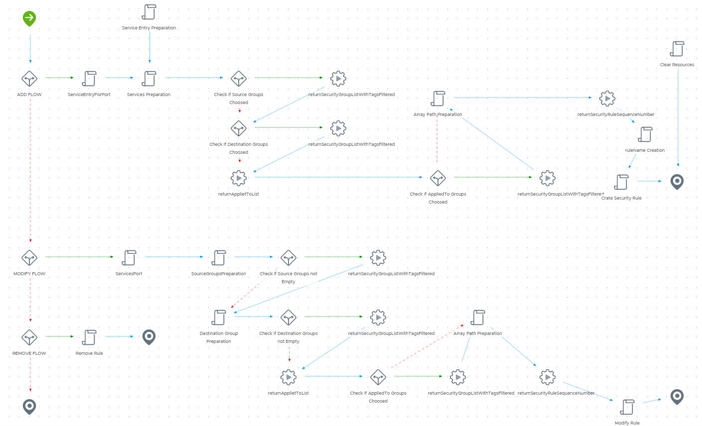

##### vRO Actions

| **Action Name**                           | **Package Name**              | **Description**                                                |
| ----------------------------------------- | ----------------------------- | -------------------------------------------------------------- |
| `returnSecurityPolicyList`                | net.atos.dhc.firewall.manage   | Returns the list of available security policies                 |
| `returnRuleFromPolicy`                    | net.atos.dhc.firewall.manage   | Returns rules from a selected security policy                   |
| `returnNSXServices`                       | net.atos.dhc.firewall.manage   | Retrieves the list of services available in NSX-T               |
| `returnSecurityGroupList`                 | net.atos.dhc.firewall.manage   | Returns the list of available security groups in NSX-T          |
| `returnSequenceNumberFromRule`            | net.atos.dhc.firewall.manage   | Returns the sequence number of a selected rule in the policy    |
| `getVaultToken`                           | net.atos.dhc.automation        | Retrieves Vault token for API authentication                    |
| `getVaultSecretData`                      | net.atos.dhc.automation        | Retrieves NSX-T credentials from Vault                          |

---

##### Custom Form Structure

The form used in the **Manage Security Policy Firewall Rule** service request is dynamic, changing its fields based on the action selected (`ADD`, `MODIFY`, or `REMOVE`). Below is an outline of the form layout and fields:

- **Page**: Manage Firewall Rule
  - **Section 1: Action Type Selection**
    - **Field**: `actionType` (DropDown) – Select the action type (`ADD`, `MODIFY`, or `REMOVE`).
  - **Section 2: Security Policy Selection**
    - **Field**: `securityPolicy` (DropDown) – Select the security policy to modify or apply the rule.
  - **Section 3: Change Number**
    - **Field**: `chgNumber` (TextField) – Enter the change number (Visible for `ADD`).
  - **Section 4: Rule Selection**
    - **Field**: `selectRule` (DropDown) – Select an existing rule to modify or remove.
  - **Section 5: Rule Position**
    - **Field**: `rulePosition` (DropDown) – Choose the rule's position (Visible for `ADD` and `MODIFY`).
  - **Section 6: Source Security Groups**
    - **Field**: `securityGroupSources` (DualList) – Select source security groups (Visible for `ADD`).
    - **Field**: `securityGroupSourcesAdd` (DualList) – Add source security groups (Visible for `MODIFY`).
    - **Field**: `securityGroupSourcesDel` (DualList) – Remove source security groups (Visible for `MODIFY`).
  - **Section 7: Destination Security Groups**
    - **Field**: `securityGroupDestinations` (DualList) – Select destination security groups (Visible for `ADD`).
    - **Field**: `securityGroupDestinationsAdd` (DualList) – Add destination security groups (Visible for `MODIFY`).
    - **Field**: `securityGroupDestinationsDel` (DualList) – Remove destination security groups (Visible for `MODIFY`).
  - **Section 8: Ports and Services**
    - **Field**: `portList` (DataGrid) – Specify source and destination ports for the rule.
    - **Field**: `servicesList` (DualList) – Select services for the rule.
  - **Section 9: Action**
    - **Field**: `action` (DropDown) – Select the action (`ALLOW`, `DROP`, `REJECT`) for the rule.

#### 6.3.3.5 Create NSX Services

##### Service Request Overview

The **"Create NSX Services"** SSR allows users to create a new NSX-T service by defining its name, protocol, and port details. The service can then be used in firewall rules and security policies.

##### Inputs

| **Input**                | **Type**             | **Description**                                           | **Mandatory** |
|--------------------------|----------------------|-----------------------------------------------------------|---------------|
| `serviceEntryType`        | String               | Type of the service entry (e.g., IPProtocol)               | Yes           |
| `newServiceEntryList`     | String               | Comma-separated list of service entries                    | Yes           |
| `newServiceName`          | String               | Name of the new NSX service                                | Yes           |
| `nestedService`           | Boolean              | Include nested services                                    | No            |
| `portsList`               | Array/CompositeType  | List of ports (type, source, destination)                  | No            |

##### Workflow Steps

1. **Initialize Variables**: The workflow sets up required variables like tenant details and NSX version to prepare for service creation.
2. **Prepare Service Entries**: It parses and processes the `newServiceEntryList` to build a list of service entries for the new service.
3. **Handle Nested Services** (Optional): If the `nestedService` option is enabled, the workflow includes nested services in the service creation process.
4. **Port Preparation** (Optional): If ports are provided, it processes the ports using the `portsList` input.
5. **Create Service in NSX-T**: The workflow creates a new service in NSX-T using the provided service details and credentials for API authentication.

##### Workflow Schema

Here is a representation of the workflow's logic:

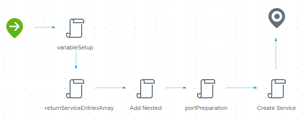

---

##### Key Workflow Logic

- **Service Entry Handling**: The workflow splits the `newServiceEntryList` and processes each entry based on its type (e.g., IPProtocol, EtherType, etc.). It maps these types to protocols and additional properties based on NSX protocol settings.
  
- **Authentication**: The workflow uses Vault to retrieve NSX credentials and authenticate the API request for creating the service.

- **REST API Request**: Once the service entries are processed, the workflow sends a PATCH request to the NSX-T API to create the service, including any custom ports or nested services if applicable.

- **Logging & Error Handling**: The workflow logs the details of the service creation process and handles errors related to missing inputs, failed API calls, or issues with Vault authentication.

##### Custom Form Structure

The custom form used in the **Create NSX Services** request is dynamic. Below is an outline of the form fields and their behaviour:

- **Page**: General
  - **Section 1: Service Details**
    - **Field**: `newServiceName` (TextField) – Enter the name for the new NSX service.
    - **Field**: `serviceEntryType` (DropDown) – Select the type of service entry.
    - **Field**: `serviceEntryExtraProperties` (DropDown) – Choose extra properties specific to the service entry type.
  - **Section 2: Service Entry List**
    - **Field**: `newServiceEntryList` (TextField) – Displays the current list of service entries.
    - **Field**: `apply` (Checkbox) – Add the current service entry to the list.
  - **Section 3: Nested Services**
    - **Field**: `nestedService` (Checkbox) – Enable nested services if desired.
    - **Field**: `nestedServiceList` (DualList) – Select nested services to include.
  - **Section 4: Custom Ports**
    - **Field**: `addPorts` (Checkbox) – Enable the addition of custom ports to the service.
    - **Field**: `portsList` (DataGrid) – Add and define custom ports for the service.

---

### 6.3.4 Installation

The installation procedure is fully automated via Ansible playbook and consists of following steps:

1. Ensure **vRO contains latest code** pulled from the workflows repository.
2. Validate if **Vault credentials for NSX-T are stored** in HashiVault.
3. **NSX-T API endpoints** are set up in vRO config.
4. **REST hosts** for API communication with NSX-T are configured on vRO level.
5. Ansible playbook **createNsxtSsrsBroker.yml** is executed and succeeded.

Estimated installation time: **2-4 hours** depending on the complexity of the SSR being deployed.

## 6.4 Manage VM Tags

### 6.4.1 High-Level Description

The **Manage VM Tags** workflow streamlines the management of tags associated with virtual machines (VMs) in environments using NSX-T and vRA. It enables the dynamic addition, removal, and modification of VM tags, ensuring consistency between desired and actual tag configurations.

Tags are crucial for defining policies, permissions, and micro-segmentation rules in NSX-T and vRA environments. This workflow dynamically interacts with APIs and automates handling of discrepancies between tag sets.

### 6.4.2 Prerequisites and Dependencies

#### Prerequisites

- **NSX-T Configuration:**
  - Ensure NSX-T is configured and accessible via API endpoints.
  - A valid Vault server must store NSX-T credentials for secure access.

- **vRA/vRO Integration:**
  - Ensure vRA and vRO instances are integrated and operational.
  - REST hosts for vRA and NSX-T APIs should be preconfigured.

- **vAPI Endpoint:**
  - Ensure the vAPI endpoint is configured in vRO to interact with vCenter for VM tagging.

- **Vault Configuration:**
  - Set up a `SSRConfig` configuration element in vRO to store Vault server details, including:
    - Vault username and password
    - Vault server and port
    - Path to NSX-T credentials in Vault

#### Dependencies

- **vRO Actions:** The following actions must be available:
  - `getVaultToken`: Retrieves a token for Vault authentication.
  - `getVaultSecretData`: Retrieves credentials securely from Vault.
  - `base64PassEncode`: Encodes credentials for API authentication.
  - `getBearerPython`: Generates a bearer token for vRA API calls.
  - `getVMInstanceTagsByUUID`: Retrieves current tags for a VM by its UUID.

- **API Access:** Which Api is Used for access:
  - `NSX-T API`: for managing tags.
  - `vRA API`: for validating and updating tags.

### 6.4.3 Workflow Overview

#### Purpose

The **Manage VM Tags** workflow ensures consistent tagging for VMs by:

1. Retrieving current tags from NSX-T and vRA.
2. Merging desired tags with user-specified tags.
3. Validating discrepancies between desired and actual tags.
4. Dynamically updating tags to match the desired state.

#### Workflow Logic

The workflow operates in the following phases:

1. **Input Validation:**
   - Ensures all mandatory inputs are provided.
   - Validates NSX-T and vRA configurations using stored credentials.

2. **Variable Setup:**
   - Retrieves credentials from Vault and constructs authentication tokens for NSX-T and vRA APIs.
   - Determines appropriate API endpoints for NSX-T based on its version.

3. **Tag Preparation:**
   - Merges NSX-T tags (`nsxTags`) with additional tags (`otherTags`) provided as input.
   - Prepares tags in the required key-value format for API interactions.

4. **Tag Consistency Check:**
   - Retrieves current VM tags from NSX-T or vRA APIs.
   - Compares desired tags with existing tags to identify discrepancies.

5. **Tag Update:**
   - **Add Tags:** Creates and attaches missing tags to the VM.
   - **Remove Tags:** Detaches unnecessary tags.

6. **Final Validation:**
   - Verifies successful application of desired tags.
   - Logs discrepancies or failures for debugging and audit purposes.

### 6.4.4 Inputs

| **Input**              | **Type**                                      | **Description**                                                   | **Mandatory** |
|-------------------------|-----------------------------------------------|-------------------------------------------------------------------|---------------|
| `vm`                   | String                                        | VM instance identifier (UUID)                                    | Yes           |
| `vmName`               | String                                        | Name of the virtual machine                                       | Yes           |
| `nsxTags`              | Array/CompositeType(Scope:String, Tags:String)| Tags associated with NSX-T, categorized by scope                 | Yes           |
| `vmInstanceUUID`       | String                                        | UUID of the VM instance                                           | Yes           |
| `otherTags`            | Array/CompositeType(Key:String, Value:String) | Additional tags defined as key-value pairs                       | No            |
| `vmObjectInstanceUUID` | String                                        | VM instance UUID used for identification in vRO                  | Yes           |

### 6.4.5 Workflow Steps

#### 1. **Variable Setup**

- Retrieve NSX-T credentials, API endpoints, and vRA configuration from the `SSRConfig` configuration element.
- Validate credentials using `getVaultToken` and retrieve NSX-T passwords using `getVaultSecretData`.
- Construct authentication tokens:
  - **NSX-T:** Base64-encoded username and password (`base64PassEncode`).
  - **vRA:** Bearer token generated using `getBearerPython`.
- Determine the appropriate NSX-T API policy URI based on its version (`/policy/api/v1/infra` or `/policy/api/v1/orgs`).

#### 2. **Tag Preparation**

- Merge NSX-T tags (`nsxTags`) and additional tags (`otherTags`) into a unified key-value array.
- Format tags for compatibility with NSX-T API:
  - **Input Format:** `[{Scope: "scope1", Tags: "tag1"}]`
  - **Output Format:** `[{key: "scope1", value: "tag1"}]`
- Log the prepared tags for debugging.

#### 3. **Tag Consistency Check**

- Retrieve existing tags from NSX-T or vRA APIs:
  - **NSX-T:** Use `getNSXSecurityGroups` action or NSX-T REST API.
  - **vRA:** Use `getVMInstanceTagsByUUID` action or vRA REST API.
- Compare desired tags with existing tags:
  - Tags to add: Present in desired but not existing tags.
  - Tags to remove: Present in existing but not desired tags.

#### 4. **Tag Update**

- **Adding Tags:**
  - Use vAPI to create new categories or tags if necessary.
  - Attach new tags to the VM using NSX-T or vRA API calls.
- **Removing Tags:**
  - Detach tags from the VM that are no longer needed.

#### 5. **Final Validation**

- Verify that all desired tags are applied to the VM.
- Confirm removal of unnecessary tags.
- Log operation results.

### 6.4.6 Error Handling and Logging

- **Input Validation Errors:** Throw detailed errors for missing or invalid mandatory inputs.
- **API Errors:** Log API response codes and messages for failed operations.
- **Tag Discrepancy Logging:** Record mismatches between desired and actual tags for debugging.

### 6.4.7 Custom Form Structure

The custom form dynamically adjusts based on the provided input. Below is the structure:

- **General Information**
  - **VM Name:** Prepopulated, read-only field displaying the VM name.
  - **VM Instance UUID:** Input field for the UUID of the VM.
- **Tagging Details**
  - **NSX-T Tags:** Multi-field input for NSX-T tags by scope and tag name.
  - **Additional Tags:** Key-value input for extra tags.

### 6.4.8 Workflow Schema

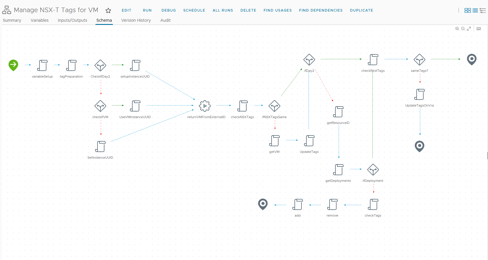

### 6.4.9 Key Workflow Logic

- **Validation:** Ensures required inputs meet configuration criteria.
- **API Interaction:** Dynamically interacts with REST and vAPI endpoints for tag management.
- **Dynamic Updates:** Resolves discrepancies in tag sets and updates them in real time.

### 6.4.10 Known Limitations

- The workflow requires accurate Vault and REST host configuration.
- NSX-T and vRA APIs must be accessible for proper operation.
- Vault misconfigurations may prevent authentication.

## 6.5 AVI ALB Blueprint Documentation

This document provides an overview of the vRA blueprint configuration for deploying an AVI Virtual Service, detailing how the inputs and resources interact, and guiding you through the process of configuring your desired scenario. The blueprint allows for flexible combinations of static or dynamic IP addresses, existing or newly created health monitors, and pools.

### 6.5.1 Overview

The blueprint:

- Defines AVI Virtual Services, Pools, Health Monitors, and VIP configurations.
- Supports existing or newly created health monitors and pools.
- Supports either a static or dynamic IP address to the Virtual Service.
- Allows specifying backend servers manually or select them from inventory.

By adjusting the inputs, various configurations can be easily updated to meet Customer needs.

### 6.5.2 How to Use This Blueprint

1. **Set the Network Type:**
   - **Static IP:** Provide a static IP in `ipAddress`.
   - **Dynamic IP:** Select a network and let the blueprint allocate an IP automatically.

2. **Choosing Health Monitors:**
   - If you want to reuse an existing health monitor, set `useExistingHealthMonitor: true` and select it.
   - Otherwise, pick a `health_monitor_type`. For `HEALTH_MONITOR_EXTERNAL`, supply the necessary command details.

3. **Choosing Pools:**
   - If you have an existing pool, set `useExistingPool: true` and select it.
   - If not, the blueprint can create a new pool and optionally attach a newly created health monitor.

4. **Server Assignments:**
   - Provide server IPs in `manualServers`, or
   - Enable `useVMSelection` to choose VMs from an inventory list.

In short, decide if you’re using existing resources or creating new ones, and whether your VIP is static or dynamic.

### 6.5.3 Inputs (Key Highlights)

- **port (int, default=80):** The port on which the VS and pool members receive traffic.
- **networkType (string, default=Static IP):** Choose "Static IP" or "Dynamic IP".
- **ipAddress (string):** Used if `networkType` is Static IP.
- **useExistingHealthMonitor (bool):** If true, select an existing health monitor.
- **health_monitor_type (string):** Choose from predefined types or external.
- **useExistingPool (bool):** If true, select an existing pool instead of creating a new one.
- **manualServers / selectedVMs (arrays):** Define backend servers either manually or by inventory selection.

### 6.5.4 Counts and Conditional Resource Creation

The count property on each resource ensures that the blueprint only creates what's needed based on your input selections. Understanding these conditions helps you predict the final infrastructure:

1. *Health Monitors:*
   - **StandardHealthMonitor:** Created if:
     - health_monitor_type is not HEALTH_MONITOR_EXTERNAL
     - useExistingHealthMonitor == false
   - **ExternalHealthMonitor:** Created if:
     - health_monitor_type == HEALTH_MONITOR_EXTERNAL
     - useExistingHealthMonitor == false

   In all other cases, count will be 0 and no new health monitor is created.

2. *Pools:*
   - **PoolNewHealthMonitorExternal:** Created if no existing pool or health monitor is used and the health monitor is external.
   - **PoolNewHealthMonitorStandard:** Created if no existing pool or health monitor is used and the health monitor is a standard type (HTTP, HTTPS, TCP, ICMP).
   - **PoolExistingHealthMonitor:** Only create this resource if useExistingPool is false and useExistingHealthMonitor is true.

   If useExistingPool == true, no new pool is created (count = 0 for these new pool resources).

3. *VIPs and Virtual Services:*
   - **VIPStatic:** Created if networkType == "Static IP".
   - **VIPDynamic:** Created if networkType == "Dynamic IP".

4. *Virtual Service* resources exist in various combinations:
   - **VirtualServiceExistingStatic/Dynamic:** Created if useExistingPool == true.
   - **VirtualServiceNewHealthMonitorExternalStatic/Dynamic:** Created if no existing pool/health monitor and an external type monitor is needed.
   - **VirtualServiceNewHealthMonitorStandardStatic/Dynamic:** Created if no existing pool/health monitor and a standard type monitor is needed.
   - **VirtualServiceExistingHealthMonitorStatic/Dynamic:** Created if no existing pool but using an existing health monitor.

   Each Virtual Service count is carefully calculated so that only one type of Virtual Service resource is created depending on your inputs. For example:
   - If you use an existing pool and a static IP, only VirtualServiceExistingStatic will be deployed.
   - If you create a new standard health monitor and choose a static IP, only VirtualServiceNewHealthMonitorStandardStatic will be deployed.

   This logic ensures that you end up with exactly one Virtual Service resource and the required supporting resources.

## 6.6 AVI ALB Day-2 Actions

### 6.6.1 High-Level Description

The **AVI ALB Day-2 Actions** workflow  provides a set of operations to manage AVI load balancer configurations. These post-deployment or "Day-2" actions enable administrators to dynamically modify load balancing pools, virtual services, and health monitors without requiring a full redeployment of infrastructure.

The key actions include:

1. **Add Servers to Pool**  
   Dynamically add backend servers (real servers) to an existing AVI pool.

2. **Change the Pool in a Virtual Service**  
   Update a virtual service configuration to point to a different backend pool.

3. **Modify Load Balancing Algorithm**  
   Change the load balancing algorithm of a given pool to optimize or alter traffic distribution.

4. **Change Health Monitors**  
   Modify or update the health monitor associated with a pool, ensuring that backend health checks are accurate and reflect current operational requirements.

### 6.6.2 Prerequisites and Dependencies

#### 6.6.2.1 VCS Prerequisites

- A fully configured and operational VCS platform with VMware vRealize Orchestrator (vRO) integration.
- A functioning AVI load balancer environment, reachable via the specified endpoint.

#### 6.6.2.2 License Requirements

- Valid licenses for vRA/vRO and AVI load balancer environment.
- No additional license is required beyond the existing endpoint integrations.

#### 6.6.2.3 vRO Prerequisites and Dependencies

- Ensure the workflow is imported into vRO.
- The `SSRConfig` configuration element for the VCS environment must be correctly populated.
- Ensure that the vRO is integrated with vRA and that the `dynamicRequest` REST host and required actions (e.g., retrieving AVI version, credentials, and AVI server URL) are configured in vRO.
- Authentication details for AVI must be stored securely (e.g., in HashiCorp Vault or a suitable password store) and retrievable by the workflow actions.

### 6.6.3 Detailed Logical Design

#### 6.6.3.1. Adding Servers to a Pool

**Overview:**  
This operation allows you to add additional servers (either provided directly or retrieved from a VM list) to an existing AVI pool. The workflow handles retrieving authentication details, logging in to the AVI controller, and updating the pool configuration via the AVI API.

**Workflow Steps:**

1. **Prepare Variables:**

   Retrieve AVI version, credentials, and the AVI controller URL from the configuration elements and custom vRO actions.

2. **Add Servers to Pool:**

   - Combine the input server list with the VM list.
   - Log in to the AVI controller using REST-based authentication.
   - Update the specified pool by adding the provided servers through a `PUT` request.

**Inputs:**

| Parameter     | Type          | Description                                  | Mandatory |
|---------------|---------------|----------------------------------------------|-----------|
| `pool`        | String        | The name of the AVI pool to modify           | Yes       |
| `addServer`   | Boolean       | Flag to indicate if servers should be added  | Yes       |
| `serverList`  | Array/String  | List of server IP addresses to add           | No        |
| `vmList`      | Array/String  | List of VM IP addresses to add               | No        |

**Key vRO Actions:**  

- `getAVIVersion()` to retrieve AVI versioning details.
- `getAviCreds()` for obtaining the AVI credentials from a secure store.
- `configElement("DHC", "SSRConfig", "aviServer")` to get the AVI controller hostname/IP.

#### 6.6.3.2. Managing Virtual Services

**Overview:**  
You can dynamically point a virtual service to a different backend pool without re-deploying the entire environment.

**Workflow Steps:**

1. **Check Manage VS Flag:**  
   If `manageVS` is true, proceed.
2. **Retrieve Current VS Configuration:**  
   Log in and fetch the current virtual service object from AVI.
3. **Modify the Pool Reference:**  
   Change the `pool_ref` property of the virtual service to the new pool.
4. **Update the Virtual Service:**  
   Issue a `PUT` request to AVI to apply the changes.

**Inputs:**

| Parameter        | Type    | Description                                       | Mandatory |
|------------------|---------|---------------------------------------------------|-----------|
| `manageVS`       | Boolean | Flag indicating if the virtual service should change its pool | Yes |
| `virtualService` | String  | The unique identifier of the virtual service      | Yes       |
| `pool`           | String  | The new pool name to associate with the VS        | Yes       |

#### 6.6.3.3. Changing the Load Balancing Algorithm

**Overview:**  
Modify the load balancing algorithm (e.g., round-robin, least-connections) used by an existing pool. This can be beneficial for optimizing traffic distribution based on evolving application needs.

**Workflow Steps:**

1. **Check Change LB Flag:**  
   If `changeLB` is true, proceed.
2. **Log In to AVI:**  
   Authenticate to the AVI controller.
3. **Update Pool Algorithm via PATCH:**  
   Send a `PATCH` request to adjust the `lb_algorithm` of the specified pool.

**Inputs:**

| Parameter     | Type    | Description                     | Mandatory |
|---------------|---------|---------------------------------|-----------|
| `changeLB`    | Boolean | Indicates if LB algorithm change is required | Yes |
| `lbAlgorithm` | String  | The new load balancing algorithm (e.g., LB_ALG_LEAST_CONNECTIONS) | Yes |
| `pool`        | String  | Name of the target AVI pool     | Yes       |

#### 6.6.3.4. Changing Health Monitors

**Overview:**  
Update the health monitor associated with a pool to ensure accurate health checks. Changing the health monitor can involve selecting different protocols or modifying ports and types.

**Workflow Steps:**

1. **Check Change Health Monitor Flag:**  
   If `changeHealthMonitor` is true, proceed.
2. **Log In to AVI:**  
   Authenticate to the AVI controller.
3. **Update Pool with New Health Monitor:**  
   Issue a `PUT` request to the AVI pool endpoint, specifying the `health_monitor_refs`.

**Inputs:**

| Parameter              | Type    | Description                                | Mandatory |
|------------------------|---------|--------------------------------------------|-----------|
| `changeHealthMonitor`  | Boolean | Indicates if the health monitor should be changed | Yes |
| `healthMonitor`        | String  | The identifier of the new health monitor    | Yes       |
| `pool`                 | String  | Target pool name for health monitor update  | Yes       |

### 6.6.4 Workflow Schema

Below is a logical representation of the workflow’s branching logic:

1. **variables Prepare**  
   - Retrieves AVI version, credentials, and URL.
2. **addServerToPool** (Decision)  
   - If `addServer` is true, proceed to update the pool servers.
   - Else, skip to next condition.
3. **putServersToPool**  
   - Adds servers to the pool if triggered.
4. **manageVirtualService** (Decision)  
   - If `manageVS` is true, proceed to modify the virtual service’s pool.
   - Else, move on to load balancing changes.
5. **ChangePool**  
   - Updates the virtual service to reference the chosen pool.
6. **changeAlgorithm** (Decision)  
   - If `changeLB` is true, proceed to change LB algorithm.
   - Else, move on to health monitors.
7. **change LB_Algorithm**  
   - Updates the pool’s load balancing algorithm.
8. **changeHealthMonitor** (Decision)  
   - If `changeHealthMonitor` is true, proceed to modify health monitors.
   - Else, end the workflow.
9. **changeHealthMonitor Task**  
   - Updates the pool’s health monitor references.

### 6.6.5 Installation and Configuration

1. **Import the vRO Workflow Package:**  
   Ensure the AVI Day-2 actions workflow is imported into vRO.
2. **Configure Credentials and Endpoints:**  
   - Set up the `SSRConfig` configuration element.
   - Store AVI credentials securely and retrieve them via `getAviCreds()`.
   - Configure `aviServer` property in `SSRConfig`.
3. **Test the Workflow:**  
   Run test executions with known pools and virtual services to confirm functionality.
