# Unified Testing Framework LLD

- [Unified Testing Framework LLD](#unified-testing-framework-lld)
- [1. Introduction](#1-introduction)
  - [1.1. Purpose](#11-purpose)
  - [1.2. Audience](#12-audience)
  - [1.3. Scope](#13-scope)
  - [1.4. Document location](#14-document-location)
  - [1.5. Related Documents](#15-related-documents)
  - [1.6. Requirement Levels](#16-requirement-levels)
- [2. Architecture Overview](#2-architecture-overview)
  - [2.1. Business and Solution Requirements](#21-business-and-solution-requirements)
  - [2.2. Platform Requirements](#22-platform-requirements)
  - [2.3. Permissions Requirements](#23-permissions-requirements)
  - [2.4. Network Requirements](#24-network-requirements)
- [3. Detailed Logical Design](#3-detailed-logical-design)
  - [3.1. Architecture details](#31-architecture-details)
    - [3.1.1. Architecture landscape](#311-architecture-landscape)
    - [3.1.2. GitHub pipeline](#312-github-pipeline)
    - [3.1.3. Private GitHub runner](#313-private-github-runner)
    - [3.1.4. Test runners](#314-test-runners)
    - [3.1.5. Interface for the tests](#315-interface-for-the-tests)
    - [3.1.6. Orchestrator](#316-orchestrator)
      - [3.1.6.1. Configuration](#3161-configuration)
    - [3.1.7. ALM Octane](#317-alm-octane)
    - [3.1.8. Branch-based test scoping](#318-branch-based-test-scoping)
      - [3.1.8.1. Initial design](#3181-initial-design)
  - [3.2. Logical Design Security](#32-logical-design-security)
    - [3.2.1. Logical Design Role Based Access Control](#321-logical-design-role-based-access-control)
      - [3.2.1.1. Design Decisions RBAC](#3211-design-decisions-rbac)
    - [3.2.2. Logical Design Firewall](#322-logical-design-firewall)
      - [3.2.2.1. Design Decisions Firewall](#3221-design-decisions-firewall)
  - [3.3. Availability and Scalability](#33-availability-and-scalability)
    - [3.3.1. Availability Design](#331-availability-design)
    - [3.3.2. Design Decisions - Availability](#332-design-decisions---availability)
    - [3.3.3. Scalability Design](#333-scalability-design)
      - [3.3.3.1. Design Decisions - Scalability](#3331-design-decisions---scalability)
  - [3.4. Recoverability](#34-recoverability)
    - [3.4.1. Component Failure](#341-component-failure)
      - [3.4.1.1. Design Decisions - Component failure](#3411-design-decisions---component-failure)
      - [3.4.1.2. Error handling](#3412-error-handling)
    - [3.4.2. Private GitHub runner recovery](#342-private-github-runner-recovery)
    - [3.4.3. Components recovery matrix](#343-components-recovery-matrix)
- [4. Detailed Physical Design](#4-detailed-physical-design)
  - [4.1. Repository](#41-repository)
  - [4.2. Pipeline](#42-pipeline)
    - [4.2.1. Pipeline workflow inputs](#421-pipeline-workflow-inputs)
    - [4.2.2. Pipeline environment variables](#422-pipeline-environment-variables)
  - [4.3. Tests runners](#43-tests-runners)
    - [4.3.1. Pytest](#431-pytest)
    - [4.3.2. Ansible](#432-ansible)
  - [4.4. Tests orchestrator](#44-tests-orchestrator)
  - [4.5. Tests interface](#45-tests-interface)
  - [4.6. Private GitHub runner](#46-private-github-runner)
    - [4.6.1. Private GitHub runner visibility](#461-private-github-runner-visibility)
  - [4.7. Tests cases management endpoints](#47-tests-cases-management-endpoints)
  - [4.8. Notification endpoints](#48-notification-endpoints)
  - [4.9. Reports](#49-reports)
    - [4.9.1. Test run reports](#491-test-run-reports)
      - [4.9.1.1. Pytest reports](#4911-pytest-reports)
      - [4.9.1.2. Ansible reports](#4912-ansible-reports)
  - [4.10. Security](#410-security)
    - [4.10.1. Role Based Access Control](#4101-role-based-access-control)
      - [4.10.1.1. Code Repository](#41011-code-repository)
      - [4.10.1.2. Pipeline secrets](#41012-pipeline-secrets)
    - [4.10.2. Secrets rotation](#4102-secrets-rotation)
      - [4.10.2.1. Runner service account](#41021-runner-service-account)
  - [4.11. Firewall](#411-firewall)
    - [4.11.1. Firewall Rules](#4111-firewall-rules)
  - [4.12. Software Versions and Licensing](#412-software-versions-and-licensing)
    - [4.12.1. Software versions](#4121-software-versions)
    - [4.12.2. Licenses](#4122-licenses)

# 1. Introduction

## 1.1. Purpose

The purpose of this document is to provide detailed design and architectural guidance required to implement Unified Testing Framework for VCS product in accordance with Atos standards and portfolio services.
The principal aim of this document is to translate the high-level design (HLD) into a technical low-level design (LLD).
Design provides a component architecture overview in Architecture Overview chapter that provides basic building blocks and main principles, followed by
Detailed Logical Design.
Architecture Overview provides basic building blocks and main design principles of presented design. It is covering known requirements cascaded from HLD and other LLDs.
Detailed Logical Design presents business logic and fundamental design decisions.
Detailed Physical Design provides detailed configuration of components.

## 1.2. Audience

This document is intended for Atos Engineers and Architects responsible for VMware Cloud Services (VCS) solution development and maintenance.

## 1.3. Scope

This LLD is intended to cover below components and domains:

1. Architecture design of the framework inside production and development environments
2. Architecture framework design to execute test case scenarios for VCF and non-VCF components.
3. Test Framework building blocks
4. Testing Framework pipeline design for automated tests (per environment type development or production)
5. Branch-based test scoping

   This LLD is not covering:
   - Design and development of Test cases scenarios using Pytest/Pytest BDD framework and Tox
   - Design and development of Pytest (Python) and Ansible scripts
   - Design and development of ALM Octane and integration
   - Design and development of features regression tests

## 1.4. Document location

This document is a subset of Atos Technology Lifecycle Management (ATLM) artefacts.
All documents are stored in the VCS documentation repository.

## 1.5. Related Documents

| Document Name                                     |
|---------------------------------------------------|
| [hldDigitalHybridCloud](hldDigitalHybridCloud.md) |
| [VCS Test cases](https://github.com/GLB-CES-PrivateCloud/DHC-Tests/develop/documentation/design/testcases/readme.md) |
| [Framework Onboarding](../workInstructions/dhcOnboardingUnifiedTestingFramework.md) |

## 1.6. Requirement Levels

This document is following the principles below to categorize all requirements and design decisions.

|    Term    | Meaning                                                                                                                                                                                                                                                         |
|:----------:|-----------------------------------------------------------------------------------------------------------------------------------------------------------------------------------------------------------------------------------------------------------------|
|    MUST    | The definition is an absolute requirement of the specification                                                                                                                                                                                                  |
|  MUST NOT  | The definition is an absolute prohibition of the specification                                                                                                                                                                                                  |
|   SHOULD   | There may exist valid reasons in particular circumstances to ignore a particular item, but the full implications must be understood and carefully weighed before choosing a different course                                                                    |
| SHOULD NOT | There may exist valid reasons in particular circumstances when the particular behaviour is acceptable or even useful, but the full implications should be understood and the case carefully weighed before implementing any behaviour described with this label |
|    MAY     | Any design decisions that are not classified as MUST and SHOULD or covering optional feature that is not general available for VCS product|

# 2. Architecture Overview

The Unified Testing Framework delivers automation components to run test scenarios for VCF and non-VCF components inside Production and Develop platforms.

Framework supports two types of VCS platforms:

- Production

- Development

Diagram 1. High Level overview of framework architecture for production platforms

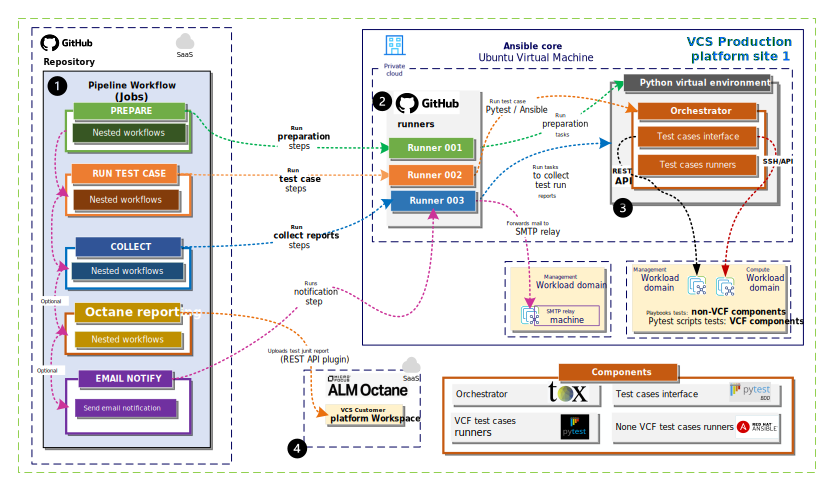

Diagram 2. High Level framework architecture overview for development labs

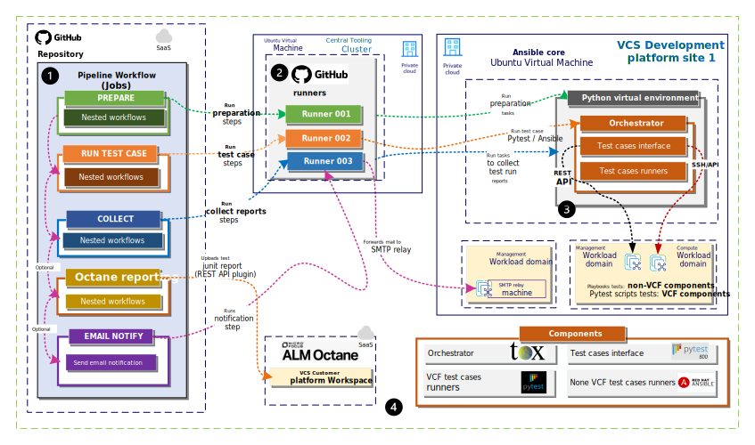

**The Framework built using below components as follows:**

1. Main pipeline workflow responsible to trigger subworkflows
2. Private GitHub runners responsible to trigger workflows steps on target VCS platform (on development labs environments runner installed on dedicated Linux Ubuntu virtual machine)
3. Ansible core instance with built dedicated Python virtual environment with core components
4. ALM Octane SaaS instance as test management endpoint **(optional)**

## 2.1. Business and Solution Requirements

The table below provides known requirements mandatory to be incorporated into design decisions of Unified Testing Framework described in this LLD.

Table 1. Initial Requirements

|  ID  | Requirement description                                                                                         | Requirement Source | Requirement Level |
|:----:|-----------------------------------------------------------------------------------------------------------------|:------------------:|:-----------------:|
| UTF001 | Framework use (self hosted) Private GitHub runners to remotely execute test cases |Solution|MUST|
| UTF002 | Framework use GitHub actions(workflows) to remotely execute tests |Solution|MUST|
| UTF003 | Framework use GitHub actions(workflows) under version control |Solution | MUST |
| UTF004 | Framework GitHub actions(workflows) are reusable |Solution | SHOULD |
| UTF005 | Framework supports to test VCF and non-VCF components |      Business      |       MUST        |
| UTF006 | Framework generates test runs reports compliant with Junit standard and human readable form (html format) | Solution| SHOULD |
| UTF007 | Framework supports to store test runs reports as artifacts inside Github repository | Solution| SHOULD |
| UTF008 | Framework supports to store test runs logs inside GitHub local runner instance  | Solution| SHOULD |
| UTF009 | Framework supports Ansible automation as test runner | Solution| MUST |
| UTF010 | Framework supports Pytest as test runner for VCF components | Solution | MUST |
| UTF011 | Framework supports Tox as orchestrator engine to execute test cases | Solution | MUST |
| UTF012 | Framework integrates with ALM Octane as test cases management endpoint and stores test cases run reports | Solution | SHOULD |
| UTF013 | Framework documentation, configurations, libraries, test cases scripts and definitions stored inside VCS repository |      Business      |      MUST       |
| UTF014 | Framework supports test cases run interface using Pytest BDD to define in human readable form test steps |      Business      |      MUST       |
| UTF015 | Framework use single centralized GitHub pipeline which execute test cases scenarios based on provided mandatory inputs                  |      Solution      |      MUST       |
| UTF016 | Framework supports to execute test case scenarios in parallel based on provided mandatory inputs |      Solution      |      MUST |
| UTF017 | Framework supports running tests on-demand, scheduled (weekly/monthly), and triggered by pull request merge |      Solution      |      MUST |
| UTF018 | Framework supports to run API and GUI tests  |      Business      |      MUST |
| UTF019 | Framework supports Branch-based test scoping  |      Business      |      MUST |
| UTF020 | Framework secrets defined inside respective repository that allows main pipeline workflows to fetch credentials |      Solution      |      MUST |
| UTF021 | Framework environment secrets uses naming convention:`{SITECODE}_{DASID}` (e.g.GRE42_AXXXXX) |      Solution      |      MUST |
| UTF022 | Framework repository access secrets uses naming convention:`REPO_{DASID}` (e.g.REPO_AXXXXX) |      Solution      |      MUST |
| UTF023 | Framework requires authorized GitHub Organization with Atos identity instance to enable Single-SignOn functionalities |      Solution      |      MUST |
| UTF024 | Framework repository access tokens requires authorization with Atos GitHub Organization(GLB-CES-PrivateCloud) |      Solution      |      MUST |
| UTF025 | Framework supports to run test scenarios inside isolated testing environment (Python virtual environment) |      Solution      |      MUST |

## 2.2. Platform Requirements

Table 2. Platform Requirements

|  ID  | Requirement description                                                                                         | Requirement Source | Requirement Level |
|:----:|-----------------------------------------------------------------------------------------------------------------|:------------------:|:-----------------:|
| UTFP001 | VCS management workload domain components are healthy  |Architecture|MUST|
| UTFP002 | Ansible core instance is accessible and healthy  |Architecture|MUST|
| UTFP003 | User account `next` is active under Ansible core instance |Architecture|MUST|
| UTFP004 | VCS platform proxy nodes are healthy and allows connection with GitHub SaaS platform |Architecture|MUST|
| UTFP005 | Customer platform proxy nodes are healthy and allows connection with GitHub SaaS platform |Architecture|MUST|

## 2.3. Permissions Requirements

Table 3. Permissions Requirements

|  ID  | Requirement description                                                                                         | Requirement Source | Requirement Level |
|:----:|-----------------------------------------------------------------------------------------------------------------|:------------------:|:-----------------:|
| UTFR001 |  Test engineer or integration architect have active user domain account (inside target VCS platform) which grants SSH access into remote Ans001 Linux Virtual machine|Architecture|MUST|
| UTFR002 |  Test engineer or integration architect have active GitHub user account with repository admin role to register / remove runners|Architecture|MUST|
| UTFR003 |  Test engineer or integration architect have active GitHub user account with proper role that allows to clone VCS repository, create branches, commit and merge changes|Architecture|MUST|
| UTFR004 |  Test engineer or integration architect have active GitHub user account with proper role that allows to run Framework pipeline workflows (GitHub actions) under VCS repository |Architecture|MUST|

## 2.4. Network Requirements

Table 4. Network Requirements

The following ports must be allowed within management network:

| Source Component                  | Destination Component             | Transport Protocol | Port         | Purpose                                                                 |
| --------------------------------- | --------------------------------- | ------------------ | ------------ | ----------------------------------------------------------------------- |
| Ansible core virtual machine     | VCS platform proxy virtual machines | TCP                | 443 |GitHub Actions Runners communication using VCS proxy with GitHub SaaS platform  |
| Ansible Core virtual machine     | VCS core management components | TCP                | 443 | Framework test runners communication with core management components |
| Ansible Core virtual machine     | VCS core management components | TCP                | 5986 | Framework test runners WINRM communication with VCS core management components for Windows |

# 3. Detailed Logical Design

The Unified Testing Framework allows from a centralized place (GitHub SaaS platform) to trigger test case scenarios which are validating VCS platform components (VCF and non-VCF). The framework uses baseline components like Private GitHub runners, Tox, Pytest, pytest-bdd (Behavior-Driven Development), and Ansible automation to simplify the build of the test cases and execute tests remotely on the target site. The framework intelligence is built based on GitHub reusable workflows and linked as a main central pipeline (single workflow). The framework contains logic to automatically prepare the testing environment with desired tests based on the provided repository branch.

The framework for the future will extend capabilities to validate developed new features and run tests as a part of release management.

## 3.1. Architecture details

Chapter describes framework logical details based on the architecture landscape diagrams.

### 3.1.1. Architecture landscape

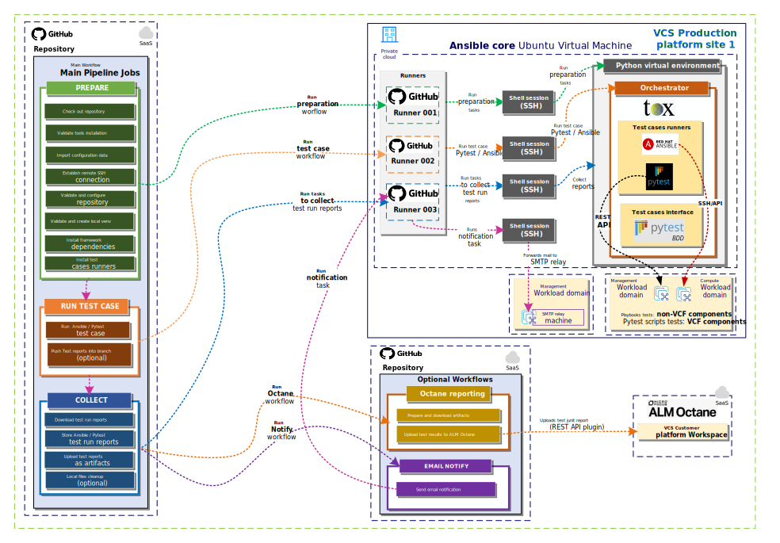

**Note:** Above diagram describes logic for production using self-hosted Private GitHub runners inside Ansible core instance.

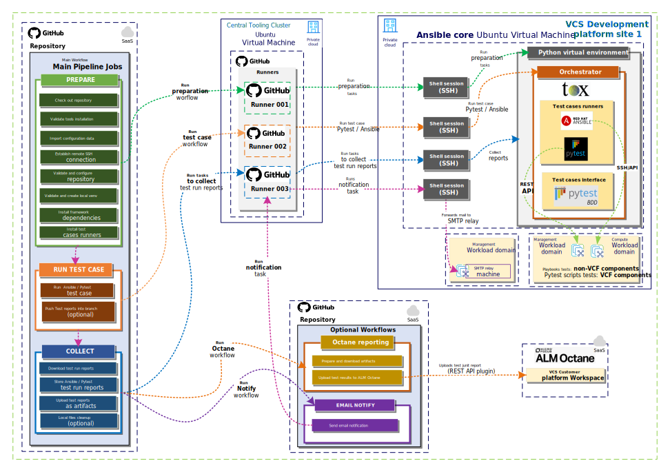

**Note:** Above diagram describes logic for development labs using single central self-hosted Private GitHub runners inside Tooling Cluster.

The following core parts of the logic:

**Main pipeline (workflow) that runs jobs (nested workflows):**

- Preparation (prepares test environment on target VCS platform)

- Run test case (Runs test cases on target VCS platform)

- Collect (Downloads test case run reports and stores as artifacts inside GitHub SaaS)

- Optional Octane reporting (Uploads generated test runs reports into Octane desired VCS workspace)

- Optional Email notification (Send email notification via VCS platform SMTP relay server)

**Private GitHub runners:**

- Handles requests to execute jobs steps on target VCS platform

**Test cases runtime environment on desired VCS platform:**

- Python dedicated environment for test cases execution

- Ansible dedicated environment for test cases execution

**Test Runners:**

- Pytest Python scripts for VCF components

- Ansible automation playbook for non-VCF components

**Test Orchestrator:**

- Tox framework to create isolated test environment

**ALM Octane SaaS test management endpoint**

### 3.1.2. GitHub pipeline

Framework pipeline acting as central component to start framework setup on target VCS platform and executes test cases based on provided inputs.

Diagram describes general architecture of the pipeline.

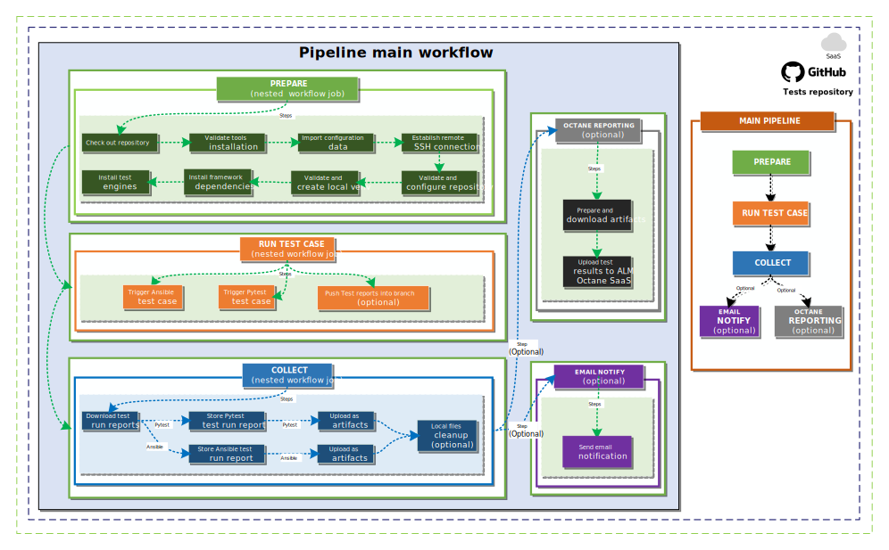

| Decision ID | Design Decision  | Design Justification | Design Implication|
|:-----------:|-------|----------|---------|
|     gp-001     | GitHub main pipeline use nested workflows to trigger preparation steps on target platform |Install and configure testing framework on remote site target Ansible core instance | Requires setup of the workflow inside GitHub instance |
|     gp-002     | GitHub main pipeline use nested workflows to execute test case scenarios based on provided inputs | Allow from central workflow to run multiple test cases based on the inputs| Requires setup of the workflow inside GitHub instance |
|     gp-003     | Nested workflows are stored inside repository main branch| Allow for future reuse and versioning | none                      |
|     gp-004     | GitHub pipeline requires to use encrypted secrets for nested workflows usage. | Secures sensitive credentials used by GitHub workflows jobs to authenticate with target Ansible core instances| Requires to store credentials as a secret inside GitHub repository|
|     gp-005     | GitHub main pipeline runs test cases on production or development environments| Allow from central workflow to execute test runs across multiple environments| Requires to deploy self-hosted runners for each environment |
|     gp-006     | Workflow needs to collect test case runs reports |Allow main pipeline (workflow) to collect test case run reports and store as artifacts| Uploaded test case runs reports as artifacts are expiring under GitHub SaaS instance |
|     gp-007     | Workflow needs to upload test case run reports into test management endpoints |Allow main pipeline (workflow) to download test case run report and store inside ALM Octane SaaS instance| Requires manual setup of ALM Octane integration |
|     gp-008     |  GitHub main pipeline requires to obtain mandatory user inputs before starts test case execution  |Dynamically obtain environment data and user credentials| Enduser requires to provide mandatory inputs for every main pipeline execution |

### 3.1.3. Private GitHub runner

Private GitHub runners delivers connection between main test repository instance and target VCS platform to execute test cases.

| Decision ID | Design Decision                                                                                                                       | Design Justification                       | Design Implication |
|:-----------:|---------------------------------------------------------------------------------------------------------------------------------------|--------------------------------------------|--------------------|
|     gr-001     | Private GitHub runner deployed as self-hosted instance for development labs under Central Tooling Cluster| Separate runner for development labs usage | Requires to deploy and configure dedicated Ubuntu Linux VM under Tooling Cluster|
|     gr-002     | Private GitHub runner deployed as self-hosted instance for production environments | Dedicated runner for production environment | Requires deployment of the runners using automation playbook |
|     gr-003     | Allow to run framework pipelines in parallel for production | Deploy multiple runner instances under single Ansible core instance for production environments | Requires deployment of the runners using automation playbook under Ansible core instance  |
|    gr-004     | Allow to run framework pipelines in parallel for dev labs | Deploy multiple runner instances under dedicated Linux Ubuntu VM inside Tooling Cluster | Requires deployment of the runners using automation playbook under dedicated Ubuntu Linux VM inside Tooling Cluster  |
|     gr-005     | Framework pipeline dynamically match production Private GitHub runner instance per platform site | Site code labels attached for production runner instances  | Automation requires to assign site code labels under each runner  |
|     gr-006     | Framework pipeline dynamically match development labs Private GitHub runner instance per platform site | Site code labels attached for dev labs runner instances  | Automation requires to assign site code labels under each runner |
|     gr-007     | Private GitHub runner instance follows site code label naming convention: `{{ platform type }}{{ site code }}` (examples label names: **prodgre42**, **devgre42**) | Labels allows to consume multiple runners per VCS platform site | Automation requires to assign site code labels under each runner |
|     gr-008     | Private GitHub runner service name follows naming convention: actions.runner.`{{ GitHub Organization Name }}-{{ Repository name }}.{{ Runner name }}`.service (example name: status actions.runner.**GLB-CES-PrivateCloud-DHC-Tests.devgre4201**) | Private GitHub runner service needs unique name | Automation playbook requires to use naming convention for runner service name |
|     gr-009     | Private GitHub runner name follows naming convention: `{{ platform type }}{{ site code }}{{ number }}` (example names: **prodgre4201**, **devgre4202**)  | Private GitHub runner name needs to be unique | Automation playbook requires to use naming convention for runner name |

### 3.1.4. Test runners

Tests runners delivers for the framework engines to execute test cases for VCF and non-VCF components.

Table 5. List of test runners applicable for the framework

| Runner name | Runner role|
| ------------| ---------- |
| Ansible | Execute tests using Ansible automation |
| Pytest | Execute tests using Python scripts |

| Decision ID | Design Decision                                                                                                                       | Design Justification                       | Design Implication |
|:-----------:|---------------------------------------------------------------------------------------------------------------------------------------|--------------------------------------------|--------------------|
|     tr-001     | Pytest runner executes tests using API for VCF components| Pytest delivers capabilities to write complex test cases using Python for VCF components  | Requires additional effort to develop test cases based on defined scenarios|
|     tr-002     | Ansible runner executes tests using SSH,WINRM or API for non-VCF components| Ansible delivers capabilities to write test cases using existing modules for non-VCF components | Requires additional effort to develop test cases based on defined scenarios|

### 3.1.5. Interface for the tests

To simplify development of the Python-test test cases framework uses common plugin called "Pytest Behaviour Driven Development(BDD)". Plugins allows to define Pytest test cases using language Gherkin which uses standard format "Given-When-Then".

| Decision ID | Design Decision                                                                                                                       | Design Justification                       | Design Implication |
|:-----------:|---------------------------------------------------------------------------------------------------------------------------------------|--------------------------------------------|--------------------|
|     in-001     | Pytest-BDD required to write Pytest test cases and scenarios using natural language | Pytest-BDD simplifies writing Pytest cases and scenarios| Requires additional effort for the developers to learn Pytest-BDD language structure|

### 3.1.6. Orchestrator

To deliver for the framework isolated test runs environments and single standard Tox orchestrator is used.
Tox allows to defined multiple virtual environments to run test cases across multiple versions of Python libraries, setup automation tasks before and post test runs.

| Decision ID | Design Decision                                                                                                                       | Design Justification                       | Design Implication |
|:-----------:|---------------------------------------------------------------------------------------------------------------------------------------|--------------------------------------------|--------------------|
|     or-001     | Deliver functionality to trigger test cases using different sets of Python versions and libraries | Tox orchestrator delivers solution builds isolated virtual Python environments for test cases| Requires additional effort for the developers to define virtual environment inside Tox configuration|
|     or-002     | Tox virtual environments defined to run Pytests | Dedicated Python virtual environments defined for Pytests per platform type | Requires additional effort for the developers to setup Tox.toml configuration|
|     or-003     | Dedicated Tox virtual environment to run tests cases using Ansible runner | Requires dedicated Tox virtual environment to isolate configuration and modules for Ansible runner | Requires additional effort for the developers to setup Tox.toml configuration|

#### 3.1.6.1. Configuration

Based on the requirement that framework needs to run the tests using isolated testing environment Tox orchestrator has been selected. To address that requirement has been defined few baseline configurations (tox.toml) per type of the run enginee (Pytest/Ansible) and testing environment (Dev/Prod) as follows:

**Example - baseline Pytest run engine configuration for Dev and Prod test environments:**

```Yaml
[tool.tox]
requires = ["tox>=4.19"]
env_list = ["prod", "dev"]

[env_run_base]
description = "Baseline environment for VCS tests using pytests"
passenv = [ "TEST_USER_PASSWORD", "TEST_USER_PASSWORD_JENKINS", "NO_PROXY", "HTTP_PROXY", "HTTPS_PROXY" ]
deps = [
    "pytest>=8",
    "-rrequirements.txt"  
]
allowlist_externals = ["test", "ansible-playbook", "mkdir"]
commands = [
    ["pytest",  "--self-contained-html", "--cucumberjson=cucumber.json", "--junitxml=junit.xml", "--jenkins_trigger", "--report_folder=TOX", "--alluredir=reports/allure", "--html=report.html" , { replace = "posargs", default = ["-vv"], extend = true }]
]
```

**Summary of baseline Tox configuration for PyTest run engine:**

- **tool.tox** Specifies prefix of test environments and Tox Python module minimal version.

- **env_run_base** Specifies environment variables to pass for isolated testing environment, Python modules dependencies, allowed external commands, commands and arguments to start PyTest run engine.

**Example - baseline Ansible run engine configuration for Dev test environments:**

```Yaml
[tool.tox]
requires = ["tox>=4.19"]
env_list = ["prod", "dev"]

[env.dev]
# Example TOX arguments for dev s=aria tox -m dev
description = "Dev lab env. tests with ansible playbooks"
labels = ["tests"]
passenv = [ "TEST_USER_PASSWORD", "TEST_USER", "NO_PROXY", "HTTP_PROXY", "HTTPS_PROXY" ]
change_dir = "ansible"

deps = [
       "-ransible/requirements.txt"
]
allowlist_externals = ["sh", "junit2html", "cd", "test", "ansible-playbook", "mkdir"]

commands_pre = [
    # 1. Create ansible logs folder
    ["mkdir", "-p", "{toxinidir}/logs_ans{envname}/"],
    # 2. Validate if exists playbook (i.e. dev-aria.yml)
    ["test", "-f", "{toxinidir}/ansible/tests/{env:s:base}/{envname}-{env:s:base}.yml"],
    # 3. Validate Ansible config
    ["ansible-playbook", "--version"]
]

commands = [
    # 8. Validate ansible configuration
    ["ansible-playbook", "{toxinidir}/ansible/tests/{env:s:base}/{envname}-{env:s:base}.yml", "-e", "username={env:TEST_USER}", "-e", "password={env:TEST_USER_PASSWORD}", "{posargs:-M {toxinidir}/ansible/modules/{envname}}"]
]
commands_post = [
    # 9. Html report generation
    ["sh", "-c", "last_xml_report=$(ls -t {toxinidir}/test-runs/ansible_{envname}/{envname}-{env:s:base}*.xml | head -1) && junit2html $last_xml_report {toxinidir}/test-runs/ansible_{envname}/{envname}-{env:s:base}_run_report.html"]
]
```

**Summary of baseline Tox configuration for Ansible run engine:**

- **tool.tox** Specifies prefix of test environments and Tox Python module minimal version.

- **env.dev** Specifies Dev lab environment variables to pass for isolated testing environment,Python modules dependencies, allowed external commands, pre test run commands, Ansible engine test run commands,post test run commands.

- **env.dev commands_pre..** Prepares proper folder structure for Ansible logs, Validate if playbook exists and show current version of Ansible

- **env.dev commands..** Execute command using ansible-playbook to run test playbook with extra arguments (user credentials,path into Ansible modules)

- **env.dev commands_post..** Execute command (junit2html) to generate html report based on xml test run reports

### 3.1.7. ALM Octane

ALM Octane as test cases management system is supported for integration with the framework.
ALM Octane delivers complex solution to store and managed test cases, contains reporting capabilities to capture results from each test case run and visualize them under dashboards. Allows to categorize test case runs per feature, branch, release and per application.

| Decision ID | Design Decision | Design Justification | Design Implication |
|:-----------:|----------------|----------------------|--------------------|
|     oc-001     | Support integration with test cases system management framework | ALM Octane delivers full management of test cases and support GitHub actions pipelines | Requires additional effort for the developers to integrate framework main pipeline with ALM Octane workspace|
|     oc-002     | Dedicated ALM Octane Workspace per production VCS platform | Dedicated workspace to limit view of test case runs applicable for the production platform | Requires additional effort for the developers to setup workspace inside ALM Octane instance|
|     oc-003     | Dedicated ALM Octane Workspace per dev labs | Dedicated workspace to limit view of test case runs applicable for the engineering | Requires additional effort for the developers to setup workspace inside ALM Octane instance|
|     oc-004     | Dedicated ALM Octane Workspace for new features test cases | Dedicated workspace to limit view of test case runs applicable for the engineering to test new features   | Requires additional effort for the developers to setup workspace inside ALM Octane instance|
|     oc-005     | ALM Octane Workspaces integrated with framework GitHub main pipeline | Dedicated workspaces integrated with GitHub main pipeline for the framework to capture results from each test case run | Requires additional effort for the developers to setup GitHub pipeline integration|
|     oc-006     | ALM Octane Workspaces requires definition for VCS features | VCS features defined inside workspaces are linked with desired test cases | Requires additional effort for the developers to defined features and link test cases|
|     oc-007     | ALM Octane Workspaces requires definition of application modules  | Test cases requires link with respective application modules | Requires additional effort for the developers to define application modules and link test cases|

### 3.1.8. Branch-based test scoping

The framework supports to trigger various test cases as part of wider scenario or small tests.
To accommodate design decision to support "Branch-based test scoping" framework currently only supports as follows:

- During the main pipeline execution (scheduled or manual) requires selection of the GitHub actions branch to define scope of main pipeline workflows to use and run per type of environment (prod / dev)

- During the main pipeline execution (scheduled or manual) requires selection of the branch to defined test cases scopes per feature, release and environment or other custom categories defined by tests architects

#### 3.1.8.1. Initial design

**Diagram describes initial design of "Branch-based test scoping" workflow to support tests per feature, release and environment in the future**

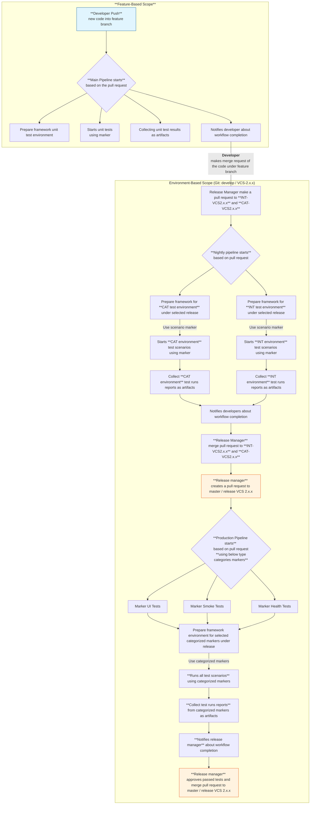

Table 6. Describes "Branch-based test scoping" workflow logic main steps

|  Order   | Step name | Outcome |
|:----:|:------------|:------------------|
| 1 | Developer push code into feature branch| Developed creates a pull request based on story branch to feature branch  |
| 2 | Framework starts tests| Based on the pull request from developer framework triggers test runs |
| 3 | Framework notifies developer| Developer receive notification and validate test runs passed |
| 4 | Developer review test runs reports| Developer merge pull request into feature branch (when tests passed)  |
| 5 | Release manager makes a pull requests based on merged feature branch | Release managed creates pull request into INT and CAT release branches  |
| 6 | Framework nightly scheduled pipelines starts | Based on pull request from Release manager scheduled pipelines starts to run |
| 7 | Framework prepares test run environments | Framework setup run test environment for INT and CAT |
| 8 | Framework start tests runs | Framework executes test scenarios based on markers under both run environments CAT and INT   |
| 9 | Framework notifies developer| Developer receive notification and validate test runs passed |
| 10 | Release manager merge pull requests | Release manager merge code into release INT and CAT branches |
| 11 | Release manager creates pull requests based on latest CAT branch| Release manager create pull request into master / release VCS version branch |
| 12 | Framework pipeline starts | Framework starts pipeline based on the pull request for production  |
| 13 | Framework prepares run test environment | Based on the categorized markers runs multiple test cases one by one |
| 14 | Framework notifies Release manager | Based on the pipeline workflow completion developer receives notification and validates test runs reports  |
| 15 | Release manager approve passed tests | Based on the tests runs reports Release manager approves and merge pull request to merge code into master / release VCS branch  |

| Decision ID | Design Decision                                               | Design Justification                                                                                                | Design Implication |
|:-----------:|---------------------------------------------------------------|---------------------------------------------------------------------------------------------------------------------|--------------------|
|   br-001    | Framework allows to run test cases scenarios based on the pull requests  | Framework main pipeline contains logic that execute workflows based on the pull request (created from branch)| Initiated main pipeline needs to automatically fetch markers and mandatory inputs from pull request description  |
|   br-002    | Pull request description needs to contain mandatory data | Pull request description contains site mandatory inputs and test markers | Requires to setup inputs inside pull request description (in semi-automated way) by developer or test engineer |
|   br-003    | Categorized test cases required  | Default categorize and test cases required to correctly test new feature for production  | Additional development effort to define categorized test cases feature tests for the production |
|   br-004    | Release manager needs to control process of the tests for the features  | Release manager controls code merge request for respective branches per tested feature  | Additional effort for Release manager to merge the code and validate test scenarios run reports |

## 3.2. Logical Design Security

### 3.2.1. Logical Design Role Based Access Control

Atos based solutions must guarantee proper access management for the framework. Following design decisions are made in that area.

#### 3.2.1.1. Design Decisions RBAC

| Decision ID | Design Decision                                               | Design Justification                                                                                                | Design Implication |
|:-----------:|---------------------------------------------------------------|---------------------------------------------------------------------------------------------------------------------|--------------------|
|   rb-001    | Access to main workflow pipeline requires limited permission under default repository branch | That will allow consistency with git workflow code inside default branch | Read role for repository workflows applied to only execute them |
|   rb-002    | Access to manage runners limited inside repository | Repo admin role applied for repository to allow integration architect to register runners for the production and dev labs platforms  | Requires manual effort to apply repo admin role for nominated integration architect during the framework onboarding process |
|   rb-003    | Access limited to repository secrets | Repo admin role applied for repository, allows to define new secrets during framework onboarding process only for authorized persons | Requires manual effort to apply repo admin role for nominated integration architect during the framework onboarding process |
|   rb-004    | Access limited to authorized engineers to clone repository, create branches, make commmits and push changes | Read, Write roles required to apply inside repository to use the framework pipeline | Requires manual effort to apply Read, Write role for nominated integration architect during the framework onboarding process and for test engineers in daily basis use |

### 3.2.2. Logical Design Firewall

This section covers all firewall related decisions influencing content of that LLD.

#### 3.2.2.1. Design Decisions Firewall

| Decision ID | Design Decision                                                        | Design Justification | Design Implication                        |
|:-----------:|------------------------------------------------------------------------|----------------------|-------------------------------------------|
|   fd-001    | Framework main pipeline and data is delivered as SaaS and are available via internet | SaaS services        | Strong implementation of RBAC is required |
|   fd-002    | Private GitHub runner requires connection into target remote site Ansible core instance| SSH traffic needs to be allowed | implement firewall rules  |
|   fd-003    | Private GitHub runner requires connection with GitHub SaaS instance using VCS proxies and Customer | HTTPS traffic needs to be allowed between runners and VCS proxy and Customer | Requires manual implementation of firewall rules inside VCS production platforms to allow HTTPS traffic into GitHub SaaS instance |

## 3.3. Availability and Scalability

### 3.3.1. Availability Design

The design decisions below are made to guarantee availability of framework components.

### 3.3.2. Design Decisions - Availability

| Decision ID | Design Decision                                                            | Design Justification          | Design Implication |
|:-----------:|----------------------------------------------------------------------------|-------------------------------|--------------------|
|   ad-001    | Multiple self-hosted(on-prem) Private GitHub runners deployed to deliver high availability | Each VCS production platform requires  to have installed minimum 3 instances of GitHub self-hosted runners |  Additional effort for integration architect to deploy additional runner using Ansible automation|

### 3.3.3. Scalability Design

#### 3.3.3.1. Design Decisions - Scalability

The framework supports scalability using Ansible automation playbook, that allows test engineers or integration architects to deploy or remove self-hosted Private GitHub runners on demand per VCS platform.

| Decision ID | Design Decision | Design Justification | Design Implication |
|:-----------:|-----------------|-------------|--------------------|
|   sd-001    | Scale up or down (self-hosted) Private GitHub runner instances for each VCS platform | Allow on demand to expand or decrease amount of the installed Private GitHub runners per VCS platform requires Ansible automation in place | Additional effort for integration architect to deploy or remove self-hosted Private GitHub runners using automation playbook |

## 3.4. Recoverability

The chapter below provides detailed design choices to protect against data loss and backup functionality and against Datacenter failure.

### 3.4.1. Component Failure

The framework built based on the Atos Organization GitHub SaaS instance, self-hosted(on-prem) Private GitHub runners installed inside each desired VCS platform under Ansible core Linux virtual machine(ans001).

To minimize impact that framework stops working for the below scenarios has been defined design decisions.

- Private GitHub runner instance fails (not responding)

- Private GitHub runner lost connection with GitHub SaaS platform

#### 3.4.1.1. Design Decisions - Component failure

| Decision ID | Design Decision                                                            | Design Justification          | Design Implication |
|:-----------:|----------------------------------------------------------------------------|-------------------------------|--------------------|
|   cf-001    | The framework always requires at least three instances of Private GitHub runner for each VCS platform | Multiple instances available of Private GitHub runner reduce framework components failures | Test engineer or integration Architect allowed to use automation playbook to deploy or recover Private GitHub runners|
|   cf-002    | Restore VCS platform management proxy server nodes from the data domain backup | VCS management proxy server nodes already included inside the daily backup | Test engineer or integration Architect needs automation playbook to recover proxy servers from backup in case of failures|
|   cf-003    | Ansible core Linux Virtual machine stored inside the backup on daily basis  | VCS platform backup solution ensures that Ansible core Linux VM has been covered  | Test engineer or integration Architect runs automation playbook to on demand Ansible core Linux Virtual Machine with Private GitHub runners |

#### 3.4.1.2. Error handling

To accommodate troubleshooting functionality every execution of the main pipeline and nested workflows are recorded inside GitHub workflow run logs (includes shell task commands) and can be exported.

The framework in current version have no functionalities to automatically self-heal or re-run failed tasks or send detailed errors using email notification.

The framework in current version only supports email notification about completion of entire test run workflow or failure.

Table 1. Error handling capabilities

|  Scenario| Retry logic| Logging | Cleanup logic | Email notification  |
| -------------- | -- | --------------- | ------------ | ------------ |
| Pipeline failure | No|Yes (stored inside workflow run) | No | No |
| Prepare workflow failure | No|Yes (stored inside workflow run) | No | No |
| Run test workflow failure | No|Yes (stored inside workflow run) | Yes | Yes |
| Collect workflow failure | No|Yes (stored inside workflow run) | No | No |
| Email notification workflow failure | No|Yes (stored inside workflow run) | No | No |
| Octane test report upload | No|Yes (stored inside workflow run) | No | No |

### 3.4.2. Private GitHub runner recovery

In case disaster scenario occurs and results that GitHub runners not available anymore on ans001 Linux Virtual Machin, make sure to follow onboarding procedure and install new sets of Private GitHub runners (see related documents chapter to following onboarding procedure).

**Note:** Make sure that engineer have active GitHub account with assigned Admin repo role for desired repository.

### 3.4.3. Components recovery matrix

|Component | Recoverable | Recovery type | Recovery Time |
| -------------- | -- | --------------- | ------------ |
| Framework pipeline (GitHub Actions) | Yes| Restore from main branch (history commits) | 10 min. |
| Framework libraries and configurations | No|Restore from main branch (history commits) | 10 min.|
| Framework test scenarios with libraries |Yes|Restore from main branch (history commits) |10min. |
| Private GitHub Runners | Yes | Restore using automation (re-deploy new instances) | 15min. per runner instance |
| Production Ans001 Linux instance | Yes | Restore from backup | 1hr per instance|
| Dev labs Central Tooling Ubuntu Linux instance | Yes | Restore from backup/re-deploy |2hr|
| Framework GitHub Actions secrets | Yes | Manual secrets update |15 min. per secret|
| Framework GitHub Actions environment variables | Yes | Manual variable re-creation |10 min. per variable|

# 4. Detailed Physical Design

This chapters describes in details all components used to build the framework and detailed design of the main pipeline with nested reusable workflows.

**The overview of main components used to build the framework**

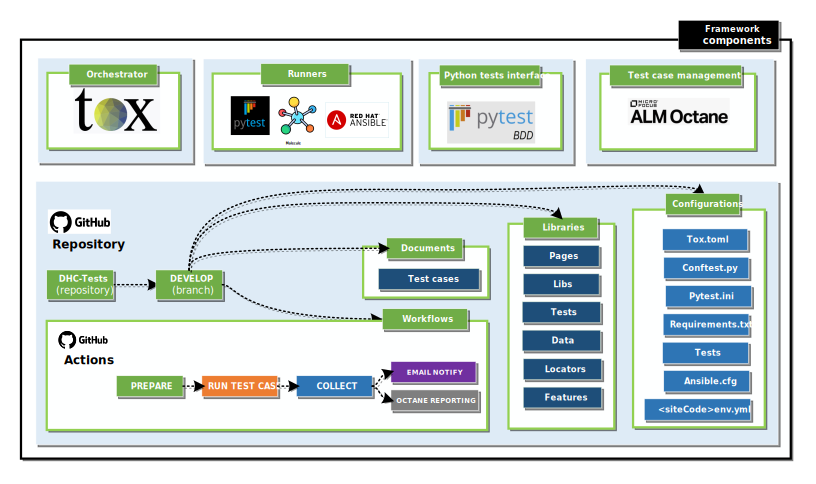

## 4.1. Repository

Based on design decision framework uses dedicated Github (SaaS) repository to stores main components and test cases libraries with scripts.

Currently the framework uses official Atos GitHub (SaaS) instance under organization **GLB-CES-PrivateCloud** and stores all components and libraries, scripts inside repository **DHC-Tests**.

Table 1. Describes framework main components stored inside the repository

|  Item no.   | Item | Location (folder) | Repository branch | Repository name |
|:----:|:------------|:--------------|--------------|--------------|
| 1 | Tox configuration file| ./| Develop | DHC-Tests|
| 2 | Pytest config files| ./| Develop | DHC-Tests|
| 3 | Pytest libraries| ./libs| Develop | DHC-Tests|
| 4 | Pytest unit tests| ./tests| Develop | DHC-Tests|
| 5 | Pytest-BDD (human readable tests definitions)| ./features| Develop | DHC-Tests|
| 6 | Ansible runner config | ./ansible/ansible.cfg| Develop | DHC-Tests|
| 7 | Ansible runner requirements | ./ansible/requirements.txt| Develop | DHC-Tests|
| 8 | Test environments (remote sites) configs| ./config | Develop | DHC-Tests|
| 9 | Selenium locators definitions| ./locators| Develop | DHC-Tests|
| 10 | Selenium pages definitions| ./pages| Develop | DHC-Tests|
| 11 | Ansible unit tests| ./ansible/tests| Develop | DHC-Tests|
| 12 | Pytest global fixtures config | ./pytest.conf| Develop | DHC-Tests|
| 13 | Pytest test cases fixtures global config | ./tests/conftest.py| Develop | DHC-Tests|
| 14 | Pytest test case fixtures local config | ./tests/`<test-name>`/conftest.py| Develop | DHC-Tests|
| 15 | Framework pipeline workflows | ./github/workflows| Develop | DHC-Tests|

## 4.2. Pipeline

The framework intelligence was built on the main workflow that handles the below steps:

- **Prepare** test environment on remote site
- **Runs** test case scenario on remote site (based on provider inputs)
- **Collect** test run report and stores as artifact inside GitHub repository
- **Optionally notifies** test run executor via email about workflow completion
- **Optionally uploads** test run report into desired ALM Octane workspace

Diagram 1. Describes general flow for the main pipeline

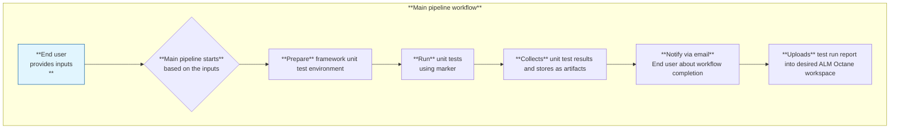

Table 7. Overview of main pipeline workflows

|  Run order| Workflow name| Workflow role | Workflow type | Run type  |
|:----:|:----|:------------|:--------------|--------------|
| 1a | Utf-pipeline.yml|Main pipeline to manually start test scenario run| Main | On call, On pull request |
| 1b | Utf-pipeline-schedule.yml |Main pipeline to schedule test scenario run| Main | On call, On pull request |
| 2 | utf-prepare.yml |Nested workflow to run preparation steps on remote site| Nested | On call|
| 3 | utf-testcaserun.yml |Nested workflow to start test scenario run| Nested |On call |
| 4 | utf-collect.yml |Nested workflow to collect test run reports| Nested | On call |
| 5 | utf-notify.yml |Nested workflow to collect test run reports| Nested | On call |

Diagram 8. Detailed flow for the main pipeline


Table 9. Main pipeline detailed flow for steps

|  Run order| Job name | Step name | Step role| Step mandatory |
|:----:|:----|:------------|:--------------|:--------------|
| 1 | Prepare |Checkout repository|Switch into desired repository on the runner| Yes |
| 2 | Prepare |Validate tools|Install on the runner tools| Yes|
| 3 | Prepare |Import configuration file|Validate and import configuration file for selected remote site|Yes |
| 4 | Prepare |Establish SSH connection|Establish SSH connection with remote site Ansible Linux VM| Yes |
| 5 | Prepare |Validate and configure repository| Configuring Git repository on remote vm and pull test cases| Yes |
| 6 | Prepare |Validate and create local venv| Validate and creates python virtual environment for test runners| Yes |
| 7 | Prepare |Install framework dependencies| Install python virtual environment modules dependencies| Yes |
| 8 | Prepare |Install test engines| Installing pytest and tox packages under virtual environment| Yes |
| 9a | Run |Trigger Ansible test case| Executing Ansible test case on remote site Linux virtual machine| Yes with Ansible marker |
| 9b | Run |Trigger Pytest test case| Executing Pytest test case on remote site Linux virtual machine| Yes with Pytest marker |
| 10 | Run |Push Test reports into branch| Uploads test report into desired branch| No |
| 11 | Collect |Download test run reports| Starts to download generated test scenario run reports to runner folder| Yes |
| 11a | Collect |Store Pytest test run report| Stores Pytest test run report inside local runner desired folder| Yes with Pytest marker |
| 11b | Collect |Store Ansible test run report| Stores Ansible test run report inside local runner desired folder| Yes with Ansible marker |
| 11c | Collect |Upload as artifacts| Stores Pytest test scenario run report as GitHub artifact | Yes with Pytest marker |
| 11d | Collect |Upload as artifacts| Stores Ansible test scenario run report as GitHub artifact | Yes with Ansible marker |
| 12 | Collect |Local files cleanup| Remove inside local runner entire folder for the tests and framework | No |
| 13 | Emailnotify |Send email notification| Based on the provided test executor email address send notification about pipeline workflow completion | No |
| 14 | Octane-reporting |Prepare and download artifacts| List and download test case scenario run reports (junit format) from artifacts | No |
| 14a | Octane-reporting |Upload test results| Upload test case scenario junit reports into ALM Octane SaaS (desired workspace) | No |

### 4.2.1. Pipeline workflow inputs

Chapter describes mandatory inputs for below pipeline workflows:

- Main pipeline to run manually test case scenarios from GitHub SaaS (Utf-pipeline.yml)
- Main pipeline to schedule run of test case scenarios from GitHub SaaS (Utf-pipeline-schedule.yml)

Table 1. Main pipeline (Utf-pipeline.yml) workflow inputs

|  No.|  Input name | Input description| Input mandatory |
|:----:|:------------|:--------------|:--------------|
| 1 | environment|Select environment (develop or production)| Yes |
| 2 | targetSiteCode|Environment site code (e.g.gre42)| Yes |
| 3 | vcs_version|VCS release version| No |
| 4 | branch|Branch to checkout| No (default develop) |
| 5 | myvenv|Python virtual environment name| No (mypytests) |
| 6 | sshuser|SSH user name for target site| Yes |
| 7 | email|Test executor email address| Yes |
| 8 | notify|Notify by email when test run completed| No |
| 9 | case_scope|Provide test case marker (i.e. vcs,vra,nsxt)| No (default marker all) |
| 10 | ansible_scenario|Provide Ansible test case scenario name (i.e. aria)| No (default marker off) |
| 11 | cleanup|Enable auto cleanup| No |
| 12 | ReportOnGit|Push test case reports to Github branch| No |
| 13 | octane|Octane integration enabled| No |
| 14 | pytest_args|Extra pytest args| No |

Table 10. Lists extra inputs used to schedule test case scenario (Utf-pipeline-schedule.yml)

|  No.|  Input name | | Step mandatory |
|:----:|:------------|:--------------|:--------------|
| 1 | timezone|Timezone (Europe/Warsaw, CET, EST, UTC...)| Yes |
| 2 | hour|Local Timezone Hour (0-23)| Yes |
| 3 | minute|Local Timezone minute (00-59)| Yes |
| 4 | frequency|Run frequency [daily, weekly, monthly]| No (default Daily) |
| 5 | end_date|Task schedule expiration date (RRRR-MM-DD) | Yes|

### 4.2.2. Pipeline environment variables

The framework (inside nested utf-octane.yml workflow) uses for ALM Octane integration static environment variables.

Table 1. List environment variable for Octane usage

|  No.|  Component | Variable name | Role | Mandatory |
|:----:|:------------|:--------------|:-------|:-------|
| 1 | Environment variable |OCTANE_URL| ALM Octane on-prem instance URL | Yes |
| 2 |Environment variable | OCTANE_SHARED_SPACE_ID|VCS Octane Sharedspace ID |Yes |
| 3 |Environment variable |OCTANE_WORKSPACE_ID | VCS Octane Workspace ID | Yes |

## 4.3. Tests runners

The framework install and setup tests runners on remote site under ans001 (Linux Virtual Machine) as engine to execute test cases based on provided marker (test case scope filter).

Currently the framework supports two types of the test cases run engines as follows:

- Pytest (only used to build Python tests for VCF components)
- Ansible (only used to build Ansible tests for non-VCF components)

**Note:** Both runners are always configured under dedicated Linux virtual environment to not break already installed Python modules.

### 4.3.1. Pytest

The runner is responsible to handle only Pytest test scenarios (supports test cases written using BDD plugin).

Pytest runner is installed and configured by preparation job (executed by main pipeline workflow).

Dependency modules for the runner are installed automatically under preparation job and modules definition stored inside the following location file under official repository in location `./develop/requirements.txt.`

### 4.3.2. Ansible

The runner is responsible only to handle Ansible test scenarios (doesn't supports test cases written using BDD plugin).

Pytest runner is installed and configured by preparation job (executed by main pipeline workflow).

Dependency modules for the runner are installed automatically under preparation job and modules definition stored inside the following location file under official repository in location `./ansible/requirements.txt.`

## 4.4. Tests orchestrator

The framework requires to use Tox tool to handle multiple types of the test environments.
Tox allows framework (based on defined configuration under `Tox.toml`) to setup nested Python virtual testing environment before the run. This approach allows testers to craft the testing environments based on the specific requirements like dedicated Python modules or Ansible modules to use for the test scenario runs.
Additionally Tox allows to define pre-commands and post-commands (per environment) to execute task before or after the test cases execution.

Diagram 1. Tox workflow and configuration detailed overview

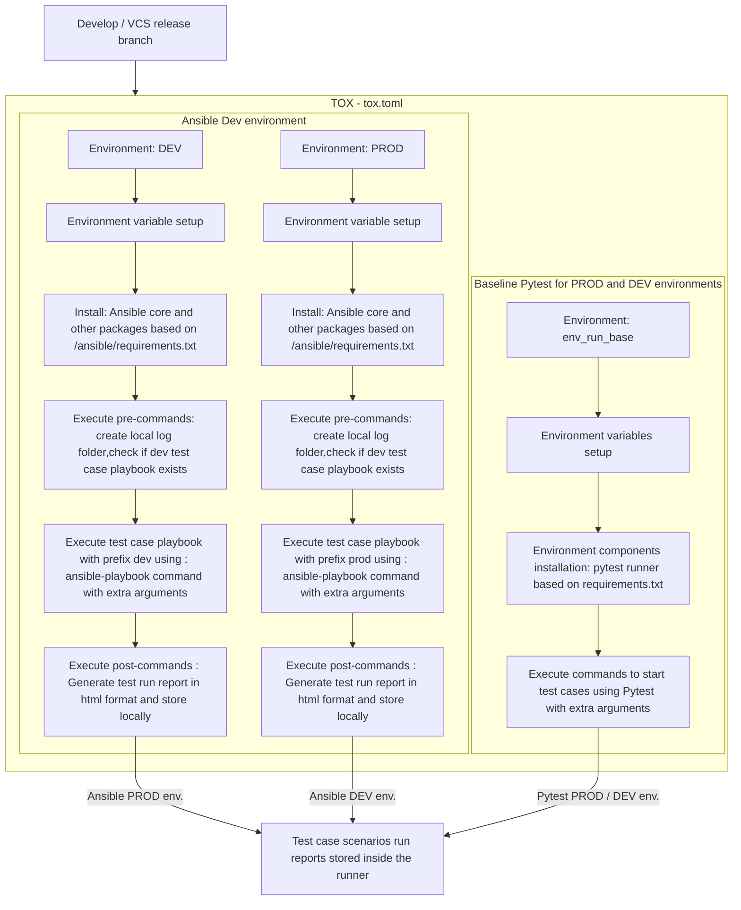

## 4.5. Tests interface

Based on the design decisions test case scenarios written in Python requires human readable definition to understand the logic.To accommodate requirements Pytest-BDD plugin is installed during the framework preparation step using requirements.txt file stored on main top repository level (by default inside branch develop).

Diagram 1. Describes architecture of Pytest-BDD used for the framework.

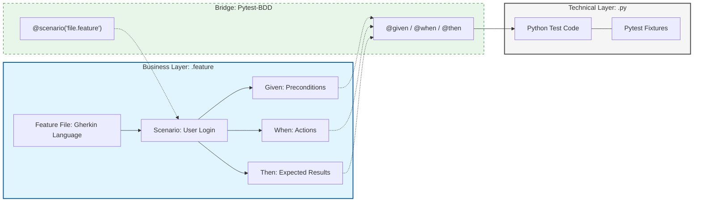

**Diagram Elements Explanation:**

Business Layer (Gherkin): This is the .feature file, which is readable for non-technical stakeholders. It describes what the system should do using the Given/When/Then syntax.
Bridge (Pytest-BDD): It uses decorators to "map" natural language sentences to specific Python functions. D1 binds the entire test to a scenario, while D2 links the individual steps.

Technical Layer (Python): This is where the actual test runners execute a Python code, to run the test case scenario based on marker.

Diagram 2. Example structure for Pytest-BDD used for the framework

```Yaml
develop/                     # main develop branch on repository
├── tox.toml                 # Tox configuration for testing environments
├── pytest.ini               # Main Pytest configuration file
├── features/                # Stores .feature files
│   └── login.feature        # Loging feature file with human readable scenarios
└── tests/                   # Folder stores Python code
    ├── __init__.py
    ├── conftest.py          # Shared fixtures
    └── test_login.py        # Code with scenarios steps definitions
```

## 4.6. Private GitHub runner

The framework requires to use Private GitHub runners to execute pipelines workflows (GitHub Actions).
To accommodate design decisions framework requires at least three runner instances, installed on target VCS platforms under Ansible core Linux Virtual Machines (ans001).

**The framework supports two models of Private GitHub runners usage for Production and Development labs.**

Diagram 1. Diagram describes Private GitHub runners usage for **VCS Production**

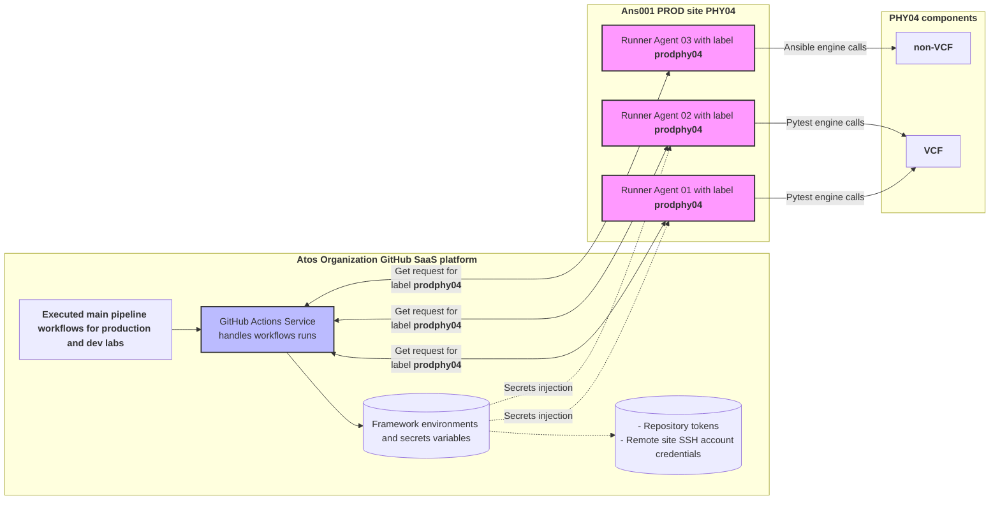

The diagram describes Private GitHub runner workflow with logic where the Ans001 Ubuntu Linux VM is used which hosts Private GitHub runner instances for the target Production environment. GitHub Actions service handle workflows runs and fetch secrets and environment variables.
Private GitHub runner instances contains dedicate labels per environment (e.g.`prodphy04`) that allows to trigger workflows in parallel.

Private GitHub runner instances always placed under desired Production environment inside Ans001 Linux VM and doesn't need to establish remote SSH connection. Shell commands are executed by the workflows inside Ans001 Linux VM per target Production environment.

Diagram 2. Diagram describes Private GitHub runners usage for **VCS Dev labs**

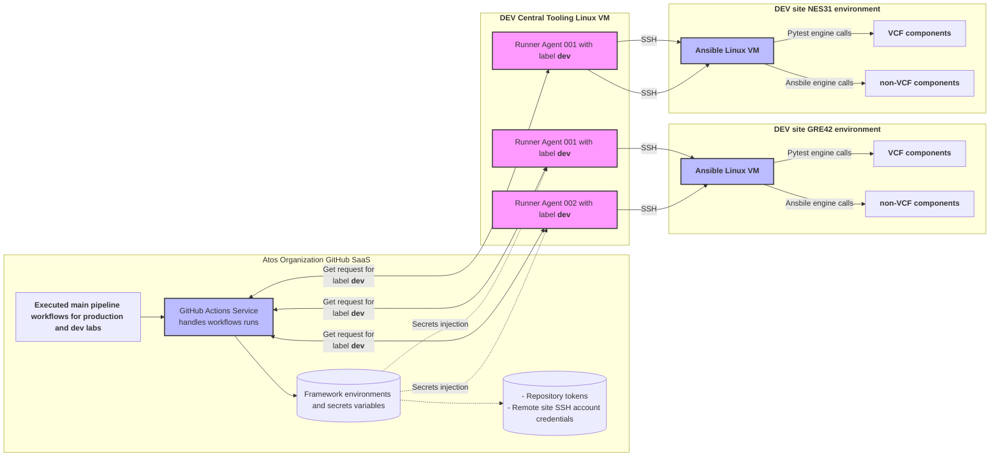

The diagram describes a private GitHub runner workflow, where a centralized Ubuntu Linux VM (under the Tooling Cluster) hosts private GitHub runner instances.
GitHub Actions service handle workflows runs and fetch secrets and environment variables. Private GitHub runner instances contains same label `dev` that allows to trigger main pipeline workflows in parallel.

Dev lab Private GitHub runner instances always establish remote SSH connection with Ansible (ans001) Linux VM (placed on target dev lab platform) to execute shell commands.

For both scenarios desribed inside above diagrams Private GitHub runners handle the below tasks:

- Framework preparation
- Test case run scenarios
- Post test case run tasks (collect test reports)
- Upload test report into Octane
- Send email notification

### 4.6.1. Private GitHub runner visibility

Every Private GitHub runner deployed by Ansible automation inside target on-prem environment (delivered as part of the framework onboarding procedure) registers own instance under single service inside respective VCS repository. Service name corresponds with design decisions and allows to validate runner services availability using example command: `sudo systemctl status actions.runner.GLB-CES-PrivateCloud-DHC-Tests.prodgre4201`.
Private GitHub runner name corresponds with design decisions as example: `prodgre4201`, every next runner instance registered inside the same target on-prem environment get same prefix name but with increased number as example: `prodgre4202`.

Additionally under (Atos Organization) VCS repository visibility of the runner connection can be tracked from location `settings/actions/runners`.

Table 1. List of runner instance status information

|  No.|  Runner example name | Status name |  Status result |
|:----:|:------------|:--------------|:-------|
| 1 | prodgre4201 |🟢 Green (Idle)| The runner instance connected and waiting to pick up its next job |
| 2 | prodgre4202 |🟡 Yellow (Active)| The runner instance connected and busy executing a workflow job |
| 3 | devphy0401 |🔴 Red / Gray (Offline)| The runner instance is disconnected. This usually means the runner service has stopped, the machine is powered down, or there is a network connectivity issue|

Table 2. Runner instances files and folders locations

|  No.|  Item name| Type | Location  | Functionality |
|:----:|:------------|:--------------|:-------|:-------|
| 1 | github-runners |Folder | /opt | Central place to store runners folders and files |
| 2 | actions-runner-prodgre4201 |Folder | /opt/github-runners | Runner instance main folder for production |
| 3 | actions-runner-devphy0401 |Folder | /opt/github-runners | Runner instance main folder for dev labs |
| 4 | Runner_{YYYYMMDD}-{dddddd}-utc.log |File | /opt/github-runners/actions-runner-prodgre4201/_diag$ | Diagnostic log file that stores mainly entries for connections/requests/processes |
| 5 | Worker_{YYYYMMDD}-{dddddd}-utc.log |File | /opt/github-runners/actions-runner-prodgre4201/_diag$ | Stores executed work jobs, environment variables setup, execution of shell commands, exit codes of failed commands |

**Note**: Based on the design decisions runner instances are deployed inside Ans001 Linux VM for VCS production platforms and under dedicated Ubuntu Linux VM for dev labs.

## 4.7. Tests cases management endpoints

The framework supports ALM Octane (on-prem) endpoint as test case management system.
ALM Octane (on-prem) allows the framework to store test runs scenarios reports and managed by modules (Quality, Pipelines and Requirements).

Diagram 1. Diagram describes how the framework uses ALM Octane(on-prem) integration

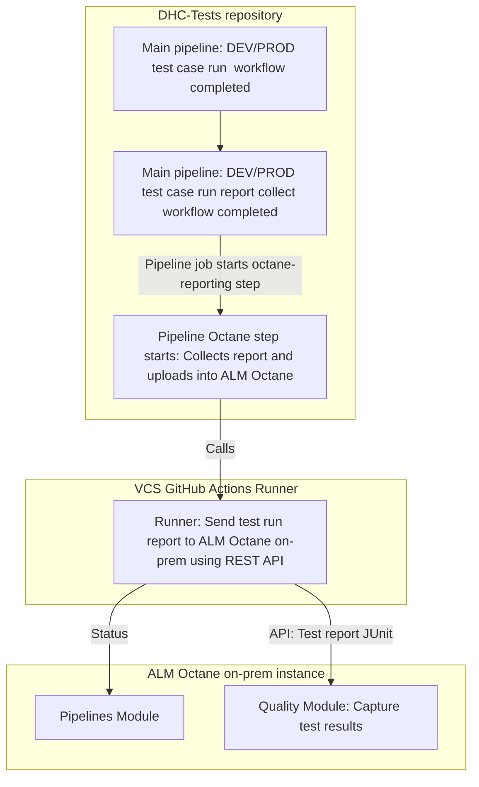

Table 11. List mandatory components and inputs to enable integration

|  No.|  Component | Input | Role | Mandatory |
|:----:|:------------|:--------------|:-------|:-------|
| 1 | Repository variable |OCTANE_URL| ALM Octane on-prem instance URL | Yes |
| 2 | Repository variable | OCTANE_SHARED_SPACE_ID|VCS Octane Sharedspace ID |Yes |
| 3 | Repository variable |OCTANE_WORKSPACE_ID | VCS Octane Workspace ID | Yes |
| 4 | Repository secret |OCTANE_CLIENT_ID | VCS Octane Workspace Client ID | Yes |
| 5 | Repository secret |OCTANE_CLIENT_SECRET| VCS Octane Client secret | Yes |
| 6 | Pipeline job Proxy parameter |proxy-host| VCS platform proxy FQDN | Yes |
| 7 | Pipeline job Proxy port parameter |proxy-port| VCS platform proxy port | Yes |
| 8 | Pipeline job path parameter into test report xml |./artifacts| VCS platform path into test report xml | Yes |

## 4.8. Notification endpoints

The framework supports to notify test executors only about main pipeline workflow completion.
Notification solution built based on GitHub workflow(utf-notify.yml) that contains dedicated Python script to send email using remote site local SMTP relay machine(srs).

For the security reasons SMTP details are stored inside repository secrets.

Table 12. Mandatory SMTP inputs stored inside the repository

|  No.|  Input name | Role | Mandatory |
|:----:|:------------|:--------------|:-------|
| 1 | MAIL_FROM|Email sender address name| Yes |
| 2 | SMTP_PORT|SMTP port| Yes |

## 4.9. Reports

The framework generates test runs report files to capture results for further investigation.
Main pipeline contains dedicated job (nested workflow) to collect reports and store them as GitHub artifacts.
Main pipeline generates two types of the reports in format html (human readable) and test case system management format Junit (xml), both types of the reports are generated and accessible under artifacts section (under main pipeline workflow run). Test run reports as artifacts always linked under each main pipeline workflow run and are accessible for short period of time (depends of Atos GitHub repository retention policy - default 1 day).

Table 13. List of generated reports with locations

|  No.|  Report name | Type| GitHub location | Self-hosted runner location |
|:----:|:------------|:--------------|:-------|:-------|
| 1 | octane-html-reports |Html| Workflow run artifacts | `$HOME/VCS-TESTS/reports/` |
| 1 | octane-xml-reports |Xml| Workflow run artifacts | `$HOME/VCS-TESTS/reports/` |

### 4.9.1. Test run reports

Chapter describes insights of the human readable test runs reports(html) generated by the framework during each test case scenario execution.

#### 4.9.1.1. Pytest reports

The framework by design generates for Pytest test scenarios reports in html format.
Every report generated by Pytest contains main parts, as follows:

- Title name of the reports (be default "ATOS VCS Test Report") with timestamp of execution ("Report generated on 13-Apr-2026 at 13:13:58")

- Environment table which describes Pytest components versions, VCS environment name, branch name and marker

- Summary table with detailed information about each test step results.
  Additonaly table contains summarization header to give overview of how many test steps passed, skipped, errors, reruns, expected or unexpected failures.

**Example summary table from test report**

| Result | Test Details | Description| Duration|
|:-----|:---------------|:-------------|:---------|
| **Skipped** |Feature->vcenter_auth.feature<BR>Scenario->Successful authentication<BR>Test->test_vcenter_auth.py<BR>Function->test_vcenter_authentication</BR>| vcenter/vcenter_auth.feature: Successful authentication | 18ms |
|**Passed** |Feature -> manageproject.feature<BR>Scenario -> Create New Project</BR>Test -> test_manageproject.py</BR>Function -> test_create_projects|**Feature**<BR>Projects<BR>Tests related to new project creation and Deletion Projects related operations are present in the service broker under infrastructure tab<BR>**Scenario**<BR>Create New Project<BR>**Steps**<BR>**Given** I have valid vRA credentials<BR>**When** I created Project based on file data<BR>**Then** The Project should be created successful</BR>| 10ms |
|**Passed** |Feature -> manageproject.feature<BR>Scenario -> Delete Project</BR>Test -> test_manageproject.py</BR>Function -> test_delete_projects|**Feature**<BR>Projects<BR>Tests related to new project creation and Deletion Projects related operations are present in the service broker under infrastructure tab<BR>**Scenario**<BR>Delete Project<BR>**Steps**<BR>**Given** I have valid vRA credentials<BR>**When** I deleted Project based on file data<BR>**Then** The Project should be deleted successful</BR>| 15ms |

**Pytest report column "Result" describes relationship between feature scenario and test function:**

**Pytest report column "Test Details" describes relationship between feature scenario and test function:**

- **Feature->[...]** describes definition of feature functionality tests (e.g.manage projects)

- **Scenario->[...]** describes single, specific test case within that feature (e.g.create a project)

- **Test->[...]** describes Python code script name where is defined run test logic (e.g.managedProjects.py)

- **Function->[...]** describes Python code function name which triggers test steps
 (e.g.test_create_projects)

**Pytest report column "Description" describes test steps:**

**Features** part points into file defined from business functionality perspective (in Gherkin language) regarding feature test steps

**Scenario->Delete Project** defines scenario step path when completes test with success under desired feature (in example successful deletion of vRA Project)

**Steps** part describe tests executed under desired feature scenario using breakdown steps as follows:

- **Given** means preconditions test execution tasks like environment setup, proper inputs defined etc. (e.g.Validates if vRA is accessible before running the test)

- **When** means actions (tasks) to execute main test (e.g.delete test vRA project)

- **Then** means executed test feature steps outcome (e.g.vRA project successfully deleted)

**Pytest report column Duration** describes feature tests execution runtime period**

#### 4.9.1.2. Ansible reports

The framework supports to generate html reports based on junit(xml) tests case runs executed using Ansible runner. Html reports are generated by junit2html transformer installed in testing environment.

Table 1. Describes main parts of the generated test report

| Item name | Example data | Item report role|
|:-----|:---------------|:-------------|
|Report title |Test Report : dev-telegrafvalidation-1774859386.3305938.xml| Describes Junit file test run report|
|Test suite |Test Suite: dev-telegrafvalidation| Human readable name of the test case playbook |
|Results |Duration 0.4 sec<BR>Tests 9<BR>Failures 1</BR>| Summarize test runs results|
|Tests |Test case:[localhost] Check vROPS Agent Status for Expected VMs: Get vROps credentials| Provides results about every single test step executed |
|Tests(stdout) |atos.dhc.readSecretVaultEntry (args={} vars={'_ansible_no_log': True}): [localhost]| Provides stdout details about every single test step executed |

**Example report data about multiple runs of test steps**

```Yaml
Test case: [localhost] Check vROPS Agent Status for Expected VMs: atos.dhc.readSecretVaultEntry: Obtain Vault token key using the account local to hashivault
Outcome: Skipped
Duration: 0.0sec
Failed None
Skipped None
```

```Yaml
Test case: [localhost] Check vROPS Agent Status for Expected VMs: Get vROps credentials
Outcome: Passed
Duration: 0.0sec
Failed None
```

```Yaml
Test case: [localhost] Check vROPS Agent Status for Expected VMs: atos.dhc.readSecretVaultEntry : Read user credential in secret path
Outcome: Failed
Duration: 0.0sec
Failed rc=0
```

## 4.10. Security

### 4.10.1. Role Based Access Control

Production environment is always separated from Atos Organization and GitHub SaaS instance, Endpoint, Code repository and binary repository level.

#### 4.10.1.1. Code Repository

Table 14. List mandatory custom repository roles

| Role Group Name | Functionality  | Environments|
|:-----|:---------------|:---------------|
| Testers        | Read role for repository workflow: they can't write, only execute workflows | Develop <br> Integration <br> CAT <br> Master |
| DevTesters      | Repo admin role have full access to Develop, Integration, CAT framework workflows. <br> Do not have merge and push rights for VCS code due to usage of protected branches | Develop <br> Integration <br> CAT <br> Master |
| FrameworkArchitect     | Read, Write,Repo admin roles applied into DEV, CAT, INT repository to enable framework integration | Develop <br> Integration <br> CAT <br> Master |

#### 4.10.1.2. Pipeline secrets

To accommodate design decisions framework pipeline workflows always fetch automatically the secrets from GitHub repository (Actions secrets and variables).
Access to defined pipeline secrets is only at GitHub repository level and allowed for members with role: `Repo admin`.

Diagram 1. Describes pipeline secrets structure with access level

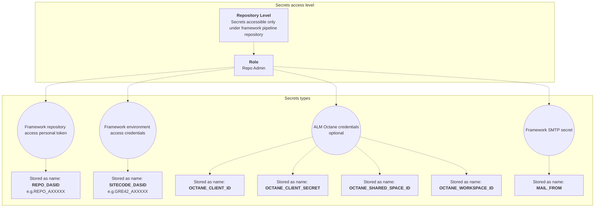

Table 15. Framework secrets

| Secret name | Type  | Mandatory|
|:-----|:---------------|:-----------|
| REPO_DASID | Repository access secret | Yes |
| SITECODE_DASID | Environment access secret | Yes |
| MAIL_FROM | Framework SMTP secret | Yes |
|OCTANE_CLIENT_ID | ALM Octane secret | No |
|OCTANE_CLIENT_SECRET | ALM Octane secret | No |
|OCTANE_SHARED_SPACE_ID | ALM Octane secret | No |
|OCTANE_WORKSPACE_ID | ALM Octane secret | No |

### 4.10.2. Secrets rotation

The framework in current version doesn't support to automatically rotate secrets described inside chapter "Pipeline secrets". Based on the design decisions is mandatory to rotate framework secrets accordingly the below table.

**Note:** After successfull rotation new secrets should be always stored inside respective repository.

Table 16. Secrets rotation matrix

| Secret name | Type  | Rotation period| Mandatory | Rotation responsibility|
|:-----|:---------------|:-----------|:-----------|:-----------|
| REPO_DASID | Repository access secret (repository access personal token) | Quarterly | Yes | Secret owner |
| SITECODE_DASID | Environment access secret (domain user account credentials) | Quarterly | Yes | Secret owner |
|OCTANE_CLIENT_SECRET | ALM Octane secret |Quarterly | No | Secret owner - integration architect |

#### 4.10.2.1. Runner service account

Private GitHub runner instances installed inside respective Ubuntu (ans001) Linux Virtual Machines. Based on the designs decisions runner service works using next account on each target (ans001) Linux Virtual machine. To accommodate design decision for account rotation make sure to rotate next account password quarterly.

## 4.11. Firewall

### 4.11.1. Firewall Rules

| Service/Traffic Name             | Source                                                                     | Destinations                                                                                                                                                                                     | Port(s) | Protocol |
|----------------------------------|----------------------------------------------------------------------------|--------------------------------------------------------------------------------------------------------------------------------------------------------------------------------------------------|---------|----------|
| HTTPS |Ansible core virtual machine | Atos Organization GitHub SaaS platform | 443| TCP|
| HTTPS | Private GitHub runner | *.github.com| 443  | TCP |
| WINRM | Ansible core Linux VM | VCF and non-VCF components| 5986  | TCP |
| SSH| Ansible core Linux VM | VCF and non-VCF components| 22  | TCP |

## 4.12. Software Versions and Licensing

Below software are certified by Atos and tested for the framework usage.

### 4.12.1. Software versions

| Name            | Release | Comments        |
|-----------------|---------|-----------------|
| Github SaaS     | Latest  | Delivered by Github |
| Private GitHub runner | Latest  | Delivered by Github   |
| Code Repository | Latest  | Atos dedicated repository |
| Python | 3.10  | Default Python module |
| Python3-venv | 3.10  | Python venv dependency module |
| Ansible core | 10.4.0 | Ansible core module |
| Pytest | 8.4.0| Python Pytest module |
| Pytest-BDD | 8.1.0| Python Pytest-bdd module |
| Pytest-selenium | 4.1.0 | Python Pytest-selenium module |
| Selenium | 4.16.0 | Python Selenium module |
| Tox | 4.26.0 | Python Tox module |

Below license models/types must be applied on corresponding elements

### 4.12.2. Licenses

The framework was built using various components that use common MIT license type, the below table list components per license type:

Table 17. License types for the framework components

| Component name  | License type | Comments        |
|-----------------|--------------|-----------------|
| Github SaaS     | Enterprise  | Atos Organization GitHub SaaS instance |
| Pytest | MIT License | - |
| Pytest BDD | MIT License | - |
| Tox | MIT License | - |
| Ansible core | GNU General Public License v3.0 (GPLv3) License | - |
| ALM Octane | Enterprise License | - |
