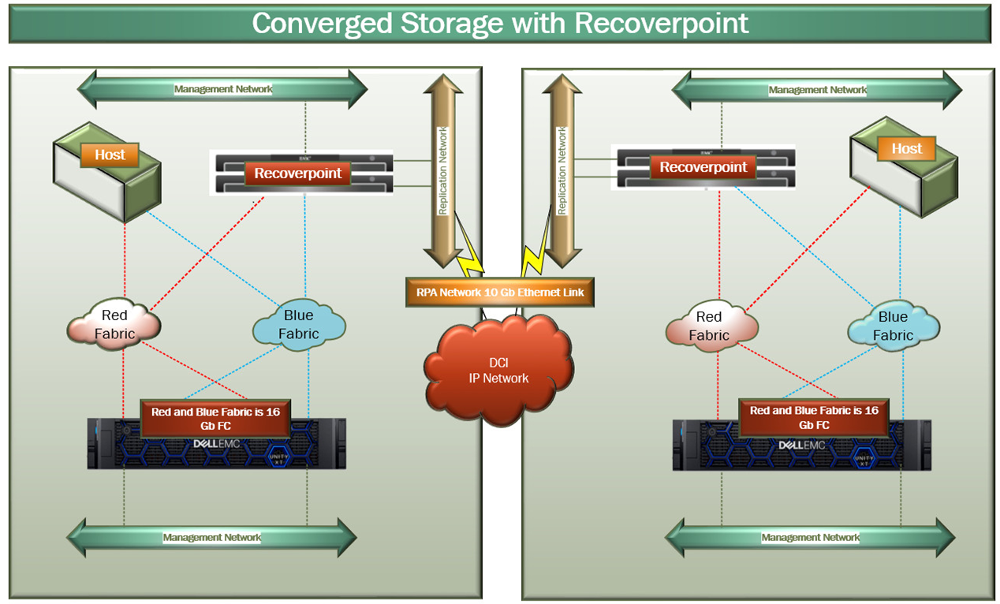
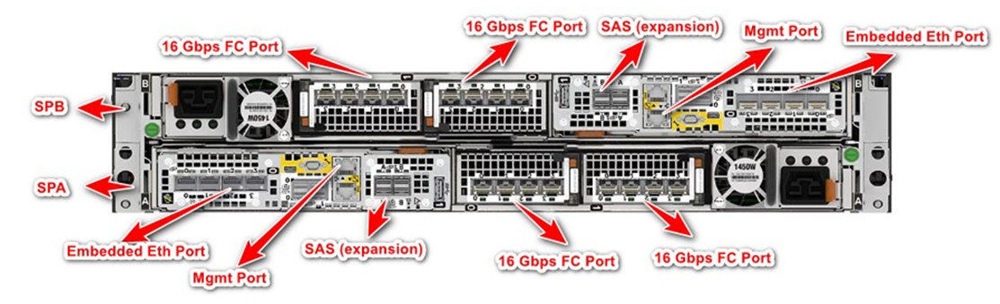
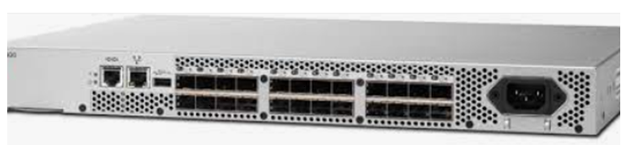
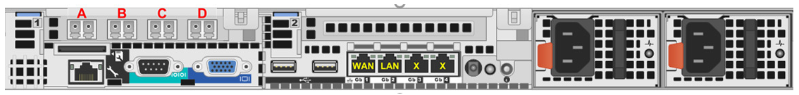
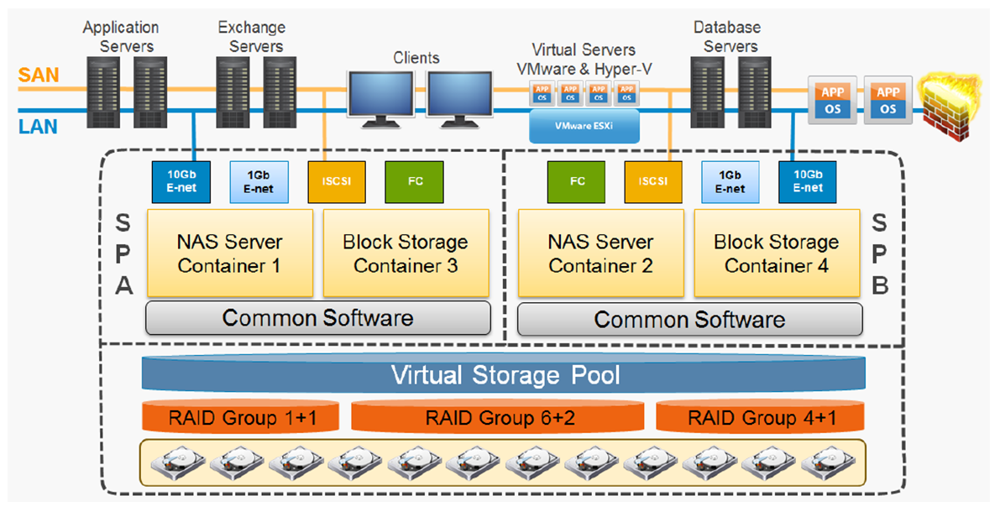
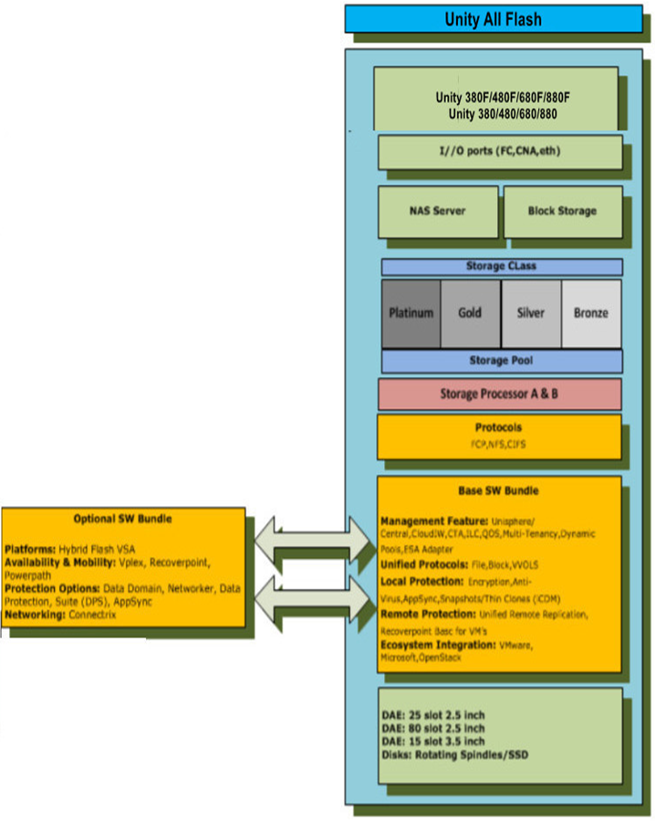

# VCS Converged Storage

# Changelog

| Date       | Change Detail | Author           |
|------------|---------------|------------------|
| 01-10-2021 | Draft version | Amit Kumar Singh |

# Introduction

## Purpose

The purpose of this document is to provide detailed design and architectural guidance required to implement a new Unity system in accordance with Atos Global Delivery standards and portfolio services.

## Audience

Target audience:

- VCS Lead Architect
- VCS Architect
- VCS Engineers

## Scope

The scope of Unity covers the following:

- Unity
- Recoverpoint
- Brocade Switches

The following areas are explicitly out of scope:

- N/A

# Requirements

The Dell EMC Unity is intended as a Midrange Storage system for customer dedicated solutions (Customers \< 100TB) or as a shared solution. Brocade Switches will be used to connect Storage and SAN Host together. Dell Unity ha native replication however, recoverpoint can be used as dedicated replication appliance. For DR Test and multiple PIT (point in time) copies its must to have recoverpoint.

## Service level requirements

The main performance parameters from customer (server issuing I/O's) perspective are IOPS (the number of host issued I/O's per second the storage infrastructure is able to handle) and Response time (how many milliseconds does it take before the host issued I/O is back). The amount of storage required influences the number of disks in the array, the more storage the more disks the more IOPS: for that reason the metric will be IOPS per TB.

There are four major areas influencing end-to-end storage performance:

- the type of workload generated by the applications: read-sequential, read-random, write, write-replicated
- the volume and spread of IO\'s requested by the application: IOPS (IO\'s per second), size of those IO\'s (in KB) and IO:GB spread
- correct configuration of the entire path from server, HBA, SAN network to storage configuration
- the overall load on some shared components (although many are protected against monopolization) within the infrastructure

The first two areas are application driven and can result in numerous unique configurations with a large variety of response times. Furthermore reporting is extremely difficult (overall averages are useless, details are too many to report). For these reasons Atos DCH SAN and NAS storage services do not offer a hard performance service level.

SAN however will be designed and build to deliver performance as listed on this sheet. To be used as reference for customers, to have an indication of what range of response times can be expected. And for vendors to advise configurations able to meet these levels.

| **Class**                        | **Standard I/O**                                                                                                                                                                                                                                                                                                                                                                                                                                                                                                                                             | **IOPS/TB**                                                                                                                                                                                                                                                                                                                                                                                                           | **Response time**                                                                                                                                                                                                                                                                                                                                                                                       |
|----------------------------------|--------------------------------------------------------------------------------------------------------------------------------------------------------------------------------------------------------------------------------------------------------------------------------------------------------------------------------------------------------------------------------------------------------------------------------------------------------------------------------------------------------------------------------------------------------------|-----------------------------------------------------------------------------------------------------------------------------------------------------------------------------------------------------------------------------------------------------------------------------------------------------------------------------------------------------------------------------------------------------------------------|---------------------------------------------------------------------------------------------------------------------------------------------------------------------------------------------------------------------------------------------------------------------------------------------------------------------------------------------------------------------------------------------------------|
| **Diamond**                      | 40-60 % read I/O\'s 4 KB I/O size                                                                                                                                                                                                                                                                                                                                                                                                                                                                                                                         | 5000                                                                                                                                                                                                                                                                                                                                                                                                                  | *target average 1-2 ms*  max 2 ms                                                                                                                                                                                                                                                                                                                                                                    |
| **Platinum**                     | 65-85 % read   8-64 KB I/O size                                                                                                                                                                                                                                                                                                                                                                                                                                                                                                                           | 1500                                                                                                                                                                                                                                                                                                                                                                                                                  | *target average 3-5 ms*    max 10 ms                                                                                                                                                                                                                                                                                                                                                                 |
| **Gold**                         | 65-85 % read   8-64 KB I/O size                                                                                                                                                                                                                                                                                                                                                                                                                                                                                                                           | 500                                                                                                                                                                                                                                                                                                                                                                                                                   | *target average 4-8 ms*    max 15 ms                                                                                                                                                                                                                                                                                                                                                                 |
| **Silver**                       | 65-85 % read  8-64 KB I/O size                                                                                                                                                                                                                                                                                                                                                                                                                                                                                                                            | 250                                                                                                                                                                                                                                                                                                                                                                                                                   | *target average 6-12 ms*   max 25 ms                                                                                                                                                                                                                                                                                                                                                                 |
| **Bronze**                       | 75-90 % read  8-64KB I/O size                                                                                                                                                                                                                                                                                                                                                                                                                                                                                                                             | 25                                                                                                                                                                                                                                                                                                                                                                                                                    | *target average 8-25 ms* max 40 ms                                                                                                                                                                                                                                                                                                                                                                   |
| *from customer/host perspective* | - if the I/O pattern I submit is within these ranges, I will get at least the number of IOPS and response times as mentioned;   - if IO pattern deviates (e.g. I/O size > 64 KB) IOPS and response times are not valid and customer must accept lower IOPS and/or higher response times, or request to move to a higher tier                                                                                                                                                                                                                              | maximum number of IOPS I'm allowed to submit, depending on the volume (net TB) allocated to me  - I'm allowed to do so 7x24 continuously  - if I'm lucky I can submit even more IOPS at a certain time, anticipating that my neighbours will not at the same time  - I realize the storage team is allowed to limit my number of IOPS to 200% of the class values; e.g. to 1000 for a host with 1 TB of Gold | front-end I/O response times at array level  - for my end-to-end response the time in the SAN-network will be added, ~1-2 ms  - valid for each of my LUNs - the daily average should not be above average value - the max value applies to 5 minute intervals; normally all 5 minute intervals should have values below max, but I shall accept an occasional interval with higher response |
| *from vendor/array perspective*  | pool design should be able to deliver IOPS and response times anticipating the average IO to be within these bandwidths  - ideally the worst end of the bandwidth should be taken: e.g. 65% read and 64 KB I/O size on Gold  - in consult with Atos the middle values can be taken to achieve a more cost effective solution: e.g. 75% read and 32 KB I/O size  - dynamic tiering skew assumption: 70% of IO on 30% of capacity for Platinum, 76% Gold, 82% Silver, 88% Bronze  - % random: Diamond 100,  Platinum/Gold 70, Silver 50, Bronze 30 | a pool should be able to deliver 7x24 continuously this volume of front-end IOPS  - e.g. 10 TB net usable Gold pool should deliver 5000 IOPS (assuming 100% allocation ratio)                                                                                                                                                                                                                                      | if number of IOPS to pool is within class boundary the response time should be maximum as specified   Gold example:  - daily Gold pool average between 4-8 ms  - target is that each 5-minute interval average per pool or LUN is below 15 ms, but occasional peak periods cannot be prevented in all cases                                                                                    |

## Dependencies and prerequisites

# Conceptual overview

## Design principles, guidelines and decisions

The Fibre channel block storage design has been created based on global designs for block data services.

- Brocade Switches provide core SAN infrastructure in each data centre. All new fibre channel port allocations are served from them.
- EMC Unity all flash arrays serve all Gold, Silver, Bronze class block storage to open systems. Only All flash array has been considered here for design.
- RecoverPoint Gen6 2 node cluster will be used in each site to provide block replication function. Both Sync and Async replication can be used with RecoverPoint.

| Design Topic           | Design Decision              | Vendor Default (Y/N) | Justification                                                                                                                                                                                                                                                     |
|------------------------|------------------------------|----------------------|-------------------------------------------------------------------------------------------------------------------------------------------------------------------------------------------------------------------------------------------------------------------|
| Storage pool design    | Dynamic pools                | n/a                  | Dynamic Pools allow for flexible deployment models, reduced rebuild times and flash wear when compared to traditional pools. With Dynamic Pools, a drive is the most basic part of the Pool.                                                                      |
| Data protection        | RAID 5 (12+1)                | n/a                  | RAID 5 provides the best balance between protection and capacity overhead. Performance impact is less than RAID 6 but higher than RAID1/0. In conjunction with dynamic pools, RAID width is flexible and depends on the number of drives chosen at pool creation  |
| Encryption             | Data at rest encryption      | N                    | Data at rest encryption is a mandatory requirement. It is assumed that DARE has minimum impact on the overall performance of the storage system. DARE is mandatory on all newly deployed storage systems.                                                         |
| Data efficiency        | Compression                  | N                    | Compression is the available method on Unity to enhance data efficiency. Capacity calculations are made on a 2:1 assumption. Effective capacity depends mainly on the data type. This ratio is the standard assumption and may be changed on customer requirement |
| Max. system load       | 80%                          | Y                    | This is the vendor best practice recommendation. SP loads above will stop in-line data compression                                                                                                                                                                |
| Storage class adoption | Host I/O limits              | n/a                  | Unity's QoS capabilities will be used to create storage classes as defined in the S&DP service offering in order to provide the correct performance class to the servers                                                                                          |
| Availability Design    | Dual Controller, Dual Fabric | Y                    | All Unity components are redundant, SP, power supply, fans, ports. RAID is used for data protection. SAN switches have redundant power supplies, the SAN fabric is built in a dual fabric design                                                                  |
| Storage Management     | Unisphere                    | Y                    | Unisphere is the management suite for Unity arrays. It provides GUI, CLI and REST API to manage the systems                                                                                                                                                       |
| Software Package       | All-inclusive package        | Y                    | Contains all features and functionalities for:                                                                                                                                                                                                                    |
|                        |                              |                      | Array Management, protocols, local and remote protection                                                                                                                                                                                                          |
| SAN Platform           | Brocade 5G/6G                | n/a                  | Brocade 6G switches are recommended however Brocade 5G switches are supported and can be used and are obviously more economical.                                                                                                                                  |
| SAN Design             | Dual Fabric                  | Y                    | Provides highest availability.                                                                                                                                                                                                                                    |
| SAN Topology           | Core-Edge                    | n/a                  | Standard within Atos DCH Storage Tower. Core switches will be placed in management- or storage rack, Edge switches sit in the respective compute racks.                                                                                                           |

## Architectural overview

Fibre channel block storage will be provisioned from EMC unity all flash arrays connected by independent SAN fabrics in each data centre. RecoverPoint will be used for replication of data between Unity arrays in Site A and Site B.

### Architecture Description

  | **Service**       | **Technology**                            | **Purpose**                                                            |
  |-------------------|-------------------------------------------|------------------------------------------------------------------------|
  | Fabric            | FC Network Brocade Gen 5 / Gen 6 switches | Communication between storage arrays and compute                       |
  | Block Storage     | EMC Unity 380F/480F/680F/880F             | Provision of active block storage capacity                             |
  | Block Replication | RecoverPoint gen 6 - 2 Node Cluster       | Provides block storage replication functionality from site A to Site B |

## Converged Storage Deployment - Minimum Config

- The Unity XT can be deployed in each DC with minimum of 6 \* 960 GB Drives.
- The RecoverPoint can be deployed with 2 nodes per cluster in each DC.
- 2 Brocade Gen 5 / Gen 6 Switches can be deployed per DC.

NOTE: Minimum configuration may not be preferred configuration.

## Unity XT

Dell Unity XT is based on the powerful family of Intel Xeon processors, Dell EMC's Unity XT storage system implements an integrated architecture of block, file, and VMware VVols with concurrent support for native NAS, iSCSI, and FC protocols. Each system leverages dual storage processors, full 12 Gb SAS back-end connectivity.

However, in VCS Unity XT will be used for block data services only. RecoverPoint will be used to replicate the data residing on Unity XT in one site to another using synchronous replication.

Component description

  | **Physical Storage**      | **Details**                                          |
  |---------------------------|------------------------------------------------------|
  | Unity 380F/480F/680F/880F | Serving as a storage for workload and management VMs |

## Brocade Gen 5 / Gen 6 Switches

Brocade Gen5 / Gen6 switches provide connectivity between hosts, unity and RecoverPoint appliances. 2 Brocade switches per DC will be deployed to provide redundancy and availability even during switch level failure.

Gen5 switches are still compatible with Unity and RecoverPoint and are probably cheaper option. However, Gen6 switches are recommended as they provide considerable performance improvement along with long term future upgrade option.

Component:

| SAN switches             | Model                 | Details                                                                 |
|--------------------------|-----------------------|-------------------------------------------------------------------------|
| -   2x San Switch per DC | Brocade Gen 5 / Gen 6 | Providing connectivity between hosts, unity and RecoverPoint appliances |

## RecoverPoint

The RecoverPoint appliance provides data replication capabilities in SAN infrastructure. A cluster of two or more active RPAs is deployed at each RecoverPoint Site. This provides high-availability during failure of one node in the RP Cluster. RecoverPoint cluster can have maximum of 8 nodes and can start with as small as 2 nodes.

Component Description

This RecoverPoint solution will use 2 node RPA cluster at each location to begin with.

  | **RecoverPoint Appliances**                    | **Model** | **Details**                   |
  |------------------------------------------------|-----------|-------------------------------|
  | 2x RecoverPoint Appliance (2 Node per cluster) | Gen 6     | Used for FC Block replication |

# FC Connectivity

## Unity XT For Block Data Services

There are 16 \* 16 Gbps FC ports on each Unity array spread across 4 I/O modules. There are two I/O Modules per Unity Service Processor Enclosure. It is possible to also deploy Unity with just 8 \* 16 Gbps ports configuration as well.

## Brocade Switches

The Brocade gen 5 San switches are 16 Gbps based, with 16 Gbps SFPs -- this provides connectivity for hosts with 16 Gb Host HBA connectivity.

San Fabric Port capacity can be scaled with further switch purchases for each fabric and inter switch links (ISL) between the switches. Multiple ISLs can be used to provide resilience and bandwidth between SAN switches.

## RecoverPoint

Each RecoverPoint node has 4 FC Ports per node which will run at 16 Gbps speed. Each of these ports will be cabled with FC SAN Switch and will be zoned with SPA and SPB of Unity XT.

# Unity Architecture

The Unity architecture delivers true Unified native block and file solution with dedicated components that are optimized for specific use cases. Access to Block and NAS service is provided by containers on both the storage processor via Ethernet and FC IO modules. A Common software stack ensures that both block and file object can reside in same storage Pool.

The drawing below shows the principal Unity architecture and details important components associated with it.

## Unity Schematic Design

## Unity Design Decision

  | **Unity XT**                | **Settings**                                                                            |
  |-----------------------------|-----------------------------------------------------------------------------------------|
  | **Management Network**      | Connect SPA and SPB to the Management Port                                              |
  | **Ip Address**              | Reserve 1 IP Address for Unity XT in management network                                 |
  | **Storage Pool**            | Create 1 Dynamic Pool for block                                                         |
  | **CloudIQ**                 | Enabled Cloud IQ for monitoring and reporting                                           |
  | **SRS**                     | Enabled SRS for dial home                                                               |
  | **User Management**         | Enable AD integration on Unity XT                                                       |
  | **Data at Rest Encryption** | Enable D\@RE                                                                            |
  | **Replication**             | RecoverPoint will be used for Replication and DR                                        |
  | **Syslog**                  | Enable Syslog                                                                           |
  | **SNMP**                    | Enable SNMP V3 to capture critical alert                                                |
  | **Host Access**             | Each Host should access the storage via both SPA and SPB for HA and better performance. |
  | **FC Port**                 | Dedicate/Seggregate FC Ports on SPA and SPB for Host and RecoverPoint                   |

## Tier Configuration

  | **Tier** | **Drive Type** | **RAID Type** |
  |----------|----------------|---------------|
  | Flash    | NVMe/SAS       | RAID 5 (12+1) |

## Unity Scalability

Please refer to the below link for Unity XT scalability.

<https://www.delltechnologies.com/asset/en-us/products/storage/technical-support/h17713_dell_emc_unity_xt_series_ss.pdf>

## Hot Spare

Hot Spare will be automatically configured in Unity XT. Hot spare is no longer dedicated and hence the hot spare capacity is distributed across all disks in dynamic pool. Since we are going to use dynamic pool.

## Thin Provisioning

All Storage from Unity will be thin provisioned.

## Dynamic Pool

Dynamic storage pool applies RAID to groups of flash drive extents from drives within the pool. It allows for greater flexibility in managing and expanding the pool. Dynamic pools are only available on Unity all-flash systems. Hot spares are not needed with dynamic pools. A dynamic pool will automatically reserve spare space capacity in the pool at a rate of 1 drive's worth of capacity per every 32 drives.  
Dynamic Pool will be configured with 12 + 1 raid Configuration as per the recommendation of Dell EMC.

## Pool Expansion

If pool is running out of capacity, then new drives could be added to the existing storage pool to increase the capacity. A dynamic pool can be expanded by minimum of 1 disk.

## Compression and Deduplication

Data reduction will be enabled on all flash Unity array to reduce the data foot print.

## Data at Rest Encryption

D\@RE is controller based encryption that does not impact performance. D\@RE license is included in the base license. Encryption can only be enabled at the time of system installation as it wipes out entire data on Unity system. D\@RE has little it no performance impact with encryption enabled and is FIPS 140-2 Level 1 compliant encryption using advanced encryption standard (AES) algorithms.

## LUN

LUNs provide storage and block level access to hosts and application. The general recommendation is to use THIN LUNs and this is also in line with vendor recommendation.  
Size of the LUN needs to be confirmed by the project team.

## IO Limit

In order to assign the correct performance/storage class to what the customer pays for, we introduce Host I/O limits. The ability to limit the amount of I/O activity that is serviced by the Unity system is known as Host I/O Limits. Host I/O Limits can be applied on LUNs, VMware VMFS Datastores and their associated snapshots. Host IO Limits will be used to limit incoming host activity on the basis of IOPS, Bandwidth, or both. Limits can be enforced on individual resources, or a limit can be shared amongst a set of resources. In context with our standard S&DP service offering the following limits apply.  
An I/O limit is defined as a maximum threshold using the following criteria:

- Throughput---I/O operations per second (IOPS)
- Bandwidth---Kilobytes or Megabytes per second (KBPS or MBPS)

### Policies with burst control

An I/O limit policy can be configured to use burst control settings. This option allows traffic to exceed the base policy limit by a percentage of the base limit. User-specified parameters determine

  | Storage class | Policy type    | Setting     | Burst setting                 | Remark |
  |---------------|----------------|-------------|-------------------------------|--------|
  | Diamond       | Density based  | 5 IOPS/GB   | 100% for 5 mins. every 1 hour |        |
  | Platinum      | Density based  | 2 IOPS/GB   | 100% for 5 mins. every 1 hour |        |
  | Gold          | Absolute limit | 500 IOPS/TB | 100% for 5 mins. every 1 hour |        |
  | Silver        | Absolute limit | 250 IOPS/TB | 100% for 5 mins. every 1 hour |        |
  | Bronze        | Absolute limit | 25 IOPS/TB  | 100% for 5 mins. every 1 hour |        |

NOTE: THESE CAN BE ADJUSTED FOR EACH CLIENT DEPENDING ON ENVIRONMENT AND CUSTOMER REQUIREMENT.

## Management Network

1 Management IP per Unity XT needs to be reserved.

  | **Device Name** | **Interface** | **Function** | **VLAN**  | **IP/Subnet** |
  |-----------------|---------------|--------------|-----------|---------------|
  | Unity XT- SPA   | eth           | LAN (Mgmt)   | MGMT VLAN | MGMT IP       |
  | Unity XT-SPB    | eth           | LAN (Mgmt)   | MGMT VLAN | N/A           |

## CloudIQ

CloudIQ is cloud based no cost service from EMC to monitor health and performance of Unity system array. CloudIQ proactively monitors the health of the Unity system and also recommends remediation that address potential vulnerabilities. Unity and all other SAN Components will be connected to CloudIQ.

## Port Mapping

  | Unity XT (even ports) | Red Fabric Brocade Switch |
  |-----------------------|---------------------------|
  | SPA Slot 0 port 0     | Port 0                    |
  | SPB Slot 0 port 0     | Port 1                    |
  | SPA Slot 0 port 2     | Port 2                    |
  | SPB Slot 0 port 2     | Port 3                    |

  | Unity XT (odd ports) | Blue Fabric Brocade Switch |
  |----------------------|----------------------------|
  | SPA Slot 0 port 1    | Port 0                     |
  | SPB Slot 0 port 1    | Port 1                     |
  | SPA Slot 0 port 3    | Port 2                     |
  | SPB Slot 0 port 3    | Port 3                     |

# Brocade Design Decision

2 independent Brocade SAN switches will be deployed to create 2 completely redundant and highly resilient fabric for high availability.

  | **Feature**                | **Settings**                                                                                                                                                                                                                                  |
  |----------------------------|-----------------------------------------------------------------------------------------------------------------------------------------------------------------------------------------------------------------------------------------------|
  | Management Network         | 1 mgmt Ip Address per brocade switch is required so it can be accessed remotely                                                                                                                                                               |
  | Syslog                     | Enabled Syslog                                                                                                                                                                                                                                |
  | SwitchName                 | As Per Naming Convention                                                                                                                                                                                                                      |
  | NTP Server                 | Enable                                                                                                                                                                                                                                        |
  | TimeZone                   | As Per Customer Environment                                                                                                                                                                                                                   |
  | Insistent Domain Id Mode   | Enable                                                                                                                                                                                                                                        |
  | TimeOut                    | 10 Minutes                                                                                                                                                                                                                                    |
  | Port Speed                 | All Front-end Ports to be hard coded to 16 Gbps. All Hosts will auto negotiate the speed.                                                                                                                                                     |
  | Zoning                     | Enabled                                                                                                                                                                                                                                       |
  | Single Initiator Zoning    | Single Initiator zoning will be performed on the switches along with separate zones for Disk and Backup subsystems. As backup devices are prone to SCSI bus reset, it is advisable to keep both Disk and Storage subsystem to separate zones. |
  | SNMP                       | Enabled SNMP v3                                                                                                                                                                                                                               |
  | DNS Domain Name            | Enable                                                                                                                                                                                                                                        |
  | DNS                        | Enable                                                                                                                                                                                                                                        |
  | SNMP V1                    | Disable                                                                                                                                                                                                                                       |
  | Disable Telnet Access ipv4 | Disable                                                                                                                                                                                                                                       |
  | Disable Telnet Access ipv6 | Disable                                                                                                                                                                                                                                       |
  | Banner Message             | Enable / Set                                                                                                                                                                                                                                  |
  | Hardened Password Setting  | Enable                                                                                                                                                                                                                                        |

## Zoning

As design principle hardware enforced zoning should be used. Single initiator and multiple targets can be added to same zone however care needs to be taken that multiple initiators are not part of same zone. For high availability and load balancing on a single SP, the host initiator should be zoned to 2 ports from SPA and 2 ports from SPB.

### Unity XT zoning with Host

  | Red Fabric Zone Members | Blue Fabric Zone Members |
  |-------------------------|--------------------------|
  | Unity_SPA_slot0_p0      | Unity_SPA_slot0_p1       |
  | Unity_SPB_slot0_p0      | Unity_SPB_slot0_p1       |
  | Host1_FC0               | Host1_FC1                |

### RecoverPoint zoning with Unity

  | Red Fabric Zone Members | Blue Fabric Zone Members |
  |-------------------------|--------------------------|
  | Unity_SPA_slot0_p2      | Unity_SPA_slot0_p3       |
  | Unity_SPB_slot0_p2      | Unity_SPB_slot0_p3       |
  | RPA_P0                  | RPA_P1                   |
  | RPA_P2                  | RPA_P3                   |

## Management Network

1 management IP per Brocade switch needs to be reserved.

  | **Device Name**  | **Brocade Interface** | **Function** | **VLAN**  | **IP/Subnet** |
  |------------------|-----------------------|--------------|-----------|---------------|
  | Brocade Switch 1 | eth                   | LAN (Mgmt)   | MGMT VLAN | MGMT IP       |
  | Brocade Switch 2 | eth                   | LAN (Mgmt)   | MGMT VLAN | MGMT IP       |

## Brocade Specs and scalability

  | **Feature**          | **Brocade G630 with Gen 6** | **Brocade 6520 with Gen 5** |
  |----------------------|-----------------------------|-----------------------------|
  | Port configurations  | 48,72,96,128 Ports          | 48,72,96 Ports              |
  | Supported Port Speed | 4G,8G,16G,10G,16G,32G,128G  | 2G,4G,8G,16G                |
  | Total bandwidth      | 4 Tb/s                      | 1.5 Tb/s                    |

  | **Feature**          | **Brocade G620 with Gen 6**                                  | **Brocade 6510 with Gen 5** |
  |----------------------|--------------------------------------------------------------|-----------------------------|
  | Port configurations  | 24,36,48,64 ports or 24,40,52, 64 ports or 24,36,52,64 ports | 24,36,48 Ports              |
  | Supported Port Speed | 4G,8G,16G,10G,16G,32G,128G                                   | 2G,4G,8G,16G                |
  | Total bandwidth      | 2 Tb/s                                                       | 768 Gb/s                    |

  | **Feature**          | **Brocade G610 with Gen 6** | **Brocade 6505 with Gen 5** |
  |----------------------|-----------------------------|-----------------------------|
  | Port configurations  | 8,16,24 Ports               | 12,24 Ports                 |
  | Supported Port Speed | 4G,8G,16G,32G               | 2G,4G,8G,16G                |
  | Total bandwidth      | 768 Gb/s                    | 384 Gb/s                    |

NOTE: Brocade Gen 6 switches are the preferred choice. However, it may be the cheapest solution available.

# RecoverPoint Design Decision

RecoverPoint will be deployed by Dell and all the design decisions will be made by Dell during the deployment phase.

## Journal Volume

Journal Volumes stores the consistent point in time images for the target site. There is at least one Journal volume on each site per consistency group. These volumes should only be seen by the appliances. Minimum journal size is 10 GB  
Journal LUN(s) should be at least 20% of the replicated LUNS capacity; Preferably in RAID 5.

It is better to divide the Journal capacity on several similar sized LUNS rather than creating one big LUN for the entire capacity of the journal. This will increase the performance of the journal.  
For example: if you are replicating 1 TB of data, you should create 4 x 50 GB RAID 5 LUNs for the RecoverPoint Journal.Both Repository and Journal volumes should be thick RAID 5 LUNS.

## Repository Volumes

Repository Volume stores pertinent replication environment information. This volume must be seen only by the appliances on the same site as this volume. It should be 6 GB Both Repository and Journal volumes should be thick RAID 5 LUNS.

## Management Network

2 Management IP per RecoverPoint Node needs to be reserved.

  | **RPA Device name** | **RPA Interface** | **IP / Subnet** |
  |---------------------|-------------------|-----------------|
  | RPA Node 1          | BMC               | MGMT IP         |
  | RPA Node 1          | Eth0              | MGMT IP         |
  | RPA Node 2          | BMC               | MGMT IP         |
  | RPA Node 2          | Eth0              | MGMT IP         |

## WAN Network

1 WAN IP per node needs to be reserved for replication

  | **RPA Device name** | **RPA Interface** | **IP / Subnet** |
  |---------------------|-------------------|-----------------|
  | RPA Node 1          | WAN               | Replication IP  |
  | RPA Node 2          | WAN               | Replication IP  |

## RecoverPoint Scalability

Maximum of 8 node per RecoverPoint cluster is supported.

## Port Mapping

  | RecoverPoint (even ports) | Red Fabric Brocade Switch |
  |---------------------------|---------------------------|
  | **RPA01** Port 0          | Port 4                    |
  | **RPA02** Port 0          | Port 5                    |
  | **RPA01** Port 2          | Port 6                    |
  | **RPA02** Port 2          | Port 7                    |

  | RecoverPoint (odd Ports) | Blue Fabric Brocade Switch |
  |--------------------------|----------------------------|
  | **RPA01** Port 1         | Port 4                     |
  | **RPA02** Port 1         | Port 5                     |
  | **RPA01** Port 3         | Port 6                     |
  | **RPA01** Port 3         | Port 7                     |
  
# Host

HBA connecting to the Brocade Switches will need to operate at 16 Gbps.

For all host requirements it is mandatory to consult the Dell EMC support matrix to ensure that all the HBA type and versions are compatible with the storage array.

All hosts must have multi-pathing software installed for high availability and redundancy. Host-based multi-pathing software will allow paths defined to each unity SP, to ensure path failover and no-disruption to IO. MPIO native to each OS where supported should be used.

## Port Mapping

  | Host (even ports) | Red Fabric Brocade Switch |
  |-------------------|---------------------------|
  | Host 1 FC0        | Port 12                   |
  | Host 2 FC0        | Port 13                   |
  | Host 3 FC0        | Port 14                   |
  | Host 4 FC0        | Port 15                   |

  | Host (odd ports) | Blue Fabric Brocade Switch |
  |------------------|----------------------------|
  | Host 1 FC1       | Port 12                    |
  | Host 2 FC1       | Port 13                    |
  | Host 3 FC1       | Port 14                    |
  | Host 4 FC1       | Port 15                    |

# Monitoring with SRS

Communication between the EMC Customer Support Center and the Unity system occurs through EMC Secure Remote Support (ESRS). Connectivity is available using a dedicated server that becomes the conduit for all communications between EMC and the site information structure. EMC provides Secure Remote Support Gateway software, at no charge with a maintenance agreement. Policy Manager Software allows us to manage, control and log gateway actions. ESRS is included in the STONE base configuration.  
Unity also has inbuilt ESRS which can be used for small environments (" directly from the storage processor of unity").  
The Gateway server can be placed in any customer-approved location as long as it can communicate with EMC over the Secure Socket Layer (SSL) and with the Policy Manager. The Gateway servers can be located on a:  
"Neutral zone" between the customer's private network and the outside public network

- Dedicated VLAN
- Internal LAN.

The Policy Manager must be located on the internal LAN.

# Availability design

### Component failure

All components of the Storage and SAN equipment are redundant. Failure of a single component doesn't affect the functionality of the whole solution.

Unity XT redundant components

- Storage processors
- Power supplies
- Fans
- RAID protection

SAN redundant components

- Dual fabric design
- Power supplies

RecoverPoint redundant components

- Multiple nodes per cluster
- Multiple replication Wan Link

In case of a failure of one component the system performance may be impacted. The systems are also being monitored by the vendor using a call home method (ESRS). If a component fails a message is being sent to the vendor and replaced by the vendor's field service.

### System failure

The Storage system can survive several failures. If a Storage processor fails, the load will be taken over by the remaining processor. The flash/disk drives are protected against drive failure in the pool by using RAID protection mechanisms.  
The SAN in the pod is built from a dual fabric. This protects the solution from port failures and even the failure of a complete switch.  
RecoverPoint is built using minimum 2 nodes per cluster. Even if the entire node fails, replication would still continue without any impact.

### Data Centre failure

Data replication will enable data center to avoid disruptions in business operations. It is a process in which storage data is duplicated to a remote or local system. It proves an enhanced level of redundancy in case the main storage system fails. It is covered in chapter 5.3 along with design rules.

### Continuous operation

Both, the Unity Storage system and the SAN components can be upgraded non-disruptively. Unity OE upgrades must be performed for each controller separately. During an upgrade of one controller the system performance is degraded. It is recommended to perform upgrades during non-business hours or in agreed maintenance windows.
