# VM Deployment LLD

# Changelog

| Date       | TOS     | Issue       | Author                           | Description                                                              |
|------------|---------|-------------|----------------------------------|--------------------------------------------------------------------------|
| 2019-10-18 | VCS 1.7 | N/A         | Robert Kaminski, Tomasz Korniluk | Initial draft `creation`                                                 |
| 2019-12-24 | N/A     | N/A         | Robert Kaminski                  | Added managed types and design statements for tooling on workload domain |
| 2020-01-14 | N/A     | N/A         | Robert Kaminski                  | Added external components                                                |
| 2020-01-20 | N/A     | N/A         | Robert Kaminski                  | Added API call examples for VM deploy                                    |
| 2020-04-16 | N/A     | N/A         | Robert Kaminski                  | Added CMP CPRs integrated with VCS                                       |
| 2020-04-20 | N/A     | N/A         | Robert Kaminski                  | Added Disaster Recovery Virtual Server CPR logic visio                   |
| 2020-11-30 | N/A     | N/A         | Tomasz Korniluk                  | Added Disaster Recovery Active-Passive Virtual Server provisioning logic |
| 2020-12-09 | VCS 1.2 | DHC-1020    | Tomasz Korniluk                  | TOS review updates                                                       |
| 2021-01-15 | N/A     | N/A         | Sathya Seelan                    | Custom VM name validation using VRO                                      |
| 2021-05-12 | VCS 1.3 | DHC-1981    | Marcin Kujawski                  | Updating for TOS and add multitenancy content                            |
| 2021-07-23 | N/A     | DHC-2469    | Tomasz Korniluk                  | Updating to enable VM tags for managed os and unmanage os templates      |
| 2021-08-12 | N/A     | DHC-2575    | Tomasz Korniluk                  | Updated to align virtual machine instance types tag with CMP tag         |
| 2021-09-01 | N/A     | DHC-2777    | Łukasz Stasiak                   | Updates for configure VM restart priority                                |
| 2023-03-16 | VCS 1.7 | CEDSHC-6521 | Piotr Lewandowski                | Updates for Backup policy dynamic query                                  |
| 2024-08-14 | N/A     | VCS-13167   | Marcin Kujawski                  | Updates for new catalog items, look and feel and latest design updates   |

# 1. Introduction

## 1.1. Purpose

The purpose of this document is to provide detailed design and architectural guidance required to deploy VMs on VCS Workload Domain in accordance with Atos Global Delivery standards and portfolio services.

## 1.2. Audience

This document is intended for VCS architects and designers. The blueprint assumes that the reader has reasonable grasp of AHS Windows and Linux Managed servers and their respective Server management tooling as well as familiarity with architecture principles including high availability and multi-tenancy.

## 1.3. Scope

**This LLD is specifically desired to describe Virtual Machine deployment and configuration methods on Customer workload domain. VCS management stack is not included.**

This LLD document covers the following topics:

- VM deployment on Customer Workload
- OS offering types
- Cloud agents installation and configuration
- Cloud scripts execution
- Ansible Tower integration
- VCS supported OS versions
- User & password management

The following areas are explicitly out of scope:

- VM deployment of VCS management Workload
- OS Monitoring
- OS Patch management
- AHS standard server management tooling integration
- Customer specific in guest tooling/agents
- Non-Standard OS versions
- Integration of Customer Managed images (relevant to Self Managed OS type in DPC classic)

## 1.4. Related Documents

This document is a subset of Atos Technology Lifecycle Management (ATLM) artefacts. All documents are stored in the VCS documentation repository.

## 1.5. Requirement Levels

This document is following the principles below to categorize all requirements and design decisions.

Table Requirements Principles

|    Term    | Meaning                                                                                                                                                                                                                                                         |
|:----------:|-----------------------------------------------------------------------------------------------------------------------------------------------------------------------------------------------------------------------------------------------------------------|
|    MUST    | The definition is an absolute requirement of the specification.                                                                                                                                                                                                 |
|  MUST NOT  | The definition is an absolute prohibition of the specification.                                                                                                                                                                                                 |
|   SHOULD   | There may exist valid reasons in particular circumstances to ignore a particular item, but the full implications must be understood and carefully weighed before choosing a different course                                                                    |
| SHOULD NOT | There may exist valid reasons in particular circumstances when the particular behaviour is acceptable or even useful, but the full implications should be understood and the case carefully weighed before implementing any behaviour described with this label |
|    MAY     | Any design decisions that are not classified as MUST and SHOULD or covering optional feature that is not general available for DPC product                                                                                                                      |

# 2. Architecture Overview

VCS is using VMware Aria Automation to provide the blueprinting and orchestration functionality of the platform as well as being the presentation layer for the functions to be consumed via API. VMware Aria Automation is an overarching term for Assembler, Code Stream and Service Broker. This functionality can be delivered via an On-Prem offering further allowing the underlying VCS automation software stack to be as light as possible.

Deployment of VMs in the workload domain can be triggered from two sites of VMware Aria Automation services:

- Service Broker via GUI or API using defined catalog item.
- Assembler via GUI or API using defined cloud agnostic blueprint.

## Virtual Machine Deployment Diagram

## Virtual Machine Deployment Logical Map

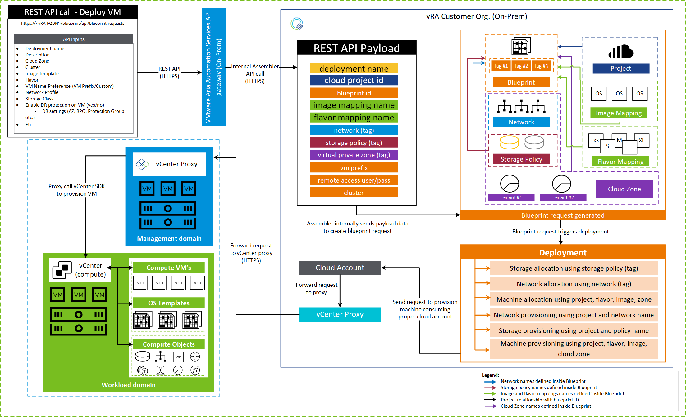

## 2.1. Business and Solution Requirement

Table 3 Initial requirements

|  ID  | Requirement description                                                                                                                                                                                                                                                                                       | Requirement Source | Requirement Level |
|:----:|---------------------------------------------------------------------------------------------------------------------------------------------------------------------------------------------------------------------------------------------------------------------------------------------------------------|--------------------|-------------------|
| R001 | Atos Managed types are based on Atos global images                                                                                                                                                                                                                                                            |                    | MUST              |
| R002 | Customer Managed OS types are either based on images delivered by Customer or on Atos global images                                                                                                                                                                                                           |                    | MUST              |
| R003 | Atos images are in line with TSS security settings                                                                                                                                                                                                                                                            |                    | MUST              |
| R004 | Customer images shall meet Atos TSS security settings                                                                                                                                                                                                                                                         |                    | SHOULD            |
| R005 | Atos is responsible for global images lifecycle (out of VCS scope).                                                                                                                                                                                                                                           |                    | MUST              |
| R006 | Images must include cloud agent to allow guest OS automation during provisioning                                                                                                                                                                                                                              |                    | MUST              |
| R007 | VCS does not store any image automation account for in-guest scripts on workload domain VMs. Creation of such account during the deployment phase is in scope of AHS as well as storing the account entry in the password manager. The automation account is required for 2nd day operations on the os level. |                    | SHOULD            |
| R008 | Assembler image mapping name must reflect proper vSphere template of OS flavour/build version (e.g. RHEL7, SLES15, Win2k16)                                                                                                                                                                              |                    | MUST              |
| R009 | Assembler Customer organization and its core components must be pre-created                                                                                                                                                                                                                              |                    | MUST              |
| R010 | VCS delivers software repository for Customer workload VMs                                                                                                                                                                                                                                                    |                    | MUST NOT          |
| R011 | VCS delivers password manager for Customer workload VMs                                                                                                                                                                                                                                                       |                    | MUST NOT          |

# 3. Detailed Logical Design

This LLD describes the way Customer VMs are deployed onto VCS Customer Workload Domain.

## 3.1. Management Topology

VCS is based on VMware VCF platform. VCS offers service catalog with Cloud Automation Services Components - Service Broker and VMware Cloud Assembly API gateway.

Diagram shows the logical communication paths and interactions during OS deployment using Cloud Assembly consuming workload domain (vCF vSphere environment).

### API first rule

Deployment of VMs on workload domain can be triggered from two sites of Cloud Automation Services:

- Service Broker via GUI or API using defined catalog item.
- Assembler via GUI or API using defined cloud agnostic blueprint.

Following the rule API first, VMware is sharing **swagger** pages for **Aria Automation Services** with recent description of **API calls**. Same API can be used for On-Prem instance of VMware Aria Automation.

- [API Docs](https://www.mgmt.cloud.vmware.com/automation-ui/api-docs/)

## 3.2. OS managed types on workload domain

| Decision ID | Design Decision                                                                                        | Design Justification                                                                                                           | Design Implication                                                                                                                                    |
|:-----------:|--------------------------------------------------------------------------------------------------------|--------------------------------------------------------------------------------------------------------------------------------|-------------------------------------------------------------------------------------------------------------------------------------------------------|
|   DD-001    | VCS distinguishes between two types of OS managed: **  - Atos Managed   - Customer Managed**   | It simplify defining OS support ownership: Atos vs others                                                                      | Customer OSs managed by 3rd parties are marked as Customer Managed                                                                                    |
|   DD-002    | Atos managed VMs rely on Atos global images only                                                       |                                                                                                                                |                                                                                                                                                       |
|   DD-003    | Customer managed Vms rely on Atos global images (without Atos tooling installed) or on Customer images |                                                                                                                                | DD-010                                                                                                                                                |
|   DD-004    | Atos and Customer managed images must include cloud-init agents                                        | Cloud-Init Agent on linux and cloudbase-init on windows allows OS configuration and packages installation during provisioning. | Atos Global images imported during VCS deployment include cloud-init agents. Customer must be aware the images provided to VCS must include the agent |

## 3.3. VCS workload domain images, OS versions

### 3.3.1. Atos images

| Decision ID | Design Decision                                                                                                       | Design Justification | Design Implication |
|:-----------:|-----------------------------------------------------------------------------------------------------------------------|----------------------|--------------------|
|   DD-005    | AHS Global team provides images located in <https://globalbuilds.saacon.net/global/>                                  | DD-002               |                    |
|   DD-006    | Global images are in line with TSS security settings and supports drivers for hardware in the Atos basket.            |                      |                    |
|   DD-007    | Global images DO not contain any tooling agents. Atos tooling to be installed as part of deployment activities.       |                      |                    |
|   DD-008    | VCS supports all OS flavors approved by AHS operations but includes version N only into standard VCS build.           |                      |                    |
|   DD-009    | Atos Images to be imported to Customer Workload domain vCenter and published on vRA Cloud during the VCS build phase. |                      |                    |
|   DD-016    | VCS shall introduce Content Library image sync between multiple sites (version 1.1 and above)                         |                      |                    |

### 3.3.3. Customer images

Following table describes design decisions to import and use Customer images under vRA cloud.

| Decision ID | Design Decision                                                                                                                                                                   | Design Justification | Design Implication |
|:-----------:|-----------------------------------------------------------------------------------------------------------------------------------------------------------------------------------|----------------------|--------------------|
|   DD-010    | VCS allows to include Customer/external images under condition they meet design maximus and are listed on vRealize Automation Support Matrix guest OS list.                       |                      |                    |
|   DD-017    | VCS shall introduce a procedure (automated as much as possible) to import Customer Managed images into VCS environment and sync it between multiple sites (placed in the roadmap) |                      |                    |

### 3.3.4. Atos managed custom images

Following table describes design decisions to import and use Atos managed custom images under vRA cloud.

| Decision ID | Design Decision                                                                                                                                                                   | Design Justification | Design Implication |
|:-----------:|-----------------------------------------------------------------------------------------------------------------------------------------------------------------------------------|----------------------|--------------------|
|   DD-010    | VCS allows to include Customer/external images under condition they meet design maximus and are listed on vRealize Automation Support Matrix guest OS list.                       |                      |                    |
|   DD-017    | VCS shall introduce a procedure (automated as much as possible) to import Customer Managed images into VCS environment and sync it between multiple sites (placed in the roadmap) |                      |                    |

## 3.4. Image orchestration agents on workload domain

| Decision ID | Design Decision                                                | Design Justification                                                                                                                                    | Design Implication                                        |
|:-----------:|----------------------------------------------------------------|---------------------------------------------------------------------------------------------------------------------------------------------------------|-----------------------------------------------------------|
|   DD-011    | Cloudbase-init agents shall be included into windows templates | Allow configuration and software deployment during windows VM provisioning. Recommended for Customer Managed VMs, easy to use, no credentials required. | Agent installation automated with Image Import to vCenter |
|   DD-012    | Cloud-init agents shall be included into linux templates       | Allow configuration and software deployment during Linux VM provisioning. Recommended for Customer Managed VMs, easy to use, no credentials required.   | Agent installation automated with Image Import to vCenter |

Cloud init and base init installation on templates imported during VCS deployment is handled with dpc-configureCloudinit and dpc-configureCloudbaseinitWindows roles. Refer the roles README files on git for more detailed info.

Learn more about orchestration capabilities of cloud-init <https://cloudinit.readthedocs.io/en/latest/> and cloudbase-init <https://cloudbase-init.readthedocs.io/en/latest/>

## 3.5. OS Tooling on workload domain VMs

| Decision ID | Design Decision                                                                                                                                                                                                                                                                                             | Design Justification                                                                                                                                                                                                                                                                                                                                                                                                               | Design Implication                                                                                                              |
|:-----------:|-------------------------------------------------------------------------------------------------------------------------------------------------------------------------------------------------------------------------------------------------------------------------------------------------------------|------------------------------------------------------------------------------------------------------------------------------------------------------------------------------------------------------------------------------------------------------------------------------------------------------------------------------------------------------------------------------------------------------------------------------------|---------------------------------------------------------------------------------------------------------------------------------|
|   DD-013    | There is no tooling installed on Atos templates imported to VCS, except cloud-init agents (DD-010, DD-012). VCS Engineering leaves VM configuration under AHS scope for Atos Managed VMs or Cloud Operation scope for Customer Managed VMs. Orchestration is available through cloud init agents or ansible | For Customer Managed VMs Cloud Operations in the name of Customer can customize vRA blueprint in order to orchestrate VMs during the deployment phase through cloud-init agents.   Managing Atos Managed VMs is under AHS responsibility, therefore any OS configuration and tooling installation will be automated by the AHS account.   This brings customisation flexibility without a need to involve VCS Engineering. | AHS must use Atos global password repository for storing any VMs related secrets and the software repository to share packages. |

## 3.6. User & password management

| Decision ID | Design Decision                                                                           | Design Justification                                                                                                                 | Design Implication                                         |
|:-----------:|-------------------------------------------------------------------------------------------|--------------------------------------------------------------------------------------------------------------------------------------|------------------------------------------------------------|
|   DD-014    | VCS does not store any Customer VMs related secrets in VCS password manager (Hashi Vault) | For Atos Managed workloads, operating system management is in the AHS scope by design, therefore AHS shall use their secrets manager | Atos GTS has not yet delivered global secret manager tools |

## 3.7. VM Tagging, CMDB discovery, Naming

| Decision ID | Design Decision                                                                                                       | Design Justification                                                                                                                                                      | Design Implication                                                                                                                                              |
|:-----------:|-----------------------------------------------------------------------------------------------------------------------|---------------------------------------------------------------------------------------------------------------------------------------------------------------------------|-----------------------------------------------------------------------------------------------------------------------------------------------------------------|
|   DD-015    | Tagging will be applied to virtual machines in order to facilitate management as well as assisting in the CMDB model. | Tags are easy to manage and universal in use. Increasing reporting capabilities and makes environment parametrization easier                                              | Require tags naming alignment between Atos units and Customer                                                                                                   |
|   DD-018    | vRA On-Prem provides inventory auto discovery capabilities. SNOW discovery will use vCenter inventory for frequent CMDB update   | SNOW has CMDB update functionality implemented, which is preferred by VCS          |                                                                                                                                                                 |
|   DD-019    | vRA On-Prem provides default mechanism to have unique VM names                                                          | Unique VM name will be automatically generated by vRA during provisioning                                                                                           | Customer VM names stay always unique, in order to customize VM names required additional setup of "Custom naming template" per project or implement ABX on-prem |
|   DD-020    | Multitenancy is supported and Tenant tags are required on VM level to logically separate workload VMs                 | VMs will be differentiated between multiple tenants, projects, resource pools and cloud zones                                                                             | Each VM will be tagged with tenant specific data (Tenant name, project etc.)                                                                                    |
|   DD-021    | Machine instance type tag will be assigned to VM after provisioning                                                   | Managed virtual machines will be identified based on assigned tag key (UHC-SN-MANAGED) with tag value Yes for Atos managed instances or No for customer managed instances | Each virtual machine will be tagged with the same tag key (UHC-SN-MANAGED) but different tag values (Yes/No)                                                    |

## 3.8. Availability and Scalability

Availability, scalability and recoverability of the Customer VM is handled on the infrastructure level, which is described in the Infrastructure LLD.
The same for VRA On-Prem, it is defined in Automation LLD.

## 3.9. IPAM Integration

During the deployment process, IP addresses will be allocated from the VCS IPAM solution. Infoblox has been selected as the IPAM solution for VCS and IP pools will be created in Infoblox prior to the first deployment. New VM deployments will be allocated an IP from the next available address in the IP Pool. vRA will be integrated to Infoblox using plugins from the VMware marketplace and additional configuration will be performed during vRA setup to ensure network profiles map to the correct IP Pool. vRA Blueprints will contain a property called "assignment: static" and calls direct from API which bypass blueprinting must contain a custom property "ipAssignmentType": "STATIC".  
Further information on how IPAM is setup can be found in the vRA On-Prem LLD.

### 3.10 Disaster recovery active-passive service broker portal logic

The following diagram represents logic to trigger virtual machine provisioning with disaster recovery protection type: Active-Passive using vRA service broker service and vRA to vRO integration.  
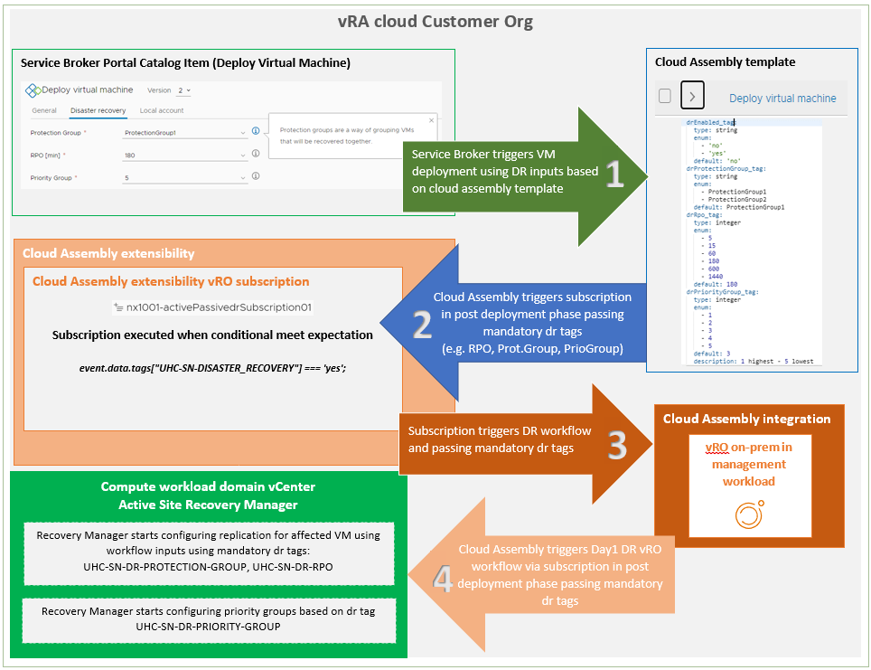

### 3.11 Disaster recovery active-active virtual machine provisioning logic

The following diagram represents logic to trigger virtual machine provisioning with disaster recovery protection type: Active-Active using vRA and Service Broker.

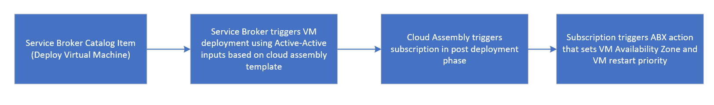

For Active-Active disaster recovery implementation **placeVmInAGroup** ABX action is part of virtual machine provisioning. This ABX action is used for placing VMs in a given Availability Zone and configuring VM restart priority. Created python script will first put the provisioned virtual machine in selected DRS group. Next it will configure VM restart priority for a given VM based on input value from Service Broker form.

#### 3.11.1 Blueprint Template changes

Following Blueprint Template changes have been implemented for Active-Active disaster recovery:

- Place VM in given Availability Zone
    Blueprint is updated with the possible availability zone names added when Active-Active DR is implemented.  
    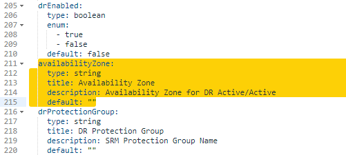

- Configure VM restart priority

    Blueprint is updated with the possible restart priorities that can be selected for a created virtual machine.  
    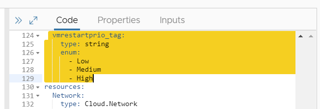

    Based on restart priority VM is tagged with selected value.  
    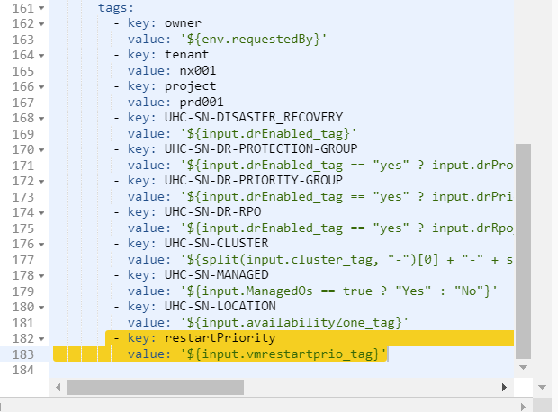

#### 3.11.2 Blueprint Custom Form changes

When Active-Active DR protected cluster is selected following fields are available in Disaster recovery tab:

 **Availability Zone** - availability zone to which new virtual machine will be assigned after provisioning
 **VM Restart Priority** - restart priority for provisioning VM

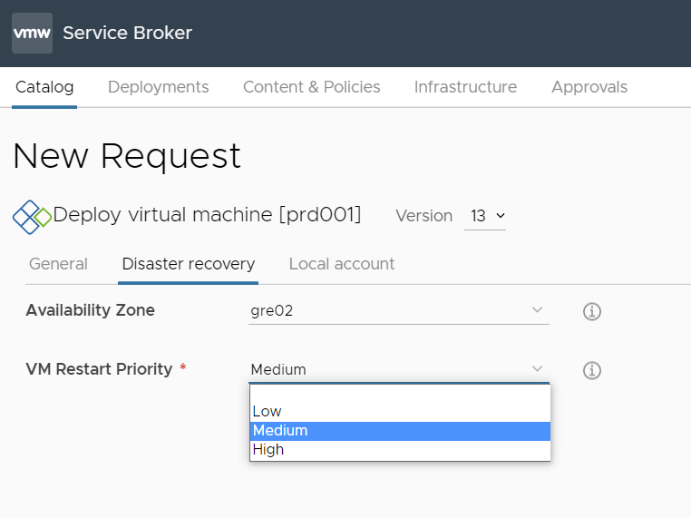

### 3.12 Custom VM name validation using VRO

The following diagrams present the validation of Custom VM name during deployment

Service Broker request diagram,  
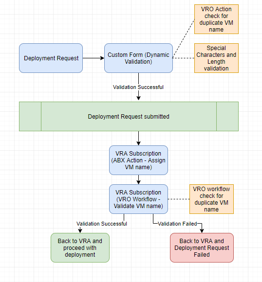

API request diagram,  
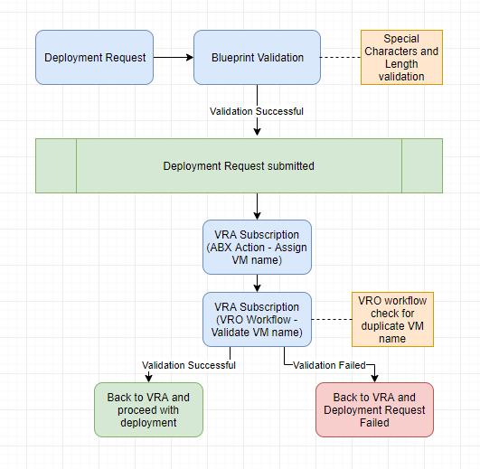

Request Form has a new field "VM Name Preference" to select `VM_Prefix` or `Custom VM name`  
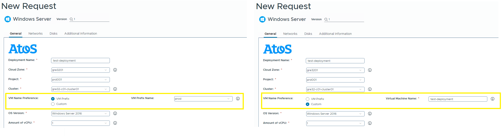

Service Broker validate on the fly if the provided VM name by user in the form is free and not exists on vCenter. It is used to prevent failing the dpeloyment process.

### 3.13 Virtual machine instance type tags

Every virtual machine provisioned using the default catalog item under vRA Service Broker will get assigned an instance type tag.
Instance type tags will identify if virtual machine is managed by the Service provider or the Customer.
Tags are automatically assigned to the affected virtual machine object at vCenter level and in vRA.

The following screenshot illustrates the default service broker form with virtual machine instance type selection.
Selection is mandatory and can't be skipped under service broker portal.

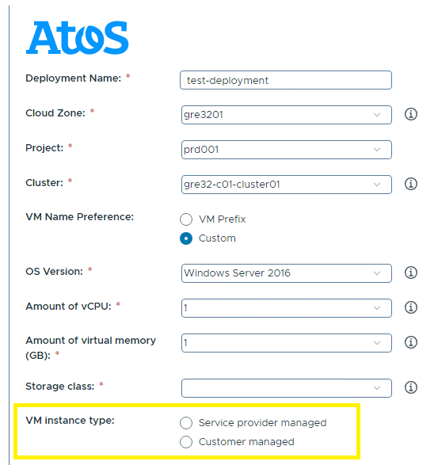

# 4. Detailed Physical Design

## 4.1. VCS Components

VM deployment fully relies on the VMware Cloud Services components that are based on VMware VCF platform and VMware Aria Automation Services. Refer to Infrastructure and Automation design LLD for details.

## 4.2. External Components

Apart from the VCS components, VM deployment and later the VM management requires integration with external services.  

### 4.2.1. Backup

VCS management and the compute virtual machines are integrated with Avamar backup managed by CEB team. Refer to Backup LLD for details.

Virtual Machine is added to the backup policy based on VM tagging.
Default tags are:

- daily2000_3w (daily at 8pm, 3 weeks retention)
- daily1900_3w (daily at 7pm, 3 weeks retention)
- daily1800_3w (daily at 6pm, 3 weeks retention)

Custom tags shall be agreed with VCS Deployment Integration Architect, Cloud Enterprise Backup Architect (CEB) and ServiceNow Cloud Management Platform team (CMP)  to reflect Customer backup polices requirements.

VCS is by design agentless, based on image backup. Any backup agent installation on the Customer VMs to satisfy application backup specific requirements from inside OS shall be handled by guest operation support team.

In the current VCS release additional functionality has been developed and Service Broker custom form has been updated to dynamically retrieve a list of available Avamar backup policies. This is done by executing a VRO action that retrieves Avamar credentials from Hashivault and queries the Avamar server using REST API.

1. User clicks on the backup policy field in the Catalog Item form
2. VRO action associated with the input field fetches Hashivault credentials from the configuration file
3. VRO action sends a REST API call to Hashivault to retrieve Avamar credentials
4. VRO action sends a REST API call to Avamar to retrieve the list of available backup policies
5. VRO action returns the list of backup policies to the Service Broker form

The flow is presented in the following diagram:

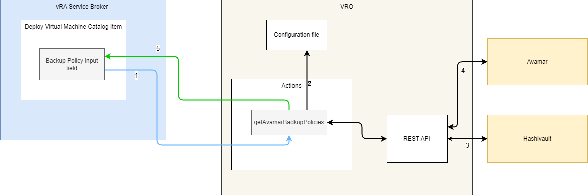

### 4.2.2. Antivirus

VCS integrates with Trend Micro Deep Security service managed by Big Data and Security team (BDS). Deep Security infrastructure design document is available on BDS share point <https://sp2013.myatos.net/sites/BDS/cys/GCS/Pages/HomePage.aspx> with restricted access.

**During the VCS deployment stages, VCS automates the AV Agent installation on all windows and linux management virtual machines ONLY.**

Integration of the Customer workload with Atos Antivirus shared service (which is creation and configuration of antivirus relay server) is Customer dependant and under ESO Deployment team activities.

Installation of the AV agent on the Customer workload VMs is under AHS for Atos Managed VMs and can be orchestrated via cloud-base or ansible.

For small to medium cloud agent-based integrations (< 500-1000 VMs), the Deep Security Shared infrastructure can be used. Instead of the direct connection line through a customer dedicated firewall, the connection will be done through the Atos ASN Public firewall as encrypted VPN over the Internet. It's mandatory that in each cloud deployment, a Deep Security Relay is used in order to download and relay locally the updates and policies from the Shared Atos Console.
The figure below describe the cloud deployment for the Atos VMware Cloud Services Product.
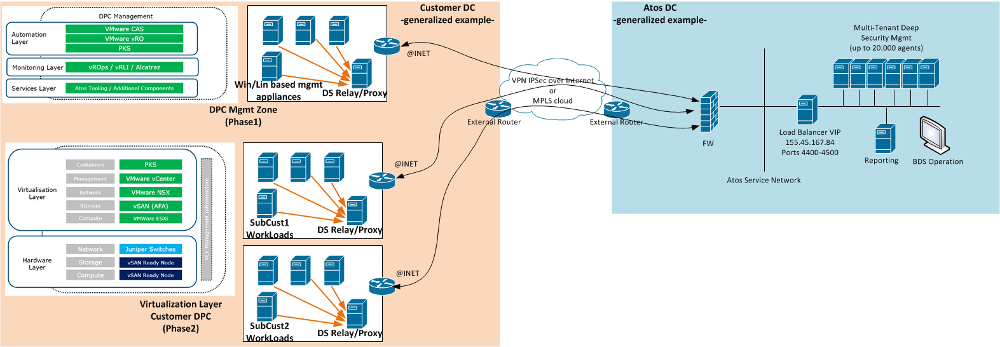

Each cloud deployment has a management zone and multiple workload zones. Agents need to be deployed in all zones together with the local DS Relay in order to secure the entire environment. Each zone needs to be integrated as an individual tenant for individual policy customization and individual reporting.
Only Basic Anti Malware Protection is in scope of VCS protection (i.e. smart scan firewall is disabled).

### 4.2.3. Ansible

Ansible Tower or ansible core instances can be use to orchestrate Customer VM deployments. This can be achieved on multiple levels.  
ServiceNow CMP is integrated with Atos GTS Ansible Tower service. Refer to CMP and GTS lld documents for detailed designs.

#### 4.2.3.1 Ansible Isolated Node creation

GTS Ansible Tower placed in ASN network. Connections to Customer network are achieved over Ansible Isolation Nodes. To speed up the server creation, VCS delivers a catalog on service broker that provision Isolation Node VM on the Customer workload domain.

:warning: The Ansible Isolation node is created by an integration architect or any other person that has sufficient knowledge about isolation node integration requirements.

Networking

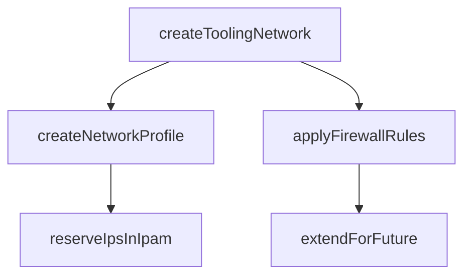

Provisioning

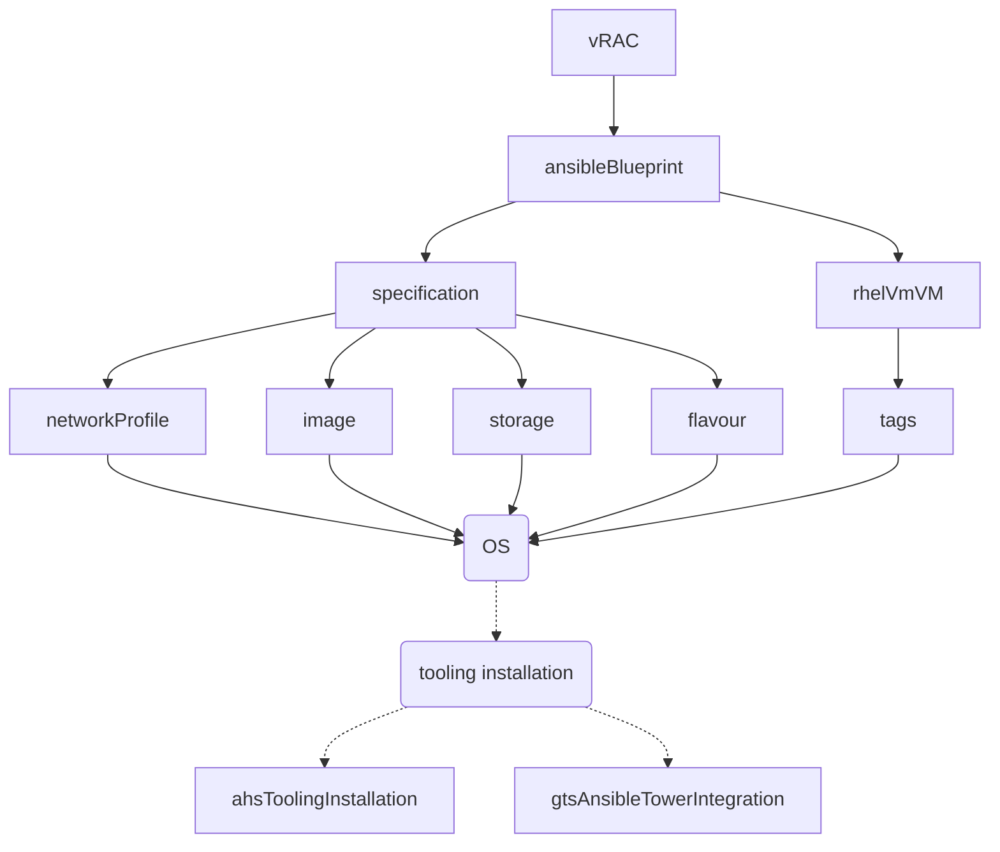

:heavy_check_mark: delivery method

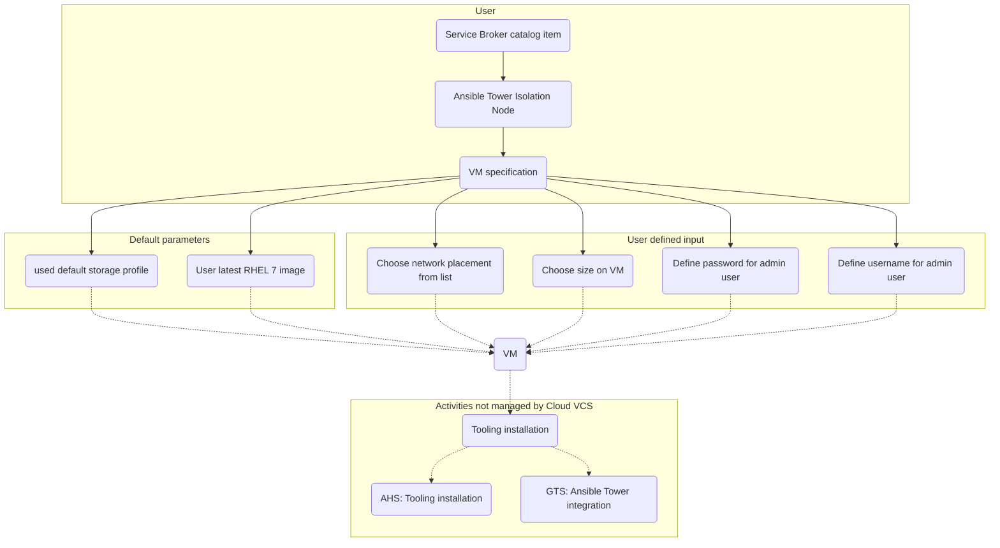

### 4.2.4. Software repository

VCS does not deliver any software repository for Customer workloads.

### 4.2.4. Patch repository

VCS does not deliver any patch repositories for Customer workloads.

Patching of the Atos Managed VMs is in scope of AHS, BSA is a default patch catalog.

### 4.2.5. Password manager

VCS does not deliver any password manager for Customer workloads.

VCS does not store any Customer VMs related secrets in VCS password manager (Hashi Vault). For Atos Managed workloads, operating system management is in the AHS scope by design, therefore AHS shall use their secrets manager. The automation account is required for 2nd day operations on the os level.
