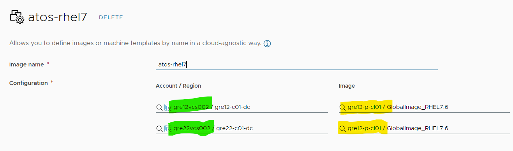
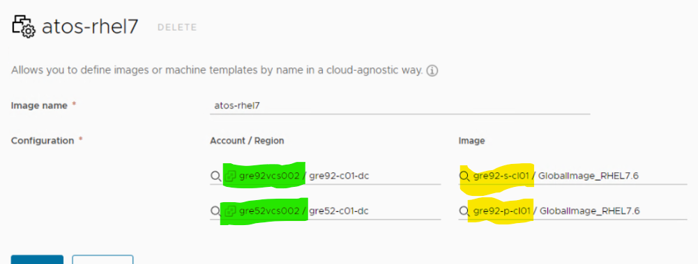

# VM Templates Distribution: Low Level Design

- [VM Templates Distribution: Low Level Design](#vm-templates-distribution-low-level-design)
- [Changelog](#changelog)
- [Introduction](#introduction)
  - [Purpose](#purpose)
  - [Audience](#audience)
  - [Scope](#scope)
  - [Related Documents](#related-documents)
  - [Requirement Levels](#requirement-levels)
- [Architecture Overview](#architecture-overview)
  - [Business and Solution Requirements](#business-and-solution-requirements)
- [Detailed Logical Design](#detailed-logical-design)
  - [Security](#security)
    - [Role Based Access Control](#role-based-access-control)
    - [Firewall](#firewall)
  - [Shared Content Libraries implementation details](#shared-content-libraries-implementation-details)
    - [Detailed firewall rules between VCS sites](#detailed-firewall-rules-between-vcs-sites)
    - [AD DNS Conditional Forwarders settings](#ad-dns-conditional-forwarders-settings)
    - [Published Content Library settings](#published-content-library-settings)
    - [Subscribed Content Libraries settings](#subscribed-content-libraries-settings)
    - [vRealize Automation CAS Image Mapping](#vrealize-automation-cas-image-mapping)

# Changelog

| Date       | Issue       | Author(s)          | Description     |
|------------|-------------|--------------------|-----------------|
| 2023-03-07 | CESDHC-6581 | Karol Gomulkiewicz | Initial version |

# Introduction

## Purpose

The purpose of this document is to provide detailed design and architectural guidance required to implement and maintain virtual machine templates lifecycle and distribution across one customer all VCS sites.

## Audience

This document is intended for employees from the VCS build team, DevSecOps team  and AHS team  who will be tasked with implementing vm templates replication, maintaining vm templates replication and managing vm templates lifecycle, respectively. Assumption is that the reader has reasonable grasp of VMware cloud technologies, virtualization, hyperconnected infrastructure, VCS and customer's environment specification as well as familiarity with architecture principles.

## Scope

This LLD is intended to cover below components and domains:

1. Description of the VM template replication process across VCS sites
2. Detailed design of the used technical component - vSphere Content Library

This LLD does not cover:

1. Creating and/or updating CAS Image Mappings for VCS multisite scenarios
2. Updating Content Library items

## Related Documents

This document is a subset of Atos Technology Lifecycle Management (ATLM) artefacts.

| Document                     | Document Name                                                                                                                                                               |
|------------------------------|-----------------------------------------------------------------------------------------------------------------------------------------------------------------------------|
| VCS Build Guide              | [VCS Build Guide: Work Instruction](../workInstructions/dhcBuildGuide.md)                                                                                                   |
| vRA SaaS Tenant Builder      | [vRA SaaS Tenant Builder: Work Instruction](../workInstructions/wiTenantBuilder.md#cas-integration---atos-global-images-import-to-cl-importglobalimagestocontentlibraryyml) |
| vRA On Prem Deployment Guide | [vRA On Prem Deployment Guide: Work Instruction](..//workInstructions/wiVraOnPremDeploymentGuide.md#atos-global-images-import-to-cl)                                        |

## Requirement Levels

This document is following the principles below to categories all requirements and design decisions.

|    Term    | Meaning                                                                                                                                                                                                                                                         |
|:----------:|-----------------------------------------------------------------------------------------------------------------------------------------------------------------------------------------------------------------------------------------------------------------|
|    MUST    | The definition is an absolute requirement of the specification.                                                                                                                                                                                                 |
|  MUST NOT  | The definition is an absolute prohibition of the specification                                                                                                                                                                                                  |
|   SHOULD   | There may exist valid reasons in particular circumstances to ignore a particular item, but the full implications must be understood and carefully weighed before choosing a different course                                                                    |
| SHOULD NOT | There may exist valid reasons in particular circumstances when the particular behaviour is acceptable or even useful, but the full implications should be understood and the case carefully weighed before implementing any behaviour described with this label |
|    MAY     | Any design decisions that are not classified as MUST and SHOULD or covering optional feature that is not general available for VCS product                                                                                                                      |

Table 1. Requirement Levels

# Architecture Overview

VM templates replication uses the existing architecture and platform of VCS. It also uses existing connections, plugins, etc. Below is the global architecture. It introduces no new architecture elements. As vm templates replication process uses cross-VCS connections, it is needed to ensure communication between used components.

Figure 1. Architecture Overview

## Business and Solution Requirements

The table below provides known requirements mandatory to be incorporated into design decisions of vRA Cloud Onboarding in this LLD.

|  ID  | Requirement description                                                                                                 |  Requirement Source   | Requirement Level |
|:----:|-------------------------------------------------------------------------------------------------------------------------|:---------------------:|:-----------------:|
| R001 | Publisher and Subscriber VCS platforms are fully set up and operational                                                 | {HLD/other LLD/other} |       MUST        |
| R002 | Publisher and Subscriber VCS platforms are connected                                                                    | {HLD/other LLD/other} |       MUST        |
| R003 | VM template replication from Publisher Content Library to all subscribed Content Libraries takes not more than 24 hours | {HLD/other LLD/other} |      SHOULD       |

Table 2. Initial Requirements

# Detailed Logical Design

| Decision ID | Design Decision                                                                                                                               | Design Justification                                                                                                                                                | Design Implication                                                           |
|:-----------:|-----------------------------------------------------------------------------------------------------------------------------------------------|---------------------------------------------------------------------------------------------------------------------------------------------------------------------|------------------------------------------------------------------------------|
|   dd-001    | vSphere Content Libraries, Published and Subscribed will be used as primary VM/OVF templates distribution method for all customer's VCS sites | Sharing vSphere Content Libraries by Publish/Subscribe may be used between independent vSphere SSO domains and it is built-in feature to achieve design requirement | VM template must be stored in Content Library as OVF Template type of item   |
|   dd-002    | There is one main Published Content Library and 11 dependent Subscribed Content Libraries                                                     | Storing and updating new version of VM templates in one place simplifies VM template lifecycle management                                                           | There is need to adjust synchronisation schedule to avoid network congestion |

## Security

### Role Based Access Control

Atos based solutions must guarantee proper access management. Following design decisions are made in that area.

| Decision ID | Design Decision                                                 | Design Justification                                 | Design Implication                      |
|:-----------:|-----------------------------------------------------------------|------------------------------------------------------|-----------------------------------------|
|  rbac-001   | Deployment Team will have access to target (subscriber) vCenter | Access needed to set up subscription Content Library | Standard operator roles will be applied |
|  rbac-002   | AHS Team will have access to source (publisher) vCenter         | Needed for updating new versions of vm/ovf templates | Standard operator roles will be applied |

Table 3. Design Decisions

### Firewall

This section covers all firewall related decisions influencing content of that LLD

| Decision ID | Design Decision                                                                          | Design Justification                                         | Design Implication |
|:-----------:|------------------------------------------------------------------------------------------|--------------------------------------------------------------|--------------------|
|   fw-001    | Networking between source (publisher) and target (subscribers) vCenters will be required | Required for set up Content Libraries                        | N/A                |
|   fw-002    | Networking between VCS Active Directory DNS servers will be required                     | Required for set up Domain Names resolution across VCS sites | N/A                |

Table 4. Design Decisions

## Shared Content Libraries implementation details

To properly implement Publish/Subscribe Content Libraries across all customer's VCS sites there is need to configure network connectivity and prepare DNS systems.

### Detailed firewall rules between VCS sites

Following firewall rules must be set on customer's DC firewalls. Respectively, routing between subnets must be configured.

| Source IP                             | Destination IP                        | Service              |
|---------------------------------------|---------------------------------------|----------------------|
| vcs002 in secondary VCS site          | vcs002 in primary VCS site            | HTTPS (TCP 443)      |
| vcs002 in primary VCS site            | vcs002 in secondary VCS site          | HTTPS (TCP 443)      |
| adc001, adc002  in secondary VCS site | adc001, adc002  in primary VCS site   | DNS (TCP 53, UDP 53) |
| adc001, adc002  in primary VCS site   | adc001, adc002  in secondary VCS site | DNS (TCP 53, UDP 53) |

Table 5. Cross DC firewall rules

### AD DNS Conditional Forwarders settings

General rule for DNS Conditional Forwarders settings is that Publisher CL site has set conditional forwarders set to all other VCS sites and Subscriber CL site has set conditional forwarder for primary VCS site domain. Please note, that in some multi-tenancy deployments domain names may be resolvable yet in different way (i.e. by Integrated Forwarder Zone type).

### Published Content Library settings

Published vSphere Content Library named `{locationCodeOfPrimaryDhc}-p-cl01` is placed under first compute vCenter created under standard VCS deployment. It is password protected Content Library and password is stored in `{locationCodeOfPrimaryDhc}-hsv001` Hashi Vault.
Password for this library should be changed periodically in accordance to customer's password management policy. Changing password in Published Content Library implies parallel changing passwords in all Subscribed Content Libraries to ensure undisrupted syncing process.

### Subscribed Content Libraries settings

For all other VCS sites there is a demand to create Subscribed Content Library with following settings:

| Configuration setting      | Value                                                                                         |
|----------------------------|-----------------------------------------------------------------------------------------------|
| Schedule for syncing items | daily, 20:00 - 07:00 (default advanced setting for all vCenter's Libraries)                   |
| Automatic synchronization  | Yes                                                                                           |
| Authentication             | Yes                                                                                           |
| Subscription password      | `{locationCodeOfPrimaryDhc}-p-cl01` Vault secret `{locationCodeOfPrimaryDhc}-p-cl01-password` |
| Library content            | Download all library content immediately                                                      |

Table 6. Subscribed Content Library configuration details

### vRealize Automation CAS Image Mapping

Depending on whether vRA SaaS or vRA on prem is used, the image mapping configuration is presented differently. In other words, items from Subscribed Content Library, in case of using vRA SaaS, are presented as if they were belong to Published Content Library under subsidiary Cloud Account/Region. In case of using vRA on prem, Subscribed Content Library is presented under its original name.

Figure 2. Image mapping in vRA SaaS

Figure 3. Image mapping in vRA on premise
