# VMC on AWS

# 1 Introduction

## 1.1 Author

| Author name | Author email                       | Date   |
| :---------: | :--------------------------------: | :----: |
| Krishnasai Dandanayak |  `krishnasai.dandanayak@atos.net` | 06.12.2023 |

### 1.1.1 Changelog

| Author name | Author email | Date | Comments |
| :---------: |  :---------: |:----:|:--------:|
| Krishnasai Dandanayak | `krishnasai.dandanayak@atos.net` | 06.12.2023 | initial draft of document |
|   Divyaprakash J     |   `divyaprakash.j@atos.net`      |  04.03.2024 | Document Update |

## 1.2 Purpose

The purpose of this document is to provide detailed design and architectural guidance required to implement VMC on AWS for Customers in accordance with Atos standards and portfolio services.
The principal aim of this document is to translate the high-level design (HLD) into a technical low-level design (LLD).
Design is providing component architecture overview in Architecture Overview chapter that provides basic building blocks and main principles, followed by Detailed Logical Design.
Architecture Overview provides basic building blocks and main design principles of presented design. It is covering known requirements cascaded from HLD and other LLDs.
Detailed Physical Design provides detailed configuration of components.

## 1.3 Audience

This document is intended for Atos Cloud Services Engineers and Architects responsible for VMware Cloud Services (VCS) solution implementation and maintenance.

## 1.4 Scope

This LLD is intended to cover below components and domains:

- VMC on AWS design for VCS.

This LLD is not covering:

- Installation guides for VMC on AWS and deployment of SDDC bundle.

## 1.5 Requirement Levels

This document is following below mentioned principles to categorize all requirements and design decisions.

| Term | Meaning |
| --- | --- |
| MUST | The definition is an absolute requirement of the specification. |
| MUST NOT | The definition is an absolute prohibition of the specification |
| SHOULD | There may exist valid reasons in particular circumstances to ignore a particular item, but the full implications must be understood and carefully weighed before choosing a different course |
| SHOULD NOT | There may exist valid reasons in particular circumstances when the particular behaviour is acceptable or even useful, but the full implications should be understood, and the case carefully weighed before implementing any behaviour described with this label |
| MAY | Any design decisions that are not classified as MUST and SHOULD or covering optional feature that is not general available for VCS product |

## 2 Architecture Overview

VMware Cloud on AWS is an integrated cloud offering jointly developed by Amazon Web Services (AWS) and VMware. VMware Cloud on AWS allows you to quickly migrate VMware workloads to a VMware-managed Software-Defined Data Center (SDDC) running in the AWS Cloud and extend your on-premises data centers without replatforming or refactoring applications. You can use native AWS services with Virtual Machines (VMs) in the SDDC, to reduce operational overhead and lower your Total Cost of Ownership (TCO) while increasing your workload’s agility and scalability.

To discover more benefits of VMC on AWS Examine this document - [Benefits of VMC on AWS](https://www.vmware.com/content/dam/digitalmarketing/vmware/en/pdf/docs/vmw-buyers-guide-choosing-between-vmc-on-aws-native-public-cloud-services.pdf)

## Figure 1. VMC on AWS Architecture

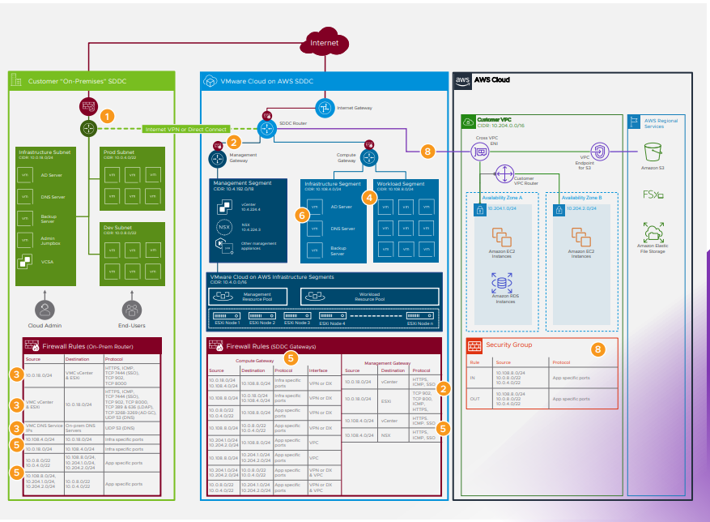

## Landing Zone

This section provides detailed design and architectural guidance for implementing VMware Cloud (VMC) On AWS on top of AWS Landing Zone Accelerator (LZA) in compliance with Atos Public Cloud Services standards (PCS) and portfolio services.

## Figure 2. Landing Zone Architecture

The diagram below displays the high-level architectural diagram depicting the key elements for VMC on AWS structure of PCSAWS. This design pattern aligns with AWS’s best practice for a multi-account Landing Zone strategy.

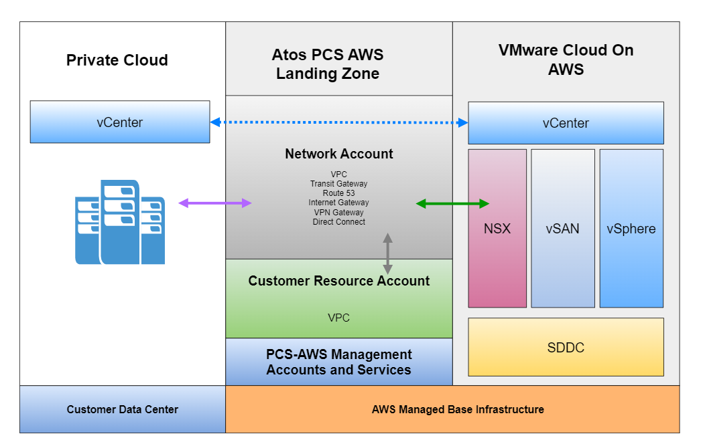

## Figure 3. Landing Zone Network Architecture

A network account is a dedicated account within Atos PCS AWS that is exclusively utilized for managing network resources, including Virtual Private Clouds (VPCs), Transit Gateway, Direct Connect, and various others. The primary objective of a network account is to centralize and regulate network-related resources across multiple AWS accounts. All traffic going to VMC from Onprem will be going through Network Account.

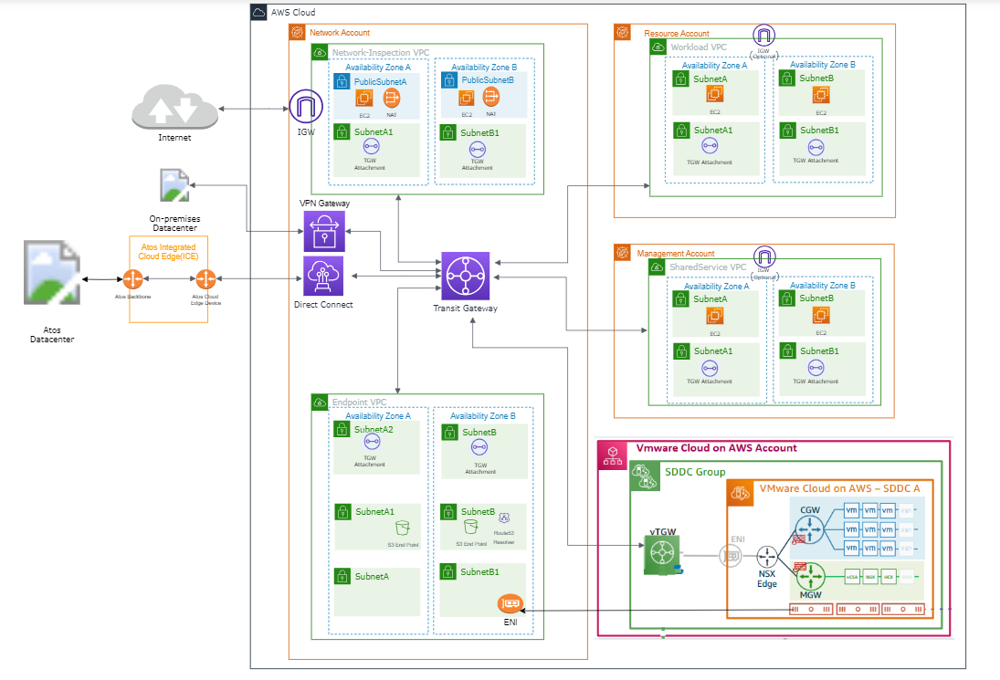

Use the [Landing Zone](https://docs.pcs.aws.atos.net/lldVMCOnAWS/) document as a guide for more detailed information regarding VMC on AWS Landing Zone.

### 2.1 Business and Solution Requirements

The table below provides known requirements mandatory to be incorporated into design decisions described in this LLD.

| ID | Requirement description | Requirement Source | Requirement Level |
| --- | --- | --- | --- |
| R001 | Defined RBAC using federated Customer directory services | HLD | MUST |
| R002 | AWS login credentials | Portfolio requirement | MUST |
| R003 | Solution is using VMware Cloud Foundation SDDC and SDN workload domains / PODs as integration endpoints along with AWS | HLD | MUST |
| R004 | Installation and configuration of required components is automated | VCS Principles | SHOULD |
| R005 | Automation domain must be patched in regular schedule with minimal impact into service availability | Portfolio | MUST |
| R006 | Defined Role Base Access Control (RBAC) model to ensure a proper security isolation | Portfolio | MUST |

## 3 Detailed logical design

## 3.1 VCS and VMC side-by-side diagram

## Figure 2. Comparative Diagram between VMC and VCS

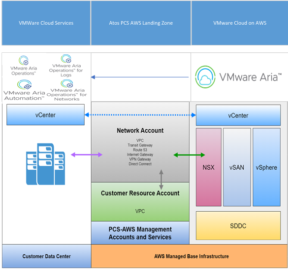

## 3.2 Landing Zone

This section provides detailed design and architectural guidance for implementing VMware Cloud (VMC) On AWS on top of AWS Landing Zone Accelerator (LZA) in compliance with Atos Public Cloud Services standards (PCS) and portfolio services.

## Figure 3. Landing Zone Network Architecture

A network account is a dedicated account within Atos PCS AWS that is exclusively utilized for managing network resources, including Virtual Private Clouds (VPCs), Transit Gateway, Direct Connect, and various others. The primary objective of a network account is to centralize and regulate network-related resources across multiple AWS accounts. All traffic going to VMC from Onprem will be going through Network Account.


Use the [Landing Zone](https://docs.pcs.aws.atos.net/lldVMCOnAWS/) document as a guide for more detailed information regarding VMC on AWS Landing Zone.

## 3.3 Security

### 3.3.1 Role Based Access Control

VMC on AWS provides a UI and RESTful API for consuming SDDC components.

Here we should've access to AWS console where it can support SDDC components on AWS console.

#### 3.3.1.1 General Roles

To add users in VMC. First, we need to add users to our organization.

Go to the `Identification and Access Management` section. Assign the role of `Organization member` or `Organization administrator` to an individual or group. The extra Organization Roles that are displayed in the table below can be assigned to users.

| Role Name  | Rights in this Role  |
| :----: | ---- |
| Billing Read-only |  Billing Read-only users can view but not modify billing information such as invoices and subscriptions,for one Organization. |
| Developer | Create and manage OAuth apps to authorize the third-party apps they build to access protected resources. |
| Software Installer  | Software installers can access and download additional software binaries and packages available for services in the organization. |
| Support User | Support users can access and file support requests to VMware. |

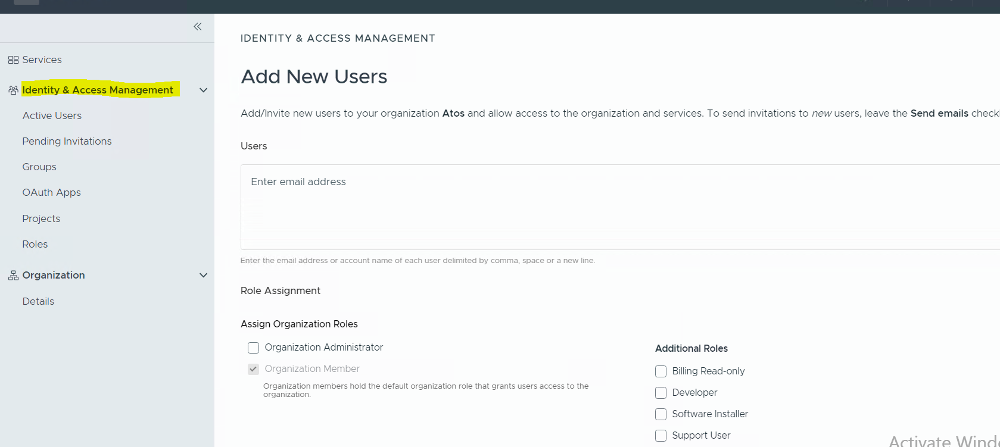

Next, add service roles to the user based on what you plan to provide.

The following are available roles for VMC on the AWS service, as indicated in the table.

| Role Name  | Rights in this Role  |
| :----: | ---- |
| Administrator   | Full cloud administrator rights to all VMware Cloud on AWS service features. |
| NSX Cloud Admin | Perform all tasks related to deployment and administration of the NSX service. |
| Administrator (Delete Restricted) | Full cloud administrator rights to all VMware Cloud on AWS service features but cannot delete SDDCs or clusters. |
| NSX Cloud Auditor | View NSX service settings and events but cannot make any changes to the service. |
| NSX Security Admin | Perform all tasks accessible from the NSX Security tab. This role cannot make role assignments. |
| NSX Security Auditor | View but not modify settings accessible from the NSX Security tab. |
| NSX Network Admin | Perform all tasks accessible from the NSX Networking tab. This role cannot make role assignments. |
| NSX Network Auditor | View but not modify settings accessible from the NSX Networking tab. |

NSX Roles and Permitted Tasks

| Task  | NSX Cloud Admin  | NSX Cloud Auditor | NSX Security Admin | NSX Security Auditor | NSX Network Admin | NSX Network Auditor |
| :----: | ---- | ---- | ---- | ---- | ---- | ---- |
| Open NSX Manager | YES | YES | YES | YES | YES | YES |
| Activate NSX Advanced Firewall | YES | No | YES | No | YES | No |
| View SDDC Networking & Security tab | YES | YES | YES | YES | YES | YES |
| Edit NSX Default Access | YES | No | YES | No | YES | No |

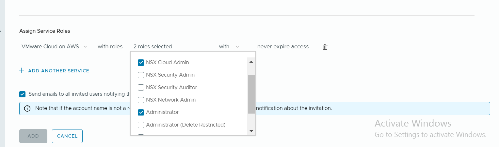

We can restrict users to SDDC roles in order to access Vcenter. These roles include

- CloudAdmin
- CloudGlobalAdmin
- CloudAdminRestrictedAccess

#### 3.3.1.2 Configuring Customer Active Directory in VCS vIDM

We are using VMware Identity Manager as a SSO in VCS. We will be adding Customer Active Directory in VCS vIDM so that customer can use their own domain accounts for logging on the VCS AWS by integrating to it. Below details will be requested from customer for this configuration.

| Required Detail | Description  |
| :----: | ---- |
| custDomainName | FQDN of Customer domain. for example - dhctestad.next |
| custBaseDN | Require DN name where users available in customer AD in the format CN=Users,DC=dhctestad,DC=next |
| custBindDN | DN for the user which will be used to authenticate customer AD in the format CN=Administrator,CN=Users,DC=dhctestad,DC=next |
| custBindPassword | Password for the user provided for customer AD authentication in previous step. |
| custDomainControllerHost | IP address of Customer domain controller |
| groupNUsersDn | DN for the group which need to be sync in vIDM to pull users from customer AD in the format CN=Users,DC=dhctestad,DC=next. All groups which we will be integrated to AWS for RBAC, should be inside this OU so that they can be searched by vIDM |

#### 3.3.1.3 Configuring RBAC in AWS

After customer AD is added to vIDM, we can add roles to the AD groups from AWS IAM console access. The customer will need to add into the group inside OU which will be provided for groupNUsersDn in step 3.3.1.2

### 3.3.2 VMC Security

- Security hub scans VMC

  - VMware Cloud on AWS holds numerous global regulatory compliance certifications. This validates the security and resilience of the design and operations of VMware Cloud on AWS, making it easy for organizations to quickly develop and migrate workloads into the public cloud.
  - Refer the Below Document to find more details on complaince reports. [Regulatory Complaince](https://vmc.techzone.vmware.com/compliance-vmware-cloud-aws)

- Security Features

  - Micro-segmentation
  - Source NAT
  - Edge firewalls
  - Distributed Firewall

  Refer [4.5 NSX Services](#45-nsx-services) to know more about what NSX services are provided in VMC on AWS

## 3.4 Licensing

SDDC component appliances are covered by the vRealize Suite license and no additional licensing is required.

## 3.5 Monitoring

Using a combination of the SDDC Health Monitoring Solution (vROPS Management Pack) pack, all components necessary for VMC on AWS setup can be monitored out of the box

When one component becomes unavailable an alert will be raised for that particular component.

Extend the monitoring capabilities of your vRealize Operations to monitor the VMware Cloud on AWS by creating a cloud account.

Follow this document for Integrating on-prem VROPS with VMC on AWS - [VROPS Integration](../workInstructions/wiVmcOnAwsDeploymentGuide.md/#vrealize-operations)

### Figure 4. Integration with on-prem VROPS

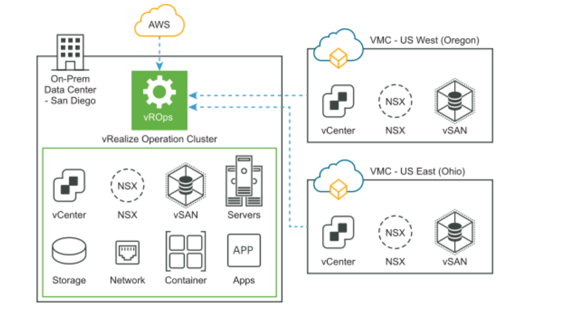

### VMC Integration with On-Premises Product

We are Integrating our On-prem products like VRA,VROPS,VRLI,VNI for monitoring and logging purposes

### Limitations

- Logs from VMC on AWS cannot be sent to an on-premises location. In order to aid with data transfer, we have set up a cloud proxy server on-premises and have set up a VRLI Cloud on VMC on AWS. For logging and monitoring purposes, we are forwarding the data to VRLI on-prem. Both VRNI and VRLI utilize these procedures.<br>For detailed steps see document [VMC Integration with On-prem Product](../workInstructions/wiVmcOnAwsDeploymentGuide.md/#vmware-aria-operations-for-logs)

### Figure 5. Integration with on-prem VRLI

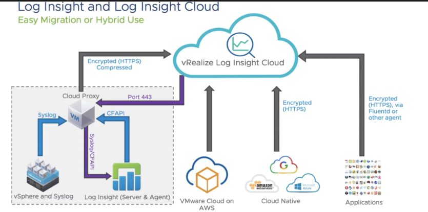

>[!NOTE]
>
>**Vrealize Products at the advanced tier are free.**

# 4 Detailed physical design

## 4.1 Detailed design firewall

**Overview Diagram**

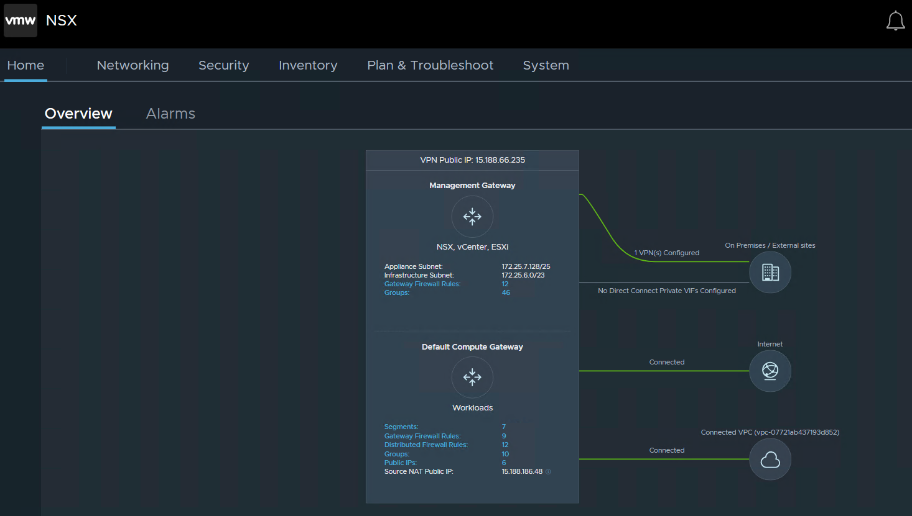

### 4.1.1 Design Decisions - Firewall

| Decision ID | Design Decision | Design Justification | Design Implication |
| --- | --- | --- | --- |
| 001 | NSX-T based firewalls will be enabled for SDDC components separation | Security requirements | None |
| 002 | Traffic between VPC, SDDC components, vRA Appliances, vIDM, vLCM and vSphere Management Components (vCenter, NSX-T Manager) is allowed via NSX-T firewall | Required for functionality | NA |

### 4.1.2 Firewall rules

#### Management Gateway Path

Open **NSX Manager** // Go to **Security** Tab // **Gateway Firewall** // Click on **Management Gateway** as highlighted in the below Screenshot.

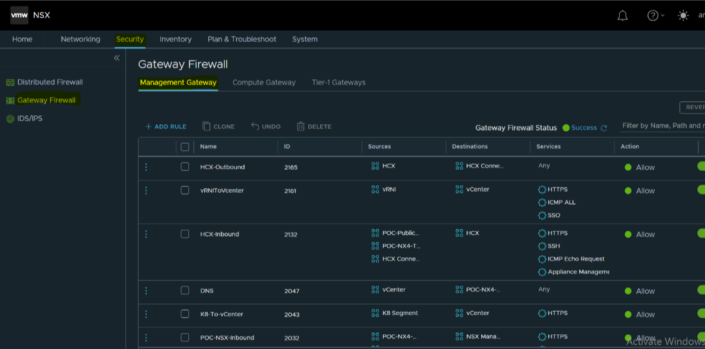

#### RuleSet

| Firewall Rule Name | Source        | Destination | Service                                                      | Action | Annotation |
| ------------------ | ------------- | ----------- | ------------------------------------------------------------ | ------ | ---------- |
| HCX Outbound       | HCX-On-Prem   | HCX-Cloud   | Any                                                          | Allow  |            |
| HCX Inbound        | HCX-Cloud     | HCX-On-Prem | HTTPS<br />SSH<br />ICMP Echo Request<br />Appliance Management (TCP 9443) | Allow  |            |
| vRNI to vCenter    | vRNI          | vCenter     | HTTPS<br />ICMP ALL<br />SSO                                 | Allow  |            |
| NSX Inbound        | Vrops-On-Prem<br />TSS-On-Prem<br />DNS-On-Prem<br />vRNI-On-Prem<br />VRA-On-Prem | NSX-Manager  | HTTPS<br />ICMP ALL                                 | Allow  |            |
| TSSToVCenter       | TSS           | vCenter     | 443 (https)<br />(icmp)                                      | ACCEPT |            |
| vRLI               | vRLI          | vCenter     | 443 (https)<br />22(ssh)<br />(icmp)                         | ACCEPT |            |
| vRA                | vRA           | vCenter     | 443 (https)                                                  | ACCEPT |            |
| SNOWDiscovery      | mid           | vCenter     | 443 (https)                                                  | ACCEPT |            |
| TSSToHCXVMC        | TSS           | HCX VMC     | 443 (https)<br />22 (ssh)<br /> (icmp)<br />9443 (Appliance Management) | ACCEPT |            |
| HCXToHCXVMC        | HCX Connector | HCX VMC     | 443 (https)<br />22 (ssh)<br /> (icmp)<br />9443 (Appliance Management) | ACCEPT |            |

#### Compute Gateway Path

Open **NSX Manager** // Go to **Security** Tab // **Gateway Firewall** // Click on **Compute Gateway** as highlighted in the below Screenshot.


#### RuleSet

| Firewall Rule Name | Source        | Destination | Service                                                      | Action | Annotation |
| ------------------ | ------------- | ----------- | ------------------------------------------------------------ | ------ | ---------- |
| Outbound Connection OnPrem | Compute-VM-Any<br />K8-Segment | Any    | Any                                                          | Allow  | K8 Segment is automatically created when we enable Tanzu on VMC on AWS |
| Inbound Connection OnPrem | OnPrem-Subnet | Compute-VM-Any<br />K8-Segment | Any                                                          | Allow  | K8 Segment is automatically created when we enable Tanzu on VMC on AWS |

#### Segments

Open **NSX Manager** // Go to **Networking** Tab // Click on **Segments** as highlighted in the below Screenshot.

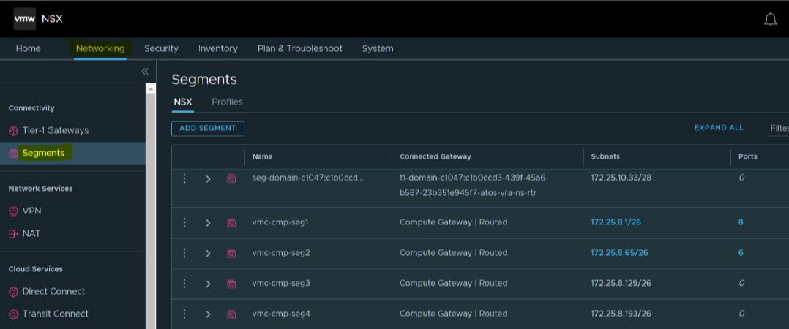

**NOTE:** We can create segments as per customer requirement

## 4.2 IP Addressing

Below are the Reserved IP addresses for VMC on AWS.

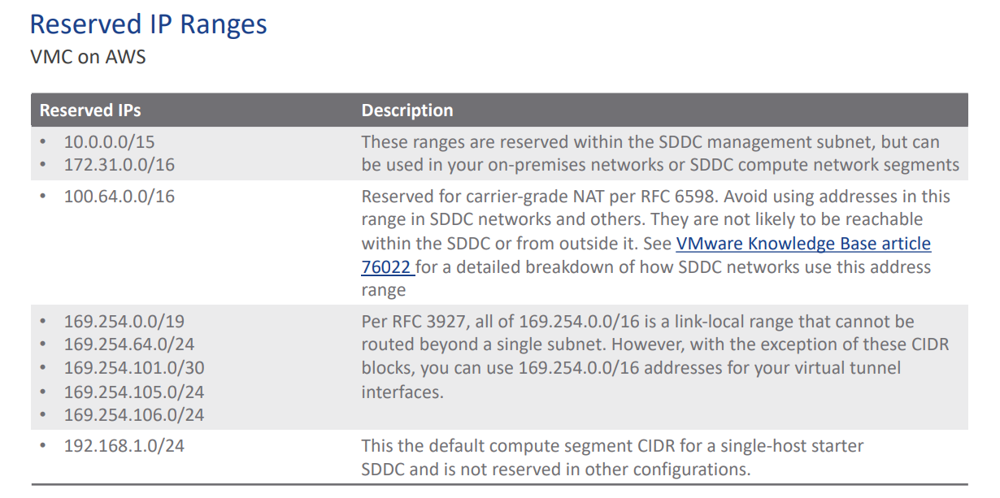

## 4.3 Name Resolution

Name resolution provides the translation between an IP address and a fully qualified domain name (FQDN), which makes it easier to remember and connect to components across the SDDC. The IP address of each component node and the load balancer VIP must have a valid internal DNS forward (A) and reverse (PTR) record.

### Design Decisions on Name Resolution for vRealize Automation

| Decision ID | Design Decision  | Design Justification  | Design Implication |
| :----: | ---- | ---- | ---- |
| DD-001 | Configure forward and reverse DNS records for each SDDC component node IP address and for the NSX load balancer virtual server IP address. | VMC components on AWS is accessible by using a fully qualified domain name instead of by using IP addresses only. to check the SDDC need to login AWS console. | We must provide DNS records for each SDDC Component node and the NSX load balancer virtual server IP address. |
| DD-002 | Configure DNS servers for each SDDC component on AWS console. | Ensures that all components has accurate name resolution on which its services are dependent. | DNS infrastructure services should be highly-available in the environment. |

## 4.4 Time Synchronization

vRealize Automation depends on system time synchronization for all cluster nodes. The system time for the VMC nodes, along with dependencies and integrations, such as vRealize Lifecycle Manager, Workspace ONE Access, and vRealize Operations Manager, must be synchronized and must use the same timezone.

### Design Decisions on Time Synchronization for vRealize Automation

| Decision ID | Design Decision  | Design Justification  | Design Implication |
| :----: | ---- | ---- | ---- |
| DD-001 | Configure NTP servers for each SDDC components on AWS. | Ensures that SDDC components on AWS has accurate time synchronization on which its services are dependent. | NTP infrastructure services should be highly-available in the environment. |

## 4.5 NSX Services

### Networking and Connectivity Features

- L2VPNs
- Route-based IPsec VPNs
- Policy-based IPsec VPNs
- Isolated networks
- AWS Direct Connect
- DHCP relay
- Multiple DNS zones
- Distributed routing

### Security Features

- Source NAT
- Edge firewalls
- Distributed Firewall (DFW)

### Network Operations Features

- Port mirroring
- IPFIX

### NSX Advanced Firewall Features

This service includes:

- NSX Layer 7 Context Profile
- NSX Identity Firewall
- NSX Distributed FQDN Filtering.
- NSX Distributed IDS/IPS (free trial)

To activate the `NSX Advanced Firewall` service in your SDDC, open the `Integrated Services` tab and click `ACTIVATE` on the `NSX Advanced` card. After the service is activated, NSX advanced security features become available in our SDDC.

## 4.6 Dashboards

The VMware Cloud on AWS dashboards allow you to track the capacity, cost, and inventory overviews of the SDDCs. You can also track the virtual machines monitoring and the utilization and performance of these SDDCs.

Below is a list of the pre-defined dashboards in vROps. Custom dashboards are made available by operations on a customer by customer basis and are not in this document.

To view these dashboards , Go to **Visualize** > **Dashboards** > **All** > **VMware Cloud on AWS**

| Dashboard                  |
| -------------------------- |
| VMC Capacity |
| VMC Cost Overview |
| VMC Inventory |
| VMC Configuration Maximums |
| VMC Management VM Monitoring |
| VMC Utilization and Performance |

## 4.7 Billing and Metering

Automated script data collection and export to a common place is used for billing and metering (using CSI service)

If VCS environment is integrated with VMC . We need to generate billing report for VMC as well

1. We need to set the config file variable `VMC_Integrated = "yes"` for the VMC billing report. The config file is located under the following path.

   ```shell
   /home/billing-user/workunits/config/config.py
   ```

2. In the config file, we need to provide data like the VMC vcenter IP address, username, port etc..,

3. The `vmc.py` script helps with performing VMC billing after generating a VCS billing report.

4. The VMC report and VCS report will both be sent to the gcp bucket.

For more information, see [wiConfigureBilling.md](../workInstructions/wiConfigureBilling.md).

## 4.8 Backup

### 4.8.1 Avamar Backup

### 4.8.1 Avamar Backup

For VMC on AWS the Avamar Backup Solution is used which is provided by CEB Team (Canopy Enterprise Backup). For further assistance contact Backup team at `rocloudiaasbackupceb@atos.net` .

The solution is more dependent on the customer’s requirements and RTO/RPO for systems tends to be decided based on the criticality of those workloads, by default an RPO of 24 hours and an RTO of 48 hours with a 30-day retention period will be offered, however this is customizable based on requirements.

### Figure 6. General Architecture

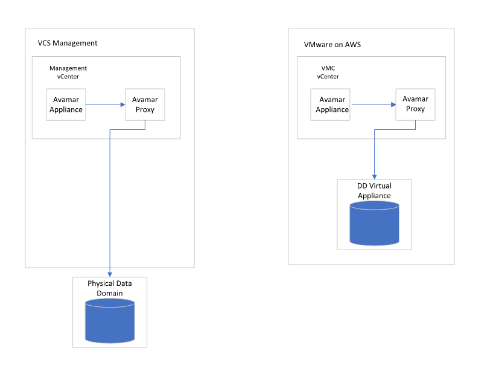

### 4.8.2 AWS Backup

AWS Backup is a fully-managed service that makes it easy to centralize and automate data protection across AWS services, in the cloud, and on premises. Using this service, you can configure backup policies and monitor activity for your AWS resources in one place. It allows you to automate and consolidate backup tasks that were previously performed service-by-service, and removes the need to create custom scripts and manual processes. With a few clicks in the AWS Backup console, you can automate your data protection policies and schedules.

Supported AWS resources and third-party applications

| Supported resource  | Supported resource type  |
| :----: | ---- |
| Amazon Elastic Compute Cloud (Amazon EC2 ) | Amazon EC2 instances (excluding instance store-backed AMIs) |
| Amazon Simple Storage Service (Amazon S3) | Amazon S3 data |
| Amazon Elastic Block Store (Amazon EBS) | Amazon EBS volumes |
| Amazon DynamoDB | Amazon DynamoDB tables |
| Amazon Relational Database Service (Amazon RDS) | Amazon RDS database instances (including all database engines); Multi-Availability Zone clusters |
| Amazon Aurora | Aurora clusters |
| Amazon Elastic File System (Amazon EFS) | Amazon EFS file systems |
| FSx for Lustre |  FSx for Lustre file systems |
| FSx for Windows File Server | FSx for Windows File Server file systems |
| Amazon FSx for NetApp ONTAP | FSx for ONTAP file systems |
| Amazon FSx for OpenZFS | FSx for OpenZFS file systems |
| AWS Storage Gateway (Volume Gateway) | AWS Storage Gateway volumes |
| Amazon DocumentDB | Amazon DocumentDB clusters |
| Amazon Neptune | Amazon Neptune clusters |
| Amazon Redshift | Amazon Redshift clusters |
| Amazon Timestream | Amazon Timestream clusters |
| VMware Cloud on AWS | VMware Cloud virtual machines on AWS |
| VMware Cloud on AWS Outposts | VMware Cloud virtual machines on AWS Outposts |
| AWS CloudFormation | AWS CloudFormation stacks |
| SAP HANA databases | SAP HANA databases on Amazon EC2 instances |

# 5 Detailed design Availability and Scalability

## 5.1 Detailed design availability details

We are using Availability Zones setup for VMC on AWS to achieve High Availability. The design decisions are made to guarantee availability of cloud automation services.

## 5.2 Detailed design scalability

The scalability will be taken care by the AWS in case of the hardware issues without any impact.

## 5.3 Storage class consistency between VCS – VMC

Storage Policies can be used to define things like disk stripes, IOPS limits, space or cache reservation, and availability. In this particular use case, we are interested in weighing up the availability options with space efficiency:

- No data redundancy: requires 1 host, 100GB of data used writes 100GB of data in the back end.
- RAID1 FTT1: RAID1, requires 3 hosts, 100 GB of data used writes 200GB of data in the back end. In this scenario, vSAN adds a second copy of the data, and a witness copy to prevent a split-brain situation. The object stays available with protection against up to 1 failed component, such as a host or disk. Although the storage consumption has doubled, reads are load balanced to accelerate performance, writes still need to be synchronously committed.
- RAID1 FTT2: RAID1, requires 5 hosts, 100GB of data used writes 300GB of data in the back end. You can include more failures to tolerate but the storage consumption continues to increase.
- RAID5 or RAID6 with Erasure Coding: by implementing an erasure coding policy, instead of storing a complete copy data gets broken up into multiple segments. We can lose any 1 chunk of that data and not suffer data loss; however, there is additional I/O associated with managing the parity copy. Furthermore, in the event of a failure, the data has to be rebuilt, meaning the potential for a compute and I/O overhead during this time. Despite this, the policy proves useful for space efficiency where workloads may not be hugely performance intensive.
- RAID5 FTT1: RAID5 configuration with erasure coding and failures to tolerate set to 1, expect this to require approximately 1.3x capacity.
- RAID6 FTT2: RAID6 configuration with erasure coding and failures to tolerate set to 2, expect this to require approximately 1.5x capacity.

Each of the capacity estimates above is within a vSAN fault domain, which equates to an Availability Zone for VMC on AWS. If you are using a Stretched Cluster, further attributes can be applied concerning the Availability Zone (or site) location of the data.

You can choose from the following options when configuring Storage Policies:

- Dual-site mirroring (stretched cluster)
- None, keep data on primary (stretched cluster)
- None, keep data on secondary (stretched cluster)

When using dual-site mirroring, the amount of storage consumed is doubled. For example, a RAID5 FTT1 policy using dual-site mirroring would require approximately 2.6x capacity. A RAID6 FTT2 policy using dual-site mirroring would require 3x capacity; in other words 100GB of data would consume 300GB on disk but be resilient across fault-domains / sites.

# 6 Design SDDC in multiple availability zones under Region

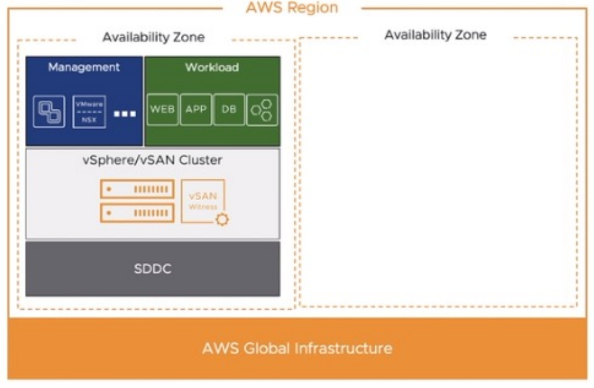

We will be deploying the SDDC on the multiple AZ's on single region. So there won't be much impact to the customer and the services will be running smoothly.

# 7 SNOW CIs

Utilizing our Environment Mid server, discovery is scheduled for VMC on AWS Vcenter in order to discover every VM's and establish a CI in SNOW portal.

Refer this Document For Discovery Process - [SNOW Discovery Guide](../workInstructions/dhcSnowDiscoveryDeploymentGuide.md)

**Dependency View of Discovered CI's**

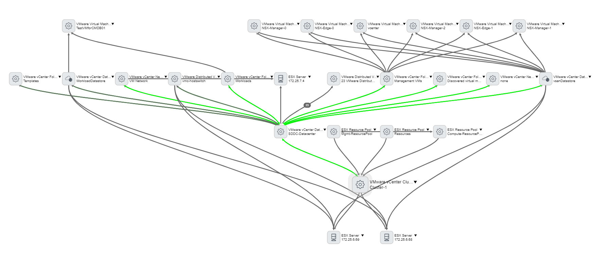

# 8 HCX

HCX is an application mobility platform designed for simplifying workload migration across data centers.

The left side of the diagram below highlights the areas of the customer on-premise location, which is a source (HCX Connector). The right side is a destination (HCX Cloud Manager), where the customer workload will get migrate on cloud platform.


Below components are used in above diagram:

- HCX Manager: This is the brain of the HCX environment of site. HCX Manager talks with all the component at site like AD/NTP/DNS/Log server, vCenter, NSX Manager, vmware.com, HCX interconnect, HCX network extension etc.
- HCX Interconnect (HCX-IX): It provides the migration capabilities over wan link.
- HCX WAN optimizer (HCX-WAN-OPT): It improves the WAN link performance by compressing the data.
- HCX Network Extension (HCX-NE): It extends the L2 network to the remote HCX enabled site.

## Migration Options

- VMware HCX Bulk Migration
- VMware HCX vMotion
- VMware HCX Cold Migration
- VMware HCX Replication Assisted vMotion (RAV)
- VMware HCX OS Assisted Migration

For More details regarding the HCX, [HCXLLD](lldHcx.md) document for more reference..

# 9 Shared Responsibility with VMC on AWS

Here it provides the shared responsibilities details and if any Vulnerabilities related to SDDC, and infrastructure are collaboratively remediated by VMWare and AWS.

**RACI Matrix**

| No. | Task | Supplier | AWS | VMware | Customer |
| :----: | ---- | ---- | ---- | ---- | ---- |
| 1 | SDDC Network management (Logical Networks, Firewall, NAT, IPAM, etc) | x | | | |
| 2 | SDDC Network management (create, edit, remove distributed virtual port groups) | x | | | |
| 3 | On Premise (Atos data center LAN) to VMC network management (create, edit, remove, monitor on premise to customer SDDC logical network) | x | | | |
| 4 | SDDC Lifecycle Management - NSX, vSAN, ESX, vCenter | | | x | |
| 5 | Physical infrastructure security, audit and compliance | | | x | |
| 6 | Physical Infrastructure Deployment Rack and Power Bare Metal Hosts / Network Equipment | | x | | |
| 7 | SDDC Backup/Restore | | | x | |
| 8 | SDDC Health Monitoring / Fix | | | x | |
| 9 | Managing vulnerabilities - NSX, vSAN, ESX, vCenter | | | x | |
| 10 | Managing vulnerabilities – hosted Atos/Customer managed VMs | x | | | x |
| 11 | Create/Change/Remove hosted VMs | | | | x |
| 12 | Backup/Restore / DR protect hosted VMs | x | | | |
| 13 | AWS Landing Zone setup and access management | x | | | |

See [Shared Responsibility with VMC on AWS](../workInstructions/WiVMCSharedResponsibility.md) document for more reference..

# 10 vSAN encryption and key storage

As per [VMware Documentation](https://docs.vmware.com/en/VMware-Cloud-on-AWS/services/com.vmware.vsphere.vmc-aws-manage-data-center-vms.doc/GUID-BA83AFC8-45AF-44DC-8295-E8D7DC168A49.html) -

- vSAN encrypts all user data at rest in VMware Cloud on AWS.
- Encryption is enabled by default on each cluster deployed in your SDDC, and can't be turned off.
- When you deploy a cluster, vSAN uses the AWS Key Management Service (AWS KMS) to generate a Customer Master Key (CMK), which is stored by AWS KMS. vSAN then generates a Key Encryption Key (KEK) and encrypts it using the CMK. The KEK is in turn used to encrypt Disk Encryption Keys (DEKs) generated for each vSAN disk.
- You can change KEKs by using either the vSAN API or the vSphere Client UI. This process is known as performing a shallow rekey. Changing the CMK or DEKs is not supported. If you must change the CMK or DEKs, create a new cluster and migrate your VMs and data to it.

# 11 Tanzu Kubernetes Cluster

Tanzu Kubernetes Grid is a managed service offered by VMware Cloud on AWS. Activate Tanzu Kubernetes Grid in one or more SDDC clusters to configure Tanzu support in the SDDC vCenter.

## 11.1 Tanzu Services in the Cloud

Like vSphere, Tanzu services in your VMware Cloud on AWS SDDC work very much like they do in an on-premises data center. Because some vSphere and Tanzu components are managed by VMware, a few of the on-premises administrative workflows that you're familiar with aren't needed when you use Tanzu Kubernetes Grid with VMware Cloud on AWS.

[Tanzu Kubernetes Cluster](../workInstructions/wiVmcOnAwsDeploymentGuide.md/#deploy-tanzu-kubernetes-cluster-from-on-prem-vrealize-automation) document for more reference.

As a platform operator or infrastructure operator, you can use VMware Tanzu Mission Control (TMC) to register Tanzu Kubernetes Grid management clusters, provision new workload clusters, and manage the lifecycle of these clusters.

When you register a management cluster (Tanzu Kubernetes Grid or Tanzu Kubernetes Grid Service), you can bring all of its workload clusters under the management of Tanzu Mission Control (TMC) , which allows you to facilitate consistent management using all of the capabilities of Tanzu Mission Control, as well as provisioning resources and creating new clusters directly from Tanzu Mission Control.

# 12 Tagging

Tagging is possible in VMware Cloud on AWS. Tagging allows you to add metadata to your resources, such as virtual machines (VMs), storage, networks, and other components within your VMC environment. These tags can then be used for organizing, managing, and tracking your resources based on various attributes or criteria.

In VMC Vcenter, we can add a tag under `Tags and Custom Attributes`.

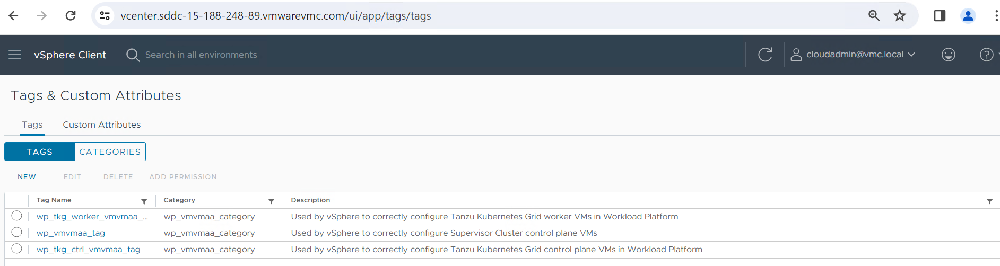
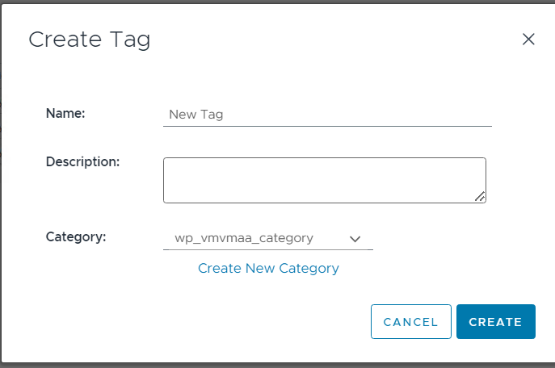
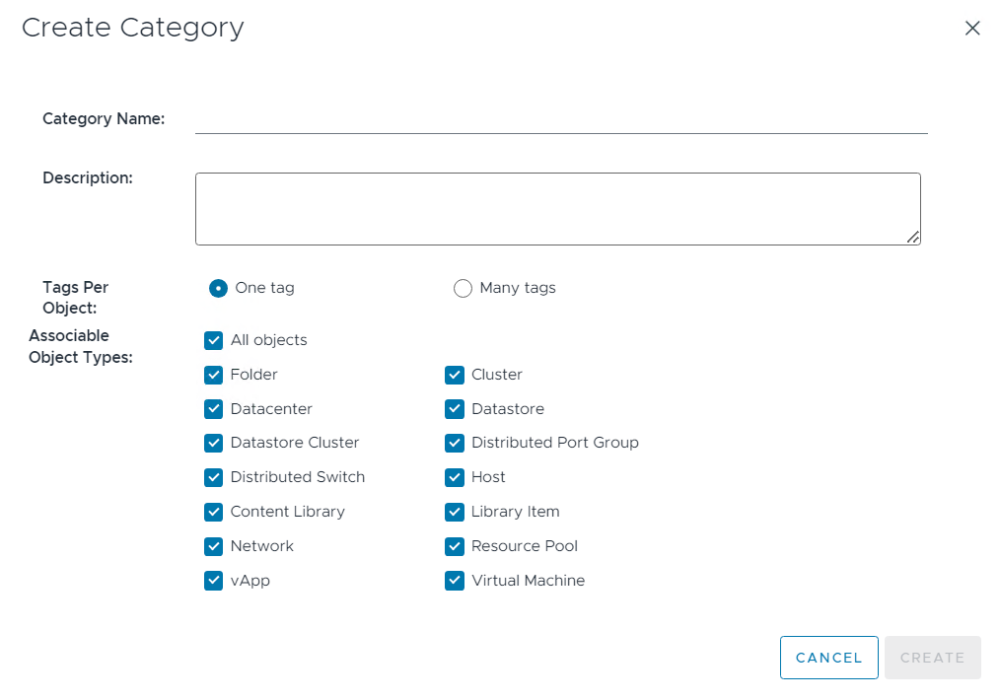
