# vRA OnPrem LLD

# 1 Introduction

## 1.1 Author

| Author name | Author email                       | Date   |
| :---------: | :--------------------------------: | :----: |
| Alpesh Kumbhare |  `alpesh.kumbhare@atos.net` | 25.04.2022 |

### 1.1.1 Changelog

| Author name | Author email | Date | Comments |
| :---------: |  :---------: |:----:|:--------:|
| Alpesh Kumbhare | `alpesh.kumbhare@atos.net` | 25.04.2022 | initial draft of document |
| Alpesh Kumbhare | `alpesh.kumbhare@atos.net` | 21.06.2022 | DHC-4488-Multitenancy update |
| Alpesh Kumbhare | `alpesh.kumbhare@atos.net` | 28.07.2022 | CESDHC-384-on-prem-update-hld-with-vra-on-prem-changes |
| Arun Sompura | `arun.sompura@atos.net` | 14.09.2022 | CESVXR-599-Design-Vra-Multi-Site |
| Arun Sompura | `arun.sompura@atos.net` | 14.09.2022 | CESVXR-620-tagging strategy |
| Alpesh Kumbhare | `alpesh.kumbhare@atos.net` | 21.12.2022 | CESDHC-4486 updated details for Multitenancy  |
| Alpesh Kumbhare | `alpesh.kumbhare@atos.net` | 02.01.2023 | CESDHC-4496 updated details for Monitoring and Multitenancy  |
| Marcin Kujawski | `marcin.kujawski.external@atos.net` | 29.22.2023 | VCS-11515 add information about vra token autorotate for SSRs |
| Marcin Kujawski | `marcin.kujawski.external@atos.net` | 07.03.2024 | VCS-12377 add design drawings, update product naming and add LLD for vRA MT |
| Marcin Kujawski | `marcin.kujawski.external@atos.net` | 13.08.2024 | Update for new catalog items and look and feel of catalog items, latest design updates |
| Marcin Kujawski | `marcin.kujawski.external@atos.net` | 04.09.2024 | VCS-13683 Update managed tag for VM |
| Marcin Kujawski | `marcin.kujawski.external@atos.net` | 06.09.2024 | VCS-13750 Add SDN microsegmentation tags for NSX-T |

## 1.2 Purpose

The purpose of this document is to provide detailed design and architectural guidance required to implement VMware Aria Automation (vRA) OnPrem for Customers in accordance with Atos standards and portfolio services.

The principal aim of this document is to translate the high-level design (HLD) into a technical low-level design (LLD).

Design is providing component architecture overview in Architecture Overview chapter that provides basic building blocks and main principles, followed by Detailed Logical Design.

Architecture Overview provides basic building blocks and main design principles of presented design. It is covering known requirements cascaded from HLD and other LLDs.

Detailed Physical Design provides detailed configuration of components.

## 1.3 Audience

This document is intended for Atos Cloud Services Engineers and Architects responsible for VMware Cloud Services (VCS) solution implementation and maintenance.

## 1.4 Scope

This LLD is intended to cover below components and domains:

- VMware Aria Automation OnPrem design for VCS.

This LLD is not covering:

- Installation guides for VMware Aria Automation OnPrem.

## 1.5 Related Documents

This document is a subset of Atos Technology Lifecycle Management (ATLM) artifacts. All documents are stored in the VCS documentation repository.

| Document Name |
| ------------- |
| [VMware Cloud Services: High Level Design](hldDigitalHybridCloud.md) |
| [Naming Convention principles](namingConvention.md) |

Table 1 ATLM Related Documents

## 1.6 Requirement Levels

This document is following below mentioned principles to categorize all requirements and design decisions.

| Term | Meaning |
| --- | --- |
| MUST | The definition is an absolute requirement of the specification. |
| MUST NOT | The definition is an absolute prohibition of the specification |
| SHOULD | There may exist valid reasons in particular circumstances to ignore a particular item, but the full implications must be understood and carefully weighed before choosing a different course |
| SHOULD NOT | There may exist valid reasons in particular circumstances when the particular behaviour is acceptable or even useful, but the full implications should be understood, and the case carefully weighed before implementing any behaviour described with this label |
| MAY | Any design decisions that are not classified as MUST and SHOULD or covering optional feature that is not general available for VCS product |

# 2 Architecture Overview

VCS is using VMware Aria Automation Service Broker to provide Customer portal functionality. This functionality can be delivered via a OnPrem offering. The diagram below highlights the areas of the VCS architecture in scope of this LLD (yellow).

## Figure 1. VCS Architecture

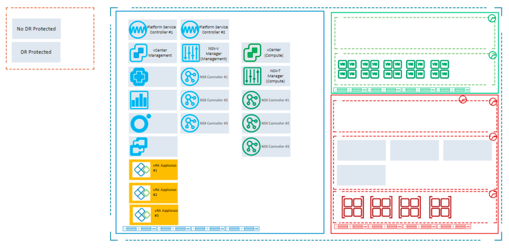

## 2.1 Business and Solution Requirements

The table below provides known requirements mandatory to be incorporated into design decisions described in this LLD.

| ID | Requirement description | Requirement Source | Requirement Level |
| --- | --- | --- | --- |
| R001 | Defined RBAC using federated Customer directory services | HLD | MUST |
| R002 | Defined requirements to support multitenancy design with multiple projects and tenant organizations | Portfolio requirement | MUST |
| R003 | Solution is using VMware Cloud Foundation SDDC and SDN workload domains / PODs as integration endpoints | HLD | MUST |
| R004 | Installation and configuration of required components is automated | VCS Principles | SHOULD |
| R005 | Automation domain must be patched in regular schedule with minimal impact into service availability | Portfolio | MUST |
| R006 | Defined Role Base Access Control (RBAC) model to ensure a proper security isolation | Portfolio | MUST |
| R007 | Define Multi-Tenancy model to ensure resource segregation for the different legal entities of the same customer | HLD | MUST |
| R008 | Service Broker portal is attractive to end user with intuitive form UI | HLD | MUST |

Table 2 Initial Requirements

# 3 Detailed logical design

## 3.1 VMware Aria Automation Architecture overview

- VMware VMware Aria Automation is part of the VMware Aria Suite. Also referred to as vRA, it allows you to create and manage your private cloud without the need for complex manual processes.
- It’s an automation tool for the private cloud. The tool also supports hybrid cloud models where you can integrate your private cloud with the public cloud.
- VMware Aria Automation 8.XX has been architected to support modern container based micro-services architecture which offers simplified management, configuration, improved performance and scalability. As a result, VMware Aria Automation 8.XX can scale better and greatly enhance the ability for its customers to deploy and manage multi-cloud environments.
- VMware Aria Automation 8.XX also overcomes the need to run portions of the architecture on a Windows server as earlier versions.
- VMware Aria Automation is a bundled offering of VMware Aria Automation Assembler, VMware Aria Automation Service Broker, VMware Aria Automation Code Stream, and VMware Aria Automation SaltStack Config. VMware Aria Automation contains an embedded VMware Aria Orchestrator instance.

## Figure 2. vRA 8.XX Appliance Architecture

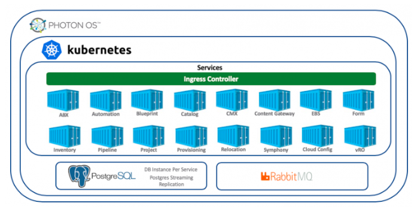

vRA is comprised of numerous services, running in separate containers, with a PostgreSQL database per container, RabbitMQ serves as the message broker.

The vRA Reference Architecture consists of these components:

- vRealize Lifecycle Manager
- VMware Identity Manager (aka Workspace One Access)
- VMware Aria Automation

## Figure 3. vRA 8.XX General Hardware Requirements

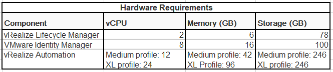

To ensure high availability and sufficient resources to handle multiple tenants and a large number of simultaneous requests, the recommended configuration consists of 3 VMware Aria Automation appliances forming a cluster and having an NSX Load Balancer serving the traffic to the nodes as well as a vIDM cluster with 3 nodes and an internal PostgreSQL database replicated between the nodes.

Looking at these Maximums, Medium profile for vRA appliance is suitable to be used in VCS.

So according to these facts, below are Actual hardware requirements for VCS vRA OnPrem-

## Figure 4. vRA 8.XX VCS Hardware Requirements

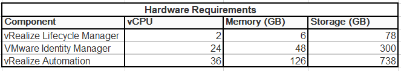

Out of these vRealize Lifecycle Manager and VMware Identity Manager are already part of Standard VCS deployment.

**Note-** In the case of multitenancy vRA, we will be upscaling vRA appliances to an extra large profile so the total vCPU for 3 vRA appliances will be 72 vCPU and the total memory will be 288 GB. No changes in storage capacity.

## 3.2 VMware Aria Automation Communication Flow

The diagram outlines the communication ports between clustered deployment components

## Figure 5. vRA 8.XX Communication Flow

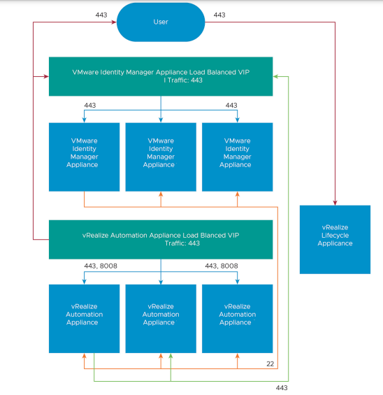

## 3.3 Security

### 3.3.1 Role Based Access Control

VMware Aria Automation provides a UI and RESTful API for consuming VMware Aria Automation services.

There are two parts for RBAC configuration.

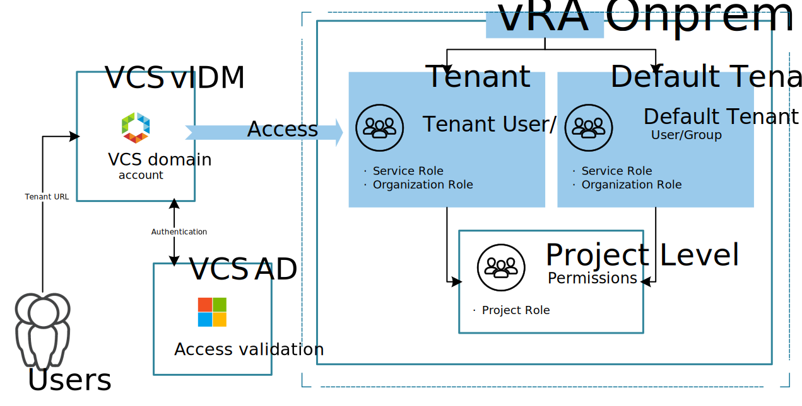

#### 3.3.1.1 Configuring Customer Active Directory in VCS vIDM

We are using VMware Identity Manager as a SSO in VCS. We will be adding Customer Active Directory in VCS vIDM so that customer can use their own domain accounts for logging on the VCS vRA. Below details will be requested from customer for this configuration.

| Required Detail | Description  |
| :----: | ---- |
| custDomainName | FQDN of Customer domain. for example - dhctestad.next |
| custBaseDN | Require DN name where users available in customer AD in the format CN=Users,DC=dhctestad,DC=next |
| custBindDN | DN for the user which will be used to authenticate customer AD in the format CN=Administrator,CN=Users,DC=dhctestad,DC=next |
| custBindPassword | Password for the user provided for customer AD authentication in previous step. |
| custDomainControllerHost | IP address of Customer domain controller |
| groupNUsersDn | DN for the group which need to be sync in vIDM to pull users from customer AD in the format CN=Users,DC=dhctestad,DC=next. All groups which we will be adding in vRA for RBAC, should be inside this OU so that they can be searched by vIDM |

#### 3.3.1.2 Configuring RBAC in vRA

After customer AD is added to vIDM, we can add groups from customer AD to vRA access. The customer will need to create the below group inside OU which will be provided for groupNUsersDn in step 3.3.1.1

| Group name | Description  |
| :----: | ---- |
| dhc-vra-service-broker-users | This group will have organization member role with User role for Service Broker |

### 3.3.2 Certificates

Initial vRA will be deployed using a certificate from the internal CA of VCS. As the customer will be using the vRA link inside their network, we will need to replace the internal certificate with customer provided certificate. There will be 3 choices for Certificates:

- Using VCS Internal CA certificates
- Using Customer CA certificates
- Using Public Certificates

## 3.4 Licensing

vRA appliances are covered by the vRealize Suite license and no additional licensing is required.

## 3.5 Monitoring

Using a combination of the SDDC Health Monitoring Solution (vROPS Management Pack) pack, all components necessary for vRA on-prem setup can be monitored out of the box

When one component becomes unavailable an alert will be raised for that particular component.

vRA uses the vRealize Health Broker to expose APIs through which vRA health can be monitored. SDDC Health Adapter collects metrics using Health Broker and VMware Aria Automation API.

We are also using Out-of-the-box vRLI monitoring for vRA appliances. There is an inbuilt service available inside vRA appliances which we will be configuring to enable monitoring of vRA appliances through vRLI. This vRLI monitoring will forward warnings and critical alerts to vROPS, and vROPS will create an incident ticket as per the criticality of the alert.

## 3.6 Supporting Infrastructure

VMware Aria Automation integrates with the following supporting infrastructure:

- DNS for providing name resolution for the VMware Aria Automation components.
- NTP for providing time synchronization to the VMware Aria Automation components.
- SMTP for sending email notifications from VMware Aria Automation.
- Workspace ONE Access, connected to an identity provider, for example, Active Directory, for identity and access management.

## 3.7 Multitenancy

VCS by design is enabled with multi-tenancy. Tenant separated capable solution is accommodating multiple tenants that share the same physical resources. A 'default-tenant' also is created in case of not using multi-tenancy.

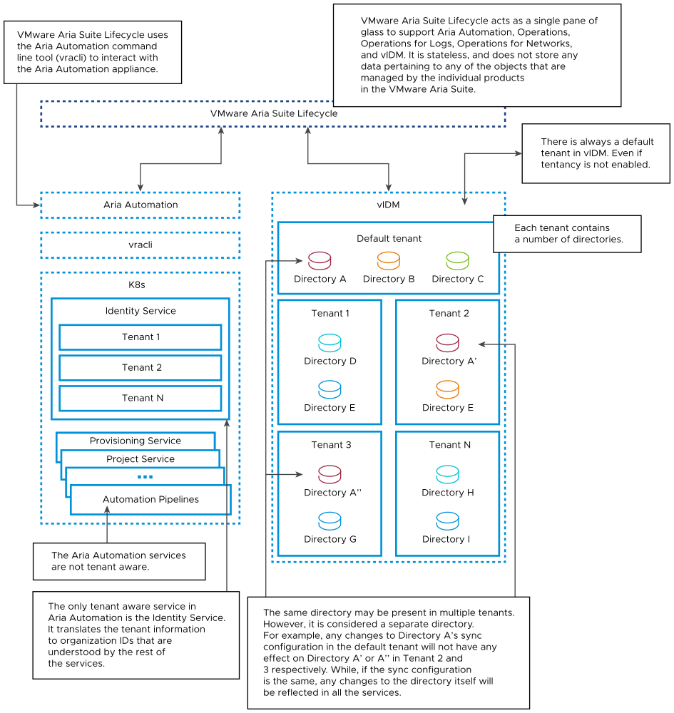

VMware Aria Automation enables customer to set up multiple tenants within each deployment. Providers can set up multiple tenant organizations and allocate infrastructure within each deployment. Providers can also manage users for tenants. Each tenant manages its own projects, resources, and deployments.

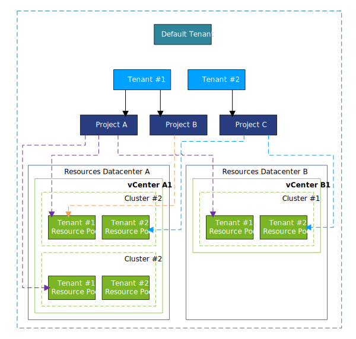

Multi-tenancy relies on coordination and configuration of three different VMware products as outlined below:

- **vRealize Identity Manager** – This product provides the infrastructure support for multi-tenancy and the Active Directory domain connections that provide user and group management within tenant organizations.
- **vRealize Suite Lifecycle Manager** – This product supports the creation and configuration of tenants for supported products, such as VMware Aria Automation. In addition, it provides certificate management capabilities.
- **VMware Aria Automation** – Providers and users log in to VMware Aria Automation to access tenants in which they create and manage deployments.

## 3.8 Multitenanty Low Level Design

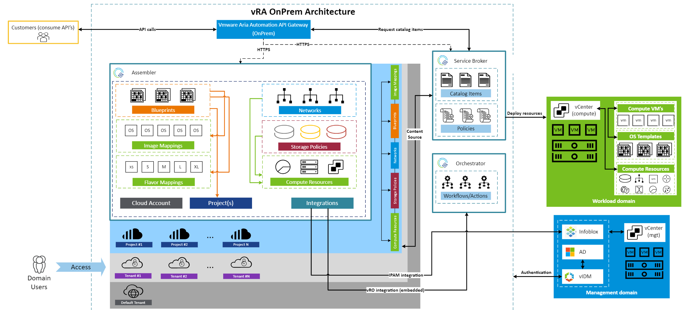

### Mandatory Certificate Requirements

Both VMware Workspace ONE Access and VMware Aria Automation require server certificates that have all the tenant FQDNs present within itself. Since each tenant forms its own tenant FQDN (both VMware Workspace ONE Access tenant FQDN and VMware Aria Automation tenant FQDN), every created tenant requires its tenant FQDN to be added as part of both VMware Workspace ONE Access and VMware Aria Automation certificates. Enabling multi-tenancy on VMware Workspace ONE Access also requires VMware Workspace ONE Access certificates updated as the primary tenant gets a new alias name and primary tenant FQDN undergoes a change.

| Certificate| SAN Requirements |
|---|---|
| vIDM (VMware Workspace ONE Access) Certificate | `idm001.<domain-name>`, `default-tenant.<domain-name>`, `*.<domain-name>` |
| vRA Certificate | `<vra-fqdn>`, `vra001.<domain-name>`, `vra002.<domain-name>`, `vra003.<domain-name>` |

For every new tenant, including the default tenant, there is a requirement to generate and apply a SAN Certificate to each system. This also means there is an incurred downtime for Aria Automation. Arranging this downtime in a multi-customer environment is difficult, hence a wild-card certificate is used to reduce the downtime and allow one single certificate to all tenanats.

### Mandatory DNS Requirements

For a single node VMware Workspace ONE Access A-type DNS record highlighting the tenant FQDNs to the VMware Workspace ONE Access server IP address is required.

For VMware Aria Automation, for a clustered VMware Aria Automation, CNAME type DNS records pointing VMware Aria Automation tenant FQDNs to the VMware Aria Automation load-balancer FQDN.

| DNS Record Type| Value | Description  |
|---|---|---|
| A | `default-tenant.<domain-name>` | vIDM (VMware Workspace ONE Access) load balancer IP |
| A | `tenant-1.<domain-name>` | vIDM (VMware Workspace ONE Access) load balancer IP |
| A | `tenant-2.<domain-name>` | vIDM (VMware Workspace ONE Access) load balancer IP |
| CNAME | `tenant-1.<vra-fqdn>` | VMware Aria Automation load balancer FQDN |
| CNAME | `tenant-2.<vra-fqdn>` | VMware Aria Automation load balancer FQDN |

| DNS Record Type| Value | Description  |
|---|---|---|
| A | `default-tenant.<domain-name>` | vIDM (VMware Workspace ONE Access) load balancer IP |
| A | `tenant-1.<domain-name>` | vIDM (VMware Workspace ONE Access) load balancer IP |
| A | `tenant-2.<domain-name>` | vIDM (VMware Workspace ONE Access) load balancer IP |
| CNAME | `tenant-1.<vra-fqdn>` | VMware Aria Automation load balancer FQDN |
| CNAME | `tenant-2.<vra-fqdn>` | VMware Aria Automation load balancer FQDN |

# 4 Detailed physical design

## 4.1 Detailed design firewall

### 4.1.1 Design Decisions - Firewall

| Decision ID | Design Decision | Design Justification | Design Implication |
| --- | --- | --- | --- |
| 001 | NSX-T based firewalls will be enabled for SDDC components separation | Security requirements | None |
| 002 | Traffic between vRA Appliances, vIDM, vLCM and vSphere Management Components (vCenter, NSX-T Manager) is allowed via NSX-T firewall | Required for functionality | NA |

### 4.1.2 Firewall rules

Outbound ports required to setup VMware Aria Automation 8 are outlined in the table below.

| Source                                             | Destination                                        | Port                                                 |
| -------------------------------------------------- | -------------------------------------------------- | ---------------------------------------------------- |
| VMware Identity Manager Load Balanced VIP       | VMware Identity Manager Appliances                 | 443                                                  |
| VMware Aria Automation Appliance Load Balanced VIP | VMware Aria Automation Appliances                     | 443, 8008                                            |
| VMware Identity Manager Appliances                 | VMware Identity Manager Load Balanced VIP       | 443                                                  |
| VMware Aria Automation Appliances                     | VMware Identity Manager Load Balanced VIP       | 443                                                  |
| End User                                           | VMware Identity Manager Load Balanced VIP       | 443                                                  |
| End User                                           | VMware Aria Automation Appliance Load Balanced VIP | 443                                                  |
| VMware Identity Manager Appliances                 | VMware Identity Manager Load Balanced VIP       | 443                                                  |
| VMware Identity Manager Appliances                 | VMware Identity Manager Appliances                 | 443                                                  |
| End User                                           | VMware Identity Manager Appliances                 | 443                                                  |
| VMware Aria Automation Appliances                     | VMware Identity Manager Appliances                 | 443                                                  |
| vRealize Lifecycle Manager Appliance               | VMware Identity Manager Appliances                 | 443                                                  |
| VMware Identity Manager Appliances                 | VMware Identity Manager Appliances                 | 443                                                  |
| vRealize Lifecycle Manager Appliance            | VMware Identity Manager Load Balanced VIP       | 443                                                  |
| vRealize Lifecycle Manager Appliance            | VMware Aria Automation Appliance Load Balanced VIP | 443                                                  |
| vRealize Lifecycle Manager Appliance            | VMware Identity Manager Appliances                 | 22, 443                                              |
| vRealize Lifecycle Manager Appliance            | VMware Aria Automation Appliances                     | 22, 443                                              |
| End User                                           | vRealize Lifecycle Manager Appliance            | 443                                                  |
| VMware Aria Automation Appliances                     | VMware Identity Manager Appliances                 | 443                                                  |
| VMware Aria Automation Appliances                     | VMware Identity Manager Load Balanced VIP       | 443                                                  |
| VMware Aria Automation Appliances                     | VMware Aria Automation Appliances                     | 10250, 6443, UDP 8285, 2379, 2380, UDP 500, UDP 4500 |
| End User                                           | VMware Aria Automation Appliances                     | 443                                                  |
| VMware Aria Automation Appliance Load Balanced VIP | VMware Aria Automation Appliances                     | 443, 8008                                            |
| vRealize Lifecycle Manager Appliance            | VMware Aria Automation Appliances                     | 22, 443                                              |
| VMware Aria Automation Appliances                     | VMware Aria Automation Appliances                     | 10250, 6443, UDP 8285, 2379, 2380, UDP 500, UDP 4500 |

## 4.2 IP Addressing

IP addresses and host names allocated statically to the VMware Aria Automation cluster nodes and the load balancer from cross region network.

By default, the following network ranges are reserved for the internal Kubernetes configuration in VMware Aria Automaton.

### Kubernetes Default Network Ranges

| Setting | Value |
| --- | --- |
| Kubernetes cluster IP range | 10.244.0.0/22 |
| Kubernetes service IP range | 10.244.4.0/22 |

If the Kubernetes default network ranges conflict with environment, we can override the defaults during the deployment of VMware Aria Automation. Additionally, we can reconfigure the settings as a day-two action by using vRealize Suite Lifecycle Manager.

## 4.3 Name Resolution

Name resolution provides the translation between an IP address and a fully qualified domain name (FQDN), which makes it easier to remember and connect to components across the SDDC. The IP address of each VMware Aria Automation cluster node and the load balancer VIP must have a valid internal DNS forward (A) and reverse (PTR) record.

### Design Decisions on Name Resolution for VMware Aria Automation

| Decision ID | Design Decision  | Design Justification  | Design Implication |
| :----: | ---- | ---- | ---- |
| DD-001 | Configure forward and reverse DNS records for each VMware Aria Automation cluster node IP address and for the NSX load balancer virtual server IP address. | VMware Aria Automation is accessible by using a fully qualified domain name instead of by using IP addresses only. | We must provide DNS records for each VMware Aria Automation cluster node and the NSX load balancer virtual server IP address. |
| DD-002 | Configure DNS servers for each VMware Aria Automation cluster node. | Ensures that VMware Aria Automation has accurate name resolution on which its services are dependent. | DNS infrastructure services should be highly-available in the environment. |

## 4.4 Loadbalancer

A VMware Aria Automation cluster deployment requires a load balancer to manage the connections to the VMware Aria Automation services.

This validated solution uses load-balancing services provided by NSX-T Data Center in the management domain. The load balancer is automatically created and configured by automation during the deployment of VMware Aria Automation.

### Design Decisions on Load Balancing for VMware Aria Automation

| Decision ID | Design Decision  | Design Justification  | Design Implication |
| :----: | ---- | ---- | ---- |
| DD-001 | Use the medium-size NSX load balancer that is configured by SDDC Manager on the dedicated NSX Tier-1 gateway in the management domain to load balance the connections across the VMware Aria Automation cluster nodes. | Required to deploy VMware Aria Automation as a cluster deployment type, enabling it to handle a greater load and obtain a higher level of service availability. | We must use the NSX load balancer that is configured by SDDC Manager and the integration with vRealize Suite Lifecycle Manager to support this network configuration. |

## 4.5 Time Synchronization

VMware Aria Automation depends on system time synchronization for all cluster nodes. The system time for the VMware Aria Automation nodes, along with dependencies and integrations, such as vRealize Lifecycle Manager, Workspace ONE Access, and vRealize Operations Manager, must be synchronized and must use the same timezone.

### Design Decisions on Time Synchronization for VMware Aria Automation

| Decision ID | Design Decision  | Design Justification  | Design Implication |
| :----: | ---- | ---- | ---- |
| DD-001 | Configure NTP servers for each VMware Aria Automation cluster node. | Ensures that VMware Aria Automation has accurate time synchronization on which its services are dependent. | NTP infrastructure services should be highly-available in the environment. |

# 5 Detailed design Availability and Scalability

## 5.1 Detailed design availability details

We are using Clustered setup for vIDM and vRA appliances to achieve High Availability. The design decisions are made to guarantee availability of cloud automation services.

## 5.2 Detailed design scalability

The scalability and concurrency limit tables outline the recommended maximums on VMware Aria Automation HA multi-tenant deployment is available [here](https://docs.vmware.com/en/vRealize-Automation/8.6/reference-architecture/GUID-9DD443EA-0F7A-43B3-AD0A-8370B56109BE.html)

# 6 Design Vra Multi-Site or Regional

We must explore the option of multi-site (regional deployment) where customers have multiple datacenters and they need single instance of vRA to manage and provision to their other datacenters. In such scenario multi-datacenter, multi-site vRA deployment will be feasible solution. However, it needs to be carefully planned and implemented an appropriate tagging strategy based on our VCS standard structure and goals to maximize Cloud Assembly functionality and minimize potential confusion.

VMware Aria Automation reference architecture for multi-site also referred as a regional deployment model.

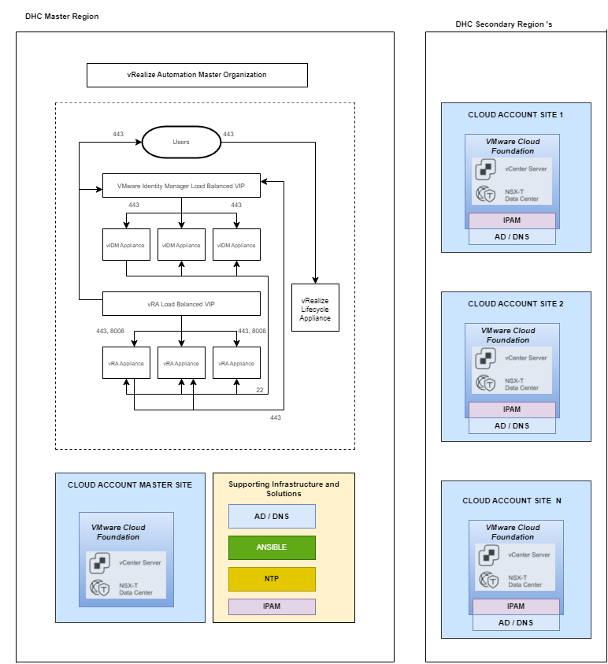

## 6.1 Design considerations

The logical design of VMware Aria Automation includes all the integrations of VMware Aria Automation with the supporting infrastructure, private cloud services, public cloud services, and external solutions, such as source control, IPAM, Kubernetes. The networking, identity and access management, product configurations, and secure access must be carefully designed for seamless integrations between VMware Aria Automation and other components

- IP Addressing Scheme : This is already achieved as a part of vRA on prem design and vRA instances are placed on cross-region virtual network segment
- Name Resolution : The vRA cluster nodes are resolvable by using DNS for this secondary zones can be created in a designated domain namespace, e.g. nx8dhc01.next
- Latency requirement : The multi-Site deployment as per VMware Maximum RTT (Round Trip Time) Latency for Private Endpoints (ms) up to 300ms is accepted.
- Physical design and Firewall : Existing vRA single site deployment firewall port and additionally some ports on firewall would be required for multi-site.

## 6.2 Physical design and Firewall for multi-site

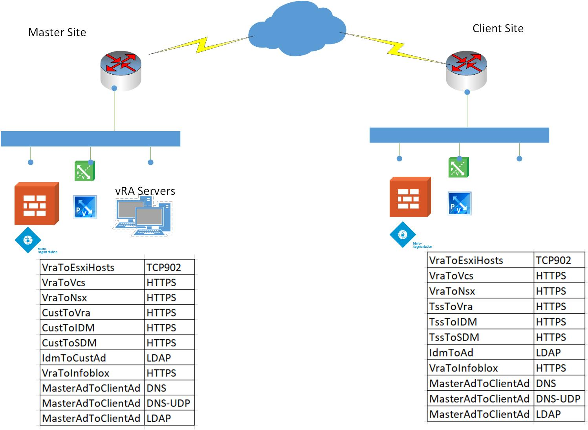

## 6.3 Future Design Consideration of vRA version 8.8 and above for multi-datacenter deployment

We can use a VMware Aria Automation Extensibility proxy to manage data centers from a single VMware Aria Automation instance.
VMware Aria Automation Extensibility proxy when vCenter servers are in geographically dispersed data centers, or in data centers that are not networked together. You can manage data centers from a single VMware Aria Automation instance instead of deploying a dedicated VMware Aria Automation instance for each vCenter server. The VMware Aria Automation Extensibility proxy is also referred to as the vREX proxy.

We can create or convert a vCenter cloud account in VMware Aria Automation to access the remote vSphere agent, for example in separate data centers that are not directly networked together. Instead of deploying an entire independent VMware Aria Automation deployment to a remote data center, We can use a vSphere agent within a specified VMware Aria Automation Extensibility proxy to act as a vCenter server proxy. In this scenario, using a VMware Aria Automation Extensibility proxy can improve network reliability and optimize vSphere provisioning and enumeration across data centers that may not be otherwise connected.

More details are available [here](<https://docs.vmware.com/en/vRealize-Automation/8.8/Using-and-Managing-Cloud-Assembly/GUID-E91D68A1-2242-41CE-A005-29373330B461.html>).

# 7 Tagging strategy

We must carefully plan and implement an appropriate tagging strategy based on our VCS standard and structure and goals to maximize Cloud Assembly functionality and minimize potential confusion.
While tagging serves several common purposes, tagging strategy must be tailored to our deployment needs like single site or multi-site, structure, and goals.

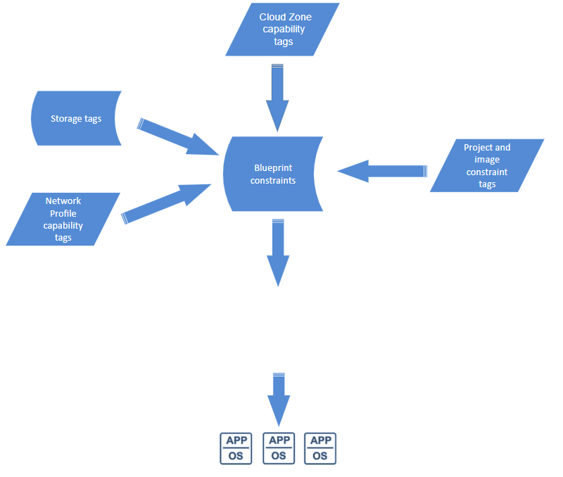

## 7.1 Best practices for tagging

Some general characteristics of an effective tag strategy:

- Design and implement a coherent strategy for tagging that relates to the structure of your business and communicate this plan to all applicable users. A strategy must support your deployment needs, use clear human readable language, and be understandable to all applicable users..
- Use simple, clear, and meaningful names and values for tags. For instance, tag names for storage and network items should be clear and coherent so that users can readily understand what they are selecting or reviewing tag assignments for a deployed resource.
- Though you can create tags using a name with no value, as a best practice, it is more appropriate to create an applicable value for each tag name, as this makes the tag usage clear to other users.
- Avoid creating duplicate or extraneous tags. For example, only create tags on storage items that relate to storage issues.

## 7.1 Tagging Implementation

Map out primary considerations for a basic tagging strategy. Be aware that these considerations are representative rather than definitive.
You might have other considerations that are highly relevant to VCS use cases. Your specific strategy must be appropriate for case to case.

## 7.2 Design Consideration for Tags

| Design Decision | Design Justification |
| --- | --- |
| VCS platform is using both capabilities and constraints tags | Flexibility in terms of addressing future customer needs by using native functionality |
| Tags are represented by **key:value** pair convention (small letters only accepted) | Simplify troubleshooting and introducing order for payload placement |
| By default hard constraints are used | Default implementation in automation platform |
| By default max 15 characters under key and value | Simplify key name and value content for future filtering and reporting |
| Only allowed special characters ("-") under key and value  | Simplify tags names and values to deliver naming standard  |

- **Capability Tags**

In Cloud Assembly, capability tags enable us to define placement logic for deployment of infrastructure components. They are a more powerful and succinct option to hard coding such placements.
You can create capability tags on compute resources, cloud zones, images and image maps, and networks and network profiles. Capability tags on cloud zones and network profiles affect all resources within those zones or profiles. Capability tags on storage or network components affect only the components on which they are applied.

- **Constraint Tags**

There are two main areas in Cloud Assembly where constraint tags are applicable. The first is on the configuration side in projects and images. The second is on the deployment side in blueprints. Constraints applied in both areas are merged in blueprints to form a set of deployment requirements.
If tags on the project conflict with tags on the blueprint, the project tags take precedence, thus allowing the cloud administrator to enforce governance rules
You can apply up to three constraints on projects. Project constraints can be hard or soft. By default they are hard. Hard constraints allow you to rigidly enforce deployment restrictions. If one or more hard constraints are not met, the deployment will fail. Soft constraints offer a way to express preferences that will be selected if available, but the deployment won't fail if soft constraints are not met.

- **VCS Standard Tags**

Below Cloud Assembly standard tags will be used in VCS to support analysis, monitoring, and grouping of deployed resources.

Standard tags are unique within Cloud Assembly. Unlike other tags, users do not work with them during deployment configuration, and no constraints are applied. These tags are applied automatically during provisioning deployments. These tags are stored as system custom properties, and they are added to deployments after provisioning.
The list of standard tags appears below.

### vRA Standard Tags

| Description | Tag |
| --- | --- |
| Organization | org:orgID |
| Project | project:projectID |
| Requester | requester:username |
| Deployment | deployment:deploymentID |
| Blueprint reference (if applicable) | blueprint:blueprintID |
| Component name in blueprint | blueprintResourceName:CloudMachine_1 |
| Placement Constraints: applied in blueprint, request parameters, or via IT policy | constraints: key:value:soft |
| Cloud Account | cloudAccount:accountID |
| Zone or profile, if applicable | zone:zoneID, networkProfile:profileID, storageProfile:profileID |

#### VCS Standard Tags

Following chapter list standard tags used in VCS.

| Description | Tag (Key:Value) | Functionality |
| --- | --- |--- |
| Cloud Zone | cloudzone:`<locationcode><sequenceNumber>` **e.g.** `cloudzone:gre3201` | Landing zone for provisioned virtual machines |
| Cloud Storage | cloudstorage:cluster`<clusternumber>`-`<typeofstorage>` **e.g.:** `cloudstorage:cluster01-gold`, `cloudstorage:cluster02-silver`, `cloudstorage:cluster02-bronze` | Datastore destination |
| Cloud Network | cloudnetwork:`<networkProfileName>_<networkName>` **e.g.:** `cloudnetwork:zone1_app (Application)`, `cloudnetwork:zone1_web (Web)`, `cloudnetwork:zone1_db (Database)`, `cloudnetwork:external_dmz (Demilitarized)` | Network site |
| Compute Cluster | computecluster: `<locationCode>`-c`<workloadDomainNumber>`-cluster`<clusterNumber>-<drtype>` **e.g.:** `computecluster:gre2-c01-cluster01-na` , `computecluster:gre2-c01-cluster01-aa`, `computecluster:gre2-c01-cluster01-ap` | Defines cluster destination with DR types (active/active/passive,no dr) |
| Compute Resource Pool| computerp: `<locationCode>`-c`<workloadDomainNumber>`-user-vm`<clusterNumber>`-`<tenantName>` **e.g.:** `computecluster:gre32-c01-user-vm01-gre32idm001` | Resource pool destination|
| Tenant | tenant:`<tenantName>` **e.g.:** `tenant:gre32idm001`, `tenant:gre32idm005` | Segregate tenant workloads |
| Project | project:`<projectName>` **e.g.** `project:prd001`, `project:dev001` | Project for provisioned virtual machines, segregate workloads across multiple projects |
| drType | drType: `<drType>` **e.g.:** `drType:active-active`,`drType:active-passive`,`drType:none`  | Defines dr type to use under provisioned virtual machine |
| Location | location: `<locationcode>` **e.g.:** `location:mec09`,`location:gre32` | Defines primary location for DR functionality under cluster |
| Location DR | locationdr: `<locationcodeDr>` **e.g.:** `locationdr:gre32`,`locationdr:mec09` | Defines secondary DR location under cluster |
| VM location DR | vmlocationdr: `<locationcode>` **e.g.:** `vmlocationdr:mec94`,`vmlocationdr:mec09` | Defines secondary DR location for virtual machine |
| DR Enabled| UHC-SN-DISASTER_RECOVERY:`drEnabled` **e.g.:** `UHC-SN-DISASTER_RECOVERY:true`| Defines if DR for given VM is enabled or not |
| DR Protection Group | UHC-SN-DR-PROTECTION-GROUP:`<protectionGroupName>` **e.g.:** `UHC-SN-DR-PROTECTION-GROUP:PG01`,`UHC-SN-DR-PROTECTION-GROUP:PG02` | Defines SRM protection group for DR protected virtual machine |
| DR RPO | UHC-SN-DR-RPO:`<rpo>` **e.g.:** `UHC-SN-DR-RPO:60`,`UHC-SN-DR-RPO:1440` | Defines DR RPO value for DR protected virtual machine |
| DR PriorityGroup | UHC-SN-DR-PRIORITY-GROUP:`<priorityGroup>` **e.g.:** `UHC-SN-DR-PRIORITY-GROUP:1`,`UHC-SN-DR-PRIORITY-GROUP:3` | Defines at which SRM priority group DR protected virtual machine should be added |
| VM backup policy | backupPolicy: `<policyname>` **e.g.:** `backupPolicy:daily1800_3w`,`backupPolicy:daily1800_2w` | Defines backup policy assigned to virtual machine |
| VM owner| owner: `<vRA cloud deployment requestor account name>` **e.g.:** `owner:firstname.lastname@domain.next` | Defines requestor and owner name of vra cloud deployment and virtual machine |
| VM instance type | customerManaged: `Yes/No` **e.g.:** `customerManaged:Yes`,`customerManaged:No` | Defines the vm instance type of the provisioned virtual machine (tag value 'Yes' - VM managed by the Customer, tag value 'No' - managed by Atos) |
| Clustered VM | clusteredVm:`WSFC` **e.g.:** `clusteredVm:true`, `clusteredVm:na`| Defines if VM is clustered in WSFC or not |

#### VCS SDN Microsegmentation Tags

Following chapter list SDN Microsegmentation tags used in VCS.

| Field Name | Type | Usabilty | Tag (Key:Value) | Description |
| --- | --- |--- | --- | --- |
|Customer Name | Mandatory | VM, SG Criteria, Segment | **e.g.** `customer:VGZ`, `customer:OMI` | Defines customer which owns the VM |
|Region|Optional|VM, SG Criteria|**e.g.** `region:EMEA`,`region:NAM` | Defines region for VM |
|Location|Optional|VM, SG Criteria|**e.g.** `location:Best`, `location:Hurk`|Defines exact location for VM |
|Environment|Optional|VM, SG Criteria, Segment|**e.g.** `environment:PROD`, `environment:DEV`, `environment:CAT`| Defines environment where VM is used |
|Zone|Optional|VM, SG Criteria, Segment |**e.g.** `zone:DMZ`, `zone:PCI`, `zone:HSZ` | Defines landing zone for VM |
|App Tier|Optional | VM, SG Criteria |**e.g.** `appTier:DB`, `appTier:WEB`, `appTier:APP` | Defines type of VM |
|Application | Optional|VM, SG Criteria|**e.g.** `applipcation:SAP`, `applipcation:DB`, `applipcation:IIS` | Defines application using VM |
|Trust Level | Optional |VM, SG Criteria, Segment|**e.g.** `trustLevel:LOW`, `trustLevel:MID`, `trustLevel:HIGH` | Defines trust level of the VM |
|Customer Managed|Optional|SG|**e.g.** `customerManaged:true`, `customerManaged:false`|Defines if security group can be hidden from customer using external portal |
|No Microsegmentation|Optional|VM, SG Criteria|**e.g.** `noMicrosegmentation:true`, `noMicrosegmentation:false`|Emergency to enable all traffic for VM - once communcation is broken |

# 8 Blueprinting and Service Catalog

For VCS there are following catalog items available for Customer in Aria Automation Service Broker:

- Day1 VM Provisioning Catalog Items (single catalog item per OS flavour)
- NSX-T Firewall Catalog Items

## Service Catalog Requirements

| Decision ID | Design Decision  | Design Justification  | Design Implication |
| :----: | ---- | ---- | ---- |
| DD-001 | Multi-nic is supported during VM provisioning | Ensures that VM can belong to more than one network, but not more than 3 is allowed. | To allow VM being placed into more than one, single network. |
| DD-002 | Multi-nic supports multiple networks that belongs only to single network profiles. | There is a VMware Aria Automation limitaion and assigning networks that are part of various network profiles is not allowed. | To allow VM being placed into more than one, single network. |
| DD-003 | Additional disks can be added during VM provisioning | Ensures that user can add more disks (not only OS disk) to the requested VM without executing day2 actions. Partitioning/formatting and mounting is supported.| Improve user experience and provide satisfaction to Day1 provisioning process|
| DD-004 | Cloud-init and cloudbase-init agents are installed on VCS templates. | Agents are requried to allow disk partitioning and formatting. | Improve user experience and provide satisfaction to Day1 provisioning process.|
| DD-005 | Custom look and feel as well as Atos logo will be applied to all catalog items. | Simplify Service Catalog items and provide easy and intuitive interface to fill the request's form.| Improve user experience and provide satisfaction to Day1 provisioning process.|

# 9 Automation Account

> Note: This chapter is applicable only to Customers who are using Service Standard Requests (SSRs) with vRA/vRO service account.

Automation account is created in purpose to handle and execute all SSRs related activities on vRA and vRO, i.e. execute Day2 actions, run Day1 deployment provisioning etc.

Name of the automation account is as follows: `svc-<locationCode>-vro01`.

Authentication for automation account is based on vRA refresh token which is kept in HashiCorp Vault and used for automation purposes.

Due to limitation that vRA API token (aka refresh token) is valid only for 90 days and after that time it expires, there is an auto rotate mechanism implemented in VCS to keep it always valid.

That's important that refresh token cannot be revoked.

New access token is generated by workflow that is scheduled in vRO to be run every month, executed each 1st day of the month. It generates the new vRA refresh token and put it into the HashiCorp Vault to keep it save.

Vault secret location: `secret/<customerCode>/<locationCode>/vraonprem/<tenantName>/authorizationToken-svc-<locationCode>-vro01`.

| Workflow | Description | Schedule options |
| --- | --- | --- |
| dhcRotateVraToken | Workflow to automatically rotate the vRA refresh token for automation account | Name: `vRA Onprem - rotate token` Description: `Run workflow to auto-rotate the vRA token for service account used for SSRs.` Start if in the past: `No` Schedule: `Every Month (1st day)` End: no end date vraUsername: `svc-<locationCode>-vro01`|
