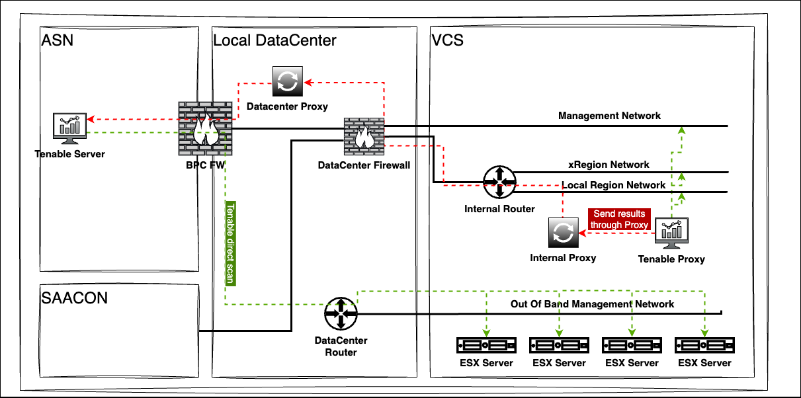
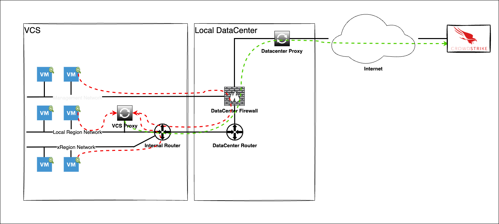

# Vulnerability Management LLD

## 1 Introduction

## 1.1 Author

### 1.1.1 Document owner

|   Owner name   | Owner email |    Date    | Approver's Name |
|:--------------:|:-----------:|:----------:|:---------------:|
| Oliver Scholle |             | 09.07.2020 |                 |

### 1.1.2 Change history

| Version |    Date    |               Description               |     Author(s)      |
|:-------:|:----------:|:---------------------------------------:|:------------------:|
|   0.1   | 2020-01-10 |              Initial draft              |    Marek Syroka    |
|   0.2   | 2021-06-24 | DHC-2238 Local Region network amendment | Lukasz Tomaszewski |
|   0.3   | 2021-09-13 |   DHC-2869 Amending Firewall section    |   Margo Piliukh    |
|   0.4   | 2025-11-28 | VCS-17969 Amending Vulnerability Management section by adding Tenable Nessus for shared infrastructure | Radoslaw Dabrowski |
|   0.5   | 2026-01-11 | VCS-17561 Differentiating Multi-tenant (ASN) vs Single Tenant (Local) reporting/RBAC and adding Infoblox requirements | Radoslaw Dabrowski |
|   0.6   | 2026-02-02 | VCS-17561 Update Global Infoblox requirements to include iDRAC networks and lifecycle management | Radoslaw Dabrowski |
|   0.7   | 2026-02-24 |    Add Security Requirements Coverage   | Przemyslaw Pakula  |
|   0.8   | 2026-03-05 | VCS-17857 Adding CrowdStrike EDR integration for shared/multi-tenant environments | Radoslaw Dabrowski |

### 1.2 Purpose

This document's purpose is to describe VCS Vulnerability Scanning components and propose processes that would allow to build a Vulnerability Management service.

### 1.3 Audience

This document is intended for Atos Cloud Services Engineers and Architects responsible for VMware Cloud Services (VCS) solution implementation and maintenance.

### 1.4 Scope

This LLD is intended to cover:

1. Vulnerability Scanning for Shared Infrastructure (Tenable Nessus)
2. Vulnerability Scanning for Single Tenant Infrastructure (Nessus)
3. Nessus configuration
4. Vulnerability Scanning configuration
5. CrowdStrike Endpoint Detection and Response (EDR) for Shared/Multi-tenant environments

This LLD is not covering:

1. Steps taken during Hardening phase
2. Vulnerability to deb packages matching that is done through playbooks that create "On demand update report (Linux)"

### 1.5 Related Documents

This document is a subset of Atos Technology Lifecycle Management (ATLM) artefacts. All documents are stored in the VCS documentation repository.

#### ATLM Related Documents

| Document Name                                     |
|---------------------------------------------------|
| [VCS High-Level Design](hldDigitalHybridCloud.md) |
| [Hardening Low-Level Design](lldHardening.md)     |

_Table 1: ATLM Related Documents_

#### Security Requirements Coverage

| Instruction Name | Short Description |
| :----------: | ------- |
| [lldADSecurityEnhancement2024.md](lldADSecurityEnhancement2024.md) | Describes AD vulnerabilities in VCS and the remediation actions for key security findings. |
| [lldDhcRoleBasedAccessControl.md](lldDhcRoleBasedAccessControl.md) | Defines RBAC roles, mappings, and access review principles for VCS components. |
| [lldBreakTheGlass.md](lldBreakTheGlass.md) | Defines emergency access workflows for outage scenarios and recovery procedures. |
| [lldHardening.md](lldHardening.md) | Defines required hardening activities before production handover, including identity, firewall, and compliance controls. |
| [lldHashicorpVault.md](lldHashicorpVault.md) | Describes secure secret-management architecture, authentication methods, and audit logging. |
| [lldVulnerabilityManagement.md](lldVulnerabilityManagement.md) | Defines Nessus-based vulnerability scanning design, scope, and operating model. |
| [lldSecurityPosture.md](lldSecurityPosture.md) | Provides a consolidated overview of VCS security controls across encryption, scanning, RBAC, logging, and patching. |
| [SecurityMeasureExceptions.md](SecurityMeasureExceptions.md) | Lists approved Nessus/Alcatraz exceptions and false positives with rationale and mitigation context. |
| [SiemensCERTExceptions.md](SiemensCERTExceptions.md) | Lists Siemens CERT exceptions/false positives with applicability and risk/mitigation notes. |
| [lldSOXDB.md](lldSOXDB.md) | Describes SOXDB integration security controls, including credential handling, encryption, and RBAC. |
| [lldRemoteConsoleAccess.md](lldRemoteConsoleAccess.md) | Defines secure remote console access controls, including RBAC and certificate handling. |

### 1.6 Requirement Levels

This document is following the principles below to categories all requirements and design decisions.

|    Term    | Meaning                                                                                                                                                                                                                                                         |
|:----------:|-----------------------------------------------------------------------------------------------------------------------------------------------------------------------------------------------------------------------------------------------------------------|
|    MUST    | The definition is an absolute requirement of the specification.                                                                                                                                                                                                 |
|  MUST NOT  | The definition is an absolute prohibition of the specification                                                                                                                                                                                                  |
|   SHOULD   | There may exist valid reasons in particular circumstances to ignore a particular item, but the full implications must be understood and carefully weighed before choosing a different course                                                                    |
| SHOULD NOT | There may exist valid reasons in particular circumstances when the particular behaviour is acceptable or even useful, but the full implications should be understood and the case carefully weighed before implementing any behaviour described with this label |
|    MAY     | Any design decisions that are not classified as MUST and SHOULD or covering optional feature that is not general available for VCS product                                                                                                                      |

## 2 Architecture Overview

### 2.1 Business and Solution Requirements

The table below provides known mandatory requirements to be incorporated into design of VCS Vulnerability Management described in this LLD.

|  ID  | Requirement description                                                                                               | Requirement Source | Requirement Level |
|:----:|-----------------------------------------------------------------------------------------------------------------------|:------------------:|:-----------------:|
| R002 | Compliance scan on management machines on weekly basis                                                                |     DHC-18638      |       MUST        |
| R003 | Automated scan and upload mechanism for compliance reports                                                            |     DHC-18638      |       MUST        |
| R005 | All VCS management machines are subject to Vulnerability scanning                                                     |     DHC-18638      |       MUST        |
| R006 | All built-in and service accounts of the management servers and appliances are stored in VCS secret password manager. |                    |       MUST        |
| R007 | Every password used for VCS is unique and meets Atos strong password policy requirements                              |                    |       MUST        |
| R008 | VCS management windows and linux servers are up to date with patches before TOP                                       |                    |       MUST        |
| R009 | Microsegmentation, the firewall rules on NSX are implemented before TOP                                               |                    |       MUST        |
| R010 | Endpoint Detection and Response (EDR) must be deployed on all shared/multi-tenant VCS management Linux and Windows servers | VCS-17857 | MUST |

_Table 2: Initial Requirements_

## 3 Detailed Logical Design

### 3.1 SDDC Architecture overview

#### 3.1.1 Shared Infrastructure (Tenable Nessus)

Tenable Nessus Scanner (Proxy) installed in VM will be used for Vulnerability Scanning service on Shared Infrastructure. The scanner core operates in the ASN environment, while this proxy performs scans on the platform's Management, Local Region, and xRegion networks.

_Figure 1: Tenable Shared Infrastructure Architecture_

#### 3.1.2 Single Tenant Infrastructure (Nessus)

Stand-alone Nessus scanner installed in VM will be used for Vulnerability Scanning service on Single Tenant Infrastructure.

#### 3.1.3 Management

Nessus and Tenable Nessus installation can be accessed through:

1. WEB GUI on port 8834
2. SSH on port 22

#### 3.1.4 Design principles

| Decision ID | Design Decision                                                                                                   | Design Justification                                                           | Design Implication                                      |
|:-----------:|-------------------------------------------------------------------------------------------------------------------|--------------------------------------------------------------------------------|---------------------------------------------------------|
|   DD-007    | Vulnerability scans run against all VCS servers that reside on Management, Cross Region and Local Region networks | Customer workload is not in scope, only VCS Management servers are included    | None                                                    |
|   DD-008    | Customer workload machines will not be included in scans                                                          | Vulnerability Scanning will be used to scan only VCS management Servers        | None                                                    |
|   DD-010    | Vulnerability scan will run on demand during hardening                                                            | VCS Standard, described also in Hardening LLD                                  | None                                                    |
|   DD-023    | Nessus scans are executed during hardening stage before TOP for the reference                                     | VCS must be checked against vulnerability before turn to production            | none                                                    |
|   DD-030    | By default all plugins are enabled for all scans                                                                  | To avoid omission when new plugins are released                                | none                                                    |
|   DD-031    | Unsupported (by Nessus) appliances are scanned only with unauthenticated scans                                    | Not required for compliance with Atos standards                                | none                                                    |
|   DD-032    | All servers are scanned without authenticated scans                                                               | Further risk assessment and mitigation required before allowing in guest scans | none                                                    |
|   DD-033    | All scans are scheduled to run every 7 days                                                                       | For compliance and change monitoring                                           | none                                                    |
|   DD-034    | Update for all components (plugins and system) is set to run every 1 day                                          | Best security practices                                                        | none                                                    |
|   DD-035    | VCS Certificate Authority is defined as trusted (Custom Certificate Authority (CA) configuration)                 | This will reduce self-signed Certificate findings                              | none                                                    |
|   DD-036    | Proxy is used and configured to access Nessus updates                                                             | Provides greater security                                                      | Nessus update site should be identified and whitelisted |

#### 3.1.5 Reporting

| Decision ID | Design Decision | Design Justification | Design Implication |
|:-----------:|-----------------|----------------------|--------------------|
|   DD-009    | [Single Tenant] Local Report Storage | For standalone environments, reports are stored on the local Nessus server (nes001). | Nessus server must be maintained for historical data access. |
|   DD-041    | [Single Tenant] Email Delivery | Reports are automatically sent via encrypted email for localized operations. | Local SMTP configuration required. |
|   DD-042    | [Shared/Multi-tenant] Centralized Reporting in ASN | Scan results are automatically synchronized with the ASN Central Tooling (Tenable.io). | Central visibility; no local report storage required on nes002. |

### 3.3 Security

#### 3.3.1 Role Based Access Control

| Decision ID | Design Decision | Design Justification | Design Implication |
|:-----------:|-----------------|----------------------|--------------------|
|   rb-001    | [Single Tenant] Password Vault Management | standalone Nessus uses a single local admin account stored in HashiVault. | Identity management is handled by password access control. |
|   rb-002    | [Shared/Multi-tenant] Centralized RBAC | Access to Tenable/ASN tooling is managed via the central identity platform (Single Sign-On). | Local accounts on the proxy (nes002) are not used for scan management. |

_Table 3: Design Decisions - RBAC_

#### 3.3.2 Firewall

This section covers all firewall related decisions influencing content of this LLD.

| Decision ID | Design Decision                                                                                                                                                               | Design Justification                            | Design Implication |
|:-----------:|-------------------------------------------------------------------------------------------------------------------------------------------------------------------------------|-------------------------------------------------|--------------------|
|   DD-055    | ALL TCP and ALL UDP ports must be open between Scanner and any device on the VCS management network, Local Region network and Cross Region network during the scanning window | Scanner must have open access to all assets     | None               |
|   DD-056    | SMTP traffic should be open from Nessus server to SMTP Relay Server                                                                                                           | Required for on-demand report sharing via email | None               |

_Table 4: Design Decisions - Firewall_

#### 3.3.3 Certificates

VCS uses a dedicated Certificate Authority (CA). The following design decisions are taken in terms of certificate management for that LLD:

| Decision ID | Design Decision                       | Design Justification | Design Implication |
|:-----------:|---------------------------------------|----------------------|--------------------|
|   cd-001    | Internal CA certificate must be used. |                      |                    |

_Table 5: Design Decisions - Certificates_

### 3.4 Availability and Scalability

#### 3.4.1 Availability Design

The design decisions below are made to guarantee availability of VCS Management.

| Decision ID | Design Decision                                           | Design Justification                       | Design Implication |
|:-----------:|-----------------------------------------------------------|--------------------------------------------|--------------------|
|   DD-013    | Nessus server depends on vSphere HA for high availability | VCS Standard                               | None               |
|   DD-014    | Nessus server is a part of DHC-DR                         | VCS Standard with Stretched Cluster option | None               |
|   DD-015    | Nessus nessusd deamon is monitored with vROps             | VCS monitoring standard                    | None               |

_Table 6: Design Decisions - Availability_

#### 3.4.2 Scalability Design

| Decision ID | Design Decision                                                                                                | Design Justification | Design Implication |
|:-----------:|----------------------------------------------------------------------------------------------------------------|----------------------|--------------------|
|   DD-015    | Additional Nessus scanner will be introduced if scans can not be completed within set scanning period (1 week) | VCS Standard         | None               |

_Table 7: Design Decisions - Scalability_

### 3.5 Recoverability

The chapter below provides detailed design choices to protect against data loose and backup functionality and against Datacenter failure.

#### 3.5.1 Component Failure

| Decision ID | Design Decision                          | Design Justification | Design Implication |
|:-----------:|------------------------------------------|----------------------|--------------------|
|   DD-016    | Nessus server must be part of VCS backup | VCS Standard         | None               |

_Table 8: Design Decisions - Component Failure_

### 3.6 Multi-tenancy

Multi-tenancy for vulnerability scanning is not applicable within the VCS context, as the service is strictly limited to the management platform and does not include customer workloads (as defined in DD-008).

However, for shared/multi-tenant VCS management platforms, the scanning infrastructure (Tenable Nessus Proxy) is designed to integrate with the centralized ASN tooling system for unified vulnerability management across the estate.

| Decision ID | Design Decision | Design Justification | Design Implication |
|:-----------:|-----------------|----------------------|--------------------|
|   mt-001    | Integration with ASN Tooling for Shared Platforms | Unified visibility and reporting for multi-tenant VCS management estates | Requires connectivity to ASN core (see [Section 4.2.2](#422-firewall)) |

_Table 9: Design Decisions - Multi-tenancy_

### 3.7 External Connection/System Requirements

The table below provides domain/components requirements for other components and domains to be taken into corresponding design decisions with requirement level in line with [Chapter 1.6](#16-requirement-levels)

|  Requirement ID   | Requirement criticality | Requirement description | Requirement Justification |
|:-----------------:|-------------------------|-------------------------|---------------------------|
| EXT-S28-001       | CRITICAL                | [Shared/Multi-tenant] ASN Global Infoblox Registration | Scanned assets must be resolvable and visible in central tooling. |

_Table 10: Design External Requirements_

### 3.7.1 ASN Global Infoblox Integration

This section is **only applicable for Tenable deployments in multi-tenant environments** (Shared Cluster), where local scanning results are integrated into a single, centralized ASN tooling system.

For centralized visibility and proper resolution within the ASN environment, all scanned assets must be registered in the ASN Global Infoblox. This registration is a prerequisite for effective vulnerability management and reporting.

1. **Network Registration:** The following shared networks must be defined in the ASN Global Infoblox:

    * Management Network
    * Local Region Network
    * X Region Network
    * iDRAC Networks

2. **Asset Inventory & Reserved Addresses:** A comprehensive list of all assets and reserved addresses within the scope of vulnerability scanning must be maintained in Infoblox. This includes:

    * **Networks:** The CIDR blocks for the networks listed above.
    * **Reserved Addresses:** All static and reserved IP addresses within these subnets.
    * **FQDNs:** Fully Qualified Domain Names for all hosts and virtual appliances.

3. **Lifecycle Management:** These entries must be kept up-to-date. Modifications to the ASN Global Infoblox are mandatory whenever:

    * New networks are added or existing ones are removed.
    * Assets (VMs, Hosts) are commissioned or decommissioned (resigned).
    * There are any changes to IP reservations within the shared networks.

**Contact & Submission Process:**

To register these networks and assets, or to obtain the required **Intake Form** for these entries, please contact the IPAM team at: `ipam@atos.net`.

### 3.8 CrowdStrike Endpoint Detection and Response (EDR)

> **Applicability**: This section is **only applicable for shared/multi-tenant VCS management platforms**. For single-tenant environments, endpoint protection is provided by Trend Micro Deep Security as described in the [Security Posture LLD](lldSecurityPosture.md).

CrowdStrike is deployed as an Endpoint Detection and Response (EDR) solution for VCS management infrastructure in Multitenant/shared environments. The lightweight agent performs behavioral analysis and threat detection using AI-based cloud processing.

#### 3.8.1 Architecture Overview

The CrowdStrike agent is installed on supported VCS management servers (Linux and Windows). The agent communicates with the CrowdStrike cloud platform via HTTPS through the platform proxy, sending telemetry data for AI-based behavioral analysis and threat detection.

**Supported Components:**

* Linux and Windows management VMs with agent installation
* ESXi hosts and appliances are registered in CMDB only (no agent installation)

**Data Flow:**

* Agent collects lightweight telemetry data
* Traffic is encrypted end-to-end by the agent
* Communication flows through platform proxy (TCP 3128) to CrowdStrike cloud (HTTPS 443)
* Remediation actions are pushed back to the agent as needed

> **Note**: CrowdStrike is a global tool with no geographic data residency restrictions. Telemetry data may be processed in multiple global regions with no EU-only option available. For environments with strict data localization requirements (e.g., GDPR Article 44-49, UK Government regulations), coordination with local security management is required. Alternative EDR solutions (e.g., Trend Micro Deep Security) should be considered for single-tenant deployments with mandatory data residency constraints.

#### 3.8.2 Network Requirements

The CrowdStrike agent requires outbound connectivity to CrowdStrike cloud services via the platform proxy.

| Decision ID | Design Decision | Design Justification | Design Implication |
|:-----------:|-----------------|----------------------|--------------------|
| CS-001 | CrowdStrike traffic uses existing ToProxyInternal DFW rule | Agent communicates via platform proxy on TCP 3128 | No additional DFW rules required; proxy whitelist must include CrowdStrike URLs |
| CS-002 | Daily connectivity verification is recommended | Ensures agent can communicate with cloud services | curl-based testing via proxy should be implemented; example: `curl -x <proxy>:3128 https://<crowdstrike-url>` |
| CS-003 | Agent and signature updates are automatic | No manual intervention required for updates | Continuous network connectivity required |

_Table 11: Design Decisions - CrowdStrike Network_

**Proxy Whitelist Requirements:**

Detailed CrowdStrike URL whitelist is maintained in the [Atos Installation Guidelines on SharePoint](https://atos365.sharepoint.com/sites/110000594/CS%20%20CrowdStrike1/Forms/AllItems.aspx?id=%2Fsites%2F110000594%2FCS%20%20CrowdStrike1%2FAtos%20%2D%20Installation%20Guidelines&viewid=67a6412b%2Ddd97%2D4381%2Db6e4%2Dcabe15e49b2e).

#### 3.8.3 Operational Model

| Decision ID | Design Decision | Design Justification | Design Implication |
|:-----------:|-----------------|----------------------|--------------------|
| CS-010 | No customer-facing monitoring dashboard | Incident handling is managed between Security Team and Support Groups | Platform team monitors via standard VCS tooling only |
| CS-011 | Security Team contact for compliance changes and security risks only | Operational separation between platform and security teams | Cosmin Suciu team handles security-related communications |
| CS-012 | No hidden implementation costs | Service is provided at no charge to the platform | Business Lines are charged directly by CrowdStrike service |

_Table 12: Design Decisions - CrowdStrike Operations_

#### 3.8.4 Incident Handling Process

CrowdStrike incidents follow an automated workflow:

1. CrowdStrike detects threat and auto-creates PISA ticket for Security Team
2. Security Team contacts:
   * Support Group (from CMDB SNOW)
   * CI Owner (from CMDB SNOW)
3. Business owners and support groups are informed
4. **Major Incidents**: All CMDB-registered application contacts are notified

#### 3.8.5 Registration and Onboarding

**Key Contacts:**

| Name | Email | Role |
|------|-------|------|
| Cosmin Ioan Suciu | <cosmin.suciu@atos.net> | Security Team Lead |
| Alicja Hermanowska | <alicja.hermanowska@atos.net> | Security Team |
| Łukasz Derengowski | <lukasz.derengowski@atos.net> | Security Team |

_Table 13: CrowdStrike Security Team Contacts_

> **Note**: No dedicated group email address or support group exists for CrowdStrike integration.

**CI Registration Requirements:**

VCS Platform Management Team must provide a regularly updated list of management platform CIs (monthly minimum, weekly recommended):

* Systems for agent installation (Linux/Windows VMs)
* Appliances/ESXi hosts (no agent - CMDB registration only)
* Network details: Management network, Local Region, Cross region, iDRAC

**Automation Recommendation:**

Regular CI list reporting to Security Team (Cosmin Suciu) should be automated for operational efficiency:

* Extract CI inventory from management platform using Ansible or Python scripts
* Generate weekly reports including: VM list, ESXi hosts, appliances, and network assignments
* Automate delivery to Security Team contact
* Ensures timely updates and reduces manual effort

**Mandatory SNOW Fields:**

| Field | Description |
|-------|-------------|
| SNOW ID | ServiceNow Configuration Item ID |
| L2 Support Group | Level 2 support group assignment |
| Application name | Business owner application name |

_Table 14: CrowdStrike CMDB Requirements_

**CMDB Prerequisites:**

* CI entries must already exist in CMDB
* Applications and business owners must be registered
* Minimum structure: 1 Application + Application Service + Business Application
* CI Owner designation for management infrastructure (TBD)

**Acceptance Criteria:** Confirmation from Cosmin Suciu that integration is working correctly.

#### 3.8.6 Documentation Resources

| Resource | Location |
|----------|----------|
| Installation Guidelines | [SharePoint - Atos Installation Guidelines](https://atos365.sharepoint.com/sites/110000594/CS%20%20CrowdStrike1/Forms/AllItems.aspx?id=%2Fsites%2F110000594%2FCS%20%20CrowdStrike1%2FAtos%20%2D%20Installation%20Guidelines&viewid=67a6412b%2Ddd97%2D4381%2Db6e4%2Dcabe15e49b2e) |
| Location Codes | [Atos Official Sites list from DAS.xlsx](https://atos365.sharepoint.com/:x:/r/sites/110000594/CS%20%20CrowdStrike1/Atos%20-%20Installation%20Guidelines/Atos%20Official%20Sites%20list%20from%20DAS.xlsx?d=w4b4094cfd82b495281f2cc6c48d579eb&csf=1&web=1&e=HOZ29O) |

_Table 15: CrowdStrike Documentation Resources_

## 4 Detailed Physical Design

### 4.1 Management Plane

#### 4.1.1 Virtual Machine Configuration Table

Virtual Machine hardware configuration details of the Scanners.

**Shared Infrastructure (Tenable Nessus)**

| Property            | Value                          | Description                                |
|---------------------|--------------------------------|--------------------------------------------|
| VM Role             | Tenable Nessus Scanner (Proxy) |                                            |
| Number of instances | 1                              |                                            |
| Operating System    | Ubuntu 22.04 LTS               | OVA Deployment                             |
| vCPU / Memory       | 4 / 8 GB                       |                                            |
| Storage             | 94 GB                          |                                            |
| Network Placement   | Local Region Network           | IP: `<Local Region Network>.56`            |
| VM Name             | `<customer_code>nes002`        | To avoid collision with existing scanner   |

**Single Tenant Infrastructure (Nessus)**

| Property            | Value                          | Description                                |
|---------------------|--------------------------------|--------------------------------------------|
| VM Role             | Nessus Scanner                 |                                            |
| Number of instances | 1                              |                                            |
| Operating System    | Ubuntu 22.04 LTS               |                                            |
| vCPU / Memory       | 2 / 4 GB                       |                                            |
| Storage             | 60 GB                          |                                            |
| Network Placement   | Local Region Network           | IP: `<Local Region Network>.55`            |
| VM Name             | `<customer_code>nes001`        |                                            |

_Table 16: Virtual Machine Configuration_

#### 4.1.2 Element Configuration Table

| Component | Target Scanner | Value | Description |
|-----------|----------------|-------|-------------|
| Cron job on Nessus server to run Alcatraz compliance scan against linux and windows management VMs | `nes001` | Every Monday 04:00 | Execution time of cron task on Ansible node. |
| Scheduled curl batch command on Nessus server to upload Alcatraz reports to ITC DB | `nes001` | Every Monday 11:00 | Execution time of cron task on Ansible node. |
| Scheduled scan of the entire management IP network range | `nes001` / `nes002` | Every Sunday 20:00 | Default scan jobs scheduled via Nessus GUI. |
| Scheduled scan of the entire cross region IP network range | `nes001` / `nes002` | Every Sunday 20:00 | Default scan jobs scheduled via Nessus GUI. |
| Scheduled scan of the entire local region IP network range | `nes001` / `nes002` | Every Sunday 20:00 | Default scan jobs scheduled via Nessus GUI. |
| Cron job on Nessus server to convert and send reports | `nes001` | Every Thursday 04:00 | Cron scheduled reporting (via ansible). |
| ASN Cloud Synchronization & Plugin Updates | `nes002` | Real-time / Daily | Automatic synchronization managed by Tenable core in ASN. |

_Table 17: Element Configuration_

### 4.2 Security

#### 4.2.1 Role Based Access Control

Below roles are defined for user access purpose including service accounts if applicable.

| User Name | Member Group Name | Comment                                                                                                          |
|-----------|-------------------|------------------------------------------------------------------------------------------------------------------|
| nessus    | Admin             | For Nessus only one local account is created on application level. There are no domain roles and groups defined. |

_Table 18: User Roles_

Below roles are defined for user access purpose including service accounts.

| Role Group Name | Member Group Name | Comment |
|-----------------|-------------------|---------|
| `N/A`           |                   |         |

_Table 19: User Access_

Below groups are created as part of design implementation.

| AD Group Name | Member Name | Member Type (local, Active Directory) |
|---------------|-------------|---------------------------------------|
| `GRP-<customer_code>-TSS-Tenable-Access` | VMS Team | Active Directory |

_Table 20: AD Groups_

#### 4.2.2 Firewall

**Tenable Proxy Whitelist Requirements**

The platform proxy (`<customer_code>pxy001` and `<customer_code>pxy002`) must allow outbound communication to the following Tenable URLs:

* `https://plugins.nessus.org`
* `https://downloads.nessus.org`
* `https://plugins-customers.nessus.org`
* `https://plugins-us.nessus.org`
* `https://plugins.cloud.tenable.com`
* `https://appliance.cloud.tenable.com`
* `https://tenablesecurity.com`
* `https://cloud.tenable.com`
* `https://sensor.cloud.tenable.com`
* `https://sensor.cloud.tenablecloud.cn`

**Firewall Rules**

| Source                                                                    | Destination                                                               | Port | Protocol | Description                                    |
|---------------------------------------------------------------------------|---------------------------------------------------------------------------|------|----------|------------------------------------------------|
| `<customer_code>pxy001`, `<customer_code>pxy002`, `<customer_code>pxy003` | Internet                                                                  | 443  | TCP      | Communications with Tenable cloud              |
| `<customer_code>pxy001`, `<customer_code>pxy002`, `<customer_code>pxy003` | CrowdStrike Cloud (Internet)                                              | 443  | TCP      | Communications with CrowdStrike cloud (see CS-001) |
| `<customer_code>tss001`, `<customer_code>tss002`                          | `<customer_code>nes002`                                                   | 22   | TCP      | SSH connectivity from TSS toward Tenable Proxy |
| `<customer_code>nes002`                                                   | `<customer_code>pxy001`, `<customer_code>pxy002`, `<customer_code>pxy003` | 3128 | TCP      | Tenable Proxy to platform proxy                |
| Linux/Windows Management VMs with CrowdStrike agent                       | `<customer_code>pxy001`, `<customer_code>pxy002`, `<customer_code>pxy003` | 3128 | TCP      | CrowdStrike agent to platform proxy (see CS-001) |
| `<customer_code>nes002`                                                   | `<customer_code>adc001`, `<customer_code>adc002`                          | 53   | UDP      | DNS lookups                                    |
| `<customer_code>nes002`                                                   | `<customer_code>adc001`, `<customer_code>adc002`                          | 123  | UDP      | NTP                                            |
| `<customer_code>nes002`                                                   | Management Network                                                        | ANY  | ANY      | Scan purpose                                   |
| `<customer_code>nes002`                                                   | Local Region Network                                                      | ANY  | ANY      | Scan purpose                                   |
| `<customer_code>nes002`                                                   | xRegion Network                                                           | ANY  | ANY      | Scan purpose                                   |
| `<customer_code>tss001`, `<customer_code>tss002`                          | `<customer_code>nes001`, `<customer_code>nes002`                          | 8834 | TCP      | Web Service of Nessus Scanner                  |

_Table 21: Firewall Rules_

> **NOTE:** Sources and Destinations within Distributed Firewall should be represented by Security Groups, and some of those components do have Security Group representation. This table is just representation of the logic and should not be taken into consideration for one to one implementation.  

### 4.3 Software Versions and Licensing

Below software and firmware versions are certified by Atos for usage.

| Name                           | Release            | Comments                                      |
|--------------------------------|--------------------|-----------------------------------------------|
| Nessus                         | 10.10.0 (or higher)|                                               |
| Compliance scanner for Windows | Latest Available   |                                               |
| Compliance scanner for Linux   | Latest Available   |                                               |
| CrowdStrike Falcon agent       | Latest Available   | Shared/multi-tenant only; auto-updated by CrowdStrike cloud |

_Table 22: Software Versions_

Below license models/types must be applied on corresponding elements

| Component Name | License Name / Type | License count | Comments               |
|----------------|---------------------|---------------|------------------------|
| Nessus         | Nessus Professional | 1             | CO is owner of license |

_Table 23: Licenses_
