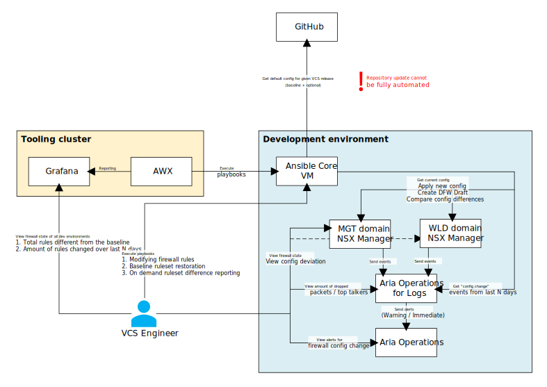
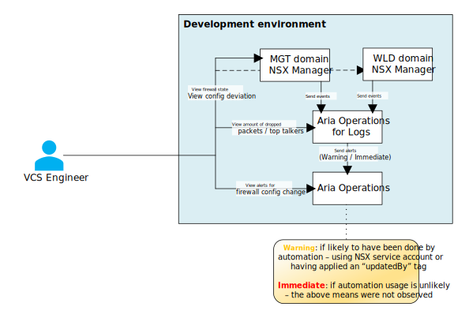
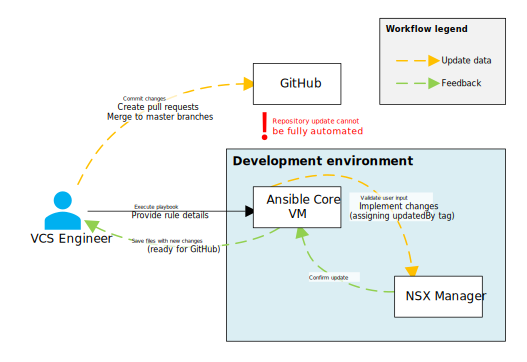
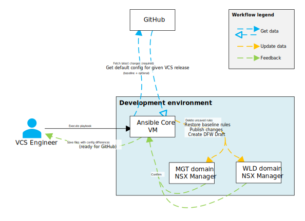
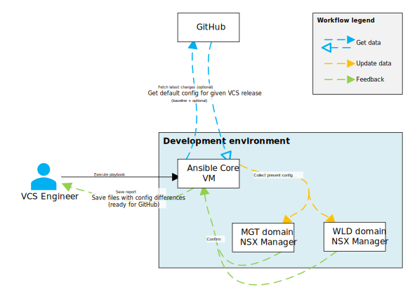
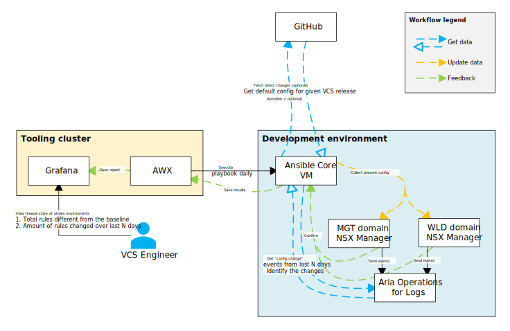

# Zero Trust Firewalls LLD

## Changelog

|    Date    |   Issue   | Author | Description |
|------------|-----------|--------|-------------|
| 08.10.2025 | VCS-17262 | Stanisław Kilanowski | Initial draft creation |
| 17.10.2025 | VCS-17263 | Stanisław Kilanowski | Submitted the document for review |
| 22.10.2025 | VCS-17263 | Stanisław Kilanowski | Review updates |
| 29.10.2025 | VCS-17653 | Stanisław Kilanowski | Review updates |
| 11.12.2025 | VCS-17779 | Stanisław Kilanowski | Documentation update |
| 22.01.2026 | VCS-18048 | Stanisław Kilanowski | Finalized the document |

## Introduction

### Purpose

The purpose of this document is to describe the idea of the zero trust solution created to sustain default firewall ruleset and automate its management.

### Audience

- VCS Engineers

### Scope

#### In Scope

- Solution details.
- Key design trade-offs.
- Monitoring and reporting mechanisms.
- Automation overview.

#### Out of Scope

- Process to be followed.
- Automation usage guide.

### Requirement Levels

This document is following the principles below to categorize all requirements and design decisions.

|    Term    | Meaning |
| :--------: | ------- |
|    MUST    | The definition is an absolute requirement of the specification. |
|  MUST NOT  | The definition is an absolute prohibition of the specification. |
|   SHOULD   | There may exist valid reasons in particular circumstances to ignore a particular item, but the full implications must be understood and carefully weighed before choosing a different course. |
| SHOULD NOT | There may exist valid reasons in particular circumstances when the particular behavior is acceptable or even useful, but the full implications should be understood and the case carefully weighed before implementing any behavior described with this label. |
|    MAY     | Any design decisions that are not classified as MUST and SHOULD or covering optional feature that is not generally available for VCS. |

### Related Documents

|          Documentation         |
|--------------------------------|
| [Software Defined Networks LLD](lldSoftwareDefinedNetworks.md) |
| [Monitoring and Logging LLD](lldMonitoringLogging.md) |
| [Role Based Access Control LLD](lldDhcRoleBasedAccessControl.md) |
| [Zero Trust Firewalls WI](../workInstructions/wiZeroTrustFirewalls.md) |

## Architecture Overview

The network traffic within VCS environments is controlled by firewalls configured on NSX-T appliances in the management and workload domains, referred to as Distributed Firewalls (DFW). More details can be found in the [Software Defined Networks LLD](lldSoftwareDefinedNetworks.md#firewall).

The goal of this solution is to implement a zero-trust approach to NSX-T DFW management to avoid configuration differences between all development and production environments. This is achieved with a combination of monitoring, reporting and automation.

By monitoring and reporting ruleset configuration changes we ensure full visibility and auditability of modifications while preserving operational flexibility. Using already existing integrations in vRLI and vROps we can monitor firewall changes and discover blocked traffic. The [Monitoring and Logging LLD](lldMonitoringLogging.md) provides details on this solution, including the NSX-T integration. Configuration changes are forwarded to vROps using custom alerts, where they can be observed as "Warnings" or "Immediate" (depending on the logged activity). Logs for the dropped traffic can be viewed in a dedicated vRLI dashboard, displaying trends and the most active links. Lastly, ruleset snapshots can be created with DFW Drafts, which grant the possibility to spot any changes and revert to the desired configuration.

There are three Ansible playbooks in total, each responsible for automating one of the following activities:

- modifying the firewall rules to provide guidance according to the design,
- restoring the baseline configuration,
  - executed **manually** when needed - to ensure that any engineering work affecting firewalls will not become more complicated and the necessary mechanism is supplied without disrupting legitimate temporary adjustments,
  - or executed **automatically** every other week - to ensure that the environments are cleaned up after a sprint's work,
- creating a diff report, detailing all changes made against the baseline ruleset and collecting summary of configuration change events.

AWX instance in the tooling cluster is used for automation scheduling within development environments. Its centralized interface allows easy management and for all environments to consume the same codebase. This is further connected with a reporting tool, e.g. Grafana, where the state of firewalls is regularly updated and can be reviewed for deviations from the baseline.

Details for each architecture element can be found in the [Detailed Logical Design](#detailed-logical-design) section. Details how to use the automation and what process should be followed will be described in the [Zero Trust Firewalls WI](../workInstructions/wiZeroTrustFirewalls.md).

#### Design Decisions for Solution Components

| Decision ID | Design Decision | Design Justification | Design Implication |
|-------------|-----------------|----------------------|--------------------|
| SCDD001 | NSX-T DFW Drafts will be used to create configuration snapshots | This is a built-in mechanism allowing to review changes and restore configuration | Automation that restores the default configuration, creates a DFW Draft as well |
| SCDD002 | All changes to NSX-T DFW will be logged in vRLI | This allows for an easy and reliable review of the changes | None |
| SCDD003 | All dropped NSX-T DFW traffic can be discovered in vRLI | This allows for an easy way to troubleshoot connections | A vRLI dashboard will be created for this purpose |
| SCDD004 | Default firewall config must be easily restorable | This provides a reliable way to implement baseline ruleset | Automation will be created for this purpose |
| SCDD005 | Reports can be created to show firewall config differences | This provides a reliable mechanism of validating current config | Automation will be created for this purpose |
| SCDD006 | Centralized tooling will be used for automation scheduling | This allows for easy management and observability | AWX and Grafana in the tooling cluster will be used |

### Design trade-offs

In order to introduce the zero trust solution while minimizing the impact on the daily work of VCS Engineers, various adjustments were made. This balances zero trust principles with operational usability.

1. **Automatic baseline enforcement schedule.**

    Since the VCS Engineers work in two-week sprints, the automation runs every two weeks. This frequency prevents configuration drift while avoiding disruption to ongoing work.

2. **Changes in the repository must be made manually.**

    Due to the VCS Release Management Process, automation cannot be used to fully guarantee that any changes are reflected on the DHC-Firewall repository. It instead exports the configuration delta. With that we have to rely on the VCS Engineers manual effort to update the codebase by the process. Only then we are able to enforce the new configuration.

3. **Monitoring and reporting instead of blocking changes.**

    The engineering work cannot become tedious due to using the zero trust solution. Features that are worked on may require progressive tests and adjustments, therefore "write" access to the firewalls must remain open.

#### Design Decisions for Operational Usability

| Decision ID | Design Decision | Design Justification | Design Implication |
|-------------|-----------------|----------------------|--------------------|
| OUDD001 | Baseline configuration is automatically restored | It is required to have this in place but it has been aligned to the VCS Engineers work cycle | The automation will be executed every two weeks |
| OUDD002 | Repository update requires manual work | We have to follow the VCS Release Management Process | Automation will provide the VCS Engineers with configuration files for easier change application |
| OUDD003 | Firewall permissions will not be limited | We must not block the access to the tooling | Manual firewall changes will not be avoided |

### Solution requirements

The following table lists known requirements for using this solution.

| ID | Requirement description | Requirement Level |
|----|-------------------------|-------------------|
| R001 | Baseline ruleset will be stored on a dedicated repository, following config as code design. | MUST |
| R002 | NSX-T will be integrated with vRLI with Content Packs installed for easy log management. | MUST |
| R003 | vRLI will be integrated with vROps for log forwarding and alert creation. | MUST |
| R004 | A dedicated service account will have "write" permissions on NSX Managers. | MUST |
| R005 | A centralized tool should be available for reporting visibility. | SHOULD |

## Detailed Logical Design

### Monitoring

The monitoring system is built on the integration between NSX-T and vRLI, which serves as the centralized log repository. NSX-T Manager is configured to forward both system and Distributed Firewall logs to vRLI. Using the NSX-T Content Pack logs are parsed to allow for specific querying or visualization.

#### Configuration change auditing

NSX-T sends audit and system events related to firewall modification to vRLI. These include rule creation, deletion and updates. Custom alert definitions are created there to ensure real-time log forwarding to vROps. This creates alerts with issue summary and the log reference for further analysis. The alerts are of severity "Warning" or "Immediate" in order to better highlight potentially unwanted activities - depending on the account used to make the change and the "updatedBy" tag applied on the rule (done with the playbook). Automation uses the "nsx01" service account for this purpose. The account's permissions can be found in the [Role Based Access Control LLD](lldDhcRoleBasedAccessControl.md).

#### Network traffic analysis

NSX-T forwards detailed logs about the flow observed by the Distributed Firewall to vRLI, including source and destination addresses, ports, protocol and action (whether the packet was allowed or dropped). A dedicated dashboard is created there to display overall trends for each NSX-T DFW of traffic dropped over a selected time window as well as top talkers, grouped by connection tuple and listing the amount of logged packets. This enables identifying missing connectivity, troubleshooting operational issues and detection of suspicious traffic.

### Distributed Firewall Drafts

The Distributed Firewall Draft feature in NSX-T acts as a snapshot of a firewall configuration. Each draft captures the complete state of Distributed Firewall policies and rules at the time of its creation. They can be used to compare configuration states, with a built-in differential view between the active configuration and the draft. Drafts can also function as a rollback mechanism, to restore the firewall to the saved state. This is utilized to quickly and reliably apply the baseline ruleset.

### Automation

> [!NOTE]
> When referencing files created with firewall configuration, a "standard format" will be mentioned. This means the data structure used for all files stored in the DHC-Firewall repository. If created by the automation, these are separated into directories and have names that indicate the user, target NSX-T and action. With this approach we can easily identify changes made by different engineers and have configuration ready to be applied in the repository.

#### Modifying firewall rules

An Ansible playbook is created that helps the user with applying the changes and with following the proper process. The user is required to provide an input file in the standard format, which is validated for errors and against the configuration present on the NSX-T Managers (for presence of rules, groups and services). When no problems are detected, the changes are implemented. An "updatedBy" tag is applied on the changed items, being the DAS of the engineer running the playbook. In the end new files are created: each with either the removed, created or modified resources, registered in the standard format.

#### Baseline ruleset restoration

An Ansible playbook is created that applies the default configuration on the DFW of both NSX-T Managers. To do so, it uses the local clone of a DHC-Firewall repository, which stores all definitions, following config as code design. The playbook verifies if the proper release branch is used and updates the repository to the latest state. This step is **required** to make sure that the baseline is not outdated. Afterwards it collects all definitions from the discovered files and all configured resources from the NSX-T API. These do not include optional features or custom configuration, unless specified during the playbook's execution. The collected data is compared wherever applicable: resources present on NSX-T but not in the repository are deleted and for each rule from the repository the differences are applied. Additionally, new files are created: each with either the removed, created or modified resources, separated by user (found in the object's tags) and registered in the standard format. Next the DFW changes are published and a draft with a distinguishable name is created. Up to 10 manual drafts can be created at any time, so only one should be maintained by the automation.

> [!TIP]
> The files are created locally to allow for easy identification or restoration of the excessive changes.
<!-- -->
> [!NOTE]
> Services and security groups excess to the target configuration **are not** deleted, since there are by default more resources (automatically created) on NSX-T than on the repository.

#### Ruleset difference reporting

An Ansible playbook is created to collect a report of configuration differences of the present ruleset against the baseline. It follows a similar principle with the following differences. The playbook **attempts** to update the repository to the latest state. It continues if failed, however the problem is reported in the end. Afterwards the definitions are collected from the discovered files and all configured resources from the NSX-T API. Changes applied over a selected period are identified (last week by default), using the vRLI API - by running a query like described in the section [Configuration change auditing](#configuration-change-auditing). Distinct rules are correlated with the users responsible for the changes (found in the rule's tags). The created report specifies, against which version were differences found (being the repository's selected branch and commit details) and what was added or removed for each item. Additionally, new files are created: each with either the removed, created or modified resources, separated by user (found in the objects's tags) and registered in the standard format. In the end this data is saved as playbook stats for easy accessibility by a centralized tool.

#### Centralized reporting

A tool that regularly collects reported data from all development environments, e.g. Grafana, displays them in a format highlighting the total of rules different from the baseline, amount of rules changed over the selected period per user and the release used as reference for each environment. If there are any problems detected by the automation, e.g. being unable to fetch latest repository state - it's reported accordingly as well. This allows for easy observability of the state of environments.

## Abbreviations and Definitions

| Abbreviation or term | Translation |
|----------------------|-------------|
| API | Application Programming Interface |
| AWX | Ansible Web Executable |
| DAS | Directory and Authentication Service |
| DFW | Distributed Firewall |
| LLD | Low Level Design |
| MGT | Management |
| VCS | VMware Cloud Services |
| VM | Virtual Machine |
| vRLI | Aria Operations for Logs (previously vRealize Log Insight) |
| vROps | Aria Operations (previously vRealize Operations) |
| WLD | Workload |
