# Tanzu in VCS LLD

## Changelog

 |    Date    |  TOS   | Issue   | Author | Description |
 |------------|---------|-----------|--------|--------|
 | 21.09.2022 |  VCS 1.7   |   CESDHC-4403     | Rohit Singh | Initial draft creation |
 | 07.12.2022 |  VCS 1.7   |   CESDHC-5049     | Bhalchandra Kashinath Gavhane | Update Tanzu LLD with changes needed in Physical network |

## Introduction

Tanzu on VCS enables transformation of the workload cluster into a platform for running Kubernetes workloads natively on the hypervisor layer. When enabled on a vSphere cluster, Tanzu provides the capability to run Kubernetes workloads directly on ESXi hosts and to create upstream Kubernetes clusters within dedicated resource pools.

## Purpose

The purpose of this document is to provide detailed design and architectural guidance required to implement Tanzu in VCS.
The document aims to provide insights on the underlying network architecture for Tanzu.
Document also covers the components that will be implemented for the Tanzu to work and their overall functions.

## Audience

This document is intended for Atos Cloud Services Engineers and Architects responsible for implementation of Tanzu in VCS and maintenance of same.

## Scope

LLD is intended to cover below components and domains:

- Network Design for Tanzu in VCS.
- Tanzu Components.

## Related Documents

This document is a subset of Atos Technology Lifecycle Management (ATLM) artifacts. All documents are stored in the VCS documentation repository.

| Document Name | Description |
|----|----|
| [wiVsphereWithTanzuBuildGuide.md](../workInstructions/wiVsphereWithTanzuBuildGuide.md) | This information contains information about instructions for deploying Tanzu |

## Vendor Related Documents

| Vendor | Document Name | Description |
|--------|---------------|-------------|
| VMware | <https://docs.vmware.com/en/VMware-vSphere/7.0/vmware-vsphere-with-tanzu/GUID-152BE7D2-E227-4DAA-B527-557B564D9718.html> | Documentation for deploying Tanzu |

## Requirement Levels

That document is following below principles in terms of requirements and design decisions.

| Term | Meaning |
|---|---|
| MUST | The definition is an absolute requirement of the specification. |
| MUST NOT | The definition is an absolute prohibition of the specification |
| SHOULD | There may exist valid reasons in particular circumstances to ignore a particular item, but the full implications must be understood and carefully weighed before choosing a different course |
| SHOULD NOT | There may exist valid reasons in particular circumstances when the particular behaviour is acceptable or even useful, but the full implications should be understood, and the case carefully weighed before implementing any behaviour described with this label |
| MAY | Any design decisions that are not classified as MUST and SHOULD or covering optional feature that is not general available for VCS product |

## Architecture Overview

The diagram below highlights the areas of the Vsphere with Tanzu architecture in scope of this LLD.

### Figure 1. vSphere with Tanzu Overview

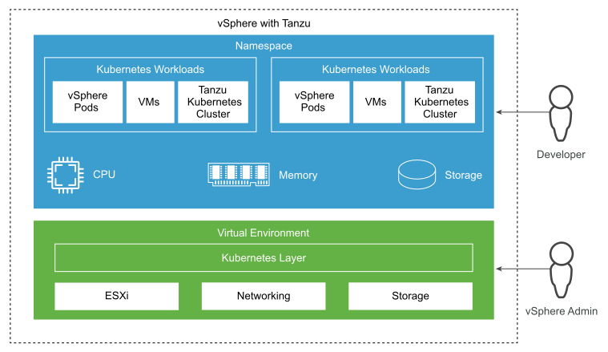

## Business and Solution Requirements

Below table provides known requirements mandatory to be incorporated into design decisions of the Tanzu in VCS in this LLD.

### Table 2. Initial Requirements

| **ID**  | **Requirement description**                                                                                                                            | **Source**       | **Level** |
|---------|--------------------------------------------------------------------------------------------------------------------------------------------------------|------------------|-----------|
| R001    | Tanzu in VCS requires the VCS to be built and hardened properly.                                                                                                    | HLD              | MUST      |
| R002    | Setup and configuration of Tanzu in VCS will be automated and kept under version control                                     | Atos Management  | SHOULD    |
| R003    | The Supervisor Cluster stack will be patched regularly in line with vendor recommendations                                                                     | HLD              | MUST      |
| R004    | The Tanzu in VCS will have the ability to provision multiple TKG clusters for differing performance separate to the management hardware.                            | HLD/Portfolio    | MUST      |

### Design Decisions for Tanzu

| Decision ID | Design Decision | Design Justification | Design Implication |
|---|---|---|---|
| ARCDD001 | VMware NSX-T will be used to provide networking to Tanzu. | NSX-T was chosen due to decisions made in VMware to focus all development resources on developing NSX-T. NSX-T in addition is giving a lot of flexibility regarding for Tanzu  in VCS. | The design must include specific architecture. |
| ARCDD002 | vSphere workload domain will be used to provide compute and storage for Tanzu in VCS. | Vsphere was chosen due to decisions made in VMware to focus all development resources on developing Tanzu. Tanzu in addition is supported by VMware which is a major advantage. | The design must include specific architecture. |

## Physical Network Architecture

### Figure 2. Tanzu Network Layout Overview

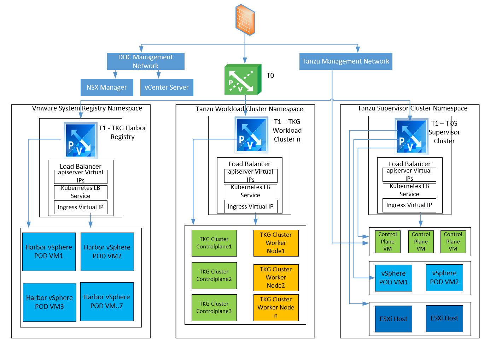

## Network requirements

Deployment must meet the networking requirements listed in the table below.

| Component | Minimum Quantity | Required Configuration |
|---|---|---|
| Static IPs for Kubernetes control plane VMs | Block of 5 | A block of 5 consecutive static IP addresses to be assigned to the Kubernetes control plane VMs in the Supervisor Cluster |
| Management (Supervisor) traffic network | /24 Private IP addresses | A Management Network that is routable to the ESXi hosts, vCenter Server and a DHCP server. The network must be able to access a container registry and have Internet connectivity if the container registry is on the external network. The container registry must be resolvable through DNS and the Egress setting described below must be able to reach it. This is a Routable Network. |
| DHCP Server | 1 | Optional. Configure a DHCP server to automatically acquire IP addresses for the management. The DHCP server must support Client Identifiers and provide compatible DNS servers, DNS search domains, and an NTP server |
| Image Registry | 1 | Access to a registry for service |
| vSphere Pod CIDR range (Supervisor cluster) | /22 Private IP addresses | A private CIDR range that providers IP addresses for vSphere Pods of Supervisor cluster. These addresses are also used for the Tanzu Kubernetes cluster nodes. This is non-routable network |
| vSphere Pod CIDR range (Workload cluster) | /16 Private IP addresses | A private CIDR range that providers IP addresses for vSphere Pods of Workload cluster. This is non-routable network |
| Kubernetes service CIDR range (Supervisor cluster) | /16 Private IP addresses | A private CIDR range to assign IP addresses to Kubernetes services of Supervisor cluster. You must specify a unique Kubernetes services CIDR range for each Supervisor Cluster. This is non-routable network. |
| Kubernetes service CIDR range (Workload cluster) | /12 Private IP addresses | A private CIDR range to assign IP addresses to Kubernetes services of Workload cluster. You must specify a unique Kubernetes services CIDR range for each Workload Cluster. This is non-routable network. |
| Egress CIDR range | /24 Private IP addresses | A private CIDR annotation to determine the egress IP for Kubernetes services. Only one egress IP address is assigned for each namespace in the Supervisor Cluster. The egress IP is the address that external entities use to communicate with the services in the namespace. The number of egress IP addresses limits the number of egress policies the Supervisor Cluster can have. The minimum is a CIDR of /27 or more. This is a Routable Network. |
| Ingress CIDR | /24 Private IP addresses | A private CIDR range to be used for IP addresses of ingresses. Ingress lets you apply traffic policies to requests entering the Supervisor Cluster from external networks. The number of ingress IP addresses limits the number of ingresses the cluster can have. The minimum is a CIDR of /27 or more. This is a Routable Network. |

>NOTE: Please make sure that the POD CIDR for Supervisor Cluster and Tanzu Kubernetes Workload Cluster does not overlaps. Same applies with the Service CIDR as well.

Below diagram depicts an example of all the networks we used for Tanzu in VCS on NX9 environment.

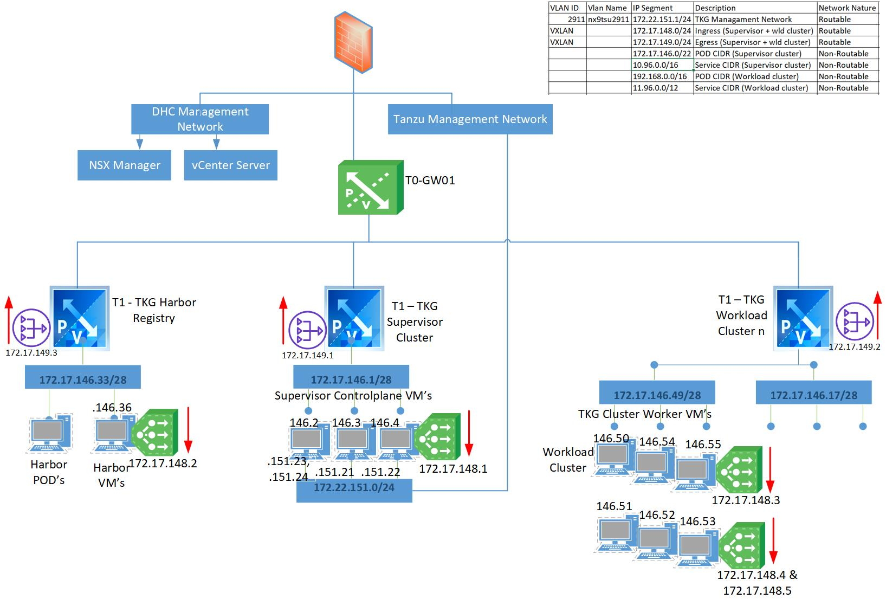

## VLANs

The following list of VLANs represents those that are required and planned for Tanzu  in VCS implementation. Such VLANs should be provided before Vsphere with Tanzu build will start.

### VLAN’s requirements

| VLAN Name | VLAN ID | Minimum L2 Ethernet MTU | Routed Interface |Purpose |
|---|---|---|---|---|
| Supervisor management network | VLAN | 1518 | Yes | Supervisor Management Network |
| Pod CIDR (Supervisor cluster) | |9000 | No | POD CIDR for vpshere pods for Supervisor Cluster |
| Service CIDR (Supervisor cluster) | | 9000 | No | A private CIDR to assign IP addresses to Kubernetes services for Supervisor Cluster |
| Ingress CIDR | VXLAN | 9000 | Yes (Overlay Network) | Ingress CIDR for incoming traffic from outside network to Tanzu |
| Egress CIDR | VXLAN | 9000 | Yes (Overlay Network) | Egress CIDR for outgoing traffic from Tanzu cluster to outside network |
| POD CIDR (Workload cluster) | | 9000 | No | POD CIDR for vpshere for Tanzu Kubernetes cluster or Workload cluster |
| Service CIDR (Workload cluster) | | 9000 | No | A private CIDR to assign IP addresses to Kubernetes services for Tanzu Kubernetes cluster or Workload cluster |

### Physical Security

VCS is a product which relies on existing physical infrastructure. Because of this, the physical network should provide security functionalities. Required security can be accomplished by providing a device capable of inspecting traffic between networks. VCS relies on networks which should be terminated (gateway should be) on the firewall device. All firewalls which are capable of defining zones, and setup BGP adjacency are good (Juniper SRX, Cisco ASA context or other capable firewalls). For simplicity in below sections this device will be named "Physical Firewall".

In VCS we present two types of zones - Internal and External:

- Internal - internal networks inside VCS - there is no need to duplicate security between internal networks if internal security is solved by NSX
- External - external networks to VCS

Above split is allowing to prepare simple ruleset which is required on Physical Firewall. Below table is displaying ruleset based on subnets defined in previous section. Table will contain as well groups of objects which will be defined later.

Below rules for Physical Firewall are in addition to the existing rules defined in [lldSoftwareDefinedNetworks.md](lldSoftwareDefinedNetworks.md)

### Rule set for Physical Firewall

| Firewall Rule Name              | Source                   | Destination              | Service | Action | Annotation |
| ------------------------------- | ------------------------ | ------------------------ | ------- | ------ | ---------- |
| CrossInternalNetworksConnection | Tanzu Supervisor Network | Tanzu Supervisor Network | any     | ACCEPT |            |
| Default Rule                    | any                      | any                      | any     | DENY   |            |

## NSX-T Data Plane

**Tanzu Supervisor Network VDS:**

VMware Virtual Distributed Switch (VDS) provides a centralized interface from which you can configure, monitor and administer virtual machine access switching for the entire data center.

The Supervisor controlplane VMs resides in this VDS, who controls the operations of Tanzu.

| Settings                                                     | Tanzu Supervisor Network                |
| ------------------------------------------------------------ | --------------------------------------- |
| Security (Promiscuous mode, MAC address  changes, Forged transmits. | All Reject                              |
| Traffic Shaping                                              | Disabled                                |
| VLAN Type                                                    | VLAN                                    |
| Teaming                                                      | Route Based on originating virtual port |
| Network failure detection                                    | Link status only                        |
| Failback                                                     | Yes                                     |
| Active Uplinks                                               | uplink1, uplink2                        |
| Standby Uplinks                                              | None                                    |
| Unused Uplinks                                               | None                                    |
| Filtering & Marking                                          | Disabled                                |
| MTU                                                          | 1500                                    |

### Network Services

### NTP (Time Source)

Two Time Sources supporting NTPv4 are required. Time Source can be a Physical Firewall (Gateway) itself or other device. Time Sources need to be Stratum 3 or lower. Time Sources can not be local. Sources need to be synced with Stratum 0 Time Source. Traffic between VCS AD Controllers and Time Sources needs to be allowed.

### NSX-T Logical Switches

The logical switching capability in the NSX-T platform provides the ability to spin up isolated logical L2 networks with the same flexibility and agility that exists for virtual machines. A logical switch provides a representation of Layer 2 switched connectivity across many hosts with Layer 3 IP reachability between them. When logical switches are attached to transport zones, it connects to the VDS/N-VDS for networking.

| Segment Name            | Connectivity              | Transport Zone            | Subnets | Admin State | VLAN    | Domain   | Description              |
| ----------------------- | ------------------------- | ------------------------- | ------- | ----------- | ------- | -------- | ------------------------ |
| < location code >eg001  | < location code >-t1-gw01 | overlay-tz-< NSX-T FQDN > | Not Set | UP          | Not Set | Workload | Egress network of Tanzu  |
| < location code >ing001 | < location code >-t1-gw01 | overlay-tz-< NSX-T FQDN > | Not Set | UP          | Not Set | Workload | Ingress network of Tanzu |

POD CIDR (Supervisor cluster), Service CIDR (Supervisor cluster), POD CIDR (Workload cluster) and Service CIDR (Workload cluster) are defined in the Tanzu configurations, which Tanzu will divide them into small subnets, as per requirement.

## Tanzu  in VCS Architecture and Components

A cluster enabled with Tanzu  in VCS is called a Supervisor Cluster. The cluster is at the base of the Tanzu  in VCS providing the necessary components and resources for running workloads that include vSphere Pods, VMs, and Tanzu Kubernetes clusters

It runs on top of an SDDC layer that consists of ESXi for compute, NSX-T Data Center or vSphere networking, and vSAN or another shared storage solution. Shared storage is used for persistent volumes for vSphere Pods, VMs running inside the Supervisor Cluster, and pods in a Tanzu Kubernetes cluster.
The general architecture for Supervisor Cluster is as shown below:

### Figure 2. Tanzu  in VCS Supervisor Cluster Overview

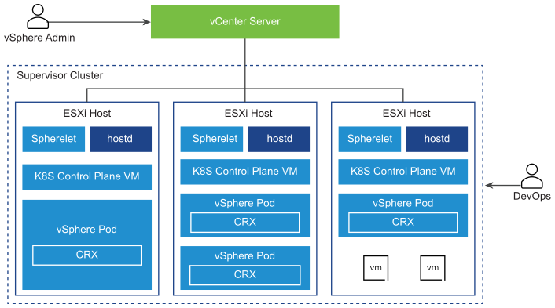

Below are the components for Supervisor Cluster:

- Kubernetes control plane VM. Three Kubernetes control plane VMs in total are created on the hosts that are part of the Supervisor Cluster. The three control plane VMs are load balanced as each one of them has its own IP address. Additionally, a floating IP address is assigned to one of the VMs. vSphere DRS determines the exact placement of the control plane VMs on the ESXi hosts and migrates them when needed. vSphere DRS is also integrated with the Kubernetes Scheduler on the control plane VMs, so that DRS determines the placement of vSphere Pods. When as a DevOps engineer you schedule a vSphere Pod, the request goes through the regular Kubernetes workflow then to DRS, which makes the final placement decision.
- Spherelet. An additional process called Spherelet is created on each host. It is a kubelet that is ported natively to ESXi and allows the ESXi host to become part of the Kubernetes cluster.
- Container Runtime Executive (CRX). CRX is similar to a VM from the perspective of Hostd and vCenter Server. CRX includes a paravirtualized Linux kernel that works together with the hypervisor. CRX uses the same hardware virtualization techniques as VMs and it has a VM boundary around it. A direct boot technique is used, which allows the Linux guest of CRX to initiate the main init process without passing through kernel initialization. This allows vSphere Pods to boot nearly as fast as containers.
- The Cluster API and VMware Tanzu™ Kubernetes Grid™ Service are modules that run on the Supervisor Cluster and enable the provisioning and management of Tanzu Kubernetes clusters. The Virtual Machine Service module is responsible for deploying and running stand-alone VMs and VMs that make up Tanzu Kubernetes clusters.

## Vsphere Namespaces

A vSphere Namespace sets the resource boundaries where vSphere Pods and Tanzu Kubernetes clusters created by using the Tanzu Kubernetes Grid Service can run. When initially created, the namespace has unlimited resources within the Supervisor Cluster. As a vSphere administrator, you can set limits for CPU, memory, storage, as well as the number of Kubernetes objects that can run within the namespace. A resource pool is created per each namespace in vSphere. Storage limitations are represented as storage quotas in Kubernetes.

### Figure 2. NameSpace Overview

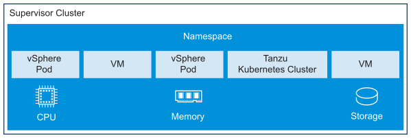

## Tanzu Kubernetes Clusters

A Tanzu Kubernetes cluster is a full distribution of the open-source Kubernetes software that is packaged, signed, and supported by VMware. In the context of vSphere with Tanzu, you can use the Tanzu Kubernetes Grid Service to provision Tanzu Kubernetes clusters on the Supervisor Cluster. You can invoke the Tanzu Kubernetes Grid Service API declaratively by using kubectl and a YAML definition.

A Tanzu Kubernetes cluster resides in a vSphere Namespace. You can deploy workloads and services to Tanzu Kubernetes clusters the same way and by using the same tools as you would with standard Kubernetes clusters.

### Figure 2. Tanzu Kubernetes Cluster Overview

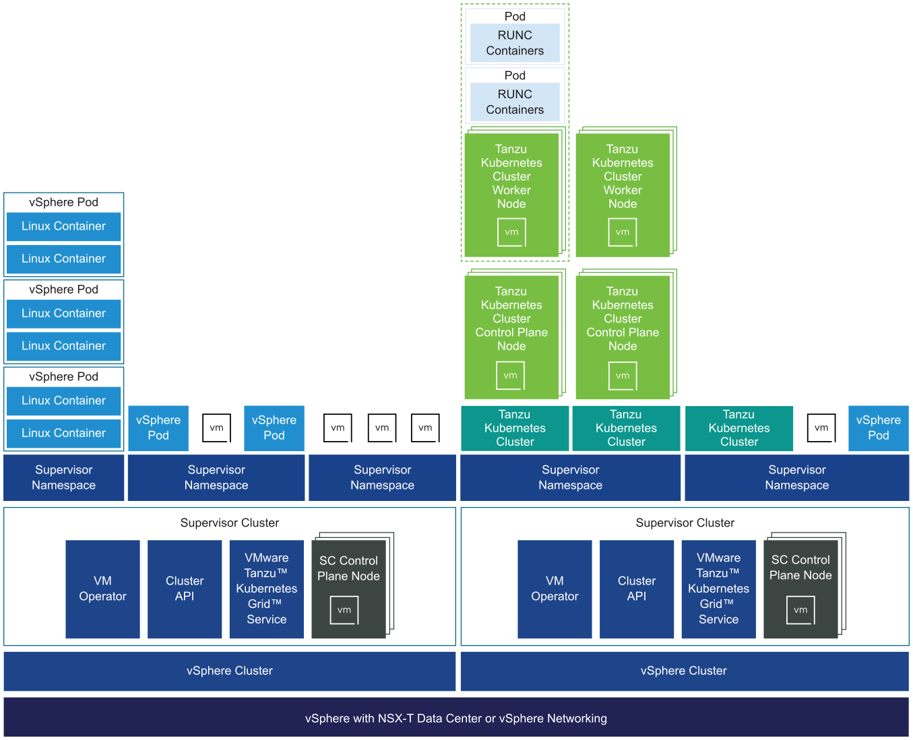

## Tanzu Kubernetes Grid Service

The Tanzu Kubernetes Grid Service provides self-service lifecycle management of Tanzu Kubernetes clusters. You use the Tanzu Kubernetes Grid Service to create and manage Tanzu Kubernetes clusters in a declarative manner that is familiar to Kubernetes operators and developers.
The Tanzu Kubernetes Grid Service exposes three layers of controllers to manage the lifecycle of a Tanzu Kubernetes cluster:

- The Tanzu Kubernetes Grid Service provisions clusters that include the components necessary to integrate with the underlying vSphere Namespace resources. These components include a Cloud Provider Plugin that integrates with the Supervisor Cluster. In addition, a Tanzu Kubernetes cluster passes requests for persistent volumes to the Supervisor Cluster, which is integrated with VMware Cloud Native Storage (CNS).
- The Cluster API provides declarative, Kubernetes-style APIs for cluster creation, configuration, and management. The inputs to Cluster API include a resource describing the cluster, a set of resources describing the virtual machines that make up the cluster, and a set of resources describing cluster add-ons.
- The Virtual Machine Service provides a declarative, Kubernetes-style API for management of VMs and associated vSphere resources. The Virtual Machine Service introduces the concept of a virtual machine class that represents an abstract reusable hardware configuration. The functionality provided by the Virtual Machine Service is used to manage the lifecycle of the control plane and worker node VMs hosting a Tanzu Kubernetes cluster.

### Figure 2. Tanzu Kubernetes Grid Service Overview

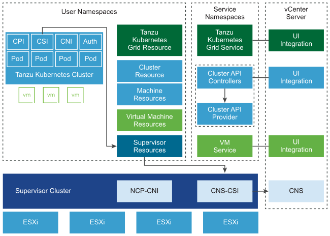

## Harbor Registry

Container registries provide Kubernetes operators with a convenient repository for storing and sharing container images. vSphere with Tanzu includes an embedded Harbor Registry that you can enable on the Supervisor Cluster. You can also use an external private container registry with Tanzu Kubernetes clusters.

You can enable the embedded Harbor Registry on the Supervisor Cluster to serve as the private container registry for the deployment of vSphere Pods and Tanzu Kubernetes cluster workloads. You provide the registry URL to developers who can use the vSphere Docker Credential Helper to securely access the registry and push and pull container images.

Whenever we create any vsphere namespace, we will have its repository created in the harbor. We will also have the image pull and push secrets created for the namespace. This secrets is then used for getting the images from the harbor in the vsphere namespace.

Below is the design for harbor registry

### Figure 2. Harbor Registry Overview

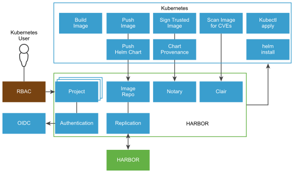

Harbor includes the following key features:

- Replicate projects: Harbor supports images replication to replicate repositories from one Harbor instance to another.
- Manage role by LDAP group: Harbor administrators can import an LDAP/AD group to Harbor and assign project roles to it.
- Manage Labels: Harbor provides labels to isolate image resources globally or at the project level.
- Manage Helm Charts: Harbor provides management of Helm charts isolated by projects and controlled by RBAC.
- Integrated UAA Authentication: Harbor can share UAA authentication with VMware Tanzu Application Service for VMs (TAS for VMs) and TKGI.
- Role-Based Access Control: Users and repositories are organized into projects. Users can have different permissions for the images in different projects.
- Policy-Based Image Replication: Images can be synchronized between multiple registry instances with auto-retry on errors, offering support for load balancing, high availability, multi-datacenter, hybrid, and multi-cloud scenarios.
- Vulnerability Scanning: Harbor uses Clair to scan images regularly and warn users of vulnerabilities.
- LDAP/Active Directory (AD) Support: Harbor integrates with enterprise LDAP/AD systems for user authentication and management.
- Image Deletion and Garbage Collection: Images can be deleted and their space can be recycled.
- Notary: Image authenticity can be ensured by using Docker Notary.
- Graphical User Portal: Users can easily browse, search repositories, and manage projects.
- Auditing: All the operations to the repositories are tracked.
- RESTful API: RESTful APIs for most administrative operations, easy to integrate with external systems.

## cAdvisor

cAdvisor (Container Advisor) provides container users an understanding of the resource usage and performance characteristics of their running containers. It is a running daemon that collects, aggregates, processes, and exports information about running containers. Specifically, for each container it keeps resource isolation parameters, historical resource usage, histograms of complete historical resource usage and network statistics. This data is exported by container and machine-wide.
We are configured monitoring of `TKG workload cluster` by installing management pack for kubernetes on vrops and then adding the cadvisor details to the kubernetes adapter on the vrops. To know more about `cAdvisor` kindly follow documentation [cAdvisor](https://github.com/google/cadvisor). To know more about how monitoring is configured using `cAdvisor` follow documentation [Configure Tanzu Monitoring](https://blogs.vmware.com/management/2020/06/monitor-tanzu-kubernetes-clusters-using-vrealize-operations.html)

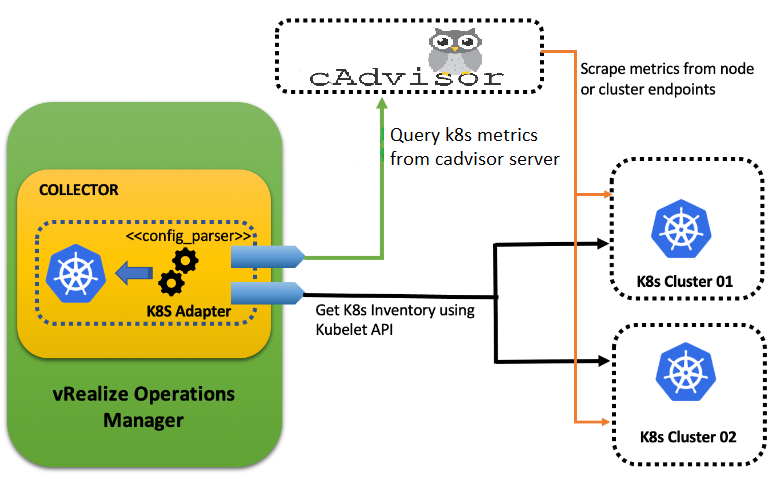

## RBAC for TKG Workload Cluster

Role-based access control (RBAC) is a method of regulating access to computer or network resources based on the roles of individual users within your organization.
RBAC authorization uses the rbac.authorization.k8s.io API group to drive authorization decisions, allowing you to dynamically configure policies through the Kubernetes API.The RBAC API declares four kinds of Kubernetes object: Role, ClusterRole, RoleBinding and ClusterRoleBinding.

### Design Decisions for RBAC for TKG Workload Cluster

| Decision ID | Design Decision | Design Justification | Design Implication |
|---|---|---|---|
| ARCDD001 | Vsphere namespace requester will have owner rights on vsphere namespace | Required to deploy applications and view resources on supervisor cluster | The design must include specific architecture |
| ARCDD002 | TKG workload cluster namespace requester will have owner rights on TKG workload cluster namespace | Required to deploy applications and view resources on TKG workload cluster | The design must include specific architecture |
| ARCDD003 | VCS operations team will have owner rights on both vsphere supervisor cluster and TKG workload cluster | Manage and operate both Supervisor cluster and TKG workload cluster | The design must include specific architecture |

### Role and ClusterRole

An RBAC Role or ClusterRole contains rules that represent a set of permissions. Permissions are purely additive (there are no "deny" rules).

A Role always sets permissions within a particular namespace; when you create a Role, you have to specify the namespace it belongs in.

ClusterRole, by contrast, is a non-namespaced resource. The resources have different names (Role and ClusterRole) because a Kubernetes object always has to be either namespaced or not namespaced; it can't be both.

ClusterRoles have several uses. You can use a ClusterRole to:

- define permissions on namespaced resources and be granted access within individual namespace(s)
- define permissions on namespaced resources and be granted access across all namespaces
- define permissions on cluster-scoped resources
- If you want to define a role within a namespace, use a Role; if you want to define a role cluster-wide, use a ClusterRole.

Here's an example Role in the "default" namespace that can be used to grant read access to pods:

```shell
apiVersion: rbac.authorization.k8s.io/v1
kind: Role
metadata:
  namespace: default
  name: pod-reader
rules:
- apiGroups: [""] # "" indicates the core API group
  resources: ["pods"]
  verbs: ["get", "watch", "list"]
```

Here is an example of a ClusterRole that can be used to grant read access to secrets in any particular namespace, or across all namespaces

```shell
apiVersion: rbac.authorization.k8s.io/v1
kind: ClusterRole
metadata:
  # "namespace" omitted since ClusterRoles are not namespaced
  name: secret-reader
rules:
- apiGroups: [""]
  #
  # at the HTTP level, the name of the resource for accessing Secret
  # objects is "secrets"
  resources: ["secrets"]
  verbs: ["get", "watch", "list"]
  ```

### RoleBinding and ClusterRoleBinding

A role binding grants the permissions defined in a role to a user or set of users. It holds a list of subjects (users, groups, or service accounts), and a reference to the role being granted. A RoleBinding grants permissions within a specific namespace whereas a ClusterRoleBinding grants that access cluster-wide.

A RoleBinding may reference any Role in the same namespace. Alternatively, a RoleBinding can reference a ClusterRole and bind that ClusterRole to the namespace of the RoleBinding. If you want to bind a ClusterRole to all the namespaces in your cluster, you use a ClusterRoleBinding.

- RoleBinding example

Here is an example of a RoleBinding that grants the "pod-reader" Role to the user "jane" within the "default" namespace. This allows "jane" to read pods in the "default" namespace.

```shell
apiVersion: rbac.authorization.k8s.io/v1
# This role binding allows "jane" to read pods in the "default" namespace.
# You need to already have a Role named "pod-reader" in that namespace.
kind: RoleBinding
metadata:
  name: read-pods
  namespace: default
subjects:
# You can specify more than one "subject"
- kind: User
  name: jane # "name" is case sensitive
  apiGroup: rbac.authorization.k8s.io
roleRef:
  # "roleRef" specifies the binding to a Role / ClusterRole
  kind: Role #this must be Role or ClusterRole
  name: pod-reader # this must match the name of the Role or ClusterRole you wish to bind to
  apiGroup: rbac.authorization.k8s.io
  ```
  
- ClusterRoleBinding example

To grant permissions across a whole cluster, you can use a ClusterRoleBinding. The following ClusterRoleBinding allows any user in the group "manager" to read secrets in any namespace.

```shell
apiVersion: rbac.authorization.k8s.io/v1
# This cluster role binding allows anyone in the "manager" group to read secrets in any namespace.
kind: ClusterRoleBinding
metadata:
  name: read-secrets-global
subjects:
- kind: Group
  name: manager # Name is case sensitive
  apiGroup: rbac.authorization.k8s.io
roleRef:
  kind: ClusterRole
  name: secret-reader
  apiGroup: rbac.authorization.k8s.io
```

### VELERO

Velero handles Kubernetes metadata during backup and restore. Velero relies on its plugin to backup and restore PVCs. Velero Plugin for vSphere includes the following components:

`Velero vSphere Operator` - a Supervisor Service that helps users install Velero and its vSphere plugin on the Supervisor Cluster; must be enabled through vSphere UI to support backup and restore on Supervisor and Guest Clusters

`vSphere Plugin` - deployed with Velero; called by Velero to backup and restore a PVC

`Backup driver` - handles the backup and restore of PVCs; relies on the Data manager to upload or download data

`velero-plugin-for-aws` - handles the IAM configuration of velero with MinIo object storage.

`Data mover` -  Also known as `Data manager` which handles upload of snapshot data to object store and download of snapshot data from object store.
A dedicated backup network(BackupRestore Network) should ideally be created in the cluster.
All ESXi hosts in the cluster should have a VMkernel interface connected to the BackupRestore network, and should be tagged with the vSphere Backup NFC service.
The Velero Data Manager should be deployed on the BackupRestore network.
The BackupRestore network should have a route to the vSphere Management network to allow the Velero Data Manager communicate to vCenter Server.

`MinIo` - We'll be using MinIo as our object storage. MinIO offers high-performance, S3 compatible object storage. Native to Kubernetes, MinIO is the only object storage suite available on every public cloud, every Kubernetes distribution, the private cloud and the edge. MinIO is software-defined and is 100% open source under GNU AGPL v3.

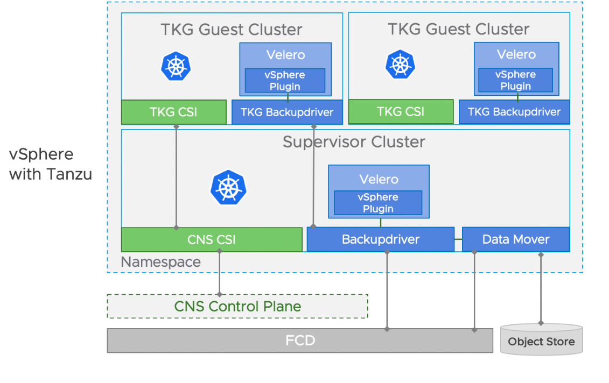

### Contour

Contour is an open-source Kubernetes Ingress controller that acts as a control plane for the Envoy edge and service proxy . Contour supports dynamic configuration updates and multi-team ingress delegation while maintaining a lightweight profile. It is built for Kubernetes to empower you to quickly deploy cloud-native applications by using the flexible IngressRoute API. Contour deploys the Envoy proxy as a reverse proxy and load balancer.

`Helm` - Helm is an open-source graduated CNCF project originally created by DeisLabs as a third-party utility known as the package manager for Kubernetes , which is used for installation process of contour

`Ingress Controller` - An Ingress controller abstracts away the complexity of Kubernetes application traffic routing and provides a bridge between Kubernetes services and external ones.

`Envoy` - Envoy is a Layer 7 (application layer) bus for proxy and communication in modern service-oriented architectures, such as Kubernetes clusters. Envoy strives to make the network transparent to applications while maximizing observability to ease troubleshooting.

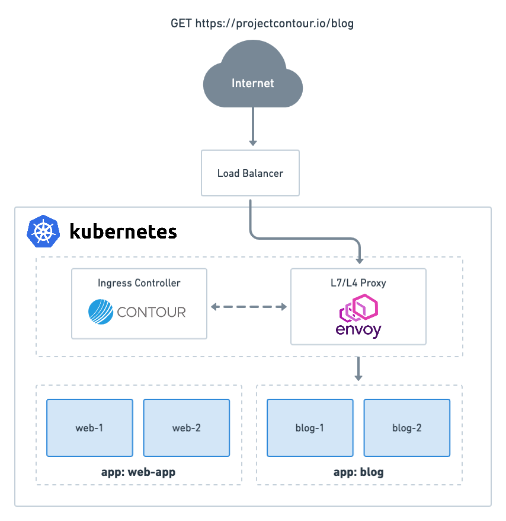
