# Table of Contents

- [Table of Contents](#table-of-contents)
- [List of Changes](#list-of-changes)
- [Introduction](#introduction)
- [Scope](#scope)
- [Related Documents](#related-documents)
- [Multi-tenancy light design](#multi-tenancy-light-design)
  - [Design Choices](#design-choices)
  - [Design prerequisites](#design-prerequisites)
  - [Compute vCenter](#compute-vcenter)
    - [Compute resource pool](#compute-resource-pool)
    - [Resource pool naming](#resource-pool-naming)
  - [vRA](#vra)
    - [Cloud Assembly](#cloud-assembly)
      - [Project](#project)
      - [Cloud zone](#cloud-zone)
      - [Cloud template](#cloud-template)
      - [Capability tags](#capability-tags)
  - [vCenter](#vcenter)
  - [Automation](#automation)
  - [SDN infrastructure and security](#sdn-infrastructure-and-security)
    - [Infrastructure](#infrastructure)
    - [Security](#security)
      - [NSX-T tags](#nsx-t-tags)
      - [DFW security groups](#dfw-security-groups)
      - [DFW section/rules](#dfw-sectionrules)

# List of Changes

| Date       | Issue    | Author          | Description               |
| ---------- | -------- | --------------- | ------------------------- |
| 13/12/2022 | AMC-4527 | Tomasz Korniluk | Initial document           |
| 29/12/2022 | AMC-4467 | Piotr Lewandowski | Updated with additional chapters          |
| 03/01/2023 | AMC-4467 | Michal Pindych | Updated with additional chapters - SDN         |
| 07/04/2023 | VCS-5966 | Adrian Ilea | Updated common part for all other customers, remove Siemens customization  |
| |  |  |  |

# Introduction

This document describes the overall design of multitenant light implementation in VCS for Siemens and technical details.

# Scope

The document is intended to cover below scope:

1. Multitenant light design
2. vRA
3. SDN

# Related Documents

| Document |
| -------- |
| [GLB-CES-PrivateCloud/DHC-Documentation/develop/design](https://github.com/GLB-CES-PrivateCloud/DHC-Documentation/tree/develop/design)|
| [GLB-CES-PrivateCloud/DHC-Documentation/develop/workInstructions/wiAddNewTenantMTLight](https://github.com/GLB-CES-PrivateCloud/DHC-Documentation/blob/develop/workInstructions/wiAddNewTenantMTLight.md)|

# Multi-tenancy light design

The following diagram provides an overview of the multitenant light solution used for  VCS implementations.
The diagram provides a view of logic used to separate logically VCS tenants under single vRA tenant organization and place compute resource under dedicated resource pools per tenant.

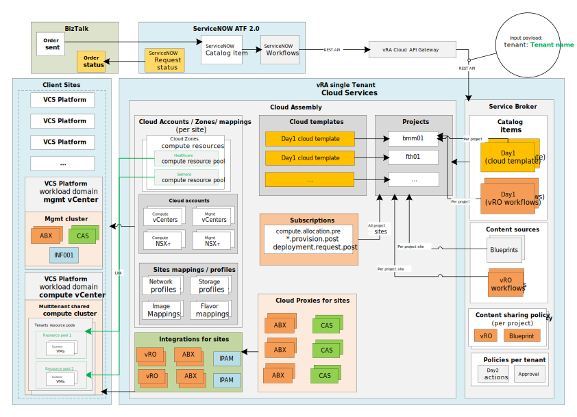

The above diagram describes a link between multitenant compute resources configured under the site cloud zone endpoint. Each tenant consumes dedicated compute resource pools which are shared under a multitenant cluster in VCS platform for each site.

The following diagram describes the granular view of the Day1 request logic to consume a dedicated compute resource pool for each tenant. SNOW logic sends into vRA Service Broker catalog item request with payload input which contains tenant name. Service broker based on SNOW inputs consumes Cloud Assembly service to an allocated virtual machine under tenant dedicated compute resource pool under the shared cluster for selected cloud endpoint site.

Below example is for the Siemens FTH site:

>**Note:** Siemens has dedicated DC-0100 SSR. For the standard use there is a 'Deploy virtual Machine' blueprint available.

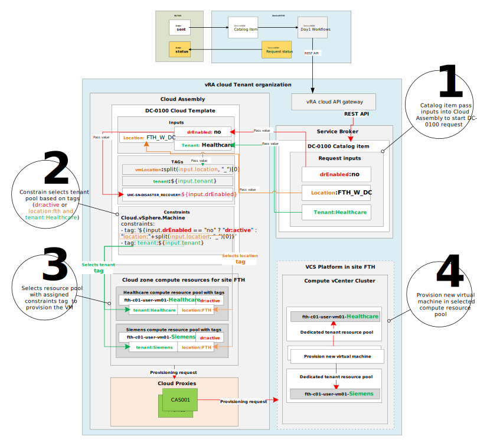

## Design Choices

| **ID** | **Design Decision**                                          | **Design Justification**                                     | **Design Implication**                                       |
| ------ | ------------------------------------------------------------ | ------------------------------------------------------------ | ------------------------------------------------------------ |
| D001   | Separate logically VCS tenants compute resources under single vRA tenant organization. Dedicated VRA Projects for each sub-tenant | Simplify the implementation of Multitenancy for the existing VCS infrastructure and reduce the footprint. Single VRA organization means fewer cloud proxies and extensibility proxies, less configurations to manage. | Each cloud zone required update to add tenant compute resource pool |
| D002   | vRA Cloud Assembly logic to select tenant dedicated compute resource pool | Since the design was simplified and the level of separation were reduced to minimum (no tenant-dedicated organization), the logical separation is done with VRA projects, VRA tags and dedicated-resource pools within a shared cloud zone | For each tenant compute resource pool requires assignment of a tenant capability tag |
| D003   | Day1 cloud template supports multitenant light logic         | Cloud template logic expanded to have additional constraint tag (key:tenant, value:SNOW tenant name) under virtual machine resource properties | For each VRA project Day1 cloud template requires update to enable new mt light logic |
| D004   | Created dedicated tenant resource pool under multitenant compute cluster for each VCS platform site | Separates logically tenant virtual machines under shared cluster per VCS platform site | Each VCS platform site requires creation of dedicated tenant resource pool under compute cluster |

## Design prerequisites

- Healthy compute clusters in affected VCS platform site
- vRA cloud services (Assembly and Service Broker) healthy
- Customer tenant name defined
- VCS platform site is accessible
- Day1 cloud template published
- Cloud accounts healthy

## Compute vCenter

Multitenant light logic requires separation at compute vCenter level to store tenant Customer virtual machines inside a dedicated compute resource pool under shared multitenant cluster per site.

### Compute resource pool

Multitenant cluster is placed under compute vCenter under each VCS platform site.

Each tenant holds his own dedicated compute resource pool with default VCS settings (in terms of resources limits)

>**Note:** To consume in the vRA tenant compute resource pool first needs to be created at the vCenter level on each VCS platform site and discovered.

### Resource pool naming

To continue the default VCS design regarding resource pool naming convention first 3 section remains the same as follows:
> ```<VCSSiteLocationCode>-<WorkloadDomainNumber>-user-vm<ClusterNumber>```
>> fth01-c01-user-vm01-sie01

An extra suffix is added at the end of the resource pool name to distinguish.

> **Note:** Default VCS suffix (vRA tenant org.name - i.e. sie01) needs to be replaced with Customer tenant name for resource pool, as follows:
> Example tenant dedicate compute resource pool name:
>> fth01-c01-user-vm01-***healthcare***

**Note:** Suffix tenant name lower case only

## vRA

The following chapter describes granular details of the multitenant light solution implemented under vRA cloud services.

The below diagram describes the logic of the Projects, Resource Pools and Tags used for enabling multi-tenancy light solution in VCS deployments:

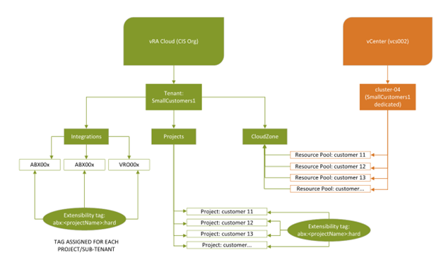

### Cloud Assembly

Cloud Assembly is the main service that managed compute resources under each VCS platform site. Using this service vRA is capable to provision and managing Customer virtual machine resources.
To successfully enable multi-tenant light logic Cloud Assembly components require updates as follow:

- Project
- Cloud zone
- Cloud template
- Compute resource pools

#### Project

A new dedicated vRA Cloud project will be created with blueprints cloned from a specified parent project

#### Cloud zone

To accommodate multitenant light requirements cloud zone setup needs to be adjusted as follows:

- Added tenant compute resource pool under site Cloud Zone compute section
- Assigned tenant and location capability tags under the resource pool

>**Notes:**

- The cloud zone for each site needs update to use the tenant compute resource pool.
- Project scope for existing Parent Project has to be set to *Any project*.
- Parent project assignVmNameAction needs to be set to *Share with all projects in this organization*

The below screen illustrates an example setup of a cloud zone with an assigned tenant compute resource pool.

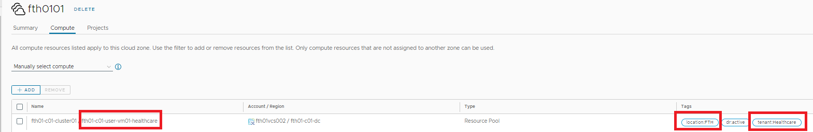

#### Cloud template

To use new logic for the multitenant light solution existing DC-0100 cloud template needs update under Cloud.vSphere.Machine constraints section.

Below example illustrates the existing setup of the cloud template for vSphere machines resource.

```Yaml
Cloud_vSphere_Machine_1:
    type: Cloud.vSphere.Machine
    properties:
      customizeGuestOs: true
      image: ${input.Image}
      cpuCount: ${input.vcpu}
      coreCount: ${input.vcores}
      totalMemoryMB: ${input.vmemory}
      attachedDisks: ${map_to_object(resource.Cloud_vSphere_Disk_1[*].id, "source")}
      networks:
        - name: ${resource.Cloud_NSX_Network_1.name}
          assignment: static
          deviceIndex: 0
          network: ${resource.Cloud_NSX_Network_1.id}
      constraints:
        - tag: '${input.drEnabled == "yes" ? "dr:active" : "location:"+split(input.location, "_")[0]}'
```

New logic requires an additional tag constraint called - ```key:tenant, value:${input.tenant}``` under the constraints section like the below example:

```Yaml
        - tag: tenant:${input.tenant}
```

Below example of cloud template updated code with additional tenant tag constraint:

```Yaml
Cloud_vSphere_Machine_1:
    type: Cloud.vSphere.Machine
    properties:
      customizeGuestOs: true
      image: ${input.Image}
      cpuCount: ${input.vcpu}
      coreCount: ${input.vcores}
      totalMemoryMB: ${input.vmemory}
      attachedDisks: ${map_to_object(resource.Cloud_vSphere_Disk_1[*].id, "source")}
      networks:
        - name: ${resource.Cloud_NSX_Network_1.name}
          assignment: static
          deviceIndex: 0
          network: ${resource.Cloud_NSX_Network_1.id}
      constraints:
        - tag: '${input.drEnabled == "yes" ? "dr:active" : "location:"+split(input.location, "_")[0]}'
        - tag: tenant:${input.tenant}
```

Template new constraint will automatically fill tenant tag value based on DC-0100 input field called ```${input.tenant}``` - results that vRA Cloud Assembly will look for compute resource pool with assigned tags location and tenant (i.e. location:FTH, tenant:Healthcare)

>**Note:** DC-0100 logic flow has been already illustrated in the design overview chapter
>**Note:** Above update has been already automated and described inside chapter Automation.
>**Note:** By default Siemens design DC-0100 cloud templates are published per project site - which means that the above update needs to be reflected per each DC-0100 cloud template (under project site).

#### Capability tags

To accommodate new logic has been re-used existing tag called: ```key:tenant, value:${input.tenant}``` (i.e tenant:Healthcare)

Tag's main role is to identify the tenant compute resource pool for provisioning requests to create a new virtual machine inside a pool.

Following table list of vRA components that consume tenant capability tags for multitenant light logic:

| Component name      | Role    |
| ---------- | -------- |
| Compute resource pool | Identify tenant dedicated compute resource pool |
| Cloud template constraint | Logic to select dedicated tenant compute resource pool during day1 provisioning |
| Virtual machine resource | Identify to which tenant belongs virtual machine |

## vCenter

On a vCenter level, the logical separation of Tenants is done by using a dedicated Resource Pool. In a regular VCS implementation, a resource pool name contains the VRA tenant organization name.

## Automation

The automation aspect to enable multitenant light solution has been covered under the following workinstruction:

[DHC-Documentation/workInstructions/wiAddNewTenantMTLight.md](https://github.com/GLB-CES-PrivateCloud/DHC-Documentation/blob/develop/workInstructions/wiAddNewTenantMTLight.md)

## SDN infrastructure and security

### Infrastructure

All of the design decisions for multitenancy are consistent with the information contained in the LLD SDN, please refer to the link below (section Multi-tenancy):

[DHC-Documentation/design/lldSoftwareDefinedNetworks.md](https://github.com/GLB-CES-PrivateCloud/DHC-Documentation/blob/develop/design/lldSoftwareDefinedNetworks.md)

It is worth mentioning that multi-tenancy is implemented on the SDN level and not on the vRA level (where all objects and accounts are shared between tenants)

The additional infrastructure components which must be configured for tenant purposes

- VRF on T0 router ( with the assumption that all tenants can use the same BGP AS number)
- dedicated T1 routers (connected to specific tenant VRF )
- specific distributed firewall sections and rules  

### Security

Every tenant will have separate SDN infrastructure based on a dedicated T1 router and VRF on T0 router (but despite that edge cluster will be shared)
The additional level of security will be implemented in distributed firewall, and this solution consists of the following components  

#### NSX-T tags

Every VM must have at least 2 nsx-t security tags which will be used to place it in a specific security group. One tag determines the tenant itself and another one specifies the default security behavior which allows all the traffic. In the future - VM can have many security tags corresponding to pre-created firewall rules - but at this stage of the project decision has been made to allow all traffic for customer workload.

- **tenantName**    - sample values are Siemens/Healthcare (or any future tenant) , this tag is set up during VM migration/provisioning process.
- **nsx-security**  - default value - DefaultSecurityGroup, based on this tag all traffic for VM is allowed, tag is set up during VM migration/provisioning process.
  
#### DFW security groups  

Every tenant will have a dedicated security group based on dynamic group membership using specific VM tags, please refer to the below examples

- Default Security Group  Siemens - this group contain only default security tag and Siemens tenant
  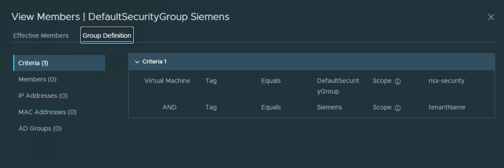
  
- Default Security Group  Healthcare  - this group contain only default security tag and Healthcare tenant
  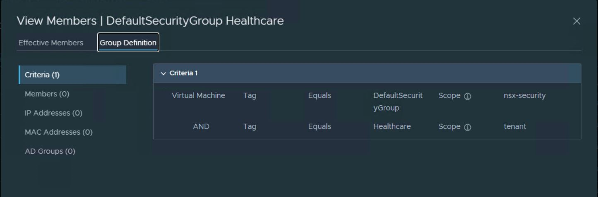
  
- Default Security Group - this group contains all VM's with default security tag  
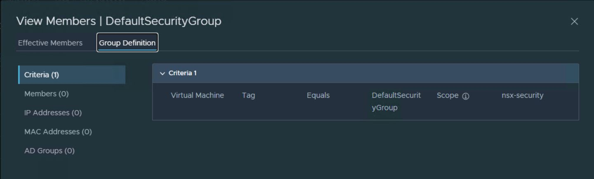

This approach allows implementing micro-segmentation with minimal effort in the future if this functionality will be required for Siemens environment

#### DFW section/rules

Below there are presented predefined security rules which must be implemented on VCS platform

- Tenant Siemens
  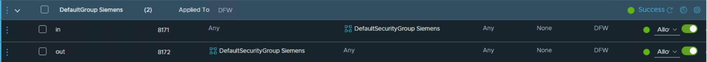
  
- Tenant Healthcare
  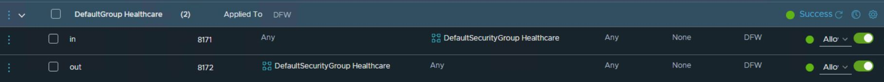
  
- Default allow rule for VM with security tag
  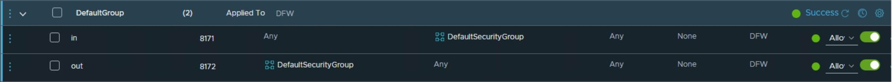
  
- Default deny rule
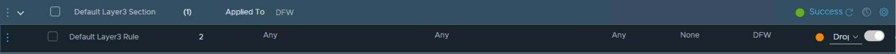
