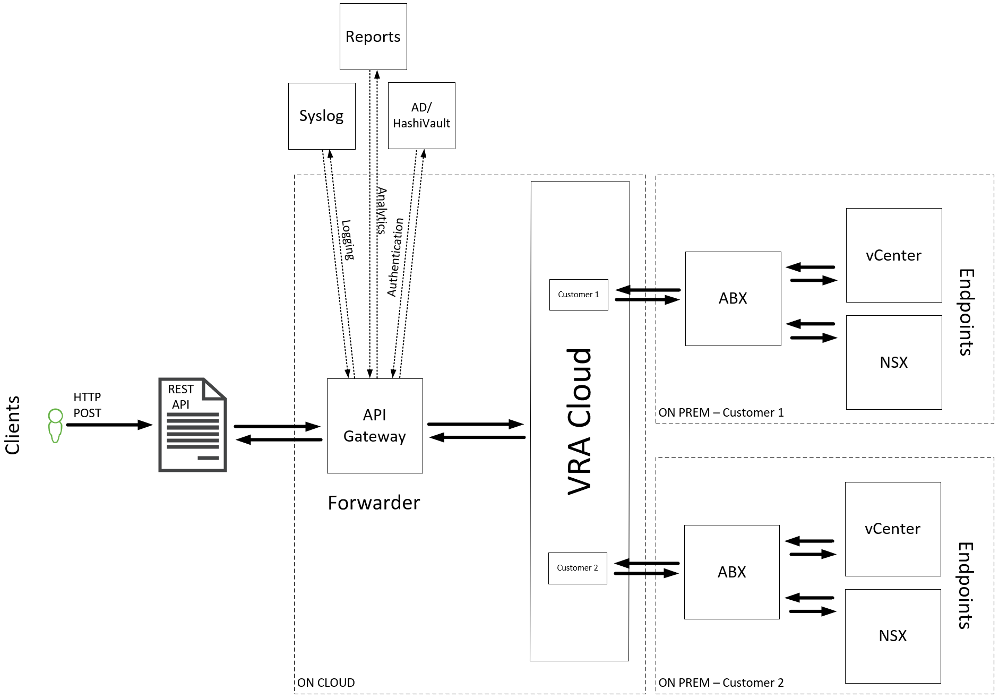
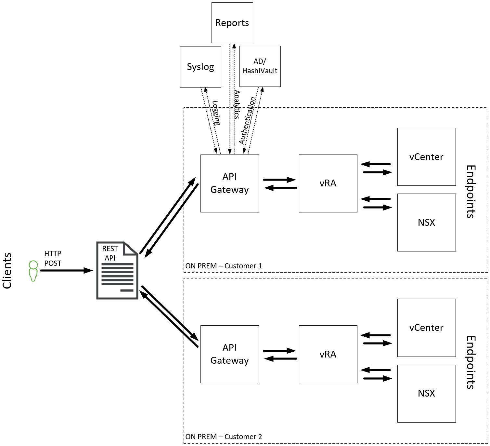

# API Gateway concept

VCS is providing option for Customer to interact with API of the backend by using API Gateway (later called API GW). Technically VCS assumes that API GW is based on two form factors.

- Software as a Service (on cloud) scenario assumes that API GW is located inside external location, i.e. external cloud. This solution should contain build in high availability and backup options.
- API GW in Virtual Machine form factor (on prem) would be hosted inside VCS, therefore high availability and backup would be provided internally by VCS.

API GW should provide an option to send Logs into either internal or external syslog server. Syslog server might be solved in various ways. It might be dedicated syslog server for the solution, or existing syslog in VCS, or even syslog server in ATF.

As a part of the VCS product, API GW should have option to prepare various reports, starting from Usage of the API GW, its performance, throughput to list of users with associated requests.

API GW should be an entry point for all API Calls send toward VCS from external infrastructure, this will provide mechanism to track all changes and protect if necessary.

In initial version of VCS's API GW, it will expose only vRA Cloud exposed API's. This allows to keep parity between those two components and limit number of possible API to those which are present in VMware documentation to vRA Cloud. In addition to this, API GW should have possibility to create blacklist filter to limit those API calls which will destroy integration with VCS or other management related options.

### On cloud solution

In this scenario, API GW can accept API calls from Internet. This provides most flexible solution for each customer. As an endpoint VCS will provide vRA Cloud. This will allow to limit possible mistakes or send disallowed API Call.

On cloud solution should authenticate API call sender with AD, provide necessary logging information, as well as point to appropriate Cloud Account (in vRA Cloud). This is how mechanism of sending requests will be forwarded to correct environment.

### On prem solution

In on prem solution, API GW is maintained as a VM form factor. This requires from VCS infrastructure, to provide Backup and High availability features. In case of requirement, there might be multiple Virtual Machines deployed which will be entry point for single environment. Of course as in on cloud scenario, initial version of the API GW will expose just on prem vRA to receive all requests. The vRA would be used for interpreting request as well as filtering of the harmful API Calls.

As above, on prem version of the API GW should authenticate API call sender with AD, provide necessary logging information, as well as point to appropriate Cloud Account (in vRA - **not sure how its named**).

### Multitenancy

API GW in both form factors should provide mechanism to provide multitenancy. This might be achieved in multiple ways.
For on cloud solution:

- One instance of the API GW can be used if backend logic is providing necessary separation between users,
- Multiple instances of API GW can be used

For on Prem solution:

- One VM of the API GW can be used if backend logic is providing necessary separation between users (not working with all circumstances),
- Multiple instances of API GW can be used if they will not overload Management Domain or Management IP Network.

Apart of real multi customer usage, there is a requirement to manage multiple endpoints in multiple locations.

### Security

Another very important feature which VCS is expecting from API GW is ability to provide authorization mechanism based on Active Directory users and groups. Active Directory used in this solution might be either Customer or VCS one. It would be nice to have as well option to synchronize with some password manager (like HashiVault) to get access to the backend components.

### Design Decisions - API Gateway

| Decision ID | Design Decision                                                                                                                            | Design Justification                                                                                                                                                                               | Design Implication                                                                                                                                                                  |
|-------------|--------------------------------------------------------------------------------------------------------------------------------------------|----------------------------------------------------------------------------------------------------------------------------------------------------------------------------------------------------|-------------------------------------------------------------------------------------------------------------------------------------------------------------------------------------|
| APIGW001    | API GW should provide SAAS form factor solution.                                                                                           | Due to fact that most of customers using VCS as their platform, are going to build multiple sites, there is a requirement to maintain API GW in external location, potentially External Cloud.     | This option might be pricey. In case of multitenancy it might require multiple instances.                                                                                           |
| APIGW002    | API GW should provide solution based on VM form factor solution.                                                                           | Some of the VCS customers will potentially require isolation of the VCS from external influence. This scenario requires solution where API GW is located onprem.                                   | On prem version should be supported without access to internet. Potentially it will be required, to build multiple VMs for each customer/subcontractor in multitenancy environment. |
| APIGW003    | API GW should authenticate users based on AD users/groups.                                                                                 | Limiting access for just appropriate users with enough credentials is a must.                                                                                                                      | Internal or external to VCS AD should be integrated with API GW.                                                                                                                    |
| APIGW004    | API GW should provide an option to define syslog endpoint.                                                                                 | Logging all actions done as well as users which are making those actions is a must in such products. It increases visibility of the product and giving mechanism to create some tickets if needed. | Destination should be provided in front.                                                                                                                                            |
| APIGW005    | API GW should provide reporting mechanism                                                                                                  | Allowing reporting will increase customer awareness what have been requested through API GW and who did that request in a first place.                                                             |                                                                                                                                                                                     |
| APIGW006    | Only available endpoint for API GW would be vRA Cloud (on cloud) or vRA (on prem).                                                         | Limiting endpoint to just vRA Cloud reducing complexity and removing problems with LCM of possible actions.                                                                                        | Decrease drastically amount of available actions (no access to SRM, Avamar, most of the NSX-T actions).                                                                             |
| APIGW007    | Multitenancy on both on cloud and on prem solutions should be available.                                                                   | Multitenancy is crucial for big customers who require logical or physical split between subcontractors.                                                                                            | On prem version can require dozens of additional VMs which will became problem for capacity on Management Domain as well as Management IP schema.                                   |
| APIGW008    | API GW should have possibility to update environment for one customer in multitenancy environment, including update of the filtering list. | Requirement for not interfering with other customers/subcontractors on the same infrastructure is a must.                                                                                          | It might be hard to achieve with on cloud with single instance (just different users/views)                                                                                         |
| APIGW009    | API GW should have mechanism to either deny or allow all API calls by default.                                                             | Filtering in API GW should have possibility to define if we are allowing list of actions or giving everything possible except a list of actions.                                                   | Possible solution might not contain both options.                                                                                                                                   |
| APIGW010    |                                                                                                                                            |                                                                                                                                                                                                    |                                                                                                                                                                                     |
