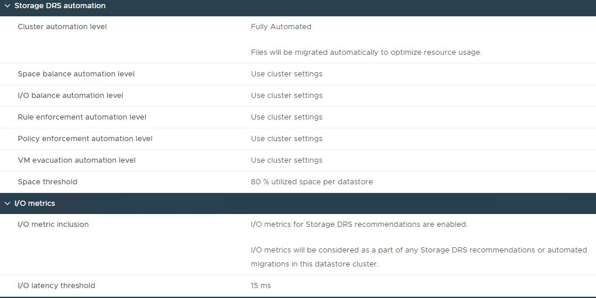
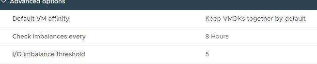

# README

Created on 2024-09-13 14:03:04 UTC

| File name | Purpose |
|-----------|---------|
| CloudLinkToNkpMigration.md | Create and configure a vSphere Native Key Provider and change existing vSAN encryption from existing standard key provider to vSphere Native Key Provider (NKP) for environments with `vSphere 7 update 2 or newer` . |
| createNamespace.md | Create Vsphere namespaces and TKG workload cluster namespaces. |
| dhcAddingSecurityObjectsNSX.md | Explains the process of adding new Security Objects to NSX-T, including: Services,Security Groups,Security Rules |
| dhcAddModifyStorageLunsToCloudHostsEsxi.md | This instruction covers the action of Adding/Modifying Storage LUNs on Cloud Hosts (ESXi). |
| dhcAnsibleCoreConfiguration.md |  |
| dhcAsyncPatchTool.md | Apply critical patches to certain VCF components (~~NSX-T Manager *~~, vCenter Server, and ESXi) outside of VMware Cloud Foundation releases.*NSX-T Manager patching with Async Tool was excluded from tests for Engineering Team. |
| dhcBuildGuide.md | Build the DHC Management cluster |
| dhcCloneRestoreMachineSetAsPerOriginalMachineIfApplicable.md | This instruction covers the procedure and actions which need to be followed in case there is already a restore/clone created and customer chooses to keep the clone/restore in question and replace the original VM.  It is mandatory that, before we start re-configuring the clone/restore, we have a **customer written approval that clone/restore is needed instead of the original powered off Virtual Machine and that cleanup action can start**.  Keeping both, original VM and clone/restore, in powered on state, is not supported due to IP conflict.  Trying to create a Virtual machine using clone/restore, instead of using vRA Catalog request is also not supported. |
| dhcConfigureCloudlinkKms.md | Install and configure a new instance of Key Management Server (KMS) and vSAN encryption in accordance with Atos Global Delivery standards and portfolio services. |
| dhcDecomissioningProcess.md | Describe the generic process of DHC decommissioning. |
| dhcDellEsxiUpgradeWithCustomImages.md |  |
| dhcDeployDns.md | Configure DNS for central and satellite Infoblox. |
| dhcDestroyClonedDuplicatedVm.md | This instruction covers the action of destroying Cloned/Duplicated Virtual Machine. |
| dhcEnableMultitenancy.md | Enable Multi-tenancy functionality within DHC. |
| dhcEsxi8AtosTSShardening.md | Modify ESXi advanced settings, acceptance level, stopping services and adding esxi shell and ssh banners according to Atos TSS Document. |
| dhcLinuxTemplateConfiguration.md |  |
| dhcManualTenantConfiguration.md | Configure a new Tenant in VRA Cloud and vSphere for Shared DHC multi-tenant option. |
| dhcMultiTenantSDN.md | Configure multi-tenant SDN solution for DHC. |
| dhcOnboardingAntivirus.md | Onboard a new customer with BDS as part of the DHC Antivirus service in accordance with Atos Global Delivery standards and portfolio services. |
| dhcOnboardingTasks.md |  |
| dhcOnboardingVraCloudCustomerVms.md | Prepare and execute vRA Cloud Onboarding for migrated Virtual Machines as part of the Workload Migration service in accordance with Atos Global Delivery standards and portfolio services. |
| dhcProductionPlan.md | Execute day-to-day tasks on DHC deployments. |
| dhcProvisionAndConfigureRdmLunToVirtualMachine.md | This instruction covers the action of Provisioning and Configuring RDM LUNs for Virtual Machines. |
| dhcQuarterlyAccessReview.md | Perform periodic access review in DHC for the management domain supported by the DevSecOps team. |
| dhcRbacManualImplementation.md | Implementation RBAC for different VCF components manually. |
| dhcRebalancingDatastoreIfUtilizationCrossesThreshold.md | This instruction explains the procedure which should be followed in case datastore alerts for space utilization are triggered in the vCenter side. In this case, <b> manual rebalancing in both Aviva locations, BBP and LBG, is not recommended</b>, as we already have storage DRS configured and set to ‘fully automated’, this means that files will be migrated automatically to optimize space utilization and\/or latency.  Storage DRS is an intelligent vCenter Server feature for efficiently managing VMFS and NFS storage, similar to DRS which optimizes the performance and resources of the vSphere cluster. Storage vMotion ensures seamless migration of VMs between datastores while maintaining high availability and ensuring disaster recovery readiness.  The space threshold at which storage DRS will start to automatically rebalance is at <b>80%</b> utilized space per datastore. The imbalance check occurs every <b>8</b> hours.    Storage DRS interop with Site recovery Manager (SRM) and vSphere Replication. So, because of this, Storage DRS will migrate entire VM’s disks to another datastore, as it’s recommended to keep all of the VM’s disks to just one datastore (under Virtual Machine working directory) because of replication constraints which is done at the datastore level. This setting is configured in the storage DRS advanced options to *“Keep VMDKs together by default”*.  I\/O metrics for Storage DRS recommendations are enabled, which means that I\/O metrics will be considered as a part of any Storage DRS automated migrations. Because of this, storage DRS calculates during storage migration the I\/O cost on both the source and destination datastore.  Storage DRS is set at the default I\/O latency threshold of <b>15ms</b> and the I\/O imbalance threshold is <b>5</b>, so it means, storage DRS is designed to react to workloads spikes and bursts.    If there is a warning of low space on a specific datastore cluster, it’s recommended to add new datastore into that cluster or extend the existing one, depending on the case, not manually rebalance it (migrate the VM’s disks between datastores). This is because of the following reasons:  1. It's pointless to try to balance ourselves when storage DRS will do that anyway. 2. We will choose VM to migrate and datastore to migrate to, only based on usage and not calculate all the I/O, then based on what we choose, storage DRS will start to migrate also if imbalance is caused. 3. Manual rebalance is very much prone to human errors. |
| dhcShutdownStartup.md | Shutdown and startup the entire DHC stack (Management Domain and Workload Domains). |
| dhcSnowDiscoveryDeploymentGuide.md | Deploy and integrate DHC into ServiceNow Cloud Discovery for Production DHC CMDB. |
| dhcSopDrTestVsanStretchedClusterMgmtCmp.md | Enable failover on vSAN Stretched Cluster of the Management Domain and Workload Domain at the same time. |
| dhcStorageVmotionDrProtectedVms.md | These work instructions outline the procedure for performing Storage vMotion for Disaster Recovery (DR) protected Virtual Machines (VMs). Storage vMotion ensures seamless migration of VMs between datastores while maintaining high availability and ensuring disaster recovery readiness. |
| dhcStretchClusterTroubleshooting.md | Provide solutions for known errors that can happen when stretching a DHC cluster, and need manual intervention. |
| dhcStretchComputeCluster.md | Stretch the existing DHC compute cluster in accordance with Atos Global Delivery standards and portfolio services. |
| dhcTestPlan.md | Validate DHC infrastructure after deployment using step-by-step instructions. |
| dhcUploadIsoToLunDatastore.md | This instruction covers the action of moving the ISO file from the Terminal server onto the datastore in the vCenter. |
| dhcVcfUpgradeTo-4.5.1.md | The purpose of this document is to describe the steps that should be performed in order to upgrade VCF from version 4.5.0 (DHC 1.7) to 4.5.1 (DHC 1.8).  Both domains - the Management Domain (MGT) and the Workload Domain (VI WD) - are upgraded separately. |
| dhcVcfUpgradeTo-4.5.2.md | The purpose of this document is to describe the steps that should be performed in order to upgrade VCF from version 4.5.0 (DHC 1.7.1) to 4.5.2 (DHC 1.8.2).  Both domains - the Management Domain (MGT) and the Workload Domain (VI WD) - are upgraded separately. |
| dhcVidmUpdate.md | The purpose of this document is to describe steps which must be performed to fix the vulnerability identified against the reported CVE: CVE-2020-4006. CVE-2020-4006 has been determined to affect some releases of Workspace ONE Access, VMware Identity Manager, and VMware Identity Manager Connector. More details: <https://kb.vmware.com/s/article/81754> This work instruction is a part of [wiLifeCycleManagement.md](wiLifeCycleManagement.md) |
| dhcVmNameCustomization.md | Create or modify the VM naming template in Cloud Assembly. |
| dhcVraCloudBlueprintsGuide.md | Create and deploy Cloud Assembly blueprints. |
| dhcVropsUpgradeTo-8.10.md | Async in-place upgrade of vRealize Operations Manager from version 8.6.2/8.6.3 to 8.10. |
| dhcvSANDiskBalance.md | Check and configure vSAN disk balance and automatic rebalance. |
| dhcVsanEncryptionTroubleshooting.md | Troubleshoot vSAN Encryption issues in DHC. |
| dhcVsanStretchedCluster_drNetworkDisconnectMgmtCmpTest.md | Test unplanned network disconnection of the entire rack ( Mgmt cluster and CMP cluster) to check if all Mgmt and Cmp VMs will move into the secondary zone. |
| dhcVsanStretchedCluster_PlannedVmotionTestsMgmtCmp.md | Test vMotion between two Availability Zones in vSAN Stretched Cluster in Management Domain and Workload Domain. |
| dhcVsanStretchedCluster_StartupOrderTest.md | Test correct startup order of all Mgmt vms on DR site to make sure that all dependencies and startup priorities are met. |
| dhcVsanWitnessAppliance.md | Install vSAN Witness appliance. |
| dhcVulnerabilityManagement.md | Describe the Vulnerability Management in DHC production services. |
| dhcVxRailBuildGuide.md |  |
| dhcVxRailFactoryReset.md |  |
| dhcVxRailManagerInitialization.md |  |
| dhcVxRailTestPlan.md |  |
| downloadTkgCliTools.md | Download the TKG CLI tools for existing customers. |
| hcxWI.md | Install and configure the VMware HCX at source and destination sites. |
| hwConfigCablingRequirements.md | Check general hardware requirements of VCF and DHC. |
| linuxPatching.md | Execute patching and generate reports for DHC Linux management hosts. |
| migrationProcedureVraSaaStovRAOnPrem.md | Migrate existing DHC Customers from vRA-SaaS to vRA on prem in accordance with Atos Global Delivery standards and portfolio services. |
| mindmap-AdSrvAccountsPasswordMapping.md |  |
| mindmap-VcfManagedPasswordMapping.md |  |
| mindmap-VcfUserPasswordMapping.md |  |
| onboardingVraOnPremCustomerVms.md | Prepare and execute vRA on prem Onboarding for non-DHC VMs as part of the Workload Migration service in accordance with Atos Global Delivery standards and portfolio services. |
| operationalPlaybooks.md |  |
| reOnboardingVraSaaSCustomerVmstoVraOnPrem.md | Prepare and execute vRA on prem Onboarding for SAAS(VCS) VMs as part of the Workload Migration service in accordance with Atos Global Delivery standards and portfolio services. |
| snapshotsUsingPowerShell.md | Take snapshots of DHC VMs. |
| validateConnectionForTkgAdapter.md | Validate connection of the Kubernetes adapter in VROPS for TKG cluster. |
| vraCloudAndIpamIntegrationTests.md | Perform final validation tests after Infoblox integration with VRA Cloud. |
| VxRailManagerInitialization.md |  |
| VxRailManagerInitializationAutomation.md |  |
| VxRailScgDeploymentGuide.md |  |
| VxRailVcfAddCluster.md |  |
| VxRailVcfBringUp.md |  |
| VxRailVcfCreateWorkloadDomain.md |  |
| VxRailVcfStretchClusterCMP.md |  |
| VxRailVcfStretchedClusterMgmt.md |  |
| VxRailVropsCapacityManagementReport.md |  |
| wiAddAdditionalComputeToCloudZone.md | Configure additional clusters into automation, in the same vRA on-prem Cloud Zone. |
| wiAddEditRemoveNsxTNetwork.md | Create NSX Networks and register subnets in vRA Cloud. |
| wiAddEditRemoveSecurityGroupsAndFwRules.md | Create or modify Security groups and Firewall rules on NSX. |
| wiAddHostToCluster.md | Add a new host to an existing VCF cluster. |
| wiAddIPv6BGP.md | Create an IPv6 BGP Peer. |
| wiAdditionalWldDomain.md | Add an additional workload domain. |
| wiAddModifyRemoveIPAMEntryInInfoblox.md | Add, modify or remove IPAM entries in Infoblox. |
| wiAddNewTenantMTLight.md | Enable a new sub-tenant for DHC in a Multitenancy Light approach. |
| wiAddSecondaryVxRailVcfClusterToExistingWldDomain.md |  |
| wiAddVcfCluster.md | Add a new vSphere cluster to the existing Workload Domain. |
| wiAddVxRailHostToCluster.md |  |
| wiAdIntegration.md | Setup AD federation for a DHC tenant. |
| wiAlcatrazIntegration.md | Integrate DHC with Alcatraz framework (part of ATF 2.0) for compliance scanning. |
| wiASNrequests.md | Connect DHC to ATF servers (ASN Connectivity). |
| wiAutoDeletionSnapshots.md | Configure cron job for snapshotsAutoDeletion.yml playbook. |
| wiAvamarIntegration.md | Integrate Avamar backup environment delivered by the Atos CEB team with DHC. |
| wiBackupHashivaultCredentials.md | Export secrets from one site's vault server to another site's vault server belonging to the same customer. |
| wiCatalogItemDeployVirtualMachine.md | Use DHC vRA Cloud (SaaS) and vRA On-prem default blueprints. |
| wiChangeiDracPassAndAddToCyberArk.md | Change the iDRAC password and upload to CyberArk. |
| wiChangeManagement.md | Perform change management in DHC. |
| wiCheckForOrphanedVMDK.md | Check for orphaned VMDKs and delete them. |
| wiCheckiLOiDRACForAlerts.md | Check alerts in iLO/IDrac. |
| wiCheckLogInsightLogCollection.md | Enable Inactive Host notification in Log Insight. |
| wiCloudHealthPreRequisites.md | Arrange the pre-requisites before deploying and setting up the VMware CloudHealth component of DHC. |
| wiCloudLinkUpgrade.md | Upgrade CloudLink Center virtual appliance to version 7.1.5 (build 139.85). |
| wiClusteringVidm.md | Replace the existing, one-node VMware Identity Manager instance with a clustered installation, consisting of three nodes, to provide load distribution and high availability features. |
| wiCodeUsageWorkflow.md | Explain the usage of DHC Code in a production environment, decide when and how the code should be updated. |
| wiComplianceOverview.md | View applicable compliance standards for DHC and playbooks which can be used to make sure corresponding DHC components are compliant to these standards. |
| wiConfigureBilling.md | Configure billing server for DHC. |
| wiContourForTanzu.md | Install Contour on Tanzu workload cluster using Helm Chart and test it with a sample application. |
| wiCreateCustomIopsLimitsPolicy.md | Pass custom IOPS limits and custom policy names for creation of new storage policies in vCenter and map them in vRA storage profiles. |
| wiCreateKBProcedure.md | Create a SNow KB article. |
| wiCreateModifyAffinityRules.md | Create or modify VM affinity rules in vCenter. |
| wiCreateModifyAssignStoragePolicy.md | Create or modify Storage Policy definition and assign it to the VMs. |
| wiCreateModifyProtectionGroupAviva.md | This instruction covers the action of Adding/Modifying Protection Groups in SRM. |
| wiCreateSnapshot.md | Create virtual machine snapshots. |
| wiCreateVmwareSkylineAdvisorIntegration.md | Install and configure VMware Skyline Collector to integrate it with VMware Skyline Advisor. |
| wiCreateVropsCapacityManagementReport.md | Create a vROPS capacity report. |
| wiCsaScoreReport.md | Create a Compliance Self Assessment (CSA) Score report. |
| wiCustomerInfraVars.md | Use the *customInfraVars.yml* file generated by *omniTemplateRenderPlay.yml* playbook. |
| wiCustomerNetworks.md | Create customer networks as second-day operation activities. |
| wiCustUsersReport.md | Configure DHC AD Custom User Report for  Anaya and Hachette which provides password data expiry for users in the DHC active directory. This report can be used by other customers if they need it. |
| wiDeclusteringVidm.md | Replace the existing, clustered VMware Identity Manager instance with a one-node installation. |
| wiDeleteSnapshot.md | Delete VM snapshots in vCenter. |
| wiDevMonitoringandAlerting.md |  |
| wiDhcCredentialsOffloading.md | Upload credentials into CyberArk teamsafe. |
| wiDisasterRecoverySdn.md | Perform a switchover to the DR site from perspective of the SDN and NSX-T |
| wiDrCustomizationForAviva.md |  |
| wiDrFailoverAviva.md | This instruction covers the action of DR Failover in SRM. |
| wiEnableESXiShellTimeoutFeatureonAllESXiHosts.md | Enable ESXi Shell timeout. |
| wiExcludeAbsLayerFromMonitoring.md | Modify DHC monitoring and exclude Abstraction Layer from a ticket creation process. |
| wiExpandVcfVxRailNsxtEdgeCluster.md |  |
| wiFailoverActivePassiveDr.md | The Failover procedure contains the step to fallow in order to **fail over all compute workload VMs from active/protected site to passive/recovery site.** |
| wiHardening.md | Execute security hardening and manual validation checkpoints that have to be performed on DHC before turn over to production. |
| wiHcxDeploymentGuide.md |  |
| wiIntegrateActivePassiveDr.md | Configure components that are used to integrate Active Passive Disaster Recovery within DHC. |
| wiIntegrateVidmWithAtosSSO.md |  |
| wiIntegrateVropsWithCustomerAd.md | Configure components that are used to integrate Customer Active Directory (external) to DHC vRealize Operations Manager and allow Customer to use dashboards within Customer domain role-based access control. |
| wiL1MonitoringGuide.md | Provide detailed instructions for the L1 Bridge/Monitoring team around the types of alerts & tickets that they should engage the standby support engineer during off-business hours & holidays (including weekends). Describe the process of triggering 2nd line standby in case of MI, P1/P2 tickets outside of monitoring. |
| wiLcmAbxProxy.md | Upgrade ABX Proxy (Extensibility Proxy) to newest version available. |
| wiLifeCycleManagement-DHC1.8.1.md |  |
| wiLifeCycleManagement-DHC1.8.2.md |  |
| wiLifeCycleManagement-DHC1.8.md |  |
| wiLifeCycleManagement.md | Bring an overview of the Live Cycle Management (LCM) documents. |
| wiLogForwarding.md | Forward LogInsight logs to external Syslog. |
| wiManageGlobalImageLinuxPatching.md | Patch Linux OS global images in workload domain. |
| wiManageGlobalImageWindowsPatching.md | Patch Windows OS global images in workload domain. |
| wiManageVraUsersAndRoles.md | Manage vRA users and roles in DHC. |
| wiManualUpgradeVMwareToolsWindows.md | This instruction explains the procedure which should be followed in case Vmware Tools needs to be manually upgraded on the Windows VMs. This manual upgrade might be needed for various reasons. In our case, this upgrade is required to address the vulnerability VMSA-2023-0019 reported by vmware [www.vmware.com/security/advisories/VMSA-2023-0019.html](https://www.vmware.com/security/advisories/VMSA-2023-0019.html). |
| wiMonitorTcp.md | Configure monitoring for TCP ports for daily checks and perform the daily check. |
| wiMonitorTcpPortUsingTelegrafAgent.md |  |
| windowsPatching.md | Execute Windows management servers patching and gather/generate reports for DHC. |
| wiNessusScan.md |  |
| wiNetworkCapacityReport.md | Set up Network Capacity report generation in Infoblox. |
| wiOnboardingVraOnprem.md | The purpose of this document is to provide work instruction how to prepare and execute Onboarding into vRA On-Prem for Virtual Machines being migrated from DPC (or any other infrastructure) as part of the Workload Migration service in accordance with Atos Global Delivery standards and portfolio services. |
| wiOnboardingVraOnpremAviva.md |  |
| wiOnboardManagementCi.md | Onboard Management CIs into the CMP CMDB. This process is partially automated but requires some manual steps as well. |
| wiOneArmLBwithServiceInterface.md | Configure One Arm Load Balancer with service Interface in NSX-T. |
| wiOntapPasswordRotation.md | This instruction covers the manual password rotation of administrator and database local accounts for the ONTAP tools. |
| wiPasswordResetOverview.md | Provide an overview of DHC components and the password rotation dependencies between them. |
| wiPasswordRotation.md | Provide steps to be taken during Password Rotation process after partial automation using crontab is implemented. |
| wiProductionEnvironmentLogin.md | Log in into DHC production environments. |
| wiRbacManagement.md | Check and adjust RBAC access rights for left and joined operational admins as a part of DHC Production Plan. |
| wiRebootAbxAppliance.md | Reboot the ABX appliance in production as a troubleshooting measure. |
| wiRebootManagementVM.md | Reboot and verify the functionality of management Windows VMs. |
| wiRemoteConsoleAccess.md | Enable and use remote console day 2 action in vRA Cloud (SaaS) and vRA on-prem. |
| wiRemoveAVR.md | Remove Antivirus Relay VM and related configuration from existing DHC deployments |
| wiRemoveGIT.md | Remove GitLab VM and related configuration from existing DHC deployments |
| wiRemoveHostFromCluster.md | Remove an ESXi host from the existing vSphere Cluster. |
| wiReplaceIdmConnector.md | Replacement of vIDM Connector to AD with LDAP method instead of IWA |
| wiReplaceVropsEpopsAgentWithTelegrafAgent.md | Remove existing vROps epops agents from DHC management VMs (windows and linux) and install vROps Telegraf agent for OS level monitoring of DHC management VMs. |
| wiReportingOverview.md | Generate reports that are available in DHC environment. |
| wiRestoreVmFromSnapshot.md | Restore a VM from snapshot. |
| wiRestrictDomainAdministrator.md |  |
| wiRvToolsReport.md | Configure RVTools report generation and delivery using configureRvToolsReport.yml playbook. |
| wiServiceBrokerNetworkUpdate.md | Perform post deployment steps of Service Broker Form for Network Profile Updates for vRA OnPrem. |
| wiSrmVsrUpgradeTo8.7.md |  |
| wiSrmVsrUpgradeTo8.8.md |  |
| wiStaticIPAssignment.md | Add a new input field in the DHC default catalog form(vRA Cloud/vRA On-prem) and modify the blueprint code under cloudAssembly to attach the entered IP address to the running deployment. It is used if you have deleted the VM and want to provision a new one with the same IP that was assigned to the one. |
| wiTenantBuilder.md | Set up a new Customer and new Tenant Organization in vRA Cloud. Set up a new Tenant for the existing Customer Organization in vRA Cloud. |
| wiTenantBuilderVraOnPrem.md | Configure the default tenant for vRA on-prem in DHC and enable secondary sites if it's a regional vRA deployment. |
| wiTenantBuilderVraOnPremMultiTenancy.md | Configure the default tenant for vRA on-prem in DHC and enable secondary sites if it's a regional vRA deployment. |
| wiTenantBuilderVraOnPremRegionalBlueprint.md | Modify the Cloud Assembly blueprint for regional deployment of vRA on-prem. |
| wiTimeBasedFirewallPolicy.md | Configure Time-based firewall rule in NSX-T Distributed Firewall (DFW). |
| wiUpdateCertificates.md | - Executing the updateCertificates.yml playbook. - Replacing the existing certificates of selected servers. |
| wiUpdateTelegrafAgent.md |  |
| wiUpdateVraVmDrTags.md | Update vRA VM tags that are required for 3rd step of A/P DR failover, vRA onboarding, especially for VMFS on FC. |
| wiUpgradeVraUsingVrlcm.md | The purpose of this document is to describe the steps to upgrade vRA to 8.12 version using vRLCM. |
| wiUserAccountManagement.md | Perform actions related to user accounts in Active Directory and vRA Cloud. |
| wiVaultManualUpgrade.md | Manually upgrade HashiCorp Vault application. |
| wiVeleroBackupAndRestoreforTanzu.md | Backup and restore the Tanzu resources using Velero tool. |
| wiVMCFirewallRulesGuide.md |  |
| wiVmcOnAwsDeploymentGuide.md |  |
| WiVMCSharedResponsibility.md |  |
| wiVMCustomReportforAKZO.md | Configure VM Custom Report for AKZO of VM details which provides data for Configuration and Storage provisioned on each Storage class. This report was requested by AKZO customer, but can be used by other customers if they need it. |
| wiVmdkMigrationForFileRestore.md | Retrieve files from Bakckup after File-Level Recovery |
| wiVraInfobloxIntegration.md | Integrate vRA Network profile with external IPAM Infoblox. |
| wiVraOnPremAtosBranding.md | Update branding for vRA on-prem. |
| wiVraOnPremCustomerTrustedCertificate.md | Replace local vRA on prem ssl certificate with customer CA signed ssl certificate. |
| wiVraOnPremDeploymentGuide.md | Deploy the VMware vRealize Automation for the on-premises versions of the product. vRA on-premises is deployed in cluster architecture with three vRA appliances. Also, a virtual server and server pool will be created inside the existing NSX-T load balancer. |
| wiVraOnPremMultitenancy.md | Enable multi-tenancy in VMware vRealize Automation on-premises. |
| wiVraOnPremRegionalFirewallRules.md | Configure NSX firewall rules for regional vRA. |
| wiVropsPolicyUpdateForCustVMs.md | Update monitoring in vROPS for customer workload VMs. |
| wiVropsSnapshotReportScheduling.md | Create a report with a list of old/orphaned snapshots of customer VMs. |
| wiVSANReport.md | Generate and Schedule a vSAN capacity report. A vSAN Capacity report Available in vROPS, however it lacks details like Fault to tolerate, Provisioned space etc. |
| wiVsphereWithTanzuBuildGuide.md | Install and configure vSphere with Tanzu on DHC customer vSphere cluster. |
| wiVSphereWithTanzuInstallation.md | Install and configure vSphere with Tanzu on DHC customer vSphere cluster. |
