# VxRail Manager Initialization

- Table of Contents
{:toc}

# Changelog
  
| Version | Date       | Description              | Author       |
| ------- | ---------- | ------------------------ | --------------- |
| 0.1     | 31/03/2020 | First version | Maciej Losek |

# Introduction

## Purpose

The purpose of this document is to describe steps that should be performed to initialize VxRail Manager and bring up VxRail cluster.

## Scope

The scope of this document covers the following:

1. VxRail Manager initial configuration
2. VxRail cluster bring-up process

# Bringup proces

## Prerequisites

As a prerequisite for VxRail cluster bringup process, a PEQ file has to be prepared and filled up.
The VxRail Pre-Engagement Questionnaire (PEQ) is a excel file, enabling users to document the installation
parameters. The PEQ is intended to generate a VxRail appliance JSON to perform the installation and configuration of the VxRail appliance.

DNS server is already installed, and all host names defined in PEQ file are all resolved in it.

## Imaging/Resetting to factory settings the VxRail nodes

If it's not already done, all VxRail hosts have to be imaging or resetting to factory settings by using Dell EMC RASR (Rapid Appliance Self Recovery) process.
This procedure is covered by chapter 'VxRail 4.7 Nodes' in [DPC.Next ESXi Refreshing procedure](https://msdevopsconfluence.fsc.atos-services.net/pages/viewpage.action?spaceKey=DPC&title=DPC.Next+ESXi+refreshing#DPC.NextESXirefreshing-VxRail4.7Nodes).

## VxRail Manager initializing procedure

1. When all VxRail nodes are already reset to factory settings (procedure described in chapter 'VxRail 4.7 Nodes' in [DPC.Next ESXi Refreshing procedure](https://msdevopsconfluence.fsc.atos-services.net/pages/viewpage.action?spaceKey=DPC&title=DPC.Next+ESXi+refreshing#DPC.NextESXirefreshing-VxRail4.7Nodes).), open iDRAC console on the first host of the new VxRail cluster;
2. In DCUI press F2 and provide ESXI root credentials when prompted (default root's password is 'Passw0rd!'). Enter 'Troubleshooting Options' and Enable the ESXi Shell. Press alt+F1 to switch to prompt.
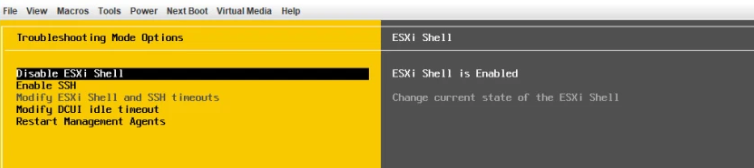
3. List and set MGMT VLAN Id for 'Management Network' and 'VM Network' typing below commands one by one, replacing 'MgmtVLAN' by proper VLAN Id:

   ```bash
   esxcli network vswitch standard portgroup list

   esxcli network vswitch standard portgroup set –p ‘Management Network’ –v 'VlanID'
  
   esxcli network vswitch standard portgroup set –p ‘VM Network’ –v 80 'VlanID'
   ```

4. Set the VxRail Manager VM IP typing below command (replace IP address, netmask and gateway with proper ones):

   ```bash
     vxrail-primary --setup --vxrail-address 192.168.8.8 --vxrail-netmask 255.255.255.0 --vxrail-gateway 192.168.8.1 --no-roll-back --verbose
   ```

   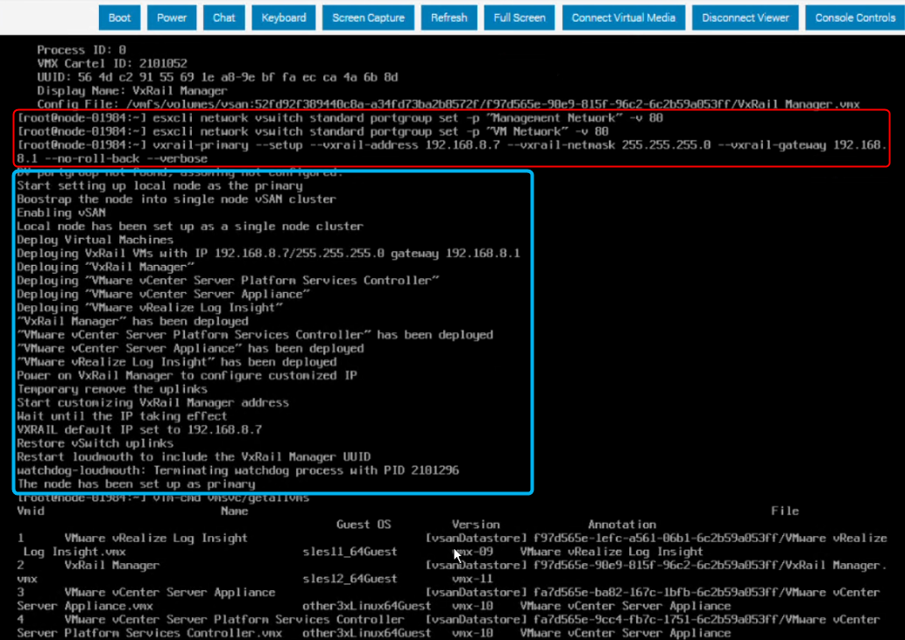

5. When VxRail Manager has been deployed successfully, it has to be restarted. First list all vms and note 'vmid' for VxRail Manager:

   ```bash
     vim-cmd vmsvc/getallvms
   ```

   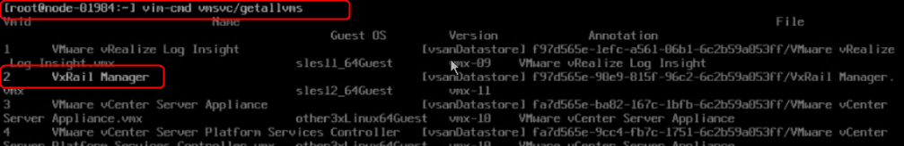

6. Run command to check vm state, replacing 'vmid' with proper one :

   ```bash
     vim-cmd vmsvc/power.getstate 'vmid'
   ```

7. Restart VxRail Manager vm:

   ```bash
     vim-cmd vmsvc/power.off 'vmid'
     
     vim-cmd vmsvc/power.on 'vmid'
   ```

## VxRail cluster configuration

1. After VxRail Manager appliance initialization, open web browser and go to <https://VxRailmanagerFQDN/configure/welcome>.

2. On the welcome screen click 'Get Started'

   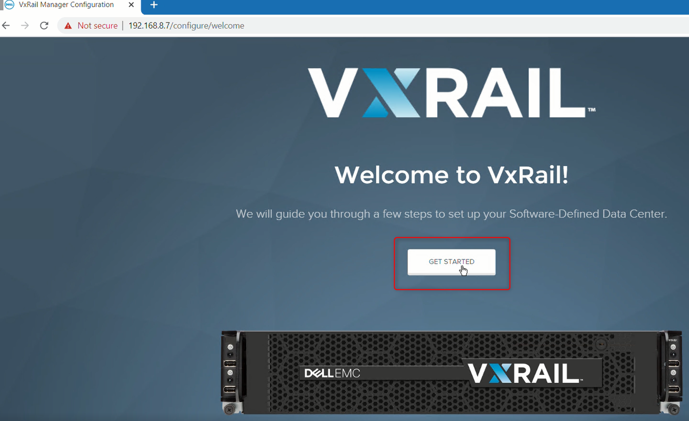

3. Accept Dell EMC Software License and Maintenance Agreement on the End-User License Agreement page.

4. Select 'VxRail cluster' option on page 'What type of VxRail cluster would you like to configure' and click Next.

   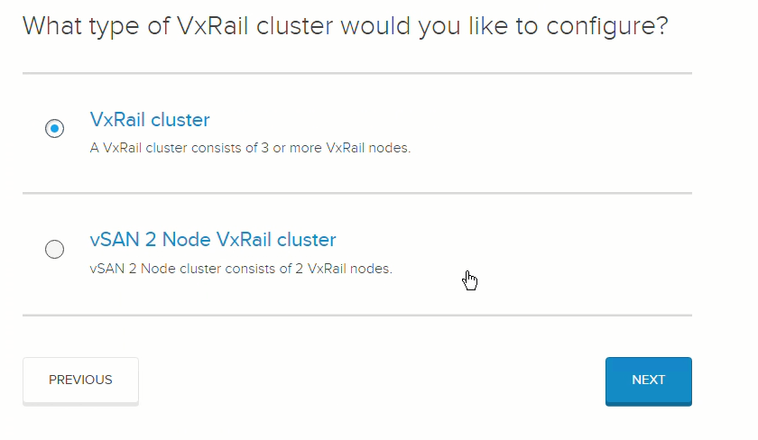

5. On 'Expected VxRail Nodes' page scanning for VxRail nodes will start automatically. It can take few seconds. Check if all VxRail nodes that should be part of VxRail cluster were found. Remember to power-off any undesired nodes. Select 'I confirm I want to configure the listed VxRail node' and click Next.

   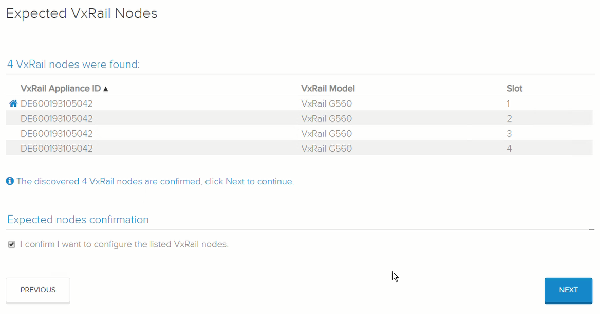

6. On the next page select 'Configuration file'. Then click Next and select json file generated from PEQ file.

   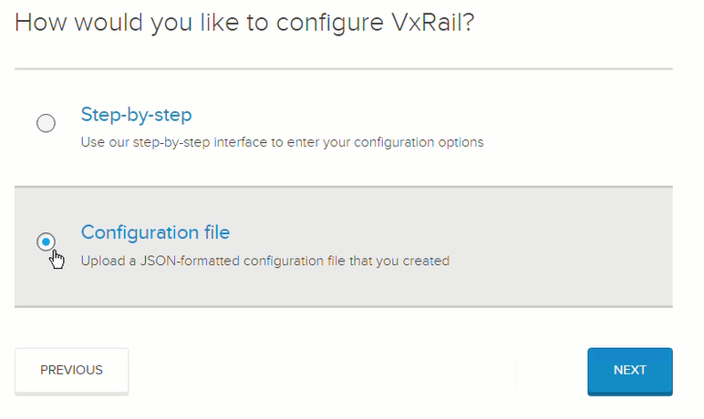

   Validate if all configuration settings are marked on green.

   NOTE!!! In the Solutions tab double check if select logging option is set as None as Cloud Builder will deploy a 3 Node log-insight cluster during deployment.
   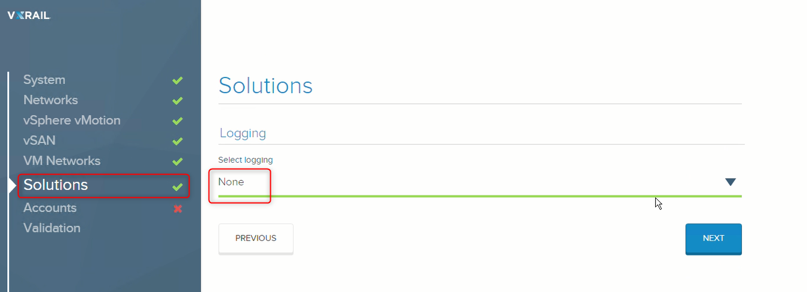

7. The “Accounts” screen is where the passwords are set for the root accounts, as well as the management users are created on each of the nodes.  There is an option to provide a shared password for some of the accounts, or you can choose to have a different password for each one, including a different root password for each ESXi host. Click Next.

8. On the Validation screen click Validate to run validation before actually deploying the system. This process takes the inputs on the previous screens and go through a validation of those values.
   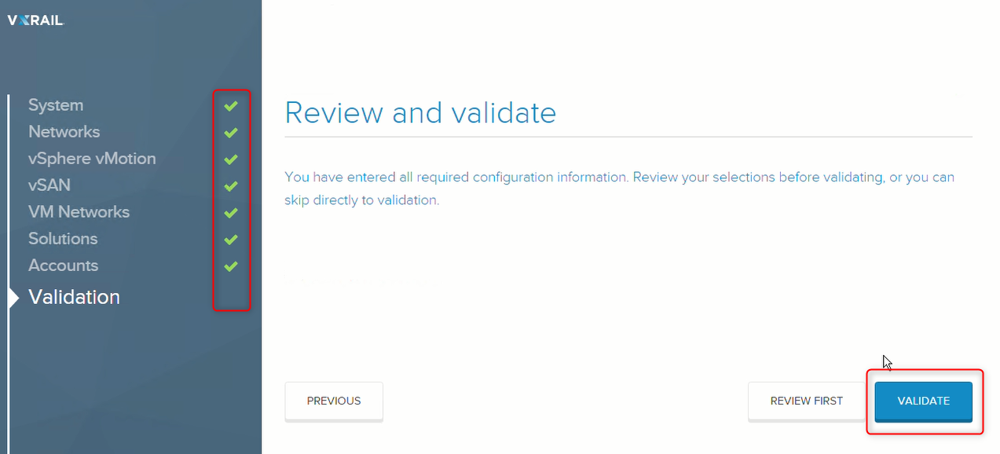

9. When validation is done and configuration has passed basic and network validation, click 'Download Json' first. This will allow to have a JSON file with the variables used for the config.
   After that click 'BUILD VXRAIL' button to start build process.
   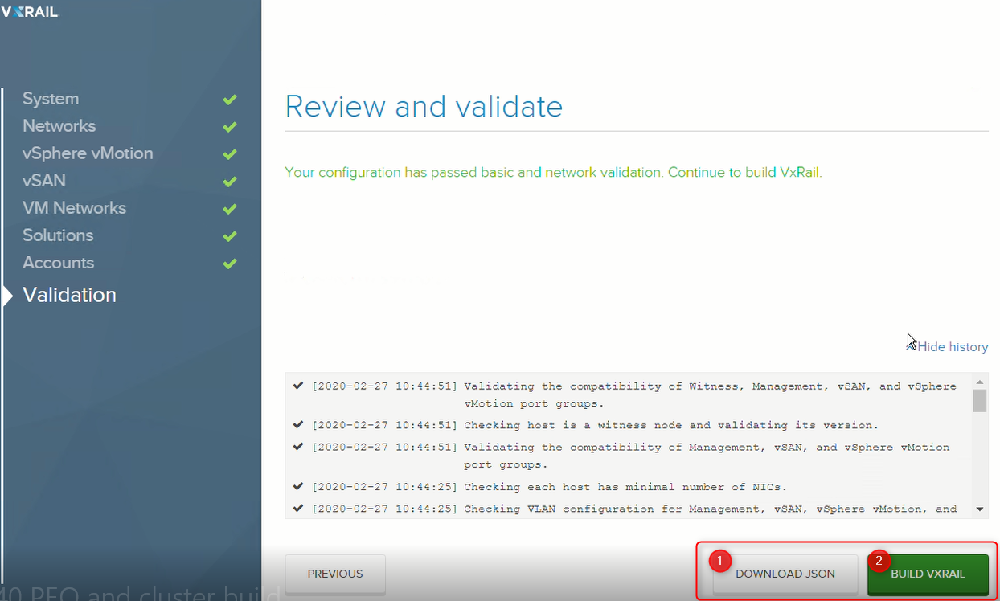
   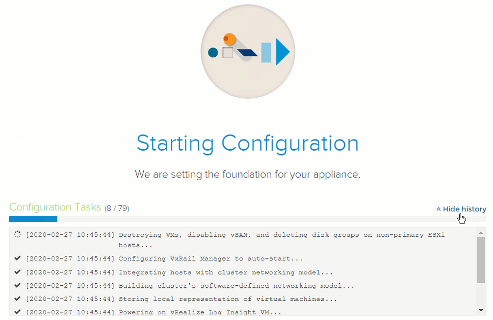

10. When the install is complete (the time will vary based upon number of nodes, whether vCenter needs to be deployed, the number of disk groups and some other variables) the cluster is ready.
   Once this screen is displayed, the deployment is done.
   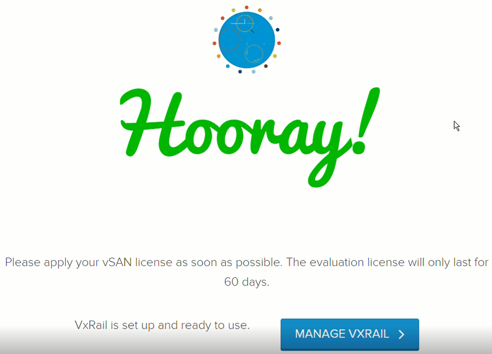

11. Log in to new vCenter server and check hosts and vms status. 3 vms should be running: VCSA, PSC and VxRail Manager.
   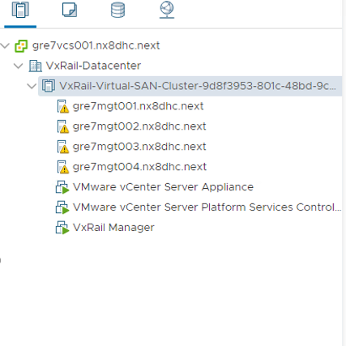

12. Add VxRail Manager and ESXi hosts related users password's to Vault

Once VxRail Cluster deployment is done, accounts such as `administrator@vsphere.local` (VCSA), vCenter Management Username account (VCSA), root, mystic and vCenter Management Username (VxRail Manager) provided in PEQ file for related cluster
have to be added to Hashi Vault .

- Login to <https://HashiVaultFQDN:8200> ;
- Go to Secrets -> secret -> < customerCode > -> < locationCode > -> servers;
- First create folder and add accounts related to VxRail Manager. Click 'Create secret +';
- In the 'Path for this secret' add at the end of line VxRail Manager hostname, i.e: mec09vxm001;
- Under 'Version data' section type 'mystic' username as a key, and type password in the 'value' field. Click 'Add';
- Type 'root' in the key field and password in the 'value' field. Click Add;
- Type exactly same name as provided in PEQ file in field 'vCenter management Username' in the key field and password in the 'value' field. Click Add;
- Click Save;
- Back to Secrets -> secret -> <customerCode> -> <locationCode> -> servers;
- Now create folder and add account related to VCSA. Click 'Create secret +';
- In the 'Path for this secret' add at the end of line VCSA hostname, i.e: mec09vcs001;
- Under 'Version data' section type `administrator@vsphere.local` username as a key, and type password in the 'value' field. Click 'Add';
- Type vCenter Management Username account in the key field and password in the 'value' field.
- Click Save.
- Now create folders for ESXi hosts and add accounts root and ESXi Management Username. Click 'Create secret +';
- In the 'Path for this secret' add at the end of line Management hostname, i.e: mec09mgt005;
- Under 'Version data' section type 'root' username as a key, and type password in the 'value' field. Click 'Add';
- Type 'management' username as a key, and type password in the 'value' field. Click 'Save';
- Click Save.
