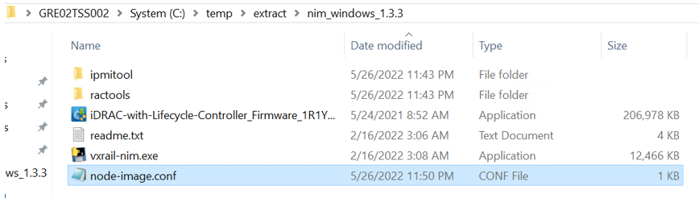
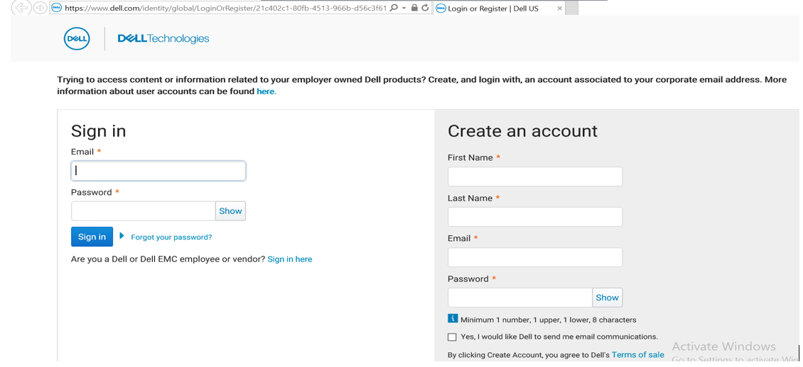
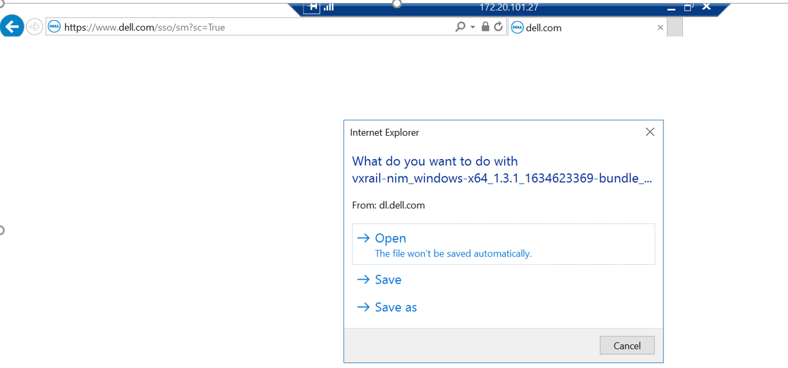
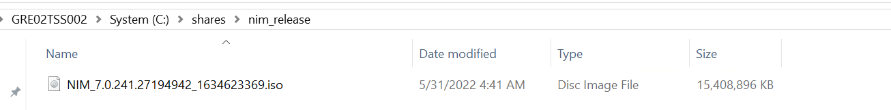
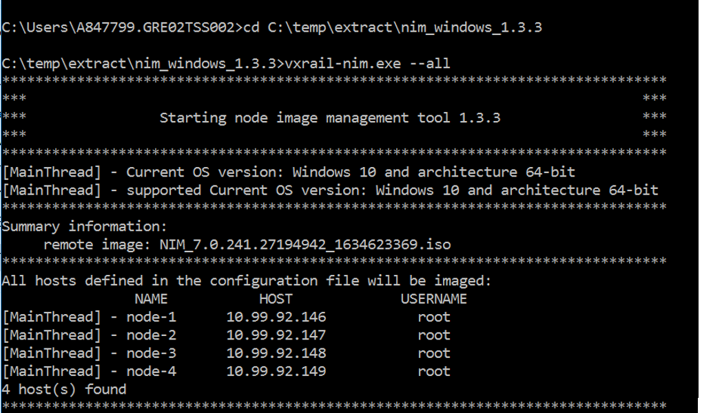
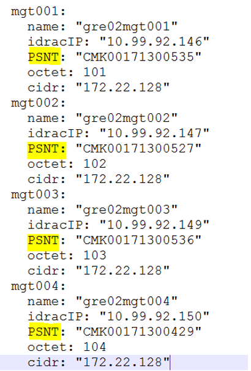
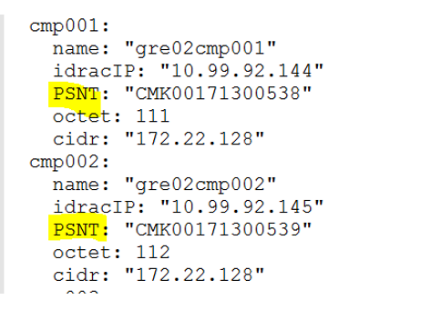

# VxRail Manager Initialization using NIM tool

## Table of Contents

- [VxRail Manager Initialization using NIM tool](#vxrail-manager-initialization-using-nim-tool)
  - [Table of Contents](#table-of-contents)
  - [Changelog](#changelog)
  - [1 Introduction](#1-introduction)
    - [Purpose](#purpose)
    - [Audience](#audience)
  - [Scope](#scope)
  - [Prerequisites](#prerequisites)
  - [2 NIM Build Guide Overview](#2-nim-build-guide-overview)
  - [2.1 Configure VxRail nodes for the management servers (ETA 5-10 mins)](#21-configure-vxrail-nodes-for-the-management-servers-eta-5-10-mins)
  - [2.2 Factory Reset the management servers (ETA 1-2 hours)-Need to perform manually](#22-factory-reset-the-management-servers-eta-1-2-hours-need-to-perform-manually)
  - [2.3 Fetch PSNT information from vxrail management nodes (ETA 2-5 mins)](#23-fetch-psnt-information-from-vxrail-management-nodes-eta-2-5-mins)
  - [2.4 Configure VxRail nodes for the workload compute nodes (ETA 5-10 mins)](#24-configure-vxrail-nodes-for-the-workload-compute-nodes-eta-5-10-mins)
  - [2.5 Factory Reset the Workload Compute Nodes (ETA 1-2 hours)-Need to perform manually](#25-factory-reset-the-workload-compute-nodes-eta-1-2-hours-need-to-perform-manually)
  - [2.6 Fetch PSNT information from vxrail workload compute nodes (ETA 2-5 mins)](#26-fetch-psnt-information-from-vxrail-workload-compute-nodes-eta-2-5-mins)

## Changelog
  
|    Date    |   TOS   |   Issue   | Author | Description |
|------------|---------|-----------|--------|-------------|
| 28.12.2021 | DHCVXR 1.0 |  | Rohit Singh | First versionn |
| 31.05.2022 | DHCVXR 1.0 |  | Rabiya Shanaz | Nim builder guide |

## 1 Introduction

The VxRail node image management tool provides a flexible and convenient way to facilitate the VxRail node imaging process, including deployment of firmware, driver, operating system, and appliance software.

In the context of the node image management tool, a system is a stand-alone VxRail server node with VxRail compatible components installed and a VxRail specific personality module.

### Purpose

The purpose of this document is to describe steps that should be performed to initialize VxRail Manager through automation.

### Audience

DHCVXR Deployment Engineers- It is designed to help you understand the requirements for using the VxRail node image management tool

## Scope

The scope of this document covers the following:

1. VxRail Manager initial configuration through automation

## Prerequisites

Following are the prerequisites to using the VxRail node image management tool.

1. The minimum Windows PowerShell version that is supported by the node image management tool is v5.
2. Network connection to the target VxRail node’s iDRAC from the node image management tool client is required.
3. The minimum iDRAC version that is supported by the node image management tool is 3.34.34.34
4. VxRail version used is 7.0.241
5. One of the following operating systems is required to run the node image management tool client:

    - Windows 10 64-bit
    - Windows Server 2016 or later

## 2 NIM Build Guide Overview

NIM builder contains 4 stages. Please do not run the NIM builder at once. All the stages shoud be run only if previous stage completes successfully.

Below is the detailed description on each stage.

Playbook named *nim-builder.yml* automates the process to initialize VxRail Manager.

>All playbooks mentioned in this work instruction shall be executed from `ANS002` server in deploy phase.
>
> **DISCLAIMER!** All screenshots are for illustrative purposes only.

## 2.1 Configure VxRail nodes for the management servers (ETA 5-10 mins)

**Description:**  
NIMstage1-1 configureVxRailNodes.yml:

- Establish ssh connection to Ansible PrerequisiteVM `<networkMgmt.Cidr>.39` with user `next`, navigate to */opt/dhcvxr/deploy* directory:

```shell
cd /opt/dhcvxr/deploy
```

>Note: There are **tags** defined in **nim-builder.yml**. You may find it useful.

Review the `nim-builder.yml` playbook to understand NIM build order and read tags names corresponding to the tasks.

**Execute:** (Deploy Phase)

- Execute below command

```shell
ansible-playbook nim-builder.yml --tags NIMstage1-1
```

Provide all the inputs required by ansible playbook to prepare the inputs required.

   | Input  Parameters  |   example  for  DEV  nx1  env  | Description |
   | ------ | ------ | ------ |
   | ip_list_management  |   10.99.98.10  | List of iDrac IPs of management nodes seperated by commas |
   | ip_list_workload  |   10.99.98.20  | List of iDrac IPs of workload compute nodes seperated by commas |
   | pc_ip | 172.20.101.28 | ip address of deployment workstation/laptop |
   | remote_username_pc |administrator | username for environment pc |
   | remote_password_pc  |   password for environment pc  |   password for environment pc |
   | remote_imagefile  |   nim_release  |   remote path of iso required for VxRail imaging process |

**Validate:**

Target servers (Laptop): to check and verify conf file is ready, login to target server and explore folders:  
    C:\temp\extract\nim_windows_1.3.3
Verify if node-image.conf file contains correct details



## 2.2 Factory Reset the management servers (ETA 1-2 hours)-Need to perform manually

**Description:**

Login to target server (Laptop) and navigate to `C:\temp\extract\nim_windows_1.3.3`.
Verify conf file details which contains management node information. Once verified need to perform factory reset of management nodes described below.

Download the iso manually from dell emc website from the following location which includes the node image management client and the release bundle iso file.

[Dell Support Site](https://dl.dell.com/downloads/DL106651_VxRail-7.0.241-node-image-management-tool-for-Windows.zip?language=en_US) and copy only iso into shared folder which is created in above step through automation.







Open command prompt as administrator in the local dekstop and navigate to `C:\temp\extract\nim_windows_1.3.3` directory:

Run command `vxrail-nim.exe --all` in laptop



## 2.3 Fetch PSNT information from vxrail management nodes (ETA 2-5 mins)

**Description:**

NIMstage1-2 configureVxRailNodesMgmtPSNT.yml:
Once factory reset is completed next step is to fetch PSNT information from the vxrail node of all hosts associated.
Append PSNT info to all.json file located in */opt/dhcvxr/deploy/group_vars/all* against the IDRAC IPs.

**Execute:** (Deploy Phase)

```shell
ansible-playbook nim-builder.yml --tags NIMstage1-2
```

**Validate:**

Ansible server: to check and verify PSNT info, login to ansible ans002 linux server and explore folder:
Verify PSNT info is present for management servers against each iDrac IPs

```shell
    /opt/dhcvxr/deploy/group_vars/all
```



## 2.4 Configure VxRail nodes for the workload compute nodes (ETA 5-10 mins)

**Description:**  
NIMstage1-3 configureVxRailNodesWld.yml:
This playbook copies the nim conf file which was prepared in stage1-1 for workload compute nodes into target server i.e; Laptop

- Establish ssh connection to Ansible PrerequisiteVM `<networkMgmt.Cidr>.39` with user `next`, navigate to */opt/dhcvxr/deploy* directory:

```shell
cd /opt/dhcvxr/deploy
```

**Execute:** (Deploy Phase)

```shell
ansible-playbook nim-builder.yml --tags NIMstage1-3
```

**Validate:**

Target servers (Laptop): to check and verify conf file is ready, login to target server and explore folders:  
    C:\temp\extract\nim_windows_1.3.3
Verify if node-image.conf file contains correct details of compute workload nodes


## 2.5 Factory Reset the Workload Compute Nodes (ETA 1-2 hours)-Need to perform manually

**Description:**

Login to target server (Laptop) and navigate to `C:\temp\extract\nim_windows_1.3.3`.

Verify conf file details which contains workload compute nodes information. Once verified need to perform factory reset of Workload Compute Nodes described below.

Open command prompt as administrator in the local dekstop and navigate to `C:\temp\extract\nim_windows_1.3.3` directory:

Run command `vxrail-nim.exe --all` in laptop

## 2.6 Fetch PSNT information from vxrail workload compute nodes (ETA 2-5 mins)

**Description:**
NIMstage1-4 configureVxRailNodesWldPSNT.yml:
Once factory reset is completed for workload compute nodes the next step is to fetch PSNT information from the vxrail node of all hosts associated.
Append PSNT info to all.json file located in */opt/dhcvxr/deploy/group_vars/all* against the IDRAC IPs of workload compute nodes.

**Execute:** (Deploy Phase)

```shell
ansible-playbook nim-builder.yml --tags NIMstage1-4
```

**Validate:**

Ansible server: to check and verify PSNT info, login to ansible ans002 linux server and explore folder:
Verify PSNT info is present for workload compute nodes against each iDrac IPs

```shell
    /opt/dhcvxr/deploy/group_vars/all
```


