# Secure Connect Gateway Deployment

# Table of Contents

- [Secure Connect Gateway Deployment](#secure-connect-gateway-deployment)
- [Table of Contents](#table-of-contents)
- [Changelog](#changelog)
- [Introduction](#introduction)
  - [Purpose](#purpose)
  - [Scope](#scope)
  - [Download Secure Connect Gateway](#download-secure-connect-gateway)
    - [Prerequisites](#prerequisites)
    - [Steps](#steps)
  - [Deploying Secure Connect Gateway](#deploying-secure-connect-gateway)
    - [Steps](#steps-1)
  - [Registering and signing in to Secure Connect Gateway](#registering-and-signing-in-to-secure-connect-gateway)
  - [Sign in to Secure Connect Gateway](#sign-in-to-secure-connect-gateway)
    - [Prerequisites](#prerequisites-1)
    - [Steps](#steps-2)
  - [Login And Register to Secure Connect Gateway](#login-and-register-to-secure-connect-gateway)
    - [Prerequisites](#prerequisites-2)
  - [Registering and signing in to Secure Connect Gateway](#registering-and-signing-in-to-secure-connect-gateway-1)
    - [Steps](#steps-3)

# Changelog
  
|    Date    |   TOS   |   Issue   | Author | Description |
| ---------- | ------- | --------- | ------ | ----------- |
| 01/06/2022 | DHCVXR 1.0 |   | Rohit Singh     | Initial document creation |

# Introduction

Secure connect gateway is an enterprise monitoring technology that is delivered as an appliance and a stand-alone application.
It monitors your devices and proactively detects hardware issues that may occur. Depending on your service contract, it also
automates support request creation for issues that are detected on the monitored devices.
Supported products include Dell EMC server, storage, chassis, networking, data protection devices, virtual machines, and
converged or hyperconverged appliances.
Based on the device type and model, secure connect gateway automatically collects the telemetry that is required to
troubleshoot the issue that is detected. The collected telemetry helps technical support to provide a proactive and personalized
support experience.

## Purpose

The purpose of this document is to describe steps that should be performed to deploy and configure Secure Connect Gateway.

## Scope

The scope of this document covers the deployment and configuration of secure connect gateway for Vxrail

## Download Secure Connect Gateway

### Prerequisites

You must have a business account on [Dell Site Login](https://www.dell.com).  For steps to create a business account or upgrade an existing
account, see Create a business account or Upgrade to a business account respectively [here](https://www.dell.com/support/kbdoc/en-in/000190166/business-account-for-secure-connect-gateway)

### Steps

1. Sign in to [Dell Support Login](https://www.dell.com/SCG-VE). The Secure Connect Gateway - Virtual Edition page is displayed. If you have issues signing in using your business account or unable to access the page even after signing in, contact [Dell Administrative Support](https://www.dell.com/support/incidents-online/contactus/adm-support).

   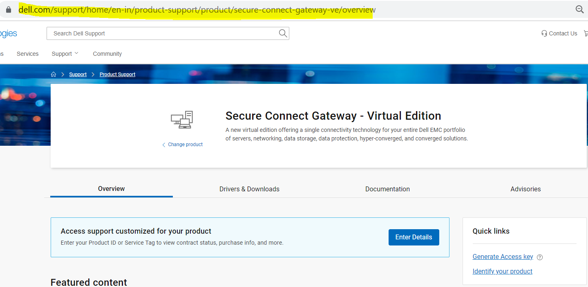

2. In the Quick links section, click Generate Access key.

    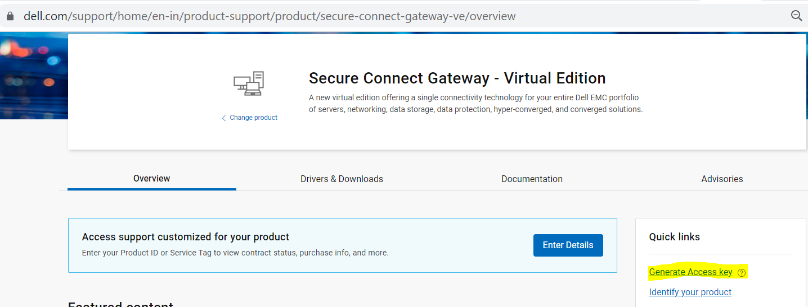

3. On the Generate Access Key page, perform the following steps.
     a. Select a site ID, site name, or site location.
        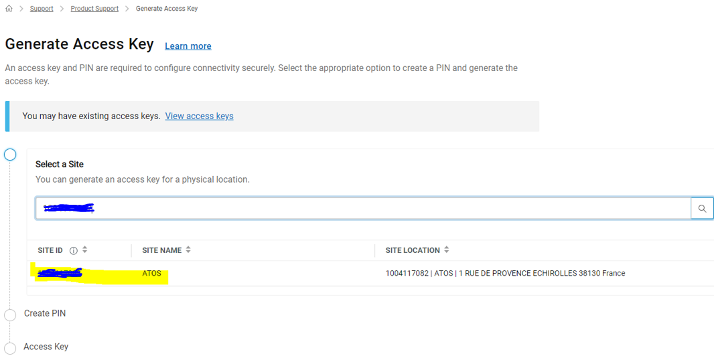
     b. Enter a four-digit PIN and click Generate key. An access key is generated and sent to your email address.
        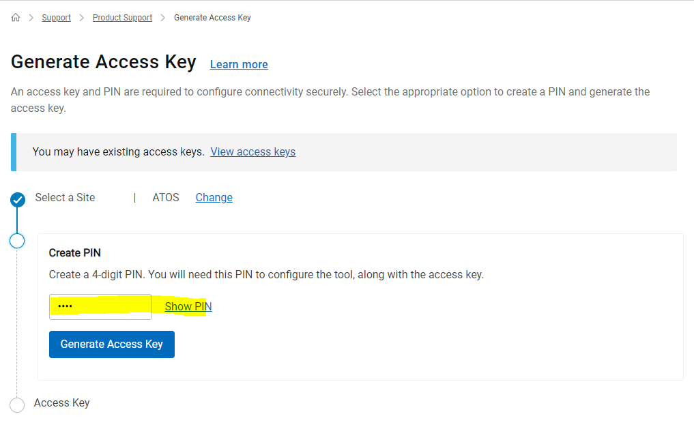

        **NOTE: The access key and PIN must be used within seven days and cannot be used to register multiple instances of secure connect gateway.

     c. Click Done.
        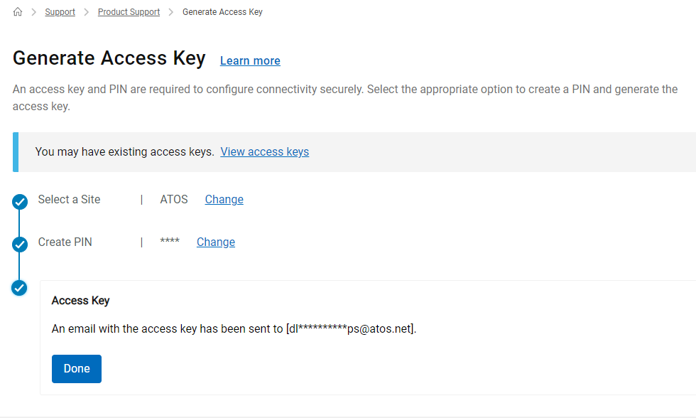

4. On the Secure Connect Gateway – Virtual Edition page, click the Drivers & Downloads tab.

    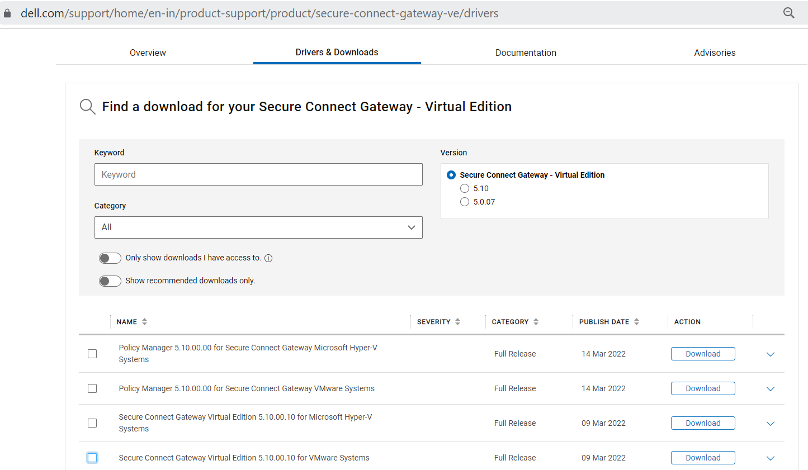

5. Search and select the required version. For VCS 1.0 we are selecting version 5.10.00.10.

6. In the ACTION column, click Download.

    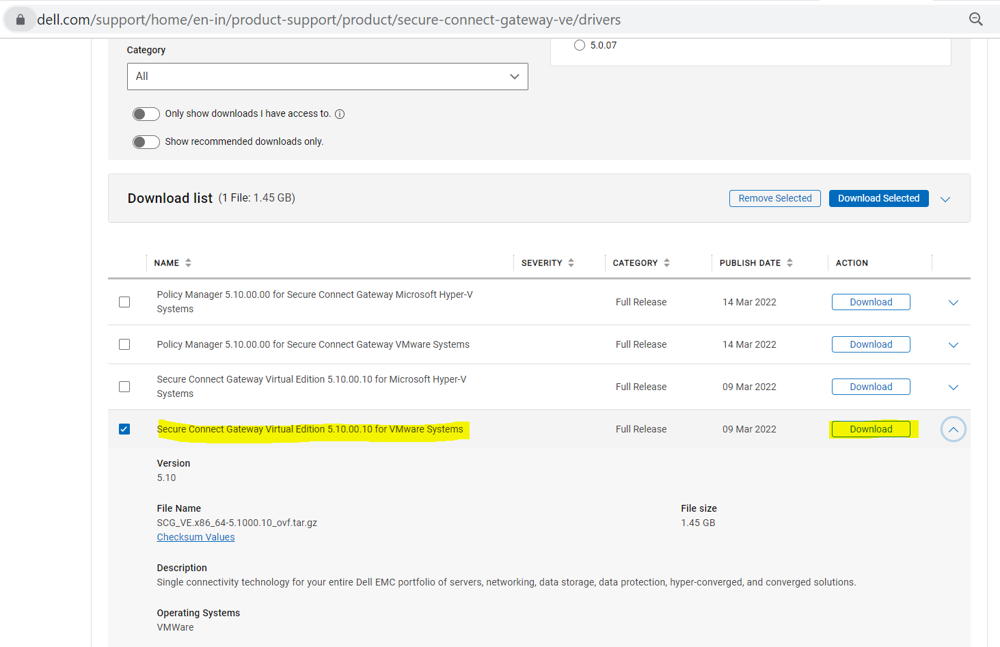

## Deploying Secure Connect Gateway

### Steps

1. Download and extract the OVF file to a location accessible by the VMware vSphere Client.

2. On the VMware vSphere Client,select Cluster and click Deploy OVF template.

    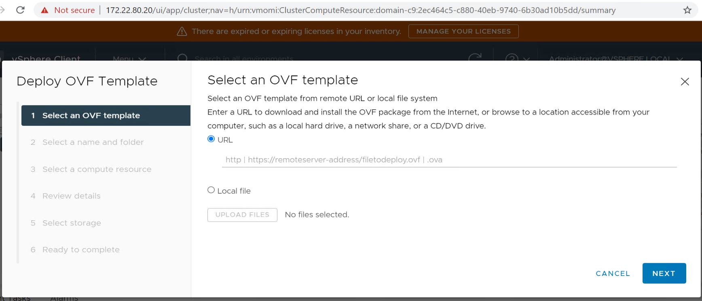

3. On the Select OVF and VMDK files page and click next.

    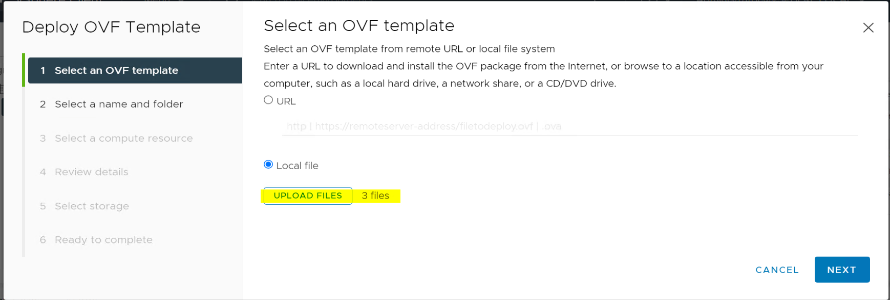

4. Enter a name for the virtual machine and select the location where we need to deploy the vm. Here we have selected the vcenter gre02vcs001.nx5dhc01.next in the Management vm folder.

    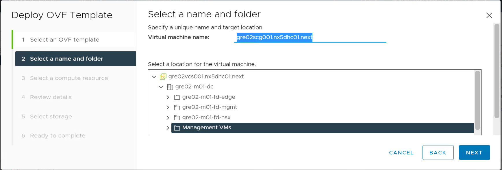

5. Select the Compute resources where we need to deploy the vm as shown in figure below.

    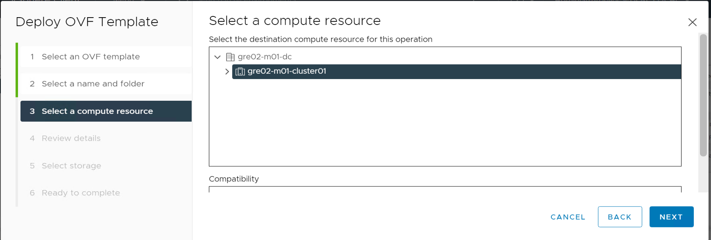

6. After that click on Review details page, click Next.

7. On the License agreements page, read the license agreement, click I agree, and then click Next.

    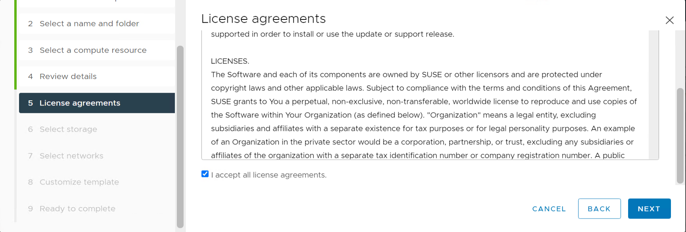

8. Select the VSAN datastore to store the virtual machine (VM) files and click Next.

    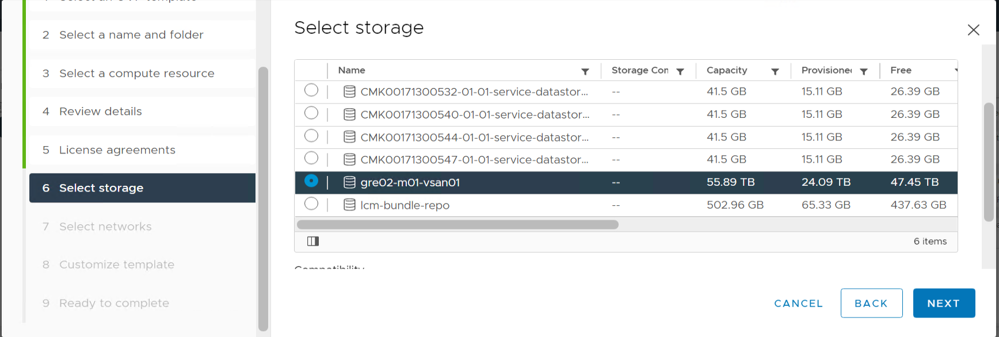

9. On Network Page, Select the same network that is configured on vcenter as shown below.

    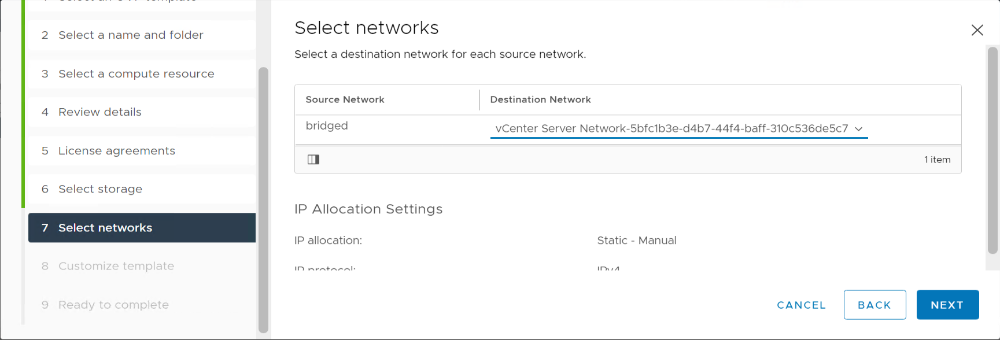

10. On the Additional settings page, enter the following details and click Next.
    - Domain name server
    - Hostname
    - Default gateway
    - Network IPV4 and IPV6
    - Time zone
    - Root password

11. On the Ready to complete page, verify the details that are displayed and click Finish. A message is displayed after the deployment is complete and the virtual machine is powered on.

    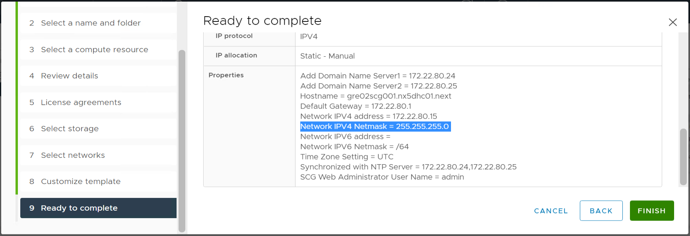

## Registering and signing in to Secure Connect Gateway

When you open the secure connect gateway user interface for the first time, you must sign in with your root credentials, create
an administrator account, and then register the instance. After registration, you can sign in directly using the administrator
account credentials or your network credentials.

## Sign in to Secure Connect Gateway

### Prerequisites

The root account password must be configured during deployment.

### Steps

1. Open the secure connect gateway user interface using `https://<IP address or host name of the local system>:5700`.
  
    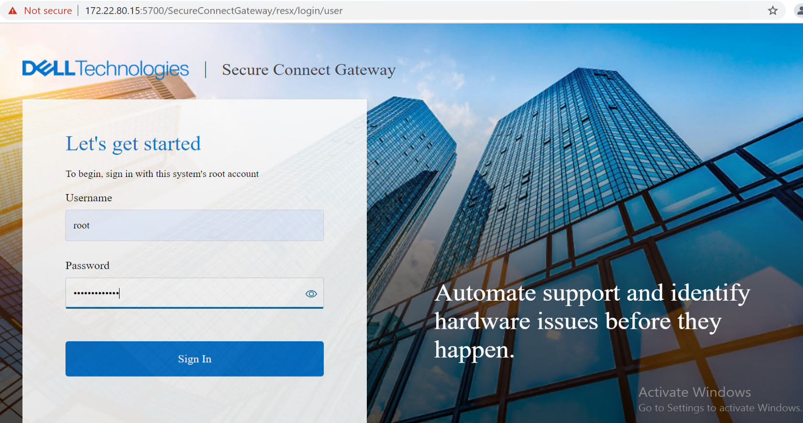
  
2. If you are signing in to secure connect gateway for the first time, perform the following steps:
   - Enter root as the username.
   - Enter the password that you entered for the root account while deploying secure connect gateway.
   - Click Sign In.

      
  
   - Read and accept the end users license agreement. The sign-in page is displayed to create the administrator account.
  
      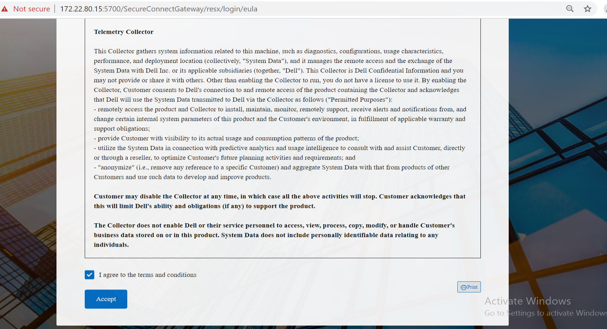
  
   - Enter a password for the administrator account and click Create.The administrator account is created, and the registration wizard is displayed. See Register Secure Connect Gateway.

    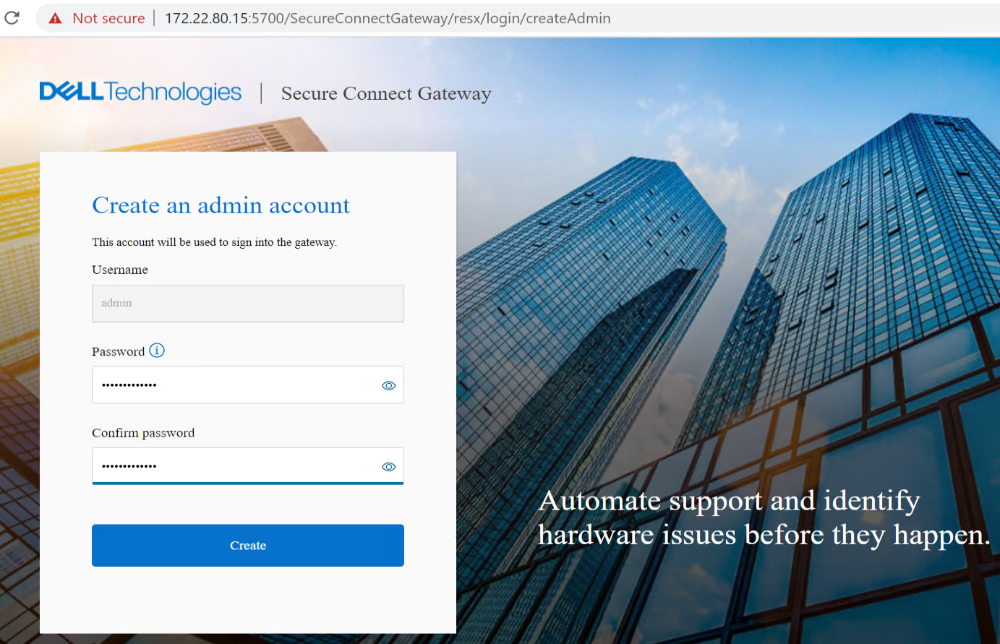
  
3. If you have already registered secure connect gateway, enter the username, password, and click Sign In. The secure connect gateway dashboard is displayed.

## Login And Register to Secure Connect Gateway
  
### Prerequisites

When you sign in to secure connect gateway and create an administrator account for the first time, you are automatically
directed to perform registration. If required, you can complete the registration later. However, you must complete the
registration process to add and manage your devices in secure connect gateway.

## Registering and signing in to Secure Connect Gateway
  
### Steps

1. In the Proxy settings section, perform one of the following steps:
   - If the local system connects to the Internet directly, click Next.
   - If the local system connects to the Internet through a proxy server, enable the option to use proxy network. If you clicked Next, the connectivity is verified and if the connection is successful, the Authentication section is displayed.
  
2. If you enabled the option to use proxy network, perform the following steps:
   - Enter the hostname or IP address and the port number of the proxy server.
   - If a username and password are required to connect to the proxy server, enable the option to confirm that the proxy network requires authentication.
   - Enter the username and password for the proxy server.
   - Click Next. If the connection is successful, the Authentication section is displayed.

      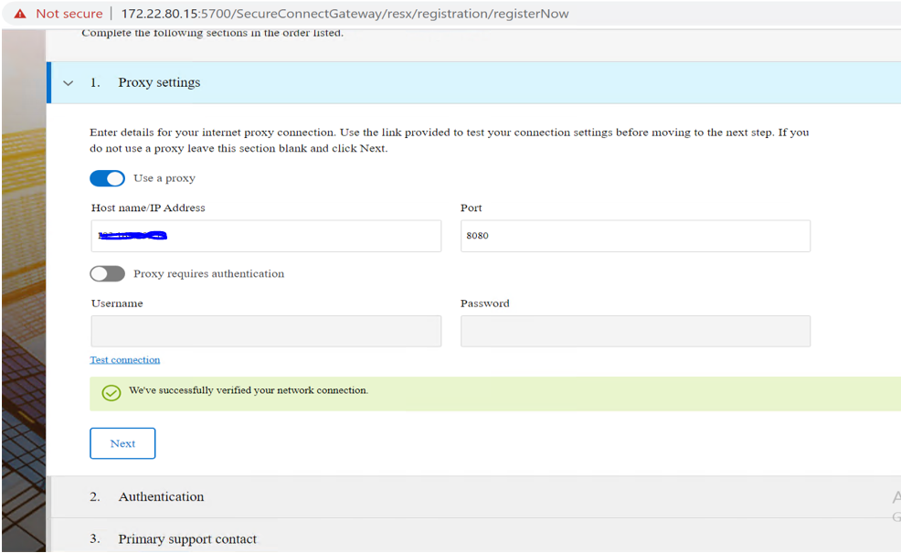
  
3. In the Authentication section, enter the access key and PIN that you generated while downloading the secure connect gateway deployment package. To generate a new access key and PIN, go to [Dell Support Login](https://www.dell.com/SCG-VE).

      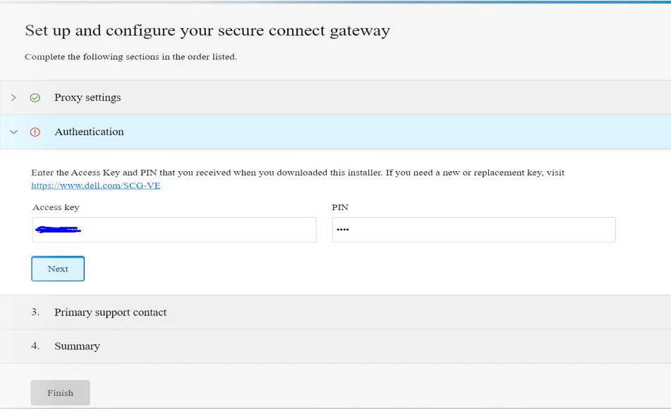
  
4. Click Next. If the authentication is successful, the Primary support contact section is displayed.

5. By default, your company name and contact information are displayed. If required, edit the information, select the time zone and then click Next.If the registration is successful, the Summary section is displayed.

6. Click Finish.

7. Now we need to configure on vcenter level. Login on the Vcenter Server from Web browser and go to Cluster-> Configure-> Support-> VxRail-> Suport. Click on Edit under Dell EMC Support Account and enter the account details and click Ok

    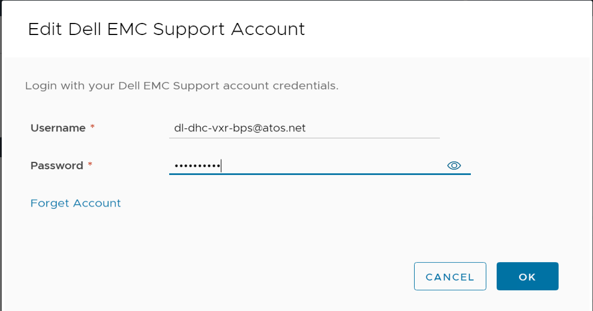
  
8. Now under Dell EMC Secure Remote Service (SRS) click edit and Select Ecternal SRS.
  
    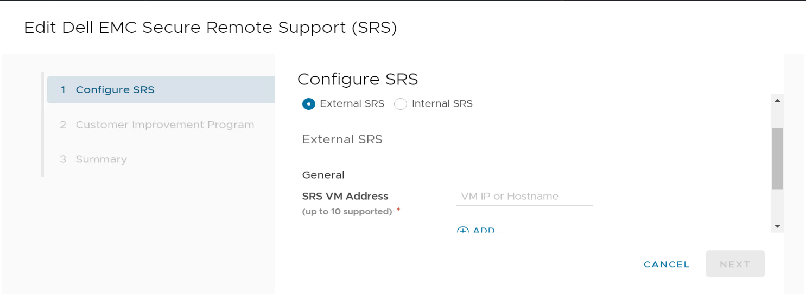
  
9. Enter all the details below.
   - SRS VM IP address which is SCG VM ip
   - Site Id
  
     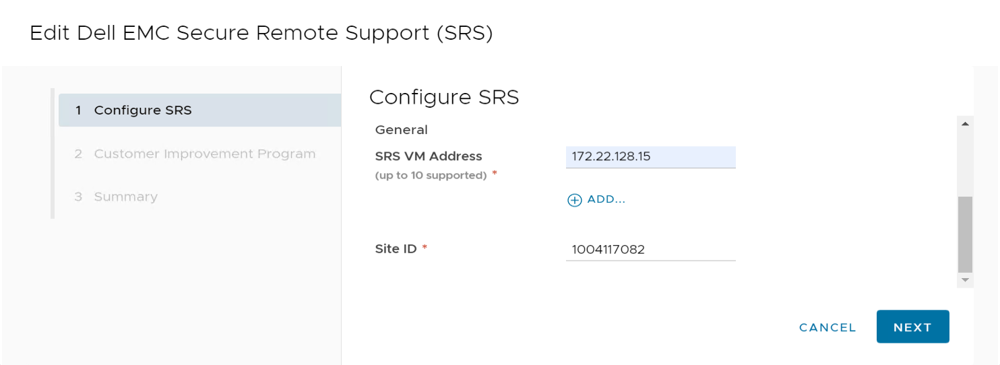
  
10. Select Customer Improvement Program as per requirement.
  
     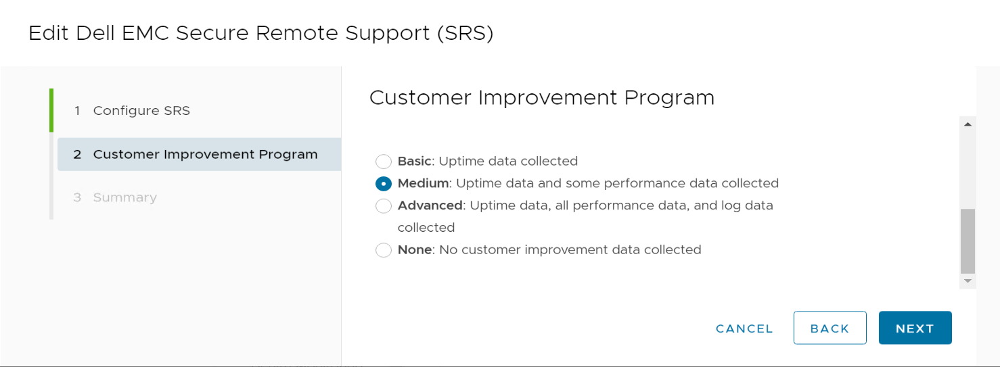
  
11. Click on Finish.

Please add root and administrator credentials in vault under location secret/locationcode/servers/(locationcode)scg001 for maintaining the passwords.
After completing all the steps above, we have finally configured the SCG.
