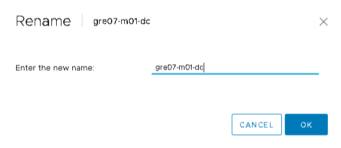
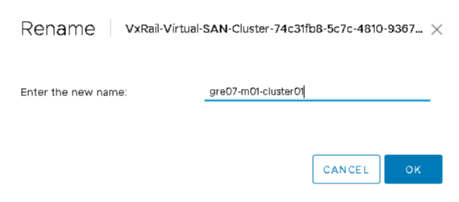
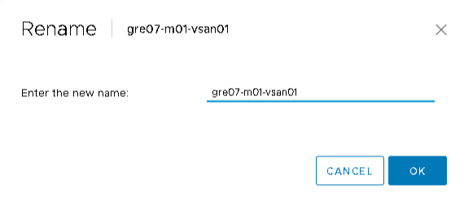
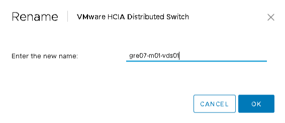
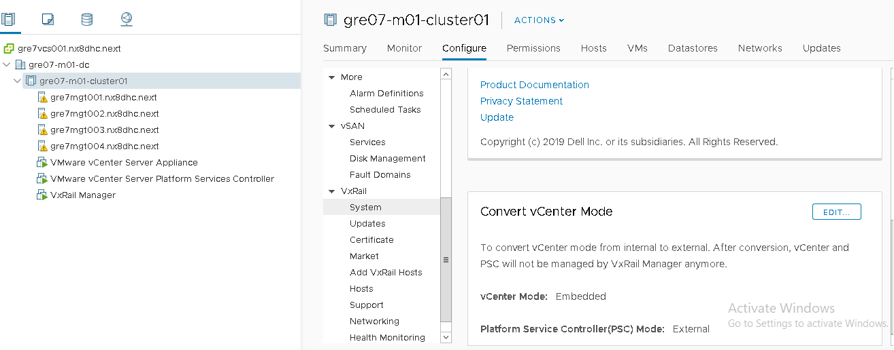
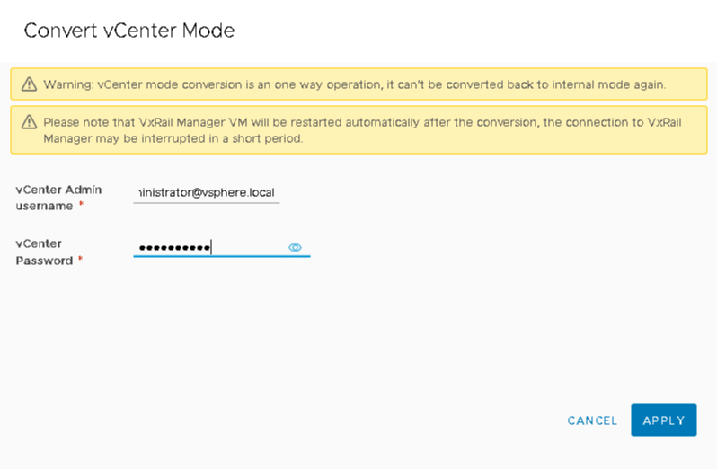
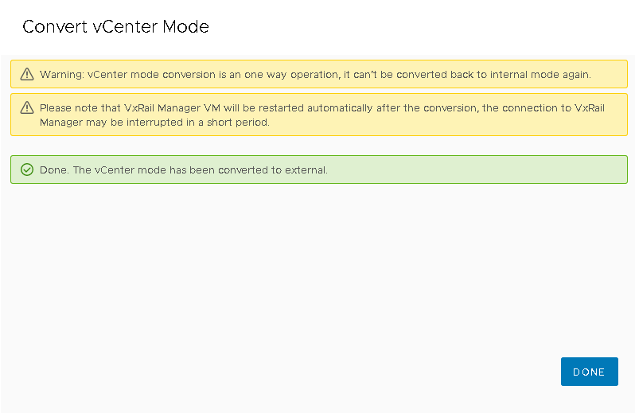
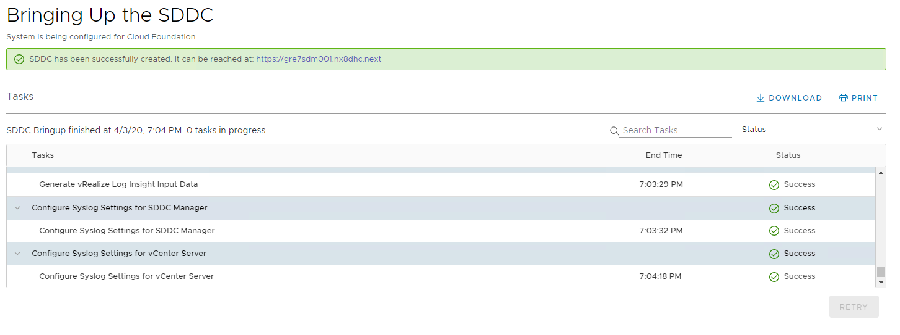

# VxRail VCF Bringup

- Table of Contents
{:toc}

# Changelog
  
| Version | Date       | Description              | Author       |
| ------- | ---------- | ------------------------ | --------------- |
| 0.1     | 02/04/2020 | First version | Łukasz Stasiak|
| 0.2     | 14/04/202  | Draft version | Maciej Losek |

# 1. Introduction

## 1.1 Purposed

The purpose of this document is to describe steps that should be performed to proceed with vCF bring up on VxRail cluster.

## 1.2 Scope

The scope of this document covers the following:

1. Rename instruction of Datacenter, Cluster, Datastore and VDS according to Atos naming convention.
2. Steps to externalize management vCenter.
3. Steps to set the ephemeral port type on Management Portgroup.
4. Steps to deploy cloud builder on VxRail Management Cluster.
5. vCF bring up on VxRail steps.

Below steps are out of scope of this document:

1. VxRail Manager initialization - covered by chapter 2.2 in [VxRailManagerInitialization.md](VxRailManagerInitialization.md)
2. VxRail cluster bringup - covered by chapter 2.4 in [VxRailManagerInitialization.md](VxRailManagerInitialization.md)

# 2. VxRail components rename

In order to proceed with the vCF bring up the VxRail cluster components needs to be renamed according to Atos naming convention.  
Follow the steps below to proceed with the Datacenter, Cluster, Datastore and VDS rename.

## 2.1 Rename Datacenter

1. Login to the deployed VxRail vCenter server with the credentials form the JSON used to create VxRail cluster. Right click on the datacenter and select "Rename'.
Provide the name according to VCS naming convention described in namingConvention.md e.g. gre07-m01-dc

## 2.2 Rename Cluster

1. Right click on the cluster object and select 'Rename'.
Provide the name according to VCS naming convention described in namingConvention.md e.g. gre07-m01-cluster01

## 2.3 Rename Datastore

1. Right click on the datastore object and select 'Rename'.
Provide the name according to VCS naming convention described in namingConvention.md e.g.  gre07-m01-vsan01

## 2.4 Rename VDS

1. Right click on the VDS object and select 'Rename'.
Provide the name according to VCS naming convention described in namingConvention.md e.g.  gre07-m01-vds01

# 3. Externalize management vCenter

By default, VMware vCenter server is internal to the VxRail cluster. But as per the VVD guidelines, it needs to be external for VCF on VxRail.To externalize management vCenter follow the steps below.

1. Click on the Cluster object and select 'Configure' tab.

1. Expand the VxRail and select system. On the 'Convert vCenter Mode' click on the 'EDIT' button

2. On the Convert vCenter Mode window provide vCenter admin user and password and click on 'APPLY'

1. After confirmation that the vCenter mode has been converted to external click on 'DONE'

# 4. Set the ephemeral port type on Management Portgroup

To set the ephemeral port type on Management Portgroup follow the steps below.

First you need to move the host temporary to SDDC-DPortGroup-Mgmt portgroup.

1. Click on the Networking tab and right click the management VDS and select 'Add and Manage Hosts'.
2. On the Add and Manage Host window select 'Manage host networking'
3. On the Select hosts click on the green plus sign and select all management hosts. Click on 'OK' and 'NEXT'.
4. Next go to Manage VMkernel adapters screen. Select the vmk2 on a first host and click on 'Assign port group'.
5. Select SDDC-DPortGroup-Mgmt and click on 'Apply this port group assignment to the rest of the hosts' to change the portgroup for all the hosts. Click on 'OK'.
6. Go to 'Ready to complete' window and click on 'FINISH'.

   When the hosts are migrated you need to change the port binding on  'Management Network-(your network id)' portgroup.

7. From the Networking view click on 'Management Network-(your network id)' portgroup and select 'Edit Settings'
8. On the 'Management Network-< your network id >' Edit Settings window change the 'Port binding' from 'Static Binding' to 'Ephemeral - no binding' and click on 'OK'.

   As a last step you need to move all the hosts back to 'Management Network-(your network id)' portgroup

9. Click on the Networking tab and right click the management VDS  and select 'Add and Manage Hosts'.
10. On the Add and Manage Host window select 'Manage host networking'
11. On the Select hosts click on the green plus sign and select all management hosts. Click on 'OK' and 'NEXT'.
12. Next go to Manage VMkernel adapters screen. Select the vmk2 on a first host and click on 'Assign port group'.
13. Select Management Network-(your network id) and click on 'Apply this port group assignment to the rest of the hosts' to change the portgroup for all the hosts. Click on 'OK'.
14. Go to 'Ready to complete' window and click on 'FINISH'.

# 5. Deploy cloud builder on VxRail Management Cluster

Follow the steps described in the dhcBuildGuide.md Cloud Builder section to download vCF cloud builder OVA template image and the Deployment Parameter Guide xlsx.
Next import the CloudBuilder OVA on the created VxRail MGMT cluster. While importing CloudBuilder OVA you will be prompted for the following data.

| Field name| Value |
| ------ | ------ |
| Deployment Architecture | vcf-vxrail  |
| Admin Username |  admin  |
| Admin Password |    |
| Admin Password confirm |    |
| Root Password |    |
| Root Password confirm |    |
| Hostname |  `cloudBuilder`  |
| Network 1 IP Address |  `< networkMgmtCidr >.9`  |
| Network 1 Subnet Mask |  `255.255.255.0`  |
| Default Gateway |  `< networkMgmtCidr >.1`  |
| DNS Servers |  `< networkMgmtCidr >.24, < networkMgmtCidr >.25`  |
| DNS Domain Name | `< customerCode >< dpcDomainPrefix >`   |
| DNS Domain Search Paths |  `< customerCode >< dpcDomainPrefix >`  |
| NTP Servers |  `< networkMgmtCidr >.24, < networkMgmtCidr >.25`  |

When the deployment will be completed power on the VM.

# 6. Bring Up of vCF components with cloud builder

1. Login to <https://cloudBuilderIP> as admin.
2. On the 'Bring-up Checklist' select 'Check All' and click on next.
3. Agree to the End User License Agreement and click on next.
4. Upload the configuration file.
5. Click on 'Validate'.
6. Ignore time synchronization warning and click on acknowledge.
7. After successful configuration file validation click on next.
8. On the next screen click on 'Begin Bring-up'.
9. Confirm that the Bring-up process was successful.

