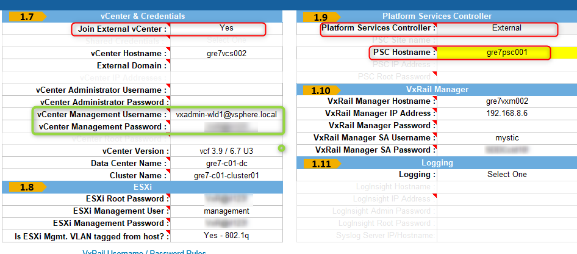

# VxRail VCF Create Workload Domain

- Table of Contents
{:toc}

# Changelog
  
| Version | Date       | Description              | Author       |
| ------- | ---------- | ------------------------ | --------------- |
| 0.1     | 09/04/2020 | First version | Maciej Losek|

# Introduction

## Purposed

The purpose of this document is to describe steps that should be performed to create VI VxRail Workload Domain in VCF on VxRail. To activate VxRail Virtual Infrastructure Workload Domain, Primary VxRail Cluster has to be created first and added to VI WD in SDDC Manager.

## Scope

The scope of this document covers the following:

1. VxRail Manager initializing procedure.
2. VxRail Primary Cluster creating procedure.
3. Steps to create new VI VxRail Workload Domain in VCF on VxRail.

# VxRail Manager initializing procedure

To initialize VxRail Manager, please follow steps described in chapter 'VxRail Manager initializing procedure' of [VxRailManagerInitialization.md](VxRailManagerInitialization.md#vxrail-manager-initializing-procedure)

# New VxRail Virtual Infrastructure Workload Domain creation

To create VxRail Virtual Infrastructure Workload Domain please follow official VMware documentation '[VMware Cloud Foundation on DellEMC VxRail Admin Guide (VCF3.9)](vcfOnVxrailAdministering.pdf)'
Steps that have to be performed:

- 'Create a VxRail Virtual Infrastructure Workload Domain';
- 'Specify Name';

NOTE!!! Remember to use names according to VCS naming convention.

- 'Specify Compute Details';

NOTE!!! As a DNS Name type vCenter FQDN, i.e: gre07vcs002.nx8dhc01.next.

- 'Review the Details';

- When new Workload Domain is created, add a local user in vCenter server as this is an external server deployed by VMware Cloud Foundation. This is required for the VxRail first run:

   a Log in to the workload domain vCenter Server Appliance through vSphere Web Client.

   b Select Menu > Administration > Single Sign On.

   c Click Users and Groups.

   d Click Users.

   e Select Domain vSphere.local.

   f Click Add User.

   g In the Add User pop-up window, enter the values for the mandatory fields.

   h Enter Username. NOTE!!! As a local user that has to be created in vCenter server, please use account 'vCenter Management Username' from PEQ excel sheet 'VI 1 Cluster 1' as below on screenshot (marked on green).
 

   i Enter Password. Confirm the Password.

   j Click Add.

  k Wait for the task to complete.

VxRail components rename
In order to proceed with the vCF bring up the VxRail cluster components needs to be renamed according to Atos naming convention.  
Follow the steps below to proceed with the Datacenter, Cluster, Datastore and VDS rename.

- Rename Datacenter
  Login to the deployed VxRail vCenter server with the credentials form the JSON used to create VxRail cluster. Right click on the datacenter and select "Rename'.
  Provide the name according to VCS naming convention described in namingConvention.md e.g. gre07-c01-dc

- Rename Datastore
  Right click on the datastore object and select 'Rename'.
  Provide the name according to VCS naming convention described in namingConvention.md e.g.  gre07-c01-vsan01

- Rename VDS
  Right click on the VDS object and select 'Rename'.
  Provide the name according to VCS naming convention described in namingConvention.md e.g.  gre07-c01-vds01

# VxRail Primary Cluster creation

As a prerequisite for VxRail cluster creation process, PEQ file has to be prepared and filled up.
The VxRail Pre-Engagement Questionnaire (PEQ) is a excel file, enabling users to document the installation
parameters. The PEQ is intended to generate a VxRail appliance JSON to perform the installation and configuration of the VxRail appliance.

NOTE!!! Remember to use proper PEQ excel sheet: 'VI 1 Cluster 1' and set 'vCenter & Credentials' and 'Platform Services Controller' sections as below on screenshot (marked on red).

To create Primary VxRail Cluster for Workload Domain, please follow steps described in chapter 'VxRail cluster configuration' described in [VxRailManagerInitialization.md](VxRailManagerInitialization.md#vxrail-cluster-configuration)

# Add the Primary VxRail Cluster to new WD

To add the Primary VxRail Cluster to newly created VxRail Virtual Infrastructure Workload Domain, please follow official VMware documentation '[VMware Cloud Foundation on Dell EMC VxRail Admin Guide (VCF3.9)](vcfOnVxrailAdministering.pdf)',
chapter 'Add the Primary VxRail Cluster' starting from 'Procedure' on page 33.

>**NOTE:** On the Networking page, select NSX-T as a default for Workload Domain in DHC.

# Create vSAN Storage Policy

vSAN storage policy named '< clusterName > vSAN Storage Policy' (i.e 'gre07-c01-cluster01 vSAN Storage Policy') that defines storage requirements for a VM and its virtual disks has to be created manually.

- Navigate to Policies and Profiles, then click VM Storage Policies.
- Click the Create a new VM storage policy icon.
- On the Name and description page, select a vCenter Server.
- Type a name (i.e 'gre07-c01-cluster01 vSAN Storage Policy')and a description for the storage policy and click Next.
- On the Policy structure page, select Enable rules for "vSAN" storage, and click Next.
- On the vSAN page, define the policy rule set: 'Site disaster tolerance' to 'None-standard cluster' and 'Failures to Tolerate' to '1 failure - RAID-1(Mirroring)' and click Next.
- On the Storage compatibility page, review the list of datastores that match this policy. '< locationCode >-m01-vsan01' datastore should be listed. Click Next.
- On the Review and finish page review all settings and click 'Finish'.
