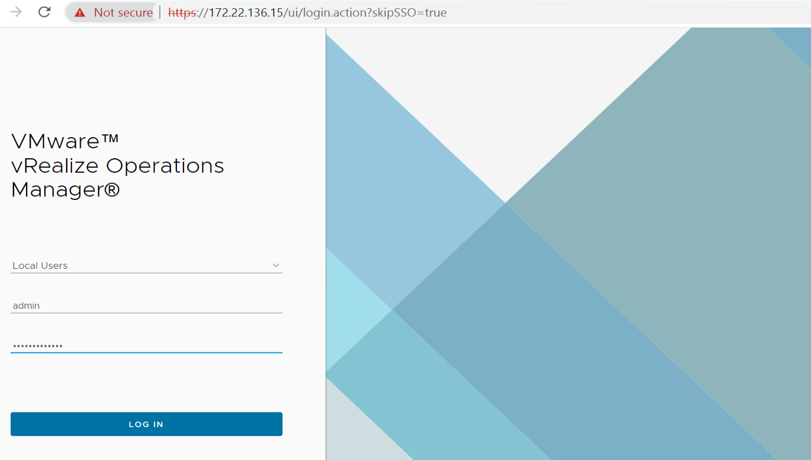
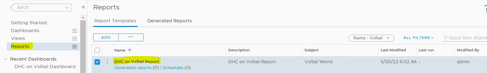
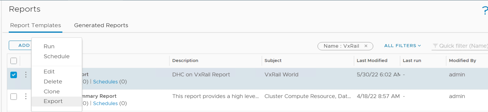
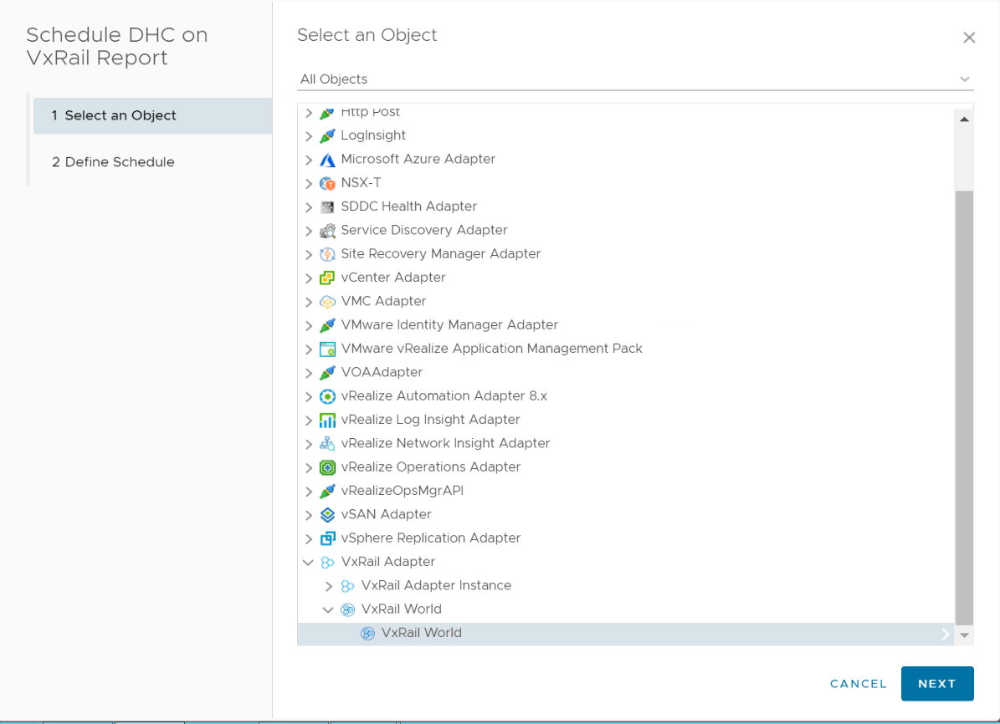
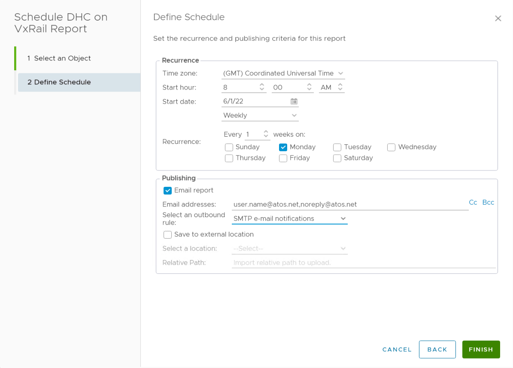
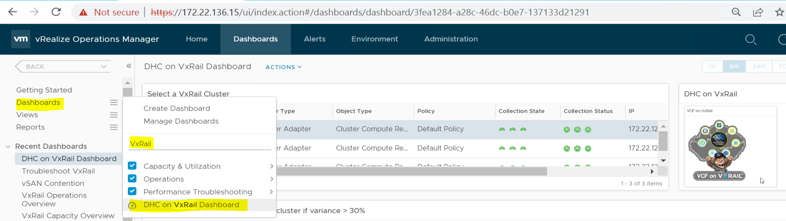
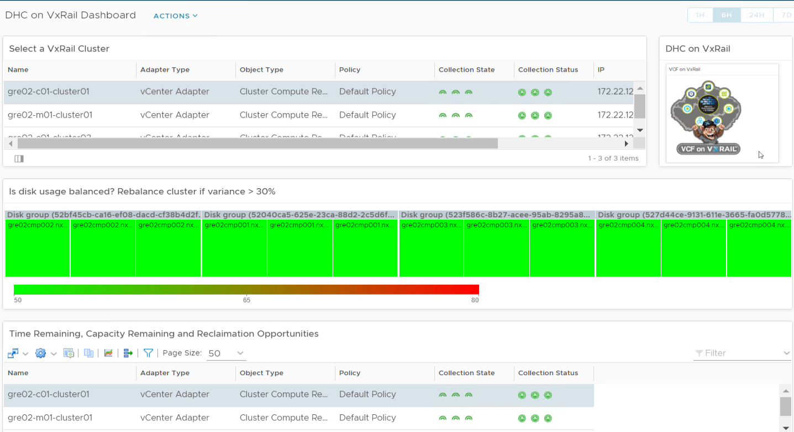

# VxRail Vrops Capacity Management Report

# Table of Contents

- [VxRail Vrops Capacity Management Report](#vxrail-vrops-capacity-management-report)
- [Table of Contents](#table-of-contents)
- [Changelog](#changelog)
- [Introduction](#introduction)
  - [Schedule VxRail VROPS Report](#schedule-vxrail-vrops-report)
    - [Steps](#steps)
  - [Check VxRail VROPS Dashboard](#check-vxrail-vrops-dashboard)
    - [Steps](#steps-1)

# Changelog

|    Date    |   TOS   |   Issue   | Author | Description |
| ---------- | ------- | --------- | ------ | ----------- |
| 01/06/2022 | DHCVXR 1.0 |   | Rohit Singh     | Initial document creation |

# Introduction

We need to schedule the reports that were imported while deployment.The purpose of this document is to describe steps that should be performed to schedule Vxrail related reports in vROPS for Capacity Management.

## Schedule VxRail VROPS Report

### Steps

1. Login to vROPS using Local Admin account or Domain account that has rights to schedule the report.

   

2. Now go to Dashboard -> Reports. Now search 'VxRail' in the searchbox on the righthand corner.

    

3. Click on 3 dots and then select Schedule.

    

4. Now select the VxRail World object as shown below.

    

5. Select schedule as per requirement, provide email address and select SMTP rule, Click on OK. Kindly refer below for reference.

    

Here we are done with scheduling the reports.

## Check VxRail VROPS Dashboard

### Steps

1. Login to vROPS using Local Admin account or Domain account that has rights to add or view dashboard.

   

2. After login select Dashboard -> Type VxRail in searchbox and we can see the Dashboard present.

    

    
