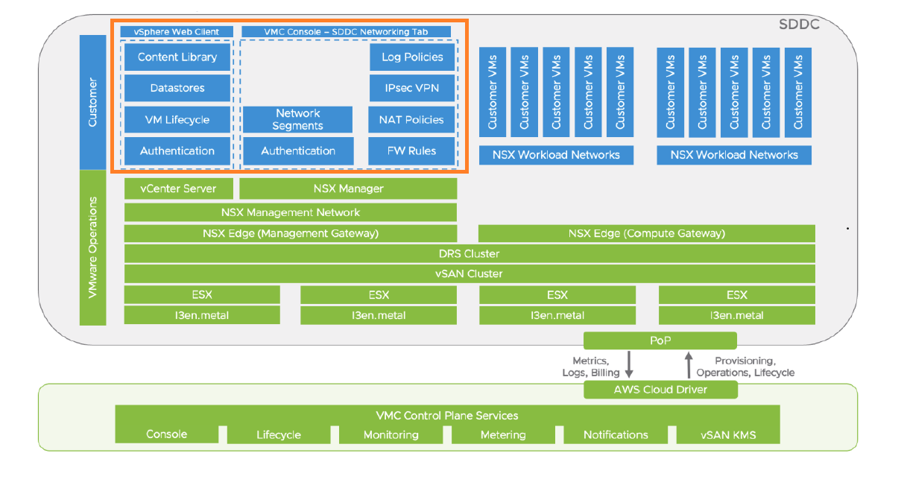
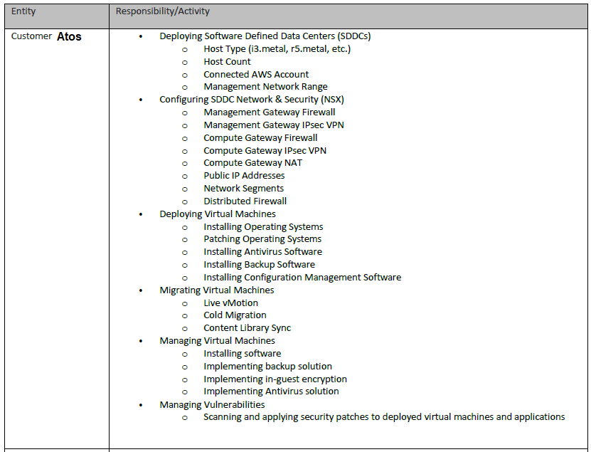

# Shared Responsibility with VMC on AWS

## Table of Contents

- [Shared Responsibility with VMC on AWS](#shared-responsibility-with-vmc-on-aws)
  - [Table of Contents](#table-of-contents)
  - [Changelog](#changelog)
  - [Introduction](#introduction)
  - [Scope](#scope)

## Changelog

| Date       | Author        | Issue     | Description       |
| ---------- | ------------- | --------- | ----------------- |
| 17.10.2023 | Aroop Sethi   | VCS-10646 | Document Creation |

## Introduction

This document is to to understand the shared responsibilities with VMC on AWS.

## Scope

Based on the **Shared Responsibility Model** Overview [Refer attached document](https://www.vmware.com/content/dam/digitalmarketing/vmware/en/pdf/products/vmc-aws/vmware-shared-responsibility-model-overview-vmware-cloud-on-aws.pdf), The **VMware Cloud on AWS** Software Defined Data Center includes **management inventory** that is operated by VMware along with inventory that is operated by the customer.
  Refer **SDDC Inventory Responsibilities Diagram** below with color codes the SDDC inventory to help clarify the shared responsibility model with customer responsibilities (ATOS) represented in green and VMware responsibilities represented in dark blue. &ensp;

**Shared Responsibility Matrix** details on the shared responsibility model employed by VMware Cloud on AWS can be found in the table below.

Vulnerabilities related to **SDDC, and infrastructure** are collaboratively remediated by VMWare and AWS. Please refer to the [document](https://docs.vmware.com/en/VMware-Cloud-on-AWS/solutions/VMware-Cloud-on-AWS.39646badb412ba21bd6770ef62ae00a2/GUID-31CC90E5EB22075B2313FA674D567F2A.html)

**NOTE:** Customer VMs need to be managed by ATOS Team.
